[](https://programmercarl.com/other/xunlianying.html)

**《代码随想录》作者：**[**程序员Carl**](https://github.com/youngyangyang04)

- 代码随想录[官网（网站持续更新优化内容，建议直接看网站）](https://www.programmercarl.com/)：www.programmercarl.com
- 代码随想录[Github开源地址](https://github.com/youngyangyang04/leetcode-master)
- [代码随想录算法公开课](https://programmercarl.com/other/gongkaike.html)，代码随想录的全部内容将由我（[程序员Carl](https://github.com/youngyangyang04)）视频讲解并开免费开放给大家。
- [《代码随想录》](https://programmercarl.com/other/publish.html)已经出版。
- [代码随想录知识星球](https://programmercarl.com/other/kstar.html)上万录友在这里学习
- [代码随想录算法训练营](https://programmercarl.com/other/xunlianying.html)帮助录友高效刷完代码随想录。
- 微信公众号：[代码随想录](https://img-blog.csdnimg.cn/74f47bc466234462bd2acc3ba6cd1b70.png)
- 组队刷题，可以添加[代码随想录官方微信](https://www.programmercarl.com/other/wechat.html)
- ACM模式练习，推荐：[卡码网](https://kamacoder.com/)

**特别提示**：PDF仅提供`C++`语言版本同时PDF中很多动图无法加载，其他编程语言版本和查看动图可以移步至代码随想录官方网站查看。

# 1. 数组理论基础

数组是非常基础的数据结构，在面试中，考察数组的题目一般在思维上都不难，主要是考察对代码的掌控能力

也就是说，想法很简单，但实现起来 可能就不是那么回事了。

首先要知道数组在内存中的存储方式，这样才能真正理解数组相关的面试题

**数组是存放在连续内存空间上的相同类型数据的集合。**

数组可以方便的通过下标索引的方式获取到下标下对应的数据。

举一个字符数组的例子，如图所示：

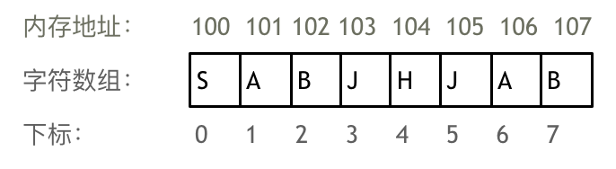

需要两点注意的是

- **数组下标都是从0开始的。**
- **数组内存空间的地址是连续的**

正是**因为数组的在内存空间的地址是连续的，所以我们在删除或者增添元素的时候，就难免要移动其他元素的地** **址。**

例如删除下标为3的元素，需要对下标为3的元素后面的所有元素都要做移动操作，如图所示：

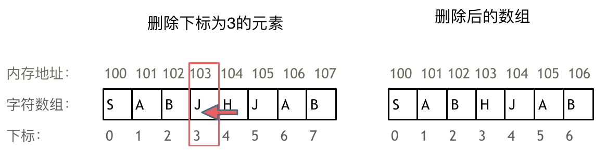

而且大家如果使用`C++`的话，要注意vector 和 array的区别，vector的底层实现是array，严格来讲vector是容器，不是数组。

**数组的元素是不能删的，只能覆盖。**

那么二维数组直接上图，大家应该就知道怎么回事了

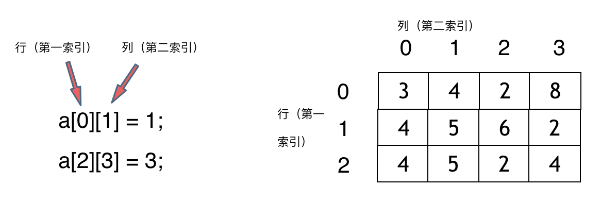

**那么二维数组在内存的空间地址是连续的么？**不同编程语言的内存管理是不一样的，以`C++`为例，在`C++`中二维数组是连续分布的。

我们来做一个实验，`C++`测试代码如下：

```cpp
void test_arr() {
    int array[2][3] = {
    {0, 1, 2},
    {3, 4, 5}
    };
    cout << &array[0][0] << " " << &array[0][1] << " " << &array[0][2] << endl;
    cout << &array[1][0] << " " << &array[1][1] << " " << &array[1][2] << endl;
}
int main() {
    test_arr();
}
```

测试地址为

```text
0x7ffee4065820 0x7ffee4065824 0x7ffee4065828
0x7ffee406582c 0x7ffee4065830 0x7ffee4065834
```

注意地址为16进制，可以看出二维数组地址是连续一条线的。

一些录友可能看不懂内存地址，我就简单介绍一下， 0x7ffee4065820 与 0x7ffee4065824 差了一个4，就是4个字节，因为这是一个int型的数组，所以两个相邻数组元素地址差4个字节。

0x7ffee4065828 与 0x7ffee406582c 也是差了4个字节，在16进制里`8 + 4 = c`，c就是12。

如图：

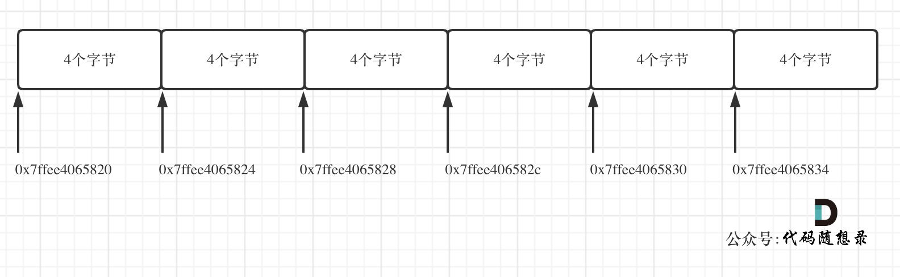

**所以可以看出在C++中二维数组在地址空间上是连续的**。

像Java是没有指针的，同时也不对程序员暴露其元素的地址，寻址操作完全交给虚拟机。

所以看不到每个元素的地址情况，这里我以Java为例，也做一个实验。

```cpp
public static void test_arr() {
    int[][] arr = {{1, 2, 3}, {3, 4, 5}, {6, 7, 8}, {9,9,9}};
    System.out.println(arr[0]);
    System.out.println(arr[1]);
    System.out.println(arr[2]);
    System.out.println(arr[3]);
}
```

输出的地址为：

```text
[I@7852e922
[I@4e25154f
[I@70dea4e
[I@5c647e05
```

这里的数值也是16进制，这不是真正的地址，而是经过处理过后的数值了，我们也可以看出，二维数组的每一行头结点的地址是没有规则的，更谈不上连续。

所以Java的二维数组可能是如下排列的方式：

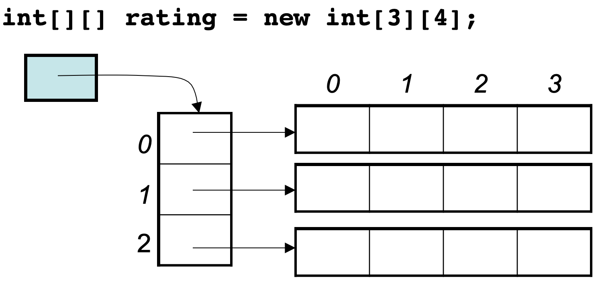

这里面试中数组相关的理论知识就介绍完了。

# 2. 二分查找

[力扣题目链接](https://leetcode.cn/problems/binary-search/)

给定一个 n 个元素有序的（升序）整型数组 nums 和一个目标值 target  ，写一个函数搜索 nums 中的 target，如果目标值存在返回下标，否则返回 -1。

示例 1: 

```text
输入: nums = [-1,0,3,5,9,12], target = 9
输出: 4
解释: 9 出现在 nums 中并且下标为 4
```

示例 2: 

```text
输入: nums = [-1,0,3,5,9,12], target = 2
输出: -1
解释: 2 不存在 nums 中因此返回 -1
```

提示： 

- 你可以假设 nums 中的所有元素是不重复的。
- n 将在 `[1, 10000]`之间。
- nums 的每个元素都将在 `[-9999, 9999]`之间。

## 算法公开课

[**《代码随想录》算法视频公开课**](https://programmercarl.com/other/gongkaike.html)**：**[**手把手带你撕出正确的二分法**](https://www.bilibili.com/video/BV1fA4y1o715)**，相信结合视频再看本篇题解，更有助于大家对本** **题的理解**。

## 思路

**这道题目的前提是数组为有序数组**，同时题目还强调**数组中无重复元素**，因为一旦有重复元素，使用二分查找法返回的元素下标可能不是唯一的，这些都是使用二分法的前提条件，当大家看到题目描述满足如上条件的时候，可要想一想是不是可以用二分法了。

```text
二分查找涉及的很多的边界条件，逻辑比较简单，但就是写不好。例如到底是 while(left < right) 还是
while(left <= right) ，到底是right = middle 呢，还是要right = middle - 1 呢？
```

大家写二分法经常写乱，主要是因为**对区间的定义没有想清楚，区间的定义就是不变量**。要在二分查找的过程中，保持不变量，就是在while寻找中每一次边界的处理都要坚持根据区间的定义来操作，这就是**循环不变量**规则。

写二分法，区间的定义一般为两种，左闭右闭即`[left, right]`，或者左闭右开即`[left, right)`。

下面我用这两种区间的定义分别讲解两种不同的二分写法。

### 二分法第一种写法

第一种写法，我们定义 target 是在一个在左闭右闭的区间里，**也就是[left, right] （这个很重要非常重要）**。

区间的定义这就决定了二分法的代码应该如何写，**因为定义target在[left, right]区间，所以有如下两点：**

- `while (left <= right)` 要使用 `<=` ，因为`left == right`是有意义的，所以使用 `<=`
- `if (nums[middle] > target) right` 要赋值为 middle - 1，因为当前这个`nums[middle]`一定不是target，那么接下来要查找的左区间结束下标位置就是 middle - 1

例如在数组：1,2,3,4,7,9,10中查找元素2，如图所示：

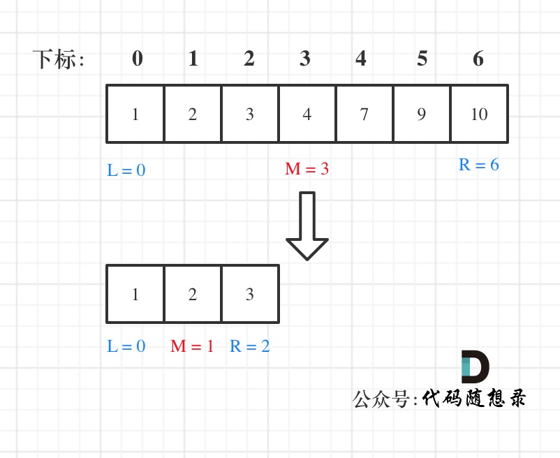

代码如下：（详细注释）

```cpp
// 版本一
class Solution {
public:
    int search(vector<int>& nums, int target) {
        int left = 0;
        int right = nums.size() - 1; // 定义target在左闭右闭的区间里，[left, right]
        while (left <= right) { // 当left==right，区间[left, right]依然有效，所以用 <=
            int middle = left + ((right - left) / 2);// 防止溢出 等同于(left + right)/2
            if (nums[middle] > target) {
                right = middle - 1; // target 在左区间，所以[left, middle - 1]
            } else if (nums[middle] < target) {
                left = middle + 1; // target 在右区间，所以[middle + 1, right]
            } else { // nums[middle] == target
                return middle; // 数组中找到目标值，直接返回下标
            }
        }
        // 未找到目标值
        return -1;
    }
};
```

- 时间复杂度：`O(log n)`
- 空间复杂度：`O(1)`

### 二分法第二种写法

如果说定义 target 是在一个在左闭右开的区间里，也就是`[left, right)` ，那么二分法的边界处理方式则截然不同。

有如下两点：

- `while (left < right)`，这里使用 `< ,`因为`left == right`在区间`[left, right)`是没有意义的
- `if (nums[middle] > target) right` 更新为 middle，因为当前`nums[middle]`不等于target，去左区间继续寻找，而寻找区间是左闭右开区间，所以right更新为middle，即：下一个查询区间不会去比较`nums[middle]`

在数组：1,2,3,4,7,9,10中查找元素2，如图所示：（**注意和方法一的区别**）

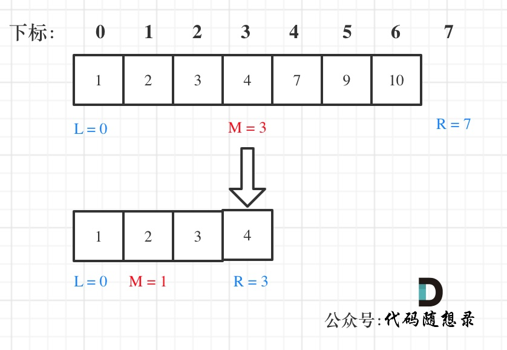

代码如下：（详细注释）

```cpp
// 版本二
class Solution {
public:
    int search(vector<int>& nums, int target) {
        int left = 0;
        int right = nums.size(); // 定义target在左闭右开的区间里，即：[left, right)
        while (left < right) { // 因为left == right的时候，在[left, right)是无效的空间，所以
使用 <
            int middle = left + ((right - left) >> 1);
            if (nums[middle] > target) {
                right = middle; // target 在左区间，在[left, middle)中
            } else if (nums[middle] < target) {
                left = middle + 1; // target 在右区间，在[middle + 1, right)中
            } else { // nums[middle] == target
                return middle; // 数组中找到目标值，直接返回下标
            }
        }
        // 未找到目标值
        return -1;
    }
};
```

- 时间复杂度：`O(log n)`
- 空间复杂度：`O(1)`

## 总结

二分法是非常重要的基础算法，为什么很多同学对于二分法都是**一看就会，一写就废**？

其实主要就是对区间的定义没有理解清楚，在循环中没有始终坚持根据查找区间的定义来做边界处理。

区间的定义就是不变量，那么在循环中坚持根据查找区间的定义来做边界处理，就是循环不变量规则。

本篇根据两种常见的区间定义，给出了两种二分法的写法，每一个边界为什么这么处理，都根据区间的定义做了详细介绍。

相信看完本篇应该对二分法有更深刻的理解了。

## 相关题目推荐

- [35.搜索插入位置](https://programmercarl.com/0035.%E6%90%9C%E7%B4%A2%E6%8F%92%E5%85%A5%E4%BD%8D%E7%BD%AE.html)
- [34.在排序数组中查找元素的第一个和最后一个位置](https://programmercarl.com/0034.%E5%9C%A8%E6%8E%92%E5%BA%8F%E6%95%B0%E7%BB%84%E4%B8%AD%E6%9F%A5%E6%89%BE%E5%85%83%E7%B4%A0%E7%9A%84%E7%AC%AC%E4%B8%80%E4%B8%AA%E5%92%8C%E6%9C%80%E5%90%8E%E4%B8%80%E4%B8%AA%E4%BD%8D%E7%BD%AE.html)
- [69.x 的平方根](https://leetcode.cn/problems/sqrtx/)
- [367.有效的完全平方数](https://leetcode.cn/problems/valid-perfect-square/)

# 3. 移除元素

[力扣题目链接](https://leetcode.cn/problems/remove-element/)

给你一个数组 nums 和一个值 val，你需要 原地 移除所有数值等于 val 的元素，并返回移除后数组的新长度。

不要使用额外的数组空间，你必须仅使用 `O(1)` 额外空间并**原地**修改输入数组。

元素的顺序可以改变。你不需要考虑数组中超出新长度后面的元素。

示例 1:给定 `nums = [3,2,2,3], val = 3,`函数应该返回新的长度 2, 并且 nums 中的前两个元素均为 2。你不需要考虑数组中超出新长度后面的元素。

示例 2:给定 `nums = [0,1,2,2,3,0,4,2], val = 2,`函数应该返回新的长度 5, 并且 nums 中的前五个元素为 0, 1, 3, 0, 4。

**你不需要考虑数组中超出新长度后面的元素。**

## 算法公开课

[**《代码随想录》算法视频公开课**](https://programmercarl.com/other/gongkaike.html)**：**[**数组中移除元素并不容易！LeetCode：27. 移除元素**](https://www.bilibili.com/video/BV12A4y1Z7LP)**，相信结合视频再看本篇** **题解，更有助于大家对本题的理解**。

## 思路

有的同学可能说了，多余的元素，删掉不就得了。

**要知道数组的元素在内存地址中是连续的，不能单独删除数组中的某个元素，只能覆盖。**

数组的基础知识可以看这里[程序员算法面试中，必须掌握的数组理论知识](https://programmercarl.com/%E6%95%B0%E7%BB%84%E7%90%86%E8%AE%BA%E5%9F%BA%E7%A1%80.html)。

### 暴力解法

这个题目暴力的解法就是两层for循环，一个for循环遍历数组元素 ，第二个for循环更新数组。

删除过程如下：

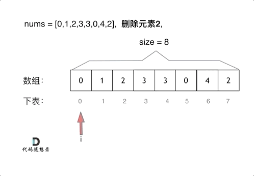

很明显暴力解法的时间复杂度是`O(n^2)`，这道题目暴力解法在leetcode上是可以过的。

代码如下：

```cpp
// 时间复杂度：O(n^2)
// 空间复杂度：O(1)
class Solution {
public:
    int removeElement(vector<int>& nums, int val) {
        int size = nums.size();
        for (int i = 0; i < size; i++) {
            if (nums[i] == val) { // 发现需要移除的元素，就将数组集体向前移动一位
                for (int j = i + 1; j < size; j++) {
                    nums[j - 1] = nums[j];
                }
                i--; // 因为下标i以后的数值都向前移动了一位，所以i也向前移动一位
                size--; // 此时数组的大小-1
            }
        }
        return size;
    }
};
```

- 时间复杂度：`O(n^2)`
- 空间复杂度：`O(1)`

### 双指针法

双指针法（快慢指针法）： **通过一个快指针和慢指针在一个for循环下完成两个for循环的工作。**

定义快慢指针

- 快指针：寻找新数组的元素 ，新数组就是不含有目标元素的数组
- 慢指针：指向更新 新数组下标的位置

很多同学这道题目做的很懵，就是不理解 快慢指针究竟都是什么含义，所以一定要明确含义，后面的思路就更容易理解了。

删除过程如下：

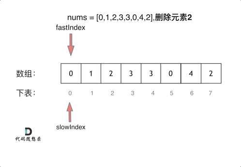

很多同学不了解

**双指针法（快慢指针法）在数组和链表的操作中是非常常见的，很多考察数组、链表、字符串等操作的面试题，都** **使用双指针法。**

后续都会一一介绍到，本题代码如下：

```cpp
// 时间复杂度：O(n)
// 空间复杂度：O(1)
class Solution {
public:
    int removeElement(vector<int>& nums, int val) {
        int slowIndex = 0;
        for (int fastIndex = 0; fastIndex < nums.size(); fastIndex++) {
            if (val != nums[fastIndex]) {
                nums[slowIndex++] = nums[fastIndex];
            }
        }
        return slowIndex;
    }
};
```

注意这些实现方法并没有改变元素的相对位置！

- 时间复杂度：`O(n)`
- 空间复杂度：`O(1)`

```cpp
/**
* 相向双指针方法，基于元素顺序可以改变的题目描述改变了元素相对位置，确保了移动最少元素
* 时间复杂度：O(n)
* 空间复杂度：O(1)
*/
class Solution {
public:
    int removeElement(vector<int>& nums, int val) {
        int leftIndex = 0;
        int rightIndex = nums.size() - 1;
        while (leftIndex <= rightIndex) {
            // 找左边等于val的元素
            while (leftIndex <= rightIndex && nums[leftIndex] != val){
                ++leftIndex;
            }
            // 找右边不等于val的元素
            while (leftIndex <= rightIndex && nums[rightIndex] == val) {
                -- rightIndex;
            }
            // 将右边不等于val的元素覆盖左边等于val的元素
            if (leftIndex < rightIndex) {
                nums[leftIndex++] = nums[rightIndex--];
            }
        }
        return leftIndex;   // leftIndex一定指向了最终数组末尾的下一个元素
    }
};
```

## 相关题目推荐

- [26.删除排序数组中的重复项](https://leetcode.cn/problems/remove-duplicates-from-sorted-array/)
- [283.移动零](https://leetcode.cn/problems/move-zeroes/)
- [844.比较含退格的字符串](https://leetcode.cn/problems/backspace-string-compare/)
- [977.有序数组的平方](https://leetcode.cn/problems/squares-of-a-sorted-array/)

双指针风骚起来，也是无敌

# 4.有序数组的平方

[力扣题目链接](https://leetcode.cn/problems/squares-of-a-sorted-array/)

给你一个按 非递减顺序 排序的整数数组 nums，返回 每个数字的平方 组成的新数组，要求也按 非递减顺序 排序。

示例 1：

- 输入：`nums = [-4,-1,0,3,10]`
- 输出：`[0,1,9,16,100]`
- 解释：平方后，数组变为 `[16,1,0,9,100]`，排序后，数组变为 `[0,1,9,16,100]`  
示例 2：

- 输入：`nums = [-7,-3,2,3,11]`
- 输出：`[4,9,9,49,121]`

## 算法公开课

[**《代码随想录》算法视频公开课**](https://programmercarl.com/other/gongkaike.html)**：**[**双指针法经典题目!LeetCode:977.有序数组的平方**](https://www.bilibili.com/video/BV1QB4y1D7ep)**，相信结合视频再看本篇题** **解，更有助于大家对本题的理解**。

## 思路

### 暴力排序

最直观的想法，莫过于：每个数平方之后，排个序，美滋滋，代码如下：

```cpp
class Solution {
public:
    vector<int> sortedSquares(vector<int>& A) {
        for (int i = 0; i < A.size(); i++) {
            A[i] *= A[i];
        }
        sort(A.begin(), A.end()); // 快速排序
        return A;
    }
};
```

这个时间复杂度是 `O(n + nlogn)`， 可以说是`O(nlogn)`的时间复杂度，但为了和下面双指针法算法时间复杂度有鲜明对比，我记为 `O(n + nlog n)`。

### 双指针法

数组其实是有序的， 只不过负数平方之后可能成为最大数了。

那么数组平方的最大值就在数组的两端，不是最左边就是最右边，不可能是中间。

此时可以考虑双指针法了，i指向起始位置，j指向终止位置。

定义一个新数组result，和A数组一样的大小，让k指向result数组终止位置。

```cpp
如果A[i] * A[i] < A[j] * A[j]  那么result[k--] = A[j] * A[j];  。
如果A[i] * A[i] >= A[j] * A[j] 那么result[k--] = A[i] * A[i]; 。
```

如动画所示：

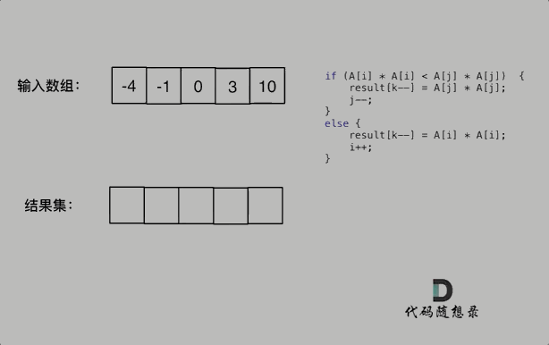

不难写出如下代码：

```cpp
class Solution {
public:
    vector<int> sortedSquares(vector<int>& A) {
        int k = A.size() - 1;
        vector<int> result(A.size(), 0);
        for (int i = 0, j = A.size() - 1; i <= j;) { // 注意这里要i <= j，因为最后要处理两个
元素
            if (A[i] * A[i] < A[j] * A[j])  {
                result[k--] = A[j] * A[j];
                j--;
            }
            else {
                result[k--] = A[i] * A[i];
                i++;
            }
        }
        return result;
    }
};
```

此时的时间复杂度为`O(n)`，相对于暴力排序的解法`O(n + nlog n)`还是提升不少的。

**这里还是说一下，大家不必太在意leetcode上执行用时，打败多少多少用户，这个就是一个玩具，非常不准确。**

做题的时候自己能分析出来时间复杂度就可以了，至于leetcode上执行用时，大概看一下就行，只要达到最优的时间复杂度就可以了，一样的代码多提交几次可能就击败百分之百了.....

# 5.长度最小的子数组

[力扣题目链接](https://leetcode.cn/problems/minimum-size-subarray-sum/)

给定一个含有 n 个正整数的数组和一个正整数 s ，找出该数组中满足其和 ≥ s 的长度最小的 连续 子数组，并返回其长度。如果不存在符合条件的子数组，返回 0。

示例：

- 输入：`s = 7, nums = [2,3,1,2,4,3]`
- 输出：2
- 解释：子数组 `[4,3]` 是该条件下的长度最小的子数组。

提示：

- `1 <= target <= 10^9`
- `1 <= nums.length <= 10^5`
- `1 <= nums[i] <= 10^5`

## 算法公开课

[**《代码随想录》算法视频公开课**](https://programmercarl.com/other/gongkaike.html)**：**[**拿下滑动窗口！ | LeetCode 209 长度最小的子数组**](https://www.bilibili.com/video/BV1tZ4y1q7XE)**，相信结合视频再看本篇题** **解，更有助于大家对本题的理解**。

## 思路

### 暴力解法

这道题目暴力解法当然是 两个for循环，然后不断的寻找符合条件的子序列，时间复杂度很明显是`O(n^2)`。 

代码如下：

```cpp
class Solution {
public:
    int minSubArrayLen(int s, vector<int>& nums) {
        int result = INT32_MAX; // 最终的结果
        int sum = 0; // 子序列的数值之和
        int subLength = 0; // 子序列的长度
        for (int i = 0; i < nums.size(); i++) { // 设置子序列起点为i
            sum = 0;
            for (int j = i; j < nums.size(); j++) { // 设置子序列终止位置为j
                sum += nums[j];
                if (sum >= s) { // 一旦发现子序列和超过了s，更新result
                    subLength = j - i + 1; // 取子序列的长度
                    result = result < subLength ? result : subLength;
                    break; // 因为我们是找符合条件最短的子序列，所以一旦符合条件就break
                }
            }
        }
        // 如果result没有被赋值的话，就返回0，说明没有符合条件的子序列
        return result == INT32_MAX ? 0 : result;
    }
};
```

- 时间复杂度：`O(n^2)`
- 空间复杂度：`O(1)` 

后面力扣更新了数据，暴力解法已经超时了。

### 滑动窗口

接下来就开始介绍数组操作中另一个重要的方法：**滑动窗口**。

所谓滑动窗口，**就是不断的调节子序列的起始位置和终止位置，从而得出我们要想的结果**。

在暴力解法中，是一个for循环滑动窗口的起始位置，一个for循环为滑动窗口的终止位置，用两个for循环 完成了一个不断搜索区间的过程。 

那么滑动窗口如何用一个for循环来完成这个操作呢。 

首先要思考 如果用一个for循环，那么应该表示 滑动窗口的起始位置，还是终止位置。 

如果只用一个for循环来表示 滑动窗口的起始位置，那么如何遍历剩下的终止位置？ 

此时难免再次陷入 暴力解法的怪圈。 

所以 只用一个for循环，那么这个循环的索引，一定是表示 滑动窗口的终止位置。 

那么问题来了， 滑动窗口的起始位置如何移动呢？ 

这里还是以题目中的示例来举例，`s=7`， 数组是 2，3，1，2，4，3，来看一下查找的过程：

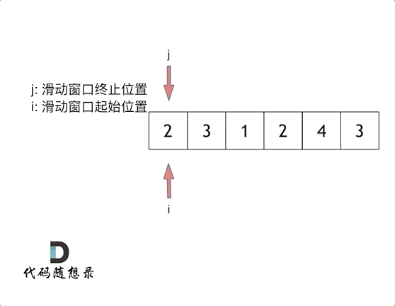

最后找到 4，3 是最短距离。

其实从动画中可以发现滑动窗口也可以理解为双指针法的一种！只不过这种解法更像是一个窗口的移动，所以叫做滑动窗口更适合一些。

在本题中实现滑动窗口，主要确定如下三点：

- 窗口内是什么？
- 如何移动窗口的起始位置？
- 如何移动窗口的结束位置？

窗口就是 满足其和 ≥ s 的长度最小的 连续 子数组。

窗口的起始位置如何移动：如果当前窗口的值大于s了，窗口就要向前移动了（也就是该缩小了）。

窗口的结束位置如何移动：窗口的结束位置就是遍历数组的指针，也就是for循环里的索引。

解题的关键在于 窗口的起始位置如何移动，如图所示：

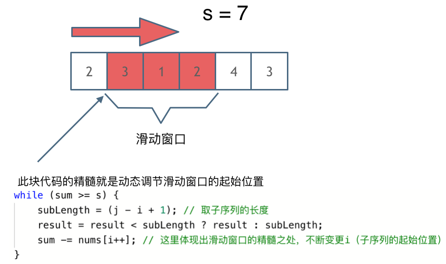

可以发现**滑动窗口的精妙之处在于根据当前子序列和大小的情况，不断调节子序列的起始位置。从而将O(n^2)暴力** **解法降为O(n)。**

`C++`代码如下：

```cpp
class Solution {
public:
    int minSubArrayLen(int s, vector<int>& nums) {
        int result = INT32_MAX;
        int sum = 0; // 滑动窗口数值之和
        int i = 0; // 滑动窗口起始位置
        int subLength = 0; // 滑动窗口的长度
        for (int j = 0; j < nums.size(); j++) {
            sum += nums[j];
            // 注意这里使用while，每次更新 i（起始位置），并不断比较子序列是否符合条件
            while (sum >= s) {
                subLength = (j - i + 1); // 取子序列的长度
                result = result < subLength ? result : subLength;
                sum -= nums[i++]; // 这里体现出滑动窗口的精髓之处，不断变更i（子序列的起始位置）
            }
        }
        // 如果result没有被赋值的话，就返回0，说明没有符合条件的子序列
        return result == INT32_MAX ? 0 : result;
    }
};
```

- 时间复杂度：`O(n)`
- 空间复杂度：`O(1)` **一些录友会疑惑为什么时间复杂度是O(n)**。

不要以为for里放一个while就以为是`O(n^2)`啊， 主要是看每一个元素被操作的次数，每个元素在滑动窗后进来操作一次，出去操作一次，每个元素都是被操作两次，所以时间复杂度是 2 × n 也就是`O(n)`。

## 相关题目推荐

- [904.水果成篮](https://leetcode.cn/problems/fruit-into-baskets/)
- [76.最小覆盖子串](https://leetcode.cn/problems/minimum-window-substring/)

# 6.螺旋矩阵II

[力扣题目链接](https://leetcode.cn/problems/spiral-matrix-ii/)

给定一个正整数 n，生成一个包含 1 到 n^2 所有元素，且元素按顺时针顺序螺旋排列的正方形矩阵。

示例:

输入: 3  
输出: `[`  `[ 1, 2, 3 ],`  `[ 8, 9, 4 ],`  `[ 7, 6, 5 ]` `]`

## 算法公开课

[**《代码随想录》算法视频公开课**](https://programmercarl.com/other/gongkaike.html)**：**[**拿下螺旋矩阵！LeetCode：59.螺旋矩阵II**](https://www.bilibili.com/video/BV1SL4y1N7mV)**，相信结合视频再看本篇题解，更有** **助于大家对本题的理解**。

## 思路

这道题目可以说在面试中出现频率较高的题目，**本题并不涉及到什么算法，就是模拟过程，但却十分考察对代码的** **掌控能力。**

要如何画出这个螺旋排列的正方形矩阵呢？

相信很多同学刚开始做这种题目的时候，上来就是一波判断猛如虎。

结果运行的时候各种问题，然后开始各种修修补补，最后发现改了这里那里有问题，改了那里这里又跑不起来了。

大家还记得我们在这篇文章[数组：每次遇到二分法，都是一看就会，一写就废](https://programmercarl.com/0704.%E4%BA%8C%E5%88%86%E6%9F%A5%E6%89%BE.html)中讲解了二分法，提到如果要写出正确的二分法一定要坚持**循环不变量原则**。

而求解本题依然是要坚持循环不变量原则。

模拟顺时针画矩阵的过程:

- 填充上行从左到右
- 填充右列从上到下
- 填充下行从右到左

- 填充左列从下到上

由外向内一圈一圈这么画下去。

可以发现这里的边界条件非常多，在一个循环中，如此多的边界条件，如果不按照固定规则来遍历，那就是**一进循** **环深似海，从此offer是路人**。

这里一圈下来，我们要画每四条边，这四条边怎么画，每画一条边都要坚持一致的左闭右开，或者左开右闭的原则，这样这一圈才能按照统一的规则画下来。

那么我按照左闭右开的原则，来画一圈，大家看一下：

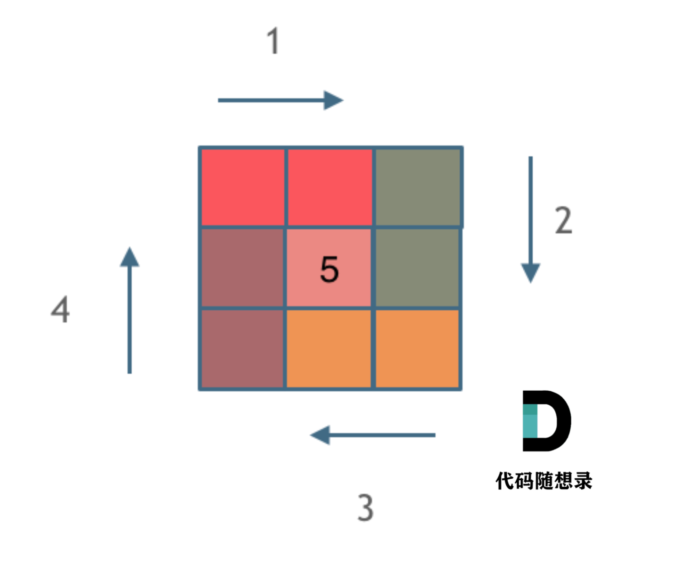

这里每一种颜色，代表一条边，我们遍历的长度，可以看出每一个拐角处的处理规则，拐角处让给新的一条边来继续画。

这也是坚持了每条边左闭右开的原则。

一些同学做这道题目之所以一直写不好，代码越写越乱。

就是因为在画每一条边的时候，一会左开右闭，一会左闭右闭，一会又来左闭右开，岂能不乱。

代码如下，已经详细注释了每一步的目的，可以看出while循环里判断的情况是很多的，代码里处理的原则也是统一的左闭右开。

整体`C++`代码如下：

```cpp
class Solution {
public:
    vector<vector<int>> generateMatrix(int n) {
        vector<vector<int>> res(n, vector<int>(n, 0)); // 使用vector定义一个二维数组
        int startx = 0, starty = 0; // 定义每循环一个圈的起始位置
        int loop = n / 2; // 每个圈循环几次，例如n为奇数3，那么loop = 1 只是循环一圈，矩阵中间的
值需要单独处理
        int mid = n / 2; // 矩阵中间的位置，例如：n为3， 中间的位置就是(1，1)，n为5，中间位置为
(2, 2)
        int count = 1; // 用来给矩阵中每一个空格赋值
        int offset = 1; // 需要控制每一条边遍历的长度，每次循环右边界收缩一位
        int i,j;
        while (loop --) {
            i = startx;
            j = starty;
            // 下面开始的四个for就是模拟转了一圈
            // 模拟填充上行从左到右(左闭右开)
            for (j = starty; j < n - offset; j++) {
                res[startx][j] = count++;
            }
            // 模拟填充右列从上到下(左闭右开)
            for (i = startx; i < n - offset; i++) {
                res[i][j] = count++;
            }
            // 模拟填充下行从右到左(左闭右开)
            for (; j > starty; j--) {
                res[i][j] = count++;
            }
            // 模拟填充左列从下到上(左闭右开)
            for (; i > startx; i--) {
                res[i][j] = count++;
            }
            // 第二圈开始的时候，起始位置要各自加1， 例如：第一圈起始位置是(0, 0)，第二圈起始位置是
(1, 1)
            startx++;
            starty++;
            // offset 控制每一圈里每一条边遍历的长度
            offset += 1;
        }
        // 如果n为奇数的话，需要单独给矩阵最中间的位置赋值
        if (n % 2) {
            res[mid][mid] = count;
        }
        return res;
    }
};
```

- 时间复杂度 `O(n^2):` 模拟遍历二维矩阵的时间
- 空间复杂度 `O(1)`

## 类似题目

- [54.螺旋矩阵](https://leetcode.cn/problems/spiral-matrix/)
- [剑指Offer 29.顺时针打印矩阵](https://leetcode.cn/problems/shun-shi-zhen-da-yin-ju-zhen-lcof/)

# 7. 数组总结篇

## 数组理论基础

数组是非常基础的数据结构，在面试中，考察数组的题目一般在思维上都不难，主要是考察对代码的掌控能力

也就是说，想法很简单，但实现起来 可能就不是那么回事了。

首先要知道数组在内存中的存储方式，这样才能真正理解数组相关的面试题

**数组是存放在连续内存空间上的相同类型数据的集合。**

数组可以方便的通过下标索引的方式获取到下标下对应的数据。

举一个字符数组的例子，如图所示：


需要两点注意的是

- **数组下标都是从0开始的。**
- **数组内存空间的地址是连续的**

正是**因为数组的在内存空间的地址是连续的，所以我们在删除或者增添元素的时候，就难免要移动其他元素的地** **址。**

例如删除下标为3的元素，需要对下标为3的元素后面的所有元素都要做移动操作，如图所示：


而且大家如果使用`C++`的话，要注意vector 和 array的区别，vector的底层实现是array，严格来讲vector是容器，不是数组。

**数组的元素是不能删的，只能覆盖。**

那么二维数组直接上图，大家应该就知道怎么回事了


**那么二维数组在内存的空间地址是连续的么？**

```cpp
我们来举一个Java的例子，例如： int[][] rating = new int[3][4]; ， 这个二维数组在内存空间可不是一个
3*4 的连续地址空间
```

看了下图，就应该明白了：


```text
所以Java的二维数组在内存中不是 3*4 的连续地址空间，而是四条连续的地址空间组成！
```

## 数组的经典题目

在面试中，数组是必考的基础数据结构。

其实数组的题目在思想上一般比较简单的，但是如果想高效，并不容易。

我们之前一共讲解了四道经典数组题目，每一道题目都代表一个类型，一种思想。

### 二分法

[数组：每次遇到二分法，都是一看就会，一写就废](https://programmercarl.com/0704.%E4%BA%8C%E5%88%86%E6%9F%A5%E6%89%BE.html)

这道题目呢，考察数组的基本操作，思路很简单，但是通过率在简单题里并不高，不要轻敌。

可以使用暴力解法，通过这道题目，如果追求更优的算法，建议试一试用二分法，来解决这道题目

- 暴力解法时间复杂度：`O(n)`
- 二分法时间复杂度：`O(logn)`

在这道题目中我们讲到了**循环不变量原则**，只有在循环中坚持对区间的定义，才能清楚的把握循环中的各种细节。

**二分法是算法面试中的常考题，建议通过这道题目，锻炼自己手撕二分的能力**。

### 双指针法

- [数组：就移除个元素很难么？](https://programmercarl.com/0027.%E7%A7%BB%E9%99%A4%E5%85%83%E7%B4%A0.html)

双指针法（快慢指针法）：**通过一个快指针和慢指针在一个for循环下完成两个for循环的工作。**

- 暴力解法时间复杂度：`O(n^2)`
- 双指针时间复杂度：`O(n)`

这道题目迷惑了不少同学，纠结于数组中的元素为什么不能删除，主要是因为以下两点：

- 数组在内存中是连续的地址空间，不能释放单一元素，如果要释放，就是全释放（程序运行结束，回收内存栈空间）。
- `C++`中vector和array的区别一定要弄清楚，vector的底层实现是array，封装后使用更友好。

双指针法（快慢指针法）在数组和链表的操作中是非常常见的，很多考察数组和链表操作的面试题，都使用双指针法。

### 滑动窗口

- [数组：滑动窗口拯救了你](https://programmercarl.com/0209.%E9%95%BF%E5%BA%A6%E6%9C%80%E5%B0%8F%E7%9A%84%E5%AD%90%E6%95%B0%E7%BB%84.html)

本题介绍了数组操作中的另一个重要思想：滑动窗口。

- 暴力解法时间复杂度：`O(n^2)`
- 滑动窗口时间复杂度：`O(n)`

本题中，主要要理解滑动窗口如何移动 窗口起始位置，达到动态更新窗口大小的，从而得出长度最小的符合条件的长度。

**滑动窗口的精妙之处在于根据当前子序列和大小的情况，不断调节子序列的起始位置。从而将O(n^2)的暴力解法降** **为O(n)。**

如果没有接触过这一类的方法，很难想到类似的解题思路，滑动窗口方法还是很巧妙的。

### 模拟行为

- [数组：这个循环可以转懵很多人！](https://programmercarl.com/0059.%E8%9E%BA%E6%97%8B%E7%9F%A9%E9%98%B5II.html)

模拟类的题目在数组中很常见，不涉及到什么算法，就是单纯的模拟，十分考察大家对代码的掌控能力。

在这道题目中，我们再一次介绍到了**循环不变量原则**，其实这也是写程序中的重要原则。

相信大家有遇到过这种情况： 感觉题目的边界调节超多，一波接着一波的判断，找边界，拆了东墙补西墙，好不容易运行通过了，代码写的十分冗余，毫无章法，其实**真正解决题目的代码都是简洁的，或者有原则性的**，大家可以在这道题目中体会到这一点。

## 总结

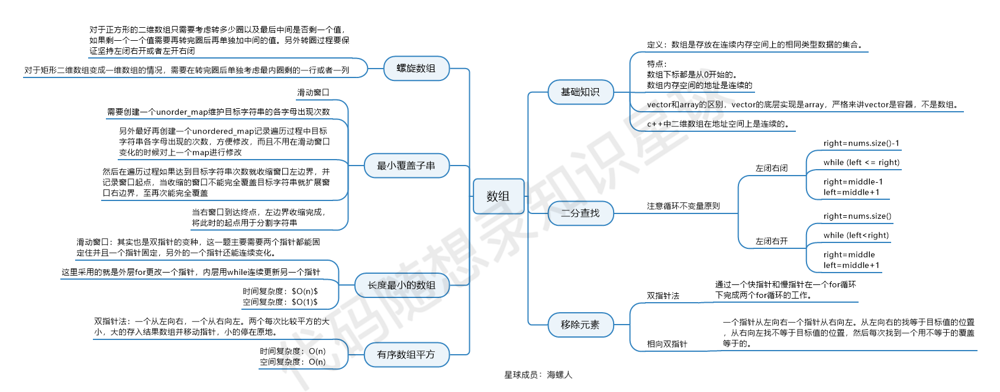

这个图是 [代码随想录知识星球](https://programmercarl.com/other/kstar.html) 成员：[海螺人](https://wx.zsxq.com/dweb2/index/footprint/844412858822412)，所画，总结的非常好，分享给大家。

从二分法到双指针，从滑动窗口到螺旋矩阵，相信如果大家真的认真做了「代码随想录」每日推荐的题目，定会有所收获。

推荐的题目即使大家之前做过了，再读一遍文章，也会帮助你提炼出解题的精髓所在。
