[](https://programmercarl.com/other/xunlianying.html)

**《代码随想录》作者：**[**程序员Carl**](https://github.com/youngyangyang04)

- 代码随想录官网[（网站持续更新优化内容，建议直接看网站）](https://www.programmercarl.com/)：www.programmercarl.com
- 代码随想录[Github开源地址](https://github.com/youngyangyang04/leetcode-master)
- [代码随想录算法公开课](https://programmercarl.com/other/gongkaike.html)，代码随想录的全部内容将由我（[程序员Carl](https://github.com/youngyangyang04)）视频讲解并开免费开放给大家。
- [《代码随想录》](https://programmercarl.com/other/publish.html) 已经出版。
- [代码随想录知识星球](https://programmercarl.com/other/kstar.html) 上万录友在这里学习
- [代码随想录算法训练营](https://programmercarl.com/other/xunlianying.html) 帮助录友高效刷完代码随想录。
- 微信公众号：[代码随想录](https://img-blog.csdnimg.cn/74f47bc466234462bd2acc3ba6cd1b70.png)
- 组队刷题，可以添加[代码随想录官方微信](https://www.programmercarl.com/other/wechat.html)
- ACM模式练习，推荐：[卡码网](https://kamacoder.com/)

**特别提示**：PDF仅提供`C++`语言版本同时PDF中很多动图无法加载，其他编程语言版本和查看动图可以移步至代码随想录官方网站查看。

# 1. 动态规划理论基础

动态规划刷题大纲

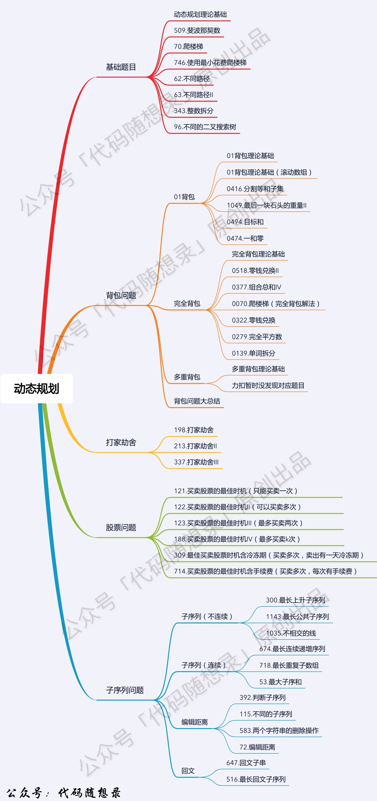


## 算法公开课

[**《代码随想录》算法视频公开课**](https://programmercarl.com/other/gongkaike.html)**：**[**动态规划理论基础**](https://www.bilibili.com/video/BV13Q4y197Wg)**，相信结合视频再看本篇题解，更有助于大家对本题的理解**。

## 什么是动态规划

动态规划，英文：Dynamic Programming，简称DP，如果某一问题有很多重叠子问题，使用动态规划是最有效的。

所以动态规划中每一个状态一定是由上一个状态推导出来的，**这一点就区分于贪心**，贪心没有状态推导，而是从局部直接选最优的，

在[关于贪心算法，你该了解这些！](https://programmercarl.com/%E8%B4%AA%E5%BF%83%E7%AE%97%E6%B3%95%E7%90%86%E8%AE%BA%E5%9F%BA%E7%A1%80.html)中我举了一个背包问题的例子。

例如：有N件物品和一个最多能背重量为W 的背包。第i件物品的重量是`weight[i]`，得到的价值是`value[i]` 。**每件物** **品只能用一次**，求解将哪些物品装入背包里物品价值总和最大。

动态规划中`dp[j]`是由`dp[j-weight[i]]`推导出来的，然后取`max(dp[j], dp[j - weight[i]] + value[i])`。

但如果是贪心呢，每次拿物品选一个最大的或者最小的就完事了，和上一个状态没有关系。

所以贪心解决不了动态规划的问题。

**其实大家也不用死扣动规和贪心的理论区别，后面做做题目自然就知道了**。

而且很多讲解动态规划的文章都会讲最优子结构啊和重叠子问题啊这些，这些东西都是教科书的上定义，晦涩难懂而且不实用。

大家知道动规是由前一个状态推导出来的，而贪心是局部直接选最优的，对于刷题来说就够用了。

上述提到的背包问题，后序会详细讲解。

## 动态规划的解题步骤

做动规题目的时候，很多同学会陷入一个误区，就是以为把状态转移公式背下来，照葫芦画瓢改改，就开始写代码，甚至把题目AC之后，都不太清楚`dp[i]`表示的是什么。

**这就是一种朦胧的状态，然后就把题给过了，遇到稍稍难一点的，可能直接就不会了，然后看题解，然后继续照葫** **芦画瓢陷入这种恶性循环中**。

状态转移公式（递推公式）是很重要，但动规不仅仅只有递推公式。

**对于动态规划问题，我将拆解为如下五步曲，这五步都搞清楚了，才能说把动态规划真的掌握了！**

1. 确定dp数组（dp table）以及下标的含义2. 确定递推公式3. dp数组如何初始化4. 确定遍历顺序5. 举例推导dp数组一些同学可能想为什么要先确定递推公式，然后在考虑初始化呢？

**因为一些情况是递推公式决定了dp数组要如何初始化！**

后面的讲解中我都是围绕着这五点来进行讲解。

可能刷过动态规划题目的同学可能都知道递推公式的重要性，感觉确定了递推公式这道题目就解出来了。

其实 确定递推公式 仅仅是解题里的一步而已！

一些同学知道递推公式，但搞不清楚dp数组应该如何初始化，或者正确的遍历顺序，以至于记下来公式，但写的程序怎么改都通过不了。

后序的讲解的大家就会慢慢感受到这五步的重要性了。

## 动态规划应该如何debug

相信动规的题目，很大部分同学都是这样做的。

看一下题解，感觉看懂了，然后照葫芦画瓢，如果能正好画对了，万事大吉，一旦要是没通过，就怎么改都通过不了，对 dp数组的初始化，递推公式，遍历顺序，处于一种黑盒的理解状态。

写动规题目，代码出问题很正常！

**找问题的最好方式就是把dp数组打印出来，看看究竟是不是按照自己思路推导的！**

一些同学对于dp的学习是黑盒的状态，就是不清楚dp数组的含义，不懂为什么这么初始化，递推公式背下来了，遍历顺序靠习惯就是这么写的，然后一鼓作气写出代码，如果代码能通过万事大吉，通过不了的话就凭感觉改一改。

这是一个很不好的习惯！

**做动规的题目，写代码之前一定要把状态转移在dp数组的上具体情况模拟一遍，心中有数，确定最后推出的是想要** **的结果**。

然后再写代码，如果代码没通过就打印dp数组，看看是不是和自己预先推导的哪里不一样。

如果打印出来和自己预先模拟推导是一样的，那么就是自己的递归公式、初始化或者遍历顺序有问题了。

如果和自己预先模拟推导的不一样，那么就是代码实现细节有问题。

**这样才是一个完整的思考过程，而不是一旦代码出问题，就毫无头绪的东改改西改改，最后过不了，或者说是稀里** **糊涂的过了**。

这也是我为什么在动规五步曲里强调推导dp数组的重要性。

举个例子哈：在「代码随想录」刷题小分队微信群里，一些录友可能代码通过不了，会把代码抛到讨论群里问：我这里代码都已经和题解一模一样了，为什么通过不了呢？

发出这样的问题之前，其实可以自己先思考这三个问题：

- 这道题目我举例推导状态转移公式了么？
- 我打印dp数组的日志了么？
- 打印出来了dp数组和我想的一样么？

**如果这灵魂三问自己都做到了，基本上这道题目也就解决了**，或者更清晰的知道自己究竟是哪一点不明白，是状态转移不明白，还是实现代码不知道该怎么写，还是不理解遍历dp数组的顺序。

然后在问问题，目的性就很强了，群里的小伙伴也可以快速知道提问者的疑惑了。

**注意这里不是说不让大家问问题哈， 而是说问问题之前要有自己的思考，问题要问到点子上！**

**大家工作之后就会发现，特别是大厂，问问题是一个专业活，是的，问问题也要体现出专业！**

如果问同事很不专业的问题，同事们会懒的回答，领导也会认为你缺乏思考能力，这对职场发展是很不利的。

所以大家在刷题的时候，就锻炼自己养成专业提问的好习惯。

## 总结

这一篇是动态规划的整体概述，讲解了什么是动态规划，动态规划的解题步骤，以及如何debug。

动态规划是一个很大的领域，今天这一篇讲解的内容是整个动态规划系列中都会使用到的一些理论基础。

在后序讲解中针对某一具体问题，还会讲解其对应的理论基础，例如背包问题中的01背包，leetcode上的题目都是01背包的应用，而没有纯01背包的问题，那么就需要在把对应的理论知识讲解一下。

大家会发现，我讲解的理论基础并不是教科书上各种动态规划的定义，错综复杂的公式。

这里理论基础篇已经是非常偏实用的了，每个知识点都是在解题实战中非常有用的内容，大家要重视起来哈。

今天我们开始新的征程了，你准备好了么？

# 2. 斐波那契数

[力扣题目链接](https://leetcode.cn/problems/fibonacci-number/)

斐波那契数，通常用 `F(n)` 表示，形成的序列称为 斐波那契数列 。该数列由 0 和 1 开始，后面的每一项数字都是前面两项数字的和。也就是：`F(0) = 0`，`F(1) = 1` `F(n) = F(n - 1) + F(n - 2)`，其中 `n > 1`给你n ，请计算 `F(n)` 。

示例 1：

- 输入：2
- 输出：1
- 解释：`F(2) = F(1) + F(0) = 1 + 0 = 1`

示例 2：

- 输入：3
- 输出：2
- 解释：`F(3) = F(2) + F(1) = 1 + 1 = 2`

示例 3：

- 输入：4
- 输出：3
- 解释：`F(4) = F(3) + F(2) = 2 + 1 = 3`

提示：

- `0 <= n <= 30`

## 算法公开课

[**《代码随想录》算法视频公开课**](https://programmercarl.com/other/gongkaike.html)**：**[**手把手带你入门动态规划 | leetcode：509.斐波那契数**](https://www.bilibili.com/video/BV1f5411K7mo)**，相信结合视频在看本** **篇题解，更有助于大家对本题的理解**。

## 思路

斐波那契数列大家应该非常熟悉不过了，非常适合作为动规第一道题目来练练手。

因为这道题目比较简单，可能一些同学并不需要做什么分析，直接顺手一写就过了。

**但「代码随想录」的风格是：简单题目是用来加深对解题方法论的理解的**。

通过这道题目让大家可以初步认识到，按照动规五部曲是如何解题的。

对于动规，如果没有方法论的话，可能简单题目可以顺手一写就过，难一点就不知道如何下手了。

所以我总结的动规五部曲，是要用来贯穿整个动态规划系列的，就像之前讲过[二叉树系列的递归三部曲](https://www.programmercarl.com/%E4%BA%8C%E5%8F%89%E6%A0%91%E7%9A%84%E9%80%92%E5%BD%92%E9%81%8D%E5%8E%86.html)，回溯法系列的回溯三部曲一样。后面慢慢大家就会体会到，动规五部曲方法的重要性。

### 动态规划

动规五部曲：

这里我们要用一个一维dp数组来保存递归的结果

1. 确定dp数组以及下标的含义

`dp[i]`的定义为：第i个数的斐波那契数值是`dp[i]`

2. 确定递推公式

为什么这是一道非常简单的入门题目呢？

**因为题目已经把递推公式直接给我们了：状态转移方程 dp[i] = dp[i - 1] + dp[i - 2];**

3. dp数组如何初始化

**题目中把如何初始化也直接给我们了，如下：**

```cpp
dp[0] = 0;
dp[1] = 1;
```

4. 确定遍历顺序从递归公式`dp[i] = dp[i - 1] + dp[i - 2];`中可以看出，`dp[i]`是依赖 `dp[i - 1]` 和 `dp[i - 2]`，那么遍历的顺序一定是从前到后遍历的5. 举例推导dp数组

按照这个递推公式`dp[i] = dp[i - 1] + dp[i - 2]`，我们来推导一下，当N为10的时候，dp数组应该是如下的数列：

0 1 1 2 3 5 8 13 21 34 55

如果代码写出来，发现结果不对，就把dp数组打印出来看看和我们推导的数列是不是一致的。

以上我们用动规的方法分析完了，`C++`代码如下：

```cpp
class Solution {
public:
    int fib(int N) {
        if (N <= 1) return N;
        vector<int> dp(N + 1);
        dp[0] = 0;
        dp[1] = 1;
        for (int i = 2; i <= N; i++) {
            dp[i] = dp[i - 1] + dp[i - 2];
        }
        return dp[N];
    }
};
```

- 时间复杂度：`O(n)`
- 空间复杂度：`O(n)`

当然可以发现，我们只需要维护两个数值就可以了，不需要记录整个序列。

代码如下：

```cpp
class Solution {
public:
    int fib(int N) {
        if (N <= 1) return N;
        int dp[2];
        dp[0] = 0;
        dp[1] = 1;
        for (int i = 2; i <= N; i++) {
            int sum = dp[0] + dp[1];
            dp[0] = dp[1];
            dp[1] = sum;
        }
        return dp[1];
    }
};
```

- 时间复杂度：`O(n)`

- 空间复杂度：`O(1)`

### 递归解法

本题还可以使用递归解法来做

代码如下：

```cpp
class Solution {
public:
    int fib(int N) {
        if (N < 2) return N;
        return fib(N - 1) + fib(N - 2);
    }
};
```

- 时间复杂度：`O(2^n)`
- 空间复杂度：`O(n)`，算上了编程语言中实现递归的系统栈所占空间

这个递归的时间复杂度大家画一下树形图就知道了，如果不清晰的同学，可以看这篇：通过一道面试题目，讲一讲递归算法的时间复杂度！

## 总结

斐波那契数列这道题目是非常基础的题目，我在后面的动态规划的讲解中将会多次提到斐波那契数列！

这里我严格按照[关于动态规划，你该了解这些！](https://programmercarl.com/%E5%8A%A8%E6%80%81%E8%A7%84%E5%88%92%E7%90%86%E8%AE%BA%E5%9F%BA%E7%A1%80.html)中的动规五部曲来分析了这道题目，一些分析步骤可能同学感觉没有必要搞的这么复杂，代码其实上来就可以撸出来。

但我还是强调一下，简单题是用来掌握方法论的，动规五部曲将在接下来的动态规划讲解中发挥重要作用，敬请期待！

就酱，循序渐进学算法，认准「代码随想录」！

# 3. 爬楼梯

[力扣题目链接](https://leetcode.cn/problems/climbing-stairs/)

假设你正在爬楼梯。需要 n 阶你才能到达楼顶。

每次你可以爬 1 或 2 个台阶。你有多少种不同的方法可以爬到楼顶呢？

注意：给定 n 是一个正整数。

示例 1：

- 输入： 2
- 输出： 2

- 解释： 有两种方法可以爬到楼顶。1 阶 + 1 阶2 阶

示例 2：

- 输入： 3
- 输出： 3
- 解释： 有三种方法可以爬到楼顶。1 阶 + 1 阶 + 1 阶1 阶 + 2 阶2 阶 + 1 阶

## 算法公开课

[**《代码随想录》算法视频公开课**](https://programmercarl.com/other/gongkaike.html)**：**[**带你学透动态规划-爬楼梯|LeetCode:70.爬楼梯）**](https://www.bilibili.com/video/BV17h411h7UH)**，相信结合视频在看本篇题** **解，更有助于大家对本题的理解**。

## 思路

本题大家如果没有接触过的话，会感觉比较难，多举几个例子，就可以发现其规律。

爬到第一层楼梯有一种方法，爬到二层楼梯有两种方法。

那么第一层楼梯再跨两步就到第三层 ，第二层楼梯再跨一步就到第三层。

所以到第三层楼梯的状态可以由第二层楼梯 和 到第一层楼梯状态推导出来，那么就可以想到动态规划了。

我们来分析一下，动规五部曲：

定义一个一维数组来记录不同楼层的状态

1. 确定dp数组以及下标的含义

`dp[i]`： 爬到第i层楼梯，有`dp[i]`种方法

2. 确定递推公式

如何可以推出`dp[i]`呢？

从`dp[i]`的定义可以看出，`dp[i]` 可以有两个方向推出来。

首先是`dp[i - 1]`，上i-1层楼梯，有`dp[i - 1]`种方法，那么再一步跳一个台阶不就是`dp[i]`了么。

还有就是`dp[i - 2]`，上i-2层楼梯，有`dp[i - 2]`种方法，那么再一步跳两个台阶不就是`dp[i]`了么。

那么`dp[i]`就是 `dp[i - 1]`与`dp[i - 2]`之和！

所以`dp[i] = dp[i - 1] + dp[i - 2]` 。

在推导`dp[i]`的时候，一定要时刻想着`dp[i]`的定义，否则容易跑偏。

这体现出确定dp数组以及下标的含义的重要性！

3. dp数组如何初始化

再回顾一下`dp[i]`的定义：爬到第i层楼梯，有`dp[i]`种方法。

那么i为0，`dp[i]`应该是多少呢，这个可以有很多解释，但基本都是直接奔着答案去解释的。

例如强行安慰自己爬到第0层，也有一种方法，什么都不做也就是一种方法即：`dp[0] = 1`，相当于直接站在楼顶。

但总有点牵强的成分。

那还这么理解呢：我就认为跑到第0层，方法就是0啊，一步只能走一个台阶或者两个台阶，然而楼层是0，直接站楼顶上了，就是不用方法，`dp[0]`就应该是0.

**其实这么争论下去没有意义，大部分解释说dp[0]应该为1的理由其实是因为dp[0]=1的话在递推的过程中i从2开始** **遍历本题就能过，然后就往结果上靠去解释dp[0] = 1**。

从dp数组定义的角度上来说，`dp[0] = 0` 也能说得通。

需要注意的是：题目中说了n是一个正整数，题目根本就没说n有为0的情况。

所以本题其实就不应该讨论`dp[0]`的初始化！

我相信`dp[1] = 1`，`dp[2] = 2`，这个初始化大家应该都没有争议的。

所以我的原则是：不考虑`dp[0]`如何初始化，只初始化`dp[1] = 1`，`dp[2] = 2`，然后从`i = 3`开始递推，这样才符合`dp[i]`的定义。

4. 确定遍历顺序

从递推公式`dp[i] = dp[i - 1] + dp[i - 2];`中可以看出，遍历顺序一定是从前向后遍历的

5. 举例推导dp数组

举例当n为5的时候，dp table（dp数组）应该是这样的

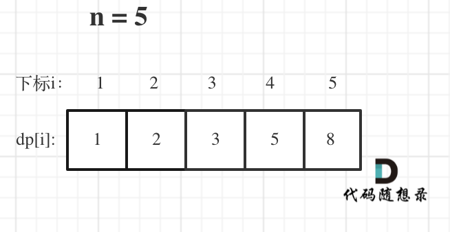

如果代码出问题了，就把dp table 打印出来，看看究竟是不是和自己推导的一样。

**此时大家应该发现了，这不就是斐波那契数列么！**唯一的区别是，没有讨论`dp[0]`应该是什么，因为`dp[0]`在本题没有意义！

以上五部分析完之后，`C++`代码如下：

```cpp
// 版本一
class Solution {
public:
    int climbStairs(int n) {
        if (n <= 1) return n; // 因为下面直接对dp[2]操作了，防止空指针
        vector<int> dp(n + 1);
        dp[1] = 1;
        dp[2] = 2;
        for (int i = 3; i <= n; i++) { // 注意i是从3开始的
            dp[i] = dp[i - 1] + dp[i - 2];
        }
        return dp[n];
    }
};
```

- 时间复杂度：`$O(n)$`
- 空间复杂度：`$O(n)$`

当然依然也可以，优化一下空间复杂度，代码如下：

```cpp
// 版本二
class Solution {
public:
    int climbStairs(int n) {
        if (n <= 1) return n;
        int dp[3];
        dp[1] = 1;
        dp[2] = 2;
        for (int i = 3; i <= n; i++) {
            int sum = dp[1] + dp[2];
            dp[1] = dp[2];
            dp[2] = sum;
        }
        return dp[2];
    }
};
```

- 时间复杂度：`$O(n)$`
- 空间复杂度：`$O(1)$`

后面将讲解的很多动规的题目其实都是当前状态依赖前两个，或者前三个状态，都可以做空间上的优化，**但我个人** **认为面试中能写出版本一就够了哈，清晰明了，如果面试官要求进一步优化空间的话，我们再去优化**。

因为版本一才能体现出动规的思想精髓，递推的状态变化。

## 拓展

这道题目还可以继续深化，就是一步一个台阶，两个台阶，三个台阶，直到 m个台阶，有多少种方法爬到n阶楼顶。

这又有难度了，这其实是一个完全背包问题，但力扣上没有这种题目，所以后续我在讲解背包问题的时候，今天这道题还会从背包问题的角度上来再讲一遍。 如果想提前看一下，可以看这篇:[70.爬楼梯完全背包版本](https://programmercarl.com/0070.%E7%88%AC%E6%A5%BC%E6%A2%AF%E5%AE%8C%E5%85%A8%E8%83%8C%E5%8C%85%E7%89%88%E6%9C%AC.html)

这里我先给出我的实现代码：

```cpp
class Solution {
public:
    int climbStairs(int n) {
        vector<int> dp(n + 1, 0);
        dp[0] = 1;
        for (int i = 1; i <= n; i++) {
            for (int j = 1; j <= m; j++) { // 把m换成2，就可以AC爬楼梯这道题
                if (i - j >= 0) dp[i] += dp[i - j];
            }
        }
        return dp[n];
    }
};
```

代码中m表示最多可以爬m个台阶。

**以上代码不能运行哈，我主要是为了体现只要把m换成2，粘过去，就可以AC爬楼梯这道题，不信你就粘一下试** **试**。

**此时我就发现一个绝佳的大厂面试题**，第一道题就是单纯的爬楼梯，然后看候选人的代码实现，如果把`dp[0]`的定义成1了，就可以发难了，为什么`dp[0]`一定要初始化为1，此时可能候选人就要强行给`dp[0]`应该是1找各种理由。那这就是一个考察点了，对`dp[i]`的定义理解的不深入。

然后可以继续发难，如果一步一个台阶，两个台阶，三个台阶，直到 m个台阶，有多少种方法爬到n阶楼顶。这道题目leetcode上并没有原题，绝对是考察候选人算法能力的绝佳好题。

这一连套问下来，候选人算法能力如何，面试官心里就有数了。

**其实大厂面试最喜欢的问题就是这种简单题，然后慢慢变化，在小细节上考察候选人**。

## 总结

这道题目和[动态规划：斐波那契数](https://programmercarl.com/0509.%E6%96%90%E6%B3%A2%E9%82%A3%E5%A5%91%E6%95%B0.html)题目基本是一样的，但是会发现本题相比[动态规划：斐波那契数](https://programmercarl.com/0509.%E6%96%90%E6%B3%A2%E9%82%A3%E5%A5%91%E6%95%B0.html)难多了，为什么呢？

关键是 [动态规划：斐波那契数](https://programmercarl.com/0509.%E6%96%90%E6%B3%A2%E9%82%A3%E5%A5%91%E6%95%B0.html) 题目描述就已经把动规五部曲里的递归公式和如何初始化都给出来了，剩下几部曲也自然而然的推出来了。

而本题，就需要逐个分析了，大家现在应该初步感受出[关于动态规划，你该了解这些！](https://programmercarl.com/%E5%8A%A8%E6%80%81%E8%A7%84%E5%88%92%E7%90%86%E8%AE%BA%E5%9F%BA%E7%A1%80.html)里给出的动规五部曲了。

简单题是用来掌握方法论的，例如昨天斐波那契的题目够简单了吧，但昨天和今天可以使用一套方法分析出来的，这就是方法论！

所以不要轻视简单题，那种凭感觉就刷过去了，其实和没掌握区别不大，只有掌握方法论并说清一二三，才能触类旁通，举一反三哈！

就酱，循序渐进学算法，认准「代码随想录」！

# 4. 使用最小花费爬楼梯

[力扣题目链接](https://leetcode.cn/problems/min-cost-climbing-stairs/)

**旧题目描述**： 

数组的每个下标作为一个阶梯，第 i 个阶梯对应着一个非负数的体力花费值 `cost[i]`（下标从 0 开始）。

每当你爬上一个阶梯你都要花费对应的体力值，一旦支付了相应的体力值，你就可以选择向上爬一个阶梯或者爬两个阶梯。

请你找出达到楼层顶部的最低花费。在开始时，你可以选择从下标为 0 或 1 的元素作为初始阶梯。

示例 1：

- 输入：`cost = [10, 15, 20]`
- 输出：15
- 解释：最低花费是从 `cost[1]` 开始，然后走两步即可到阶梯顶，一共花费 15 。

示例 2：

- 输入：`cost = [1, 100, 1, 1, 1, 100, 1, 1, 100, 1]`
- 输出：6
- 解释：最低花费方式是从 `cost[0]` 开始，逐个经过那些 1 ，跳过 `cost[3]` ，一共花费 6 。

提示：

- cost 的长度范围是 `[2, 1000]`。
- `cost[i]` 将会是一个整型数据，范围为 `[0, 999]` 。

## 算法公开课

[**《代码随想录》算法视频公开课**](https://programmercarl.com/other/gongkaike.html)**：：**[**动态规划开更了！| LeetCode：746. 使用最小花费爬楼梯**](https://www.bilibili.com/video/BV16G411c7yZ/)**，相信结合视频再** **看本篇题解，更有助于大家对本题的理解**。

本题之前的题目描述是很模糊的，看不出来，第一步需要花费体力值，最后一步不用花费，还是说 第一步不花费体力值，最后一步花费。 

后来力扣改了题目描述，**新题目描述**： 

给你一个整数数组 cost ，其中 `cost[i]` 是从楼梯第 i 个台阶向上爬需要支付的费用。一旦你支付此费用，即可选择向上爬一个或者两个台阶。

你可以选择从下标为 0 或下标为 1 的台阶开始爬楼梯。

请你计算并返回达到楼梯顶部的最低花费。

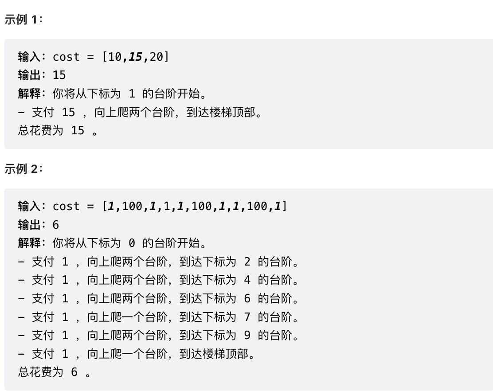

## 思路

（**在力扣修改了题目描述下，我又重新修改了题解**）

修改之后的题意就比较明确了，题目中说 “你可以选择从下标为 0 或下标为 1 的台阶开始爬楼梯” 也就是相当于 跳到 下标 0 或者 下标 1 是不花费体力的， 从 下标 0 下标1 开始跳就要花费体力了。 

1. 确定dp数组以及下标的含义

使用动态规划，就要有一个数组来记录状态，本题只需要一个一维数组`dp[i]`就可以了。

**dp[i]的定义：到达第i台阶所花费的最少体力为dp[i]**。  

**对于dp数组的定义，大家一定要清晰！**

2. 确定递推公式

**可以有两个途径得到dp[i]，一个是dp[i-1] 一个是dp[i-2]**。

`dp[i - 1]` 跳到 `dp[i]` 需要花费 `dp[i - 1] + cost[i - 1]`。 

`dp[i - 2]` 跳到 `dp[i]` 需要花费  `dp[i - 2] + cost[i - 2]`。 

那么究竟是选从`dp[i - 1]`跳还是从`dp[i - 2]`跳呢？

一定是选最小的，所以`dp[i] = min(dp[i - 1] + cost[i - 1], dp[i - 2] + cost[i - 2]);`

3. dp数组如何初始化

看一下递归公式，`dp[i]`由`dp[i - 1]`，`dp[i - 2]`推出，既然初始化所有的`dp[i]`是不可能的，那么只初始化`dp[0]`和`dp[1]`就够了，其他的最终都是`dp[0]dp[1]`推出。

那么 `dp[0]` 应该是多少呢？ 根据dp数组的定义，到达第0台阶所花费的最小体力为`dp[0]`，那么有同学可能想，那`dp[0]` 应该是 `cost[0]`，例如 `cost = [1, 100, 1, 1, 1, 100, 1, 1, 100, 1]` 的话，`dp[0]` 就是 `cost[0]` 应该是1。 

这里就要说明本题力扣为什么改题意，而且修改题意之后 就清晰很多的原因了。 

新题目描述中明确说了 “你可以选择从下标为 0 或下标为 1 的台阶开始爬楼梯。” 也就是说 到达 第 0 个台阶是不花费的，但从 第0 个台阶 往上跳的话，需要花费 `cost[0]`。 

所以初始化 `dp[0] = 0`，`dp[1] = 0;`

4. 确定遍历顺序

最后一步，递归公式有了，初始化有了，如何遍历呢？

本题的遍历顺序其实比较简单，简单到很多同学都忽略了思考这一步直接就把代码写出来了。

因为是模拟台阶，而且`dp[i]`由`dp[i-1]dp[i-2]`推出，所以是从前到后遍历cost数组就可以了。

**但是稍稍有点难度的动态规划，其遍历顺序并不容易确定下来**。例如：01背包，都知道两个for循环，一个for遍历物品嵌套一个for遍历背包容量，那么为什么不是一个for遍历背包容量嵌套一个for遍历物品呢？ 以及在使用一维dp数组的时候遍历背包容量为什么要倒序呢？

**这些都与遍历顺序息息相关。当然背包问题后续「代码随想录」都会重点讲解的！**

5. 举例推导dp数组

拿示例2：`cost = [1, 100, 1, 1, 1, 100, 1, 1, 100, 1]` ，来模拟一下dp数组的状态变化，如下：

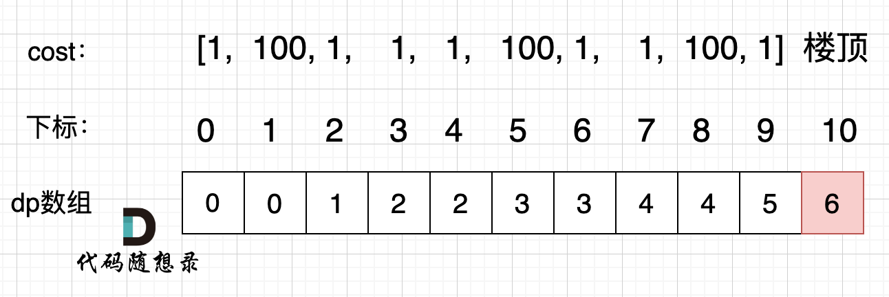

如果大家代码写出来有问题，就把dp数组打印出来，看看和如上推导的是不是一样的。

以上分析完毕，整体`C++`代码如下：

```cpp
class Solution {
public:
    int minCostClimbingStairs(vector<int>& cost) {
        vector<int> dp(cost.size() + 1);
        dp[0] = 0; // 默认第一步都是不花费体力的
        dp[1] = 0;
        for (int i = 2; i <= cost.size(); i++) {
            dp[i] = min(dp[i - 1] + cost[i - 1], dp[i - 2] + cost[i - 2]);
        }
        return dp[cost.size()];
    }
};
```

- 时间复杂度：`O(n)`
- 空间复杂度：`O(n)`

还可以优化空间复杂度，因为`dp[i]`就是由前两位推出来的，那么也不用dp数组了，`C++`代码如下：

```cpp
// 版本二
class Solution {
public:
    int minCostClimbingStairs(vector<int>& cost) {
        int dp0 = 0;
        int dp1 = 0;
        for (int i = 2; i <= cost.size(); i++) {
            int dpi = min(dp1 + cost[i - 1], dp0 + cost[i - 2]);
            dp0 = dp1; // 记录一下前两位
            dp1 = dpi;
        }
        return dp1;
    }
};
```

- 时间复杂度：`O(n)`
- 空间复杂度：`O(1)`

当然如果在面试中，能写出版本一就行，除非面试官额外要求 空间复杂度，那么再去思考版本二，因为版本二还是有点绕。版本一才是正常思路。

## 拓展

旧力扣描述，如果按照 第一步是花费的，最后一步不花费，那么代码是这么写的，提交也可以通过

```cpp
// 版本一
class Solution {
public:
    int minCostClimbingStairs(vector<int>& cost) {
        vector<int> dp(cost.size());
        dp[0] = cost[0]; // 第一步有花费
        dp[1] = cost[1];
        for (int i = 2; i < cost.size(); i++) {
            dp[i] = min(dp[i - 1], dp[i - 2]) + cost[i];
        }
        // 注意最后一步可以理解为不用花费，所以取倒数第一步，第二步的最少值
        return min(dp[cost.size() - 1], dp[cost.size() - 2]);
    }
};
```

当然如果对 动态规划 理解不够深入的话，拓展内容就别看了，容易越看越懵。

## 总结

大家可以发现这道题目相对于 昨天的[动态规划：爬楼梯](https://programmercarl.com/0070.%E7%88%AC%E6%A5%BC%E6%A2%AF.html)又难了一点，但整体思路是一样的。

从[动态规划：斐波那契数](https://programmercarl.com/0509.%E6%96%90%E6%B3%A2%E9%82%A3%E5%A5%91%E6%95%B0.html)到 [动态规划：爬楼梯](https://programmercarl.com/0070.%E7%88%AC%E6%A5%BC%E6%A2%AF.html)再到今天这道题目，录友们感受到循序渐进的梯度了嘛。

每个系列开始的时候，都有录友和我反馈说题目太简单了，赶紧上难度，但也有录友和我说有点难了，快跟不上了。

其实我选的题目都是有目的性的，就算是简单题，也是为了练习方法论，然后难度都是梯度上来的，一环扣一环。

但我也可以随便选来一道难题讲呗，这其实是最省事的，不用管什么题目顺序，看心情找一道就讲。

难的是把题目按梯度排好，循序渐进，再按照统一方法论把这些都串起来，所以大家不要催我哈，按照我的节奏一步一步来就行了。

# 5. 本周小结！（动态规划系列一）

这周我们正式开始动态规划的学习！

## 周一

在[关于动态规划，你该了解这些！](https://programmercarl.com/%E5%8A%A8%E6%80%81%E8%A7%84%E5%88%92%E7%90%86%E8%AE%BA%E5%9F%BA%E7%A1%80.html)中我们讲解了动态规划的基础知识。

首先讲一下动规和贪心的区别，其实大家不用太强调理论上的区别，做做题，就感受出来了。

然后我们讲了动规的五部曲：

1. 确定dp数组（dp table）以及下标的含义2. 确定递推公式3. dp数组如何初始化4. 确定遍历顺序5. 举例推导dp数组

后序我们在讲解动规的题目时候，都离不开这五步！

本周都是简单题目，大家可能会感觉 按照这五部来好麻烦，凭感觉随手一写，直接就过，越到后面越会感觉，凭感觉这个事还是不靠谱的，哈哈。

最后我们讲了动态规划题目应该如何debug，相信一些录友做动规的题目，一旦报错也是凭感觉来改。

其实只要把dp数组打印出来，哪里有问题一目了然！

**如果代码写出来了，一直AC不了，灵魂三问：**

1. 这道题目我举例推导状态转移公式了么？2. 我打印dp数组的日志了么？3. 打印出来了dp数组和我想的一样么？

哈哈，专治各种代码写出来了但AC不了的疑难杂症。

## 周二

这道题目[动态规划：斐波那契数](https://programmercarl.com/0509.%E6%96%90%E6%B3%A2%E9%82%A3%E5%A5%91%E6%95%B0.html)是当之无愧的动规入门题。

简单题，我们就是用来了解方法论的，用动规五部曲走一遍，题目其实已经把递推公式，和dp数组如何初始化都给我们了。

## 周三

[动态规划：爬楼梯](https://programmercarl.com/0070.%E7%88%AC%E6%A5%BC%E6%A2%AF.html) 这道题目其实就是斐波那契数列。

但正常思考过程应该是推导完递推公式之后，发现这是斐波那契，而不是上来就知道这是斐波那契。

在这道题目的第三步，确认dp数组如何初始化，其实就可以看出来，对`dp[i]`定义理解的深度。

`dp[0]`其实就是一个无意义的存在，不用去初始化`dp[0]`。

有的题解是把`dp[0]`初始化为1，然后遍历的时候i从2开始遍历，这样是可以解题的，然后强行解释一波`dp[0]`应该等于1的含义。

一个严谨的思考过程，应该是初始化`dp[1] = 1`，`dp[2] = 2`，然后i从3开始遍历，代码如下：

```cpp
dp[1] = 1;
dp[2] = 2;
for (int i = 3; i <= n; i++) { // 注意i是从3开始的
    dp[i] = dp[i - 1] + dp[i - 2];
}
```

这个可以是面试的一个小问题，哈哈，考察候选人对`dp[i]`定义的理解程度。

这道题目还可以继续深化，就是一步一个台阶，两个台阶，三个台阶，直到 m个台阶，有多少种方法爬到n阶楼顶。

这又有难度了，这其实是一个完全背包问题，但力扣上没有这种题目，所以后续我在讲解背包问题的时候，今天这道题还会拿从背包问题的角度上来再讲一遍。

这里我先给出我的实现代码：

```cpp
class Solution {
public:
    int climbStairs(int n) {
        vector<int> dp(n + 1, 0);
        dp[0] = 1;
        for (int i = 1; i <= n; i++) {
            for (int j = 1; j <= m; j++) { // 把m换成2，就可以AC爬楼梯这道题
                if (i - j >= 0) dp[i] += dp[i - j];
            }
        }
        return dp[n];
    }
};
```

代码中m表示最多可以爬m个台阶。

**以上代码不能运行哈，我主要是为了体现只要把m换成2，粘过去，就可以AC爬楼梯这道题，不信你就粘一下试** **试，哈哈**。

**此时我就发现一个绝佳的大厂面试题**，第一道题就是单纯的爬楼梯，然后看候选人的代码实现，如果把`dp[0]`的定义成1了，就可以发难了，为什么`dp[0]`一定要初始化为1，此时可能候选人就要强行给`dp[0]`应该是1找各种理由。那这就是一个考察点了，对`dp[i]`的定义理解的不深入。

然后可以继续发难，如果一步一个台阶，两个台阶，三个台阶，直到 m个台阶，有多少种方法爬到n阶楼顶。这道题目leetcode上并没有原题，绝对是考察候选人算法能力的绝佳好题。

这一连套问下来，候选人算法能力如何，面试官心里就有数了。

**其实大厂面试最喜欢问题的就是这种简单题，然后慢慢变化，在小细节上考察候选人**。

这道绝佳的面试题我没有用过，如果录友们有面试别人的需求，就把这个套路拿去吧，哈哈哈。

我在[通过一道面试题目，讲一讲递归算法的时间复杂度！](https://programmercarl.com/%E5%89%8D%E5%BA%8F/%E9%80%9A%E8%BF%87%E4%B8%80%E9%81%93%E9%9D%A2%E8%AF%95%E9%A2%98%E7%9B%AE%EF%BC%8C%E8%AE%B2%E4%B8%80%E8%AE%B2%E9%80%92%E5%BD%92%E7%AE%97%E6%B3%95%E7%9A%84%E6%97%B6%E9%97%B4%E5%A4%8D%E6%9D%82%E5%BA%A6%EF%BC%81.html)中，以我自己面试别人的真实经历，通过求x的n次方 这么简单的题目，就可以考察候选人对算法性能以及递归的理解深度，录友们可以看看，绝对有收获！

## 周四

这道题目[动态规划：使用最小花费爬楼梯](https://programmercarl.com/0746.%E4%BD%BF%E7%94%A8%E6%9C%80%E5%B0%8F%E8%8A%B1%E8%B4%B9%E7%88%AC%E6%A5%BC%E6%A2%AF.html)就是在爬台阶的基础上加了一个花费，

这道题描述也确实有点魔幻。

题目描述为：每当你爬上一个阶梯你都要花费对应的体力值，一旦支付了相应的体力值，你就可以选择向上爬一个阶梯或者爬两个阶梯。

示例1：

输入：`cost = [10, 15, 20]`  
输出：15

**从题目描述可以看出：要不是第一步不需要花费体力，要不就是第最后一步不需要花费体力，我个人理解：题意说** **的其实是第一步是要支付费用的！**。因为是当你爬上一个台阶就要花费对应的体力值！

所以我定义的`dp[i]`意思是也是第一步是要花费体力的，最后一步不用花费体力了，因为已经支付了。

之后一些录友在留言区说 可以定义`dp[i]`为:第一步是不花费体力，最后一步是花费体力的。

所以代码也可以这么写：

```cpp
class Solution {
public:
    int minCostClimbingStairs(vector<int>& cost) {
        vector<int> dp(cost.size() + 1);
        dp[0] = 0; // 默认第一步都是不花费体力的
        dp[1] = 0;
        for (int i = 2; i <= cost.size(); i++) {
            dp[i] = min(dp[i - 1] + cost[i - 1], dp[i - 2] + cost[i - 2]);
        }
        return dp[cost.size()];
    }
};
```

这么写看上去比较顺，但是就是感觉和题目描述的不太符。哈哈，也没有必要这么细扣题意了，大家只要知道，题目的意思反正就是要不是第一步不花费，要不是最后一步不花费，都可以。

## 总结

本周题目简单一些，也非常合适初学者来练练手。

下周开始上难度了哈，然后大下周就开始讲解背包问题，好戏还在后面，录友们跟上哈。

学算法，认准「代码随想录」就够了，Carl带你打怪升级！

# 6.不同路径

[力扣题目链接](https://leetcode.cn/problems/unique-paths/)

一个机器人位于一个 m x n 网格的左上角 （起始点在下图中标记为 “Start” ）。

机器人每次只能向下或者向右移动一步。机器人试图达到网格的右下角（在下图中标记为 “Finish” ）。

问总共有多少条不同的路径？

示例 1：


- 输入：`m = 3, n = 7`
- 输出：28

示例 2：

- 输入：`m = 2, n = 3`
- 输出：3

解释： 从左上角开始，总共有 3 条路径可以到达右下角。

1. 向右 `->` 向右 `->` 向下2. 向右 `->` 向下 `->` 向右3. 向下 `->` 向右 `->` 向右

示例 3：

- 输入：`m = 7, n = 3`
- 输出：28

示例 4：

- 输入：`m = 3, n = 3`
- 输出：6

提示：

- `1 <= m, n <= 100`
- 题目数据保证答案小于等于 2 * 10^9

## 算法公开课

[**《代码随想录》算法视频公开课**](https://programmercarl.com/other/gongkaike.html)**：**[**动态规划中如何初始化很重要！| LeetCode：62.不同路径**](https://www.bilibili.com/video/BV1ve4y1x7Eu/)**，相信结合视频再看** **本篇题解，更有助于大家对本题的理解**。

## 思路

### 深搜

这道题目，刚一看最直观的想法就是用图论里的深搜，来枚举出来有多少种路径。

注意题目中说机器人每次只能向下或者向右移动一步，那么其实**机器人走过的路径可以抽象为一棵二叉树，而叶子** **节点就是终点！**

如图举例：

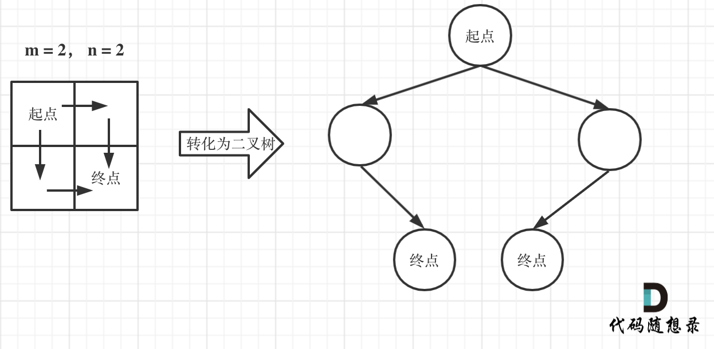

此时问题就可以转化为求二叉树叶子节点的个数，代码如下：

```cpp
class Solution {
private:
    int dfs(int i, int j, int m, int n) {
        if (i > m || j > n) return 0; // 越界了
        if (i == m && j == n) return 1; // 找到一种方法，相当于找到了叶子节点
        return dfs(i + 1, j, m, n) + dfs(i, j + 1, m, n);
    }
public:
    int uniquePaths(int m, int n) {
        return dfs(1, 1, m, n);
    }
};
```

**大家如果提交了代码就会发现超时了！**

来分析一下时间复杂度，这个深搜的算法，其实就是要遍历整个二叉树。

这棵树的深度其实就是m+n-1（深度按从1开始计算）。

那二叉树的节点个数就是 `2^(m + n - 1) - 1`。可以理解深搜的算法就是遍历了整个满二叉树（其实没有遍历整个满二叉树，只是近似而已）

所以上面深搜代码的时间复杂度为`O(2^(m + n - 1) - 1)`，可以看出，这是指数级别的时间复杂度，是非常大的。

### 动态规划

机器人从`(0 , 0)` 位置出发，到`(m - 1, n - 1)`终点。

按照动规五部曲来分析：

1. 确定dp数组（dp table）以及下标的含义

`dp[i][j]` ：表示从（0 ，0）出发，到`(i, j)` 有`dp[i][j]`条不同的路径。

2. 确定递推公式

想要求`dp[i][j]`，只能有两个方向来推导出来，即`dp[i - 1][j]` 和 `dp[i][j - 1]`。

此时在回顾一下 `dp[i - 1][j]` 表示啥，是从`(0, 0)`的位置到`(i - 1, j)`有几条路径，`dp[i][j - 1]`同理。

那么很自然，`dp[i][j] =  dp[i - 1][j] + dp[i][j - 1]`，因为`dp[i][j]`只有这两个方向过来。

3. dp数组的初始化

如何初始化呢，首先`dp[i][0]`一定都是1，因为从`(0, 0)`的位置到`(i, 0)`的路径只有一条，那么`dp[0][j]`也同理。

所以初始化代码为：

```cpp
for (int i = 0; i < m; i++) dp[i][0] = 1;
for (int j = 0; j < n; j++) dp[0][j] = 1;
```

4. 确定遍历顺序

这里要看一下递推公式`dp[i][j] =  dp[i - 1][j] + dp[i][j - 1]`，`dp[i][j]`都是从其上方和左方推导而来，那么从左到右一层一层遍历就可以了。

这样就可以保证推导`dp[i][j]`的时候，`dp[i - 1][j]` 和 `dp[i][j - 1]`一定是有数值的。

5. 举例推导dp数组

如图所示：

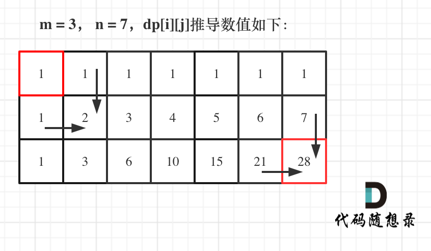

以上动规五部曲分析完毕，`C++`代码如下：

```cpp
class Solution {
public:
    int uniquePaths(int m, int n) {
        vector<vector<int>> dp(m, vector<int>(n, 0));
        for (int i = 0; i < m; i++) dp[i][0] = 1;
        for (int j = 0; j < n; j++) dp[0][j] = 1;
        for (int i = 1; i < m; i++) {
            for (int j = 1; j < n; j++) {
                dp[i][j] = dp[i - 1][j] + dp[i][j - 1];
            }
        }
        return dp[m - 1][n - 1];
    }
};
```

- 时间复杂度：`O(m × n)`
- 空间复杂度：`O(m × n)`

其实用一个一维数组（也可以理解是滚动数组）就可以了，但是不利于理解，可以优化点空间，建议先理解了二维，在理解一维，`C++`代码如下：

```cpp
class Solution {
public:
    int uniquePaths(int m, int n) {
        vector<int> dp(n);
        for (int i = 0; i < n; i++) dp[i] = 1;
        for (int j = 1; j < m; j++) {
            for (int i = 1; i < n; i++) {
                dp[i] += dp[i - 1];
            }
        }
        return dp[n - 1];
    }
};
```

- 时间复杂度：`O(m × n)`
- 空间复杂度：`O(n)`

### 数论方法

在这个图中，可以看出一共m，n的话，无论怎么走，走到终点都需要 m + n - 2 步。


在这m + n - 2 步中，一定有 m - 1 步是要向下走的，不用管什么时候向下走。

那么有几种走法呢？ 可以转化为，给你m + n - 2个不同的数，随便取m - 1个数，有几种取法。

那么这就是一个组合问题了。

那么答案，如图所示：

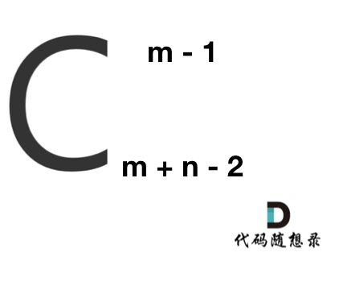

**求组合的时候，要防止两个int相乘溢出！** 所以不能把算式的分子都算出来，分母都算出来再做除法。

例如如下代码是不行的。

```cpp
class Solution {
public:
    int uniquePaths(int m, int n) {
        int numerator = 1, denominator = 1;
        int count = m - 1;
        int t = m + n - 2;
        while (count--) numerator *= (t--); // 计算分子，此时分子就会溢出
        for (int i = 1; i <= m - 1; i++) denominator *= i; // 计算分母
        return numerator / denominator;
    }
};
```

需要在计算分子的时候，不断除以分母，代码如下：

```cpp
class Solution {
public:
    int uniquePaths(int m, int n) {
        long long numerator = 1; // 分子
        int denominator = m - 1; // 分母
        int count = m - 1;
        int t = m + n - 2;
        while (count--) {
            numerator *= (t--);
            while (denominator != 0 && numerator % denominator == 0) {
                numerator /= denominator;
                denominator--;
            }
        }
        return numerator;
    }
};
```

- 时间复杂度：`O(m)`
- 空间复杂度：`O(1)`

**计算组合问题的代码还是有难度的，特别是处理溢出的情况！**

## 总结

本文分别给出了深搜，动规，数论三种方法。

深搜当然是超时了，顺便分析了一下使用深搜的时间复杂度，就可以看出为什么超时了。

然后在给出动规的方法，依然是使用动规五部曲，这次我们就要考虑如何正确的初始化了，初始化和遍历顺序其实也很重要！

# 7. 不同路径 II

[力扣题目链接](https://leetcode.cn/problems/unique-paths-ii/)

一个机器人位于一个 m x n 网格的左上角 （起始点在下图中标记为“Start” ）。

机器人每次只能向下或者向右移动一步。机器人试图达到网格的右下角（在下图中标记为“Finish”）。

现在考虑网格中有障碍物。那么从左上角到右下角将会有多少条不同的路径？


网格中的障碍物和空位置分别用 1 和 0 来表示。

示例 1：


- 输入：`obstacleGrid = [[0,0,0],[0,1,0],[0,0,0]]`
- 输出：2  
解释：
- 3x3 网格的正中间有一个障碍物。
- 从左上角到右下角一共有 2 条不同的路径：1. 向右 `->` 向右 `->` 向下 `->` 向下2. 向下 `->` 向下 `->` 向右 `->` 向右

示例 2：


- 输入：`obstacleGrid = [[0,1],[0,0]]`
- 输出：1  
提示：

- `m == obstacleGrid.length`
- `n == obstacleGrid[i].length`
- `1 <= m, n <= 100`
- `obstacleGrid[i][j]` 为 0 或 1

## 算法公开课

[**《代码随想录》算法视频公开课**](https://programmercarl.com/other/gongkaike.html)**：**[**动态规划，这次遇到障碍了| LeetCode：63. 不同路径 II**](https://www.bilibili.com/video/BV1Ld4y1k7c6/)**，相信结合视频再看本** **篇题解，更有助于大家对本题的理解**。

## 思路

这道题相对于[62.不同路径](https://programmercarl.com/0062.%E4%B8%8D%E5%90%8C%E8%B7%AF%E5%BE%84.html) 就是有了障碍。

第一次接触这种题目的同学可能会有点懵，这有障碍了，应该怎么算呢？

[62.不同路径](https://programmercarl.com/0062.%E4%B8%8D%E5%90%8C%E8%B7%AF%E5%BE%84.html)中我们已经详细分析了没有障碍的情况，有障碍的话，其实就是标记对应的dp table（dp数组）保持初始值`(0)`就可以了。

动规五部曲：

1. 确定dp数组（dp table）以及下标的含义

`dp[i][j]` ：表示从（0 ，0）出发，到`(i, j)` 有`dp[i][j]`条不同的路径。

2. 确定递推公式

递推公式和62.不同路径一样，`dp[i][j] =  dp[i - 1][j] + dp[i][j - 1]`。

但这里需要注意一点，因为有了障碍，`(i, j)`如果就是障碍的话应该就保持初始状态（初始状态为0）。

所以代码为：

```cpp
if (obstacleGrid[i][j] == 0) { // 当(i, j)没有障碍的时候，再推导dp[i][j]
    dp[i][j] = dp[i - 1][j] + dp[i][j - 1];
}
```

3. dp数组如何初始化

在[62.不同路径](https://programmercarl.com/0062.%E4%B8%8D%E5%90%8C%E8%B7%AF%E5%BE%84.html)不同路径中我们给出如下的初始化：

```cpp
vector<vector<int>> dp(m, vector<int>(n, 0)); // 初始值为0
for (int i = 0; i < m; i++) dp[i][0] = 1;
for (int j = 0; j < n; j++) dp[0][j] = 1;
```

因为从`(0, 0)`的位置到`(i, 0)`的路径只有一条，所以`dp[i][0]`一定为1，`dp[0][j]`也同理。

但如果`(i, 0)` 这条边有了障碍之后，障碍之后（包括障碍）都是走不到的位置了，所以障碍之后的`dp[i][0]`应该还是初始值0。

如图：

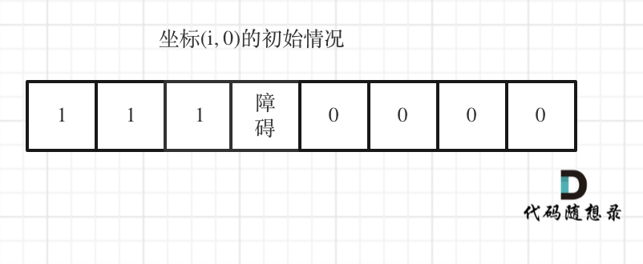

下标`(0, j)`的初始化情况同理。

所以本题初始化代码为：

```cpp
vector<vector<int>> dp(m, vector<int>(n, 0));
for (int i = 0; i < m && obstacleGrid[i][0] == 0; i++) dp[i][0] = 1;
for (int j = 0; j < n && obstacleGrid[0][j] == 0; j++) dp[0][j] = 1;
```

**注意代码里for循环的终止条件，一旦遇到obstacleGrid[i][0] == 1的情况就停止dp[i][0]的赋值1的操作，dp[0][j]** **同理**

4. 确定遍历顺序

从递归公式`dp[i][j] =  dp[i - 1][j] + dp[i][j - 1]` 中可以看出，一定是从左到右一层一层遍历，这样保证推导`dp[i][j]`的时候，`dp[i - 1][j]` 和 `dp[i][j - 1]`一定是有数值。

代码如下：

```cpp
for (int i = 1; i < m; i++) {
    for (int j = 1; j < n; j++) {
        if (obstacleGrid[i][j] == 1) continue;
        dp[i][j] = dp[i - 1][j] + dp[i][j - 1];
    }
}
```

5. 举例推导dp数组

拿示例1来举例如题：


对应的dp table 如图：

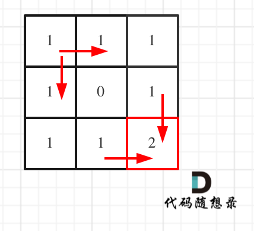

如果这个图看不懂，建议再理解一下递归公式，然后照着文章中说的遍历顺序，自己推导一下！

动规五部分分析完毕，对应`C++`代码如下：

```cpp
class Solution {
public:
    int uniquePathsWithObstacles(vector<vector<int>>& obstacleGrid) {
        int m = obstacleGrid.size();
        int n = obstacleGrid[0].size();
  if (obstacleGrid[m - 1][n - 1] == 1 || obstacleGrid[0][0] == 1) //如果在起点或终点出现了
障碍，直接返回0
            return 0;
        vector<vector<int>> dp(m, vector<int>(n, 0));
        for (int i = 0; i < m && obstacleGrid[i][0] == 0; i++) dp[i][0] = 1;
        for (int j = 0; j < n && obstacleGrid[0][j] == 0; j++) dp[0][j] = 1;
        for (int i = 1; i < m; i++) {
            for (int j = 1; j < n; j++) {
                if (obstacleGrid[i][j] == 1) continue;
                dp[i][j] = dp[i - 1][j] + dp[i][j - 1];
            }
        }
        return dp[m - 1][n - 1];
    }
};
```

- 时间复杂度：`O(n × m)`，n、m 分别为obstacleGrid 长度和宽度
- 空间复杂度：`O(n × m)`

同样我们给出空间优化版本：

```cpp
class Solution {
public:
    int uniquePathsWithObstacles(vector<vector<int>>& obstacleGrid) {
        if (obstacleGrid[0][0] == 1)
            return 0;
        vector<int> dp(obstacleGrid[0].size());
        for (int j = 0; j < dp.size(); ++j)
            if (obstacleGrid[0][j] == 1)
                dp[j] = 0;
            else if (j == 0)
                dp[j] = 1;
            else
                dp[j] = dp[j-1];
        for (int i = 1; i < obstacleGrid.size(); ++i)
            for (int j = 0; j < dp.size(); ++j){
                if (obstacleGrid[i][j] == 1)
                    dp[j] = 0;
                else if (j != 0)
                    dp[j] = dp[j] + dp[j-1];
            }
        return dp.back();
    }
};
```

- 时间复杂度：`O(n × m)`，n、m 分别为obstacleGrid 长度和宽度

- 空间复杂度：`O(m)`

## 总结

本题是[62.不同路径](https://programmercarl.com/0062.%E4%B8%8D%E5%90%8C%E8%B7%AF%E5%BE%84.html)的障碍版，整体思路大体一致。

但就算是做过62.不同路径，在做本题也会有感觉遇到障碍无从下手。

其实只要考虑到，遇到障碍`dp[i][j]`保持0就可以了。

也有一些小细节，例如：初始化的部分，很容易忽略了障碍之后应该都是0的情况。

# 8. 整数拆分

[力扣题目链接](https://leetcode.cn/problems/integer-break/)

给定一个正整数 n，将其拆分为至少两个正整数的和，并使这些整数的乘积最大化。 返回你可以获得的最大乘积。

示例 1:

- 输入: 2
- 输出: 1
- 解释`: 2 = 1 + 1, 1 × 1 = 1`。

示例 2:

- 输入: 10
- 输出: 36
- 解释`: 10 = 3 + 3 + 4, 3 × 3 × 4 = 36`。
- 说明: 你可以假设 n 不小于 2 且不大于 58。

## 算法公开课

[**《代码随想录》算法视频公开课**](https://programmercarl.com/other/gongkaike.html)**：**[**动态规划，本题关键在于理解递推公式！| LeetCode：343. 整数拆分**](https://www.bilibili.com/video/BV1Mg411q7YJ/)**，相信结** **合视频再看本篇题解，更有助于大家对本题的理解**。

## 思路

看到这道题目，都会想拆成两个呢，还是三个呢，还是四个....

我们来看一下如何使用动规来解决。

### 动态规划

动规五部曲，分析如下：

1. 确定dp数组（dp table）以及下标的含义

`dp[i]`：分拆数字i，可以得到的最大乘积为`dp[i]`。

`dp[i]`的定义将贯彻整个解题过程，下面哪一步想不懂了，就想想`dp[i]`究竟表示的是啥！

2. 确定递推公式

可以想 `dp[i]`最大乘积是怎么得到的呢？

其实可以从1遍历j，然后有两种渠道得到`dp[i].`

一个是`j * (i - j)` 直接相乘。

一个是`j * dp[i - j]`，相当于是拆分`(i - j)`，对这个拆分不理解的话，可以回想dp数组的定义。

**那有同学问了，j怎么就不拆分呢？**

j是从1开始遍历，拆分j的情况，在遍历j的过程中其实都计算过了。那么从1遍历j，比较`(i - j) * j`和`dp[i - j] * j` 取最大的。递推公式：`dp[i] = max(dp[i], max((i - j) * j, dp[i - j] * j));`

也可以这么理解，`j * (i - j)` 是单纯的把整数拆分为两个数相乘，而`j * dp[i - j]`是拆分成两个以及两个以上的个数相乘。

如果定义`dp[i - j] * dp[j]` 也是默认将一个数强制拆成4份以及4份以上了。

所以递推公式：`dp[i] = max({dp[i], (i - j) * j, dp[i - j] * j});`

那么在取最大值的时候，为什么还要比较`dp[i]`呢？

因为在递推公式推导的过程中，每次计算`dp[i]`，取最大的而已。

3. dp的初始化

不少同学应该疑惑，`dp[0] dp[1]`应该初始化多少呢？

有的题解里会给出`dp[0] = 1`，`dp[1] = 1`的初始化，但解释比较牵强，主要还是因为这么初始化可以把题目过了。

严格从`dp[i]`的定义来说，`dp[0] dp[1]` 就不应该初始化，也就是没有意义的数值。

拆分0和拆分1的最大乘积是多少？

这是无解的。

这里我只初始化`dp[2] = 1`，从`dp[i]`的定义来说，拆分数字2，得到的最大乘积是1，这个没有任何异议！

4. 确定遍历顺序

确定遍历顺序，先来看看递归公式：`dp[i] = max(dp[i], max((i - j) * j, dp[i - j] * j));`

`dp[i]` 是依靠 `dp[i - j]`的状态，所以遍历i一定是从前向后遍历，先有`dp[i - j]`再有`dp[i]`。

所以遍历顺序为：

```cpp
for (int i = 3; i <= n ; i++) {
    for (int j = 1; j < i - 1; j++) {
        dp[i] = max(dp[i], max((i - j) * j, dp[i - j] * j));
    }
}
```

注意 枚举j的时候，是从1开始的。从0开始的话，那么让拆分一个数拆个0，求最大乘积就没有意义了。

j的结束条件是 `j < i - 1` ，其实 `j < i` 也是可以的，不过可以节省一步，例如让`j = i - 1`，的话，其实在 `j = 1`的时候，这一步就已经拆出来了，重复计算，所以 `j < i - 1` 

至于 i是从3开始，这样`dp[i - j]`就是`dp[2]`正好可以通过我们初始化的数值求出来。

更优化一步，可以这样：

```cpp
for (int i = 3; i <= n ; i++) {
    for (int j = 1; j <= i / 2; j++) {
        dp[i] = max(dp[i], max((i - j) * j, dp[i - j] * j));
    }
}
```

因为拆分一个数n 使之乘积最大，那么一定是拆分成m个近似相同的子数相乘才是最大的。 

例如 6 拆成 3 * 3， 10 拆成 3 * 3 * 4。 100的话 也是拆成m个近似数组的子数 相乘才是最大的。 

只不过我们不知道m究竟是多少而已，但可以明确的是m一定大于等于2，既然m大于等于2，也就是 最差也应该是拆成两个相同的 可能是最大值。

那么 j 遍历，只需要遍历到 n/2 就可以，后面就没有必要遍历了，一定不是最大值。

至于 “拆分一个数n 使之乘积最大，那么一定是拆分成m个近似相同的子数相乘才是最大的” 这个我就不去做数学证明了，感兴趣的同学，可以自己证明。 

5. 举例推导dp数组

举例当n为10 的时候，dp数组里的数值，如下：

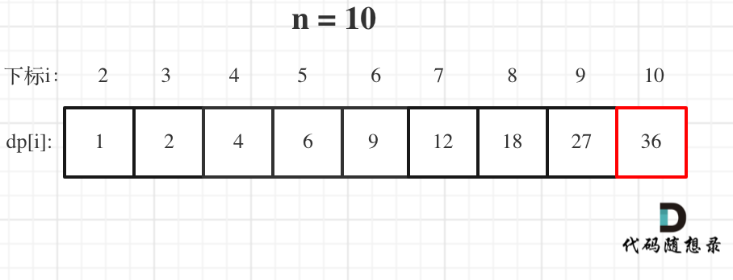

以上动规五部曲分析完毕，`C++`代码如下：

```cpp
class Solution {
public:
    int integerBreak(int n) {
        vector<int> dp(n + 1);
        dp[2] = 1;
        for (int i = 3; i <= n ; i++) {
            for (int j = 1; j <= i / 2; j++) {
                dp[i] = max(dp[i], max((i - j) * j, dp[i - j] * j));
            }
        }
        return dp[n];
    }
};
```

- 时间复杂度：`O(n^2)`
- 空间复杂度：`O(n)`

### 贪心

本题也可以用贪心，每次拆成n个3，如果剩下是4，则保留4，然后相乘，**但是这个结论需要数学证明其合理性！**

我没有证明，而是直接用了结论。感兴趣的同学可以自己再去研究研究数学证明哈。

给出我的`C++`代码如下：

```cpp
class Solution {
public:
    int integerBreak(int n) {
        if (n == 2) return 1;
        if (n == 3) return 2;
        if (n == 4) return 4;
        int result = 1;
        while (n > 4) {
            result *= 3;
            n -= 3;
        }
        result *= n;
        return result;
    }
};
```

- 时间复杂度：`O(n)`
- 空间复杂度：`O(1)`

## 总结

本题掌握其动规的方法，就可以了，贪心的解法确实简单，但需要有数学证明，如果能自圆其说也是可以的。

其实这道题目的递推公式并不好想，而且初始化的地方也很有讲究，我在写本题的时候一开始写的代码是这样的：

```cpp
class Solution {
public:
    int integerBreak(int n) {
        if (n <= 3) return 1 * (n - 1);
        vector<int> dp(n + 1, 0);
        dp[1] = 1;
        dp[2] = 2;
        dp[3] = 3;
        for (int i = 4; i <= n ; i++) {
            for (int j = 1; j <= i / 2; j++) {
                dp[i] = max(dp[i], dp[i - j] * dp[j]);
            }
        }
        return dp[n];
    }
};
```

**这个代码也是可以过的！**

在解释递推公式的时候，也可以解释通，`dp[i]` 就等于 拆解i - j的最大乘积 * 拆解j的最大乘积。 看起来没毛病！

但是在解释初始化的时候，就发现自相矛盾了，`dp[1]`为什么一定是1呢？根据`dp[i]`的定义，`dp[2]`也不应该是2啊。

但如果递归公式是 `dp[i] = max(dp[i], dp[i - j] * dp[j]);`，就一定要这么初始化。递推公式没毛病，但初始化解释不通！

虽然代码在初始位置有一个判断`if (n <= 3) return 1 * (n - 1);`，保证`n<=3` 结果是正确的，但代码后面又要给`dp[1]`赋值1 和 `dp[2]` 赋值 2，**这其实就是自相矛盾的代码，违背了dp[i]的定义！**

我举这个例子，其实就说做题的严谨性，上面这个代码也可以AC，大体上一看好像也没有毛病，递推公式也说得过去，但是仅仅是恰巧过了而已。

# 9.不同的二叉搜索树

[力扣题目链接](https://leetcode.cn/problems/unique-binary-search-trees/)

给定一个整数 n，求以 1 ... n 为节点组成的二叉搜索树有多少种？

示例:

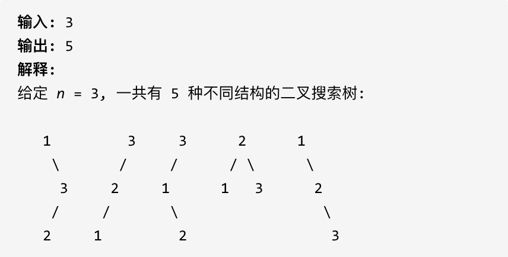

## 算法公开课

[**《代码随想录》算法视频公开课**](https://programmercarl.com/other/gongkaike.html)**：**[**动态规划找到子状态之间的关系很重要！| LeetCode：96.不同的二叉搜索树**](https://www.bilibili.com/video/BV1eK411o7QA/)**，** **相信结合视频再看本篇题解，更有助于大家对本题的理解**。

## 思路

这道题目描述很简短，但估计大部分同学看完都是懵懵的状态，这得怎么统计呢？

关于什么是二叉搜索树，我们之前在讲解二叉树专题的时候已经详细讲解过了，也可以看看这篇二叉树：二叉搜索树登场！再回顾一波。

了解了二叉搜索树之后，我们应该先举几个例子，画画图，看看有没有什么规律，如图：

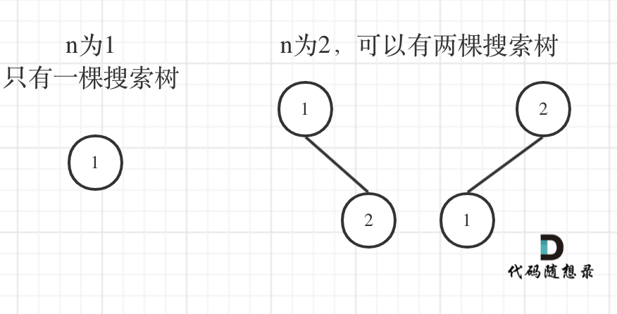

n为1的时候有一棵树，n为2有两棵树，这个是很直观的。

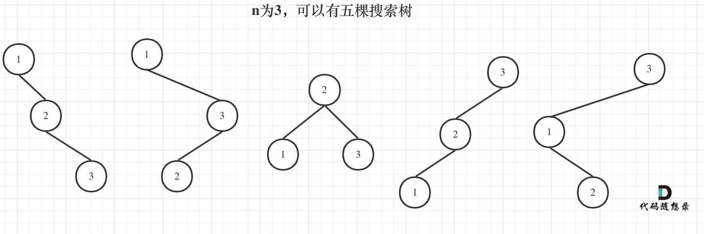

来看看n为3的时候，有哪几种情况。

当1为头结点的时候，其右子树有两个节点，看这两个节点的布局，是不是和 n 为2的时候两棵树的布局是一样的啊！

（可能有同学问了，这布局不一样啊，节点数值都不一样。别忘了我们就是求不同树的数量，并不用把搜索树都列出来，所以不用关心其具体数值的差异）

当3为头结点的时候，其左子树有两个节点，看这两个节点的布局，是不是和n为2的时候两棵树的布局也是一样的啊！

当2为头结点的时候，其左右子树都只有一个节点，布局是不是和n为1的时候只有一棵树的布局也是一样的啊！

发现到这里，其实我们就找到了重叠子问题了，其实也就是发现可以通过`dp[1]` 和 `dp[2]` 来推导出来`dp[3]`的某种方式。

思考到这里，这道题目就有眉目了。

`dp[3]`，就是 元素1为头结点搜索树的数量 + 元素2为头结点搜索树的数量 + 元素3为头结点搜索树的数量

元素1为头结点搜索树的数量 `=` 右子树有2个元素的搜索树数量 * 左子树有0个元素的搜索树数量

元素2为头结点搜索树的数量 `=` 右子树有1个元素的搜索树数量 * 左子树有1个元素的搜索树数量

元素3为头结点搜索树的数量 `=` 右子树有0个元素的搜索树数量 * 左子树有2个元素的搜索树数量

有2个元素的搜索树数量就是`dp[2]`。

有1个元素的搜索树数量就是`dp[1]`。

有0个元素的搜索树数量就是`dp[0]`。

所以`dp[3] = dp[2] * dp[0] + dp[1] * dp[1] + dp[0] * dp[2]`

如图所示：

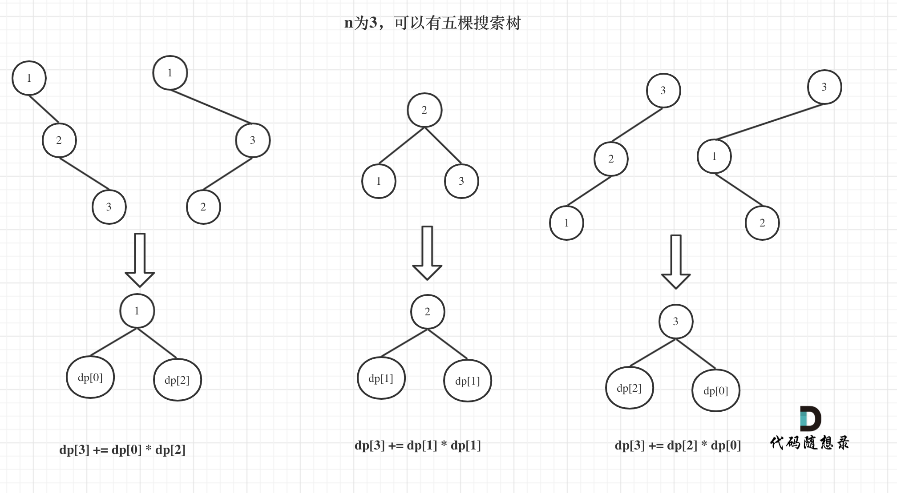

此时我们已经找到递推关系了，那么可以用动规五部曲再系统分析一遍。

1. 确定dp数组（dp table）以及下标的含义

**dp[i] ： 1到i为节点组成的二叉搜索树的个数为dp[i]**。

也可以理解是i个不同元素节点组成的二叉搜索树的个数为`dp[i]` ，都是一样的。

以下分析如果想不清楚，就来回想一下`dp[i]`的定义

2. 确定递推公式

在上面的分析中，其实已经看出其递推关系， `dp[i] += dp[`以j为头结点左子树节点数量`] * dp[`以j为头结点右子树节点数量`]`

j相当于是头结点的元素，从1遍历到i为止。

所以递推公式：`dp[i] += dp[j - 1] * dp[i - j];` ，j-1 为j为头结点左子树节点数量，i-j 为以j为头结点右子树节点数量

3. dp数组如何初始化

初始化，只需要初始化`dp[0]`就可以了，推导的基础，都是`dp[0]`。

那么`dp[0]`应该是多少呢？

从定义上来讲，空节点也是一棵二叉树，也是一棵二叉搜索树，这是可以说得通的。

从递归公式上来讲，`dp[`以j为头结点左子树节点数量`] * dp[`以j为头结点右子树节点数量`]` 中以j为头结点左子树节点数量为0，也需要`dp[`以j为头结点左子树节点数量`] = 1`， 否则乘法的结果就都变成0了。

所以初始化`dp[0] = 1`

4. 确定遍历顺序

首先一定是遍历节点数，从递归公式：`dp[i] += dp[j - 1] * dp[i - j]`可以看出，节点数为i的状态是依靠 i之前节点数的状态。

那么遍历i里面每一个数作为头结点的状态，用j来遍历。

代码如下：

```cpp
for (int i = 1; i <= n; i++) {
    for (int j = 1; j <= i; j++) {
        dp[i] += dp[j - 1] * dp[i - j];
    }
}
```

5. 举例推导dp数组

n为5时候的dp数组状态如图：

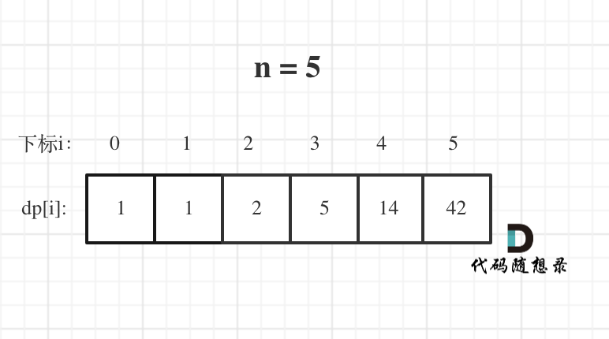

当然如果自己画图举例的话，基本举例到n为3就可以了，n为4的时候，画图已经比较麻烦了。

**我这里列到了n为5的情况，是为了方便大家 debug代码的时候，把dp数组打出来，看看哪里有问题**。

综上分析完毕，`C++`代码如下：

```cpp
class Solution {
public:
    int numTrees(int n) {
        vector<int> dp(n + 1);
        dp[0] = 1;
        for (int i = 1; i <= n; i++) {
            for (int j = 1; j <= i; j++) {
                dp[i] += dp[j - 1] * dp[i - j];
            }
        }
        return dp[n];
    }
};
```

- 时间复杂度：`$O(n^2)$`
- 空间复杂度：`$O(n)$`

大家应该发现了，我们分析了这么多，最后代码却如此简单！

## 总结

这道题目虽然在力扣上标记是中等难度，但可以算是困难了！

首先这道题想到用动规的方法来解决，就不太好想，需要举例，画图，分析，才能找到递推的关系。

然后难点就是确定递推公式了，如果把递推公式想清楚了，遍历顺序和初始化，就是自然而然的事情了。

可以看出我依然还是用动规五部曲来进行分析，会把题目的方方面面都覆盖到！

**而且具体这五部分析是我自己平时总结的经验，找不出来第二个的，可能过一阵子 其他题解也会有动规五部曲了，** **哈哈**。

当时我在用动规五部曲讲解斐波那契的时候，一些录友和我反应，感觉讲复杂了。

其实当时我一直强调简单题是用来练习方法论的，并不能因为简单我就代码一甩，简单解释一下就完事了。

可能当时一些同学不理解，现在大家应该感受方法论的重要性了，加油


!

# 10. 本周小结！（动态规划系列二）

## 周一

[动态规划：不同路径](https://programmercarl.com/0062.%E4%B8%8D%E5%90%8C%E8%B7%AF%E5%BE%84.html)中求从出发点到终点有几种路径，只能向下或者向右移动一步。

我们提供了三种方法，但重点讲解的还是动规，也是需要重点掌握的。

**dp[i][j]定义 ：表示从（0 ，0）出发，到(i, j) 有dp[i][j]条不同的路径**。

本题在初始化的时候需要点思考了，即：

`dp[i][0]`一定都是1，因为从`(0, 0)`的位置到`(i, 0)`的路径只有一条，那么`dp[0][j]`也同理。

所以初始化为：

```cpp
for (int i = 0; i < m; i++) dp[i][0] = 1;
for (int j = 0; j < n; j++) dp[0][j] = 1;
```

这里已经不像之前做过的题目，随便赋个0就行的。

遍历顺序以及递推公式：

```cpp
for (int i = 1; i < m; i++) {
    for (int j = 1; j < n; j++) {
        dp[i][j] = dp[i - 1][j] + dp[i][j - 1];
    }
}
```


## 周二

[动态规划：不同路径还不够，要有障碍！](https://programmercarl.com/0063.%E4%B8%8D%E5%90%8C%E8%B7%AF%E5%BE%84II.html)相对于[动态规划：不同路径](https://programmercarl.com/0062.%E4%B8%8D%E5%90%8C%E8%B7%AF%E5%BE%84.html)添加了障碍。

`dp[i][j]`定义依然是：表示从（0 ，0）出发，到`(i, j)` 有`dp[i][j]`条不同的路径。

本题难点在于初始化，如果`(i, 0)` 这条边有了障碍之后，障碍之后（包括障碍）都是走不到的位置了，所以障碍之后的`dp[i][0]`应该还是初始值0。

如图：


这里难住了不少同学，代码如下：

```cpp
vector<vector<int>> dp(m, vector<int>(n, 0));
for (int i = 0; i < m && obstacleGrid[i][0] == 0; i++) dp[i][0] = 1;
for (int j = 0; j < n && obstacleGrid[0][j] == 0; j++) dp[0][j] = 1;
```

递推公式只要考虑一下障碍，就不赋值了就可以了，如下：

```cpp
for (int i = 1; i < m; i++) {
    for (int j = 1; j < n; j++) {
        if (obstacleGrid[i][j] == 1) continue;
        dp[i][j] = dp[i - 1][j] + dp[i][j - 1];
    }
}
```

拿示例1来举例如题：


对应的dp table 如图：


## 周三

[动态规划：整数拆分，你要怎么拆？](https://programmercarl.com/0343.%E6%95%B4%E6%95%B0%E6%8B%86%E5%88%86.html)给出一个整数，问有多少种拆分的方法。

这道题目就有点难度了，题目中dp我也给出了两种方法，但通过两种方法的比较可以看出，对dp数组定义的理解，以及dp数组初始化的重要性。

**dp[i]定义：分拆数字i，可以得到的最大乘积为dp[i]**。

本题中`dp[i]`的初始化其实也很有考究，严格从`dp[i]`的定义来说，`dp[0] dp[1]` 就不应该初始化，也就是没有意义的数值。

拆分0和拆分1的最大乘积是多少？

这是无解的。

所以题解里我只初始化`dp[2] = 1`，从`dp[i]`的定义来说，拆分数字2，得到的最大乘积是1，这个没有任何异议！

```cpp
vector<int> dp(n + 1);
dp[2] = 1;
```

遍历顺序以及递推公式：

```cpp
for (int i = 3; i <= n ; i++) {
    for (int j = 1; j < i - 1; j++) {
        dp[i] = max(dp[i], max((i - j) * j, dp[i - j] * j));
    }
}
```

举例当n为10 的时候，dp数组里的数值，如下：


一些录友可能对为什么没有拆分j没有想清楚。

其实可以模拟一下哈，拆分j的情况，在遍历j的过程中`dp[i - j]`其实都计算过了。

例如 `i= 10`，`j = 5`，`i-j = 5`，如果把j拆分为 2 和 3，其实在`j = 2` 的时候，`i-j= 8` ，拆分i-j的时候就可以拆出来一个3了。

**或者也可以理解j是拆分i的第一个整数**。

[动态规划：整数拆分，你要怎么拆？](https://programmercarl.com/0343.%E6%95%B4%E6%95%B0%E6%8B%86%E5%88%86.html)总结里，我也给出了递推公式`dp[i] = max(dp[i], dp[i - j] * dp[j])`这种写法。

对于这种写法，一位录友总结的很好，意思就是：如果递推公式是`dp[i-j] * dp[j]`，这样就相当于强制把一个数至少拆分成四份。

`dp[i-j]`至少是两个数的乘积，`dp[j]`又至少是两个数的乘积，但其实3以下的数，数的本身比任何它的拆分乘积都要大了，所以文章中初始化的时候才要特殊处理。

## 周四

[动态规划：不同的二叉搜索树](https://programmercarl.com/0096.%E4%B8%8D%E5%90%8C%E7%9A%84%E4%BA%8C%E5%8F%89%E6%90%9C%E7%B4%A2%E6%A0%91.html)给出n个不同的节点求能组成多少个不同二叉搜索树。

这道题目还是比较难的，想到用动态规划的方法就很不容易了！

**dp[i]定义 ：1到i为节点组成的二叉搜索树的个数为dp[i]**。

递推公式：`dp[i] += dp[j - 1] * dp[i - j];` ，j-1 为j为头结点左子树节点数量，i-j 为以j为头结点右子树节点数量

dp数组如何初始化：只需要初始化`dp[0]`就可以了，推导的基础，都是`dp[0]`。

n为5时候的dp数组状态如图：


## 总结

本周题目已经开始点难度了，特别是[动态规划：不同的二叉搜索树](https://programmercarl.com/0096.%E4%B8%8D%E5%90%8C%E7%9A%84%E4%BA%8C%E5%8F%89%E6%90%9C%E7%B4%A2%E6%A0%91.html)这道题目，明显感觉阅读量很低，可能是因为确实有点难吧。

我现在也陷入了纠结，题目一简单，就会有录友和我反馈说题目太简单了，题目一难，阅读量就特别低。

我也好难那，哈哈哈。

**但我还会坚持规划好的路线，难度循序渐进，并以面试经典题目为准，该简单的时候就是简单，同时也不会因为阅** **读量低就放弃有难度的题目！**。

录友们看到这是不是得给个Carl点个赞啊`[`让我看看`]`。

预告，我们下周正式开始讲解背包问题，经典的不能再经典，也是比较难的一类动态规划的题目了，录友们上车抓稳咯。

# 11. 动态规划：01背包理论基础（一）

## 算法公开课

[**《代码随想录》算法视频公开课**](https://programmercarl.com/other/gongkaike.html)**：**[**带你学透0-1背包问题！**](https://www.bilibili.com/video/BV1cg411g7Y6/)**，相信结合视频再看本篇题解，更有助于大家对本题的** **理解**。

## 思路

这周我们正式开始讲解背包问题！

背包问题的经典资料当然是：背包九讲。在公众号「代码随想录」后台回复：背包九讲，就可以获得背包九讲的pdf。

但说实话，背包九讲对于小白来说确实不太友好，看起来还是有点费劲的，而且都是伪代码理解起来也吃力。

对于面试的话，其实掌握01背包，和完全背包，就够用了，最多可以再来一个多重背包。

如果这几种背包，分不清，我这里画了一个图，如下：

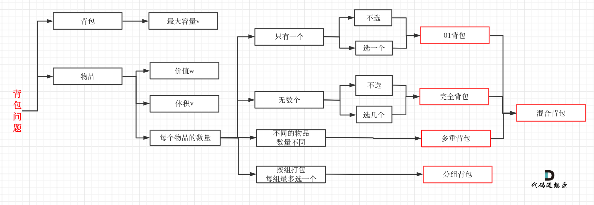

至于背包九讲其其他背包，面试几乎不会问，都是竞赛级别的了，leetcode上连多重背包的题目都没有，所以题库也告诉我们，01背包和完全背包就够用了。

而完全背包又是也是01背包稍作变化而来，即：完全背包的物品数量是无限的。

**所以背包问题的理论基础重中之重是01背包，一定要理解透！**

leetcode上没有纯01背包的问题，都是01背包应用方面的题目，也就是需要转化为01背包问题。

**所以我先通过纯01背包问题，把01背包原理讲清楚，后续再讲解leetcode题目的时候，重点就是讲解如何转化为** **01背包问题了**。

之前可能有些录友已经可以熟练写出背包了，但只要把这个文章仔细看完，相信你会意外收获！

### 01 背包

有n件物品和一个最多能背重量为w 的背包。第i件物品的重量是`weight[i]`，得到的价值是`value[i]` 。**每件物品只能** **用一次**，求解将哪些物品装入背包里物品价值总和最大。

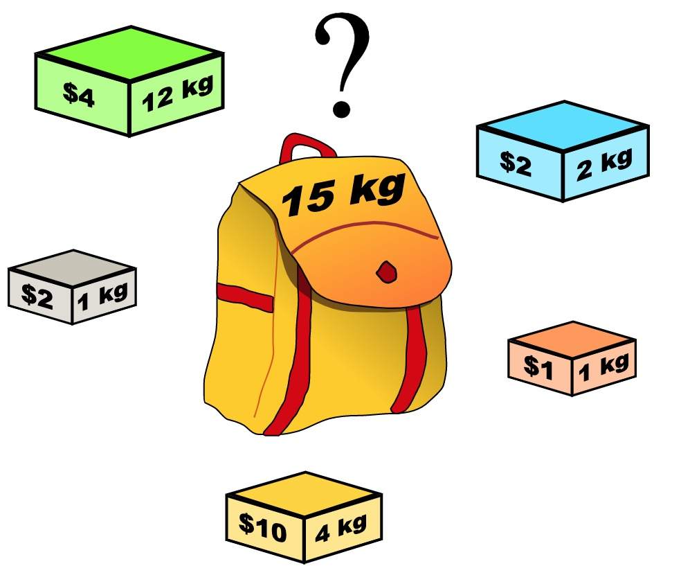

这是标准的背包问题，以至于很多同学看了这个自然就会想到背包，甚至都不知道暴力的解法应该怎么解了。

这样其实是没有从底向上去思考，而是习惯性想到了背包，那么暴力的解法应该是怎么样的呢？

每一件物品其实只有两个状态，取或者不取，所以可以使用回溯法搜索出所有的情况，那么时间复杂度就是`$o(2^n)$`，这里的n表示物品数量。

**所以暴力的解法是指数级别的时间复杂度。进而才需要动态规划的解法来进行优化！**

在下面的讲解中，我举一个例子：

背包最大重量为4。

物品为：

|  | 重量 | 价值 |
|---|---|---|
| 物品0 | 1 | 15 |
| 物品1 | 3 | 20 |
| 物品2 | 4 | 30 |

问背包能背的物品最大价值是多少？

以下讲解和图示中出现的数字都是以这个例子为例。

### 二维dp数组01背包

依然动规五部曲分析一波。

1. 确定dp数组以及下标的含义

对于背包问题，有一种写法， 是使用二维数组，即**dp[i][j] 表示从下标为[0-i]的物品里任意取，放进容量为j的背** **包，价值总和最大是多少**。

只看这个二维数组的定义，大家一定会有点懵，看下面这个图：

**要时刻记着这个dp数组的含义，下面的一些步骤都围绕这dp数组的含义进行的**，如果哪里看懵了，就来回顾一下i代表什么，j又代表什么。

2. 确定递推公式

再回顾一下`dp[i][j]`的含义：从下标为`[0-i]`的物品里任意取，放进容量为j的背包，价值总和最大是多少。

那么可以有两个方向推出来`dp[i][j]`，

- **不放物品i**：由`dp[i - 1][j]`推出，即背包容量为j，里面不放物品i的最大价值，此时`dp[i][j]`就是`dp[i - 1][j]`。`(`其实就是当物品i的重量大于背包j的重量时，物品i无法放进背包中，所以背包内的价值依然和前面相同。`)`
- **放物品i**：由`dp[i - 1][j - weight[i]]`推出，`dp[i - 1][j - weight[i]]` 为背包容量为`j - weight[i]`的时候不放物品i的最大价值，那么`dp[i - 1][j - weight[i]] + value[i]` （物品i的价值），就是背包放物品i得到的最大价值

所以递归公式： `dp[i][j] = max(dp[i - 1][j], dp[i - 1][j - weight[i]] + value[i]);`

3. dp数组如何初始化

**关于初始化，一定要和dp数组的定义吻合，否则到递推公式的时候就会越来越乱**。

首先从`dp[i][j]`的定义出发，如果背包容量j为0的话，即`dp[i][0]`，无论是选取哪些物品，背包价值总和一定为0。如图：

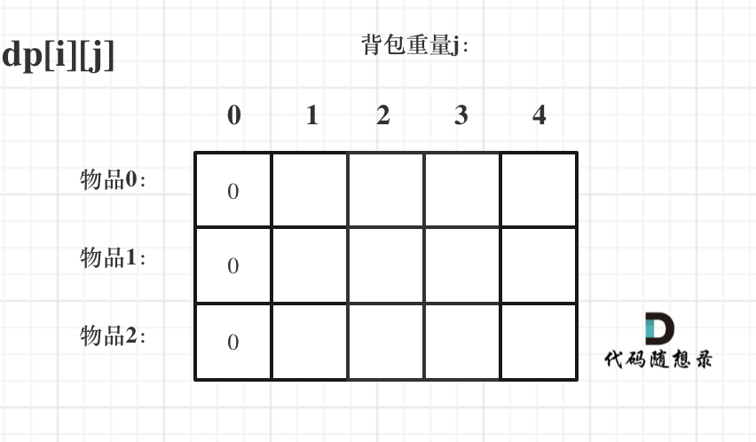

在看其他情况。

状态转移方程 `dp[i][j] = max(dp[i - 1][j], dp[i - 1][j - weight[i]] + value[i]);` 可以看出i 是由 i-1 推导出来，那么i为0的时候就一定要初始化。

`dp[0][j]`，即：i为0，存放编号0的物品的时候，各个容量的背包所能存放的最大价值。

那么很明显当 `j < weight[0]`的时候，`dp[0][j]` 应该是 0，因为背包容量比编号0的物品重量还小。

当`j >= weight[0]`时，`dp[0][j]` 应该是`value[0]`，因为背包容量放足够放编号0物品。

代码初始化如下：

```cpp
for (int j = 0 ; j < weight[0]; j++) {  // 当然这一步，如果把dp数组预先初始化为0了，这一步就可以
省略，但很多同学应该没有想清楚这一点。
    dp[0][j] = 0;
}
// 正序遍历
for (int j = weight[0]; j <= bagweight; j++) {
    dp[0][j] = value[0];
}
```

此时dp数组初始化情况如图所示：

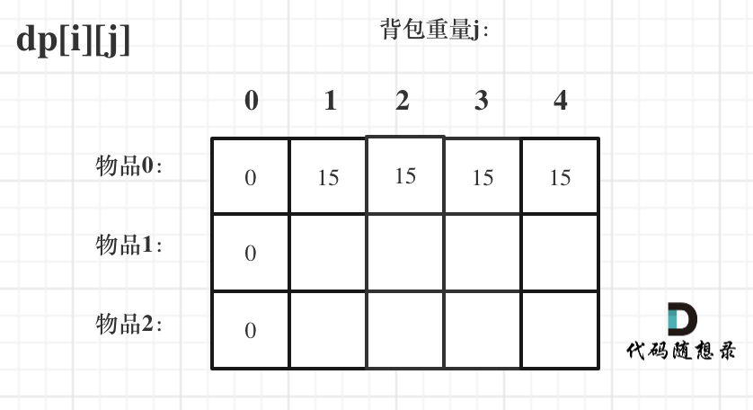

`dp[0][j]` 和 `dp[i][0]` 都已经初始化了，那么其他下标应该初始化多少呢？

其实从递归公式： `dp[i][j] = max(dp[i - 1][j], dp[i - 1][j - weight[i]] + value[i]);` 可以看出`dp[i][j]`  是由左上方数值推导出来了，那么 其他下标初始为什么数值都可以，因为都会被覆盖。

**初始-1，初始-2，初始100，都可以！**

但只不过一开始就统一把dp数组统一初始为0，更方便一些。

如图：

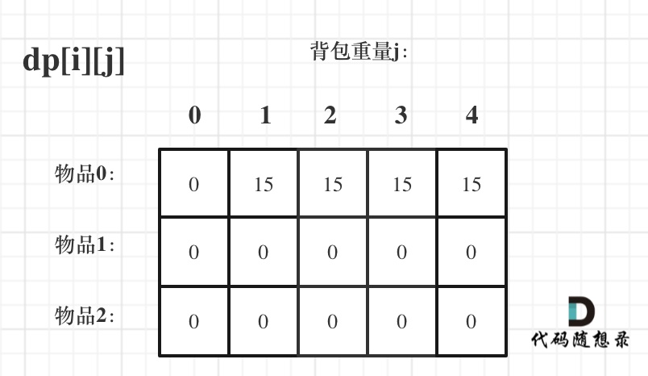

最后初始化代码如下：

```cpp
// 初始化 dp
vector<vector<int>> dp(weight.size(), vector<int>(bagweight + 1, 0));
for (int j = weight[0]; j <= bagweight; j++) {
    dp[0][j] = value[0];
}
```

**费了这么大的功夫，才把如何初始化讲清楚，相信不少同学平时初始化dp数组是凭感觉来的，但有时候感觉是不靠** **谱的**。

4. 确定遍历顺序

在如下图中，可以看出，有两个遍历的维度：物品与背包重量

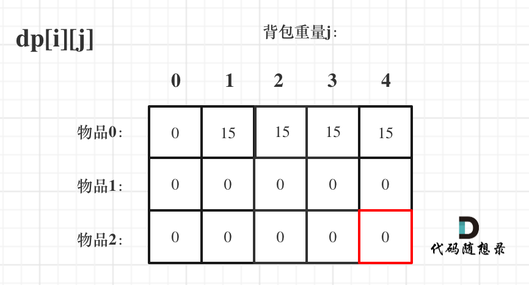

那么问题来了，**先遍历 物品还是先遍历背包重量呢？**

**其实都可以！！ 但是先遍历物品更好理解**。

那么我先给出先遍历物品，然后遍历背包重量的代码。

```cpp
// weight数组的大小 就是物品个数
for(int i = 1; i < weight.size(); i++) { // 遍历物品
    for(int j = 0; j <= bagweight; j++) { // 遍历背包容量
        if (j < weight[i]) dp[i][j] = dp[i - 1][j];
        else dp[i][j] = max(dp[i - 1][j], dp[i - 1][j - weight[i]] + value[i]);
    }
}
```

**先遍历背包，再遍历物品，也是可以的！（注意我这里使用的二维dp数组）**

例如这样：

```cpp
// weight数组的大小 就是物品个数
for(int j = 0; j <= bagweight; j++) { // 遍历背包容量
    for(int i = 1; i < weight.size(); i++) { // 遍历物品
        if (j < weight[i]) dp[i][j] = dp[i - 1][j];
        else dp[i][j] = max(dp[i - 1][j], dp[i - 1][j - weight[i]] + value[i]);
    }
}
```

为什么也是可以的呢？

**要理解递归的本质和递推的方向**。

`dp[i][j] = max(dp[i - 1][j], dp[i - 1][j - weight[i]] + value[i]);` 递归公式中可以看出`dp[i][j]`是靠`dp[i-1][j]`和`dp[i - 1][j -` `weight[i]]`推导出来的。

`dp[i-1][j]`和`dp[i - 1][j - weight[i]]` 都在`dp[i][j]`的左上角方向（包括正上方向），那么先遍历物品，再遍历背包的过程如图所示：

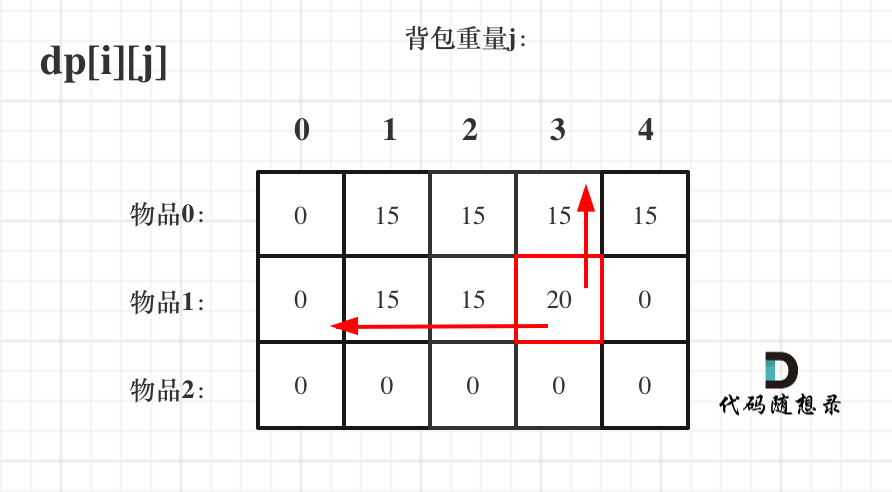

再来看看先遍历背包，再遍历物品呢，如图：

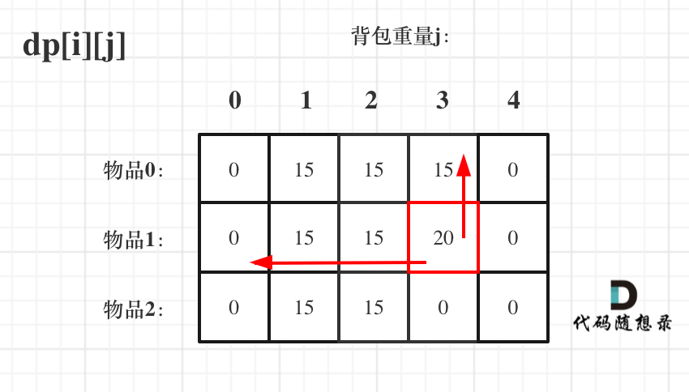

**大家可以看出，虽然两个for循环遍历的次序不同，但是dp[i][j]所需要的数据就是左上角，根本不影响dp[i][j]公式** **的推导！**

但先遍历物品再遍历背包这个顺序更好理解。

**其实背包问题里，两个for循环的先后循序是非常有讲究的，理解遍历顺序其实比理解推导公式难多了**。

5. 举例推导dp数组

来看一下对应的dp数组的数值，如图：

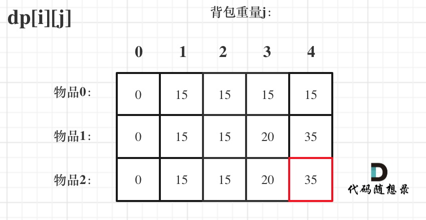

最终结果就是`dp[2][4]`。

建议大家此时自己在纸上推导一遍，看看dp数组里每一个数值是不是这样的。

**做动态规划的题目，最好的过程就是自己在纸上举一个例子把对应的dp数组的数值推导一下，然后在动手写代码！**

很多同学做dp题目，遇到各种问题，然后凭感觉东改改西改改，怎么改都不对，或者稀里糊涂就改过了。

主要就是自己没有动手推导一下dp数组的演变过程，如果推导明白了，代码写出来就算有问题，只要把dp数组打印出来，对比一下和自己推导的有什么差异，很快就可以发现问题了。

```cpp
void test_2_wei_bag_problem1() {
    vector<int> weight = {1, 3, 4};
    vector<int> value = {15, 20, 30};
    int bagweight = 4;
    // 二维数组
    vector<vector<int>> dp(weight.size(), vector<int>(bagweight + 1, 0));
    // 初始化
    for (int j = weight[0]; j <= bagweight; j++) {
        dp[0][j] = value[0];
    }
    // weight数组的大小 就是物品个数
    for(int i = 1; i < weight.size(); i++) { // 遍历物品
        for(int j = 0; j <= bagweight; j++) { // 遍历背包容量
            if (j < weight[i]) dp[i][j] = dp[i - 1][j];
            else dp[i][j] = max(dp[i - 1][j], dp[i - 1][j - weight[i]] + value[i]);
        }
    }
    cout << dp[weight.size() - 1][bagweight] << endl;
}
int main() {
    test_2_wei_bag_problem1();
}
```

## 总结

讲了这么多才刚刚把二维dp的01背包讲完，**这里大家其实可以发现最简单的是推导公式了，推导公式估计看一遍** **就记下来了，但难就难在如何初始化和遍历顺序上**。

可能有的同学并没有注意到初始化 和 遍历顺序的重要性，我们后面做力扣上背包面试题目的时候，大家就会感受出来了。

下一篇 还是理论基础，我们再来讲一维dp数组实现的01背包（滚动数组），分析一下和二维有什么区别，在初始化和遍历顺序上又有什么差异，敬请期待！

# 12. 动态规划：01背包理论基础（二）

## 算法公开课

[**《代码随想录》算法视频公开课**](https://programmercarl.com/other/gongkaike.html)**：**[**带你学透0-1背包问题！（滚动数组）**](https://www.bilibili.com/video/BV1BU4y177kY/)**，相信结合视频再看本篇题解，更有助于** **大家对本题的理解**。

## 思路

昨天[动态规划：关于01背包问题，你该了解这些！](https://programmercarl.com/%E8%83%8C%E5%8C%85%E7%90%86%E8%AE%BA%E5%9F%BA%E7%A1%8001%E8%83%8C%E5%8C%85-1.html)中是用二维dp数组来讲解01背包。

今天我们就来说一说滚动数组，其实在前面的题目中我们已经用到过滚动数组了，就是把二维dp降为一维dp，一些录友当时还表示比较困惑。

那么我们通过01背包，来彻底讲一讲滚动数组！

接下来还是用如下这个例子来进行讲解

背包最大重量为4。

物品为：

|  | 重量 | 价值 |
|---|---|---|
| 物品0 | 1 | 15 |
| 物品1 | 3 | 20 |
| 物品2 | 4 | 30 |

问背包能背的物品最大价值是多少？

### 一维dp数组（滚动数组）

对于背包问题其实状态都是可以压缩的。

在使用二维数组的时候，递推公式：`dp[i][j] = max(dp[i - 1][j], dp[i - 1][j - weight[i]] + value[i]);`

**其实可以发现如果把dp[i - 1]那一层拷贝到dp[i]上，表达式完全可以是：dp[i][j] = max(dp[i][j], dp[i][j -** **`weight[i]] + value[i]);`**

**与其把dp[i - 1]这一层拷贝到dp[i]上，不如只用一个一维数组了**，只用`dp[j]`（一维数组，也可以理解是一个滚动数组）。

这就是滚动数组的由来，需要满足的条件是上一层可以重复利用，直接拷贝到当前层。

读到这里估计大家都忘了 `dp[i][j]`里的i和j表达的是什么了，i是物品，j是背包容量。

**dp[i][j] 表示从下标为[0-i]的物品里任意取，放进容量为j的背包，价值总和最大是多少**。

一定要时刻记住这里i和j的含义，要不然很容易看懵了。

动规五部曲分析如下：

1. 确定dp数组的定义

在一维dp数组中，`dp[j]`表示：容量为j的背包，所背的物品价值可以最大为`dp[j]`。

2. 一维dp数组的递推公式

`dp[j]`为 容量为j的背包所背的最大价值，那么如何推导`dp[j]`呢？

`dp[j]`可以通过`dp[j - weight[i]]`推导出来，`dp[j - weight[i]]`表示容量为`j - weight[i]`的背包所背的最大价值。

`dp[j - weight[i]] + value[i]` 表示 容量为 j - 物品i重量 的背包 加上 物品i的价值。（也就是容量为j的背包，放入物品i了之后的价值即：`dp[j]`）

此时`dp[j]`有两个选择，一个是取自己`dp[j]` 相当于 二维dp数组中的`dp[i-1][j]`，即不放物品i，一个是取`dp[j -` `weight[i]] + value[i]`，即放物品i，指定是取最大的，毕竟是求最大价值，

所以递归公式为：

```cpp
dp[j] = max(dp[j], dp[j - weight[i]] + value[i]);
```

可以看出相对于二维dp数组的写法，就是把`dp[i][j]`中i的维度去掉了。

3. 一维dp数组如何初始化

**关于初始化，一定要和dp数组的定义吻合，否则到递推公式的时候就会越来越乱**。

`dp[j]`表示：容量为j的背包，所背的物品价值可以最大为`dp[j]`，那么`dp[0]`就应该是0，因为背包容量为0所背的物品的最大价值就是0。

那么dp数组除了下标0的位置，初始为0，其他下标应该初始化多少呢？

看一下递归公式：`dp[j] = max(dp[j], dp[j - weight[i]] + value[i]);`

dp数组在推导的时候一定是取价值最大的数，如果题目给的价值都是正整数那么非0下标都初始化为0就可以了。

**这样才能让dp数组在递归公式的过程中取的最大的价值，而不是被初始值覆盖了**。

那么我假设物品价值都是大于0的，所以dp数组初始化的时候，都初始为0就可以了。

4. 一维dp数组遍历顺序

代码如下：

```cpp
for(int i = 0; i < weight.size(); i++) { // 遍历物品
    for(int j = bagWeight; j >= weight[i]; j--) { // 遍历背包容量
        dp[j] = max(dp[j], dp[j - weight[i]] + value[i]);
    }
}
```

**这里大家发现和二维dp的写法中，遍历背包的顺序是不一样的！**

二维dp遍历的时候，背包容量是从小到大，而一维dp遍历的时候，背包是从大到小。

为什么呢？

**倒序遍历是为了保证物品i只被放入一次！**。但如果一旦正序遍历了，那么物品0就会被重复加入多次！

举一个例子：物品0的重量`weight[0] = 1`，价值`value[0] = 15`

如果正序遍历

`dp[1] = dp[1 - weight[0]] + value[0] = 15`

`dp[2] = dp[2 - weight[0]] + value[0] = 30`

此时`dp[2]`就已经是30了，意味着物品0，被放入了两次，所以不能正序遍历。

为什么倒序遍历，就可以保证物品只放入一次呢？

倒序就是先算`dp[2]`

`dp[2] = dp[2 - weight[0]] + value[0] = 15`  （dp数组已经都初始化为0）

`dp[1] = dp[1 - weight[0]] + value[0] = 15`

所以从后往前循环，每次取得状态不会和之前取得状态重合，这样每种物品就只取一次了。

**那么问题又来了，为什么二维dp数组历的时候不用倒序呢？**

因为对于二维dp，`dp[i][j]`都是通过上一层即`dp[i - 1][j]`计算而来，本层的`dp[i][j]`并不会被覆盖！

（如何这里读不懂，大家就要动手试一试了，空想还是不靠谱的，实践出真知！）

**再来看看两个嵌套for循环的顺序，代码中是先遍历物品嵌套遍历背包容量，那可不可以先遍历背包容量嵌套遍历** **物品呢？**

不可以！

因为一维dp的写法，背包容量一定是要倒序遍历（原因上面已经讲了），如果遍历背包容量放在上一层，那么每个`dp[j]`就只会放入一个物品，即：背包里只放入了一个物品。

倒序遍历的原因是，本质上还是一个对二维数组的遍历，并且右下角的值依赖上一层左上角的值，因此需要保证左边的值仍然是上一层的，从右向左覆盖。

（这里如果读不懂，就再回想一下`dp[j]`的定义，或者就把两个for循环顺序颠倒一下试试！）

**所以一维dp数组的背包在遍历顺序上和二维其实是有很大差异的！**，这一点大家一定要注意。

5. 举例推导dp数组

一维dp，分别用物品0，物品1，物品2 来遍历背包，最终得到结果如下：

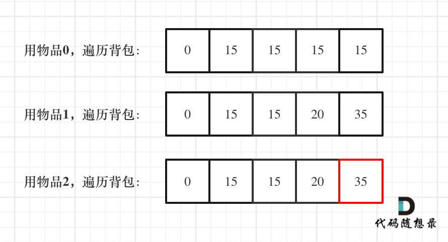

```cpp
void test_1_wei_bag_problem() {
    vector<int> weight = {1, 3, 4};
    vector<int> value = {15, 20, 30};
    int bagWeight = 4;
    // 初始化
    vector<int> dp(bagWeight + 1, 0);
    for(int i = 0; i < weight.size(); i++) { // 遍历物品
        for(int j = bagWeight; j >= weight[i]; j--) { // 遍历背包容量
            dp[j] = max(dp[j], dp[j - weight[i]] + value[i]);
        }
    }
    cout << dp[bagWeight] << endl;
}
int main() {
    test_1_wei_bag_problem();
}
```

可以看出，一维dp 的01背包，要比二维简洁的多！ 初始化 和 遍历顺序相对简单了。

**所以我倾向于使用一维dp数组的写法，比较直观简洁，而且空间复杂度还降了一个数量级！**

**在后面背包问题的讲解中，我都直接使用一维dp数组来进行推导**。

## 总结

以上的讲解可以开发一道面试题目（毕竟力扣上没原题）。

就是本文中的题目，要求先实现一个纯二维的01背包，如果写出来了，然后再问为什么两个for循环的嵌套顺序这么写？反过来写行不行？再讲一讲初始化的逻辑。

然后要求实现一个一维数组的01背包，最后再问，一维数组的01背包，两个for循环的顺序反过来写行不行？为什么？

注意以上问题都是在候选人把代码写出来的情况下才问的。

就是纯01背包的题目，都不用考01背包应用类的题目就可以看出候选人对算法的理解程度了。

**相信大家读完这篇文章，应该对以上问题都有了答案！**

此时01背包理论基础就讲完了，我用了两篇文章把01背包的dp数组定义、递推公式、初始化、遍历顺序从二维数组到一维数组统统深度剖析了一遍，没有放过任何难点。

大家可以发现其实信息量还是挺大的。

如果把[动态规划：关于01背包问题，你该了解这些！](https://programmercarl.com/%E8%83%8C%E5%8C%85%E7%90%86%E8%AE%BA%E5%9F%BA%E7%A1%8001%E8%83%8C%E5%8C%85-1.html)和本篇的内容都理解了，后面我们在做01背包的题目，就会发现非常简单了。

不用再凭感觉或者记忆去写背包，而是有自己的思考，了解其本质，代码的方方面面都在自己的掌控之中。

即使代码没有通过，也会有自己的逻辑去debug，这样就思维清晰了。

接下来就要开始用这两天的理论基础去做力扣上的背包面试题目了，录友们握紧扶手，我们要上高速啦！

# 13. 分割等和子集

[力扣题目链接](https://leetcode.cn/problems/partition-equal-subset-sum/)

题目难易：中等

给定一个只包含正整数的非空数组。是否可以将这个数组分割成两个子集，使得两个子集的元素和相等。

注意:每个数组中的元素不会超过 100数组的大小不会超过 200

示例 1:

- 输入`: [1, 5, 11, 5]`
- 输出: true
- 解释: 数组可以分割成 `[1, 5, 5]` 和 `[11].`

示例 2:

- 输入`: [1, 2, 3, 5]`
- 输出: false

- 解释: 数组不能分割成两个元素和相等的子集.

提示：

- `1 <= nums.length <= 200`
- `1 <= nums[i] <= 100`

## 算法公开课

[**《代码随想录》算法视频公开课**](https://programmercarl.com/other/gongkaike.html)**：**[**动态规划之背包问题，这个包能装满吗？| LeetCode：416.分割等和子集**](https://www.bilibili.com/video/BV1rt4y1N7jE/)**，相** **信结合视频再看本篇题解，更有助于大家对本题的理解**。

## 思路

这道题目初步看，和如下两题几乎是一样的，大家可以用回溯法，解决如下两题

- 698.划分为k个相等的子集
- 473.火柴拼正方形

这道题目是要找是否可以将这个数组分割成两个子集，使得两个子集的元素和相等。

那么只要找到集合里能够出现 sum / 2 的子集总和，就算是可以分割成两个相同元素和子集了。

本题是可以用回溯暴力搜索出所有答案的，但最后超时了，也不想再优化了，放弃回溯，直接上01背包吧。

如果对01背包不够了解，建议仔细看完如下两篇：

- [动态规划：关于01背包问题，你该了解这些！](https://programmercarl.com/%E8%83%8C%E5%8C%85%E7%90%86%E8%AE%BA%E5%9F%BA%E7%A1%8001%E8%83%8C%E5%8C%85-1.html)
- [动态规划：关于01背包问题，你该了解这些！（滚动数组）](https://programmercarl.com/%E8%83%8C%E5%8C%85%E7%90%86%E8%AE%BA%E5%9F%BA%E7%A1%8001%E8%83%8C%E5%8C%85-2.html)

### 01背包问题

背包问题，大家都知道，有N件物品和一个最多能背重量为W 的背包。第i件物品的重量是`weight[i]`，得到的价值是`value[i]` 。每件物品只能用一次，求解将哪些物品装入背包里物品价值总和最大。

**背包问题有多种背包方式，常见的有：01背包、完全背包、多重背包、分组背包和混合背包等等。**

要注意题目描述中商品是不是可以重复放入。

**即一个商品如果可以重复多次放入是完全背包，而只能放入一次是01背包，写法还是不一样的。**

**要明确本题中我们要使用的是01背包，因为元素我们只能用一次。**

回归主题：首先，本题要求集合里能否出现总和为 sum / 2 的子集。

那么来一一对应一下本题，看看背包问题如何来解决。

**只有确定了如下四点，才能把01背包问题套到本题上来。**

- 背包的体积为sum / 2
- 背包要放入的商品（集合里的元素）重量为 元素的数值，价值也为元素的数值
- 背包如果正好装满，说明找到了总和为 sum / 2 的子集。
- 背包中每一个元素是不可重复放入。

以上分析完，我们就可以套用01背包，来解决这个问题了。

动规五部曲分析如下：

1. 确定dp数组以及下标的含义

01背包中，`dp[j]` 表示： 容量为j的背包，所背的物品价值最大可以为`dp[j]`。

本题中每一个元素的数值既是重量，也是价值。

**套到本题，dp[j]表示 背包总容量（所能装的总重量）是j，放进物品后，背的最大重量为dp[j]**。

那么如果背包容量为target， `dp[target]`就是装满 背包之后的重量，所以 当 `dp[target] == target` 的时候，背包就装满了。

有录友可能想，那还有装不满的时候？ 

拿输入数组 `[1, 5, 11, 5]`，举例， `dp[7]` 只能等于 6，因为 只能放进 1 和 5。

而`dp[6]` 就可以等于6了，放进1 和 5，那么`dp[6] == 6`，说明背包装满了。

2. 确定递推公式

01背包的递推公式为：`dp[j] = max(dp[j], dp[j - weight[i]] + value[i]);`

本题，相当于背包里放入数值，那么物品i的重量是`nums[i]`，其价值也是`nums[i]`。

所以递推公式：`dp[j] = max(dp[j], dp[j - nums[i]] + nums[i]);`

3. dp数组如何初始化

在01背包，一维dp如何初始化，已经讲过，

从`dp[j]`的定义来看，首先`dp[0]`一定是0。

如果题目给的价值都是正整数那么非0下标都初始化为0就可以了，如果题目给的价值有负数，那么非0下标就要初始化为负无穷。

**这样才能让dp数组在递推的过程中取得最大的价值，而不是被初始值覆盖了**。

本题题目中 只包含正整数的非空数组，所以非0下标的元素初始化为0就可以了。

代码如下：

```cpp
// 题目中说：每个数组中的元素不会超过 100，数组的大小不会超过 200
// 总和不会大于20000，背包最大只需要其中一半，所以10001大小就可以了
vector<int> dp(10001, 0);
```

4. 确定遍历顺序

在[动态规划：关于01背包问题，你该了解这些！（滚动数组）](https://programmercarl.com/%E8%83%8C%E5%8C%85%E7%90%86%E8%AE%BA%E5%9F%BA%E7%A1%8001%E8%83%8C%E5%8C%85-2.html)中就已经说明：如果使用一维dp数组，物品遍历的for循环放在外层，遍历背包的for循环放在内层，且内层for循环倒序遍历！

代码如下：

```cpp
// 开始 01背包
for(int i = 0; i < nums.size(); i++) {
    for(int j = target; j >= nums[i]; j--) { // 每一个元素一定是不可重复放入，所以从大到小遍历
        dp[j] = max(dp[j], dp[j - nums[i]] + nums[i]);
    }
}
```

5. 举例推导dp数组

`dp[j]`的数值一定是小于等于j的。

**如果dp[j] == j 说明，集合中的子集总和正好可以凑成总和j，理解这一点很重要。**

用例1，输入`[1,5,11,5]` 为例，如图：

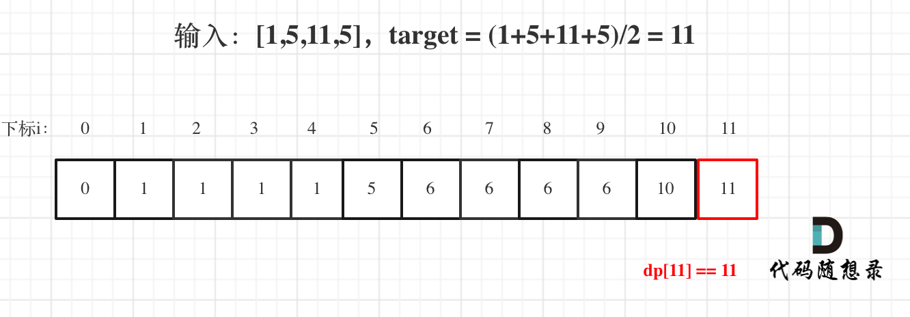

最后`dp[11] == 11`，说明可以将这个数组分割成两个子集，使得两个子集的元素和相等。

综上分析完毕，`C++`代码如下：

```cpp
class Solution {
public:
    bool canPartition(vector<int>& nums) {
        int sum = 0;
        // dp[i]中的i表示背包内总和
        // 题目中说：每个数组中的元素不会超过 100，数组的大小不会超过 200
        // 总和不会大于20000，背包最大只需要其中一半，所以10001大小就可以了
        vector<int> dp(10001, 0);
        for (int i = 0; i < nums.size(); i++) {
            sum += nums[i];
        }
        // 也可以使用库函数一步求和
        // int sum = accumulate(nums.begin(), nums.end(), 0);
        if (sum % 2 == 1) return false;
        int target = sum / 2;
        // 开始 01背包
        for(int i = 0; i < nums.size(); i++) {
            for(int j = target; j >= nums[i]; j--) { // 每一个元素一定是不可重复放入，所以从大
到小遍历
                dp[j] = max(dp[j], dp[j - nums[i]] + nums[i]);
            }
        }
        // 集合中的元素正好可以凑成总和target
        if (dp[target] == target) return true;
        return false;
    }
};
```

- 时间复杂度：`O(n^2)`
- 空间复杂度：`O(n)`，虽然dp数组大小为一个常数，但是大常数

## 总结

这道题目就是一道01背包应用类的题目，需要我们拆解题目，然后套入01背包的场景。

01背包相对于本题，主要要理解，题目中物品是`nums[i]`，重量是`nums[i]`，价值也是`nums[i]`，背包体积是sum/2。

看代码的话，就可以发现，基本就是按照01背包的写法来的。

# 14.最后一块石头的重量II

[力扣题目链接](https://leetcode.cn/problems/last-stone-weight-ii/)

题目难度：中等

有一堆石头，每块石头的重量都是正整数。

每一回合，从中选出任意两块石头，然后将它们一起粉碎。假设石头的重量分别为 x 和 y，且 `x <= y`。那么粉碎的可能结果如下：

如果 `x == y`，那么两块石头都会被完全粉碎；

如果 `x != y`，那么重量为 x 的石头将会完全粉碎，而重量为 y 的石头新重量为 y-x。

最后，最多只会剩下一块石头。返回此石头最小的可能重量。如果没有石头剩下，就返回 0。

示例：

- 输入：`[2,7,4,1,8,1]`
- 输出：1

解释：

- 组合 2 和 4，得到 2，所以数组转化为 `[2,7,1,8,1]`，
- 组合 7 和 8，得到 1，所以数组转化为 `[2,1,1,1]`，
- 组合 2 和 1，得到 1，所以数组转化为 `[1,1,1]`，

- 组合 1 和 1，得到 0，所以数组转化为 `[1]`，这就是最优值。

提示：

- `1 <= stones.length <= 30`
- `1 <= stones[i] <= 1000`

## 算法公开课

[**《代码随想录》算法视频公开课**](https://programmercarl.com/other/gongkaike.html)**：**[**这个背包最多能装多少？LeetCode：1049.最后一块石头的重量II**](https://www.bilibili.com/video/BV14M411C7oV/)**，相信结合视** **频再看本篇题解，更有助于大家对本题的理解**。

## 思路

如果对背包问题不都熟悉先看这两篇：

- [动态规划：关于01背包问题，你该了解这些！](https://programmercarl.com/%E8%83%8C%E5%8C%85%E7%90%86%E8%AE%BA%E5%9F%BA%E7%A1%8001%E8%83%8C%E5%8C%85-1.html)
- [动态规划：关于01背包问题，你该了解这些！（滚动数组）](https://programmercarl.com/%E8%83%8C%E5%8C%85%E7%90%86%E8%AE%BA%E5%9F%BA%E7%A1%8001%E8%83%8C%E5%8C%85-2.html)

本题其实就是尽量让石头分成重量相同的两堆，相撞之后剩下的石头最小，**这样就化解成01背包问题了**。

是不是感觉和昨天讲解的[416. 分割等和子集](https://programmercarl.com/0416.%E5%88%86%E5%89%B2%E7%AD%89%E5%92%8C%E5%AD%90%E9%9B%86.html)非常像了。

本题物品的重量为`stones[i]`，物品的价值也为`stones[i]`。

对应着01背包里的物品重量`weight[i]`和 物品价值`value[i]`。

接下来进行动规五步曲：

1. 确定dp数组以及下标的含义

**dp[j]表示容量（这里说容量更形象，其实就是重量）为j的背包，最多可以背最大重量为dp[j]**。

可以回忆一下01背包中，`dp[j]`的含义，容量为j的背包，最多可以装的价值为 `dp[j]`。

相对于 01背包，本题中，石头的重量是 `stones[i]`，石头的价值也是 `stones[i]` ，可以 “最多可以装的价值为 `dp[j]”` `== “`最多可以背的重量为`dp[j]”`

2. 确定递推公式

01背包的递推公式为：`dp[j] = max(dp[j], dp[j - weight[i]] + value[i]);`

本题则是：**`dp[j] = max(dp[j], dp[j - stones[i]] + stones[i]);`**

一些同学可能看到这`dp[j - stones[i]] + stones[i]`中 又有`- stones[i]` 又有`+stones[i]`，看着有点晕乎。

大家可以再去看 `dp[j]`的含义。

3. dp数组如何初始化

既然 `dp[j]`中的j表示容量，那么最大容量（重量）是多少呢，就是所有石头的重量和。

因为提示中给出`1 <= stones.length <= 30`，`1 <= stones[i] <= 1000`，所以最大重量就是30 * 1000 。

而我们要求的target其实只是最大重量的一半，所以dp数组开到15000大小就可以了。

当然也可以把石头遍历一遍，计算出石头总重量 然后除2，得到dp数组的大小。

我这里就直接用15000了。

接下来就是如何初始化`dp[j]`呢，因为重量都不会是负数，所以`dp[j]`都初始化为0就可以了，这样在递归公式`dp[j] =` `max(dp[j], dp[j - stones[i]] + stones[i]);`中`dp[j]`才不会初始值所覆盖。

代码为：

```cpp
vector<int> dp(15001, 0);
```

4. 确定遍历顺序

在[动态规划：关于01背包问题，你该了解这些！（滚动数组）](https://programmercarl.com/%E8%83%8C%E5%8C%85%E7%90%86%E8%AE%BA%E5%9F%BA%E7%A1%8001%E8%83%8C%E5%8C%85-2.html)中就已经说明：如果使用一维dp数组，物品遍历的for循环放在外层，遍历背包的for循环放在内层，且内层for循环倒序遍历！

代码如下：

```cpp
for (int i = 0; i < stones.size(); i++) { // 遍历物品
    for (int j = target; j >= stones[i]; j--) { // 遍历背包
        dp[j] = max(dp[j], dp[j - stones[i]] + stones[i]);
    }
}
```

5. 举例推导dp数组

举例，输入：`[2,4,1,1]`，此时`target = (2 + 4 + 1 + 1)/2 = 4` ，dp数组状态图如下：


最后`dp[target]`里是容量为target的背包所能背的最大重量。

那么分成两堆石头，一堆石头的总重量是`dp[target]`，另一堆就是`sum - dp[target]`。

**在计算target的时候，target = sum / 2 因为是向下取整，所以sum - dp[target] 一定是大于等于dp[target]** **的**。

那么相撞之后剩下的最小石头重量就是 `(sum - dp[target]) - dp[target]`。

以上分析完毕，`C++`代码如下：

```cpp
class Solution {
public:
    int lastStoneWeightII(vector<int>& stones) {
        vector<int> dp(15001, 0);
        int sum = 0;
        for (int i = 0; i < stones.size(); i++) sum += stones[i];
        int target = sum / 2;
        for (int i = 0; i < stones.size(); i++) { // 遍历物品
            for (int j = target; j >= stones[i]; j--) { // 遍历背包
                dp[j] = max(dp[j], dp[j - stones[i]] + stones[i]);
            }
        }
        return sum - dp[target] - dp[target];
    }
};
```

- 时间复杂度：`O(m × n) , m`是石头总重量（准确的说是总重量的一半），n为石头块数
- 空间复杂度：`O(m)`

## 总结

本题其实和[416. 分割等和子集](https://programmercarl.com/0416.%E5%88%86%E5%89%B2%E7%AD%89%E5%92%8C%E5%AD%90%E9%9B%86.html)几乎是一样的，只是最后对`dp[target]`的处理方式不同。

[416. 分割等和子集](https://programmercarl.com/0416.%E5%88%86%E5%89%B2%E7%AD%89%E5%92%8C%E5%AD%90%E9%9B%86.html)相当于是求背包是否正好装满，而本题是求背包最多能装多少。

# 15. 本周小结！（动态规划系列三）

本周我们正式开始讲解背包问题，也是动规里非常重要的一类问题。

背包问题其实有很多细节，如果了解个大概，然后也能一气呵成把代码写出来，但稍稍变变花样可能会陷入迷茫了。

开始回顾一下本周的内容吧！

## 周一

[动态规划：关于01背包问题，你该了解这些！](https://programmercarl.com/%E8%83%8C%E5%8C%85%E7%90%86%E8%AE%BA%E5%9F%BA%E7%A1%8001%E8%83%8C%E5%8C%85-1.html)中，我们开始介绍了背包问题。

首先对于背包的所有问题中，01背包是最最基础的，其他背包也是在01背包的基础上稍作变化。

所以我才花费这么大精力去讲解01背包。

关于其他几种常用的背包，大家看这张图就了然于胸了：


本文用动规五部曲详细讲解了01背包的二维dp数组的实现方法，大家其实可以发现最简单的是推导公式了，推导公式估计看一遍就记下来了，但难就难在确定初始化和遍历顺序上。

1. 确定dp数组以及下标的含义

`dp[i][j]` 表示从下标为`[0-i]`的物品里任意取，放进容量为j的背包，价值总和最大是多少。

2. 确定递推公式

`dp[i][j] = max(dp[i - 1][j], dp[i - 1][j - weight[i]] + value[i]);`

3. dp数组如何初始化

```cpp
// 初始化 dp
vector<vector<int>> dp(weight.size() + 1, vector<int>(bagWeight + 1, 0));
for (int j = bagWeight; j >= weight[0]; j--) {
    dp[0][j] = dp[0][j - weight[0]] + value[0];
}
```

4. 确定遍历顺序

**01背包二维dp数组在遍历顺序上，外层遍历物品 ，内层遍历背包容量 和 外层遍历背包容量 ，内层遍历物品 都是** **可以的！**

但是先遍历物品更好理解。代码如下：

```cpp
// weight数组的大小 就是物品个数
for(int i = 1; i < weight.size(); i++) { // 遍历物品
    for(int j = 0; j <= bagWeight; j++) { // 遍历背包容量
        if (j < weight[i]) dp[i][j] = dp[i - 1][j]; // 这个是为了展现dp数组里元素的变化
        else dp[i][j] = max(dp[i - 1][j], dp[i - 1][j - weight[i]] + value[i]);
    }
}
```

5. 举例推导dp数组

背包最大重量为4。

物品为：

|  | 重量 | 价值 |
|---|---|---|
| 物品0 | 1 | 15 |
| 物品1 | 3 | 20 |
| 物品2 | 4 | 30 |

来看一下对应的dp数组的数值，如图：


最终结果就是`dp[2][4]`。

## 周二

[动态规划：关于01背包问题，你该了解这些！（滚动数组）](https://programmercarl.com/%E8%83%8C%E5%8C%85%E7%90%86%E8%AE%BA%E5%9F%BA%E7%A1%8001%E8%83%8C%E5%8C%85-2.html)中把01背包的一维dp数组（滚动数组）实现详细讲解了一遍。

分析一下和二维dp数组有什么区别，在初始化和遍历顺序上又有什么差异？

最后总结了一道朴实无华的背包面试题。

要求候选人先实现一个纯二维的01背包，如果写出来了，然后再问为什么两个for循环的嵌套顺序这么写？反过来写行不行？再讲一讲初始化的逻辑。

然后要求实现一个一维数组的01背包，最后再问，一维数组的01背包，两个for循环的顺序反过来写行不行？为什么？

这几个问题就可以考察出候选人的算法功底了。

01背包一维数组分析如下：

1. 确定dp数组的定义

在一维dp数组中，`dp[j]`表示：容量为j的背包，所背的物品价值可以最大为`dp[j]`。

2. 一维dp数组的递推公式

```cpp
dp[j] = max(dp[j], dp[j - weight[i]] + value[i]);
```

3. 一维dp数组如何初始化

如果物品价值都是大于0的，所以dp数组初始化的时候，都初始为0就可以了。

4. 一维dp数组遍历顺序代码如下：

```cpp
for(int i = 0; i < weight.size(); i++) { // 遍历物品
    for(int j = bagWeight; j >= weight[i]; j--) { // 遍历背包容量
        dp[j] = max(dp[j], dp[j - weight[i]] + value[i]);
    }
}
```

5. 举例推导dp数组

一维dp，分别用物品0，物品1，物品2 来遍历背包，最终得到结果如下：


## 周三

[动态规划：416. 分割等和子集](https://programmercarl.com/0416.%E5%88%86%E5%89%B2%E7%AD%89%E5%92%8C%E5%AD%90%E9%9B%86.html)中我们开始用01背包来解决问题。

只有确定了如下四点，才能把01背包问题套到本题上来。

- 背包的体积为sum / 2
- 背包要放入的商品（集合里的元素）重量为 元素的数值，价值也为元素的数值
- 背包如何正好装满，说明找到了总和为 sum / 2 的子集。
- 背包中每一个元素是不可重复放入。

接下来就是一个完整的01背包问题，大家应该可以轻松做出了。

## 周四

[动态规划：1049. 最后一块石头的重量 II](https://programmercarl.com/1049.%E6%9C%80%E5%90%8E%E4%B8%80%E5%9D%97%E7%9F%B3%E5%A4%B4%E7%9A%84%E9%87%8D%E9%87%8FII.html)这道题目其实和[动态规划：416. 分割等和子集](https://programmercarl.com/0416.%E5%88%86%E5%89%B2%E7%AD%89%E5%92%8C%E5%AD%90%E9%9B%86.html)是非常像的。

本题其实就是尽量让石头分成重量相同的两堆，相撞之后剩下的石头最小，这样就化解成01背包问题了。

[动态规划：416. 分割等和子集](https://programmercarl.com/0416.%E5%88%86%E5%89%B2%E7%AD%89%E5%92%8C%E5%AD%90%E9%9B%86.html)相当于是求背包是否正好装满，而本题是求背包最多能装多少。

这两道题目是对`dp[target]`的处理方式不同。这也考验的对`dp[i]`定义的理解。

## 总结

总体来说，本周信息量还是比较大的，特别对于对动态规划还不够了解的同学。

但如果坚持下来把，我在文章中列出的每一个问题，都仔细思考，消化为自己的知识，那么进步一定是飞速的。

有的同学可能看了看背包递推公式，上来就能撸它几道题目，然后背包问题就这么过去了，其实这样是很不牢固的。

就像是我们讲解01背包的时候，花了那么大力气才把每一个细节都讲清楚，这里其实是基础，后面的背包问题怎么变，基础比较牢固自然会有自己的一套思考过程。

# 16.目标和

[力扣题目链接](https://leetcode.cn/problems/target-sum/)

难度：中等

给定一个非负整数数组，a1, a2, ..., an, 和一个目标数，S。现在你有两个符号 + 和 -。对于数组中的任意一个整数，你都可以从 + 或 -中选择一个符号添加在前面。

返回可以使最终数组和为目标数 S 的所有添加符号的方法数。

示例：

- 输入：`nums: [1, 1, 1, 1, 1], S: 3` 
- 输出：5 

解释： 

- `-1+1+1+1+1 = 3` 
- `+1-1+1+1+1 = 3` 
- `+1+1-1+1+1 = 3` 
- `+1+1+1-1+1 = 3` 
- `+1+1+1+1-1 = 3` 

一共有5种方法让最终目标和为3。

提示：

- 数组非空，且长度不会超过 20 。
- 初始的数组的和不会超过 1000 。
- 保证返回的最终结果能被 32 位整数存下。

## 算法公开课

[**《代码随想录》算法视频公开课**](https://programmercarl.com/other/gongkaike.html)**：**[**装满背包有多少种方法？| LeetCode：494.目标和**](https://www.bilibili.com/video/BV1o8411j73x/)**，相信结合视频再看本篇题** **解，更有助于大家对本题的理解**。

## 思路

如果对背包问题不都熟悉先看这两篇：

- [动态规划：关于01背包问题，你该了解这些！](https://programmercarl.com/%E8%83%8C%E5%8C%85%E7%90%86%E8%AE%BA%E5%9F%BA%E7%A1%8001%E8%83%8C%E5%8C%85-1.html)
- [动态规划：关于01背包问题，你该了解这些！（滚动数组）](https://programmercarl.com/%E8%83%8C%E5%8C%85%E7%90%86%E8%AE%BA%E5%9F%BA%E7%A1%8001%E8%83%8C%E5%8C%85-2.html)

如果跟着「代码随想录」一起学过[回溯算法系列](https://programmercarl.com/%E5%9B%9E%E6%BA%AF%E6%80%BB%E7%BB%93.html)的录友，看到这道题，应该有一种直觉，就是感觉好像回溯法可以爆搜出来。

事实确实如此，下面我也会给出相应的代码，只不过会超时，哈哈。

这道题目咋眼一看和动态规划背包啥的也没啥关系。

本题要如何使表达式结果为target，

既然为target，那么就一定有 left组合 - right组合 `= target`。

`left + right = sum`，而sum是固定的。`right = sum - left`  

公式来了， `left - (sum - left) = target` 推导出  `left = (target + sum)/2` 。

target是固定的，sum是固定的，left就可以求出来。

此时问题就是在集合nums中找出和为left的组合。

### 回溯算法

在回溯算法系列中，一起学过这道题目[回溯算法：39. 组合总和](https://programmercarl.com/0039.%E7%BB%84%E5%90%88%E6%80%BB%E5%92%8C.html)的录友应该感觉很熟悉，这不就是组合总和问题么？

此时可以套组合总和的回溯法代码，几乎不用改动。

当然，也可以转变成序列区间选+ 或者 -，使用回溯法，那就是另一个解法。

我也把代码给出来吧，大家可以了解一下，回溯的解法，以下是本题转变为组合总和问题的回溯法代码：

```cpp
class Solution {
private:
    vector<vector<int>> result;
    vector<int> path;
    void backtracking(vector<int>& candidates, int target, int sum, int startIndex) {
        if (sum == target) {
            result.push_back(path);
        }
        // 如果 sum + candidates[i] > target 就终止遍历
        for (int i = startIndex; i < candidates.size() && sum + candidates[i] <=
target; i++) {
            sum += candidates[i];
            path.push_back(candidates[i]);
            backtracking(candidates, target, sum, i + 1);
            sum -= candidates[i];
            path.pop_back();
        }
    }
public:
    int findTargetSumWays(vector<int>& nums, int S) {
        int sum = 0;
        for (int i = 0; i < nums.size(); i++) sum += nums[i];
        if (S > sum) return 0; // 此时没有方案
        if ((S + sum) % 2) return 0; // 此时没有方案，两个int相加的时候要各位小心数值溢出的问题
        int bagSize = (S + sum) / 2; // 转变为组合总和问题，bagsize就是要求的和
        // 以下为回溯法代码
        result.clear();
        path.clear();
        sort(nums.begin(), nums.end()); // 需要排序
        backtracking(nums, bagSize, 0, 0);
        return result.size();
    }
};
```

当然以上代码超时了。

也可以使用记忆化回溯，但这里我就不在回溯上下功夫了，直接看动规吧

### 动态规划

如何转化为01背包问题呢。

假设加法的总和为x，那么减法对应的总和就是sum - x。

所以我们要求的是 `x - (sum - x) = target`

`x = (target + sum) / 2`

**此时问题就转化为，装满容量为x的背包，有几种方法**。

这里的x，就是bagSize，也就是我们后面要求的背包容量。

大家看到`(target + sum) / 2` 应该担心计算的过程中向下取整有没有影响。

这么担心就对了，例如sum 是5，S是2的话其实就是无解的，所以：

```cpp
（C++代码中，输入的S 就是题目描述的 target）
if ((S + sum) % 2 == 1) return 0; // 此时没有方案
```

同时如果 S的绝对值已经大于sum，那么也是没有方案的。

```cpp
（C++代码中，输入的S 就是题目描述的 target）
if (abs(S) > sum) return 0; // 此时没有方案
```

再回归到01背包问题，为什么是01背包呢？

因为每个物品（题目中的1）只用一次！

这次和之前遇到的背包问题不一样了，之前都是求容量为j的背包，最多能装多少。

本题则是装满有几种方法。其实这就是一个组合问题了。

1. 确定dp数组以及下标的含义

`dp[j]` 表示：填满j（包括j）这么大容积的包，有`dp[j]`种方法

其实也可以使用二维dp数组来求解本题，`dp[i][j]`：使用 下标为`[0, i]`的`nums[i]`能够凑满j（包括j）这么大容量的包，有`dp[i][j]`种方法。

下面我都是统一使用一维数组进行讲解， 二维降为一维（滚动数组），其实就是上一层拷贝下来，这个我在动态规划：关于01背包问题，你该了解这些！（滚动数组）也有介绍。

2. 确定递推公式

有哪些来源可以推出`dp[j]`呢？

只要搞到`nums[i]`，凑成`dp[j]`就有`dp[j - nums[i]]` 种方法。

例如：`dp[j]`，j 为5， 

- 已经有一个1（`nums[i]`） 的话，有 `dp[4]`种方法 凑成 容量为5的背包。
- 已经有一个2（`nums[i]`） 的话，有 `dp[3]`种方法 凑成 容量为5的背包。
- 已经有一个3（`nums[i]`） 的话，有 `dp[2]`中方法 凑成 容量为5的背包
- 已经有一个4（`nums[i]`） 的话，有 `dp[1]`中方法 凑成 容量为5的背包
- 已经有一个5 （`nums[i]`）的话，有 `dp[0]`中方法 凑成 容量为5的背包

那么凑整`dp[5]`有多少方法呢，也就是把 所有的 `dp[j - nums[i]]` 累加起来。

所以求组合类问题的公式，都是类似这种：

```text
dp[j] += dp[j - nums[i]]
```

**这个公式在后面在讲解背包解决排列组合问题的时候还会用到！**

3. dp数组如何初始化

从递推公式可以看出，在初始化的时候`dp[0]` 一定要初始化为1，因为`dp[0]`是在公式中一切递推结果的起源，如果`dp[0]`是0的话，递推结果将都是0。

这里有录友可能认为从dp数组定义来说 `dp[0]` 应该是0，也有录友认为`dp[0]`应该是1。 

其实不要硬去解释它的含义，咱就把 `dp[0]`的情况带入本题看看应该等于多少。 

如果数组`[0]` ，`target = 0`，那么 `bagSize =  (target + sum) / 2 = 0`。 `dp[0]`也应该是1， 也就是说给数组里的元素 0 前面无论放加法还是减法，都是 1 种方法。 

所以本题我们应该初始化 `dp[0]` 为 1。

可能有同学想了，那 如果是 数组`[0,0,0,0,0] target = 0` 呢。 

其实 此时最终的`dp[0] = 32`，也就是这五个零 子集的所有组合情况，但此`dp[0]`非彼`dp[0]`，`dp[0]`能算出32，其基础是因为`dp[0] = 1` 累加起来的。 

`dp[j]`其他下标对应的数值也应该初始化为0，从递推公式也可以看出，`dp[j]`要保证是0的初始值，才能正确的由`dp[j` `- nums[i]]`推导出来。

4. 确定遍历顺序

在[动态规划：关于01背包问题，你该了解这些！（滚动数组）](https://programmercarl.com/%E8%83%8C%E5%8C%85%E7%90%86%E8%AE%BA%E5%9F%BA%E7%A1%8001%E8%83%8C%E5%8C%85-2.html)中，我们讲过对于01背包问题一维dp的遍历，nums放在外循环，target在内循环，且内循环倒序。

5. 举例推导dp数组

输入：`nums: [1, 1, 1, 1, 1], S: 3`

`bagSize = (S + sum) / 2 = (3 + 5) / 2 = 4`

dp数组状态变化如下：

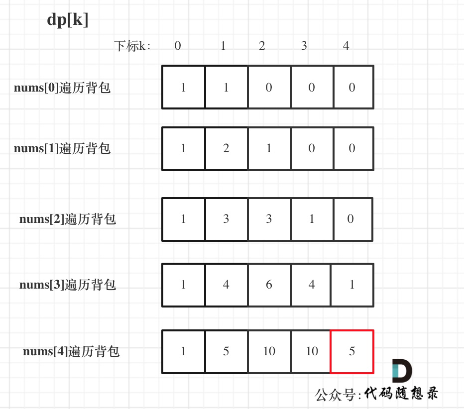

`C++`代码如下：

```cpp
class Solution {
public:
    int findTargetSumWays(vector<int>& nums, int S) {
        int sum = 0;
        for (int i = 0; i < nums.size(); i++) sum += nums[i];
        if (abs(S) > sum) return 0; // 此时没有方案
        if ((S + sum) % 2 == 1) return 0; // 此时没有方案
        int bagSize = (S + sum) / 2;
        vector<int> dp(bagSize + 1, 0);
        dp[0] = 1;
        for (int i = 0; i < nums.size(); i++) {
            for (int j = bagSize; j >= nums[i]; j--) {
                dp[j] += dp[j - nums[i]];
            }
        }
        return dp[bagSize];
    }
};
```

- 时间复杂度：`O(n × m)`，n为正数个数，m为背包容量
- 空间复杂度：`O(m)`，m为背包容量

## 总结

此时 大家应该不禁想起，我们之前讲过的[回溯算法：39. 组合总和](https://programmercarl.com/0039.%E7%BB%84%E5%90%88%E6%80%BB%E5%92%8C.html)是不是应该也可以用dp来做啊？

是的，如果仅仅是求个数的话，就可以用dp，但[回溯算法：39. 组合总和](https://programmercarl.com/0039.%E7%BB%84%E5%90%88%E6%80%BB%E5%92%8C.html)要求的是把所有组合列出来，还是要使用回溯法爆搜的。

本题还是有点难度，大家也可以记住，在求装满背包有几种方法的情况下，递推公式一般为：

```cpp
dp[j] += dp[j - nums[i]];
```

后面我们在讲解完全背包的时候，还会用到这个递推公式！

# 17.一和零

[力扣题目链接](https://leetcode.cn/problems/ones-and-zeroes/)

给你一个二进制字符串数组 strs 和两个整数 m 和 n 。

请你找出并返回 strs 的最大子集的大小，该子集中 最多 有 m 个 0 和 n 个 1 。

如果 x 的所有元素也是 y 的元素，集合 x 是集合 y 的 子集 。

示例 1：

- 输入：`strs = ["10", "0001", "111001", "1", "0"], m = 5, n = 3`
- 输出：4
- 解释：最多有 5 个 0 和 3 个 1 的最大子集是 `{"10","0001","1","0"}` ，因此答案是 4 。其他满足题意但较小的子集包括 `{"0001","1"}` 和 `{"10","1","0"}` 。`{"111001"}` 不满足题意，因为它含 4 个 1 ，大于 n 的值 3 。

示例 2：

- 输入：`strs = ["10", "0", "1"], m = 1, n = 1`
- 输出：2
- 解释：最大的子集是 `{"0", "1"}` ，所以答案是 2 。

提示：

- `1 <= strs.length <= 600`
- `1 <= strs[i].length <= 100`
- `strs[i]` 仅由 '0' 和 '1' 组成
- `1 <= m, n <= 100`

## 算法公开课

[**《代码随想录》算法视频公开课**](https://programmercarl.com/other/gongkaike.html)**：**[**装满这个背包最多用多少个物品？| LeetCode：474.一和零**](https://www.bilibili.com/video/BV1rW4y1x7ZQ/)**，相信结合视频再** **看本篇题解，更有助于大家对本题的理解**。

## 思路

如果对背包问题不都熟悉先看这两篇：

- [动态规划：关于01背包问题，你该了解这些！](https://programmercarl.com/%E8%83%8C%E5%8C%85%E7%90%86%E8%AE%BA%E5%9F%BA%E7%A1%8001%E8%83%8C%E5%8C%85-1.html)
- [动态规划：关于01背包问题，你该了解这些！（滚动数组）](https://programmercarl.com/%E8%83%8C%E5%8C%85%E7%90%86%E8%AE%BA%E5%9F%BA%E7%A1%8001%E8%83%8C%E5%8C%85-2.html)

这道题目，还是比较难的，也有点像程序员自己给自己出个脑筋急转弯，程序员何苦为难程序员呢。

来说题，本题不少同学会认为是多重背包，一些题解也是这么写的。

其实本题并不是多重背包，再来看一下这个图，捋清几种背包的关系


多重背包是每个物品，数量不同的情况。

**本题中strs 数组里的元素就是物品，每个物品都是一个！**

**而m 和 n相当于是一个背包，两个维度的背包**。

理解成多重背包的同学主要是把m和n混淆为物品了，感觉这是不同数量的物品，所以以为是多重背包。

但本题其实是01背包问题！

只不过这个背包有两个维度，一个是m 一个是n，而不同长度的字符串就是不同大小的待装物品。

开始动规五部曲：

1. 确定dp数组（dp table）以及下标的含义

**dp[i][j]：最多有i个0和j个1的strs的最大子集的大小为dp[i][j]**。

2. 确定递推公式

`dp[i][j]` 可以由前一个strs里的字符串推导出来，strs里的字符串有zeroNum个0，oneNum个1。

`dp[i][j]` 就可以是 `dp[i - zeroNum][j - oneNum] + 1`。

然后我们在遍历的过程中，取`dp[i][j]`的最大值。

所以递推公式：`dp[i][j] = max(dp[i][j], dp[i - zeroNum][j - oneNum] + 1);`

此时大家可以回想一下01背包的递推公式：`dp[j] = max(dp[j], dp[j - weight[i]] + value[i]);`

对比一下就会发现，字符串的zeroNum和oneNum相当于物品的重量（`weight[i]`），字符串本身的个数相当于物品的价值（`value[i]`）。

**这就是一个典型的01背包！** 只不过物品的重量有了两个维度而已。 

3. dp数组如何初始化

在[动态规划：关于01背包问题，你该了解这些！（滚动数组）](https://programmercarl.com/%E8%83%8C%E5%8C%85%E7%90%86%E8%AE%BA%E5%9F%BA%E7%A1%8001%E8%83%8C%E5%8C%85-2.html)中已经讲解了，01背包的dp数组初始化为0就可以。

因为物品价值不会是负数，初始为0，保证递推的时候`dp[i][j]`不会被初始值覆盖。

4. 确定遍历顺序

在[动态规划：关于01背包问题，你该了解这些！（滚动数组）](https://programmercarl.com/%E8%83%8C%E5%8C%85%E7%90%86%E8%AE%BA%E5%9F%BA%E7%A1%8001%E8%83%8C%E5%8C%85-2.html)中，我们讲到了01背包为什么一定是外层for循环遍历物品，内层for循环遍历背包容量且从后向前遍历！

那么本题也是，物品就是strs里的字符串，背包容量就是题目描述中的m和n。

代码如下：

```cpp
for (string str : strs) { // 遍历物品
    int oneNum = 0, zeroNum = 0;
    for (char c : str) {
        if (c == '0') zeroNum++;
        else oneNum++;
    }
    for (int i = m; i >= zeroNum; i--) { // 遍历背包容量且从后向前遍历！
        for (int j = n; j >= oneNum; j--) {
            dp[i][j] = max(dp[i][j], dp[i - zeroNum][j - oneNum] + 1);
        }
    }
}
```

有同学可能想，那个遍历背包容量的两层for循环先后循序有没有什么讲究？

没讲究，都是物品重量的一个维度，先遍历哪个都行！

5. 举例推导dp数组

以输入：`["10","0001","111001","1","0"]`，`m = 3`，`n = 3`为例

最后dp数组的状态如下所示：

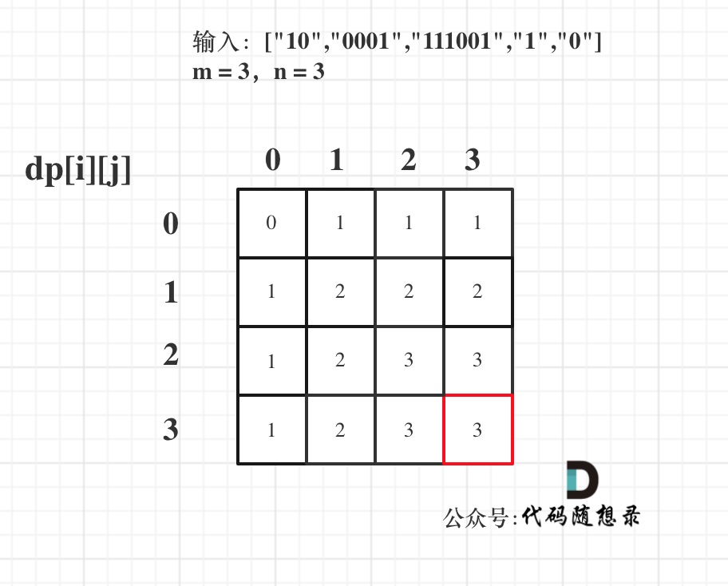

以上动规五部曲分析完毕，`C++`代码如下：

```cpp
class Solution {
public:
    int findMaxForm(vector<string>& strs, int m, int n) {
        vector<vector<int>> dp(m + 1, vector<int> (n + 1, 0)); // 默认初始化0
        for (string str : strs) { // 遍历物品
            int oneNum = 0, zeroNum = 0;
            for (char c : str) {
                if (c == '0') zeroNum++;
                else oneNum++;
            }
            for (int i = m; i >= zeroNum; i--) { // 遍历背包容量且从后向前遍历！
                for (int j = n; j >= oneNum; j--) {
                    dp[i][j] = max(dp[i][j], dp[i - zeroNum][j - oneNum] + 1);
                }
            }
        }
        return dp[m][n];
    }
};
```

- 时间复杂度`: O(kmn)`，k 为strs的长度
- 空间复杂度`: O(mn)`

## 总结

不少同学刷过这道题，可能没有总结这究竟是什么背包。

此时我们讲解了0-1背包的多种应用，

- [纯 0 - 1 背包](https://programmercarl.com/%E8%83%8C%E5%8C%85%E7%90%86%E8%AE%BA%E5%9F%BA%E7%A1%8001%E8%83%8C%E5%8C%85-2.html) 是求 给定背包容量 装满背包 的最大价值是多少。 
- [416. 分割等和子集](https://programmercarl.com/0416.%E5%88%86%E5%89%B2%E7%AD%89%E5%92%8C%E5%AD%90%E9%9B%86.html) 是求 给定背包容量，能不能装满这个背包。 
- [1049. 最后一块石头的重量 II](https://programmercarl.com/1049.%E6%9C%80%E5%90%8E%E4%B8%80%E5%9D%97%E7%9F%B3%E5%A4%B4%E7%9A%84%E9%87%8D%E9%87%8FII.html) 是求 给定背包容量，尽可能装，最多能装多少 
- [494. 目标和](https://programmercarl.com/0494.%E7%9B%AE%E6%A0%87%E5%92%8C.html) 是求 给定背包容量，装满背包有多少种方法。 
- 本题是求 给定背包容量，装满背包最多有多少个物品。

所以在代码随想录中所列举的题目，都是 0-1背包不同维度上的应用，大家可以细心体会！

# 18. 动态规划：完全背包理论基础

## 算法公开课

[**《代码随想录》算法视频公开课**](https://programmercarl.com/other/gongkaike.html)**：**[**带你学透完全背包问题！**](https://www.bilibili.com/video/BV1uK411o7c9/) **，相信结合视频再看本篇题解，更有助于大家对本题的** **理解**。

## 思路

### 完全背包

有N件物品和一个最多能背重量为W的背包。第i件物品的重量是`weight[i]`，得到的价值是`value[i]` 。**每件物品都有** **无限个（也就是可以放入背包多次）**，求解将哪些物品装入背包里物品价值总和最大。

**完全背包和01背包问题唯一不同的地方就是，每种物品有无限件**。

同样leetcode上没有纯完全背包问题，都是需要完全背包的各种应用，需要转化成完全背包问题，所以我这里还是以纯完全背包问题进行讲解理论和原理。

在下面的讲解中，我依然举这个例子：

背包最大重量为4。

物品为：

|  | 重量 | 价值 |
|---|---|---|
| 物品0 | 1 | 15 |
| 物品1 | 3 | 20 |
| 物品2 | 4 | 30 |

**每件商品都有无限个！**

问背包能背的物品最大价值是多少？

01背包和完全背包唯一不同就是体现在遍历顺序上，所以本文就不去做动规五部曲了，我们直接针对遍历顺序经行分析！

关于01背包我如下两篇已经进行深入分析了：

- [动态规划：关于01背包问题，你该了解这些！](https://programmercarl.com/%E8%83%8C%E5%8C%85%E7%90%86%E8%AE%BA%E5%9F%BA%E7%A1%8001%E8%83%8C%E5%8C%85-1.html)
- [动态规划：关于01背包问题，你该了解这些！（滚动数组）](https://programmercarl.com/%E8%83%8C%E5%8C%85%E7%90%86%E8%AE%BA%E5%9F%BA%E7%A1%8001%E8%83%8C%E5%8C%85-2.html)

首先再回顾一下01背包的核心代码

```cpp
for(int i = 0; i < weight.size(); i++) { // 遍历物品
    for(int j = bagWeight; j >= weight[i]; j--) { // 遍历背包容量
        dp[j] = max(dp[j], dp[j - weight[i]] + value[i]);
    }
}
```

我们知道01背包内嵌的循环是从大到小遍历，为了保证每个物品仅被添加一次。

而完全背包的物品是可以添加多次的，所以要从小到大去遍历，即：

```cpp
// 先遍历物品，再遍历背包
for(int i = 0; i < weight.size(); i++) { // 遍历物品
    for(int j = weight[i]; j <= bagWeight ; j++) { // 遍历背包容量
        dp[j] = max(dp[j], dp[j - weight[i]] + value[i]);
    }
}
```

至于为什么，我在[动态规划：关于01背包问题，你该了解这些！（滚动数组）](https://programmercarl.com/%E8%83%8C%E5%8C%85%E7%90%86%E8%AE%BA%E5%9F%BA%E7%A1%8001%E8%83%8C%E5%8C%85-2.html)中也做了讲解。

dp状态图如下：

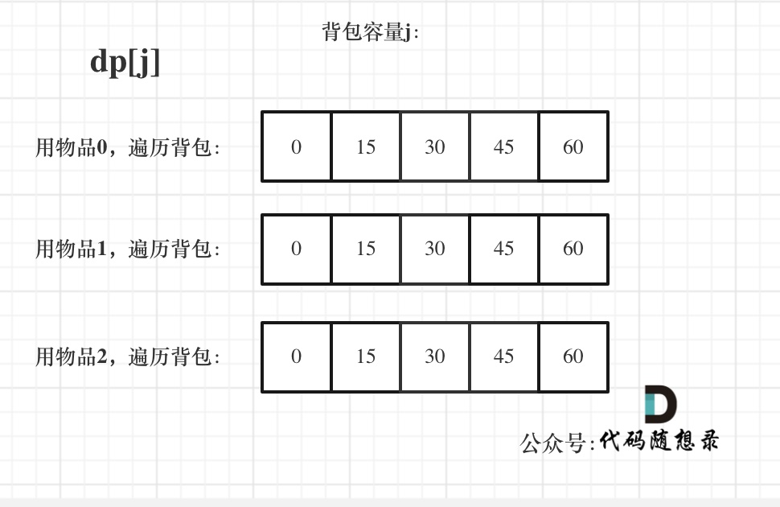

相信很多同学看网上的文章，关于完全背包介绍基本就到为止了。

**其实还有一个很重要的问题，为什么遍历物品在外层循环，遍历背包容量在内层循环？**

这个问题很多题解关于这里都是轻描淡写就略过了，大家都默认 遍历物品在外层，遍历背包容量在内层，好像本应该如此一样，那么为什么呢？

难道就不能遍历背包容量在外层，遍历物品在内层？

看过这两篇的话：

- [动态规划：关于01背包问题，你该了解这些！](https://programmercarl.com/%E8%83%8C%E5%8C%85%E7%90%86%E8%AE%BA%E5%9F%BA%E7%A1%8001%E8%83%8C%E5%8C%85-1.html)
- [动态规划：关于01背包问题，你该了解这些！（滚动数组）](https://programmercarl.com/%E8%83%8C%E5%8C%85%E7%90%86%E8%AE%BA%E5%9F%BA%E7%A1%8001%E8%83%8C%E5%8C%85-2.html)

就知道了，01背包中二维dp数组的两个for遍历的先后循序是可以颠倒了，一维dp数组的两个for循环先后循序一定是先遍历物品，再遍历背包容量。

**在完全背包中，对于一维dp数组来说，其实两个for循环嵌套顺序是无所谓的！**

因为`dp[j]` 是根据 下标j之前所对应的`dp[j]`计算出来的。 只要保证下标j之前的`dp[j]`都是经过计算的就可以了。

遍历物品在外层循环，遍历背包容量在内层循环，状态如图：

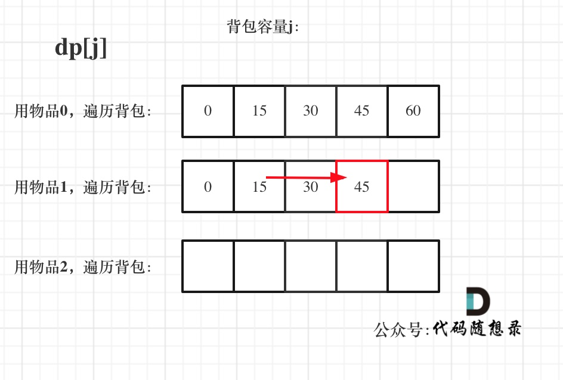

遍历背包容量在外层循环，遍历物品在内层循环，状态如图：

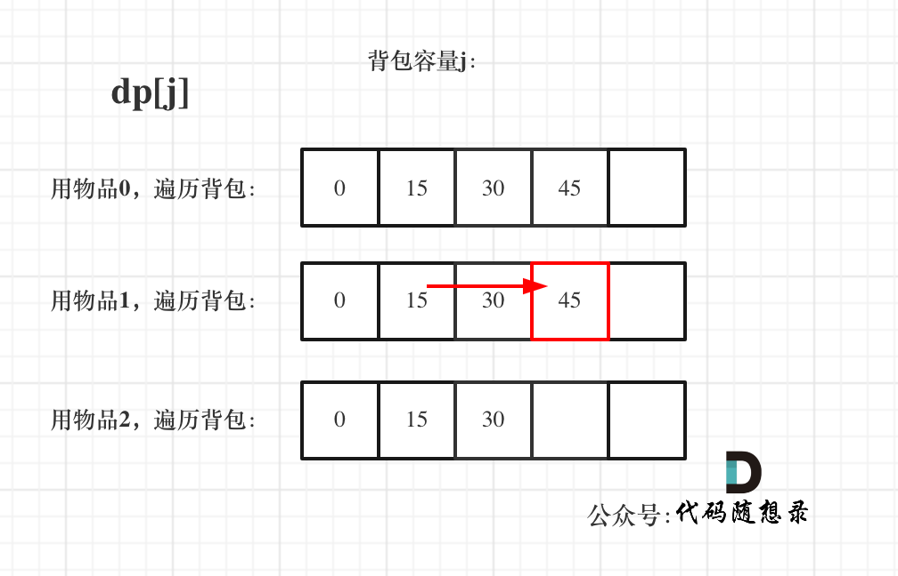

看了这两个图，大家就会理解，完全背包中，两个for循环的先后循序，都不影响计算`dp[j]`所需要的值（这个值就是下标j之前所对应的`dp[j]`）。

先遍历背包在遍历物品，代码如下：

```cpp
// 先遍历背包，再遍历物品
for(int j = 0; j <= bagWeight; j++) { // 遍历背包容量
    for(int i = 0; i < weight.size(); i++) { // 遍历物品
        if (j - weight[i] >= 0) dp[j] = max(dp[j], dp[j - weight[i]] + value[i]);
    }
    cout << endl;
}
```

完整的`C++`测试代码如下：

```cpp
// 先遍历物品，在遍历背包
void test_CompletePack() {
    vector<int> weight = {1, 3, 4};
    vector<int> value = {15, 20, 30};
    int bagWeight = 4;
    vector<int> dp(bagWeight + 1, 0);
    for(int i = 0; i < weight.size(); i++) { // 遍历物品
        for(int j = weight[i]; j <= bagWeight; j++) { // 遍历背包容量
            dp[j] = max(dp[j], dp[j - weight[i]] + value[i]);
        }
    }
    cout << dp[bagWeight] << endl;
}
int main() {
    test_CompletePack();
}
// 先遍历背包，再遍历物品
void test_CompletePack() {
    vector<int> weight = {1, 3, 4};
    vector<int> value = {15, 20, 30};
    int bagWeight = 4;
    vector<int> dp(bagWeight + 1, 0);
    for(int j = 0; j <= bagWeight; j++) { // 遍历背包容量
        for(int i = 0; i < weight.size(); i++) { // 遍历物品
            if (j - weight[i] >= 0) dp[j] = max(dp[j], dp[j - weight[i]] + value[i]);
        }
    }
    cout << dp[bagWeight] << endl;
}
int main() {
    test_CompletePack();
}
```

## 总结

细心的同学可能发现，**全文我说的都是对于纯完全背包问题，其for循环的先后循环是可以颠倒的！**

但如果题目稍稍有点变化，就会体现在遍历顺序上。

如果问装满背包有几种方式的话？ 那么两个for循环的先后顺序就有很大区别了，而leetcode上的题目都是这种稍有变化的类型。

这个区别，我将在后面讲解具体leetcode题目中给大家介绍，因为这块如果不结合具题目，单纯的介绍原理估计很多同学会越看越懵！

别急，下一篇就是了！哈哈

最后，**又可以出一道面试题了，就是纯完全背包，要求先用二维dp数组实现，然后再用一维dp数组实现，最后再** **问，两个for循环的先后是否可以颠倒？为什么？**这个简单的完全背包问题，估计就可以难住不少候选人了。

# 19.零钱兑换II

[力扣题目链接](https://leetcode.cn/problems/coin-change-ii/)

给定不同面额的硬币和一个总金额。写出函数来计算可以凑成总金额的硬币组合数。假设每一种面额的硬币有无限个。 

示例 1:

- 输入`: amount = 5, coins = [1, 2, 5]`
- 输出: 4

解释: 有四种方式可以凑成总金额:

- `5=5`
- `5=2+2+1`
- `5=2+1+1+1`
- `5=1+1+1+1+1`

示例 2:

- 输入`: amount = 3, coins = [2]`
- 输出: 0
- 解释: 只用面额2的硬币不能凑成总金额3。

示例 3:

- 输入`: amount = 10, coins = [10]`
- 输出: 1

注意，你可以假设：

- `0 <= amount (`总金额`) <= 5000`
- `1 <= coin (`硬币面额`) <= 5000`
- 硬币种类不超过 500 种
- 结果符合 32 位符号整数

## 算法公开课

[**《代码随想录》算法视频公开课**](https://programmercarl.com/other/gongkaike.html)**：**[**装满背包有多少种方法？组合与排列有讲究！| LeetCode：518.零钱兑换II**](https://www.bilibili.com/video/BV1KM411k75j/)**，相** **信结合视频再看本篇题解，更有助于大家对本题的理解**。

## 思路

这是一道典型的背包问题，一看到钱币数量不限，就知道这是一个完全背包。

对完全背包还不了解的同学，可以看这篇：[动态规划：关于完全背包，你该了解这些！](https://programmercarl.com/%E8%83%8C%E5%8C%85%E9%97%AE%E9%A2%98%E7%90%86%E8%AE%BA%E5%9F%BA%E7%A1%80%E5%AE%8C%E5%85%A8%E8%83%8C%E5%8C%85.html)

但本题和纯完全背包不一样，**纯完全背包是凑成背包最大价值是多少，而本题是要求凑成总金额的物品组合个数！**

注意题目描述中是凑成总金额的硬币组合数，为什么强调是组合数呢？

例如示例一：

`5 = 2 + 2 + 1`

`5 = 2 + 1 + 2`

这是一种组合，都是 2 2 1。

如果问的是排列数，那么上面就是两种排列了。

**组合不强调元素之间的顺序，排列强调元素之间的顺序**。 其实这一点我们在讲解回溯算法专题的时候就讲过了哈。

那我为什么要介绍这些呢，因为这和下文讲解遍历顺序息息相关!

回归本题，动规五步曲来分析如下：

1. 确定dp数组以及下标的含义

`dp[j]`：凑成总金额j的货币组合数为`dp[j]`

2. 确定递推公式

`dp[j]`  就是所有的`dp[j - coins[i]]`（考虑`coins[i]`的情况）相加。

所以递推公式：`dp[j] += dp[j - coins[i]];` **这个递推公式大家应该不陌生了，我在讲解01背包题目的时候在这篇**[**494. 目标和**](https://programmercarl.com/0494.%E7%9B%AE%E6%A0%87%E5%92%8C.html)**中就讲解了，求装满背包有几种** **方法，公式都是：dp[j] += dp[j - nums[i]];** 3. dp数组如何初始化

首先`dp[0]`一定要为1，`dp[0] = 1`是 递归公式的基础。如果`dp[0] = 0` 的话，后面所有推导出来的值都是0了。 

那么 `dp[0] = 1` 有没有含义，其实既可以说 凑成总金额0的货币组合数为1，也可以说 凑成总金额0的货币组合数为0，好像都没有毛病。

但题目描述中，也没明确说 `amount = 0` 的情况，结果应该是多少。 

这里我认为题目描述还是要说明一下，因为后台测试数据是默认，`amount = 0` 的情况，组合数为1的。 

下标非0的`dp[j]`初始化为0，这样累计加`dp[j - coins[i]]`的时候才不会影响真正的`dp[j]`

`dp[0]=1`还说明了一种情况：如果正好选了`coins[i]`后，也就是`j-coins[i] == 0`的情况表示这个硬币刚好能选，此时`dp[0]`为1表示只选`coins[i]`存在这样的一种选法。

4. 确定遍历顺序

本题中我们是外层for循环遍历物品（钱币），内层for遍历背包（金钱总额），还是外层for遍历背包（金钱总额），内层for循环遍历物品（钱币）呢？

我在[动态规划：关于完全背包，你该了解这些！](https://programmercarl.com/%E8%83%8C%E5%8C%85%E9%97%AE%E9%A2%98%E7%90%86%E8%AE%BA%E5%9F%BA%E7%A1%80%E5%AE%8C%E5%85%A8%E8%83%8C%E5%8C%85.html)中讲解了完全背包的两个for循环的先后顺序都是可以的。

**但本题就不行了！**

因为纯完全背包求得装满背包的最大价值是多少，和凑成总和的元素有没有顺序没关系，即：有顺序也行，没有顺序也行！

而本题要求凑成总和的组合数，元素之间明确要求没有顺序。

所以纯完全背包是能凑成总和就行，不用管怎么凑的。

本题是求凑出来的方案个数，且每个方案个数是为组合数。

那么本题，两个for循环的先后顺序可就有说法了。

我们先来看 外层for循环遍历物品（钱币），内层for遍历背包（金钱总额）的情况。

代码如下：

```cpp
for (int i = 0; i < coins.size(); i++) { // 遍历物品
    for (int j = coins[i]; j <= amount; j++) { // 遍历背包容量
        dp[j] += dp[j - coins[i]];
    }
}
```

假设：`coins[0] = 1`，`coins[1] = 5`。

那么就是先把1加入计算，然后再把5加入计算，得到的方法数量只有`{1, 5}`这种情况。而不会出现`{5, 1}`的情况。

**所以这种遍历顺序中dp[j]里计算的是组合数！**

如果把两个for交换顺序，代码如下：

```cpp
for (int j = 0; j <= amount; j++) { // 遍历背包容量
    for (int i = 0; i < coins.size(); i++) { // 遍历物品
        if (j - coins[i] >= 0) dp[j] += dp[j - coins[i]];
    }
}
```

背包容量的每一个值，都是经过 1 和 5 的计算，包含了`{1, 5}` 和 `{5, 1}`两种情况。

**此时dp[j]里算出来的就是排列数！**

可能这里很多同学还不是很理解，**建议动手把这两种方案的dp数组数值变化打印出来，对比看一看！（实践出真** **知）**

5. 举例推导dp数组

输入`: amount = 5, coins = [1, 2, 5]` ，dp状态图如下：

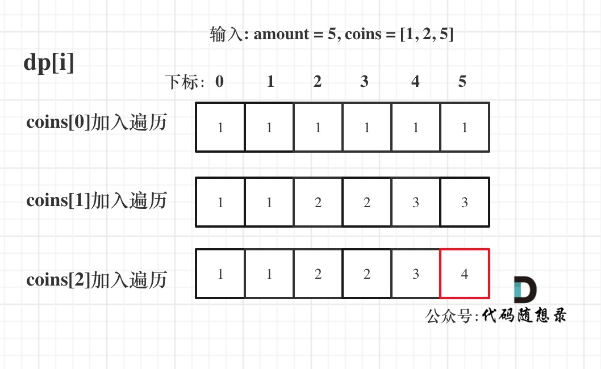

最后红色框`dp[amount]`为最终结果。

以上分析完毕，`C++`代码如下：

```cpp
class Solution {
public:
    int change(int amount, vector<int>& coins) {
        vector<int> dp(amount + 1, 0);
        dp[0] = 1;
        for (int i = 0; i < coins.size(); i++) { // 遍历物品
            for (int j = coins[i]; j <= amount; j++) { // 遍历背包
                dp[j] += dp[j - coins[i]];
            }
        }
        return dp[amount];
    }
};
```

- 时间复杂度`: O(mn)`，其中 m 是amount，n 是 coins 的长度
- 空间复杂度`: O(m)`

是不是发现代码如此精简，哈哈

## 总结

本题的递推公式，其实我们在[494. 目标和](https://programmercarl.com/0494.%E7%9B%AE%E6%A0%87%E5%92%8C.html)中就已经讲过了，**而难点在于遍历顺序！**

在求装满背包有几种方案的时候，认清遍历顺序是非常关键的。

**如果求组合数就是外层for循环遍历物品，内层for遍历背包**。

**如果求排列数就是外层for遍历背包，内层for循环遍历物品**。

可能说到排列数录友们已经有点懵了，后面Carl还会安排求排列数的题目，到时候在对比一下，大家就会发现神奇所在！

# 20. 本周小结！（动态规划系列四）

## 周一

[动态规划：目标和！](https://programmercarl.com/0494.%E7%9B%AE%E6%A0%87%E5%92%8C.html)要求在数列之间加入+ 或者 -，使其和为S。

所有数的总和为sum，假设加法的总和为x，那么可以推出`x = (S + sum) / 2`。

S 和 sum都是固定的，那此时问题就转化为01背包问题（数列中的数只能使用一次）: 给你一些物品（数字），装满背包（就是x）有几种方法。

1. 确定dp数组以及下标的含义

**dp[j] 表示：填满j（包括j）这么大容积的包，有dp[j]种方法**

2. 确定递推公式`dp[j] += dp[j - nums[i]]`  
**注意：求装满背包有几种方法类似的题目，递推公式基本都是这样的**。

3. dp数组如何初始化

`dp[0]` 初始化为1 ，`dp[j]`其他下标对应的数值应该初始化为0。

4. 确定遍历顺序

01背包问题一维dp的遍历，nums放在外循环，target在内循环，且内循环倒序。

5. 举例推导dp数组

输入：`nums: [1, 1, 1, 1, 1], S: 3`

`bagSize = (S + sum) / 2 = (3 + 5) / 2 = 4`

dp数组状态变化如下：


## 周二

这道题目[动态规划：一和零！](https://programmercarl.com/0474.%E4%B8%80%E5%92%8C%E9%9B%B6.html)算有点难度。

**不少同学都以为是多重背包，其实这是一道标准的01背包**。

这不过这个背包有两个维度，一个是m 一个是n，而不同长度的字符串就是不同大小的待装物品。

**所以这是一个二维01背包！**

1. 确定dp数组（dp table）以及下标的含义

**dp[i][j]：最多有i个0和j个1的strs的最大子集的大小为dp[i][j]。**

2. 确定递推公式

`dp[i][j] = max(dp[i][j], dp[i - zeroNum][j - oneNum] + 1);`

字符串集合中的一个字符串0的数量为zeroNum，1的数量为oneNum。

3. dp数组如何初始化

因为物品价值不会是负数，初始为0，保证递推的时候`dp[i][j]`不会被初始值覆盖。

4. 确定遍历顺序

01背包一定是外层for循环遍历物品，内层for循环遍历背包容量且从后向前遍历！

5. 举例推导dp数组

以输入：`["10","0001","111001","1","0"]`，`m = 3`，`n = 3`为例

最后dp数组的状态如下所示：


## 周三

此时01背包我们就讲完了，正式开始完全背包。

在[动态规划：关于完全背包，你该了解这些！](https://programmercarl.com/%E8%83%8C%E5%8C%85%E9%97%AE%E9%A2%98%E7%90%86%E8%AE%BA%E5%9F%BA%E7%A1%80%E5%AE%8C%E5%85%A8%E8%83%8C%E5%8C%85.html)中我们讲解了完全背包的理论基础。

其实完全背包和01背包区别就是完全背包的物品是无限数量。

递推公式也是一样的，但难点在于遍历顺序上！

完全背包的物品是可以添加多次的，所以遍历背包容量要从小到大去遍历，即：

```cpp
// 先遍历物品，再遍历背包
for(int i = 0; i < weight.size(); i++) { // 遍历物品
    for(int j = weight[i]; j < bagWeight ; j++) { // 遍历背包容量
        dp[j] = max(dp[j], dp[j - weight[i]] + value[i]);
    }
}
```

基本网上题的题解介绍到这里就到此为止了。

**那么为什么要先遍历物品，在遍历背包呢？** （灵魂拷问）

其实对于纯完全背包，先遍历物品，再遍历背包 与 先遍历背包，再遍历物品都是可以的。我在文中动态规划：关于完全背包，你该了解这些！也给出了详细的解释。

这个细节是很多同学忽略掉的点，其实也不算细节了，**相信不少同学在写背包的时候，两层for循环的先后循序搞** **不清楚，靠感觉来的**。

所以理解究竟是先遍历啥，后遍历啥非常重要，这也体现出遍历顺序的重要性！

在文中，我也强调了是对纯完全背包，两个for循环先后循序无所谓，那么题目稍有变化，可就有所谓了。

## 周四

在[动态规划：给你一些零钱，你要怎么凑？](https://programmercarl.com/0518.%E9%9B%B6%E9%92%B1%E5%85%91%E6%8D%A2II.html)中就是给你一堆零钱（零钱个数无限），为凑成amount的组合数有几种。

**注意这里组合数和排列数的区别！**

看到无限零钱个数就知道是完全背包，

但本题不是纯完全背包了（求是否能装满背包），而是求装满背包有几种方法。

这里在遍历顺序上可就有说法了。

- 如果求组合数就是外层for循环遍历物品，内层for遍历背包。
- 如果求排列数就是外层for遍历背包，内层for循环遍历物品。

这里同学们需要理解一波，我在文中也给出了详细的解释，下周我们将介绍求排列数的完全背包题目来加深对这个遍历顺序的理解。

## 总结

相信通过本周的学习，大家已经初步感受到遍历顺序的重要性！

很多对动规理解不深入的同学都会感觉：动规嘛，就是把递推公式推出来其他都easy了。

其实这是一种错觉，或者说对动规理解的不够深入！

我在动规专题开篇介绍[关于动态规划，你该了解这些！](https://programmercarl.com/%E5%8A%A8%E6%80%81%E8%A7%84%E5%88%92%E7%90%86%E8%AE%BA%E5%9F%BA%E7%A1%80.html)中就强调了 **递推公式仅仅是 动规五部曲里的一小部分， dp** **数组的定义、初始化、遍历顺序，哪一点没有搞透的话，即使知道递推公式，遇到稍稍难一点的动规题目立刻会感** **觉写不出来了**。

此时相信大家对动规五部曲也有更深的理解了，同样也验证了Carl之前讲过的：**简单题是用来学习方法论的，而遇** **到难题才体现出方法论的重要性！**

# 21. 组合总和 Ⅳ

[力扣题目链接](https://leetcode.cn/problems/combination-sum-iv/)

难度：中等给定一个由正整数组成且不存在重复数字的数组，找出和为给定目标正整数的组合的个数。

示例:

- `nums = [1, 2, 3]`
- `target = 4`

所有可能的组合为：`(1, 1, 1, 1)` `(1, 1, 2)` `(1, 2, 1)` `(1, 3)` `(2, 1, 1)` `(2, 2)` `(3, 1)`

请注意，顺序不同的序列被视作不同的组合。

因此输出为 7。

## 算法公开课

[**《代码随想录》算法视频公开课**](https://programmercarl.com/other/gongkaike.html)**：**[**装满背包有几种方法？求排列数？| LeetCode：377.组合总和IV**](https://www.bilibili.com/video/BV1V14y1n7B6/)**，相信结合视** **频再看本篇题解，更有助于大家对本题的理解**。

## 思路

对完全背包还不了解的同学，可以看这篇：[动态规划：关于完全背包，你该了解这些！](https://programmercarl.com/%E8%83%8C%E5%8C%85%E9%97%AE%E9%A2%98%E7%90%86%E8%AE%BA%E5%9F%BA%E7%A1%80%E5%AE%8C%E5%85%A8%E8%83%8C%E5%8C%85.html)

本题题目描述说是求组合，但又说是可以元素相同顺序不同的组合算两个组合，**其实就是求排列！**

弄清什么是组合，什么是排列很重要。

组合不强调顺序，`(1,5)`和`(5,1)`是同一个组合。

排列强调顺序，`(1,5)`和`(5,1)`是两个不同的排列。

大家在公众号里学习回溯算法专题的时候，一定做过这两道题目[回溯算法：39.组合总和](https://programmercarl.com/0039.%E7%BB%84%E5%90%88%E6%80%BB%E5%92%8C.html)和回溯算法：40.组合总和II会感觉这两题和本题很像！

但其本质是本题求的是排列总和，而且仅仅是求排列总和的个数，并不是把所有的排列都列出来。

**如果本题要把排列都列出来的话，只能使用回溯算法爆搜**。

动规五部曲分析如下：

1. 确定dp数组以及下标的含义

**dp[i]: 凑成目标正整数为i的排列个数为dp[i]**

2. 确定递推公式

`dp[i]`（考虑`nums[j]`）可以由 `dp[i - nums[j]]`（不考虑`nums[j]`） 推导出来。

因为只要得到`nums[j]`，排列个数`dp[i - nums[j]]`，就是`dp[i]`的一部分。

在[动态规划：494.目标和](https://programmercarl.com/0494.%E7%9B%AE%E6%A0%87%E5%92%8C.html) 和 [动态规划：518.零钱兑换II](https://programmercarl.com/0518.%E9%9B%B6%E9%92%B1%E5%85%91%E6%8D%A2II.html)中我们已经讲过了，求装满背包有几种方法，递推公式一般都是`dp[i] += dp[i - nums[j]];`

本题也一样。

3. dp数组如何初始化

因为递推公式`dp[i] += dp[i - nums[j]]`的缘故，`dp[0]`要初始化为1，这样递归其他`dp[i]`的时候才会有数值基础。

至于`dp[0] = 1` 有没有意义呢？

其实没有意义，所以我也不去强行解释它的意义了，因为题目中也说了：给定目标值是正整数！ 所以`dp[0] = 1`是没有意义的，仅仅是为了推导递推公式。

至于非0下标的`dp[i]`应该初始为多少呢？

初始化为0，这样才不会影响`dp[i]`累加所有的`dp[i - nums[j]]`。

4. 确定遍历顺序

个数可以不限使用，说明这是一个完全背包。

得到的集合是排列，说明需要考虑元素之间的顺序。

本题要求的是排列，那么这个for循环嵌套的顺序可以有说法了。

在[动态规划：518.零钱兑换II](https://programmercarl.com/0518.%E9%9B%B6%E9%92%B1%E5%85%91%E6%8D%A2II.html) 中就已经讲过了。

**如果求组合数就是外层for循环遍历物品，内层for遍历背包**。

**如果求排列数就是外层for遍历背包，内层for循环遍历物品**。

如果把遍历nums（物品）放在外循环，遍历target的作为内循环的话，举一个例子：计算`dp[4]`的时候，结果集只有 `{1,3}` 这样的集合，不会有`{3,1}`这样的集合，因为nums遍历放在外层，3只能出现在1后面！

所以本题遍历顺序最终遍历顺序：**target（背包）放在外循环，将nums（物品）放在内循环，内循环从前到后遍** **历**。

5. 举例来推导dp数组

我们再来用示例中的例子推导一下：

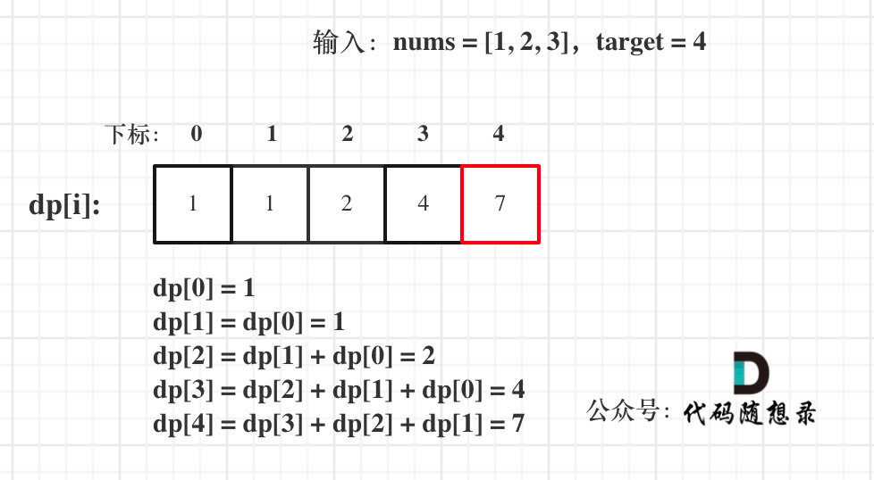

如果代码运行处的结果不是想要的结果，就把`dp[i]`都打出来，看看和我们推导的一不一样。

以上分析完毕，`C++`代码如下：

```cpp
class Solution {
public:
    int combinationSum4(vector<int>& nums, int target) {
        vector<int> dp(target + 1, 0);
        dp[0] = 1;
        for (int i = 0; i <= target; i++) { // 遍历背包
            for (int j = 0; j < nums.size(); j++) { // 遍历物品
                if (i - nums[j] >= 0 && dp[i] < INT_MAX - dp[i - nums[j]]) {
                    dp[i] += dp[i - nums[j]];
                }
            }
        }
        return dp[target];
    }
};
```

- 时间复杂度`: O(target * n)`，其中 n 为 nums 的长度
- 空间复杂度`: O(target)`

`C++`测试用例有两个数相加超过int的数据，所以需要在if里加上`dp[i] < INT_MAX - dp[i - num]`。

但java就不用考虑这个限制，java里的int也是四个字节吧，也有可能leetcode后台对不同语言的测试数据不一样。

## 总结

**求装满背包有几种方法，递归公式都是一样的，没有什么差别，但关键在于遍历顺序！**

本题与[动态规划：518.零钱兑换II](https://programmercarl.com/0518.%E9%9B%B6%E9%92%B1%E5%85%91%E6%8D%A2II.html)就是一个鲜明的对比，一个是求排列，一个是求组合，遍历顺序完全不同。

如果对遍历顺序没有深度理解的话，做这种完全背包的题目会很懵逼，即使题目刷过了可能也不太清楚具体是怎么过的。

此时大家应该对动态规划中的遍历顺序又有更深的理解了。

# 22. 爬楼梯(进阶版)

[力扣题目链接](https://leetcode.cn/problems/climbing-stairs/)

假设你正在爬楼梯。需要 n 阶你才能到达楼顶。

每次你可以爬 1 或 2 个台阶。你有多少种不同的方法可以爬到楼顶呢？

注意：给定 n 是一个正整数。

示例 1：  
输入： 2  
输出： 2  
解释： 有两种方法可以爬到楼顶。

1. 1 阶 + 1 阶2. 2 阶

示例 2：  
输入： 3  
输出： 3  
解释： 有三种方法可以爬到楼顶。

1. 1 阶 + 1 阶 + 1 阶2. 1 阶 + 2 阶3. 2 阶 + 1 阶

## 思路

之前讲这道题目的时候，因为还没有讲背包问题，所以就只是讲了一下爬楼梯最直接的动规方法（斐波那契）。

**这次终于讲到了背包问题，我选择带录友们再爬一次楼梯！**

这道题目 我们在[动态规划：爬楼梯](https://programmercarl.com/0070.%E7%88%AC%E6%A5%BC%E6%A2%AF.html) 中已经讲过一次了，原题其实是一道简单动规的题目。

既然这么简单为什么还要讲呢，其实本题稍加改动就是一道面试好题。

**改为：一步一个台阶，两个台阶，三个台阶，.......，直到 m个台阶。问有多少种不同的方法可以爬到楼顶呢？**

1阶，2阶，.... m阶就是物品，楼顶就是背包。

每一阶可以重复使用，例如跳了1阶，还可以继续跳1阶。

问跳到楼顶有几种方法其实就是问装满背包有几种方法。

**此时大家应该发现这就是一个完全背包问题了！**

和昨天的题目[动态规划：377. 组合总和 Ⅳ](https://programmercarl.com/0377.%E7%BB%84%E5%90%88%E6%80%BB%E5%92%8C%E2%85%A3.html)基本就是一道题了。

动规五部曲分析如下：

1. 确定dp数组以及下标的含义

**dp[i]：爬到有i个台阶的楼顶，有dp[i]种方法**。

2. 确定递推公式

在[动态规划：494.目标和](https://programmercarl.com/0494.%E7%9B%AE%E6%A0%87%E5%92%8C.html) 、 [动态规划：518.零钱兑换II](https://programmercarl.com/0518.%E9%9B%B6%E9%92%B1%E5%85%91%E6%8D%A2II.html)、[动态规划：377. 组合总和 Ⅳ](https://programmercarl.com/0377.%E7%BB%84%E5%90%88%E6%80%BB%E5%92%8C%E2%85%A3.html)中我们都讲过了，求装满背包有几种方法，递推公式一般都是`dp[i] += dp[i - nums[j]];`

本题呢，`dp[i]`有几种来源，`dp[i - 1]`，`dp[i - 2]`，`dp[i - 3]` 等等，即：`dp[i - j]`

那么递推公式为：`dp[i] += dp[i - j]`

3. dp数组如何初始化

既然递归公式是 `dp[i] += dp[i - j]`，那么`dp[0]` 一定为1，`dp[0]`是递归中一切数值的基础所在，如果`dp[0]`是0的话，其他数值都是0了。

下标非0的`dp[i]`初始化为0，因为`dp[i]`是靠`dp[i-j]`累计上来的，`dp[i]`本身为0这样才不会影响结果

4. 确定遍历顺序

这是背包里求排列问题，即：**1、2 步  和 2、1 步都是上三个台阶，但是这两种方法不一样！**

所以需将target放在外循环，将nums放在内循环。

每一步可以走多次，这是完全背包，内循环需要从前向后遍历。

5. 举例来推导dp数组

介于本题和[动态规划：377. 组合总和 Ⅳ](https://programmercarl.com/0377.%E7%BB%84%E5%90%88%E6%80%BB%E5%92%8C%E2%85%A3.html)几乎是一样的，这里我就不再重复举例了。

以上分析完毕，`C++`代码如下：

```cpp
class Solution {
public:
    int climbStairs(int n) {
        vector<int> dp(n + 1, 0);
        dp[0] = 1;
        for (int i = 1; i <= n; i++) { // 遍历背包
            for (int j = 1; j <= m; j++) { // 遍历物品
                if (i - j >= 0) dp[i] += dp[i - j];
            }
        }
        return dp[n];
    }
};
```

- 时间复杂度`: O(nm)`
- 空间复杂度`: O(n)`

代码中m表示最多可以爬m个台阶，代码中把m改成2就是本题70.爬楼梯可以AC的代码了。

## 总结

**本题看起来是一道简单题目，稍稍进阶一下其实就是一个完全背包！**

如果我来面试的话，我就会先给候选人出一个 本题原题，看其表现，如果顺利写出来，进而在要求每次可以爬`[1 -` `m]`个台阶应该怎么写。

顺便再考察一下两个for循环的嵌套顺序，为什么target放外面，nums放里面。

这就能考察对背包问题本质的掌握程度，候选人是不是刷题背公式，一眼就看出来了。

这么一连套下来，如果候选人都能答出来，相信任何一位面试官都是非常满意的。

**本题代码不长，题目也很普通，但稍稍一进阶就可以考察完全背包，而且题目进阶的内容在leetcode上并没有原** **题，一定程度上就可以排除掉刷题党了，简直是面试题目的绝佳选择！**

# 23. 零钱兑换

[力扣题目链接](https://leetcode.cn/problems/coin-change/)

给定不同面额的硬币 coins 和一个总金额 amount。编写一个函数来计算可以凑成总金额所需的最少的硬币个数。如果没有任何一种硬币组合能组成总金额，返回 -1。

你可以认为每种硬币的数量是无限的。

示例 1：

- 输入：`coins = [1, 2, 5], amount = 11`
- 输出：3
- 解释：`11 = 5 + 5 + 1`

示例 2：

- 输入：`coins = [2], amount = 3`
- 输出：-1

示例 3：

- 输入：`coins = [1], amount = 0`
- 输出：0

示例 4：

- 输入：`coins = [1], amount = 1`

- 输出：1

示例 5：

- 输入：`coins = [1], amount = 2`
- 输出：2

提示：

- `1 <= coins.length <= 12`
- `1 <= coins[i] <= 2^31 - 1`
- `0 <= amount <= 10^4`

## 算法公开课

[**《代码随想录》算法视频公开课**](https://programmercarl.com/other/gongkaike.html)**：**[**装满背包最少的物品件数是多少？| LeetCode：322.零钱兑换**](https://www.bilibili.com/video/BV14K411R7yv/)**，相信结合视频** **再看本篇题解，更有助于大家对本题的理解**。

## 思路

在[动态规划：518.零钱兑换II](https://programmercarl.com/0518.%E9%9B%B6%E9%92%B1%E5%85%91%E6%8D%A2II.html)中我们已经兑换一次零钱了，这次又要兑换，套路不一样！

题目中说每种硬币的数量是无限的，可以看出是典型的完全背包问题。

动规五部曲分析如下：

1. 确定dp数组以及下标的含义

**dp[j]：凑足总额为j所需钱币的最少个数为dp[j]**

2. 确定递推公式

凑足总额为`j - coins[i]`的最少个数为`dp[j - coins[i]]`，那么只需要加上一个钱币`coins[i]`即`dp[j - coins[i]] + 1`就是`dp[j]`（考虑`coins[i]`）

所以`dp[j]` 要取所有 `dp[j - coins[i]] + 1` 中最小的。

递推公式：`dp[j] =  min(dp[j - coins[i]] + 1, dp[j]);`

3. dp数组如何初始化

首先凑足总金额为0所需钱币的个数一定是0，那么`dp[0] = 0;`

其他下标对应的数值呢？

考虑到递推公式的特性，`dp[j]`必须初始化为一个最大的数，否则就会在`min(dp[j - coins[i]] + 1, dp[j])`比较的过程中被初始值覆盖。

所以下标非0的元素都是应该是最大值。

代码如下：

```cpp
vector<int> dp(amount + 1, INT_MAX);
dp[0] = 0;
```

4. 确定遍历顺序

本题求钱币最小个数，**那么钱币有顺序和没有顺序都可以，都不影响钱币的最小个数**。

所以本题并不强调集合是组合还是排列。

**如果求组合数就是外层for循环遍历物品，内层for遍历背包**。

**如果求排列数就是外层for遍历背包，内层for循环遍历物品**。

在动态规划专题我们讲过了求组合数是[动态规划：518.零钱兑换II](https://programmercarl.com/0518.%E9%9B%B6%E9%92%B1%E5%85%91%E6%8D%A2II.html)，求排列数是[动态规划：377. 组合总和 Ⅳ](https://programmercarl.com/0377.%E7%BB%84%E5%90%88%E6%80%BB%E5%92%8C%E2%85%A3.html)。

**所以本题的两个for循环的关系是：外层for循环遍历物品，内层for遍历背包或者外层for遍历背包，内层for循环遍** **历物品都是可以的！**

那么我采用coins放在外循环，target在内循环的方式。

本题钱币数量可以无限使用，那么是完全背包。所以遍历的内循环是正序

综上所述，遍历顺序为：coins（物品）放在外循环，target（背包）在内循环。且内循环正序。

5. 举例推导dp数组

以输入：`coins = [1, 2, 5], amount = 5`为例

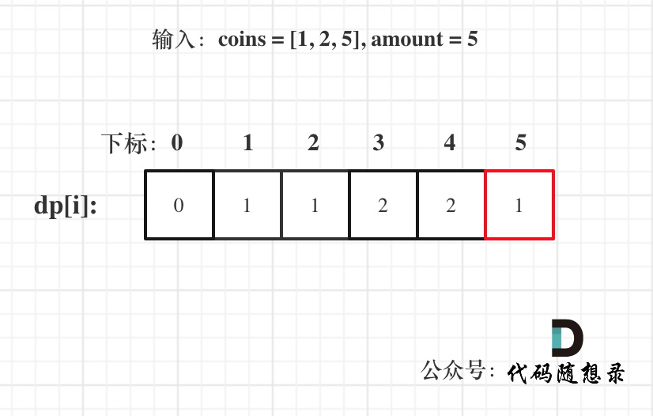

`dp[amount]`为最终结果。

以上分析完毕，`C++` 代码如下：

```cpp
// 版本一
class Solution {
public:
    int coinChange(vector<int>& coins, int amount) {
        vector<int> dp(amount + 1, INT_MAX);
        dp[0] = 0;
        for (int i = 0; i < coins.size(); i++) { // 遍历物品
            for (int j = coins[i]; j <= amount; j++) { // 遍历背包
                if (dp[j - coins[i]] != INT_MAX) { // 如果dp[j - coins[i]]是初始值则跳过
                    dp[j] = min(dp[j - coins[i]] + 1, dp[j]);
                }
            }
        }
        if (dp[amount] == INT_MAX) return -1;
        return dp[amount];
    }
};
```

- 时间复杂度`: O(n * amount)`，其中 n 为 coins 的长度
- 空间复杂度`: O(amount)`

对于遍历方式遍历背包放在外循环，遍历物品放在内循环也是可以的，我就直接给出代码了

```cpp
// 版本二
class Solution {
public:
    int coinChange(vector<int>& coins, int amount) {
        vector<int> dp(amount + 1, INT_MAX);
        dp[0] = 0;
        for (int i = 1; i <= amount; i++) {  // 遍历背包
            for (int j = 0; j < coins.size(); j++) { // 遍历物品
                if (i - coins[j] >= 0 && dp[i - coins[j]] != INT_MAX ) {
                    dp[i] = min(dp[i - coins[j]] + 1, dp[i]);
                }
            }
        }
        if (dp[amount] == INT_MAX) return -1;
        return dp[amount];
    }
};
```

- 同上

## 总结

细心的同学看网上的题解，**可能看一篇是遍历背包的for循环放外面，看一篇又是遍历背包的for循环放里面，看多** **了都看晕了**，到底两个for循环应该是什么先后关系。

能把遍历顺序讲明白的文章几乎找不到！

这也是大多数同学学习动态规划的苦恼所在，有的时候递推公式很简单，难在遍历顺序上！

但最终又可以稀里糊涂的把题目过了，也不知道为什么这样可以过，反正就是过了，哈哈

那么这篇文章就把遍历顺序分析的清清楚楚。

[动态规划：518.零钱兑换II](https://programmercarl.com/0518.%E9%9B%B6%E9%92%B1%E5%85%91%E6%8D%A2II.html)中求的是组合数，[动态规划：377. 组合总和 Ⅳ](https://programmercarl.com/0377.%E7%BB%84%E5%90%88%E6%80%BB%E5%92%8C%E2%85%A3.html)中求的是排列数。

**而本题是要求最少硬币数量，硬币是组合数还是排列数都无所谓！所以两个for循环先后顺序怎样都可以！**

这也是我为什么要先讲518.零钱兑换II 然后再讲本题即：322.零钱兑换，这是Carl的良苦用心那。

相信大家看完之后，对背包问题中的遍历顺序有更深的理解了。

# 24.完全平方数

[力扣题目链接](https://leetcode.cn/problems/perfect-squares/)

给定正整数 n，找到若干个完全平方数（比如 1, 4, 9, 16, ...）使得它们的和等于 n。你需要让组成和的完全平方数的个数最少。

给你一个整数 n ，返回和为 n 的完全平方数的 最少数量 。

完全平方数 是一个整数，其值等于另一个整数的平方；换句话说，其值等于一个整数自乘的积。例如，1、4、9 和 16 都是完全平方数，而 3 和 11 不是。

示例 1：

- 输入：`n = 12`
- 输出：3
- 解释：`12 = 4 + 4 + 4`

示例 2：

- 输入：`n = 13`
- 输出：2
- 解释：`13 = 4 + 9`

提示：

- `1 <= n <= 10^4`

## 算法公开课

[**《代码随想录》算法视频公开课**](https://programmercarl.com/other/gongkaike.html)**：**[**换汤不换药！| LeetCode：279.完全平方数**](https://www.bilibili.com/video/BV12P411T7Br/)**，相信结合视频再看本篇题解，更** **有助于大家对本题的理解**。

## 思路

可能刚看这种题感觉没啥思路，又平方和的，又最小数的。

**我来把题目翻译一下：完全平方数就是物品（可以无限件使用），凑个正整数n就是背包，问凑满这个背包最少有** **多少物品？**

感受出来了没，这么浓厚的完全背包氛围，而且和昨天的题目[动态规划：322. 零钱兑换](https://programmercarl.com/0322.%E9%9B%B6%E9%92%B1%E5%85%91%E6%8D%A2.html)就是一样一样的！

动规五部曲分析如下：

1. 确定dp数组（dp table）以及下标的含义

**dp[j]：和为j的完全平方数的最少数量为dp[j]**

2. 确定递推公式

`dp[j]` 可以由`dp[j - i * i]`推出， `dp[j - i * i] + 1` 便可以凑成`dp[j]`。

此时我们要选择最小的`dp[j]`，所以递推公式：`dp[j] = min(dp[j - i * i] + 1, dp[j]);`

3. dp数组如何初始化

`dp[0]`表示 和为0的完全平方数的最小数量，那么`dp[0]`一定是0。

有同学问题，那0 * 0 也算是一种啊，为啥`dp[0]` 就是 0呢？

看题目描述，找到若干个完全平方数（比如 1, 4, 9, 16, ...），题目描述中可没说要从0开始，`dp[0]=0`完全是为了递推公式。

非0下标的`dp[j]`应该是多少呢？

从递归公式`dp[j] = min(dp[j - i * i] + 1, dp[j]);`中可以看出每次`dp[j]`都要选最小的，**所以非0下标的dp[j]一定要初始** **为最大值，这样dp[j]在递推的时候才不会被初始值覆盖**。

4. 确定遍历顺序

我们知道这是完全背包，

如果求组合数就是外层for循环遍历物品，内层for遍历背包。

如果求排列数就是外层for遍历背包，内层for循环遍历物品。

在[动态规划：322. 零钱兑换](https://programmercarl.com/0322.%E9%9B%B6%E9%92%B1%E5%85%91%E6%8D%A2.html)中我们就深入探讨了这个问题，本题也是一样的，是求最小数！

**所以本题外层for遍历背包，内层for遍历物品，还是外层for遍历物品，内层for遍历背包，都是可以的！**

我这里先给出外层遍历背包，内层遍历物品的代码：

```cpp
vector<int> dp(n + 1, INT_MAX);
dp[0] = 0;
for (int i = 0; i <= n; i++) { // 遍历背包
    for (int j = 1; j * j <= i; j++) { // 遍历物品
        dp[i] = min(dp[i - j * j] + 1, dp[i]);
    }
}
```

5. 举例推导dp数组已输入n为5例，dp状态图如下：

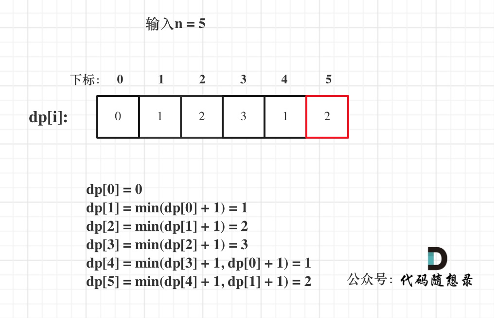

`dp[0] = 0` `dp[1] = min(dp[0] + 1) = 1` `dp[2] = min(dp[1] + 1) = 2` `dp[3] = min(dp[2] + 1) = 3` `dp[4] = min(dp[3] + 1, dp[0] + 1) = 1` `dp[5] = min(dp[4] + 1, dp[1] + 1) = 2`

最后的`dp[n]`为最终结果。

以上动规五部曲分析完毕`C++`代码如下：

```cpp
// 版本一
class Solution {
public:
    int numSquares(int n) {
        vector<int> dp(n + 1, INT_MAX);
        dp[0] = 0;
        for (int i = 0; i <= n; i++) { // 遍历背包
            for (int j = 1; j * j <= i; j++) { // 遍历物品
                dp[i] = min(dp[i - j * j] + 1, dp[i]);
            }
        }
        return dp[n];
    }
};
```

- 时间复杂度`: O(n *` √`n)`
- 空间复杂度`: O(n)`

同样我在给出先遍历物品，在遍历背包的代码，一样的可以AC的。

```cpp
// 版本二
class Solution {
public:
    int numSquares(int n) {
        vector<int> dp(n + 1, INT_MAX);
        dp[0] = 0;
        for (int i = 1; i * i <= n; i++) { // 遍历物品
            for (int j = i * i; j <= n; j++) { // 遍历背包
                dp[j] = min(dp[j - i * i] + 1, dp[j]);
            }
        }
        return dp[n];
    }
};
```

- 同上

## 总结

如果大家认真做了昨天的题目[动态规划：322. 零钱兑换](https://programmercarl.com/0322.%E9%9B%B6%E9%92%B1%E5%85%91%E6%8D%A2.html)，今天这道就非常简单了，一样的套路一样的味道。

但如果没有按照「代码随想录」的题目顺序来做的话，做动态规划或者做背包问题，上来就做这道题，那还是挺难的！

经过前面的训练这道题已经是简单题了，哈哈哈

# 25. 本周小结！（动态规划系列五）

## 周一

[动态规划：377. 组合总和 Ⅳ](https://programmercarl.com/0377.%E7%BB%84%E5%90%88%E6%80%BB%E5%92%8C%E2%85%A3.html)中给定一个由正整数组成且不存在重复数字的数组，找出和为给定目标正整数的组合的个数（顺序不同的序列被视作不同的组合）。

题目面试虽然是组合，但又强调顺序不同的序列被视作不同的组合，其实这道题目求的是排列数！

递归公式：`dp[i] += dp[i - nums[j]];`

这个和前上周讲的组合问题又不一样，关键就体现在遍历顺序上！

在[动态规划：518.零钱兑换II](https://programmercarl.com/0518.%E9%9B%B6%E9%92%B1%E5%85%91%E6%8D%A2II.html) 中就已经讲过了。

**如果求组合数就是外层for循环遍历物品，内层for遍历背包**。

**如果求排列数就是外层for遍历背包，内层for循环遍历物品**。

如果把遍历nums（物品）放在外循环，遍历target的作为内循环的话，举一个例子：计算`dp[4]`的时候，结果集只有 `{1,3}` 这样的集合，不会有`{3,1}`这样的集合，因为nums遍历放在外层，3只能出现在1后面！

所以本题遍历顺序最终遍历顺序：**target（背包）放在外循环，将nums（物品）放在内循环，内循环从前到后遍** **历**。

```cpp
class Solution {
public:
    int combinationSum4(vector<int>& nums, int target) {
        vector<int> dp(target + 1, 0);
        dp[0] = 1;
        for (int i = 0; i <= target; i++) { // 遍历背包
            for (int j = 0; j < nums.size(); j++) { // 遍历物品
                if (i - nums[j] >= 0 && dp[i] < INT_MAX - dp[i - nums[j]]) {
                    dp[i] += dp[i - nums[j]];
                }
            }
        }
        return dp[target];
    }
};
```

## 周二

爬楼梯之前我们已经做过了，就是斐波那契数列，很好解，但[动态规划：70. 爬楼梯进阶版（完全背包）](https://programmercarl.com/0070.%E7%88%AC%E6%A5%BC%E6%A2%AF%E5%AE%8C%E5%85%A8%E8%83%8C%E5%8C%85%E7%89%88%E6%9C%AC.html)中我们进阶了一下。

改为：每次可以爬 1 、 2、.....、m 个台阶。问有多少种不同的方法可以爬到楼顶呢？

1阶，2阶，.... m阶就是物品，楼顶就是背包。

每一阶可以重复使用，例如跳了1阶，还可以继续跳1阶。

问跳到楼顶有几种方法其实就是问装满背包有几种方法。

**此时大家应该发现这就是一个完全背包问题了！**

和昨天的题目[动态规划：377. 组合总和 Ⅳ](https://programmercarl.com/0377.%E7%BB%84%E5%90%88%E6%80%BB%E5%92%8C%E2%85%A3.html)基本就是一道题了，遍历顺序也是一样一样的！

代码如下：

```cpp
class Solution {
public:
    int climbStairs(int n) {
        vector<int> dp(n + 1, 0);
        dp[0] = 1;
        for (int i = 1; i <= n; i++) { // 遍历背包
            for (int j = 1; j <= m; j++) { // 遍历物品
                if (i - j >= 0) dp[i] += dp[i - j];
            }
        }
        return dp[n];
    }
};
```

代码中m表示最多可以爬m个台阶，代码中把m改成2就是本题70.爬楼梯可以AC的代码了。

## 周三

[动态规划：322.零钱兑换](https://programmercarl.com/0322.%E9%9B%B6%E9%92%B1%E5%85%91%E6%8D%A2.html)给定不同面额的硬币 coins 和一个总金额 amount。编写一个函数来计算可以凑成总金额所需的最少的硬币个数（每种硬币的数量是无限的）。

这里我们都知道这是完全背包。

递归公式：`dp[j] =  min(dp[j - coins[i]] + 1, dp[j]);`

关键看遍历顺序。

本题求钱币最小个数，**那么钱币有顺序和没有顺序都可以，都不影响钱币的最小个数**。

所以本题并不强调集合是组合还是排列。

**那么本题的两个for循环的关系是：外层for循环遍历物品，内层for遍历背包或者外层for遍历背包，内层for循环遍** **历物品都是可以的！**

外层for循环遍历物品，内层for遍历背包：

```cpp
// 版本一
class Solution {
public:
    int coinChange(vector<int>& coins, int amount) {
        vector<int> dp(amount + 1, INT_MAX);
        dp[0] = 0;
        for (int i = 0; i < coins.size(); i++) { // 遍历物品
            for (int j = coins[i]; j <= amount; j++) { // 遍历背包
                if (dp[j - coins[i]] != INT_MAX) { // 如果dp[j - coins[i]]是初始值则跳过
                    dp[j] = min(dp[j - coins[i]] + 1, dp[j]);
                }
            }
        }
        if (dp[amount] == INT_MAX) return -1;
        return dp[amount];
    }
};
```

外层for遍历背包，内层for循环遍历物品：

```cpp
// 版本二
class Solution {
public:
    int coinChange(vector<int>& coins, int amount) {
        vector<int> dp(amount + 1, INT_MAX);
        dp[0] = 0;
        for (int i = 1; i <= amount; i++) {  // 遍历背包
            for (int j = 0; j < coins.size(); j++) { // 遍历物品
                if (i - coins[j] >= 0 && dp[i - coins[j]] != INT_MAX ) {
                    dp[i] = min(dp[i - coins[j]] + 1, dp[i]);
                }
            }
        }
        if (dp[amount] == INT_MAX) return -1;
        return dp[amount];
    }
};
```

## 周四

[动态规划：279.完全平方数](https://programmercarl.com/0279.%E5%AE%8C%E5%85%A8%E5%B9%B3%E6%96%B9%E6%95%B0.html)给定正整数 n，找到若干个完全平方数（比如 1, 4, 9, 16, ...）使得它们的和等于 n。你需要让组成和的完全平方数的个数最少（平方数可以重复使用）。

如果按顺序把前面的文章都看了，这道题目就是简单题了。 `dp[i]`的定义，递推公式，初始化，遍历顺序，都是和[动态规划：322. 零钱兑换](https://programmercarl.com/0322.%E9%9B%B6%E9%92%B1%E5%85%91%E6%8D%A2.html) 一样一样的。

要是没有前面的基础上来做这道题，那这道题目就有点难度了。

**这也体现了刷题顺序的重要性**。

先遍历背包，再遍历物品：

```cpp
// 版本一
class Solution {
public:
    int numSquares(int n) {
        vector<int> dp(n + 1, INT_MAX);
        dp[0] = 0;
        for (int i = 0; i <= n; i++) { // 遍历背包
            for (int j = 1; j * j <= i; j++) { // 遍历物品
                dp[i] = min(dp[i - j * j] + 1, dp[i]);
            }
        }
        return dp[n];
    }
};
```

先遍历物品，再遍历背包：

```cpp
// 版本二
class Solution {
public:
    int numSquares(int n) {
        vector<int> dp(n + 1, INT_MAX);
        dp[0] = 0;
        for (int i = 1; i * i <= n; i++) { // 遍历物品
            for (int j = 1; j <= n; j++) { // 遍历背包
                if (j - i * i >= 0) {
                    dp[j] = min(dp[j - i * i] + 1, dp[j]);
                }
            }
        }
        return dp[n];
    }
};
```

## 总结

本周的主题其实就是背包问题中的遍历顺序！

我这里做一下总结：

求组合数：[动态规划：518.零钱兑换II](https://programmercarl.com/0518.%E9%9B%B6%E9%92%B1%E5%85%91%E6%8D%A2II.html)求排列数：[动态规划：377. 组合总和 Ⅳ](https://programmercarl.com/0377.%E7%BB%84%E5%90%88%E6%80%BB%E5%92%8C%E2%85%A3.html)、[动态规划：70. 爬楼梯进阶版（完全背包）](https://programmercarl.com/0070.%E7%88%AC%E6%A5%BC%E6%A2%AF%E5%AE%8C%E5%85%A8%E8%83%8C%E5%8C%85%E7%89%88%E6%9C%AC.html)求最小数：[动态规划：322. 零钱兑换](https://programmercarl.com/0322.%E9%9B%B6%E9%92%B1%E5%85%91%E6%8D%A2.html)、[动态规划：279.完全平方数](https://programmercarl.com/0279.%E5%AE%8C%E5%85%A8%E5%B9%B3%E6%96%B9%E6%95%B0.html)

此时我们就已经把完全背包的遍历顺序研究的透透的了！

# 26.单词拆分

[力扣题目链接](https://leetcode.cn/problems/word-break/)

给定一个非空字符串 s 和一个包含非空单词的列表 wordDict，判定 s 是否可以被空格拆分为一个或多个在字典中出现的单词。

说明：

拆分时可以重复使用字典中的单词。

你可以假设字典中没有重复的单词。

示例 1：

- 输入`: s = "leetcode", wordDict = ["leet", "code"]`
- 输出: true
- 解释: 返回 true 因为 "leetcode" 可以被拆分成 "leet code"。

示例 2：

- 输入`: s = "applepenapple", wordDict = ["apple", "pen"]`
- 输出: true
- 解释: 返回 true 因为 "applepenapple" 可以被拆分成 "apple pen apple"。

- 注意你可以重复使用字典中的单词。

示例 3：

- 输入`: s = "catsandog", wordDict = ["cats", "dog", "sand", "and", "cat"]`
- 输出: false

## 算法公开课

[**《代码随想录》算法视频公开课**](https://programmercarl.com/other/gongkaike.html)**：**[**你的背包如何装满？| LeetCode：139.单词拆分**](https://www.bilibili.com/video/BV1pd4y147Rh/)**，相信结合视频再看本篇题** **解，更有助于大家对本题的理解**。

## 思路

看到这道题目的时候，大家应该回想起我们之前讲解回溯法专题的时候，讲过的一道题目[回溯算法：分割回文串](https://programmercarl.com/0131.%E5%88%86%E5%89%B2%E5%9B%9E%E6%96%87%E4%B8%B2.html)，就是枚举字符串的所有分割情况。

[回溯算法：分割回文串](https://programmercarl.com/0131.%E5%88%86%E5%89%B2%E5%9B%9E%E6%96%87%E4%B8%B2.html)：是枚举分割后的所有子串，判断是否回文。

本道是枚举分割所有字符串，判断是否在字典里出现过。

那么这里我也给出回溯法`C++`代码：

```cpp
class Solution {
private:
    bool backtracking (const string& s, const unordered_set<string>& wordSet, int
startIndex) {
        if (startIndex >= s.size()) {
            return true;
        }
        for (int i = startIndex; i < s.size(); i++) {
            string word = s.substr(startIndex, i - startIndex + 1);
            if (wordSet.find(word) != wordSet.end() && backtracking(s, wordSet, i + 1))
{
                return true;
            }
        }
        return false;
    }
public:
    bool wordBreak(string s, vector<string>& wordDict) {
        unordered_set<string> wordSet(wordDict.begin(), wordDict.end());
        return backtracking(s, wordSet, 0);
    }
};
```

- 时间复杂度：`O(2^n)`，因为每一个单词都有两个状态，切割和不切割
- 空间复杂度：`O(n)`，算法递归系统调用栈的空间

那么以上代码很明显要超时了，超时的数据如下：

```text
"aaaaaaaaaaaaaaaaaaaaaaaaaaaaaaaaaaaaaaaaaaaaaaaaaaaaaaaaaaaaaaaaaaaaaaaaaaaaaaaaaaaaaa
aaaaaaaaaaaaaaaaaaaaaaaaaaaaaaaaaaaaaaaaaaaaaaaaaaaaaaaaaaaaaaaab"
["a","aa","aaa","aaaa","aaaaa","aaaaaa","aaaaaaa","aaaaaaaa","aaaaaaaaa","aaaaaaaaaa"]
```

递归的过程中有很多重复计算，可以使用数组保存一下递归过程中计算的结果。

这个叫做记忆化递归，这种方法我们之前已经提过很多次了。

使用memory数组保存每次计算的以startIndex起始的计算结果，如果`memory[startIndex]`里已经被赋值了，直接用`memory[startIndex]`的结果。

`C++`代码如下：

```cpp
class Solution {
private:
    bool backtracking (const string& s,
            const unordered_set<string>& wordSet,
            vector<bool>& memory,
            int startIndex) {
        if (startIndex >= s.size()) {
            return true;
        }
        // 如果memory[startIndex]不是初始值了，直接使用memory[startIndex]的结果
        if (!memory[startIndex]) return memory[startIndex];
        for (int i = startIndex; i < s.size(); i++) {
            string word = s.substr(startIndex, i - startIndex + 1);
            if (wordSet.find(word) != wordSet.end() && backtracking(s, wordSet, memory,
i + 1)) {
                return true;
            }
        }
        memory[startIndex] = false; // 记录以startIndex开始的子串是不可以被拆分的
        return false;
    }
public:
    bool wordBreak(string s, vector<string>& wordDict) {
        unordered_set<string> wordSet(wordDict.begin(), wordDict.end());
        vector<bool> memory(s.size(), 1); // -1 表示初始化状态
        return backtracking(s, wordSet, memory, 0);
    }
};
```

这个时间复杂度其实也是：`O(2^n)`。只不过对于上面那个超时测试用例优化效果特别明显。

**这个代码就可以AC了，当然回溯算法不是本题的主菜，背包才是！**

### 背包问题

单词就是物品，字符串s就是背包，单词能否组成字符串s，就是问物品能不能把背包装满。

拆分时可以重复使用字典中的单词，说明就是一个完全背包！

动规五部曲分析如下：

1. 确定dp数组以及下标的含义

**dp[i] : 字符串长度为i的话，dp[i]为true，表示可以拆分为一个或多个在字典中出现的单词**。

2. 确定递推公式

如果确定`dp[j]` 是true，且 `[j, i]` 这个区间的子串出现在字典里，那么`dp[i]`一定是true。（`j < i` ）。

所以递推公式是 `if([j, i]` 这个区间的子串出现在字典里 `&& dp[j]`是`true)` 那么 `dp[i] = true`。

3. dp数组如何初始化

从递推公式中可以看出，`dp[i]` 的状态依靠 `dp[j]`是否为true，那么`dp[0]`就是递推的根基，`dp[0]`一定要为true，否则递推下去后面都都是false了。

那么`dp[0]`有没有意义呢？

`dp[0]`表示如果字符串为空的话，说明出现在字典里。

但题目中说了“给定一个非空字符串 s” 所以测试数据中不会出现i为0的情况，那么`dp[0]`初始为true完全就是为了推导公式。

下标非0的`dp[i]`初始化为false，只要没有被覆盖说明都是不可拆分为一个或多个在字典中出现的单词。

4. 确定遍历顺序

题目中说是拆分为一个或多个在字典中出现的单词，所以这是完全背包。

还要讨论两层for循环的前后顺序。

**如果求组合数就是外层for循环遍历物品，内层for遍历背包**。

**如果求排列数就是外层for遍历背包，内层for循环遍历物品**。

我在这里做一个总结：

求组合数：[动态规划：518.零钱兑换II](https://programmercarl.com/0518.%E9%9B%B6%E9%92%B1%E5%85%91%E6%8D%A2II.html)求排列数：[动态规划：377. 组合总和 Ⅳ](https://programmercarl.com/0377.%E7%BB%84%E5%90%88%E6%80%BB%E5%92%8C.html)、[动态规划：70. 爬楼梯进阶版（完全背包）](https://programmercarl.com/0070.%E7%88%AC%E6%A5%BC%E6%A2%AF%E5%AE%8C%E5%85%A8%E8%83%8C%E5%8C%85%E7%89%88%E6%9C%AC.html)求最小数：[动态规划：322. 零钱兑换](https://programmercarl.com/0322.%E9%9B%B6%E9%92%B1%E5%85%91%E6%8D%A2.html)、[动态规划：279.完全平方数](https://programmercarl.com/0279.%E5%AE%8C%E5%85%A8%E5%B9%B3%E6%96%B9%E6%95%B0.html)

而本题其实我们求的是排列数，为什么呢。 拿 `s = "applepenapple", wordDict = ["apple", "pen"]` 举例。 

"apple", "pen" 是物品，那么我们要求 物品的组合一定是 "apple" + "pen" + "apple" 才能组成 "applepenapple"。 

"apple" + "apple" + "pen" 或者 "pen" + "apple" + "apple" 是不可以的，那么我们就是强调物品之间顺序。 

所以说，本题一定是 先遍历 背包，再遍历物品。 

5. 举例推导`dp[i]`

以输入`: s = "leetcode", wordDict = ["leet", "code"]`为例，dp状态如图：

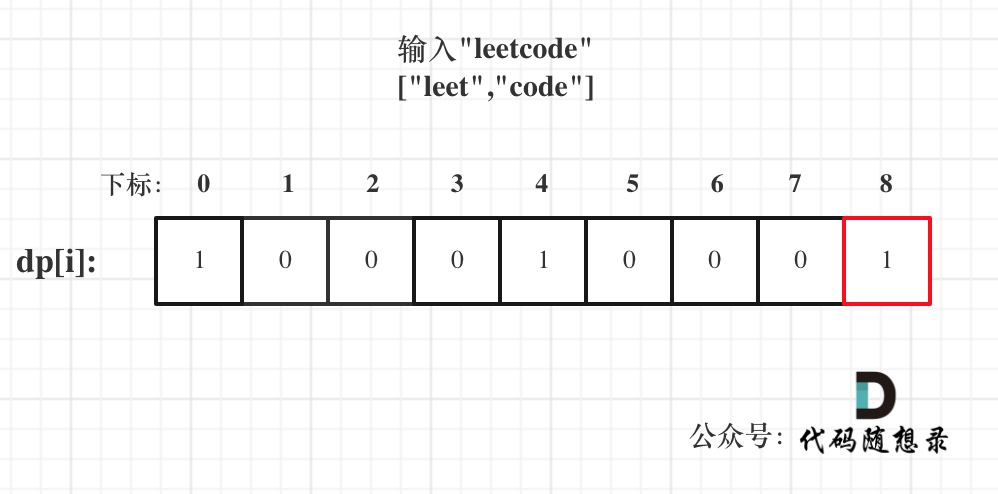

`dp[s.size()]`就是最终结果。

动规五部曲分析完毕，`C++`代码如下：

```cpp
class Solution {
public:
    bool wordBreak(string s, vector<string>& wordDict) {
        unordered_set<string> wordSet(wordDict.begin(), wordDict.end());
        vector<bool> dp(s.size() + 1, false);
        dp[0] = true;
        for (int i = 1; i <= s.size(); i++) {   // 遍历背包
            for (int j = 0; j < i; j++) {       // 遍历物品
                string word = s.substr(j, i - j); //substr(起始位置，截取的个数)
                if (wordSet.find(word) != wordSet.end() && dp[j]) {
                    dp[i] = true;
                }
            }
        }
        return dp[s.size()];
    }
};
```

- 时间复杂度：`O(n^3)`，因为substr返回子串的副本是`O(n)`的复杂度（这里的n是substring的长度）
- 空间复杂度：`O(n)`

## 拓展

关于遍历顺序，再给大家讲一下为什么 先遍历物品再遍历背包不行。 

这里可以给出先遍历物品再遍历背包的代码： 

```cpp
class Solution {
public:
    bool wordBreak(string s, vector<string>& wordDict) {
        unordered_set<string> wordSet(wordDict.begin(), wordDict.end());
        vector<bool> dp(s.size() + 1, false);
        dp[0] = true;
        for (int j = 0; j < wordDict.size(); j++) { // 物品
            for (int i = wordDict[j].size(); i <= s.size(); i++) { // 背包
                string word = s.substr(i - wordDict[j].size(), wordDict[j].size());
                // cout << word << endl;
                if ( word == wordDict[j] && dp[i - wordDict[j].size()]) {
                    dp[i] = true;
                }
                // for (int k = 0; k <= s.size(); k++) cout << dp[k] << " "; //这里打印
dp数组的情况
                // cout << endl;
            }
        }
        return dp[s.size()];
    }
};
```

使用用例：`s = "applepenapple", wordDict = ["apple", "pen"]`，对应的dp数组状态如下： 

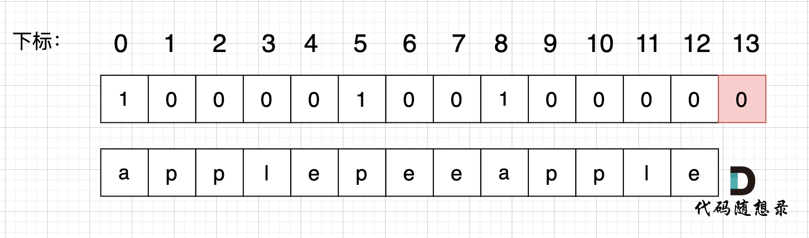

最后`dp[s.size()] = 0` 即 `dp[13] = 0` ，而不是1，因为先用 "apple" 去遍历的时候，`dp[8]`并没有被赋值为1 （还没用"pen"），所以 `dp[13]`也不能变成1。 

除非是先用 "apple" 遍历一遍，再用  "pen" 遍历，此时 `dp[8]`已经是1，最后再用  "apple" 去遍历，`dp[13]`才能是1。 

如果大家对这里不理解，建议可以把我上面给的代码，拿去力扣上跑一跑，把dp数组打印出来，对着递推公式一步一步去看，思路就清晰了。 

## 总结

本题和我们之前讲解回溯专题的[回溯算法：分割回文串](https://programmercarl.com/0131.%E5%88%86%E5%89%B2%E5%9B%9E%E6%96%87%E4%B8%B2.html)非常像，所以我也给出了对应的回溯解法。

稍加分析，便可知道本题是完全背包，是求能否组成背包，而且这里要求物品是要有顺序的。

# 27. 动态规划：关于多重背包，你该了解这些！

之前我们已经系统的讲解了01背包和完全背包，如果没有看过的录友，建议先把如下三篇文章仔细阅读一波。

- [动态规划：关于01背包问题，你该了解这些！](https://programmercarl.com/%E8%83%8C%E5%8C%85%E7%90%86%E8%AE%BA%E5%9F%BA%E7%A1%8001%E8%83%8C%E5%8C%85-1.html)
- [动态规划：关于01背包问题，你该了解这些！（滚动数组）](https://programmercarl.com/%E8%83%8C%E5%8C%85%E7%90%86%E8%AE%BA%E5%9F%BA%E7%A1%8001%E8%83%8C%E5%8C%85-2.html)
- [动态规划：关于完全背包，你该了解这些！](https://programmercarl.com/%E8%83%8C%E5%8C%85%E9%97%AE%E9%A2%98%E7%90%86%E8%AE%BA%E5%9F%BA%E7%A1%80%E5%AE%8C%E5%85%A8%E8%83%8C%E5%8C%85.html)

这次我们再来说一说多重背包

## 多重背包

对于多重背包，我在力扣上还没发现对应的题目，所以这里就做一下简单介绍，大家大概了解一下。

有N种物品和一个容量为V 的背包。第i种物品最多有Mi件可用，每件耗费的空间是Ci ，价值是Wi 。求解将哪些物品装入背包可使这些物品的耗费的空间 总和不超过背包容量，且价值总和最大。

多重背包和01背包是非常像的， 为什么和01背包像呢？

每件物品最多有Mi件可用，把Mi件摊开，其实就是一个01背包问题了。

例如：

背包最大重量为10。

物品为：

|  | 重量 | 价值 | 数量 |
|---|---|---|---|
| 物品0 | 1 | 15 | 2 |
| 物品1 | 3 | 20 | 3 |
| 物品2 | 4 | 30 | 2 |

问背包能背的物品最大价值是多少？

和如下情况有区别么？

|  | 重量 | 价值 | 数量 |
|---|---|---|---|
| 物品0 | 1 | 15 | 1 |
| 物品0 | 1 | 15 | 1 |
| 物品1 | 3 | 20 | 1 |
| 物品1 | 3 | 20 | 1 |
| 物品1 | 3 | 20 | 1 |
| 物品2 | 4 | 30 | 1 |
| 物品2 | 4 | 30 | 1 |

毫无区别，这就转成了一个01背包问题了，且每个物品只用一次。

这种方式来实现多重背包的代码如下：

```cpp
void test_multi_pack() {
    vector<int> weight = {1, 3, 4};
    vector<int> value = {15, 20, 30};
    vector<int> nums = {2, 3, 2};
    int bagWeight = 10;
    for (int i = 0; i < nums.size(); i++) {
        while (nums[i] > 1) { // nums[i]保留到1，把其他物品都展开
            weight.push_back(weight[i]);
            value.push_back(value[i]);
            nums[i]--;
        }
    }
    vector<int> dp(bagWeight + 1, 0);
    for(int i = 0; i < weight.size(); i++) { // 遍历物品
        for(int j = bagWeight; j >= weight[i]; j--) { // 遍历背包容量
            dp[j] = max(dp[j], dp[j - weight[i]] + value[i]);
        }
        for (int j = 0; j <= bagWeight; j++) {
            cout << dp[j] << " ";
        }
        cout << endl;
    }
    cout << dp[bagWeight] << endl;
}
int main() {
    test_multi_pack();
}
```

- 时间复杂度：`O(m × n × k)`，m：物品种类个数，n背包容量，k单类物品数量

也有另一种实现方式，就是把每种商品遍历的个数放在01背包里面在遍历一遍。

代码如下：（详看注释）

```cpp
void test_multi_pack() {
    vector<int> weight = {1, 3, 4};
    vector<int> value = {15, 20, 30};
    vector<int> nums = {2, 3, 2};
    int bagWeight = 10;
    vector<int> dp(bagWeight + 1, 0);
    for(int i = 0; i < weight.size(); i++) { // 遍历物品
        for(int j = bagWeight; j >= weight[i]; j--) { // 遍历背包容量
            // 以上为01背包，然后加一个遍历个数
            for (int k = 1; k <= nums[i] && (j - k * weight[i]) >= 0; k++) { // 遍历个数
                dp[j] = max(dp[j], dp[j - k * weight[i]] + k * value[i]);
            }
        }
        // 打印一下dp数组
        for (int j = 0; j <= bagWeight; j++) {
            cout << dp[j] << " ";
        }
        cout << endl;
    }
    cout << dp[bagWeight] << endl;
}
int main() {
    test_multi_pack();
}
```

- 时间复杂度：`O(m × n × k)`，m：物品种类个数，n背包容量，k单类物品数量

从代码里可以看出是01背包里面在加一个for循环遍历一个每种商品的数量。 和01背包还是如出一辙的。

当然还有那种二进制优化的方法，其实就是把每种物品的数量，打包成一个个独立的包。

和以上在循环遍历上有所不同，因为是分拆为各个包最后可以组成一个完整背包，具体原理我就不做过多解释了，大家了解一下就行，面试的话基本不会考完这个深度了，感兴趣可以自己深入研究一波。

## 总结

多重背包在面试中基本不会出现，力扣上也没有对应的题目，大家对多重背包的掌握程度知道它是一种01背包，并能在01背包的基础上写出对应代码就可以了。

至于背包九讲里面还有混合背包，二维费用背包，分组背包等等这些，大家感兴趣可以自己去学习学习，这里也不做介绍了，面试也不会考。

# 28. 听说背包问题很难？ 这篇总结篇来拯救你了

年前我们已经把背包问题都讲完了，那么现在我们要对背包问题进行总结一番。

背包问题是动态规划里的非常重要的一部分，所以我把背包问题单独总结一下，等动态规划专题更新完之后，我们还会在整体总结一波动态规划。

关于这几种常见的背包，其关系如下：


通过这个图，可以很清晰分清这几种常见背包之间的关系。

在讲解背包问题的时候，我们都是按照如下五部来逐步分析，相信大家也体会到，把这五部都搞透了，算是对动规来理解深入了。

1. 确定dp数组（dp table）以及下标的含义2. 确定递推公式3. dp数组如何初始化4. 确定遍历顺序5. 举例推导dp数组

**其实这五部里哪一步都很关键，但确定递推公式和确定遍历顺序都具有规律性和代表性，所以下面我从这两点来对** **背包问题做一做总结**。

## 背包递推公式

问能否能装满背包（或者最多装多少）：`dp[j] = max(dp[j], dp[j - nums[i]] + nums[i]);` ，对应题目如下：

- [动态规划：416.分割等和子集](https://programmercarl.com/0416.%E5%88%86%E5%89%B2%E7%AD%89%E5%92%8C%E5%AD%90%E9%9B%86.html)
- [动态规划：1049.最后一块石头的重量 II](https://programmercarl.com/1049.%E6%9C%80%E5%90%8E%E4%B8%80%E5%9D%97%E7%9F%B3%E5%A4%B4%E7%9A%84%E9%87%8D%E9%87%8FII.html)

问装满背包有几种方法：`dp[j] += dp[j - nums[i]]` ，对应题目如下：

- [动态规划：494.目标和](https://programmercarl.com/0494.%E7%9B%AE%E6%A0%87%E5%92%8C.html)
- [动态规划：518. 零钱兑换 II](https://programmercarl.com/0518.%E9%9B%B6%E9%92%B1%E5%85%91%E6%8D%A2II.html)
- [动态规划：377.组合总和Ⅳ](https://programmercarl.com/0377.%E7%BB%84%E5%90%88%E6%80%BB%E5%92%8C%E2%85%A3.html)
- [动态规划：70. 爬楼梯进阶版（完全背包）](https://programmercarl.com/0070.%E7%88%AC%E6%A5%BC%E6%A2%AF%E5%AE%8C%E5%85%A8%E8%83%8C%E5%8C%85%E7%89%88%E6%9C%AC.html)

问背包装满最大价值：`dp[j] = max(dp[j], dp[j - weight[i]] + value[i]);` ，对应题目如下：

- [动态规划：474.一和零](https://programmercarl.com/0474.%E4%B8%80%E5%92%8C%E9%9B%B6.html)

问装满背包所有物品的最小个数：`dp[j] =  min(dp[j - coins[i]] + 1, dp[j]);` ，对应题目如下：

- [动态规划：322.零钱兑换](https://programmercarl.com/0322.%E9%9B%B6%E9%92%B1%E5%85%91%E6%8D%A2.html)
- [动态规划：279.完全平方数](https://programmercarl.com/0279.%E5%AE%8C%E5%85%A8%E5%B9%B3%E6%96%B9%E6%95%B0.html)

## 遍历顺序

### 01背包

在[动态规划：关于01背包问题，你该了解这些！](https://programmercarl.com/%E8%83%8C%E5%8C%85%E7%90%86%E8%AE%BA%E5%9F%BA%E7%A1%8001%E8%83%8C%E5%8C%85-1.html)中我们讲解二维dp数组01背包先遍历物品还是先遍历背包都是可以的，且第二层for循环是从小到大遍历。

和[动态规划：关于01背包问题，你该了解这些！（滚动数组）](https://programmercarl.com/%E8%83%8C%E5%8C%85%E7%90%86%E8%AE%BA%E5%9F%BA%E7%A1%8001%E8%83%8C%E5%8C%85-2.html)中，我们讲解一维dp数组01背包只能先遍历物品再遍历背包容量，且第二层for循环是从大到小遍历。

**一维dp数组的背包在遍历顺序上和二维dp数组实现的01背包其实是有很大差异的，大家需要注意！**

### 完全背包

说完01背包，再看看完全背包。

在[动态规划：关于完全背包，你该了解这些！](https://programmercarl.com/%E8%83%8C%E5%8C%85%E9%97%AE%E9%A2%98%E7%90%86%E8%AE%BA%E5%9F%BA%E7%A1%80%E5%AE%8C%E5%85%A8%E8%83%8C%E5%8C%85.html)中，讲解了纯完全背包的一维dp数组实现，先遍历物品还是先遍历背包都是可以的，且第二层for循环是从小到大遍历。

但是仅仅是纯完全背包的遍历顺序是这样的，题目稍有变化，两个for循环的先后顺序就不一样了。

**如果求组合数就是外层for循环遍历物品，内层for遍历背包**。

**如果求排列数就是外层for遍历背包，内层for循环遍历物品**。

相关题目如下：

- 求组合数：[动态规划：518.零钱兑换II](https://programmercarl.com/0518.%E9%9B%B6%E9%92%B1%E5%85%91%E6%8D%A2II.html)
- 求排列数：[动态规划：377. 组合总和 Ⅳ](https://mp.weixin.qq.com/s/Iixw0nahJWQgbqVNk8k6gA)、[动态规划：70. 爬楼梯进阶版（完全背包）](https://programmercarl.com/0070.%E7%88%AC%E6%A5%BC%E6%A2%AF%E5%AE%8C%E5%85%A8%E8%83%8C%E5%8C%85%E7%89%88%E6%9C%AC.html)

如果求最小数，那么两层for循环的先后顺序就无所谓了，相关题目如下：

- 求最小数：[动态规划：322. 零钱兑换](https://programmercarl.com/0322.%E9%9B%B6%E9%92%B1%E5%85%91%E6%8D%A2.html)、[动态规划：279.完全平方数](https://programmercarl.com/0279.%E5%AE%8C%E5%85%A8%E5%B9%B3%E6%96%B9%E6%95%B0.html)

**对于背包问题，其实递推公式算是容易的，难是难在遍历顺序上，如果把遍历顺序搞透，才算是真正理解了**。

## 总结

**这篇背包问题总结篇是对背包问题的高度概括，讲最关键的两部：递推公式和遍历顺序，结合力扣上的题目全都抽** **象出来了**。

**而且每一个点，我都给出了对应的力扣题目**。

最后如果你想了解多重背包，可以看这篇[动态规划：关于多重背包，你该了解这些！](https://programmercarl.com/%E8%83%8C%E5%8C%85%E9%97%AE%E9%A2%98%E7%90%86%E8%AE%BA%E5%9F%BA%E7%A1%80%E5%A4%9A%E9%87%8D%E8%83%8C%E5%8C%85.html)，力扣上还没有多重背包的题目，也不是面试考察的重点。

如果把我本篇总结出来的内容都掌握的话，可以说对背包问题理解的就很深刻了，用来对付面试中的背包问题绰绰有余！

背包问题总结：

这个图是 [代码随想录知识星球](https://programmercarl.com/other/kstar.html) 成员：[海螺人](https://wx.zsxq.com/dweb2/index/footprint/844412858822412)，所画结的非常好，分享给大家。

# 29.打家劫舍

[力扣题目链接](https://leetcode.cn/problems/house-robber/)

你是一个专业的小偷，计划偷窃沿街的房屋。每间房内都藏有一定的现金，影响你偷窃的唯一制约因素就是相邻的房屋装有相互连通的防盗系统，如果两间相邻的房屋在同一晚上被小偷闯入，系统会自动报警。

给定一个代表每个房屋存放金额的非负整数数组，计算你 不触动警报装置的情况下 ，一夜之内能够偷窃到的最高金额。

- 示例 1：
- 输入：`[1,2,3,1]`
- 输出：4

解释：偷窃 1 号房屋 `(`金额 `= 1)` ，然后偷窃 3 号房屋 `(`金额 `= 3)`。 偷窃到的最高金额 `= 1 + 3 = 4` 。

- 示例 2：
- 输入：`[2,7,9,3,1]`
- 输出：12  
解释：偷窃 1 号房屋 `(`金额 `= 2),` 偷窃 3 号房屋 `(`金额 `= 9)`，接着偷窃 5 号房屋 `(`金额 `= 1)`。 偷窃到的最高金额 `= 2 + 9 + 1 = 12` 。

提示：

- `0 <= nums.length <= 100`
- `0 <= nums[i] <= 400`

## 算法公开课

[**《代码随想录》算法视频公开课**](https://programmercarl.com/other/gongkaike.html)**：**[**动态规划，偷不偷这个房间呢？| LeetCode：198.打家劫舍**](https://www.bilibili.com/video/BV1Te411N7SX)**，相信结合视频再** **看本篇题解，更有助于大家对本题的理解**。

## 思路

大家如果刚接触这样的题目，会有点困惑，当前的状态我是偷还是不偷呢？ 

仔细一想，当前房屋偷与不偷取决于  前一个房屋和前两个房屋是否被偷了。 

所以这里就更感觉到，当前状态和前面状态会有一种依赖关系，那么这种依赖关系都是动规的递推公式。

当然以上是大概思路，打家劫舍是dp解决的经典问题，接下来我们来动规五部曲分析如下：

1. 确定dp数组（dp table）以及下标的含义

**dp[i]：考虑下标i（包括i）以内的房屋，最多可以偷窃的金额为dp[i]**。

2. 确定递推公式

决定`dp[i]`的因素就是第i房间偷还是不偷。

如果偷第i房间，那么`dp[i] = dp[i - 2] + nums[i]` ，即：第i-1房一定是不考虑的，找出 下标i-2（包括i-2）以内的房屋，最多可以偷窃的金额为`dp[i-2]` 加上第i房间偷到的钱。

如果不偷第i房间，那么`dp[i] = dp[i - 1]`，即考 虑i-1房，（**注意这里是考虑，并不是一定要偷i-1房，这是很多同学** **容易混淆的点**）

然后`dp[i]`取最大值，即`dp[i] = max(dp[i - 2] + nums[i], dp[i - 1]);`

3. dp数组如何初始化

从递推公式`dp[i] = max(dp[i - 2] + nums[i], dp[i - 1]);`可以看出，递推公式的基础就是`dp[0]` 和 `dp[1]`

从`dp[i]`的定义上来讲，`dp[0]` 一定是 `nums[0]`，`dp[1]`就是`nums[0]`和`nums[1]`的最大值即：`dp[1] = max(nums[0],` `nums[1]);`

代码如下：

```cpp
vector<int> dp(nums.size());
dp[0] = nums[0];
dp[1] = max(nums[0], nums[1]);
```

4. 确定遍历顺序

`dp[i]` 是根据`dp[i - 2]` 和 `dp[i - 1]` 推导出来的，那么一定是从前到后遍历！

代码如下：

```cpp
for (int i = 2; i < nums.size(); i++) {
    dp[i] = max(dp[i - 2] + nums[i], dp[i - 1]);
}
```

5. 举例推导dp数组

以示例二，输入`[2,7,9,3,1]`为例。

红框`dp[nums.size() - 1]`为结果。

以上分析完毕，`C++`代码如下：

```cpp
class Solution {
public:
    int rob(vector<int>& nums) {
        if (nums.size() == 0) return 0;
        if (nums.size() == 1) return nums[0];
        vector<int> dp(nums.size());
        dp[0] = nums[0];
        dp[1] = max(nums[0], nums[1]);
        for (int i = 2; i < nums.size(); i++) {
            dp[i] = max(dp[i - 2] + nums[i], dp[i - 1]);
        }
        return dp[nums.size() - 1];
    }
};
```

- 时间复杂度`: O(n)`
- 空间复杂度`: O(n)`

## 总结

打家劫舍是DP解决的经典题目，这道题也是打家劫舍入门级题目，后面我们还会变种方式来打劫的。

# 30.打家劫舍II

[力扣题目链接](https://leetcode.cn/problems/house-robber-ii/)

你是一个专业的小偷，计划偷窃沿街的房屋，每间房内都藏有一定的现金。这个地方所有的房屋都 围成一圈 ，这意味着第一个房屋和最后一个房屋是紧挨着的。同时，相邻的房屋装有相互连通的防盗系统，如果两间相邻的房屋在同一晚上被小偷闯入，系统会自动报警 。

给定一个代表每个房屋存放金额的非负整数数组，计算你 在不触动警报装置的情况下 ，能够偷窃到的最高金额。

示例 1：

- 输入：`nums = [2,3,2]`

- 输出：3
- 解释：你不能先偷窃 1 号房屋（金额 `= 2`），然后偷窃 3 号房屋（金额 `= 2`）, 因为他们是相邻的。
- 示例 2：
- 输入：`nums = [1,2,3,1]`
- 输出：4
- 解释：你可以先偷窃 1 号房屋（金额 `= 1`），然后偷窃 3 号房屋（金额 `= 3`）。偷窃到的最高金额 `= 1 + 3 = 4` 。
- 示例 3：
- 输入：`nums = [0]`
- 输出：0

提示：

- `1 <= nums.length <= 100`
- `0 <= nums[i] <= 1000`

## 算法公开课

[**《代码随想录》算法视频公开课**](https://programmercarl.com/other/gongkaike.html)**：**[**动态规划，房间连成环了那还偷不偷呢？| LeetCode：213.打家劫舍II**](https://www.bilibili.com/video/BV1oM411B7xq)**，相信结** **合视频再看本篇题解，更有助于大家对本题的理解**。

## 思路

这道题目和[198.打家劫舍](https://programmercarl.com/0198.%E6%89%93%E5%AE%B6%E5%8A%AB%E8%88%8D.html)是差不多的，唯一区别就是成环了。

对于一个数组，成环的话主要有如下三种情况：

- 情况一：考虑不包含首尾元素

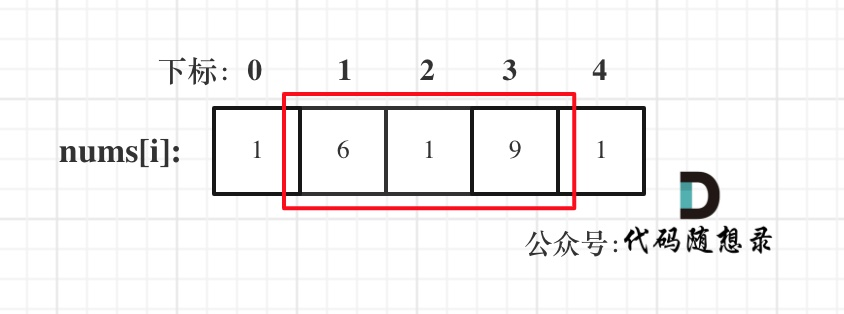

- 情况二：考虑包含首元素，不包含尾元素

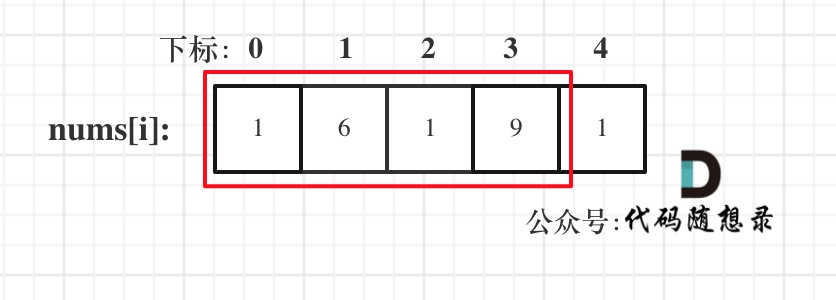

- 情况三：考虑包含尾元素，不包含首元素

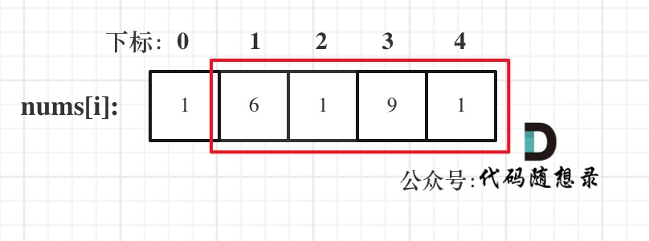

**注意我这里用的是"考虑"**，例如情况三，虽然是考虑包含尾元素，但不一定要选尾部元素！ 对于情况三，取`nums[1]` 和 `nums[3]`就是最大的。

**而情况二 和 情况三 都包含了情况一了，所以只考虑情况二和情况三就可以了**。

分析到这里，本题其实比较简单了。 剩下的和[198.打家劫舍](https://programmercarl.com/0198.%E6%89%93%E5%AE%B6%E5%8A%AB%E8%88%8D.html)就是一样的了。

代码如下：

```cpp
// 注意注释中的情况二情况三，以及把198.打家劫舍的代码抽离出来了
class Solution {
public:
    int rob(vector<int>& nums) {
        if (nums.size() == 0) return 0;
        if (nums.size() == 1) return nums[0];
        int result1 = robRange(nums, 0, nums.size() - 2); // 情况二
        int result2 = robRange(nums, 1, nums.size() - 1); // 情况三
        return max(result1, result2);
    }
    // 198.打家劫舍的逻辑
    int robRange(vector<int>& nums, int start, int end) {
        if (end == start) return nums[start];
        vector<int> dp(nums.size());
        dp[start] = nums[start];
        dp[start + 1] = max(nums[start], nums[start + 1]);
        for (int i = start + 2; i <= end; i++) {
            dp[i] = max(dp[i - 2] + nums[i], dp[i - 1]);
        }
        return dp[end];
    }
};
```

- 时间复杂度`: O(n)`
- 空间复杂度`: O(n)`

## 总结

成环之后还是难了一些的， 不少题解没有把“考虑房间”和“偷房间”说清楚。

这就导致大家会有这样的困惑：情况三怎么就包含了情况一了呢？ 本文图中最后一间房不能偷啊，偷了一定不是最优结果。

所以我在本文重点强调了情况一二三是“考虑”的范围，而具体房间偷与不偷交给递推公式去抉择。

这样大家就不难理解情况二和情况三包含了情况一了。

# 31.打家劫舍 III

[力扣题目链接](https://leetcode.cn/problems/house-robber-iii/)

在上次打劫完一条街道之后和一圈房屋后，小偷又发现了一个新的可行窃的地区。这个地区只有一个入口，我们称之为“根”。 除了“根”之外，每栋房子有且只有一个“父“房子与之相连。一番侦察之后，聪明的小偷意识到“这个地方的所有房屋的排列类似于一棵二叉树”。 如果两个直接相连的房子在同一天晚上被打劫，房屋将自动报警。

计算在不触动警报的情况下，小偷一晚能够盗取的最高金额。

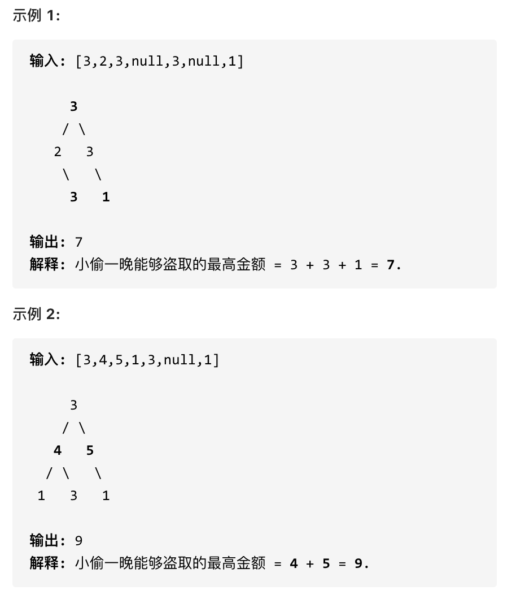

## 算法公开课

[**《代码随想录》算法视频公开课**](https://programmercarl.com/other/gongkaike.html)**：**[**动态规划，房间连成树了，偷不偷呢？| LeetCode：337.打家劫舍3**](https://www.bilibili.com/video/BV1H24y1Q7sY)**，相信结合** **视频再看本篇题解，更有助于大家对本题的理解**。

## 思路

这道题目和 [198.打家劫舍](https://programmercarl.com/0198.%E6%89%93%E5%AE%B6%E5%8A%AB%E8%88%8D.html)，[213.打家劫舍II](https://programmercarl.com/0213.%E6%89%93%E5%AE%B6%E5%8A%AB%E8%88%8DII.html)也是如出一辙，只不过这个换成了树。

如果对树的遍历不够熟悉的话，那本题就有难度了。

对于树的话，首先就要想到遍历方式，前中后序（深度优先搜索）还是层序遍历（广度优先搜索）。

**本题一定是要后序遍历，因为通过递归函数的返回值来做下一步计算**。

与198.打家劫舍，213.打家劫舍II一样，关键是要讨论当前节点抢还是不抢。

如果抢了当前节点，两个孩子就不能动，如果没抢当前节点，就可以考虑抢左右孩子（**注意这里说的是“考虑”**）

### 暴力递归

代码如下：

```cpp
class Solution {
public:
    int rob(TreeNode* root) {
        if (root == NULL) return 0;
        if (root->left == NULL && root->right == NULL) return root->val;
        // 偷父节点
        int val1 = root->val;
        if (root->left) val1 += rob(root->left->left) + rob(root->left->right); // 跳过
root->left，相当于不考虑左孩子了
        if (root->right) val1 += rob(root->right->left) + rob(root->right->right); // 跳
过root->right，相当于不考虑右孩子了
        // 不偷父节点
        int val2 = rob(root->left) + rob(root->right); // 考虑root的左右孩子
        return max(val1, val2);
    }
};
```

- 时间复杂度：`O(n^2)`，这个时间复杂度不太标准，也不容易准确化，例如越往下的节点重复计算次数就越多
- 空间复杂度：`O(log n)`，算上递推系统栈的空间

当然以上代码超时了，这个递归的过程中其实是有重复计算了。

我们计算了root的四个孙子（左右孩子的孩子）为头结点的子树的情况，又计算了root的左右孩子为头结点的子树的情况，计算左右孩子的时候其实又把孙子计算了一遍。

### 记忆化递推

所以可以使用一个map把计算过的结果保存一下，这样如果计算过孙子了，那么计算孩子的时候可以复用孙子节点的结果。

代码如下：

```cpp
class Solution {
public:
    unordered_map<TreeNode* , int> umap; // 记录计算过的结果
    int rob(TreeNode* root) {
        if (root == NULL) return 0;
        if (root->left == NULL && root->right == NULL) return root->val;
        if (umap[root]) return umap[root]; // 如果umap里已经有记录则直接返回
        // 偷父节点
        int val1 = root->val;
        if (root->left) val1 += rob(root->left->left) + rob(root->left->right); // 跳过
root->left
        if (root->right) val1 += rob(root->right->left) + rob(root->right->right); // 跳
过root->right
        // 不偷父节点
        int val2 = rob(root->left) + rob(root->right); // 考虑root的左右孩子
        umap[root] = max(val1, val2); // umap记录一下结果
        return max(val1, val2);
    }
};
```

- 时间复杂度：`O(n)`
- 空间复杂度：`O(log n)`，算上递推系统栈的空间

### 动态规划

在上面两种方法，其实对一个节点 偷与不偷得到的最大金钱都没有做记录，而是需要实时计算。

而动态规划其实就是使用状态转移容器来记录状态的变化，这里可以使用一个长度为2的数组，记录当前节点偷与不偷所得到的的最大金钱。

**这道题目算是树形dp的入门题目，因为是在树上进行状态转移，我们在讲解二叉树的时候说过递归三部曲，那么下** **面我以递归三部曲为框架，其中融合动规五部曲的内容来进行讲解**。

1. 确定递归函数的参数和返回值

这里我们要求一个节点 偷与不偷的两个状态所得到的金钱，那么返回值就是一个长度为2的数组。

参数为当前节点，代码如下：

```cpp
vector<int> robTree(TreeNode* cur) {
```

其实这里的返回数组就是dp数组。

所以dp数组（dp table）以及下标的含义：下标为0记录不偷该节点所得到的的最大金钱，下标为1记录偷该节点所得到的的最大金钱。

**所以本题dp数组就是一个长度为2的数组！**

那么有同学可能疑惑，长度为2的数组怎么标记树中每个节点的状态呢？

**别忘了在递归的过程中，系统栈会保存每一层递归的参数**。

如果还不理解的话，就接着往下看，看到代码就理解了哈。

2. 确定终止条件

在遍历的过程中，如果遇到空节点的话，很明显，无论偷还是不偷都是0，所以就返回

```cpp
if (cur == NULL) return vector<int>{0, 0};
```

这也相当于dp数组的初始化

3. 确定遍历顺序

首先明确的是使用后序遍历。 因为要通过递归函数的返回值来做下一步计算。

通过递归左节点，得到左节点偷与不偷的金钱。

通过递归右节点，得到右节点偷与不偷的金钱。

代码如下：

```cpp
// 下标0：不偷，下标1：偷
vector<int> left = robTree(cur->left); // 左
vector<int> right = robTree(cur->right); // 右
// 中
```

4. 确定单层递归的逻辑

如果是偷当前节点，那么左右孩子就不能偷，`val1 = cur->val + left[0] + right[0];`  （**如果对下标含义不理解就再回** **顾一下dp数组的含义**）

如果不偷当前节点，那么左右孩子就可以偷，至于到底偷不偷一定是选一个最大的，所以：`val2 = max(left[0],` `left[1]) + max(right[0], right[1]);`

最后当前节点的状态就是`{val2, val1};` 即：`{`不偷当前节点得到的最大金钱，偷当前节点得到的最大金钱`}`

代码如下：

```cpp
vector<int> left = robTree(cur->left); // 左
vector<int> right = robTree(cur->right); // 右
// 偷cur
int val1 = cur->val + left[0] + right[0];
// 不偷cur
int val2 = max(left[0], left[1]) + max(right[0], right[1]);
return {val2, val1};
```

5. 举例推导dp数组

以示例1为例，dp数组状态如下：（**注意用后序遍历的方式推导**）

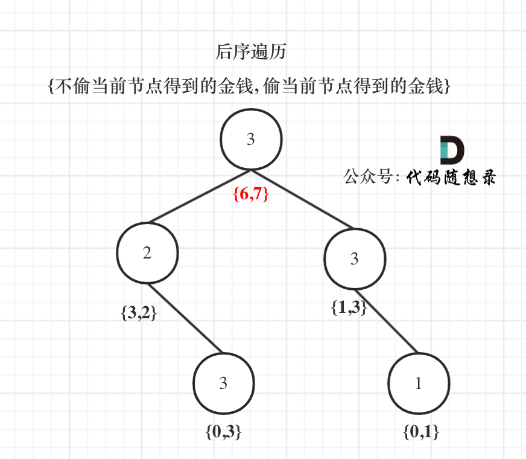

**最后头结点就是 取下标0 和 下标1的最大值就是偷得的最大金钱**。

递归三部曲与动规五部曲分析完毕，`C++`代码如下：

```cpp
class Solution {
public:
    int rob(TreeNode* root) {
        vector<int> result = robTree(root);
        return max(result[0], result[1]);
    }
    // 长度为2的数组，0：不偷，1：偷
    vector<int> robTree(TreeNode* cur) {
        if (cur == NULL) return vector<int>{0, 0};
        vector<int> left = robTree(cur->left);
        vector<int> right = robTree(cur->right);
        // 偷cur，那么就不能偷左右节点。
        int val1 = cur->val + left[0] + right[0];
        // 不偷cur，那么可以偷也可以不偷左右节点，则取较大的情况
        int val2 = max(left[0], left[1]) + max(right[0], right[1]);
        return {val2, val1};
    }
};
```

- 时间复杂度：`O(n)`，每个节点只遍历了一次
- 空间复杂度：`O(log n)`，算上递推系统栈的空间

## 总结

这道题是树形DP的入门题目，通过这道题目大家应该也了解了，所谓树形DP就是在树上进行递归公式的推导。

**所以树形DP也没有那么神秘！**

只不过平时我们习惯了在一维数组或者二维数组上推导公式，一下子换成了树，就需要对树的遍历方式足够了解！

大家还记不记得我在讲解贪心专题的时候，讲到这道题目：[贪心算法：我要监控二叉树！](https://programmercarl.com/0968.%E7%9B%91%E6%8E%A7%E4%BA%8C%E5%8F%89%E6%A0%91.html)，这也是贪心算法在树上的应用。**那我也可以把这个算法起一个名字，叫做树形贪心**，哈哈哈

“树形贪心”词汇从此诞生，来自「代码随想录」

# 32. 买卖股票的最佳时机

[力扣题目链接](https://leetcode.cn/problems/best-time-to-buy-and-sell-stock/)

给定一个数组 prices ，它的第 i 个元素 `prices[i]` 表示一支给定股票第 i 天的价格。

你只能选择 某一天 买入这只股票，并选择在 未来的某一个不同的日子 卖出该股票。设计一个算法来计算你所能获取的最大利润。

返回你可以从这笔交易中获取的最大利润。如果你不能获取任何利润，返回 0 。

- 示例 1： 
- 输入：`[7,1,5,3,6,4]` 
- 输出：5  
解释：在第 2 天（股票价格 `= 1`）的时候买入，在第 5 天（股票价格 `= 6`）的时候卖出，最大利润 `= 6-1 = 5` 。注意利润不能是 `7-1 = 6,` 因为卖出价格需要大于买入价格；同时，你不能在买入前卖出股票。
- 示例 2： 
- 输入：`prices = [7,6,4,3,1]`  
- 输出：0  
解释：在这种情况下, 没有交易完成, 所以最大利润为 0。

## 算法公开课

[**《代码随想录》算法视频公开课**](https://programmercarl.com/other/gongkaike.html)**：**[**动态规划之 LeetCode：121.买卖股票的最佳时机1**](https://www.bilibili.com/video/BV1Xe4y1u77q)**，相信结合视频再看本篇题** **解，更有助于大家对本题的理解**。

## 思路

### 暴力

这道题目最直观的想法，就是暴力，找最优间距了。

```cpp
class Solution {
public:
    int maxProfit(vector<int>& prices) {
        int result = 0;
        for (int i = 0; i < prices.size(); i++) {
            for (int j = i + 1; j < prices.size(); j++){
                result = max(result, prices[j] - prices[i]);
            }
        }
        return result;
    }
};
```

- 时间复杂度：`O(n^2)`
- 空间复杂度：`O(1)`

当然该方法超时了。

### 贪心

因为股票就买卖一次，那么贪心的想法很自然就是取最左最小值，取最右最大值，那么得到的差值就是最大利润。

`C++`代码如下：

```cpp
class Solution {
public:
    int maxProfit(vector<int>& prices) {
        int low = INT_MAX;
        int result = 0;
        for (int i = 0; i < prices.size(); i++) {
            low = min(low, prices[i]);  // 取最左最小价格
            result = max(result, prices[i] - low); // 直接取最大区间利润
        }
        return result;
    }
};
```

- 时间复杂度：`O(n)`
- 空间复杂度：`O(1)`

### 动态规划

动规五部曲分析如下：

1. 确定dp数组（dp table）以及下标的含义

`dp[i][0]` 表示第i天持有股票所得最多现金 ，**这里可能有同学疑惑，本题中只能买卖一次，持有股票之后哪还有现金** **呢？**

其实一开始现金是0，那么加入第i天买入股票现金就是 `-prices[i]`， 这是一个负数。

`dp[i][1]` 表示第i天不持有股票所得最多现金

**注意这里说的是“持有”，“持有”不代表就是当天“买入”！也有可能是昨天就买入了，今天保持持有的状态**

很多同学把“持有”和“买入”没区分清楚。

在下面递推公式分析中，我会进一步讲解。

2. 确定递推公式

如果第i天持有股票即`dp[i][0]`， 那么可以由两个状态推出来

- 第i-1天就持有股票，那么就保持现状，所得现金就是昨天持有股票的所得现金 即：`dp[i - 1][0]`
- 第i天买入股票，所得现金就是买入今天的股票后所得现金即：`-prices[i]`

那么`dp[i][0]`应该选所得现金最大的，所以`dp[i][0] = max(dp[i - 1][0], -prices[i]);`

如果第i天不持有股票即`dp[i][1]`， 也可以由两个状态推出来

- 第i-1天就不持有股票，那么就保持现状，所得现金就是昨天不持有股票的所得现金 即：`dp[i - 1][1]`
- 第i天卖出股票，所得现金就是按照今天股票价格卖出后所得现金即：`prices[i] + dp[i - 1][0]`

同样`dp[i][1]`取最大的，`dp[i][1] = max(dp[i - 1][1], prices[i] + dp[i - 1][0]);`

这样递推公式我们就分析完了

3. dp数组如何初始化

由递推公式 `dp[i][0] = max(dp[i - 1][0], -prices[i]);` 和 `dp[i][1] = max(dp[i - 1][1], prices[i] + dp[i - 1][0]);`可以看出

其基础都是要从`dp[0][0]`和`dp[0][1]`推导出来。

那么`dp[0][0]`表示第0天持有股票，此时的持有股票就一定是买入股票了，因为不可能有前一天推出来，所以`dp[0]` `[0] -= prices[0];`

`dp[0][1]`表示第0天不持有股票，不持有股票那么现金就是0，所以`dp[0][1] = 0;`

4. 确定遍历顺序

从递推公式可以看出`dp[i]`都是由`dp[i - 1]`推导出来的，那么一定是从前向后遍历。

5. 举例推导dp数组

以示例1，输入：`[7,1,5,3,6,4]`为例，dp数组状态如下：

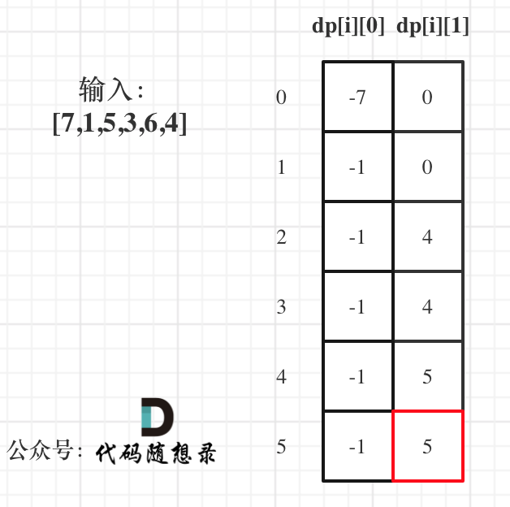

`dp[5][1]`就是最终结果。

为什么不是`dp[5][0]`呢？

**因为本题中不持有股票状态所得金钱一定比持有股票状态得到的多！**

以上分析完毕，`C++`代码如下：

```cpp
// 版本一
class Solution {
public:
    int maxProfit(vector<int>& prices) {
        int len = prices.size();
        if (len == 0) return 0;
        vector<vector<int>> dp(len, vector<int>(2));
        dp[0][0] -= prices[0];
        dp[0][1] = 0;
        for (int i = 1; i < len; i++) {
            dp[i][0] = max(dp[i - 1][0], -prices[i]);
            dp[i][1] = max(dp[i - 1][1], prices[i] + dp[i - 1][0]);
        }
        return dp[len - 1][1];
    }
};
```

- 时间复杂度：`O(n)`
- 空间复杂度：`O(n)`

从递推公式可以看出，`dp[i]`只是依赖于`dp[i - 1]`的状态。

```cpp
dp[i][0] = max(dp[i - 1][0], -prices[i]);
dp[i][1] = max(dp[i - 1][1], prices[i] + dp[i - 1][0]);
```

那么我们只需要记录 当前天的dp状态和前一天的dp状态就可以了，可以使用滚动数组来节省空间，代码如下：

```cpp
// 版本二
class Solution {
public:
    int maxProfit(vector<int>& prices) {
        int len = prices.size();
        vector<vector<int>> dp(2, vector<int>(2)); // 注意这里只开辟了一个2 * 2大小的二维数组
        dp[0][0] -= prices[0];
        dp[0][1] = 0;
        for (int i = 1; i < len; i++) {
            dp[i % 2][0] = max(dp[(i - 1) % 2][0], -prices[i]);
            dp[i % 2][1] = max(dp[(i - 1) % 2][1], prices[i] + dp[(i - 1) % 2][0]);
        }
        return dp[(len - 1) % 2][1];
    }
};
```

- 时间复杂度：`O(n)`
- 空间复杂度：`O(1)`

这里能写出版本一就可以了，版本二虽然原理都一样，但是想直接写出版本二还是有点麻烦，容易自己给自己找bug。

所以建议是先写出版本一，然后在版本一的基础上优化成版本二，而不是直接就写出版本二。

# 33. 本周小结！（动态规划系列六）

本周我们主要讲解了打家劫舍系列，这个系列也是dp解决的经典问题，那么来看看我们收获了哪些呢，一起来回顾一下吧。

## 周一

[动态规划：开始打家劫舍！](https://programmercarl.com/0198.%E6%89%93%E5%AE%B6%E5%8A%AB%E8%88%8D.html)中就是给一个数组相邻之间不能连着偷，如何偷才能得到最大金钱。

1. 确定dp数组含义

**dp[i]：考虑下标i（包括i）以内的房屋，最多可以偷窃的金额为dp[i]**。

2. 确定递推公式

`dp[i] = max(dp[i - 2] + nums[i], dp[i - 1]);`

3. dp数组如何初始化

```cpp
vector<int> dp(nums.size());
dp[0] = nums[0];
dp[1] = max(nums[0], nums[1]);
```

4. 确定遍历顺序

从前到后遍历

5. 举例推导dp数组

以示例二，输入`[2,7,9,3,1]`为例。

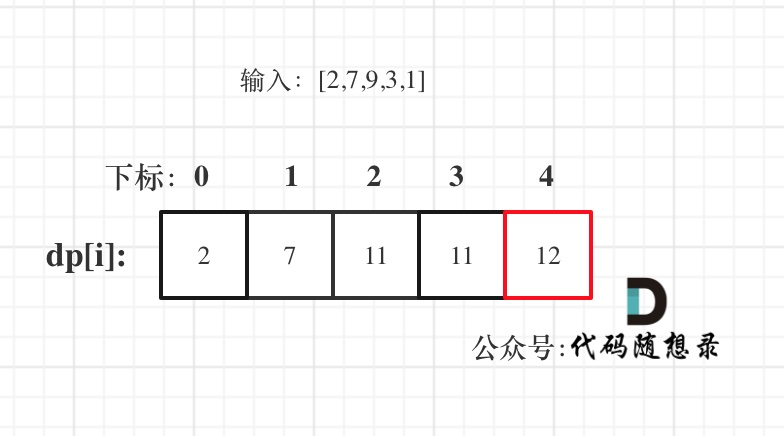

红框`dp[nums.size() - 1]`为结果。

## 周二

[动态规划：继续打家劫舍！](https://programmercarl.com/0213.%E6%89%93%E5%AE%B6%E5%8A%AB%E8%88%8DII.html)就是数组成环了，然后相邻的不能连着偷。

这里主要考虑清楚三种情况：

- 情况一：考虑不包含首尾元素


- 情况二：考虑包含首元素，不包含尾元素


- 情况三：考虑包含尾元素，不包含首元素


需要注意的是，**“考虑” 不等于 “偷”**，例如情况三，虽然是考虑包含尾元素，但不一定要选尾部元素！对于情况三，取`nums[1]` 和 `nums[3]`就是最大的。

所以情况二 和 情况三 都包含了情况一了，**所以只考虑情况二和情况三就可以了**。

成环之后还是难了一些的， 不少题解没有把“考虑房间”和“偷房间”说清楚。

这就导致大家会有这样的困惑：“情况三怎么就包含了情况一了呢？本文图中最后一间房不能偷啊，偷了一定不是最优结果”。

所以我在本文重点强调了情况一二三是“考虑”的范围，而具体房间偷与不偷交给递推公式去抉择。

剩下的就和[动态规划：开始打家劫舍！](https://programmercarl.com/0198.%E6%89%93%E5%AE%B6%E5%8A%AB%E8%88%8D.html)是一个逻辑了。

## 周三

[动态规划：还要打家劫舍！](https://programmercarl.com/0337.%E6%89%93%E5%AE%B6%E5%8A%AB%E8%88%8DIII.html)这次是在一棵二叉树上打家劫舍了，条件还是一样的，相临的不能偷。

这道题目是树形DP的入门题目，其实树形DP其实就是在树上进行递推公式的推导，没有什么神秘的。

这道题目我给出了暴力的解法：

```cpp
class Solution {
public:
    int rob(TreeNode* root) {
        if (root == NULL) return 0;
        if (root->left == NULL && root->right == NULL) return root->val;
        // 偷父节点
        int val1 = root->val;
        if (root->left) val1 += rob(root->left->left) + rob(root->left->right); // 跳过
root->left，相当于不考虑左孩子了
        if (root->right) val1 += rob(root->right->left) + rob(root->right->right); // 跳
过root->right，相当于不考虑右孩子了
        // 不偷父节点
        int val2 = rob(root->left) + rob(root->right); // 考虑root的左右孩子
        return max(val1, val2);
    }
};
```

当然超时了，因为我们计算了root的四个孙子（左右孩子的孩子）为头结点的子树的情况，又计算了root的左右孩子为头结点的子树的情况，计算左右孩子的时候其实又把孙子计算了一遍。

那么使用一个map把计算过的结果保存一下，这样如果计算过孙子了，那么计算孩子的时候可以复用孙子节点的结果。

代码如下：

```cpp
class Solution {
public:
    unordered_map<TreeNode* , int> umap; // 记录计算过的结果
    int rob(TreeNode* root) {
        if (root == NULL) return 0;
        if (root->left == NULL && root->right == NULL) return root->val;
        if (umap[root]) return umap[root]; // 如果umap里已经有记录则直接返回
        // 偷父节点
        int val1 = root->val;
        if (root->left) val1 += rob(root->left->left) + rob(root->left->right); // 跳过
root->left
        if (root->right) val1 += rob(root->right->left) + rob(root->right->right); // 跳
过root->right
        // 不偷父节点
        int val2 = rob(root->left) + rob(root->right); // 考虑root的左右孩子
        umap[root] = max(val1, val2); // umap记录一下结果
        return max(val1, val2);
    }
};
```

最后我们还是给出动态规划的解法。

因为是在树上进行状态转移，我们在讲解二叉树的时候说过递归三部曲，那么下面我以递归三部曲为框架，其中融合动规五部曲的内容来进行讲解。

1. 确定递归函数的参数和返回值

```cpp
vector<int> robTree(TreeNode* cur) {
```

dp数组含义：下标为0记录不偷该节点所得到的的最大金钱，下标为1记录偷该节点所得到的的最大金钱。

**所以本题dp数组就是一个长度为2的数组！**

那么有同学可能疑惑，长度为2的数组怎么标记树中每个节点的状态呢？

**别忘了在递归的过程中，系统栈会保存每一层递归的参数**。

2. 确定终止条件

在遍历的过程中，如果遇到空间点的话，很明显，无论偷还是不偷都是0，所以就返回

```cpp
if (cur == NULL) return vector<int>{0, 0};
```

3. 确定遍历顺序

采用后序遍历，代码如下：

```cpp
// 下标0：不偷，下标1：偷
vector<int> left = robTree(cur->left); // 左
vector<int> right = robTree(cur->right); // 右
// 中
```

4. 确定单层递归的逻辑

如果是偷当前节点，那么左右孩子就不能偷，`val1 = cur->val + left[0] + right[0];`

如果不偷当前节点，那么左右孩子就可以偷，至于到底偷不偷一定是选一个最大的，所以：`val2 = max(left[0],` `left[1]) + max(right[0], right[1]);`

最后当前节点的状态就是`{val2, val1};` 即：`{`不偷当前节点得到的最大金钱，偷当前节点得到的最大金钱`}`

代码如下：

```cpp
vector<int> left = robTree(cur->left); // 左
vector<int> right = robTree(cur->right); // 右
// 偷cur
int val1 = cur->val + left[0] + right[0];
// 不偷cur
int val2 = max(left[0], left[1]) + max(right[0], right[1]);
return {val2, val1};
```

5. 举例推导dp数组

以示例1为例，dp数组状态如下：（**注意用后序遍历的方式推导**）

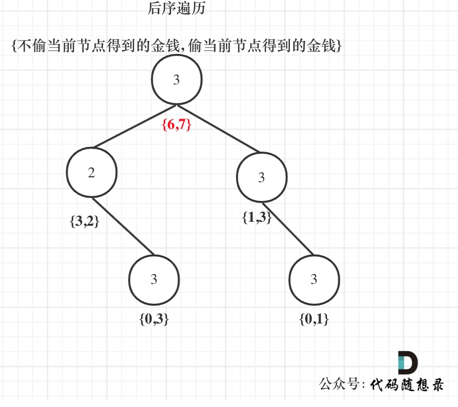

**最后头结点就是 取下标0 和 下标1的最大值就是偷得的最大金钱**。

树形DP为什么比较难呢？

因为平时我们习惯了在一维数组或者二维数组上推导公式，一下子换成了树，就需要对树的遍历方式足够了解！

大家还记不记得我在讲解贪心专题的时候，讲到这道题目：[贪心算法：我要监控二叉树！](https://programmercarl.com/0968.%E7%9B%91%E6%8E%A7%E4%BA%8C%E5%8F%89%E6%A0%91.html)，这也是贪心算法在树上的应用。**那我也可以把这个算法起一个名字，叫做树形贪心**，哈哈哈

“树形贪心”词汇从此诞生，来自「代码随想录」

## 周四

[动态规划：买卖股票的最佳时机](https://programmercarl.com/0121.%E4%B9%B0%E5%8D%96%E8%82%A1%E7%A5%A8%E7%9A%84%E6%9C%80%E4%BD%B3%E6%97%B6%E6%9C%BA.html) 一段时间，只能买卖一次，问最大收益。

这里我给出了三种解法：

暴力解法代码：

```cpp
class Solution {
public:
    int maxProfit(vector<int>& prices) {
        int result = 0;
        for (int i = 0; i < prices.size(); i++) {
            for (int j = i + 1; j < prices.size(); j++){
                result = max(result, prices[j] - prices[i]);
            }
        }
        return result;
    }
};
```

- 时间复杂度：`O(n^2)`
- 空间复杂度：`O(1)`

贪心解法代码如下：

因为股票就买卖一次，那么贪心的想法很自然就是取最左最小值，取最右最大值，那么得到的差值就是最大利润。

```cpp
class Solution {
public:
    int maxProfit(vector<int>& prices) {
        int low = INT_MAX;
        int result = 0;
        for (int i = 0; i < prices.size(); i++) {
            low = min(low, prices[i]);  // 取最左最小价格
            result = max(result, prices[i] - low); // 直接取最大区间利润
        }
        return result;
    }
};
```

- 时间复杂度：`O(n)`
- 空间复杂度：`O(1)`

动规解法，版本一，代码如下：

```cpp
// 版本一
class Solution {
public:
    int maxProfit(vector<int>& prices) {
        int len = prices.size();
        vector<vector<int>> dp(len, vector<int>(2));
        dp[0][0] -= prices[0];
        dp[0][1] = 0;
        for (int i = 1; i < len; i++) {
            dp[i][0] = max(dp[i - 1][0], -prices[i]);
            dp[i][1] = max(dp[i - 1][1], prices[i] + dp[i - 1][0]);
        }
        return dp[len - 1][1];
    }
};
```

- 时间复杂度：`O(n)`
- 空间复杂度：`O(n)`

从递推公式可以看出，`dp[i]`只是依赖于`dp[i - 1]`的状态。

那么我们只需要记录 当前天的dp状态和前一天的dp状态就可以了，可以使用滚动数组来节省空间，代码如下：

```cpp
// 版本二
class Solution {
public:
    int maxProfit(vector<int>& prices) {
        int len = prices.size();
        vector<vector<int>> dp(2, vector<int>(2)); // 注意这里只开辟了一个2 * 2大小的二维数组
        dp[0][0] -= prices[0];
        dp[0][1] = 0;
        for (int i = 1; i < len; i++) {
            dp[i % 2][0] = max(dp[(i - 1) % 2][0], -prices[i]);
            dp[i % 2][1] = max(dp[(i - 1) % 2][1], prices[i] + dp[(i - 1) % 2][0]);
        }
        return dp[(len - 1) % 2][1];
    }
};
```

- 时间复杂度：`O(n)`
- 空间复杂度：`O(1)`

建议先写出版本一，然后在版本一的基础上优化成版本二，而不是直接就写出版本二。

## 总结

刚刚结束了背包问题，本周主要讲解打家劫舍系列。

**劫舍系列简单来说就是 数组上连续元素二选一，成环之后连续元素二选一，在树上连续元素二选一，所能得到的最** **大价值**。

那么这里每一种情况 我在文章中都做了详细的介绍。

周四我们开始讲解股票系列了，大家应该预测到了，我们下周的主题就是股票！ 哈哈哈，多么浮躁的一个系列！敬请期待吧！

**代码随想录温馨提醒：投资有风险，入市需谨慎！**

# 34.买卖股票的最佳时机II

[力扣题目链接](https://leetcode.cn/problems/best-time-to-buy-and-sell-stock-ii/)

给定一个数组，它的第 i 个元素是一支给定股票第 i 天的价格。

设计一个算法来计算你所能获取的最大利润。你可以尽可能地完成更多的交易（多次买卖一支股票）。

注意：你不能同时参与多笔交易（你必须在再次购买前出售掉之前的股票）。

- 示例 1: 
- 输入`: [7,1,5,3,6,4]` 
- 输出: 7  
解释: 在第 2 天（股票价格 `= 1`）的时候买入，在第 3 天（股票价格 `= 5`）的时候卖出, 这笔交易所能获得利润 `= 5-1 = 4`。随后，在第 4 天（股票价格 `= 3`）的时候买入，在第 5 天（股票价格 `= 6`）的时候卖出, 这笔交易所能获得利润 `= 6-3 = 3` 。 
- 示例 2: 
- 输入`: [1,2,3,4,5]` 
- 输出: 4  
解释: 在第 1 天（股票价格 `= 1`）的时候买入，在第 5 天 （股票价格 `= 5`）的时候卖出, 这笔交易所能获得利润 `= 5-1 = 4` 。注意你不能在第 1 天和第 2 天接连购买股票，之后再将它们卖出。因为这样属于同时参与了多笔交易，你必须在再次购买前出售掉之前的股票。
- 示例 3: 
- 输入`: [7,6,4,3,1]` 
- 输出: 0  
解释: 在这种情况下, 没有交易完成, 所以最大利润为 0。 

提示： 

- `1 <= prices.length <= 3 * 10 ^ 4`
- `0 <= prices[i] <= 10 ^ 4`

## 算法公开课

[**《代码随想录》算法视频公开课**](https://programmercarl.com/other/gongkaike.html)**：**[**动态规划，股票问题第二弹 | LeetCode：122.买卖股票的最佳时机II**](https://www.bilibili.com/video/BV1D24y1Q7Ls)**，相信结** **合视频再看本篇题解，更有助于大家对本题的理解**。

## 思路

本题我们在讲解贪心专题的时候就已经讲解过了[贪心算法：买卖股票的最佳时机II](https://programmercarl.com/0122.%E4%B9%B0%E5%8D%96%E8%82%A1%E7%A5%A8%E7%9A%84%E6%9C%80%E4%BD%B3%E6%97%B6%E6%9C%BAII.html)，只不过没有深入讲解动态规划的解法，那么这次我们再好好分析一下动规的解法。

本题和[121. 买卖股票的最佳时机](https://programmercarl.com/0121.%E4%B9%B0%E5%8D%96%E8%82%A1%E7%A5%A8%E7%9A%84%E6%9C%80%E4%BD%B3%E6%97%B6%E6%9C%BA.html)的唯一区别是本题股票可以买卖多次了（注意只有一只股票，所以再次购买前要出售掉之前的股票）

**在动规五部曲中，这个区别主要是体现在递推公式上，其他都和**[**121. 买卖股票的最佳时机**](https://programmercarl.com/0121.%E4%B9%B0%E5%8D%96%E8%82%A1%E7%A5%A8%E7%9A%84%E6%9C%80%E4%BD%B3%E6%97%B6%E6%9C%BA.html)**一样一样的**。

所以我们重点讲一讲递推公式。

这里重申一下dp数组的含义：

- `dp[i][0]` 表示第i天持有股票所得现金。
- `dp[i][1]` 表示第i天不持有股票所得最多现金

如果第i天持有股票即`dp[i][0]`， 那么可以由两个状态推出来 

- 第i-1天就持有股票，那么就保持现状，所得现金就是昨天持有股票的所得现金 即：`dp[i - 1][0]`
- 第i天买入股票，所得现金就是昨天不持有股票的所得现金减去 今天的股票价格 即：`dp[i - 1][1] - prices[i]` 

**注意这里和**[**121. 买卖股票的最佳时机**](https://programmercarl.com/0121.%E4%B9%B0%E5%8D%96%E8%82%A1%E7%A5%A8%E7%9A%84%E6%9C%80%E4%BD%B3%E6%97%B6%E6%9C%BA.html)**唯一不同的地方，就是推导dp[i][0]的时候，第i天买入股票的情况**。

在[121. 买卖股票的最佳时机](https://programmercarl.com/0121.%E4%B9%B0%E5%8D%96%E8%82%A1%E7%A5%A8%E7%9A%84%E6%9C%80%E4%BD%B3%E6%97%B6%E6%9C%BA.html)中，因为股票全程只能买卖一次，所以如果买入股票，那么第i天持有股票即`dp[i][0]`一定就是 `-prices[i]`。

而本题，因为一只股票可以买卖多次，所以当第i天买入股票的时候，所持有的现金可能有之前买卖过的利润。

那么第i天持有股票即`dp[i][0]`，如果是第i天买入股票，所得现金就是昨天不持有股票的所得现金 减去 今天的股票价格 即：`dp[i - 1][1] - prices[i]`。

再来看看如果第i天不持有股票即`dp[i][1]`的情况， 依然可以由两个状态推出来

- 第i-1天就不持有股票，那么就保持现状，所得现金就是昨天不持有股票的所得现金 即：`dp[i - 1][1]`
- 第i天卖出股票，所得现金就是按照今天股票价格卖出后所得现金即：`prices[i] + dp[i - 1][0]` 

**注意这里和**[**121. 买卖股票的最佳时机**](https://programmercarl.com/0121.%E4%B9%B0%E5%8D%96%E8%82%A1%E7%A5%A8%E7%9A%84%E6%9C%80%E4%BD%B3%E6%97%B6%E6%9C%BA.html)**就是一样的逻辑，卖出股票收获利润（可能是负值）天经地义！** 

代码如下：（注意代码中的注释，标记了和121.买卖股票的最佳时机唯一不同的地方）

```cpp
class Solution {
public:
    int maxProfit(vector<int>& prices) {
        int len = prices.size();
        vector<vector<int>> dp(len, vector<int>(2, 0));
        dp[0][0] -= prices[0];
        dp[0][1] = 0;
        for (int i = 1; i < len; i++) {
            dp[i][0] = max(dp[i - 1][0], dp[i - 1][1] - prices[i]); // 注意这里是和121. 买
卖股票的最佳时机唯一不同的地方。
            dp[i][1] = max(dp[i - 1][1], dp[i - 1][0] + prices[i]);
        }
        return dp[len - 1][1];
    }
};
```

- 时间复杂度：`O(n)`
- 空间复杂度：`O(n)`

大家可以本题和[121. 买卖股票的最佳时机](https://programmercarl.com/0121.%E4%B9%B0%E5%8D%96%E8%82%A1%E7%A5%A8%E7%9A%84%E6%9C%80%E4%BD%B3%E6%97%B6%E6%9C%BA.html)的代码几乎一样，唯一的区别在：

```cpp
dp[i][0] = max(dp[i - 1][0], dp[i - 1][1] - prices[i]);
```

**这正是因为本题的股票可以买卖多次！** 所以买入股票的时候，可能会有之前买卖的利润即：`dp[i - 1][1]`，所以`dp[i` `- 1][1] - prices[i]`。

想到到这一点，对这两道题理解的就比较深刻了。

这里我依然给出滚动数组的版本，`C++`代码如下：

```cpp
// 版本二
class Solution {
public:
    int maxProfit(vector<int>& prices) {
        int len = prices.size();
        vector<vector<int>> dp(2, vector<int>(2)); // 注意这里只开辟了一个2 * 2大小的二维数组
        dp[0][0] -= prices[0];
        dp[0][1] = 0;
        for (int i = 1; i < len; i++) {
            dp[i % 2][0] = max(dp[(i - 1) % 2][0], dp[(i - 1) % 2][1] - prices[i]);
            dp[i % 2][1] = max(dp[(i - 1) % 2][1], prices[i] + dp[(i - 1) % 2][0]);
        }
        return dp[(len - 1) % 2][1];
    }
};
```

- 时间复杂度：`O(n)`
- 空间复杂度：`O(1)`

# 35.买卖股票的最佳时机III

[力扣题目链接](https://leetcode.cn/problems/best-time-to-buy-and-sell-stock-iii/)

给定一个数组，它的第 i 个元素是一支给定的股票在第 i 天的价格。

设计一个算法来计算你所能获取的最大利润。你最多可以完成 两笔 交易。

注意：你不能同时参与多笔交易（你必须在再次购买前出售掉之前的股票）。

- 示例 1:

- 输入：`prices = [3,3,5,0,0,3,1,4]`
- 输出：6  
解释：在第 4 天（股票价格 `= 0`）的时候买入，在第 6 天（股票价格 `= 3`）的时候卖出，这笔交易所能获得利润 `= 3-0 = 3` 。随后，在第 7 天（股票价格 `= 1`）的时候买入，在第 8 天 （股票价格 `= 4`）的时候卖出，这笔交易所能获得利润 `= 4-1 = 3`。
- 示例 2：
- 输入：`prices = [1,2,3,4,5]`
- 输出：4  
解释：在第 1 天（股票价格 `= 1`）的时候买入，在第 5 天 （股票价格 `= 5`）的时候卖出, 这笔交易所能获得利润 `= 5-1 = 4`。注意你不能在第 1 天和第 2 天接连购买股票，之后再将它们卖出。因为这样属于同时参与了多笔交易，你必须在再次购买前出售掉之前的股票。
- 示例 3：
- 输入：`prices = [7,6,4,3,1]`
- 输出：0  
解释：在这个情况下, 没有交易完成, 所以最大利润为0。
- 示例 4：
- 输入：`prices = [1]`  
输出：0

提示：

- `1 <= prices.length <= 10^5`
- `0 <= prices[i] <= 10^5`

## 算法公开课

[**《代码随想录》算法视频公开课**](https://programmercarl.com/other/gongkaike.html)**：动态规划，股票至多买卖两次，怎么求？ | LeetCode：123.买卖股票最佳时机** **III，相信结合视频再看本篇题解，更有助于大家对本题的理解**。

## 思路

这道题目相对 [121.买卖股票的最佳时机](https://programmercarl.com/0121.%E4%B9%B0%E5%8D%96%E8%82%A1%E7%A5%A8%E7%9A%84%E6%9C%80%E4%BD%B3%E6%97%B6%E6%9C%BA.html) 和 [122.买卖股票的最佳时机II](https://programmercarl.com/0122.%E4%B9%B0%E5%8D%96%E8%82%A1%E7%A5%A8%E7%9A%84%E6%9C%80%E4%BD%B3%E6%97%B6%E6%9C%BAII.html) 难了不少。

关键在于至多买卖两次，这意味着可以买卖一次，可以买卖两次，也可以不买卖。

接来下我用动态规划五部曲详细分析一下：

1. 确定dp数组以及下标的含义

一天一共就有五个状态，

0. 没有操作  （其实我们也可以不设置这个状态）1. 第一次持有股票2. 第一次不持有股票 3. 第二次持有股票4. 第二次不持有股票`dp[i][j]`中 i表示第i天，j为 `[0 - 4]` 五个状态，`dp[i][j]`表示第i天状态j所剩最大现金。

需要注意：`dp[i][1]`，**表示的是第i天，买入股票的状态，并不是说一定要第i天买入股票，这是很多同学容易陷入的** **误区**。

例如 `dp[i][1]` ，并不是说 第i天一定买入股票，有可能 第 i-1天 就买入了，那么 `dp[i][1]` 延续买入股票的这个状态。

2. 确定递推公式

达到`dp[i][1]`状态，有两个具体操作：

- 操作一：第i天买入股票了，那么`dp[i][1] = dp[i-1][0] - prices[i]`
- 操作二：第i天没有操作，而是沿用前一天买入的状态，即：`dp[i][1] = dp[i - 1][1]`

那么`dp[i][1]`究竟选 `dp[i-1][0] - prices[i]`，还是`dp[i - 1][1]`呢？

一定是选最大的，所以 `dp[i][1] = max(dp[i-1][0] - prices[i], dp[i - 1][1]);`

同理`dp[i][2]`也有两个操作：

- 操作一：第i天卖出股票了，那么`dp[i][2] = dp[i - 1][1] + prices[i]`
- 操作二：第i天没有操作，沿用前一天卖出股票的状态，即：`dp[i][2] = dp[i - 1][2]`

所以`dp[i][2] = max(dp[i - 1][1] + prices[i], dp[i - 1][2])`

同理可推出剩下状态部分：

`dp[i][3] = max(dp[i - 1][3], dp[i - 1][2] - prices[i]);`

`dp[i][4] = max(dp[i - 1][4], dp[i - 1][3] + prices[i]);`

3. dp数组如何初始化

第0天没有操作，这个最容易想到，就是0，即：`dp[0][0] = 0;`

第0天做第一次买入的操作，`dp[0][1] = -prices[0];`

第0天做第一次卖出的操作，这个初始值应该是多少呢？

此时还没有买入，怎么就卖出呢？ 其实大家可以理解当天买入，当天卖出，所以`dp[0][2] = 0;`

第0天第二次买入操作，初始值应该是多少呢？应该不少同学疑惑，第一次还没买入呢，怎么初始化第二次买入呢？

第二次买入依赖于第一次卖出的状态，其实相当于第0天第一次买入了，第一次卖出了，然后再买入一次（第二次买入），那么现在手头上没有现金，只要买入，现金就做相应的减少。

所以第二次买入操作，初始化为：`dp[0][3] = -prices[0];`

同理第二次卖出初始化`dp[0][4] = 0;`

4. 确定遍历顺序

从递归公式其实已经可以看出，一定是从前向后遍历，因为`dp[i]`，依靠`dp[i - 1]`的数值。

5. 举例推导dp数组

以输入`[1,2,3,4,5]`为例

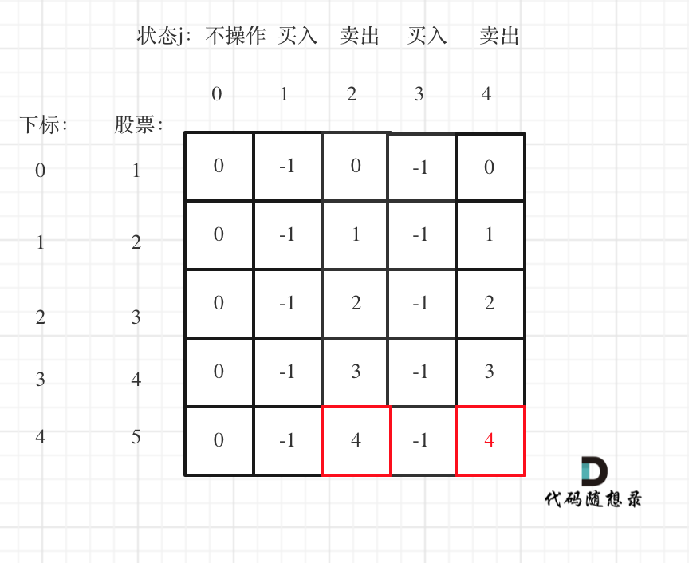

大家可以看到红色框为最后两次卖出的状态。

现在最大的时候一定是卖出的状态，而两次卖出的状态现金最大一定是最后一次卖出。如果想不明白的录友也可以这么理解：如果第一次卖出已经是最大值了，那么我们可以在当天立刻买入再立刻卖出。所以`dp[4][4]`已经包含了`dp[4][2]`的情况。也就是说第二次卖出手里所剩的钱一定是最多的。

所以最终最大利润是`dp[4][4]`

以上五部都分析完了，不难写出如下代码：

```cpp
// 版本一
class Solution {
public:
    int maxProfit(vector<int>& prices) {
        if (prices.size() == 0) return 0;
        vector<vector<int>> dp(prices.size(), vector<int>(5, 0));
        dp[0][1] = -prices[0];
        dp[0][3] = -prices[0];
        for (int i = 1; i < prices.size(); i++) {
            dp[i][0] = dp[i - 1][0];
            dp[i][1] = max(dp[i - 1][1], dp[i - 1][0] - prices[i]);
            dp[i][2] = max(dp[i - 1][2], dp[i - 1][1] + prices[i]);
            dp[i][3] = max(dp[i - 1][3], dp[i - 1][2] - prices[i]);
            dp[i][4] = max(dp[i - 1][4], dp[i - 1][3] + prices[i]);
        }
        return dp[prices.size() - 1][4];
    }
};
```

- 时间复杂度：`O(n)`
- 空间复杂度：`O(n × 5)`

当然，大家可以看到力扣官方题解里的一种优化空间写法，我这里给出对应的`C++`版本：

```cpp
// 版本二
class Solution {
public:
    int maxProfit(vector<int>& prices) {
        if (prices.size() == 0) return 0;
        vector<int> dp(5, 0);
        dp[1] = -prices[0];
        dp[3] = -prices[0];
        for (int i = 1; i < prices.size(); i++) {
            dp[1] = max(dp[1], dp[0] - prices[i]);
            dp[2] = max(dp[2], dp[1] + prices[i]);
            dp[3] = max(dp[3], dp[2] - prices[i]);
            dp[4] = max(dp[4], dp[3] + prices[i]);
        }
        return dp[4];
    }
};
```

- 时间复杂度：`O(n)`
- 空间复杂度：`O(1)`

大家会发现`dp[2]`利用的是当天的`dp[1]`。 但结果也是对的。

我来简单解释一下：

`dp[1] = max(dp[1], dp[0] - prices[i]);` 如果`dp[1]`取`dp[1]`，即保持买入股票的状态，那么 `dp[2] = max(dp[2], dp[1]` `+ prices[i]);`中`dp[1] + prices[i]` 就是今天卖出。

如果`dp[1]`取`dp[0] - prices[i]`，今天买入股票，那么`dp[2] = max(dp[2], dp[1] + prices[i]);`中的`dp[1] + prices[i]`相当于是今天再卖出股票，一买一卖收益为0，对所得现金没有影响。相当于今天买入股票又卖出股票，等于没有操作，保持昨天卖出股票的状态了。

**这种写法看上去简单，其实思路很绕，不建议大家这么写，这么思考，很容易把自己绕进去！**

对于本题，把版本一的写法研究明白，足以！

## 拓展

其实我们可以不设置，‘0. 没有操作’ 这个状态，因为没有操作，手上的现金自然就是0， 正如我们在  121.买卖股票的最佳时机 和 [122.买卖股票的最佳时机II](https://programmercarl.com/0122.%E4%B9%B0%E5%8D%96%E8%82%A1%E7%A5%A8%E7%9A%84%E6%9C%80%E4%BD%B3%E6%97%B6%E6%9C%BAII.html) 也没有设置这一状态是一样的。

代码如下：

```cpp
// 版本三
class Solution {
public:
    int maxProfit(vector<int>& prices) {
        if (prices.size() == 0) return 0;
        vector<vector<int>> dp(prices.size(), vector<int>(5, 0));
        dp[0][1] = -prices[0];
        dp[0][3] = -prices[0];
        for (int i = 1; i < prices.size(); i++) {
            dp[i][1] = max(dp[i - 1][1], 0 - prices[i]);
            dp[i][2] = max(dp[i - 1][2], dp[i - 1][1] + prices[i]);
            dp[i][3] = max(dp[i - 1][3], dp[i - 1][2] - prices[i]);
            dp[i][4] = max(dp[i - 1][4], dp[i - 1][3] + prices[i]);
        }
        return dp[prices.size() - 1][4];
    }
};
```

# 36.买卖股票的最佳时机IV

[力扣题目链接](https://leetcode.cn/problems/best-time-to-buy-and-sell-stock-iv/)

给定一个整数数组 prices ，它的第 i 个元素 `prices[i]` 是一支给定的股票在第 i 天的价格。

设计一个算法来计算你所能获取的最大利润。你最多可以完成 k 笔交易。

注意：你不能同时参与多笔交易（你必须在再次购买前出售掉之前的股票）。

- 示例 1：
- 输入：`k = 2, prices = [2,4,1]`
- 输出：2  
解释：在第 1 天 `(`股票价格 `= 2)` 的时候买入，在第 2 天 `(`股票价格 `= 4)` 的时候卖出，这笔交易所能获得利润 `=` `4-2 = 2`。
- 示例 2：
- 输入：`k = 2, prices = [3,2,6,5,0,3]`
- 输出：7  
解释：在第 2 天 `(`股票价格 `= 2)` 的时候买入，在第 3 天 `(`股票价格 `= 6)` 的时候卖出, 这笔交易所能获得利润 `=` `6-2 = 4`。随后，在第 5 天 `(`股票价格 `= 0)` 的时候买入，在第 6 天 `(`股票价格 `= 3)` 的时候卖出, 这笔交易所能获得利润 `= 3-0 = 3` 。

提示：

- `0 <= k <= 100`

- `0 <= prices.length <= 1000`
- `0 <= prices[i] <= 1000`

## 算法公开课

[**《代码随想录》算法视频公开课**](https://programmercarl.com/other/gongkaike.html)**：动态规划来决定最佳时机，至多可以买卖K次！| LeetCode：188.买卖股票最佳** **时机4，相信结合视频再看本篇题解，更有助于大家对本题的理解**。

## 思路

这道题目可以说是[动态规划：123.买卖股票的最佳时机III](https://programmercarl.com/0123.%E4%B9%B0%E5%8D%96%E8%82%A1%E7%A5%A8%E7%9A%84%E6%9C%80%E4%BD%B3%E6%97%B6%E6%9C%BAIII.html)的进阶版，这里要求至多有k次交易。

动规五部曲，分析如下：

1. 确定dp数组以及下标的含义

在[动态规划：123.买卖股票的最佳时机III](https://programmercarl.com/0123.%E4%B9%B0%E5%8D%96%E8%82%A1%E7%A5%A8%E7%9A%84%E6%9C%80%E4%BD%B3%E6%97%B6%E6%9C%BAIII.html)中，我是定义了一个二维dp数组，本题其实依然可以用一个二维dp数组。

使用二维数组 `dp[i][j]` ：第i天的状态为j，所剩下的最大现金是`dp[i][j]`

j的状态表示为：

- 0 表示不操作
- 1 第一次买入
- 2 第一次卖出
- 3 第二次买入
- 4 第二次卖出
- .....

**大家应该发现规律了吧 ，除了0以外，偶数就是卖出，奇数就是买入**。

题目要求是至多有K笔交易，那么j的范围就定义为 2 * k + 1 就可以了。

所以二维dp数组的`C++`定义为：

```cpp
vector<vector<int>> dp(prices.size(), vector<int>(2 * k + 1, 0));
```

2. 确定递推公式

还要强调一下：`dp[i][1]`，**表示的是第i天，买入股票的状态，并不是说一定要第i天买入股票，这是很多同学容易陷** **入的误区**。

达到`dp[i][1]`状态，有两个具体操作：

- 操作一：第i天买入股票了，那么`dp[i][1] = dp[i - 1][0] - prices[i]`
- 操作二：第i天没有操作，而是沿用前一天买入的状态，即：`dp[i][1] = dp[i - 1][1]`

选最大的，所以 `dp[i][1] = max(dp[i - 1][0] - prices[i], dp[i - 1][1]);`

同理`dp[i][2]`也有两个操作：

- 操作一：第i天卖出股票了，那么`dp[i][2] = dp[i - 1][1] + prices[i]`

- 操作二：第i天没有操作，沿用前一天卖出股票的状态，即：`dp[i][2] = dp[i - 1][2]`

所以`dp[i][2] = max(dp[i - 1][1] + prices[i], dp[i - 1][2])`

同理可以类比剩下的状态，代码如下：

```cpp
for (int j = 0; j < 2 * k - 1; j += 2) {
    dp[i][j + 1] = max(dp[i - 1][j + 1], dp[i - 1][j] - prices[i]);
    dp[i][j + 2] = max(dp[i - 1][j + 2], dp[i - 1][j + 1] + prices[i]);
}
```

**本题和**[**动态规划：123.买卖股票的最佳时机III**](https://programmercarl.com/0123.%E4%B9%B0%E5%8D%96%E8%82%A1%E7%A5%A8%E7%9A%84%E6%9C%80%E4%BD%B3%E6%97%B6%E6%9C%BAIII.html)**最大的区别就是这里要类比j为奇数是买，偶数是卖的状态**。

3. dp数组如何初始化

第0天没有操作，这个最容易想到，就是0，即：`dp[0][0] = 0;`

第0天做第一次买入的操作，`dp[0][1] = -prices[0];`

第0天做第一次卖出的操作，这个初始值应该是多少呢？

此时还没有买入，怎么就卖出呢？ 其实大家可以理解当天买入，当天卖出，所以`dp[0][2] = 0;`

第0天第二次买入操作，初始值应该是多少呢？应该不少同学疑惑，第一次还没买入呢，怎么初始化第二次买入呢？

第二次买入依赖于第一次卖出的状态，其实相当于第0天第一次买入了，第一次卖出了，然后在买入一次（第二次买入），那么现在手头上没有现金，只要买入，现金就做相应的减少。

所以第二次买入操作，初始化为：`dp[0][3] = -prices[0];`

第二次卖出初始化`dp[0][4] = 0;`

**所以同理可以推出dp[0][j]当j为奇数的时候都初始化为 -prices[0]**

代码如下：

```cpp
for (int j = 1; j < 2 * k; j += 2) {
    dp[0][j] = -prices[0];
}
```

**在初始化的地方同样要类比j为偶数是卖、奇数是买的状态**。

4. 确定遍历顺序

从递归公式其实已经可以看出，一定是从前向后遍历，因为`dp[i]`，依靠`dp[i - 1]`的数值。

5. 举例推导dp数组

以输入`[1,2,3,4,5]`，`k=2`为例。

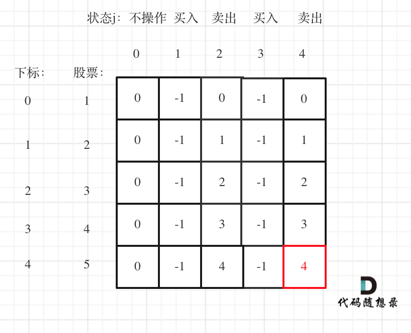

最后一次卖出，一定是利润最大的，`dp[prices.size() - 1][2 * k]`即红色部分就是最后求解。

以上分析完毕，`C++`代码如下：

```cpp
class Solution {
public:
    int maxProfit(int k, vector<int>& prices) {
        if (prices.size() == 0) return 0;
        vector<vector<int>> dp(prices.size(), vector<int>(2 * k + 1, 0));
        for (int j = 1; j < 2 * k; j += 2) {
            dp[0][j] = -prices[0];
        }
        for (int i = 1;i < prices.size(); i++) {
            for (int j = 0; j < 2 * k - 1; j += 2) {
                dp[i][j + 1] = max(dp[i - 1][j + 1], dp[i - 1][j] - prices[i]);
                dp[i][j + 2] = max(dp[i - 1][j + 2], dp[i - 1][j + 1] + prices[i]);
            }
        }
        return dp[prices.size() - 1][2 * k];
    }
};
```

- 时间复杂度`: O(n * k)`，其中 n 为 prices 的长度
- 空间复杂度`: O(n * k)`

当然有的解法是定义一个三维数组`dp[i][j][k]`，第i天，第j次买卖，k表示买还是卖的状态，从定义上来讲是比较直观。

但感觉三维数组操作起来有些麻烦，我是直接用二维数组来模拟三维数组的情况，代码看起来也清爽一些。

# 37.最佳买卖股票时机含冷冻期

[力扣题目链接](https://leetcode.cn/problems/best-time-to-buy-and-sell-stock-with-cooldown/)

给定一个整数数组，其中第 i 个元素代表了第 i 天的股票价格 。

设计一个算法计算出最大利润。在满足以下约束条件下，你可以尽可能地完成更多的交易（多次买卖一支股票）:

- 你不能同时参与多笔交易（你必须在再次购买前出售掉之前的股票）。
- 卖出股票后，你无法在第二天买入股票 `(`即冷冻期为 1 天`)`。

示例:

- 输入`: [1,2,3,0,2]`
- 输出: 3
- 解释: 对应的交易状态为`: [`买入, 卖出, 冷冻期, 买入, 卖出`]`

## 算法公开课

[**《代码随想录》算法视频公开课**](https://programmercarl.com/other/gongkaike.html)**：动态规划来决定最佳时机，这次有冷冻期！| LeetCode：309.买卖股票的最佳** **时机含冷冻期，相信结合视频再看本篇题解，更有助于大家对本题的理解**。

## 思路

相对于[动态规划：122.买卖股票的最佳时机II](https://programmercarl.com/0122.%E4%B9%B0%E5%8D%96%E8%82%A1%E7%A5%A8%E7%9A%84%E6%9C%80%E4%BD%B3%E6%97%B6%E6%9C%BAII%EF%BC%88%E5%8A%A8%E6%80%81%E8%A7%84%E5%88%92%EF%BC%89.html)，本题加上了一个冷冻期

在[动态规划：122.买卖股票的最佳时机II](https://programmercarl.com/0122.%E4%B9%B0%E5%8D%96%E8%82%A1%E7%A5%A8%E7%9A%84%E6%9C%80%E4%BD%B3%E6%97%B6%E6%9C%BAII%EF%BC%88%E5%8A%A8%E6%80%81%E8%A7%84%E5%88%92%EF%BC%89.html) 中有两个状态，持有股票后的最多现金，和不持有股票的最多现金。

动规五部曲，分析如下：

1. 确定dp数组以及下标的含义

`dp[i][j]`，第i天状态为j，所剩的最多现金为`dp[i][j]`。

**其实本题很多同学搞的比较懵，是因为出现冷冻期之后，状态其实是比较复杂度**，例如今天买入股票、今天卖出股票、今天是冷冻期，都是不能操作股票的。

具体可以区分出如下四个状态：

- 状态一：持有股票状态（今天买入股票，或者是之前就买入了股票然后没有操作，一直持有）
- 不持有股票状态，这里就有两种卖出股票状态状态二：保持卖出股票的状态（两天前就卖出了股票，度过一天冷冻期。或者是前一天就是卖出股票状态，一直没操作）

状态三：今天卖出股票

- 状态四：今天为冷冻期状态，但冷冻期状态不可持续，只有一天！

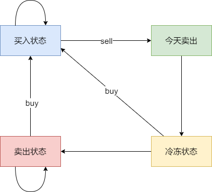

j的状态为：

- 0：状态一
- 1：状态二
- 2：状态三
- 3：状态四

很多题解为什么讲的比较模糊，是因为把这四个状态合并成三个状态了，其实就是把状态二和状态四合并在一起了。

从代码上来看确实可以合并，但从逻辑上分析合并之后就很难理解了，所以我下面的讲解是按照这四个状态来的，把每一个状态分析清楚。

如果大家按照代码随想录顺序来刷的话，会发现 买卖股票最佳时机 1，2，3，4 的题目讲解中 

- [动态规划：121.买卖股票的最佳时机](https://programmercarl.com/0121.%E4%B9%B0%E5%8D%96%E8%82%A1%E7%A5%A8%E7%9A%84%E6%9C%80%E4%BD%B3%E6%97%B6%E6%9C%BA.html)
- [动态规划：122.买卖股票的最佳时机II](https://programmercarl.com/0122.%E4%B9%B0%E5%8D%96%E8%82%A1%E7%A5%A8%E7%9A%84%E6%9C%80%E4%BD%B3%E6%97%B6%E6%9C%BAII%EF%BC%88%E5%8A%A8%E6%80%81%E8%A7%84%E5%88%92%EF%BC%89.html)
- [动态规划：123.买卖股票的最佳时机III](https://programmercarl.com/0123.%E4%B9%B0%E5%8D%96%E8%82%A1%E7%A5%A8%E7%9A%84%E6%9C%80%E4%BD%B3%E6%97%B6%E6%9C%BAIII.html)
- [动态规划：188.买卖股票的最佳时机IV](https://programmercarl.com/0188.%E4%B9%B0%E5%8D%96%E8%82%A1%E7%A5%A8%E7%9A%84%E6%9C%80%E4%BD%B3%E6%97%B6%E6%9C%BAIV.html)

「今天卖出股票」我是没有单独列出一个状态的归类为「不持有股票的状态」，而本题为什么要单独列出「今天卖出股票」 一个状态呢？ 

因为本题我们有冷冻期，而冷冻期的前一天，只能是 「今天卖出股票」状态，如果是 「不持有股票状态」那么就很模糊，因为不一定是 卖出股票的操作。 

如果没有按照 代码随想录 顺序去刷的录友，可能看这里的讲解 会有点困惑，建议把代码随想录本篇之前股票内容的讲解都看一下，领会一下每天 状态的设置。 

**注意这里的每一个状态，例如状态一，是持有股票股票状态并不是说今天一定就买入股票，而是说保持买入股票的** **状态即：可能是前几天买入的，之后一直没操作，所以保持买入股票的状态**。

1. 确定递推公式

**达到买入股票状态**（状态一）即：`dp[i][0]`，有两个具体操作：

- 操作一：前一天就是持有股票状态（状态一），`dp[i][0] = dp[i - 1][0]`
- 操作二：今天买入了，有两种情况

前一天是冷冻期（状态四），`dp[i - 1][3] - prices[i]`前一天是保持卖出股票的状态（状态二），`dp[i - 1][1] - prices[i]`

那么`dp[i][0] = max(dp[i - 1][0], dp[i - 1][3] - prices[i], dp[i - 1][1] - prices[i]);`

**达到保持卖出股票状态**（状态二）即：`dp[i][1]`，有两个具体操作：

- 操作一：前一天就是状态二
- 操作二：前一天是冷冻期（状态四）

`dp[i][1] = max(dp[i - 1][1], dp[i - 1][3]);`

**达到今天就卖出股票状态**（状态三），即：`dp[i][2]` ，只有一个操作：

昨天一定是持有股票状态（状态一），今天卖出

即：`dp[i][2] = dp[i - 1][0] + prices[i];`

**达到冷冻期状态**（状态四），即：`dp[i][3]`，只有一个操作：

昨天卖出了股票（状态三）

`dp[i][3] = dp[i - 1][2];`

综上分析，递推代码如下：

```cpp
dp[i][0] = max(dp[i - 1][0], max(dp[i - 1][3], dp[i - 1][1]) - prices[i]);
dp[i][1] = max(dp[i - 1][1], dp[i - 1][3]);
dp[i][2] = dp[i - 1][0] + prices[i];
dp[i][3] = dp[i - 1][2];
```

3. dp数组如何初始化

这里主要讨论一下第0天如何初始化。

如果是持有股票状态（状态一）那么：`dp[0][0] = -prices[0]`，一定是当天买入股票。

保持卖出股票状态（状态二），这里其实从 「状态二」的定义来说 ，很难明确应该初始多少，这种情况我们就看递推公式需要我们给他初始成什么数值。 

如果i为1，第1天买入股票，那么递归公式中需要计算 `dp[i - 1][1] - prices[i]` ，即 `dp[0][1] - prices[1]`，那么大家感受一下 `dp[0][1]` （即第0天的状态二）应该初始成多少，只能初始为0。想一想如果初始为其他数值，是我们第1天买入股票后 手里还剩的现金数量是不是就不对了。

今天卖出了股票（状态三），同上分析，`dp[0][2]`初始化为0，`dp[0][3]`也初始为0。

4. 确定遍历顺序

从递归公式上可以看出，`dp[i]` 依赖于 `dp[i-1]`，所以是从前向后遍历。

5. 举例推导dp数组

以 `[1,2,3,0,2]` 为例，dp数组如下：

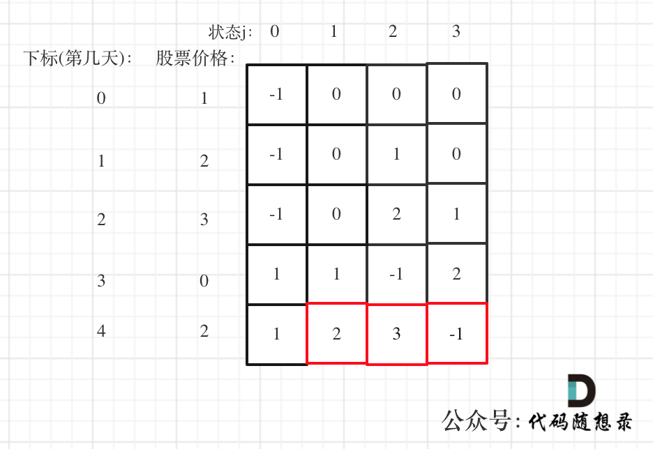

最后结果是取 状态二，状态三，和状态四的最大值，不少同学会把状态四忘了，状态四是冷冻期，最后一天如果是冷冻期也可能是最大值。

代码如下：

```cpp
class Solution {
public:
    int maxProfit(vector<int>& prices) {
        int n = prices.size();
        if (n == 0) return 0;
        vector<vector<int>> dp(n, vector<int>(4, 0));
        dp[0][0] -= prices[0]; // 持股票
        for (int i = 1; i < n; i++) {
            dp[i][0] = max(dp[i - 1][0], max(dp[i - 1][3] - prices[i], dp[i - 1][1] -
prices[i]));
            dp[i][1] = max(dp[i - 1][1], dp[i - 1][3]);
            dp[i][2] = dp[i - 1][0] + prices[i];
            dp[i][3] = dp[i - 1][2];
        }
        return max(dp[n - 1][3], max(dp[n - 1][1], dp[n - 1][2]));
    }
};
```

- 时间复杂度：`O(n)`
- 空间复杂度：`O(n)`

当然，空间复杂度可以优化，定义一个`dp[2][4]`大小的数组就可以了，就保存前一天的当前的状态，感兴趣的同学可以自己去写一写，思路是一样的。

## 总结

这次把冷冻期这道题目，讲的很透彻了，细分为四个状态，其状态转移也十分清晰，建议大家都按照四个状态来分析，如果只划分三个状态确实很容易给自己绕进去。

# 38. 本周小结！（动态规划系列七）

本周的主题就是股票系列，来一起回顾一下吧

## 周一

[动态规划：买卖股票的最佳时机II](https://programmercarl.com/0122.%E4%B9%B0%E5%8D%96%E8%82%A1%E7%A5%A8%E7%9A%84%E6%9C%80%E4%BD%B3%E6%97%B6%E6%9C%BAII%EF%BC%88%E5%8A%A8%E6%80%81%E8%A7%84%E5%88%92%EF%BC%89.html)中股票可以买卖多次了！

这也是和[121. 买卖股票的最佳时机](https://programmercarl.com/0121.%E4%B9%B0%E5%8D%96%E8%82%A1%E7%A5%A8%E7%9A%84%E6%9C%80%E4%BD%B3%E6%97%B6%E6%9C%BA.html)的唯一区别（注意只有一只股票，所以再次购买前要出售掉之前的股票）

重点在于递推公式的不同。

在回顾一下dp数组的含义：

- `dp[i][0]` 表示第i天持有股票所得现金。
- `dp[i][1]` 表示第i天不持有股票所得最多现金

递推公式：

```cpp
dp[i][0] = max(dp[i - 1][0], dp[i - 1][1] - prices[i]);
dp[i][1] = max(dp[i - 1][1], dp[i - 1][0] + prices[i]);
```

大家可以发现本题和[121. 买卖股票的最佳时机](https://programmercarl.com/0121.%E4%B9%B0%E5%8D%96%E8%82%A1%E7%A5%A8%E7%9A%84%E6%9C%80%E4%BD%B3%E6%97%B6%E6%9C%BA.html)的代码几乎一样，唯一的区别在：

```cpp
dp[i][0] = max(dp[i - 1][0], dp[i - 1][1] - prices[i]);
```

**这正是因为本题的股票可以买卖多次！** 所以买入股票的时候，可能会有之前买卖的利润即：`dp[i - 1][1]`，所以`dp[i` `- 1][1] - prices[i]`。

## 周二

[动态规划：买卖股票的最佳时机III](https://programmercarl.com/0123.%E4%B9%B0%E5%8D%96%E8%82%A1%E7%A5%A8%E7%9A%84%E6%9C%80%E4%BD%B3%E6%97%B6%E6%9C%BAIII.html)中最多只能完成两笔交易。

**这意味着可以买卖一次，可以买卖两次，也可以不买卖**。

1. 确定dp数组以及下标的含义

一天一共就有五个状态，

0. 没有操作1. 第一次买入2. 第一次卖出3. 第二次买入4. 第二次卖出

**dp[i][j]中 i表示第i天，j为 [0 - 4] 五个状态，dp[i][j]表示第i天状态j所剩最大现金**。

2. 确定递推公式

需要注意：`dp[i][1]`，**表示的是第i天，买入股票的状态，并不是说一定要第i天买入股票，这是很多同学容易陷入的** **误区**。

```cpp
dp[i][1] = max(dp[i-1][0] - prices[i], dp[i - 1][1]);
dp[i][2] = max(dp[i - 1][1] + prices[i], dp[i - 1][2]);
dp[i][3] = max(dp[i - 1][3], dp[i - 1][2] - prices[i]);
dp[i][4] = max(dp[i - 1][4], dp[i - 1][3] + prices[i]);
```

3. dp数组如何初始化

`dp[0][0] = 0;` `dp[0][1] = -prices[0];` `dp[0][2] = 0;` `dp[0][3] = -prices[0];` `dp[0][4] = 0;`

4. 确定遍历顺序

从递归公式其实已经可以看出，一定是从前向后遍历，因为`dp[i]`，依靠`dp[i - 1]`的数值。

5. 举例推导dp数组

以输入`[1,2,3,4,5]`为例


可以看到红色框为最后两次卖出的状态。

现在最大的时候一定是卖出的状态，而两次卖出的状态现金最大一定是最后一次卖出。

所以最终最大利润是`dp[4][4]`

## 周三

[动态规划：买卖股票的最佳时机IV](https://programmercarl.com/0188.%E4%B9%B0%E5%8D%96%E8%82%A1%E7%A5%A8%E7%9A%84%E6%9C%80%E4%BD%B3%E6%97%B6%E6%9C%BAIV.html)最多可以完成 k 笔交易。

相对于上一道[动态规划：123.买卖股票的最佳时机III](https://programmercarl.com/0123.%E4%B9%B0%E5%8D%96%E8%82%A1%E7%A5%A8%E7%9A%84%E6%9C%80%E4%BD%B3%E6%97%B6%E6%9C%BAIII.html)，本题需要通过前两次的交易，来类比前k次的交易

1. 确定dp数组以及下标的含义

使用二维数组 `dp[i][j]` ：第i天的状态为j，所剩下的最大现金是`dp[i][j]`

j的状态表示为：

- 0 表示不操作
- 1 第一次买入
- 2 第一次卖出
- 3 第二次买入

- 4 第二次卖出
- .....

**除了0以外，偶数就是卖出，奇数就是买入**。

2. 确定递推公式

还要强调一下：`dp[i][1]`，**表示的是第i天，买入股票的状态，并不是说一定要第i天买入股票，这是很多同学容易陷** **入的误区**。

```cpp
for (int j = 0; j < 2 * k - 1; j += 2) {
    dp[i][j + 1] = max(dp[i - 1][j + 1], dp[i - 1][j] - prices[i]);
    dp[i][j + 2] = max(dp[i - 1][j + 2], dp[i - 1][j + 1] + prices[i]);
}
```

**本题和**[**动态规划：123.买卖股票的最佳时机III**](https://programmercarl.com/0123.%E4%B9%B0%E5%8D%96%E8%82%A1%E7%A5%A8%E7%9A%84%E6%9C%80%E4%BD%B3%E6%97%B6%E6%9C%BAIII.html)**最大的区别就是这里要类比j为奇数是买，偶数是卖的状态**。

3. dp数组如何初始化

**dp[0][j]当j为奇数的时候都初始化为 -prices[0]**

代码如下：

```cpp
for (int j = 1; j < 2 * k; j += 2) {
    dp[0][j] = -prices[0];
}
```

**在初始化的地方同样要类比j为奇数是买、偶数是卖的状态**。

4. 确定遍历顺序

从递归公式其实已经可以看出，一定是从前向后遍历，因为`dp[i]`，依靠`dp[i - 1]`的数值。

5. 举例推导dp数组

以输入`[1,2,3,4,5]`，`k=2`为例。


最后一次卖出，一定是利润最大的，`dp[prices.size() - 1][2 * k]`即红色部分就是最后求解。

## 周四

[动态规划：最佳买卖股票时机含冷冻期](https://programmercarl.com/0309.%E6%9C%80%E4%BD%B3%E4%B9%B0%E5%8D%96%E8%82%A1%E7%A5%A8%E6%97%B6%E6%9C%BA%E5%90%AB%E5%86%B7%E5%86%BB%E6%9C%9F.html)尽可能地完成更多的交易（多次买卖一支股票），但有冷冻期，冷冻期为1天

相对于[动态规划：122.买卖股票的最佳时机II](https://programmercarl.com/0122.%E4%B9%B0%E5%8D%96%E8%82%A1%E7%A5%A8%E7%9A%84%E6%9C%80%E4%BD%B3%E6%97%B6%E6%9C%BAII%EF%BC%88%E5%8A%A8%E6%80%81%E8%A7%84%E5%88%92%EF%BC%89.html)，本题加上了一个冷冻期

**本题则需要第三个状态：不持有股票（冷冻期）的最多现金**。

动规五部曲，分析如下：

1. 确定dp数组以及下标的含义

**dp[i][j]，第i天状态为j，所剩的最多现金为dp[i][j]**。

j的状态为：

- 0：持有股票后的最多现金
- 1：不持有股票（能购买）的最多现金
- 2：不持有股票（冷冻期）的最多现金2. 确定递推公式

```cpp
dp[i][0] = max(dp[i - 1][0], dp[i - 1][1] - prices[i]);
dp[i][1] = max(dp[i - 1][1], dp[i - 1][2]);
dp[i][2] = dp[i - 1][0] + prices[i];
```

3. dp数组如何初始化

可以统一都初始为0了。

代码如下：

```cpp
vector<vector<int>> dp(n, vector<int>(3, 0));
```

**初始化其实很有讲究，很多同学可能是稀里糊涂的全都初始化0，反正就可以通过，但没有想清楚，为什么都初始** **化为0**。

4. 确定遍历顺序

从递归公式上可以看出，`dp[i]` 依赖于 `dp[i-1]`，所以是从前向后遍历。

5. 举例推导dp数组

以 `[1,2,3,0,2]` 为例，dp数组如下：

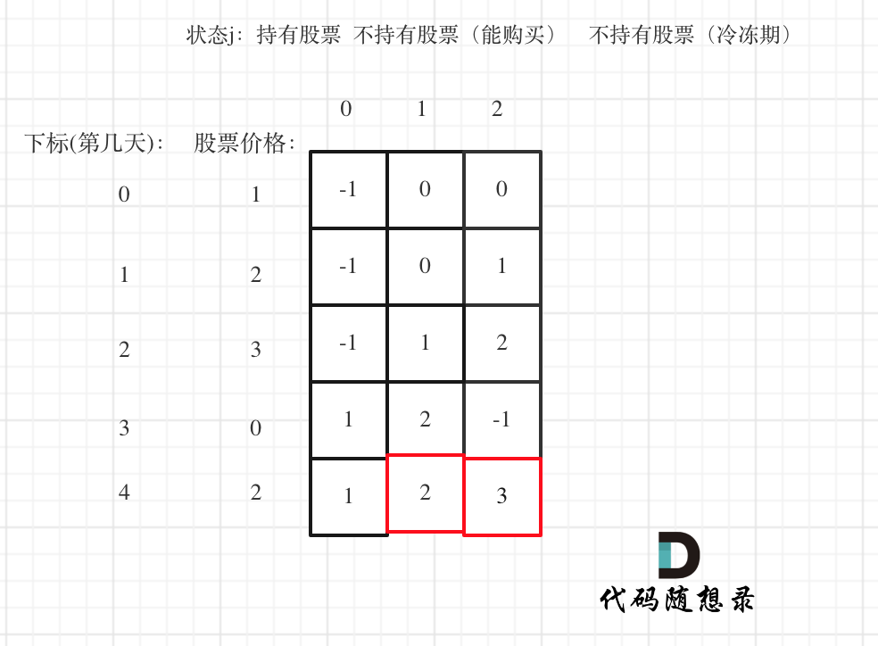

最后两个状态 不持有股票（能购买） 和 不持有股票（冷冻期）都有可能最后结果，取最大的。

## 总结

下周还会有一篇股票系列的文章，**股票系列后面我也会单独写一篇总结，来高度概括一下，这样大家会对股票问题** **就有一个整体性的理解了**。

# 39.买卖股票的最佳时机含手续费

[力扣题目链接](https://leetcode.cn/problems/best-time-to-buy-and-sell-stock-with-transaction-fee/)

给定一个整数数组 prices，其中第 i 个元素代表了第 i 天的股票价格 ；非负整数 fee 代表了交易股票的手续费用。

你可以无限次地完成交易，但是你每笔交易都需要付手续费。如果你已经购买了一个股票，在卖出它之前你就不能再继续购买股票了。

返回获得利润的最大值。

注意：这里的一笔交易指买入持有并卖出股票的整个过程，每笔交易你只需要为支付一次手续费。

示例 1:

- 输入`: prices = [1, 3, 2, 8, 4, 9], fee = 2`
- 输出: 8

解释: 能够达到的最大利润:

- 在此处买入 `prices[0] = 1`
- 在此处卖出 `prices[3] = 8`
- 在此处买入 `prices[4] = 4`
- 在此处卖出 `prices[5] = 9`
- 总利润`: ((8 - 1) - 2) + ((9 - 4) - 2) = 8.`

注意:

- `0 < prices.length <= 50000.`
- `0 < prices[i] < 50000.`
- `0 <= fee < 50000.`

## 算法公开课

[**《代码随想录》算法视频公开课**](https://programmercarl.com/other/gongkaike.html)**：动态规划来决定最佳时机，这次含手续费！| LeetCode：714.买卖股票的最佳** **时机含手续费，相信结合视频再看本篇题解，更有助于大家对本题的理解**。

## 思路

本题贪心解法：[贪心算法：买卖股票的最佳时机含手续费](https://programmercarl.com/0714.%E4%B9%B0%E5%8D%96%E8%82%A1%E7%A5%A8%E7%9A%84%E6%9C%80%E4%BD%B3%E6%97%B6%E6%9C%BA%E5%90%AB%E6%89%8B%E7%BB%AD%E8%B4%B9.html) 

性能是：

- 时间复杂度：`O(n)`
- 空间复杂度：`O(1)` 

本题使用贪心算法并不好理解，也很容易出错，那么我们再来看看是使用动规的方法如何解题。

相对于[动态规划：122.买卖股票的最佳时机II](https://programmercarl.com/0122.%E4%B9%B0%E5%8D%96%E8%82%A1%E7%A5%A8%E7%9A%84%E6%9C%80%E4%BD%B3%E6%97%B6%E6%9C%BAII%EF%BC%88%E5%8A%A8%E6%80%81%E8%A7%84%E5%88%92%EF%BC%89.html)，本题只需要在计算卖出操作的时候减去手续费就可以了，代码几乎是一样的。

唯一差别在于递推公式部分，所以本篇也就不按照动规五部曲详细讲解了，主要讲解一下递推公式部分。

这里重申一下dp数组的含义：

`dp[i][0]` 表示第i天持有股票所省最多现金。`dp[i][1]` 表示第i天不持有股票所得最多现金

如果第i天持有股票即`dp[i][0]`， 那么可以由两个状态推出来

- 第i-1天就持有股票，那么就保持现状，所得现金就是昨天持有股票的所得现金 即：`dp[i - 1][0]`
- 第i天买入股票，所得现金就是昨天不持有股票的所得现金减去 今天的股票价格 即：`dp[i - 1][1] - prices[i]`

所以：`dp[i][0] = max(dp[i - 1][0], dp[i - 1][1] - prices[i]);`

在来看看如果第i天不持有股票即`dp[i][1]`的情况， 依然可以由两个状态推出来

- 第i-1天就不持有股票，那么就保持现状，所得现金就是昨天不持有股票的所得现金 即：`dp[i - 1][1]`
- 第i天卖出股票，所得现金就是按照今天股票价格卖出后所得现金，**注意这里需要有手续费了**即：`dp[i - 1][0] +` `prices[i] - fee`

所以：`dp[i][1] = max(dp[i - 1][1], dp[i - 1][0] + prices[i] - fee);`

**本题和**[**动态规划：122.买卖股票的最佳时机II**](https://programmercarl.com/0122.%E4%B9%B0%E5%8D%96%E8%82%A1%E7%A5%A8%E7%9A%84%E6%9C%80%E4%BD%B3%E6%97%B6%E6%9C%BAII%EF%BC%88%E5%8A%A8%E6%80%81%E8%A7%84%E5%88%92%EF%BC%89.html)**的区别就是这里需要多一个减去手续费的操作**。

以上分析完毕，`C++`代码如下：

```cpp
class Solution {
public:
    int maxProfit(vector<int>& prices, int fee) {
        int n = prices.size();
        vector<vector<int>> dp(n, vector<int>(2, 0));
        dp[0][0] -= prices[0]; // 持股票
        for (int i = 1; i < n; i++) {
            dp[i][0] = max(dp[i - 1][0], dp[i - 1][1] - prices[i]);
            dp[i][1] = max(dp[i - 1][1], dp[i - 1][0] + prices[i] - fee);
        }
        return max(dp[n - 1][0], dp[n - 1][1]);
    }
};
```

- 时间复杂度：`O(n)`
- 空间复杂度：`O(n)`

# 40. 股票问题总结篇!

之前我们已经把力扣上股票系列的题目都讲过的，但没有来一篇股票总结，来帮大家高屋建瓴，所以总结篇这就来了！


- [动态规划：121.买卖股票的最佳时机](https://programmercarl.com/0121.%E4%B9%B0%E5%8D%96%E8%82%A1%E7%A5%A8%E7%9A%84%E6%9C%80%E4%BD%B3%E6%97%B6%E6%9C%BA.html)
- [动态规划：122.买卖股票的最佳时机II](https://programmercarl.com/0122.%E4%B9%B0%E5%8D%96%E8%82%A1%E7%A5%A8%E7%9A%84%E6%9C%80%E4%BD%B3%E6%97%B6%E6%9C%BAII%EF%BC%88%E5%8A%A8%E6%80%81%E8%A7%84%E5%88%92%EF%BC%89.html)
- [动态规划：123.买卖股票的最佳时机III](https://programmercarl.com/0123.%E4%B9%B0%E5%8D%96%E8%82%A1%E7%A5%A8%E7%9A%84%E6%9C%80%E4%BD%B3%E6%97%B6%E6%9C%BAIII.html)
- [动态规划：188.买卖股票的最佳时机IV](https://programmercarl.com/0188.%E4%B9%B0%E5%8D%96%E8%82%A1%E7%A5%A8%E7%9A%84%E6%9C%80%E4%BD%B3%E6%97%B6%E6%9C%BAIV.html)
- [动态规划：309.最佳买卖股票时机含冷冻期](https://programmercarl.com/0309.%E6%9C%80%E4%BD%B3%E4%B9%B0%E5%8D%96%E8%82%A1%E7%A5%A8%E6%97%B6%E6%9C%BA%E5%90%AB%E5%86%B7%E5%86%BB%E6%9C%9F.html)
- [动态规划：714.买卖股票的最佳时机含手续费](https://programmercarl.com/0714.%E4%B9%B0%E5%8D%96%E8%82%A1%E7%A5%A8%E7%9A%84%E6%9C%80%E4%BD%B3%E6%97%B6%E6%9C%BA%E5%90%AB%E6%89%8B%E7%BB%AD%E8%B4%B9%EF%BC%88%E5%8A%A8%E6%80%81%E8%A7%84%E5%88%92%EF%BC%89.html)

## 卖股票的最佳时机

[动态规划：121.买卖股票的最佳时机](https://programmercarl.com/0121.%E4%B9%B0%E5%8D%96%E8%82%A1%E7%A5%A8%E7%9A%84%E6%9C%80%E4%BD%B3%E6%97%B6%E6%9C%BA.html)，**股票只能买卖一次，问最大利润**。

【贪心解法】

取最左最小值，取最右最大值，那么得到的差值就是最大利润，代码如下：

```cpp
class Solution {
public:
    int maxProfit(vector<int>& prices) {
        int low = INT_MAX;
        int result = 0;
        for (int i = 0; i < prices.size(); i++) {
            low = min(low, prices[i]);  // 取最左最小价格
            result = max(result, prices[i] - low); // 直接取最大区间利润
        }
        return result;
    }
};
```

【动态规划】

- `dp[i][0]` 表示第i天持有股票所得现金。
- `dp[i][1]` 表示第i天不持有股票所得现金。

如果第i天持有股票即`dp[i][0]`， 那么可以由两个状态推出来

- 第i-1天就持有股票，那么就保持现状，所得现金就是昨天持有股票的所得现金 即：`dp[i - 1][0]`
- 第i天买入股票，所得现金就是买入今天的股票后所得现金即：`-prices[i]`所以`dp[i][0] = max(dp[i - 1][0], -prices[i]);`

如果第i天不持有股票即`dp[i][1]`， 也可以由两个状态推出来

- 第i-1天就不持有股票，那么就保持现状，所得现金就是昨天不持有股票的所得现金 即：`dp[i - 1][1]`
- 第i天卖出股票，所得现金就是按照今天股票佳价格卖出后所得现金即：`prices[i] + dp[i - 1][0]`所以`dp[i][1] = max(dp[i - 1][1], prices[i] + dp[i - 1][0]);`

代码如下：

```cpp
// 版本一
class Solution {
public:
    int maxProfit(vector<int>& prices) {
        int len = prices.size();
        if (len == 0) return 0;
        vector<vector<int>> dp(len, vector<int>(2));
        dp[0][0] -= prices[0];
        dp[0][1] = 0;
        for (int i = 1; i < len; i++) {
            dp[i][0] = max(dp[i - 1][0], -prices[i]);
            dp[i][1] = max(dp[i - 1][1], prices[i] + dp[i - 1][0]);
        }
        return dp[len - 1][1];
    }
};
```

- 时间复杂度：`O(n)`
- 空间复杂度：`O(n)`

使用滚动数组，代码如下：

```cpp
// 版本二
class Solution {
public:
    int maxProfit(vector<int>& prices) {
        int len = prices.size();
        vector<vector<int>> dp(2, vector<int>(2)); // 注意这里只开辟了一个2 * 2大小的二维数组
        dp[0][0] -= prices[0];
        dp[0][1] = 0;
        for (int i = 1; i < len; i++) {
            dp[i % 2][0] = max(dp[(i - 1) % 2][0], -prices[i]);
            dp[i % 2][1] = max(dp[(i - 1) % 2][1], prices[i] + dp[(i - 1) % 2][0]);
        }
        return dp[(len - 1) % 2][1];
    }
};
```

- 时间复杂度：`O(n)`
- 空间复杂度：`O(1)`

## 买卖股票的最佳时机II

[动态规划：122.买卖股票的最佳时机II](https://programmercarl.com/0122.%E4%B9%B0%E5%8D%96%E8%82%A1%E7%A5%A8%E7%9A%84%E6%9C%80%E4%BD%B3%E6%97%B6%E6%9C%BAII%EF%BC%88%E5%8A%A8%E6%80%81%E8%A7%84%E5%88%92%EF%BC%89.html)可以多次买卖股票，问最大收益。

【贪心解法】

收集每天的正利润便可，代码如下：

```cpp
class Solution {
public:
    int maxProfit(vector<int>& prices) {
        int result = 0;
        for (int i = 1; i < prices.size(); i++) {
            result += max(prices[i] - prices[i - 1], 0);
        }
        return result;
    }
};
```

- 时间复杂度：`O(n)`
- 空间复杂度：`O(1)`

【动态规划】

dp数组定义：

- `dp[i][0]` 表示第i天持有股票所得现金
- `dp[i][1]` 表示第i天不持有股票所得最多现金

如果第i天持有股票即`dp[i][0]`， 那么可以由两个状态推出来

- 第i-1天就持有股票，那么就保持现状，所得现金就是昨天持有股票的所得现金 即：`dp[i - 1][0]`
- 第i天买入股票，所得现金就是昨天不持有股票的所得现金减去 今天的股票价格 即：`dp[i - 1][1] - prices[i]`

**注意这里和**[**121. 买卖股票的最佳时机**](https://programmercarl.com/0121.%E4%B9%B0%E5%8D%96%E8%82%A1%E7%A5%A8%E7%9A%84%E6%9C%80%E4%BD%B3%E6%97%B6%E6%9C%BA.html)**唯一不同的地方，就是推导dp[i][0]的时候，第i天买入股票的情况**。

在[121. 买卖股票的最佳时机](https://programmercarl.com/0121.%E4%B9%B0%E5%8D%96%E8%82%A1%E7%A5%A8%E7%9A%84%E6%9C%80%E4%BD%B3%E6%97%B6%E6%9C%BA.html)中，因为股票全程只能买卖一次，所以如果买入股票，那么第i天持有股票即`dp[i][0]`一定就是 `-prices[i]`。

而本题，因为一只股票可以买卖多次，所以当第i天买入股票的时候，所持有的现金可能有之前买卖过的利润。

代码如下：（注意代码中的注释，标记了和121.买卖股票的最佳时机唯一不同的地方）

```cpp
class Solution {
public:
    int maxProfit(vector<int>& prices) {
        int len = prices.size();
        vector<vector<int>> dp(len, vector<int>(2, 0));
        dp[0][0] -= prices[0];
        dp[0][1] = 0;
        for (int i = 1; i < len; i++) {
            dp[i][0] = max(dp[i - 1][0], dp[i - 1][1] - prices[i]); // 注意这里是和121. 买
卖股票的最佳时机唯一不同的地方。
            dp[i][1] = max(dp[i - 1][1], dp[i - 1][0] + prices[i]);
        }
        return dp[len - 1][1];
    }
};
```

- 时间复杂度：`O(n)`
- 空间复杂度：`O(n)`

## 买卖股票的最佳时机III

[动态规划：123.买卖股票的最佳时机III](https://programmercarl.com/0123.%E4%B9%B0%E5%8D%96%E8%82%A1%E7%A5%A8%E7%9A%84%E6%9C%80%E4%BD%B3%E6%97%B6%E6%9C%BAIII.html)最多买卖两次，问最大收益。

【动态规划】

一天一共就有五个状态，

0. 没有操作1. 第一次买入2. 第一次卖出3. 第二次买入4. 第二次卖出`dp[i][j]`中 i表示第i天，j为 `[0 - 4]` 五个状态，`dp[i][j]`表示第i天状态j所剩最大现金。

达到`dp[i][1]`状态，有两个具体操作：

- 操作一：第i天买入股票了，那么`dp[i][1] = dp[i-1][0] - prices[i]`
- 操作二：第i天没有操作，而是沿用前一天买入的状态，即：`dp[i][1] = dp[i - 1][1]`

`dp[i][1] = max(dp[i-1][0] - prices[i], dp[i - 1][1]);`

同理`dp[i][2]`也有两个操作：

- 操作一：第i天卖出股票了，那么`dp[i][2] = dp[i - 1][1] + prices[i]`
- 操作二：第i天没有操作，沿用前一天卖出股票的状态，即：`dp[i][2] = dp[i - 1][2]`

所以`dp[i][2] = max(dp[i - 1][1] + prices[i], dp[i - 1][2])`

同理可推出剩下状态部分：

`dp[i][3] = max(dp[i - 1][3], dp[i - 1][2] - prices[i]);`

`dp[i][4] = max(dp[i - 1][4], dp[i - 1][3] + prices[i]);`

代码如下：

```cpp
// 版本一
class Solution {
public:
    int maxProfit(vector<int>& prices) {
        if (prices.size() == 0) return 0;
        vector<vector<int>> dp(prices.size(), vector<int>(5, 0));
        dp[0][1] = -prices[0];
        dp[0][3] = -prices[0];
        for (int i = 1; i < prices.size(); i++) {
            dp[i][0] = dp[i - 1][0];
            dp[i][1] = max(dp[i - 1][1], dp[i - 1][0] - prices[i]);
            dp[i][2] = max(dp[i - 1][2], dp[i - 1][1] + prices[i]);
            dp[i][3] = max(dp[i - 1][3], dp[i - 1][2] - prices[i]);
            dp[i][4] = max(dp[i - 1][4], dp[i - 1][3] + prices[i]);
        }
        return dp[prices.size() - 1][4];
    }
};
```

- 时间复杂度：`O(n)`
- 空间复杂度：`O(n × 5)`

当然，大家可以看到力扣官方题解里的一种优化空间写法，我这里给出对应的`C++`版本：

```cpp
// 版本二
class Solution {
public:
    int maxProfit(vector<int>& prices) {
        if (prices.size() == 0) return 0;
        vector<int> dp(5, 0);
        dp[1] = -prices[0];
        dp[3] = -prices[0];
        for (int i = 1; i < prices.size(); i++) {
            dp[1] = max(dp[1], dp[0] - prices[i]);
            dp[2] = max(dp[2], dp[1] + prices[i]);
            dp[3] = max(dp[3], dp[2] - prices[i]);
            dp[4] = max(dp[4], dp[3] + prices[i]);
        }
        return dp[4];
    }
};
```

- 时间复杂度：`O(n)`
- 空间复杂度：`O(1)`

**这种写法看上去简单，其实思路很绕，不建议大家这么写，这么思考，很容易把自己绕进去！** 对于本题，把版本一的写法研究明白，足以！

## 买卖股票的最佳时机IV

[动态规划：188.买卖股票的最佳时机IV](https://programmercarl.com/0188.%E4%B9%B0%E5%8D%96%E8%82%A1%E7%A5%A8%E7%9A%84%E6%9C%80%E4%BD%B3%E6%97%B6%E6%9C%BAIV.html) 最多买卖k笔交易，问最大收益。

使用二维数组 `dp[i][j]` ：第i天的状态为j，所剩下的最大现金是`dp[i][j]`

j的状态表示为：

- 0 表示不操作
- 1 第一次买入
- 2 第一次卖出
- 3 第二次买入
- 4 第二次卖出
- .....

**除了0以外，偶数就是卖出，奇数就是买入**。

2. 确定递推公式

达到`dp[i][1]`状态，有两个具体操作：

- 操作一：第i天买入股票了，那么`dp[i][1] = dp[i - 1][0] - prices[i]`
- 操作二：第i天没有操作，而是沿用前一天买入的状态，即：`dp[i][1] = dp[i - 1][1]`

`dp[i][1] = max(dp[i - 1][0] - prices[i], dp[i - 1][1]);`

同理`dp[i][2]`也有两个操作：

- 操作一：第i天卖出股票了，那么`dp[i][2] = dp[i - 1][1] + prices[i]`
- 操作二：第i天没有操作，沿用前一天卖出股票的状态，即：`dp[i][2] = dp[i - 1][2]` `dp[i][2] = max(dp[i - 1][1] + prices[i], dp[i - 1][2])`同理可以类比剩下的状态，代码如下：

```cpp
for (int j = 0; j < 2 * k - 1; j += 2) {
    dp[i][j + 1] = max(dp[i - 1][j + 1], dp[i - 1][j] - prices[i]);
    dp[i][j + 2] = max(dp[i - 1][j + 2], dp[i - 1][j + 1] + prices[i]);
}
```

整体代码如下：

```cpp
class Solution {
public:
    int maxProfit(int k, vector<int>& prices) {
        if (prices.size() == 0) return 0;
        vector<vector<int>> dp(prices.size(), vector<int>(2 * k + 1, 0));
        for (int j = 1; j < 2 * k; j += 2) {
            dp[0][j] = -prices[0];
        }
        for (int i = 1;i < prices.size(); i++) {
            for (int j = 0; j < 2 * k - 1; j += 2) {
                dp[i][j + 1] = max(dp[i - 1][j + 1], dp[i - 1][j] - prices[i]);
                dp[i][j + 2] = max(dp[i - 1][j + 2], dp[i - 1][j + 1] + prices[i]);
            }
        }
        return dp[prices.size() - 1][2 * k];
    }
};
```

当然有的解法是定义一个三维数组`dp[i][j][k]`，第i天，第j次买卖，k表示买还是卖的状态，从定义上来讲是比较直观。但感觉三维数组操作起来有些麻烦，直接用二维数组来模拟三维数组的情况，代码看起来也清爽一些。

## 最佳买卖股票时机含冷冻期

[动态规划：309.最佳买卖股票时机含冷冻期](https://programmercarl.com/0309.%E6%9C%80%E4%BD%B3%E4%B9%B0%E5%8D%96%E8%82%A1%E7%A5%A8%E6%97%B6%E6%9C%BA%E5%90%AB%E5%86%B7%E5%86%BB%E6%9C%9F.html)可以多次买卖但每次卖出有冷冻期1天。

相对于[动态规划：122.买卖股票的最佳时机II](https://programmercarl.com/0122.%E4%B9%B0%E5%8D%96%E8%82%A1%E7%A5%A8%E7%9A%84%E6%9C%80%E4%BD%B3%E6%97%B6%E6%9C%BAII%EF%BC%88%E5%8A%A8%E6%80%81%E8%A7%84%E5%88%92%EF%BC%89.html)，本题加上了一个冷冻期。

在[动态规划：122.买卖股票的最佳时机II](https://programmercarl.com/0122.%E4%B9%B0%E5%8D%96%E8%82%A1%E7%A5%A8%E7%9A%84%E6%9C%80%E4%BD%B3%E6%97%B6%E6%9C%BAII%EF%BC%88%E5%8A%A8%E6%80%81%E8%A7%84%E5%88%92%EF%BC%89.html)  中有两个状态，持有股票后的最多现金，和不持有股票的最多现金。本题则可以花费为四个状态

`dp[i][j]`：第i天状态为j，所剩的最多现金为`dp[i][j]`。

具体可以区分出如下四个状态：

- 状态一：买入股票状态（今天买入股票，或者是之前就买入了股票然后没有操作）
- 卖出股票状态，这里就有两种卖出股票状态

状态二：两天前就卖出了股票，度过了冷冻期，一直没操作，今天保持卖出股票状态状态三：今天卖出了股票

- 状态四：今天为冷冻期状态，但冷冻期状态不可持续，只有一天！

达到买入股票状态（状态一）即：`dp[i][0]`，有两个具体操作：

- 操作一：前一天就是持有股票状态（状态一），`dp[i][0] = dp[i - 1][0]`
- 操作二：今天买入了，有两种情况

前一天是冷冻期（状态四），`dp[i - 1][3] - prices[i]`前一天是保持卖出股票状态（状态二），`dp[i - 1][1] - prices[i]`

所以操作二取最大值，即：`max(dp[i - 1][3], dp[i - 1][1]) - prices[i]`

那么`dp[i][0] = max(dp[i - 1][0], max(dp[i - 1][3], dp[i - 1][1]) - prices[i]);`

达到保持卖出股票状态（状态二）即：`dp[i][1]`，有两个具体操作：

- 操作一：前一天就是状态二
- 操作二：前一天是冷冻期（状态四）

`dp[i][1] = max(dp[i - 1][1], dp[i - 1][3]);`

达到今天就卖出股票状态（状态三），即：`dp[i][2]` ，只有一个操作：

- 操作一：昨天一定是买入股票状态（状态一），今天卖出

即：`dp[i][2] = dp[i - 1][0] + prices[i];`

达到冷冻期状态（状态四），即：`dp[i][3]`，只有一个操作：

- 操作一：昨天卖出了股票（状态三）

`p[i][3] = dp[i - 1][2];`

综上分析，递推代码如下：

```cpp
dp[i][0] = max(dp[i - 1][0], max(dp[i - 1][3]- prices[i], dp[i - 1][1]) - prices[i];
dp[i][1] = max(dp[i - 1][1], dp[i - 1][3]);
dp[i][2] = dp[i - 1][0] + prices[i];
dp[i][3] = dp[i - 1][2];
```

整体代码如下：

```cpp
class Solution {
public:
    int maxProfit(vector<int>& prices) {
        int n = prices.size();
        if (n == 0) return 0;
        vector<vector<int>> dp(n, vector<int>(4, 0));
        dp[0][0] -= prices[0]; // 持股票
        for (int i = 1; i < n; i++) {
            dp[i][0] = max(dp[i - 1][0], max(dp[i - 1][3], dp[i - 1][1]) - prices[i]);
            dp[i][1] = max(dp[i - 1][1], dp[i - 1][3]);
            dp[i][2] = dp[i - 1][0] + prices[i];
            dp[i][3] = dp[i - 1][2];
        }
        return max(dp[n - 1][3],max(dp[n - 1][1], dp[n - 1][2]));
    }
};
```

- 时间复杂度：`O(n)`
- 空间复杂度：`O(n)`

## 买卖股票的最佳时机含手续费

[动态规划：714.买卖股票的最佳时机含手续费](https://programmercarl.com/0714.%E4%B9%B0%E5%8D%96%E8%82%A1%E7%A5%A8%E7%9A%84%E6%9C%80%E4%BD%B3%E6%97%B6%E6%9C%BA%E5%90%AB%E6%89%8B%E7%BB%AD%E8%B4%B9%EF%BC%88%E5%8A%A8%E6%80%81%E8%A7%84%E5%88%92%EF%BC%89.html) 可以多次买卖，但每次有手续费。

相对于[动态规划：122.买卖股票的最佳时机II](https://programmercarl.com/0122.%E4%B9%B0%E5%8D%96%E8%82%A1%E7%A5%A8%E7%9A%84%E6%9C%80%E4%BD%B3%E6%97%B6%E6%9C%BAII%EF%BC%88%E5%8A%A8%E6%80%81%E8%A7%84%E5%88%92%EF%BC%89.html)，本题只需要在计算卖出操作的时候减去手续费就可以了，代码几乎是一样的。

唯一差别在于递推公式部分，所以本篇也就不按照动规五部曲详细讲解了，主要讲解一下递推公式部分。

这里重申一下dp数组的含义：

`dp[i][0]` 表示第i天持有股票所省最多现金。`dp[i][1]` 表示第i天不持有股票所得最多现金

如果第i天持有股票即`dp[i][0]`， 那么可以由两个状态推出来

- 第i-1天就持有股票，那么就保持现状，所得现金就是昨天持有股票的所得现金 即：`dp[i - 1][0]`
- 第i天买入股票，所得现金就是昨天不持有股票的所得现金减去 今天的股票价格 即：`dp[i - 1][1] - prices[i]`

所以：`dp[i][0] = max(dp[i - 1][0], dp[i - 1][1] - prices[i]);`

在来看看如果第i天不持有股票即`dp[i][1]`的情况， 依然可以由两个状态推出来

- 第i-1天就不持有股票，那么就保持现状，所得现金就是昨天不持有股票的所得现金 即：`dp[i - 1][1]`
- 第i天卖出股票，所得现金就是按照今天股票价格卖出后所得现金，**注意这里需要有手续费了**即：`dp[i - 1][0] +` `prices[i] - fee`

所以：`dp[i][1] = max(dp[i - 1][1], dp[i - 1][0] + prices[i] - fee);`

**本题和**[**动态规划：122.买卖股票的最佳时机II**](https://programmercarl.com/0122.%E4%B9%B0%E5%8D%96%E8%82%A1%E7%A5%A8%E7%9A%84%E6%9C%80%E4%BD%B3%E6%97%B6%E6%9C%BAII%EF%BC%88%E5%8A%A8%E6%80%81%E8%A7%84%E5%88%92%EF%BC%89.html)**的区别就是这里需要多一个减去手续费的操作**。

以上分析完毕，代码如下：

```cpp
class Solution {
public:
    int maxProfit(vector<int>& prices, int fee) {
        int n = prices.size();
        vector<vector<int>> dp(n, vector<int>(2, 0));
        dp[0][0] -= prices[0]; // 持股票
        for (int i = 1; i < n; i++) {
            dp[i][0] = max(dp[i - 1][0], dp[i - 1][1] - prices[i]);
            dp[i][1] = max(dp[i - 1][1], dp[i - 1][0] + prices[i] - fee);
        }
        return max(dp[n - 1][0], dp[n - 1][1]);
    }
};
```

- 时间复杂度：`O(n)`
- 空间复杂度：`O(n)`

## 总结

至此，股票系列正式剧终，全部讲解完毕！

从买卖一次到买卖多次，从最多买卖两次到最多买卖k次，从冷冻期再到手续费，最后再来一个股票大总结，可以说对股票系列完美收官了。

「代码随想录」值得推荐给身边每一位学习算法的朋友同学们，关注后都会发现相见恨晚！

# 41.最长递增子序列

[力扣题目链接](https://leetcode.cn/problems/longest-increasing-subsequence/)

给你一个整数数组 nums ，找到其中最长严格递增子序列的长度。

子序列是由数组派生而来的序列，删除（或不删除）数组中的元素而不改变其余元素的顺序。例如，`[3,6,2,7]` 是数组 `[0,3,1,6,2,2,7]` 的子序列。

示例 1：

- 输入：`nums = [10,9,2,5,3,7,101,18]`
- 输出：4
- 解释：最长递增子序列是 `[2,3,7,101]`，因此长度为 4 。

示例 2：

- 输入：`nums = [0,1,0,3,2,3]`
- 输出：4

示例 3：

- 输入：`nums = [7,7,7,7,7,7,7]`

- 输出：1

提示：

- `1 <= nums.length <= 2500`
- `-10^4 <= nums[i] <= 104`

## 算法公开课

[**《代码随想录》算法视频公开课**](https://programmercarl.com/other/gongkaike.html)**：：**[**动态规划之子序列问题，元素不连续！| LeetCode：300.最长递增子序列**](https://www.bilibili.com/video/BV1ng411J7xP)**，** **相信结合视频再看本篇题解，更有助于大家对本题的理解**。

## 思路

首先通过本题大家要明确什么是子序列，“子序列是由数组派生而来的序列，删除（或不删除）数组中的元素而不改变其余元素的顺序”。 

本题也是代码随想录中子序列问题的第一题，如果没接触过这种题目的话，本题还是很难的，甚至想暴力去搜索也不知道怎么搜。 子序列问题是动态规划解决的经典问题，当前下标i的递增子序列长度，其实和i之前的下表j的子序列长度有关系，那又是什么样的关系呢。

接下来，我们依然用动规五部曲来详细分析一波：

`1. dp[i]`的定义

本题中，正确定义dp数组的含义十分重要。 

**dp[i]表示i之前包括i的以nums[i]结尾的最长递增子序列的长度** 

为什么一定表示  “以`nums[i]`结尾的最长递增子序” ，因为我们在 做 递增比较的时候，如果比较 `nums[j]` 和 `nums[i]` 的大小，那么两个递增子序列一定分别以`nums[j]`为结尾 和 `nums[i]`为结尾， 要不然这个比较就没有意义了，不是尾部元素的比较那么 如何算递增呢。 

2. 状态转移方程

位置i的最长升序子序列等于j从0到i-1各个位置的最长升序子序列 + 1 的最大值。

所以：`if (nums[i] > nums[j]) dp[i] = max(dp[i], dp[j] + 1);`

**注意这里不是要dp[i] 与 dp[j] + 1进行比较，而是我们要取dp[j] + 1的最大值**。

`3. dp[i]`的初始化

每一个i，对应的`dp[i]`（即最长递增子序列）起始大小至少都是1.

4. 确定遍历顺序

`dp[i]` 是有0到i-1各个位置的最长递增子序列 推导而来，那么遍历i一定是从前向后遍历。

j其实就是遍历0到i-1，那么是从前到后，还是从后到前遍历都无所谓，只要吧 0 到 i-1 的元素都遍历了就行了。 所以默认习惯 从前向后遍历。 

遍历i的循环在外层，遍历j则在内层，代码如下：

```cpp
for (int i = 1; i < nums.size(); i++) {
    for (int j = 0; j < i; j++) {
        if (nums[i] > nums[j]) dp[i] = max(dp[i], dp[j] + 1);
    }
    if (dp[i] > result) result = dp[i]; // 取长的子序列
}
```

5. 举例推导dp数组

输入：`[0,1,0,3,2]`，dp数组的变化如下：

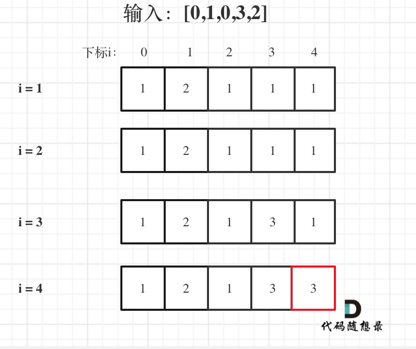

如果代码写出来，但一直AC不了，那么就把dp数组打印出来，看看对不对！

以上五部分析完毕，`C++`代码如下：

```cpp
class Solution {
public:
    int lengthOfLIS(vector<int>& nums) {
        if (nums.size() <= 1) return nums.size();
        vector<int> dp(nums.size(), 1);
        int result = 0;
        for (int i = 1; i < nums.size(); i++) {
            for (int j = 0; j < i; j++) {
                if (nums[i] > nums[j]) dp[i] = max(dp[i], dp[j] + 1);
            }
            if (dp[i] > result) result = dp[i]; // 取长的子序列
        }
        return result;
    }
};
```

- 时间复杂度`: O(n^2)`
- 空间复杂度`: O(n)`

## 总结

本题最关键的是要想到`dp[i]`由哪些状态可以推出来，并取最大值，那么很自然就能想到递推公式：`dp[i] =` `max(dp[i], dp[j] + 1);`

子序列问题是动态规划的一个重要系列，本题算是入门题目，好戏刚刚开始！

# 42. 最长连续递增序列

[力扣题目链接](https://leetcode.cn/problems/longest-continuous-increasing-subsequence/)

给定一个未经排序的整数数组，找到最长且 连续递增的子序列，并返回该序列的长度。

连续递增的子序列 可以由两个下标 l 和 r（`l < r`）确定，如果对于每个 `l <= i < r`，都有 `nums[i] < nums[i + 1]` ，那么子序列 `[nums[l], nums[l + 1], ..., nums[r - 1], nums[r]]` 就是连续递增子序列。

示例 1：

- 输入：`nums = [1,3,5,4,7]`
- 输出：3
- 解释：最长连续递增序列是 `[1,3,5],` 长度为3。尽管 `[1,3,5,7]` 也是升序的子序列, 但它不是连续的，因为 5 和 7 在原数组里被 4 隔开。

示例 2：

- 输入：`nums = [2,2,2,2,2]`
- 输出：1
- 解释：最长连续递增序列是 `[2],` 长度为1。

提示：

- `0 <= nums.length <= 10^4`
- `-10^9 <= nums[i] <= 10^9`

## 算法公开课

[**《代码随想录》算法视频公开课**](https://programmercarl.com/other/gongkaike.html)**：动态规划之子序列问题，重点在于连续！| LeetCode：674.最长连续递增序** **列，相信结合视频再看本篇题解，更有助于大家对本题的理解**。

## 思路

本题相对于昨天的[动态规划：300.最长递增子序列](https://programmercarl.com/0300.%E6%9C%80%E9%95%BF%E4%B8%8A%E5%8D%87%E5%AD%90%E5%BA%8F%E5%88%97.html)最大的区别在于“连续”。

本题要求的是最长**连续**递增序列

### 动态规划

动规五部曲分析如下：

1. 确定dp数组（dp table）以及下标的含义

**dp[i]：以下标i为结尾的连续递增的子序列长度为dp[i]**。

注意这里的定义，一定是以下标i为结尾，并不是说一定以下标0为起始位置。

2. 确定递推公式

如果 `nums[i] > nums[i - 1]`，那么以 i 为结尾的连续递增的子序列长度 一定等于 以i - 1为结尾的连续递增的子序列长度 + 1 。

即：`dp[i] = dp[i - 1] + 1;`

**注意这里就体现出和**[**动态规划：300.最长递增子序列**](https://programmercarl.com/0300.%E6%9C%80%E9%95%BF%E4%B8%8A%E5%8D%87%E5%AD%90%E5%BA%8F%E5%88%97.html)**的区别！**

因为本题要求连续递增子序列，所以就只要比较`nums[i]`与`nums[i - 1]`，而不用去比较`nums[j]`与`nums[i]` （j是在0到i之间遍历）。

既然不用j了，那么也不用两层for循环，本题一层for循环就行，比较`nums[i]` 和 `nums[i - 1]`。

这里大家要好好体会一下！

3. dp数组如何初始化

以下标i为结尾的连续递增的子序列长度最少也应该是1，即就是`nums[i]`这一个元素。

所以`dp[i]`应该初始`1;`

4. 确定遍历顺序

从递推公式上可以看出， `dp[i + 1]`依赖`dp[i]`，所以一定是从前向后遍历。

本文在确定递推公式的时候也说明了为什么本题只需要一层for循环，代码如下：

```cpp
for (int i = 1; i < nums.size(); i++) {
    if (nums[i] > nums[i - 1]) { // 连续记录
        dp[i] = dp[i - 1] + 1;
    }
}
```

5. 举例推导dp数组

已输入`nums = [1,3,5,4,7]`为例，dp数组状态如下：

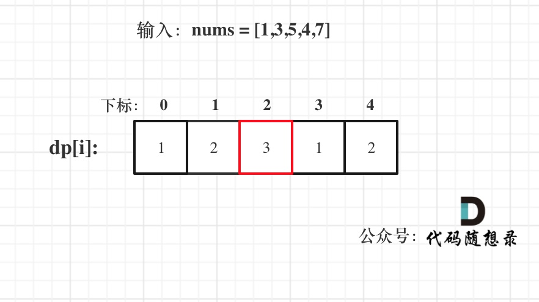

**注意这里要取dp[i]里的最大值，所以dp[2]才是结果！**

以上分析完毕，`C++`代码如下：

```cpp
class Solution {
public:
    int findLengthOfLCIS(vector<int>& nums) {
        if (nums.size() == 0) return 0;
        int result = 1;
        vector<int> dp(nums.size() ,1);
        for (int i = 1; i < nums.size(); i++) {
            if (nums[i] > nums[i - 1]) { // 连续记录
                dp[i] = dp[i - 1] + 1;
            }
            if (dp[i] > result) result = dp[i];
        }
        return result;
    }
};
```

- 时间复杂度：`O(n)`
- 空间复杂度：`O(n)`

### 贪心

这道题目也可以用贪心来做，也就是遇到`nums[i] > nums[i - 1]`的情况，count就`++`，否则count为1，记录count的最大值就可以了。

代码如下：

```cpp
class Solution {
public:
    int findLengthOfLCIS(vector<int>& nums) {
        if (nums.size() == 0) return 0;
        int result = 1; // 连续子序列最少也是1
        int count = 1;
        for (int i = 1; i < nums.size(); i++) {
            if (nums[i] > nums[i - 1]) { // 连续记录
                count++;
            } else { // 不连续，count从头开始
                count = 1;
            }
            if (count > result) result = count;
        }
        return result;
    }
};
```

- 时间复杂度：`O(n)`
- 空间复杂度：`O(1)`

## 总结

本题也是动规里子序列问题的经典题目，但也可以用贪心来做，大家也会发现贪心好像更简单一点，而且空间复杂度仅是`O(1)`。

在动规分析中，关键是要理解和[动态规划：300.最长递增子序列](https://programmercarl.com/0300.%E6%9C%80%E9%95%BF%E4%B8%8A%E5%8D%87%E5%AD%90%E5%BA%8F%E5%88%97.html)的区别。

**要联动起来，才能理解递增子序列怎么求，递增连续子序列又要怎么求**。

概括来说：不连续递增子序列的跟前0-i 个状态有关，连续递增的子序列只跟前一个状态有关

本篇我也把区别所在之处重点介绍了，关键在递推公式和遍历方法上，大家可以仔细体会一波！

# 43. 最长重复子数组

[力扣题目链接](https://leetcode.cn/problems/maximum-length-of-repeated-subarray/)

给两个整数数组 A 和 B ，返回两个数组中公共的、长度最长的子数组的长度。

示例：

输入：

- `A: [1,2,3,2,1]`
- `B: [3,2,1,4,7]`
- 输出：3
- 解释：长度最长的公共子数组是 `[3, 2, 1]` 。

提示：

- `1 <= len(A), len(B) <= 1000`
- `0 <= A[i], B[i] < 100`

## 算法公开课

[**《代码随想录》算法视频公开课**](https://programmercarl.com/other/gongkaike.html)**：动态规划之子序列问题，想清楚DP数组的定义 | LeetCode：718.最长重复子数** **组，相信结合视频再看本篇题解，更有助于大家对本题的理解**。

## 思路

注意题目中说的子数组，其实就是连续子序列。

要求两个数组中最长重复子数组，如果是暴力的解法 只需要先两层for循环确定两个数组起始位置，然后再来一个循环可以是for或者while，来从两个起始位置开始比较，取得重复子数组的长度。 

本题其实是动规解决的经典题目，我们只要想到 用二维数组可以记录两个字符串的所有比较情况，这样就比较好推 递推公式了。 动规五部曲分析如下：

1. 确定dp数组（dp table）以及下标的含义

`dp[i][j]` ：以下标i - 1为结尾的A，和以下标j - 1为结尾的B，最长重复子数组长度为`dp[i][j]`。  （**特别注意**： “以下标i - 1为结尾的A” 标明一定是 以`A[i-1]`为结尾的字符串 ）

此时细心的同学应该发现，那`dp[0][0]`是什么含义呢？总不能是以下标-1为结尾的A数组吧。

其实`dp[i][j]`的定义也就决定着，我们在遍历`dp[i][j]`的时候i 和 j都要从1开始。

那有同学问了，我就定义`dp[i][j]`为 以下标i为结尾的A，和以下标j 为结尾的B，最长重复子数组长度。不行么？

行倒是行！ 但实现起来就麻烦一点，需要单独处理初始化部分，在本题解下面的拓展内容里，我给出了 第二种 dp数组的定义方式所对应的代码和讲解，大家比较一下就了解了。 

2. 确定递推公式

根据`dp[i][j]`的定义，`dp[i][j]`的状态只能由`dp[i - 1][j - 1]`推导出来。

即当`A[i - 1]` 和`B[j - 1]`相等的时候，`dp[i][j] = dp[i - 1][j - 1] + 1;`

根据递推公式可以看出，遍历i 和 j 要从1开始！

3. dp数组如何初始化

根据`dp[i][j]`的定义，`dp[i][0]` 和`dp[0][j]`其实都是没有意义的！

但`dp[i][0]` 和`dp[0][j]`要初始值，因为 为了方便递归公式`dp[i][j] = dp[i - 1][j - 1] + 1;`

所以`dp[i][0]` 和`dp[0][j]`初始化为0。

举个例子`A[0]`如果和`B[0]`相同的话，`dp[1][1] = dp[0][0] + 1`，只有`dp[0][0]`初始为0，正好符合递推公式逐步累加起来。

4. 确定遍历顺序

外层for循环遍历A，内层for循环遍历B。

那又有同学问了，外层for循环遍历B，内层for循环遍历A。不行么？

也行，一样的，我这里就用外层for循环遍历A，内层for循环遍历B了。

同时题目要求长度最长的子数组的长度。所以在遍历的时候顺便把`dp[i][j]`的最大值记录下来。

代码如下：

```cpp
for (int i = 1; i <= nums1.size(); i++) {
    for (int j = 1; j <= nums2.size(); j++) {
        if (nums1[i - 1] == nums2[j - 1]) {
            dp[i][j] = dp[i - 1][j - 1] + 1;
        }
        if (dp[i][j] > result) result = dp[i][j];
    }
}
```

5. 举例推导dp数组

拿示例1中，`A: [1,2,3,2,1]`，`B: [3,2,1,4,7]`为例，画一个dp数组的状态变化，如下：

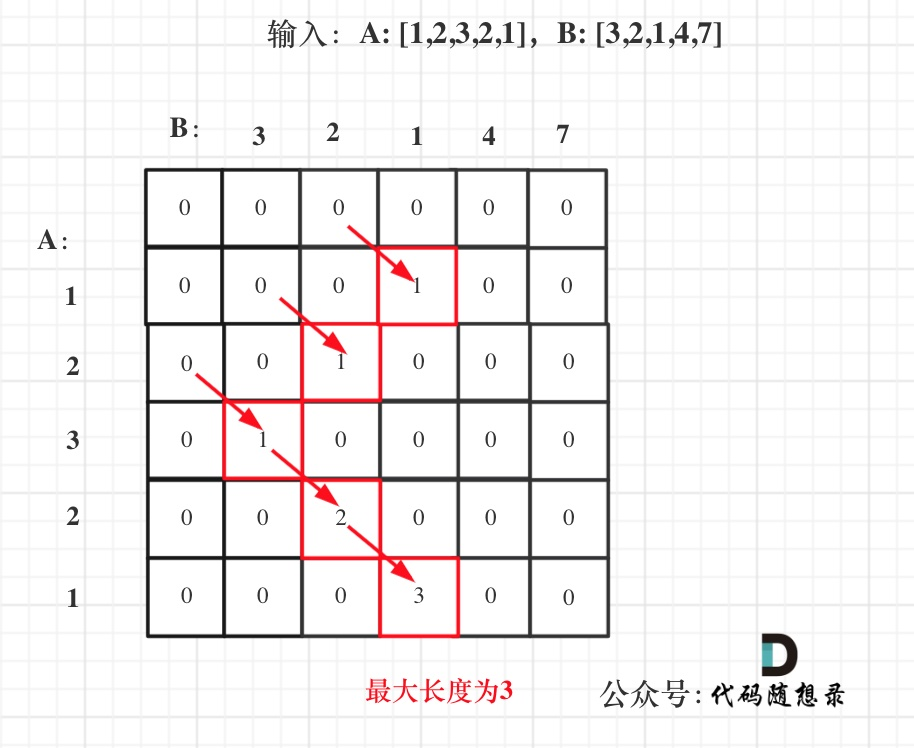

以上五部曲分析完毕，`C++`代码如下：

```cpp
// 版本一
class Solution {
public:
    int findLength(vector<int>& nums1, vector<int>& nums2) {
        vector<vector<int>> dp (nums1.size() + 1, vector<int>(nums2.size() + 1, 0));
        int result = 0;
        for (int i = 1; i <= nums1.size(); i++) {
            for (int j = 1; j <= nums2.size(); j++) {
                if (nums1[i - 1] == nums2[j - 1]) {
                    dp[i][j] = dp[i - 1][j - 1] + 1;
                }
                if (dp[i][j] > result) result = dp[i][j];
            }
        }
        return result;
    }
};
```

- 时间复杂度：`O(n × m)`，n 为A长度，m为B长度
- 空间复杂度：`O(n × m)`

### 滚动数组

在如下图中：


我们可以看出`dp[i][j]`都是由`dp[i - 1][j - 1]`推出。那么压缩为一维数组，也就是`dp[j]`都是由`dp[j - 1]`推出。

也就是相当于可以把上一层`dp[i - 1][j]`拷贝到下一层`dp[i][j]`来继续用。

**此时遍历B数组的时候，就要从后向前遍历，这样避免重复覆盖**。

```cpp
// 版本二
class Solution {
public:
    int findLength(vector<int>& A, vector<int>& B) {
        vector<int> dp(vector<int>(B.size() + 1, 0));
        int result = 0;
        for (int i = 1; i <= A.size(); i++) {
            for (int j = B.size(); j > 0; j--) {
                if (A[i - 1] == B[j - 1]) {
                    dp[j] = dp[j - 1] + 1;
                } else dp[j] = 0; // 注意这里不相等的时候要有赋0的操作
                if (dp[j] > result) result = dp[j];
            }
        }
        return result;
    }
};
```

- 时间复杂度：`$O(n × m)$`，n 为A长度，m为B长度
- 空间复杂度：`$O(m)$`

## 拓展

前面讲了 dp数组为什么定义：以下标i - 1为结尾的A，和以下标j - 1为结尾的B，最长重复子数组长度为`dp[i][j]`。  

我就定义`dp[i][j]`为 以下标i为结尾的A，和以下标j 为结尾的B，最长重复子数组长度。不行么？ 

当然可以，就是实现起来麻烦一些。

如果定义 `dp[i][j]`为 以下标i为结尾的A，和以下标j 为结尾的B，那么 第一行和第一列毕竟要进行初始化，如果`nums1[i]` 与 `nums2[0]` 相同的话，对应的 `dp[i][0]`就要初始为1， 因为此时最长重复子数组为1。 `nums2[j]`  与 `nums1[0]`相同的话，同理。 

所以代码如下： 

```cpp
// 版本三
class Solution {
public:
    int findLength(vector<int>& nums1, vector<int>& nums2) {
        vector<vector<int>> dp (nums1.size() + 1, vector<int>(nums2.size() + 1, 0));
        int result = 0;
        // 要对第一行，第一列经行初始化
        for (int i = 0; i < nums1.size(); i++) if (nums1[i] == nums2[0]) dp[i][0] = 1;
        for (int j = 0; j < nums2.size(); j++) if (nums1[0] == nums2[j]) dp[0][j] = 1;
        for (int i = 0; i < nums1.size(); i++) {
            for (int j = 0; j < nums2.size(); j++) {
                if (nums1[i] == nums2[j] && i > 0 && j > 0) { // 防止 i-1 出现负数
                    dp[i][j] = dp[i - 1][j - 1] + 1;
                }
                if (dp[i][j] > result) result = dp[i][j];
            }
        }
        return result;
    }
};
```

大家会发现 这种写法 一定要多写一段初始化的过程。

```cpp
而且为了让 if (dp[i][j] > result) result = dp[i][j]; 收集到全部结果，两层for训练一定从0开始遍
历，这样需要加上 && i > 0 && j > 0 的判断。
对于基础不牢的小白来说，在推导出转移方程后可能疑惑上述代码为什么要从i=0,j=0 遍历而不是从i=1,j=1 开
始遍历，原因在于这里如果不是从i=0,j=0 位置开始遍历，会漏掉如下样例结果：
nums1 = [70,39,25,40,7]
nums2 = [52,20,67,5,31]
```

当然，如果你愿意也可以使用如下代码，与上面那个`c++`是同一思路：

```cpp
class Solution {
    public int findLength(int[] nums1, int[] nums2) {
        int len1 = nums1.length;
        int len2 = nums2.length;
        int[][] result = new int[len1][len2];
        int maxresult = Integer.MIN_VALUE;
        for(int i=0;i<len1;i++){
            if(nums1[i] == nums2[0])
                result[i][0] = 1;
            if(maxresult<result[i][0])
                    maxresult = result[i][0];
        }
        for(int j=0;j<len2;j++){
            if(nums1[0] == nums2[j])
                result[0][j] = 1;
            if(maxresult<result[0][j])
                maxresult = result[0][j];
        }
        for(int i=1;i<len1;i++){
            for(int j=1;j<len2;j++){
                if(nums1[i]==nums2[j])
                    result[i][j] = result[i-1][j-1]+1;
                if(maxresult<result[i][j])
                    maxresult = result[i][j];
            }
        }
        return maxresult;
    }
}
```

对于小白来说一定要明确dp数组中初始化的数据是什么

整体而言相对于版本一来说还是多写了不少代码。而且逻辑上也复杂了一些。 优势就是dp数组的定义，更直观一点。

# 44.最长公共子序列

[力扣题目链接](https://leetcode.cn/problems/longest-common-subsequence/)

给定两个字符串 text1 和 text2，返回这两个字符串的最长公共子序列的长度。

一个字符串的 子序列 是指这样一个新的字符串：它是由原字符串在不改变字符的相对顺序的情况下删除某些字符（也可以不删除任何字符）后组成的新字符串。

例如，"ace" 是 "abcde" 的子序列，但 "aec" 不是 "abcde" 的子序列。两个字符串的「公共子序列」是这两个字符串所共同拥有的子序列。

若这两个字符串没有公共子序列，则返回 0。

示例 1:

- 输入：`text1 = "abcde", text2 = "ace"`
- 输出：3
- 解释：最长公共子序列是 "ace"，它的长度为 3。

示例 2:

- 输入：`text1 = "abc", text2 = "abc"`
- 输出：3
- 解释：最长公共子序列是 "abc"，它的长度为 3。

示例 3:

- 输入：`text1 = "abc", text2 = "def"`
- 输出：0
- 解释：两个字符串没有公共子序列，返回 0。

提示:

- `1 <= text1.length <= 1000`
- `1 <= text2.length <= 1000`输入的字符串只含有小写英文字符。

## 算法公开课

[**《代码随想录》算法视频公开课**](https://programmercarl.com/other/gongkaike.html)**：**[**动态规划子序列问题经典题目 | LeetCode：1143.最长公共子序列**](https://www.bilibili.com/video/BV1ye4y1L7CQ)**，相信结合视** **频再看本篇题解，更有助于大家对本题的理解**。

## 思路

本题和[动态规划：718. 最长重复子数组](https://programmercarl.com/0718.%E6%9C%80%E9%95%BF%E9%87%8D%E5%A4%8D%E5%AD%90%E6%95%B0%E7%BB%84.html)区别在于这里不要求是连续的了，但要有相对顺序，即："ace" 是 "abcde" 的子序列，但 "aec" 不是 "abcde" 的子序列。

继续动规五部曲分析如下：

1. 确定dp数组（dp table）以及下标的含义

`dp[i][j]`：长度为`[0, i - 1]`的字符串text1与长度为`[0, j - 1]`的字符串text2的最长公共子序列为`dp[i][j]`

有同学会问：为什么要定义长度为`[0, i - 1]`的字符串text1，定义为长度为`[0, i]`的字符串text1不香么？

这样定义是为了后面代码实现方便，如果非要定义为长度为`[0, i]`的字符串text1也可以，我在 动态规划：718. 最长重复子数组 中的「拓展」里 详细讲解了区别所在，其实就是简化了dp数组第一行和第一列的初始化逻辑。

2. 确定递推公式

主要就是两大情况： `text1[i - 1]` 与 `text2[j - 1]`相同，`text1[i - 1]` 与 `text2[j - 1]`不相同

如果`text1[i - 1]` 与 `text2[j - 1]`相同，那么找到了一个公共元素，所以`dp[i][j] = dp[i - 1][j - 1] + 1;`

如果`text1[i - 1]` 与 `text2[j - 1]`不相同，那就看看`text1[0, i - 2]`与`text2[0, j - 1]`的最长公共子序列 和 `text1[0, i - 1]`与`text2[0, j - 2]`的最长公共子序列，取最大的。

即：`dp[i][j] = max(dp[i - 1][j], dp[i][j - 1]);`

代码如下：

```cpp
if (text1[i - 1] == text2[j - 1]) {
    dp[i][j] = dp[i - 1][j - 1] + 1;
} else {
    dp[i][j] = max(dp[i - 1][j], dp[i][j - 1]);
}
```

3. dp数组如何初始化

先看看`dp[i][0]`应该是多少呢？

`test1[0, i-1]`和空串的最长公共子序列自然是0，所以`dp[i][0] = 0;`

同理`dp[0][j]`也是0。

其他下标都是随着递推公式逐步覆盖，初始为多少都可以，那么就统一初始为0。

代码：

```cpp
vector<vector<int>> dp(text1.size() + 1, vector<int>(text2.size() + 1, 0));
```

4. 确定遍历顺序

从递推公式，可以看出，有三个方向可以推出`dp[i][j]`，如图：

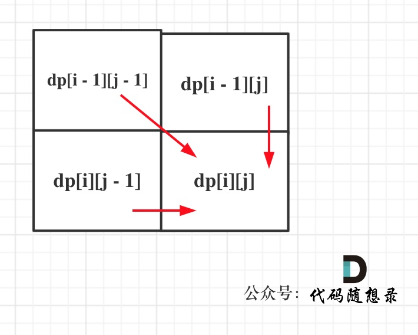

那么为了在递推的过程中，这三个方向都是经过计算的数值，所以要从前向后，从上到下来遍历这个矩阵。

5. 举例推导dp数组

以输入：`text1 = "abcde", text2 = "ace"` 为例，dp状态如图：

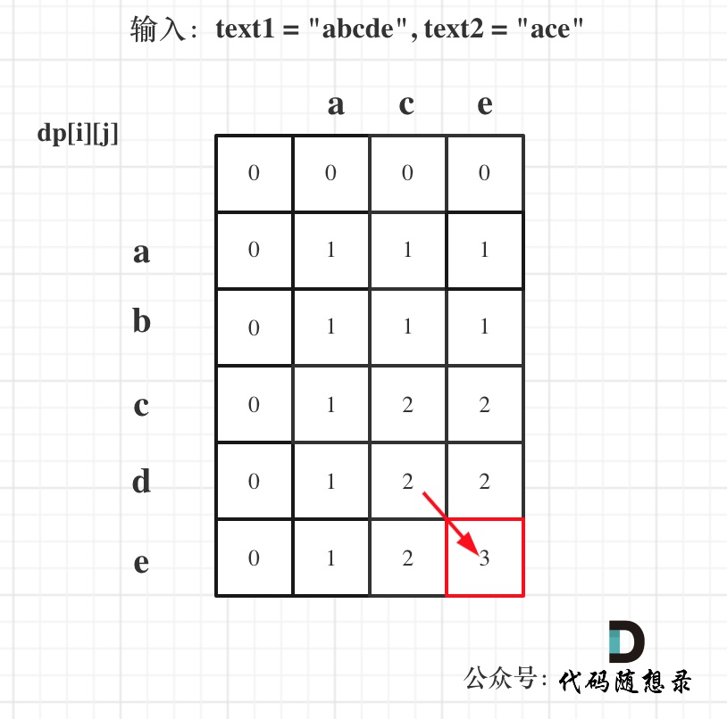

最后红框`dp[text1.size()][text2.size()]`为最终结果

以上分析完毕，`C++`代码如下：

```cpp
class Solution {
public:
    int longestCommonSubsequence(string text1, string text2) {
        vector<vector<int>> dp(text1.size() + 1, vector<int>(text2.size() + 1, 0));
        for (int i = 1; i <= text1.size(); i++) {
            for (int j = 1; j <= text2.size(); j++) {
                if (text1[i - 1] == text2[j - 1]) {
                    dp[i][j] = dp[i - 1][j - 1] + 1;
                } else {
                    dp[i][j] = max(dp[i - 1][j], dp[i][j - 1]);
                }
            }
        }
        return dp[text1.size()][text2.size()];
    }
};
```

- 时间复杂度`: O(n * m)`，其中 n 和 m 分别为 text1 和 text2 的长度
- 空间复杂度`: O(n * m)`

# 45.不相交的线

[力扣题目链接](https://leetcode.cn/problems/uncrossed-lines/)

我们在两条独立的水平线上按给定的顺序写下 A 和 B 中的整数。

现在，我们可以绘制一些连接两个数字 `A[i]` 和 `B[j]` 的直线，只要 `A[i] == B[j]`，且我们绘制的直线不与任何其他连线（非水平线）相交。

以这种方法绘制线条，并返回我们可以绘制的最大连线数。

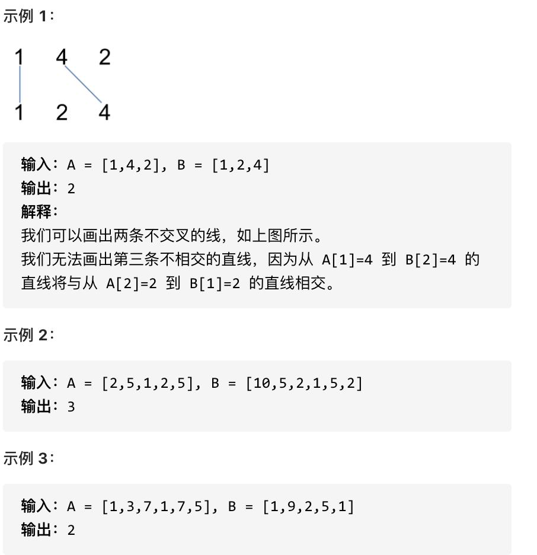

## 算法公开课

[**《代码随想录》算法视频公开课**](https://programmercarl.com/other/gongkaike.html)**：**[**动态规划之子序列问题，换汤不换药 | LeetCode：1035.不相交的线**](https://www.bilibili.com/video/BV1h84y1x7MP)**，相信结合** **视频再看本篇题解，更有助于大家对本题的理解**。

## 思路

相信不少录友看到这道题目都没啥思路，我们来逐步分析一下。

绘制一些连接两个数字 `A[i]` 和 `B[j]` 的直线，只要 `A[i] == B[j]`，且直线不能相交！

直线不能相交，这就是说明在字符串A中 找到一个与字符串B相同的子序列，且这个子序列不能改变相对顺序，只要相对顺序不改变，链接相同数字的直线就不会相交。

拿示例一`A = [1,4,2], B = [1,2,4]`为例，相交情况如图：

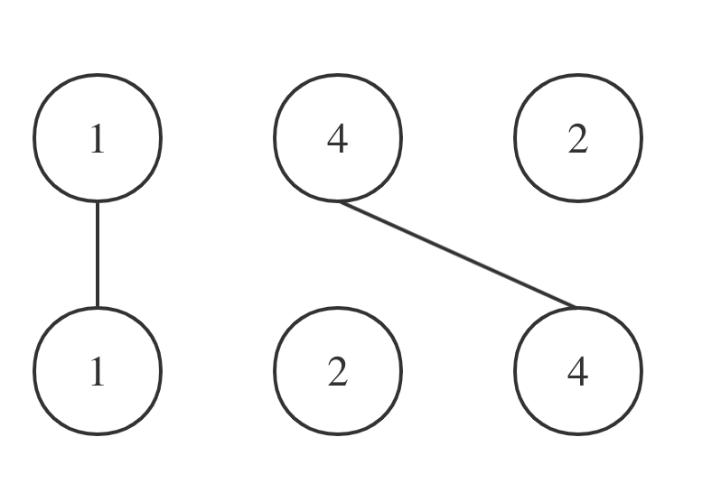

其实也就是说A和B的最长公共子序列是`[1,4]`，长度为2。 这个公共子序列指的是相对顺序不变（即数字4在字符串A中数字1的后面，那么数字4也应该在字符串B数字1的后面）

这么分析完之后，大家可以发现：**本题说是求绘制的最大连线数，其实就是求两个字符串的最长公共子序列的长** **度！**

那么本题就和我们刚刚讲过的这道题目[动态规划：1143.最长公共子序列](https://programmercarl.com/1143.%E6%9C%80%E9%95%BF%E5%85%AC%E5%85%B1%E5%AD%90%E5%BA%8F%E5%88%97.html)就是一样一样的了。

一样到什么程度呢？ 把字符串名字改一下，其他代码都不用改，直接copy过来就行了。

其实本题就是求最长公共子序列的长度，介于我们刚刚讲过[动态规划：1143.最长公共子序列](https://programmercarl.com/1143.%E6%9C%80%E9%95%BF%E5%85%AC%E5%85%B1%E5%AD%90%E5%BA%8F%E5%88%97.html)，所以本题我就不再做动规五部曲分析了。

如果大家有点遗忘了最长公共子序列，就再看一下这篇：[动态规划：1143.最长公共子序列](https://programmercarl.com/1143.%E6%9C%80%E9%95%BF%E5%85%AC%E5%85%B1%E5%AD%90%E5%BA%8F%E5%88%97.html)

本题代码如下：

```cpp
class Solution {
public:
    int maxUncrossedLines(vector<int>& A, vector<int>& B) {
        vector<vector<int>> dp(A.size() + 1, vector<int>(B.size() + 1, 0));
        for (int i = 1; i <= A.size(); i++) {
            for (int j = 1; j <= B.size(); j++) {
                if (A[i - 1] == B[j - 1]) {
                    dp[i][j] = dp[i - 1][j - 1] + 1;
                } else {
                    dp[i][j] = max(dp[i - 1][j], dp[i][j - 1]);
                }
            }
        }
        return dp[A.size()][B.size()];
    }
};
```

- 时间复杂度`: O(n * m)`
- 空间复杂度`: O(n * m)`

## 总结

看到代码大家也可以发现其实就是求两个字符串的最长公共子序列，但如果没有做过[1143.最长公共子序列](https://programmercarl.com/1143.%E6%9C%80%E9%95%BF%E5%85%AC%E5%85%B1%E5%AD%90%E5%BA%8F%E5%88%97.html)，本题其实还有很有难度的。

这是Carl为什么要先讲[1143.最长公共子序列](https://programmercarl.com/1143.%E6%9C%80%E9%95%BF%E5%85%AC%E5%85%B1%E5%AD%90%E5%BA%8F%E5%88%97.html)再讲本题，大家会发现一个正确的刷题顺序对算法学习是非常重要的！

这也是Carl做了很多题目（包括ACM和力扣）才总结出来的规律，大家仔细体会一下哈。

# 46. 最大子序和

[力扣题目链接](https://leetcode.cn/problems/maximum-subarray/)

给定一个整数数组 nums ，找到一个具有最大和的连续子数组（子数组最少包含一个元素），返回其最大和。

示例:

- 输入`: [-2,1,-3,4,-1,2,1,-5,4]`
- 输出: 6
- 解释: 连续子数组 `[4,-1,2,1]` 的和最大，为 6。

## 算法公开课

[**《代码随想录》算法视频公开课**](https://programmercarl.com/other/gongkaike.html)**：**[**看起来复杂，其实是简单动态规划 | LeetCode：53.最大子序和**](https://www.bilibili.com/video/BV19V4y1F7b5)**，相信结合视频** **再看本篇题解，更有助于大家对本题的理解**。

## 思路

这道题之前我们在讲解贪心专题的时候用贪心算法解决过一次，[贪心算法：最大子序和](https://programmercarl.com/0053.%E6%9C%80%E5%A4%A7%E5%AD%90%E5%BA%8F%E5%92%8C.html)。

这次我们用动态规划的思路再来分析一次。

动规五部曲如下：

1. 确定dp数组（dp table）以及下标的含义

**dp[i]：包括下标i（以nums[i]为结尾）的最大连续子序列和为dp[i]**。

2. 确定递推公式

`dp[i]`只有两个方向可以推出来：

- `dp[i - 1] + nums[i]`，即：`nums[i]`加入当前连续子序列和
- `nums[i]`，即：从头开始计算当前连续子序列和

一定是取最大的，所以`dp[i] = max(dp[i - 1] + nums[i], nums[i]);`

3. dp数组如何初始化

从递推公式可以看出来`dp[i]`是依赖于`dp[i - 1]`的状态，`dp[0]`就是递推公式的基础。

`dp[0]`应该是多少呢?

根据`dp[i]`的定义，很明显`dp[0]`应为`nums[0]`即`dp[0] = nums[0]`。

4. 确定遍历顺序

递推公式中`dp[i]`依赖于`dp[i - 1]`的状态，需要从前向后遍历。

5. 举例推导dp数组

以示例一为例，输入：`nums = [-2,1,-3,4,-1,2,1,-5,4]`，对应的dp状态如下：

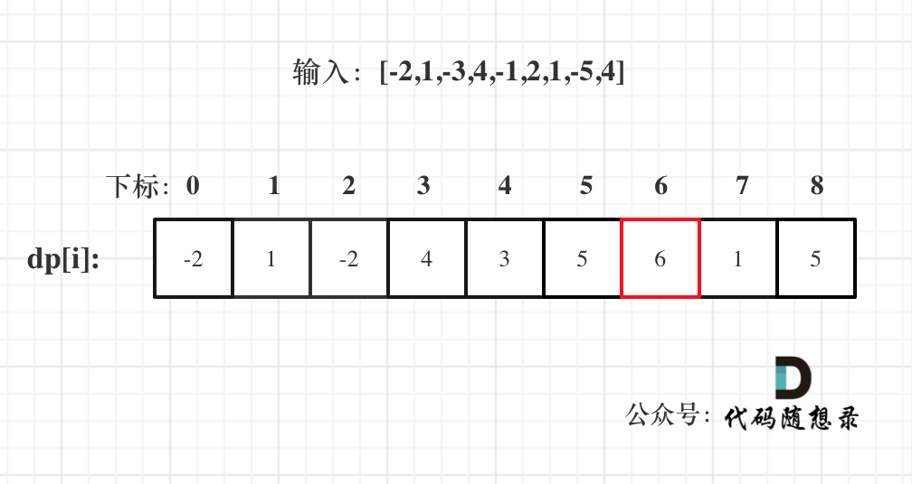

**注意最后的结果可不是dp[nums.size() - 1]！** ，而是`dp[6]`。

在回顾一下`dp[i]`的定义：包括下标i之前的最大连续子序列和为`dp[i]`。

那么我们要找最大的连续子序列，就应该找每一个i为终点的连续最大子序列。

所以在递推公式的时候，可以直接选出最大的`dp[i]`。

以上动规五部曲分析完毕，完整代码如下：

```cpp
class Solution {
public:
    int maxSubArray(vector<int>& nums) {
        if (nums.size() == 0) return 0;
        vector<int> dp(nums.size());
        dp[0] = nums[0];
        int result = dp[0];
        for (int i = 1; i < nums.size(); i++) {
            dp[i] = max(dp[i - 1] + nums[i], nums[i]); // 状态转移公式
            if (dp[i] > result) result = dp[i]; // result 保存dp[i]的最大值
        }
        return result;
    }
};
```

- 时间复杂度：`O(n)`
- 空间复杂度：`O(n)`

## 总结

这道题目用贪心也很巧妙，但有一点绕，需要仔细想一想，如果想回顾一下贪心就看这里吧：贪心算法：最大子序和

动规的解法还是很直接的。

# 47.判断子序列

[力扣题目链接](https://leetcode.cn/problems/is-subsequence/)

给定字符串 s 和 t ，判断 s 是否为 t 的子序列。

字符串的一个子序列是原始字符串删除一些（也可以不删除）字符而不改变剩余字符相对位置形成的新字符串。（例如，"ace"是"abcde"的一个子序列，而"aec"不是）。

示例 1：

- 输入：`s = "abc", t = "ahbgdc"`
- 输出：true

示例 2：

- 输入：`s = "axc", t = "ahbgdc"`
- 输出：false

提示：

- `0 <= s.length <= 100`
- `0 <= t.length <= 10^4`

两个字符串都只由小写字符组成。

## 算法公开课

[**《代码随想录》算法视频公开课**](https://programmercarl.com/other/gongkaike.html)**：**[**动态规划，用相似思路解决复杂问题 | LeetCode：392.判断子序列**](https://www.bilibili.com/video/BV1tv4y1B7ym/)**，相信结合** **视频再看本篇题解，更有助于大家对本题的理解**。

## 思路

（这道题也可以用双指针的思路来实现，时间复杂度也是`O(n)`）

这道题应该算是编辑距离的入门题目，因为从题意中我们也可以发现，只需要计算删除的情况，不用考虑增加和替换的情况。

**所以掌握本题的动态规划解法是对后面要讲解的编辑距离的题目打下基础**。

动态规划五部曲分析如下：

1. 确定dp数组（dp table）以及下标的含义

**dp[i][j] 表示以下标i-1为结尾的字符串s，和以下标j-1为结尾的字符串t，相同子序列的长度为dp[i][j]**。

注意这里是判断s是否为t的子序列。即t的长度是大于等于s的。

有同学问了，为啥要表示下标i-1为结尾的字符串呢，为啥不表示下标i为结尾的字符串呢？

为什么这么定义我在 [718. 最长重复子数组](https://programmercarl.com/0718.%E6%9C%80%E9%95%BF%E9%87%8D%E5%A4%8D%E5%AD%90%E6%95%B0%E7%BB%84.html) 中做了详细的讲解。

其实用i来表示也可以！

但我统一以下标i-1为结尾的字符串来计算，这样在下面的递归公式中会容易理解一些，如果还有疑惑，可以继续往下看。

2. 确定递推公式

在确定递推公式的时候，首先要考虑如下两种操作，整理如下：

- `if (s[i - 1] == t[j - 1])` t中找到了一个字符在s中也出现了
- `if (s[i - 1] != t[j - 1])`相当于t要删除元素，继续匹配

`if (s[i - 1] == t[j - 1])`，那么`dp[i][j] = dp[i - 1][j - 1] + 1;`，因为找到了一个相同的字符，相同子序列长度自然要在`dp[i-1][j-1]`的基础上加1（**如果不理解，在回看一下dp[i][j]的定义**）

`if (s[i - 1] != t[j - 1])`，此时相当于t要删除元素，t如果把当前元素`t[j - 1]`删除，那么`dp[i][j]` 的数值就是 看`s[i - 1]`与 `t[j` `- 2]`的比较结果了，即：`dp[i][j] = dp[i][j - 1];`

其实这里 大家可以发现和 [1143.最长公共子序列](https://programmercarl.com/1143.%E6%9C%80%E9%95%BF%E5%85%AC%E5%85%B1%E5%AD%90%E5%BA%8F%E5%88%97.html) 的递推公式基本那就是一样的，区别就是 本题 如果删元素一定是字符串t，而 1143.最长公共子序列 是两个字符串都可以删元素。

3. dp数组如何初始化

从递推公式可以看出`dp[i][j]`都是依赖于`dp[i - 1][j - 1]` 和 `dp[i][j - 1]`，所以`dp[0][0]`和`dp[i][0]`是一定要初始化的。

这里大家已经可以发现，在定义`dp[i][j]`含义的时候为什么要**表示以下标i-1为结尾的字符串s，和以下标j-1为结尾的** **字符串t，相同子序列的长度为dp[i][j]**。

因为这样的定义在dp二维矩阵中可以留出初始化的区间，如图：

如果要是定义的`dp[i][j]`是以下标i为结尾的字符串s和以下标j为结尾的字符串t，初始化就比较麻烦了。

`dp[i][0]` 表示以下标i-1为结尾的字符串，与空字符串的相同子序列长度，所以为`0. dp[0][j]`同理。 

```cpp
vector<vector<int>> dp(s.size() + 1, vector<int>(t.size() + 1, 0));
```

4. 确定遍历顺序

同理从递推公式可以看出`dp[i][j]`都是依赖于`dp[i - 1][j - 1]` 和 `dp[i][j - 1]`，那么遍历顺序也应该是从上到下，从左到右

如图所示：

5. 举例推导dp数组

以示例一为例，输入：`s = "abc", t = "ahbgdc"`，dp状态转移图如下：

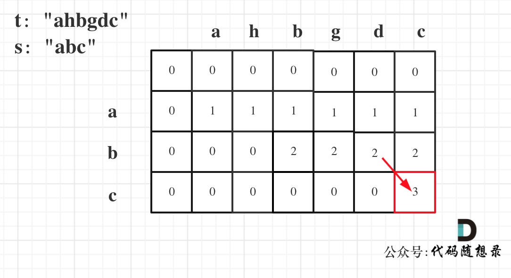

`dp[i][j]`表示以下标i-1为结尾的字符串s和以下标j-1为结尾的字符串t 相同子序列的长度，所以如果`dp[s.size()]` `[t.size()]` 与 字符串s的长度相同说明：s与t的最长相同子序列就是s，那么s 就是 t 的子序列。

图中`dp[s.size()][t.size()] = 3`， 而`s.size()` 也为3。所以s是t 的子序列，返回true。

动规五部曲分析完毕，`C++`代码如下：

```cpp
class Solution {
public:
    bool isSubsequence(string s, string t) {
        vector<vector<int>> dp(s.size() + 1, vector<int>(t.size() + 1, 0));
        for (int i = 1; i <= s.size(); i++) {
            for (int j = 1; j <= t.size(); j++) {
                if (s[i - 1] == t[j - 1]) dp[i][j] = dp[i - 1][j - 1] + 1;
                else dp[i][j] = dp[i][j - 1];
            }
        }
        if (dp[s.size()][t.size()] == s.size()) return true;
        return false;
    }
};
```

- 时间复杂度：`O(n × m)`
- 空间复杂度：`O(n × m)`

## 总结

这道题目算是编辑距离的入门题目（毕竟这里只是涉及到减法），也是动态规划解决的经典题型。 

这一类题都是题目读上去感觉很复杂，模拟一下也发现很复杂，用动规分析完了也感觉很复杂，但是最终代码却很简短。

在之前的题目讲解中，我们讲了 [1143.最长公共子序列](https://programmercarl.com/1143.%E6%9C%80%E9%95%BF%E5%85%AC%E5%85%B1%E5%AD%90%E5%BA%8F%E5%88%97.html)，大家会发现 本题和 1143.最长公共子序列 的相似之处。

编辑距离的题目最能体现出动规精髓和巧妙之处，大家可以好好体会一下。

# 48.不同的子序列

[力扣题目链接](https://leetcode.cn/problems/distinct-subsequences/)

给定一个字符串 s 和一个字符串 t ，计算在 s 的子序列中 t 出现的个数。

字符串的一个 子序列 是指，通过删除一些（也可以不删除）字符且不干扰剩余字符相对位置所组成的新字符串。（例如，"ACE" 是 "ABCDE" 的一个子序列，而 "AEC" 不是）

题目数据保证答案符合 32 位带符号整数范围。

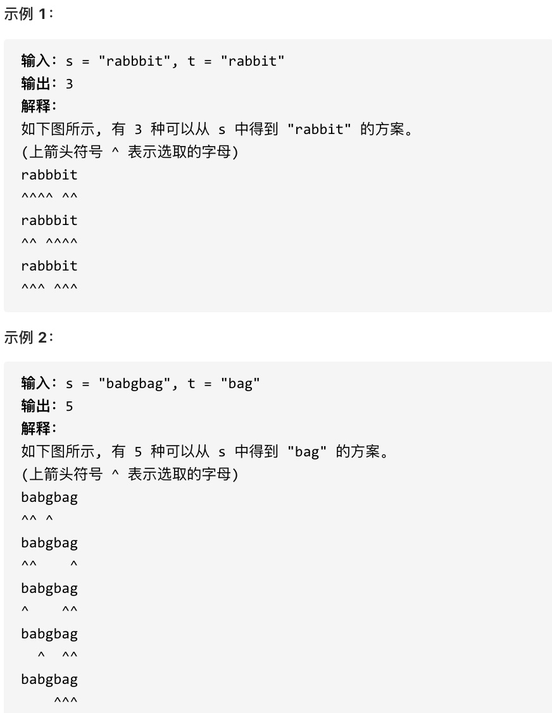

提示：

- `0 <= s.length, t.length <= 1000`
- s 和 t 由英文字母组成

## 思路

这道题目如果不是子序列，而是要求连续序列的，那就可以考虑用KMP。

这道题目相对于72. 编辑距离，简单了不少，因为本题相当于只有删除操作，不用考虑替换增加之类的。

但相对于刚讲过的[动态规划：392.判断子序列](https://programmercarl.com/0392.%E5%88%A4%E6%96%AD%E5%AD%90%E5%BA%8F%E5%88%97.html)就有难度了，这道题目双指针法可就做不了了，来看看动规五部曲分析如下：

1. 确定dp数组（dp table）以及下标的含义

`dp[i][j]`：以i-1为结尾的s子序列中出现以j-1为结尾的t的个数为`dp[i][j]`。

为什么i-1，j-1 这么定义我在 [718. 最长重复子数组](https://programmercarl.com/0718.%E6%9C%80%E9%95%BF%E9%87%8D%E5%A4%8D%E5%AD%90%E6%95%B0%E7%BB%84.html) 中做了详细的讲解。

2. 确定递推公式

这一类问题，基本是要分析两种情况

- `s[i - 1]` 与 `t[j - 1]`相等
- `s[i - 1]` 与 `t[j - 1]` 不相等

当`s[i - 1]` 与 `t[j - 1]`相等时，`dp[i][j]`可以有两部分组成。

一部分是用`s[i - 1]`来匹配，那么个数为`dp[i - 1][j - 1]`。即不需要考虑当前s子串和t子串的最后一位字母，所以只需要 `dp[i-1][j-1]`。

一部分是不用`s[i - 1]`来匹配，个数为`dp[i - 1][j]`。

**这里可能有录友不明白了，为什么还要考虑 不用s[i - 1]来匹配，都相同了指定要匹配啊**。

例如： s：bagg 和 t：bag ，`s[3]` 和 `t[2]`是相同的，但是字符串s也可以不用`s[3]`来匹配，即用`s[0]s[1]s[2]`组成的bag。

当然也可以用`s[3]`来匹配，即：`s[0]s[1]s[3]`组成的bag。

所以当`s[i - 1]` 与 `t[j - 1]`相等时，`dp[i][j] = dp[i - 1][j - 1] + dp[i - 1][j];`

当`s[i - 1]` 与 `t[j - 1]`不相等时，`dp[i][j]`只有一部分组成，不用`s[i - 1]`来匹配（就是模拟在s中删除这个元素），即：`dp[i - 1][j]`

所以递推公式为：`dp[i][j] = dp[i - 1][j];`

这里可能有录友还疑惑，为什么只考虑 “不用`s[i - 1]`来匹配” 这种情况， 不考虑 “不用`t[j - 1]`来匹配” 的情况呢。 

这里大家要明确，我们求的是 s 中有多少个 t，而不是 求t中有多少个s，所以只考虑 s中删除元素的情况，即 不用`s[i - 1]`来匹配 的情况。

3. dp数组如何初始化

从递推公式`dp[i][j] = dp[i - 1][j - 1] + dp[i - 1][j];` 和 `dp[i][j] = dp[i - 1][j];` 中可以看出`dp[i][j]` 是从上方和左上方推导而来，如图：，那么 `dp[i][0]` 和`dp[0][j]`是一定要初始化的。

每次当初始化的时候，都要回顾一下`dp[i][j]`的定义，不要凭感觉初始化。

`dp[i][0]`表示什么呢？

`dp[i][0]` 表示：以i-1为结尾的s可以随便删除元素，出现空字符串的个数。

那么`dp[i][0]`一定都是1，因为也就是把以i-1为结尾的s，删除所有元素，出现空字符串的个数就是1。

再来看`dp[0][j]`，`dp[0][j]`：空字符串s可以随便删除元素，出现以j-1为结尾的字符串t的个数。

那么`dp[0][j]`一定都是0，s如论如何也变成不了t。

最后就要看一个特殊位置了，即：`dp[0][0]` 应该是多少。

`dp[0][0]`应该是1，空字符串s，可以删除0个元素，变成空字符串t。

初始化分析完毕，代码如下：

```cpp
vector<vector<long long>> dp(s.size() + 1, vector<long long>(t.size() + 1));
for (int i = 0; i <= s.size(); i++) dp[i][0] = 1;
for (int j = 1; j <= t.size(); j++) dp[0][j] = 0; // 其实这行代码可以和dp数组初始化的时候放在
一起，但我为了凸显初始化的逻辑，所以还是加上了。
```

4. 确定遍历顺序

从递推公式`dp[i][j] = dp[i - 1][j - 1] + dp[i - 1][j];` 和 `dp[i][j] = dp[i - 1][j];` 中可以看出`dp[i][j]`都是根据左上方和正上方推出来的。

所以遍历的时候一定是从上到下，从左到右，这样保证`dp[i][j]`可以根据之前计算出来的数值进行计算。

代码如下：

```cpp
for (int i = 1; i <= s.size(); i++) {
    for (int j = 1; j <= t.size(); j++) {
        if (s[i - 1] == t[j - 1]) {
            dp[i][j] = dp[i - 1][j - 1] + dp[i - 1][j];
        } else {
            dp[i][j] = dp[i - 1][j];
        }
    }
}
```

5. 举例推导dp数组

以s："baegg"，t："bag"为例，推导dp数组状态如下：

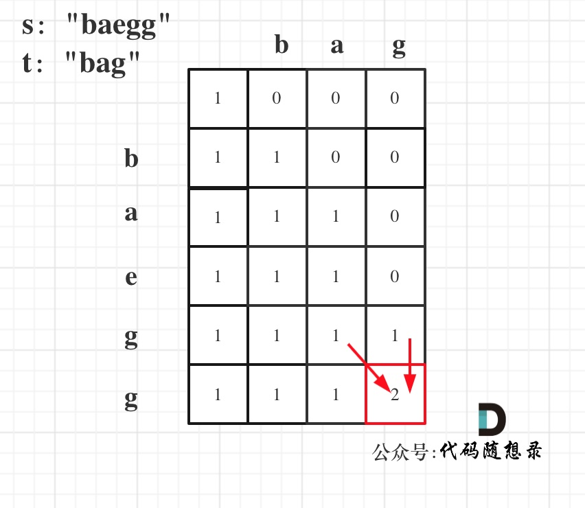

如果写出来的代码怎么改都通过不了，不妨把dp数组打印出来，看一看，是不是这样的。

动规五部曲分析完毕，代码如下：

```cpp
class Solution {
public:
    int numDistinct(string s, string t) {
        vector<vector<uint64_t>> dp(s.size() + 1, vector<uint64_t>(t.size() + 1));
        for (int i = 0; i < s.size(); i++) dp[i][0] = 1;
        for (int j = 1; j < t.size(); j++) dp[0][j] = 0;
        for (int i = 1; i <= s.size(); i++) {
            for (int j = 1; j <= t.size(); j++) {
                if (s[i - 1] == t[j - 1]) {
                    dp[i][j] = dp[i - 1][j - 1] + dp[i - 1][j];
                } else {
                    dp[i][j] = dp[i - 1][j];
                }
            }
        }
        return dp[s.size()][t.size()];
    }
};
```

- 时间复杂度`: O(n * m)`
- 空间复杂度`: O(n * m)`

# 49. 两个字符串的删除操作

[力扣题目链接](https://leetcode.cn/problems/delete-operation-for-two-strings/)

给定两个单词 word1 和 word2，找到使得 word1 和 word2 相同所需的最小步数，每步可以删除任意一个字符串中的一个字符。 

示例： 

- 输入: "sea", "eat" 
- 输出: 2
- 解释: 第一步将"sea"变为"ea"，第二步将"eat"变为"ea"

## 算法公开课

[**《代码随想录》算法视频公开课**](https://programmercarl.com/other/gongkaike.html)**：**[**LeetCode：583.两个字符串的删除操**](https://www.bilibili.com/video/BV1we4y157wB/)**，相信结合视频再看本篇题解，更有助于** **大家对本题的理解**。

## 思路

### 动态规划一

本题和[动态规划：115.不同的子序列](https://programmercarl.com/0115.%E4%B8%8D%E5%90%8C%E7%9A%84%E5%AD%90%E5%BA%8F%E5%88%97.html)相比，其实就是两个字符串都可以删除了，情况虽说复杂一些，但整体思路是不变的。

这次是两个字符串可以相互删了，这种题目也知道用动态规划的思路来解，动规五部曲，分析如下：

1. 确定dp数组（dp table）以及下标的含义

`dp[i][j]`：以i-1为结尾的字符串word1，和以j-1位结尾的字符串word2，想要达到相等，所需要删除元素的最少次数。 

这里dp数组的定义有点点绕，大家要撸清思路。

2. 确定递推公式

- 当`word1[i - 1]` 与 `word2[j - 1]`相同的时候 
- 当`word1[i - 1]` 与 `word2[j - 1]`不相同的时候 

当`word1[i - 1]` 与 `word2[j - 1]`相同的时候，`dp[i][j] = dp[i - 1][j - 1];` 

当`word1[i - 1]` 与 `word2[j - 1]`不相同的时候，有三种情况：

情况一：删`word1[i - 1]`，最少操作次数为`dp[i - 1][j] + 1` 情况二：删`word2[j - 1]`，最少操作次数为`dp[i][j - 1] + 1` 情况三：同时删`word1[i - 1]`和`word2[j - 1]`，操作的最少次数为`dp[i - 1][j - 1] + 2` 那最后当然是取最小值，所以当`word1[i - 1]` 与 `word2[j - 1]`不相同的时候，递推公式：`dp[i][j] = min({dp[i - 1][j -` 

`1] + 2, dp[i - 1][j] + 1, dp[i][j - 1] + 1});`

因为 `dp[i][j - 1]  + 1 = dp[i - 1][j - 1] + 2`，所以递推公式可简化为：`dp[i][j] = min(dp[i - 1][j] + 1, dp[i][j - 1] + 1);`

这里可能不少录友有点迷糊，从字面上理解 就是 当 同时删`word1[i - 1]`和`word2[j - 1]`，`dp[i][j-1]` 本来就不考虑 `word2[j - 1]`了，那么我在删 `word1[i - 1]`，是不是就达到两个元素都删除的效果，即 `dp[i][j-1] + 1`。

3. dp数组如何初始化

从递推公式中，可以看出来，`dp[i][0]` 和 `dp[0][j]`是一定要初始化的。

`dp[i][0]`：word2为空字符串，以i-1为结尾的字符串word1要删除多少个元素，才能和word2相同呢，很明显`dp[i]` `[0] = i`。

`dp[0][j]`的话同理，所以代码如下：

```cpp
vector<vector<int>> dp(word1.size() + 1, vector<int>(word2.size() + 1));
for (int i = 0; i <= word1.size(); i++) dp[i][0] = i;
for (int j = 0; j <= word2.size(); j++) dp[0][j] = j;
```

4. 确定遍历顺序

从递推公式 `dp[i][j] = min(dp[i - 1][j - 1] + 2, min(dp[i - 1][j], dp[i][j - 1]) + 1);` 和`dp[i][j] = dp[i - 1][j - 1]`可以看出`dp[i][j]`都是根据左上方、正上方、正左方推出来的。

所以遍历的时候一定是从上到下，从左到右，这样保证`dp[i][j]`可以根据之前计算出来的数值进行计算。

5. 举例推导dp数组

以word1:"sea"，word2:"eat"为例，推导dp数组状态图如下：

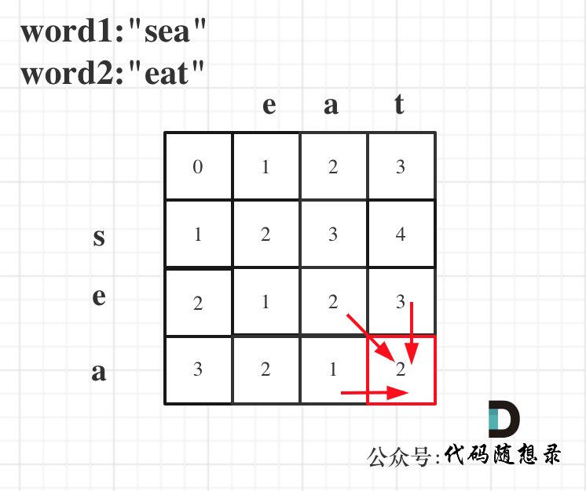

以上分析完毕，代码如下：

```cpp
class Solution {
public:
    int minDistance(string word1, string word2) {
        vector<vector<int>> dp(word1.size() + 1, vector<int>(word2.size() + 1));
        for (int i = 0; i <= word1.size(); i++) dp[i][0] = i;
        for (int j = 0; j <= word2.size(); j++) dp[0][j] = j;
        for (int i = 1; i <= word1.size(); i++) {
            for (int j = 1; j <= word2.size(); j++) {
                if (word1[i - 1] == word2[j - 1]) {
                    dp[i][j] = dp[i - 1][j - 1];
                } else {
                    dp[i][j] = min(dp[i - 1][j] + 1, dp[i][j - 1] + 1);
                }
            }
        }
        return dp[word1.size()][word2.size()];
    }
};
```

- 时间复杂度`: O(n * m)`
- 空间复杂度`: O(n * m)`

### 动态规划二

本题和[动态规划：1143.最长公共子序列](https://programmercarl.com/1143.%E6%9C%80%E9%95%BF%E5%85%AC%E5%85%B1%E5%AD%90%E5%BA%8F%E5%88%97.html)基本相同，只要求出两个字符串的最长公共子序列长度即可，那么除了最长公共子序列之外的字符都是必须删除的，最后用两个字符串的总长度减去两个最长公共子序列的长度就是删除的最少步数。

代码如下：

```cpp
class Solution {
public:
    int minDistance(string word1, string word2) {
        vector<vector<int>> dp(word1.size()+1, vector<int>(word2.size()+1, 0));
        for (int i=1; i<=word1.size(); i++){
            for (int j=1; j<=word2.size(); j++){
                if (word1[i-1] == word2[j-1]) dp[i][j] = dp[i-1][j-1] + 1;
                else dp[i][j] = max(dp[i-1][j], dp[i][j-1]);
            }
        }
        return word1.size()+word2.size()-dp[word1.size()][word2.size()]*2;
    }
};
```

- 时间复杂度`: O(n * m)`
- 空间复杂度`: O(n * m)`

# 50. 编辑距离

[力扣题目链接](https://leetcode.cn/problems/edit-distance/)

给你两个单词 word1 和 word2，请你计算出将 word1 转换成 word2 所使用的最少操作数 。

你可以对一个单词进行如下三种操作：

- 插入一个字符
- 删除一个字符
- 替换一个字符
- 示例 1：
- 输入：`word1 = "horse", word2 = "ros"`
- 输出：3

- 解释：`horse -> rorse (`将 'h' 替换为 `'r')` `rorse -> rose (`删除 `'r')` `rose -> ros (`删除 `'e')`
- 示例 2：
- 输入：`word1 = "intention", word2 = "execution"`
- 输出：5
- 解释：`intention -> inention (`删除 `'t')` `inention -> enention (`将 'i' 替换为 `'e')` `enention -> exention (`将 'n' 替换为 `'x')` `exention -> exection (`将 'n' 替换为 `'c')` `exection -> execution (`插入 `'u')`

提示：

- `0 <= word1.length, word2.length <= 500`
- word1 和 word2 由小写英文字母组成

## 算法公开课

[**《代码随想录》算法视频公开课**](https://programmercarl.com/other/gongkaike.html)**：**[**动态规划终极绝杀！ LeetCode：72.编辑距离**](https://www.bilibili.com/video/BV1we4y157wB/)**，相信结合视频再看本篇题解，** **更有助于大家对本题的理解**。

## 思路

编辑距离终于来了，这道题目如果大家没有了解动态规划的话，会感觉超级复杂。

编辑距离是用动规来解决的经典题目，这道题目看上去好像很复杂，但用动规可以很巧妙的算出最少编辑距离。

接下来我依然使用动规五部曲，对本题做一个详细的分析：

### 1. 确定dp数组（dp table）以及下标的含义

**dp[i][j] 表示以下标i-1为结尾的字符串word1，和以下标j-1为结尾的字符串word2，最近编辑距离为dp[i][j]**。

有同学问了，为啥要表示下标i-1为结尾的字符串呢，为啥不表示下标i为结尾的字符串呢？

为什么这么定义我在 [718. 最长重复子数组](https://programmercarl.com/0718.%E6%9C%80%E9%95%BF%E9%87%8D%E5%A4%8D%E5%AD%90%E6%95%B0%E7%BB%84.html) 中做了详细的讲解。

其实用i来表示也可以！ 用i-1就是为了方便后面dp数组初始化的。

### 2. 确定递推公式

在确定递推公式的时候，首先要考虑清楚编辑的几种操作，整理如下：

```text
if (word1[i - 1] == word2[j - 1])
    不操作
if (word1[i - 1] != word2[j - 1])
    增
    删
    换
```

也就是如上4种情况。

```cpp
if (word1[i - 1] == word2[j - 1]) 那么说明不用任何编辑，dp[i][j] 就应该是 dp[i - 1][j - 1] ，
即dp[i][j] = dp[i - 1][j - 1];
此时可能有同学有点不明白，为啥要即dp[i][j] = dp[i - 1][j - 1] 呢？
那么就在回顾上面讲过的dp[i][j] 的定义，word1[i - 1] 与 word2[j - 1] 相等了，那么就不用编辑了，以
下标i-2为结尾的字符串word1和以下标j-2为结尾的字符串word2 的最近编辑距离dp[i - 1][j - 1] 就是 dp[i]
[j] 了。
在下面的讲解中，如果哪里看不懂，就回想一下dp[i][j] 的定义，就明白了。
在整个动规的过程中，最为关键就是正确理解dp[i][j] 的定义！
if (word1[i - 1] != word2[j - 1]) ，此时就需要编辑了，如何编辑呢？
```

- 操作一：word1删除一个元素，那么就是以下标i - 2为结尾的word1 与 j-1为结尾的word2的最近编辑距离 再加上一个操作。

```cpp
即 dp[i][j] = dp[i - 1][j] + 1;
```

- 操作二：word2删除一个元素，那么就是以下标i - 1为结尾的word1 与 j-2为结尾的word2的最近编辑距离 再加上一个操作。

```cpp
即 dp[i][j] = dp[i][j - 1] + 1;
```

这里有同学发现了，怎么都是删除元素，添加元素去哪了。

```text
word2添加一个元素，相当于word1删除一个元素，例如 word1 = "ad" ，word2 = "a" ，word1 删除元
素'd' 和 word2 添加一个元素'd' ，变成word1="a", word2="ad" ， 最终的操作数是一样！ dp数组如下图所
```

示意的：

```text
            a                         a     d
   +-----+-----+             +-----+-----+-----+
   |  0  |  1  |             |  0  |  1  |  2  |
   +-----+-----+   ===>      +-----+-----+-----+
 a |  1  |  0  |           a |  1  |  0  |  1  |
   +-----+-----+             +-----+-----+-----+
 d |  2  |  1  |
   +-----+-----+
操作三：替换元素，word1 替换word1[i - 1] ，使其与word2[j - 1] 相同，此时不用增删加元素。
可以回顾一下，if (word1[i - 1] == word2[j - 1]) 的时候我们的操作 是 dp[i][j] = dp[i - 1][j -
1] 对吧。
```

那么只需要一次替换的操作，就可以让 `word1[i - 1]` 和 `word2[j - 1]` 相同。

```cpp
所以 dp[i][j] = dp[i - 1][j - 1] + 1;
综上，当 if (word1[i - 1] != word2[j - 1]) 时取最小的，即：dp[i][j] = min({dp[i - 1][j - 1],
dp[i - 1][j], dp[i][j - 1]}) + 1;
```

递归公式代码如下：

```cpp
if (word1[i - 1] == word2[j - 1]) {
    dp[i][j] = dp[i - 1][j - 1];
}
else {
    dp[i][j] = min({dp[i - 1][j - 1], dp[i - 1][j], dp[i][j - 1]}) + 1;
}
```

### 3. dp数组如何初始化

再回顾一下`dp[i][j]`的定义：

**dp[i][j] 表示以下标i-1为结尾的字符串word1，和以下标j-1为结尾的字符串word2，最近编辑距离为dp[i][j]**。

那么`dp[i][0]` 和 `dp[0][j]` 表示什么呢？

`dp[i][0]` ：以下标i-1为结尾的字符串word1，和空字符串word2，最近编辑距离为`dp[i][0]`。

那么`dp[i][0]`就应该是i，对word1里的元素全部做删除操作，即：`dp[i][0] = i;`

同理`dp[0][j] = j;`

所以`C++`代码如下：

```cpp
for (int i = 0; i <= word1.size(); i++) dp[i][0] = i;
for (int j = 0; j <= word2.size(); j++) dp[0][j] = j;
```

### 4. 确定遍历顺序

从如下四个递推公式：

```text
dp[i][j] = dp[i - 1][j - 1]
dp[i][j] = dp[i - 1][j - 1] + 1
dp[i][j] = dp[i][j - 1] + 1
dp[i][j] = dp[i - 1][j] + 1
```

可以看出`dp[i][j]`是依赖左方，上方和左上方元素的，如图：

所以在dp矩阵中一定是从左到右从上到下去遍历。

代码如下：

```cpp
for (int i = 1; i <= word1.size(); i++) {
    for (int j = 1; j <= word2.size(); j++) {
        if (word1[i - 1] == word2[j - 1]) {
            dp[i][j] = dp[i - 1][j - 1];
        }
        else {
            dp[i][j] = min({dp[i - 1][j - 1], dp[i - 1][j], dp[i][j - 1]}) + 1;
        }
    }
}
```

### 5. 举例推导dp数组

```text
以示例1为例，输入：word1 = "horse", word2 = "ros" 为例，dp矩阵状态图如下：
```

以上动规五部分析完毕，`C++`代码如下：

```cpp
class Solution {
public:
    int minDistance(string word1, string word2) {
        vector<vector<int>> dp(word1.size() + 1, vector<int>(word2.size() + 1, 0));
        for (int i = 0; i <= word1.size(); i++) dp[i][0] = i;
        for (int j = 0; j <= word2.size(); j++) dp[0][j] = j;
        for (int i = 1; i <= word1.size(); i++) {
            for (int j = 1; j <= word2.size(); j++) {
                if (word1[i - 1] == word2[j - 1]) {
                    dp[i][j] = dp[i - 1][j - 1];
                }
                else {
                    dp[i][j] = min({dp[i - 1][j - 1], dp[i - 1][j], dp[i][j - 1]}) + 1;
                }
            }
        }
        return dp[word1.size()][word2.size()];
    }
};
```

- 时间复杂度`: O(n * m)`
- 空间复杂度`: O(n * m)`

# 51. 动态规划之编辑距离总结篇

本周我们讲了动态规划之终极绝杀：编辑距离，为什么叫做终极绝杀呢？

细心的录友应该知道，我们在前三篇动态规划的文章就一直为 编辑距离 这道题目做铺垫。

## 判断子序列

[动态规划：392.判断子序列](https://programmercarl.com/0392.%E5%88%A4%E6%96%AD%E5%AD%90%E5%BA%8F%E5%88%97.html) 给定字符串 s 和 t ，判断 s 是否为 t 的子序列。

这道题目 其实是可以用双指针或者贪心的的，但是我在开篇的时候就说了这是编辑距离的入门题目，因为从题意中我们也可以发现，只需要计算删除的情况，不用考虑增加和替换的情况。

- `if (s[i - 1] == t[j - 1])` t中找到了一个字符在s中也出现了
- `if (s[i - 1] != t[j - 1])`相当于t要删除元素，继续匹配

状态转移方程：

```cpp
if (s[i - 1] == t[j - 1]) dp[i][j] = dp[i - 1][j - 1] + 1;
else dp[i][j] = dp[i][j - 1];
```

## 不同的子序列

[动态规划：115.不同的子序列](https://programmercarl.com/0115.%E4%B8%8D%E5%90%8C%E7%9A%84%E5%AD%90%E5%BA%8F%E5%88%97.html) 给定一个字符串 s 和一个字符串 t ，计算在 s 的子序列中 t 出现的个数。

本题虽然也只有删除操作，不用考虑替换增加之类的，但相对于[动态规划：392.判断子序列](https://programmercarl.com/0392.%E5%88%A4%E6%96%AD%E5%AD%90%E5%BA%8F%E5%88%97.html)就有难度了，这道题目双指针法可就做不了。

当`s[i - 1]` 与 `t[j - 1]`相等时，`dp[i][j]`可以有两部分组成。

一部分是用`s[i - 1]`来匹配，那么个数为`dp[i - 1][j - 1]`。

一部分是不用`s[i - 1]`来匹配，个数为`dp[i - 1][j]`。

这里可能有同学不明白了，为什么还要考虑 不用`s[i - 1]`来匹配，都相同了指定要匹配啊。

例如： s：bagg 和 t：bag ，`s[3]` 和 `t[2]`是相同的，但是字符串s也可以不用`s[3]`来匹配，即用`s[0]s[1]s[2]`组成的bag。

当然也可以用`s[3]`来匹配，即：`s[0]s[1]s[3]`组成的bag。

所以当`s[i - 1]` 与 `t[j - 1]`相等时，`dp[i][j] = dp[i - 1][j - 1] + dp[i - 1][j];`

当`s[i - 1]` 与 `t[j - 1]`不相等时，`dp[i][j]`只有一部分组成，不用`s[i - 1]`来匹配，即：`dp[i - 1][j]`

所以递推公式为：`dp[i][j] = dp[i - 1][j];`

状态转移方程：

```cpp
if (s[i - 1] == t[j - 1]) {
    dp[i][j] = dp[i - 1][j - 1] + dp[i - 1][j];
} else {
    dp[i][j] = dp[i - 1][j];
}
```

## 两个字符串的删除操作

[动态规划：583.两个字符串的删除操作](https://programmercarl.com/0583.%E4%B8%A4%E4%B8%AA%E5%AD%97%E7%AC%A6%E4%B8%B2%E7%9A%84%E5%88%A0%E9%99%A4%E6%93%8D%E4%BD%9C.html)给定两个单词 word1 和 word2，找到使得 word1 和 word2 相同所需的最小步数，每步可以删除任意一个字符串中的一个字符。

本题和[动态规划：115.不同的子序列](https://programmercarl.com/0115.%E4%B8%8D%E5%90%8C%E7%9A%84%E5%AD%90%E5%BA%8F%E5%88%97.html)相比，其实就是两个字符串可以都可以删除了，情况虽说复杂一些，但整体思路是不变的。

- 当`word1[i - 1]` 与 `word2[j - 1]`相同的时候
- 当`word1[i - 1]` 与 `word2[j - 1]`不相同的时候

当`word1[i - 1]` 与 `word2[j - 1]`相同的时候，`dp[i][j] = dp[i - 1][j - 1];`

当`word1[i - 1]` 与 `word2[j - 1]`不相同的时候，有三种情况：

情况一：删`word1[i - 1]`，最少操作次数为`dp[i - 1][j] + 1`

情况二：删`word2[j - 1]`，最少操作次数为`dp[i][j - 1] + 1`

情况三：同时删`word1[i - 1]`和`word2[j - 1]`，操作的最少次数为`dp[i - 1][j - 1] + 2`

那最后当然是取最小值，所以当`word1[i - 1]` 与 `word2[j - 1]`不相同的时候，递推公式：`dp[i][j] = min({dp[i - 1][j -` `1] + 2, dp[i - 1][j] + 1, dp[i][j - 1] + 1});`

状态转移方程：

```cpp
if (word1[i - 1] == word2[j - 1]) {
    dp[i][j] = dp[i - 1][j - 1];
} else {
    dp[i][j] = min({dp[i - 1][j - 1] + 2, dp[i - 1][j] + 1, dp[i][j - 1] + 1});
}
```

## 编辑距离

[动态规划：72.编辑距离](https://programmercarl.com/0072.%E7%BC%96%E8%BE%91%E8%B7%9D%E7%A6%BB.html) 给你两个单词 word1 和 word2，请你计算出将 word1 转换成 word2 所使用的最少操作数 。

编辑距离终于来了，**有了前面三道题目的铺垫，应该有思路了**，本题是两个字符串可以增删改，比 动态规划：判断子序列，[动态规划：不同的子序列](https://programmercarl.com/0115.%E4%B8%8D%E5%90%8C%E7%9A%84%E5%AD%90%E5%BA%8F%E5%88%97.html)，[动态规划：两个字符串的删除操作](https://programmercarl.com/0583.%E4%B8%A4%E4%B8%AA%E5%AD%97%E7%AC%A6%E4%B8%B2%E7%9A%84%E5%88%A0%E9%99%A4%E6%93%8D%E4%BD%9C.html)都要复杂的多。

在确定递推公式的时候，首先要考虑清楚编辑的几种操作，整理如下：

- `if (word1[i - 1] == word2[j - 1])`

不操作

- `if (word1[i - 1] != word2[j - 1])`

增

删

换

也就是如上四种情况。

`if (word1[i - 1] == word2[j - 1])` 那么说明不用任何编辑，`dp[i][j]` 就应该是 `dp[i - 1][j - 1]`，即`dp[i][j] = dp[i - 1][j -` `1];`此时可能有同学有点不明白，为啥要即`dp[i][j] = dp[i - 1][j - 1]`呢？

那么就在回顾上面讲过的`dp[i][j]`的定义，`word1[i - 1]` 与 `word2[j - 1]`相等了，那么就不用编辑了，以下标i-2为结尾的字符串word1和以下标j-2为结尾的字符串word2的最近编辑距离`dp[i - 1][j - 1]` 就是 `dp[i][j]`了。

在下面的讲解中，如果哪里看不懂，就回想一下`dp[i][j]`的定义，就明白了。

**在整个动规的过程中，最为关键就是正确理解dp[i][j]的定义！**

`if (word1[i - 1] != word2[j - 1])`，此时就需要编辑了，如何编辑呢？

操作一：word1增加一个元素，使其`word1[i - 1]`与`word2[j - 1]`相同，那么就是以下标i-2为结尾的word1 与 i-1为结尾的word2的最近编辑距离 加上一个增加元素的操作。

即 `dp[i][j] = dp[i - 1][j] + 1;`

操作二：word2添加一个元素，使其`word1[i - 1]`与`word2[j - 1]`相同，那么就是以下标i-1为结尾的word1 与 j-2为结尾的word2的最近编辑距离 加上一个增加元素的操作。

即 `dp[i][j] = dp[i][j - 1] + 1;`

这里有同学发现了，怎么都是添加元素，删除元素去哪了。

**word2添加一个元素，相当于word1删除一个元素**，例如 `word1 = "ad"` ，`word2 = "a"`，word2添加一个元素d，也就是相当于word1删除一个元素d，操作数是一样！

操作三：替换元素，word1替换`word1[i - 1]`，使其与`word2[j - 1]`相同，此时不用增加元素，那么以下标i-2为结尾的word1 与 j-2为结尾的word2的最近编辑距离 加上一个替换元素的操作。

即 `dp[i][j] = dp[i - 1][j - 1] + 1;`

综上，当 `if (word1[i - 1] != word2[j - 1])` 时取最小的，即：`dp[i][j] = min({dp[i - 1][j - 1], dp[i - 1][j], dp[i][j - 1]}) +` `1;`

递归公式代码如下：

```cpp
if (word1[i - 1] == word2[j - 1]) {
    dp[i][j] = dp[i - 1][j - 1];
}
else {
    dp[i][j] = min({dp[i - 1][j - 1], dp[i - 1][j], dp[i][j - 1]}) + 1;
}
```

## 总结

心思的录友应该会发现我用了三道题做铺垫，才最后引出了[动态规划：72.编辑距离](https://programmercarl.com/0072.%E7%BC%96%E8%BE%91%E8%B7%9D%E7%A6%BB.html) ，Carl的良苦用心呀，你们体会到了嘛！

# 52. 回文子串

[力扣题目链接](https://leetcode.cn/problems/palindromic-substrings/)

给定一个字符串，你的任务是计算这个字符串中有多少个回文子串。

具有不同开始位置或结束位置的子串，即使是由相同的字符组成，也会被视作不同的子串。

示例 1：

- 输入："abc"
- 输出：3
- 解释：三个回文子串: "a", "b", "c"

示例 2：

- 输入："aaa"
- 输出：6
- 解释：6个回文子串: "a", "a", "a", "aa", "aa", "aaa"

提示：输入的字符串长度不会超过 1000 。

## 思路

### 暴力解法

两层for循环，遍历区间起始位置和终止位置，然后还需要一层遍历判断这个区间是不是回文。所以时间复杂度：`O(n^3)`

### 动态规划

动规五部曲：

1. 确定dp数组（dp table）以及下标的含义

如果大家做了很多这种子序列相关的题目，在定义dp数组的时候 很自然就会想题目求什么，我们就如何定义dp数组。

绝大多数题目确实是这样，不过本题如果我们定义，`dp[i]` 为 下标i结尾的字符串有 `dp[i]`个回文串的话，我们会发现很难找到递归关系。 

`dp[i]` 和 `dp[i-1]` ，`dp[i + 1]` 看上去都没啥关系。 

所以我们要看回文串的性质。  如图： 

我们在判断字符串S是否是回文，那么如果我们知道 `s[1]`，`s[2]`，`s[3]` 这个子串是回文的，那么只需要比较 `s[0]`和`s[4]`这两个元素是否相同，如果相同的话，这个字符串s 就是回文串。 

那么此时我们是不是能找到一种递归关系，也就是判断一个子字符串（字符串的下表范围`[i,j]`）是否回文，依赖于，子字符串（下表范围`[i + 1, j - 1]`）） 是否是回文。 

所以为了明确这种递归关系，我们的dp数组是要定义成一位二维dp数组。

布尔类型的`dp[i][j]`：表示区间范围`[i,j]` （注意是左闭右闭）的子串是否是回文子串，如果是`dp[i][j]`为true，否则为false。

2. 确定递推公式

在确定递推公式时，就要分析如下几种情况。

整体上是两种，就是`s[i]`与`s[j]`相等，`s[i]`与`s[j]`不相等这两种。

当`s[i]`与`s[j]`不相等，那没啥好说的了，`dp[i][j]`一定是false。

当`s[i]`与`s[j]`相等时，这就复杂一些了，有如下三种情况

- 情况一：下标i 与 j相同，同一个字符例如a，当然是回文子串
- 情况二：下标i 与 j相差为1，例如aa，也是回文子串
- 情况三：下标：i 与 j相差大于1的时候，例如cabac，此时`s[i]`与`s[j]`已经相同了，我们看i到j区间是不是回文子串就看aba是不是回文就可以了，那么aba的区间就是 i+1 与 j-1区间，这个区间是不是回文就看`dp[i + 1][j - 1]`是否为true。

以上三种情况分析完了，那么递归公式如下：

```cpp
if (s[i] == s[j]) {
    if (j - i <= 1) { // 情况一 和 情况二
        result++;
        dp[i][j] = true;
    } else if (dp[i + 1][j - 1]) { // 情况三
        result++;
        dp[i][j] = true;
    }
}
```

result就是统计回文子串的数量。

注意这里我没有列出当`s[i]`与`s[j]`不相等的时候，因为在下面`dp[i][j]`初始化的时候，就初始为false。

3. dp数组如何初始化

`dp[i][j]`可以初始化为true么？ 当然不行，怎能刚开始就全都匹配上了。

所以`dp[i][j]`初始化为false。

4. 确定遍历顺序

遍历顺序可有有点讲究了。

首先从递推公式中可以看出，情况三是根据`dp[i + 1][j - 1]`是否为true，在对`dp[i][j]`进行赋值true的。

`dp[i + 1][j - 1]` 在 `dp[i][j]`的左下角，如图：

如果这矩阵是从上到下，从左到右遍历，那么会用到没有计算过的`dp[i + 1][j - 1]`，也就是根据不确定是不是回文的区间`[i+1,j-1]`，来判断了`[i,j]`是不是回文，那结果一定是不对的。

**所以一定要从下到上，从左到右遍历，这样保证dp[i + 1][j - 1]都是经过计算的**。

有的代码实现是优先遍历列，然后遍历行，其实也是一个道理，都是为了保证`dp[i + 1][j - 1]`都是经过计算的。

代码如下：

```cpp
for (int i = s.size() - 1; i >= 0; i--) {  // 注意遍历顺序
    for (int j = i; j < s.size(); j++) {
        if (s[i] == s[j]) {
            if (j - i <= 1) { // 情况一 和 情况二
                result++;
                dp[i][j] = true;
            } else if (dp[i + 1][j - 1]) { // 情况三
                result++;
                dp[i][j] = true;
            }
        }
    }
}
```

5. 举例推导dp数组

举例，输入："aaa"，`dp[i][j]`状态如下：

图中有6个true，所以就是有6个回文子串。

**注意因为dp[i][j]的定义，所以j一定是大于等于i的，那么在填充dp[i][j]的时候一定是只填充右上半部分**。

以上分析完毕，`C++`代码如下：

```cpp
class Solution {
public:
    int countSubstrings(string s) {
        vector<vector<bool>> dp(s.size(), vector<bool>(s.size(), false));
        int result = 0;
        for (int i = s.size() - 1; i >= 0; i--) {  // 注意遍历顺序
            for (int j = i; j < s.size(); j++) {
                if (s[i] == s[j]) {
                    if (j - i <= 1) { // 情况一 和 情况二
                        result++;
                        dp[i][j] = true;
                    } else if (dp[i + 1][j - 1]) { // 情况三
                        result++;
                        dp[i][j] = true;
                    }
                }
            }
        }
        return result;
    }
};
```

以上代码是为了凸显情况一二三，当然是可以简洁一下的，如下：

```cpp
class Solution {
public:
    int countSubstrings(string s) {
        vector<vector<bool>> dp(s.size(), vector<bool>(s.size(), false));
        int result = 0;
        for (int i = s.size() - 1; i >= 0; i--) {
            for (int j = i; j < s.size(); j++) {
                if (s[i] == s[j] && (j - i <= 1 || dp[i + 1][j - 1])) {
                    result++;
                    dp[i][j] = true;
                }
            }
        }
        return result;
    }
};
```

- 时间复杂度：`O(n^2)`
- 空间复杂度：`O(n^2)`

### 双指针法

动态规划的空间复杂度是偏高的，我们再看一下双指针法。

首先确定回文串，就是找中心然后向两边扩散看是不是对称的就可以了。

**在遍历中心点的时候，要注意中心点有两种情况**。

一个元素可以作为中心点，两个元素也可以作为中心点。

那么有人同学问了，三个元素还可以做中心点呢。其实三个元素就可以由一个元素左右添加元素得到，四个元素则可以由两个元素左右添加元素得到。

所以我们在计算的时候，要注意一个元素为中心点和两个元素为中心点的情况。

**这两种情况可以放在一起计算，但分别计算思路更清晰，我倾向于分别计算**，代码如下：

```cpp
class Solution {
public:
    int countSubstrings(string s) {
        int result = 0;
        for (int i = 0; i < s.size(); i++) {
            result += extend(s, i, i, s.size()); // 以i为中心
            result += extend(s, i, i + 1, s.size()); // 以i和i+1为中心
        }
        return result;
    }
    int extend(const string& s, int i, int j, int n) {
        int res = 0;
        while (i >= 0 && j < n && s[i] == s[j]) {
            i--;
            j++;
            res++;
        }
        return res;
    }
};
```

- 时间复杂度：`O(n^2)`
- 空间复杂度：`O(1)`

# 53.最长回文子序列

[力扣题目链接](https://leetcode.cn/problems/longest-palindromic-subsequence/)

给定一个字符串 s ，找到其中最长的回文子序列，并返回该序列的长度。可以假设 s 的最大长度为 1000 。

示例 1:  
输入: "bbbab"  
输出: 4一个可能的最长回文子序列为 "bbbb"。

示例 2:  
输入:"cbbd"  
输出: 2一个可能的最长回文子序列为 "bb"。

提示：

- `1 <= s.length <= 1000`
- s 只包含小写英文字母

## 思路

我们刚刚做过了 [动态规划：回文子串](https://programmercarl.com/0647.%E5%9B%9E%E6%96%87%E5%AD%90%E4%B8%B2.html)，求的是回文子串，而本题要求的是回文子序列， 要搞清楚这两者之间的区别。

**回文子串是要连续的，回文子序列可不是连续的！** 回文子串，回文子序列都是动态规划经典题目。

回文子串，可以做这两题：

- 647.回文子串
- 5.最长回文子串

思路其实是差不多的，但本题要比求回文子串简单一点，因为情况少了一点。

动规五部曲分析如下：

1. 确定dp数组（dp table）以及下标的含义

**dp[i][j]：字符串s在[i, j]范围内最长的回文子序列的长度为dp[i][j]**。

2. 确定递推公式

在判断回文子串的题目中，关键逻辑就是看`s[i]`与`s[j]`是否相同。

如果`s[i]`与`s[j]`相同，那么`dp[i][j] = dp[i + 1][j - 1] + 2;`

如图：

（如果这里看不懂，回忆一下`dp[i][j]`的定义）

如果`s[i]`与`s[j]`不相同，说明`s[i]`和`s[j]`的同时加入 并不能增加`[i,j]`区间回文子序列的长度，那么分别加入`s[i]`、`s[j]`看看哪一个可以组成最长的回文子序列。

加入`s[j]`的回文子序列长度为`dp[i + 1][j]`。

加入`s[i]`的回文子序列长度为`dp[i][j - 1]`。

那么`dp[i][j]`一定是取最大的，即：`dp[i][j] = max(dp[i + 1][j], dp[i][j - 1]);`

代码如下：

```cpp
if (s[i] == s[j]) {
    dp[i][j] = dp[i + 1][j - 1] + 2;
} else {
    dp[i][j] = max(dp[i + 1][j], dp[i][j - 1]);
}
```

3. dp数组如何初始化

首先要考虑当i 和j 相同的情况，从递推公式：`dp[i][j] = dp[i + 1][j - 1] + 2;` 可以看出 递推公式是计算不到 i 和j相同时候的情况。

所以需要手动初始化一下，当i与j相同，那么`dp[i][j]`一定是等于1的，即：一个字符的回文子序列长度就是1。

其他情况`dp[i][j]`初始为0就行，这样递推公式：`dp[i][j] = max(dp[i + 1][j], dp[i][j - 1]);` 中`dp[i][j]`才不会被初始值覆盖。

```cpp
vector<vector<int>> dp(s.size(), vector<int>(s.size(), 0));
for (int i = 0; i < s.size(); i++) dp[i][i] = 1;
```

4. 确定遍历顺序

从递归公式中，可以看出，`dp[i][j]` 依赖于 `dp[i + 1][j - 1]` ，`dp[i + 1][j]` 和 `dp[i][j - 1]`，如图：

**所以遍历i的时候一定要从下到上遍历，这样才能保证下一行的数据是经过计算的**。

j的话，可以正常从左向右遍历。

代码如下：

```cpp
for (int i = s.size() - 1; i >= 0; i--) {
    for (int j = i + 1; j < s.size(); j++) {
        if (s[i] == s[j]) {
            dp[i][j] = dp[i + 1][j - 1] + 2;
        } else {
            dp[i][j] = max(dp[i + 1][j], dp[i][j - 1]);
        }
    }
}
```

5. 举例推导dp数组

输入s:"cbbd" 为例，dp数组状态如图：

红色框即：`dp[0][s.size() - 1];` 为最终结果。

以上分析完毕，`C++`代码如下：

```cpp
class Solution {
public:
    int longestPalindromeSubseq(string s) {
        vector<vector<int>> dp(s.size(), vector<int>(s.size(), 0));
        for (int i = 0; i < s.size(); i++) dp[i][i] = 1;
        for (int i = s.size() - 1; i >= 0; i--) {
            for (int j = i + 1; j < s.size(); j++) {
                if (s[i] == s[j]) {
                    dp[i][j] = dp[i + 1][j - 1] + 2;
                } else {
                    dp[i][j] = max(dp[i + 1][j], dp[i][j - 1]);
                }
            }
        }
        return dp[0][s.size() - 1];
    }
};
```

- 时间复杂度`: O(n^2)`
- 空间复杂度`: O(n^2)`

# 54. 规划最强总结篇！

如今动态规划已经讲解了42道经典题目，共50篇文章，是时候做一篇总结了。

关于动态规划，在专题第一篇[关于动态规划，你该了解这些！](https://programmercarl.com/%E5%8A%A8%E6%80%81%E8%A7%84%E5%88%92%E7%90%86%E8%AE%BA%E5%9F%BA%E7%A1%80.html)就说了动规五部曲，**而且强调了五部对解动规题目至** **关重要！**

这是Carl做过一百多道动规题目总结出来的经验结晶啊，如果大家跟着「代码随想哦」刷过动规专题，一定会对这动规五部曲的作用感受极其深刻。

动规五部曲分别为：

1. 确定dp数组（dp table）以及下标的含义2. 确定递推公式3. dp数组如何初始化4. 确定遍历顺序5. 举例推导dp数组

动规专题刚开始的时候，讲的题目比较简单，不少录友和我反应：这么简单的题目 讲的复杂了，不用那么多步骤分析，想出递推公式直接就AC这道题目了。

**Carl的观点一直都是 简单题是用来 巩固方法论的**。 简单题目是可以靠感觉，但后面稍稍难一点的题目，估计感觉就不好使了。

在动规专题讲解中，也充分体现出，这动规五部曲的重要性。

还有不少录友对动规的理解是：递推公式是才是最难最重要的，只要想出递归公式，其他都好办。

**其实这么想的同学基本对动规理解的不到位的**。

动规五部曲里，哪一部没想清楚，这道题目基本就做不出来，即使做出来了也没有想清楚，而是朦朦胧胧的就把题目过了。

- 如果想不清楚dp数组的具体含义，递归公式从何谈起，甚至初始化的时候就写错了。
- 例如[动态规划：不同路径还不够，要有障碍！](https://programmercarl.com/0063.%E4%B8%8D%E5%90%8C%E8%B7%AF%E5%BE%84II.html)  在这道题目中，初始化才是重头戏
- 如果看过背包系列，特别是完全背包，那么两层for循环先后顺序绝对可以搞懵很多人，反而递归公式是简单的。
- 至于推导dp数组的重要性，动规专题里几乎每篇Carl都反复强调，当程序结果不对的时候，一定要自己推导公式，看看和程序打印的日志是否一样。

好啦，我们再一起回顾一下，动态规划专题中我们都讲了哪些内容。

## 动态规划基础

- [关于动态规划，你该了解这些！](https://programmercarl.com/%E5%8A%A8%E6%80%81%E8%A7%84%E5%88%92%E7%90%86%E8%AE%BA%E5%9F%BA%E7%A1%80.html)
- [动态规划：斐波那契数](https://programmercarl.com/0509.%E6%96%90%E6%B3%A2%E9%82%A3%E5%A5%91%E6%95%B0.html)
- [动态规划：爬楼梯](https://programmercarl.com/0070.%E7%88%AC%E6%A5%BC%E6%A2%AF.html)
- [动态规划：使用最小花费爬楼梯](https://programmercarl.com/0746.%E4%BD%BF%E7%94%A8%E6%9C%80%E5%B0%8F%E8%8A%B1%E8%B4%B9%E7%88%AC%E6%A5%BC%E6%A2%AF.html)
- [动态规划：不同路径](https://programmercarl.com/0062.%E4%B8%8D%E5%90%8C%E8%B7%AF%E5%BE%84.html)
- [动态规划：不同路径还不够，要有障碍！](https://programmercarl.com/0063.%E4%B8%8D%E5%90%8C%E8%B7%AF%E5%BE%84II.html)
- [动态规划：整数拆分，你要怎么拆？](https://programmercarl.com/0343.%E6%95%B4%E6%95%B0%E6%8B%86%E5%88%86.html)
- [动态规划：不同的二叉搜索树](https://programmercarl.com/0096.%E4%B8%8D%E5%90%8C%E7%9A%84%E4%BA%8C%E5%8F%89%E6%90%9C%E7%B4%A2%E6%A0%91.html)

## 背包问题系列

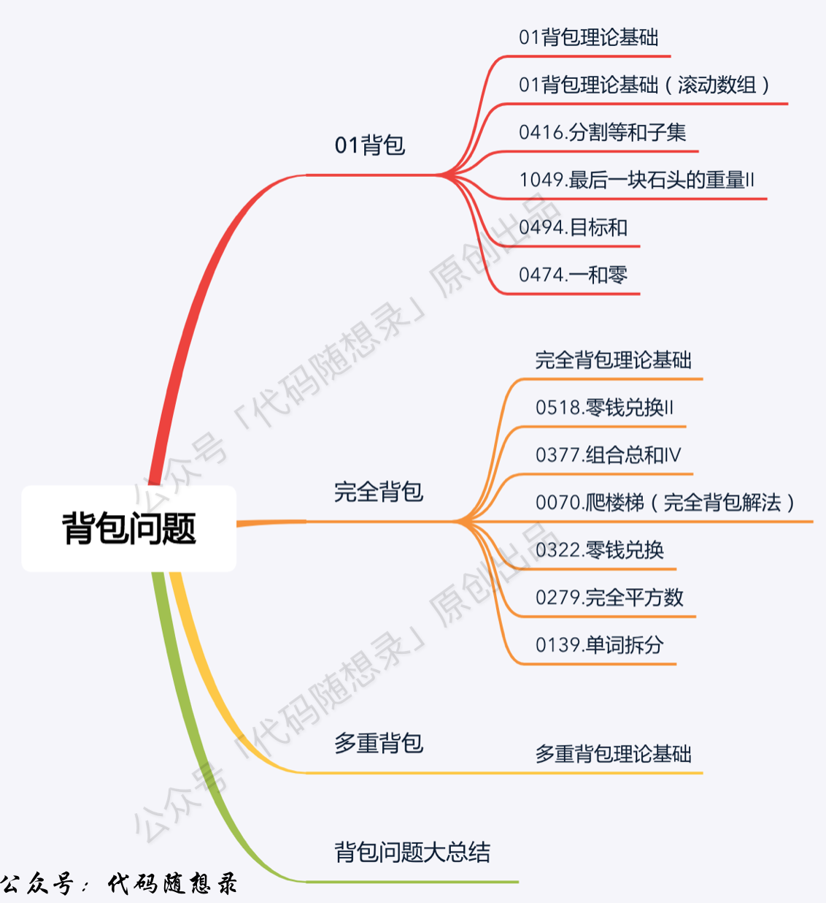

- [动态规划：关于01背包问题，你该了解这些！](https://programmercarl.com/%E8%83%8C%E5%8C%85%E7%90%86%E8%AE%BA%E5%9F%BA%E7%A1%8001%E8%83%8C%E5%8C%85-1.html)
- [动态规划：关于01背包问题，你该了解这些！（滚动数组）](https://programmercarl.com/%E8%83%8C%E5%8C%85%E7%90%86%E8%AE%BA%E5%9F%BA%E7%A1%8001%E8%83%8C%E5%8C%85-2.html)
- [动态规划：分割等和子集可以用01背包！](https://programmercarl.com/0416.%E5%88%86%E5%89%B2%E7%AD%89%E5%92%8C%E5%AD%90%E9%9B%86.html)
- [动态规划：最后一块石头的重量 II](https://programmercarl.com/1049.%E6%9C%80%E5%90%8E%E4%B8%80%E5%9D%97%E7%9F%B3%E5%A4%B4%E7%9A%84%E9%87%8D%E9%87%8FII.html)
- [动态规划：目标和！](https://programmercarl.com/0494.%E7%9B%AE%E6%A0%87%E5%92%8C.html)
- [动态规划：一和零！](https://programmercarl.com/0474.%E4%B8%80%E5%92%8C%E9%9B%B6.html)
- [动态规划：关于完全背包，你该了解这些！](https://programmercarl.com/%E8%83%8C%E5%8C%85%E9%97%AE%E9%A2%98%E7%90%86%E8%AE%BA%E5%9F%BA%E7%A1%80%E5%AE%8C%E5%85%A8%E8%83%8C%E5%8C%85.html)
- [动态规划：给你一些零钱，你要怎么凑？](https://programmercarl.com/0518.%E9%9B%B6%E9%92%B1%E5%85%91%E6%8D%A2II.html)
- [动态规划：Carl称它为排列总和！](https://programmercarl.com/0377.%E7%BB%84%E5%90%88%E6%80%BB%E5%92%8C%E2%85%A3.html)
- [动态规划：以前我没得选，现在我选择再爬一次！](https://programmercarl.com/0070.%E7%88%AC%E6%A5%BC%E6%A2%AF%E5%AE%8C%E5%85%A8%E8%83%8C%E5%8C%85%E7%89%88%E6%9C%AC.html)
- [动态规划： 给我个机会，我再兑换一次零钱](https://programmercarl.com/0322.%E9%9B%B6%E9%92%B1%E5%85%91%E6%8D%A2.html)
- [动态规划：一样的套路，再求一次完全平方数](https://programmercarl.com/0279.%E5%AE%8C%E5%85%A8%E5%B9%B3%E6%96%B9%E6%95%B0.html)
- [动态规划：单词拆分](https://programmercarl.com/0139.%E5%8D%95%E8%AF%8D%E6%8B%86%E5%88%86.html)
- [动态规划：关于多重背包，你该了解这些！](https://programmercarl.com/%E8%83%8C%E5%8C%85%E9%97%AE%E9%A2%98%E7%90%86%E8%AE%BA%E5%9F%BA%E7%A1%80%E5%A4%9A%E9%87%8D%E8%83%8C%E5%8C%85.html)

- [听说背包问题很难？ 这篇总结篇来拯救你了](https://programmercarl.com/%E8%83%8C%E5%8C%85%E6%80%BB%E7%BB%93%E7%AF%87.html)

## 打家劫舍系列

- [动态规划：开始打家劫舍！](https://programmercarl.com/0198.%E6%89%93%E5%AE%B6%E5%8A%AB%E8%88%8D.html)
- [动态规划：继续打家劫舍！](https://programmercarl.com/0213.%E6%89%93%E5%AE%B6%E5%8A%AB%E8%88%8DII.html)
- [动态规划：还要打家劫舍！](https://programmercarl.com/0337.%E6%89%93%E5%AE%B6%E5%8A%AB%E8%88%8DIII.html)

## 股票系列


- [动态规划：买卖股票的最佳时机](https://programmercarl.com/0121.%E4%B9%B0%E5%8D%96%E8%82%A1%E7%A5%A8%E7%9A%84%E6%9C%80%E4%BD%B3%E6%97%B6%E6%9C%BA.html)
- [动态规划：本周我们都讲了这些（系列六）](https://programmercarl.com/%E5%91%A8%E6%80%BB%E7%BB%93/20210225%E5%8A%A8%E8%A7%84%E5%91%A8%E6%9C%AB%E6%80%BB%E7%BB%93.html)
- [动态规划：买卖股票的最佳时机II](https://programmercarl.com/0122.%E4%B9%B0%E5%8D%96%E8%82%A1%E7%A5%A8%E7%9A%84%E6%9C%80%E4%BD%B3%E6%97%B6%E6%9C%BAII%EF%BC%88%E5%8A%A8%E6%80%81%E8%A7%84%E5%88%92%EF%BC%89.html)
- [动态规划：买卖股票的最佳时机III](https://programmercarl.com/0123.%E4%B9%B0%E5%8D%96%E8%82%A1%E7%A5%A8%E7%9A%84%E6%9C%80%E4%BD%B3%E6%97%B6%E6%9C%BAIII.html)
- [动态规划：买卖股票的最佳时机IV](https://programmercarl.com/0188.%E4%B9%B0%E5%8D%96%E8%82%A1%E7%A5%A8%E7%9A%84%E6%9C%80%E4%BD%B3%E6%97%B6%E6%9C%BAIV.html)
- [动态规划：最佳买卖股票时机含冷冻期](https://programmercarl.com/0309.%E6%9C%80%E4%BD%B3%E4%B9%B0%E5%8D%96%E8%82%A1%E7%A5%A8%E6%97%B6%E6%9C%BA%E5%90%AB%E5%86%B7%E5%86%BB%E6%9C%9F.html)
- [动态规划：本周我们都讲了这些（系列七）](https://programmercarl.com/%E5%91%A8%E6%80%BB%E7%BB%93/20210304%E5%8A%A8%E8%A7%84%E5%91%A8%E6%9C%AB%E6%80%BB%E7%BB%93.html)
- [动态规划：买卖股票的最佳时机含手续费](https://programmercarl.com/0714.%E4%B9%B0%E5%8D%96%E8%82%A1%E7%A5%A8%E7%9A%84%E6%9C%80%E4%BD%B3%E6%97%B6%E6%9C%BA%E5%90%AB%E6%89%8B%E7%BB%AD%E8%B4%B9%EF%BC%88%E5%8A%A8%E6%80%81%E8%A7%84%E5%88%92%EF%BC%89.html)
- [动态规划：股票系列总结篇](https://programmercarl.com/%E5%8A%A8%E6%80%81%E8%A7%84%E5%88%92-%E8%82%A1%E7%A5%A8%E9%97%AE%E9%A2%98%E6%80%BB%E7%BB%93%E7%AF%87.html)

## 子序列系列

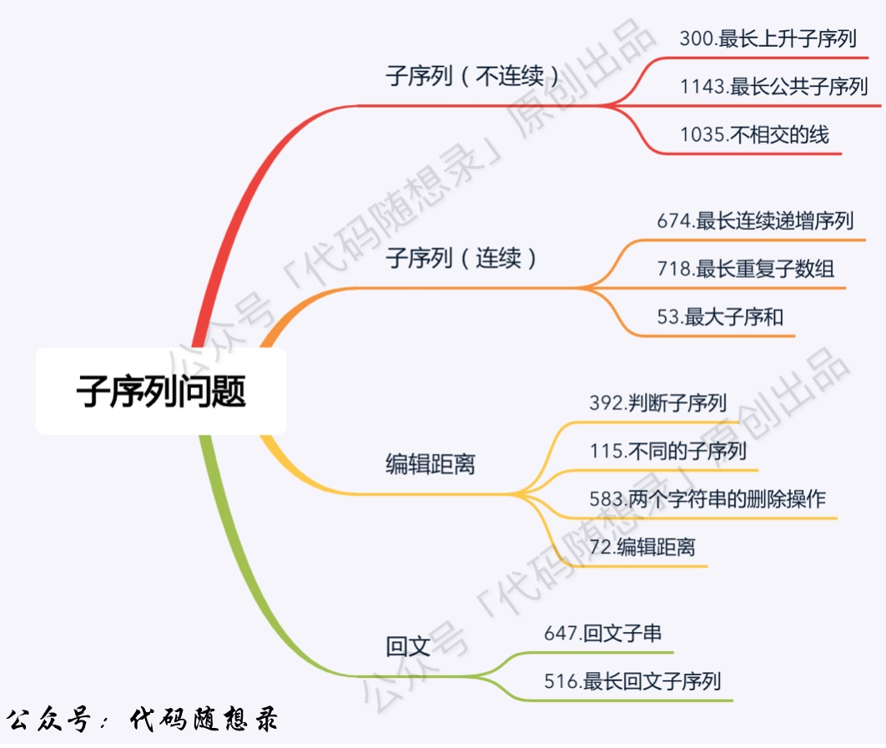

- [动态规划：最长递增子序列](https://programmercarl.com/0300.%E6%9C%80%E9%95%BF%E4%B8%8A%E5%8D%87%E5%AD%90%E5%BA%8F%E5%88%97.html)
- [动态规划：最长连续递增序列](https://programmercarl.com/0674.%E6%9C%80%E9%95%BF%E8%BF%9E%E7%BB%AD%E9%80%92%E5%A2%9E%E5%BA%8F%E5%88%97.html)
- [动态规划：最长重复子数组](https://programmercarl.com/0718.%E6%9C%80%E9%95%BF%E9%87%8D%E5%A4%8D%E5%AD%90%E6%95%B0%E7%BB%84.html)
- [动态规划：最长公共子序列](https://programmercarl.com/1143.%E6%9C%80%E9%95%BF%E5%85%AC%E5%85%B1%E5%AD%90%E5%BA%8F%E5%88%97.html)
- [动态规划：不相交的线](https://programmercarl.com/1035.%E4%B8%8D%E7%9B%B8%E4%BA%A4%E7%9A%84%E7%BA%BF.html)
- [动态规划：最大子序和](https://programmercarl.com/0053.%E6%9C%80%E5%A4%A7%E5%AD%90%E5%BA%8F%E5%92%8C%EF%BC%88%E5%8A%A8%E6%80%81%E8%A7%84%E5%88%92%EF%BC%89.html)
- [动态规划：判断子序列](https://programmercarl.com/0392.%E5%88%A4%E6%96%AD%E5%AD%90%E5%BA%8F%E5%88%97.html)
- [动态规划：不同的子序列](https://programmercarl.com/0115.%E4%B8%8D%E5%90%8C%E7%9A%84%E5%AD%90%E5%BA%8F%E5%88%97.html)
- [动态规划：两个字符串的删除操作](https://programmercarl.com/0583.%E4%B8%A4%E4%B8%AA%E5%AD%97%E7%AC%A6%E4%B8%B2%E7%9A%84%E5%88%A0%E9%99%A4%E6%93%8D%E4%BD%9C.html)
- [动态规划：编辑距离](https://programmercarl.com/0072.%E7%BC%96%E8%BE%91%E8%B7%9D%E7%A6%BB.html)
- [为了绝杀编辑距离，我做了三步铺垫，你都知道么？](https://programmercarl.com/%E4%B8%BA%E4%BA%86%E7%BB%9D%E6%9D%80%E7%BC%96%E8%BE%91%E8%B7%9D%E7%A6%BB%EF%BC%8C%E5%8D%A1%E5%B0%94%E5%81%9A%E4%BA%86%E4%B8%89%E6%AD%A5%E9%93%BA%E5%9E%AB.html)
- [动态规划：回文子串](https://programmercarl.com/0647.%E5%9B%9E%E6%96%87%E5%AD%90%E4%B8%B2.html)
- [动态规划：最长回文子序列](https://programmercarl.com/0516.%E6%9C%80%E9%95%BF%E5%9B%9E%E6%96%87%E5%AD%90%E5%BA%8F%E5%88%97.html)

## 动规结束语

关于动规，还有 树形DP（打家劫舍系列里有一道），数位DP，区间DP ，概率型DP，博弈型DP，状态压缩dp等等等，这些我就不去做讲解了，面试中出现的概率非常低。

能把本篇中列举的题目都研究通透的话，你的动规水平就已经非常高了。 对付面试已经足够！


这个图是 [代码随想录知识星球](https://programmercarl.com/other/kstar.html) 成员：[青](https://wx.zsxq.com/dweb2/index/footprint/185251215558842)，所画，总结的非常好，分享给大家。

这应该是全网对动规最深刻的讲解系列了。

**其实大家去网上搜一搜也可以发现，能把动态规划讲清楚的资料挺少的，因为动规确实很难！要给别人讲清楚更** **难！**

《剑指offer》上 动规的题目很少，经典的算法书籍《算法4》 没有讲 动规，而《算法导论》讲的动规基本属于劝退级别的。

讲清楚一道题容易，讲清楚两道题也容易，但把整个动态规划的各个分支讲清楚，每道题目讲通透，并用一套方法论把整个动规贯彻始终就非常难了。

所以Carl花费的这么大精力，把自己对动规算法理解 一五一十的全部分享给了录友们，帮助大家少走弯路，加油！
