[](https://programmercarl.com/other/xunlianying.html)

**《代码随想录》作者：**[**程序员Carl**](https://github.com/youngyangyang04)

- 代码随想录官网[（网站持续更新优化内容，建议直接看网站）](https://www.programmercarl.com/)：www.programmercarl.com
- 代码随想录[Github开源地址](https://github.com/youngyangyang04/leetcode-master)
- [代码随想录算法公开课](https://programmercarl.com/other/gongkaike.html)，代码随想录的全部内容将由我（[程序员Carl](https://github.com/youngyangyang04)）视频讲解并开免费开放给大家。
- [《代码随想录》](https://programmercarl.com/other/publish.html) 已经出版。
- [代码随想录知识星球](https://programmercarl.com/other/kstar.html) 上万录友在这里学习
- [代码随想录算法训练营](https://programmercarl.com/other/xunlianying.html) 帮助录友高效刷完代码随想录。
- 微信公众号：[代码随想录](https://img-blog.csdnimg.cn/74f47bc466234462bd2acc3ba6cd1b70.png)
- 组队刷题，可以添加[代码随想录官方微信](https://www.programmercarl.com/other/wechat.html)
- ACM模式练习，推荐：[卡码网](https://kamacoder.com/)

**特别提示**：PDF仅提供`C++`语言版本同时PDF中很多动图无法加载，其他编程语言版本和查看动图可以移步至代码随想录官方网站查看。

# 1. 每日温度

[力扣题目链接](https://leetcode.cn/problems/daily-temperatures/)

请根据每日 气温 列表，重新生成一个列表。对应位置的输出为：要想观测到更高的气温，至少需要等待的天数。如果气温在这之后都不会升高，请在该位置用 0 来代替。

例如，给定一个列表 `temperatures = [73, 74, 75, 71, 69, 72, 76, 73]`，你的输出应该是 `[1, 1, 4, 2, 1, 1, 0, 0]`。

提示：气温 列表长度的范围是 `[1, 30000]`。每个气温的值的均为华氏度，都是在 `[30, 100]` 范围内的整数。

## 思路

首先想到的当然是暴力解法，两层for循环，把至少需要等待的天数就搜出来了。时间复杂度是`O(n^2)`

那么接下来在来看看使用单调栈的解法。

那有同学就问了，我怎么能想到用单调栈呢？ 什么时候用单调栈呢？

**通常是一维数组，要寻找任一个元素的右边或者左边第一个比自己大或者小的元素的位置，此时我们就要想到可以** **用单调栈了**。时间复杂度为`O(n)`。

例如本题其实就是找找到一个元素右边第一个比自己大的元素，此时就应该想到用单调栈了。

那么单调栈的原理是什么呢？为什么时间复杂度是`O(n)`就可以找到每一个元素的右边第一个比它大的元素位置呢？

**单调栈的本质是空间换时间**，因为在遍历的过程中需要用一个栈来记录右边第一个比当前元素高的元素，优点是整个数组只需要遍历一次。

**更直白来说，就是用一个栈来记录我们遍历过的元素**，因为我们遍历数组的时候，我们不知道之前都遍历了哪些元素，以至于遍历一个元素找不到是不是之前遍历过一个更小的，所以我们需要用一个容器（这里用单调栈）来记录我们遍历过的元素。

在使用单调栈的时候首先要明确如下几点：

1. 单调栈里存放的元素是什么？

单调栈里只需要存放元素的下标i就可以了，如果需要使用对应的元素，直接`T[i]`就可以获取。

2. 单调栈里元素是递增呢？ 还是递减呢？

**注意以下讲解中，顺序的描述为 从栈头到栈底的顺序**，因为单纯的说从左到右或者从前到后，不说栈头朝哪个方向的话，大家一定比较懵。

这里我们要使用递增循序（再强调一下是指从栈头到栈底的顺序），因为只有递增的时候，栈里要加入一个元素i的时候，才知道栈顶元素在数组中右面第一个比栈顶元素大的元素是i。

即：如果求一个元素右边第一个更大元素，单调栈就是递增的，如果求一个元素右边第一个更小元素，单调栈就是递减的。

文字描述理解起来有点费劲，接下来我画了一系列的图，来讲解单调栈的工作过程，大家再去思考，本题为什么是递增栈。

使用单调栈主要有三个判断条件。

- 当前遍历的元素`T[i]`小于栈顶元素`T[st.top()]`的情况
- 当前遍历的元素`T[i]`等于栈顶元素`T[st.top()]`的情况
- 当前遍历的元素`T[i]`大于栈顶元素`T[st.top()]`的情况

**把这三种情况分析清楚了，也就理解透彻了**。

接下来我们用`temperatures = [73, 74, 75, 71, 71, 72, 76, 73]`为例来逐步分析，输出应该是 `[1, 1, 4, 2, 1, 1, 0, 0]`。

首先先将第一个遍历元素加入单调栈

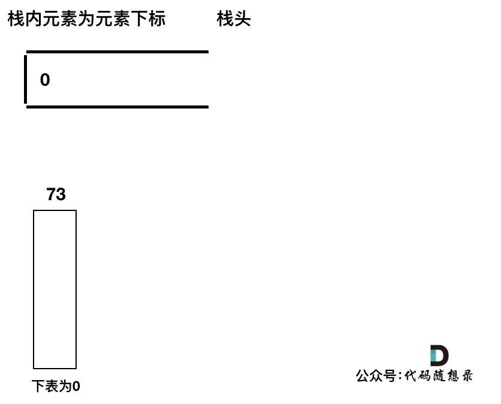

加入`T[1] = 74`，因为`T[1] > T[0]`（当前遍历的元素`T[i]`大于栈顶元素`T[st.top()]`的情况）。

我们要保持一个递增单调栈（从栈头到栈底），所以将`T[0]`弹出，`T[1]`加入，此时result数组可以记录了，`result[0]` `= 1`，即`T[0]`右面第一个比`T[0]`大的元素是`T[1]`。

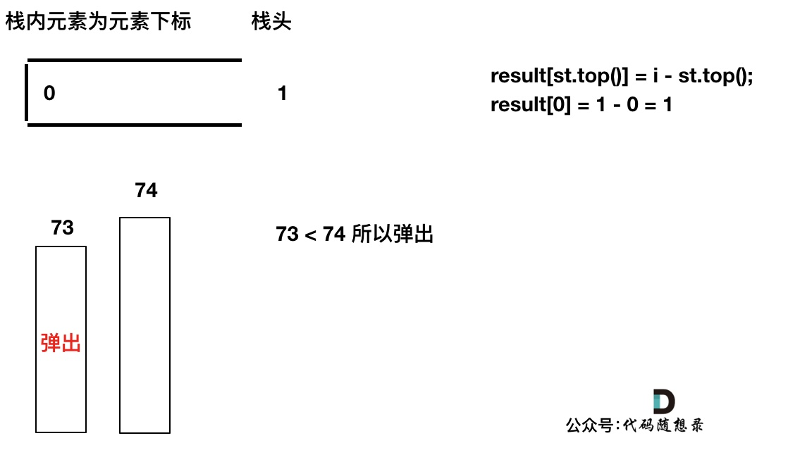

加入`T[2]`，同理，`T[1]`弹出

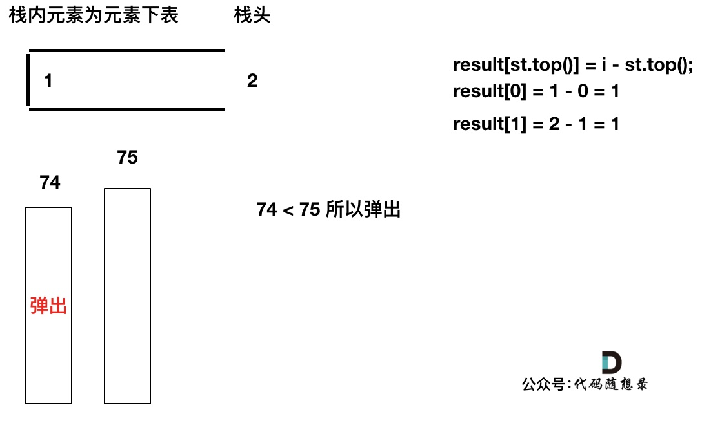

加入`T[3]`，`T[3] < T[2]` （当前遍历的元素`T[i]`小于栈顶元素`T[st.top()]`的情况），加`T[3]`加入单调栈。

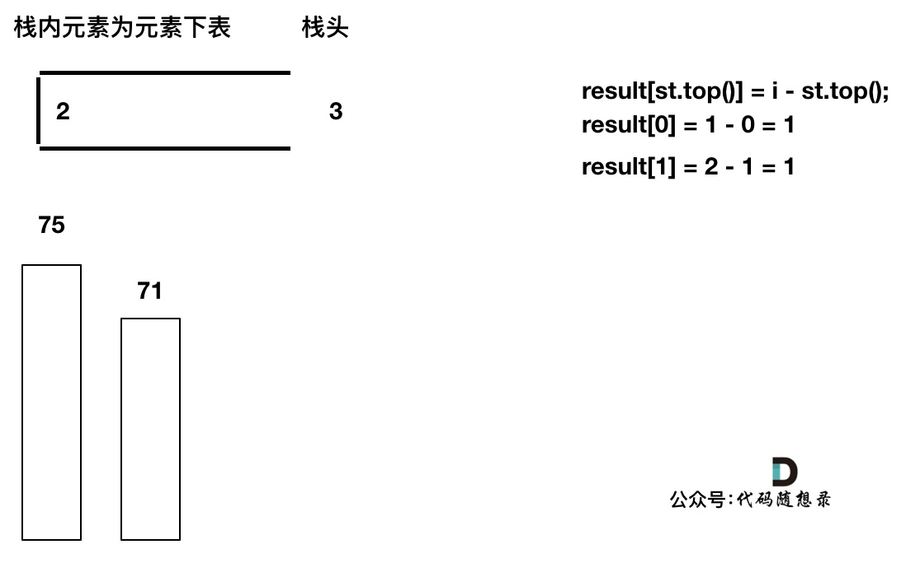

加入`T[4]`，`T[4] == T[3]` （当前遍历的元素`T[i]`等于栈顶元素`T[st.top()]`的情况），此时依然要加入栈，不用计算距离，因为我们要求的是右面第一个大于本元素的位置，而不是大于等于！

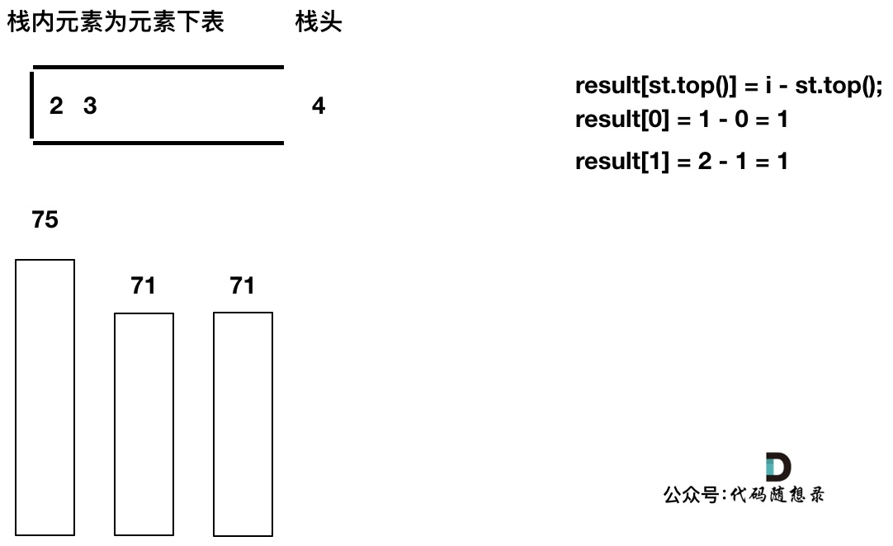

加入`T[5]`，`T[5] > T[4]` （当前遍历的元素`T[i]`大于栈顶元素`T[st.top()]`的情况），将`T[4]`弹出，同时计算距离，更新result

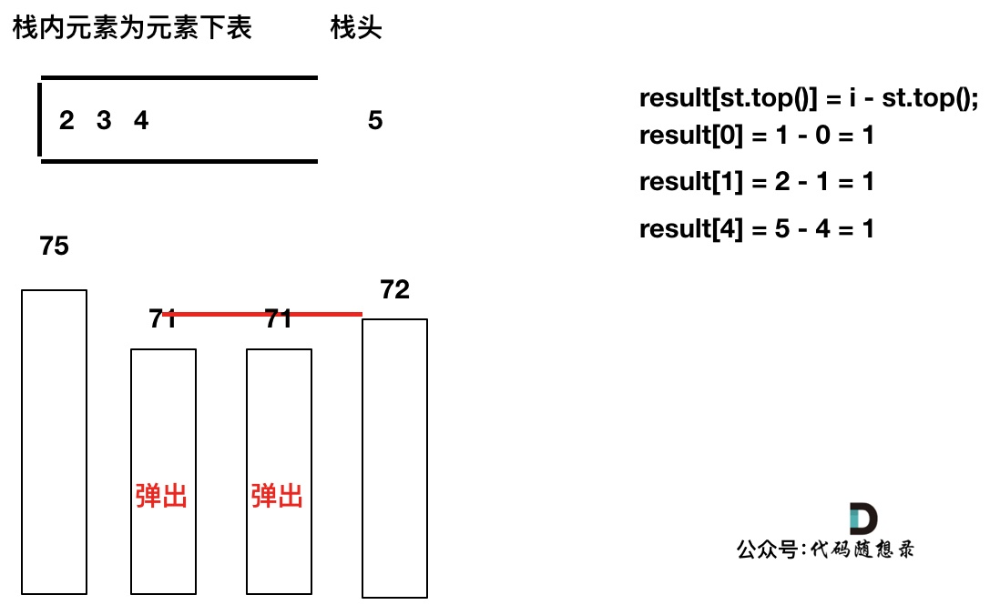

`T[4]`弹出之后， `T[5] > T[3]` （当前遍历的元素`T[i]`大于栈顶元素`T[st.top()]`的情况），将`T[3]`继续弹出，同时计算距离，更新result

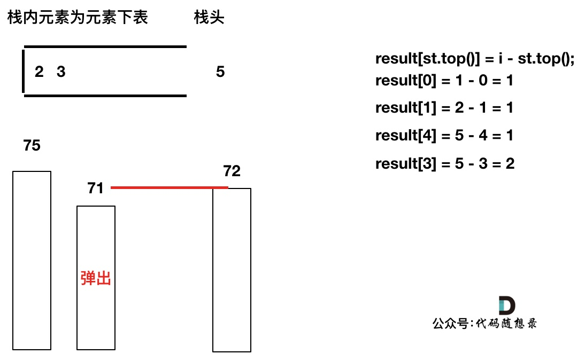

直到发现`T[5]`小于`T[st.top()]`，终止弹出，将`T[5]`加入单调栈

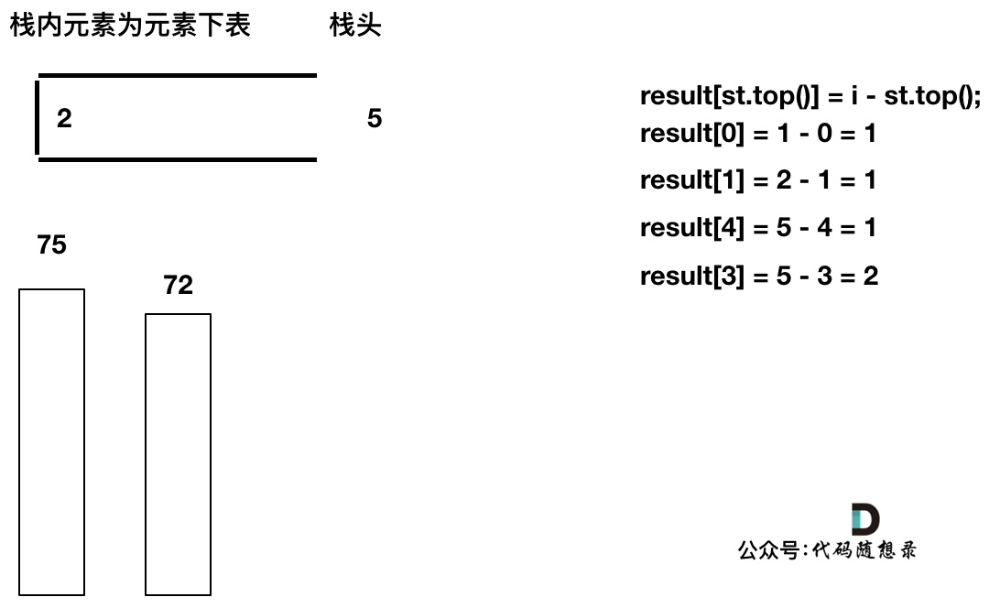

加入`T[6]`，同理，需要将栈里的`T[5]`，`T[2]`弹出

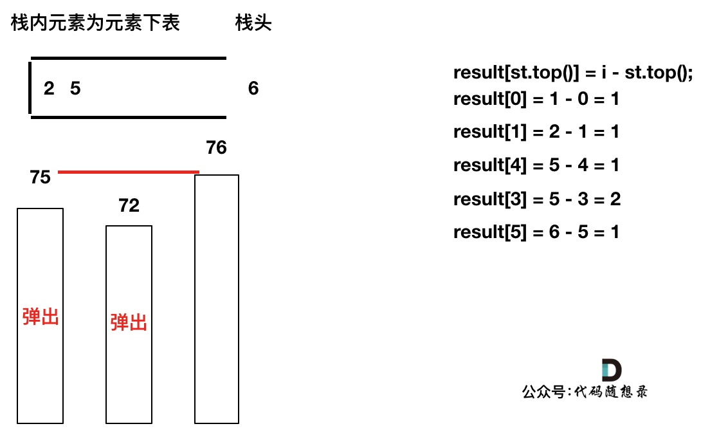

同理，继续弹出

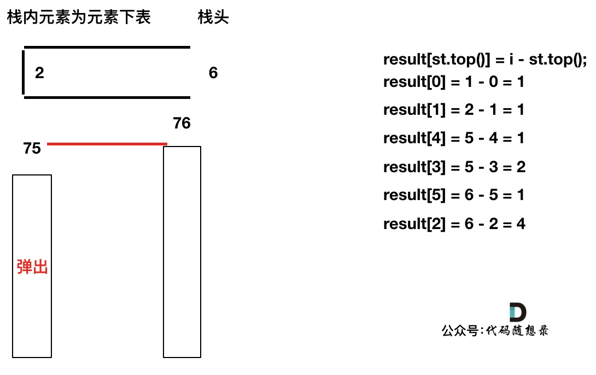

此时栈里只剩下了`T[6]`

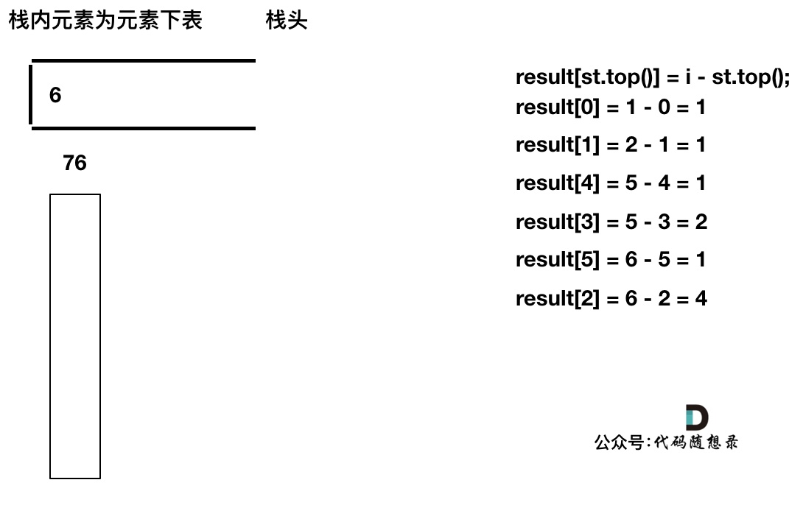

加入`T[7]`， `T[7] < T[6]` 直接入栈，这就是最后的情况，result数组也更新完了。

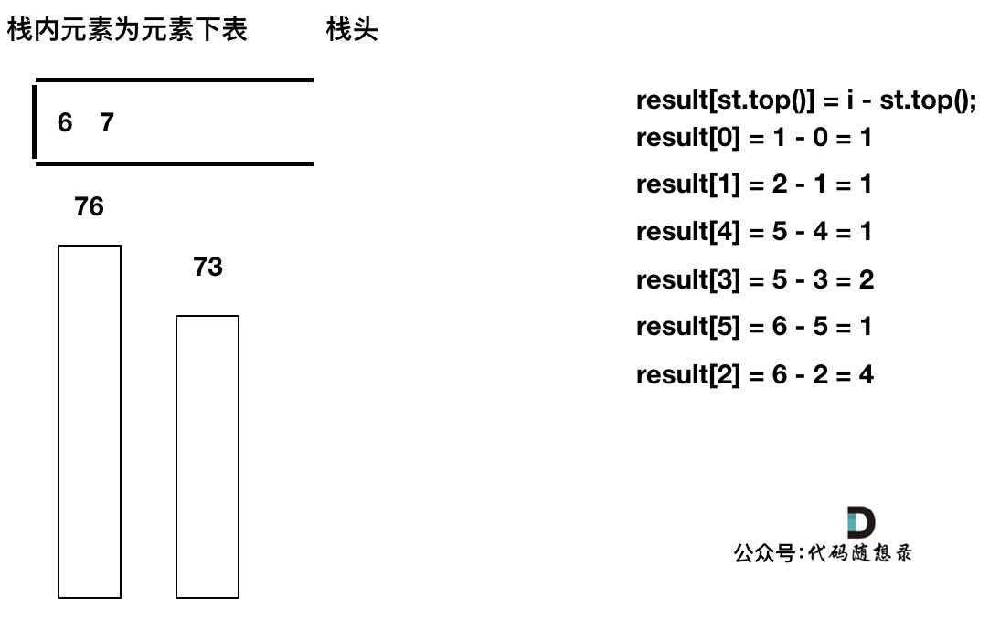

此时有同学可能就疑惑了，那`result[6] , result[7]`怎么没更新啊，元素也一直在栈里。

其实定义result数组的时候，就应该直接初始化为0，如果result没有更新，说明这个元素右面没有更大的了，也就是为0。

以上在图解的时候，已经把，这三种情况都做了详细的分析。

- 情况一：当前遍历的元素`T[i]`小于栈顶元素`T[st.top()]`的情况
- 情况二：当前遍历的元素`T[i]`等于栈顶元素`T[st.top()]`的情况
- 情况三：当前遍历的元素`T[i]`大于栈顶元素`T[st.top()]`的情况

通过以上过程，大家可以自己再模拟一遍，就会发现：只有单调栈递增（从栈口到栈底顺序），就是求右边第一个比自己大的，单调栈递减的话，就是求右边第一个比自己小的。

`C++`代码如下：

```cpp
// 版本一
class Solution {
public:
    vector<int> dailyTemperatures(vector<int>& T) {
        // 递增栈
        stack<int> st;
        vector<int> result(T.size(), 0);
        st.push(0);
        for (int i = 1; i < T.size(); i++) {
            if (T[i] < T[st.top()]) {                       // 情况一
                st.push(i);
            } else if (T[i] == T[st.top()]) {               // 情况二
                st.push(i);
            } else {
                while (!st.empty() && T[i] > T[st.top()]) { // 情况三
                    result[st.top()] = i - st.top();
                    st.pop();
                }
                st.push(i);
            }
        }
        return result;
    }
};
```

**建议一开始 都把每种情况分析好，不要上来看简短的代码，关键逻辑都被隐藏了**。

精简代码如下：

```cpp
// 版本二
class Solution {
public:
    vector<int> dailyTemperatures(vector<int>& T) {
        stack<int> st; // 递增栈
        vector<int> result(T.size(), 0);
        for (int i = 0; i < T.size(); i++) {
            while (!st.empty() && T[i] > T[st.top()]) { // 注意栈不能为空
                result[st.top()] = i - st.top();
                st.pop();
            }
            st.push(i);
        }
        return result;
    }
};
```

- 时间复杂度：`O(n)`
- 空间复杂度：`O(n)`

精简的代码是直接把情况一二三都合并到了一起，其实这种代码精简是精简，但思路不是很清晰。

建议大家把情况一二三想清楚了，先写出版本一的代码，然后在其基础上在做精简！

# 2.下一个更大元素 I

[力扣题目链接](https://leetcode.cn/problems/next-greater-element-i/)

给你两个 没有重复元素 的数组 nums1 和 nums2 ，其中nums1 是 nums2 的子集。

请你找出 nums1 中每个元素在 nums2 中的下一个比其大的值。

nums1 中数字 x 的下一个更大元素是指 x 在 nums2 中对应位置的右边的第一个比 x 大的元素。如果不存在，对应位置输出 -1 。

示例 1:

输入`: nums1 = [4,1,2], nums2 = [1,3,4,2].`  
输出`: [-1,3,-1]`  
解释: 对于 num1 中的数字 4 ，你无法在第二个数组中找到下一个更大的数字，因此输出 -1 。  对于 num1 中的数字 1 ，第二个数组中数字1右边的下一个较大数字是 3 。 对于 num1 中的数字 2 ，第二个数组中没有下一个更大的数字，因此输出 -1 。 

示例 2:  
输入`: nums1 = [2,4], nums2 = [1,2,3,4].`  
输出`: [3,-1]`  
解释: 对于 num1 中的数字 2 ，第二个数组中的下一个较大数字是 3 。 对于 num1 中的数字 4 ，第二个数组中没有下一个更大的数字，因此输出-1 。 

提示：

- `1 <= nums1.length <= nums2.length <= 1000`
- `0 <= nums1[i], nums2[i] <= 10^4`
- nums1和nums2中所有整数 互不相同
- nums1 中的所有整数同样出现在 nums2 中

## 思路

做本题之前，建议先做一下[739. 每日温度](https://programmercarl.com/0739.%E6%AF%8F%E6%97%A5%E6%B8%A9%E5%BA%A6.html)

在[739. 每日温度](https://programmercarl.com/0739.%E6%AF%8F%E6%97%A5%E6%B8%A9%E5%BA%A6.html)中是求每个元素下一个比当前元素大的元素的位置。

本题则是说nums1 是 nums2的子集，找nums1中的元素在nums2中下一个比当前元素大的元素。

看上去和[739. 每日温度](https://programmercarl.com/0739.%E6%AF%8F%E6%97%A5%E6%B8%A9%E5%BA%A6.html) 就如出一辙了。

几乎是一样的，但是这么绕了一下，其实还上升了一点难度。

需要对单调栈使用的更熟练一些，才能顺利的把本题写出来。

从题目示例中我们可以看出最后是要求nums1的每个元素在nums2中下一个比当前元素大的元素，那么就要定义一个和nums1一样大小的数组result来存放结果。

一些同学可能看到两个数组都已经懵了，不知道要定一个一个多大的result数组来存放结果了。

**这么定义这个result数组初始化应该为多少呢？**

题目说如果不存在对应位置就输出 -1 ，所以result数组如果某位置没有被赋值，那么就应该是是-1，所以就初始化为-1。

在遍历nums2的过程中，我们要判断`nums2[i]`是否在nums1中出现过，因为最后是要根据nums1元素的下标来更新result数组。

**注意题目中说是两个没有重复元素 的数组 nums1 和 nums2**。

没有重复元素，我们就可以用map来做映射了。根据数值快速找到下标，还可以判断`nums2[i]`是否在nums1中出现过。

`C++`中，当我们要使用集合来解决哈希问题的时候，优先使用unordered_set，因为它的查询和增删效率是最优的。我在[关于哈希表，你该了解这些！](https://programmercarl.com/%E5%93%88%E5%B8%8C%E8%A1%A8%E7%90%86%E8%AE%BA%E5%9F%BA%E7%A1%80.html)中也做了详细的解释。

那么预处理代码如下:

```cpp
unordered_map<int, int> umap; // key:下标元素，value：下标
for (int i = 0; i < nums1.size(); i++) {
    umap[nums1[i]] = i;
}
```

使用单调栈，首先要想单调栈是从大到小还是从小到大。

本题和739. 每日温度是一样的。

栈头到栈底的顺序，要从小到大，也就是保持栈里的元素为递增顺序。只要保持递增，才能找到右边第一个比自己大的元素。

可能这里有一些同学不理解，那么可以自己尝试一下用递减栈，能不能求出来。**其实递减栈就是求右边第一个比自** **己小的元素了**。

接下来就要分析如下三种情况，一定要分析清楚。

1. 情况一：当前遍历的元素`T[i]`小于栈顶元素`T[st.top()]`的情况

此时满足递增栈（栈头到栈底的顺序），所以直接入栈。

2. 情况二：当前遍历的元素`T[i]`等于栈顶元素`T[st.top()]`的情况

如果相等的话，依然直接入栈，因为我们要求的是右边第一个比自己大的元素，而不是大于等于！

3. 情况三：当前遍历的元素`T[i]`大于栈顶元素`T[st.top()]`的情况

此时如果入栈就不满足递增栈了，这也是找到右边第一个比自己大的元素的时候。

判断栈顶元素是否在nums1里出现过，（注意栈里的元素是nums2的元素），如果出现过，开始记录结果。

记录结果这块逻辑有一点小绕，要清楚，此时栈顶元素在nums2数组中右面第一个大的元素是`nums2[i]`（即当前遍历元素）。

代码如下：

```cpp
while (!st.empty() && nums2[i] > nums2[st.top()]) {
    if (umap.count(nums2[st.top()]) > 0) { // 看map里是否存在这个元素
        int index = umap[nums2[st.top()]]; // 根据map找到nums2[st.top()] 在 nums1中的下标
        result[index] = nums2[i];
    }
    st.pop();
}
st.push(i);
```

以上分析完毕，`C++`代码如下：（其实本题代码和 [739. 每日温度](https://programmercarl.com/0739.%E6%AF%8F%E6%97%A5%E6%B8%A9%E5%BA%A6.html) 是基本差不多的）

```cpp
// 版本一
class Solution {
public:
    vector<int> nextGreaterElement(vector<int>& nums1, vector<int>& nums2) {
        stack<int> st;
        vector<int> result(nums1.size(), -1);
        if (nums1.size() == 0) return result;
        unordered_map<int, int> umap; // key:下标元素，value：下标
        for (int i = 0; i < nums1.size(); i++) {
            umap[nums1[i]] = i;
        }
        st.push(0);
        for (int i = 1; i < nums2.size(); i++) {
            if (nums2[i] < nums2[st.top()]) {           // 情况一
                st.push(i);
            } else if (nums2[i] == nums2[st.top()]) {   // 情况二
                st.push(i);
            } else {                                    // 情况三
                while (!st.empty() && nums2[i] > nums2[st.top()]) {
                    if (umap.count(nums2[st.top()]) > 0) { // 看map里是否存在这个元素
                        int index = umap[nums2[st.top()]]; // 根据map找到nums2[st.top()]
在 nums1中的下标
                        result[index] = nums2[i];
                    }
                    st.pop();
                }
                st.push(i);
            }
        }
        return result;
    }
};
```

针对版本一，进行代码精简后，代码如下：

```cpp
// 版本二
class Solution {
public:
    vector<int> nextGreaterElement(vector<int>& nums1, vector<int>& nums2) {
        stack<int> st;
        vector<int> result(nums1.size(), -1);
        if (nums1.size() == 0) return result;
        unordered_map<int, int> umap; // key:下标元素，value：下标
        for (int i = 0; i < nums1.size(); i++) {
            umap[nums1[i]] = i;
        }
        st.push(0);
        for (int i = 1; i < nums2.size(); i++) {
            while (!st.empty() && nums2[i] > nums2[st.top()]) {
                if (umap.count(nums2[st.top()]) > 0) { // 看map里是否存在这个元素
                    int index = umap[nums2[st.top()]]; // 根据map找到nums2[st.top()] 在
nums1中的下标
                    result[index] = nums2[i];
                }
                st.pop();
            }
            st.push(i);
        }
        return result;
    }
};
```

精简的代码是直接把情况一二三都合并到了一起，其实这种代码精简是精简，但思路不是很清晰。

建议大家把情况一二三想清楚了，先写出版本一的代码，然后在其基础上在做精简！

# 3.下一个更大元素II

[力扣题目链接](https://leetcode.cn/problems/next-greater-element-ii/)

给定一个循环数组（最后一个元素的下一个元素是数组的第一个元素），输出每个元素的下一个更大元素。数字 x 的下一个更大的元素是按数组遍历顺序，这个数字之后的第一个比它更大的数，这意味着你应该循环地搜索它的下一个更大的数。如果不存在，则输出 -1。

示例 1:

- 输入`: [1,2,1]`
- 输出`: [2,-1,2]`
- 解释: 第一个 1 的下一个更大的数是 2；数字 2 找不到下一个更大的数；第二个 1 的下一个最大的数需要循环搜索，结果也是 2。

提示:

- `1 <= nums.length <= 10^4`
- `-10^9 <= nums[i] <= 10^9`

## 思路

做本题之前建议先做[739. 每日温度](https://programmercarl.com/0739.%E6%AF%8F%E6%97%A5%E6%B8%A9%E5%BA%A6.html) 和 [496.下一个更大元素 I](https://programmercarl.com/0496.%E4%B8%8B%E4%B8%80%E4%B8%AA%E6%9B%B4%E5%A4%A7%E5%85%83%E7%B4%A0I.html)。

这道题和[739. 每日温度](https://programmercarl.com/0739.%E6%AF%8F%E6%97%A5%E6%B8%A9%E5%BA%A6.html)也几乎如出一辙。

不过，本题要循环数组了。

关于单调栈的讲解我在题解[739. 每日温度](https://programmercarl.com/0739.%E6%AF%8F%E6%97%A5%E6%B8%A9%E5%BA%A6.html)中已经详细讲解了。

本篇我侧重与说一说，如何处理循环数组。

相信不少同学看到这道题，就想那我直接把两个数组拼接在一起，然后使用单调栈求下一个最大值不就行了！

确实可以！

将两个nums数组拼接在一起，使用单调栈计算出每一个元素的下一个最大值，最后再把结果集即result数组resize到原数组大小就可以了。

代码如下：

```cpp
// 版本一
class Solution {
public:
    vector<int> nextGreaterElements(vector<int>& nums) {
        // 拼接一个新的nums
        vector<int> nums1(nums.begin(), nums.end());
        nums.insert(nums.end(), nums1.begin(), nums1.end());
        // 用新的nums大小来初始化result
        vector<int> result(nums.size(), -1);
        if (nums.size() == 0) return result;
        // 开始单调栈
        stack<int> st;
        st.push(0);
        for (int i = 1; i < nums.size(); i++) {
            if (nums[i] < nums[st.top()]) st.push(i);
            else if (nums[i] == nums[st.top()]) st.push(i);
            else {
                while (!st.empty() && nums[i] > nums[st.top()]) {
                    result[st.top()] = nums[i];
                    st.pop();
                }
                st.push(i);
            }
        }
        // 最后再把结果集即result数组resize到原数组大小
        result.resize(nums.size() / 2);
        return result;
    }
};
```

这种写法确实比较直观，但做了很多无用操作，例如修改了nums数组，而且最后还要把result数组resize回去。

resize倒是不费时间，是`O(1)`的操作，但扩充nums数组相当于多了一个`O(n)`的操作。

其实也可以不扩充nums，而是在遍历的过程中模拟走了两边nums。

代码如下：

```cpp
// 版本二
class Solution {
public:
    vector<int> nextGreaterElements(vector<int>& nums) {
        vector<int> result(nums.size(), -1);
        if (nums.size() == 0) return result;
        stack<int> st;
        st.push(0);
        for (int i = 1; i < nums.size() * 2; i++) {
            // 模拟遍历两边nums，注意一下都是用i % nums.size()来操作
            if (nums[i % nums.size()] < nums[st.top()]) st.push(i % nums.size());
            else if (nums[i % nums.size()] == nums[st.top()]) st.push(i % nums.size());
            else {
                while (!st.empty() && nums[i % nums.size()] > nums[st.top()]) {
                    result[st.top()] = nums[i % nums.size()];
                    st.pop();
                }
                st.push(i % nums.size());
            }
        }
        return result;
    }
};
```

可以版本二不仅代码精简了，也比版本一少做了无用功！

最后在给出 单调栈的精简版本，即三种情况都做了合并的操作。

```cpp
// 版本二
class Solution {
public:
    vector<int> nextGreaterElements(vector<int>& nums) {
        vector<int> result(nums.size(), -1);
        if (nums.size() == 0) return result;
        stack<int> st;
        for (int i = 0; i < nums.size() * 2; i++) {
            // 模拟遍历两边nums，注意一下都是用i % nums.size()来操作
            while (!st.empty() && nums[i % nums.size()] > nums[st.top()]) {
                result[st.top()] = nums[i % nums.size()];
                st.pop();
            }
            st.push(i % nums.size());
        }
        return result;
    }
};
```

这个图就是大厂面试经典题目，接雨水！ 最常青藤的一道题，面试官百出不厌！

# 4. 接雨水

[力扣题目链接](https://leetcode.cn/problems/trapping-rain-water/)

给定 n 个非负整数表示每个宽度为 1 的柱子的高度图，计算按此排列的柱子，下雨之后能接多少雨水。

示例 1：

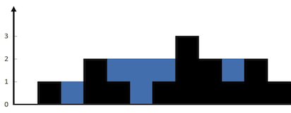

- 输入：`height = [0,1,0,2,1,0,1,3,2,1,2,1]`
- 输出：6
- 解释：上面是由数组 `[0,1,0,2,1,0,1,3,2,1,2,1]` 表示的高度图，在这种情况下，可以接 6 个单位的雨水（蓝色部分表示雨水）。

示例 2：

- 输入：`height = [4,2,0,3,2,5]`
- 输出：9

## 思路

接雨水问题在面试中还是常见题目的，有必要好好讲一讲。

本文深度讲解如下三种方法：

- 双指针法
- 动态规划
- 单调栈

### 暴力解法

本题暴力解法也是也是使用双指针。

首先要明确，要按照行来计算，还是按照列来计算。

按照行来计算如图：

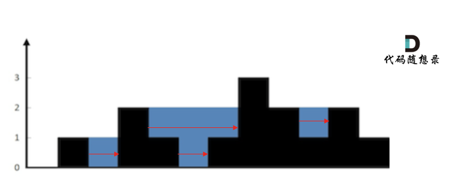

按照列来计算如图：

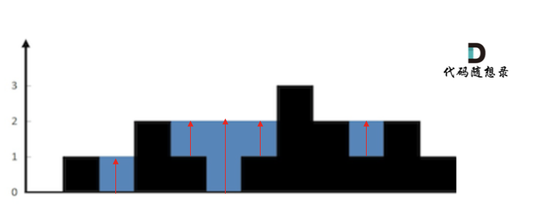

一些同学在实现的时候，很容易一会按照行来计算一会按照列来计算，这样就会越写越乱。

我个人倾向于按照列来计算，比较容易理解，接下来看一下按照列如何计算。

首先，**如果按照列来计算的话，宽度一定是1了，我们再把每一列的雨水的高度求出来就可以了。**

可以看出每一列雨水的高度，取决于，该列 左侧最高的柱子和右侧最高的柱子中最矮的那个柱子的高度。

这句话可以有点绕，来举一个理解，例如求列4的雨水高度，如图：

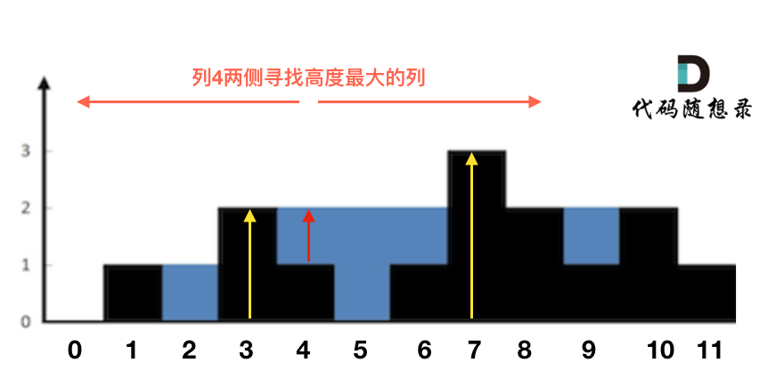

列4 左侧最高的柱子是列3，高度为2（以下用lHeight表示）。

列4 右侧最高的柱子是列7，高度为3（以下用rHeight表示）。

列4 柱子的高度为1（以下用height表示）

那么列4的雨水高度为 列3和列7的高度最小值减列4高度，即： `min(lHeight, rHeight) - height`。

列4的雨水高度求出来了，宽度为1，相乘就是列4的雨水体积了。

此时求出了列4的雨水体积。

一样的方法，只要从头遍历一遍所有的列，然后求出每一列雨水的体积，相加之后就是总雨水的体积了。

首先从头遍历所有的列，并且**要注意第一个柱子和最后一个柱子不接雨水**，代码如下：

```cpp
for (int i = 0; i < height.size(); i++) {
    // 第一个柱子和最后一个柱子不接雨水
    if (i == 0 || i == height.size() - 1) continue;
}
```

在for循环中求左右两边最高柱子，代码如下：

```cpp
int rHeight = height[i]; // 记录右边柱子的最高高度
int lHeight = height[i]; // 记录左边柱子的最高高度
for (int r = i + 1; r < height.size(); r++) {
    if (height[r] > rHeight) rHeight = height[r];
}
for (int l = i - 1; l >= 0; l--) {
    if (height[l] > lHeight) lHeight = height[l];
}
```

最后，计算该列的雨水高度，代码如下：

```cpp
int h = min(lHeight, rHeight) - height[i];
if (h > 0) sum += h; // 注意只有h大于零的时候，在统计到总和中
```

整体代码如下：

```cpp
class Solution {
public:
    int trap(vector<int>& height) {
        int sum = 0;
        for (int i = 0; i < height.size(); i++) {
            // 第一个柱子和最后一个柱子不接雨水
            if (i == 0 || i == height.size() - 1) continue;
            int rHeight = height[i]; // 记录右边柱子的最高高度
            int lHeight = height[i]; // 记录左边柱子的最高高度
            for (int r = i + 1; r < height.size(); r++) {
                if (height[r] > rHeight) rHeight = height[r];
            }
            for (int l = i - 1; l >= 0; l--) {
                if (height[l] > lHeight) lHeight = height[l];
            }
            int h = min(lHeight, rHeight) - height[i];
            if (h > 0) sum += h;
        }
        return sum;
    }
};
```

因为每次遍历列的时候，还要向两边寻找最高的列，所以时间复杂度为`O(n^2)`，空间复杂度为`O(1)`。

力扣后面修改了后台测试数据，所以以上暴力解法超时了。

### 双指针优化

在暴力解法中，我们可以看到只要记录左边柱子的最高高度 和 右边柱子的最高高度，就可以计算当前位置的雨水面积，这就是通过列来计算。

当前列雨水面积：`min(`左边柱子的最高高度，记录右边柱子的最高高度`) -` 当前柱子高度。

为了得到两边的最高高度，使用了双指针来遍历，每到一个柱子都向两边遍历一遍，这其实是有重复计算的。我们把每一个位置的左边最高高度记录在一个数组上（maxLeft），右边最高高度记录在一个数组上（maxRight），这样就避免了重复计算。

当前位置，左边的最高高度是前一个位置的左边最高高度和本高度的最大值。

即从左向右遍历：`maxLeft[i] = max(height[i], maxLeft[i - 1]);`

从右向左遍历：`maxRight[i] = max(height[i], maxRight[i + 1]);`

代码如下：

```cpp
class Solution {
public:
    int trap(vector<int>& height) {
        if (height.size() <= 2) return 0;
        vector<int> maxLeft(height.size(), 0);
        vector<int> maxRight(height.size(), 0);
        int size = maxRight.size();
        // 记录每个柱子左边柱子最大高度
        maxLeft[0] = height[0];
        for (int i = 1; i < size; i++) {
            maxLeft[i] = max(height[i], maxLeft[i - 1]);
        }
        // 记录每个柱子右边柱子最大高度
        maxRight[size - 1] = height[size - 1];
        for (int i = size - 2; i >= 0; i--) {
            maxRight[i] = max(height[i], maxRight[i + 1]);
        }
        // 求和
        int sum = 0;
        for (int i = 0; i < size; i++) {
            int count = min(maxLeft[i], maxRight[i]) - height[i];
            if (count > 0) sum += count;
        }
        return sum;
    }
};
```

### 单调栈解法

关于单调栈的理论基础，单调栈适合解决什么问题，单调栈的工作过程，大家可以先看这题讲解 [739. 每日温度](https://programmercarl.com/0739.%E6%AF%8F%E6%97%A5%E6%B8%A9%E5%BA%A6.html)。

单调栈就是保持栈内元素有序。和[栈与队列：单调队列](https://programmercarl.com/0239.%E6%BB%91%E5%8A%A8%E7%AA%97%E5%8F%A3%E6%9C%80%E5%A4%A7%E5%80%BC.html)一样，需要我们自己维持顺序，没有现成的容器可以用。

通常是一维数组，要寻找任一个元素的右边或者左边第一个比自己大或者小的元素的位置，此时我们就要想到可以用单调栈了。

而接雨水这道题目，我们正需要寻找一个元素，右边最大元素以及左边最大元素，来计算雨水面积。

#### 准备工作

那么本题使用单调栈有如下几个问题：

1. 首先单调栈是按照行方向来计算雨水，如图：

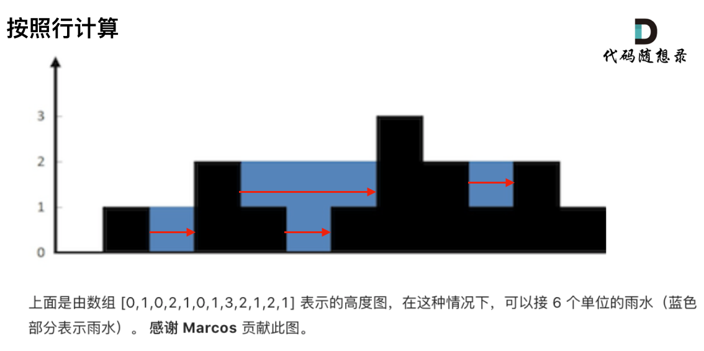

知道这一点，后面的就可以理解了。

2. 使用单调栈内元素的顺序

从大到小还是从小到大呢？

从栈头（元素从栈头弹出）到栈底的顺序应该是从小到大的顺序。

因为一旦发现添加的柱子高度大于栈头元素了，此时就出现凹槽了，栈头元素就是凹槽底部的柱子，栈头第二个元素就是凹槽左边的柱子，而添加的元素就是凹槽右边的柱子。

如图：

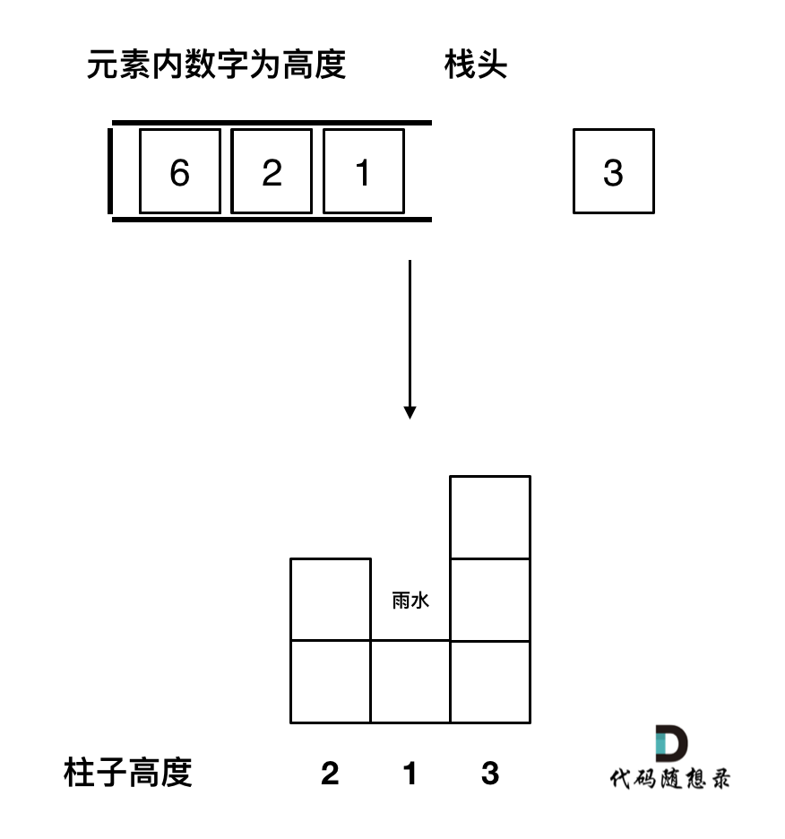

关于单调栈的顺序给大家一个总结： [739. 每日温度](https://programmercarl.com/0739.%E6%AF%8F%E6%97%A5%E6%B8%A9%E5%BA%A6.html) 中求一个元素右边第一个更大元素，单调栈就是递增的，84.柱状图中最大的矩形求一个元素右边第一个更小元素，单调栈就是递减的。

3. 遇到相同高度的柱子怎么办。

遇到相同的元素，更新栈内下标，就是将栈里元素（旧下标）弹出，将新元素（新下标）加入栈中。

例如 5 5 1 3 这种情况。如果添加第二个5的时候就应该将第一个5的下标弹出，把第二个5添加到栈中。

**因为我们要求宽度的时候 如果遇到相同高度的柱子，需要使用最右边的柱子来计算宽度**。

如图所示：

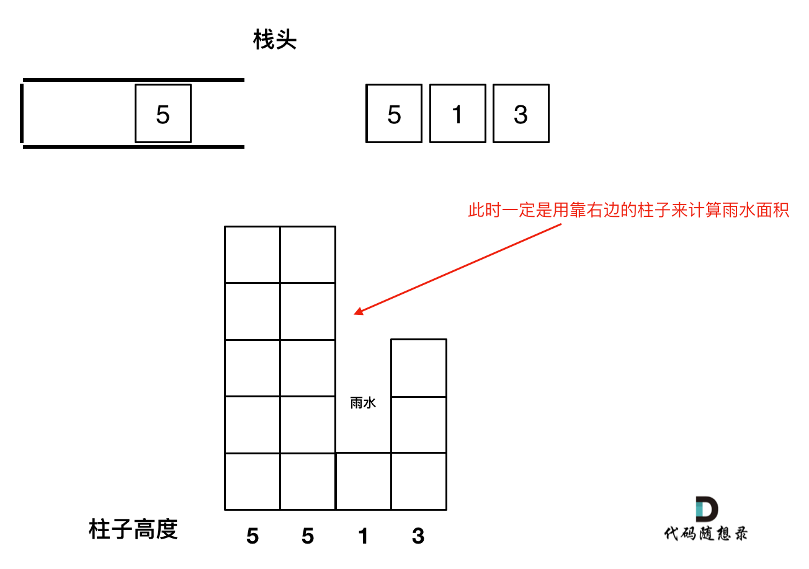

4. 栈里要保存什么数值

使用单调栈，也是通过 长 * 宽 来计算雨水面积的。

长就是通过柱子的高度来计算，宽是通过柱子之间的下标来计算，

那么栈里有没有必要存一个`pair<int, int>`类型的元素，保存柱子的高度和下标呢。

其实不用，栈里就存放下标就行，想要知道对应的高度，通过`height[stack.top()]` 就知道弹出的下标对应的高度了。

所以栈的定义如下：

```cpp
stack<int> st; // 存着下标，计算的时候用下标对应的柱子高度
```

明确了如上几点，我们再来看处理逻辑。

#### 单调栈处理逻辑

以下操作过程其实和 [739. 每日温度](https://programmercarl.com/0739.%E6%AF%8F%E6%97%A5%E6%B8%A9%E5%BA%A6.html) 也是一样的，建议先做 [739. 每日温度](https://programmercarl.com/0739.%E6%AF%8F%E6%97%A5%E6%B8%A9%E5%BA%A6.html)。

以下逻辑主要就是三种情况

- 情况一：当前遍历的元素（柱子）高度小于栈顶元素的高度 `height[i] < height[st.top()]`
- 情况二：当前遍历的元素（柱子）高度等于栈顶元素的高度 `height[i] == height[st.top()]`
- 情况三：当前遍历的元素（柱子）高度大于栈顶元素的高度 `height[i] > height[st.top()]`

```cpp
先将下标0的柱子加入到栈中，st.push(0); 。  栈中存放我们遍历过的元素，所以先将下标0加进来。
然后开始从下标1开始遍历所有的柱子，for (int i = 1; i < height.size(); i++) 。
```

如果当前遍历的元素（柱子）高度小于栈顶元素的高度，就把这个元素加入栈中，因为栈里本来就要保持从小到大的顺序（从栈头到栈底）。

代码如下：

```cpp
if (height[i] < height[st.top()])  st.push(i);
```

如果当前遍历的元素（柱子）高度等于栈顶元素的高度，要跟更新栈顶元素，因为遇到相相同高度的柱子，需要使用最右边的柱子来计算宽度。

代码如下：

```cpp
if (height[i] == height[st.top()]) { // 例如 5 5 1 7 这种情况
  st.pop();
  st.push(i);
}
```

如果当前遍历的元素（柱子）高度大于栈顶元素的高度，此时就出现凹槽了，如图所示：


取栈顶元素，将栈顶元素弹出，这个就是凹槽的底部，也就是中间位置，下标记为mid，对应的高度为`height[mid]`（就是图中的高度1）。

此时的栈顶元素`st.top()`，就是凹槽的左边位置，下标为`st.top()`，对应的高度为`height[st.top()]`（就是图中的高度2）。

当前遍历的元素i，就是凹槽右边的位置，下标为i，对应的高度为`height[i]`（就是图中的高度3）。

此时大家应该可以发现其实就是**栈顶和栈顶的下一个元素以及要入栈的元素，三个元素来接水！**

```cpp
那么雨水高度是 min(凹槽左边高度, 凹槽右边高度) - 凹槽底部高度，代码为：int h = min(height[st.top()],
height[i]) - height[mid];
雨水的宽度是 凹槽右边的下标 - 凹槽左边的下标 - 1（因为只求中间宽度），代码为：int w = i - st.top() -
1 ;
当前凹槽雨水的体积就是：h * w 。
```

求当前凹槽雨水的体积代码如下：

```cpp
while (!st.empty() && height[i] > height[st.top()]) { // 注意这里是while，持续跟新栈顶元素
    int mid = st.top();
    st.pop();
    if (!st.empty()) {
        int h = min(height[st.top()], height[i]) - height[mid];
        int w = i - st.top() - 1; // 注意减一，只求中间宽度
        sum += h * w;
    }
}
```

关键部分讲完了，整体代码如下：

```cpp
class Solution {
public:
    int trap(vector<int>& height) {
        if (height.size() <= 2) return 0; // 可以不加
        stack<int> st; // 存着下标，计算的时候用下标对应的柱子高度
        st.push(0);
        int sum = 0;
        for (int i = 1; i < height.size(); i++) {
            if (height[i] < height[st.top()]) {     // 情况一
                st.push(i);
            } if (height[i] == height[st.top()]) {  // 情况二
                st.pop(); // 其实这一句可以不加，效果是一样的，但处理相同的情况的思路却变了。
                st.push(i);
            } else {                                // 情况三
                while (!st.empty() && height[i] > height[st.top()]) { // 注意这里是while
                    int mid = st.top();
                    st.pop();
                    if (!st.empty()) {
                        int h = min(height[st.top()], height[i]) - height[mid];
                        int w = i - st.top() - 1; // 注意减一，只求中间宽度
                        sum += h * w;
                    }
                }
                st.push(i);
            }
        }
        return sum;
    }
};
```

以上代码冗余了一些，但是思路是清晰的，下面我将代码精简一下，如下：

```cpp
class Solution {
public:
    int trap(vector<int>& height) {
        stack<int> st;
        st.push(0);
        int sum = 0;
        for (int i = 1; i < height.size(); i++) {
            while (!st.empty() && height[i] > height[st.top()]) {
                int mid = st.top();
                st.pop();
                if (!st.empty()) {
                    int h = min(height[st.top()], height[i]) - height[mid];
                    int w = i - st.top() - 1;
                    sum += h * w;
                }
            }
            st.push(i);
        }
        return sum;
    }
};
```

精简之后的代码，大家就看不出去三种情况的处理了，貌似好像只处理的情况三，其实是把情况一和情况二融合了。 这样的代码不太利于理解。

# 5.柱状图中最大的矩形

[力扣题目链接](https://leetcode.cn/problems/largest-rectangle-in-histogram/)

给定 n 个非负整数，用来表示柱状图中各个柱子的高度。每个柱子彼此相邻，且宽度为 1 。

求在该柱状图中，能够勾勒出来的矩形的最大面积。

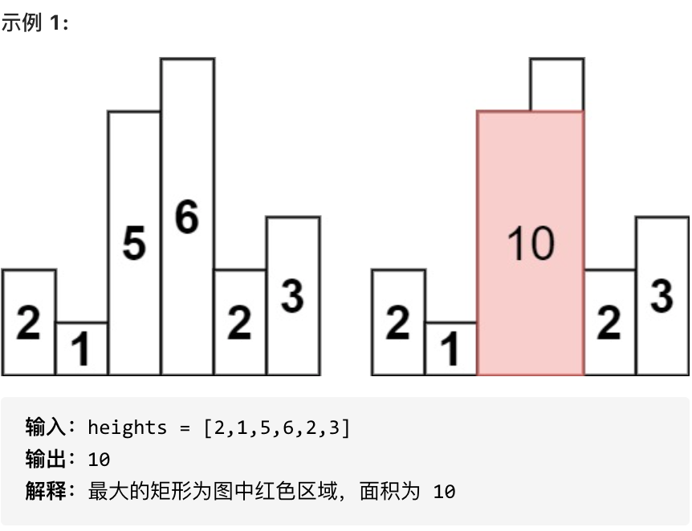

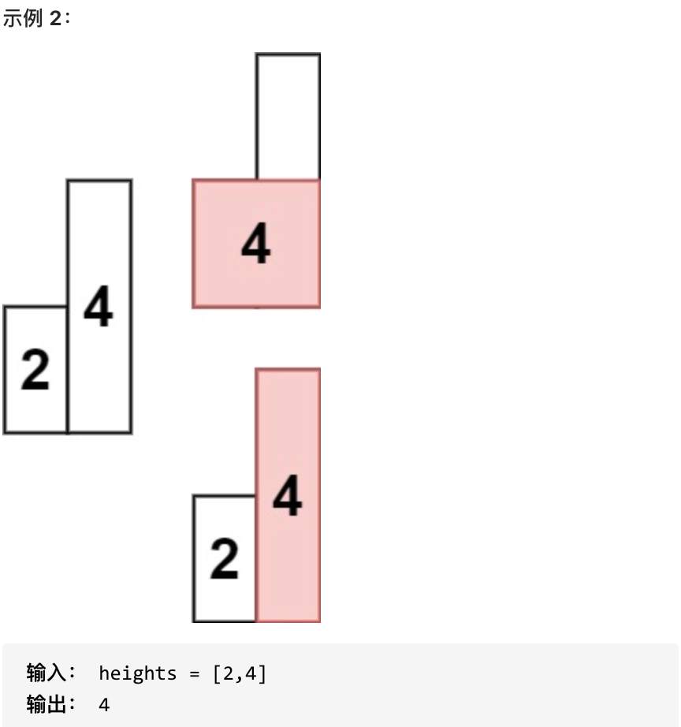

- `1 <= heights.length <=10^5`
- `0 <= heights[i] <= 10^4`

## 思路

本题和[42. 接雨水](https://programmercarl.com/0042.%E6%8E%A5%E9%9B%A8%E6%B0%B4.html)，是遥相呼应的两道题目，建议都要仔细做一做，原理上有很多相同的地方，但细节上又有差异，更可以加深对单调栈的理解！

其实这两道题目先做那一道都可以，但我先写的42.接雨水的题解，所以如果没做过接雨水的话，建议先做一做接雨水，可以参考我的题解：[42. 接雨水](https://programmercarl.com/0042.%E6%8E%A5%E9%9B%A8%E6%B0%B4.html)

我们先来看一下暴力解法的解法：

### 暴力解法

```cpp
class Solution {
public:
    int largestRectangleArea(vector<int>& heights) {
        int sum = 0;
        for (int i = 0; i < heights.size(); i++) {
            int left = i;
            int right = i;
            for (; left >= 0; left--) {
                if (heights[left] < heights[i]) break;
            }
            for (; right < heights.size(); right++) {
                if (heights[right] < heights[i]) break;
            }
            int w = right - left - 1;
            int h = heights[i];
            sum = max(sum, w * h);
        }
        return sum;
    }
};
```

如上代码并不能通过leetcode，超时了，因为时间复杂度是`$O(n^2)$`。

### 双指针解法

本题双指针的写法整体思路和[42. 接雨水](https://programmercarl.com/0042.%E6%8E%A5%E9%9B%A8%E6%B0%B4.html)是一致的，但要比[42. 接雨水](https://programmercarl.com/0042.%E6%8E%A5%E9%9B%A8%E6%B0%B4.html)难一些。

难就难在本题要记录记录每个柱子 左边第一个小于该柱子的下标，而不是左边第一个小于该柱子的高度。

所以需要循环查找，也就是下面在寻找的过程中使用了while，详细请看下面注释，整理思路在题解：[42. 接雨水](https://programmercarl.com/0042.%E6%8E%A5%E9%9B%A8%E6%B0%B4.html)中已经介绍了。

```cpp
class Solution {
public:
    int largestRectangleArea(vector<int>& heights) {
        vector<int> minLeftIndex(heights.size());
        vector<int> minRightIndex(heights.size());
        int size = heights.size();
        // 记录每个柱子 左边第一个小于该柱子的下标
        minLeftIndex[0] = -1; // 注意这里初始化，防止下面while死循环
        for (int i = 1; i < size; i++) {
            int t = i - 1;
            // 这里不是用if，而是不断向左寻找的过程
            while (t >= 0 && heights[t] >= heights[i]) t = minLeftIndex[t];
            minLeftIndex[i] = t;
        }
        // 记录每个柱子 右边第一个小于该柱子的下标
        minRightIndex[size - 1] = size; // 注意这里初始化，防止下面while死循环
        for (int i = size - 2; i >= 0; i--) {
            int t = i + 1;
            // 这里不是用if，而是不断向右寻找的过程
            while (t < size && heights[t] >= heights[i]) t = minRightIndex[t];
            minRightIndex[i] = t;
        }
        // 求和
        int result = 0;
        for (int i = 0; i < size; i++) {
            int sum = heights[i] * (minRightIndex[i] - minLeftIndex[i] - 1);
            result = max(sum, result);
        }
        return result;
    }
};
```

### 单调栈

本地单调栈的解法和接雨水的题目是遥相呼应的。

为什么这么说呢，[42. 接雨水](https://programmercarl.com/0042.%E6%8E%A5%E9%9B%A8%E6%B0%B4.html)是找每个柱子左右两边第一个大于该柱子高度的柱子，而本题是找每个柱子左右两边第一个小于该柱子的柱子。

**这里就涉及到了单调栈很重要的性质，就是单调栈里的顺序，是从小到大还是从大到小**。

在题解[42. 接雨水](https://programmercarl.com/0042.%E6%8E%A5%E9%9B%A8%E6%B0%B4.html)中我讲解了接雨水的单调栈从栈头（元素从栈头弹出）到栈底的顺序应该是从小到大的顺序。

那么因为本题是要找每个柱子左右两边第一个小于该柱子的柱子，所以从栈头（元素从栈头弹出）到栈底的顺序应该是从大到小的顺序！

我来举一个例子，如图：

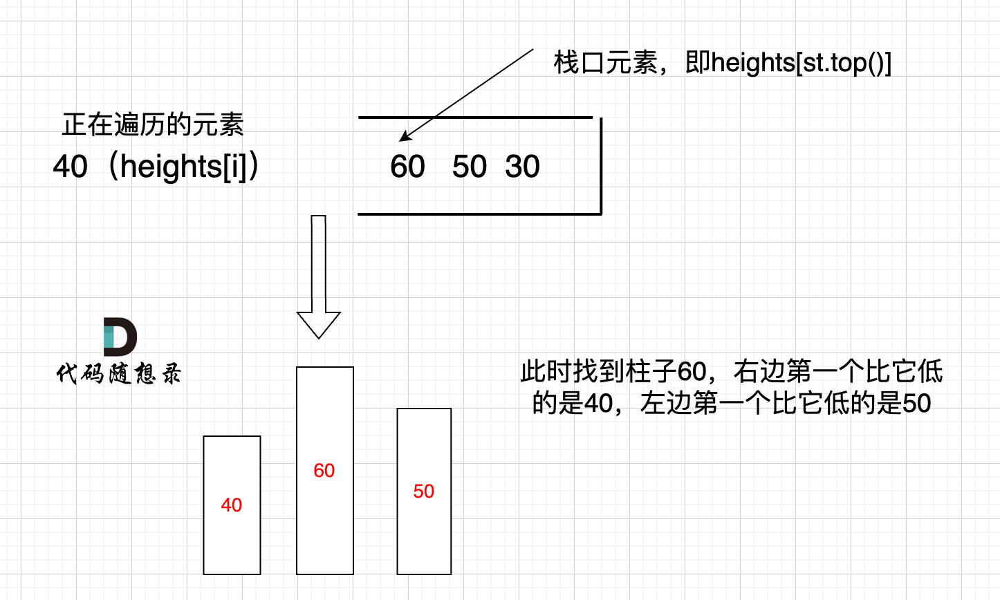

只有栈里从大到小的顺序，才能保证栈顶元素找到左右两边第一个小于栈顶元素的柱子。

所以本题单调栈的顺序正好与接雨水反过来。

此时大家应该可以发现其实就是**栈顶和栈顶的下一个元素以及要入栈的三个元素组成了我们要求最大面积的高度和** **宽度**

理解这一点，对单调栈就掌握的比较到位了。

除了栈内元素顺序和接雨水不同，剩下的逻辑就都差不多了，在题解[42. 接雨水](https://programmercarl.com/0042.%E6%8E%A5%E9%9B%A8%E6%B0%B4.html)我已经对单调栈的各个方面做了详细讲解，这里就不赘述了。

主要就是分析清楚如下三种情况：

- 情况一：当前遍历的元素`heights[i]`大于栈顶元素`heights[st.top()]`的情况
- 情况二：当前遍历的元素`heights[i]`等于栈顶元素`heights[st.top()]`的情况
- 情况三：当前遍历的元素`heights[i]`小于栈顶元素`heights[st.top()]`的情况

`C++`代码如下：

```cpp
// 版本一
class Solution {
public:
    int largestRectangleArea(vector<int>& heights) {
        int result = 0;
        stack<int> st;
        heights.insert(heights.begin(), 0); // 数组头部加入元素0
        heights.push_back(0); // 数组尾部加入元素0
        st.push(0);
        // 第一个元素已经入栈，从下标1开始
        for (int i = 1; i < heights.size(); i++) {
            if (heights[i] > heights[st.top()]) { // 情况一
                st.push(i);
            } else if (heights[i] == heights[st.top()]) { // 情况二
                st.pop(); // 这个可以加，可以不加，效果一样，思路不同
                st.push(i);
            } else { // 情况三
                while (!st.empty() && heights[i] < heights[st.top()]) { // 注意是while
                    int mid = st.top();
                    st.pop();
                    if (!st.empty()) {
                        int left = st.top();
                        int right = i;
                        int w = right - left - 1;
                        int h = heights[mid];
                        result = max(result, w * h);
                    }
                }
                st.push(i);
            }
        }
        return result;
    }
};
```

细心的录友会发现，我在 height数组上后，都加了一个元素0， 为什么这么做呢？ 

首先来说末尾为什么要加元素0？ 

如果数组本身就是升序的，例如`[2,4,6,8]`，那么入栈之后 都是单调递减，一直都没有走 情况三 计算结果的哪一步，所以最后输出的就是0了。 如图： 

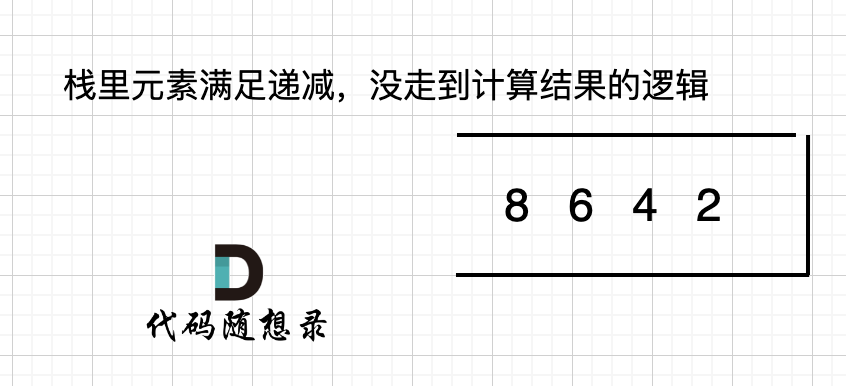

那么结尾加一个0，就会让栈里的所有元素，走到情况三的逻辑。 

开头为什么要加元素0？ 

如果数组本身是降序的，例如 `[8,6,4,2]`，在 8 入栈后，6 开始与8 进行比较，此时我们得到 mid（8），rigt（6），但是得不到 left。

（mid、left，right 都是对应版本一里的逻辑）

因为 将 8 弹出之后，栈里没有元素了，那么为了避免空栈取值，直接跳过了计算结果的逻辑。 

之后又将6 加入栈（此时8已经弹出了），然后 就是 4 与 栈口元素 8 进行比较，周而复始，那么计算的最后结果resutl就是0。 如图所示： 

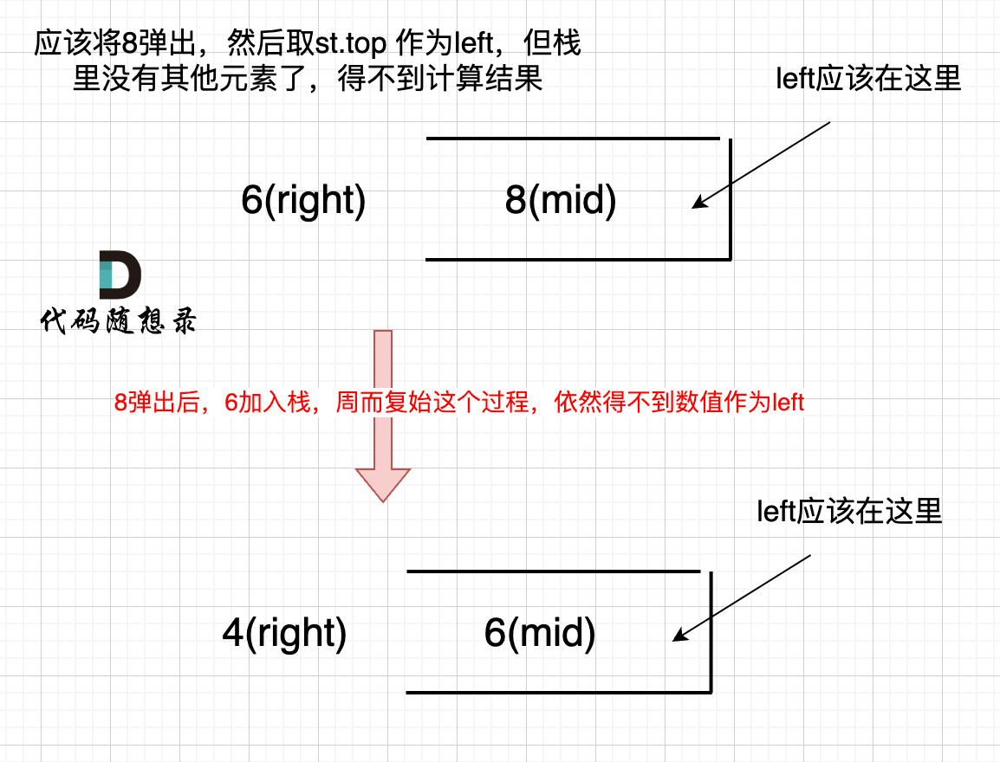

所以我们需要在 height数组前后各加一个元素0。 

版本一代码精简之后：

```cpp
// 版本二
class Solution {
public:
    int largestRectangleArea(vector<int>& heights) {
        stack<int> st;
        heights.insert(heights.begin(), 0); // 数组头部加入元素0
        heights.push_back(0); // 数组尾部加入元素0
        st.push(0);
        int result = 0;
        for (int i = 1; i < heights.size(); i++) {
            while (heights[i] < heights[st.top()]) {
                int mid = st.top();
                st.pop();
                int w = i - st.top() - 1;
                int h = heights[mid];
                result = max(result, w * h);
            }
            st.push(i);
        }
        return result;
    }
};
```

这里我依然建议大家按部就班把版本一写出来，把情况一二三分析清楚，然后在精简代码到版本二。 直接看版本二容易忽略细节！
