[](https://programmercarl.com/other/xunlianying.html)

**《代码随想录》作者：**[**程序员Carl**](https://github.com/youngyangyang04)

- 代码随想录官网[（网站持续更新优化内容，建议直接看网站）](https://www.programmercarl.com/)：www.programmercarl.com
- 代码随想录[Github开源地址](https://github.com/youngyangyang04/leetcode-master)
- [代码随想录算法公开课](https://programmercarl.com/other/gongkaike.html)，代码随想录的全部内容将由我（[程序员Carl](https://github.com/youngyangyang04)）视频讲解并开免费开放给大家。
- [《代码随想录》](https://programmercarl.com/other/publish.html) 已经出版。
- [代码随想录知识星球](https://programmercarl.com/other/kstar.html) 上万录友在这里学习
- [代码随想录算法训练营](https://programmercarl.com/other/xunlianying.html) 帮助录友高效刷完代码随想录。
- 微信公众号：[代码随想录](https://img-blog.csdnimg.cn/74f47bc466234462bd2acc3ba6cd1b70.png)
- 组队刷题，可以添加[代码随想录官方微信](https://www.programmercarl.com/other/wechat.html)
- ACM模式练习，推荐：[卡码网](https://kamacoder.com/)

**特别提示**：PDF仅提供`C++`语言版本同时PDF中很多动图无法加载，其他编程语言版本和查看动图可以移步至代码随想录官方网站查看。

# 1. 关于链表，你该了解这些！

什么是链表，链表是一种通过指针串联在一起的线性结构，每一个节点由两部分组成，一个是数据域一个是指针域（存放指向下一个节点的指针），最后一个节点的指针域指向null（空指针的意思）。

链表的入口节点称为链表的头结点也就是head。

如图所示：

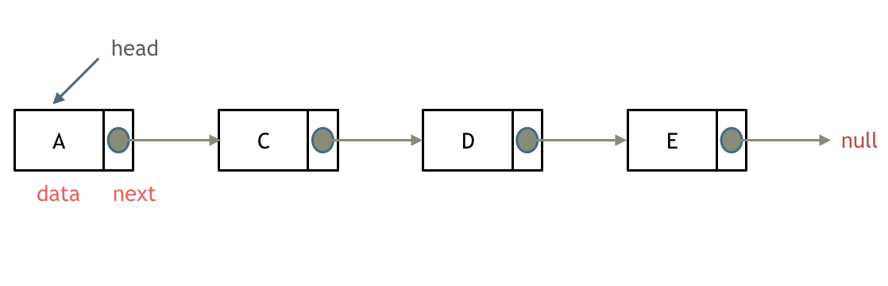

## 链表的类型

接下来说一下链表的几种类型:

### 单链表

刚刚说的就是单链表。

### 双链表

单链表中的指针域只能指向节点的下一个节点。

双链表：每一个节点有两个指针域，一个指向下一个节点，一个指向上一个节点。

双链表 既可以向前查询也可以向后查询。

如图所示：

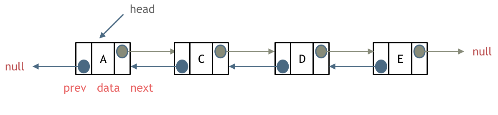

### 循环链表

循环链表，顾名思义，就是链表首尾相连。

循环链表可以用来解决约瑟夫环问题。

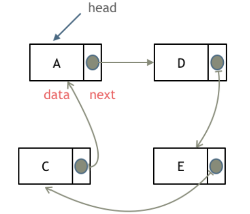

## 链表的存储方式

了解完链表的类型，再来说一说链表在内存中的存储方式。

数组是在内存中是连续分布的，但是链表在内存中可不是连续分布的。

链表是通过指针域的指针链接在内存中各个节点。

所以链表中的节点在内存中不是连续分布的 ，而是散乱分布在内存中的某地址上，分配机制取决于操作系统的内存管理。

如图所示：

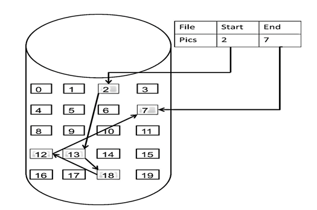

这个链表起始节点为2， 终止节点为7，  各个节点分布在内存的不同地址空间上，通过指针串联在一起。

## 链表的定义

接下来说一说链表的定义。

链表节点的定义，很多同学在面试的时候都写不好。

这是因为平时在刷leetcode的时候，链表的节点都默认定义好了，直接用就行了，所以同学们都没有注意到链表的节点是如何定义的。

而在面试的时候，一旦要自己手写链表，就写的错漏百出。

这里我给出`C/C++`的定义链表节点方式，如下所示：

```cpp
// 单链表
struct ListNode {
    int val;  // 节点上存储的元素
    ListNode *next;  // 指向下一个节点的指针
    ListNode(int x) : val(x), next(NULL) {}  // 节点的构造函数
};
```

有同学说了，我不定义构造函数行不行，答案是可以的，`C++`默认生成一个构造函数。

但是这个构造函数不会初始化任何成员变量，下面我来举两个例子：

通过自己定义构造函数初始化节点：

```cpp
ListNode* head = new ListNode(5);
```

使用默认构造函数初始化节点：

```cpp
ListNode* head = new ListNode();
head->val = 5;
```

所以如果不定义构造函数使用默认构造函数的话，在初始化的时候就不能直接给变量赋值！

## 链表的操作

### 删除节点

删除D节点，如图所示：

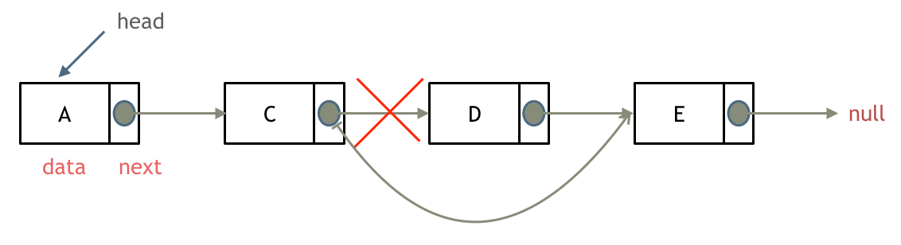

只要将C节点的next指针 指向E节点就可以了。

那有同学说了，D节点不是依然存留在内存里么？只不过是没有在这个链表里而已。

是这样的，所以在`C++`里最好是再手动释放这个D节点，释放这块内存。

其他语言例如Java、Python，就有自己的内存回收机制，就不用自己手动释放了。

### 添加节点

如图所示：

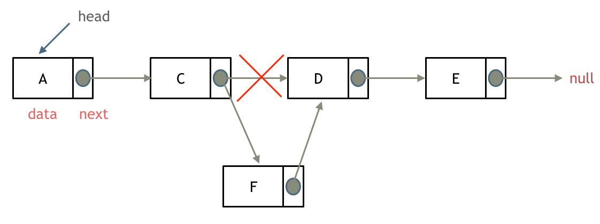

可以看出链表的增添和删除都是`O(1)`操作，也不会影响到其他节点。

但是要注意，要是删除第五个节点，需要从头节点查找到第四个节点通过next指针进行删除操作，查找的时间复杂度是`O(n)`。

## 性能分析

再把链表的特性和数组的特性进行一个对比，如图所示：

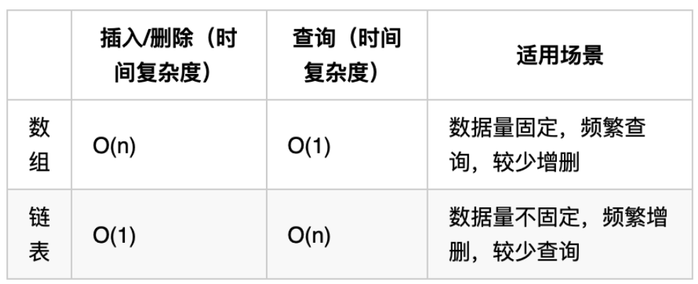

数组在定义的时候，长度就是固定的，如果想改动数组的长度，就需要重新定义一个新的数组。

链表的长度可以是不固定的，并且可以动态增删， 适合数据量不固定，频繁增删，较少查询的场景。

相信大家已经对链表足够的了解，后面我会讲解关于链表的高频面试题目，我们下期见！

链表操作中，可以使用原链表来直接进行删除操作，也可以设置一个虚拟头结点再进行删除操作，接下来看一看哪种方式更方便。

# 2.移除链表元素

[力扣题目链接](https://leetcode.cn/problems/remove-linked-list-elements/)

题意：删除链表中等于给定值 val 的所有节点。

示例 1：  
输入：`head = [1,2,6,3,4,5,6], val = 6`  
输出：`[1,2,3,4,5]`

示例 2：  
输入：`head = [], val = 1`  
输出：`[]`

示例 3：  
输入：`head = [7,7,7,7], val = 7`  
输出：`[]`

## 算法公开课

[**《代码随想录》算法视频公开课**](https://programmercarl.com/other/gongkaike.html)**：**[**链表基础操作| LeetCode：203.移除链表元素**](https://www.bilibili.com/video/BV18B4y1s7R9)**，相信结合视频再看本篇题解，** **更有助于大家对本题的理解**。

## 思路

这里以链表 1 4 2 4  来举例，移除元素4。

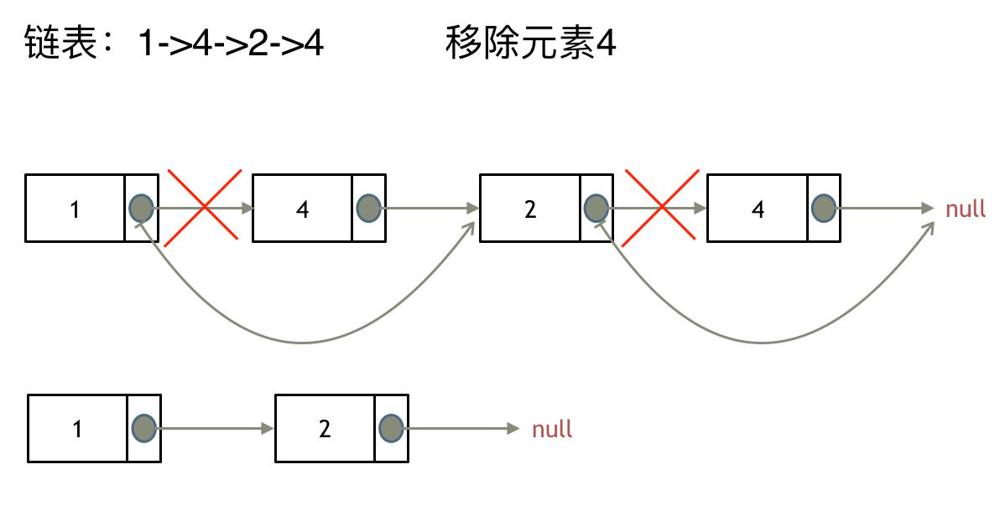

如果使用C，`C++`编程语言的话，不要忘了还要从内存中删除这两个移除的节点， 清理节点内存之后如图：

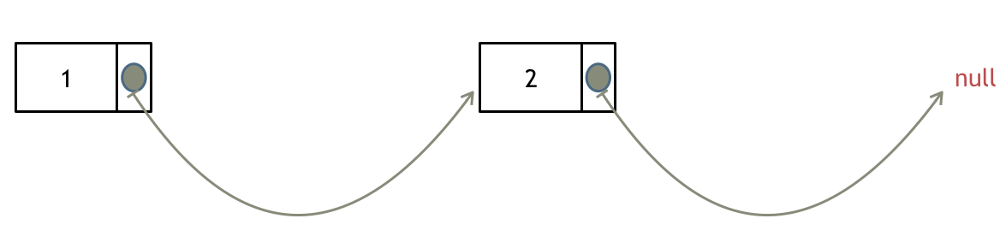

**当然如果使用java ，python的话就不用手动管理内存了。**

还要说明一下，就算使用`C++`来做leetcode，如果移除一个节点之后，没有手动在内存中删除这个节点，leetcode依然也是可以通过的，只不过，内存使用的空间大一些而已，但建议依然要养成手动清理内存的习惯。

这种情况下的移除操作，就是让节点next指针直接指向下下一个节点就可以了，

那么因为单链表的特殊性，只能指向下一个节点，刚刚删除的是链表的中第二个，和第四个节点，那么如果删除的是头结点又该怎么办呢？

这里就涉及如下链表操作的两种方式：

- **直接使用原来的链表来进行删除操作。**
- **设置一个虚拟头结点在进行删除操作。**

来看第一种操作：直接使用原来的链表来进行移除。

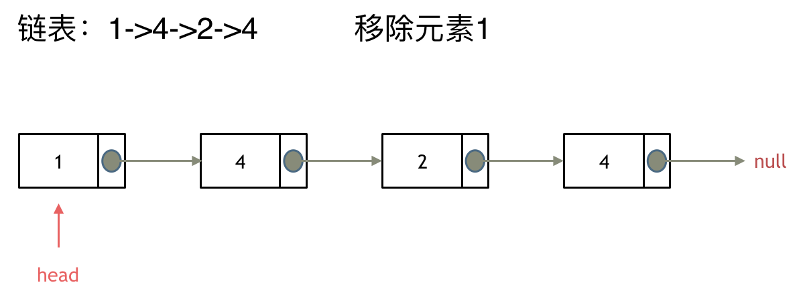

移除头结点和移除其他节点的操作是不一样的，因为链表的其他节点都是通过前一个节点来移除当前节点，而头结点没有前一个节点。

所以头结点如何移除呢，其实只要将头结点向后移动一位就可以，这样就从链表中移除了一个头结点。

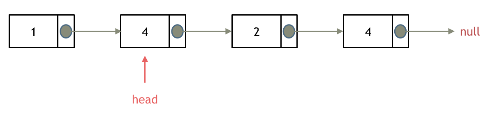

依然别忘将原头结点从内存中删掉。

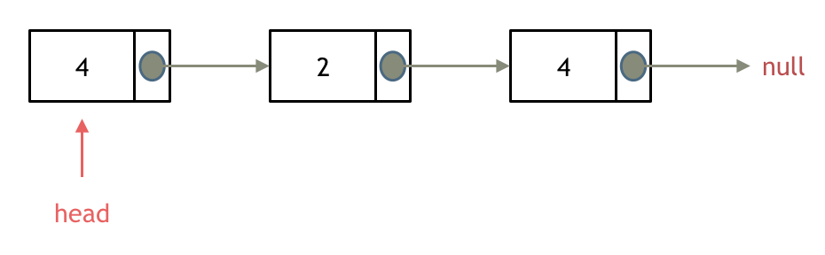

这样移除了一个头结点，是不是发现，在单链表中移除头结点 和 移除其他节点的操作方式是不一样，其实在写代码的时候也会发现，需要单独写一段逻辑来处理移除头结点的情况。

那么可不可以 以一种统一的逻辑来移除 链表的节点呢。

其实**可以设置一个虚拟头结点**，这样原链表的所有节点就都可以按照统一的方式进行移除了。

来看看如何设置一个虚拟头。依然还是在这个链表中，移除元素1。

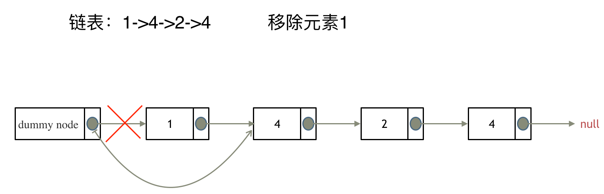

这里来给链表添加一个虚拟头结点为新的头结点，此时要移除这个旧头结点元素1。

这样是不是就可以使用和移除链表其他节点的方式统一了呢？

来看一下，如何移除元素1 呢，还是熟悉的方式，然后从内存中删除元素1。

```cpp
最后呢在题目中，return 头结点的时候，别忘了 return  dummyNode->next; ， 这才是新的头结点
```

**直接使用原来的链表来进行移除节点操作：**

```cpp
class Solution {
public:
    ListNode* removeElements(ListNode* head, int val) {
        // 删除头结点
        while (head != NULL && head->val == val) { // 注意这里不是if
            ListNode* tmp = head;
            head = head->next;
            delete tmp;
        }
        // 删除非头结点
        ListNode* cur = head;
        while (cur != NULL && cur->next!= NULL) {
            if (cur->next->val == val) {
                ListNode* tmp = cur->next;
                cur->next = cur->next->next;
                delete tmp;
            } else {
                cur = cur->next;
            }
        }
        return head;
    }
};
```

- 时间复杂度`: O(n)`
- 空间复杂度`: O(1)`

**设置一个虚拟头结点在进行移除节点操作：**

```cpp
class Solution {
public:
    ListNode* removeElements(ListNode* head, int val) {
        ListNode* dummyHead = new ListNode(0); // 设置一个虚拟头结点
        dummyHead->next = head; // 将虚拟头结点指向head，这样方面后面做删除操作
        ListNode* cur = dummyHead;
        while (cur->next != NULL) {
            if(cur->next->val == val) {
                ListNode* tmp = cur->next;
                cur->next = cur->next->next;
                delete tmp;
            } else {
                cur = cur->next;
            }
        }
        head = dummyHead->next;
        delete dummyHead;
        return head;
    }
};
```

- 时间复杂度`: O(n)`
- 空间复杂度`: O(1)`

听说这道题目把链表常见的五个操作都覆盖了？

# 3.设计链表

[力扣题目链接](https://leetcode.cn/problems/design-linked-list/)

题意：

在链表类中实现这些功能：

- `get(index)`：获取链表中第 index 个节点的值。如果索引无效，则返回-1。
- `addAtHead(val)`：在链表的第一个元素之前添加一个值为 val 的节点。插入后，新节点将成为链表的第一个节点。
- `addAtTail(val)`：将值为 val 的节点追加到链表的最后一个元素。
- `addAtIndex(index,val)`：在链表中的第 index 个节点之前添加值为 val  的节点。如果 index 等于链表的长度，则该节点将附加到链表的末尾。如果 index 大于链表长度，则不会插入节点。如果index小于0，则在头部插入节点。
- `deleteAtIndex(index)`：如果索引 index 有效，则删除链表中的第 index 个节点。

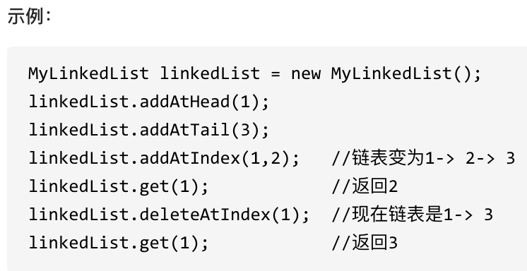

## 算法公开课

[**《代码随想录》算法视频公开课**](https://programmercarl.com/other/gongkaike.html)**：**[**帮你把链表操作学个通透！LeetCode：707.设计链表**](https://www.bilibili.com/video/BV1FU4y1X7WD)**，相信结合视频再看本篇** **题解，更有助于大家对本题的理解**。

## 思路

如果对链表的基础知识还不太懂，可以看这篇文章：[关于链表，你该了解这些！](https://programmercarl.com/%E9%93%BE%E8%A1%A8%E7%90%86%E8%AE%BA%E5%9F%BA%E7%A1%80.html)

如果对链表的虚拟头结点不清楚，可以看这篇文章：[链表：听说用虚拟头节点会方便很多？](https://programmercarl.com/0203.%E7%A7%BB%E9%99%A4%E9%93%BE%E8%A1%A8%E5%85%83%E7%B4%A0.html)

删除链表节点：


添加链表节点：


这道题目设计链表的五个接口：

- 获取链表第index个节点的数值
- 在链表的最前面插入一个节点
- 在链表的最后面插入一个节点
- 在链表第index个节点前面插入一个节点
- 删除链表的第index个节点

可以说这五个接口，已经覆盖了链表的常见操作，是练习链表操作非常好的一道题目

**链表操作的两种方式：**

1. 直接使用原来的链表来进行操作。2. 设置一个虚拟头结点在进行操作。

下面采用的设置一个虚拟头结点（这样更方便一些，大家看代码就会感受出来）。

```cpp
class MyLinkedList {
public:
    // 定义链表节点结构体
    struct LinkedNode {
        int val;
        LinkedNode* next;
        LinkedNode(int val):val(val), next(nullptr){}
    };
    // 初始化链表
    MyLinkedList() {
        _dummyHead = new LinkedNode(0); // 这里定义的头结点 是一个虚拟头结点，而不是真正的链表头
结点
        _size = 0;
    }
    // 获取到第index个节点数值，如果index是非法数值直接返回-1， 注意index是从0开始的，第0个节点就是
头结点
    int get(int index) {
        if (index > (_size - 1) || index < 0) {
            return -1;
        }
        LinkedNode* cur = _dummyHead->next;
        while(index--){ // 如果--index 就会陷入死循环
            cur = cur->next;
        }
        return cur->val;
    }
    // 在链表最前面插入一个节点，插入完成后，新插入的节点为链表的新的头结点
    void addAtHead(int val) {
        LinkedNode* newNode = new LinkedNode(val);
        newNode->next = _dummyHead->next;
        _dummyHead->next = newNode;
        _size++;
    }
    // 在链表最后面添加一个节点
    void addAtTail(int val) {
        LinkedNode* newNode = new LinkedNode(val);
        LinkedNode* cur = _dummyHead;
        while(cur->next != nullptr){
            cur = cur->next;
        }
        cur->next = newNode;
        _size++;
    }
    // 在第index个节点之前插入一个新节点，例如index为0，那么新插入的节点为链表的新头节点。
    // 如果index 等于链表的长度，则说明是新插入的节点为链表的尾结点
    // 如果index大于链表的长度，则返回空
    // 如果index小于0，则在头部插入节点
    void addAtIndex(int index, int val) {
        if(index > _size) return;
        if(index < 0) index = 0;
        LinkedNode* newNode = new LinkedNode(val);
        LinkedNode* cur = _dummyHead;
        while(index--) {
            cur = cur->next;
        }
        newNode->next = cur->next;
        cur->next = newNode;
        _size++;
    }
    // 删除第index个节点，如果index 大于等于链表的长度，直接return，注意index是从0开始的
```

```cpp
    void deleteAtIndex(int index) {
        if (index >= _size || index < 0) {
            return;
        }
        LinkedNode* cur = _dummyHead;
        while(index--) {
            cur = cur ->next;
        }
        LinkedNode* tmp = cur->next;
        cur->next = cur->next->next;
        delete tmp;
        //delete命令指示释放了tmp指针原本所指的那部分内存，
        //被delete后的指针tmp的值（地址）并非就是NULL，而是随机值。也就是被delete后，
        //如果不再加上一句tmp=nullptr,tmp会成为乱指的野指针
        //如果之后的程序不小心使用了tmp，会指向难以预想的内存空间
        tmp=nullptr;
        _size--;
    }
    // 打印链表
    void printLinkedList() {
        LinkedNode* cur = _dummyHead;
        while (cur->next != nullptr) {
            cout << cur->next->val << " ";
            cur = cur->next;
        }
        cout << endl;
    }
private:
    int _size;
    LinkedNode* _dummyHead;
};
时间复杂度: 涉及 index 的相关操作为 O(index), 其余为 O(1)
```

- 空间复杂度`: O(n)`

反转链表的写法很简单，一些同学甚至可以背下来但过一阵就忘了该咋写，主要是因为没有理解真正的反转过程。

# 4.反转链表

[力扣题目链接](https://leetcode.cn/problems/reverse-linked-list/)

题意：反转一个单链表。

示例:  
输入`: 1->2->3->4->5->NULL`  
输出`: 5->4->3->2->1->NULL`

## 算法公开课

[**《代码随想录》算法视频公开课**](https://programmercarl.com/other/gongkaike.html)**：**[**帮你拿下反转链表 | LeetCode：206.反转链表**](https://www.bilibili.com/video/BV1nB4y1i7eL)**，相信结合视频再看本篇题解，** **更有助于大家对本题的理解**。

## 思路

如果再定义一个新的链表，实现链表元素的反转，其实这是对内存空间的浪费。

其实只需要改变链表的next指针的指向，直接将链表反转 ，而不用重新定义一个新的链表，如图所示:


之前链表的头节点是元素1， 反转之后头结点就是元素5 ，这里并没有添加或者删除节点，仅仅是改变next指针的方向。

那么接下来看一看是如何反转的呢？

我们拿有示例中的链表来举例，如动画所示：（纠正：动画应该是先移动pre，在移动cur）

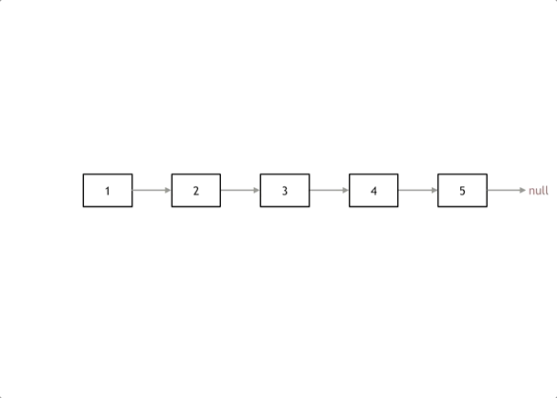

首先定义一个cur指针，指向头结点，再定义一个pre指针，初始化为null。

然后就要开始反转了，首先要把 `cur->next` 节点用tmp指针保存一下，也就是保存一下这个节点。

为什么要保存一下这个节点呢，因为接下来要改变 `cur->next` 的指向了，将`cur->next` 指向pre ，此时已经反转了第一个节点了。

接下来，就是循环走如下代码逻辑了，继续移动pre和cur指针。

最后，cur 指针已经指向了null，循环结束，链表也反转完毕了。 此时我们return pre指针就可以了，pre指针就指向了新的头结点。

### 双指针法

```cpp
class Solution {
public:
    ListNode* reverseList(ListNode* head) {
        ListNode* temp; // 保存cur的下一个节点
        ListNode* cur = head;
        ListNode* pre = NULL;
        while(cur) {
            temp = cur->next;  // 保存一下 cur的下一个节点，因为接下来要改变cur->next
            cur->next = pre; // 翻转操作
            // 更新pre 和 cur指针
            pre = cur;
            cur = temp;
        }
        return pre;
    }
};
```

- 时间复杂度`: O(n)`
- 空间复杂度`: O(1)`

### 递归法

递归法相对抽象一些，但是其实和双指针法是一样的逻辑，同样是当cur为空的时候循环结束，不断将cur指向pre的过程。

关键是初始化的地方，可能有的同学会不理解， 可以看到双指针法中初始化 `cur = head`，`pre = NULL`，在递归法中可以从如下代码看出初始化的逻辑也是一样的，只不过写法变了。

具体可以看代码（已经详细注释），**双指针法写出来之后，理解如下递归写法就不难了，代码逻辑都是一样的。**

```cpp
class Solution {
public:
    ListNode* reverse(ListNode* pre,ListNode* cur){
        if(cur == NULL) return pre;
        ListNode* temp = cur->next;
        cur->next = pre;
        // 可以和双指针法的代码进行对比，如下递归的写法，其实就是做了这两步
        // pre = cur;
        // cur = temp;
        return reverse(cur,temp);
    }
    ListNode* reverseList(ListNode* head) {
        // 和双指针法初始化是一样的逻辑
        // ListNode* cur = head;
        // ListNode* pre = NULL;
        return reverse(NULL, head);
    }
};
```

- 时间复杂度`: O(n),` 要递归处理链表的每个节点
- 空间复杂度`: O(n),` 递归调用了 n 层栈空间

我们可以发现，上面的递归写法和双指针法实质上都是从前往后翻转指针指向，其实还有另外一种与双指针法不同思路的递归写法：从后往前翻转指针指向。

具体代码如下（带详细注释）：

```cpp
class Solution {
public:
    ListNode* reverseList(ListNode* head) {
        // 边缘条件判断
        if(head == NULL) return NULL;
        if (head->next == NULL) return head;
        // 递归调用，翻转第二个节点开始往后的链表
        ListNode *last = reverseList(head->next);
        // 翻转头节点与第二个节点的指向
        head->next->next = head;
        // 此时的 head 节点为尾节点，next 需要指向 NULL
        head->next = NULL;
        return last;
    }
};
```

- 时间复杂度`: O(n)`
- 空间复杂度`: O(n)`

## 其他解法

### 使用虚拟头结点解决链表反转

使用虚拟头结点，通过头插法实现链表的反转（不需要栈）

```cpp
// 迭代方法：增加虚头结点，使用头插法实现链表翻转
public static ListNode reverseList1(ListNode head) {
    // 创建虚头结点
    ListNode dumpyHead = new ListNode(-1);
    dumpyHead.next = null;
    // 遍历所有节点
    ListNode cur = head;
    while(cur != null){
        ListNode temp = cur.next;
        // 头插法
        cur.next = dumpyHead.next;
        dumpyHead.next = cur;
        cur = temp;
    }
    return dumpyHead.next;
}
```

### 使用栈解决反转链表的问题

- 首先将所有的结点入栈
- 然后创建一个虚拟虚拟头结点，让cur指向虚拟头结点。然后开始循环出栈，每出来一个元素，就把它加入到以虚拟头结点为头结点的链表当中，最后返回即可。

```cpp
public ListNode reverseList(ListNode head) {
    // 如果链表为空，则返回空
    if (head == null) return null;
    // 如果链表中只有只有一个元素，则直接返回
    if (head.next == null) return head;
    // 创建栈 每一个结点都入栈
    Stack<ListNode> stack = new Stack<>();
    ListNode cur = head;
    while (cur != null) {
        stack.push(cur);
        cur = cur.next;
    }
    // 创建一个虚拟头结点
    ListNode pHead = new ListNode(0);
    cur = pHead;
    while (!stack.isEmpty()) {
        ListNode node = stack.pop();
        cur.next = node;
        cur = cur.next;
    }
    // 最后一个元素的next要赋值为空
    cur.next = null;
    return pHead.next;
}
```

采用这种方法需要注意一点。就是当整个出栈循环结束以后，cur正好指向原来链表的第一个结点，而此时结

```text
点1中的next指向的是结点2，因此最后还需要cur.next = null
```

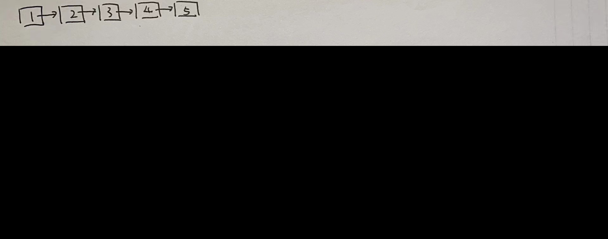

# 5. 两两交换链表中的节点

[力扣题目链接](https://leetcode.cn/problems/swap-nodes-in-pairs/)

给定一个链表，两两交换其中相邻的节点，并返回交换后的链表。

你不能只是单纯的改变节点内部的值，而是需要实际的进行节点交换。

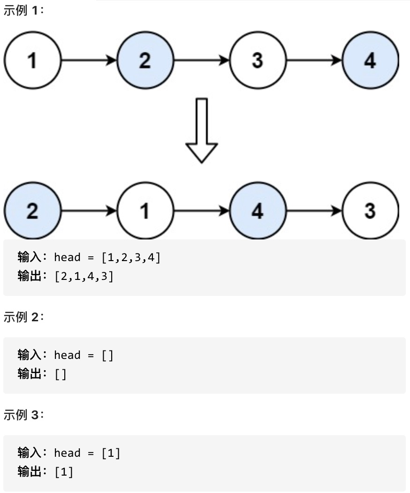

## 算法公开课

[**《代码随想录》算法视频公开课**](https://programmercarl.com/other/gongkaike.html)**：**[**帮你把链表细节学清楚！ | LeetCode：24. 两两交换链表中的节点**](https://www.bilibili.com/video/BV1YT411g7br)**，相信结合** **视频再看本篇题解，更有助于大家对本题的理解**。

## 思路

这道题目正常模拟就可以了。

建议使用虚拟头结点，这样会方便很多，要不然每次针对头结点（没有前一个指针指向头结点），还要单独处理。

对虚拟头结点的操作，还不熟悉的话，可以看这篇[链表：听说用虚拟头节点会方便很多？](https://programmercarl.com/0203.%E7%A7%BB%E9%99%A4%E9%93%BE%E8%A1%A8%E5%85%83%E7%B4%A0.html)。

接下来就是交换相邻两个元素了，**此时一定要画图，不画图，操作多个指针很容易乱，而且要操作的先后顺序**

初始时，cur指向虚拟头结点，然后进行如下三步：

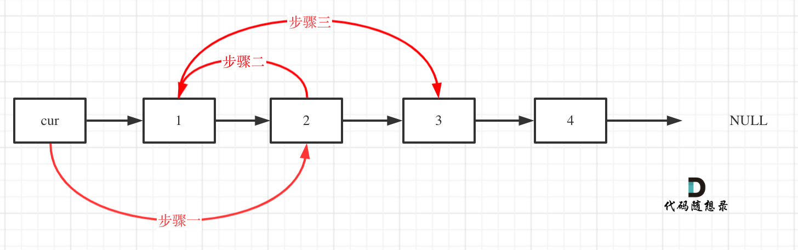

操作之后，链表如下：

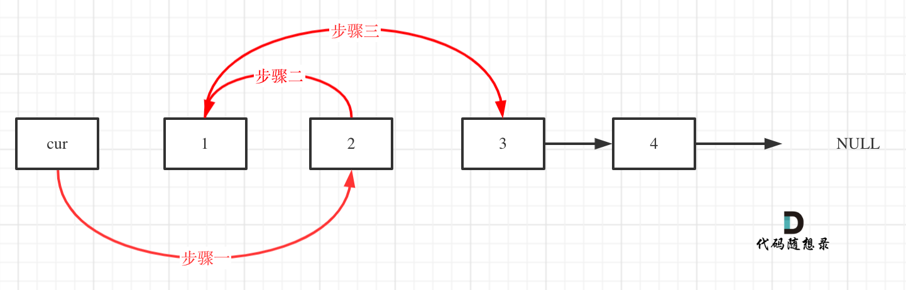

看这个可能就更直观一些了：

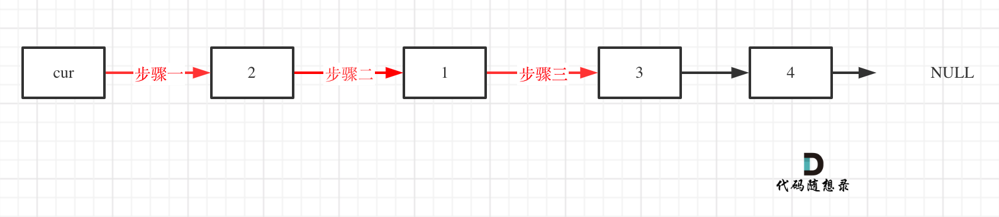

对应的`C++`代码实现如下： （注释中详细和如上图中的三步做对应）

```cpp
class Solution {
public:
    ListNode* swapPairs(ListNode* head) {
        ListNode* dummyHead = new ListNode(0); // 设置一个虚拟头结点
        dummyHead->next = head; // 将虚拟头结点指向head，这样方面后面做删除操作
        ListNode* cur = dummyHead;
        while(cur->next != nullptr && cur->next->next != nullptr) {
            ListNode* tmp = cur->next; // 记录临时节点
            ListNode* tmp1 = cur->next->next->next; // 记录临时节点
            cur->next = cur->next->next;    // 步骤一
            cur->next->next = tmp;          // 步骤二
            cur->next->next->next = tmp1;   // 步骤三
            cur = cur->next->next; // cur移动两位，准备下一轮交换
        }
        return dummyHead->next;
    }
};
```

- 时间复杂度：`O(n)`
- 空间复杂度：`O(1)`

## 拓展

**这里还是说一下，大家不必太在意力扣上执行用时，打败多少多少用户，这个统计不准确的。**

做题的时候自己能分析出来时间复杂度就可以了，至于力扣上执行用时，大概看一下就行。

上面的代码我第一次提交执行用时8ms，打败6.5%的用户，差点吓到我了。

心想应该没有更好的方法了吧，也就`$O(n)$`的时间复杂度，重复提交几次，这样了：


力扣上的统计如果两份代码是 100ms 和 300ms的耗时，其实是需要注意的。

如果一个是 4ms 一个是 12ms，看上去好像是一个打败了80%，一个打败了20%，其实是没有差别的。 只不过是力扣上统计的误差而已。

# 6.删除链表的倒数第N个节点

[力扣题目链接](https://leetcode.cn/problems/remove-nth-node-from-end-of-list/)

给你一个链表，删除链表的倒数第 n 个结点，并且返回链表的头结点。

进阶：你能尝试使用一趟扫描实现吗？

示例 1：

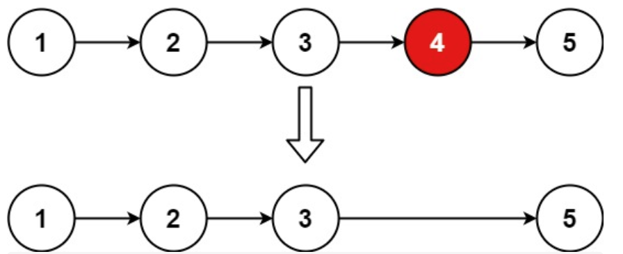

输入：`head = [1,2,3,4,5], n = 2`  
输出：`[1,2,3,5]`  
示例 2：

输入：`head = [1], n = 1`  
输出：`[]`  
示例 3：

输入：`head = [1,2], n = 1`  
输出：`[1]`

## 算法公开课

[**《代码随想录》算法视频公开课**](https://programmercarl.com/other/gongkaike.html)**：：**[**链表遍历学清楚！ | LeetCode：19.删除链表倒数第N个节点**](https://www.bilibili.com/video/BV1vW4y1U7Gf)**，相信结合视频** **再看本篇题解，更有助于大家对链表的理解。**

## 思路

双指针的经典应用，如果要删除倒数第n个节点，让fast移动n步，然后让fast和slow同时移动，直到fast指向链表末尾。删掉slow所指向的节点就可以了。

思路是这样的，但要注意一些细节。

分为如下几步：

- 首先这里我推荐大家使用虚拟头结点，这样方便处理删除实际头结点的逻辑，如果虚拟头结点不清楚，可以看这篇： [链表：听说用虚拟头节点会方便很多？](https://programmercarl.com/0203.%E7%A7%BB%E9%99%A4%E9%93%BE%E8%A1%A8%E5%85%83%E7%B4%A0.html)
- 定义fast指针和slow指针，初始值为虚拟头结点，如图：


- fast首先走n + 1步 ，为什么是n+1呢，因为只有这样同时移动的时候slow才能指向删除节点的上一个节点（方便做删除操作），如图：


- fast和slow同时移动，直到fast指向末尾，如题：

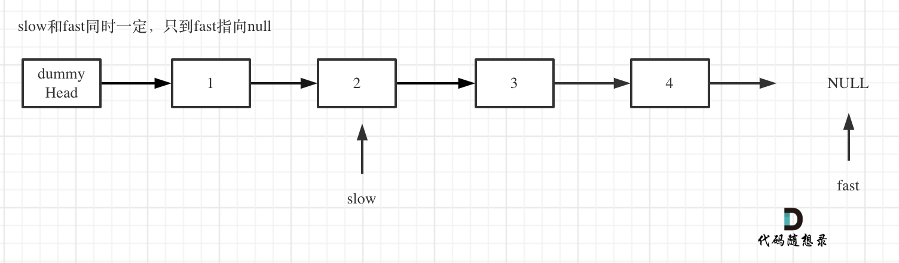

- 删除slow指向的下一个节点，如图：

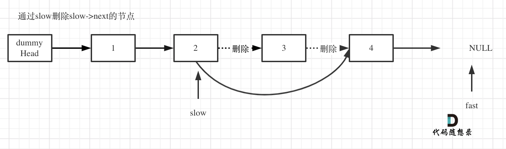

此时不难写出如下`C++`代码：

```cpp
class Solution {
public:
    ListNode* removeNthFromEnd(ListNode* head, int n) {
        ListNode* dummyHead = new ListNode(0);
        dummyHead->next = head;
        ListNode* slow = dummyHead;
        ListNode* fast = dummyHead;
        while(n-- && fast != NULL) {
            fast = fast->next;
        }
        fast = fast->next; // fast再提前走一步，因为需要让slow指向删除节点的上一个节点
        while (fast != NULL) {
            fast = fast->next;
            slow = slow->next;
        }
        slow->next = slow->next->next;
        // ListNode *tmp = slow->next;  C++释放内存的逻辑
        // slow->next = tmp->next;
        // delete nth;
        return dummyHead->next;
    }
};
```

- 时间复杂度`: O(n)`
- 空间复杂度`: O(1)`

# 7. 面试题 02.07. 链表相交

同：160.链表相交

[力扣题目链接](https://leetcode.cn/problems/intersection-of-two-linked-lists-lcci/)

给你两个单链表的头节点 headA 和 headB ，请你找出并返回两个单链表相交的起始节点。如果两个链表没有交点，返回 null 。

图示两个链表在节点 c1 开始相交：


题目数据 保证 整个链式结构中不存在环。

注意，函数返回结果后，链表必须 保持其原始结构 。

示例 1：


示例 2：


示例 3：

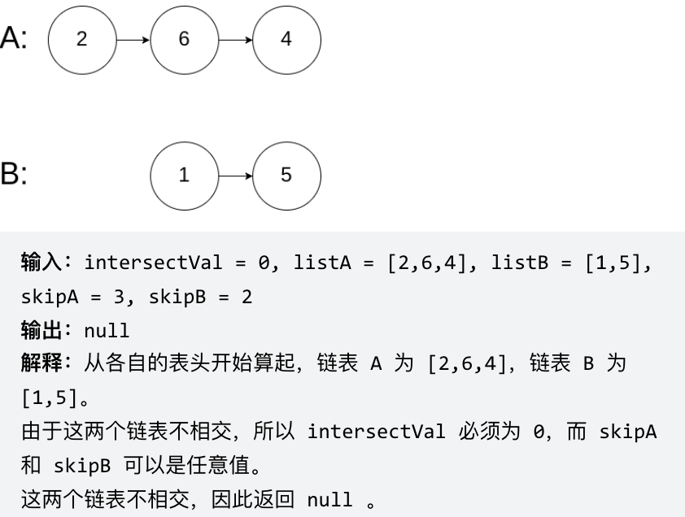


## 思路

简单来说，就是求两个链表交点节点的**指针**。 这里同学们要注意，交点不是数值相等，而是指针相等。

为了方便举例，假设节点元素数值相等，则节点指针相等。

看如下两个链表，目前curA指向链表A的头结点，curB指向链表B的头结点：

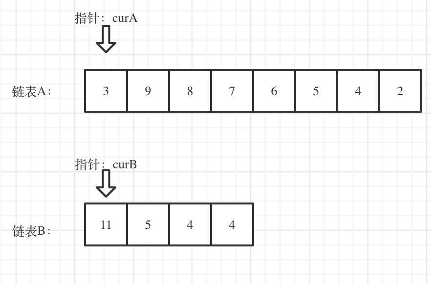

我们求出两个链表的长度，并求出两个链表长度的差值，然后让curA移动到，和curB 末尾对齐的位置，如图：


此时我们就可以比较curA和curB是否相同，如果不相同，同时向后移动curA和curB，如果遇到`curA == curB`，则找到交点。

否则循环退出返回空指针。

`C++`代码如下：

```cpp
class Solution {
public:
    ListNode *getIntersectionNode(ListNode *headA, ListNode *headB) {
        ListNode* curA = headA;
        ListNode* curB = headB;
        int lenA = 0, lenB = 0;
        while (curA != NULL) { // 求链表A的长度
            lenA++;
            curA = curA->next;
        }
        while (curB != NULL) { // 求链表B的长度
            lenB++;
            curB = curB->next;
        }
        curA = headA;
        curB = headB;
        // 让curA为最长链表的头，lenA为其长度
        if (lenB > lenA) {
            swap (lenA, lenB);
            swap (curA, curB);
        }
        // 求长度差
        int gap = lenA - lenB;
        // 让curA和curB在同一起点上（末尾位置对齐）
        while (gap--) {
            curA = curA->next;
        }
        // 遍历curA 和 curB，遇到相同则直接返回
        while (curA != NULL) {
            if (curA == curB) {
                return curA;
            }
            curA = curA->next;
            curB = curB->next;
        }
        return NULL;
    }
};
```

- 时间复杂度：`O(n + m)`
- 空间复杂度：`O(1)`

找到有没有环已经很不容易了，还要让我找到环的入口?

# 8.环形链表II

[力扣题目链接](https://leetcode.cn/problems/linked-list-cycle-ii/)

题意：给定一个链表，返回链表开始入环的第一个节点。 如果链表无环，则返回 null。

为了表示给定链表中的环，使用整数 pos 来表示链表尾连接到链表中的位置（索引从 0 开始）。 如果 pos 是 -1，则在该链表中没有环。

**说明**：不允许修改给定的链表。

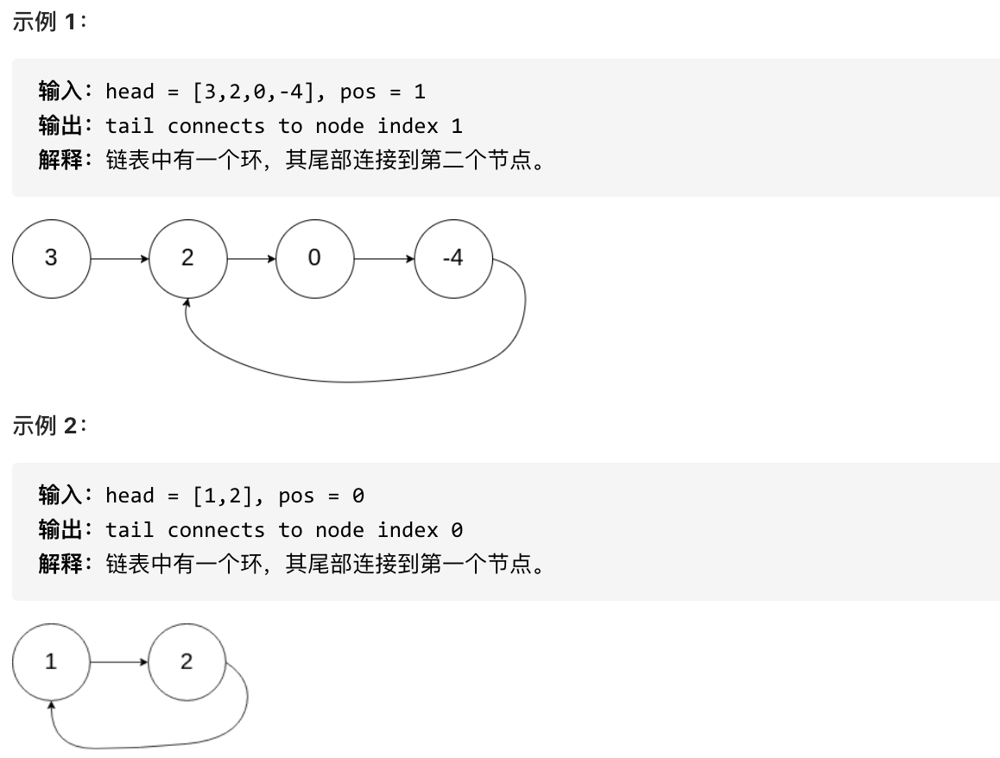

## 算法公开课

[**《代码随想录》算法视频公开课**](https://programmercarl.com/other/gongkaike.html)**：**[**把环形链表讲清楚！| LeetCode:142.环形链表II**](https://www.bilibili.com/video/BV1if4y1d7ob)**，相信结合视频在看本篇题** **解，更有助于大家对链表的理解。**

## 思路

这道题目，不仅考察对链表的操作，而且还需要一些数学运算。

主要考察两知识点：

- 判断链表是否环
- 如果有环，如何找到这个环的入口

### 判断链表是否有环

可以使用快慢指针法，分别定义 fast 和 slow 指针，从头结点出发，fast指针每次移动两个节点，slow指针每次移动一个节点，如果 fast 和 slow指针在途中相遇 ，说明这个链表有环。

为什么fast 走两个节点，slow走一个节点，有环的话，一定会在环内相遇呢，而不是永远的错开呢

首先第一点：**fast指针一定先进入环中，如果fast指针和slow指针相遇的话，一定是在环中相遇，这是毋庸置疑** **的。**那么来看一下，**为什么fast指针和slow指针一定会相遇呢？**可以画一个环，然后让 fast指针在任意一个节点开始追赶slow指针。

会发现最终都是这种情况， 如下图：

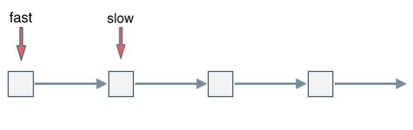

fast和slow各自再走一步， fast和slow就相遇了

这是因为fast是走两步，slow是走一步，**其实相对于slow来说，fast是一个节点一个节点的靠近slow的**，所以fast一定可以和slow重合。

动画如下：

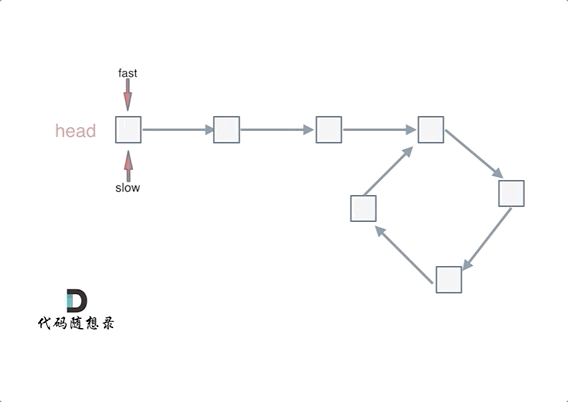

### 如果有环，如何找到这个环的入口

**此时已经可以判断链表是否有环了，那么接下来要找这个环的入口了。**

假设从头结点到环形入口节点 的节点数为x。环形入口节点到 fast指针与slow指针相遇节点 节点数为y。从相遇节点  再到环形入口节点节点数为 z。 如图所示：

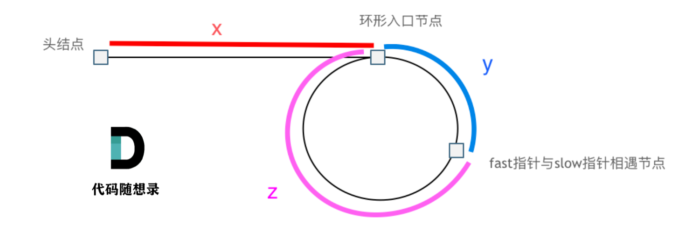

那么相遇时：

```text
slow指针走过的节点数为: x + y ，
fast指针走过的节点数：x + y + n (y + z) ，n为fast指针在环内走了n圈才遇到slow指针， （y+z）为 一圈内
```

节点的个数A。

因为fast指针是一步走两个节点，slow指针一步走一个节点， 所以 fast指针走过的节点数 `= slow`指针走过的节点数 * 2：

```text
(x + y) * 2 = x + y + n (y + z)
两边消掉一个（x+y）: x + y  = n (y + z)
```

因为要找环形的入口，那么要求的是x，因为x表示 头结点到 环形入口节点的的距离。

```text
所以要求x ，将x单独放在左面：x = n (y + z) - y ,
再从n(y+z)中提出一个 （y+z）来，整理公式之后为如下公式：x = (n - 1) (y + z) + z 注意这里n一定是大
```

于等于1的，因为 fast指针至少要多走一圈才能相遇slow指针。

这个公式说明什么呢？

先拿n为1的情况来举例，意味着fast指针在环形里转了一圈之后，就遇到了 slow指针了。

```text
当 n为1的时候，公式就化解为 x = z ，
```

这就意味着，**从头结点出发一个指针，从相遇节点 也出发一个指针，这两个指针每次只走一个节点， 那么当这两** **个指针相遇的时候就是 环形入口的节点**。

也就是在相遇节点处，定义一个指针index1，在头结点处定一个指针index2。

让index1和index2同时移动，每次移动一个节点， 那么他们相遇的地方就是 环形入口的节点。

动画如下：

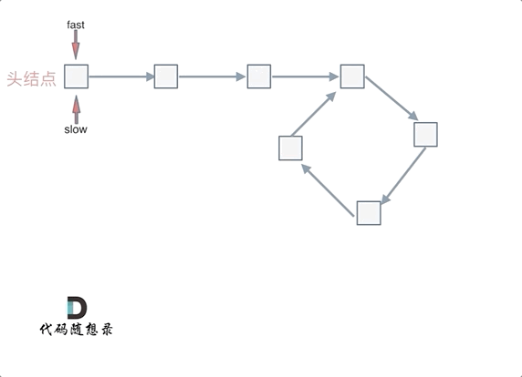

那么 n如果大于1是什么情况呢，就是fast指针在环形转n圈之后才遇到 slow指针。

其实这种情况和n为1的时候 效果是一样的，一样可以通过这个方法找到 环形的入口节点，只不过，index1 指针在环里 多转了`(n-1)`圈，然后再遇到index2，相遇点依然是环形的入口节点。

代码如下：

```cpp
/**
 * Definition for singly-linked list.
 * struct ListNode {
 *     int val;
 *     ListNode *next;
 *     ListNode(int x) : val(x), next(NULL) {}
 * };
 */
class Solution {
public:
    ListNode *detectCycle(ListNode *head) {
        ListNode* fast = head;
        ListNode* slow = head;
        while(fast != NULL && fast->next != NULL) {
            slow = slow->next;
            fast = fast->next->next;
            // 快慢指针相遇，此时从head 和 相遇点，同时查找直至相遇
            if (slow == fast) {
                ListNode* index1 = fast;
                ListNode* index2 = head;
                while (index1 != index2) {
                    index1 = index1->next;
                    index2 = index2->next;
                }
                return index2; // 返回环的入口
            }
        }
        return NULL;
    }
};
```

- 时间复杂度`: O(n)`，快慢指针相遇前，指针走的次数小于链表长度，快慢指针相遇后，两个index指针走的次数也小于链表长度，总体为走的次数小于 2n
- 空间复杂度`: O(1)`

### 补充

在推理过程中，大家可能有一个疑问就是：**为什么第一次在环中相遇，slow的 步数 是 x+y 而不是 x + 若干环的长** **度 + y 呢？**

即文章[链表：环找到了，那入口呢？](https://programmercarl.com/0142.%E7%8E%AF%E5%BD%A2%E9%93%BE%E8%A1%A8II.html)中如下的地方：

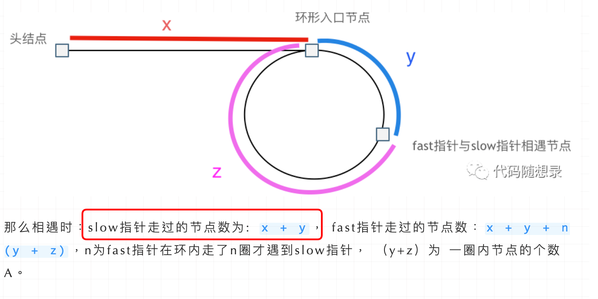

首先slow进环的时候，fast一定是先进环来了。

如果slow进环入口，fast也在环入口，那么把这个环展开成直线，就是如下图的样子：

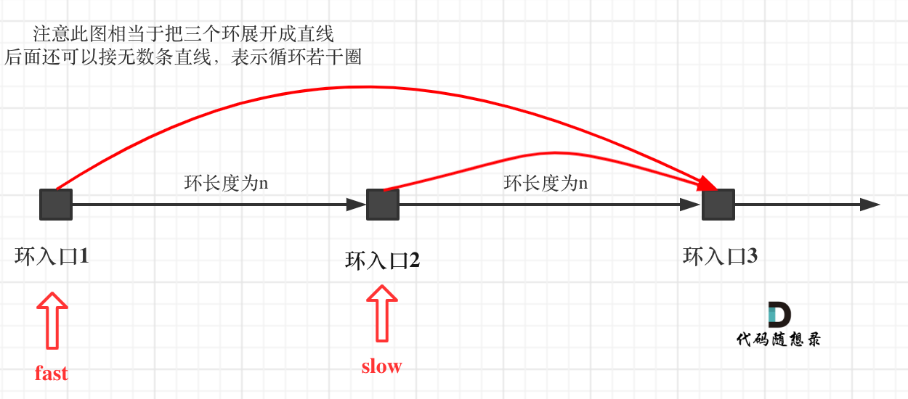

可以看出如果slow 和 fast同时在环入口开始走，一定会在环入口3相遇，slow走了一圈，fast走了两圈。

重点来了，slow进环的时候，fast一定是在环的任意一个位置，如图：

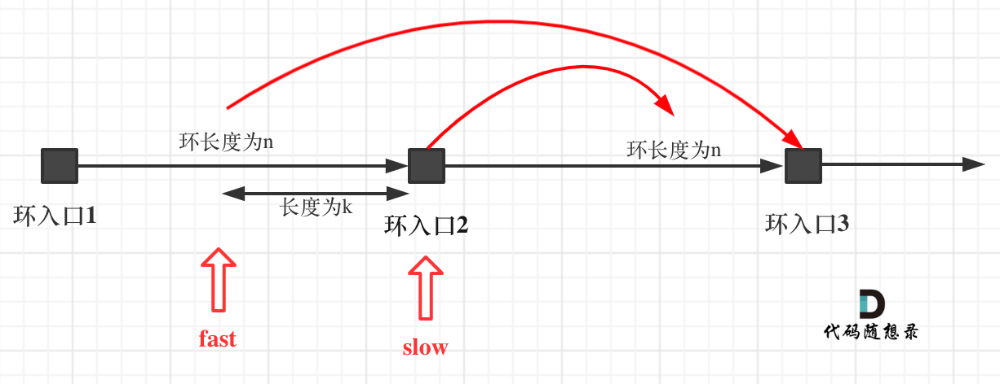

那么fast指针走到环入口3的时候，已经走了k + n 个节点，slow相应的应该走了`(k + n) / 2` 个节点。

因为k是小于n的（图中可以看出），所以`(k + n) / 2` 一定小于n。

**也就是说slow一定没有走到环入口3，而fast已经到环入口3了**。

这说明什么呢？

**在slow开始走的那一环已经和fast相遇了**。

那有同学又说了，为什么fast不能跳过去呢？ 在刚刚已经说过一次了，**fast相对于slow是一次移动一个节点，所以** **不可能跳过去**。

好了，这次把为什么第一次在环中相遇，slow的 步数 是 x+y 而不是 x + 若干环的长度 + y ，用数学推理了一下，算是对[链表：环找到了，那入口呢？](https://programmercarl.com/0142.%E7%8E%AF%E5%BD%A2%E9%93%BE%E8%A1%A8II.html)的补充。

这次可以说把环形链表这道题目的各个细节，完完整整的证明了一遍，说这是全网最详细讲解不为过吧，哈哈。

## 总结

# 9. 链表总结篇

## 链表的理论基础

在这篇文章[关于链表，你该了解这些！](https://programmercarl.com/%E9%93%BE%E8%A1%A8%E7%90%86%E8%AE%BA%E5%9F%BA%E7%A1%80.html)中，介绍了如下几点：

- 链表的种类主要为：单链表，双链表，循环链表
- 链表的存储方式：链表的节点在内存中是分散存储的，通过指针连在一起。
- 链表是如何进行增删改查的。
- 数组和链表在不同场景下的性能分析。

**可以说把链表基础的知识都概括了，但又不像教科书那样的繁琐**。

## 链表经典题目

### 虚拟头结点

在[链表：听说用虚拟头节点会方便很多？](https://programmercarl.com/0203.%E7%A7%BB%E9%99%A4%E9%93%BE%E8%A1%A8%E5%85%83%E7%B4%A0.html)中，我们讲解了链表操作中一个非常总要的技巧：虚拟头节点。

链表的一大问题就是操作当前节点必须要找前一个节点才能操作。这就造成了，头结点的尴尬，因为头结点没有前一个节点了。

**每次对应头结点的情况都要单独处理，所以使用虚拟头结点的技巧，就可以解决这个问题**。

在[链表：听说用虚拟头节点会方便很多？](https://programmercarl.com/0203.%E7%A7%BB%E9%99%A4%E9%93%BE%E8%A1%A8%E5%85%83%E7%B4%A0.html)中，我给出了用虚拟头结点和没用虚拟头结点的代码，大家对比一下就会发现，使用虚拟头结点的好处。

### 链表的基本操作

在[链表：一道题目考察了常见的五个操作！](https://programmercarl.com/0707.%E8%AE%BE%E8%AE%A1%E9%93%BE%E8%A1%A8.html)中，我们通设计链表把链表常见的五个操作练习了一遍。

这是练习链表基础操作的非常好的一道题目，考察了：

- 获取链表第index个节点的数值
- 在链表的最前面插入一个节点
- 在链表的最后面插入一个节点
- 在链表第index个节点前面插入一个节点
- 删除链表的第index个节点的数值

**可以说把这道题目做了，链表基本操作就OK了，再也不用担心链表增删改查整不明白了**。

这里我依然使用了虚拟头结点的技巧，大家复习的时候，可以去看一下代码。

### 反转链表

在[链表：听说过两天反转链表又写不出来了？](https://programmercarl.com/0206.%E7%BF%BB%E8%BD%AC%E9%93%BE%E8%A1%A8.html)中，讲解了如何反转链表。

因为反转链表的代码相对简单，有的同学可能直接背下来了，但一写还是容易出问题。

反转链表是面试中高频题目，很考察面试者对链表操作的熟练程度。

我在[文章](https://programmercarl.com/0206.%E7%BF%BB%E8%BD%AC%E9%93%BE%E8%A1%A8.html)中，给出了两种反转的方式，迭代法和递归法。

建议大家先学透迭代法，然后再看递归法，因为递归法比较绕，如果迭代还写不明白，递归基本也写不明白了。

**可以先通过迭代法，彻底弄清楚链表反转的过程！**

### 删除倒数第N个节点

在[链表：删除链表倒数第N个节点，怎么删？](https://programmercarl.com/0019.%E5%88%A0%E9%99%A4%E9%93%BE%E8%A1%A8%E7%9A%84%E5%80%92%E6%95%B0%E7%AC%ACN%E4%B8%AA%E8%8A%82%E7%82%B9.html)中我们结合虚拟头结点 和 双指针法来移除链表倒数第N个节点。

### 链表相交

[链表：链表相交](https://programmercarl.com/%E9%9D%A2%E8%AF%95%E9%A2%9802.07.%E9%93%BE%E8%A1%A8%E7%9B%B8%E4%BA%A4.html)使用双指针来找到两个链表的交点（引用完全相同，即：内存地址完全相同的交点）

### 环形链表

在[链表：环找到了，那入口呢？](https://programmercarl.com/0142.%E7%8E%AF%E5%BD%A2%E9%93%BE%E8%A1%A8II.html)中，讲解了在链表如何找环，以及如何找环的入口位置。

这道题目可以说是链表的比较难的题目了。 但代码却十分简洁，主要在于一些数学证明。

## 总结

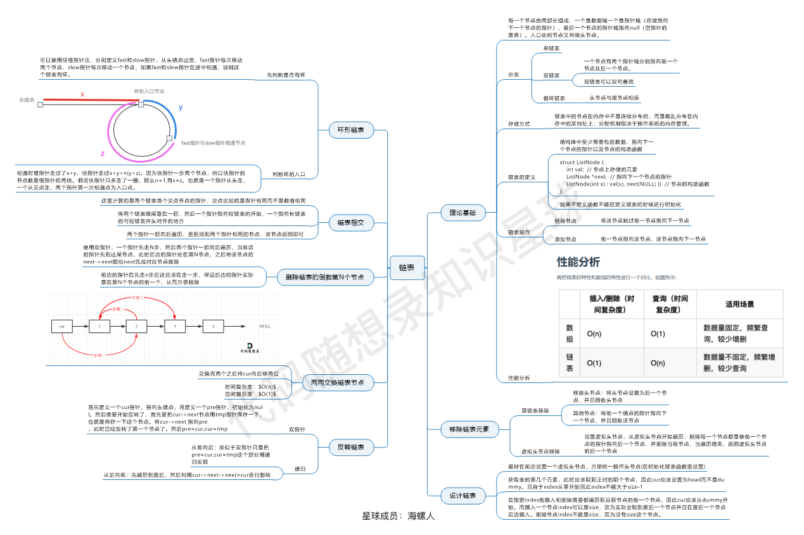

这个图是 [代码随想录知识星球](https://programmercarl.com/other/kstar.html) 成员：[海螺人](https://wx.zsxq.com/dweb2/index/footprint/844412858822412)，所画，总结的非常好，分享给大家。

考察链表的操作其实就是考察指针的操作，是面试中的常见类型。

链表篇中开头介绍[链表理论知识](https://programmercarl.com/0203.%E7%A7%BB%E9%99%A4%E9%93%BE%E8%A1%A8%E5%85%83%E7%B4%A0.html)，然后分别通过经典题目介绍了如下知识点：

1. [关于链表，你该了解这些！](https://programmercarl.com/%E9%93%BE%E8%A1%A8%E7%90%86%E8%AE%BA%E5%9F%BA%E7%A1%80.html) 2. [虚拟头结点的技巧](https://programmercarl.com/0203.%E7%A7%BB%E9%99%A4%E9%93%BE%E8%A1%A8%E5%85%83%E7%B4%A0.html) 3. [链表的增删改查](https://programmercarl.com/0707.%E8%AE%BE%E8%AE%A1%E9%93%BE%E8%A1%A8.html) 4. [反转一个链表](https://programmercarl.com/0206.%E7%BF%BB%E8%BD%AC%E9%93%BE%E8%A1%A8.html) 5. [删除倒数第N个节点](https://programmercarl.com/0019.%E5%88%A0%E9%99%A4%E9%93%BE%E8%A1%A8%E7%9A%84%E5%80%92%E6%95%B0%E7%AC%ACN%E4%B8%AA%E8%8A%82%E7%82%B9.html) 6. [链表相交](https://programmercarl.com/%E9%9D%A2%E8%AF%95%E9%A2%9802.07.%E9%93%BE%E8%A1%A8%E7%9B%B8%E4%BA%A4.html) 7. [有否环形，以及环的入口](https://programmercarl.com/0142.%E7%8E%AF%E5%BD%A2%E9%93%BE%E8%A1%A8II.html)
