[](https://programmercarl.com/other/xunlianying.html)

**《代码随想录》作者：**[**程序员Carl**](https://github.com/youngyangyang04)

- 代码随想录官网[（网站持续更新优化内容，建议直接看网站）](https://www.programmercarl.com/)：www.programmercarl.com
- 代码随想录[Github开源地址](https://github.com/youngyangyang04/leetcode-master)
- [代码随想录算法公开课](https://programmercarl.com/other/gongkaike.html)，代码随想录的全部内容将由我（[程序员Carl](https://github.com/youngyangyang04)）视频讲解并开免费开放给大家。
- [《代码随想录》](https://programmercarl.com/other/publish.html) 已经出版。
- [代码随想录知识星球](https://programmercarl.com/other/kstar.html) 上万录友在这里学习
- [代码随想录算法训练营](https://programmercarl.com/other/xunlianying.html) 帮助录友高效刷完代码随想录。
- 微信公众号：[代码随想录](https://img-blog.csdnimg.cn/74f47bc466234462bd2acc3ba6cd1b70.png)
- 组队刷题，可以添加[代码随想录官方微信](https://www.programmercarl.com/other/wechat.html)
- ACM模式练习，推荐：[卡码网](https://kamacoder.com/)

**特别提示**：PDF仅提供`C++`语言版本同时PDF中很多动图无法加载，其他编程语言版本和查看动图可以移步至代码随想录官方网站查看。

# 1. 哈希表理论基础

## 哈希表

首先什么是 哈希表，哈希表（英文名字为Hash table，国内也有一些算法书籍翻译为散列表，大家看到这两个名称知道都是指hash table就可以了）。

哈希表是根据关键码的值而直接进行访问的数据结构。

这么这官方的解释可能有点懵，其实直白来讲其实数组就是一张哈希表。

哈希表中关键码就是数组的索引下标，然后通过下标直接访问数组中的元素，如下图所示：

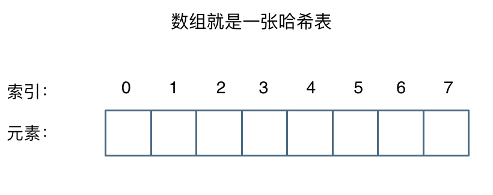

那么哈希表能解决什么问题呢，**一般哈希表都是用来快速判断一个元素是否出现集合里。**

例如要查询一个名字是否在这所学校里。

要枚举的话时间复杂度是`O(n)`，但如果使用哈希表的话， 只需要`O(1)`就可以做到。

我们只需要初始化把这所学校里学生的名字都存在哈希表里，在查询的时候通过索引直接就可以知道这位同学在不在这所学校里了。

将学生姓名映射到哈希表上就涉及到了**hash function ，也就是哈希函数**。

## 哈希函数

哈希函数，把学生的姓名直接映射为哈希表上的索引，然后就可以通过查询索引下标快速知道这位同学是否在这所学校里了。

哈希函数如下图所示，通过hashCode把名字转化为数值，一般hashcode是通过特定编码方式，可以将其他数据格式转化为不同的数值，这样就把学生名字映射为哈希表上的索引数字了。

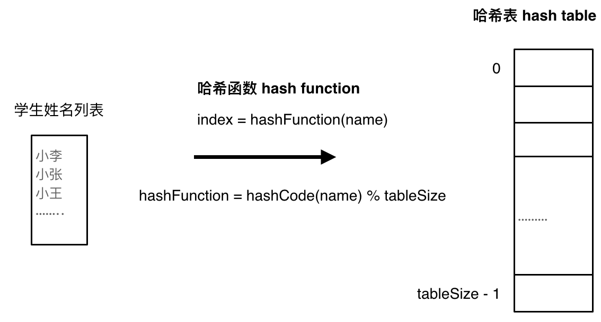

如果hashCode得到的数值大于 哈希表的大小了，也就是大于tableSize了，怎么办呢？

此时为了保证映射出来的索引数值都落在哈希表上，我们会在再次对数值做一个取模的操作，就要我们就保证了学生姓名一定可以映射到哈希表上了。

此时问题又来了，哈希表我们刚刚说过，就是一个数组。

如果学生的数量大于哈希表的大小怎么办，此时就算哈希函数计算的再均匀，也避免不了会有几位学生的名字同时映射到哈希表 同一个索引下标的位置。

接下来**哈希碰撞**登场

### 哈希碰撞

如图所示，小李和小王都映射到了索引下标 1 的位置，**这一现象叫做哈希碰撞**。

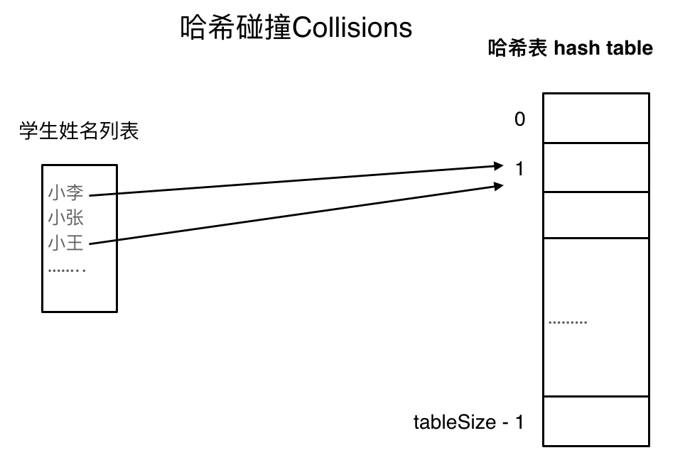

一般哈希碰撞有两种解决方法， 拉链法和线性探测法。

### 拉链法

刚刚小李和小王在索引1的位置发生了冲突，发生冲突的元素都被存储在链表中。 这样我们就可以通过索引找到小李和小王了

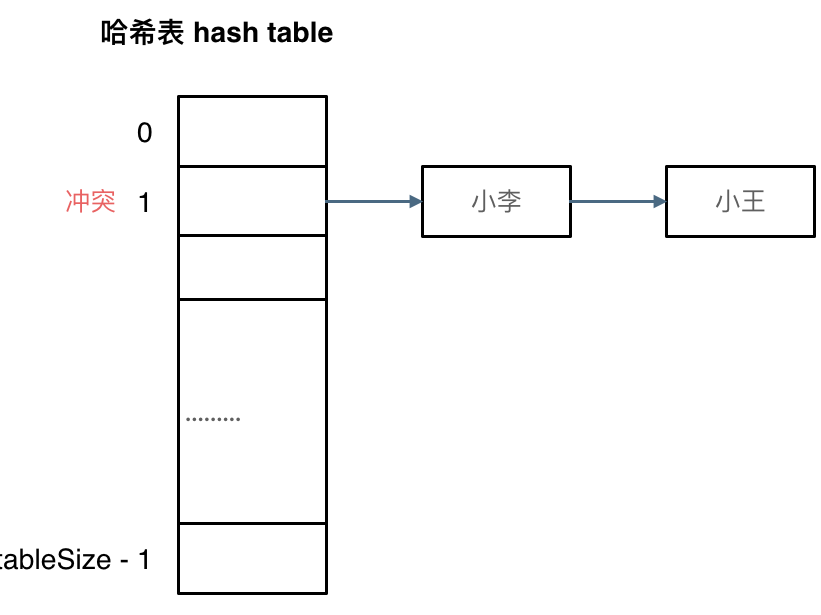

（数据规模是dataSize， 哈希表的大小为tableSize）

其实拉链法就是要选择适当的哈希表的大小，这样既不会因为数组空值而浪费大量内存，也不会因为链表太长而在查找上浪费太多时间。

### 线性探测法

使用线性探测法，一定要保证tableSize大于dataSize。 我们需要依靠哈希表中的空位来解决碰撞问题。

例如冲突的位置，放了小李，那么就向下找一个空位放置小王的信息。所以要求tableSize一定要大于dataSize ，要不然哈希表上就没有空置的位置来存放 冲突的数据了。如图所示：

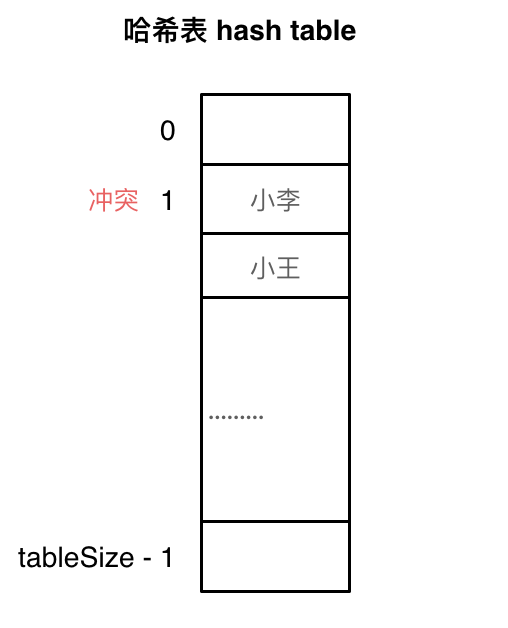

其实关于哈希碰撞还有非常多的细节，感兴趣的同学可以再好好研究一下，这里我就不再赘述了。

## 常见的三种哈希结构

当我们想使用哈希法来解决问题的时候，我们一般会选择如下三种数据结构。

- 数组
- set （集合）
- `map(`映射`)`

这里数组就没啥可说的了，我们来看一下set。

在`C++`中，set 和 map 分别提供以下三种数据结构，其底层实现以及优劣如下表所示：

| 集合 | 底层实现 | 是否有序 | 数值是否可以重复 | 能否更改数值 | 查询效率 | 增删效率 |
|---|---|---|---|---|---|---|
| std::set | 红黑树 | 有序 | 否 | 否 | O(log n) | O(log n) |
| std::multiset | 红黑树 | 有序 | 是 | 否 | O(logn) | O(logn) |
| std::unordered_set | 哈希表 | 无序 | 否 | 否 | O(1) | O(1) |

`std::unordered_set`底层实现为哈希表，`std::set` 和`std::multiset` 的底层实现是红黑树，红黑树是一种平衡二叉搜索树，所以key值是有序的，但key不可以修改，改动key值会导致整棵树的错乱，所以只能删除和增加。

| 映射 | 底层实现 | 是否有序 | 数值是否可以重复 | 能否更改数值 | 查询效率 | 增删效率 |
|---|---|---|---|---|---|---|
| std::map | 红黑树 | key有序 | key不可重复 | key不可修改 | O(logn) | O(logn) |
| std::multimap | 红黑树 | key有序 | key可重复 | key不可修改 | O(log n) | O(log n) |
| std::unordered_map | 哈希表 | key无序 | key不可重复 | key不可修改 | O(1) | O(1) |

`std::unordered_map` 底层实现为哈希表，`std::map` 和`std::multimap` 的底层实现是红黑树。同理，`std::map` 和`std::multimap` 的key也是有序的（这个问题也经常作为面试题，考察对语言容器底层的理解）。

当我们要使用集合来解决哈希问题的时候，优先使用unordered_set，因为它的查询和增删效率是最优的，如果需要集合是有序的，那么就用set，如果要求不仅有序还要有重复数据的话，那么就用multiset。

那么再来看一下map ，在map 是一个key value 的数据结构，map中，对key是有限制，对value没有限制的，因为key的存储方式使用红黑树实现的。

其他语言例如：java里的HashMap ，TreeMap 都是一样的原理。可以灵活贯通。

虽然`std::set`、`std::multiset` 的底层实现是红黑树，不是哈希表，`std::set`、`std::multiset` 使用红黑树来索引和存储，不过给我们的使用方式，还是哈希法的使用方式，即key和value。所以使用这些数据结构来解决映射问题的方法，我们依然称之为哈希法。 map也是一样的道理。

这里在说一下，一些`C++`的经典书籍上 例如STL源码剖析，说到了hash_set hash_map，这个与unordered_set，unordered_map又有什么关系呢？

实际上功能都是一样一样的， 但是unordered_set在`C++11`的时候被引入标准库了，而hash_set并没有，所以建议还是使用unordered_set比较好，这就好比一个是官方认证的，hash_set，hash_map 是`C++11`标准之前民间高手自发造的轮子。

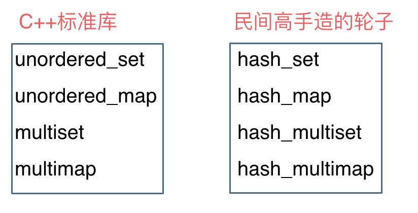

## 总结

总结一下，**当我们遇到了要快速判断一个元素是否出现集合里的时候，就要考虑哈希法**。

但是哈希法也是**牺牲了空间换取了时间**，因为我们要使用额外的数组，set或者是map来存放数据，才能实现快速的查找。

如果在做面试题目的时候遇到需要判断一个元素是否出现过的场景也应该第一时间想到哈希法！

数组就是简单的哈希表，但是数组的大小可不是无限开辟的

# 2.有效的字母异位词

[力扣题目链接](https://leetcode.cn/problems/valid-anagram/)

给定两个字符串 s 和 t ，编写一个函数来判断 t 是否是 s 的字母异位词。

示例 1:  
输入`: s = "anagram", t = "nagaram"`  
输出: true

示例 2:  
输入`: s = "rat", t = "car"`  
输出: false

**说明:**你可以假设字符串只包含小写字母。

## 算法公开课

[**《代码随想录》算法视频公开课**](https://programmercarl.com/other/gongkaike.html)**：**[**学透哈希表，数组使用有技巧！Leetcode：242.有效的字母异位词**](https://www.bilibili.com/video/BV1YG411p7BA)**，相信结合** **视频再看本篇题解，更有助于大家对本题的理解**。

## 思路

先看暴力的解法，两层for循环，同时还要记录字符是否重复出现，很明显时间复杂度是 `O(n^2)`。

暴力的方法这里就不做介绍了，直接看一下有没有更优的方式。

**数组其实就是一个简单哈希表**，而且这道题目中字符串只有小写字符，那么就可以定义一个数组，来记录字符串s里字符出现的次数。

如果对哈希表的理论基础关于数组，set，map不了解的话可以看这篇：[关于哈希表，你该了解这些！](https://programmercarl.com/%E5%93%88%E5%B8%8C%E8%A1%A8%E7%90%86%E8%AE%BA%E5%9F%BA%E7%A1%80.html)

需要定义一个多大的数组呢，定一个数组叫做record，大小为26 就可以了，初始化为0，因为字符a到字符z的ASCII也是26个连续的数值。

为了方便举例，判断一下字符串`s= "aee", t = "eae"`。

操作动画如下：

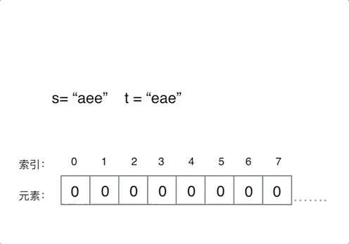

定义一个数组叫做record用来上记录字符串s里字符出现的次数。

需要把字符映射到数组也就是哈希表的索引下标上，**因为字符a到字符z的ASCII是26个连续的数值，所以字符a映** **射为下标0，相应的字符z映射为下标25。**

再遍历 字符串s的时候，**只需要将 s[i] - ‘a’ 所在的元素做+1 操作即可，并不需要记住字符a的ASCII，只要求出一个** **相对数值就可以了。** 这样就将字符串s中字符出现的次数，统计出来了。

那看一下如何检查字符串t中是否出现了这些字符，同样在遍历字符串t的时候，对t中出现的字符映射哈希表索引上的数值再做-1的操作。

那么最后检查一下，**record数组如果有的元素不为零0，说明字符串s和t一定是谁多了字符或者谁少了字符，** **return false。**

最后如果record数组所有元素都为零0，说明字符串s和t是字母异位词，return true。

时间复杂度为`O(n)`，空间上因为定义是的一个常量大小的辅助数组，所以空间复杂度为`O(1)`。

`C++` 代码如下：

```cpp
class Solution {
public:
    bool isAnagram(string s, string t) {
        int record[26] = {0};
        for (int i = 0; i < s.size(); i++) {
            // 并不需要记住字符a的ASCII，只要求出一个相对数值就可以了
            record[s[i] - 'a']++;
        }
        for (int i = 0; i < t.size(); i++) {
            record[t[i] - 'a']--;
        }
        for (int i = 0; i < 26; i++) {
            if (record[i] != 0) {
                // record数组如果有的元素不为零0，说明字符串s和t 一定是谁多了字符或者谁少了字符。
                return false;
            }
        }
        // record数组所有元素都为零0，说明字符串s和t是字母异位词
        return true;
    }
};
```

- 时间复杂度`: O(n)`
- 空间复杂度`: O(1)`

如果哈希值比较少、特别分散、跨度非常大，使用数组就造成空间的极大浪费！

# 3. 两个数组的交集

[力扣题目链接](https://leetcode.cn/problems/intersection-of-two-arrays/)

题意：给定两个数组，编写一个函数来计算它们的交集。

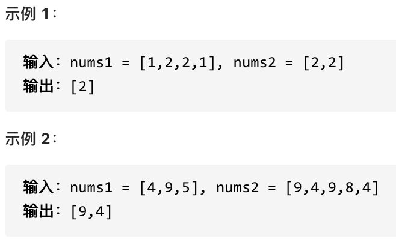

**说明：**输出结果中的每个元素一定是唯一的。我们可以不考虑输出结果的顺序。

## 算法公开课

[**《代码随想录》算法视频公开课**](https://programmercarl.com/other/gongkaike.html)**：：**[**学透哈希表，set使用有技巧！Leetcode：349. 两个数组的交集**](https://www.bilibili.com/video/BV1ba411S7wu)**，相信结合** **视频再看本篇题解，更有助于大家对本题的理解**。

## 思路

这道题目，主要要学会使用一种哈希数据结构：unordered_set，这个数据结构可以解决很多类似的问题。

注意题目特意说明：**输出结果中的每个元素一定是唯一的，也就是说输出的结果的去重的， 同时可以不考虑输出结** **果的顺序**

这道题用暴力的解法时间复杂度是`O(n^2)`，那来看看使用哈希法进一步优化。

那么用数组来做哈希表也是不错的选择，例如[242. 有效的字母异位词](https://programmercarl.com/0242.%E6%9C%89%E6%95%88%E7%9A%84%E5%AD%97%E6%AF%8D%E5%BC%82%E4%BD%8D%E8%AF%8D.html)

但是要注意，**使用数组来做哈希的题目，是因为题目都限制了数值的大小。**

而这道题目没有限制数值的大小，就无法使用数组来做哈希表了。

**而且如果哈希值比较少、特别分散、跨度非常大，使用数组就造成空间的极大浪费。**

此时就要使用另一种结构体了，set ，关于set，`C++` 给提供了如下三种可用的数据结构：

- `std::set`
- `std::multiset`

- `std::unordered_set`

`std::set`和`std::multiset`底层实现都是红黑树，`std::unordered_set`的底层实现是哈希表， 使用unordered_set 读写效率是最高的，并不需要对数据进行排序，而且还不要让数据重复，所以选择unordered_set。

思路如图所示：

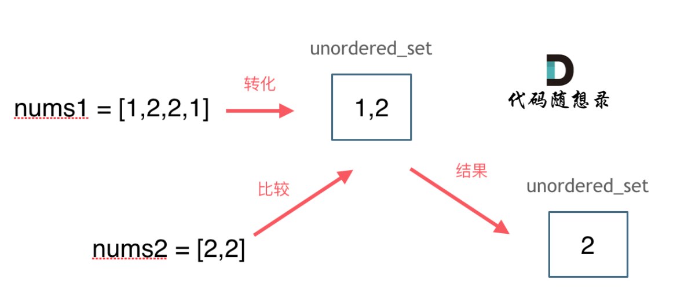

`C++`代码如下：

```cpp
class Solution {
public:
    vector<int> intersection(vector<int>& nums1, vector<int>& nums2) {
        unordered_set<int> result_set; // 存放结果，之所以用set是为了给结果集去重
        unordered_set<int> nums_set(nums1.begin(), nums1.end());
        for (int num : nums2) {
            // 发现nums2的元素 在nums_set里又出现过
            if (nums_set.find(num) != nums_set.end()) {
                result_set.insert(num);
            }
        }
        return vector<int>(result_set.begin(), result_set.end());
    }
};
```

- 时间复杂度`: O(mn)`
- 空间复杂度`: O(n)`

## 拓展

那有同学可能问了，遇到哈希问题我直接都用set不就得了，用什么数组啊。

直接使用set 不仅占用空间比数组大，而且速度要比数组慢，set把数值映射到key上都要做hash计算的。

不要小瞧 这个耗时，在数据量大的情况，差距是很明显的。

## 后记

本题后面 力扣改了 题目描述 和 后台测试数据，增添了 数值范围： 

- `1 <= nums1.length, nums2.length <= 1000`
- `0 <= nums1[i], nums2[i] <= 1000`

所以就可以 使用数组来做哈希表了， 因为数组都是 1000以内的。 

对应`C++`代码如下：

```cpp
class Solution {
public:
    vector<int> intersection(vector<int>& nums1, vector<int>& nums2) {
        unordered_set<int> result_set; // 存放结果，之所以用set是为了给结果集去重
        int hash[1005] = {0}; // 默认数值为0
        for (int num : nums1) { // nums1中出现的字母在hash数组中做记录
            hash[num] = 1;
        }
        for (int num : nums2) { // nums2中出现话，result记录
            if (hash[num] == 1) {
                result_set.insert(num);
            }
        }
        return vector<int>(result_set.begin(), result_set.end());
    }
};
```

- 时间复杂度`: O(m + n)`
- 空间复杂度`: O(n)`

## 相关题目

- [350.两个数组的交集 II](https://leetcode.cn/problems/intersection-of-two-arrays-ii/)

该用set的时候，还是得用set

# 4. 快乐数

[力扣题目链接](https://leetcode.cn/problems/happy-number/)

编写一个算法来判断一个数 n 是不是快乐数。

「快乐数」定义为：对于一个正整数，每一次将该数替换为它每个位置上的数字的平方和，然后重复这个过程直到这个数变为 1，也可能是 无限循环 但始终变不到 1。如果 可以变为  1，那么这个数就是快乐数。

如果 n 是快乐数就返回 True ；不是，则返回 False 。

**示例：**

输入：19  
输出：true  
解释： `1^2 + 9^2 = 82` `8^2 + 2^2 = 68` `6^2 + 8^2 = 100` `1^2 + 0^2 + 0^2 = 1` 

## 思路

这道题目看上去貌似一道数学问题，其实并不是！

题目中说了会 **无限循环**，那么也就是说**求和的过程中，sum会重复出现，这对解题很重要！**

正如：[关于哈希表，你该了解这些！](https://programmercarl.com/%E5%93%88%E5%B8%8C%E8%A1%A8%E7%90%86%E8%AE%BA%E5%9F%BA%E7%A1%80.html)中所说，**当我们遇到了要快速判断一个元素是否出现集合里的时候，就要考虑** **哈希法了。**

所以这道题目使用哈希法，来判断这个sum是否重复出现，如果重复了就是return false， 否则一直找到sum为1为止。

判断sum是否重复出现就可以使用unordered_set。

**还有一个难点就是求和的过程，如果对取数值各个位上的单数操作不熟悉的话，做这道题也会比较艰难。**

`C++`代码如下：

```cpp
class Solution {
public:
    // 取数值各个位上的单数之和
    int getSum(int n) {
        int sum = 0;
        while (n) {
            sum += (n % 10) * (n % 10);
            n /= 10;
        }
        return sum;
    }
    bool isHappy(int n) {
        unordered_set<int> set;
        while(1) {
            int sum = getSum(n);
            if (sum == 1) {
                return true;
            }
            // 如果这个sum曾经出现过，说明已经陷入了无限循环了，立刻return false
            if (set.find(sum) != set.end()) {
                return false;
            } else {
                set.insert(sum);
            }
            n = sum;
        }
    }
};
```

- 时间复杂度`: O(logn)`
- 空间复杂度`: O(logn)`

# 5. 两数之和

[力扣题目链接](https://leetcode.cn/problems/two-sum/)

给定一个整数数组 nums 和一个目标值 target，请你在该数组中找出和为目标值的那 两个 整数，并返回他们的数组下标。

你可以假设每种输入只会对应一个答案。但是，数组中同一个元素不能使用两遍。

**示例:**

给定 `nums = [2, 7, 11, 15], target = 9`

因为 `nums[0] + nums[1] = 2 + 7 = 9`

所以返回 `[0, 1]`

## 算法公开课

[**《代码随想录》算法视频公开课**](https://programmercarl.com/other/gongkaike.html)**：**[**梦开始的地方，Leetcode：1.两数之和**](https://www.bilibili.com/video/BV1aT41177mK)**,相信结合视频再看本篇题解，更有助于** **大家对本题的理解**。

## 思路

很明显暴力的解法是两层for循环查找，时间复杂度是`O(n^2)`。

建议大家做这道题目之前，先做一下这两道

- [242. 有效的字母异位词](https://www.programmercarl.com/0242.%E6%9C%89%E6%95%88%E7%9A%84%E5%AD%97%E6%AF%8D%E5%BC%82%E4%BD%8D%E8%AF%8D.html)
- [349. 两个数组的交集](https://www.programmercarl.com/0349.%E4%B8%A4%E4%B8%AA%E6%95%B0%E7%BB%84%E7%9A%84%E4%BA%A4%E9%9B%86.html)

[242. 有效的字母异位词](https://www.programmercarl.com/0242.%E6%9C%89%E6%95%88%E7%9A%84%E5%AD%97%E6%AF%8D%E5%BC%82%E4%BD%8D%E8%AF%8D.html) 这道题目是用数组作为哈希表来解决哈希问题，[349. 两个数组的交集](https://www.programmercarl.com/0349.%E4%B8%A4%E4%B8%AA%E6%95%B0%E7%BB%84%E7%9A%84%E4%BA%A4%E9%9B%86.html)这道题目是通过set作为哈希表来解决哈希问题。

首先我在强调一下 **什么时候使用哈希法**，当我们需要查询一个元素是否出现过，或者一个元素是否在集合里的时候，就要第一时间想到哈希法。 

本题呢，我就需要一个集合来存放我们遍历过的元素，然后在遍历数组的时候去询问这个集合，某元素是否遍历过，也就是 是否出现在这个集合。

那么我们就应该想到使用哈希法了。

因为本地，我们不仅要知道元素有没有遍历过，还要知道这个元素对应的下标，**需要使用 key value结构来存放，** **key来存元素，value来存下标，那么使用map正合适**。 

再来看一下使用数组和set来做哈希法的局限。

- 数组的大小是受限制的，而且如果元素很少，而哈希值太大会造成内存空间的浪费。
- set是一个集合，里面放的元素只能是一个key，而两数之和这道题目，不仅要判断y是否存在而且还要记录y的下标位置，因为要返回x 和 y的下标。所以set 也不能用。

此时就要选择另一种数据结构：map ，map是一种key value的存储结构，可以用key保存数值，用value在保存数值所在的下标。

`C++`中map，有三种类型：

| 映射 | 底层实现 | 是否有序 | 数值是否可以重复 | 能否更改数值 | 查询效率 | 增删效率 |
|---|---|---|---|---|---|---|
| std::map | 红黑树 | key有序 | key不可重复 | key不可修改 | O(log n) | O(log n) |
| std::multimap | 红黑树 | key有序 | key可重复 | key不可修改 | O(log n) | O(log n) |
| std::unordered_map | 哈希表 | key无序 | key不可重复 | key不可修改 | O(1) | O(1) |

`std::unordered_map` 底层实现为哈希表，`std::map` 和`std::multimap` 的底层实现是红黑树。

同理，`std::map` 和`std::multimap` 的key也是有序的（这个问题也经常作为面试题，考察对语言容器底层的理解）。 更多哈希表的理论知识请看[关于哈希表，你该了解这些！](https://www.programmercarl.com/%E5%93%88%E5%B8%8C%E8%A1%A8%E7%90%86%E8%AE%BA%E5%9F%BA%E7%A1%80.html)。

**这道题目中并不需要key有序，选择std::unordered_map 效率更高！**  使用其他语言的录友注意了解一下自己所用语言的数据结构就行。

接下来需要明确两点： 

- **map用来做什么**
- **map中key和value分别表示什么**

map目的用来存放我们访问过的元素，因为遍历数组的时候，需要记录我们之前遍历过哪些元素和对应的下标，这样才能找到与当前元素相匹配的（也就是相加等于target）

接下来是map中key和value分别表示什么。 

这道题 我们需要 给出一个元素，判断这个元素是否出现过，如果出现过，返回这个元素的下标。 

那么判断元素是否出现，这个元素就要作为key，所以数组中的元素作为key，有key对应的就是value，value用来存下标。 

所以 map中的存储结构为 `{key`：数据元素，value：数组元素对应的下标`}`。 

在遍历数组的时候，只需要向map去查询是否有和目前遍历元素匹配的数值，如果有，就找到的匹配对，如果没有，就把目前遍历的元素放进map中，因为map存放的就是我们访问过的元素。

过程如下：

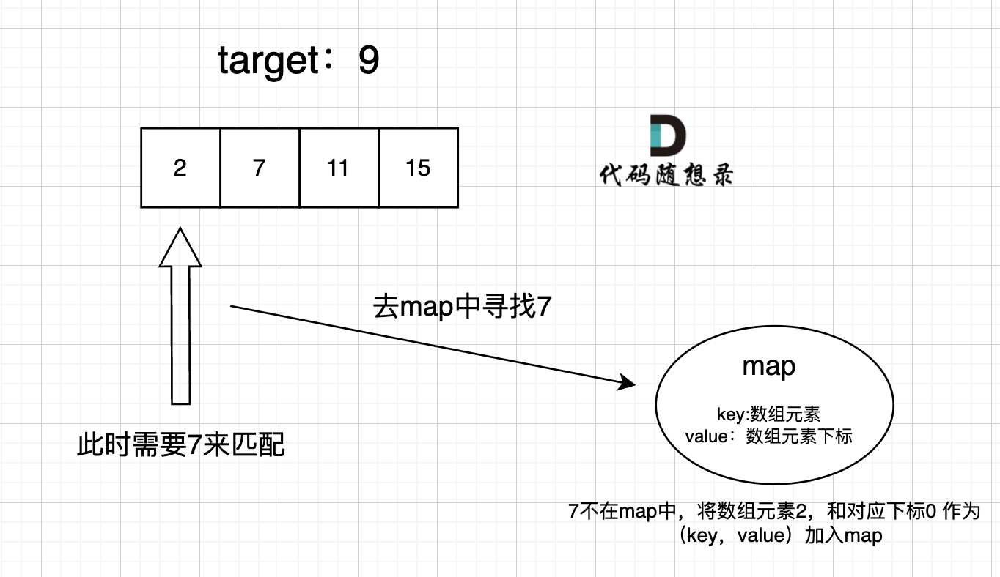

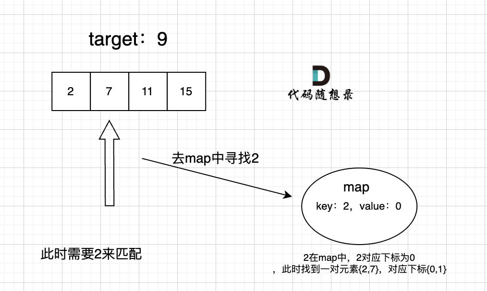

`C++`代码：

```cpp
class Solution {
public:
    vector<int> twoSum(vector<int>& nums, int target) {
        std::unordered_map <int,int> map;
        for(int i = 0; i < nums.size(); i++) {
            // 遍历当前元素，并在map中寻找是否有匹配的key
            auto iter = map.find(target - nums[i]);
            if(iter != map.end()) {
                return {iter->second, i};
            }
            // 如果没找到匹配对，就把访问过的元素和下标加入到map中
            map.insert(pair<int, int>(nums[i], i));
        }
        return {};
    }
};
```

- 时间复杂度`: O(n)`
- 空间复杂度`: O(n)`

## 总结

本题其实有四个重点： 

- 为什么会想到用哈希表 
- 哈希表为什么用map 
- 本题map是用来存什么的 
- map中的key和value用来存什么的 

把这四点想清楚了，本题才算是理解透彻了。

很多录友把这道题目 通过了，但都没想清楚map是用来做什么的，以至于对代码的理解其实是 一知半解的。

需要哈希的地方都能找到map的身影

# 6.四数相加II

[力扣题目链接](https://leetcode.cn/problems/4sum-ii/)

给定四个包含整数的数组列表 A , B , C , D ,计算有多少个元组 `(i, j, k, l)` ，使得 `A[i] + B[j] + C[k] + D[l] = 0`。

为了使问题简单化，所有的 A, B, C, D 具有相同的长度 N，且 0 ≤ N ≤ 500 。所有整数的范围在 -2^28 到 2^28 - 1 之间，最终结果不会超过 2^31 - 1 。

**例如:**

输入:

- `A = [ 1, 2]`
- `B = [-2,-1]`
- `C = [-1, 2]`

- `D = [ 0, 2]`

输出:

2

**解释:**

两个元组如下:

`1. (0, 0, 0, 1) -> A[0] + B[0] + C[0] + D[1] = 1 + (-2) + (-1) + 2 = 0` `2. (1, 1, 0, 0) -> A[1] + B[1] + C[0] + D[0] = 2 + (-1) + (-1) + 0 = 0`

## 算法公开课

[**《代码随想录》算法视频公开课**](https://programmercarl.com/other/gongkaike.html)**：**[**学透哈希表，map使用有技巧！LeetCode：454.四数相加II**](https://www.bilibili.com/video/BV1Md4y1Q7Yh)**，相信结合视频再** **看本篇题解，更有助于大家对本题的理解**。

## 思路

本题咋眼一看好像和[0015.三数之和](https://programmercarl.com/0015.%E4%B8%89%E6%95%B0%E4%B9%8B%E5%92%8C.html)，[0018.四数之和](https://programmercarl.com/0018.%E5%9B%9B%E6%95%B0%E4%B9%8B%E5%92%8C.html)差不多，其实差很多。

**本题是使用哈希法的经典题目，而**[**0015.三数之和**](https://programmercarl.com/0015.%E4%B8%89%E6%95%B0%E4%B9%8B%E5%92%8C.html)**，**[**0018.四数之和**](https://programmercarl.com/0018.%E5%9B%9B%E6%95%B0%E4%B9%8B%E5%92%8C.html)**并不合适使用哈希法**，因为三数之和和四数之和这两道题目使用哈希法在不超时的情况下做到对结果去重是很困难的，很有多细节需要处理。

**而这道题目是四个独立的数组，只要找到A[i] + B[j] + C[k] + D[l] = 0就可以，不用考虑有重复的四个元素相加等于** **0的情况，所以相对于题目18. 四数之和，题目15.三数之和，还是简单了不少！**

如果本题想难度升级：就是给出一个数组（而不是四个数组），在这里找出四个元素相加等于0，答案中不可以包含重复的四元组，大家可以思考一下，后续的文章我也会讲到的。

本题解题步骤：

1. 首先定义 一个unordered_map，key放a和b两数之和，value 放a和b两数之和出现的次数。2. 遍历大A和大B数组，统计两个数组元素之和，和出现的次数，放到map中。3. 定义int变量count，用来统计 `a+b+c+d = 0` 出现的次数。4. 在遍历大C和大D数组，找到如果 `0-(c+d)` 在map中出现过的话，就用count把map中key对应的value也就是出现次数统计出来。

5. 最后返回统计值 count 就可以了

`C++`代码:

```cpp
class Solution {
public:
    int fourSumCount(vector<int>& A, vector<int>& B, vector<int>& C, vector<int>& D) {
        unordered_map<int, int> umap; //key:a+b的数值，value:a+b数值出现的次数
        // 遍历大A和大B数组，统计两个数组元素之和，和出现的次数，放到map中
        for (int a : A) {
            for (int b : B) {
                umap[a + b]++;
            }
        }
        int count = 0; // 统计a+b+c+d = 0 出现的次数
        // 在遍历大C和大D数组，找到如果 0-(c+d) 在map中出现过的话，就把map中key对应的value也就是出
现次数统计出来。
        for (int c : C) {
            for (int d : D) {
                if (umap.find(0 - (c + d)) != umap.end()) {
                    count += umap[0 - (c + d)];
                }
            }
        }
        return count;
    }
};
```

- 时间复杂度`: O(n^2)`
- 空间复杂度`: O(n^2)`，最坏情况下A和B的值各不相同，相加产生的数字个数为 n^2

在哈希法中有一些场景就是为数组量身定做的。

# 7. 赎金信

[力扣题目链接](https://leetcode.cn/problems/ransom-note/)

给定一个赎金信 `(ransom)` 字符串和一个杂志`(magazine)`字符串，判断第一个字符串 ransom 能不能由第二个字符串 magazines 里面的字符构成。如果可以构成，返回 true ；否则返回 false。

`(`题目说明：为了不暴露赎金信字迹，要从杂志上搜索各个需要的字母，组成单词来表达意思。杂志字符串中的每个字符只能在赎金信字符串中使用一次。`)`

**注意：**

你可以假设两个字符串均只含有小写字母。

`canConstruct("a", "b") -> false` `canConstruct("aa", "ab") -> false` `canConstruct("aa", "aab") -> true` 

## 思路

这道题目和[242.有效的字母异位词](https://programmercarl.com/0242.%E6%9C%89%E6%95%88%E7%9A%84%E5%AD%97%E6%AF%8D%E5%BC%82%E4%BD%8D%E8%AF%8D.html)很像，[242.有效的字母异位词](https://programmercarl.com/0242.%E6%9C%89%E6%95%88%E7%9A%84%E5%AD%97%E6%AF%8D%E5%BC%82%E4%BD%8D%E8%AF%8D.html)相当于求 字符串a 和 字符串b 是否可以相互组成 ，而这道题目是求 字符串a能否组成字符串b，而不用管字符串b 能不能组成字符串a。

本题判断第一个字符串ransom能不能由第二个字符串magazines里面的字符构成，但是这里需要注意两点。

- 第一点“为了不暴露赎金信字迹，要从杂志上搜索各个需要的字母，组成单词来表达意思”  这里说明杂志里面的字母不可重复使用。

- 第二点 “你可以假设两个字符串均只含有小写字母。” 说明只有小写字母，这一点很重要

### 暴力解法

那么第一个思路其实就是暴力枚举了，两层for循环，不断去寻找，代码如下：

```cpp
class Solution {
public:
    bool canConstruct(string ransomNote, string magazine) {
        for (int i = 0; i < magazine.length(); i++) {
            for (int j = 0; j < ransomNote.length(); j++) {
                // 在ransomNote中找到和magazine相同的字符
                if (magazine[i] == ransomNote[j]) {
                    ransomNote.erase(ransomNote.begin() + j); // ransomNote删除这个字符
                    break;
                }
            }
        }
        // 如果ransomNote为空，则说明magazine的字符可以组成ransomNote
        if (ransomNote.length() == 0) {
            return true;
        }
        return false;
    }
};
```

- 时间复杂度`: O(n^2)`
- 空间复杂度`: O(1)`

这里时间复杂度是比较高的，而且里面还有一个字符串删除也就是erase的操作，也是费时的，当然这段代码也可以过这道题。

### 哈希解法

因为题目所只有小写字母，那可以采用空间换取时间的哈希策略， 用一个长度为26的数组还记录magazine里字母出现的次数。

然后再用ransomNote去验证这个数组是否包含了ransomNote所需要的所有字母。

依然是数组在哈希法中的应用。

一些同学可能想，用数组干啥，都用map完事了，**其实在本题的情况下，使用map的空间消耗要比数组大一些** **的，因为map要维护红黑树或者哈希表，而且还要做哈希函数，是费时的！数据量大的话就能体现出来差别了。** **所以数组更加简单直接有效！**

代码如下：

```cpp
class Solution {
public:
    bool canConstruct(string ransomNote, string magazine) {
        int record[26] = {0};
        //add
        if (ransomNote.size() > magazine.size()) {
            return false;
        }
        for (int i = 0; i < magazine.length(); i++) {
            // 通过record数据记录 magazine里各个字符出现次数
            record[magazine[i]-'a'] ++;
        }
        for (int j = 0; j < ransomNote.length(); j++) {
            // 遍历ransomNote，在record里对应的字符个数做--操作
            record[ransomNote[j]-'a']--;
            // 如果小于零说明ransomNote里出现的字符，magazine没有
            if(record[ransomNote[j]-'a'] < 0) {
                return false;
            }
        }
        return true;
    }
};
```

- 时间复杂度`: O(n)`
- 空间复杂度`: O(1)`

用哈希表解决了[两数之和](https://programmercarl.com/0001.%E4%B8%A4%E6%95%B0%E4%B9%8B%E5%92%8C.html)，那么三数之和呢？

# 8. 三数之和

[力扣题目链接](https://leetcode.cn/problems/3sum/)

给你一个包含 n 个整数的数组 nums，判断 nums 中是否存在三个元素 a，b，c ，使得 `a + b + c = 0` ？请你找出所有满足条件且不重复的三元组。

**注意：** 答案中不可以包含重复的三元组。

示例：

给定数组 `nums = [-1, 0, 1, 2, -1, -4]`，

满足要求的三元组集合为：`[` `[-1, 0, 1],` `[-1, -1, 2]` `]`

## 算法公开课

[**《代码随想录》算法视频公开课**](https://programmercarl.com/other/gongkaike.html)**：**[**梦破碎的地方！| LeetCode：15.三数之和**](https://www.bilibili.com/video/BV1GW4y127qo)**，相信结合视频再看本篇题解，更有** **助于大家对本题的理解**。

**注意[0， 0， 0， 0] 这组数据**

## 思路

### 哈希解法

两层for循环就可以确定 a 和b 的数值了，可以使用哈希法来确定 `0-(a+b)` 是否在 数组里出现过，其实这个思路是正确的，但是我们有一个非常棘手的问题，就是题目中说的不可以包含重复的三元组。

把符合条件的三元组放进vector中，然后再去重，这样是非常费时的，很容易超时，也是这道题目通过率如此之低的根源所在。

去重的过程不好处理，有很多小细节，如果在面试中很难想到位。

时间复杂度可以做到`O(n^2)`，但还是比较费时的，因为不好做剪枝操作。

大家可以尝试使用哈希法写一写，就知道其困难的程度了。

哈希法`C++`代码:

```cpp
class Solution {
public:
    vector<vector<int>> threeSum(vector<int>& nums) {
        vector<vector<int>> result;
        sort(nums.begin(), nums.end());
        // 找出a + b + c = 0
        // a = nums[i], b = nums[j], c = -(a + b)
        for (int i = 0; i < nums.size(); i++) {
            // 排序之后如果第一个元素已经大于零，那么不可能凑成三元组
            if (nums[i] > 0) {
                break;
            }
            if (i > 0 && nums[i] == nums[i - 1]) { //三元组元素a去重
                continue;
            }
            unordered_set<int> set;
            for (int j = i + 1; j < nums.size(); j++) {
                if (j > i + 2
                        && nums[j] == nums[j-1]
                        && nums[j-1] == nums[j-2]) { // 三元组元素b去重
                    continue;
                }
                int c = 0 - (nums[i] + nums[j]);
                if (set.find(c) != set.end()) {
                    result.push_back({nums[i], nums[j], c});
                    set.erase(c);// 三元组元素c去重
                } else {
                    set.insert(nums[j]);
                }
            }
        }
        return result;
    }
};
```

- 时间复杂度`: O(n^2)`
- 空间复杂度`: O(n)`，额外的 set 开销

### 双指针

**其实这道题目使用哈希法并不十分合适**，因为在去重的操作中有很多细节需要注意，在面试中很难直接写出没有bug的代码。

而且使用哈希法 在使用两层for循环的时候，能做的剪枝操作很有限，虽然时间复杂度是`O(n^2)`，也是可以在leetcode上通过，但是程序的执行时间依然比较长 。

接下来我来介绍另一个解法：双指针法，**这道题目使用双指针法 要比哈希法高效一些**，那么来讲解一下具体实现的思路。

动画效果如下：

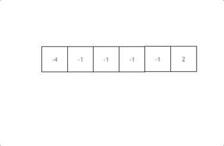

拿这个nums数组来举例，首先将数组排序，然后有一层for循环，i从下标0的地方开始，同时定一个下标left 定义在i+1的位置上，定义下标right 在数组结尾的位置上。

依然还是在数组中找到 abc 使得`a + b +c =0`，我们这里相当于  `a = nums[i]`，`b = nums[left]`，`c = nums[right]`。

接下来如何移动left 和right呢， 如果`nums[i] + nums[left] + nums[right] > 0`  就说明 此时三数之和大了，因为数组是排序后了，所以right下标就应该向左移动，这样才能让三数之和小一些。

如果 `nums[i] + nums[left] + nums[right] < 0` 说明 此时 三数之和小了，left 就向右移动，才能让三数之和大一些，直到left与right相遇为止。

时间复杂度：`O(n^2)`。

`C++`代码代码如下：

```cpp
class Solution {
public:
    vector<vector<int>> threeSum(vector<int>& nums) {
        vector<vector<int>> result;
        sort(nums.begin(), nums.end());
        // 找出a + b + c = 0
        // a = nums[i], b = nums[left], c = nums[right]
        for (int i = 0; i < nums.size(); i++) {
            // 排序之后如果第一个元素已经大于零，那么无论如何组合都不可能凑成三元组，直接返回结果就可
以了
            if (nums[i] > 0) {
                return result;
            }
            // 错误去重a方法，将会漏掉-1,-1,2 这种情况
            /*
            if (nums[i] == nums[i + 1]) {
                continue;
            }
            */
            // 正确去重a方法
            if (i > 0 && nums[i] == nums[i - 1]) {
                continue;
            }
            int left = i + 1;
            int right = nums.size() - 1;
            while (right > left) {
                // 去重复逻辑如果放在这里，0，0，0 的情况，可能直接导致 right<=left 了，从而漏掉了
0,0,0 这种三元组
                /*
                while (right > left && nums[right] == nums[right - 1]) right--;
                while (right > left && nums[left] == nums[left + 1]) left++;
                */
                if (nums[i] + nums[left] + nums[right] > 0) right--;
                else if (nums[i] + nums[left] + nums[right] < 0) left++;
                else {
                    result.push_back(vector<int>{nums[i], nums[left], nums[right]});
                    // 去重逻辑应该放在找到一个三元组之后，对b 和 c去重
                    while (right > left && nums[right] == nums[right - 1]) right--;
                    while (right > left && nums[left] == nums[left + 1]) left++;
                    // 找到答案时，双指针同时收缩
                    right--;
                    left++;
                }
            }
        }
        return result;
    }
};
```

- 时间复杂度`: O(n^2)`
- 空间复杂度`: O(1)`

### 去重逻辑的思考

#### a的去重

说道去重，其实主要考虑三个数的去重。 a, b ,c,  对应的就是 `nums[i]`，`nums[left]`，`nums[right]` 

a 如果重复了怎么办，a是nums里遍历的元素，那么应该直接跳过去。 

但这里有一个问题，是判断 `nums[i]` 与 `nums[i + 1]`是否相同，还是判断 `nums[i]` 与 `nums[i-1]` 是否相同。 

有同学可能想，这不都一样吗。

其实不一样！

都是和 `nums[i]`进行比较，是比较它的前一个，还是比较他的后一个。  

如果我们的写法是 这样：

```cpp
if (nums[i] == nums[i + 1]) { // 去重操作
    continue;
}
```

那就我们就把 三元组中出现重复元素的情况直接pass掉了。 例如`{-1, -1 ,2}` 这组数据，当遍历到第一个-1 的时候，判断 下一个也是-1，那这组数据就pass了。

**我们要做的是 不能有重复的三元组，但三元组内的元素是可以重复的！**

所以这里是有两个重复的维度。

那么应该这么写： 

```cpp
if (i > 0 && nums[i] == nums[i - 1]) {
    continue;
}
```

这么写就是当前使用 `nums[i]`，我们判断前一位是不是一样的元素，在看 `{-1, -1 ,2}` 这组数据，当遍历到 第一个 -1 的时候，只要前一位没有-1，那么  `{-1, -1 ,2}` 这组数据一样可以收录到 结果集里。 

这是一个非常细节的思考过程。 

#### b与c的去重

很多同学写本题的时候，去重的逻辑多加了 对right 和left 的去重：（代码中注释部分） 

```cpp
while (right > left) {
    if (nums[i] + nums[left] + nums[right] > 0) {
        right--;
        // 去重 right
        while (left < right && nums[right] == nums[right + 1]) right--;
    } else if (nums[i] + nums[left] + nums[right] < 0) {
        left++;
        // 去重 left
        while (left < right && nums[left] == nums[left - 1]) left++;
    } else {
    }
}
```

但细想一下，这种去重其实对提升程序运行效率是没有帮助的。 

```cpp
拿right去重为例，即使不加这个去重逻辑，依然根据  while (right > left) 和 if (nums[i] + nums[left]
+ nums[right] > 0)  去完成right-- 的操作。
多加了 while (left < right && nums[right] == nums[right + 1]) right--; 这一行代码，其实就是把
```

需要执行的逻辑提前执行了，但并没有减少 判断的逻辑。  

最直白的思考过程，就是right还是一个数一个数的减下去的，所以在哪里减的都是一样的。 

所以这种去重 是可以不加的。 仅仅是 把去重的逻辑提前了而已。

## 思考题

既然三数之和可以使用双指针法，我们之前讲过的[1.两数之和](https://programmercarl.com/0001.%E4%B8%A4%E6%95%B0%E4%B9%8B%E5%92%8C.html)，可不可以使用双指针法呢？

如果不能，题意如何更改就可以使用双指针法呢？  **大家留言说出自己的想法吧！**

两数之和 就不能使用双指针法，因为[1.两数之和](https://programmercarl.com/0001.%E4%B8%A4%E6%95%B0%E4%B9%8B%E5%92%8C.html)要求返回的是索引下标， 而双指针法一定要排序，一旦排序之后原数组的索引就被改变了。

如果[1.两数之和](https://programmercarl.com/0001.%E4%B8%A4%E6%95%B0%E4%B9%8B%E5%92%8C.html)要求返回的是数值的话，就可以使用双指针法了。

一样的道理，能解决四数之和那么五数之和、六数之和、N数之和呢？

# 9. 四数之和

[力扣题目链接](https://leetcode.cn/problems/4sum/)

题意：给定一个包含 n 个整数的数组 nums 和一个目标值 target，判断 nums 中是否存在四个元素 a，b，c 和 d ，使得 a + b + c + d 的值与 target 相等？找出所有满足条件且不重复的四元组。

**注意：**

答案中不可以包含重复的四元组。

示例：给定数组 `nums = [1, 0, -1, 0, -2, 2]`，和 `target = 0`。满足要求的四元组集合为：`[` `[-1,  0, 0, 1],` `[-2, -1, 1, 2],` `[-2,  0, 0, 2]` `]`

## 算法公开课

[**《代码随想录》算法视频公开课**](https://programmercarl.com/other/gongkaike.html)**：**[**难在去重和剪枝！| LeetCode：18. 四数之和**](https://www.bilibili.com/video/BV1DS4y147US)**，相信结合视频再看本篇题解，更** **有助于大家对本题的理解**。

## 思路

四数之和，和[15.三数之和](https://programmercarl.com/0015.%E4%B8%89%E6%95%B0%E4%B9%8B%E5%92%8C.html)是一个思路，都是使用双指针法, 基本解法就是在[15.三数之和](https://programmercarl.com/0015.%E4%B8%89%E6%95%B0%E4%B9%8B%E5%92%8C.html) 的基础上再套一层for循环。

```text
但是有一些细节需要注意，例如： 不要判断nums[k] > target 就返回了，三数之和 可以通过 nums[i] > 0 就
返回了，因为 0 已经是确定的数了，四数之和这道题目 target是任意值。比如：数组是[-4, -3, -2,
-1] ，target 是-10 ，不能因为-4 > -10 而跳过。但是我们依旧可以去做剪枝，逻辑变成nums[i] > target
&& (nums[i] >=0 || target >= 0) 就可以了。
```

[15.三数之和](https://programmercarl.com/0015.%E4%B8%89%E6%95%B0%E4%B9%8B%E5%92%8C.html)的双指针解法是一层for循环`num[i]`为确定值，然后循环内有left和right下标作为双指针，找到`nums[i]` `+ nums[left] + nums[right] == 0`。

四数之和的双指针解法是两层for循环`nums[k] + nums[i]`为确定值，依然是循环内有left和right下标作为双指针，找出`nums[k] + nums[i] + nums[left] + nums[right] == target`的情况，三数之和的时间复杂度是`O(n^2)`，四数之和的时间复杂度是`O(n^3)` 。

那么一样的道理，五数之和、六数之和等等都采用这种解法。

对于[15.三数之和](https://programmercarl.com/0015.%E4%B8%89%E6%95%B0%E4%B9%8B%E5%92%8C.html)双指针法就是将原本暴力`O(n^3)`的解法，降为`O(n^2)`的解法，四数之和的双指针解法就是将原本暴力`O(n^4)`的解法，降为`O(n^3)`的解法。

之前我们讲过哈希表的经典题目：[454.四数相加II](https://programmercarl.com/0454.%E5%9B%9B%E6%95%B0%E7%9B%B8%E5%8A%A0II.html)，相对于本题简单很多，因为本题是要求在一个集合中找出四个数相加等于target，同时四元组不能重复。

而[454.四数相加II](https://programmercarl.com/0454.%E5%9B%9B%E6%95%B0%E7%9B%B8%E5%8A%A0II.html)是四个独立的数组，只要找到`A[i] + B[j] + C[k] + D[l] = 0`就可以，不用考虑有重复的四个元素相加等于0的情况，所以相对于本题还是简单了不少！

我们来回顾一下，几道题目使用了双指针法。

双指针法将时间复杂度：`O(n^2)`的解法优化为 `O(n)`的解法。也就是降一个数量级，题目如下：

- [27.移除元素](https://programmercarl.com/0027.%E7%A7%BB%E9%99%A4%E5%85%83%E7%B4%A0.html)
- [15.三数之和](https://programmercarl.com/0015.%E4%B8%89%E6%95%B0%E4%B9%8B%E5%92%8C.html)
- [18.四数之和](https://programmercarl.com/0018.%E5%9B%9B%E6%95%B0%E4%B9%8B%E5%92%8C.html)

链表相关双指针题目：

- [206.反转链表](https://programmercarl.com/0206.%E7%BF%BB%E8%BD%AC%E9%93%BE%E8%A1%A8.html)
- [19.删除链表的倒数第N个节点](https://programmercarl.com/0019.%E5%88%A0%E9%99%A4%E9%93%BE%E8%A1%A8%E7%9A%84%E5%80%92%E6%95%B0%E7%AC%ACN%E4%B8%AA%E8%8A%82%E7%82%B9.html)
- [面试题 02.07. 链表相交](https://programmercarl.com/%E9%9D%A2%E8%AF%95%E9%A2%9802.07.%E9%93%BE%E8%A1%A8%E7%9B%B8%E4%BA%A4.html)
- [142题.环形链表II](https://programmercarl.com/0142.%E7%8E%AF%E5%BD%A2%E9%93%BE%E8%A1%A8II.html)

双指针法在字符串题目中还有很多应用，后面还会介绍到。

`C++`代码

```cpp
class Solution {
public:
    vector<vector<int>> fourSum(vector<int>& nums, int target) {
        vector<vector<int>> result;
        sort(nums.begin(), nums.end());
        for (int k = 0; k < nums.size(); k++) {
            // 剪枝处理
            if (nums[k] > target && nums[k] >= 0) {
              break; // 这里使用break，统一通过最后的return返回
            }
            // 对nums[k]去重
            if (k > 0 && nums[k] == nums[k - 1]) {
                continue;
            }
            for (int i = k + 1; i < nums.size(); i++) {
                // 2级剪枝处理
                if (nums[k] + nums[i] > target && nums[k] + nums[i] >= 0) {
                    break;
                }
                // 对nums[i]去重
                if (i > k + 1 && nums[i] == nums[i - 1]) {
                    continue;
                }
                int left = i + 1;
                int right = nums.size() - 1;
                while (right > left) {
                    // nums[k] + nums[i] + nums[left] + nums[right] > target 会溢出
                    if ((long) nums[k] + nums[i] + nums[left] + nums[right] > target) {
                        right--;
                    // nums[k] + nums[i] + nums[left] + nums[right] < target 会溢出
                    } else if ((long) nums[k] + nums[i] + nums[left] + nums[right]  <
target) {
                        left++;
                    } else {
                        result.push_back(vector<int>{nums[k], nums[i], nums[left],
nums[right]});
                        // 对nums[left]和nums[right]去重
                        while (right > left && nums[right] == nums[right - 1]) right--;
                        while (right > left && nums[left] == nums[left + 1]) left++;
                        // 找到答案时，双指针同时收缩
                        right--;
                        left++;
                    }
                }
            }
        }
        return result;
    }
};
```

- 时间复杂度`: O(n^3)`
- 空间复杂度`: O(1)`

## 补充

二级剪枝的部分：

```cpp
if (nums[k] + nums[i] > target && nums[k] + nums[i] >= 0) {
    break;
}
```

可以优化为： 

```cpp
if (nums[k] + nums[i] > target && nums[i] >= 0) {
    break;
}
```

因为只要 `nums[k] + nums[i] > target`，那么 `nums[i]` 后面的数都是正数的话，就一定 不符合条件了。 

不过这种剪枝 其实有点 小绕，大家能够理解 文章给的完整代码的剪枝 就够了。 

哈希表总结篇如约而至 

# 10. 哈希表总结篇

## 哈希表理论基础

在[关于哈希表，你该了解这些！](https://programmercarl.com/%E5%93%88%E5%B8%8C%E8%A1%A8%E7%90%86%E8%AE%BA%E5%9F%BA%E7%A1%80.html)中，我们介绍了哈希表的基础理论知识，不同于枯燥的讲解，这里介绍了都是对刷题有帮助的理论知识点。

**一般来说哈希表都是用来快速判断一个元素是否出现集合里**。

对于哈希表，要知道**哈希函数**和**哈希碰撞**在哈希表中的作用.

哈希函数是把传入的key映射到符号表的索引上。

哈希碰撞处理有多个key映射到相同索引上时的情景，处理碰撞的普遍方式是拉链法和线性探测法。

接下来是常见的三种哈希结构：

- 数组
- set（集合）
- map（映射）

在`C++`语言中，set 和 map 都分别提供了三种数据结构，每种数据结构的底层实现和用途都有所不同，在关于哈希表，你该了解这些！中我给出了详细分析，这一知识点很重要！

例如什么时候用`std::set`，什么时候用`std::multiset`，什么时候用`std::unordered_set`，都是很有考究的。

**只有对这些数据结构的底层实现很熟悉，才能灵活使用，否则很容易写出效率低下的程序**。 

## 哈希表经典题目

### 数组作为哈希表

一些应用场景就是为数组量身定做的。

在[242.有效的字母异位词](https://programmercarl.com/0242.%E6%9C%89%E6%95%88%E7%9A%84%E5%AD%97%E6%AF%8D%E5%BC%82%E4%BD%8D%E8%AF%8D.html)中，我们提到了数组就是简单的哈希表，但是数组的大小是受限的！

这道题目包含小写字母，那么使用数组来做哈希最合适不过。

在[383.赎金信](https://programmercarl.com/0383.%E8%B5%8E%E9%87%91%E4%BF%A1.html)中同样要求只有小写字母，那么就给我们浓浓的暗示，用数组！

本题和[242.有效的字母异位词](https://programmercarl.com/0242.%E6%9C%89%E6%95%88%E7%9A%84%E5%AD%97%E6%AF%8D%E5%BC%82%E4%BD%8D%E8%AF%8D.html)很像，[242.有效的字母异位词](https://programmercarl.com/0242.%E6%9C%89%E6%95%88%E7%9A%84%E5%AD%97%E6%AF%8D%E5%BC%82%E4%BD%8D%E8%AF%8D.html)是求 字符串a 和 字符串b 是否可以相互组成，在383.赎金信中是求字符串a能否组成字符串b，而不用管字符串b 能不能组成字符串a。

一些同学可能想，用数组干啥，都用map不就完事了。

**上面两道题目用map确实可以，但使用map的空间消耗要比数组大一些，因为map要维护红黑树或者符号表，而** **且还要做哈希函数的运算。所以数组更加简单直接有效！** 

### set作为哈希表

在[349. 两个数组的交集](https://programmercarl.com/0349.%E4%B8%A4%E4%B8%AA%E6%95%B0%E7%BB%84%E7%9A%84%E4%BA%A4%E9%9B%86.html)中我们给出了什么时候用数组就不行了，需要用set。

这道题目没有限制数值的大小，就无法使用数组来做哈希表了。

**主要因为如下两点：**

- 数组的大小是有限的，受到系统栈空间（不是数据结构的栈）的限制。
- 如果数组空间够大，但哈希值比较少、特别分散、跨度非常大，使用数组就造成空间的极大浪费。

所以此时一样的做映射的话，就可以使用set了。

关于set，`C++` 给提供了如下三种可用的数据结构：（详情请看[关于哈希表，你该了解这些！](https://programmercarl.com/%E5%93%88%E5%B8%8C%E8%A1%A8%E7%90%86%E8%AE%BA%E5%9F%BA%E7%A1%80.html)）

- `std::set`

- `std::multiset`
- `std::unordered_set`

`std::set`和`std::multiset`底层实现都是红黑树，`std::unordered_set`的底层实现是哈希， 使用unordered_set 读写效率是最高的，本题并不需要对数据进行排序，而且还不要让数据重复，所以选择unordered_set。

在[202.快乐数](https://programmercarl.com/0202.%E5%BF%AB%E4%B9%90%E6%95%B0.html)中，我们再次使用了unordered_set来判断一个数是否重复出现过。

### map作为哈希表

在[1.两数之和](https://programmercarl.com/0001.%E4%B8%A4%E6%95%B0%E4%B9%8B%E5%92%8C.html)中map正式登场。

来说一说：使用数组和set来做哈希法的局限。

- 数组的大小是受限制的，而且如果元素很少，而哈希值太大会造成内存空间的浪费。
- set是一个集合，里面放的元素只能是一个key，而两数之和这道题目，不仅要判断y是否存在而且还要记录y的下标位置，因为要返回x 和 y的下标。所以set 也不能用。

```text
map是一种<key, value> 的结构，本题可以用key保存数值，用value在保存数值所在的下标。所以使用map最
```

为合适。

`C++`提供如下三种map：：（详情请看[关于哈希表，你该了解这些！](https://programmercarl.com/%E5%93%88%E5%B8%8C%E8%A1%A8%E7%90%86%E8%AE%BA%E5%9F%BA%E7%A1%80.html)）

- `std::map`
- `std::multimap`
- `std::unordered_map` 

`std::unordered_map` 底层实现为哈希，`std::map` 和`std::multimap` 的底层实现是红黑树。

同理，`std::map` 和`std::multimap` 的key也是有序的（这个问题也经常作为面试题，考察对语言容器底层的理解），[1.两数之和](https://programmercarl.com/0001.%E4%B8%A4%E6%95%B0%E4%B9%8B%E5%92%8C.html)中并不需要key有序，选择`std::unordered_map` 效率更高！

在[454.四数相加](https://programmercarl.com/0454.%E5%9B%9B%E6%95%B0%E7%9B%B8%E5%8A%A0II.html)中我们提到了其实需要哈希的地方都能找到map的身影。

本题咋眼一看好像和[18. 四数之和](https://programmercarl.com/0018.%E5%9B%9B%E6%95%B0%E4%B9%8B%E5%92%8C.html)，[15.三数之和](https://programmercarl.com/0015.%E4%B8%89%E6%95%B0%E4%B9%8B%E5%92%8C.html)差不多，其实差很多！

**关键差别是本题为四个独立的数组，只要找到A[i] + B[j] + C[k] + D[l] = 0就可以，不用考虑重复问题，而18. 四数** **之和，**[**15.三数之和**](https://programmercarl.com/0015.%E4%B8%89%E6%95%B0%E4%B9%8B%E5%92%8C.html)**是一个数组（集合）里找到和为0的组合，可就难很多了！**

用哈希法解决了两数之和，很多同学会感觉用哈希法也可以解决三数之和，四数之和。

其实是可以解决，但是非常麻烦，需要去重导致代码效率很低。

在[15.三数之和](https://programmercarl.com/0015.%E4%B8%89%E6%95%B0%E4%B9%8B%E5%92%8C.html)中我给出了哈希法和双指针两个解法，大家就可以体会到，使用哈希法还是比较麻烦的。

所以18. 四数之和，15.三数之和都推荐使用双指针法！

## 总结

对于哈希表的知识相信很多同学都知道，但是没有成体系。

本篇我们从哈希表的理论基础到数组、set和map的经典应用，把哈希表的整个全貌完整的呈现给大家。

**同时也强调虽然map是万能的，详细介绍了什么时候用数组，什么时候用set**。

相信通过这个总结篇，大家可以对哈希表有一个全面的了解。
