[](https://programmercarl.com/other/xunlianying.html)

**《代码随想录》作者：**[**程序员Carl**](https://github.com/youngyangyang04)

- 代码随想录官网[（网站持续更新优化内容，建议直接看网站）](https://www.programmercarl.com/)：www.programmercarl.com
- 代码随想录[Github开源地址](https://github.com/youngyangyang04/leetcode-master)
- [代码随想录算法公开课](https://programmercarl.com/other/gongkaike.html)，代码随想录的全部内容将由我（[程序员Carl](https://github.com/youngyangyang04)）视频讲解并开免费开放给大家。
- [《代码随想录》](https://programmercarl.com/other/publish.html) 已经出版。
- [代码随想录知识星球](https://programmercarl.com/other/kstar.html) 上万录友在这里学习
- [代码随想录算法训练营](https://programmercarl.com/other/xunlianying.html) 帮助录友高效刷完代码随想录。
- 微信公众号：[代码随想录](https://img-blog.csdnimg.cn/74f47bc466234462bd2acc3ba6cd1b70.png)
- 组队刷题，可以添加[代码随想录官方微信](https://www.programmercarl.com/other/wechat.html)
- ACM模式练习，推荐：[卡码网](https://kamacoder.com/)

**特别提示**：PDF仅提供`C++`语言版本同时PDF中很多动图无法加载，其他编程语言版本和查看动图可以移步至代码随想录官方网站查看。

打基础的时候，不要太迷恋于库函数。

# 1.反转字符串

[力扣题目链接](https://leetcode.cn/problems/reverse-string/)

编写一个函数，其作用是将输入的字符串反转过来。输入字符串以字符数组 `char[]` 的形式给出。

不要给另外的数组分配额外的空间，你必须原地修改输入数组、使用 `O(1)`  的额外空间解决这一问题。

你可以假设数组中的所有字符都是 ASCII 码表中的可打印字符。

示例 1：  
输入：`["h","e","l","l","o"]`  
输出：`["o","l","l","e","h"]`  
示例 2： 

输入：`["H","a","n","n","a","h"]`  
输出：`["h","a","n","n","a","H"]` 

## 算法公开课

[**《代码随想录》算法视频公开课**](https://programmercarl.com/other/gongkaike.html)**：**[**字符串基础操作！ | LeetCode：344.反转字符串**](https://www.bilibili.com/video/BV1fV4y17748)**，相信结合视频再看本篇题** **解，更有助于大家对本题的理解**。

## 思路

先说一说题外话：

对于这道题目一些同学直接用`C++`里的一个库函数 reverse，调一下直接完事了， 相信每一门编程语言都有这样的库函数。

如果这么做题的话，这样大家不会清楚反转字符串的实现原理了。

但是也不是说库函数就不能用，是要分场景的。

如果在现场面试中，我们什么时候使用库函数，什么时候不要用库函数呢？

**如果题目关键的部分直接用库函数就可以解决，建议不要使用库函数。**

毕竟面试官一定不是考察你对库函数的熟悉程度， 如果使用python和java 的同学更需要注意这一点，因为python、java提供的库函数十分丰富。

**如果库函数仅仅是 解题过程中的一小部分，并且你已经很清楚这个库函数的内部实现原理的话，可以考虑使用库函** **数。**

建议大家平时在leetcode上练习算法的时候本着这样的原则去练习，这样才有助于我们对算法的理解。

不要沉迷于使用库函数一行代码解决题目之类的技巧，不是说这些技巧不好，而是说这些技巧可以用来娱乐一下。

真正自己写的时候，要保证理解可以实现是相应的功能。

接下来再来讲一下如何解决反转字符串的问题。

大家应该还记得，我们已经讲过了[206.反转链表](https://programmercarl.com/0206.%E7%BF%BB%E8%BD%AC%E9%93%BE%E8%A1%A8.html)。

在反转链表中，使用了双指针的方法。

那么反转字符串依然是使用双指针的方法，只不过对于字符串的反转，其实要比链表简单一些。

因为字符串也是一种数组，所以元素在内存中是连续分布，这就决定了反转链表和反转字符串方式上还是有所差异的。

如果对数组和链表原理不清楚的同学，可以看这两篇，[关于链表，你该了解这些！](https://programmercarl.com/%E9%93%BE%E8%A1%A8%E7%90%86%E8%AE%BA%E5%9F%BA%E7%A1%80.html)，[必须掌握的数组理论知识](https://programmercarl.com/%E6%95%B0%E7%BB%84%E7%90%86%E8%AE%BA%E5%9F%BA%E7%A1%80.html)。

对于字符串，我们定义两个指针（也可以说是索引下标），一个从字符串前面，一个从字符串后面，两个指针同时向中间移动，并交换元素。

```text
以字符串hello 为例，过程如下：
```

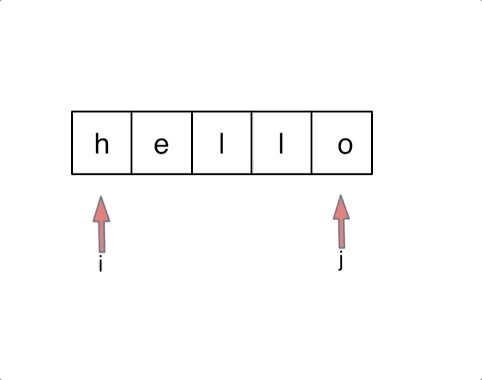

不难写出如下`C++`代码:

```cpp
void reverseString(vector<char>& s) {
    for (int i = 0, j = s.size() - 1; i < s.size()/2; i++, j--) {
        swap(s[i],s[j]);
    }
}
```

循环里只要做交换`s[i]` 和`s[j]`操作就可以了，那么我这里使用了swap 这个库函数。大家可以使用。

因为相信大家都知道交换函数如何实现，而且这个库函数仅仅是解题中的一部分， 所以这里使用库函数也是可以的。

swap可以有两种实现。

一种就是常见的交换数值：

```cpp
int tmp = s[i];
s[i] = s[j];
s[j] = tmp;
```

一种就是通过位运算：

```cpp
s[i] ^= s[j];
s[j] ^= s[i];
s[i] ^= s[j];
```

这道题目还是比较简单的，但是我正好可以通过这道题目说一说在刷题的时候，使用库函数的原则。

如果题目关键的部分直接用库函数就可以解决，建议不要使用库函数。

如果库函数仅仅是 解题过程中的一小部分，并且你已经很清楚这个库函数的内部实现原理的话，可以考虑使用库函数。

本着这样的原则，我没有使用reverse库函数，而使用swap库函数。

**在字符串相关的题目中，库函数对大家的诱惑力是非常大的，因为会有各种反转，切割取词之类的操作**，这也是为什么字符串的库函数这么丰富的原因。

相信大家本着我所讲述的原则来做字符串相关的题目，在选择库函数的角度上会有所原则，也会有所收获。

`C++`代码如下：

```cpp
class Solution {
public:
    void reverseString(vector<char>& s) {
        for (int i = 0, j = s.size() - 1; i < s.size()/2; i++, j--) {
            swap(s[i],s[j]);
        }
    }
};
```

- 时间复杂度`: O(n)`
- 空间复杂度`: O(1)`

简单的反转还不够，我要花式反转

# 2. 反转字符串II

[力扣题目链接](https://leetcode.cn/problems/reverse-string-ii/)

给定一个字符串 s 和一个整数 k，从字符串开头算起, 每计数至 2k 个字符，就反转这 2k 个字符中的前 k 个字符。

如果剩余字符少于 k 个，则将剩余字符全部反转。

如果剩余字符小于 2k 但大于或等于 k 个，则反转前 k 个字符，其余字符保持原样。

示例:

输入`: s = "abcdefg", k = 2`  
输出: "bacdfeg" 

## 算法公开课

[**《代码随想录》算法视频公开课**](https://programmercarl.com/other/gongkaike.html)**：**[**字符串操作进阶！ | LeetCode：541. 反转字符串II**](https://www.bilibili.com/video/BV1dT411j7NN)**，相信结合视频再看本篇题** **解，更有助于大家对本题的理解**。

## 思路

这道题目其实也是模拟，实现题目中规定的反转规则就可以了。

一些同学可能为了处理逻辑：每隔2k个字符的前k的字符，写了一堆逻辑代码或者再搞一个计数器，来统计2k，再统计前k个字符。

其实在遍历字符串的过程中，只要让 `i += (2 * k)`，i 每次移动 2 * k 就可以了，然后判断是否需要有反转的区间。

因为要找的也就是每2 * k 区间的起点，这样写，程序会高效很多。

**所以当需要固定规律一段一段去处理字符串的时候，要想想在在for循环的表达式上做做文章。**

性能如下：


那么这里具体反转的逻辑我们要不要使用库函数呢，其实用不用都可以，使用reverse来实现反转也没毛病，毕竟不是解题关键部分。

使用`C++`库函数reverse的版本如下：

```cpp
class Solution {
public:
    string reverseStr(string s, int k) {
        for (int i = 0; i < s.size(); i += (2 * k)) {
            // 1. 每隔 2k 个字符的前 k 个字符进行反转
            // 2. 剩余字符小于 2k 但大于或等于 k 个，则反转前 k 个字符
            if (i + k <= s.size()) {
                reverse(s.begin() + i, s.begin() + i + k );
            } else {
                // 3. 剩余字符少于 k 个，则将剩余字符全部反转。
                reverse(s.begin() + i, s.end());
            }
        }
        return s;
    }
};
```

- 时间复杂度`: O(n)`
- 空间复杂度`: O(1)`

那么我们也可以实现自己的reverse函数，其实和题目[344. 反转字符串](https://programmercarl.com/0344.%E5%8F%8D%E8%BD%AC%E5%AD%97%E7%AC%A6%E4%B8%B2.html)道理是一样的。

下面我实现的reverse函数区间是左闭右闭区间，代码如下：

```cpp
class Solution {
public:
    void reverse(string& s, int start, int end) {
        for (int i = start, j = end; i < j; i++, j--) {
            swap(s[i], s[j]);
        }
    }
    string reverseStr(string s, int k) {
        for (int i = 0; i < s.size(); i += (2 * k)) {
            // 1. 每隔 2k 个字符的前 k 个字符进行反转
            // 2. 剩余字符小于 2k 但大于或等于 k 个，则反转前 k 个字符
            if (i + k <= s.size()) {
                reverse(s, i, i + k - 1);
                continue;
            }
            // 3. 剩余字符少于 k 个，则将剩余字符全部反转。
            reverse(s, i, s.size() - 1);
        }
        return s;
    }
};
```

- 时间复杂度`: O(n)`
- 空间复杂度`: O(1)`或`O(n),` 取决于使用的语言中字符串是否可以修改.

另一种思路的解法

```cpp
class Solution {
public:
    string reverseStr(string s, int k) {
        int n = s.size(),pos = 0;
        while(pos < n){
            //剩余字符串大于等于k的情况
            if(pos + k < n) reverse(s.begin() + pos, s.begin() + pos + k);
            //剩余字符串不足k的情况
            else reverse(s.begin() + pos,s.end());
            pos += 2 * k;
        }
        return s;
    }
};
```

- 时间复杂度`: O(n)`
- 空间复杂度`: O(1)`

# 3.剑指Offer 05.替换空格

[力扣题目链接](https://leetcode.cn/problems/ti-huan-kong-ge-lcof/)

请实现一个函数，把字符串 s 中的每个空格替换成"%20"。

示例 1：  
输入：`s = "We are happy."`  
输出："We%20are%20happy." 

## 思路

如果想把这道题目做到极致，就不要只用额外的辅助空间了！

首先扩充数组到每个空格替换成"%20"之后的大小。

然后从后向前替换空格，也就是双指针法，过程如下：

i指向新长度的末尾，j指向旧长度的末尾。

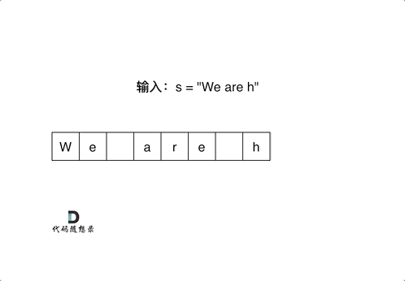

有同学问了，为什么要从后向前填充，从前向后填充不行么？

从前向后填充就是`O(n^2)`的算法了，因为每次添加元素都要将添加元素之后的所有元素向后移动。

**其实很多数组填充类的问题，都可以先预先给数组扩容带填充后的大小，然后在从后向前进行操作。**

这么做有两个好处：

1. 不用申请新数组。2. 从后向前填充元素，避免了从前向后填充元素时，每次添加元素都要将添加元素之后的所有元素向后移动的问题。

时间复杂度，空间复杂度均超过100%的用户。


`C++`代码如下：

```cpp
class Solution {
public:
    string replaceSpace(string s) {
        int count = 0; // 统计空格的个数
        int sOldSize = s.size();
        for (int i = 0; i < s.size(); i++) {
            if (s[i] == ' ') {
                count++;
            }
        }
        // 扩充字符串s的大小，也就是每个空格替换成"%20"之后的大小
        s.resize(s.size() + count * 2);
        int sNewSize = s.size();
        // 从后先前将空格替换为"%20"
        for (int i = sNewSize - 1, j = sOldSize - 1; j < i; i--, j--) {
            if (s[j] != ' ') {
                s[i] = s[j];
            } else {
                s[i] = '0';
                s[i - 1] = '2';
                s[i - 2] = '%';
                i -= 2;
            }
        }
        return s;
    }
};
```

- 时间复杂度：`O(n)`
- 空间复杂度：`O(1)`

此时算上本题，我们已经做了七道双指针相关的题目了分别是：

- [27.移除元素](https://programmercarl.com/0027.%E7%A7%BB%E9%99%A4%E5%85%83%E7%B4%A0.html)
- [15.三数之和](https://programmercarl.com/0015.%E4%B8%89%E6%95%B0%E4%B9%8B%E5%92%8C.html)
- [18.四数之和](https://programmercarl.com/0018.%E5%9B%9B%E6%95%B0%E4%B9%8B%E5%92%8C.html)
- [206.翻转链表](https://programmercarl.com/0206.%E7%BF%BB%E8%BD%AC%E9%93%BE%E8%A1%A8.html)

- [142.环形链表II](https://programmercarl.com/0142.%E7%8E%AF%E5%BD%A2%E9%93%BE%E8%A1%A8II.html)
- [344.反转字符串](https://programmercarl.com/0344.%E5%8F%8D%E8%BD%AC%E5%AD%97%E7%AC%A6%E4%B8%B2.html)

## 拓展

这里也给大家拓展一下字符串和数组有什么差别，

字符串是若干字符组成的有限序列，也可以理解为是一个字符数组，但是很多语言对字符串做了特殊的规定，接下来我来说一说`C/C++`中的字符串。

在C语言中，把一个字符串存入一个数组时，也把结束符 '\0'存入数组，并以此作为该字符串是否结束的标志。

例如这段代码：

```cpp
char a[5] = "asd";
for (int i = 0; a[i] != '\0'; i++) {
}
```

在`C++`中，提供一个string类，string类会提供 size接口，可以用来判断string类字符串是否结束，就不用'\0'来判断是否结束。

例如这段代码:

```cpp
string a = "asd";
for (int i = 0; i < a.size(); i++) {
}
```

那么`vector< char >` 和 string 又有什么区别呢？

其实在基本操作上没有区别，但是 string提供更多的字符串处理的相关接口，例如string 重载了+，而vector却没有。

所以想处理字符串，我们还是会定义一个string类型。

综合考察字符串操作的好题。

# 4.翻转字符串里的单词

[力扣题目链接](https://leetcode.cn/problems/reverse-words-in-a-string/)

给定一个字符串，逐个翻转字符串中的每个单词。

示例 1：  
输入: "the sky is blue"  
输出: "blue is sky the" 

示例 2：  
输入: "  hello world!  "  
输出: "world! hello"  
解释: 输入字符串可以在前面或者后面包含多余的空格，但是反转后的字符不能包括。 

示例 3：  
输入: "a good example"  
输出: "example good a"  
解释: 如果两个单词间有多余的空格，将反转后单词间的空格减少到只含一个。  

## 算法公开课

[**《代码随想录》算法视频公开课**](https://programmercarl.com/other/gongkaike.html)**：**[**字符串复杂操作拿捏了！ | LeetCode:151.翻转字符串里的单词**](https://www.bilibili.com/video/BV1uT41177fX)**，相信结合视频** **再看本篇题解，更有助于大家对本题的理解**。

## 思路

**这道题目可以说是综合考察了字符串的多种操作。**

一些同学会使用split库函数，分隔单词，然后定义一个新的string字符串，最后再把单词倒序相加，那么这道题题目就是一道水题了，失去了它的意义。

所以这里我还是提高一下本题的难度：**不要使用辅助空间，空间复杂度要求为O(1)。**

不能使用辅助空间之后，那么只能在原字符串上下功夫了。

想一下，我们将整个字符串都反转过来，那么单词的顺序指定是倒序了，只不过单词本身也倒序了，那么再把单词反转一下，单词不就正过来了。

所以解题思路如下：

- 移除多余空格
- 将整个字符串反转
- 将每个单词反转

举个例子，源字符串为："the sky is blue "

- 移除多余空格 : "the sky is blue"
- 字符串反转："eulb si yks eht"
- 单词反转："blue is sky the"

这样我们就完成了翻转字符串里的单词。

思路很明确了，我们说一说代码的实现细节，就拿移除多余空格来说，一些同学会上来写如下代码：

```cpp
void removeExtraSpaces(string& s) {
    for (int i = s.size() - 1; i > 0; i--) {
        if (s[i] == s[i - 1] && s[i] == ' ') {
            s.erase(s.begin() + i);
        }
    }
    // 删除字符串最后面的空格
    if (s.size() > 0 && s[s.size() - 1] == ' ') {
        s.erase(s.begin() + s.size() - 1);
    }
    // 删除字符串最前面的空格
    if (s.size() > 0 && s[0] == ' ') {
        s.erase(s.begin());
    }
}
```

逻辑很简单，从前向后遍历，遇到空格了就erase。

如果不仔细琢磨一下erase的时间复杂度，还以为以上的代码是`O(n)`的时间复杂度呢。

想一下真正的时间复杂度是多少，一个erase本来就是`O(n)`的操作。

erase操作上面还套了一个for循环，那么以上代码移除冗余空格的代码时间复杂度为`O(n^2)`。

那么使用双指针法来去移除空格，最后resize（重新设置）一下字符串的大小，就可以做到`O(n)`的时间复杂度。

```cpp
//版本一
void removeExtraSpaces(string& s) {
    int slowIndex = 0, fastIndex = 0; // 定义快指针，慢指针
    // 去掉字符串前面的空格
    while (s.size() > 0 && fastIndex < s.size() && s[fastIndex] == ' ') {
        fastIndex++;
    }
    for (; fastIndex < s.size(); fastIndex++) {
        // 去掉字符串中间部分的冗余空格
        if (fastIndex - 1 > 0
                && s[fastIndex - 1] == s[fastIndex]
                && s[fastIndex] == ' ') {
            continue;
        } else {
            s[slowIndex++] = s[fastIndex];
        }
    }
    if (slowIndex - 1 > 0 && s[slowIndex - 1] == ' ') { // 去掉字符串末尾的空格
        s.resize(slowIndex - 1);
    } else {
        s.resize(slowIndex); // 重新设置字符串大小
    }
}
```

有的同学可能发现用erase来移除空格，在leetcode上性能也还行。主要是以下几点；：

1. leetcode上的测试集里，字符串的长度不够长，如果足够长，性能差距会非常明显。2. leetcode的测程序耗时不是很准确的。

版本一的代码是一般的思考过程，就是 先移除字符串前的空格，再移除中间的，再移除后面部分。 

不过其实还可以优化，这部分和[27.移除元素](https://programmercarl.com/0027.%E7%A7%BB%E9%99%A4%E5%85%83%E7%B4%A0.html)的逻辑是一样一样的，本题是移除空格，而 27.移除元素 就是移除元素。 

所以代码可以写的很精简，大家可以看 如下 代码 removeExtraSpaces 函数的实现：

```cpp
// 版本二
void removeExtraSpaces(string& s) {//去除所有空格并在相邻单词之间添加空格, 快慢指针。
    int slow = 0;   //整体思想参考https://programmercarl.com/0027.移除元素.html
    for (int i = 0; i < s.size(); ++i) { //
        if (s[i] != ' ') { //遇到非空格就处理，即删除所有空格。
            if (slow != 0) s[slow++] = ' '; //手动控制空格，给单词之间添加空格。slow != 0说明
不是第一个单词，需要在单词前添加空格。
            while (i < s.size() && s[i] != ' ') { //补上该单词，遇到空格说明单词结束。
                s[slow++] = s[i++];
            }
        }
    }
    s.resize(slow); //slow的大小即为去除多余空格后的大小。
}
```

如果以上代码看不懂，建议先把 [27.移除元素](https://programmercarl.com/0027.%E7%A7%BB%E9%99%A4%E5%85%83%E7%B4%A0.html)这道题目做了，或者看视频讲解：数组中移除元素并不容易！LeetCode：27. 移除元素 。

此时我们已经实现了removeExtraSpaces函数来移除冗余空格。

还要实现反转字符串的功能，支持反转字符串子区间，这个实现我们分别在[344.反转字符串](https://programmercarl.com/0344.%E5%8F%8D%E8%BD%AC%E5%AD%97%E7%AC%A6%E4%B8%B2.html)和[541.反转字符串II](https://programmercarl.com/0541.%E5%8F%8D%E8%BD%AC%E5%AD%97%E7%AC%A6%E4%B8%B2II.html)里已经讲过了。

代码如下：

```cpp
// 反转字符串s中左闭右闭的区间[start, end]
void reverse(string& s, int start, int end) {
    for (int i = start, j = end; i < j; i++, j--) {
        swap(s[i], s[j]);
    }
}
```

整体代码如下：

```cpp
class Solution {
public:
    void reverse(string& s, int start, int end){ //翻转，区间写法：左闭右闭 []
        for (int i = start, j = end; i < j; i++, j--) {
            swap(s[i], s[j]);
        }
    }
    void removeExtraSpaces(string& s) {//去除所有空格并在相邻单词之间添加空格, 快慢指针。
        int slow = 0;   //整体思想参考https://programmercarl.com/0027.移除元素.html
        for (int i = 0; i < s.size(); ++i) { //
            if (s[i] != ' ') { //遇到非空格就处理，即删除所有空格。
                if (slow != 0) s[slow++] = ' '; //手动控制空格，给单词之间添加空格。slow != 0
说明不是第一个单词，需要在单词前添加空格。
                while (i < s.size() && s[i] != ' ') { //补上该单词，遇到空格说明单词结束。
                    s[slow++] = s[i++];
                }
            }
        }
        s.resize(slow); //slow的大小即为去除多余空格后的大小。
    }
    string reverseWords(string s) {
        removeExtraSpaces(s); //去除多余空格，保证单词之间之只有一个空格，且字符串首尾没空格。
        reverse(s, 0, s.size() - 1);
        int start = 0; //removeExtraSpaces后保证第一个单词的开始下标一定是0。
        for (int i = 0; i <= s.size(); ++i) {
            if (i == s.size() || s[i] == ' ') { //到达空格或者串尾，说明一个单词结束。进行翻
转。
                reverse(s, start, i - 1); //翻转，注意是左闭右闭 []的翻转。
                start = i + 1; //更新下一个单词的开始下标start
            }
        }
        return s;
    }
};
```

- 时间复杂度`: O(n)`
- 空间复杂度`: O(1)` 或 `O(n)`，取决于语言中字符串是否可变

反转个字符串还有这么多用处？

# 5. 剑指Offer58-II.左旋转字符串

[力扣题目链接](https://leetcode.cn/problems/zuo-xuan-zhuan-zi-fu-chuan-lcof/)

字符串的左旋转操作是把字符串前面的若干个字符转移到字符串的尾部。请定义一个函数实现字符串左旋转操作的功能。比如，输入字符串"abcdefg"和数字2，该函数将返回左旋转两位得到的结果"cdefgab"。

示例 1：  
输入`: s = "abcdefg", k = 2`  
输出: "cdefgab" 

示例 2：  
输入`: s = "lrloseumgh", k = 6`  
输出: "umghlrlose" 

限制： `1 <= k < s.length <= 10000` 

## 思路

为了让本题更有意义，提升一下本题难度：**不能申请额外空间，只能在本串上操作**。

不能使用额外空间的话，模拟在本串操作要实现左旋转字符串的功能还是有点困难的。

那么我们可以想一下上一题目[字符串：花式反转还不够！](https://programmercarl.com/0151.%E7%BF%BB%E8%BD%AC%E5%AD%97%E7%AC%A6%E4%B8%B2%E9%87%8C%E7%9A%84%E5%8D%95%E8%AF%8D.html)中讲过，使用整体反转+局部反转就可以实现反转单词顺序的目的。

这道题目也非常类似，依然可以通过局部反转+整体反转 达到左旋转的目的。

具体步骤为：

1. 反转区间为前n的子串2. 反转区间为n到末尾的子串3. 反转整个字符串

最后就可以达到左旋n的目的，而不用定义新的字符串，完全在本串上操作。

例如 ：示例1中 输入：字符串abcdefg，`n=2`

如图：

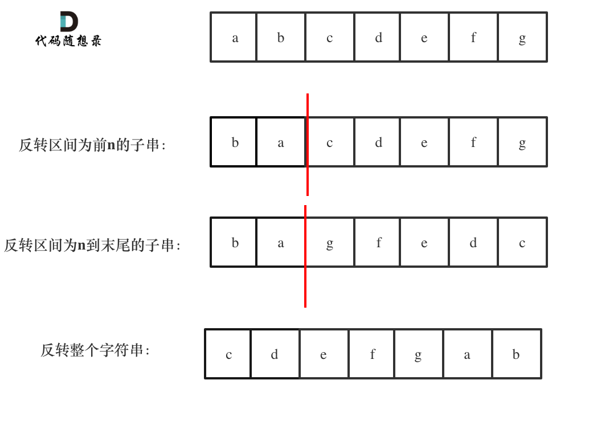

最终得到左旋2个单元的字符串：cdefgab

思路明确之后，那么代码实现就很简单了`C++`代码如下：

```cpp
class Solution {
public:
    string reverseLeftWords(string s, int n) {
        reverse(s.begin(), s.begin() + n);
        reverse(s.begin() + n, s.end());
        reverse(s.begin(), s.end());
        return s;
    }
};
```

- 时间复杂度`: O(n)`
- 空间复杂度：`O(1)`

是不是发现这代码也太简单了，哈哈。

## 总结

此时我们已经反转好多次字符串了，来一起回顾一下吧。

在这篇文章[344.反转字符串](https://programmercarl.com/0344.%E5%8F%8D%E8%BD%AC%E5%AD%97%E7%AC%A6%E4%B8%B2.html)，第一次讲到反转一个字符串应该怎么做，使用了双指针法。

然后发现[541. 反转字符串II](https://programmercarl.com/0541.%E5%8F%8D%E8%BD%AC%E5%AD%97%E7%AC%A6%E4%B8%B2II.html)，这里开始给反转加上了一些条件，当需要固定规律一段一段去处理字符串的时候，要想想在for循环的表达式上做做文章。

后来在[151.翻转字符串里的单词](https://programmercarl.com/0151.%E7%BF%BB%E8%BD%AC%E5%AD%97%E7%AC%A6%E4%B8%B2%E9%87%8C%E7%9A%84%E5%8D%95%E8%AF%8D.html)中，要对一句话里的单词顺序进行反转，发现先整体反转再局部反转 是一个很妙的思路。

最后再讲到本题，本题则是先局部反转再 整体反转，与[151.翻转字符串里的单词](https://programmercarl.com/0151.%E7%BF%BB%E8%BD%AC%E5%AD%97%E7%AC%A6%E4%B8%B2%E9%87%8C%E7%9A%84%E5%8D%95%E8%AF%8D.html)类似，但是也是一种新的思路。

好了，反转字符串一共就介绍到这里，相信大家此时对反转字符串的常见操作已经很了解了。

## 题外话

一些同学热衷于使用substr，来做这道题。其实使用substr 和 反转 时间复杂度是一样的 ，都是`O(n)`，但是使用substr申请了额外空间，所以空间复杂度是`O(n)`，而反转方法的空间复杂度是`O(1)`。

**如果想让这套题目有意义，就不要申请额外空间。**

在一个串中查找是否出现过另一个串，这是KMP的看家本领。

# 6. 实现 strStr()

[力扣题目链接](https://leetcode.cn/problems/find-the-index-of-the-first-occurrence-in-a-string/)

实现 `strStr()` 函数。

给定一个 haystack 字符串和一个 needle 字符串，在 haystack 字符串中找出 needle 字符串出现的第一个位置 `(`从0开始`)`。如果不存在，则返回  -1。

示例 1:  
输入`: haystack = "hello", needle = "ll"`  
输出: 2

示例 2:  
输入`: haystack = "aaaaa", needle = "bba"`  
输出: -1

说明:当 needle 是空字符串时，我们应当返回什么值呢？这是一个在面试中很好的问题。对于本题而言，当 needle 是空字符串时我们应当返回 0 。这与C语言的 `strstr()` 以及 Java的 `indexOf()` 定义相符。

## 思路

本题是KMP 经典题目。

以下文字如果看不进去，可以看我的B站视频：

- [帮你把KMP算法学个通透！B站（理论篇）](https://www.bilibili.com/video/BV1PD4y1o7nd/)
- [帮你把KMP算法学个通透！（求next数组代码篇）](https://www.bilibili.com/video/BV1M5411j7Xx)

KMP的经典思想就是:**当出现字符串不匹配时，可以记录一部分之前已经匹配的文本内容，利用这些信息避免从头** **再去做匹配。**

本篇将以如下顺序来讲解KMP，

- 什么是KMP
- KMP有什么用
- 什么是前缀表
- 为什么一定要用前缀表
- 如何计算前缀表
- 前缀表与next数组
- 使用next数组来匹配
- 时间复杂度分析
- 构造next数组
- 使用next数组来做匹配
- 前缀表统一减一 `C++`代码实现
- 前缀表（不减一）`C++`实现
- 总结

读完本篇可以顺便把leetcode上28.实现`strStr()`题目做了。

### 什么是KMP

说到KMP，先说一下KMP这个名字是怎么来的，为什么叫做KMP呢。

因为是由这三位学者发明的：Knuth，Morris和Pratt，所以取了三位学者名字的首字母。所以叫做KMP

### KMP有什么用

KMP主要应用在字符串匹配上。

KMP的主要思想是**当出现字符串不匹配时，可以知道一部分之前已经匹配的文本内容，可以利用这些信息避免从头** **再去做匹配了。**

所以如何记录已经匹配的文本内容，是KMP的重点，也是next数组肩负的重任。

其实KMP的代码不好理解，一些同学甚至直接把KMP代码的模板背下来。

没有彻底搞懂，懵懵懂懂就把代码背下来太容易忘了。

不仅面试的时候可能写不出来，如果面试官问：**next数组里的数字表示的是什么，为什么这么表示？**

估计大多数候选人都是懵逼的。

下面Carl就带大家把KMP的精髓，next数组弄清楚。

### 什么是前缀表

写过KMP的同学，一定都写过next数组，那么这个next数组究竟是个啥呢？

next数组就是一个前缀表（prefix table）。

前缀表有什么作用呢？

**前缀表是用来回退的，它记录了模式串与主串(文本串)不匹配的时候，模式串应该从哪里开始重新匹配。**

为了清楚地了解前缀表的来历，我们来举一个例子：

要在文本串：aabaabaafa 中查找是否出现过一个模式串：aabaaf。

请记住文本串和模式串的作用，对于理解下文很重要，要不然容易看懵。所以说三遍：

要在文本串：aabaabaafa 中查找是否出现过一个模式串：aabaaf。

要在文本串：aabaabaafa 中查找是否出现过一个模式串：aabaaf。

要在文本串：aabaabaafa 中查找是否出现过一个模式串：aabaaf。

如动画所示：

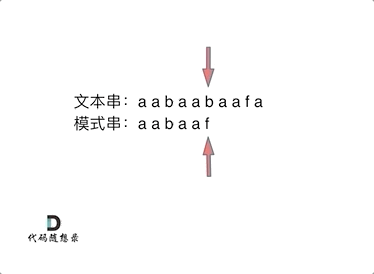

```text
动画里，我特意把 子串aa 标记上了，这是有原因的，大家先注意一下，后面还会说到。
```

可以看出，文本串中第六个字符b 和 模式串的第六个字符f，不匹配了。如果暴力匹配，发现不匹配，此时就要从头匹配了。

但如果使用前缀表，就不会从头匹配，而是从上次已经匹配的内容开始匹配，找到了模式串中第三个字符b继续开始匹配。

此时就要问了**前缀表是如何记录的呢？**

首先要知道前缀表的任务是当前位置匹配失败，找到之前已经匹配上的位置，再重新匹配，此也意味着在某个字符失配时，前缀表会告诉你下一步匹配中，模式串应该跳到哪个位置。

那么什么是前缀表：**记录下标i之前（包括i）的字符串中，有多大长度的相同前缀后缀。**

### 最长公共前后缀

文章中字符串的**前缀是指不包含最后一个字符的所有以第一个字符开头的连续子串**。

**后缀是指不包含第一个字符的所有以最后一个字符结尾的连续子串**。

**正确理解什么是前缀什么是后缀很重要**!

那么网上清一色都说 “kmp 最长公共前后缀” 又是什么回事呢？

我查了一遍 算法导论 和 算法4里KMP的章节，都没有提到 “最长公共前后缀”这个词，也不知道从哪里来了，我理解是用“最长相等前后缀” 更准确一些。

**因为前缀表要求的就是相同前后缀的长度。**

而最长公共前后缀里面的“公共”，更像是说前缀和后缀公共的长度。这其实并不是前缀表所需要的。

所以字符串a的最长相等前后缀为0。字符串aa的最长相等前后缀为1。字符串aaa的最长相等前后缀为2。等等.....。

### 为什么一定要用前缀表

这就是前缀表，那为啥就能告诉我们 上次匹配的位置，并跳过去呢？

回顾一下，刚刚匹配的过程在下标5的地方遇到不匹配，模式串是指向f，如图：

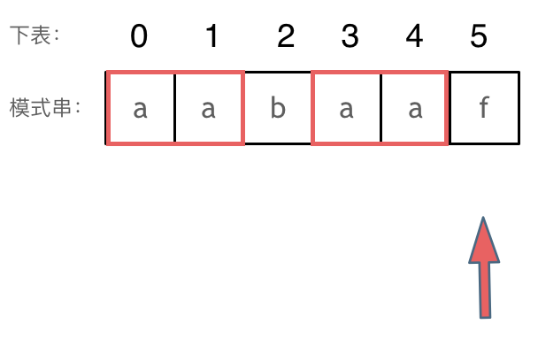

然后就找到了下标2，指向b，继续匹配：如图：

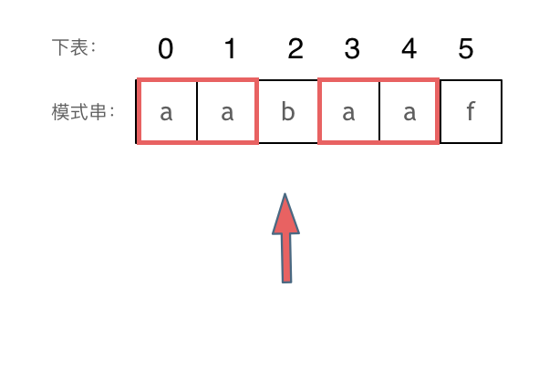

以下这句话，对于理解为什么使用前缀表可以告诉我们匹配失败之后跳到哪里重新匹配 非常重要！

**下标5之前这部分的字符串（也就是字符串aabaa）的最长相等的前缀 和 后缀字符串是 子字符串aa ，因为找到了** **最长相等的前缀和后缀，匹配失败的位置是后缀子串的后面，那么我们找到与其相同的前缀的后面重新匹配就可以** **了。**

所以前缀表具有告诉我们当前位置匹配失败，跳到之前已经匹配过的地方的能力。

**很多介绍KMP的文章或者视频并没有把为什么要用前缀表？这个问题说清楚，而是直接默认使用前缀表。**

### 如何计算前缀表

接下来就要说一说怎么计算前缀表。

如图：

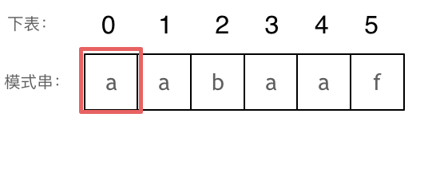

```text
长度为前1个字符的子串a ，最长相同前后缀的长度为0。（注意字符串的前缀是指不包含最后一个字符的所有以第
```

**一个字符开头的连续子串**；**后缀是指不包含第一个字符的所有以最后一个字符结尾的连续子串**。）

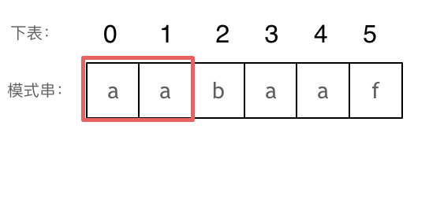

```text
长度为前2个字符的子串aa ，最长相同前后缀的长度为1。
```

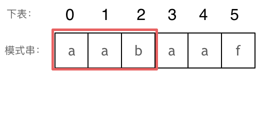

```text
长度为前3个字符的子串aab ，最长相同前后缀的长度为0。
```

以此类推：

```text
长度为前4个字符的子串aaba ，最长相同前后缀的长度为1。
长度为前5个字符的子串aabaa ，最长相同前后缀的长度为2。
长度为前6个字符的子串aabaaf ，最长相同前后缀的长度为0。
```

那么把求得的最长相同前后缀的长度就是对应前缀表的元素，如图：

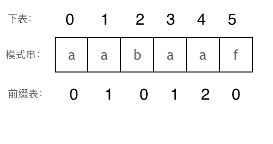

可以看出模式串与前缀表对应位置的数字表示的就是：**下标i之前（包括i）的字符串中，有多大长度的相同前缀后** **缀。**

再来看一下如何利用 前缀表找到 当字符不匹配的时候应该指针应该移动的位置。如动画所示：

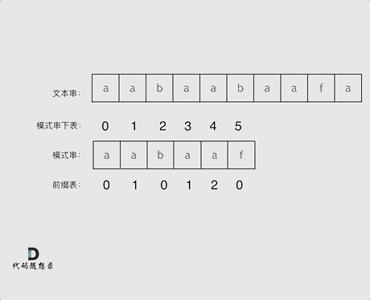

找到的不匹配的位置， 那么此时我们要看它的前一个字符的前缀表的数值是多少。

为什么要前一个字符的前缀表的数值呢，因为要找前面字符串的最长相同的前缀和后缀。

所以要看前一位的 前缀表的数值。

前一个字符的前缀表的数值是2， 所以把下标移动到下标2的位置继续比配。 可以再反复看一下上面的动画。

最后就在文本串中找到了和模式串匹配的子串了。

### 前缀表与next数组

很多KMP算法的时间都是使用next数组来做回退操作，那么next数组与前缀表有什么关系呢？

next数组就可以是前缀表，但是很多实现都是把前缀表统一减一（右移一位，初始位置为-1）之后作为next数组。

为什么这么做呢，其实也是很多文章视频没有解释清楚的地方。

其实**这并不涉及到KMP的原理，而是具体实现，next数组既可以就是前缀表，也可以是前缀表统一减一（右移一** **位，初始位置为-1）。**

后面我会提供两种不同的实现代码，大家就明白了。

### 使用next数组来匹配

**以下我们以前缀表统一减一之后的next数组来做演示**。

有了next数组，就可以根据next数组来 匹配文本串s，和模式串t了。

注意next数组是新前缀表（旧前缀表统一减一了）。

匹配过程动画如下：

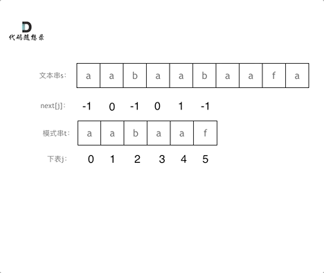

### 时间复杂度分析

其中n为文本串长度，m为模式串长度，因为在匹配的过程中，根据前缀表不断调整匹配的位置，可以看出匹配的过程是`O(n)`，之前还要单独生成next数组，时间复杂度是`O(m)`。所以整个KMP算法的时间复杂度是`O(n+m)`的。

暴力的解法显而易见是`O(n × m)`，所以**KMP在字符串匹配中极大地提高了搜索的效率。**

为了和力扣题目28.实现strStr保持一致，方便大家理解，以下文章统称haystack为文本串, needle为模式串。

都知道使用KMP算法，一定要构造next数组。

### 构造next数组

我们定义一个函数getNext来构建next数组，函数参数为指向next数组的指针，和一个字符串。 代码如下：

```cpp
void getNext(int* next, const string& s)
```

**构造next数组其实就是计算模式串s，前缀表的过程。** 主要有如下三步：

1. 初始化2. 处理前后缀不相同的情况3. 处理前后缀相同的情况

接下来我们详解一下。

1. 初始化：

定义两个指针i和j，j指向前缀末尾位置，i指向后缀末尾位置。

然后还要对next数组进行初始化赋值，如下：

```cpp
int j = -1;
next[0] = j;
```

j 为什么要初始化为 -1呢，因为之前说过 前缀表要统一减一的操作仅仅是其中的一种实现，我们这里选择j初始化为-1，下文我还会给出j不初始化为-1的实现代码。

`next[i]` 表示 i（包括i）之前最长相等的前后缀长度（其实就是j）

所以初始化`next[0] = j` 。

2. 处理前后缀不相同的情况

因为j初始化为-1，那么i就从1开始，进行`s[i]` 与 `s[j+1]`的比较。

所以遍历模式串s的循环下标i 要从 1开始，代码如下：

```cpp
for (int i = 1; i < s.size(); i++) {
```

如果 `s[i]` 与 `s[j+1]`不相同，也就是遇到 前后缀末尾不相同的情况，就要向前回退。

怎么回退呢？

`next[j]`就是记录着j（包括j）之前的子串的相同前后缀的长度。

那么 `s[i]` 与 `s[j+1]` 不相同，就要找 j+1前一个元素在next数组里的值（就是`next[j]`）。

所以，处理前后缀不相同的情况代码如下：

```cpp
while (j >= 0 && s[i] != s[j + 1]) { // 前后缀不相同了
    j = next[j]; // 向前回退
}
```

3. 处理前后缀相同的情况

如果 `s[i]` 与 `s[j + 1]` 相同，那么就同时向后移动i 和j 说明找到了相同的前后缀，同时还要将j（前缀的长度）赋给`next[i],` 因为`next[i]`要记录相同前后缀的长度。

代码如下：

```cpp
if (s[i] == s[j + 1]) { // 找到相同的前后缀
    j++;
}
next[i] = j;
```

最后整体构建next数组的函数代码如下：

```cpp
void getNext(int* next, const string& s){
    int j = -1;
    next[0] = j;
    for(int i = 1; i < s.size(); i++) { // 注意i从1开始
        while (j >= 0 && s[i] != s[j + 1]) { // 前后缀不相同了
            j = next[j]; // 向前回退
        }
        if (s[i] == s[j + 1]) { // 找到相同的前后缀
            j++;
        }
        next[i] = j; // 将j（前缀的长度）赋给next[i]
    }
}
```

代码构造next数组的逻辑流程动画如下：

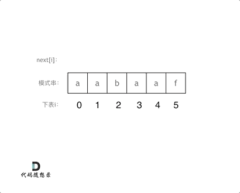

得到了next数组之后，就要用这个来做匹配了。

### 使用next数组来做匹配

在文本串s里 找是否出现过模式串t。

定义两个下标j 指向模式串起始位置，i指向文本串起始位置。

那么j初始值依然为-1，为什么呢？ **依然因为next数组里记录的起始位置为-1。**

i就从0开始，遍历文本串，代码如下：

```cpp
for (int i = 0; i < s.size(); i++)
```

接下来就是 `s[i]` 与 `t[j + 1]` （因为j从-1开始的） 进行比较。

如果 `s[i]` 与 `t[j + 1]` 不相同，j就要从next数组里寻找下一个匹配的位置。

代码如下：

```cpp
while(j >= 0 && s[i] != t[j + 1]) {
    j = next[j];
}
```

如果 `s[i]` 与 `t[j + 1]` 相同，那么i 和 j 同时向后移动， 代码如下：

```cpp
if (s[i] == t[j + 1]) {
    j++; // i的增加在for循环里
}
```

如何判断在文本串s里出现了模式串t呢，如果j指向了模式串t的末尾，那么就说明模式串t完全匹配文本串s里的某个子串了。

本题要在文本串字符串中找出模式串出现的第一个位置 `(`从0开始`)`，所以返回当前在文本串匹配模式串的位置i 减去 模式串的长度，就是文本串字符串中出现模式串的第一个位置。

代码如下：

```cpp
if (j == (t.size() - 1) ) {
    return (i - t.size() + 1);
}
```

那么使用next数组，用模式串匹配文本串的整体代码如下：

```cpp
int j = -1; // 因为next数组里记录的起始位置为-1
for (int i = 0; i < s.size(); i++) { // 注意i就从0开始
    while(j >= 0 && s[i] != t[j + 1]) { // 不匹配
        j = next[j]; // j 寻找之前匹配的位置
    }
    if (s[i] == t[j + 1]) { // 匹配，j和i同时向后移动
        j++; // i的增加在for循环里
    }
    if (j == (t.size() - 1) ) { // 文本串s里出现了模式串t
        return (i - t.size() + 1);
    }
}
```

此时所有逻辑的代码都已经写出来了，力扣 28.实现strStr 题目的整体代码如下：

### 前缀表统一减一 C++代码实现

```cpp
class Solution {
public:
    void getNext(int* next, const string& s) {
        int j = -1;
        next[0] = j;
        for(int i = 1; i < s.size(); i++) { // 注意i从1开始
            while (j >= 0 && s[i] != s[j + 1]) { // 前后缀不相同了
                j = next[j]; // 向前回退
            }
            if (s[i] == s[j + 1]) { // 找到相同的前后缀
                j++;
            }
            next[i] = j; // 将j（前缀的长度）赋给next[i]
        }
    }
    int strStr(string haystack, string needle) {
        if (needle.size() == 0) {
            return 0;
        }
        int next[needle.size()];
        getNext(next, needle);
        int j = -1; // // 因为next数组里记录的起始位置为-1
        for (int i = 0; i < haystack.size(); i++) { // 注意i就从0开始
            while(j >= 0 && haystack[i] != needle[j + 1]) { // 不匹配
                j = next[j]; // j 寻找之前匹配的位置
            }
            if (haystack[i] == needle[j + 1]) { // 匹配，j和i同时向后移动
                j++; // i的增加在for循环里
            }
            if (j == (needle.size() - 1) ) { // 文本串s里出现了模式串t
                return (i - needle.size() + 1);
            }
        }
        return -1;
    }
};
```

- 时间复杂度`: O(n + m)`
- 空间复杂度`: O(m),` 只需要保存字符串needle的前缀表  

### 前缀表（不减一）C++实现

那么前缀表就不减一了，也不右移的，到底行不行呢？

**行！**

我之前说过，这仅仅是KMP算法实现上的问题，如果就直接使用前缀表可以换一种回退方式，找`j=next[j-1]` 来进行回退。

主要就是`j=next[x]`这一步最为关键！

我给出的getNext的实现为：（前缀表统一减一）

```cpp
void getNext(int* next, const string& s) {
    int j = -1;
    next[0] = j;
    for(int i = 1; i < s.size(); i++) { // 注意i从1开始
        while (j >= 0 && s[i] != s[j + 1]) { // 前后缀不相同了
            j = next[j]; // 向前回退
        }
        if (s[i] == s[j + 1]) { // 找到相同的前后缀
            j++;
        }
        next[i] = j; // 将j（前缀的长度）赋给next[i]
    }
}
```

此时如果输入的模式串为aabaaf，对应的next为-1 0 -1 0 1 -1。

这里j和`next[0]`初始化为-1，整个next数组是以 前缀表减一之后的效果来构建的。

那么前缀表不减一来构建next数组，代码如下：

```cpp
    void getNext(int* next, const string& s) {
        int j = 0;
        next[0] = 0;
        for(int i = 1; i < s.size(); i++) {
            while (j > 0 && s[i] != s[j]) { // j要保证大于0，因为下面有取j-1作为数组下标的操作
                j = next[j - 1]; // 注意这里，是要找前一位的对应的回退位置了
            }
            if (s[i] == s[j]) {
                j++;
            }
            next[i] = j;
        }
    }
```

此时如果输入的模式串为aabaaf，对应的next为 0 1 0 1 2 0，（其实这就是前缀表的数值了）。

那么用这样的next数组也可以用来做匹配，代码要有所改动。

实现代码如下：

```cpp
class Solution {
public:
    void getNext(int* next, const string& s) {
        int j = 0;
        next[0] = 0;
        for(int i = 1; i < s.size(); i++) {
            while (j > 0 && s[i] != s[j]) {
                j = next[j - 1];
            }
            if (s[i] == s[j]) {
                j++;
            }
            next[i] = j;
        }
    }
    int strStr(string haystack, string needle) {
        if (needle.size() == 0) {
            return 0;
        }
        int next[needle.size()];
        getNext(next, needle);
        int j = 0;
        for (int i = 0; i < haystack.size(); i++) {
            while(j > 0 && haystack[i] != needle[j]) {
                j = next[j - 1];
            }
            if (haystack[i] == needle[j]) {
                j++;
            }
            if (j == needle.size() ) {
                return (i - needle.size() + 1);
            }
        }
        return -1;
    }
};
```

- 时间复杂度`: O(n + m)`
- 空间复杂度`: O(m)`

## 总结

我们介绍了什么是KMP，KMP可以解决什么问题，然后分析KMP算法里的next数组，知道了next数组就是前缀表，再分析为什么要是前缀表而不是什么其他表。

接着从给出的模式串中，我们一步一步的推导出了前缀表，得出前缀表无论是统一减一还是不减一得到的next数组仅仅是kmp的实现方式的不同。

其中还分析了KMP算法的时间复杂度，并且和暴力方法做了对比。

然后先用前缀表统一减一得到的next数组，求得文本串s里是否出现过模式串t，并给出了具体分析代码。

又给出了直接用前缀表作为next数组，来做匹配的实现代码。

可以说把KMP的每一个细微的细节都扣了出来，毫无遮掩的展示给大家了！

KMP算法还能干这个

# 7.重复的子字符串

[力扣题目链接](https://leetcode.cn/problems/repeated-substring-pattern/)

给定一个非空的字符串，判断它是否可以由它的一个子串重复多次构成。给定的字符串只含有小写英文字母，并且长度不超过10000。

示例 1: 

- 输入: "abab" 
- 输出: True 
- 解释: 可由子字符串 "ab" 重复两次构成。 

示例 2: 

- 输入: "aba"  
- 输出: False 

示例 3: 

- 输入: "abcabcabcabc" 
- 输出: True 
- 解释: 可由子字符串 "abc" 重复四次构成。 `(`或者子字符串 "abcabc" 重复两次构成。`)`

## 算法公开课

[**《代码随想录》算法视频公开课**](https://programmercarl.com/other/gongkaike.html)**：**[**字符串这么玩，可有点难度！ | LeetCode：459.重复的子字符串**](https://www.bilibili.com/video/BV1cg41127fw)**，相信结合视** **频再看本篇题解，更有助于大家对本题的理解**。

## 思路

暴力的解法， 就是一个for循环获取 子串的终止位置， 然后判断子串是否能重复构成字符串，又嵌套一个for循环，所以是`O(n^2)`的时间复杂度。

有的同学可以想，怎么一个for循环就可以获取子串吗？ 至少得一个for获取子串起始位置，一个for获取子串结束位置吧。 

其实我们只需要判断，以第一个字母为开始的子串就可以，所以一个for循环获取子串的终止位置就行了。 而且遍历的时候 都不用遍历结束，只需要遍历到中间位置，因为子串结束位置大于中间位置的话，一定不能重复组成字符串。 

暴力的解法，这里就不详细讲解了。

主要讲一讲移动匹配 和 KMP两种方法。 

### 移动匹配

当一个字符串s：abcabc，内部由重复的子串组成，那么这个字符串的结构一定是这样的： 

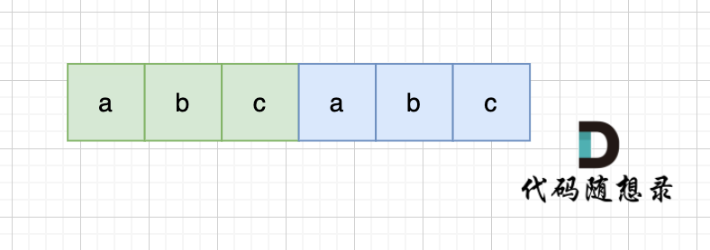

也就是由前后相同的子串组成。 

那么既然前面有相同的子串，后面有相同的子串，用 s + s，这样组成的字符串中，后面的子串做前串，前后的子串做后串，就一定还能组成一个s，如图： 

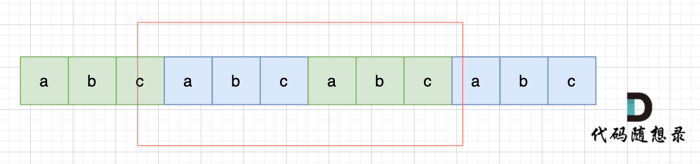

所以判断字符串s是否由重复子串组成，只要两个s拼接在一起，里面还出现一个s的话，就说明是由重复子串组成。

当然，我们在判断 s + s 拼接的字符串里是否出现一个s的的时候，**要刨除 s + s 的首字符和尾字符**，这样避免在s+s中搜索出原来的s，我们要搜索的是中间拼接出来的s。 

代码如下：

```cpp
class Solution {
public:
    bool repeatedSubstringPattern(string s) {
        string t = s + s;
        t.erase(t.begin()); t.erase(t.end() - 1); // 掐头去尾
        if (t.find(s) != std::string::npos) return true; // r
        return false;
    }
};
```

- 时间复杂度`: O(n)`
- 空间复杂度`: O(1)`

不过这种解法还有一个问题，就是 我们最终还是要判断 一个字符串（s + s）是否出现过 s 的过程，大家可能直接用contains，find 之类的库函数。 却忽略了实现这些函数的时间复杂度（暴力解法是m * n，一般库函数实现为 `O(m + n)`）。

如果我们做过 [28.实现strStr](https://programmercarl.com/0028.%E5%AE%9E%E7%8E%B0strStr.html) 题目的话，其实就知道，**实现一个 高效的算法来判断 一个字符串中是否出现另一个字** **符串是很复杂的**，这里就涉及到了KMP算法。 

### KMP

#### 为什么会使用KMP

以下使用KMP方式讲解，强烈建议大家先把以下两个视频看了，理解KMP算法，再来看下面讲解，否则会很懵。 

- [视频讲解版：帮你把KMP算法学个通透！（理论篇）](https://www.bilibili.com/video/BV1PD4y1o7nd/)
- [视频讲解版：帮你把KMP算法学个通透！（求next数组代码篇）](https://www.bilibili.com/video/BV1M5411j7Xx)
- [文字讲解版：KMP算法](https://programmercarl.com/0028.%E5%AE%9E%E7%8E%B0strStr.html)

在一个串中查找是否出现过另一个串，这是KMP的看家本领。那么寻找重复子串怎么也涉及到KMP算法了呢？

KMP算法中next数组为什么遇到字符不匹配的时候可以找到上一个匹配过的位置继续匹配，靠的是有计算好的前缀表。 前缀表里，统计了各个位置为终点字符串的最长相同前后缀的长度。

那么 最长相同前后缀和重复子串的关系又有什么关系呢。 

可能很多录友又忘了 前缀和后缀的定义，再回顾一下： 

- 前缀是指不包含最后一个字符的所有以第一个字符开头的连续子串；
- 后缀是指不包含第一个字符的所有以最后一个字符结尾的连续子串

在由重复子串组成的字符串中，最长相等前后缀不包含的子串就是最小重复子串，这里拿字符串s：abababab 来举例，ab就是最小重复单位，如图所示： 

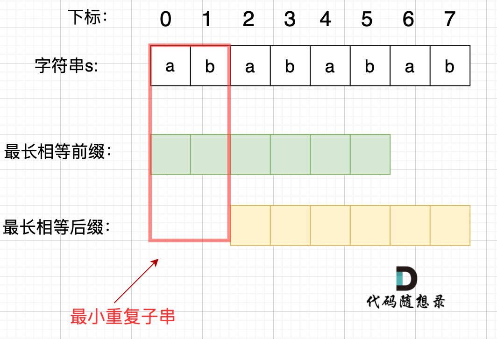

#### 如何找到最小重复子串

这里有同学就问了，为啥一定是开头的ab呢。 其实最关键还是要理解 最长相等前后缀，如图： 

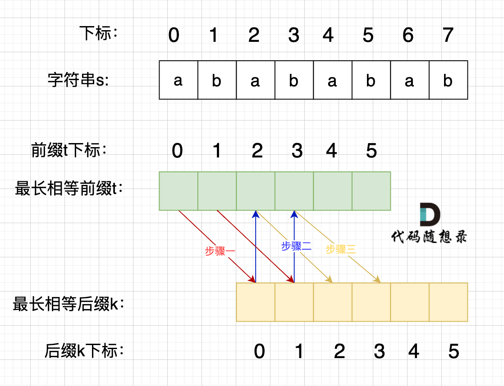

步骤一：因为 这是相等的前缀和后缀，`t[0]` 与 `k[0]`相同， `t[1]` 与 `k[1]`相同，所以 `s[0]` 一定和 `s[2]`相同，`s[1]` 一定和 `s[3]`相同，即：，`s[0]s[1]`与`s[2]s[3]`相同 。 

步骤二： 因为在同一个字符串位置，所以 `t[2]` 与 `k[0]`相同，`t[3]` 与 `k[1]`相同。 

步骤三： 因为 这是相等的前缀和后缀，`t[2]` 与 `k[2]`相同 ，`t[3]`与`k[3]` 相同，所以，`s[2]`一定和`s[4]`相同，`s[3]`一定和`s[5]`相同，即：`s[2]s[3]` 与 `s[4]s[5]`相同。

步骤四：循环往复。 

所以字符串s，`s[0]s[1]`与`s[2]s[3]`相同， `s[2]s[3]` 与 `s[4]s[5]`相同，`s[4]s[5]` 与 `s[6]s[7]` 相同。 

正是因为 最长相等前后缀的规则，当一个字符串由重复子串组成的，最长相等前后缀不包含的子串就是最小重复子串。  

#### 简单推理

这里再给出一个数学推导，就容易理解很多。  

假设字符串s使用多个重复子串构成（这个子串是最小重复单位），重复出现的子字符串长度是x，所以s是由n * x组成。  

因为字符串s的最长相同前后缀的长度一定是不包含s本身，所以 最长相同前后缀长度必然是m * x，而且 `n - m =` 1，（这里如果不懂，看上面的推理）

所以如果 `nx % (n - m)x = 0`，就可以判定有重复出现的子字符串。 

next 数组记录的就是最长相同前后缀 [字符串：KMP算法精讲](https://programmercarl.com/0028.%E5%AE%9E%E7%8E%B0strStr.html) 这里介绍了什么是前缀，什么是后缀，什么又是最长相同前后缀`)`， 如果 `next[len - 1] != -1`，则说明字符串有最长相同的前后缀（就是字符串里的前缀子串和后缀子串相同的最长长度）。

最长相等前后缀的长度为：`next[len - 1] + 1`。`(`这里的next数组是以统一减一的方式计算的，因此需要+1，两种计算next数组的具体区别看这里：[字符串：KMP算法精讲](https://programmercarl.com/0028.%E5%AE%9E%E7%8E%B0strStr.html)`)`

数组长度为：len。

如果`len % (len - (next[len - 1] + 1)) == 0` ，则说明数组的长度正好可以被 `(`数组长度-最长相等前后缀的长度`)` 整除 ，说明该字符串有重复的子字符串。

**数组长度减去最长相同前后缀的长度相当于是第一个周期的长度，也就是一个周期的长度，如果这个周期可以被整** **除，就说明整个数组就是这个周期的循环。**

**强烈建议大家把next数组打印出来，看看next数组里的规律，有助于理解KMP算法**

如图：

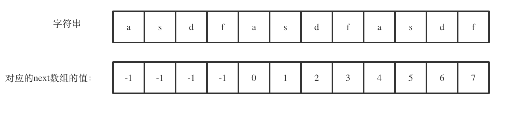

`next[len - 1] = 7`，`next[len - 1] + 1 = 8`，8就是此时字符串asdfasdfasdf的最长相同前后缀的长度。

`(len - (next[len - 1] + 1))` 也就是： `12(`字符串的长度`) - 8(`最长公共前后缀的长度`) = 4`， 4正好可以被 `12(`字符串的长度`)` 整除，所以说明有重复的子字符串（asdf）。

`C++`代码如下：（这里使用了前缀表统一减一的实现方式）

```cpp
class Solution {
public:
    void getNext (int* next, const string& s){
        next[0] = -1;
        int j = -1;
        for(int i = 1;i < s.size(); i++){
            while(j >= 0 && s[i] != s[j + 1]) {
                j = next[j];
            }
            if(s[i] == s[j + 1]) {
                j++;
            }
            next[i] = j;
        }
    }
    bool repeatedSubstringPattern (string s) {
        if (s.size() == 0) {
            return false;
        }
        int next[s.size()];
        getNext(next, s);
        int len = s.size();
        if (next[len - 1] != -1 && len % (len - (next[len - 1] + 1)) == 0) {
            return true;
        }
        return false;
    }
};
```

- 时间复杂度`: O(n)`
- 空间复杂度`: O(n)`

前缀表（不减一）的`C++`代码实现：

```cpp
class Solution {
public:
    void getNext (int* next, const string& s){
        next[0] = 0;
        int j = 0;
        for(int i = 1;i < s.size(); i++){
            while(j > 0 && s[i] != s[j]) {
                j = next[j - 1];
            }
            if(s[i] == s[j]) {
                j++;
            }
            next[i] = j;
        }
    }
    bool repeatedSubstringPattern (string s) {
        if (s.size() == 0) {
            return false;
        }
        int next[s.size()];
        getNext(next, s);
        int len = s.size();
        if (next[len - 1] != 0 && len % (len - (next[len - 1] )) == 0) {
            return true;
        }
        return false;
    }
};
```

- 时间复杂度`: O(n)`
- 空间复杂度`: O(n)`

# 8. 字符串总结篇

其实我们已经学习了十天的字符串了，从字符串的定义到库函数的使用原则，从各种反转到KMP算法，相信大家应该对字符串有比较深刻的认识了。 

那么这次我们来做一个总结。

## 什么是字符串

字符串是若干字符组成的有限序列，也可以理解为是一个字符数组，但是很多语言对字符串做了特殊的规定，接下来我来说一说`C/C++`中的字符串。

在C语言中，把一个字符串存入一个数组时，也把结束符 '\0'存入数组，并以此作为该字符串是否结束的标志。

例如这段代码：

```cpp
char a[5] = "asd";
for (int i = 0; a[i] != '\0'; i++) {
}
```

在`C++`中，提供一个string类，string类会提供 size接口，可以用来判断string类字符串是否结束，就不用'\0'来判断是否结束。

例如这段代码:

```cpp
string a = "asd";
for (int i = 0; i < a.size(); i++) {
}
```

那么`vector< char >` 和 string 又有什么区别呢？ 

其实在基本操作上没有区别，但是 string提供更多的字符串处理的相关接口，例如string 重载了+，而vector却没有。

所以想处理字符串，我们还是会定义一个string类型。

## 要不要使用库函数

在文章[344.反转字符串](https://programmercarl.com/0344.%E5%8F%8D%E8%BD%AC%E5%AD%97%E7%AC%A6%E4%B8%B2.html)中强调了**打基础的时候，不要太迷恋于库函数。**

甚至一些同学习惯于调用substr，split，reverse之类的库函数，却不知道其实现原理，也不知道其时间复杂度，这样实现出来的代码，如果在面试现场，面试官问：“分析其时间复杂度”的话，一定会一脸懵逼！

所以建议**如果题目关键的部分直接用库函数就可以解决，建议不要使用库函数。**

**如果库函数仅仅是 解题过程中的一小部分，并且你已经很清楚这个库函数的内部实现原理的话，可以考虑使用库函** **数。**

## 双指针法

在[344.反转字符串](https://programmercarl.com/0344.%E5%8F%8D%E8%BD%AC%E5%AD%97%E7%AC%A6%E4%B8%B2.html) ，我们使用双指针法实现了反转字符串的操作，**双指针法在数组，链表和字符串中很常用。**

接着在[字符串：替换空格](https://programmercarl.com/%E5%89%91%E6%8C%87Offer05.%E6%9B%BF%E6%8D%A2%E7%A9%BA%E6%A0%BC.html)，同样还是使用双指针法在时间复杂度`O(n)`的情况下完成替换空格。

**其实很多数组填充类的问题，都可以先预先给数组扩容带填充后的大小，然后在从后向前进行操作。**

那么针对数组删除操作的问题，其实在[27. 移除元素](https://programmercarl.com/0027.%E7%A7%BB%E9%99%A4%E5%85%83%E7%B4%A0.html)中就已经提到了使用双指针法进行移除操作。

同样的道理在[151.翻转字符串里的单词](https://programmercarl.com/0151.%E7%BF%BB%E8%BD%AC%E5%AD%97%E7%AC%A6%E4%B8%B2%E9%87%8C%E7%9A%84%E5%8D%95%E8%AF%8D.html)中我们使用`O(n)`的时间复杂度，完成了删除冗余空格。

一些同学会使用for循环里调用库函数erase来移除元素，这其实是`O(n^2)`的操作，因为erase就是`O(n)`的操作，所以这也是典型的不知道库函数的时间复杂度，上来就用的案例了。

## 反转系列

在反转上还可以在加一些玩法，其实考察的是对代码的掌控能力。

[541. 反转字符串II](https://programmercarl.com/0541.%E5%8F%8D%E8%BD%AC%E5%AD%97%E7%AC%A6%E4%B8%B2II.html)中，一些同学可能为了处理逻辑：每隔2k个字符的前k的字符，写了一堆逻辑代码或者再搞一个计数器，来统计2k，再统计前k个字符。 

其实**当需要固定规律一段一段去处理字符串的时候，要想想在在for循环的表达式上做做文章**。

只要让 `i += (2 * k)`，i 每次移动 2 * k 就可以了，然后判断是否需要有反转的区间。

因为要找的也就是每2 * k 区间的起点，这样写程序会高效很多。

在[151.翻转字符串里的单词](https://programmercarl.com/0151.%E7%BF%BB%E8%BD%AC%E5%AD%97%E7%AC%A6%E4%B8%B2%E9%87%8C%E7%9A%84%E5%8D%95%E8%AF%8D.html)中要求翻转字符串里的单词，这道题目可以说是综合考察了字符串的多种操作。是考察字符串的好题。

这道题目通过 **先整体反转再局部反转**，实现了反转字符串里的单词。

后来发现反转字符串还有一个牛逼的用处，就是达到左旋的效果。

在[字符串：反转个字符串还有这个用处？](https://programmercarl.com/%E5%89%91%E6%8C%87Offer58-II.%E5%B7%A6%E6%97%8B%E8%BD%AC%E5%AD%97%E7%AC%A6%E4%B8%B2.html)中，我们通过**先局部反转再整体反转**达到了左旋的效果。

## KMP

KMP的主要思想是**当出现字符串不匹配时，可以知道一部分之前已经匹配的文本内容，可以利用这些信息避免从头** **再去做匹配了。**

KMP的精髓所在就是前缀表，在[KMP精讲](https://programmercarl.com/0028.%E5%AE%9E%E7%8E%B0strStr.html)中提到了，什么是KMP，什么是前缀表，以及为什么要用前缀表。

前缀表：起始位置到下标i之前（包括i）的子串中，有多大长度的相同前缀后缀。

那么使用KMP可以解决两类经典问题：

1. 匹配问题：[28. 实现 strStr()](https://programmercarl.com/0028.%E5%AE%9E%E7%8E%B0strStr.html) 2. 重复子串问题：[459.重复的子字符串](https://programmercarl.com/0459.%E9%87%8D%E5%A4%8D%E7%9A%84%E5%AD%90%E5%AD%97%E7%AC%A6%E4%B8%B2.html)

再一次强调了什么是前缀，什么是后缀，什么又是最长相等前后缀。

前缀：指不包含最后一个字符的所有以第一个字符开头的连续子串。

后缀：指不包含第一个字符的所有以最后一个字符结尾的连续子串。

然后**针对前缀表到底要不要减一，这其实是不同KMP实现的方式**，我们在[KMP精讲](https://programmercarl.com/0028.%E5%AE%9E%E7%8E%B0strStr.html)中针对之前两个问题，分别给出了两个不同版本的的KMP实现。

其中主要**理解j=next[x]这一步最为关键！**

## 总结

字符串类类型的题目，往往想法比较简单，但是实现起来并不容易，复杂的字符串题目非常考验对代码的掌控能力。

双指针法是字符串处理的常客。

KMP算法是字符串查找最重要的算法，但彻底理解KMP并不容易，我们已经写了五篇KMP的文章，不断总结和完善，最终才把KMP讲清楚。

好了字符串相关的算法知识就介绍到了这里了，明天开始新的征程，大家加油！
