[](https://programmercarl.com/other/xunlianying.html)

**《代码随想录》作者：**[**程序员Carl**](https://github.com/youngyangyang04)

- 代码随想录官网[（网站持续更新优化内容，建议直接看网站）](https://www.programmercarl.com/)：www.programmercarl.com
- 代码随想录[Github开源地址](https://github.com/youngyangyang04/leetcode-master)
- [代码随想录算法公开课](https://programmercarl.com/other/gongkaike.html)，代码随想录的全部内容将由我（[程序员Carl](https://github.com/youngyangyang04)）视频讲解并开免费开放给大家。
- [《代码随想录》](https://programmercarl.com/other/publish.html) 已经出版。
- [代码随想录知识星球](https://programmercarl.com/other/kstar.html) 上万录友在这里学习
- [代码随想录算法训练营](https://programmercarl.com/other/xunlianying.html) 帮助录友高效刷完代码随想录。
- 微信公众号：[代码随想录](https://img-blog.csdnimg.cn/74f47bc466234462bd2acc3ba6cd1b70.png)
- 组队刷题，可以添加[代码随想录官方微信](https://www.programmercarl.com/other/wechat.html)
- ACM模式练习，推荐：[卡码网](https://kamacoder.com/)

**特别提示**：PDF仅提供`C++`语言版本同时PDF中很多动图无法加载，其他编程语言版本和查看动图可以移步至代码随想录官方网站查看。

# 1. 移除元素

[力扣题目链接](https://leetcode.cn/problems/remove-element/)

给你一个数组 nums 和一个值 val，你需要 原地 移除所有数值等于 val 的元素，并返回移除后数组的新长度。

不要使用额外的数组空间，你必须仅使用 `O(1)` 额外空间并**原地**修改输入数组。

元素的顺序可以改变。你不需要考虑数组中超出新长度后面的元素。

示例 1:给定 `nums = [3,2,2,3], val = 3,`函数应该返回新的长度 2, 并且 nums 中的前两个元素均为 2。你不需要考虑数组中超出新长度后面的元素。

示例 2:给定 `nums = [0,1,2,2,3,0,4,2], val = 2,`函数应该返回新的长度 5, 并且 nums 中的前五个元素为 0, 1, 3, 0, 4。

**你不需要考虑数组中超出新长度后面的元素。**

## 算法公开课

[**《代码随想录》算法视频公开课**](https://programmercarl.com/other/gongkaike.html)**：**[**数组中移除元素并不容易！LeetCode：27. 移除元素**](https://www.bilibili.com/video/BV12A4y1Z7LP)**，相信结合视频再看本篇** **题解，更有助于大家对本题的理解**。

## 思路

有的同学可能说了，多余的元素，删掉不就得了。

**要知道数组的元素在内存地址中是连续的，不能单独删除数组中的某个元素，只能覆盖。**

数组的基础知识可以看这里[程序员算法面试中，必须掌握的数组理论知识](https://programmercarl.com/%E6%95%B0%E7%BB%84%E7%90%86%E8%AE%BA%E5%9F%BA%E7%A1%80.html)。

### 暴力解法

这个题目暴力的解法就是两层for循环，一个for循环遍历数组元素 ，第二个for循环更新数组。

删除过程如下：

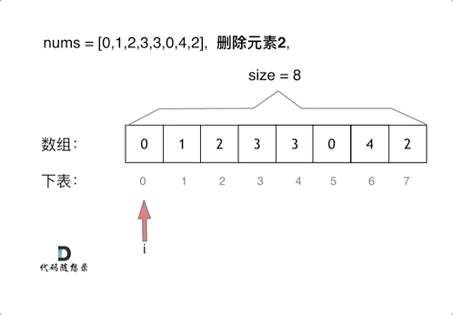

很明显暴力解法的时间复杂度是`O(n^2)`，这道题目暴力解法在leetcode上是可以过的。

代码如下：

```cpp
// 时间复杂度：O(n^2)
// 空间复杂度：O(1)
class Solution {
public:
    int removeElement(vector<int>& nums, int val) {
        int size = nums.size();
        for (int i = 0; i < size; i++) {
            if (nums[i] == val) { // 发现需要移除的元素，就将数组集体向前移动一位
                for (int j = i + 1; j < size; j++) {
                    nums[j - 1] = nums[j];
                }
                i--; // 因为下标i以后的数值都向前移动了一位，所以i也向前移动一位
                size--; // 此时数组的大小-1
            }
        }
        return size;
    }
};
```

- 时间复杂度：`O(n^2)`
- 空间复杂度：`O(1)`

### 双指针法

双指针法（快慢指针法）： **通过一个快指针和慢指针在一个for循环下完成两个for循环的工作。**

定义快慢指针

- 快指针：寻找新数组的元素 ，新数组就是不含有目标元素的数组
- 慢指针：指向更新 新数组下标的位置

很多同学这道题目做的很懵，就是不理解 快慢指针究竟都是什么含义，所以一定要明确含义，后面的思路就更容易理解了。

删除过程如下：

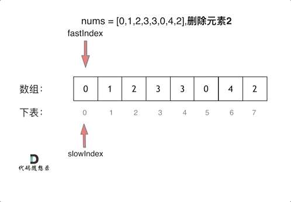

很多同学不了解**双指针法（快慢指针法）在数组和链表的操作中是非常常见的，很多考察数组、链表、字符串等操作的面试题，都** **使用双指针法。**后续都会一一介绍到，本题代码如下：

```cpp
// 时间复杂度：O(n)
// 空间复杂度：O(1)
class Solution {
public:
    int removeElement(vector<int>& nums, int val) {
        int slowIndex = 0;
        for (int fastIndex = 0; fastIndex < nums.size(); fastIndex++) {
            if (val != nums[fastIndex]) {
                nums[slowIndex++] = nums[fastIndex];
            }
        }
        return slowIndex;
    }
};
```

注意这些实现方法并没有改变元素的相对位置！

- 时间复杂度：`O(n)`
- 空间复杂度：`O(1)`

```cpp
/**
* 相向双指针方法，基于元素顺序可以改变的题目描述改变了元素相对位置，确保了移动最少元素
* 时间复杂度：O(n)
* 空间复杂度：O(1)
*/
class Solution {
public:
    int removeElement(vector<int>& nums, int val) {
        int leftIndex = 0;
        int rightIndex = nums.size() - 1;
        while (leftIndex <= rightIndex) {
            // 找左边等于val的元素
            while (leftIndex <= rightIndex && nums[leftIndex] != val){
                ++leftIndex;
            }
            // 找右边不等于val的元素
            while (leftIndex <= rightIndex && nums[rightIndex] == val) {
                -- rightIndex;
            }
            // 将右边不等于val的元素覆盖左边等于val的元素
            if (leftIndex < rightIndex) {
                nums[leftIndex++] = nums[rightIndex--];
            }
        }
        return leftIndex;   // leftIndex一定指向了最终数组末尾的下一个元素
    }
};
```

## 相关题目推荐

- [26.删除排序数组中的重复项](https://leetcode.cn/problems/remove-duplicates-from-sorted-array/)
- [283.移动零](https://leetcode.cn/problems/move-zeroes/)
- [844.比较含退格的字符串](https://leetcode.cn/problems/backspace-string-compare/)
- [977.有序数组的平方](https://leetcode.cn/problems/squares-of-a-sorted-array/)

打基础的时候，不要太迷恋于库函数。

# 2.反转字符串

[力扣题目链接](https://leetcode.cn/problems/reverse-string/)

编写一个函数，其作用是将输入的字符串反转过来。输入字符串以字符数组 `char[]` 的形式给出。

不要给另外的数组分配额外的空间，你必须原地修改输入数组、使用 `O(1)`  的额外空间解决这一问题。

你可以假设数组中的所有字符都是 ASCII 码表中的可打印字符。

示例 1：  
输入：`["h","e","l","l","o"]`  
输出：`["o","l","l","e","h"]` 

示例 2：  
输入：`["H","a","n","n","a","h"]`  
输出：`["h","a","n","n","a","H"]` 

## 算法公开课

[**《代码随想录》算法视频公开课**](https://programmercarl.com/other/gongkaike.html)**：**[**字符串基础操作！ | LeetCode：344.反转字符串**](https://www.bilibili.com/video/BV1fV4y17748)**，相信结合视频再看本篇题** **解，更有助于大家对本题的理解**。

## 思路

先说一说题外话：

对于这道题目一些同学直接用`C++`里的一个库函数 reverse，调一下直接完事了， 相信每一门编程语言都有这样的库函数。

如果这么做题的话，这样大家不会清楚反转字符串的实现原理了。

但是也不是说库函数就不能用，是要分场景的。

如果在现场面试中，我们什么时候使用库函数，什么时候不要用库函数呢？

**如果题目关键的部分直接用库函数就可以解决，建议不要使用库函数。**

毕竟面试官一定不是考察你对库函数的熟悉程度， 如果使用python和java 的同学更需要注意这一点，因为python、java提供的库函数十分丰富。

**如果库函数仅仅是 解题过程中的一小部分，并且你已经很清楚这个库函数的内部实现原理的话，可以考虑使用库函** **数。**

建议大家平时在leetcode上练习算法的时候本着这样的原则去练习，这样才有助于我们对算法的理解。

不要沉迷于使用库函数一行代码解决题目之类的技巧，不是说这些技巧不好，而是说这些技巧可以用来娱乐一下。

真正自己写的时候，要保证理解可以实现是相应的功能。

接下来再来讲一下如何解决反转字符串的问题。

大家应该还记得，我们已经讲过了[206.反转链表](https://programmercarl.com/0206.%E7%BF%BB%E8%BD%AC%E9%93%BE%E8%A1%A8.html)。

在反转链表中，使用了双指针的方法。

那么反转字符串依然是使用双指针的方法，只不过对于字符串的反转，其实要比链表简单一些。

因为字符串也是一种数组，所以元素在内存中是连续分布，这就决定了反转链表和反转字符串方式上还是有所差异的。

如果对数组和链表原理不清楚的同学，可以看这两篇，[关于链表，你该了解这些！](https://programmercarl.com/%E9%93%BE%E8%A1%A8%E7%90%86%E8%AE%BA%E5%9F%BA%E7%A1%80.html)，[必须掌握的数组理论知识](https://programmercarl.com/%E6%95%B0%E7%BB%84%E7%90%86%E8%AE%BA%E5%9F%BA%E7%A1%80.html)。

对于字符串，我们定义两个指针（也可以说是索引下标），一个从字符串前面，一个从字符串后面，两个指针同时向中间移动，并交换元素。

```text
以字符串hello 为例，过程如下：
```

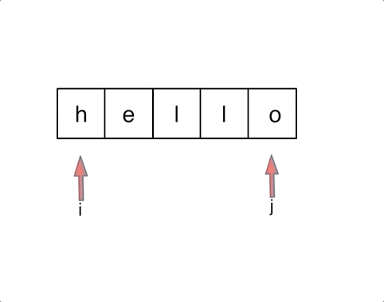

不难写出如下`C++`代码:

```cpp
void reverseString(vector<char>& s) {
    for (int i = 0, j = s.size() - 1; i < s.size()/2; i++, j--) {
        swap(s[i],s[j]);
    }
}
```

循环里只要做交换`s[i]` 和`s[j]`操作就可以了，那么我这里使用了swap 这个库函数。大家可以使用。

因为相信大家都知道交换函数如何实现，而且这个库函数仅仅是解题中的一部分， 所以这里使用库函数也是可以的。

swap可以有两种实现。

一种就是常见的交换数值：

```cpp
int tmp = s[i];
s[i] = s[j];
s[j] = tmp;
```

一种就是通过位运算：

```cpp
s[i] ^= s[j];
s[j] ^= s[i];
s[i] ^= s[j];
```

这道题目还是比较简单的，但是我正好可以通过这道题目说一说在刷题的时候，使用库函数的原则。

如果题目关键的部分直接用库函数就可以解决，建议不要使用库函数。

如果库函数仅仅是 解题过程中的一小部分，并且你已经很清楚这个库函数的内部实现原理的话，可以考虑使用库函数。

本着这样的原则，我没有使用reverse库函数，而使用swap库函数。

**在字符串相关的题目中，库函数对大家的诱惑力是非常大的，因为会有各种反转，切割取词之类的操作**，这也是为什么字符串的库函数这么丰富的原因。

相信大家本着我所讲述的原则来做字符串相关的题目，在选择库函数的角度上会有所原则，也会有所收获。

`C++`代码如下：

```cpp
class Solution {
public:
    void reverseString(vector<char>& s) {
        for (int i = 0, j = s.size() - 1; i < s.size()/2; i++, j--) {
            swap(s[i],s[j]);
        }
    }
};
```

- 时间复杂度`: O(n)`
- 空间复杂度`: O(1)`

# 3. 剑指Offer 05.替换空格

[力扣题目链接](https://leetcode.cn/problems/ti-huan-kong-ge-lcof/)

请实现一个函数，把字符串 s 中的每个空格替换成"%20"。

示例 1：  
输入：`s = "We are happy."`  
输出："We%20are%20happy." 

## 思路

如果想把这道题目做到极致，就不要只用额外的辅助空间了！

首先扩充数组到每个空格替换成"%20"之后的大小。

然后从后向前替换空格，也就是双指针法，过程如下：

i指向新长度的末尾，j指向旧长度的末尾。

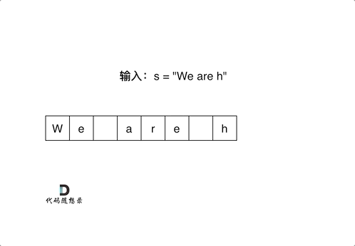

有同学问了，为什么要从后向前填充，从前向后填充不行么？

从前向后填充就是`O(n^2)`的算法了，因为每次添加元素都要将添加元素之后的所有元素向后移动。

**其实很多数组填充类的问题，都可以先预先给数组扩容带填充后的大小，然后在从后向前进行操作。**

这么做有两个好处：

1. 不用申请新数组。2. 从后向前填充元素，避免了从前向后填充元素时，每次添加元素都要将添加元素之后的所有元素向后移动的问题。

时间复杂度，空间复杂度均超过100%的用户。


`C++`代码如下：

```cpp
class Solution {
public:
    string replaceSpace(string s) {
        int count = 0; // 统计空格的个数
        int sOldSize = s.size();
        for (int i = 0; i < s.size(); i++) {
            if (s[i] == ' ') {
                count++;
            }
        }
        // 扩充字符串s的大小，也就是每个空格替换成"%20"之后的大小
        s.resize(s.size() + count * 2);
        int sNewSize = s.size();
        // 从后先前将空格替换为"%20"
        for (int i = sNewSize - 1, j = sOldSize - 1; j < i; i--, j--) {
            if (s[j] != ' ') {
                s[i] = s[j];
            } else {
                s[i] = '0';
                s[i - 1] = '2';
                s[i - 2] = '%';
                i -= 2;
            }
        }
        return s;
    }
};
```

- 时间复杂度：`O(n)`
- 空间复杂度：`O(1)`

此时算上本题，我们已经做了七道双指针相关的题目了分别是：

- [27.移除元素](https://programmercarl.com/0027.%E7%A7%BB%E9%99%A4%E5%85%83%E7%B4%A0.html)
- [15.三数之和](https://programmercarl.com/0015.%E4%B8%89%E6%95%B0%E4%B9%8B%E5%92%8C.html)
- [18.四数之和](https://programmercarl.com/0018.%E5%9B%9B%E6%95%B0%E4%B9%8B%E5%92%8C.html)
- [206.翻转链表](https://programmercarl.com/0206.%E7%BF%BB%E8%BD%AC%E9%93%BE%E8%A1%A8.html)
- [142.环形链表II](https://programmercarl.com/0142.%E7%8E%AF%E5%BD%A2%E9%93%BE%E8%A1%A8II.html)
- [344.反转字符串](https://programmercarl.com/0344.%E5%8F%8D%E8%BD%AC%E5%AD%97%E7%AC%A6%E4%B8%B2.html)

## 拓展

这里也给大家拓展一下字符串和数组有什么差别，

字符串是若干字符组成的有限序列，也可以理解为是一个字符数组，但是很多语言对字符串做了特殊的规定，接下来我来说一说`C/C++`中的字符串。

在C语言中，把一个字符串存入一个数组时，也把结束符 '\0'存入数组，并以此作为该字符串是否结束的标志。

例如这段代码：

```cpp
char a[5] = "asd";
for (int i = 0; a[i] != '\0'; i++) {
}
```

在`C++`中，提供一个string类，string类会提供 size接口，可以用来判断string类字符串是否结束，就不用'\0'来判断是否结束。

例如这段代码:

```cpp
string a = "asd";
for (int i = 0; i < a.size(); i++) {
}
```

那么`vector< char >` 和 string 又有什么区别呢？

其实在基本操作上没有区别，但是 string提供更多的字符串处理的相关接口，例如string 重载了+，而vector却没有。

所以想处理字符串，我们还是会定义一个string类型。

综合考察字符串操作的好题。

# 4.翻转字符串里的单词

[力扣题目链接](https://leetcode.cn/problems/reverse-words-in-a-string/)

给定一个字符串，逐个翻转字符串中的每个单词。

示例 1：  
输入: "the sky is blue"  
输出: "blue is sky the" 

示例 2：  
输入: "  hello world!  "  
输出: "world! hello"  
解释: 输入字符串可以在前面或者后面包含多余的空格，但是反转后的字符不能包括。 

示例 3：  
输入: "a good example"  
输出: "example good a"  
解释: 如果两个单词间有多余的空格，将反转后单词间的空格减少到只含一个。  

## 算法公开课

[**《代码随想录》算法视频公开课**](https://programmercarl.com/other/gongkaike.html)**：**[**字符串复杂操作拿捏了！ | LeetCode:151.翻转字符串里的单词**](https://www.bilibili.com/video/BV1uT41177fX)**，相信结合视频** **再看本篇题解，更有助于大家对本题的理解**。

## 思路

**这道题目可以说是综合考察了字符串的多种操作。**

一些同学会使用split库函数，分隔单词，然后定义一个新的string字符串，最后再把单词倒序相加，那么这道题题目就是一道水题了，失去了它的意义。

所以这里我还是提高一下本题的难度：**不要使用辅助空间，空间复杂度要求为O(1)。**

不能使用辅助空间之后，那么只能在原字符串上下功夫了。

想一下，我们将整个字符串都反转过来，那么单词的顺序指定是倒序了，只不过单词本身也倒序了，那么再把单词反转一下，单词不就正过来了。

所以解题思路如下：

- 移除多余空格
- 将整个字符串反转
- 将每个单词反转

举个例子，源字符串为："the sky is blue "

- 移除多余空格 : "the sky is blue"
- 字符串反转："eulb si yks eht"
- 单词反转："blue is sky the"

这样我们就完成了翻转字符串里的单词。

思路很明确了，我们说一说代码的实现细节，就拿移除多余空格来说，一些同学会上来写如下代码：

```cpp
void removeExtraSpaces(string& s) {
    for (int i = s.size() - 1; i > 0; i--) {
        if (s[i] == s[i - 1] && s[i] == ' ') {
            s.erase(s.begin() + i);
        }
    }
    // 删除字符串最后面的空格
    if (s.size() > 0 && s[s.size() - 1] == ' ') {
        s.erase(s.begin() + s.size() - 1);
    }
    // 删除字符串最前面的空格
    if (s.size() > 0 && s[0] == ' ') {
        s.erase(s.begin());
    }
}
```

逻辑很简单，从前向后遍历，遇到空格了就erase。

如果不仔细琢磨一下erase的时间复杂度，还以为以上的代码是`O(n)`的时间复杂度呢。

想一下真正的时间复杂度是多少，一个erase本来就是`O(n)`的操作。

erase操作上面还套了一个for循环，那么以上代码移除冗余空格的代码时间复杂度为`O(n^2)`。

那么使用双指针法来去移除空格，最后resize（重新设置）一下字符串的大小，就可以做到`O(n)`的时间复杂度。

```cpp
//版本一
void removeExtraSpaces(string& s) {
    int slowIndex = 0, fastIndex = 0; // 定义快指针，慢指针
    // 去掉字符串前面的空格
    while (s.size() > 0 && fastIndex < s.size() && s[fastIndex] == ' ') {
        fastIndex++;
    }
    for (; fastIndex < s.size(); fastIndex++) {
        // 去掉字符串中间部分的冗余空格
        if (fastIndex - 1 > 0
                && s[fastIndex - 1] == s[fastIndex]
                && s[fastIndex] == ' ') {
            continue;
        } else {
            s[slowIndex++] = s[fastIndex];
        }
    }
    if (slowIndex - 1 > 0 && s[slowIndex - 1] == ' ') { // 去掉字符串末尾的空格
        s.resize(slowIndex - 1);
    } else {
        s.resize(slowIndex); // 重新设置字符串大小
    }
}
```

有的同学可能发现用erase来移除空格，在leetcode上性能也还行。主要是以下几点；：

1. leetcode上的测试集里，字符串的长度不够长，如果足够长，性能差距会非常明显。

2. leetcode的测程序耗时不是很准确的。

版本一的代码是一般的思考过程，就是 先移除字符串前的空格，再移除中间的，再移除后面部分。 

不过其实还可以优化，这部分和[27.移除元素](https://programmercarl.com/0027.%E7%A7%BB%E9%99%A4%E5%85%83%E7%B4%A0.html)的逻辑是一样一样的，本题是移除空格，而 27.移除元素 就是移除元素。 

所以代码可以写的很精简，大家可以看 如下 代码 removeExtraSpaces 函数的实现：

```cpp
// 版本二
void removeExtraSpaces(string& s) {//去除所有空格并在相邻单词之间添加空格, 快慢指针。
    int slow = 0;   //整体思想参考https://programmercarl.com/0027.移除元素.html
    for (int i = 0; i < s.size(); ++i) { //
        if (s[i] != ' ') { //遇到非空格就处理，即删除所有空格。
            if (slow != 0) s[slow++] = ' '; //手动控制空格，给单词之间添加空格。slow != 0说明
不是第一个单词，需要在单词前添加空格。
            while (i < s.size() && s[i] != ' ') { //补上该单词，遇到空格说明单词结束。
                s[slow++] = s[i++];
            }
        }
    }
    s.resize(slow); //slow的大小即为去除多余空格后的大小。
}
```

如果以上代码看不懂，建议先把 [27.移除元素](https://programmercarl.com/0027.%E7%A7%BB%E9%99%A4%E5%85%83%E7%B4%A0.html)这道题目做了，或者看视频讲解：数组中移除元素并不容易！LeetCode：27. 移除元素 。

此时我们已经实现了removeExtraSpaces函数来移除冗余空格。

还要实现反转字符串的功能，支持反转字符串子区间，这个实现我们分别在[344.反转字符串](https://programmercarl.com/0344.%E5%8F%8D%E8%BD%AC%E5%AD%97%E7%AC%A6%E4%B8%B2.html)和[541.反转字符串II](https://programmercarl.com/0541.%E5%8F%8D%E8%BD%AC%E5%AD%97%E7%AC%A6%E4%B8%B2II.html)里已经讲过了。

代码如下：

```cpp
// 反转字符串s中左闭右闭的区间[start, end]
void reverse(string& s, int start, int end) {
    for (int i = start, j = end; i < j; i++, j--) {
        swap(s[i], s[j]);
    }
}
```

整体代码如下：

```cpp
class Solution {
public:
    void reverse(string& s, int start, int end){ //翻转，区间写法：左闭右闭 []
        for (int i = start, j = end; i < j; i++, j--) {
            swap(s[i], s[j]);
        }
    }
    void removeExtraSpaces(string& s) {//去除所有空格并在相邻单词之间添加空格, 快慢指针。
        int slow = 0;   //整体思想参考https://programmercarl.com/0027.移除元素.html
        for (int i = 0; i < s.size(); ++i) { //
            if (s[i] != ' ') { //遇到非空格就处理，即删除所有空格。
                if (slow != 0) s[slow++] = ' '; //手动控制空格，给单词之间添加空格。slow != 0
说明不是第一个单词，需要在单词前添加空格。
                while (i < s.size() && s[i] != ' ') { //补上该单词，遇到空格说明单词结束。
                    s[slow++] = s[i++];
                }
            }
        }
        s.resize(slow); //slow的大小即为去除多余空格后的大小。
    }
    string reverseWords(string s) {
        removeExtraSpaces(s); //去除多余空格，保证单词之间之只有一个空格，且字符串首尾没空格。
        reverse(s, 0, s.size() - 1);
        int start = 0; //removeExtraSpaces后保证第一个单词的开始下标一定是0。
        for (int i = 0; i <= s.size(); ++i) {
            if (i == s.size() || s[i] == ' ') { //到达空格或者串尾，说明一个单词结束。进行翻
转。
                reverse(s, start, i - 1); //翻转，注意是左闭右闭 []的翻转。
                start = i + 1; //更新下一个单词的开始下标start
            }
        }
        return s;
    }
};
```

- 时间复杂度`: O(n)`
- 空间复杂度`: O(1)` 或 `O(n)`，取决于语言中字符串是否可变

反转链表的写法很简单，一些同学甚至可以背下来但过一阵就忘了该咋写，主要是因为没有理解真正的反转过程。

# 5.反转链表

[力扣题目链接](https://leetcode.cn/problems/reverse-linked-list/)

题意：反转一个单链表。

示例:  
输入`: 1->2->3->4->5->NULL`  
输出`: 5->4->3->2->1->NULL`

## 算法公开课

[**《代码随想录》算法视频公开课**](https://programmercarl.com/other/gongkaike.html)**：**[**帮你拿下反转链表 | LeetCode：206.反转链表**](https://www.bilibili.com/video/BV1nB4y1i7eL)**，相信结合视频再看本篇题解，** **更有助于大家对本题的理解**。

## 思路

如果再定义一个新的链表，实现链表元素的反转，其实这是对内存空间的浪费。

其实只需要改变链表的next指针的指向，直接将链表反转 ，而不用重新定义一个新的链表，如图所示:

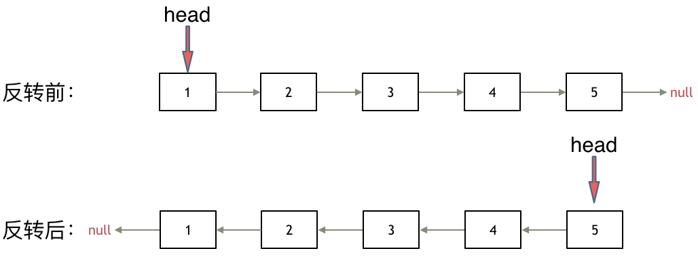

之前链表的头节点是元素1， 反转之后头结点就是元素5 ，这里并没有添加或者删除节点，仅仅是改变next指针的方向。

那么接下来看一看是如何反转的呢？

我们拿有示例中的链表来举例，如动画所示：（纠正：动画应该是先移动pre，在移动cur）


首先定义一个cur指针，指向头结点，再定义一个pre指针，初始化为null。

然后就要开始反转了，首先要把 `cur->next` 节点用tmp指针保存一下，也就是保存一下这个节点。

为什么要保存一下这个节点呢，因为接下来要改变 `cur->next` 的指向了，将`cur->next` 指向pre ，此时已经反转了第一个节点了。

接下来，就是循环走如下代码逻辑了，继续移动pre和cur指针。

最后，cur 指针已经指向了null，循环结束，链表也反转完毕了。 此时我们return pre指针就可以了，pre指针就指向了新的头结点。

### 双指针法

```cpp
class Solution {
public:
    ListNode* reverseList(ListNode* head) {
        ListNode* temp; // 保存cur的下一个节点
        ListNode* cur = head;
        ListNode* pre = NULL;
        while(cur) {
            temp = cur->next;  // 保存一下 cur的下一个节点，因为接下来要改变cur->next
            cur->next = pre; // 翻转操作
            // 更新pre 和 cur指针
            pre = cur;
            cur = temp;
        }
        return pre;
    }
};
```

- 时间复杂度`: O(n)`
- 空间复杂度`: O(1)`

### 递归法

递归法相对抽象一些，但是其实和双指针法是一样的逻辑，同样是当cur为空的时候循环结束，不断将cur指向pre的过程。

关键是初始化的地方，可能有的同学会不理解， 可以看到双指针法中初始化 `cur = head`，`pre = NULL`，在递归法中可以从如下代码看出初始化的逻辑也是一样的，只不过写法变了。

具体可以看代码（已经详细注释），**双指针法写出来之后，理解如下递归写法就不难了，代码逻辑都是一样的。**

```cpp
class Solution {
public:
    ListNode* reverse(ListNode* pre,ListNode* cur){
        if(cur == NULL) return pre;
        ListNode* temp = cur->next;
        cur->next = pre;
        // 可以和双指针法的代码进行对比，如下递归的写法，其实就是做了这两步
        // pre = cur;
        // cur = temp;
        return reverse(cur,temp);
    }
    ListNode* reverseList(ListNode* head) {
        // 和双指针法初始化是一样的逻辑
        // ListNode* cur = head;
        // ListNode* pre = NULL;
        return reverse(NULL, head);
    }
};
```

- 时间复杂度`: O(n),` 要递归处理链表的每个节点
- 空间复杂度`: O(n),` 递归调用了 n 层栈空间

我们可以发现，上面的递归写法和双指针法实质上都是从前往后翻转指针指向，其实还有另外一种与双指针法不同思路的递归写法：从后往前翻转指针指向。

具体代码如下（带详细注释）：

```cpp
class Solution {
public:
    ListNode* reverseList(ListNode* head) {
        // 边缘条件判断
        if(head == NULL) return NULL;
        if (head->next == NULL) return head;
        // 递归调用，翻转第二个节点开始往后的链表
        ListNode *last = reverseList(head->next);
        // 翻转头节点与第二个节点的指向
        head->next->next = head;
        // 此时的 head 节点为尾节点，next 需要指向 NULL
        head->next = NULL;
        return last;
    }
};
```

- 时间复杂度`: O(n)`
- 空间复杂度`: O(n)`

## 其他解法

### 使用虚拟头结点解决链表反转

使用虚拟头结点，通过头插法实现链表的反转（不需要栈）

```cpp
// 迭代方法：增加虚头结点，使用头插法实现链表翻转
public static ListNode reverseList1(ListNode head) {
    // 创建虚头结点
    ListNode dumpyHead = new ListNode(-1);
    dumpyHead.next = null;
    // 遍历所有节点
    ListNode cur = head;
    while(cur != null){
        ListNode temp = cur.next;
        // 头插法
        cur.next = dumpyHead.next;
        dumpyHead.next = cur;
        cur = temp;
    }
    return dumpyHead.next;
}
```

### 使用栈解决反转链表的问题

- 首先将所有的结点入栈
- 然后创建一个虚拟虚拟头结点，让cur指向虚拟头结点。然后开始循环出栈，每出来一个元素，就把它加入到以虚拟头结点为头结点的链表当中，最后返回即可。

```cpp
public ListNode reverseList(ListNode head) {
    // 如果链表为空，则返回空
    if (head == null) return null;
    // 如果链表中只有只有一个元素，则直接返回
    if (head.next == null) return head;
    // 创建栈 每一个结点都入栈
    Stack<ListNode> stack = new Stack<>();
    ListNode cur = head;
    while (cur != null) {
        stack.push(cur);
        cur = cur.next;
    }
    // 创建一个虚拟头结点
    ListNode pHead = new ListNode(0);
    cur = pHead;
    while (!stack.isEmpty()) {
        ListNode node = stack.pop();
        cur.next = node;
        cur = cur.next;
    }
    // 最后一个元素的next要赋值为空
    cur.next = null;
    return pHead.next;
}
```

采用这种方法需要注意一点。就是当整个出栈循环结束以后，cur正好指向原来链表的第一个结点，而此时结

```text
点1中的next指向的是结点2，因此最后还需要cur.next = null
```

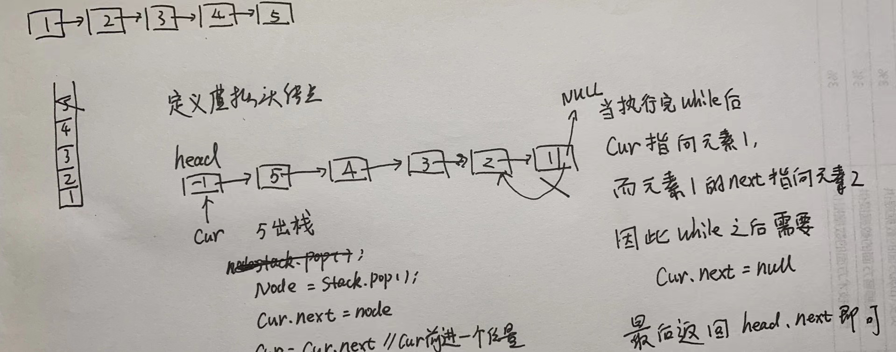

# 6.删除链表的倒数第N个节点

[力扣题目链接](https://leetcode.cn/problems/remove-nth-node-from-end-of-list/)

给你一个链表，删除链表的倒数第 n 个结点，并且返回链表的头结点。

进阶：你能尝试使用一趟扫描实现吗？

示例 1：


输入：`head = [1,2,3,4,5], n = 2`  
输出：`[1,2,3,5]`  
示例 2：

输入：`head = [1], n = 1`  
输出：`[]`  
示例 3：

输入：`head = [1,2], n = 1`  
输出：`[1]`

## 算法公开课

[**《代码随想录》算法视频公开课**](https://programmercarl.com/other/gongkaike.html)**：：**[**链表遍历学清楚！ | LeetCode：19.删除链表倒数第N个节点**](https://www.bilibili.com/video/BV1vW4y1U7Gf)**，相信结合视频** **再看本篇题解，更有助于大家对链表的理解。**

## 思路

双指针的经典应用，如果要删除倒数第n个节点，让fast移动n步，然后让fast和slow同时移动，直到fast指向链表末尾。删掉slow所指向的节点就可以了。

思路是这样的，但要注意一些细节。

分为如下几步：

- 首先这里我推荐大家使用虚拟头结点，这样方便处理删除实际头结点的逻辑，如果虚拟头结点不清楚，可以看这篇： [链表：听说用虚拟头节点会方便很多？](https://programmercarl.com/0203.%E7%A7%BB%E9%99%A4%E9%93%BE%E8%A1%A8%E5%85%83%E7%B4%A0.html)
- 定义fast指针和slow指针，初始值为虚拟头结点，如图：

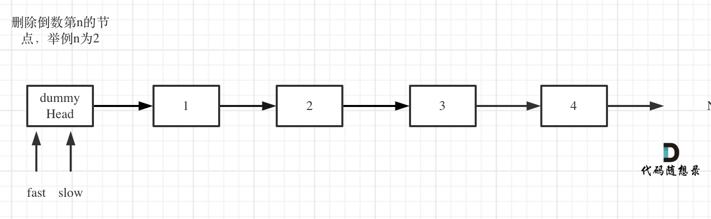

- fast首先走n + 1步 ，为什么是n+1呢，因为只有这样同时移动的时候slow才能指向删除节点的上一个节点（方便做删除操作），如图：

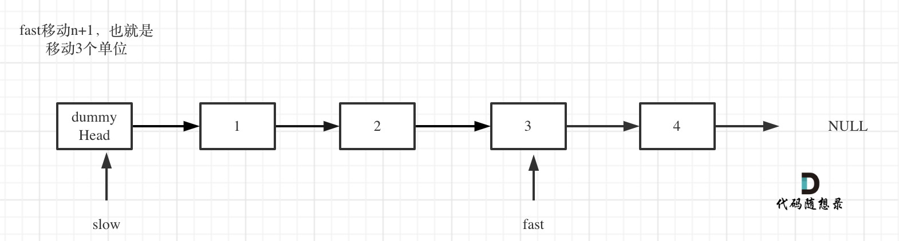

- fast和slow同时移动，直到fast指向末尾，如题：


- 删除slow指向的下一个节点，如图：


此时不难写出如下`C++`代码：

```cpp
class Solution {
public:
    ListNode* removeNthFromEnd(ListNode* head, int n) {
        ListNode* dummyHead = new ListNode(0);
        dummyHead->next = head;
        ListNode* slow = dummyHead;
        ListNode* fast = dummyHead;
        while(n-- && fast != NULL) {
            fast = fast->next;
        }
        fast = fast->next; // fast再提前走一步，因为需要让slow指向删除节点的上一个节点
        while (fast != NULL) {
            fast = fast->next;
            slow = slow->next;
        }
        slow->next = slow->next->next;
        // ListNode *tmp = slow->next;  C++释放内存的逻辑
        // slow->next = tmp->next;
        // delete nth;
        return dummyHead->next;
    }
};
```

- 时间复杂度`: O(n)`
- 空间复杂度`: O(1)`

# 7. 面试题 02.07. 链表相交

同：160.链表相交

[力扣题目链接](https://leetcode.cn/problems/intersection-of-two-linked-lists-lcci/)

给你两个单链表的头节点 headA 和 headB ，请你找出并返回两个单链表相交的起始节点。如果两个链表没有交点，返回 null 。

图示两个链表在节点 c1 开始相交：

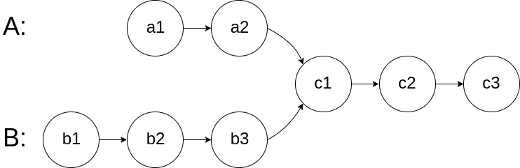

题目数据 保证 整个链式结构中不存在环。

注意，函数返回结果后，链表必须 保持其原始结构 。

示例 1：

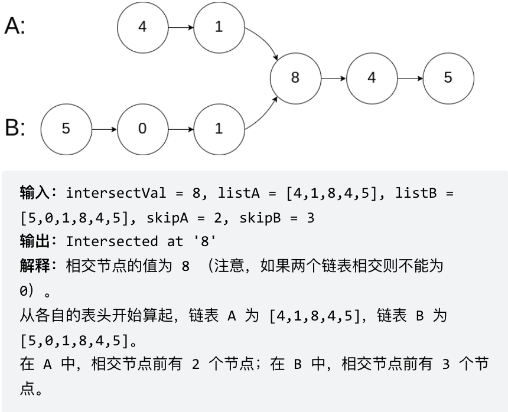

示例 2：

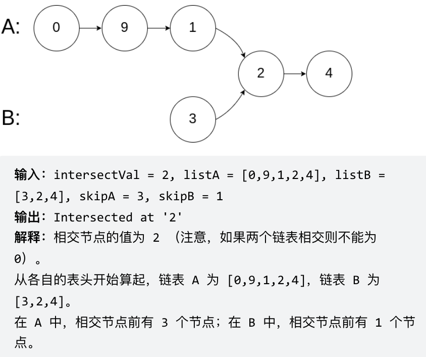

示例 3：


## 思路

简单来说，就是求两个链表交点节点的**指针**。 这里同学们要注意，交点不是数值相等，而是指针相等。

为了方便举例，假设节点元素数值相等，则节点指针相等。

看如下两个链表，目前curA指向链表A的头结点，curB指向链表B的头结点：


我们求出两个链表的长度，并求出两个链表长度的差值，然后让curA移动到，和curB 末尾对齐的位置，如图：

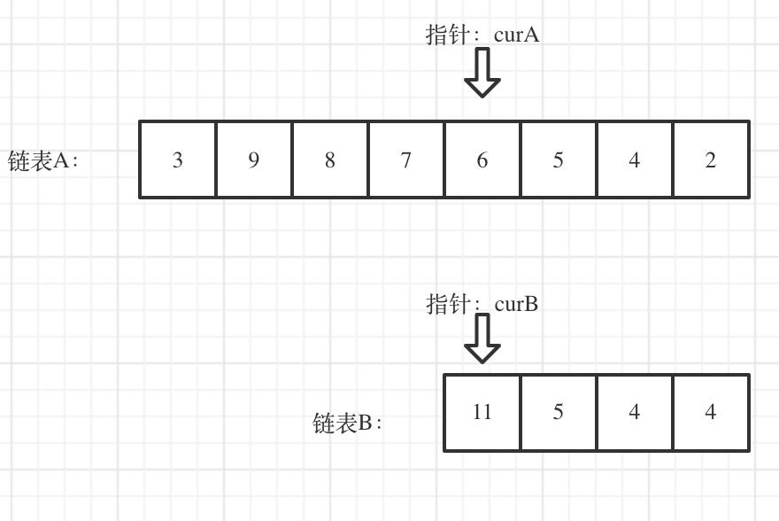

此时我们就可以比较curA和curB是否相同，如果不相同，同时向后移动curA和curB，如果遇到`curA == curB`，则找到交点。

否则循环退出返回空指针。

`C++`代码如下：

```cpp
class Solution {
public:
    ListNode *getIntersectionNode(ListNode *headA, ListNode *headB) {
        ListNode* curA = headA;
        ListNode* curB = headB;
        int lenA = 0, lenB = 0;
        while (curA != NULL) { // 求链表A的长度
            lenA++;
            curA = curA->next;
        }
        while (curB != NULL) { // 求链表B的长度
            lenB++;
            curB = curB->next;
        }
        curA = headA;
        curB = headB;
        // 让curA为最长链表的头，lenA为其长度
        if (lenB > lenA) {
            swap (lenA, lenB);
            swap (curA, curB);
        }
        // 求长度差
        int gap = lenA - lenB;
        // 让curA和curB在同一起点上（末尾位置对齐）
        while (gap--) {
            curA = curA->next;
        }
        // 遍历curA 和 curB，遇到相同则直接返回
        while (curA != NULL) {
            if (curA == curB) {
                return curA;
            }
            curA = curA->next;
            curB = curB->next;
        }
        return NULL;
    }
};
```

- 时间复杂度：`O(n + m)`
- 空间复杂度：`O(1)`

找到有没有环已经很不容易了，还要让我找到环的入口?

# 8.环形链表II

[力扣题目链接](https://leetcode.cn/problems/linked-list-cycle-ii/)

题意：给定一个链表，返回链表开始入环的第一个节点。 如果链表无环，则返回 null。

为了表示给定链表中的环，使用整数 pos 来表示链表尾连接到链表中的位置（索引从 0 开始）。 如果 pos 是 -1，则在该链表中没有环。

**说明**：不允许修改给定的链表。


## 算法公开课

[**《代码随想录》算法视频公开课**](https://programmercarl.com/other/gongkaike.html)**：**[**把环形链表讲清楚！| LeetCode:142.环形链表II**](https://www.bilibili.com/video/BV1if4y1d7ob)**，相信结合视频在看本篇题** **解，更有助于大家对链表的理解。**

## 思路

这道题目，不仅考察对链表的操作，而且还需要一些数学运算。

主要考察两知识点：

- 判断链表是否环
- 如果有环，如何找到这个环的入口

### 判断链表是否有环

可以使用快慢指针法，分别定义 fast 和 slow 指针，从头结点出发，fast指针每次移动两个节点，slow指针每次移动一个节点，如果 fast 和 slow指针在途中相遇 ，说明这个链表有环。

为什么fast 走两个节点，slow走一个节点，有环的话，一定会在环内相遇呢，而不是永远的错开呢

首先第一点：**fast指针一定先进入环中，如果fast指针和slow指针相遇的话，一定是在环中相遇，这是毋庸置疑** **的。**那么来看一下，**为什么fast指针和slow指针一定会相遇呢？**可以画一个环，然后让 fast指针在任意一个节点开始追赶slow指针。

会发现最终都是这种情况， 如下图：


fast和slow各自再走一步， fast和slow就相遇了

这是因为fast是走两步，slow是走一步，**其实相对于slow来说，fast是一个节点一个节点的靠近slow的**，所以fast一定可以和slow重合。

动画如下：

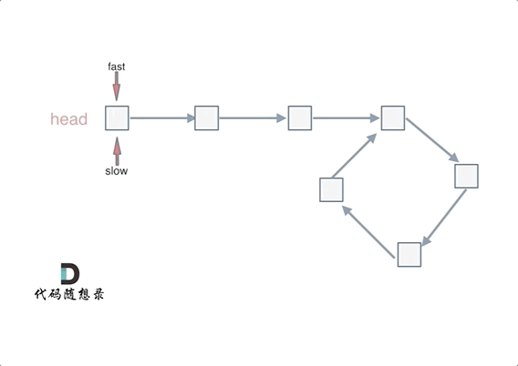

### 如果有环，如何找到这个环的入口

**此时已经可以判断链表是否有环了，那么接下来要找这个环的入口了。**

假设从头结点到环形入口节点 的节点数为x。环形入口节点到 fast指针与slow指针相遇节点 节点数为y。从相遇节点  再到环形入口节点节点数为 z。 如图所示：


那么相遇时：

```text
slow指针走过的节点数为: x + y ，
fast指针走过的节点数：x + y + n (y + z) ，n为fast指针在环内走了n圈才遇到slow指针， （y+z）为 一圈内
```

节点的个数A。

因为fast指针是一步走两个节点，slow指针一步走一个节点， 所以 fast指针走过的节点数 `= slow`指针走过的节点数 * 2：

```text
(x + y) * 2 = x + y + n (y + z)
两边消掉一个（x+y）: x + y  = n (y + z)
```

因为要找环形的入口，那么要求的是x，因为x表示 头结点到 环形入口节点的的距离。

```text
所以要求x ，将x单独放在左面：x = n (y + z) - y ,
再从n(y+z)中提出一个 （y+z）来，整理公式之后为如下公式：x = (n - 1) (y + z) + z 注意这里n一定是大
```

于等于1的，因为 fast指针至少要多走一圈才能相遇slow指针。

这个公式说明什么呢？

先拿n为1的情况来举例，意味着fast指针在环形里转了一圈之后，就遇到了 slow指针了。

```text
当 n为1的时候，公式就化解为 x = z ，
```

这就意味着，**从头结点出发一个指针，从相遇节点 也出发一个指针，这两个指针每次只走一个节点， 那么当这两** **个指针相遇的时候就是 环形入口的节点**。

也就是在相遇节点处，定义一个指针index1，在头结点处定一个指针index2。

让index1和index2同时移动，每次移动一个节点， 那么他们相遇的地方就是 环形入口的节点。

动画如下：

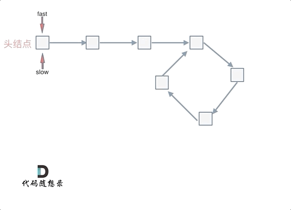

那么 n如果大于1是什么情况呢，就是fast指针在环形转n圈之后才遇到 slow指针。

其实这种情况和n为1的时候 效果是一样的，一样可以通过这个方法找到 环形的入口节点，只不过，index1 指针在环里 多转了`(n-1)`圈，然后再遇到index2，相遇点依然是环形的入口节点。

代码如下：

```cpp
/**
 * Definition for singly-linked list.
 * struct ListNode {
 *     int val;
 *     ListNode *next;
 *     ListNode(int x) : val(x), next(NULL) {}
 * };
 */
class Solution {
public:
    ListNode *detectCycle(ListNode *head) {
        ListNode* fast = head;
        ListNode* slow = head;
        while(fast != NULL && fast->next != NULL) {
            slow = slow->next;
            fast = fast->next->next;
            // 快慢指针相遇，此时从head 和 相遇点，同时查找直至相遇
            if (slow == fast) {
                ListNode* index1 = fast;
                ListNode* index2 = head;
                while (index1 != index2) {
                    index1 = index1->next;
                    index2 = index2->next;
                }
                return index2; // 返回环的入口
            }
        }
        return NULL;
    }
};
```

- 时间复杂度`: O(n)`，快慢指针相遇前，指针走的次数小于链表长度，快慢指针相遇后，两个index指针走的次数也小于链表长度，总体为走的次数小于 2n
- 空间复杂度`: O(1)`

### 补充

在推理过程中，大家可能有一个疑问就是：**为什么第一次在环中相遇，slow的 步数 是 x+y 而不是 x + 若干环的长** **度 + y 呢？**

即文章[链表：环找到了，那入口呢？](https://programmercarl.com/0142.%E7%8E%AF%E5%BD%A2%E9%93%BE%E8%A1%A8II.html)中如下的地方：


首先slow进环的时候，fast一定是先进环来了。

如果slow进环入口，fast也在环入口，那么把这个环展开成直线，就是如下图的样子：


可以看出如果slow 和 fast同时在环入口开始走，一定会在环入口3相遇，slow走了一圈，fast走了两圈。

重点来了，slow进环的时候，fast一定是在环的任意一个位置，如图：


那么fast指针走到环入口3的时候，已经走了k + n 个节点，slow相应的应该走了`(k + n) / 2` 个节点。

因为k是小于n的（图中可以看出），所以`(k + n) / 2` 一定小于n。

**也就是说slow一定没有走到环入口3，而fast已经到环入口3了**。

这说明什么呢？

**在slow开始走的那一环已经和fast相遇了**。

那有同学又说了，为什么fast不能跳过去呢？ 在刚刚已经说过一次了，**fast相对于slow是一次移动一个节点，所以** **不可能跳过去**。

好了，这次把为什么第一次在环中相遇，slow的 步数 是 x+y 而不是 x + 若干环的长度 + y ，用数学推理了一下，算是对[链表：环找到了，那入口呢？](https://programmercarl.com/0142.%E7%8E%AF%E5%BD%A2%E9%93%BE%E8%A1%A8II.html)的补充。

这次可以说把环形链表这道题目的各个细节，完完整整的证明了一遍，说这是全网最详细讲解不为过吧，哈哈。

## 总结

用哈希表解决了[两数之和](https://programmercarl.com/0001.%E4%B8%A4%E6%95%B0%E4%B9%8B%E5%92%8C.html)，那么三数之和呢？

# 9. 三数之和

[力扣题目链接](https://leetcode.cn/problems/3sum/)

给你一个包含 n 个整数的数组 nums，判断 nums 中是否存在三个元素 a，b，c ，使得 `a + b + c = 0` ？请你找出所有满足条件且不重复的三元组。

**注意：** 答案中不可以包含重复的三元组。

示例：

给定数组 `nums = [-1, 0, 1, 2, -1, -4]`，

满足要求的三元组集合为：`[` `[-1, 0, 1],` `[-1, -1, 2]` `]`

## 算法公开课

[**《代码随想录》算法视频公开课**](https://programmercarl.com/other/gongkaike.html)**：**[**梦破碎的地方！| LeetCode：15.三数之和**](https://www.bilibili.com/video/BV1GW4y127qo)**，相信结合视频再看本篇题解，更有** **助于大家对本题的理解**。

**注意[0， 0， 0， 0] 这组数据**

## 思路

### 哈希解法

两层for循环就可以确定 a 和b 的数值了，可以使用哈希法来确定 `0-(a+b)` 是否在 数组里出现过，其实这个思路是正确的，但是我们有一个非常棘手的问题，就是题目中说的不可以包含重复的三元组。

把符合条件的三元组放进vector中，然后再去重，这样是非常费时的，很容易超时，也是这道题目通过率如此之低的根源所在。

去重的过程不好处理，有很多小细节，如果在面试中很难想到位。

时间复杂度可以做到`O(n^2)`，但还是比较费时的，因为不好做剪枝操作。

大家可以尝试使用哈希法写一写，就知道其困难的程度了。

哈希法`C++`代码:

```cpp
class Solution {
public:
    vector<vector<int>> threeSum(vector<int>& nums) {
        vector<vector<int>> result;
        sort(nums.begin(), nums.end());
        // 找出a + b + c = 0
        // a = nums[i], b = nums[j], c = -(a + b)
        for (int i = 0; i < nums.size(); i++) {
            // 排序之后如果第一个元素已经大于零，那么不可能凑成三元组
            if (nums[i] > 0) {
                break;
            }
            if (i > 0 && nums[i] == nums[i - 1]) { //三元组元素a去重
                continue;
            }
            unordered_set<int> set;
            for (int j = i + 1; j < nums.size(); j++) {
                if (j > i + 2
                        && nums[j] == nums[j-1]
                        && nums[j-1] == nums[j-2]) { // 三元组元素b去重
                    continue;
                }
                int c = 0 - (nums[i] + nums[j]);
                if (set.find(c) != set.end()) {
                    result.push_back({nums[i], nums[j], c});
                    set.erase(c);// 三元组元素c去重
                } else {
                    set.insert(nums[j]);
                }
            }
        }
        return result;
    }
};
```

- 时间复杂度`: O(n^2)`
- 空间复杂度`: O(n)`，额外的 set 开销

### 双指针

**其实这道题目使用哈希法并不十分合适**，因为在去重的操作中有很多细节需要注意，在面试中很难直接写出没有bug的代码。

而且使用哈希法 在使用两层for循环的时候，能做的剪枝操作很有限，虽然时间复杂度是`O(n^2)`，也是可以在leetcode上通过，但是程序的执行时间依然比较长 。

接下来我来介绍另一个解法：双指针法，**这道题目使用双指针法 要比哈希法高效一些**，那么来讲解一下具体实现的思路。

动画效果如下：

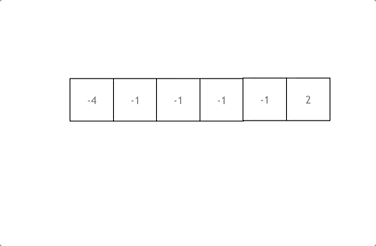

拿这个nums数组来举例，首先将数组排序，然后有一层for循环，i从下标0的地方开始，同时定一个下标left 定义在i+1的位置上，定义下标right 在数组结尾的位置上。

依然还是在数组中找到 abc 使得`a + b +c =0`，我们这里相当于  `a = nums[i]`，`b = nums[left]`，`c = nums[right]`。

接下来如何移动left 和right呢， 如果`nums[i] + nums[left] + nums[right] > 0`  就说明 此时三数之和大了，因为数组是排序后了，所以right下标就应该向左移动，这样才能让三数之和小一些。

如果 `nums[i] + nums[left] + nums[right] < 0` 说明 此时 三数之和小了，left 就向右移动，才能让三数之和大一些，直到left与right相遇为止。

时间复杂度：`O(n^2)`。

`C++`代码代码如下：

```cpp
class Solution {
public:
    vector<vector<int>> threeSum(vector<int>& nums) {
        vector<vector<int>> result;
        sort(nums.begin(), nums.end());
        // 找出a + b + c = 0
        // a = nums[i], b = nums[left], c = nums[right]
        for (int i = 0; i < nums.size(); i++) {
            // 排序之后如果第一个元素已经大于零，那么无论如何组合都不可能凑成三元组，直接返回结果就可
以了
            if (nums[i] > 0) {
                return result;
            }
            // 错误去重a方法，将会漏掉-1,-1,2 这种情况
            /*
            if (nums[i] == nums[i + 1]) {
                continue;
            }
            */
            // 正确去重a方法
            if (i > 0 && nums[i] == nums[i - 1]) {
                continue;
            }
            int left = i + 1;
            int right = nums.size() - 1;
            while (right > left) {
                // 去重复逻辑如果放在这里，0，0，0 的情况，可能直接导致 right<=left 了，从而漏掉了
0,0,0 这种三元组
                /*
                while (right > left && nums[right] == nums[right - 1]) right--;
                while (right > left && nums[left] == nums[left + 1]) left++;
                */
                if (nums[i] + nums[left] + nums[right] > 0) right--;
                else if (nums[i] + nums[left] + nums[right] < 0) left++;
                else {
                    result.push_back(vector<int>{nums[i], nums[left], nums[right]});
                    // 去重逻辑应该放在找到一个三元组之后，对b 和 c去重
                    while (right > left && nums[right] == nums[right - 1]) right--;
                    while (right > left && nums[left] == nums[left + 1]) left++;
                    // 找到答案时，双指针同时收缩
                    right--;
                    left++;
                }
            }
        }
        return result;
    }
};
```

- 时间复杂度`: O(n^2)`
- 空间复杂度`: O(1)`

### 去重逻辑的思考

#### a的去重

说道去重，其实主要考虑三个数的去重。 a, b ,c,  对应的就是 `nums[i]`，`nums[left]`，`nums[right]` 

a 如果重复了怎么办，a是nums里遍历的元素，那么应该直接跳过去。 

但这里有一个问题，是判断 `nums[i]` 与 `nums[i + 1]`是否相同，还是判断 `nums[i]` 与 `nums[i-1]` 是否相同。 

有同学可能想，这不都一样吗。

其实不一样！

都是和 `nums[i]`进行比较，是比较它的前一个，还是比较他的后一个。  

如果我们的写法是 这样：

```cpp
if (nums[i] == nums[i + 1]) { // 去重操作
    continue;
}
```

那就我们就把 三元组中出现重复元素的情况直接pass掉了。 例如`{-1, -1 ,2}` 这组数据，当遍历到第一个-1 的时候，判断 下一个也是-1，那这组数据就pass了。

**我们要做的是 不能有重复的三元组，但三元组内的元素是可以重复的！**

所以这里是有两个重复的维度。

那么应该这么写： 

```cpp
if (i > 0 && nums[i] == nums[i - 1]) {
    continue;
}
```

这么写就是当前使用 `nums[i]`，我们判断前一位是不是一样的元素，在看 `{-1, -1 ,2}` 这组数据，当遍历到 第一个 -1 的时候，只要前一位没有-1，那么  `{-1, -1 ,2}` 这组数据一样可以收录到 结果集里。 

这是一个非常细节的思考过程。 

#### b与c的去重

很多同学写本题的时候，去重的逻辑多加了 对right 和left 的去重：（代码中注释部分） 

```cpp
while (right > left) {
    if (nums[i] + nums[left] + nums[right] > 0) {
        right--;
        // 去重 right
        while (left < right && nums[right] == nums[right + 1]) right--;
    } else if (nums[i] + nums[left] + nums[right] < 0) {
        left++;
        // 去重 left
        while (left < right && nums[left] == nums[left - 1]) left++;
    } else {
    }
}
```

但细想一下，这种去重其实对提升程序运行效率是没有帮助的。 

```cpp
拿right去重为例，即使不加这个去重逻辑，依然根据  while (right > left) 和 if (nums[i] + nums[left]
+ nums[right] > 0)  去完成right-- 的操作。
多加了 while (left < right && nums[right] == nums[right + 1]) right--; 这一行代码，其实就是把
```

需要执行的逻辑提前执行了，但并没有减少 判断的逻辑。  

最直白的思考过程，就是right还是一个数一个数的减下去的，所以在哪里减的都是一样的。 

所以这种去重 是可以不加的。 仅仅是 把去重的逻辑提前了而已。

## 思考题

既然三数之和可以使用双指针法，我们之前讲过的[1.两数之和](https://programmercarl.com/0001.%E4%B8%A4%E6%95%B0%E4%B9%8B%E5%92%8C.html)，可不可以使用双指针法呢？

如果不能，题意如何更改就可以使用双指针法呢？  **大家留言说出自己的想法吧！**

两数之和 就不能使用双指针法，因为[1.两数之和](https://programmercarl.com/0001.%E4%B8%A4%E6%95%B0%E4%B9%8B%E5%92%8C.html)要求返回的是索引下标， 而双指针法一定要排序，一旦排序之后原数组的索引就被改变了。

如果[1.两数之和](https://programmercarl.com/0001.%E4%B8%A4%E6%95%B0%E4%B9%8B%E5%92%8C.html)要求返回的是数值的话，就可以使用双指针法了。

一样的道理，能解决四数之和那么五数之和、六数之和、N数之和呢？

# 10. 四数之和

[力扣题目链接](https://leetcode.cn/problems/4sum/)

题意：给定一个包含 n 个整数的数组 nums 和一个目标值 target，判断 nums 中是否存在四个元素 a，b，c 和 d ，使得 a + b + c + d 的值与 target 相等？找出所有满足条件且不重复的四元组。

**注意：**

答案中不可以包含重复的四元组。

示例：给定数组 `nums = [1, 0, -1, 0, -2, 2]`，和 `target = 0`。满足要求的四元组集合为：`[` `[-1,  0, 0, 1],` `[-2, -1, 1, 2],` `[-2,  0, 0, 2]` `]`

## 算法公开课

[**《代码随想录》算法视频公开课**](https://programmercarl.com/other/gongkaike.html)**：**[**难在去重和剪枝！| LeetCode：18. 四数之和**](https://www.bilibili.com/video/BV1DS4y147US)**，相信结合视频再看本篇题解，更** **有助于大家对本题的理解**。

## 思路

四数之和，和[15.三数之和](https://programmercarl.com/0015.%E4%B8%89%E6%95%B0%E4%B9%8B%E5%92%8C.html)是一个思路，都是使用双指针法, 基本解法就是在[15.三数之和](https://programmercarl.com/0015.%E4%B8%89%E6%95%B0%E4%B9%8B%E5%92%8C.html) 的基础上再套一层for循环。

```text
但是有一些细节需要注意，例如： 不要判断nums[k] > target 就返回了，三数之和 可以通过 nums[i] > 0 就
返回了，因为 0 已经是确定的数了，四数之和这道题目 target是任意值。比如：数组是[-4, -3, -2,
-1] ，target 是-10 ，不能因为-4 > -10 而跳过。但是我们依旧可以去做剪枝，逻辑变成nums[i] > target
&& (nums[i] >=0 || target >= 0) 就可以了。
```

[15.三数之和](https://programmercarl.com/0015.%E4%B8%89%E6%95%B0%E4%B9%8B%E5%92%8C.html)的双指针解法是一层for循环`num[i]`为确定值，然后循环内有left和right下标作为双指针，找到`nums[i]` `+ nums[left] + nums[right] == 0`。

四数之和的双指针解法是两层for循环`nums[k] + nums[i]`为确定值，依然是循环内有left和right下标作为双指针，找出`nums[k] + nums[i] + nums[left] + nums[right] == target`的情况，三数之和的时间复杂度是`O(n^2)`，四数之和的时间复杂度是`O(n^3)` 。

那么一样的道理，五数之和、六数之和等等都采用这种解法。

对于[15.三数之和](https://programmercarl.com/0015.%E4%B8%89%E6%95%B0%E4%B9%8B%E5%92%8C.html)双指针法就是将原本暴力`O(n^3)`的解法，降为`O(n^2)`的解法，四数之和的双指针解法就是将原本暴力`O(n^4)`的解法，降为`O(n^3)`的解法。

之前我们讲过哈希表的经典题目：[454.四数相加II](https://programmercarl.com/0454.%E5%9B%9B%E6%95%B0%E7%9B%B8%E5%8A%A0II.html)，相对于本题简单很多，因为本题是要求在一个集合中找出四个数相加等于target，同时四元组不能重复。

而[454.四数相加II](https://programmercarl.com/0454.%E5%9B%9B%E6%95%B0%E7%9B%B8%E5%8A%A0II.html)是四个独立的数组，只要找到`A[i] + B[j] + C[k] + D[l] = 0`就可以，不用考虑有重复的四个元素相加等于0的情况，所以相对于本题还是简单了不少！

我们来回顾一下，几道题目使用了双指针法。

双指针法将时间复杂度：`O(n^2)`的解法优化为 `O(n)`的解法。也就是降一个数量级，题目如下：

- [27.移除元素](https://programmercarl.com/0027.%E7%A7%BB%E9%99%A4%E5%85%83%E7%B4%A0.html)
- [15.三数之和](https://programmercarl.com/0015.%E4%B8%89%E6%95%B0%E4%B9%8B%E5%92%8C.html)
- [18.四数之和](https://programmercarl.com/0018.%E5%9B%9B%E6%95%B0%E4%B9%8B%E5%92%8C.html)

链表相关双指针题目：

- [206.反转链表](https://programmercarl.com/0206.%E7%BF%BB%E8%BD%AC%E9%93%BE%E8%A1%A8.html)
- [19.删除链表的倒数第N个节点](https://programmercarl.com/0019.%E5%88%A0%E9%99%A4%E9%93%BE%E8%A1%A8%E7%9A%84%E5%80%92%E6%95%B0%E7%AC%ACN%E4%B8%AA%E8%8A%82%E7%82%B9.html)
- [面试题 02.07. 链表相交](https://programmercarl.com/%E9%9D%A2%E8%AF%95%E9%A2%9802.07.%E9%93%BE%E8%A1%A8%E7%9B%B8%E4%BA%A4.html)
- [142题.环形链表II](https://programmercarl.com/0142.%E7%8E%AF%E5%BD%A2%E9%93%BE%E8%A1%A8II.html)

双指针法在字符串题目中还有很多应用，后面还会介绍到。

`C++`代码

```cpp
class Solution {
public:
    vector<vector<int>> fourSum(vector<int>& nums, int target) {
        vector<vector<int>> result;
        sort(nums.begin(), nums.end());
        for (int k = 0; k < nums.size(); k++) {
            // 剪枝处理
            if (nums[k] > target && nums[k] >= 0) {
              break; // 这里使用break，统一通过最后的return返回
            }
            // 对nums[k]去重
            if (k > 0 && nums[k] == nums[k - 1]) {
                continue;
            }
            for (int i = k + 1; i < nums.size(); i++) {
                // 2级剪枝处理
                if (nums[k] + nums[i] > target && nums[k] + nums[i] >= 0) {
                    break;
                }
                // 对nums[i]去重
                if (i > k + 1 && nums[i] == nums[i - 1]) {
                    continue;
                }
                int left = i + 1;
                int right = nums.size() - 1;
                while (right > left) {
                    // nums[k] + nums[i] + nums[left] + nums[right] > target 会溢出
                    if ((long) nums[k] + nums[i] + nums[left] + nums[right] > target) {
                        right--;
                    // nums[k] + nums[i] + nums[left] + nums[right] < target 会溢出
                    } else if ((long) nums[k] + nums[i] + nums[left] + nums[right]  <
target) {
                        left++;
                    } else {
                        result.push_back(vector<int>{nums[k], nums[i], nums[left],
nums[right]});
                        // 对nums[left]和nums[right]去重
                        while (right > left && nums[right] == nums[right - 1]) right--;
                        while (right > left && nums[left] == nums[left + 1]) left++;
                        // 找到答案时，双指针同时收缩
                        right--;
                        left++;
                    }
                }
            }
        }
        return result;
    }
};
```

- 时间复杂度`: O(n^3)`
- 空间复杂度`: O(1)`

## 补充

二级剪枝的部分：

```cpp
if (nums[k] + nums[i] > target && nums[k] + nums[i] >= 0) {
    break;
}
```

可以优化为： 

```cpp
if (nums[k] + nums[i] > target && nums[i] >= 0) {
    break;
}
```

因为只要 `nums[k] + nums[i] > target`，那么 `nums[i]` 后面的数都是正数的话，就一定 不符合条件了。 

不过这种剪枝 其实有点 小绕，大家能够理解 文章给的完整代码的剪枝 就够了。 

又是一波总结

相信大家已经对双指针法很熟悉了，但是双指针法并不隶属于某一种数据结构，我们在讲解数组，链表，字符串都用到了双指针法，所有有必要针对双指针法做一个总结。 

# 11. 双指针总结篇

## 数组篇

在[数组：就移除个元素很难么？](https://programmercarl.com/0027.%E7%A7%BB%E9%99%A4%E5%85%83%E7%B4%A0.html)中，原地移除数组上的元素，我们说到了数组上的元素，不能真正的删除，只能覆盖。 

一些同学可能会写出如下代码（伪代码）：

```cpp
for (int i = 0; i < array.size(); i++) {
    if (array[i] == target) {
        array.erase(i);
    }
}
```

这个代码看上去好像是`O(n)`的时间复杂度，其实是`O(n^2)`的时间复杂度，因为erase操作也是`O(n)`的操作。

所以此时使用双指针法才展现出效率的优势：**通过两个指针在一个for循环下完成两个for循环的工作。** 

## 字符串篇

在[字符串：这道题目，使用库函数一行代码搞定](https://programmercarl.com/0344.%E5%8F%8D%E8%BD%AC%E5%AD%97%E7%AC%A6%E4%B8%B2.html)中讲解了反转字符串，注意这里强调要原地反转，要不然就失去了题目的意义。

使用双指针法，**定义两个指针（也可以说是索引下标），一个从字符串前面，一个从字符串后面，两个指针同时向** **中间移动，并交换元素。**，时间复杂度是`O(n)`。

在[替换空格](https://programmercarl.com/%E5%89%91%E6%8C%87Offer05.%E6%9B%BF%E6%8D%A2%E7%A9%BA%E6%A0%BC.html) 中介绍使用双指针填充字符串的方法，如果想把这道题目做到极致，就不要只用额外的辅助空间了！

思路就是**首先扩充数组到每个空格替换成"%20"之后的大小。然后双指针从后向前替换空格。**

有同学问了，为什么要从后向前填充，从前向后填充不行么？

从前向后填充就是`O(n^2)`的算法了，因为每次添加元素都要将添加元素之后的所有元素向后移动。

**其实很多数组（字符串）填充类的问题，都可以先预先给数组扩容带填充后的大小，然后在从后向前进行操作。** 

那么在[字符串：花式反转还不够！](https://programmercarl.com/0151.%E7%BF%BB%E8%BD%AC%E5%AD%97%E7%AC%A6%E4%B8%B2%E9%87%8C%E7%9A%84%E5%8D%95%E8%AF%8D.html)中，我们使用双指针法，用`O(n)`的时间复杂度完成字符串删除类的操作，因为题目要删除冗余空格。

**在删除冗余空格的过程中，如果不注意代码效率，很容易写成了O(n^2)的时间复杂度。其实使用双指针法O(n)就** **可以搞定。** 

**主要还是大家用erase用的比较随意，一定要注意for循环下用erase的情况，一般可以用双指针写效率更高！**

## 链表篇

翻转链表是现场面试，白纸写代码的好题，考察了候选者对链表以及指针的熟悉程度，而且代码也不长，适合在白纸上写。

在[链表：听说过两天反转链表又写不出来了？](https://programmercarl.com/0206.%E7%BF%BB%E8%BD%AC%E9%93%BE%E8%A1%A8.html)中，讲如何使用双指针法来翻转链表，**只需要改变链表的next指针的** **指向，直接将链表反转 ，而不用重新定义一个新的链表。** 

思路还是很简单的，代码也不长，但是想在白纸上一次性写出bugfree的代码，并不是容易的事情。

在链表中求环，应该是双指针在链表里最经典的应用，在[链表：环找到了，那入口呢？](https://programmercarl.com/0142.%E7%8E%AF%E5%BD%A2%E9%93%BE%E8%A1%A8II.html)中讲解了如何通过双指针判断是否有环，而且还要找到环的入口。

**使用快慢指针（双指针法），分别定义 fast 和 slow指针，从头结点出发，fast指针每次移动两个节点，slow指针** **每次移动一个节点，如果 fast 和 slow指针在途中相遇 ，说明这个链表有环。**

那么找到环的入口，其实需要点简单的数学推理，我在文章中把找环的入口清清楚楚的推理的一遍，如果对找环入口不够清楚的同学建议自己看一看[链表：环找到了，那入口呢？](https://programmercarl.com/0142.%E7%8E%AF%E5%BD%A2%E9%93%BE%E8%A1%A8II.html)。

## N数之和篇

在[哈希表：解决了两数之和，那么能解决三数之和么？](https://programmercarl.com/0015.%E4%B8%89%E6%95%B0%E4%B9%8B%E5%92%8C.html)中，讲到使用哈希法可以解决1.两数之和的问题

其实使用双指针也可以解决1.两数之和的问题，只不过1.两数之和求的是两个元素的下标，没法用双指针，如果改成求具体两个元素的数值就可以了，大家可以尝试用双指针做一个leetcode上两数之和的题目，就可以体会到我说的意思了。

使用了哈希法解决了两数之和，但是哈希法并不使用于三数之和！

使用哈希法的过程中要把符合条件的三元组放进vector中，然后在去去重，这样是非常费时的，很容易超时，也是三数之和通过率如此之低的根源所在。

去重的过程不好处理，有很多小细节，如果在面试中很难想到位。

时间复杂度可以做到`O(n^2)`，但还是比较费时的，因为不好做剪枝操作。

所以这道题目使用双指针法才是最为合适的，用双指针做这道题目才能就能真正体会到，**通过前后两个指针不算向** **中间逼近，在一个for循环下完成两个for循环的工作。**只用双指针法时间复杂度为`O(n^2)`，但比哈希法的`O(n^2)`效率高得多，哈希法在使用两层for循环的时候，能做的剪枝操作很有限。

在[双指针法：一样的道理，能解决四数之和](https://programmercarl.com/0018.%E5%9B%9B%E6%95%B0%E4%B9%8B%E5%92%8C.html)中，讲到了四数之和，其实思路是一样的，**在三数之和的基础上再套一** **层for循环，依然是使用双指针法。**

对于三数之和使用双指针法就是将原本暴力`O(n^3)`的解法，降为`O(n^2)`的解法，四数之和的双指针解法就是将原本暴力`O(n^4)`的解法，降为`O(n^3)`的解法。

同样的道理，五数之和，n数之和都是在这个基础上累加。

## 总结

本文中一共介绍了leetcode上九道使用双指针解决问题的经典题目，除了链表一些题目一定要使用双指针，其他题目都是使用双指针来提高效率，一般是将`O(n^2)`的时间复杂度，降为`$O(n)$`。

建议大家可以把文中涉及到的题目在好好做一做，琢磨琢磨，基本对双指针法就不在话下了。
