[](https://programmercarl.com/other/xunlianying.html)

**《代码随想录》作者：**[**程序员Carl**](https://github.com/youngyangyang04)

- 代码随想录官网[（网站持续更新优化内容，建议直接看网站）](https://www.programmercarl.com/)：www.programmercarl.com
- 代码随想录[Github开源地址](https://github.com/youngyangyang04/leetcode-master)
- [代码随想录算法公开课](https://programmercarl.com/other/gongkaike.html)，代码随想录的全部内容将由我（[程序员Carl](https://github.com/youngyangyang04)）视频讲解并开免费开放给大家。
- [《代码随想录》](https://programmercarl.com/other/publish.html) 已经出版。
- [代码随想录知识星球](https://programmercarl.com/other/kstar.html) 上万录友在这里学习
- [代码随想录算法训练营](https://programmercarl.com/other/xunlianying.html) 帮助录友高效刷完代码随想录。
- 微信公众号：[代码随想录](https://img-blog.csdnimg.cn/74f47bc466234462bd2acc3ba6cd1b70.png)
- 组队刷题，可以添加[代码随想录官方微信](https://www.programmercarl.com/other/wechat.html)
- ACM模式练习，推荐：[卡码网](https://kamacoder.com/)

**特别提示**：PDF仅提供`C++`语言版本同时PDF中很多动图无法加载，其他编程语言版本和查看动图可以移步至代码随想录官方网站查看。

来看看栈和队列不为人知的一面

# 1. 栈与队列理论基础

我想栈和队列的原理大家应该很熟悉了，队列是先进先出，栈是先进后出。

如图所示：

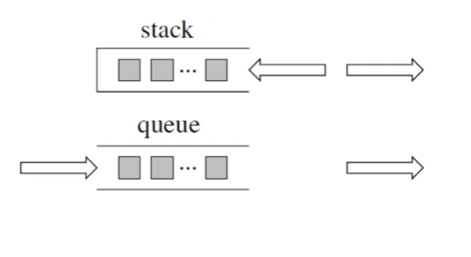

那么我这里再列出四个关于栈的问题，大家可以思考一下。以下是以`C++`为例，使用其他编程语言的同学也对应思考一下，自己使用的编程语言里栈和队列是什么样的。

`1. C++`中stack 是容器么？2. 我们使用的stack是属于哪个版本的STL？3. 我们使用的STL中stack是如何实现的？4. stack 提供迭代器来遍历stack空间么？

相信这四个问题并不那么好回答， 因为一些同学使用数据结构会停留在非常表面上的应用，稍稍往深一问，就会有好像懂，好像也不懂的感觉。

有的同学可能仅仅知道有栈和队列这么个数据结构，却不知道底层实现，也不清楚所使用栈和队列和STL是什么关系。

所以这里我再给大家扫一遍基础知识，

首先大家要知道 栈和队列是STL（`C++`标准库）里面的两个数据结构。

`C++`标准库是有多个版本的，要知道我们使用的STL是哪个版本，才能知道对应的栈和队列的实现原理。

那么来介绍一下，三个最为普遍的STL版本：

1. HP STL其他版本的`C++ STL`，一般是以HP STL为蓝本实现出来的，HP STL是`C++ STL`的第一个实现版本，而且开放源代码。

2. P.J.Plauger STL由P.J.Plauger参照HP STL实现出来的，被`Visual C++`编译器所采用，不是开源的。3. SGI STL由Silicon Graphics Computer Systems公司参照HP STL实现，被Linux的`C++`编译器GCC所采用，SGI STL是开源软件，源码可读性甚高。

接下来介绍的栈和队列也是SGI STL里面的数据结构， 知道了使用版本，才知道对应的底层实现。

来说一说栈，栈先进后出，如图所示：

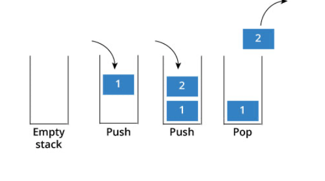

栈提供push 和 pop 等等接口，所有元素必须符合先进后出规则，所以栈不提供走访功能，也不提供迭代器`(iterator)`。 不像是set 或者map 提供迭代器iterator来遍历所有元素。

**栈是以底层容器完成其所有的工作，对外提供统一的接口，底层容器是可插拔的（也就是说我们可以控制使用哪种** **容器来实现栈的功能）。**

所以STL中栈往往不被归类为容器，而被归类为container adapter（容器适配器）。

那么问题来了，STL 中栈是用什么容器实现的？

从下图中可以看出，栈的内部结构，栈的底层实现可以是vector，deque，list 都是可以的， 主要就是数组和链表的底层实现。

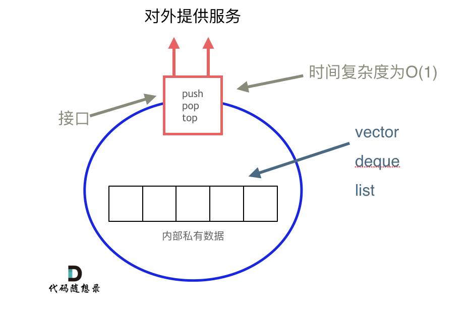

**我们常用的SGI STL，如果没有指定底层实现的话，默认是以deque为缺省情况下栈的底层结构。**

deque是一个双向队列，只要封住一段，只开通另一端就可以实现栈的逻辑了。

**SGI STL中 队列底层实现缺省情况下一样使用deque实现的。**

我们也可以指定vector为栈的底层实现，初始化语句如下：

```cpp
std::stack<int, std::vector<int> > third;  // 使用vector为底层容器的栈
```

刚刚讲过栈的特性，对应的队列的情况是一样的。

队列中先进先出的数据结构，同样不允许有遍历行为，不提供迭代器, **SGI STL中队列一样是以deque为缺省情况下** **的底部结构。**

也可以指定list 为起底层实现，初始化queue的语句如下：

```cpp
std::queue<int, std::list<int>> third; // 定义以list为底层容器的队列
```

所以STL 队列也不被归类为容器，而被归类为container adapter（ 容器适配器）。

我这里讲的都是`C++` 语言中的情况， 使用其他语言的同学也要思考栈与队列的底层实现问题， 不要对数据结构的使用浅尝辄止，而要深挖其内部原理，才能夯实基础。

工作上一定没人这么搞，但是考察对栈、队列理解程度的好题

# 2.用栈实现队列

[力扣题目链接](https://leetcode.cn/problems/implement-queue-using-stacks/)

使用栈实现队列的下列操作：

`push(x) --` 将一个元素放入队列的尾部。 `pop() --` 从队列首部移除元素。  `peek() --` 返回队列首部的元素。  `empty() --` 返回队列是否为空。 

示例:

```cpp
MyQueue queue = new MyQueue();
queue.push(1);
queue.push(2);
queue.peek();  // 返回 1
queue.pop();   // 返回 1
queue.empty(); // 返回 false
```

说明:

- 你只能使用标准的栈操作 `--` 也就是只有 push to top, peek/pop from top, size, 和 is empty 操作是合法的。
- 你所使用的语言也许不支持栈。你可以使用 list 或者 deque（双端队列）来模拟一个栈，只要是标准的栈操作即可。
- 假设所有操作都是有效的 （例如，一个空的队列不会调用 pop 或者 peek 操作）。

## 算法公开课

[**《代码随想录》算法视频公开课**](https://programmercarl.com/other/gongkaike.html)**：**[**栈的基本操作！ | LeetCode：232.用栈实现队列**](https://www.bilibili.com/video/BV1nY4y1w7VC)**，相信结合视频再看本篇题** **解，更有助于大家对本题的理解**。

## 思路

这是一道模拟题，不涉及到具体算法，考察的就是对栈和队列的掌握程度。

使用栈来模式队列的行为，如果仅仅用一个栈，是一定不行的，所以需要两个栈**一个输入栈，一个输出栈**，这里要注意输入栈和输出栈的关系。

下面动画模拟以下队列的执行过程：

执行语句： `queue.push(1);` `queue.push(2);` `queue.pop();` **注意此时的输出栈的操作** `queue.push(3);`  `queue.push(4);` `queue.pop();`  `queue.pop();`**注意此时的输出栈的操作** `queue.pop();` `queue.empty();` 

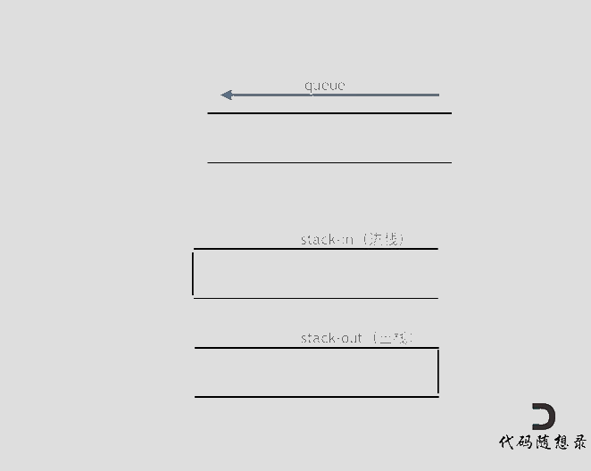

在push数据的时候，只要数据放进输入栈就好，**但在pop的时候，操作就复杂一些，输出栈如果为空，就把进栈数** **据全部导入进来（注意是全部导入）**，再从出栈弹出数据，如果输出栈不为空，则直接从出栈弹出数据就可以了。

最后如何判断队列为空呢？**如果进栈和出栈都为空的话，说明模拟的队列为空了。**

在代码实现的时候，会发现`pop()` 和 `peek()`两个函数功能类似，代码实现上也是类似的，可以思考一下如何把代码抽象一下。

`C++`代码如下：

```cpp
class MyQueue {
public:
    stack<int> stIn;
    stack<int> stOut;
    /** Initialize your data structure here. */
    MyQueue() {
    }
    /** Push element x to the back of queue. */
    void push(int x) {
        stIn.push(x);
    }
    /** Removes the element from in front of queue and returns that element. */
    int pop() {
        // 只有当stOut为空的时候，再从stIn里导入数据（导入stIn全部数据）
        if (stOut.empty()) {
            // 从stIn导入数据直到stIn为空
            while(!stIn.empty()) {
                stOut.push(stIn.top());
                stIn.pop();
            }
        }
        int result = stOut.top();
        stOut.pop();
        return result;
    }
    /** Get the front element. */
    int peek() {
        int res = this->pop(); // 直接使用已有的pop函数
        stOut.push(res); // 因为pop函数弹出了元素res，所以再添加回去
        return res;
    }
    /** Returns whether the queue is empty. */
    bool empty() {
        return stIn.empty() && stOut.empty();
    }
};
```

- 时间复杂度: push和empty为`O(1), pop`和peek为`O(n)`
- 空间复杂度`: O(n)`

## 拓展

可以看出`peek()`的实现，直接复用了`pop()`， 要不然，对stOut判空的逻辑又要重写一遍。

再多说一些代码开发上的习惯问题，在工业级别代码开发中，最忌讳的就是 实现一个类似的函数，直接把代码粘过来改一改就完事了。

这样的项目代码会越来越乱，**一定要懂得复用，功能相近的函数要抽象出来，不要大量的复制粘贴，很容易出问** **题！（踩过坑的人自然懂）**

工作中如果发现某一个功能自己要经常用，同事们可能也会用到，自己就花点时间把这个功能抽象成一个好用的函数或者工具类，不仅自己方便，也方便了同事们。

同事们就会逐渐认可你的工作态度和工作能力，自己的口碑都是这么一点一点积累起来的！在同事圈里口碑起来了之后，你就发现自己走上了一个正循环，以后的升职加薪才少不了你！哈哈哈

用队列实现栈还是有点别扭。

# 3. 用队列实现栈

[力扣题目链接](https://leetcode.cn/problems/implement-stack-using-queues/)

使用队列实现栈的下列操作：

- `push(x) --` 元素 x 入栈
- `pop() --` 移除栈顶元素
- `top() --` 获取栈顶元素
- `empty() --` 返回栈是否为空

注意:

- 你只能使用队列的基本操作`--` 也就是 push to back, peek/pop from front, size, 和 is empty 这些操作是合法的。
- 你所使用的语言也许不支持队列。 你可以使用 list 或者 deque（双端队列）来模拟一个队列 , 只要是标准的队列操作即可。
- 你可以假设所有操作都是有效的（例如, 对一个空的栈不会调用 pop 或者 top 操作）。

## 算法公开课

[**《代码随想录》算法视频公开课**](https://programmercarl.com/other/gongkaike.html)**：**[**队列的基本操作！ | LeetCode：225. 用队列实现栈**](https://www.bilibili.com/video/BV1Fd4y1K7sm)**，相信结合视频再看本篇题** **解，更有助于大家对本题的理解**。

## 思路

（这里要强调是单向队列）

有的同学可能疑惑这种题目有什么实际工程意义，**其实很多算法题目主要是对知识点的考察和教学意义远大于其工** **程实践的意义，所以面试题也是这样！**

刚刚做过[栈与队列：我用栈来实现队列怎么样？](https://programmercarl.com/0232.%E7%94%A8%E6%A0%88%E5%AE%9E%E7%8E%B0%E9%98%9F%E5%88%97.html)的同学可能依然想着用一个输入队列，一个输出队列，就可以模拟栈的功能，仔细想一下还真不行！

**队列模拟栈，其实一个队列就够了**，那么我们先说一说两个队列来实现栈的思路。

**队列是先进先出的规则，把一个队列中的数据导入另一个队列中，数据的顺序并没有变，并没有变成先进后出的顺** **序。**

所以用栈实现队列， 和用队列实现栈的思路还是不一样的，这取决于这两个数据结构的性质。

但是依然还是要用两个队列来模拟栈，只不过没有输入和输出的关系，而是另一个队列完全用来备份的！

如下面动画所示，**用两个队列que1和que2实现队列的功能，que2其实完全就是一个备份的作用**，把que1最后面的元素以外的元素都备份到que2，然后弹出最后面的元素，再把其他元素从que2导回que1。

模拟的队列执行语句如下： 

```cpp
queue.push(1);
queue.push(2);
queue.pop();   // 注意弹出的操作
queue.push(3);
queue.push(4);
queue.pop();  // 注意弹出的操作
queue.pop();
queue.pop();
queue.empty();
```

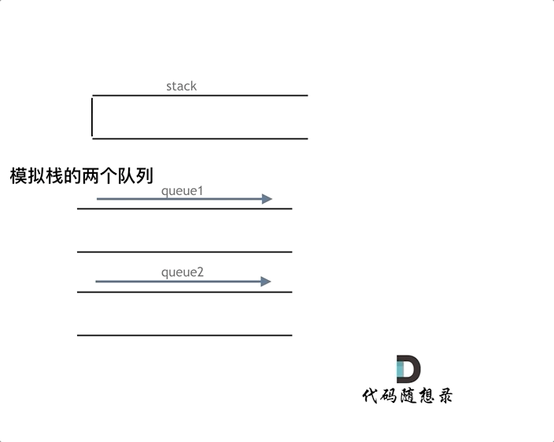

详细如代码注释所示：

```cpp
class MyStack {
public:
    queue<int> que1;
    queue<int> que2; // 辅助队列，用来备份
    /** Initialize your data structure here. */
    MyStack() {
    }
    /** Push element x onto stack. */
    void push(int x) {
        que1.push(x);
    }
    /** Removes the element on top of the stack and returns that element. */
    int pop() {
        int size = que1.size();
        size--;
        while (size--) { // 将que1 导入que2，但要留下最后一个元素
            que2.push(que1.front());
            que1.pop();
        }
        int result = que1.front(); // 留下的最后一个元素就是要返回的值
        que1.pop();
        que1 = que2;            // 再将que2赋值给que1
        while (!que2.empty()) { // 清空que2
            que2.pop();
        }
        return result;
    }
    /** Get the top element. */
    int top() {
        return que1.back();
    }
    /** Returns whether the stack is empty. */
    bool empty() {
        return que1.empty();
    }
};
```

- 时间复杂度: push为`O(n)`，其他为`O(1)`
- 空间复杂度`: O(n)`

## 优化

其实这道题目就是用一个队列就够了。

**一个队列在模拟栈弹出元素的时候只要将队列头部的元素（除了最后一个元素外） 重新添加到队列尾部，此时再去** **弹出元素就是栈的顺序了。** `C++`优化代码

```cpp
class MyStack {
public:
    queue<int> que;
    /** Initialize your data structure here. */
    MyStack() {
    }
    /** Push element x onto stack. */
    void push(int x) {
        que.push(x);
    }
    /** Removes the element on top of the stack and returns that element. */
    int pop() {
        int size = que.size();
        size--;
        while (size--) { // 将队列头部的元素（除了最后一个元素外） 重新添加到队列尾部
            que.push(que.front());
            que.pop();
        }
        int result = que.front(); // 此时弹出的元素顺序就是栈的顺序了
        que.pop();
        return result;
    }
    /** Get the top element. */
    int top() {
        return que.back();
    }
    /** Returns whether the stack is empty. */
    bool empty() {
        return que.empty();
    }
};
```

- 时间复杂度: push为`O(n)`，其他为`O(1)`
- 空间复杂度`: O(n)`

数据结构与算法应用往往隐藏在我们看不到的地方

# 4. 有效的括号

[力扣题目链接](https://leetcode.cn/problems/valid-parentheses/)

给定一个只包括 `'('`，`')'`，`'{'`，`'}'`，`'['`，`']'` 的字符串，判断字符串是否有效。

有效字符串需满足：

- 左括号必须用相同类型的右括号闭合。
- 左括号必须以正确的顺序闭合。
- 注意空字符串可被认为是有效字符串。

示例 1:

- 输入`: "()"`  
- 输出: true 

示例 2:

- 输入`: "()[]{}"` 
- 输出: true 

示例 3:

- 输入`: "(]"` 
- 输出: false 

示例 4:

- 输入`: "([)]"` 
- 输出: false 

示例 5:

- 输入`: "{[]}"`
- 输出: true

## 算法公开课

[**《代码随想录》算法视频公开课**](https://programmercarl.com/other/gongkaike.html)**：**[**栈的拿手好戏！| LeetCode：20. 有效的括号**](https://www.bilibili.com/video/BV1AF411w78g)**，相信结合视频再看本篇题解，更** **有助于大家对本题的理解**。

## 思路

### 题外话

**括号匹配是使用栈解决的经典问题。**

题意其实就像我们在写代码的过程中，要求括号的顺序是一样的，有左括号，相应的位置必须要有右括号。

如果还记得编译原理的话，编译器在 词法分析的过程中处理括号、花括号等这个符号的逻辑，也是使用了栈这种数据结构。

再举个例子，linux系统中，cd这个进入目录的命令我们应该再熟悉不过了。

```text
cd a/b/c/../../
```

这个命令最后进入a目录，系统是如何知道进入了a目录呢 ，这就是栈的应用（其实可以出一道相应的面试题了）

所以栈在计算机领域中应用是非常广泛的。

有的同学经常会想学的这些数据结构有什么用，也开发不了什么软件，大多数同学说的软件应该都是可视化的软件例如APP、网站之类的，那都是非常上层的应用了，底层很多功能的实现都是基础的数据结构和算法。

**所以数据结构与算法的应用往往隐藏在我们看不到的地方！**

这里我就不过多展开了，先来看题。

### 进入正题

由于栈结构的特殊性，非常适合做对称匹配类的题目。

首先要弄清楚，字符串里的括号不匹配有几种情况。

**一些同学，在面试中看到这种题目上来就开始写代码，然后就越写越乱。**

建议在写代码之前要分析好有哪几种不匹配的情况，如果不在动手之前分析好，写出的代码也会有很多问题。

先来分析一下 这里有三种不匹配的情况，

1. 第一种情况，字符串里左方向的括号多余了 ，所以不匹配。

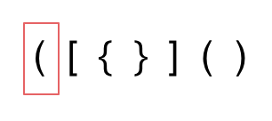

2. 第二种情况，括号没有多余，但是 括号的类型没有匹配上。

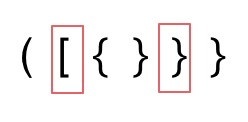

3. 第三种情况，字符串里右方向的括号多余了，所以不匹配。

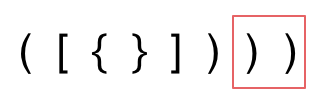

我们的代码只要覆盖了这三种不匹配的情况，就不会出问题，可以看出 动手之前分析好题目的重要性。

动画如下：

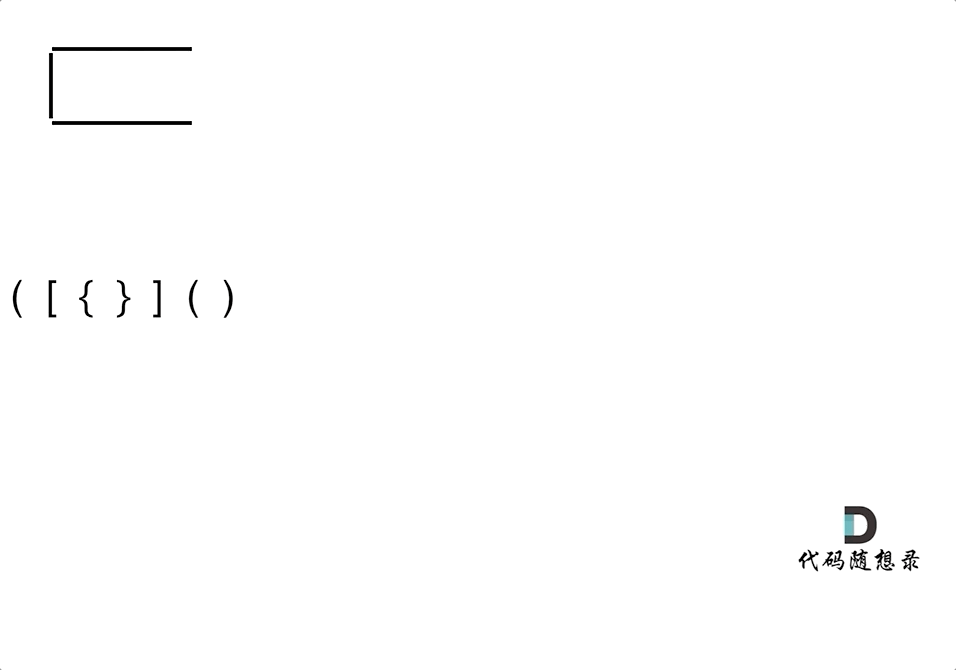

第一种情况：已经遍历完了字符串，但是栈不为空，说明有相应的左括号没有右括号来匹配，所以return false

第二种情况：遍历字符串匹配的过程中，发现栈里没有要匹配的字符。所以return false

第三种情况：遍历字符串匹配的过程中，栈已经为空了，没有匹配的字符了，说明右括号没有找到对应的左括号return false

那么什么时候说明左括号和右括号全都匹配了呢，就是字符串遍历完之后，栈是空的，就说明全都匹配了。

分析完之后，代码其实就比较好写了，

但还有一些技巧，在匹配左括号的时候，右括号先入栈，就只需要比较当前元素和栈顶相不相等就可以了，比左括号先入栈代码实现要简单的多了！

实现`C++`代码如下：

```cpp
class Solution {
public:
    bool isValid(string s) {
        if (s.size() % 2 != 0) return false; // 如果s的长度为奇数，一定不符合要求
        stack<char> st;
        for (int i = 0; i < s.size(); i++) {
            if (s[i] == '(') st.push(')');
            else if (s[i] == '{') st.push('}');
            else if (s[i] == '[') st.push(']');
            // 第三种情况：遍历字符串匹配的过程中，栈已经为空了，没有匹配的字符了，说明右括号没有找到
对应的左括号 return false
            // 第二种情况：遍历字符串匹配的过程中，发现栈里没有我们要匹配的字符。所以return false
            else if (st.empty() || st.top() != s[i]) return false;
            else st.pop(); // st.top() 与 s[i]相等，栈弹出元素
        }
        // 第一种情况：此时我们已经遍历完了字符串，但是栈不为空，说明有相应的左括号没有右括号来匹配，所
以return false，否则就return true
        return st.empty();
    }
};
```

- 时间复杂度`: O(n)`
- 空间复杂度`: O(n)`

技巧性的东西没有固定的学习方法，还是要多看多练，自己灵活运用了。

匹配问题都是栈的强项

# 5. 删除字符串中的所有相邻重复项

[力扣题目链接](https://leetcode.cn/problems/remove-all-adjacent-duplicates-in-string/)

给出由小写字母组成的字符串 S，重复项删除操作会选择两个相邻且相同的字母，并删除它们。

在 S 上反复执行重复项删除操作，直到无法继续删除。

在完成所有重复项删除操作后返回最终的字符串。答案保证唯一。

示例：

- 输入："abbaca"
- 输出："ca"
- 解释：例如，在 "abbaca" 中，我们可以删除 "bb" 由于两字母相邻且相同，这是此时唯一可以执行删除操作的重复项。之后我们得到字符串 "aaca"，其中又只有 "aa" 可以执行重复项删除操作，所以最后的字符串为 "ca"。

提示：

- `1 <= S.length <= 20000`
- S 仅由小写英文字母组成。

## 算法公开课

[**《代码随想录》算法视频公开课**](https://programmercarl.com/other/gongkaike.html)**：**[**栈的好戏还要继续！| LeetCode：1047. 删除字符串中的所有相邻重复项**](https://www.bilibili.com/video/BV12a411P7mw)**，相信** **结合视频再看本篇题解，更有助于大家对本题的理解**。

## 思路

### 正题

本题要删除相邻相同元素，相对于[20. 有效的括号](https://programmercarl.com/0020.%E6%9C%89%E6%95%88%E7%9A%84%E6%8B%AC%E5%8F%B7.html)来说其实也是匹配问题，20. 有效的括号 是匹配左右括号，本题是匹配相邻元素，最后都是做消除的操作。 

本题也是用栈来解决的经典题目。

那么栈里应该放的是什么元素呢？ 

我们在删除相邻重复项的时候，其实就是要知道当前遍历的这个元素，我们在前一位是不是遍历过一样数值的元素，那么如何记录前面遍历过的元素呢？ 

所以就是用栈来存放，那么栈的目的，就是存放遍历过的元素，当遍历当前的这个元素的时候，去栈里看一下我们是不是遍历过相同数值的相邻元素。 

然后再去做对应的消除操作。 如动画所示：

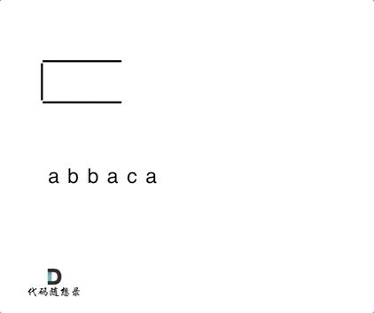

从栈中弹出剩余元素，此时是字符串ac，因为从栈里弹出的元素是倒序的，所以再对字符串进行反转一下，就得到了最终的结果。

`C++`代码 :

```cpp
class Solution {
public:
    string removeDuplicates(string S) {
        stack<char> st;
        for (char s : S) {
            if (st.empty() || s != st.top()) {
                st.push(s);
            } else {
                st.pop(); // s 与 st.top()相等的情况
            }
        }
        string result = "";
        while (!st.empty()) { // 将栈中元素放到result字符串汇总
            result += st.top();
            st.pop();
        }
        reverse (result.begin(), result.end()); // 此时字符串需要反转一下
        return result;
    }
};
```

- 时间复杂度`: O(n)`
- 空间复杂度`: O(n)`

当然可以拿字符串直接作为栈，这样省去了栈还要转为字符串的操作。

代码如下：

```cpp
class Solution {
public:
    string removeDuplicates(string S) {
        string result;
        for(char s : S) {
            if(result.empty() || result.back() != s) {
                result.push_back(s);
            }
            else {
                result.pop_back();
            }
        }
        return result;
    }
};
```

- 时间复杂度`: O(n)`
- 空间复杂度`: O(1)`，返回值不计空间复杂度

### 题外话

这道题目就像是我们玩过的游戏对对碰，如果相同的元素挨在一起就要消除。

可能我们在玩游戏的时候感觉理所当然应该消除，但程序又怎么知道该如何消除呢，特别是消除之后又有新的元素可能挨在一起。

此时游戏的后端逻辑就可以用一个栈来实现（我没有实际考察对对碰或者爱消除游戏的代码实现，仅从原理上进行推断）。

游戏开发可能使用栈结构，编程语言的一些功能实现也会使用栈结构，实现函数递归调用就需要栈，但不是每种编程语言都支持递归，例如：

**递归的实现就是：每一次递归调用都会把函数的局部变量、参数值和返回地址等压入调用栈中**，然后递归返回的时候，从栈顶弹出上一次递归的各项参数，所以这就是递归为什么可以返回上一层位置的原因。

```text
相信大家应该遇到过一种错误就是栈溢出，系统输出的异常是Segmentation fault （当然不是所有的
Segmentation fault 都是栈溢出导致的） ，如果你使用了递归，就要想一想是不是无限递归了，那么系统调用
```

栈就会溢出。

而且**在企业项目开发中，尽量不要使用递归**！在项目比较大的时候，由于参数多，全局变量等等，使用递归很容易判断不充分return的条件，非常容易无限递归（或者递归层级过深），**造成栈溢出错误（这种问题还不好排查！）**

这不仅仅是一道好题，也展现出计算机的思考方式

# 6. 逆波兰表达式求值

[力扣题目链接](https://leetcode.cn/problems/evaluate-reverse-polish-notation/)

根据 逆波兰表示法，求表达式的值。

有效的运算符包括 + ,  - ,  *  ,  / 。每个运算对象可以是整数，也可以是另一个逆波兰表达式。

说明：

整数除法只保留整数部分。给定逆波兰表达式总是有效的。换句话说，表达式总会得出有效数值且不存在除数为 0 的情况。

示例 1：

- 输入`: ["2", "1", "+", "3", " * "]`
- 输出: 9
- 解释: 该算式转化为常见的中缀算术表达式为：`((2 + 1) * 3) = 9`

示例 2：

- 输入`: ["4", "13", "5", "/", "+"]`
- 输出: 6

- 解释: 该算式转化为常见的中缀算术表达式为：`(4 + (13 / 5)) = 6`

示例 3：

- 输入`: ["10", "6", "9", "3", "+", "-11", " * ", "/", " * ", "17", "+", "5", "+"]`
- 输出: 22
- 解释:该算式转化为常见的中缀算术表达式为：

```text
((10 * (6 / ((9 + 3) * -11))) + 17) + 5
= ((10 * (6 / (12 * -11))) + 17) + 5
= ((10 * (6 / -132)) + 17) + 5
= ((10 * 0) + 17) + 5
= (0 + 17) + 5
= 17 + 5
= 22
```

逆波兰表达式：是一种后缀表达式，所谓后缀就是指运算符写在后面。

平常使用的算式则是一种中缀表达式，如 `( 1 + 2 ) * ( 3 + 4 )` 。

该算式的逆波兰表达式写法为 `( ( 1 2 + ) ( 3 4 + ) * )` 。

逆波兰表达式主要有以下两个优点：

- 去掉括号后表达式无歧义，上式即便写成 1 2 + 3 4 + * 也可以依据次序计算出正确结果。
- 适合用栈操作运算：遇到数字则入栈；遇到运算符则取出栈顶两个数字进行计算，并将结果压入栈中。

## 算法公开课

[**《代码随想录》算法视频公开课**](https://programmercarl.com/other/gongkaike.html)**：**[**栈的最后表演！ | LeetCode：150. 逆波兰表达式求值**](https://www.bilibili.com/video/BV1kd4y1o7on)**，相信结合视频再看本篇** **题解，更有助于大家对本题的理解**。

## 思路

### 正题

在上一篇文章中[1047.删除字符串中的所有相邻重复项](https://programmercarl.com/1047.%E5%88%A0%E9%99%A4%E5%AD%97%E7%AC%A6%E4%B8%B2%E4%B8%AD%E7%9A%84%E6%89%80%E6%9C%89%E7%9B%B8%E9%82%BB%E9%87%8D%E5%A4%8D%E9%A1%B9.html)提到了 递归就是用栈来实现的。

所以**栈与递归之间在某种程度上是可以转换的！** 这一点我们在后续讲解二叉树的时候，会更详细的讲解到。

那么来看一下本题，**其实逆波兰表达式相当于是二叉树中的后序遍历**。 大家可以把运算符作为中间节点，按照后序遍历的规则画出一个二叉树。

但我们没有必要从二叉树的角度去解决这个问题，只要知道逆波兰表达式是用后序遍历的方式把二叉树序列化了，就可以了。

在进一步看，本题中每一个子表达式要得出一个结果，然后拿这个结果再进行运算，那么**这岂不就是一个相邻字符** **串消除的过程，和**[**1047.删除字符串中的所有相邻重复项**](https://programmercarl.com/1047.%E5%88%A0%E9%99%A4%E5%AD%97%E7%AC%A6%E4%B8%B2%E4%B8%AD%E7%9A%84%E6%89%80%E6%9C%89%E7%9B%B8%E9%82%BB%E9%87%8D%E5%A4%8D%E9%A1%B9.html)**中的对对碰游戏是不是就非常像了。**

如动画所示：

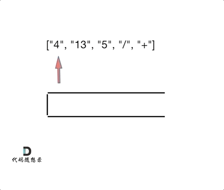

相信看完动画大家应该知道，这和[1047. 删除字符串中的所有相邻重复项](https://programmercarl.com/1047.%E5%88%A0%E9%99%A4%E5%AD%97%E7%AC%A6%E4%B8%B2%E4%B8%AD%E7%9A%84%E6%89%80%E6%9C%89%E7%9B%B8%E9%82%BB%E9%87%8D%E5%A4%8D%E9%A1%B9.html)是差不错的，只不过本题不要相邻元素做消除了，而是做运算！

`C++`代码如下：

```cpp
class Solution {
public:
    int evalRPN(vector<string>& tokens) {
        // 力扣修改了后台测试数据，需要用longlong
        stack<long long> st;
        for (int i = 0; i < tokens.size(); i++) {
            if (tokens[i] == "+" || tokens[i] == "-" || tokens[i] == "*" || tokens[i]
== "/") {
                long long num1 = st.top();
                st.pop();
                long long num2 = st.top();
                st.pop();
                if (tokens[i] == "+") st.push(num2 + num1);
                if (tokens[i] == "-") st.push(num2 - num1);
                if (tokens[i] == "*") st.push(num2 * num1);
                if (tokens[i] == "/") st.push(num2 / num1);
            } else {
                st.push(stoll(tokens[i]));
            }
        }
        int result = st.top();
        st.pop(); // 把栈里最后一个元素弹出（其实不弹出也没事）
        return result;
    }
};
```

- 时间复杂度`: O(n)`
- 空间复杂度`: O(n)`

### 题外话

我们习惯看到的表达式都是中缀表达式，因为符合我们的习惯，但是中缀表达式对于计算机来说就不是很友好了。

例如：4 + 13 / 5，这就是中缀表达式，计算机从左到右去扫描的话，扫到13，还要判断13后面是什么运算符，还要比较一下优先级，然后13还和后面的5做运算，做完运算之后，还要向前回退到 4 的位置，继续做加法，你说麻不麻烦！

那么将中缀表达式，转化为后缀表达式之后：`["4", "13", "5", "/", "+"]` ，就不一样了，计算机可以利用栈来顺序处理，不需要考虑优先级了。也不用回退了， **所以后缀表达式对计算机来说是非常友好的。**

可以说本题不仅仅是一道好题，也展现出计算机的思考方式。

在1970年代和1980年代，惠普在其所有台式和手持式计算器中都使用了RPN（后缀表达式），直到2020年代仍在某些模型中使用了RPN。

参考维基百科如下：

During the 1970s and 1980s, Hewlett-Packard used RPN in all of their desktop and hand-held calculators, and continued to use it in some models into the 2020s.

要用啥数据结构呢？

# 7. 滑动窗口最大值

[力扣题目链接](https://leetcode.cn/problems/sliding-window-maximum/)

给定一个数组 nums，有一个大小为 k 的滑动窗口从数组的最左侧移动到数组的最右侧。你只可以看到在滑动窗口内的 k 个数字。滑动窗口每次只向右移动一位。

返回滑动窗口中的最大值。

进阶：

你能在线性时间复杂度内解决此题吗？

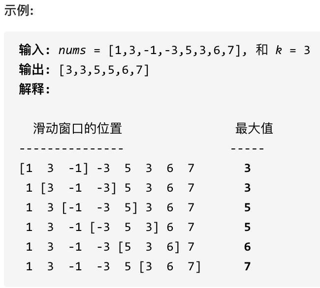

提示：

- `1 <= nums.length <= 10^5`
- `-10^4 <= nums[i] <= 10^4`
- `1 <= k <= nums.length`

## 算法公开课

[**《代码随想录》算法视频公开课**](https://programmercarl.com/other/gongkaike.html)**：**[**单调队列正式登场！| LeetCode：239. 滑动窗口最大值**](https://www.bilibili.com/video/BV1XS4y1p7qj)**，相信结合视频再看本** **篇题解，更有助于大家对本题的理解**。

## 思路

这是使用单调队列的经典题目。

难点是如何求一个区间里的最大值呢？ （这好像是废话），暴力一下不就得了。

暴力方法，遍历一遍的过程中每次从窗口中再找到最大的数值，这样很明显是`O(n × k)`的算法。

有的同学可能会想用一个大顶堆（优先级队列）来存放这个窗口里的k个数字，这样就可以知道最大的最大值是多少了， **但是问题是这个窗口是移动的，而大顶堆每次只能弹出最大值，我们无法移除其他数值，这样就造成大顶堆** **维护的不是滑动窗口里面的数值了。所以不能用大顶堆。**

此时我们需要一个队列，这个队列呢，放进去窗口里的元素，然后随着窗口的移动，队列也一进一出，每次移动之后，队列告诉我们里面的最大值是什么。

这个队列应该长这个样子：

```cpp
class MyQueue {
public:
    void pop(int value) {
    }
    void push(int value) {
    }
    int front() {
        return que.front();
    }
};
```

每次窗口移动的时候，调用`que.pop(`滑动窗口中移除元素的数值`)`，`que.push(`滑动窗口添加元素的数值`)`，然后`que.front()`就返回我们要的最大值。

这么个队列香不香，要是有现成的这种数据结构是不是更香了！

**可惜了，没有！ 我们需要自己实现这么个队列。**

然后再分析一下，队列里的元素一定是要排序的，而且要最大值放在出队口，要不然怎么知道最大值呢。

但如果把窗口里的元素都放进队列里，窗口移动的时候，队列需要弹出元素。

那么问题来了，已经排序之后的队列 怎么能把窗口要移除的元素（这个元素可不一定是最大值）弹出呢。

大家此时应该陷入深思.....

**其实队列没有必要维护窗口里的所有元素，只需要维护有可能成为窗口里最大值的元素就可以了，同时保证队列里** **的元素数值是由大到小的。**

那么这个维护元素单调递减的队列就叫做**单调队列，即单调递减或单调递增的队列。C++中没有直接支持单调队** **列，需要我们自己来实现一个单调队列**

**不要以为实现的单调队列就是 对窗口里面的数进行排序，如果排序的话，那和优先级队列又有什么区别了呢。**

来看一下单调队列如何维护队列里的元素。

动画如下：

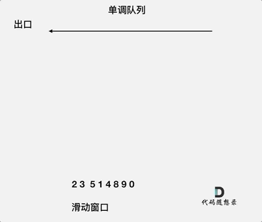

对于窗口里的元素`{2, 3, 5, 1 ,4}`，单调队列里只维护`{5, 4}` 就够了，保持单调队列里单调递减，此时队列出口元素就是窗口里最大元素。

此时大家应该怀疑单调队列里维护着`{5, 4}` 怎么配合窗口进行滑动呢？

设计单调队列的时候，pop，和push操作要保持如下规则：

`1. pop(value)`：如果窗口移除的元素value等于单调队列的出口元素，那么队列弹出元素，否则不用任何操作`2. push(value)`：如果push的元素value大于入口元素的数值，那么就将队列入口的元素弹出，直到push元素的数值小于等于队列入口元素的数值为止

保持如上规则，每次窗口移动的时候，只要问`que.front()`就可以返回当前窗口的最大值。

为了更直观的感受到单调队列的工作过程，以题目示例为例，输入`: nums = [1,3,-1,-3,5,3,6,7],` 和 `k = 3`，动画如下：

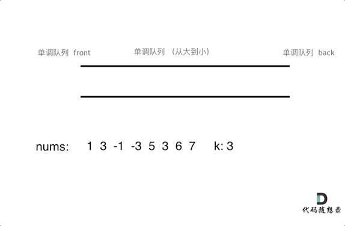

那么我们用什么数据结构来实现这个单调队列呢？

使用deque最为合适，在文章[栈与队列：来看看栈和队列不为人知的一面](https://programmercarl.com/%E6%A0%88%E4%B8%8E%E9%98%9F%E5%88%97%E7%90%86%E8%AE%BA%E5%9F%BA%E7%A1%80.html)中，我们就提到了常用的queue在没有指定容器的情况下，deque就是默认底层容器。

基于刚刚说过的单调队列pop和push的规则，代码不难实现，如下：

```cpp
class MyQueue { //单调队列（从大到小）
public:
    deque<int> que; // 使用deque来实现单调队列
    // 每次弹出的时候，比较当前要弹出的数值是否等于队列出口元素的数值，如果相等则弹出。
    // 同时pop之前判断队列当前是否为空。
    void pop(int value) {
        if (!que.empty() && value == que.front()) {
            que.pop_front();
        }
    }
    // 如果push的数值大于入口元素的数值，那么就将队列后端的数值弹出，直到push的数值小于等于队列入口元
素的数值为止。
    // 这样就保持了队列里的数值是单调从大到小的了。
    void push(int value) {
        while (!que.empty() && value > que.back()) {
            que.pop_back();
        }
        que.push_back(value);
    }
    // 查询当前队列里的最大值 直接返回队列前端也就是front就可以了。
    int front() {
        return que.front();
    }
};
```

这样我们就用deque实现了一个单调队列，接下来解决滑动窗口最大值的问题就很简单了，直接看代码吧。

`C++`代码如下：

```cpp
class Solution {
private:
    class MyQueue { //单调队列（从大到小）
    public:
        deque<int> que; // 使用deque来实现单调队列
        // 每次弹出的时候，比较当前要弹出的数值是否等于队列出口元素的数值，如果相等则弹出。
        // 同时pop之前判断队列当前是否为空。
        void pop(int value) {
            if (!que.empty() && value == que.front()) {
                que.pop_front();
            }
        }
        // 如果push的数值大于入口元素的数值，那么就将队列后端的数值弹出，直到push的数值小于等于队列入
口元素的数值为止。
        // 这样就保持了队列里的数值是单调从大到小的了。
        void push(int value) {
            while (!que.empty() && value > que.back()) {
                que.pop_back();
            }
            que.push_back(value);
        }
        // 查询当前队列里的最大值 直接返回队列前端也就是front就可以了。
        int front() {
            return que.front();
        }
    };
public:
    vector<int> maxSlidingWindow(vector<int>& nums, int k) {
        MyQueue que;
        vector<int> result;
        for (int i = 0; i < k; i++) { // 先将前k的元素放进队列
            que.push(nums[i]);
        }
        result.push_back(que.front()); // result 记录前k的元素的最大值
        for (int i = k; i < nums.size(); i++) {
            que.pop(nums[i - k]); // 滑动窗口移除最前面元素
            que.push(nums[i]); // 滑动窗口前加入最后面的元素
            result.push_back(que.front()); // 记录对应的最大值
        }
        return result;
    }
};
```

- 时间复杂度`: O(n)`
- 空间复杂度`: O(k)`

再来看一下时间复杂度，使用单调队列的时间复杂度是 `O(n)`。

有的同学可能想了，在队列中 push元素的过程中，还有pop操作呢，感觉不是纯粹的`O(n)`。

其实，大家可以自己观察一下单调队列的实现，nums 中的每个元素最多也就被 push_back 和 pop_back 各一次，没有任何多余操作，所以整体的复杂度还是 `O(n)`。

空间复杂度因为我们定义一个辅助队列，所以是`O(k)`。

## 扩展

大家貌似对单调队列 都有一些疑惑，首先要明确的是，题解中单调队列里的pop和push接口，仅适用于本题哈。单调队列不是一成不变的，而是不同场景不同写法，总之要保证队列里单调递减或递增的原则，所以叫做单调队列。 不要以为本题中的单调队列实现就是固定的写法哈。

大家貌似对deque也有一些疑惑，`C++`中deque是stack和queue默认的底层实现容器（这个我们之前已经讲过啦），deque是可以两边扩展的，而且deque里元素并不是严格的连续分布的。

前K个大数问题，老生常谈，不得不谈

# 8.前 K 个高频元素

[力扣题目链接](https://leetcode.cn/problems/top-k-frequent-elements/)

给定一个非空的整数数组，返回其中出现频率前 k 高的元素。

示例 1:

- 输入`: nums = [1,1,1,2,2,3], k = 2`
- 输出`: [1,2]`

示例 2:

- 输入`: nums = [1], k = 1`
- 输出`: [1]`

提示：

- 你可以假设给定的 k 总是合理的，且 1 ≤ k ≤ 数组中不相同的元素的个数。
- 你的算法的时间复杂度必须优于 `$O(n \log n)$ , n` 是数组的大小。
- 题目数据保证答案唯一，换句话说，数组中前 k 个高频元素的集合是唯一的。

- 你可以按任意顺序返回答案。

## 算法公开课

[**《代码随想录》算法视频公开课**](https://programmercarl.com/other/gongkaike.html)**：优先级队列正式登场！大顶堆、小顶堆该怎么用？| LeetCode：347.前 K 个高** **频元素，相信结合视频再看本篇题解，更有助于大家对本题的理解**。

## 思路

这道题目主要涉及到如下三块内容：

1. 要统计元素出现频率2. 对频率排序3. 找出前K个高频元素

首先统计元素出现的频率，这一类的问题可以使用map来进行统计。

然后是对频率进行排序，这里我们可以使用一种 容器适配器就是**优先级队列**。

什么是优先级队列呢？

其实**就是一个披着队列外衣的堆**，因为优先级队列对外接口只是从队头取元素，从队尾添加元素，再无其他取元素的方式，看起来就是一个队列。

而且优先级队列内部元素是自动依照元素的权值排列。那么它是如何有序排列的呢？

缺省情况下priority_queue利用max-heap（大顶堆）完成对元素的排序，这个大顶堆是以vector为表现形式的complete binary tree（完全二叉树）。

什么是堆呢？

**堆是一棵完全二叉树，树中每个结点的值都不小于（或不大于）其左右孩子的值。** 如果父亲结点是大于等于左右孩子就是大顶堆，小于等于左右孩子就是小顶堆。

所以大家经常说的大顶堆（堆头是最大元素），小顶堆（堆头是最小元素），如果懒得自己实现的话，就直接用priority_queue（优先级队列）就可以了，底层实现都是一样的，从小到大排就是小顶堆，从大到小排就是大顶堆。

本题我们就要使用优先级队列来对部分频率进行排序。

为什么不用快排呢， 使用快排要将map转换为vector的结构，然后对整个数组进行排序， 而这种场景下，我们其实只需要维护k个有序的序列就可以了，所以使用优先级队列是最优的。

此时要思考一下，是使用小顶堆呢，还是大顶堆？

有的同学一想，题目要求前 K 个高频元素，那么果断用大顶堆啊。

那么问题来了，定义一个大小为k的大顶堆，在每次移动更新大顶堆的时候，每次弹出都把最大的元素弹出去了，那么怎么保留下来前K个高频元素呢。

而且使用大顶堆就要把所有元素都进行排序，那能不能只排序k个元素呢？ 

**所以我们要用小顶堆，因为要统计最大前k个元素，只有小顶堆每次将最小的元素弹出，最后小顶堆里积累的才是** **前k个最大元素。**寻找前k个最大元素流程如图所示：（图中的频率只有三个，所以正好构成一个大小为3的小顶堆，如果频率更多一些，则用这个小顶堆进行扫描）

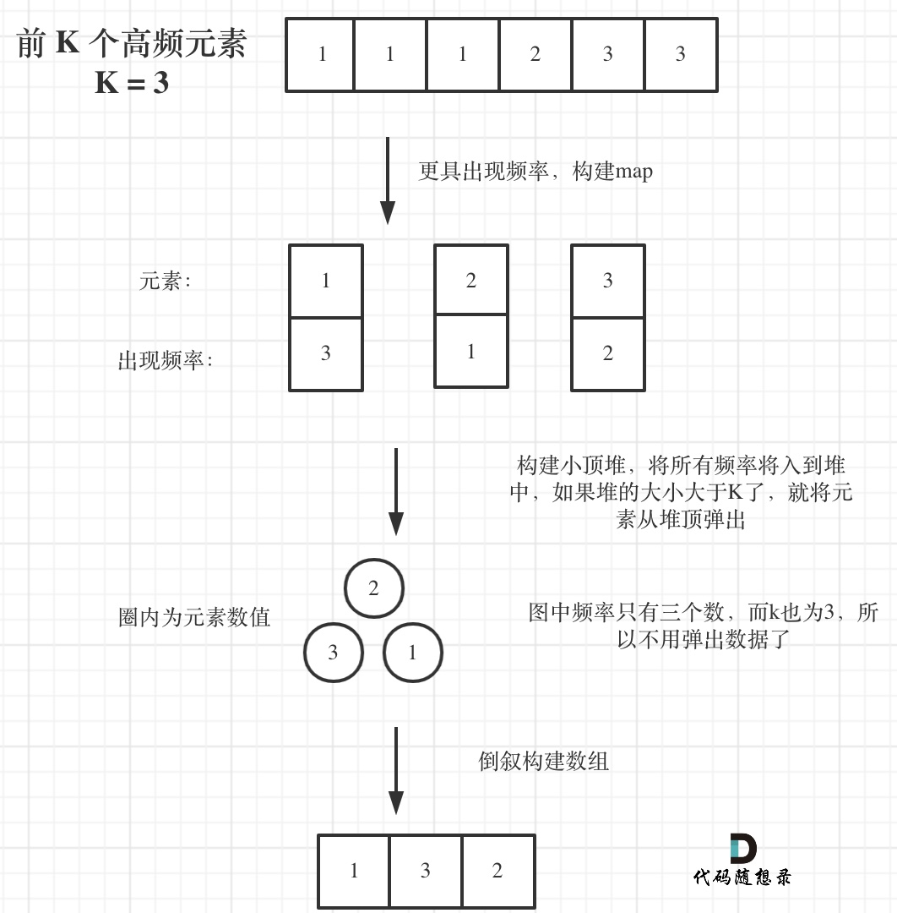

我们来看一下`C++`代码：

```cpp
class Solution {
public:
    // 小顶堆
    class mycomparison {
    public:
        bool operator()(const pair<int, int>& lhs, const pair<int, int>& rhs) {
            return lhs.second > rhs.second;
        }
    };
    vector<int> topKFrequent(vector<int>& nums, int k) {
        // 要统计元素出现频率
        unordered_map<int, int> map; // map<nums[i],对应出现的次数>
        for (int i = 0; i < nums.size(); i++) {
            map[nums[i]]++;
        }
        // 对频率排序
        // 定义一个小顶堆，大小为k
        priority_queue<pair<int, int>, vector<pair<int, int>>, mycomparison> pri_que;
        // 用固定大小为k的小顶堆，扫面所有频率的数值
        for (unordered_map<int, int>::iterator it = map.begin(); it != map.end(); it++)
{
            pri_que.push(*it);
            if (pri_que.size() > k) { // 如果堆的大小大于了K，则队列弹出，保证堆的大小一直为k
                pri_que.pop();
            }
        }
        // 找出前K个高频元素，因为小顶堆先弹出的是最小的，所以倒序来输出到数组
        vector<int> result(k);
        for (int i = k - 1; i >= 0; i--) {
            result[i] = pri_que.top().first;
            pri_que.pop();
        }
        return result;
    }
};
```

- 时间复杂度`: O(nlogk)`
- 空间复杂度`: O(n)`

## 拓展

大家对这个比较运算在建堆时是如何应用的，为什么左大于右就会建立小顶堆，反而建立大顶堆比较困惑。

```cpp
确实 例如我们在写快排的cmp函数的时候，return left>right 就是从大到小，return left<right 就是从
```

小到大。

优先级队列的定义正好反过来了，可能和优先级队列的源码实现有关（我没有仔细研究），我估计是底层实现上优先队列队首指向后面，队尾指向最前面的缘故！

# 9. 栈与队列总结篇

## 栈与队列的理论基础

首先我们在[栈与队列：来看看栈和队列不为人知的一面](https://programmercarl.com/%E6%A0%88%E4%B8%8E%E9%98%9F%E5%88%97%E7%90%86%E8%AE%BA%E5%9F%BA%E7%A1%80.html)中讲解了栈和队列的理论基础。

里面提到了灵魂四问：

`1. C++`中stack，queue 是容器么？2. 我们使用的stack，queue是属于那个版本的STL？3. 我们使用的STL中stack，queue是如何实现的？4. stack，queue 提供迭代器来遍历空间么？

相信不仅仅是`C++`中有这些问题，那么大家使用其他编程语言，也可以考虑一下这四个问题，栈和队列是如何实现的。

栈与队列是我们熟悉的不能再熟悉的数据结构，但它们的底层实现，很多同学都比较模糊，这其实就是基础所在。

可以出一道面试题：栈里面的元素在内存中是连续分布的么？ 

这个问题有两个陷阱：

- 陷阱1：栈是容器适配器，底层容器使用不同的容器，导致栈内数据在内存中是不是连续分布。
- 陷阱2：缺省情况下，默认底层容器是deque，那么deque的在内存中的数据分布是什么样的呢？ 答案是：不连续的，下文也会提到deque。

所以这就是考察候选者基础知识扎不扎实的好问题。

大家还是要多多重视起来！

了解了栈与队列基础之后，那么可以用[栈与队列：栈实现队列](https://programmercarl.com/0232.%E7%94%A8%E6%A0%88%E5%AE%9E%E7%8E%B0%E9%98%9F%E5%88%97.html) 和 [栈与队列：队列实现栈](https://programmercarl.com/0225.%E7%94%A8%E9%98%9F%E5%88%97%E5%AE%9E%E7%8E%B0%E6%A0%88.html) 来练习一下栈与队列的基本操作。

值得一提的是，用[栈与队列：用队列实现栈还有点别扭](https://programmercarl.com/0225.%E7%94%A8%E9%98%9F%E5%88%97%E5%AE%9E%E7%8E%B0%E6%A0%88.html)中，其实只用一个队列就够了。

**一个队列在模拟栈弹出元素的时候只要将队列头部的元素（除了最后一个元素外） 重新添加到队列尾部，此时在去** **弹出元素就是栈的顺序了。** 

## 栈经典题目

### 栈在系统中的应用

如果还记得编译原理的话，编译器在 词法分析的过程中处理括号、花括号等这个符号的逻辑，就是使用了栈这种数据结构。

再举个例子，linux系统中，cd这个进入目录的命令我们应该再熟悉不过了。

```text
cd a/b/c/../../
```

这个命令最后进入a目录，系统是如何知道进入了a目录呢 ，这就是栈的应用。**这在leetcode上也是一道题目，编** **号：71. 简化路径，大家有空可以做一下。** **递归的实现是栈：每一次递归调用都会把函数的局部变量、参数值和返回地址等压入调用栈中**，然后递归返回的时候，从栈顶弹出上一次递归的各项参数，所以这就是递归为什么可以返回上一层位置的原因。

所以栈在计算机领域中应用是非常广泛的。 

有的同学经常会想学的这些数据结构有什么用，也开发不了什么软件，大多数同学说的软件应该都是可视化的软件例如APP、网站之类的，那都是非常上层的应用了，底层很多功能的实现都是基础的数据结构和算法。 

**所以数据结构与算法的应用往往隐藏在我们看不到的地方！**

### 括号匹配问题

在[栈与队列：系统中处处都是栈的应用](https://programmercarl.com/0020.%E6%9C%89%E6%95%88%E7%9A%84%E6%8B%AC%E5%8F%B7.html)中我们讲解了括号匹配问题。

**括号匹配是使用栈解决的经典问题。**

建议要写代码之前要分析好有哪几种不匹配的情况，如果不动手之前分析好，写出的代码也会有很多问题。 

先来分析一下 这里有三种不匹配的情况，

1. 第一种情况，字符串里左方向的括号多余了 ，所以不匹配。2. 第二种情况，括号没有多余，但是 括号的类型没有匹配上。3. 第三种情况，字符串里右方向的括号多余了，所以不匹配。

这里还有一些技巧，在匹配左括号的时候，右括号先入栈，就只需要比较当前元素和栈顶相不相等就可以了，比左括号先入栈代码实现要简单的多了！

### 字符串去重问题

在[栈与队列：匹配问题都是栈的强项](https://programmercarl.com/1047.%E5%88%A0%E9%99%A4%E5%AD%97%E7%AC%A6%E4%B8%B2%E4%B8%AD%E7%9A%84%E6%89%80%E6%9C%89%E7%9B%B8%E9%82%BB%E9%87%8D%E5%A4%8D%E9%A1%B9.html)中讲解了字符串去重问题。

047. 删除字符串中的所有相邻重复项

思路就是可以把字符串顺序放到一个栈中，然后如果相同的话 栈就弹出，这样最后栈里剩下的元素都是相邻不相同的元素了。

### 逆波兰表达式问题

在[栈与队列：有没有想过计算机是如何处理表达式的？](https://programmercarl.com/0150.%E9%80%86%E6%B3%A2%E5%85%B0%E8%A1%A8%E8%BE%BE%E5%BC%8F%E6%B1%82%E5%80%BC.html)中讲解了求逆波兰表达式。

本题中每一个子表达式要得出一个结果，然后拿这个结果再进行运算，那么**这岂不就是一个相邻字符串消除的过** **程，和**[**栈与队列：匹配问题都是栈的强项**](https://programmercarl.com/1047.%E5%88%A0%E9%99%A4%E5%AD%97%E7%AC%A6%E4%B8%B2%E4%B8%AD%E7%9A%84%E6%89%80%E6%9C%89%E7%9B%B8%E9%82%BB%E9%87%8D%E5%A4%8D%E9%A1%B9.html)**中的对对碰游戏是不是就非常像了。** 

## 队列的经典题目

### 滑动窗口最大值问题

在[栈与队列：滑动窗口里求最大值引出一个重要数据结构](https://programmercarl.com/0239.%E6%BB%91%E5%8A%A8%E7%AA%97%E5%8F%A3%E6%9C%80%E5%A4%A7%E5%80%BC.html)中讲解了一种数据结构：单调队列。

这道题目还是比较绕的，如果第一次遇到这种题目，需要反复琢磨琢磨

主要思想是**队列没有必要维护窗口里的所有元素，只需要维护有可能成为窗口里最大值的元素就可以了，同时保证** **队列里的元素数值是由大到小的。** 那么这个维护元素单调递减的队列就叫做**单调队列，即单调递减或单调递增的队列。C++中没有直接支持单调队** **列，需要我们自己来一个单调队列**而且**不要以为实现的单调队列就是 对窗口里面的数进行排序，如果排序的话，那和优先级队列又有什么区别了呢。**

设计单调队列的时候，pop，和push操作要保持如下规则：

`1. pop(value)`：如果窗口移除的元素value等于单调队列的出口元素，那么队列弹出元素，否则不用任何操作`2. push(value)`：如果push的元素value大于入口元素的数值，那么就将队列出口的元素弹出，直到push元素的数值小于等于队列入口元素的数值为止 

保持如上规则，每次窗口移动的时候，只要问`que.front()`就可以返回当前窗口的最大值。

一些同学还会对单调队列都有一些困惑，首先要明确的是，**题解中单调队列里的pop和push接口，仅适用于本** **题。**

**单调队列不是一成不变的，而是不同场景不同写法**，总之要保证队列里单调递减或递增的原则，所以叫做单调队列。 

**不要以为本地中的单调队列实现就是固定的写法。**  

我们用deque作为单调队列的底层数据结构，`C++`中deque是stack和queue默认的底层实现容器（这个我们之前已经讲过），deque是可以两边扩展的，而且deque里元素并不是严格的连续分布的。

### 求前 K 个高频元素

在[栈与队列：求前 K 个高频元素和队列有啥关系？](https://programmercarl.com/0347.%E5%89%8DK%E4%B8%AA%E9%AB%98%E9%A2%91%E5%85%83%E7%B4%A0.html)中讲解了求前 K 个高频元素。

通过求前 K 个高频元素，引出另一种队列就是**优先级队列**。 

什么是优先级队列呢？ 

其实**就是一个披着队列外衣的堆**，因为优先级队列对外接口只是从队头取元素，从队尾添加元素，再无其他取元素的方式，看起来就是一个队列。

而且优先级队列内部元素是自动依照元素的权值排列。那么它是如何有序排列的呢？

缺省情况下priority_queue利用max-heap（大顶堆）完成对元素的排序，这个大顶堆是以vector为表现形式的complete binary tree（完全二叉树）。

什么是堆呢？ 

**堆是一棵完全二叉树，树中每个结点的值都不小于（或不大于）其左右孩子的值。** 如果父亲结点是大于等于左右孩子就是大顶堆，小于等于左右孩子就是小顶堆。 

所以大家经常说的大顶堆（堆头是最大元素），小顶堆（堆头是最小元素），如果懒得自己实现的话，就直接用priority_queue（优先级队列）就可以了，底层实现都是一样的，从小到大排就是小顶堆，从大到小排就是大顶堆。

本题就要**使用优先级队列来对部分频率进行排序。**  注意这里是对部分数据进行排序而不需要对所有数据排序！

所以排序的过程的时间复杂度是`$O(\log k)$`，整个算法的时间复杂度是`$O(n\log k)$`。

## 总结

在栈与队列系列中，我们强调栈与队列的基础，也是很多同学容易忽视的点。

使用抽象程度越高的语言，越容易忽视其底层实现，而`C++`相对来说是比较接近底层的语言。

我们用栈实现队列，用队列实现栈来掌握的栈与队列的基本操作。

接着，通过括号匹配问题、字符串去重问题、逆波兰表达式问题来系统讲解了栈在系统中的应用，以及使用技巧。

通过求滑动窗口最大值，以及前K个高频元素介绍了两种队列：单调队列和优先级队列，这是特殊场景解决问题的利器，是一定要掌握的。

好了，栈与队列我们就总结到这里了，接下来Carl就要带大家开启新的篇章了，大家加油！
