[](https://programmercarl.com/other/xunlianying.html)

**《代码随想录》作者：**[**程序员Carl**](https://github.com/youngyangyang04)

- 代码随想录官网[（网站持续更新优化内容，建议直接看网站）](https://www.programmercarl.com/)：www.programmercarl.com
- 代码随想录[Github开源地址](https://github.com/youngyangyang04/leetcode-master)
- [代码随想录算法公开课](https://programmercarl.com/other/gongkaike.html)，代码随想录的全部内容将由我（[程序员Carl](https://github.com/youngyangyang04)）视频讲解并开免费开放给大家。
- [《代码随想录》](https://programmercarl.com/other/publish.html) 已经出版。
- [代码随想录知识星球](https://programmercarl.com/other/kstar.html) 上万录友在这里学习
- [代码随想录算法训练营](https://programmercarl.com/other/xunlianying.html) 帮助录友高效刷完代码随想录。
- 微信公众号：[代码随想录](https://img-blog.csdnimg.cn/74f47bc466234462bd2acc3ba6cd1b70.png)
- 组队刷题，可以添加[代码随想录官方微信](https://www.programmercarl.com/other/wechat.html)
- ACM模式练习，推荐：[卡码网](https://kamacoder.com/)

**特别提示**：PDF仅提供`C++`语言版本同时PDF中很多动图无法加载，其他编程语言版本和查看动图可以移步至代码随想录官方网站查看。

# 1. 二叉树理论基础篇

## 算法公开课

[**《代码随想录》算法视频公开课**](https://programmercarl.com/other/gongkaike.html)**：**[**关于二叉树，你该了解这些！**](https://www.bilibili.com/video/BV1Hy4y1t7ij)**，相信结合视频再看本篇题解，更有助于大家对本** **题的理解**。

## 题目分类

题目分类大纲如下：

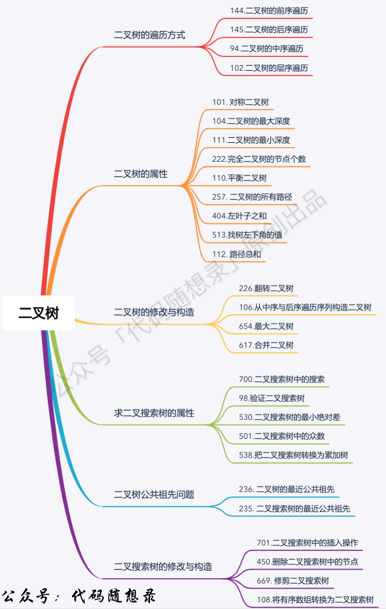

说到二叉树，大家对于二叉树其实都很熟悉了，本文呢我也不想教科书式的把二叉树的基础内容再啰嗦一遍，所以以下我讲的都是一些比较重点的内容。

相信只要耐心看完，都会有所收获。

## 二叉树的种类

在我们解题过程中二叉树有两种主要的形式：满二叉树和完全二叉树。

### 满二叉树

满二叉树：如果一棵二叉树只有度为0的结点和度为2的结点，并且度为0的结点在同一层上，则这棵二叉树为满二叉树。

如图所示：

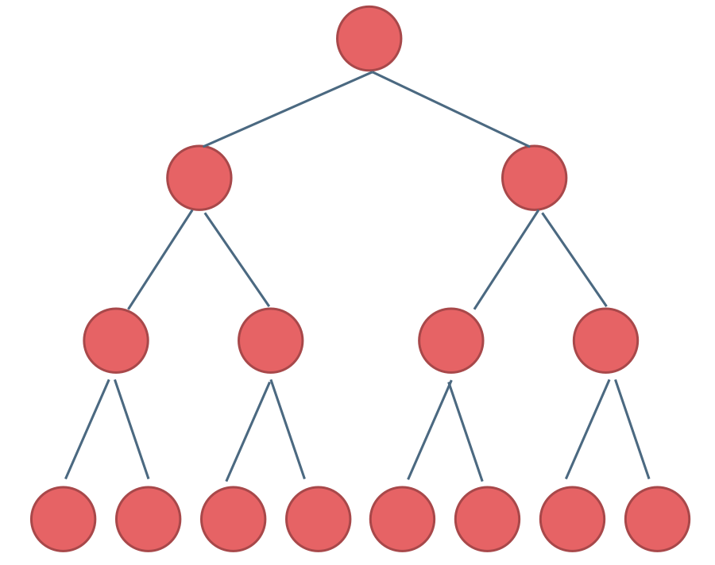

这棵二叉树为满二叉树，也可以说深度为k，有2^k-1个节点的二叉树。

### 完全二叉树

什么是完全二叉树？

完全二叉树的定义如下：在完全二叉树中，除了最底层节点可能没填满外，其余每层节点数都达到最大值，并且最下面一层的节点都集中在该层最左边的若干位置。若最底层为第 h 层（h从1开始），则该层包含 `1~ 2^(h-1)`  个节点。

**大家要自己看完全二叉树的定义，很多同学对完全二叉树其实不是真正的懂了。**

我来举一个典型的例子如题：

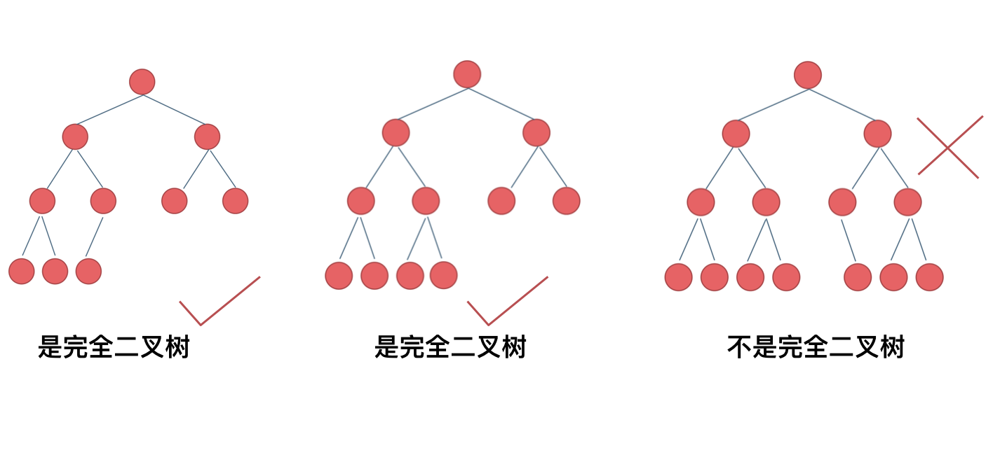

相信不少同学最后一个二叉树是不是完全二叉树都中招了。

**之前我们刚刚讲过优先级队列其实是一个堆，堆就是一棵完全二叉树，同时保证父子节点的顺序关系。**

### 二叉搜索树

前面介绍的树，都没有数值的，而二叉搜索树是有数值的了，**二叉搜索树是一个有序树**。

- 若它的左子树不空，则左子树上所有结点的值均小于它的根结点的值；
- 若它的右子树不空，则右子树上所有结点的值均大于它的根结点的值；
- 它的左、右子树也分别为二叉排序树

下面这两棵树都是搜索树

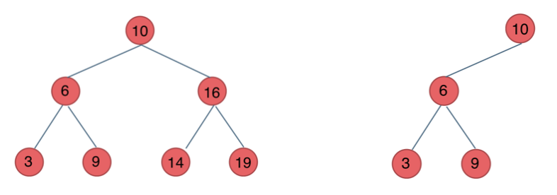

### 平衡二叉搜索树

平衡二叉搜索树：又被称为AVL（Adelson-Velsky and Landis）树，且具有以下性质：它是一棵空树或它的左右两个子树的高度差的绝对值不超过1，并且左右两个子树都是一棵平衡二叉树。

如图：

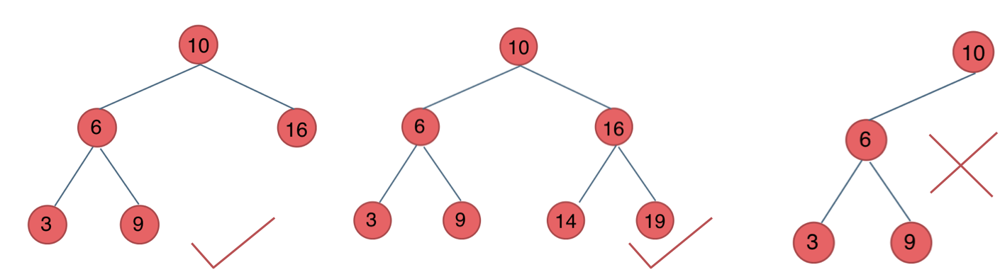

最后一棵 不是平衡二叉树，因为它的左右两个子树的高度差的绝对值超过了1。

**C++中map、set、multimap，multiset的底层实现都是平衡二叉搜索树**，所以map、set的增删操作时间时间复杂度是logn，注意我这里没有说unordered_map、unordered_set，unordered_map、unordered_set底层实现是哈希表。

**所以大家使用自己熟悉的编程语言写算法，一定要知道常用的容器底层都是如何实现的，最基本的就是map、set** **等等，否则自己写的代码，自己对其性能分析都分析不清楚！**

## 二叉树的存储方式

**二叉树可以链式存储，也可以顺序存储。**

那么链式存储方式就用指针， 顺序存储的方式就是用数组。

顾名思义就是顺序存储的元素在内存是连续分布的，而链式存储则是通过指针把分布在各个地址的节点串联一起。

链式存储如图：

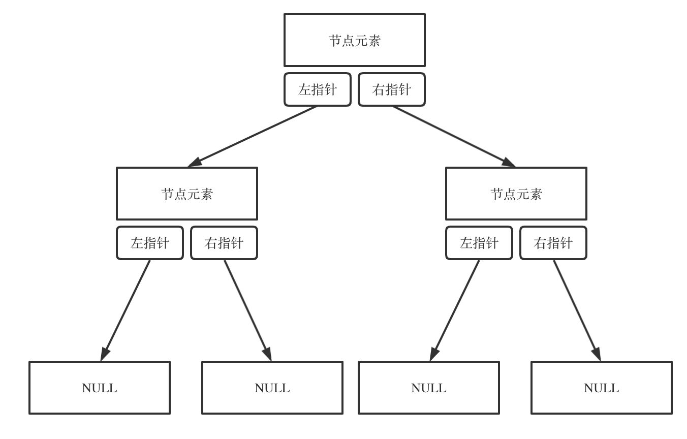

链式存储是大家很熟悉的一种方式，那么我们来看看如何顺序存储呢？

其实就是用数组来存储二叉树，顺序存储的方式如图：

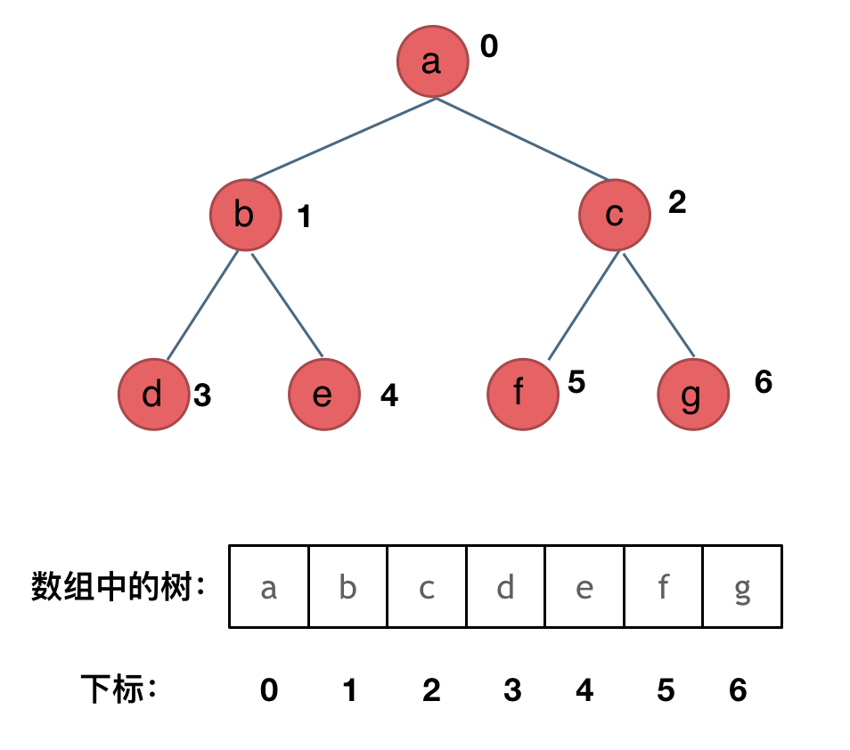

用数组来存储二叉树如何遍历的呢？

**如果父节点的数组下标是 i，那么它的左孩子就是 i \* 2 + 1，右孩子就是 i \* 2 + 2。**

但是用链式表示的二叉树，更有利于我们理解，所以一般我们都是用链式存储二叉树。

**所以大家要了解，用数组依然可以表示二叉树。**

## 二叉树的遍历方式

关于二叉树的遍历方式，要知道二叉树遍历的基本方式都有哪些。

一些同学用做了很多二叉树的题目了，可能知道前中后序遍历，可能知道层序遍历，但是却没有框架。

我这里把二叉树的几种遍历方式列出来，大家就可以一一串起来了。

二叉树主要有两种遍历方式：

1. 深度优先遍历：先往深走，遇到叶子节点再往回走。2. 广度优先遍历：一层一层的去遍历。

**这两种遍历是图论中最基本的两种遍历方式**，后面在介绍图论的时候 还会介绍到。

那么从深度优先遍历和广度优先遍历进一步拓展，才有如下遍历方式：

- 深度优先遍历

前序遍历（递归法，迭代法）

中序遍历（递归法，迭代法）

后序遍历（递归法，迭代法）

- 广度优先遍历

层次遍历（迭代法）

在深度优先遍历中：有三个顺序，前中后序遍历， 有同学总分不清这三个顺序，经常搞混，我这里教大家一个技巧。

**这里前中后，其实指的就是中间节点的遍历顺序**，只要大家记住 前中后序指的就是中间节点的位置就可以了。

看如下中间节点的顺序，就可以发现，中间节点的顺序就是所谓的遍历方式

- 前序遍历：中左右
- 中序遍历：左中右
- 后序遍历：左右中

大家可以对着如下图，看看自己理解的前后中序有没有问题。

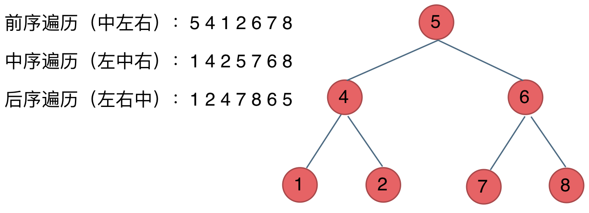

最后再说一说二叉树中深度优先和广度优先遍历实现方式，我们做二叉树相关题目，经常会使用递归的方式来实现深度优先遍历，也就是实现前中后序遍历，使用递归是比较方便的。

**之前我们讲栈与队列的时候，就说过栈其实就是递归的一种实现结构**，也就说前中后序遍历的逻辑其实都是可以借助栈使用非递归的方式来实现的。

而广度优先遍历的实现一般使用队列来实现，这也是队列先进先出的特点所决定的，因为需要先进先出的结构，才能一层一层的来遍历二叉树。

**这里其实我们又了解了栈与队列的一个应用场景了。**

具体的实现我们后面都会讲的，这里大家先要清楚这些理论基础。

## 二叉树的定义

刚刚我们说过了二叉树有两种存储方式顺序存储，和链式存储，顺序存储就是用数组来存，这个定义没啥可说的，我们来看看链式存储的二叉树节点的定义方式。

`C++`代码如下：

```cpp
struct TreeNode {
    int val;
    TreeNode *left;
    TreeNode *right;
    TreeNode(int x) : val(x), left(NULL), right(NULL) {}
};
```

大家会发现二叉树的定义 和链表是差不多的，相对于链表 ，二叉树的节点里多了一个指针， 有两个指针，指向左右孩子。

这里要提醒大家要注意二叉树节点定义的书写方式。

**在现场面试的时候 面试官可能要求手写代码，所以数据结构的定义以及简单逻辑的代码一定要锻炼白纸写出来。**

因为我们在刷leetcode的时候，节点的定义默认都定义好了，真到面试的时候，需要自己写节点定义的时候，有时候会一脸懵逼！

## 总结

二叉树是一种基础数据结构，在算法面试中都是常客，也是众多数据结构的基石。

本篇我们介绍了二叉树的种类、存储方式、遍历方式以及定义，比较全面的介绍了二叉树各个方面的重点，帮助大家扫一遍基础。

**说到二叉树，就不得不说递归，很多同学对递归都是又熟悉又陌生，递归的代码一般很简短，但每次都是一看就** **会，一写就废。**

一看就会，一写就废！

# 2. 二叉树的递归遍历

## 算法公开课

[**《代码随想录》算法视频公开课**](https://programmercarl.com/other/gongkaike.html)**：**[**每次写递归都要靠直觉？ 这次带你学透二叉树的递归遍历！**](https://www.bilibili.com/video/BV1Wh411S7xt)**，相信结合视频再看** **本篇题解，更有助于大家对本题的理解**。

## 思路

这次我们要好好谈一谈递归，为什么很多同学看递归算法都是“一看就会，一写就废”。

主要是对递归不成体系，没有方法论，**每次写递归算法 ，都是靠玄学来写代码**，代码能不能编过都靠运气。

**本篇将介绍前后中序的递归写法，一些同学可能会感觉很简单，其实不然，我们要通过简单题目把方法论确定下** **来，有了方法论，后面才能应付复杂的递归。**

这里帮助大家确定下来递归算法的三个要素。**每次写递归，都按照这三要素来写，可以保证大家写出正确的递归算** **法！** 1. **确定递归函数的参数和返回值：**确定哪些参数是递归的过程中需要处理的，那么就在递归函数里加上这个参数， 并且还要明确每次递归的返回值是什么进而确定递归函数的返回类型。

2. **确定终止条件：**写完了递归算法,  运行的时候，经常会遇到栈溢出的错误，就是没写终止条件或者终止条件写的不对，操作系统也是用一个栈的结构来保存每一层递归的信息，如果递归没有终止，操作系统的内存栈必然就会溢出。

3. **确定单层递归的逻辑：**确定每一层递归需要处理的信息。在这里也就会重复调用自己来实现递归的过程。

好了，我们确认了递归的三要素，接下来就来练练手：

**以下以前序遍历为例：**

1. **确定递归函数的参数和返回值**：因为要打印出前序遍历节点的数值，所以参数里需要传入vector来放节点的数值，除了这一点就不需要再处理什么数据了也不需要有返回值，所以递归函数返回类型就是void，代码如下：

```cpp
void traversal(TreeNode* cur, vector<int>& vec)
```

2. **确定终止条件**：在递归的过程中，如何算是递归结束了呢，当然是当前遍历的节点是空了，那么本层递归就要结束了，所以如果当前遍历的这个节点是空，就直接return，代码如下：

```cpp
if (cur == NULL) return;
```

3. **确定单层递归的逻辑**：前序遍历是中左右的循序，所以在单层递归的逻辑，是要先取中节点的数值，代码如下：

```cpp
vec.push_back(cur->val);    // 中
traversal(cur->left, vec);  // 左
traversal(cur->right, vec); // 右
```

单层递归的逻辑就是按照中左右的顺序来处理的，这样二叉树的前序遍历，基本就写完了，再看一下完整代码：

前序遍历：

```cpp
class Solution {
public:
    void traversal(TreeNode* cur, vector<int>& vec) {
        if (cur == NULL) return;
        vec.push_back(cur->val);    // 中
        traversal(cur->left, vec);  // 左
        traversal(cur->right, vec); // 右
    }
    vector<int> preorderTraversal(TreeNode* root) {
        vector<int> result;
        traversal(root, result);
        return result;
    }
};
```

那么前序遍历写出来之后，中序和后序遍历就不难理解了，代码如下：

中序遍历：

```cpp
void traversal(TreeNode* cur, vector<int>& vec) {
    if (cur == NULL) return;
    traversal(cur->left, vec);  // 左
    vec.push_back(cur->val);    // 中
    traversal(cur->right, vec); // 右
}
```

后序遍历：

```cpp
void traversal(TreeNode* cur, vector<int>& vec) {
    if (cur == NULL) return;
    traversal(cur->left, vec);  // 左
    traversal(cur->right, vec); // 右
    vec.push_back(cur->val);    // 中
}
```

此时大家可以做一做leetcode上三道题目，分别是：

- [144.二叉树的前序遍历](https://leetcode.cn/problems/binary-tree-preorder-traversal/)
- [145.二叉树的后序遍历](https://leetcode.cn/problems/binary-tree-postorder-traversal/)
- [94.二叉树的中序遍历](https://leetcode.cn/problems/binary-tree-inorder-traversal/)

可能有同学感觉前后中序遍历的递归太简单了，要打迭代法（非递归），别急，我们明天打迭代法，打个通透！

听说还可以用非递归的方式

# 3. 二叉树的迭代遍历

## 算法公开课

[《代码随想录》算法视频公开课](https://programmercarl.com/other/gongkaike.html)：

- [**写出二叉树的非递归遍历很难么？（前序和后序）**](https://www.bilibili.com/video/BV15f4y1W7i2) 
- [**写出二叉树的非递归遍历很难么？（中序）)**](https://www.bilibili.com/video/BV1Zf4y1a77g) **相信结合视频在看本篇题解，更有助于大家对本题的理解。**

看完本篇大家可以使用迭代法，再重新解决如下三道leetcode上的题目：

- [144.二叉树的前序遍历](https://leetcode.cn/problems/binary-tree-preorder-traversal/)
- [94.二叉树的中序遍历](https://leetcode.cn/problems/binary-tree-inorder-traversal/)

- [145.二叉树的后序遍历](https://leetcode.cn/problems/binary-tree-postorder-traversal/)

## 思路

为什么可以用迭代法（非递归的方式）来实现二叉树的前后中序遍历呢？

我们在[栈与队列：匹配问题都是栈的强项](https://programmercarl.com/1047.%E5%88%A0%E9%99%A4%E5%AD%97%E7%AC%A6%E4%B8%B2%E4%B8%AD%E7%9A%84%E6%89%80%E6%9C%89%E7%9B%B8%E9%82%BB%E9%87%8D%E5%A4%8D%E9%A1%B9.html)中提到了，**递归的实现就是：每一次递归调用都会把函数的局部变量、参** **数值和返回地址等压入调用栈中**，然后递归返回的时候，从栈顶弹出上一次递归的各项参数，所以这就是递归为什么可以返回上一层位置的原因。

此时大家应该知道我们用栈也可以是实现二叉树的前后中序遍历了。

### 前序遍历（迭代法）

我们先看一下前序遍历。

前序遍历是中左右，每次先处理的是中间节点，那么先将根节点放入栈中，然后将右孩子加入栈，再加入左孩子。

为什么要先加入 右孩子，再加入左孩子呢？ 因为这样出栈的时候才是中左右的顺序。

动画如下：


不难写出如下代码: （**注意代码中空节点不入栈**）

```cpp
class Solution {
public:
    vector<int> preorderTraversal(TreeNode* root) {
        stack<TreeNode*> st;
        vector<int> result;
        if (root == NULL) return result;
        st.push(root);
        while (!st.empty()) {
            TreeNode* node = st.top();                       // 中
            st.pop();
            result.push_back(node->val);
            if (node->right) st.push(node->right);           // 右（空节点不入栈）
            if (node->left) st.push(node->left);             // 左（空节点不入栈）
        }
        return result;
    }
};
```

此时会发现貌似使用迭代法写出前序遍历并不难，确实不难。

**此时是不是想改一点前序遍历代码顺序就把中序遍历搞出来了？**

其实还真不行！

但接下来，**再用迭代法写中序遍历的时候，会发现套路又不一样了，目前的前序遍历的逻辑无法直接应用到中序遍** **历上。**

### 中序遍历（迭代法）

为了解释清楚，我说明一下 刚刚在迭代的过程中，其实我们有两个操作：

1. **处理：将元素放进result数组中** 2. **访问：遍历节点**

分析一下为什么刚刚写的前序遍历的代码，不能和中序遍历通用呢，因为前序遍历的顺序是中左右，先访问的元素是中间节点，要处理的元素也是中间节点，所以刚刚才能写出相对简洁的代码，**因为要访问的元素和要处理的元素** **顺序是一致的，都是中间节点。**

那么再看看中序遍历，中序遍历是左中右，先访问的是二叉树顶部的节点，然后一层一层向下访问，直到到达树左面的最底部，再开始处理节点（也就是在把节点的数值放进result数组中），这就造成了**处理顺序和访问顺序是不** **一致的。**

那么**在使用迭代法写中序遍历，就需要借用指针的遍历来帮助访问节点，栈则用来处理节点上的元素。**

动画如下：

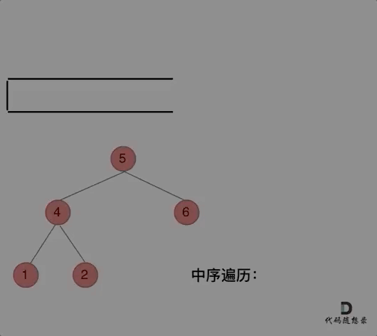

**中序遍历，可以写出如下代码：**

```cpp
class Solution {
public:
    vector<int> inorderTraversal(TreeNode* root) {
        vector<int> result;
        stack<TreeNode*> st;
        TreeNode* cur = root;
        while (cur != NULL || !st.empty()) {
            if (cur != NULL) { // 指针来访问节点，访问到最底层
                st.push(cur); // 将访问的节点放进栈
                cur = cur->left;                // 左
            } else {
                cur = st.top(); // 从栈里弹出的数据，就是要处理的数据（放进result数组里的数据）
                st.pop();
                result.push_back(cur->val);     // 中
                cur = cur->right;               // 右
            }
        }
        return result;
    }
};
```

### 后序遍历（迭代法）

再来看后序遍历，先序遍历是中左右，后续遍历是左右中，那么我们只需要调整一下先序遍历的代码顺序，就变成中右左的遍历顺序，然后在反转result数组，输出的结果顺序就是左右中了，如下图：

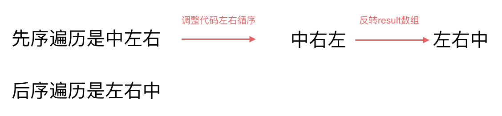

**所以后序遍历只需要前序遍历的代码稍作修改就可以了，代码如下：**

```cpp
class Solution {
public:
    vector<int> postorderTraversal(TreeNode* root) {
        stack<TreeNode*> st;
        vector<int> result;
        if (root == NULL) return result;
        st.push(root);
        while (!st.empty()) {
            TreeNode* node = st.top();
            st.pop();
            result.push_back(node->val);
            if (node->left) st.push(node->left); // 相对于前序遍历，这更改一下入栈顺序 （空节
点不入栈）
            if (node->right) st.push(node->right); // 空节点不入栈
        }
        reverse(result.begin(), result.end()); // 将结果反转之后就是左右中的顺序了
        return result;
    }
};
```

## 总结

此时我们用迭代法写出了二叉树的前后中序遍历，大家可以看出前序和中序是完全两种代码风格，并不像递归写法那样代码稍做调整，就可以实现前后中序。

**这是因为前序遍历中访问节点（遍历节点）和处理节点（将元素放进result数组中）可以同步处理，但是中序就无** **法做到同步！**

上面这句话，可能一些同学不太理解，建议自己亲手用迭代法，先写出来前序，再试试能不能写出中序，就能理解了。

**那么问题又来了，难道 二叉树前后中序遍历的迭代法实现，就不能风格统一么（即前序遍历 改变代码顺序就可以** **实现中序 和 后序）？**当然可以，这种写法，还不是很好理解，我们将在下一篇文章里重点讲解，敬请期待！

统一写法是一种什么感觉

# 4. 二叉树的统一迭代法

## 思路

此时我们在[二叉树：一入递归深似海，从此offer是路人](https://programmercarl.com/%E4%BA%8C%E5%8F%89%E6%A0%91%E7%9A%84%E9%80%92%E5%BD%92%E9%81%8D%E5%8E%86.html)中用递归的方式，实现了二叉树前中后序的遍历。

在[二叉树：听说递归能做的，栈也能做！](https://programmercarl.com/%E4%BA%8C%E5%8F%89%E6%A0%91%E7%9A%84%E8%BF%AD%E4%BB%A3%E9%81%8D%E5%8E%86.html)中用栈实现了二叉树前后中序的迭代遍历（非递归）。

之后我们发现**迭代法实现的先中后序，其实风格也不是那么统一，除了先序和后序，有关联，中序完全就是另一个** **风格了，一会用栈遍历，一会又用指针来遍历。**

实践过的同学，也会发现使用迭代法实现先中后序遍历，很难写出统一的代码，不像是递归法，实现了其中的一种遍历方式，其他两种只要稍稍改一下节点顺序就可以了。

其实**针对三种遍历方式，使用迭代法是可以写出统一风格的代码！**

**重头戏来了，接下来介绍一下统一写法。**

我们以中序遍历为例，在[二叉树：听说递归能做的，栈也能做！](https://programmercarl.com/%E4%BA%8C%E5%8F%89%E6%A0%91%E7%9A%84%E8%BF%AD%E4%BB%A3%E9%81%8D%E5%8E%86.html)中提到说使用栈的话，**无法同时解决访问节点（遍** **历节点）和处理节点（将元素放进结果集）不一致的情况**。

**那我们就将访问的节点放入栈中，把要处理的节点也放入栈中但是要做标记。**

如何标记呢，**就是要处理的节点放入栈之后，紧接着放入一个空指针作为标记。** 这种方法也可以叫做标记法。

### 迭代法中序遍历

中序遍历代码如下：（详细注释）

```cpp
class Solution {
public:
    vector<int> inorderTraversal(TreeNode* root) {
        vector<int> result;
        stack<TreeNode*> st;
        if (root != NULL) st.push(root);
        while (!st.empty()) {
            TreeNode* node = st.top();
            if (node != NULL) {
                st.pop(); // 将该节点弹出，避免重复操作，下面再将右中左节点添加到栈中
                if (node->right) st.push(node->right);  // 添加右节点（空节点不入栈）
                st.push(node);                          // 添加中节点
                st.push(NULL); // 中节点访问过，但是还没有处理，加入空节点做为标记。
                if (node->left) st.push(node->left);    // 添加左节点（空节点不入栈）
            } else { // 只有遇到空节点的时候，才将下一个节点放进结果集
                st.pop();           // 将空节点弹出
                node = st.top();    // 重新取出栈中元素
                st.pop();
                result.push_back(node->val); // 加入到结果集
            }
        }
        return result;
    }
};
```

看代码有点抽象我们来看一下动画`(`中序遍历`)`：

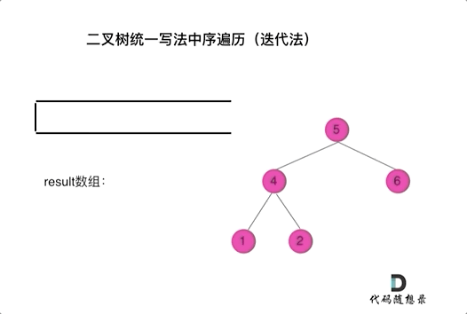

动画中，result数组就是最终结果集。

可以看出我们将访问的节点直接加入到栈中，但如果是处理的节点则后面放入一个空节点， 这样只有空节点弹出的时候，才将下一个节点放进结果集。

此时我们再来看前序遍历代码。

### 迭代法前序遍历

迭代法前序遍历代码如下： `(`**注意此时我们和中序遍历相比仅仅改变了两行代码的顺序**`)`

```cpp
class Solution {
public:
    vector<int> preorderTraversal(TreeNode* root) {
        vector<int> result;
        stack<TreeNode*> st;
        if (root != NULL) st.push(root);
        while (!st.empty()) {
            TreeNode* node = st.top();
            if (node != NULL) {
                st.pop();
                if (node->right) st.push(node->right);  // 右
                if (node->left) st.push(node->left);    // 左
                st.push(node);                          // 中
                st.push(NULL);
            } else {
                st.pop();
                node = st.top();
                st.pop();
                result.push_back(node->val);
            }
        }
        return result;
    }
};
```

### 迭代法后序遍历

后续遍历代码如下： `(`**注意此时我们和中序遍历相比仅仅改变了两行代码的顺序**`)`

```cpp
class Solution {
public:
    vector<int> postorderTraversal(TreeNode* root) {
        vector<int> result;
        stack<TreeNode*> st;
        if (root != NULL) st.push(root);
        while (!st.empty()) {
            TreeNode* node = st.top();
            if (node != NULL) {
                st.pop();
                st.push(node);                          // 中
                st.push(NULL);
                if (node->right) st.push(node->right);  // 右
                if (node->left) st.push(node->left);    // 左
            } else {
                st.pop();
                node = st.top();
                st.pop();
                result.push_back(node->val);
            }
        }
        return result;
    }
};
```

## 总结

此时我们写出了统一风格的迭代法，不用在纠结于前序写出来了，中序写不出来的情况了。

但是统一风格的迭代法并不好理解，而且想在面试直接写出来还有难度的。

所以大家根据自己的个人喜好，对于二叉树的前中后序遍历，选择一种自己容易理解的递归和迭代法。

# 5. 叉树层序遍历登场！

## 算法公开课

[**《代码随想录》算法视频公开课**](https://programmercarl.com/other/gongkaike.html)**：**[**讲透二叉树的层序遍历 | 广度优先搜索 | LeetCode：102.二叉树的层序遍历**](https://www.bilibili.com/video/BV1GY4y1u7b2)**，** **相信结合视频再看本篇题解，更有助于大家对本题的理解**。

学会二叉树的层序遍历，可以一口气打完以下十题：

- [102.二叉树的层序遍历](https://leetcode.cn/problems/binary-tree-level-order-traversal/)
- [107.二叉树的层次遍历II](https://leetcode.cn/problems/binary-tree-level-order-traversal-ii/)
- [199.二叉树的右视图](https://leetcode.cn/problems/binary-tree-right-side-view/)
- [637.二叉树的层平均值](https://leetcode.cn/problems/binary-tree-right-side-view/)
- [429.N叉树的层序遍历](https://leetcode.cn/problems/n-ary-tree-level-order-traversal/)
- [515.在每个树行中找最大值](https://leetcode.cn/problems/find-largest-value-in-each-tree-row/)
- [116.填充每个节点的下一个右侧节点指针](https://leetcode.cn/problems/populating-next-right-pointers-in-each-node/)
- [117.填充每个节点的下一个右侧节点指针II](https://leetcode.cn/problems/populating-next-right-pointers-in-each-node-ii/)
- [104.二叉树的最大深度](https://leetcode.cn/problems/maximum-depth-of-binary-tree/)
- [111.二叉树的最小深度](https://leetcode.cn/problems/minimum-depth-of-binary-tree/)


## 二叉树的层序遍历

[力扣题目链接](https://leetcode.cn/problems/binary-tree-level-order-traversal/)

给你一个二叉树，请你返回其按 层序遍历 得到的节点值。 （即逐层地，从左到右访问所有节点）。

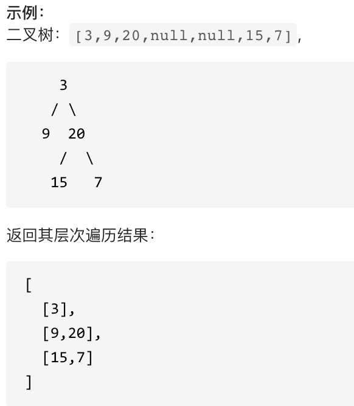

### 思路

我们之前讲过了三篇关于二叉树的深度优先遍历的文章：

- [二叉树：前中后序递归法](https://programmercarl.com/%E4%BA%8C%E5%8F%89%E6%A0%91%E7%9A%84%E9%80%92%E5%BD%92%E9%81%8D%E5%8E%86.html)
- [二叉树：前中后序迭代法](https://programmercarl.com/%E4%BA%8C%E5%8F%89%E6%A0%91%E7%9A%84%E8%BF%AD%E4%BB%A3%E9%81%8D%E5%8E%86.html)
- [二叉树：前中后序迭代方式统一写法](https://programmercarl.com/%E4%BA%8C%E5%8F%89%E6%A0%91%E7%9A%84%E7%BB%9F%E4%B8%80%E8%BF%AD%E4%BB%A3%E6%B3%95.html)

接下来我们再来介绍二叉树的另一种遍历方式：层序遍历。

层序遍历一个二叉树。就是从左到右一层一层的去遍历二叉树。这种遍历的方式和我们之前讲过的都不太一样。

需要借用一个辅助数据结构即队列来实现，**队列先进先出，符合一层一层遍历的逻辑，而用栈先进后出适合模拟深** **度优先遍历也就是递归的逻辑。**

**而这种层序遍历方式就是图论中的广度优先遍历，只不过我们应用在二叉树上。**

使用队列实现二叉树广度优先遍历，动画如下：

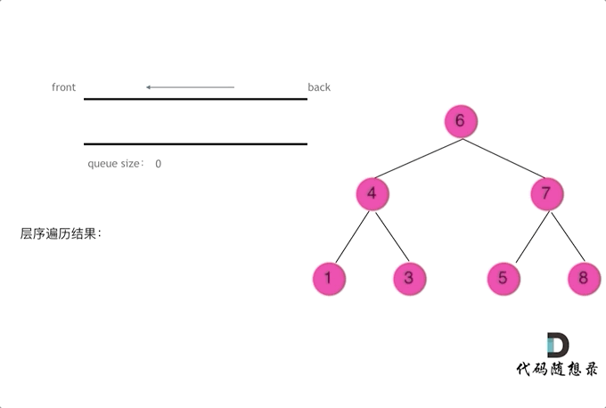

这样就实现了层序从左到右遍历二叉树。

代码如下：**这份代码也可以作为二叉树层序遍历的模板，打十个就靠它了**。

`c++`代码如下：

```cpp
class Solution {
public:
    vector<vector<int>> levelOrder(TreeNode* root) {
        queue<TreeNode*> que;
        if (root != NULL) que.push(root);
        vector<vector<int>> result;
        while (!que.empty()) {
            int size = que.size();
            vector<int> vec;
            // 这里一定要使用固定大小size，不要使用que.size()，因为que.size是不断变化的
            for (int i = 0; i < size; i++) {
                TreeNode* node = que.front();
                que.pop();
                vec.push_back(node->val);
                if (node->left) que.push(node->left);
                if (node->right) que.push(node->right);
            }
            result.push_back(vec);
        }
        return result;
    }
};
# 递归法
class Solution {
public:
    void order(TreeNode* cur, vector<vector<int>>& result, int depth)
    {
        if (cur == nullptr) return;
        if (result.size() == depth) result.push_back(vector<int>());
        result[depth].push_back(cur->val);
        order(cur->left, result, depth + 1);
        order(cur->right, result, depth + 1);
    }
    vector<vector<int>> levelOrder(TreeNode* root) {
        vector<vector<int>> result;
        int depth = 0;
        order(root, result, depth);
        return result;
    }
};
```

**此时我们就掌握了二叉树的层序遍历了，那么如下九道力扣上的题目，只需要修改模板的两三行代码（不能再多** **了），便可打倒！**

## 二叉树的层次遍历 II

[力扣题目链接](https://leetcode.cn/problems/binary-tree-level-order-traversal-ii/)

给定一个二叉树，返回其节点值自底向上的层次遍历。 （即按从叶子节点所在层到根节点所在的层，逐层从左向右遍历）

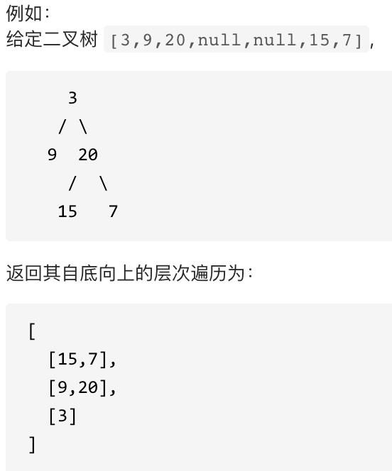

### 思路

相对于102.二叉树的层序遍历，就是最后把result数组反转一下就可以了。

`C++`代码：

```cpp
class Solution {
public:
    vector<vector<int>> levelOrderBottom(TreeNode* root) {
        queue<TreeNode*> que;
        if (root != NULL) que.push(root);
        vector<vector<int>> result;
        while (!que.empty()) {
            int size = que.size();
            vector<int> vec;
            for (int i = 0; i < size; i++) {
                TreeNode* node = que.front();
                que.pop();
                vec.push_back(node->val);
                if (node->left) que.push(node->left);
                if (node->right) que.push(node->right);
            }
            result.push_back(vec);
        }
        reverse(result.begin(), result.end()); // 在这里反转一下数组即可
        return result;
    }
};
```

## 二叉树的右视图

[力扣题目链接](https://leetcode.cn/problems/binary-tree-right-side-view/)

给定一棵二叉树，想象自己站在它的右侧，按照从顶部到底部的顺序，返回从右侧所能看到的节点值。

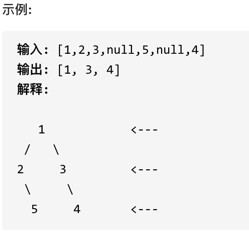

### 思路

层序遍历的时候，判断是否遍历到单层的最后面的元素，如果是，就放进result数组中，随后返回result就可以了。

`C++`代码：

```cpp
class Solution {
public:
    vector<int> rightSideView(TreeNode* root) {
        queue<TreeNode*> que;
        if (root != NULL) que.push(root);
        vector<int> result;
        while (!que.empty()) {
            int size = que.size();
            for (int i = 0; i < size; i++) {
                TreeNode* node = que.front();
                que.pop();
                if (i == (size - 1)) result.push_back(node->val); // 将每一层的最后元素放入
result数组中
                if (node->left) que.push(node->left);
                if (node->right) que.push(node->right);
            }
        }
        return result;
    }
};
```

## 二叉树的层平均值

[力扣题目链接](https://leetcode.cn/problems/average-of-levels-in-binary-tree/)

给定一个非空二叉树, 返回一个由每层节点平均值组成的数组。

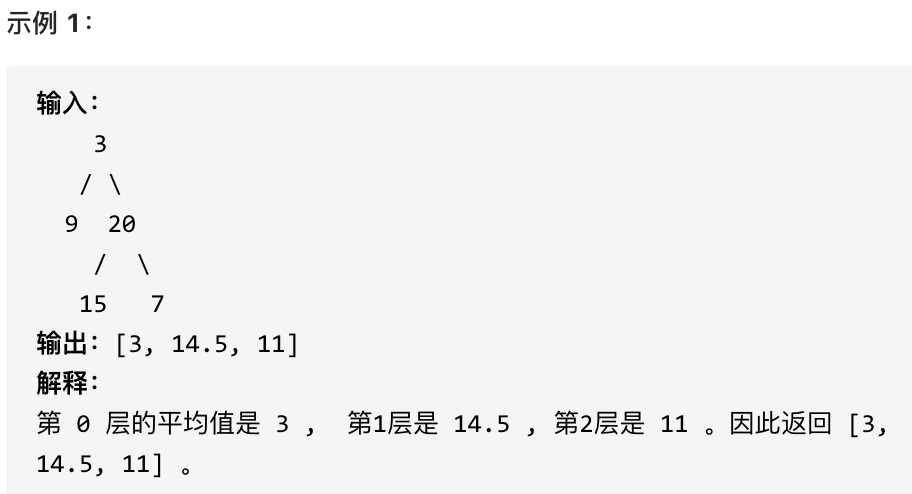

### 思路

本题就是层序遍历的时候把一层求个总和在取一个均值。

`C++`代码:

```cpp
class Solution {
public:
    vector<double> averageOfLevels(TreeNode* root) {
        queue<TreeNode*> que;
        if (root != NULL) que.push(root);
        vector<double> result;
        while (!que.empty()) {
            int size = que.size();
            double sum = 0; // 统计每一层的和
            for (int i = 0; i < size; i++) {
                TreeNode* node = que.front();
                que.pop();
                sum += node->val;
                if (node->left) que.push(node->left);
                if (node->right) que.push(node->right);
            }
            result.push_back(sum / size); // 将每一层均值放进结果集
        }
        return result;
    }
};
```

## N叉树的层序遍历

[力扣题目链接](https://leetcode.cn/problems/n-ary-tree-level-order-traversal/)

给定一个 N 叉树，返回其节点值的层序遍历。 `(`即从左到右，逐层遍历`)`。

例如，给定一个 3叉树 :

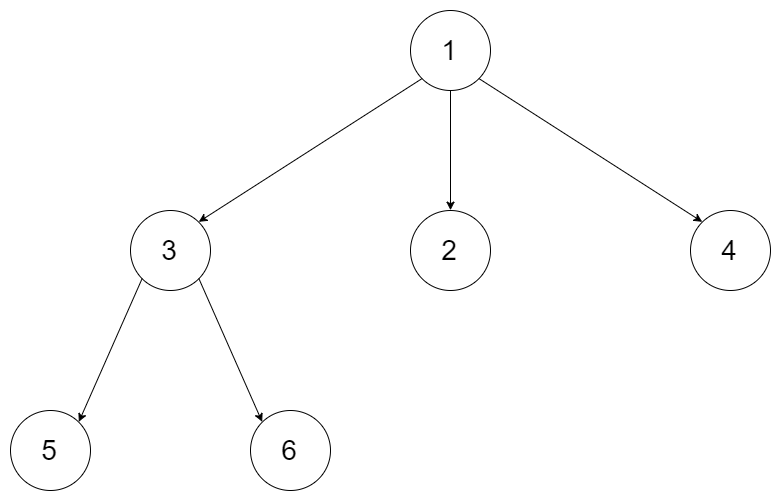

返回其层序遍历:

`[` `[1],` `[3,2,4],` `[5,6]` `]`

### 思路

这道题依旧是模板题，只不过一个节点有多个孩子了

`C++`代码:

```cpp
class Solution {
public:
    vector<vector<int>> levelOrder(Node* root) {
        queue<Node*> que;
        if (root != NULL) que.push(root);
        vector<vector<int>> result;
        while (!que.empty()) {
            int size = que.size();
            vector<int> vec;
            for (int i = 0; i < size; i++) {
                Node* node = que.front();
                que.pop();
                vec.push_back(node->val);
                for (int i = 0; i < node->children.size(); i++) { // 将节点孩子加入队列
                    if (node->children[i]) que.push(node->children[i]);
                }
            }
            result.push_back(vec);
        }
        return result;
    }
};
```

## 在每个树行中找最大值

[力扣题目链接](https://leetcode.cn/problems/find-largest-value-in-each-tree-row/)

您需要在二叉树的每一行中找到最大的值。

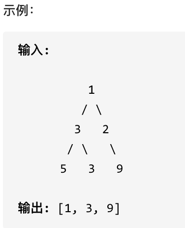

### 思路

层序遍历，取每一层的最大值

`C++`代码：

```cpp
class Solution {
public:
    vector<int> largestValues(TreeNode* root) {
        queue<TreeNode*> que;
        if (root != NULL) que.push(root);
        vector<int> result;
        while (!que.empty()) {
            int size = que.size();
            int maxValue = INT_MIN; // 取每一层的最大值
            for (int i = 0; i < size; i++) {
                TreeNode* node = que.front();
                que.pop();
                maxValue = node->val > maxValue ? node->val : maxValue;
                if (node->left) que.push(node->left);
                if (node->right) que.push(node->right);
            }
            result.push_back(maxValue); // 把最大值放进数组
        }
        return result;
    }
};
```

## 填充每个节点的下一个右侧节点指针

[力扣题目链接](https://leetcode.cn/problems/populating-next-right-pointers-in-each-node/)

给定一个完美二叉树，其所有叶子节点都在同一层，每个父节点都有两个子节点。二叉树定义如下：

```cpp
struct Node {
  int val;
  Node *left;
  Node *right;
  Node *next;
}
```

填充它的每个 next 指针，让这个指针指向其下一个右侧节点。如果找不到下一个右侧节点，则将 next 指针设置为 NULL。

初始状态下，所有 next 指针都被设置为 NULL。

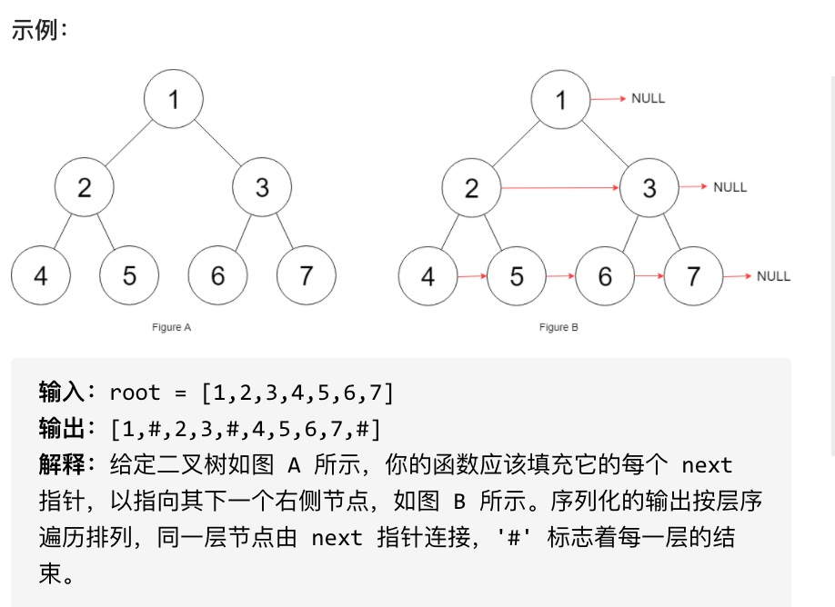

### 思路

本题依然是层序遍历，只不过在单层遍历的时候记录一下本层的头部节点，然后在遍历的时候让前一个节点指向本节点就可以了

`C++`代码：

```cpp
class Solution {
public:
    Node* connect(Node* root) {
        queue<Node*> que;
        if (root != NULL) que.push(root);
        while (!que.empty()) {
            int size = que.size();
            // vector<int> vec;
            Node* nodePre;
            Node* node;
            for (int i = 0; i < size; i++) {
                if (i == 0) {
                    nodePre = que.front(); // 取出一层的头结点
                    que.pop();
                    node = nodePre;
                } else {
                    node = que.front();
                    que.pop();
                    nodePre->next = node; // 本层前一个节点next指向本节点
                    nodePre = nodePre->next;
                }
                if (node->left) que.push(node->left);
                if (node->right) que.push(node->right);
            }
            nodePre->next = NULL; // 本层最后一个节点指向NULL
        }
        return root;
    }
};
```

## 填充每个节点的下一个右侧节点指针II

[力扣题目链接](https://leetcode.cn/problems/populating-next-right-pointers-in-each-node-ii/)

### 思路

这道题目说是二叉树，但116题目说是完整二叉树，其实没有任何差别，一样的代码一样的逻辑一样的味道

`C++`代码：

```cpp
class Solution {
public:
    Node* connect(Node* root) {
        queue<Node*> que;
        if (root != NULL) que.push(root);
        while (!que.empty()) {
            int size = que.size();
            vector<int> vec;
            Node* nodePre;
            Node* node;
            for (int i = 0; i < size; i++) {
                if (i == 0) {
                    nodePre = que.front(); // 取出一层的头结点
                    que.pop();
                    node = nodePre;
                } else {
                    node = que.front();
                    que.pop();
                    nodePre->next = node; // 本层前一个节点next指向本节点
                    nodePre = nodePre->next;
                }
                if (node->left) que.push(node->left);
                if (node->right) que.push(node->right);
            }
            nodePre->next = NULL; // 本层最后一个节点指向NULL
        }
        return root;
    }
};
```

## 二叉树的最大深度

[力扣题目链接](https://leetcode.cn/problems/maximum-depth-of-binary-tree/)

给定一个二叉树，找出其最大深度。

二叉树的深度为根节点到最远叶子节点的最长路径上的节点数。

说明: 叶子节点是指没有子节点的节点。

示例：

给定二叉树 `[3,9,20,null,null,15,7]`，

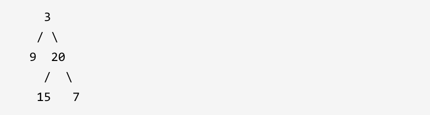

返回它的最大深度 3 。

### 思路

使用迭代法的话，使用层序遍历是最为合适的，因为最大的深度就是二叉树的层数，和层序遍历的方式极其吻合。

在二叉树中，一层一层的来遍历二叉树，记录一下遍历的层数就是二叉树的深度，如图所示：

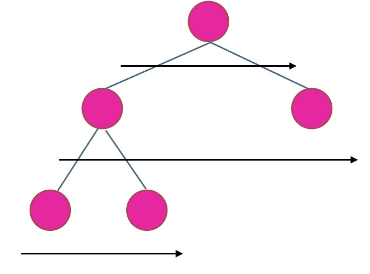

所以这道题的迭代法就是一道模板题，可以使用二叉树层序遍历的模板来解决的。

`C++`代码如下：

```cpp
class Solution {
public:
    int maxDepth(TreeNode* root) {
        if (root == NULL) return 0;
        int depth = 0;
        queue<TreeNode*> que;
        que.push(root);
        while(!que.empty()) {
            int size = que.size();
            depth++; // 记录深度
            for (int i = 0; i < size; i++) {
                TreeNode* node = que.front();
                que.pop();
                if (node->left) que.push(node->left);
                if (node->right) que.push(node->right);
            }
        }
        return depth;
    }
};
```

## 二叉树的最小深度

[力扣题目链接](https://leetcode.cn/problems/minimum-depth-of-binary-tree/)

### 思路

相对于 104.二叉树的最大深度 ，本题还也可以使用层序遍历的方式来解决，思路是一样的。

**需要注意的是，只有当左右孩子都为空的时候，才说明遍历的最低点了。如果其中一个孩子为空则不是最低点**

代码如下：（详细注释）

```cpp
class Solution {
public:
    int minDepth(TreeNode* root) {
        if (root == NULL) return 0;
        int depth = 0;
        queue<TreeNode*> que;
        que.push(root);
        while(!que.empty()) {
            int size = que.size();
            depth++; // 记录最小深度
            for (int i = 0; i < size; i++) {
                TreeNode* node = que.front();
                que.pop();
                if (node->left) que.push(node->left);
                if (node->right) que.push(node->right);
                if (!node->left && !node->right) { // 当左右孩子都为空的时候，说明是最低点的一
层了，退出
                    return depth;
                }
            }
        }
        return depth;
    }
};
```

## 总结

二叉树的层序遍历，**就是图论中的广度优先搜索在二叉树中的应用**，需要借助队列来实现（此时又发现队列的一个应用了）。

来吧，一口气打十个：

- [102.二叉树的层序遍历](https://leetcode.cn/problems/binary-tree-level-order-traversal/)
- [107.二叉树的层次遍历II](https://leetcode.cn/problems/binary-tree-level-order-traversal-ii/)
- [199.二叉树的右视图](https://leetcode.cn/problems/binary-tree-right-side-view/)

- [637.二叉树的层平均值](https://leetcode.cn/problems/binary-tree-right-side-view/)
- [429.N叉树的层序遍历](https://leetcode.cn/problems/n-ary-tree-level-order-traversal/)
- [515.在每个树行中找最大值](https://leetcode.cn/problems/find-largest-value-in-each-tree-row/)
- [116.填充每个节点的下一个右侧节点指针](https://leetcode.cn/problems/populating-next-right-pointers-in-each-node/)
- [117.填充每个节点的下一个右侧节点指针II](https://leetcode.cn/problems/populating-next-right-pointers-in-each-node-ii/)
- [104.二叉树的最大深度](https://leetcode.cn/problems/maximum-depth-of-binary-tree/)
- [111.二叉树的最小深度](https://leetcode.cn/problems/minimum-depth-of-binary-tree/)

# 6.翻转二叉树

[力扣题目链接](https://leetcode.cn/problems/invert-binary-tree/)

翻转一棵二叉树。

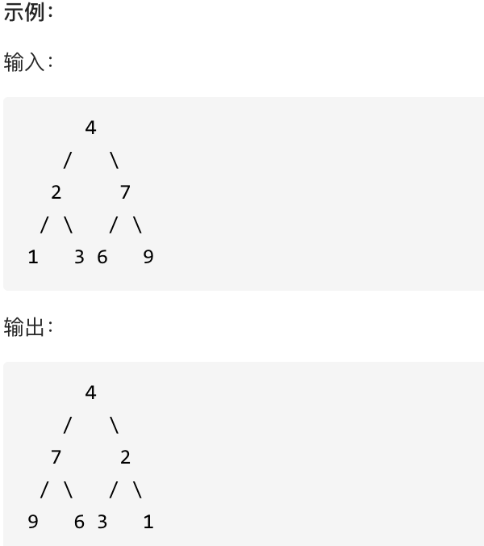

这道题目背后有一个让程序员心酸的故事，听说 Homebrew的作者Max Howell，就是因为没在白板上写出翻转二叉树，最后被Google拒绝了。（真假不做判断，权当一个乐子哈）

## 算法公开课

[**《代码随想录》算法视频公开课**](https://programmercarl.com/other/gongkaike.html)**：听说一位巨佬面Google被拒了，因为没写出翻转二叉树 | LeetCode：226.翻转** **二叉树，相信结合视频再看本篇题解，更有助于大家对本题的理解**。

## 题外话

这道题目是非常经典的题目，也是比较简单的题目（至少一看就会）。

但正是因为这道题太简单，一看就会，一些同学都没有抓住起本质，稀里糊涂的就把这道题目过了。

如果做过这道题的同学也建议认真看完，相信一定有所收获！

## 思路

我们之前介绍的都是各种方式遍历二叉树，这次要翻转了，感觉还是有点懵逼。

这得怎么翻转呢？

如果要从整个树来看，翻转还真的挺复杂，整个树以中间分割线进行翻转，如图：

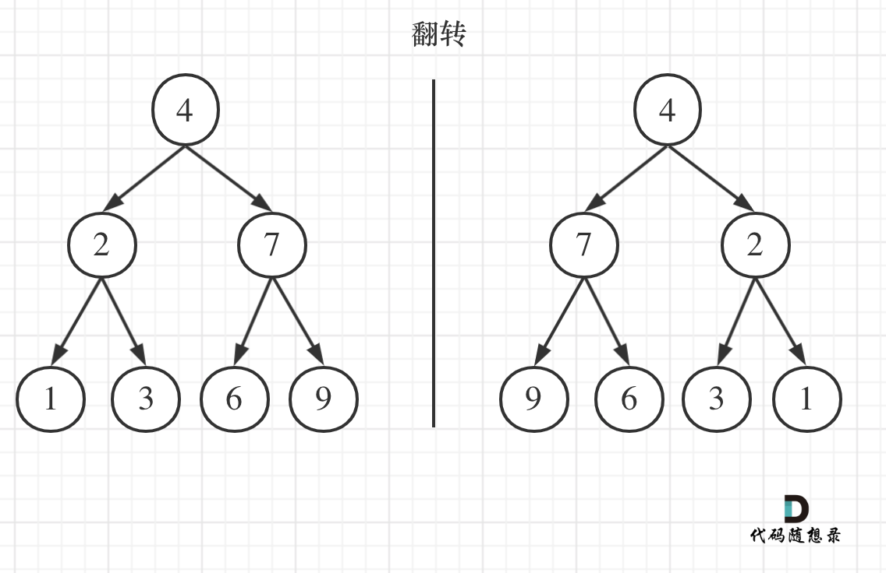

可以发现想要翻转它，其实就把每一个节点的左右孩子交换一下就可以了。

关键在于遍历顺序，前中后序应该选哪一种遍历顺序？ （一些同学这道题都过了，但是不知道自己用的是什么顺序）

遍历的过程中去翻转每一个节点的左右孩子就可以达到整体翻转的效果。

**注意只要把每一个节点的左右孩子翻转一下，就可以达到整体翻转的效果**

**这道题目使用前序遍历和后序遍历都可以，唯独中序遍历不方便，因为中序遍历会把某些节点的左右孩子翻转了两** **次！建议拿纸画一画，就理解了**

那么层序遍历可以不可以呢？**依然可以的！只要把每一个节点的左右孩子翻转一下的遍历方式都是可以的！**

### 递归法

对于二叉树的递归法的前中后序遍历，已经在[二叉树：前中后序递归遍历](https://programmercarl.com/%E4%BA%8C%E5%8F%89%E6%A0%91%E7%9A%84%E9%80%92%E5%BD%92%E9%81%8D%E5%8E%86.html)详细讲解了。

我们下文以前序遍历为例，通过动画来看一下翻转的过程:

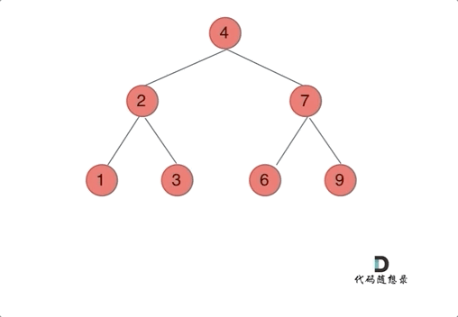

我们来看一下递归三部曲：

1. 确定递归函数的参数和返回值

参数就是要传入节点的指针，不需要其他参数了，通常此时定下来主要参数，如果在写递归的逻辑中发现还需要其他参数的时候，随时补充。

返回值的话其实也不需要，但是题目中给出的要返回root节点的指针，可以直接使用题目定义好的函数，所以就函

```text
数的返回类型为TreeNode* 。
TreeNode* invertTree(TreeNode* root)
```

2. 确定终止条件

当前节点为空的时候，就返回

```cpp
if (root == NULL) return root;
```

3. 确定单层递归的逻辑

因为是先前序遍历，所以先进行交换左右孩子节点，然后反转左子树，反转右子树。

```cpp
swap(root->left, root->right);
invertTree(root->left);
invertTree(root->right);
```

基于这递归三步法，代码基本写完，`C++`代码如下：

```cpp
class Solution {
public:
    TreeNode* invertTree(TreeNode* root) {
        if (root == NULL) return root;
        swap(root->left, root->right);  // 中
        invertTree(root->left);         // 左
        invertTree(root->right);        // 右
        return root;
    }
};
```

### 迭代法

#### 深度优先遍历

[二叉树：听说递归能做的，栈也能做！](https://programmercarl.com/%E4%BA%8C%E5%8F%89%E6%A0%91%E7%9A%84%E8%BF%AD%E4%BB%A3%E9%81%8D%E5%8E%86.html)中给出了前中后序迭代方式的写法，所以本题可以很轻松的写出如下迭代法的代码：

`C++`代码迭代法（前序遍历）

```cpp
class Solution {
public:
    TreeNode* invertTree(TreeNode* root) {
        if (root == NULL) return root;
        stack<TreeNode*> st;
        st.push(root);
        while(!st.empty()) {
            TreeNode* node = st.top();              // 中
            st.pop();
            swap(node->left, node->right);
            if(node->right) st.push(node->right);   // 右
            if(node->left) st.push(node->left);     // 左
        }
        return root;
    }
};
```

如果这个代码看不懂的话可以再回顾一下[二叉树：听说递归能做的，栈也能做！](https://programmercarl.com/%E4%BA%8C%E5%8F%89%E6%A0%91%E7%9A%84%E8%BF%AD%E4%BB%A3%E9%81%8D%E5%8E%86.html)。

我们在[二叉树：前中后序迭代方式的统一写法](https://programmercarl.com/%E4%BA%8C%E5%8F%89%E6%A0%91%E7%9A%84%E7%BB%9F%E4%B8%80%E8%BF%AD%E4%BB%A3%E6%B3%95.html)中介绍了统一的写法，所以，本题也只需将文中的代码少做修改便可。

`C++`代码如下迭代法（前序遍历）

```cpp
class Solution {
public:
    TreeNode* invertTree(TreeNode* root) {
        stack<TreeNode*> st;
        if (root != NULL) st.push(root);
        while (!st.empty()) {
            TreeNode* node = st.top();
            if (node != NULL) {
                st.pop();
                if (node->right) st.push(node->right);  // 右
                if (node->left) st.push(node->left);    // 左
                st.push(node);                          // 中
                st.push(NULL);
            } else {
                st.pop();
                node = st.top();
                st.pop();
                swap(node->left, node->right);          // 节点处理逻辑
            }
        }
        return root;
    }
};
```

如果上面这个代码看不懂，回顾一下文章[二叉树：前中后序迭代方式的统一写法](https://programmercarl.com/%E4%BA%8C%E5%8F%89%E6%A0%91%E7%9A%84%E7%BB%9F%E4%B8%80%E8%BF%AD%E4%BB%A3%E6%B3%95.html)。

#### 广度优先遍历

也就是层序遍历，层数遍历也是可以翻转这棵树的，因为层序遍历也可以把每个节点的左右孩子都翻转一遍，代码如下：

```cpp
class Solution {
public:
    TreeNode* invertTree(TreeNode* root) {
        queue<TreeNode*> que;
        if (root != NULL) que.push(root);
        while (!que.empty()) {
            int size = que.size();
            for (int i = 0; i < size; i++) {
                TreeNode* node = que.front();
                que.pop();
                swap(node->left, node->right); // 节点处理
                if (node->left) que.push(node->left);
                if (node->right) que.push(node->right);
            }
        }
        return root;
    }
};
```

如果对以上代码不理解，或者不清楚二叉树的层序遍历，可以看这篇[二叉树：层序遍历登场！](https://programmercarl.com/0102.%E4%BA%8C%E5%8F%89%E6%A0%91%E7%9A%84%E5%B1%82%E5%BA%8F%E9%81%8D%E5%8E%86.html)

## 拓展

**文中我指的是递归的中序遍历是不行的，因为使用递归的中序遍历，某些节点的左右孩子会翻转两次。**

如果非要使用递归中序的方式写，也可以，如下代码就可以避免节点左右孩子翻转两次的情况：

```cpp
class Solution {
public:
    TreeNode* invertTree(TreeNode* root) {
        if (root == NULL) return root;
        invertTree(root->left);         // 左
        swap(root->left, root->right);  // 中
        invertTree(root->left);         // 注意 这里依然要遍历左孩子，因为中间节点已经翻转了
        return root;
    }
};
```

代码虽然可以，但这毕竟不是真正的递归中序遍历了。

但使用迭代方式统一写法的中序是可以的。

代码如下：

```cpp
class Solution {
public:
    TreeNode* invertTree(TreeNode* root) {
        stack<TreeNode*> st;
        if (root != NULL) st.push(root);
        while (!st.empty()) {
            TreeNode* node = st.top();
            if (node != NULL) {
                st.pop();
                if (node->right) st.push(node->right);  // 右
                st.push(node);                          // 中
                st.push(NULL);
                if (node->left) st.push(node->left);    // 左
            } else {
                st.pop();
                node = st.top();
                st.pop();
                swap(node->left, node->right);          // 节点处理逻辑
            }
        }
        return root;
    }
};
```

为什么这个中序就是可以的呢，因为这是用栈来遍历，而不是靠指针来遍历，避免了递归法中翻转了两次的情况，大家可以画图理解一下，这里有点意思的。

## 总结

针对二叉树的问题，解题之前一定要想清楚究竟是前中后序遍历，还是层序遍历。

**二叉树解题的大忌就是自己稀里糊涂的过了（因为这道题相对简单），但是也不知道自己是怎么遍历的。**

这也是造成了二叉树的题目“一看就会，一写就废”的原因。

**针对翻转二叉树，我给出了一种递归，三种迭代（两种模拟深度优先遍历，一种层序遍历）的写法，都是之前我们** **讲过的写法，融汇贯通一下而已。**

大家一定也有自己的解法，但一定要成方法论，这样才能通用，才能举一反三！

# 7. 本周小结！（二叉树系列一）

**周日我做一个针对本周的打卡留言疑问以及在刷题群里的讨论内容做一下梳理吧。**，这样也有助于大家补一补本周的内容，消化消化。

**注意这个周末总结和系列总结还是不一样的（二叉树还远没有结束），这个总结是针对留言疑问以及刷题群里讨论** **内容的归纳。**

## 周一

本周我们开始讲解了二叉树，在[关于二叉树，你该了解这些！](https://programmercarl.com/%E4%BA%8C%E5%8F%89%E6%A0%91%E7%90%86%E8%AE%BA%E5%9F%BA%E7%A1%80.html)中讲解了二叉树的理论基础。

有同学会把红黑树和二叉平衡搜索树弄分开了，其实红黑树就是一种二叉平衡搜索树，这两个树不是独立的，所以`C++`中map、multimap、set、multiset的底层实现机制是二叉平衡搜索树，再具体一点是红黑树。

对于二叉树节点的定义，`C++`代码如下：

```cpp
struct TreeNode {
    int val;
    TreeNode *left;
    TreeNode *right;
    TreeNode(int x) : val(x), left(NULL), right(NULL) {}
};
对于这个定义中TreeNode(int x) : val(x), left(NULL), right(NULL) {} 有同学不清楚干什么的。
```

这是构造函数，这么说吧C语言中的结构体是`C++`中类的祖先，所以`C++`结构体也可以有构造函数。

构造函数也可以不写，但是new一个新的节点的时候就比较麻烦。

例如有构造函数，定义初始值为9的节点：

```cpp
TreeNode* a = new TreeNode(9);
```

没有构造函数的话就要这么写：

```cpp
TreeNode* a = new TreeNode();
a->val = 9;
a->left = NULL;
a->right = NULL;
```

在介绍前中后序遍历的时候，有递归和迭代（非递归），还有一种牛逼的遍历方式：morris遍历。

morris遍历是二叉树遍历算法的超强进阶算法，morris遍历可以将非递归遍历中的空间复杂度降为`O(1)`，感兴趣大家就去查一查学习学习，比较小众，面试几乎不会考。我其实也没有研究过，就不做过多介绍了。

## 周二

在[二叉树：一入递归深似海，从此offer是路人](https://programmercarl.com/%E4%BA%8C%E5%8F%89%E6%A0%91%E7%9A%84%E9%80%92%E5%BD%92%E9%81%8D%E5%8E%86.html)中讲到了递归三要素，以及前中后序的递归写法。

文章中我给出了leetcode上三道二叉树的前中后序题目，但是看完[二叉树：一入递归深似海，从此offer是路人](https://programmercarl.com/%E4%BA%8C%E5%8F%89%E6%A0%91%E7%9A%84%E9%80%92%E5%BD%92%E9%81%8D%E5%8E%86.html)，依然可以解决n叉树的前后序遍历，在leetcode上分别是

- [589. N叉树的前序遍历](https://leetcode-cn.com/problems/n-ary-tree-preorder-traversal/)
- [590. N叉树的后序遍历](https://leetcode-cn.com/problems/n-ary-tree-postorder-traversal/)

大家可以再去把这两道题目做了。

## 周三

在[二叉树：听说递归能做的，栈也能做！](https://programmercarl.com/%E4%BA%8C%E5%8F%89%E6%A0%91%E7%9A%84%E8%BF%AD%E4%BB%A3%E9%81%8D%E5%8E%86.html)中我们开始用栈来实现递归的写法，也就是所谓的迭代法。

细心的同学发现文中前后序遍历空节点是否入栈写法是不同的

其实空节点入不入栈都差不多，但感觉空节点不入栈确实清晰一些，符合文中动画的演示。

拿前序遍历来举例，空节点入栈：

```cpp
class Solution {
public:
    vector<int> preorderTraversal(TreeNode* root) {
        stack<TreeNode*> st;
        vector<int> result;
        st.push(root);
        while (!st.empty()) {
            TreeNode* node = st.top();                      // 中
            st.pop();
            if (node != NULL) result.push_back(node->val);
            else continue;
            st.push(node->right);                           // 右
            st.push(node->left);                            // 左
        }
        return result;
    }
};
```

前序遍历空节点不入栈的代码：（注意注释部分和上文的区别）

```cpp
class Solution {
public:
    vector<int> preorderTraversal(TreeNode* root) {
        stack<TreeNode*> st;
        vector<int> result;
        if (root == NULL) return result;
        st.push(root);
        while (!st.empty()) {
            TreeNode* node = st.top();                       // 中
            st.pop();
            result.push_back(node->val);
            if (node->right) st.push(node->right);           // 右（空节点不入栈）
            if (node->left) st.push(node->left);             // 左（空节点不入栈）
        }
        return result;
    }
};
```

在实现迭代法的过程中，有同学问了：递归与迭代究竟谁优谁劣呢？

从时间复杂度上其实迭代法和递归法差不多（在不考虑函数调用开销和函数调用产生的堆栈开销），但是空间复杂度上，递归开销会大一些，因为递归需要系统堆栈存参数返回值等等。

递归更容易让程序员理解，但收敛不好，容易栈溢出。

这么说吧，递归是方便了程序员，难为了机器（各种保存参数，各种进栈出栈）。

**在实际项目开发的过程中我们是要尽量避免递归！因为项目代码参数、调用关系都比较复杂，不容易控制递归深** **度，甚至会栈溢出。**

## 周四

在[二叉树：前中后序迭代方式的写法就不能统一一下么？](https://programmercarl.com/%E4%BA%8C%E5%8F%89%E6%A0%91%E7%9A%84%E7%BB%9F%E4%B8%80%E8%BF%AD%E4%BB%A3%E6%B3%95.html)中我们使用空节点作为标记，给出了统一的前中后序迭代法。

此时又多了一种前中后序的迭代写法，那么有同学问了：前中后序迭代法是不是一定要统一来写，这样才算是规范。

其实没必要，还是自己感觉哪一种更好记就用哪种。

但是**一定要掌握前中后序一种迭代的写法，并不因为某种场景的题目一定要用迭代，而是现场面试的时候，面试官** **看你顺畅的写出了递归，一般会进一步考察能不能写出相应的迭代。**

## 周五

在[二叉树：层序遍历登场！](https://programmercarl.com/0102.%E4%BA%8C%E5%8F%89%E6%A0%91%E7%9A%84%E5%B1%82%E5%BA%8F%E9%81%8D%E5%8E%86.html)中我们介绍了二叉树的另一种遍历方式（图论中广度优先搜索在二叉树上的应用）即：层序遍历。

看完这篇文章，去leetcode上怒刷五题，文章中 编号107题目的样例图放错了（原谅我匆忙之间总是手抖），但不影响大家理解。

只有同学发现leetcode上“515. 在每个树行中找最大值”，也是层序遍历的应用，依然可以分分钟解决，所以就是一鼓作气解决六道了，哈哈。

**层序遍历遍历相对容易一些，只要掌握基本写法（也就是框架模板），剩下的就是在二叉树每一行遍历的时候做做** **逻辑修改。**

## 周六

在[二叉树：你真的会翻转二叉树么？](https://programmercarl.com/0226.%E7%BF%BB%E8%BD%AC%E4%BA%8C%E5%8F%89%E6%A0%91.html)中我们把翻转二叉树这么一道简单又经典的问题，充分的剖析了一波，相信就算做过这道题目的同学，看完本篇之后依然有所收获！

**文中我指的是递归的中序遍历是不行的，因为使用递归的中序遍历，某些节点的左右孩子会翻转两次。**

如果非要使用递归中序的方式写，也可以，如下代码就可以避免节点左右孩子翻转两次的情况：

```cpp
class Solution {
public:
    TreeNode* invertTree(TreeNode* root) {
        if (root == NULL) return root;
        invertTree(root->left);         // 左
        swap(root->left, root->right);  // 中
        invertTree(root->left);         // 注意 这里依然要遍历左孩子，因为中间节点已经翻转了
        return root;
    }
};
```

代码虽然可以，但这毕竟不是真正的递归中序遍历了。

但使用迭代方式统一写法的中序是可以的。

代码如下：

```cpp
class Solution {
public:
    TreeNode* invertTree(TreeNode* root) {
        stack<TreeNode*> st;
        if (root != NULL) st.push(root);
        while (!st.empty()) {
            TreeNode* node = st.top();
            if (node != NULL) {
                st.pop();
                if (node->right) st.push(node->right);  // 右
                st.push(node);                          // 中
                st.push(NULL);
                if (node->left) st.push(node->left);    // 左
            } else {
                st.pop();
                node = st.top();
                st.pop();
                swap(node->left, node->right);          // 节点处理逻辑
            }
        }
        return root;
    }
};
```

为什么这个中序就是可以的呢，因为这是用栈来遍历，而不是靠指针来遍历，避免了递归法中翻转了两次的情况，大家可以画图理解一下，这里有点意思的。

## 总结

**本周我们都是讲解了二叉树，从理论基础到遍历方式，从递归到迭代，从深度遍历到广度遍历，最后再用了一个翻** **转二叉树的题目把我们之前讲过的遍历方式都串了起来。**

# 8. 对称二叉树

[力扣题目链接](https://leetcode.cn/problems/symmetric-tree/)

给定一个二叉树，检查它是否是镜像对称的。

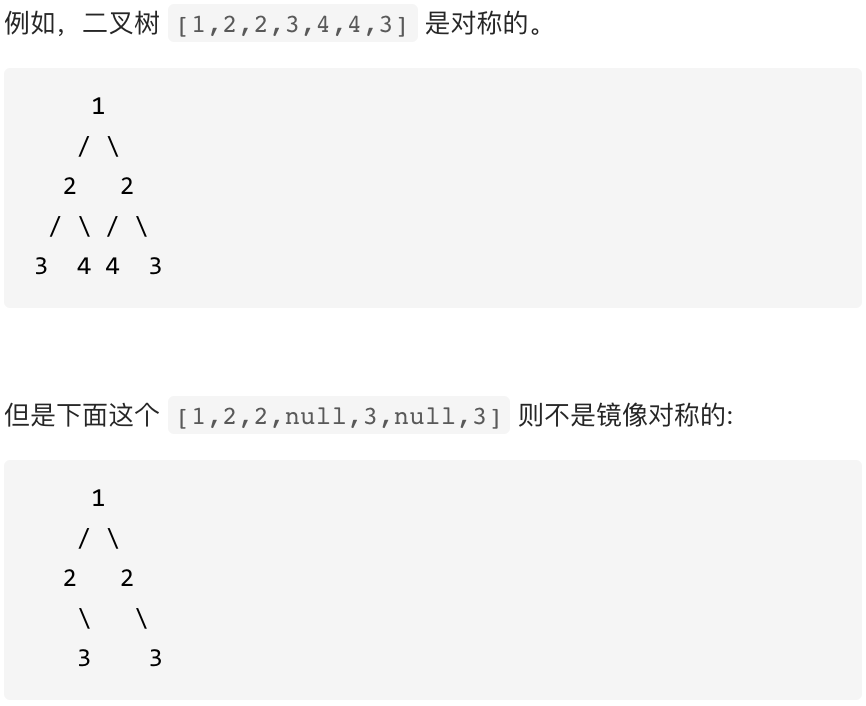

## 算法公开课

[**《代码随想录》算法视频公开课**](https://programmercarl.com/other/gongkaike.html)**：**[**同时操作两个二叉树 | LeetCode：101. 对称二叉树**](https://www.bilibili.com/video/BV1ue4y1Y7Mf)**， 相信结合视频再看本篇题** **解，更有助于大家对本题的理解**。

## 思路

**首先想清楚，判断对称二叉树要比较的是哪两个节点，要比较的可不是左右节点！**

对于二叉树是否对称，要比较的是根节点的左子树与右子树是不是相互翻转的，理解这一点就知道了**其实我们要比** **较的是两个树（这两个树是根节点的左右子树）**，所以在递归遍历的过程中，也是要同时遍历两棵树。

那么如何比较呢？

比较的是两个子树的里侧和外侧的元素是否相等。如图所示：

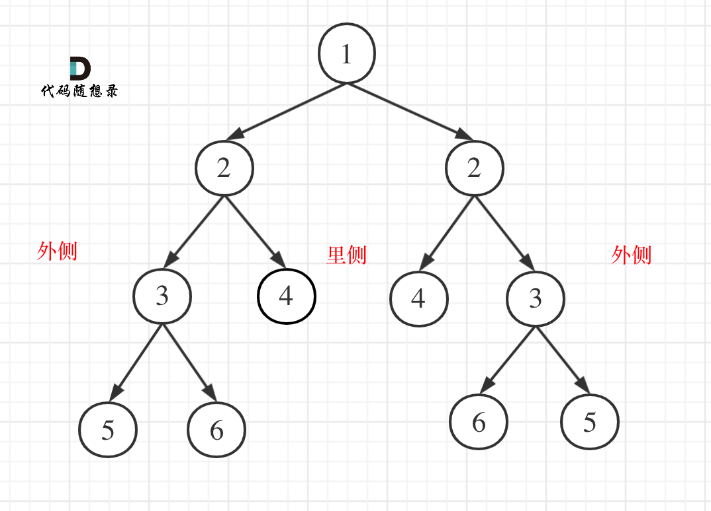

那么遍历的顺序应该是什么样的呢？

本题遍历只能是“后序遍历”，因为我们要通过递归函数的返回值来判断两个子树的内侧节点和外侧节点是否相等。

**正是因为要遍历两棵树而且要比较内侧和外侧节点，所以准确的来说是一个树的遍历顺序是左右中，一个树的遍历** **顺序是右左中。**

但都可以理解算是后序遍历，尽管已经不是严格上在一个树上进行遍历的后序遍历了。

其实后序也可以理解为是一种回溯，当然这是题外话，讲回溯的时候会重点讲的。

说到这大家可能感觉我有点啰嗦，哪有这么多道理，上来就干就完事了。别急，我说的这些在下面的代码讲解中都有身影。

那么我们先来看看递归法的代码应该怎么写。

### 递归法

递归三部曲

1. 确定递归函数的参数和返回值

因为我们要比较的是根节点的两个子树是否是相互翻转的，进而判断这个树是不是对称树，所以要比较的是两个树，参数自然也是左子树节点和右子树节点。

返回值自然是bool类型。

代码如下：

```text
bool compare(TreeNode* left, TreeNode* right)
```

2. 确定终止条件

要比较两个节点数值相不相同，首先要把两个节点为空的情况弄清楚！否则后面比较数值的时候就会操作空指针了。

节点为空的情况有：（**注意我们比较的其实不是左孩子和右孩子，所以如下我称之为左节点右节点**）

- 左节点为空，右节点不为空，不对称，return false
- 左不为空，右为空，不对称 return  false
- 左右都为空，对称，返回true

此时已经排除掉了节点为空的情况，那么剩下的就是左右节点不为空：

- 左右都不为空，比较节点数值，不相同就return false

此时左右节点不为空，且数值也不相同的情况我们也处理了。

代码如下：

```cpp
if (left == NULL && right != NULL) return false;
else if (left != NULL && right == NULL) return false;
else if (left == NULL && right == NULL) return true;
else if (left->val != right->val) return false; // 注意这里我没有使用else
```

注意上面最后一种情况，我没有使用else，而是else if， 因为我们把以上情况都排除之后，剩下的就是 左右节点都不为空，且数值相同的情况。

3. 确定单层递归的逻辑

此时才进入单层递归的逻辑，单层递归的逻辑就是处理 左右节点都不为空，且数值相同的情况。

- 比较二叉树外侧是否对称：传入的是左节点的左孩子，右节点的右孩子。
- 比较内侧是否对称，传入左节点的右孩子，右节点的左孩子。
- 如果左右都对称就返回true ，有一侧不对称就返回false 。

代码如下：

```cpp
bool outside = compare(left->left, right->right);   // 左子树：左、 右子树：右
bool inside = compare(left->right, right->left);    // 左子树：右、 右子树：左
bool isSame = outside && inside;                    // 左子树：中、 右子树：中（逻辑处理）
return isSame;
```

如上代码中，我们可以看出使用的遍历方式，左子树左右中，右子树右左中，所以我把这个遍历顺序也称之为“后序遍历”（尽管不是严格的后序遍历）。

最后递归的`C++`整体代码如下：

```cpp
class Solution {
public:
    bool compare(TreeNode* left, TreeNode* right) {
        // 首先排除空节点的情况
        if (left == NULL && right != NULL) return false;
        else if (left != NULL && right == NULL) return false;
        else if (left == NULL && right == NULL) return true;
        // 排除了空节点，再排除数值不相同的情况
        else if (left->val != right->val) return false;
        // 此时就是：左右节点都不为空，且数值相同的情况
        // 此时才做递归，做下一层的判断
        bool outside = compare(left->left, right->right);   // 左子树：左、 右子树：右
        bool inside = compare(left->right, right->left);    // 左子树：右、 右子树：左
        bool isSame = outside && inside;                    // 左子树：中、 右子树：中 （逻
辑处理）
        return isSame;
    }
    bool isSymmetric(TreeNode* root) {
        if (root == NULL) return true;
        return compare(root->left, root->right);
    }
};
```

**我给出的代码并不简洁，但是把每一步判断的逻辑都清楚的描绘出来了。**

如果上来就看网上各种简洁的代码，看起来真的很简单，但是很多逻辑都掩盖掉了，而题解可能也没有把掩盖掉的逻辑说清楚。

**盲目的照着抄，结果就是：发现这是一道“简单题”，稀里糊涂的就过了，但是真正的每一步判断逻辑未必想到清** **楚。**

当然我可以把如上代码整理如下：

```cpp
class Solution {
public:
    bool compare(TreeNode* left, TreeNode* right) {
        if (left == NULL && right != NULL) return false;
        else if (left != NULL && right == NULL) return false;
        else if (left == NULL && right == NULL) return true;
        else if (left->val != right->val) return false;
        else return compare(left->left, right->right) && compare(left->right, right-
>left);
    }
    bool isSymmetric(TreeNode* root) {
        if (root == NULL) return true;
        return compare(root->left, root->right);
    }
};
```

**这个代码就很简洁了，但隐藏了很多逻辑，条理不清晰，而且递归三部曲，在这里完全体现不出来。**

**所以建议大家做题的时候，一定要想清楚逻辑，每一步做什么。把题目所有情况想到位，相应的代码写出来之后，** **再去追求简洁代码的效果。**

### 迭代法

这道题目我们也可以使用迭代法，但要注意，这里的迭代法可不是前中后序的迭代写法，因为本题的本质是判断两个树是否是相互翻转的，其实已经不是所谓二叉树遍历的前中后序的关系了。

这里我们可以使用队列来比较两个树（根节点的左右子树）是否相互翻转，（**注意这不是层序遍历**）

#### 使用队列

通过队列来判断根节点的左子树和右子树的内侧和外侧是否相等，如动画所示：

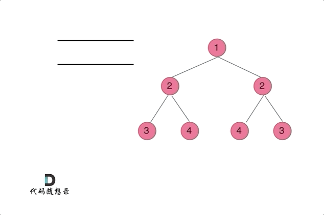

如下的条件判断和递归的逻辑是一样的。

代码如下：

```cpp
class Solution {
public:
    bool isSymmetric(TreeNode* root) {
        if (root == NULL) return true;
        queue<TreeNode*> que;
        que.push(root->left);   // 将左子树头结点加入队列
        que.push(root->right);  // 将右子树头结点加入队列
        while (!que.empty()) {  // 接下来就要判断这两个树是否相互翻转
            TreeNode* leftNode = que.front(); que.pop();
            TreeNode* rightNode = que.front(); que.pop();
            if (!leftNode && !rightNode) {  // 左节点为空、右节点为空，此时说明是对称的
                continue;
            }
            // 左右一个节点不为空，或者都不为空但数值不相同，返回false
            if ((!leftNode || !rightNode || (leftNode->val != rightNode->val))) {
                return false;
            }
            que.push(leftNode->left);   // 加入左节点左孩子
            que.push(rightNode->right); // 加入右节点右孩子
            que.push(leftNode->right);  // 加入左节点右孩子
            que.push(rightNode->left);  // 加入右节点左孩子
        }
        return true;
    }
};
```

#### 使用栈

细心的话，其实可以发现，这个迭代法，其实是把左右两个子树要比较的元素顺序放进一个容器，然后成对成对的取出来进行比较，那么其实使用栈也是可以的。

只要把队列原封不动的改成栈就可以了，我下面也给出了代码。

```cpp
class Solution {
public:
    bool isSymmetric(TreeNode* root) {
        if (root == NULL) return true;
        stack<TreeNode*> st; // 这里改成了栈
        st.push(root->left);
        st.push(root->right);
        while (!st.empty()) {
            TreeNode* leftNode = st.top(); st.pop();
            TreeNode* rightNode = st.top(); st.pop();
            if (!leftNode && !rightNode) {
                continue;
            }
            if ((!leftNode || !rightNode || (leftNode->val != rightNode->val))) {
                return false;
            }
            st.push(leftNode->left);
            st.push(rightNode->right);
            st.push(leftNode->right);
            st.push(rightNode->left);
        }
        return true;
    }
};
```

## 总结

这次我们又深度剖析了一道二叉树的“简单题”，大家会发现，真正的把题目搞清楚其实并不简单，leetcode上accept了和真正掌握了还是有距离的。

我们介绍了递归法和迭代法，递归依然通过递归三部曲来解决了这道题目，如果只看精简的代码根本看不出来递归三部曲是如何解题的。

在迭代法中我们使用了队列，需要注意的是这不是层序遍历，而且仅仅通过一个容器来成对的存放我们要比较的元素，知道这一本质之后就发现，用队列，用栈，甚至用数组，都是可以的。

如果已经做过这道题目的同学，读完文章可以再去看看这道题目，思考一下，会有不一样的发现！

## 相关题目推荐

这两道题目基本和本题是一样的，只要稍加修改就可以AC。

- [100.相同的树](https://leetcode.cn/problems/same-tree/)
- [572.另一个树的子树](https://leetcode.cn/problems/subtree-of-another-tree/)

# 9.二叉树的最大深度

[力扣题目链接](https://leetcode.cn/problems/maximum-depth-of-binary-tree/)

给定一个二叉树，找出其最大深度。

二叉树的深度为根节点到最远叶子节点的最长路径上的节点数。

说明: 叶子节点是指没有子节点的节点。

示例：给定二叉树 `[3,9,20,null,null,15,7]`，


返回它的最大深度 3 。

## 算法公开课

[**《代码随想录》算法视频公开课**](https://programmercarl.com/other/gongkaike.html)**：二叉树的高度和深度有啥区别？究竟用什么遍历顺序？很多录友搞不懂 | 104.二** **叉树的最大深度，相信结合视频再看本篇题解，更有助于大家对本题的理解**。

## 思路

看完本篇可以一起做了如下两道题目：

- [104.二叉树的最大深度](https://leetcode.cn/problems/maximum-depth-of-binary-tree/)
- [559.n叉树的最大深度](https://leetcode.cn/problems/maximum-depth-of-n-ary-tree/)

### 递归法

本题可以使用前序（中左右），也可以使用后序遍历（左右中），使用前序求的就是深度，使用后序求的是高度。

- 二叉树节点的深度：指从根节点到该节点的最长简单路径边的条数或者节点数（取决于深度从0开始还是从1开始）
- 二叉树节点的高度：指从该节点到叶子节点的最长简单路径边的条数或者节点数（取决于高度从0开始还是从1开始）

**而根节点的高度就是二叉树的最大深度**，所以本题中我们通过后序求的根节点高度来求的二叉树最大深度。

这一点其实是很多同学没有想清楚的，很多题解同样没有讲清楚。

我先用后序遍历（左右中）来计算树的高度。

1. 确定递归函数的参数和返回值：参数就是传入树的根节点，返回就返回这棵树的深度，所以返回值为int类型。

代码如下：

```cpp
int getdepth(TreeNode* node)
```

2. 确定终止条件：如果为空节点的话，就返回0，表示高度为0。

代码如下：

```cpp
if (node == NULL) return 0;
```

3. 确定单层递归的逻辑：先求它的左子树的深度，再求右子树的深度，最后取左右深度最大的数值 再+1 （加1是因为算上当前中间节点）就是目前节点为根节点的树的深度。

代码如下：

```cpp
int leftdepth = getdepth(node->left);       // 左
int rightdepth = getdepth(node->right);     // 右
int depth = 1 + max(leftdepth, rightdepth); // 中
return depth;
```

所以整体`c++`代码如下：

```cpp
class solution {
public:
    int getdepth(TreeNode* node) {
        if (node == NULL) return 0;
        int leftdepth = getdepth(node->left);       // 左
        int rightdepth = getdepth(node->right);     // 右
        int depth = 1 + max(leftdepth, rightdepth); // 中
        return depth;
    }
    int maxDepth(TreeNode* root) {
        return getdepth(root);
    }
};
```

代码精简之后`c++`代码如下：

```cpp
class solution {
public:
    int maxDepth(TreeNode* root) {
        if (root == null) return 0;
        return 1 + max(maxDepth(root->left), maxDepth(root->right));
    }
};
```

**精简之后的代码根本看不出是哪种遍历方式，也看不出递归三部曲的步骤，所以如果对二叉树的操作还不熟练，尽** **量不要直接照着精简代码来学。**

本题当然也可以使用前序，代码如下：`(`**充分表现出求深度回溯的过程**`)`

```cpp
class solution {
public:
    int result;
    void getdepth(TreeNode* node, int depth) {
        result = depth > result ? depth : result; // 中
        if (node->left == NULL && node->right == NULL) return ;
        if (node->left) { // 左
            depth++;    // 深度+1
            getdepth(node->left, depth);
            depth--;    // 回溯，深度-1
        }
        if (node->right) { // 右
            depth++;    // 深度+1
            getdepth(node->right, depth);
            depth--;    // 回溯，深度-1
        }
        return ;
    }
    int maxDepth(TreeNode* root) {
        result = 0;
        if (root == NULL) return result;
        getdepth(root, 1);
        return result;
    }
};
```

**可以看出使用了前序（中左右）的遍历顺序，这才是真正求深度的逻辑！**

注意以上代码是为了把细节体现出来，简化一下代码如下：

```cpp
class solution {
public:
    int result;
    void getdepth(TreeNode* node, int depth) {
        result = depth > result ? depth : result; // 中
        if (node->left == NULL && node->right == NULL) return ;
        if (node->left) { // 左
            getdepth(node->left, depth + 1);
        }
        if (node->right) { // 右
            getdepth(node->right, depth + 1);
        }
        return ;
    }
    int maxDepth(TreeNode* root) {
        result = 0;
        if (root == 0) return result;
        getdepth(root, 1);
        return result;
    }
};
```

### 迭代法

使用迭代法的话，使用层序遍历是最为合适的，因为最大的深度就是二叉树的层数，和层序遍历的方式极其吻合。

在二叉树中，一层一层的来遍历二叉树，记录一下遍历的层数就是二叉树的深度，如图所示：


所以这道题的迭代法就是一道模板题，可以使用二叉树层序遍历的模板来解决的。

如果对层序遍历还不清楚的话，可以看这篇：[二叉树：层序遍历登场！](https://programmercarl.com/0102.%E4%BA%8C%E5%8F%89%E6%A0%91%E7%9A%84%E5%B1%82%E5%BA%8F%E9%81%8D%E5%8E%86.html)

`c++`代码如下：

```cpp
class solution {
public:
    int maxDepth(TreeNode* root) {
        if (root == NULL) return 0;
        int depth = 0;
        queue<TreeNode*> que;
        que.push(root);
        while(!que.empty()) {
            int size = que.size();
            depth++; // 记录深度
            for (int i = 0; i < size; i++) {
                TreeNode* node = que.front();
                que.pop();
                if (node->left) que.push(node->left);
                if (node->right) que.push(node->right);
            }
        }
        return depth;
    }
};
```

那么我们可以顺便解决一下n叉树的最大深度问题

## 相关题目推荐

### n叉树的最大深度

[力扣题目链接](https://leetcode.cn/problems/maximum-depth-of-n-ary-tree/)

给定一个 n 叉树，找到其最大深度。

最大深度是指从根节点到最远叶子节点的最长路径上的节点总数。

例如，给定一个 3叉树 :


我们应返回其最大深度，3。

### 思路

依然可以提供递归法和迭代法，来解决这个问题，思路是和二叉树思路一样的，直接给出代码如下：

#### 递归法

`c++`代码：

```cpp
class solution {
public:
    int maxDepth(Node* root) {
        if (root == 0) return 0;
        int depth = 0;
        for (int i = 0; i < root->children.size(); i++) {
            depth = max (depth, maxDepth(root->children[i]));
        }
        return depth + 1;
    }
};
```

#### 迭代法

依然是层序遍历，代码如下：

```cpp
class solution {
public:
    int maxDepth(Node* root) {
        queue<Node*> que;
        if (root != NULL) que.push(root);
        int depth = 0;
        while (!que.empty()) {
            int size = que.size();
            depth++; // 记录深度
            for (int i = 0; i < size; i++) {
                Node* node = que.front();
                que.pop();
                for (int j = 0; j < node->children.size(); j++) {
                    if (node->children[j]) que.push(node->children[j]);
                }
            }
        }
        return depth;
    }
};
```

和求最大深度一个套路？

# 10.二叉树的最小深度

[力扣题目链接](https://leetcode.cn/problems/minimum-depth-of-binary-tree/)

给定一个二叉树，找出其最小深度。

最小深度是从根节点到最近叶子节点的最短路径上的节点数量。

说明: 叶子节点是指没有子节点的节点。

示例:

给定二叉树 `[3,9,20,null,null,15,7],`


返回它的最小深度  2.

## 算法公开课

[**《代码随想录》算法视频公开课**](https://programmercarl.com/other/gongkaike.html)**：**[**看起来好像做过，一写就错！ | LeetCode：111.二叉树的最小深度**](https://www.bilibili.com/video/BV1QD4y1B7e2)**，相信结合** **视频再看本篇题解，更有助于大家对本题的理解**。

## 思路

看完了这篇[104.二叉树的最大深度](https://programmercarl.com/0104.%E4%BA%8C%E5%8F%89%E6%A0%91%E7%9A%84%E6%9C%80%E5%A4%A7%E6%B7%B1%E5%BA%A6.html)，再来看看如何求最小深度。

直觉上好像和求最大深度差不多，其实还是差不少的。

本题依然是前序遍历和后序遍历都可以，前序求的是深度，后序求的是高度。

- 二叉树节点的深度：指从根节点到该节点的最长简单路径边的条数或者节点数（取决于深度从0开始还是从1开始）
- 二叉树节点的高度：指从该节点到叶子节点的最长简单路径边的条数后者节点数（取决于高度从0开始还是从1开始）

那么使用后序遍历，其实求的是根节点到叶子节点的最小距离，就是求高度的过程，不过这个最小距离 也同样是最小深度。

以下讲解中遍历顺序上依然采用后序遍历（因为要比较递归返回之后的结果，本文我也给出前序遍历的写法）。

本题还有一个误区，在处理节点的过程中，最大深度很容易理解，最小深度就不那么好理解，如图：

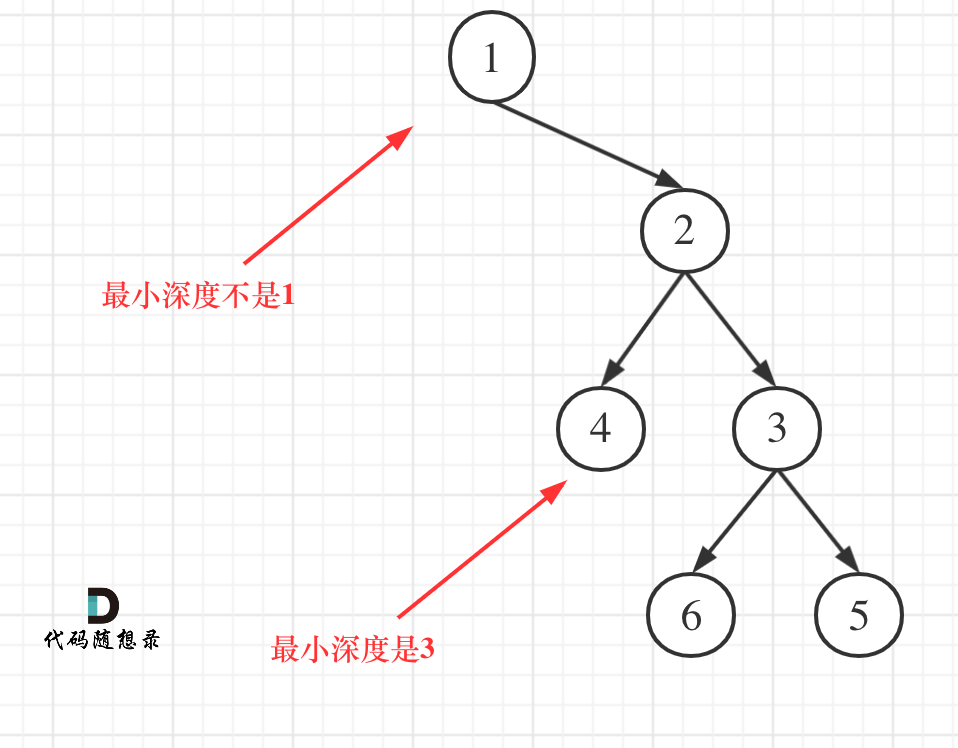

这就重新审题了，题目中说的是：**最小深度是从根节点到最近叶子节点的最短路径上的节点数量。**，注意是**叶子节** **点**。

什么是叶子节点，左右孩子都为空的节点才是叶子节点！

### 递归法

来来来，一起递归三部曲：

1. 确定递归函数的参数和返回值

参数为要传入的二叉树根节点，返回的是int类型的深度。

代码如下：

```cpp
int getDepth(TreeNode* node)
```

2. 确定终止条件

终止条件也是遇到空节点返回0，表示当前节点的高度为0。

代码如下：

```cpp
if (node == NULL) return 0;
```

3. 确定单层递归的逻辑

这块和求最大深度可就不一样了，一些同学可能会写如下代码：

```cpp
int leftDepth = getDepth(node->left);
int rightDepth = getDepth(node->right);
int result = 1 + min(leftDepth, rightDepth);
return result;
```

这个代码就犯了此图中的误区：


如果这么求的话，没有左孩子的分支会算为最短深度。

所以，如果左子树为空，右子树不为空，说明最小深度是 1 + 右子树的深度。

反之，右子树为空，左子树不为空，最小深度是 1 + 左子树的深度。 最后如果左右子树都不为空，返回左右子树深度最小值 + 1 。

代码如下：

```cpp
int leftDepth = getDepth(node->left);           // 左
int rightDepth = getDepth(node->right);         // 右
                                                // 中
// 当一个左子树为空，右不为空，这时并不是最低点
if (node->left == NULL && node->right != NULL) {
    return 1 + rightDepth;
}
// 当一个右子树为空，左不为空，这时并不是最低点
if (node->left != NULL && node->right == NULL) {
    return 1 + leftDepth;
}
int result = 1 + min(leftDepth, rightDepth);
return result;
```

遍历的顺序为后序（左右中），可以看出：**求二叉树的最小深度和求二叉树的最大深度的差别主要在于处理左右孩** **子不为空的逻辑。**

整体递归代码如下：

```cpp
class Solution {
public:
    int getDepth(TreeNode* node) {
        if (node == NULL) return 0;
        int leftDepth = getDepth(node->left);           // 左
        int rightDepth = getDepth(node->right);         // 右
                                                        // 中
        // 当一个左子树为空，右不为空，这时并不是最低点
        if (node->left == NULL && node->right != NULL) {
            return 1 + rightDepth;
        }
        // 当一个右子树为空，左不为空，这时并不是最低点
        if (node->left != NULL && node->right == NULL) {
            return 1 + leftDepth;
        }
        int result = 1 + min(leftDepth, rightDepth);
        return result;
    }
    int minDepth(TreeNode* root) {
        return getDepth(root);
    }
};
```

精简之后代码如下：

```cpp
class Solution {
public:
    int minDepth(TreeNode* root) {
        if (root == NULL) return 0;
        if (root->left == NULL && root->right != NULL) {
            return 1 + minDepth(root->right);
        }
        if (root->left != NULL && root->right == NULL) {
            return 1 + minDepth(root->left);
        }
        return 1 + min(minDepth(root->left), minDepth(root->right));
    }
};
```

**精简之后的代码根本看不出是哪种遍历方式，所以依然还要强调一波：如果对二叉树的操作还不熟练，尽量不要直** **接照着精简代码来学。**

前序遍历的方式：

```cpp
class Solution {
private:
    int result;
    void getdepth(TreeNode* node, int depth) {
        // 函数递归终止条件
        if (root == nullptr) {
            return;
        }
        // 中，处理逻辑：判断是不是叶子结点
        if (root -> left == nullptr && root->right == nullptr) {
            res = min(res, depth);
        }
        if (node->left) { // 左
            getdepth(node->left, depth + 1);
        }
        if (node->right) { // 右
            getdepth(node->right, depth + 1);
        }
        return ;
    }
public:
    int minDepth(TreeNode* root) {
        if (root == nullptr) {
            return 0;
        }
        result = INT_MAX;
        getdepth(root, 1);
        return result;
    }
};
```

### 迭代法

相对于[104.二叉树的最大深度](https://programmercarl.com/0104.%E4%BA%8C%E5%8F%89%E6%A0%91%E7%9A%84%E6%9C%80%E5%A4%A7%E6%B7%B1%E5%BA%A6.html)，本题还可以使用层序遍历的方式来解决，思路是一样的。

如果对层序遍历还不清楚的话，可以看这篇：[二叉树：层序遍历登场！](https://programmercarl.com/0102.%E4%BA%8C%E5%8F%89%E6%A0%91%E7%9A%84%E5%B1%82%E5%BA%8F%E9%81%8D%E5%8E%86.html)

**需要注意的是，只有当左右孩子都为空的时候，才说明遍历到最低点了。如果其中一个孩子不为空则不是最低点**

代码如下：（详细注释）

```cpp
class Solution {
public:
    int minDepth(TreeNode* root) {
        if (root == NULL) return 0;
        int depth = 0;
        queue<TreeNode*> que;
        que.push(root);
        while(!que.empty()) {
            int size = que.size();
            depth++; // 记录最小深度
            for (int i = 0; i < size; i++) {
                TreeNode* node = que.front();
                que.pop();
                if (node->left) que.push(node->left);
                if (node->right) que.push(node->right);
                if (!node->left && !node->right) { // 当左右孩子都为空的时候，说明是最低点的一
层了，退出
                    return depth;
                }
            }
        }
        return depth;
    }
};
```

# 11.完全二叉树的节点个数

[力扣题目链接](https://leetcode.cn/problems/count-complete-tree-nodes/)

给出一个完全二叉树，求出该树的节点个数。

示例 1：

- 输入：`root = [1,2,3,4,5,6]`
- 输出：6

示例 2：

- 输入：`root = []`
- 输出：0

示例 3：

- 输入：`root = [1]`
- 输出：1

提示：

- 树中节点的数目范围是`[0, 5 * 10^4]`
- `0 <= Node.val <= 5 * 10^4`
- 题目数据保证输入的树是 完全二叉树

## 算法公开课

[**《代码随想录》算法视频公开课**](https://programmercarl.com/other/gongkaike.html)**：要理解普通二叉树和完全二叉树的区别！ | LeetCode：222.完全二叉树节点的** **数量，相信结合视频再看本篇题解，更有助于大家对本题的理解**。

## 思路

本篇给出按照普通二叉树的求法以及利用完全二叉树性质的求法。

### 普通二叉树

首先按照普通二叉树的逻辑来求。

这道题目的递归法和求二叉树的深度写法类似， 而迭代法，[二叉树：层序遍历登场！](https://programmercarl.com/0102.%E4%BA%8C%E5%8F%89%E6%A0%91%E7%9A%84%E5%B1%82%E5%BA%8F%E9%81%8D%E5%8E%86.html)遍历模板稍稍修改一下，记录遍历的节点数量就可以了。

递归遍历的顺序依然是后序（左右中）。

#### 递归

如果对求二叉树深度还不熟悉的话，看这篇：[二叉树：看看这些树的最大深度](https://programmercarl.com/0104.%E4%BA%8C%E5%8F%89%E6%A0%91%E7%9A%84%E6%9C%80%E5%A4%A7%E6%B7%B1%E5%BA%A6.html)。

1. 确定递归函数的参数和返回值：参数就是传入树的根节点，返回就返回以该节点为根节点二叉树的节点数量，所以返回值为int类型。

代码如下：

```cpp
int getNodesNum(TreeNode* cur) {
```

2. 确定终止条件：如果为空节点的话，就返回0，表示节点数为0。

代码如下：

```cpp
if (cur == NULL) return 0;
```

3. 确定单层递归的逻辑：先求它的左子树的节点数量，再求右子树的节点数量，最后取总和再加一 （加1是因为算上当前中间节点）就是目前节点为根节点的节点数量。

代码如下：

```cpp
int leftNum = getNodesNum(cur->left);      // 左
int rightNum = getNodesNum(cur->right);    // 右
int treeNum = leftNum + rightNum + 1;      // 中
return treeNum;
```

所以整体`C++`代码如下：

```cpp
// 版本一
class Solution {
private:
    int getNodesNum(TreeNode* cur) {
        if (cur == NULL) return 0;
        int leftNum = getNodesNum(cur->left);      // 左
        int rightNum = getNodesNum(cur->right);    // 右
        int treeNum = leftNum + rightNum + 1;      // 中
        return treeNum;
    }
public:
    int countNodes(TreeNode* root) {
        return getNodesNum(root);
    }
};
```

代码精简之后`C++`代码如下：

```cpp
// 版本二
class Solution {
public:
    int countNodes(TreeNode* root) {
        if (root == NULL) return 0;
        return 1 + countNodes(root->left) + countNodes(root->right);
    }
};
```

- 时间复杂度：`O(n)`
- 空间复杂度：`O(log n)`，算上了递归系统栈占用的空间

**网上基本都是这个精简的代码版本，其实不建议大家照着这个来写，代码确实精简，但隐藏了一些内容，连遍历的** **顺序都看不出来，所以初学者建议学习版本一的代码，稳稳的打基础**。

#### 迭代

如果对求二叉树层序遍历还不熟悉的话，看这篇：[二叉树：层序遍历登场！](https://programmercarl.com/0102.%E4%BA%8C%E5%8F%89%E6%A0%91%E7%9A%84%E5%B1%82%E5%BA%8F%E9%81%8D%E5%8E%86.html)。

那么只要模板少做改动，加一个变量result，统计节点数量就可以了

```cpp
class Solution {
public:
    int countNodes(TreeNode* root) {
        queue<TreeNode*> que;
        if (root != NULL) que.push(root);
        int result = 0;
        while (!que.empty()) {
            int size = que.size();
            for (int i = 0; i < size; i++) {
                TreeNode* node = que.front();
                que.pop();
                result++;   // 记录节点数量
                if (node->left) que.push(node->left);
                if (node->right) que.push(node->right);
            }
        }
        return result;
    }
};
```

- 时间复杂度：`O(n)`
- 空间复杂度：`O(n)`

### 完全二叉树

以上方法都是按照普通二叉树来做的，对于完全二叉树特性不了解的同学可以看这篇 关于二叉树，你该了解这些！，这篇详细介绍了各种二叉树的特性。

在完全二叉树中，除了最底层节点可能没填满外，其余每层节点数都达到最大值，并且最下面一层的节点都集中在该层最左边的若干位置。若最底层为第 h 层，则该层包含 `1~ 2^(h-1)`  个节点。

**大家要自己看完全二叉树的定义，很多同学对完全二叉树其实不是真正的懂了。**

我来举一个典型的例子如题：


完全二叉树只有两种情况，情况一：就是满二叉树，情况二：最后一层叶子节点没有满。

对于情况一，可以直接用 2^树深度 - 1 来计算，注意这里根节点深度为1。

对于情况二，分别递归左孩子，和右孩子，递归到某一深度一定会有左孩子或者右孩子为满二叉树，然后依然可以按照情况1来计算。

完全二叉树（一）如图：

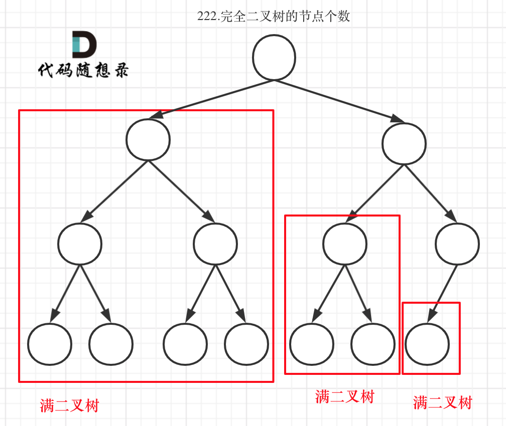

完全二叉树（二）如图：

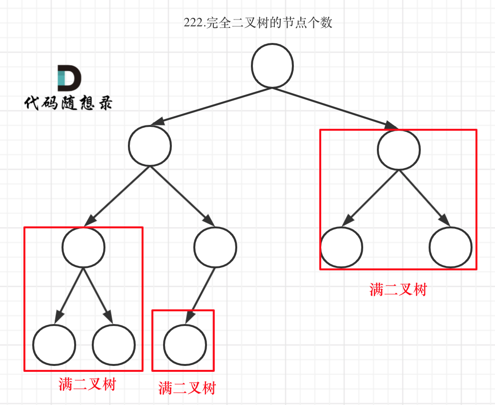

可以看出如果整个树不是满二叉树，就递归其左右孩子，直到遇到满二叉树为止，用公式计算这个子树（满二叉树）的节点数量。

这里关键在于如何去判断一个左子树或者右子树是不是满二叉树呢？ 

在完全二叉树中，如果递归向左遍历的深度等于递归向右遍历的深度，那说明就是满二叉树。如图： 

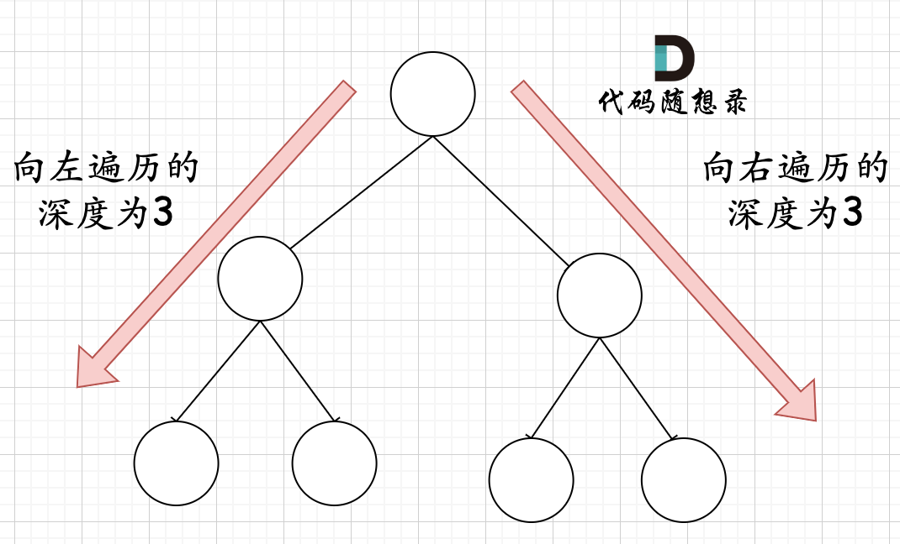

在完全二叉树中，如果递归向左遍历的深度不等于递归向右遍历的深度，则说明不是满二叉树，如图：  

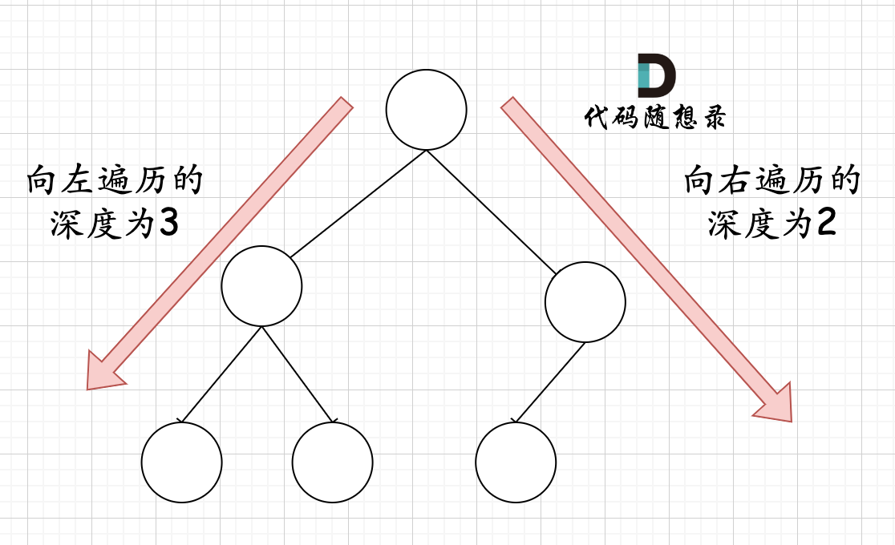

那有录友说了，这种情况，递归向左遍历的深度等于递归向右遍历的深度，但也不是满二叉树，如题： 

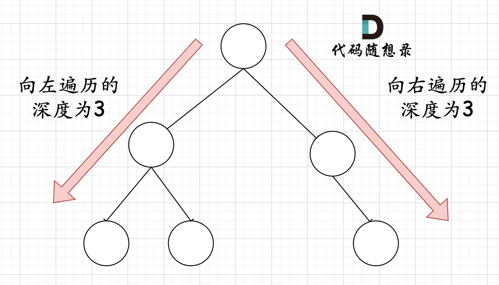

如果这么想，大家就是对 完全二叉树理解有误区了，**以上这棵二叉树，它根本就不是一个完全二叉树**！ 

判断其子树是不是满二叉树，如果是则利用公式计算这个子树（满二叉树）的节点数量，如果不是则继续递归，那么 在递归三部曲中，第二部：终止条件的写法应该是这样的： 

```cpp
if (root == nullptr) return 0;
// 开始根据左深度和右深度是否相同来判断该子树是不是满二叉树
TreeNode* left = root->left;
TreeNode* right = root->right;
int leftDepth = 0, rightDepth = 0; // 这里初始为0是有目的的，为了下面求指数方便
while (left) {  // 求左子树深度
    left = left->left;
    leftDepth++;
}
while (right) { // 求右子树深度
    right = right->right;
    rightDepth++;
}
if (leftDepth == rightDepth) {
    return (2 << leftDepth) - 1; // 注意(2<<1) 相当于2^2，返回满足满二叉树的子树节点数量
}
```

递归三部曲，第三部，单层递归的逻辑：（可以看出使用后序遍历）

```cpp
int leftTreeNum = countNodes(root->left);       // 左
int rightTreeNum = countNodes(root->right);     // 右
int result = leftTreeNum + rightTreeNum + 1;    // 中
return result;
```

该部分精简之后代码为：  

```cpp
return countNodes(root->left) + countNodes(root->right) + 1;
```

最后整体`C++`代码如下：

```cpp
class Solution {
public:
    int countNodes(TreeNode* root) {
        if (root == nullptr) return 0;
        TreeNode* left = root->left;
        TreeNode* right = root->right;
        int leftDepth = 0, rightDepth = 0; // 这里初始为0是有目的的，为了下面求指数方便
        while (left) {  // 求左子树深度
            left = left->left;
            leftDepth++;
        }
        while (right) { // 求右子树深度
            right = right->right;
            rightDepth++;
        }
        if (leftDepth == rightDepth) {
            return (2 << leftDepth) - 1; // 注意(2<<1) 相当于2^2，所以leftDepth初始为0
        }
        return countNodes(root->left) + countNodes(root->right) + 1;
    }
};
```

- 时间复杂度：`O(log n × log n)`
- 空间复杂度：`O(log n)`

求高度还是求深度，你搞懂了不？

# 12.平衡二叉树

[力扣题目链接](https://leetcode.cn/problems/balanced-binary-tree/)

给定一个二叉树，判断它是否是高度平衡的二叉树。

本题中，一棵高度平衡二叉树定义为：一个二叉树每个节点 的左右两个子树的高度差的绝对值不超过1。

示例 1:

给定二叉树 `[3,9,20,null,null,15,7]`

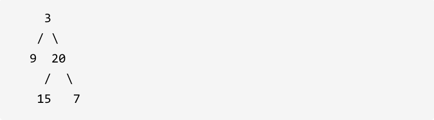

返回 true 。

示例 2:

给定二叉树 `[1,2,2,3,3,null,null,4,4]`

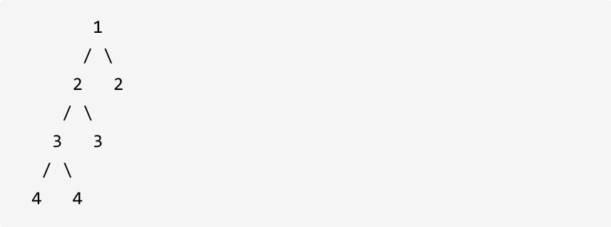

返回 false 。

## 算法公开课

[**《代码随想录》算法视频公开课**](https://programmercarl.com/other/gongkaike.html)**：**[**后序遍历求高度，高度判断是否平衡 | LeetCode：110.平衡二叉树**](https://www.bilibili.com/video/BV1Ug411S7my)**，相信结合** **视频在看本篇题解，更有助于大家对本题的理解**。

## 题外话

咋眼一看这道题目和[104.二叉树的最大深度](https://programmercarl.com/0104.%E4%BA%8C%E5%8F%89%E6%A0%91%E7%9A%84%E6%9C%80%E5%A4%A7%E6%B7%B1%E5%BA%A6.html)很像，其实有很大区别。

这里强调一波概念：

- 二叉树节点的深度：指从根节点到该节点的最长简单路径边的条数。
- 二叉树节点的高度：指从该节点到叶子节点的最长简单路径边的条数。

但leetcode中强调的深度和高度很明显是按照节点来计算的，如图：

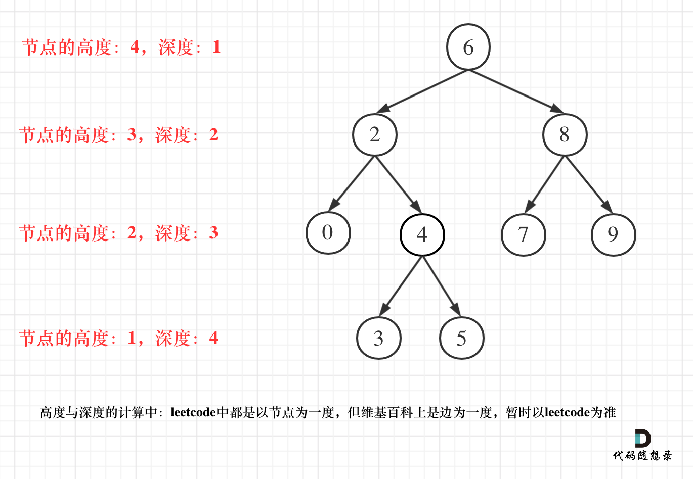

关于根节点的深度究竟是1 还是 0，不同的地方有不一样的标准，leetcode的题目中都是以节点为一度，即根节点深度是1。但维基百科上定义用边为一度，即根节点的深度是0，我们暂时以leetcode为准（毕竟要在这上面刷题）。

因为求深度可以从上到下去查 所以需要前序遍历（中左右），而高度只能从下到上去查，所以只能后序遍历（左右中）

有的同学一定疑惑，为什么[104.二叉树的最大深度](https://programmercarl.com/0104.%E4%BA%8C%E5%8F%89%E6%A0%91%E7%9A%84%E6%9C%80%E5%A4%A7%E6%B7%B1%E5%BA%A6.html)中求的是二叉树的最大深度，也用的是后序遍历。

**那是因为代码的逻辑其实是求的根节点的高度，而根节点的高度就是这棵树的最大深度，所以才可以使用后序遍** **历。**

在[104.二叉树的最大深度](https://programmercarl.com/0104.%E4%BA%8C%E5%8F%89%E6%A0%91%E7%9A%84%E6%9C%80%E5%A4%A7%E6%B7%B1%E5%BA%A6.html)中，如果真正求取二叉树的最大深度，代码应该写成如下：（前序遍历）

```cpp
class Solution {
public:
    int result;
    void getDepth(TreeNode* node, int depth) {
        result = depth > result ? depth : result; // 中
        if (node->left == NULL && node->right == NULL) return ;
        if (node->left) { // 左
            depth++;    // 深度+1
            getDepth(node->left, depth);
            depth--;    // 回溯，深度-1
        }
        if (node->right) { // 右
            depth++;    // 深度+1
            getDepth(node->right, depth);
            depth--;    // 回溯，深度-1
        }
        return ;
    }
    int maxDepth(TreeNode* root) {
        result = 0;
        if (root == NULL) return result;
        getDepth(root, 1);
        return result;
    }
};
```

**可以看出使用了前序（中左右）的遍历顺序，这才是真正求深度的逻辑！**

注意以上代码是为了把细节体现出来，简化一下代码如下：

```cpp
class Solution {
public:
    int result;
    void getDepth(TreeNode* node, int depth) {
        result = depth > result ? depth : result; // 中
        if (node->left == NULL && node->right == NULL) return ;
        if (node->left) { // 左
            getDepth(node->left, depth + 1);
        }
        if (node->right) { // 右
            getDepth(node->right, depth + 1);
        }
        return ;
    }
    int maxDepth(TreeNode* root) {
        result = 0;
        if (root == 0) return result;
        getDepth(root, 1);
        return result;
    }
};
```

## 本题思路

### 递归

此时大家应该明白了既然要求比较高度，必然是要后序遍历。

递归三步曲分析：

1. 明确递归函数的参数和返回值

参数：当前传入节点。返回值：以当前传入节点为根节点的树的高度。

那么如何标记左右子树是否差值大于1呢？

如果当前传入节点为根节点的二叉树已经不是二叉平衡树了，还返回高度的话就没有意义了。

所以如果已经不是二叉平衡树了，可以返回-1 来标记已经不符合平衡树的规则了。

代码如下：

```cpp
// -1 表示已经不是平衡二叉树了，否则返回值是以该节点为根节点树的高度
int getHeight(TreeNode* node)
```

2. 明确终止条件

递归的过程中依然是遇到空节点了为终止，返回0，表示当前节点为根节点的树高度为0

代码如下：

```cpp
if (node == NULL) {
    return 0;
}
```

3. 明确单层递归的逻辑

如何判断以当前传入节点为根节点的二叉树是否是平衡二叉树呢？当然是其左子树高度和其右子树高度的差值。

分别求出其左右子树的高度，然后如果差值小于等于1，则返回当前二叉树的高度，否则返回-1，表示已经不是二叉平衡树了。

代码如下：

```cpp
int leftHeight = getHeight(node->left); // 左
if (leftHeight == -1) return -1;
int rightHeight = getHeight(node->right); // 右
if (rightHeight == -1) return -1;
int result;
if (abs(leftHeight - rightHeight) > 1) {  // 中
    result = -1;
} else {
    result = 1 + max(leftHeight, rightHeight); // 以当前节点为根节点的树的最大高度
}
return result;
```

代码精简之后如下：

```cpp
int leftHeight = getHeight(node->left);
if (leftHeight == -1) return -1;
int rightHeight = getHeight(node->right);
if (rightHeight == -1) return -1;
return abs(leftHeight - rightHeight) > 1 ? -1 : 1 + max(leftHeight, rightHeight);
```

此时递归的函数就已经写出来了，这个递归的函数传入节点指针，返回以该节点为根节点的二叉树的高度，如果不是二叉平衡树，则返回-1。

getHeight整体代码如下：

```cpp
int getHeight(TreeNode* node) {
    if (node == NULL) {
        return 0;
    }
    int leftHeight = getHeight(node->left);
    if (leftHeight == -1) return -1;
    int rightHeight = getHeight(node->right);
    if (rightHeight == -1) return -1;
    return abs(leftHeight - rightHeight) > 1 ? -1 : 1 + max(leftHeight, rightHeight);
}
```

最后本题整体递归代码如下：

```cpp
class Solution {
public:
    // 返回以该节点为根节点的二叉树的高度，如果不是平衡二叉树了则返回-1
    int getHeight(TreeNode* node) {
        if (node == NULL) {
            return 0;
        }
        int leftHeight = getHeight(node->left);
        if (leftHeight == -1) return -1;
        int rightHeight = getHeight(node->right);
        if (rightHeight == -1) return -1;
        return abs(leftHeight - rightHeight) > 1 ? -1 : 1 + max(leftHeight,
rightHeight);
    }
    bool isBalanced(TreeNode* root) {
        return getHeight(root) == -1 ? false : true;
    }
};
```

### 迭代

在[104.二叉树的最大深度](https://programmercarl.com/0104.%E4%BA%8C%E5%8F%89%E6%A0%91%E7%9A%84%E6%9C%80%E5%A4%A7%E6%B7%B1%E5%BA%A6.html)中我们可以使用层序遍历来求深度，但是就不能直接用层序遍历来求高度了，这就体现出求高度和求深度的不同。

本题的迭代方式可以先定义一个函数，专门用来求高度。

这个函数通过栈模拟的后序遍历找每一个节点的高度（其实是通过求传入节点为根节点的最大深度来求的高度）

代码如下：

```cpp
// cur节点的最大深度，就是cur的高度
int getDepth(TreeNode* cur) {
    stack<TreeNode*> st;
    if (cur != NULL) st.push(cur);
    int depth = 0; // 记录深度
    int result = 0;
    while (!st.empty()) {
        TreeNode* node = st.top();
        if (node != NULL) {
            st.pop();
            st.push(node);                          // 中
            st.push(NULL);
            depth++;
            if (node->right) st.push(node->right);  // 右
            if (node->left) st.push(node->left);    // 左
        } else {
            st.pop();
            node = st.top();
            st.pop();
            depth--;
        }
        result = result > depth ? result : depth;
    }
    return result;
}
```

然后再用栈来模拟后序遍历，遍历每一个节点的时候，再去判断左右孩子的高度是否符合，代码如下：

```cpp
bool isBalanced(TreeNode* root) {
    stack<TreeNode*> st;
    if (root == NULL) return true;
    st.push(root);
    while (!st.empty()) {
        TreeNode* node = st.top();                       // 中
        st.pop();
        if (abs(getDepth(node->left) - getDepth(node->right)) > 1) { // 判断左右孩子高度是
否符合
            return false;
        }
        if (node->right) st.push(node->right);           // 右（空节点不入栈）
        if (node->left) st.push(node->left);             // 左（空节点不入栈）
    }
    return true;
}
```

整体代码如下：

```cpp
class Solution {
private:
    int getDepth(TreeNode* cur) {
        stack<TreeNode*> st;
        if (cur != NULL) st.push(cur);
        int depth = 0; // 记录深度
        int result = 0;
        while (!st.empty()) {
            TreeNode* node = st.top();
            if (node != NULL) {
                st.pop();
                st.push(node);                          // 中
                st.push(NULL);
                depth++;
                if (node->right) st.push(node->right);  // 右
                if (node->left) st.push(node->left);    // 左
            } else {
                st.pop();
                node = st.top();
                st.pop();
                depth--;
            }
            result = result > depth ? result : depth;
        }
        return result;
    }
public:
    bool isBalanced(TreeNode* root) {
        stack<TreeNode*> st;
        if (root == NULL) return true;
        st.push(root);
        while (!st.empty()) {
            TreeNode* node = st.top();                       // 中
            st.pop();
            if (abs(getDepth(node->left) - getDepth(node->right)) > 1) {
                return false;
            }
            if (node->right) st.push(node->right);           // 右（空节点不入栈）
            if (node->left) st.push(node->left);             // 左（空节点不入栈）
        }
        return true;
    }
};
```

当然此题用迭代法，其实效率很低，因为没有很好的模拟回溯的过程，所以迭代法有很多重复的计算。

虽然理论上所有的递归都可以用迭代来实现，但是有的场景难度可能比较大。

**例如：都知道回溯法其实就是递归，但是很少人用迭代的方式去实现回溯算法！**

因为对于回溯算法已经是非常复杂的递归了，如果再用迭代的话，就是自己给自己找麻烦，效率也并不一定高。

## 总结

通过本题可以了解求二叉树深度 和 二叉树高度的差异，求深度适合用前序遍历，而求高度适合用后序遍历。

本题迭代法其实有点复杂，大家可以有一个思路，也不一定说非要写出来。

但是递归方式是一定要掌握的！

只用了递归，其实还用了回溯

# 13. 二叉树的所有路径

[力扣题目链接](https://leetcode.cn/problems/binary-tree-paths/)

给定一个二叉树，返回所有从根节点到叶子节点的路径。

说明: 叶子节点是指没有子节点的节点。

示例:

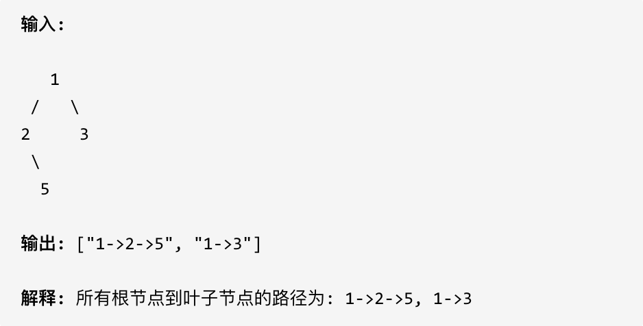

## 算法公开课

[**《代码随想录》算法视频公开课**](https://programmercarl.com/other/gongkaike.html)**：：**[**递归中带着回溯，你感受到了没？| LeetCode：257. 二叉树的所有路径**](https://www.bilibili.com/video/BV1ZG411G7Dh)**，相** **信结合视频在看本篇题解，更有助于大家对本题的理解**。

## 思路

这道题目要求从根节点到叶子的路径，所以需要前序遍历，这样才方便让父节点指向孩子节点，找到对应的路径。

在这道题目中将第一次涉及到回溯，因为我们要把路径记录下来，需要回溯来回退一个路径再进入另一个路径。

前序遍历以及回溯的过程如图：

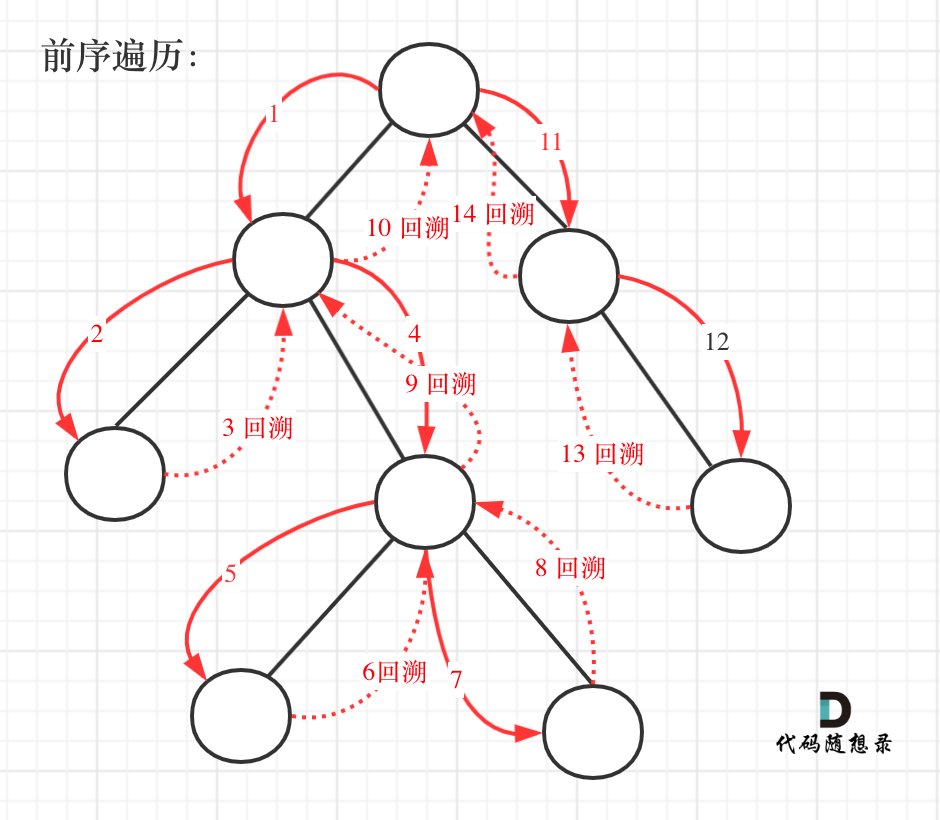

我们先使用递归的方式，来做前序遍历。**要知道递归和回溯就是一家的，本题也需要回溯。**

### 递归

1. 递归函数参数以及返回值

要传入根节点，记录每一条路径的path，和存放结果集的result，这里递归不需要返回值，代码如下：

```cpp
void traversal(TreeNode* cur, vector<int>& path, vector<string>& result)
```

2. 确定递归终止条件

在写递归的时候都习惯了这么写：

```cpp
if (cur == NULL) {
    终止处理逻辑
}
```

但是本题的终止条件这样写会很麻烦，因为本题要找到叶子节点，就开始结束的处理逻辑了（把路径放进result里）。

**那么什么时候算是找到了叶子节点？** 是当 cur不为空，其左右孩子都为空的时候，就找到叶子节点。

所以本题的终止条件是：

```cpp
if (cur->left == NULL && cur->right == NULL) {
    终止处理逻辑
}
```

为什么没有判断cur是否为空呢，因为下面的逻辑可以控制空节点不入循环。

再来看一下终止处理的逻辑。

这里使用vector 结构path来记录路径，所以要把vector 结构的path转为string格式，再把这个string 放进 result里。

**那么为什么使用了vector 结构来记录路径呢？**  因为在下面处理单层递归逻辑的时候，要做回溯，使用vector方便来做回溯。

可能有的同学问了，我看有些人的代码也没有回溯啊。

**其实是有回溯的，只不过隐藏在函数调用时的参数赋值里**，下文我还会提到。

这里我们先使用vector结构的path容器来记录路径，那么终止处理逻辑如下：

```cpp
if (cur->left == NULL && cur->right == NULL) { // 遇到叶子节点
    string sPath;
    for (int i = 0; i < path.size() - 1; i++) { // 将path里记录的路径转为string格式
        sPath += to_string(path[i]);
        sPath += "->";
    }
    sPath += to_string(path[path.size() - 1]); // 记录最后一个节点（叶子节点）
    result.push_back(sPath); // 收集一个路径
    return;
}
```

3. 确定单层递归逻辑

因为是前序遍历，需要先处理中间节点，中间节点就是我们要记录路径上的节点，先放进path中。

```cpp
path.push_back(cur->val);
```

然后是递归和回溯的过程，上面说过没有判断cur是否为空，那么在这里递归的时候，如果为空就不进行下一层递归了。

所以递归前要加上判断语句，下面要递归的节点是否为空，如下

```cpp
if (cur->left) {
    traversal(cur->left, path, result);
}
if (cur->right) {
    traversal(cur->right, path, result);
}
```

此时还没完，递归完，要做回溯啊，因为path 不能一直加入节点，它还要删节点，然后才能加入新的节点。

那么回溯要怎么回溯呢，一些同学会这么写，如下：

```cpp
if (cur->left) {
    traversal(cur->left, path, result);
}
if (cur->right) {
    traversal(cur->right, path, result);
}
path.pop_back();
```

这个回溯就有很大的问题，我们知道，**回溯和递归是一一对应的，有一个递归，就要有一个回溯**，这么写的话相当于把递归和回溯拆开了， 一个在花括号里，一个在花括号外。

**所以回溯要和递归永远在一起，世界上最遥远的距离是你在花括号里，而我在花括号外！**

那么代码应该这么写：

```cpp
if (cur->left) {
    traversal(cur->left, path, result);
    path.pop_back(); // 回溯
}
if (cur->right) {
    traversal(cur->right, path, result);
    path.pop_back(); // 回溯
}
```

那么本题整体代码如下：

```cpp
// 版本一
class Solution {
private:
    void traversal(TreeNode* cur, vector<int>& path, vector<string>& result) {
        path.push_back(cur->val); // 中，中为什么写在这里，因为最后一个节点也要加入到path中
        // 这才到了叶子节点
        if (cur->left == NULL && cur->right == NULL) {
            string sPath;
            for (int i = 0; i < path.size() - 1; i++) {
                sPath += to_string(path[i]);
                sPath += "->";
            }
            sPath += to_string(path[path.size() - 1]);
            result.push_back(sPath);
            return;
        }
        if (cur->left) { // 左
            traversal(cur->left, path, result);
            path.pop_back(); // 回溯
        }
        if (cur->right) { // 右
            traversal(cur->right, path, result);
            path.pop_back(); // 回溯
        }
    }
public:
    vector<string> binaryTreePaths(TreeNode* root) {
        vector<string> result;
        vector<int> path;
        if (root == NULL) return result;
        traversal(root, path, result);
        return result;
    }
};
```

如上的`C++`代码充分体现了回溯。

那么如上代码可以精简成如下代码：

```cpp
class Solution {
private:
    void traversal(TreeNode* cur, string path, vector<string>& result) {
        path += to_string(cur->val); // 中
        if (cur->left == NULL && cur->right == NULL) {
            result.push_back(path);
            return;
        }
        if (cur->left) traversal(cur->left, path + "->", result); // 左
        if (cur->right) traversal(cur->right, path + "->", result); // 右
    }
public:
    vector<string> binaryTreePaths(TreeNode* root) {
        vector<string> result;
        string path;
        if (root == NULL) return result;
        traversal(root, path, result);
        return result;
    }
};
```

如上代码精简了不少，也隐藏了不少东西。

```cpp
注意在函数定义的时候void traversal(TreeNode* cur, string path, vector<string>& result) ，定义
的是string path ，每次都是复制赋值，不用使用引用，否则就无法做到回溯的效果。（这里涉及到C++语法知
```

识）

```cpp
那么在如上代码中，貌似没有看到回溯的逻辑，其实不然，回溯就隐藏在traversal(cur->left, path + "-
>", result); 中的 path + "->" 。  每次函数调用完，path依然是没有加上"->" 的，这就是回溯了。
```

为了把这份精简代码的回溯过程展现出来，大家可以试一试把：

```cpp
if (cur->left) traversal(cur->left, path + "->", result); // 左  回溯就隐藏在这里
```

改成如下代码：

```cpp
path += "->";
traversal(cur->left, path, result); // 左
```

即：

```cpp
if (cur->left) {
    path += "->";
    traversal(cur->left, path, result); // 左
}
if (cur->right) {
    path += "->";
    traversal(cur->right, path, result); // 右
}
```

此时就没有回溯了，这个代码就是通过不了的了。

如果想把回溯加上，就要 在上面代码的基础上，加上回溯，就可以AC了。

```cpp
if (cur->left) {
    path += "->";
    traversal(cur->left, path, result); // 左
    path.pop_back(); // 回溯 '>'
    path.pop_back(); // 回溯 '-'
}
if (cur->right) {
    path += "->";
    traversal(cur->right, path, result); // 右
    path.pop_back(); // 回溯 '>'
    path.pop_back(); //  回溯 '-'
}
```

整体代码如下： 

```cpp
//版本二
class Solution {
private:
    void traversal(TreeNode* cur, string path, vector<string>& result) {
        path += to_string(cur->val); // 中，中为什么写在这里，因为最后一个节点也要加入到path中
        if (cur->left == NULL && cur->right == NULL) {
            result.push_back(path);
            return;
        }
        if (cur->left) {
            path += "->";
            traversal(cur->left, path, result); // 左
            path.pop_back(); // 回溯 '>'
            path.pop_back(); // 回溯 '-'
        }
        if (cur->right) {
            path += "->";
            traversal(cur->right, path, result); // 右
            path.pop_back(); // 回溯'>'
            path.pop_back(); // 回溯 '-'
        }
    }
public:
    vector<string> binaryTreePaths(TreeNode* root) {
        vector<string> result;
        string path;
        if (root == NULL) return result;
        traversal(root, path, result);
        return result;
    }
};
大家应该可以感受出来，如果把 path + "->" 作为函数参数就是可以的，因为并没有改变path的数值，执行完递
```

**归函数之后，path依然是之前的数值（相当于回溯了）**

**综合以上，第二种递归的代码虽然精简但把很多重要的点隐藏在了代码细节里，第一种递归写法虽然代码多一些，** **但是把每一个逻辑处理都完整的展现出来了。**

### 拓展

这里讲解本题解的写法逻辑以及一些更具体的细节，下面的讲解中，涉及到`C++`语法特性，如果不是`C++`的录友，就可以不看了，避免越看越晕。 

如果是`C++`的录友，建议本题独立刷过两遍，再看下面的讲解，同样避免越看越晕，造成不必要的负担。 

```cpp
在第二版本的代码中，其实仅仅是回溯了 -> 部分（调用两次pop_back，一个pop > 一次pop - ），大家应该疑
惑那么 path += to_string(cur->val); 这一步为什么没有回溯呢？ 一条路径能持续加节点 不做回溯吗？
其实关键还在于 参数，使用的是 string path ，这里并没有加上引用& ，即本层递归中，path + 该节点数值，
```

但该层递归结束，上一层path的数值并不会受到任何影响。  如图所示：

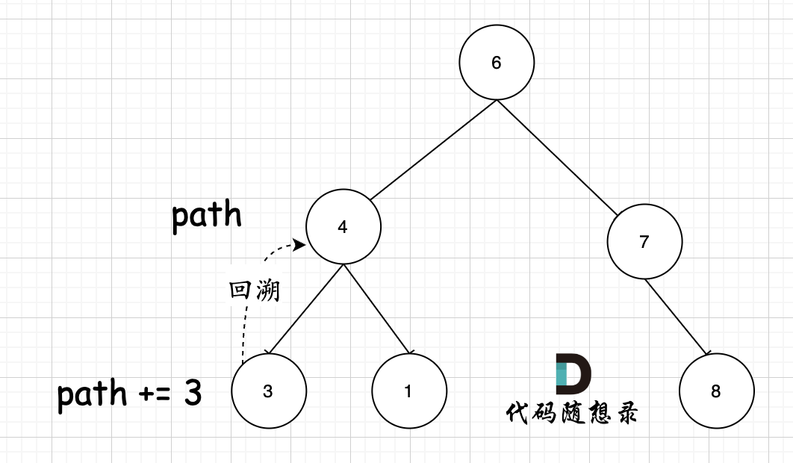

节点4 的path，在遍历到节点3，path+3，遍历节点3的递归结束之后，返回节点4（回溯的过程），path并不会把3加上。 

所以这是参数中，不带引用，不做地址拷贝，只做内容拷贝的效果。（这里涉及到`C++`引用方面的知识） 

```cpp
在第一个版本中，函数参数我就使用了引用，即 vector<int>& path ，这是会拷贝地址的，所以 本层递归逻辑
如果有path.push_back(cur->val); 就一定要有对应的 path.pop_back()
那有同学可能想，为什么不去定义一个 string& path 这样的函数参数呢，然后也可能在递归函数中展现回溯的
过程，但关键在于，path += to_string(cur->val); 每次是加上一个数字，这个数字如果是个位数，那好说，
就调用一次path.pop_back() ，但如果是 十位数，百位数，千位数呢？ 百位数就要调用三
次path.pop_back() ，才能实现对应的回溯操作，这样代码实现就太冗余了。
```

所以，第一个代码版本中，我才使用 vector 类型的path，这样方便给大家演示代码中回溯的操作。 vector类型的path，不管 每次 路径收集的数字是几位数，总之一定是int，所以就一次 pop_back就可以。 

### 迭代法

至于非递归的方式，我们可以依然可以使用前序遍历的迭代方式来模拟遍历路径的过程，对该迭代方式不了解的同学，可以看文章[二叉树：听说递归能做的，栈也能做！](https://programmercarl.com/%E4%BA%8C%E5%8F%89%E6%A0%91%E7%9A%84%E8%BF%AD%E4%BB%A3%E9%81%8D%E5%8E%86.html)和[二叉树：前中后序迭代方式统一写法](https://programmercarl.com/%E4%BA%8C%E5%8F%89%E6%A0%91%E7%9A%84%E7%BB%9F%E4%B8%80%E8%BF%AD%E4%BB%A3%E6%B3%95.html)。

这里除了模拟递归需要一个栈，同时还需要一个栈来存放对应的遍历路径。

`C++`代码如下：

```cpp
class Solution {
public:
    vector<string> binaryTreePaths(TreeNode* root) {
        stack<TreeNode*> treeSt;// 保存树的遍历节点
        stack<string> pathSt;   // 保存遍历路径的节点
        vector<string> result;  // 保存最终路径集合
        if (root == NULL) return result;
        treeSt.push(root);
        pathSt.push(to_string(root->val));
        while (!treeSt.empty()) {
            TreeNode* node = treeSt.top(); treeSt.pop(); // 取出节点 中
            string path = pathSt.top();pathSt.pop();    // 取出该节点对应的路径
            if (node->left == NULL && node->right == NULL) { // 遇到叶子节点
                result.push_back(path);
            }
            if (node->right) { // 右
                treeSt.push(node->right);
                pathSt.push(path + "->" + to_string(node->right->val));
            }
            if (node->left) { // 左
                treeSt.push(node->left);
                pathSt.push(path + "->" + to_string(node->left->val));
            }
        }
        return result;
    }
};
当然，使用java的同学，可以直接定义一个成员变量为object的栈Stack<Object> stack = new Stack<>(); ，
```

这样就不用定义两个栈了，都放到一个栈里就可以了。

## 总结

**本文我们开始初步涉及到了回溯，很多同学过了这道题目，可能都不知道自己其实使用了回溯，回溯和递归都是相** **伴相生的。**

我在第一版递归代码中，把递归与回溯的细节都充分的展现了出来，大家可以自己感受一下。

第二版递归代码对于初学者其实非常不友好，代码看上去简单，但是隐藏细节于无形。

最后我依然给出了迭代法。

对于本题充分了解递归与回溯的过程之后，有精力的同学可以再去实现迭代法。

# 14. 本周小结！（二叉树系列二）

本周赶上了十一国庆，估计大家已经对本周末没什么概念了，但是我们该做总结还是要做总结的。

本周的主题其实是**简单但并不简单**，本周所选的题目大多是看一下就会的题目，但是大家看完本周的文章估计也发现了，二叉树的简单题目其实里面都藏了很多细节。 这些细节我都给大家展现了出来。

## 周一

本周刚开始我们讲解了判断二叉树是否对称的写法， [二叉树：我对称么？](https://programmercarl.com/0101.%E5%AF%B9%E7%A7%B0%E4%BA%8C%E5%8F%89%E6%A0%91.html)。

这道题目的本质是要比较两个树（这两个树是根节点的左右子树），遍历两棵树而且要比较内侧和外侧节点，所以准确的来说是一个树的遍历顺序是左右中，一个树的遍历顺序是右左中。

而本题的迭代法中我们使用了队列，需要注意的是这不是层序遍历，而且仅仅通过一个容器来成对的存放我们要比较的元素，认识到这一点之后就发现：用队列，用栈，甚至用数组，都是可以的。

那么做完本题之后，在看如下两个题目。

- 100.相同的树
- 572.另一个树的子树

[**二叉树：我对称么？**](https://programmercarl.com/0101.%E5%AF%B9%E7%A7%B0%E4%BA%8C%E5%8F%89%E6%A0%91.html)**中的递归法和迭代法只需要稍作修改其中一个树的遍历顺序，便可刷了100.相同的树。**

100.相同的树的递归代码如下：

```cpp
class Solution {
public:
    bool compare(TreeNode* left, TreeNode* right) {
        // 首先排除空节点的情况
        if (left == NULL && right != NULL) return false;
        else if (left != NULL && right == NULL) return false;
        else if (left == NULL && right == NULL) return true;
        // 排除了空节点，再排除数值不相同的情况
        else if (left->val != right->val) return false;
        // 此时就是：左右节点都不为空，且数值相同的情况
        // 此时才做递归，做下一层的判断
        bool outside = compare(left->left, right->left);   // 左子树：左、 右子树：左 （相对
于求对称二叉树，只需改一下这里的顺序）
        bool inside = compare(left->right, right->right);    // 左子树：右、 右子树：右
        bool isSame = outside && inside;                    // 左子树：中、 右子树：中 （逻
辑处理）
        return isSame;
    }
    bool isSymmetric(TreeNode* p, TreeNode* q) {
        return compare(p, q);
    }
};
```

100.相同的树，精简之后代码如下：

```cpp
class Solution {
public:
    bool compare(TreeNode* left, TreeNode* right) {
        if (left == NULL && right != NULL) return false;
        else if (left != NULL && right == NULL) return false;
        else if (left == NULL && right == NULL) return true;
        else if (left->val != right->val) return false;
        else return compare(left->left, right->left) && compare(left->right, right-
>right);
    }
    bool isSameTree(TreeNode* p, TreeNode* q) {
        return compare(p, q);
    }
};
```

100.相同的树，迭代法代码如下：

```cpp
class Solution {
public:
    bool isSameTree(TreeNode* p, TreeNode* q) {
        if (p == NULL && q == NULL) return true;
        if (p == NULL || q == NULL) return false;
        queue<TreeNode*> que;
        que.push(p);
        que.push(q);
        while (!que.empty()) {
            TreeNode* leftNode = que.front(); que.pop();
            TreeNode* rightNode = que.front(); que.pop();
            if (!leftNode && !rightNode) {
                continue;
            }
            if ((!leftNode || !rightNode || (leftNode->val != rightNode->val))) {
                return false;
            }
            // 相对于求对称二叉树，这里两个树都要保持一样的遍历顺序
            que.push(leftNode->left);
            que.push(rightNode->left);
            que.push(leftNode->right);
            que.push(rightNode->right);
        }
        return true;
    }
};
```

而572.另一个树的子树，则和 100.相同的树几乎一样的了，大家可以直接AC了。

## 周二

在[二叉树：看看这些树的最大深度](https://programmercarl.com/0104.%E4%BA%8C%E5%8F%89%E6%A0%91%E7%9A%84%E6%9C%80%E5%A4%A7%E6%B7%B1%E5%BA%A6.html)中，我们讲解了如何求二叉树的最大深度。

本题可以使用前序，也可以使用后序遍历（左右中），使用前序求的就是深度，使用后序呢求的是高度。

**而根节点的高度就是二叉树的最大深度**，所以本题中我们通过后序求的根节点高度来求的二叉树最大深度，所以二叉树：看看这些树的最大深度中使用的是后序遍历。

本题当然也可以使用前序，代码如下：`(`**充分表现出求深度回溯的过程**`)`

```cpp
class Solution {
public:
    int result;
    void getDepth(TreeNode* node, int depth) {
        result = depth > result ? depth : result; // 中
        if (node->left == NULL && node->right == NULL) return ;
        if (node->left) { // 左
            depth++;    // 深度+1
            getDepth(node->left, depth);
            depth--;    // 回溯，深度-1
        }
        if (node->right) { // 右
            depth++;    // 深度+1
            getDepth(node->right, depth);
            depth--;    // 回溯，深度-1
        }
        return ;
    }
    int maxDepth(TreeNode* root) {
        result = 0;
        if (root == 0) return result;
        getDepth(root, 1);
        return result;
    }
};
```

**可以看出使用了前序（中左右）的遍历顺序，这才是真正求深度的逻辑！**

注意以上代码是为了把细节体现出来，简化一下代码如下：

```cpp
class Solution {
public:
    int result;
    void getDepth(TreeNode* node, int depth) {
        result = depth > result ? depth : result; // 中
        if (node->left == NULL && node->right == NULL) return ;
        if (node->left) { // 左
            getDepth(node->left, depth + 1);
        }
        if (node->right) { // 右
            getDepth(node->right, depth + 1);
        }
        return ;
    }
    int maxDepth(TreeNode* root) {
        result = 0;
        if (root == 0) return result;
        getDepth(root, 1);
        return result;
    }
};
```

## 周三

在[二叉树：看看这些树的最小深度](https://programmercarl.com/0111.%E4%BA%8C%E5%8F%89%E6%A0%91%E7%9A%84%E6%9C%80%E5%B0%8F%E6%B7%B1%E5%BA%A6.html)中，我们讲解如何求二叉树的最小深度， 这道题目要是稍不留心很容易犯错。

**注意这里最小深度是从根节点到最近叶子节点的最短路径上的节点数量。注意是叶子节点。**

什么是叶子节点，左右孩子都为空的节点才是叶子节点！

**求二叉树的最小深度和求二叉树的最大深度的差别主要在于处理左右孩子不为空的逻辑。**

注意到这一点之后 递归法和迭代法 都可以参照[二叉树：看看这些树的最大深度](https://programmercarl.com/0104.%E4%BA%8C%E5%8F%89%E6%A0%91%E7%9A%84%E6%9C%80%E5%A4%A7%E6%B7%B1%E5%BA%A6.html)写出来。

## 周四

我们在[二叉树：我有多少个节点？](https://programmercarl.com/0222.%E5%AE%8C%E5%85%A8%E4%BA%8C%E5%8F%89%E6%A0%91%E7%9A%84%E8%8A%82%E7%82%B9%E4%B8%AA%E6%95%B0.html)中，讲解了如何求二叉树的节点数量。

这一天是十一长假的第一天，又是双节，所以简单一些，只要把之前两篇[二叉树：看看这些树的最大深度](https://programmercarl.com/0104.%E4%BA%8C%E5%8F%89%E6%A0%91%E7%9A%84%E6%9C%80%E5%A4%A7%E6%B7%B1%E5%BA%A6.html)， 二叉树：看看这些树的最小深度都认真看了的话，这道题目可以分分钟刷掉了。

估计此时大家对这一类求二叉树节点数量以及求深度应该非常熟练了。

## 周五

在[二叉树：我平衡么？](https://programmercarl.com/0110.%E5%B9%B3%E8%A1%A1%E4%BA%8C%E5%8F%89%E6%A0%91.html)中讲解了如何判断二叉树是否是平衡二叉树

今天讲解一道判断平衡二叉树的题目，其实 方法上我们之前讲解深度的时候都讲过了，但是这次我们通过这道题目彻底搞清楚二叉树高度与深度的问题，以及对应的遍历方式。

二叉树节点的深度：指从根节点到该节点的最长简单路径边的条数。二叉树节点的高度：指从该节点到叶子节点的最长简单路径边的条数。

**但leetcode中强调的深度和高度很明显是按照节点来计算的**。

关于根节点的深度究竟是1 还是 0，不同的地方有不一样的标准，leetcode的题目中都是以节点为一度，即根节点深度是1。但维基百科上定义用边为一度，即根节点的深度是0，我们暂时以leetcode为准（毕竟要在这上面刷题）。

当然此题用迭代法，其实效率很低，因为没有很好的模拟回溯的过程，所以迭代法有很多重复的计算。

虽然理论上所有的递归都可以用迭代来实现，但是有的场景难度可能比较大。

**例如：都知道回溯法其实就是递归，但是很少人用迭代的方式去实现回溯算法！**

讲了这么多二叉树题目的迭代法，有的同学会疑惑，迭代法中究竟什么时候用队列，什么时候用栈？

**如果是模拟前中后序遍历就用栈，如果是适合层序遍历就用队列，当然还是其他情况，那么就是 先用队列试试行不** **行，不行就用栈。**

## 周六

在[二叉树：找我的所有路径？](https://programmercarl.com/0257.%E4%BA%8C%E5%8F%89%E6%A0%91%E7%9A%84%E6%89%80%E6%9C%89%E8%B7%AF%E5%BE%84.html)中正式涉及到了回溯，很多同学过了这道题目，可能都不知道自己使用了回溯，其实回溯和递归都是相伴相生的。最后我依然给出了迭代法的版本。

我在题解中第一个版本的代码会把回溯的过程充分体现出来，如果大家直接看简洁的代码版本，很可能就会忽略的回溯的存在。

我在文中也强调了这一点。

有的同学还不理解 ，文中精简之后的递归代码，回溯究竟隐藏在哪里了。

文中我明确的说了：**回溯就隐藏在traversal(cur->left, path + "->", result);中的 path + "->"。 每次函数调用** **完，path依然是没有加上"->" 的，这就是回溯了。**

如果还不理解的话，可以把

```cpp
traversal(cur->left, path + "->", result);
```

改成

```cpp
string tmp = path + "->";
traversal(cur->left, tmp, result);
```

看看还行不行了，答案是这么写就不行了，因为没有回溯了。

## 总结

二叉树的题目，我都是使用了递归三部曲一步一步的把整个过程分析出来，而不是上来就给出简洁的代码。

一些同学可能上来就能写出代码，大体上也知道是为啥，可以自圆其说，但往细节一扣，就不知道了。

所以刚接触二叉树的同学，建议按照文章分析的步骤一步一步来，不要上来就照着精简的代码写（那样写完了也很容易忘的，知其然不知其所以然）。

**简短的代码看不出遍历的顺序，也看不出分析的逻辑，还会把必要的回溯的逻辑隐藏了，所以尽量按照原理分析一** **步一步来，写出来之后，再去优化代码。**

大家加个油！！

# 15.左叶子之和

[力扣题目链接](https://leetcode.cn/problems/sum-of-left-leaves/)

计算给定二叉树的所有左叶子之和。

示例：

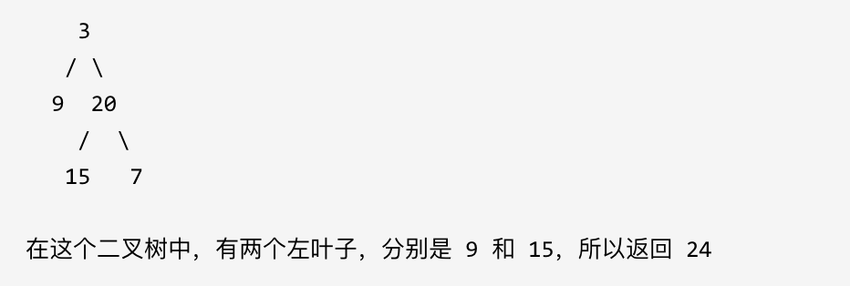

## 算法公开课

[**《代码随想录》算法视频公开课**](https://programmercarl.com/other/gongkaike.html)**：：二叉树的题目中，总有一些规则让你找不到北 | LeetCode：404.左叶子之** **和，相信结合视频在看本篇题解，更有助于大家对本题的理解**。

## 思路

**首先要注意是判断左叶子，不是二叉树左侧节点，所以不要上来想着层序遍历。**

因为题目中其实没有说清楚左叶子究竟是什么节点，那么我来给出左叶子的明确定义：**节点A的左孩子不为空，且** **左孩子的左右孩子都为空（说明是叶子节点），那么A节点的左孩子为左叶子节点**

大家思考一下如下图中二叉树，左叶子之和究竟是多少？

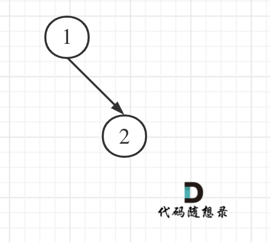

**其实是0，因为这棵树根本没有左叶子！**

但看这个图的左叶子之和是多少？ 

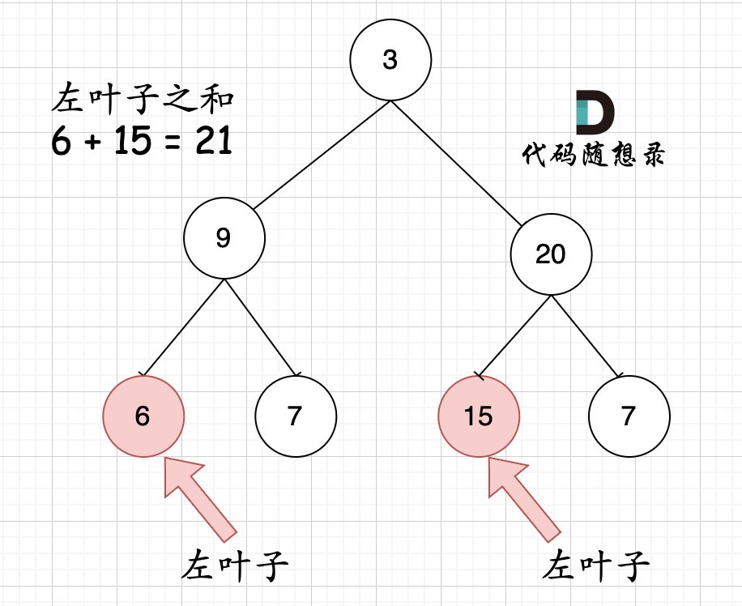

相信通过这两个图，大家对最左叶子的定义有明确理解了。 

那么**判断当前节点是不是左叶子是无法判断的，必须要通过节点的父节点来判断其左孩子是不是左叶子。**

如果该节点的左节点不为空，该节点的左节点的左节点为空，该节点的左节点的右节点为空，则找到了一个左叶子，判断代码如下：

```cpp
if (node->left != NULL && node->left->left == NULL && node->left->right == NULL) {
    左叶子节点处理逻辑
}
```

### 递归法

递归的遍历顺序为后序遍历（左右中），是因为要通过递归函数的返回值来累加求取左叶子数值之和。

递归三部曲：

1. 确定递归函数的参数和返回值

判断一个树的左叶子节点之和，那么一定要传入树的根节点，递归函数的返回值为数值之和，所以为int

使用题目中给出的函数就可以了。

2. 确定终止条件

如果遍历到空节点，那么左叶子值一定是0 

```cpp
if (root == NULL) return 0;
```

注意，只有当前遍历的节点是父节点，才能判断其子节点是不是左叶子。 所以如果当前遍历的节点是叶子节点，那其左叶子也必定是0，那么终止条件为： 

```cpp
if (root == NULL) return 0;
if (root->left == NULL && root->right== NULL) return 0; //其实这个也可以不写，如果不写不影响
结果，但就会让递归多进行了一层。
```

3. 确定单层递归的逻辑

当遇到左叶子节点的时候，记录数值，然后通过递归求取左子树左叶子之和，和 右子树左叶子之和，相加便是整个树的左叶子之和。

代码如下：

```cpp
int leftValue = sumOfLeftLeaves(root->left);    // 左
if (root->left && !root->left->left && !root->left->right) {
    leftValue = root->left->val;
}
int rightValue = sumOfLeftLeaves(root->right);  // 右
int sum = leftValue + rightValue;               // 中
return sum;
```

整体递归代码如下：

```cpp
class Solution {
public:
    int sumOfLeftLeaves(TreeNode* root) {
        if (root == NULL) return 0;
        if (root->left == NULL && root->right== NULL) return 0;
        int leftValue = sumOfLeftLeaves(root->left);    // 左
        if (root->left && !root->left->left && !root->left->right) { // 左子树就是一个左叶
子的情况
            leftValue = root->left->val;
        }
        int rightValue = sumOfLeftLeaves(root->right);  // 右
        int sum = leftValue + rightValue;               // 中
        return sum;
    }
};
```

以上代码精简之后如下：

```cpp
class Solution {
public:
    int sumOfLeftLeaves(TreeNode* root) {
        if (root == NULL) return 0;
        int leftValue = 0;
        if (root->left != NULL && root->left->left == NULL && root->left->right ==
NULL) {
            leftValue = root->left->val;
        }
        return leftValue + sumOfLeftLeaves(root->left) + sumOfLeftLeaves(root->right);
    }
};
```

精简之后的代码其实看不出来用的是什么遍历方式了，对于算法初学者以上根据第一个版本来学习。 

### 迭代法

本题迭代法使用前中后序都是可以的，只要把左叶子节点统计出来，就可以了，那么参考文章 二叉树：听说递归能做的，栈也能做！和[二叉树：迭代法统一写法](https://programmercarl.com/%E4%BA%8C%E5%8F%89%E6%A0%91%E7%9A%84%E7%BB%9F%E4%B8%80%E8%BF%AD%E4%BB%A3%E6%B3%95.html)中的写法，可以写出一个前序遍历的迭代法。

判断条件都是一样的，代码如下：

```cpp
class Solution {
public:
    int sumOfLeftLeaves(TreeNode* root) {
        stack<TreeNode*> st;
        if (root == NULL) return 0;
        st.push(root);
        int result = 0;
        while (!st.empty()) {
            TreeNode* node = st.top();
            st.pop();
            if (node->left != NULL && node->left->left == NULL && node->left->right ==
NULL) {
                result += node->left->val;
            }
            if (node->right) st.push(node->right);
            if (node->left) st.push(node->left);
        }
        return result;
    }
};
```

## 总结

这道题目要求左叶子之和，其实是比较绕的，因为不能判断本节点是不是左叶子节点。

此时就要通过节点的父节点来判断其左孩子是不是左叶子了。

**平时我们解二叉树的题目时，已经习惯了通过节点的左右孩子判断本节点的属性，而本题我们要通过节点的父节点** **判断本节点的属性。**

希望通过这道题目，可以扩展大家对二叉树的解题思路。

# 16.找树左下角的值

[力扣题目链接](https://leetcode.cn/problems/find-bottom-left-tree-value/)

给定一个二叉树，在树的最后一行找到最左边的值。

示例 1:

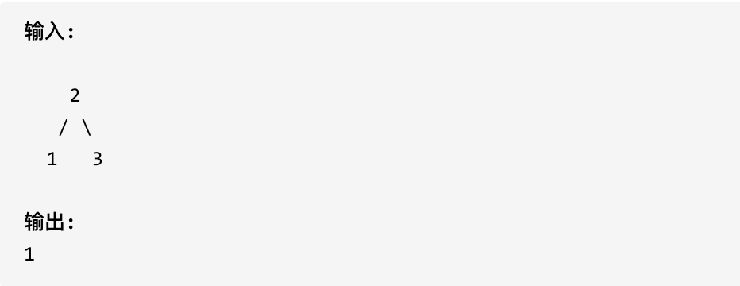

示例 2:

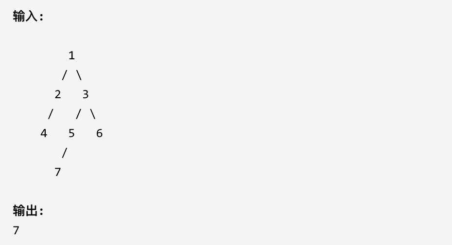

## 算法公开课

[**《代码随想录》算法视频公开课**](https://programmercarl.com/other/gongkaike.html)**：怎么找二叉树的左下角？ 递归中又带回溯了，怎么办？| LeetCode：513.找二** **叉树左下角的值，相信结合视频在看本篇题解，更有助于大家对本题的理解**。

## 思路

本题要找出树的最后一行的最左边的值。此时大家应该想起用层序遍历是非常简单的了，反而用递归的话会比较难一点。

我们依然还是先介绍递归法。

### 递归

咋眼一看，这道题目用递归的话就就一直向左遍历，最后一个就是答案呗？

没有这么简单，一直向左遍历到最后一个，它未必是最后一行啊。

我们来分析一下题目：在树的**最后一行**找到**最左边的值**。

首先要是最后一行，然后是最左边的值。

如果使用递归法，如何判断是最后一行呢，其实就是深度最大的叶子节点一定是最后一行。

如果对二叉树深度和高度还有点疑惑的话，请看：[110.平衡二叉树](https://programmercarl.com/0110.%E5%B9%B3%E8%A1%A1%E4%BA%8C%E5%8F%89%E6%A0%91.html)。

所以要找深度最大的叶子节点。

那么如何找最左边的呢？可以使用前序遍历（当然中序，后序都可以，因为本题没有 中间节点的处理逻辑，只要左优先就行），保证优先左边搜索，然后记录深度最大的叶子节点，此时就是树的最后一行最左边的值。

递归三部曲：

1. 确定递归函数的参数和返回值参数必须有要遍历的树的根节点，还有就是一个int型的变量用来记录最长深度。 这里就不需要返回值了，所以递归函数的返回类型为void。

本题还需要类里的两个全局变量，maxLen用来记录最大深度，result记录最大深度最左节点的数值。

代码如下：

```cpp
int maxDepth = INT_MIN;   // 全局变量 记录最大深度
int result;       // 全局变量 最大深度最左节点的数值
void traversal(TreeNode* root, int depth)
```

2. 确定终止条件

当遇到叶子节点的时候，就需要统计一下最大的深度了，所以需要遇到叶子节点来更新最大深度。

代码如下：

```cpp
if (root->left == NULL && root->right == NULL) {
    if (depth > maxDepth) {
        maxDepth = depth;           // 更新最大深度
        result = root->val;   // 最大深度最左面的数值
    }
    return;
}
```

3. 确定单层递归的逻辑

在找最大深度的时候，递归的过程中依然要使用回溯，代码如下：

```cpp
                    // 中
if (root->left) {   // 左
    depth++; // 深度加一
    traversal(root->left, depth);
    depth--; // 回溯，深度减一
}
if (root->right) { // 右
    depth++; // 深度加一
    traversal(root->right, depth);
    depth--; // 回溯，深度减一
}
return;
```

完整代码如下：

```cpp
class Solution {
public:
    int maxDepth = INT_MIN;
    int result;
    void traversal(TreeNode* root, int depth) {
        if (root->left == NULL && root->right == NULL) {
            if (depth > maxDepth) {
                maxDepth = depth;
                result = root->val;
            }
            return;
        }
        if (root->left) {
            depth++;
            traversal(root->left, depth);
            depth--; // 回溯
        }
        if (root->right) {
            depth++;
            traversal(root->right, depth);
            depth--; // 回溯
        }
        return;
    }
    int findBottomLeftValue(TreeNode* root) {
        traversal(root, 0);
        return result;
    }
};
```

当然回溯的地方可以精简，精简代码如下：

```cpp
class Solution {
public:
    int maxDepth = INT_MIN;
    int result;
    void traversal(TreeNode* root, int depth) {
        if (root->left == NULL && root->right == NULL) {
            if (depth > maxDepth) {
                maxDepth = depth;
                result = root->val;
            }
            return;
        }
        if (root->left) {
            traversal(root->left, depth + 1); // 隐藏着回溯
        }
        if (root->right) {
            traversal(root->right, depth + 1); // 隐藏着回溯
        }
        return;
    }
    int findBottomLeftValue(TreeNode* root) {
        traversal(root, 0);
        return result;
    }
};
```

如果对回溯部分精简的代码 不理解的话，可以看这篇[257. 二叉树的所有路径](https://programmercarl.com/0257.%E4%BA%8C%E5%8F%89%E6%A0%91%E7%9A%84%E6%89%80%E6%9C%89%E8%B7%AF%E5%BE%84.html) 

### 迭代法

本题使用层序遍历再合适不过了，比递归要好理解得多！

只需要记录最后一行第一个节点的数值就可以了。

如果对层序遍历不了解，看这篇[二叉树：层序遍历登场！](https://programmercarl.com/0102.%E4%BA%8C%E5%8F%89%E6%A0%91%E7%9A%84%E5%B1%82%E5%BA%8F%E9%81%8D%E5%8E%86.html)，这篇里也给出了层序遍历的模板，稍作修改就一过刷了这道题了。

代码如下：

```cpp
class Solution {
public:
    int findBottomLeftValue(TreeNode* root) {
        queue<TreeNode*> que;
        if (root != NULL) que.push(root);
        int result = 0;
        while (!que.empty()) {
            int size = que.size();
            for (int i = 0; i < size; i++) {
                TreeNode* node = que.front();
                que.pop();
                if (i == 0) result = node->val; // 记录最后一行第一个元素
                if (node->left) que.push(node->left);
                if (node->right) que.push(node->right);
            }
        }
        return result;
    }
};
```

## 总结

本题涉及如下几点：

- 递归求深度的写法，我们在[110.平衡二叉树](https://programmercarl.com/0110.%E5%B9%B3%E8%A1%A1%E4%BA%8C%E5%8F%89%E6%A0%91.html)中详细的分析了深度应该怎么求，高度应该怎么求。
- 递归中其实隐藏了回溯，在[257. 二叉树的所有路径](https://programmercarl.com/0257.%E4%BA%8C%E5%8F%89%E6%A0%91%E7%9A%84%E6%89%80%E6%9C%89%E8%B7%AF%E5%BE%84.html)中讲解了究竟哪里使用了回溯，哪里隐藏了回溯。
- 层次遍历，在[二叉树：层序遍历登场！](https://programmercarl.com/0102.%E4%BA%8C%E5%8F%89%E6%A0%91%E7%9A%84%E5%B1%82%E5%BA%8F%E9%81%8D%E5%8E%86.html)深度讲解了二叉树层次遍历。所以本题涉及到的点，我们之前都讲解过，这些知识点需要同学们灵活运用，这样就举一反三了。

# 17. 路径总和

[力扣题目链接](https://leetcode.cn/problems/path-sum/)

给定一个二叉树和一个目标和，判断该树中是否存在根节点到叶子节点的路径，这条路径上所有节点值相加等于目标和。

说明: 叶子节点是指没有子节点的节点。

示例:给定如下二叉树，以及目标和 `sum = 22`，

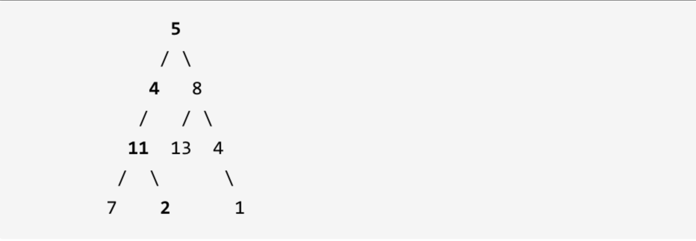

返回 true, 因为存在目标和为 22 的根节点到叶子节点的路径 `5->4->11->2`。

## 算法公开课

[**《代码随想录》算法视频公开课**](https://programmercarl.com/other/gongkaike.html)**：拿不准的遍历顺序，搞不清的回溯过程，我太难了！ | LeetCode：112. 路径总** **和，相信结合视频在看本篇题解，更有助于大家对本题的理解**。

## 思路

相信很多同学都会疑惑，递归函数什么时候要有返回值，什么时候没有返回值，特别是有的时候递归函数返回类型为bool类型。

那么接下来我通过详细讲解如下两道题，来回答这个问题：

- [112.路径总和](https://leetcode.cn/problems/path-sum/)
- [113.路径总和ii](https://leetcode.cn/problems/path-sum-ii/)

这道题我们要遍历从根节点到叶子节点的路径看看总和是不是目标和。

### 递归

可以使用深度优先遍历的方式（本题前中后序都可以，无所谓，因为中节点也没有处理逻辑）来遍历二叉树

1. 确定递归函数的参数和返回类型

参数：需要二叉树的根节点，还需要一个计数器，这个计数器用来计算二叉树的一条边之和是否正好是目标和，计数器为int型。

再来看返回值，递归函数什么时候需要返回值？什么时候不需要返回值？这里总结如下三点：

- 如果需要搜索整棵二叉树且不用处理递归返回值，递归函数就不要返回值。（这种情况就是本文下半部分介绍的113.路径总和ii）
- 如果需要搜索整棵二叉树且需要处理递归返回值，递归函数就需要返回值。 （这种情况我们在236. 二叉树的最近公共祖先中介绍）
- 如果要搜索其中一条符合条件的路径，那么递归一定需要返回值，因为遇到符合条件的路径了就要及时返回。（本题的情况）

而本题我们要找一条符合条件的路径，所以递归函数需要返回值，及时返回，那么返回类型是什么呢？

如图所示：

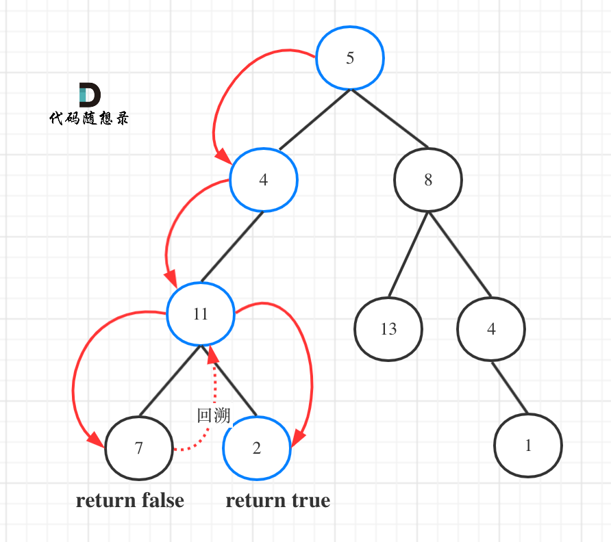

图中可以看出，遍历的路线，并不要遍历整棵树，所以递归函数需要返回值，可以用bool类型表示。

所以代码如下：

```cpp
bool traversal(treenode* cur, int count)   // 注意函数的返回类型
```

2. 确定终止条件

首先计数器如何统计这一条路径的和呢？

不要去累加然后判断是否等于目标和，那么代码比较麻烦，可以用递减，让计数器count初始为目标和，然后每次减去遍历路径节点上的数值。

如果最后`count == 0`，同时到了叶子节点的话，说明找到了目标和。

如果遍历到了叶子节点，count不为0，就是没找到。

递归终止条件代码如下：

```cpp
if (!cur->left && !cur->right && count == 0) return true; // 遇到叶子节点，并且计数为0
if (!cur->left && !cur->right) return false; // 遇到叶子节点而没有找到合适的边，直接返回
```

3. 确定单层递归的逻辑

因为终止条件是判断叶子节点，所以递归的过程中就不要让空节点进入递归了。

递归函数是有返回值的，如果递归函数返回true，说明找到了合适的路径，应该立刻返回。

代码如下：

```cpp
if (cur->left) { // 左 （空节点不遍历）
    // 遇到叶子节点返回true，则直接返回true
    if (traversal(cur->left, count - cur->left->val)) return true; // 注意这里有回溯的逻辑
}
if (cur->right) { // 右 （空节点不遍历）
    // 遇到叶子节点返回true，则直接返回true
    if (traversal(cur->right, count - cur->right->val)) return true; // 注意这里有回溯的逻
辑
}
return false;
```

以上代码中是包含着回溯的，没有回溯，如何后撤重新找另一条路径呢。

```text
回溯隐藏在traversal(cur->left, count - cur->left->val) 这里， 因为把count - cur->left->val 直
```

接作为参数传进去，函数结束，count的数值没有改变。

为了把回溯的过程体现出来，可以改为如下代码：

```cpp
if (cur->left) { // 左
    count -= cur->left->val; // 递归，处理节点;
    if (traversal(cur->left, count)) return true;
    count += cur->left->val; // 回溯，撤销处理结果
}
if (cur->right) { // 右
    count -= cur->right->val;
    if (traversal(cur->right, count)) return true;
    count += cur->right->val;
}
return false;
```

整体代码如下：

```cpp
class Solution {
private:
    bool traversal(TreeNode* cur, int count) {
        if (!cur->left && !cur->right && count == 0) return true; // 遇到叶子节点，并且计数
为0
        if (!cur->left && !cur->right) return false; // 遇到叶子节点直接返回
        if (cur->left) { // 左
            count -= cur->left->val; // 递归，处理节点;
            if (traversal(cur->left, count)) return true;
            count += cur->left->val; // 回溯，撤销处理结果
        }
        if (cur->right) { // 右
            count -= cur->right->val; // 递归，处理节点;
            if (traversal(cur->right, count)) return true;
            count += cur->right->val; // 回溯，撤销处理结果
        }
        return false;
    }
public:
    bool hasPathSum(TreeNode* root, int sum) {
        if (root == NULL) return false;
        return traversal(root, sum - root->val);
    }
};
```

以上代码精简之后如下：

```cpp
class Solution {
public:
    bool hasPathSum(TreeNode* root, int sum) {
        if (!root) return false;
        if (!root->left && !root->right && sum == root->val) {
            return true;
        }
        return hasPathSum(root->left, sum - root->val) || hasPathSum(root->right, sum -
root->val);
    }
};
```

**是不是发现精简之后的代码，已经完全看不出分析的过程了，所以我们要把题目分析清楚之后，再追求代码精简。** 这一点我已经强调很多次了！

### 迭代

如果使用栈模拟递归的话，那么如果做回溯呢？

**此时栈里一个元素不仅要记录该节点指针，还要记录从头结点到该节点的路径数值总和。**

`c++`就我们用pair结构来存放这个栈里的元素。

```cpp
定义为：pair<TreeNode*, int> pair<节点指针，路径数值>
```

这个为栈里的一个元素。

如下代码是使用栈模拟的前序遍历，如下：（详细注释）

```cpp
class solution {
public:
    bool haspathsum(TreeNode* root, int sum) {
        if (root == null) return false;
        // 此时栈里要放的是pair<节点指针，路径数值>
        stack<pair<TreeNode*, int>> st;
        st.push(pair<TreeNode*, int>(root, root->val));
        while (!st.empty()) {
            pair<TreeNode*, int> node = st.top();
            st.pop();
            // 如果该节点是叶子节点了，同时该节点的路径数值等于sum，那么就返回true
            if (!node.first->left && !node.first->right && sum == node.second) return
true;
            // 右节点，压进去一个节点的时候，将该节点的路径数值也记录下来
            if (node.first->right) {
                st.push(pair<TreeNode*, int>(node.first->right, node.second +
node.first->right->val));
            }
            // 左节点，压进去一个节点的时候，将该节点的路径数值也记录下来
            if (node.first->left) {
                st.push(pair<TreeNode*, int>(node.first->left, node.second +
node.first->left->val));
            }
        }
        return false;
    }
};
```

如果大家完全理解了本题的递归方法之后，就可以顺便把leetcode上113. 路径总和ii做了。

## 相关题目推荐

### 路径总和ii

[力扣题目链接](https://leetcode.cn/problems/path-sum-ii/)

给定一个二叉树和一个目标和，找到所有从根节点到叶子节点路径总和等于给定目标和的路径。

说明: 叶子节点是指没有子节点的节点。

示例:给定如下二叉树，以及目标和 `sum = 22`，

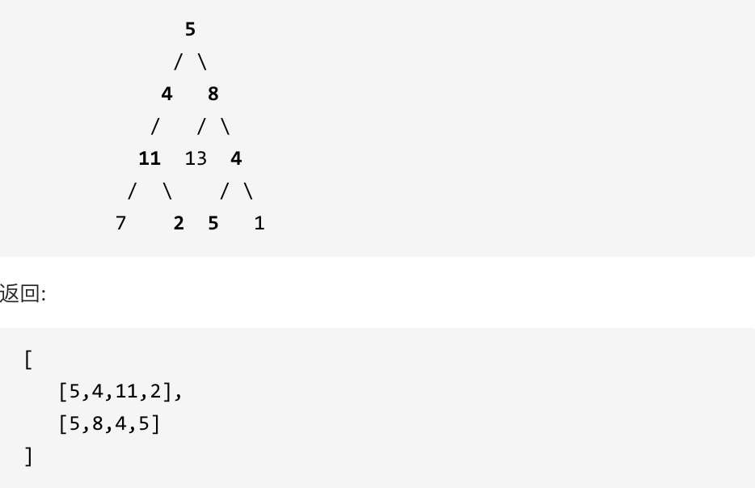

### 思路

113.路径总和ii要遍历整个树，找到所有路径，**所以递归函数不要返回值！**

如图：

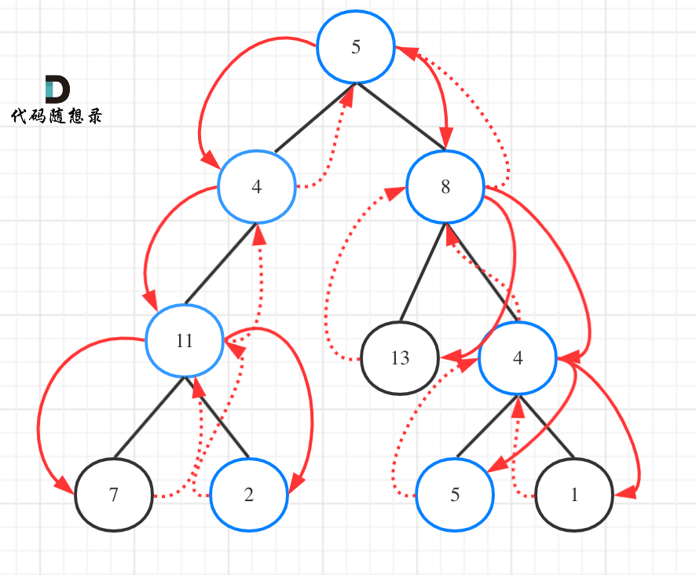

为了尽可能的把细节体现出来，我写出如下代码（**这份代码并不简洁，但是逻辑非常清晰**）

```cpp
class solution {
private:
    vector<vector<int>> result;
    vector<int> path;
    // 递归函数不需要返回值，因为我们要遍历整个树
    void traversal(TreeNode* cur, int count) {
        if (!cur->left && !cur->right && count == 0) { // 遇到了叶子节点且找到了和为sum的路径
            result.push_back(path);
            return;
        }
        if (!cur->left && !cur->right) return ; // 遇到叶子节点而没有找到合适的边，直接返回
        if (cur->left) { // 左 （空节点不遍历）
            path.push_back(cur->left->val);
            count -= cur->left->val;
            traversal(cur->left, count);    // 递归
            count += cur->left->val;        // 回溯
            path.pop_back();                // 回溯
        }
        if (cur->right) { // 右 （空节点不遍历）
            path.push_back(cur->right->val);
            count -= cur->right->val;
            traversal(cur->right, count);   // 递归
            count += cur->right->val;       // 回溯
            path.pop_back();                // 回溯
        }
        return ;
    }
public:
    vector<vector<int>> pathSum(TreeNode* root, int sum) {
        result.clear();
        path.clear();
        if (root == NULL) return result;
        path.push_back(root->val); // 把根节点放进路径
        traversal(root, sum - root->val);
        return result;
    }
};
```

至于113. 路径总和ii 的迭代法我并没有写，用迭代方式记录所有路径比较麻烦，也没有必要，如果大家感兴趣的话，可以再深入研究研究。

### 总结

本篇通过leetcode上112. 路径总和 和 113. 路径总和ii 详细的讲解了 递归函数什么时候需要返回值，什么不需要返回值。

这两道题目是掌握这一知识点非常好的题目，大家看完本篇文章再去做题，就会感受到搜索整棵树和搜索某一路径的差别。

对于112. 路径总和，我依然给出了递归法和迭代法，这种题目其实用迭代法会复杂一些，能掌握递归方式就够了！

看完本文，可以一起解决如下两道题目

- 106.从中序与后序遍历序列构造二叉树
- 105.从前序与中序遍历序列构造二叉树

# 18.从中序与后序遍历序列构造二叉树

[力扣题目链接](https://leetcode.cn/problems/construct-binary-tree-from-inorder-and-postorder-traversal/)

根据一棵树的中序遍历与后序遍历构造二叉树。

注意:你可以假设树中没有重复的元素。

例如，给出

- 中序遍历 `inorder = [9,3,15,20,7]`
- 后序遍历 `postorder = [9,15,7,20,3]`返回如下的二叉树：


## 算法公开课

[**《代码随想录》算法视频公开课**](https://programmercarl.com/other/gongkaike.html)**：坑很多！来看看你掉过几次坑 | LeetCode：106.从中序与后序遍历序列构造二** **叉树，相信结合视频在看本篇题解，更有助于大家对本题的理解**。

## 思路

首先回忆一下如何根据两个顺序构造一个唯一的二叉树，相信理论知识大家应该都清楚，就是以 后序数组的最后一个元素为切割点，先切中序数组，根据中序数组，反过来再切后序数组。一层一层切下去，每次后序数组最后一个元素就是节点元素。

如果让我们肉眼看两个序列，画一棵二叉树的话，应该分分钟都可以画出来。

流程如图：

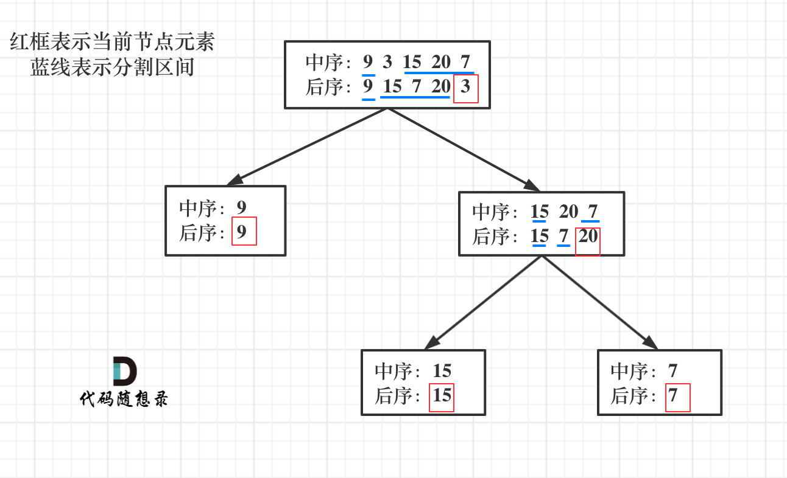

那么代码应该怎么写呢？

说到一层一层切割，就应该想到了递归。

来看一下一共分几步：

- 第一步：如果数组大小为零的话，说明是空节点了。
- 第二步：如果不为空，那么取后序数组最后一个元素作为节点元素。
- 第三步：找到后序数组最后一个元素在中序数组的位置，作为切割点
- 第四步：切割中序数组，切成中序左数组和中序右数组 （顺序别搞反了，一定是先切中序数组）
- 第五步：切割后序数组，切成后序左数组和后序右数组
- 第六步：递归处理左区间和右区间

不难写出如下代码：（先把框架写出来）

```cpp
TreeNode* traversal (vector<int>& inorder, vector<int>& postorder) {
    // 第一步
    if (postorder.size() == 0) return NULL;
    // 第二步：后序遍历数组最后一个元素，就是当前的中间节点
    int rootValue = postorder[postorder.size() - 1];
    TreeNode* root = new TreeNode(rootValue);
    // 叶子节点
    if (postorder.size() == 1) return root;
    // 第三步：找切割点
    int delimiterIndex;
    for (delimiterIndex = 0; delimiterIndex < inorder.size(); delimiterIndex++) {
        if (inorder[delimiterIndex] == rootValue) break;
    }
    // 第四步：切割中序数组，得到 中序左数组和中序右数组
    // 第五步：切割后序数组，得到 后序左数组和后序右数组
    // 第六步
    root->left = traversal(中序左数组, 后序左数组);
    root->right = traversal(中序右数组, 后序右数组);
    return root;
}
```

**难点大家应该发现了，就是如何切割，以及边界值找不好很容易乱套。**

此时应该注意确定切割的标准，是左闭右开，还有左开右闭，还是左闭右闭，这个就是不变量，要在递归中保持这个不变量。

**在切割的过程中会产生四个区间，把握不好不变量的话，一会左闭右开，一会左闭右闭，必然乱套！**

我在[数组：每次遇到二分法，都是一看就会，一写就废](https://programmercarl.com/0035.%E6%90%9C%E7%B4%A2%E6%8F%92%E5%85%A5%E4%BD%8D%E7%BD%AE.html)和[数组：这个循环可以转懵很多人！](https://programmercarl.com/0059.%E8%9E%BA%E6%97%8B%E7%9F%A9%E9%98%B5II.html)中都强调过循环不变量的重要性，在二分查找以及螺旋矩阵的求解中，坚持循环不变量非常重要，本题也是。

首先要切割中序数组，为什么先切割中序数组呢？

切割点在后序数组的最后一个元素，就是用这个元素来切割中序数组的，所以必要先切割中序数组。

中序数组相对比较好切，找到切割点（后序数组的最后一个元素）在中序数组的位置，然后切割，如下代码中我坚持左闭右开的原则：

```cpp
// 找到中序遍历的切割点
int delimiterIndex;
for (delimiterIndex = 0; delimiterIndex < inorder.size(); delimiterIndex++) {
    if (inorder[delimiterIndex] == rootValue) break;
}
// 左闭右开区间：[0, delimiterIndex)
vector<int> leftInorder(inorder.begin(), inorder.begin() + delimiterIndex);
// [delimiterIndex + 1, end)
vector<int> rightInorder(inorder.begin() + delimiterIndex + 1, inorder.end() );
```

接下来就要切割后序数组了。

首先后序数组的最后一个元素指定不能要了，这是切割点 也是 当前二叉树中间节点的元素，已经用了。

后序数组的切割点怎么找？

后序数组没有明确的切割元素来进行左右切割，不像中序数组有明确的切割点，切割点左右分开就可以了。

**此时有一个很重的点，就是中序数组大小一定是和后序数组的大小相同的（这是必然）。**

中序数组我们都切成了左中序数组和右中序数组了，那么后序数组就可以按照左中序数组的大小来切割，切成左后序数组和右后序数组。

代码如下：

```cpp
// postorder 舍弃末尾元素，因为这个元素就是中间节点，已经用过了
postorder.resize(postorder.size() - 1);
// 左闭右开，注意这里使用了左中序数组大小作为切割点：[0, leftInorder.size)
vector<int> leftPostorder(postorder.begin(), postorder.begin() + leftInorder.size());
// [leftInorder.size(), end)
vector<int> rightPostorder(postorder.begin() + leftInorder.size(), postorder.end());
```

此时，中序数组切成了左中序数组和右中序数组，后序数组切割成左后序数组和右后序数组。

接下来可以递归了，代码如下：

```cpp
root->left = traversal(leftInorder, leftPostorder);
root->right = traversal(rightInorder, rightPostorder);
```

完整代码如下：

```cpp
class Solution {
private:
    TreeNode* traversal (vector<int>& inorder, vector<int>& postorder) {
        if (postorder.size() == 0) return NULL;
        // 后序遍历数组最后一个元素，就是当前的中间节点
        int rootValue = postorder[postorder.size() - 1];
        TreeNode* root = new TreeNode(rootValue);
        // 叶子节点
        if (postorder.size() == 1) return root;
        // 找到中序遍历的切割点
        int delimiterIndex;
        for (delimiterIndex = 0; delimiterIndex < inorder.size(); delimiterIndex++) {
            if (inorder[delimiterIndex] == rootValue) break;
        }
        // 切割中序数组
        // 左闭右开区间：[0, delimiterIndex)
        vector<int> leftInorder(inorder.begin(), inorder.begin() + delimiterIndex);
        // [delimiterIndex + 1, end)
        vector<int> rightInorder(inorder.begin() + delimiterIndex + 1, inorder.end() );
        // postorder 舍弃末尾元素
        postorder.resize(postorder.size() - 1);
        // 切割后序数组
        // 依然左闭右开，注意这里使用了左中序数组大小作为切割点
        // [0, leftInorder.size)
        vector<int> leftPostorder(postorder.begin(), postorder.begin() +
leftInorder.size());
        // [leftInorder.size(), end)
        vector<int> rightPostorder(postorder.begin() + leftInorder.size(),
postorder.end());
        root->left = traversal(leftInorder, leftPostorder);
        root->right = traversal(rightInorder, rightPostorder);
        return root;
    }
public:
    TreeNode* buildTree(vector<int>& inorder, vector<int>& postorder) {
        if (inorder.size() == 0 || postorder.size() == 0) return NULL;
        return traversal(inorder, postorder);
    }
};
```

相信大家自己就算是思路清晰， 代码写出来一定是各种问题，所以一定要加日志来调试，看看是不是按照自己思路来切割的，不要大脑模拟，那样越想越糊涂。

加了日志的代码如下：（加了日志的代码不要在leetcode上提交，容易超时）

```cpp
class Solution {
private:
    TreeNode* traversal (vector<int>& inorder, vector<int>& postorder) {
        if (postorder.size() == 0) return NULL;
        int rootValue = postorder[postorder.size() - 1];
        TreeNode* root = new TreeNode(rootValue);
        if (postorder.size() == 1) return root;
        int delimiterIndex;
        for (delimiterIndex = 0; delimiterIndex < inorder.size(); delimiterIndex++) {
            if (inorder[delimiterIndex] == rootValue) break;
        }
        vector<int> leftInorder(inorder.begin(), inorder.begin() + delimiterIndex);
        vector<int> rightInorder(inorder.begin() + delimiterIndex + 1, inorder.end() );
        postorder.resize(postorder.size() - 1);
        vector<int> leftPostorder(postorder.begin(), postorder.begin() +
leftInorder.size());
        vector<int> rightPostorder(postorder.begin() + leftInorder.size(),
postorder.end());
        // 以下为日志
        cout << "----------" << endl;
        cout << "leftInorder :";
        for (int i : leftInorder) {
            cout << i << " ";
        }
        cout << endl;
        cout << "rightInorder :";
        for (int i : rightInorder) {
            cout << i << " ";
        }
        cout << endl;
        cout << "leftPostorder :";
        for (int i : leftPostorder) {
            cout << i << " ";
        }
        cout << endl;
         cout << "rightPostorder :";
        for (int i : rightPostorder) {
            cout << i << " ";
        }
        cout << endl;
        root->left = traversal(leftInorder, leftPostorder);
        root->right = traversal(rightInorder, rightPostorder);
        return root;
    }
public:
    TreeNode* buildTree(vector<int>& inorder, vector<int>& postorder) {
        if (inorder.size() == 0 || postorder.size() == 0) return NULL;
        return traversal(inorder, postorder);
    }
};
```

**此时应该发现了，如上的代码性能并不好，因为每层递归定义了新的vector（就是数组），既耗时又耗空间，但上** **面的代码是最好理解的，为了方便读者理解，所以用如上的代码来讲解。**

下面给出用下标索引写出的代码版本：（思路是一样的，只不过不用重复定义vector了，每次用下标索引来分割）

```cpp
class Solution {
private:
    // 中序区间：[inorderBegin, inorderEnd)，后序区间[postorderBegin, postorderEnd)
    TreeNode* traversal (vector<int>& inorder, int inorderBegin, int inorderEnd,
vector<int>& postorder, int postorderBegin, int postorderEnd) {
        if (postorderBegin == postorderEnd) return NULL;
        int rootValue = postorder[postorderEnd - 1];
        TreeNode* root = new TreeNode(rootValue);
        if (postorderEnd - postorderBegin == 1) return root;
        int delimiterIndex;
        for (delimiterIndex = inorderBegin; delimiterIndex < inorderEnd;
delimiterIndex++) {
            if (inorder[delimiterIndex] == rootValue) break;
        }
        // 切割中序数组
        // 左中序区间，左闭右开[leftInorderBegin, leftInorderEnd)
        int leftInorderBegin = inorderBegin;
        int leftInorderEnd = delimiterIndex;
        // 右中序区间，左闭右开[rightInorderBegin, rightInorderEnd)
        int rightInorderBegin = delimiterIndex + 1;
        int rightInorderEnd = inorderEnd;
        // 切割后序数组
        // 左后序区间，左闭右开[leftPostorderBegin, leftPostorderEnd)
        int leftPostorderBegin =  postorderBegin;
        int leftPostorderEnd = postorderBegin + delimiterIndex - inorderBegin; // 终止位
置是 需要加上 中序区间的大小size
        // 右后序区间，左闭右开[rightPostorderBegin, rightPostorderEnd)
        int rightPostorderBegin = postorderBegin + (delimiterIndex - inorderBegin);
        int rightPostorderEnd = postorderEnd - 1; // 排除最后一个元素，已经作为节点了
        root->left = traversal(inorder, leftInorderBegin, leftInorderEnd,  postorder,
leftPostorderBegin, leftPostorderEnd);
        root->right = traversal(inorder, rightInorderBegin, rightInorderEnd, postorder,
rightPostorderBegin, rightPostorderEnd);
        return root;
    }
public:
    TreeNode* buildTree(vector<int>& inorder, vector<int>& postorder) {
        if (inorder.size() == 0 || postorder.size() == 0) return NULL;
        // 左闭右开的原则
        return traversal(inorder, 0, inorder.size(), postorder, 0, postorder.size());
    }
};
```

那么这个版本写出来依然要打日志进行调试，打日志的版本如下：（**该版本不要在leetcode上提交，容易超时**）

```cpp
class Solution {
private:
    TreeNode* traversal (vector<int>& inorder, int inorderBegin, int inorderEnd,
vector<int>& postorder, int postorderBegin, int postorderEnd) {
        if (postorderBegin == postorderEnd) return NULL;
        int rootValue = postorder[postorderEnd - 1];
        TreeNode* root = new TreeNode(rootValue);
        if (postorderEnd - postorderBegin == 1) return root;
        int delimiterIndex;
        for (delimiterIndex = inorderBegin; delimiterIndex < inorderEnd;
delimiterIndex++) {
            if (inorder[delimiterIndex] == rootValue) break;
        }
        // 切割中序数组
        // 左中序区间，左闭右开[leftInorderBegin, leftInorderEnd)
        int leftInorderBegin = inorderBegin;
        int leftInorderEnd = delimiterIndex;
        // 右中序区间，左闭右开[rightInorderBegin, rightInorderEnd)
        int rightInorderBegin = delimiterIndex + 1;
        int rightInorderEnd = inorderEnd;
        // 切割后序数组
        // 左后序区间，左闭右开[leftPostorderBegin, leftPostorderEnd)
        int leftPostorderBegin =  postorderBegin;
        int leftPostorderEnd = postorderBegin + delimiterIndex - inorderBegin; // 终止位
置是 需要加上 中序区间的大小size
        // 右后序区间，左闭右开[rightPostorderBegin, rightPostorderEnd)
        int rightPostorderBegin = postorderBegin + (delimiterIndex - inorderBegin);
        int rightPostorderEnd = postorderEnd - 1; // 排除最后一个元素，已经作为节点了
        cout << "----------" << endl;
        cout << "leftInorder :";
        for (int i = leftInorderBegin; i < leftInorderEnd; i++) {
            cout << inorder[i] << " ";
        }
        cout << endl;
        cout << "rightInorder :";
        for (int i = rightInorderBegin; i < rightInorderEnd; i++) {
            cout << inorder[i] << " ";
        }
        cout << endl;
        cout << "leftpostorder :";
        for (int i = leftPostorderBegin; i < leftPostorderEnd; i++) {
            cout << postorder[i] << " ";
        }
        cout << endl;
        cout << "rightpostorder :";
        for (int i = rightPostorderBegin; i < rightPostorderEnd; i++) {
            cout << postorder[i] << " ";
        }
        cout << endl;
        root->left = traversal(inorder, leftInorderBegin, leftInorderEnd,  postorder,
leftPostorderBegin, leftPostorderEnd);
        root->right = traversal(inorder, rightInorderBegin, rightInorderEnd, postorder,
rightPostorderBegin, rightPostorderEnd);
        return root;
    }
public:
    TreeNode* buildTree(vector<int>& inorder, vector<int>& postorder) {
        if (inorder.size() == 0 || postorder.size() == 0) return NULL;
        return traversal(inorder, 0, inorder.size(), postorder, 0, postorder.size());
    }
};
```

## 相关题目推荐

### 从前序与中序遍历序列构造二叉树

[力扣题目链接](https://leetcode.cn/problems/construct-binary-tree-from-preorder-and-inorder-traversal/)

根据一棵树的前序遍历与中序遍历构造二叉树。

注意:你可以假设树中没有重复的元素。

例如，给出

前序遍历 `preorder = [3,9,20,15,7]`中序遍历 `inorder = [9,3,15,20,7]`返回如下的二叉树：

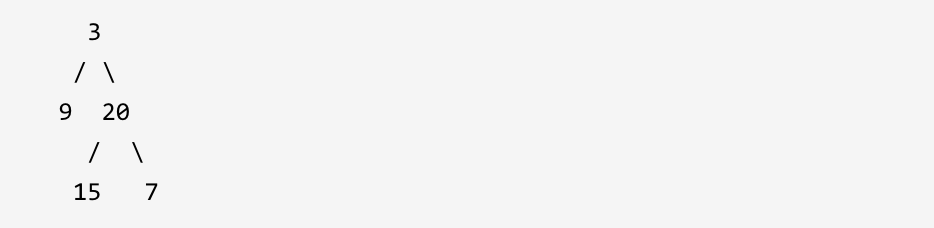

### 思路

本题和106是一样的道理。

我就直接给出代码了。

带日志的版本`C++`代码如下： （**带日志的版本仅用于调试，不要在leetcode上提交，会超时**）

```cpp
class Solution {
private:
        TreeNode* traversal (vector<int>& inorder, int inorderBegin, int inorderEnd,
vector<int>& preorder, int preorderBegin, int preorderEnd) {
        if (preorderBegin == preorderEnd) return NULL;
        int rootValue = preorder[preorderBegin]; // 注意用preorderBegin 不要用0
        TreeNode* root = new TreeNode(rootValue);
        if (preorderEnd - preorderBegin == 1) return root;
        int delimiterIndex;
        for (delimiterIndex = inorderBegin; delimiterIndex < inorderEnd;
delimiterIndex++) {
            if (inorder[delimiterIndex] == rootValue) break;
        }
        // 切割中序数组
        // 中序左区间，左闭右开[leftInorderBegin, leftInorderEnd)
        int leftInorderBegin = inorderBegin;
        int leftInorderEnd = delimiterIndex;
        // 中序右区间，左闭右开[rightInorderBegin, rightInorderEnd)
        int rightInorderBegin = delimiterIndex + 1;
        int rightInorderEnd = inorderEnd;
        // 切割前序数组
        // 前序左区间，左闭右开[leftPreorderBegin, leftPreorderEnd)
        int leftPreorderBegin =  preorderBegin + 1;
        int leftPreorderEnd = preorderBegin + 1 + delimiterIndex - inorderBegin; // 终止
位置是起始位置加上中序左区间的大小size
        // 前序右区间, 左闭右开[rightPreorderBegin, rightPreorderEnd)
        int rightPreorderBegin = preorderBegin + 1 + (delimiterIndex - inorderBegin);
        int rightPreorderEnd = preorderEnd;
        cout << "----------" << endl;
        cout << "leftInorder :";
        for (int i = leftInorderBegin; i < leftInorderEnd; i++) {
            cout << inorder[i] << " ";
        }
        cout << endl;
        cout << "rightInorder :";
        for (int i = rightInorderBegin; i < rightInorderEnd; i++) {
            cout << inorder[i] << " ";
        }
        cout << endl;
        cout << "leftPreorder :";
        for (int i = leftPreorderBegin; i < leftPreorderEnd; i++) {
            cout << preorder[i] << " ";
        }
        cout << endl;
        cout << "rightPreorder :";
        for (int i = rightPreorderBegin; i < rightPreorderEnd; i++) {
            cout << preorder[i] << " ";
        }
        cout << endl;
        root->left = traversal(inorder, leftInorderBegin, leftInorderEnd,  preorder,
leftPreorderBegin, leftPreorderEnd);
        root->right = traversal(inorder, rightInorderBegin, rightInorderEnd, preorder,
rightPreorderBegin, rightPreorderEnd);
        return root;
    }
public:
    TreeNode* buildTree(vector<int>& preorder, vector<int>& inorder) {
        if (inorder.size() == 0 || preorder.size() == 0) return NULL;
        return traversal(inorder, 0, inorder.size(), preorder, 0, preorder.size());
    }
};
```

105.从前序与中序遍历序列构造二叉树，最后版本，`C++`代码：

```cpp
class Solution {
private:
        TreeNode* traversal (vector<int>& inorder, int inorderBegin, int inorderEnd,
vector<int>& preorder, int preorderBegin, int preorderEnd) {
        if (preorderBegin == preorderEnd) return NULL;
        int rootValue = preorder[preorderBegin]; // 注意用preorderBegin 不要用0
        TreeNode* root = new TreeNode(rootValue);
        if (preorderEnd - preorderBegin == 1) return root;
        int delimiterIndex;
        for (delimiterIndex = inorderBegin; delimiterIndex < inorderEnd;
delimiterIndex++) {
            if (inorder[delimiterIndex] == rootValue) break;
        }
        // 切割中序数组
        // 中序左区间，左闭右开[leftInorderBegin, leftInorderEnd)
        int leftInorderBegin = inorderBegin;
        int leftInorderEnd = delimiterIndex;
        // 中序右区间，左闭右开[rightInorderBegin, rightInorderEnd)
        int rightInorderBegin = delimiterIndex + 1;
        int rightInorderEnd = inorderEnd;
        // 切割前序数组
        // 前序左区间，左闭右开[leftPreorderBegin, leftPreorderEnd)
        int leftPreorderBegin =  preorderBegin + 1;
        int leftPreorderEnd = preorderBegin + 1 + delimiterIndex - inorderBegin; // 终止
位置是起始位置加上中序左区间的大小size
        // 前序右区间, 左闭右开[rightPreorderBegin, rightPreorderEnd)
        int rightPreorderBegin = preorderBegin + 1 + (delimiterIndex - inorderBegin);
        int rightPreorderEnd = preorderEnd;
        root->left = traversal(inorder, leftInorderBegin, leftInorderEnd,  preorder,
leftPreorderBegin, leftPreorderEnd);
        root->right = traversal(inorder, rightInorderBegin, rightInorderEnd, preorder,
rightPreorderBegin, rightPreorderEnd);
        return root;
    }
public:
    TreeNode* buildTree(vector<int>& preorder, vector<int>& inorder) {
        if (inorder.size() == 0 || preorder.size() == 0) return NULL;
        // 参数坚持左闭右开的原则
        return traversal(inorder, 0, inorder.size(), preorder, 0, preorder.size());
    }
};
```

## 思考题

前序和中序可以唯一确定一棵二叉树。

后序和中序可以唯一确定一棵二叉树。

那么前序和后序可不可以唯一确定一棵二叉树呢？

**前序和后序不能唯一确定一棵二叉树！**，因为没有中序遍历无法确定左右部分，也就是无法分割。

举一个例子：

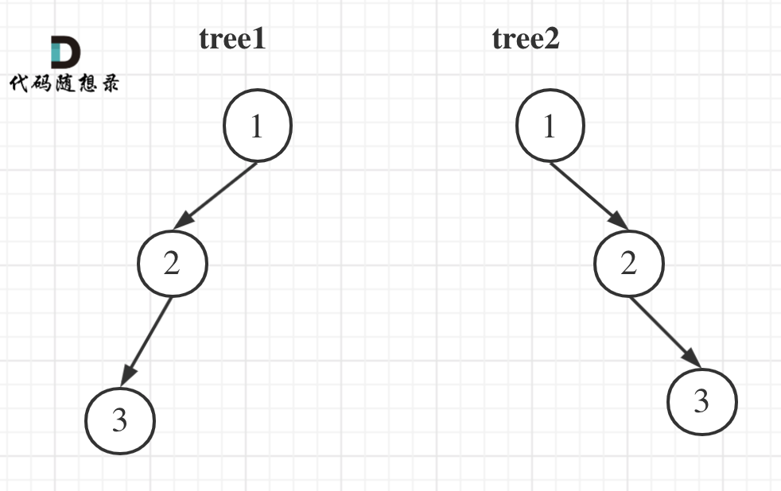

tree1 的前序遍历是`[1 2 3]`， 后序遍历是`[3 2 1]`。

tree2 的前序遍历是`[1 2 3]`， 后序遍历是`[3 2 1]`。

那么tree1 和 tree2 的前序和后序完全相同，这是一棵树么，很明显是两棵树！

所以前序和后序不能唯一确定一棵二叉树！

## 总结

之前我们讲的二叉树题目都是各种遍历二叉树，这次开始构造二叉树了，思路其实比较简单，但是真正代码实现出来并不容易。

所以要避免眼高手低，踏实地把代码写出来。

我同时给出了添加日志的代码版本，因为这种题目是不太容易写出来调一调就能过的，所以一定要把流程日志打出来，看看符不符合自己的思路。

大家遇到这种题目的时候，也要学会打日志来调试（如何打日志有时候也是个技术活），不要脑动模拟，脑动模拟很容易越想越乱。

最后我还给出了为什么前序和中序可以唯一确定一棵二叉树，后序和中序可以唯一确定一棵二叉树，而前序和后序却不行。

认真研究完本篇，相信大家对二叉树的构造会清晰很多。

# 19.最大二叉树

[力扣题目地址](https://leetcode.cn/problems/maximum-binary-tree/)

给定一个不含重复元素的整数数组。一个以此数组构建的最大二叉树定义如下：

- 二叉树的根是数组中的最大元素。
- 左子树是通过数组中最大值左边部分构造出的最大二叉树。
- 右子树是通过数组中最大值右边部分构造出的最大二叉树。

通过给定的数组构建最大二叉树，并且输出这个树的根节点。

示例 ：

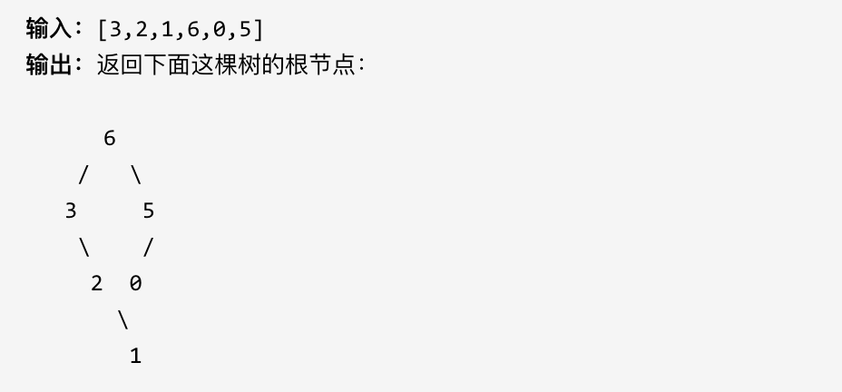

提示：

给定的数组的大小在 `[1, 1000]` 之间。

## 算法公开课

[**《代码随想录》算法视频公开课**](https://programmercarl.com/other/gongkaike.html)**：**[**又是构造二叉树，又有很多坑！| LeetCode：654.最大二叉树**](https://www.bilibili.com/video/BV1MG411G7ox)**，相信结合视频** **在看本篇题解，更有助于大家对本题的理解**。

## 思路

最大二叉树的构建过程如下：

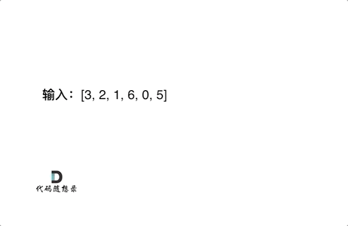

构造树一般采用的是前序遍历，因为先构造中间节点，然后递归构造左子树和右子树。

- 确定递归函数的参数和返回值

参数传入的是存放元素的数组，返回该数组构造的二叉树的头结点，返回类型是指向节点的指针。

代码如下：

```cpp
TreeNode* constructMaximumBinaryTree(vector<int>& nums)
```

- 确定终止条件

题目中说了输入的数组大小一定是大于等于1的，所以我们不用考虑小于1的情况，那么当递归遍历的时候，如果传入的数组大小为1，说明遍历到了叶子节点了。

那么应该定义一个新的节点，并把这个数组的数值赋给新的节点，然后返回这个节点。 这表示一个数组大小是1的时候，构造了一个新的节点，并返回。

代码如下：

```cpp
TreeNode* node = new TreeNode(0);
if (nums.size() == 1) {
    node->val = nums[0];
    return node;
}
```

- 确定单层递归的逻辑

这里有三步工作

1. 先要找到数组中最大的值和对应的下标， 最大的值构造根节点，下标用来下一步分割数组。

代码如下：

```cpp
int maxValue = 0;
int maxValueIndex = 0;
for (int i = 0; i < nums.size(); i++) {
    if (nums[i] > maxValue) {
        maxValue = nums[i];
        maxValueIndex = i;
    }
}
TreeNode* node = new TreeNode(0);
node->val = maxValue;
```

2. 最大值所在的下标左区间 构造左子树

这里要判断`maxValueIndex > 0`，因为要保证左区间至少有一个数值。

代码如下：

```cpp
if (maxValueIndex > 0) {
    vector<int> newVec(nums.begin(), nums.begin() + maxValueIndex);
    node->left = constructMaximumBinaryTree(newVec);
}
```

3. 最大值所在的下标右区间 构造右子树

判断`maxValueIndex < (nums.size() - 1)`，确保右区间至少有一个数值。

代码如下：

```cpp
if (maxValueIndex < (nums.size() - 1)) {
    vector<int> newVec(nums.begin() + maxValueIndex + 1, nums.end());
    node->right = constructMaximumBinaryTree(newVec);
}
```

这样我们就分析完了，整体代码如下：（详细注释）

```cpp
class Solution {
public:
    TreeNode* constructMaximumBinaryTree(vector<int>& nums) {
        TreeNode* node = new TreeNode(0);
        if (nums.size() == 1) {
            node->val = nums[0];
            return node;
        }
        // 找到数组中最大的值和对应的下标
        int maxValue = 0;
        int maxValueIndex = 0;
        for (int i = 0; i < nums.size(); i++) {
            if (nums[i] > maxValue) {
                maxValue = nums[i];
                maxValueIndex = i;
            }
        }
        node->val = maxValue;
        // 最大值所在的下标左区间 构造左子树
        if (maxValueIndex > 0) {
            vector<int> newVec(nums.begin(), nums.begin() + maxValueIndex);
            node->left = constructMaximumBinaryTree(newVec);
        }
        // 最大值所在的下标右区间 构造右子树
        if (maxValueIndex < (nums.size() - 1)) {
            vector<int> newVec(nums.begin() + maxValueIndex + 1, nums.end());
            node->right = constructMaximumBinaryTree(newVec);
        }
        return node;
    }
};
```

以上代码比较冗余，效率也不高，每次还要切割的时候每次都要定义新的vector（也就是数组），但逻辑比较清晰。

和文章[二叉树：构造二叉树登场！](https://programmercarl.com/0106.%E4%BB%8E%E4%B8%AD%E5%BA%8F%E4%B8%8E%E5%90%8E%E5%BA%8F%E9%81%8D%E5%8E%86%E5%BA%8F%E5%88%97%E6%9E%84%E9%80%A0%E4%BA%8C%E5%8F%89%E6%A0%91.html)中一样的优化思路，就是每次分隔不用定义新的数组，而是通过下标索引直接在原数组上操作。

优化后代码如下：

```cpp
class Solution {
private:
    // 在左闭右开区间[left, right)，构造二叉树
    TreeNode* traversal(vector<int>& nums, int left, int right) {
        if (left >= right) return nullptr;
        // 分割点下标：maxValueIndex
        int maxValueIndex = left;
        for (int i = left + 1; i < right; ++i) {
            if (nums[i] > nums[maxValueIndex]) maxValueIndex = i;
        }
        TreeNode* root = new TreeNode(nums[maxValueIndex]);
        // 左闭右开：[left, maxValueIndex)
        root->left = traversal(nums, left, maxValueIndex);
        // 左闭右开：[maxValueIndex + 1, right)
        root->right = traversal(nums, maxValueIndex + 1, right);
        return root;
    }
public:
    TreeNode* constructMaximumBinaryTree(vector<int>& nums) {
        return traversal(nums, 0, nums.size());
    }
};
```

## 拓展

可以发现上面的代码看上去简洁一些，**主要是因为第二版其实是允许空节点进入递归，所以不用在递归的时候加判** **断节点是否为空**

第一版递归过程：（加了if判断，为了不让空节点进入递归）

```cpp
if (maxValueIndex > 0) { // 这里加了判断是为了不让空节点进入递归
    vector<int> newVec(nums.begin(), nums.begin() + maxValueIndex);
    node->left = constructMaximumBinaryTree(newVec);
}
if (maxValueIndex < (nums.size() - 1)) { // 这里加了判断是为了不让空节点进入递归
    vector<int> newVec(nums.begin() + maxValueIndex + 1, nums.end());
    node->right = constructMaximumBinaryTree(newVec);
}
```

第二版递归过程： （如下代码就没有加if判断）

```cpp
root->left = traversal(nums, left, maxValueIndex);
root->right = traversal(nums, maxValueIndex + 1, right);
```

第二版代码是允许空节点进入递归，所以没有加if判断，当然终止条件也要有相应的改变。

第一版终止条件，是遇到叶子节点就终止，因为空节点不会进入递归。

第二版相应的终止条件，是遇到空节点，也就是数组区间为0，就终止了。

## 总结

这道题目其实和 [二叉树：构造二叉树登场！](https://programmercarl.com/0106.%E4%BB%8E%E4%B8%AD%E5%BA%8F%E4%B8%8E%E5%90%8E%E5%BA%8F%E9%81%8D%E5%8E%86%E5%BA%8F%E5%88%97%E6%9E%84%E9%80%A0%E4%BA%8C%E5%8F%89%E6%A0%91.html) 是一个思路，比[二叉树：构造二叉树登场！](https://programmercarl.com/0106.%E4%BB%8E%E4%B8%AD%E5%BA%8F%E4%B8%8E%E5%90%8E%E5%BA%8F%E9%81%8D%E5%8E%86%E5%BA%8F%E5%88%97%E6%9E%84%E9%80%A0%E4%BA%8C%E5%8F%89%E6%A0%91.html) 还简单一些。

**注意类似用数组构造二叉树的题目，每次分隔尽量不要定义新的数组，而是通过下标索引直接在原数组上操作，这** **样可以节约时间和空间上的开销。**

一些同学也会疑惑，什么时候递归函数前面加if，什么时候不加if，这个问题我在最后也给出了解释。

其实就是不同代码风格的实现，**一般情况来说：如果让空节点（空指针）进入递归，就不加if，如果不让空节点进** **入递归，就加if限制一下， 终止条件也会相应的调整。**

# 20.本周小结！（二叉树系列三）

## 周一

在[二叉树：以为使用了递归，其实还隐藏着回溯](https://programmercarl.com/%E4%BA%8C%E5%8F%89%E6%A0%91%E4%B8%AD%E9%80%92%E5%BD%92%E5%B8%A6%E7%9D%80%E5%9B%9E%E6%BA%AF.html)中，通过leetcode [257.二叉树的所有路径这道题目](https://programmercarl.com/0257.%E4%BA%8C%E5%8F%89%E6%A0%91%E7%9A%84%E6%89%80%E6%9C%89%E8%B7%AF%E5%BE%84.html)，讲解了递归如何隐藏着回溯，一些代码会把回溯的过程都隐藏了起来了，甚至刷过这道题的同学可能都不知道自己用了回溯。

文章中第一版代码把每一个细节都展示了输出来了，大家可以清晰的看到回溯的过程。

然后给出了第二版优化后的代码，分析了其回溯隐藏在了哪里，如果要把这个回溯扣出来的话，在第二版的基础上应该怎么改。

主要需要理解：**回溯隐藏在traversal(cur->left, path + "->", result);中的 path + "->"。 每次函数调用完，path** **依然是没有加上"->" 的，这就是回溯了。**

## 周二

在文章[二叉树：做了这么多题目了，我的左叶子之和是多少？](https://programmercarl.com/0404.%E5%B7%A6%E5%8F%B6%E5%AD%90%E4%B9%8B%E5%92%8C.html) 中提供了另一个判断节点属性的思路，平时我们习惯了使用通过节点的左右孩子判断本节点的属性，但发现使用这个思路无法判断左叶子。

此时需要相连的三层之间构成的约束条件，也就是要通过节点的父节点以及孩子节点来判断本节点的属性。

这道题目可以扩展大家对二叉树的解题思路。

## 周三

在[二叉树：我的左下角的值是多少？](https://programmercarl.com/0513.%E6%89%BE%E6%A0%91%E5%B7%A6%E4%B8%8B%E8%A7%92%E7%9A%84%E5%80%BC.html)中的题目如果使用递归的写法还是有点难度的，层次遍历反而很简单。

题目其实就是要在树的**最后一行**找到**最左边的值**。

**如何判断是最后一行呢，其实就是深度最大的叶子节点一定是最后一行。**

在这篇文章中，我们使用递归算法实实在在的求了一次深度，然后使用靠左的遍历，保证求得靠左的最大深度，而且又一次使用了回溯。

如果对二叉树的高度与深度又有点模糊了，在看这里[二叉树：我平衡么？](https://programmercarl.com/0110.%E5%B9%B3%E8%A1%A1%E4%BA%8C%E5%8F%89%E6%A0%91.html)，回忆一下吧。

[二叉树：我的左下角的值是多少？](https://programmercarl.com/0513.%E6%89%BE%E6%A0%91%E5%B7%A6%E4%B8%8B%E8%A7%92%E7%9A%84%E5%80%BC.html)中把我们之前讲过的内容都过了一遍，此外，还用前序遍历的技巧求得了靠左的最大深度。

**求二叉树的各种最值，就想应该采用什么样的遍历顺序，确定了遍历循序，其实就和数组求最值一样容易了。**

## 周四

在[二叉树：递归函数究竟什么时候需要返回值，什么时候不要返回值？](https://programmercarl.com/0112.%E8%B7%AF%E5%BE%84%E6%80%BB%E5%92%8C.html)中通过两道题目，彻底说清楚递归函数的返回值问题。

一般情况下：**如果需要搜索整棵二叉树，那么递归函数就不要返回值，如果要搜索其中一条符合条件的路径，递归** **函数就需要返回值，因为遇到符合条件的路径了就要及时返回。**

特别是有些时候 递归函数的返回值是bool类型，一些同学会疑惑为啥要加这个，其实就是为了找到一条边立刻返回。

其实还有一种就是后序遍历需要根据左右递归的返回值推出中间节点的状态，这种需要有返回值，例如222.完全二叉树，[110.平衡二叉树](https://programmercarl.com/0110.%E5%B9%B3%E8%A1%A1%E4%BA%8C%E5%8F%89%E6%A0%91.html)，这几道我们之前也讲过。

## 周五

之前都是讲解遍历二叉树，这次该构造二叉树了，在[二叉树：构造二叉树登场！](https://programmercarl.com/0106.%E4%BB%8E%E4%B8%AD%E5%BA%8F%E4%B8%8E%E5%90%8E%E5%BA%8F%E9%81%8D%E5%8E%86%E5%BA%8F%E5%88%97%E6%9E%84%E9%80%A0%E4%BA%8C%E5%8F%89%E6%A0%91.html)中，我们通过前序和中序，后序和中序，构造了唯一的一棵二叉树。

**构造二叉树有三个注意的点：**

- 分割时候，坚持区间不变量原则，左闭右开，或者左闭又闭。
- 分割的时候，注意后序 或者 前序已经有一个节点作为中间节点了，不能继续使用了。
- 如何使用切割后的后序数组来切合中序数组？利用中序数组大小一定是和后序数组的大小相同这一特点来进行切割。

这道题目代码实现并不简单，大家啃下来之后，二叉树的构造应该不是问题了。

**最后我还给出了为什么前序和后序不能唯一构成一棵二叉树，因为没有中序遍历就无法确定左右部分，也就无法分** **割。**

## 周六

知道了如何构造二叉树，那么使用一个套路就可以解决文章[二叉树：构造一棵最大的二叉树](https://programmercarl.com/0654.%E6%9C%80%E5%A4%A7%E4%BA%8C%E5%8F%89%E6%A0%91.html)中的问题。

**注意类似用数组构造二叉树的题目，每次分隔尽量不要定义新的数组，而是通过下标索引直接在原数组上操作，这** **样可以节约时间和空间上的开销。**

文章中我还给出了递归函数什么时候加if，什么时候不加if，其实就是控制空节点（空指针）是否进入递归，是不同的代码实现方式，都是可以的。

**一般情况来说：如果让空节点（空指针）进入递归，就不加if，如果不让空节点进入递归，就加if限制一下， 终止** **条件也会相应的调整。**

## 总结

本周我们深度讲解了如下知识点：

1. [递归中如何隐藏着回溯](https://programmercarl.com/%E4%BA%8C%E5%8F%89%E6%A0%91%E4%B8%AD%E9%80%92%E5%BD%92%E5%B8%A6%E7%9D%80%E5%9B%9E%E6%BA%AF.html) 2. [如何通过三层关系确定左叶子](https://programmercarl.com/0404.%E5%B7%A6%E5%8F%B6%E5%AD%90%E4%B9%8B%E5%92%8C.html) 3. [如何通过二叉树深度来判断左下角的值](https://programmercarl.com/0513.%E6%89%BE%E6%A0%91%E5%B7%A6%E4%B8%8B%E8%A7%92%E7%9A%84%E5%80%BC.html) 4. [递归函数究竟什么时候需要返回值，什么时候不要返回值？](https://programmercarl.com/0112.%E8%B7%AF%E5%BE%84%E6%80%BB%E5%92%8C.html) 5. [前序和中序，后序和中序构造唯一二叉树](https://programmercarl.com/0106.%E4%BB%8E%E4%B8%AD%E5%BA%8F%E4%B8%8E%E5%90%8E%E5%BA%8F%E9%81%8D%E5%8E%86%E5%BA%8F%E5%88%97%E6%9E%84%E9%80%A0%E4%BA%8C%E5%8F%89%E6%A0%91.html) 6. [使用数组构造某一特性的二叉树](https://programmercarl.com/0654.%E6%9C%80%E5%A4%A7%E4%BA%8C%E5%8F%89%E6%A0%91.html)

**如果大家一路跟下来，一定收获满满，如果周末不做这个总结，大家可能都不知道自己收获满满，啊哈！**

# 21.合并二叉树

[力扣题目链接](https://leetcode.cn/problems/merge-two-binary-trees/)

给定两个二叉树，想象当你将它们中的一个覆盖到另一个上时，两个二叉树的一些节点便会重叠。

你需要将他们合并为一个新的二叉树。合并的规则是如果两个节点重叠，那么将他们的值相加作为节点合并后的新值，否则不为 NULL 的节点将直接作为新二叉树的节点。

示例 1:

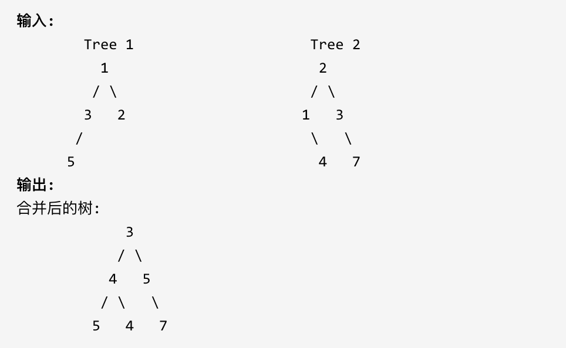

注意: 合并必须从两个树的根节点开始。

## 算法公开课

[**《代码随想录》算法视频公开课**](https://programmercarl.com/other/gongkaike.html)**：**[**一起操作两个二叉树？有点懵！| LeetCode：617.合并二叉树**](https://www.bilibili.com/video/BV1m14y1Y7JK)**，相信结合视频** **在看本篇题解，更有助于大家对本题的理解**。

## 思路

相信这道题目很多同学疑惑的点是如何同时遍历两个二叉树呢？

其实和遍历一个树逻辑是一样的，只不过传入两个树的节点，同时操作。

### 递归

二叉树使用递归，就要想使用前中后哪种遍历方式？

**本题使用哪种遍历都是可以的！**

我们下面以前序遍历为例。

动画如下：

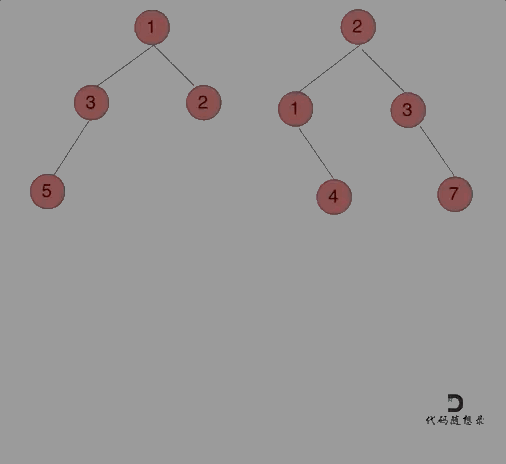

那么我们来按照递归三部曲来解决：

1. **确定递归函数的参数和返回值：**

首先要合入两个二叉树，那么参数至少是要传入两个二叉树的根节点，返回值就是合并之后二叉树的根节点。

代码如下：

```cpp
TreeNode* mergeTrees(TreeNode* t1, TreeNode* t2) {
```

2. **确定终止条件：**

因为是传入了两个树，那么就有两个树遍历的节点t1 和 t2，如果`t1 == NULL` 了，两个树合并就应该是 t2 了（如果t2也为NULL也无所谓，合并之后就是NULL）。

反过来如果`t2 == NULL`，那么两个数合并就是t1（如果t1也为NULL也无所谓，合并之后就是NULL）。

代码如下：

```cpp
if (t1 == NULL) return t2; // 如果t1为空，合并之后就应该是t2
if (t2 == NULL) return t1; // 如果t2为空，合并之后就应该是t1
```

3. **确定单层递归的逻辑：**

单层递归的逻辑就比较好写了，这里我们重复利用一下t1这个树，t1就是合并之后树的根节点（就是修改了原来树的结构）。

那么单层递归中，就要把两棵树的元素加到一起。

```cpp
t1->val += t2->val;
```

接下来t1 的左子树是：合并 t1左子树 t2左子树之后的左子树。

t1 的右子树：是 合并 t1右子树 t2右子树之后的右子树。

最终t1就是合并之后的根节点。

代码如下：

```cpp
t1->left = mergeTrees(t1->left, t2->left);
t1->right = mergeTrees(t1->right, t2->right);
return t1;
```

此时前序遍历，完整代码就写出来了，如下：

```cpp
class Solution {
public:
    TreeNode* mergeTrees(TreeNode* t1, TreeNode* t2) {
        if (t1 == NULL) return t2; // 如果t1为空，合并之后就应该是t2
        if (t2 == NULL) return t1; // 如果t2为空，合并之后就应该是t1
        // 修改了t1的数值和结构
        t1->val += t2->val;                             // 中
        t1->left = mergeTrees(t1->left, t2->left);      // 左
        t1->right = mergeTrees(t1->right, t2->right);   // 右
        return t1;
    }
};
```

那么中序遍历也是可以的，代码如下：

```cpp
class Solution {
public:
    TreeNode* mergeTrees(TreeNode* t1, TreeNode* t2) {
        if (t1 == NULL) return t2; // 如果t1为空，合并之后就应该是t2
        if (t2 == NULL) return t1; // 如果t2为空，合并之后就应该是t1
        // 修改了t1的数值和结构
        t1->left = mergeTrees(t1->left, t2->left);      // 左
        t1->val += t2->val;                             // 中
        t1->right = mergeTrees(t1->right, t2->right);   // 右
        return t1;
    }
};
```

后序遍历依然可以，代码如下：

```cpp
class Solution {
public:
    TreeNode* mergeTrees(TreeNode* t1, TreeNode* t2) {
        if (t1 == NULL) return t2; // 如果t1为空，合并之后就应该是t2
        if (t2 == NULL) return t1; // 如果t2为空，合并之后就应该是t1
        // 修改了t1的数值和结构
        t1->left = mergeTrees(t1->left, t2->left);      // 左
        t1->right = mergeTrees(t1->right, t2->right);   // 右
        t1->val += t2->val;                             // 中
        return t1;
    }
};
```

**但是前序遍历是最好理解的，我建议大家用前序遍历来做就OK。**

如上的方法修改了t1的结构，当然也可以不修改t1和t2的结构，重新定义一个树。

不修改输入树的结构，前序遍历，代码如下：

```cpp
class Solution {
public:
    TreeNode* mergeTrees(TreeNode* t1, TreeNode* t2) {
        if (t1 == NULL) return t2;
        if (t2 == NULL) return t1;
        // 重新定义新的节点，不修改原有两个树的结构
        TreeNode* root = new TreeNode(0);
        root->val = t1->val + t2->val;
        root->left = mergeTrees(t1->left, t2->left);
        root->right = mergeTrees(t1->right, t2->right);
        return root;
    }
};
```

### 迭代法

使用迭代法，如何同时处理两棵树呢？

思路我们在[二叉树：我对称么？](https://programmercarl.com/0101.%E5%AF%B9%E7%A7%B0%E4%BA%8C%E5%8F%89%E6%A0%91.html)中的迭代法已经讲过一次了，求二叉树对称的时候就是把两个树的节点同时加入队列进行比较。

本题我们也使用队列，模拟的层序遍历，代码如下：

```cpp
class Solution {
public:
    TreeNode* mergeTrees(TreeNode* t1, TreeNode* t2) {
        if (t1 == NULL) return t2;
        if (t2 == NULL) return t1;
        queue<TreeNode*> que;
        que.push(t1);
        que.push(t2);
        while(!que.empty()) {
            TreeNode* node1 = que.front(); que.pop();
            TreeNode* node2 = que.front(); que.pop();
            // 此时两个节点一定不为空，val相加
            node1->val += node2->val;
            // 如果两棵树左节点都不为空，加入队列
            if (node1->left != NULL && node2->left != NULL) {
                que.push(node1->left);
                que.push(node2->left);
            }
            // 如果两棵树右节点都不为空，加入队列
            if (node1->right != NULL && node2->right != NULL) {
                que.push(node1->right);
                que.push(node2->right);
            }
            // 当t1的左节点 为空 t2左节点不为空，就赋值过去
            if (node1->left == NULL && node2->left != NULL) {
                node1->left = node2->left;
            }
            // 当t1的右节点 为空 t2右节点不为空，就赋值过去
            if (node1->right == NULL && node2->right != NULL) {
                node1->right = node2->right;
            }
        }
        return t1;
    }
};
```

## 拓展

当然也可以秀一波指针的操作，这是我写的野路子，大家就随便看看就行了，以防带跑偏了。

如下代码中，想要更改二叉树的值，应该传入指向指针的指针。

代码如下：（前序遍历）

```cpp
class Solution {
public:
    void process(TreeNode** t1, TreeNode** t2) {
        if ((*t1) == NULL && (*t2) == NULL) return;
        if ((*t1) != NULL && (*t2) != NULL) {
            (*t1)->val += (*t2)->val;
        }
        if ((*t1) == NULL && (*t2) != NULL) {
            *t1 = *t2;
            return;
        }
        if ((*t1) != NULL && (*t2) == NULL) {
            return;
        }
        process(&((*t1)->left), &((*t2)->left));
        process(&((*t1)->right), &((*t2)->right));
    }
    TreeNode* mergeTrees(TreeNode* t1, TreeNode* t2) {
        process(&t1, &t2);
        return t1;
    }
};
```

## 总结

合并二叉树，也是二叉树操作的经典题目，如果没有接触过的话，其实并不简单，因为我们习惯了操作一个二叉树，一起操作两个二叉树，还会有点懵懵的。

这不是我们第一次操作两棵二叉树了，在[二叉树：我对称么？](https://programmercarl.com/0101.%E5%AF%B9%E7%A7%B0%E4%BA%8C%E5%8F%89%E6%A0%91.html)中也一起操作了两棵二叉树。

迭代法中，一般一起操作两个树都是使用队列模拟类似层序遍历，同时处理两个树的节点，这种方式最好理解，如果用模拟递归的思路的话，要复杂一些。

最后拓展中，我给了一个操作指针的野路子，大家随便看看就行了，如果学习`C++`的话，可以再去研究研究。

# 22.二叉搜索树中的搜索

[力扣题目地址](https://leetcode.cn/problems/search-in-a-binary-search-tree/)

给定二叉搜索树（BST）的根节点和一个值。 你需要在BST中找到节点值等于给定值的节点。 返回以该节点为根的子树。 如果节点不存在，则返回 NULL。

例如，

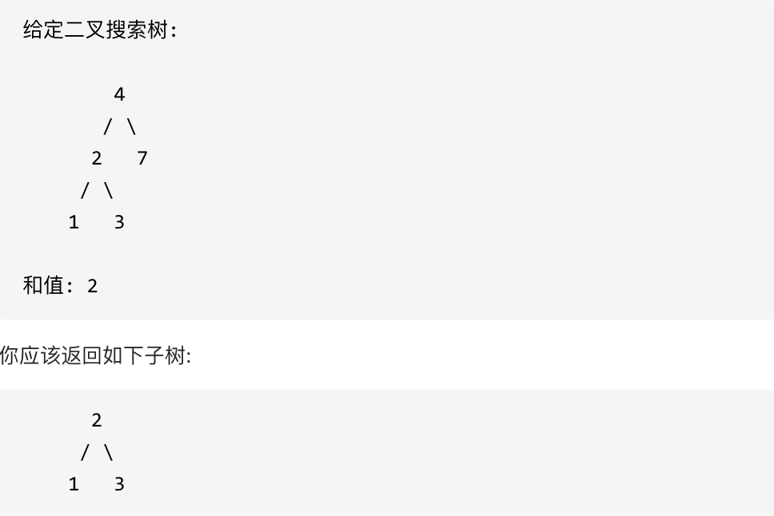

在上述示例中，如果要找的值是 5，但因为没有节点值为 5，我们应该返回 NULL。

## 算法公开课

[**《代码随想录》算法视频公开课**](https://programmercarl.com/other/gongkaike.html)**：**[**不愧是搜索树，这次搜索有方向了！| LeetCode：700.二叉搜索树中的搜索**](https://www.bilibili.com/video/BV1wG411g7sF)**，** **相信结合视频在看本篇题解，更有助于大家对本题的理解**。

## 思路

之前我们讲的都是普通二叉树，那么接下来看看二叉搜索树。

在[关于二叉树，你该了解这些！](https://programmercarl.com/%E4%BA%8C%E5%8F%89%E6%A0%91%E7%90%86%E8%AE%BA%E5%9F%BA%E7%A1%80.html)中，我们已经讲过了二叉搜索树。

二叉搜索树是一个有序树：

- 若它的左子树不空，则左子树上所有结点的值均小于它的根结点的值；
- 若它的右子树不空，则右子树上所有结点的值均大于它的根结点的值；
- 它的左、右子树也分别为二叉搜索树

这就决定了，二叉搜索树，递归遍历和迭代遍历和普通二叉树都不一样。

本题，其实就是在二叉搜索树中搜索一个节点。那么我们来看看应该如何遍历。

### 递归法

1. 确定递归函数的参数和返回值

递归函数的参数传入的就是根节点和要搜索的数值，返回的就是以这个搜索数值所在的节点。

代码如下：

```cpp
TreeNode* searchBST(TreeNode* root, int val)
```

2. 确定终止条件

如果root为空，或者找到这个数值了，就返回root节点。

```cpp
if (root == NULL || root->val == val) return root;
```

3. 确定单层递归的逻辑

看看二叉搜索树的单层递归逻辑有何不同。

因为二叉搜索树的节点是有序的，所以可以有方向的去搜索。

如果`root->val > val`，搜索左子树，如果`root->val < val`，就搜索右子树，最后如果都没有搜索到，就返回NULL。

代码如下：

```cpp
TreeNode* result = NULL;
if (root->val > val) result = searchBST(root->left, val);
if (root->val < val) result = searchBST(root->right, val);
return result;
很多录友写递归函数的时候 习惯直接写 searchBST(root->left, val) ，却忘了 递归函数还有返回值。
```

递归函数的返回值是什么?  是 左子树如果搜索到了val，要将该节点返回。 如果不用一个变量将其接住，那么返回值不就没了。

```text
所以要  result = searchBST(root->left, val) 。
```

整体代码如下：

```cpp
class Solution {
public:
    TreeNode* searchBST(TreeNode* root, int val) {
        if (root == NULL || root->val == val) return root;
        TreeNode* result = NULL;
        if (root->val > val) result = searchBST(root->left, val);
        if (root->val < val) result = searchBST(root->right, val);
        return result;
    }
};
```

或者我们也可以这么写 

```cpp
class Solution {
public:
    TreeNode* searchBST(TreeNode* root, int val) {
        if (root == NULL || root->val == val) return root;
        if (root->val > val) return searchBST(root->left, val);
        if (root->val < val) return searchBST(root->right, val);
        return NULL;
    }
};
```

### 迭代法

一提到二叉树遍历的迭代法，可能立刻想起使用栈来模拟深度遍历，使用队列来模拟广度遍历。

对于二叉搜索树可就不一样了，因为二叉搜索树的特殊性，也就是节点的有序性，可以不使用辅助栈或者队列就可以写出迭代法。

对于一般二叉树，递归过程中还有回溯的过程，例如走一个左方向的分支走到头了，那么要调头，在走右分支。

而**对于二叉搜索树，不需要回溯的过程，因为节点的有序性就帮我们确定了搜索的方向。**

例如要搜索元素为3的节点，**我们不需要搜索其他节点，也不需要做回溯，查找的路径已经规划好了。**

中间节点如果大于3就向左走，如果小于3就向右走，如图：

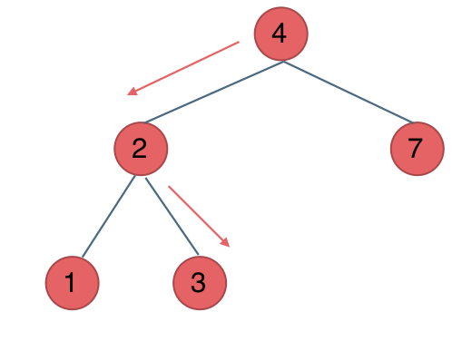

所以迭代法代码如下：

```cpp
class Solution {
public:
    TreeNode* searchBST(TreeNode* root, int val) {
        while (root != NULL) {
            if (root->val > val) root = root->left;
            else if (root->val < val) root = root->right;
            else return root;
        }
        return NULL;
    }
};
```

第一次看到了如此简单的迭代法，是不是感动的痛哭流涕，哭一会~

## 总结

本篇我们介绍了二叉搜索树的遍历方式，因为二叉搜索树的有序性，遍历的时候要比普通二叉树简单很多。

但是一些同学很容易忽略二叉搜索树的特性，所以写出遍历的代码就未必真的简单了。

所以针对二叉搜索树的题目，一样要利用其特性。

文中我依然给出递归和迭代两种方式，可以看出写法都非常简单，就是利用了二叉搜索树有序的特点。

# 23.验证二叉搜索树

[力扣题目链接](https://leetcode.cn/problems/validate-binary-search-tree/)

给定一个二叉树，判断其是否是一个有效的二叉搜索树。

假设一个二叉搜索树具有如下特征：

- 节点的左子树只包含小于当前节点的数。
- 节点的右子树只包含大于当前节点的数。
- 所有左子树和右子树自身必须也是二叉搜索树。

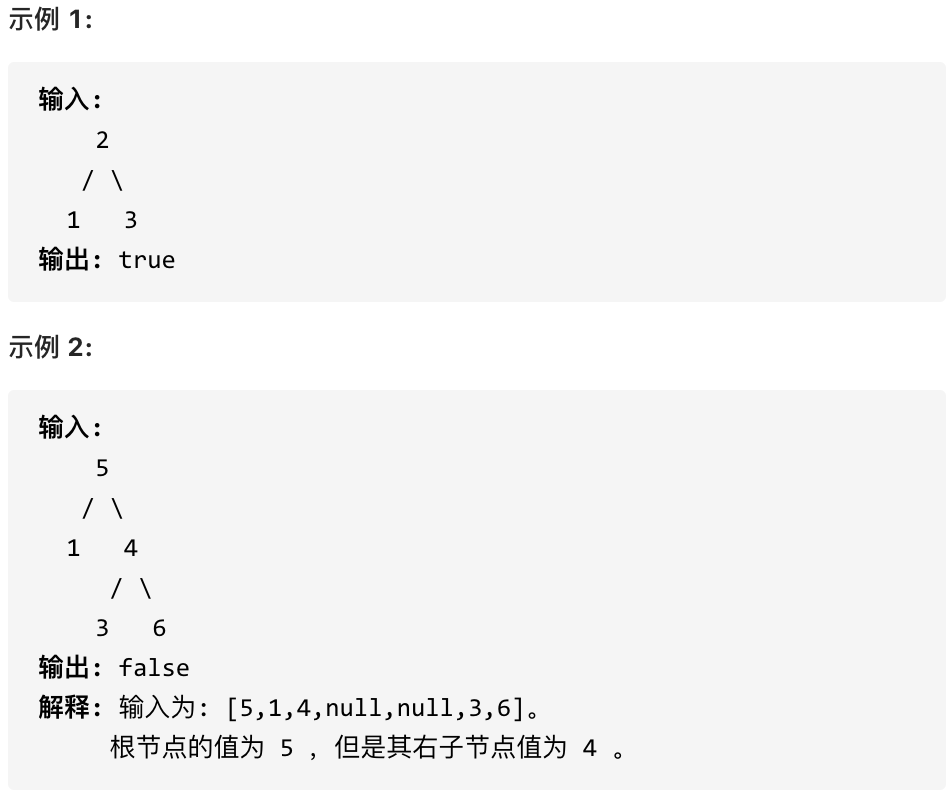

## 算法公开课

[**《代码随想录》算法视频公开课**](https://programmercarl.com/other/gongkaike.html)**：**[**你对二叉搜索树了解的还不够！ | LeetCode：98.验证二叉搜索树**](https://www.bilibili.com/video/BV18P411n7Q4)**，相信结合视** **频在看本篇题解，更有助于大家对本题的理解**。

## 思路

要知道中序遍历下，输出的二叉搜索树节点的数值是有序序列。

有了这个特性，**验证二叉搜索树，就相当于变成了判断一个序列是不是递增的了。**

### 递归法

可以递归中序遍历将二叉搜索树转变成一个数组，代码如下：

```cpp
vector<int> vec;
void traversal(TreeNode* root) {
    if (root == NULL) return;
    traversal(root->left);
    vec.push_back(root->val); // 将二叉搜索树转换为有序数组
    traversal(root->right);
}
```

然后只要比较一下，这个数组是否是有序的，**注意二叉搜索树中不能有重复元素**。

```cpp
traversal(root);
for (int i = 1; i < vec.size(); i++) {
    // 注意要小于等于，搜索树里不能有相同元素
    if (vec[i] <= vec[i - 1]) return false;
}
return true;
```

整体代码如下：

```cpp
class Solution {
private:
    vector<int> vec;
    void traversal(TreeNode* root) {
        if (root == NULL) return;
        traversal(root->left);
        vec.push_back(root->val); // 将二叉搜索树转换为有序数组
        traversal(root->right);
    }
public:
    bool isValidBST(TreeNode* root) {
        vec.clear(); // 不加这句在leetcode上也可以过，但最好加上
        traversal(root);
        for (int i = 1; i < vec.size(); i++) {
            // 注意要小于等于，搜索树里不能有相同元素
            if (vec[i] <= vec[i - 1]) return false;
        }
        return true;
    }
};
```

以上代码中，我们把二叉树转变为数组来判断，是最直观的，但其实不用转变成数组，可以在递归遍历的过程中直接判断是否有序。

这道题目比较容易陷入两个陷阱：

- 陷阱1

**不能单纯的比较左节点小于中间节点，右节点大于中间节点就完事了**。

写出了类似这样的代码：

```cpp
if (root->val > root->left->val && root->val < root->right->val) {
    return true;
} else {
    return false;
}
```

**我们要比较的是 左子树所有节点小于中间节点，右子树所有节点大于中间节点**。所以以上代码的判断逻辑是错误的。

例如： `[10,5,15,null,null,6,20]` 这个case：

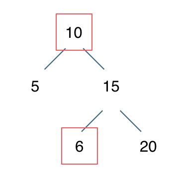

节点10大于左节点5，小于右节点15，但右子树里出现了一个6 这就不符合了！

- 陷阱2

样例中最小节点 可能是int的最小值，如果这样使用最小的int来比较也是不行的。

此时可以初始化比较元素为longlong的最小值。

问题可以进一步演进：如果样例中根节点的val 可能是longlong的最小值 又要怎么办呢？文中会解答。

了解这些陷阱之后我们来看一下代码应该怎么写：

递归三部曲：

- 确定递归函数，返回值以及参数

要定义一个longlong的全局变量，用来比较遍历的节点是否有序，因为后台测试数据中有int最小值，所以定义为longlong的类型，初始化为longlong最小值。

注意递归函数要有bool类型的返回值， 我们在二叉树：递归函数究竟什么时候需要返回值，什么时候不要返回值？ 中讲了，只有寻找某一条边（或者一个节点）的时候，递归函数会有bool类型的返回值。

其实本题是同样的道理，我们在寻找一个不符合条件的节点，如果没有找到这个节点就遍历了整个树，如果找到不符合的节点了，立刻返回。

代码如下：

```cpp
long long maxVal = LONG_MIN; // 因为后台测试数据中有int最小值
bool isValidBST(TreeNode* root)
```

- 确定终止条件

如果是空节点 是不是二叉搜索树呢？

是的，二叉搜索树也可以为空！

代码如下：

```cpp
if (root == NULL) return true;
```

- 确定单层递归的逻辑

中序遍历，一直更新maxVal，一旦发现`maxVal >= root->val`，就返回false，注意元素相同时候也要返回false。

代码如下：

```cpp
bool left = isValidBST(root->left);         // 左
// 中序遍历，验证遍历的元素是不是从小到大
if (maxVal < root->val) maxVal = root->val; // 中
else return false;
bool right = isValidBST(root->right);       // 右
return left && right;
```

整体代码如下：

```cpp
class Solution {
public:
    long long maxVal = LONG_MIN; // 因为后台测试数据中有int最小值
    bool isValidBST(TreeNode* root) {
        if (root == NULL) return true;
        bool left = isValidBST(root->left);
        // 中序遍历，验证遍历的元素是不是从小到大
        if (maxVal < root->val) maxVal = root->val;
        else return false;
        bool right = isValidBST(root->right);
        return left && right;
    }
};
```

以上代码是因为后台数据有int最小值测试用例，所以都把maxVal改成了longlong最小值。

如果测试数据中有 longlong的最小值，怎么办？

不可能在初始化一个更小的值了吧。 建议避免 初始化最小值，如下方法取到最左面节点的数值来比较。

代码如下：

```cpp
class Solution {
public:
    TreeNode* pre = NULL; // 用来记录前一个节点
    bool isValidBST(TreeNode* root) {
        if (root == NULL) return true;
        bool left = isValidBST(root->left);
        if (pre != NULL && pre->val >= root->val) return false;
        pre = root; // 记录前一个节点
        bool right = isValidBST(root->right);
        return left && right;
    }
};
```

最后这份代码看上去整洁一些，思路也清晰。

### 迭代法

可以用迭代法模拟二叉树中序遍历，对前中后序迭代法生疏的同学可以看这两篇二叉树：听说递归能做的，栈也能做！，[二叉树：前中后序迭代方式统一写法](https://programmercarl.com/%E4%BA%8C%E5%8F%89%E6%A0%91%E7%9A%84%E7%BB%9F%E4%B8%80%E8%BF%AD%E4%BB%A3%E6%B3%95.html)

迭代法中序遍历稍加改动就可以了，代码如下：

```cpp
class Solution {
public:
    bool isValidBST(TreeNode* root) {
        stack<TreeNode*> st;
        TreeNode* cur = root;
        TreeNode* pre = NULL; // 记录前一个节点
        while (cur != NULL || !st.empty()) {
            if (cur != NULL) {
                st.push(cur);
                cur = cur->left;                // 左
            } else {
                cur = st.top();                 // 中
                st.pop();
                if (pre != NULL && cur->val <= pre->val)
                return false;
                pre = cur; //保存前一个访问的结点
                cur = cur->right;               // 右
            }
        }
        return true;
    }
};
```

在[二叉树：二叉搜索树登场！](https://programmercarl.com/0700.%E4%BA%8C%E5%8F%89%E6%90%9C%E7%B4%A2%E6%A0%91%E4%B8%AD%E7%9A%84%E6%90%9C%E7%B4%A2.html)中我们分明写出了痛哭流涕的简洁迭代法，怎么在这里不行了呢，因为本题是要验证二叉搜索树啊。

## 总结

这道题目是一个简单题，但对于没接触过的同学还是有难度的。

所以初学者刚开始学习算法的时候，看到简单题目没有思路很正常，千万别怀疑自己智商，学习过程都是这样的，大家智商都差不多，哈哈。

只要把基本类型的题目都做过，总结过之后，思路自然就开阔了。

利用二叉搜索树的特性搞起！

# 24.二叉搜索树的最小绝对差

[力扣题目链接](https://leetcode.cn/problems/minimum-absolute-difference-in-bst/)

给你一棵所有节点为非负值的二叉搜索树，请你计算树中任意两节点的差的绝对值的最小值。

示例：

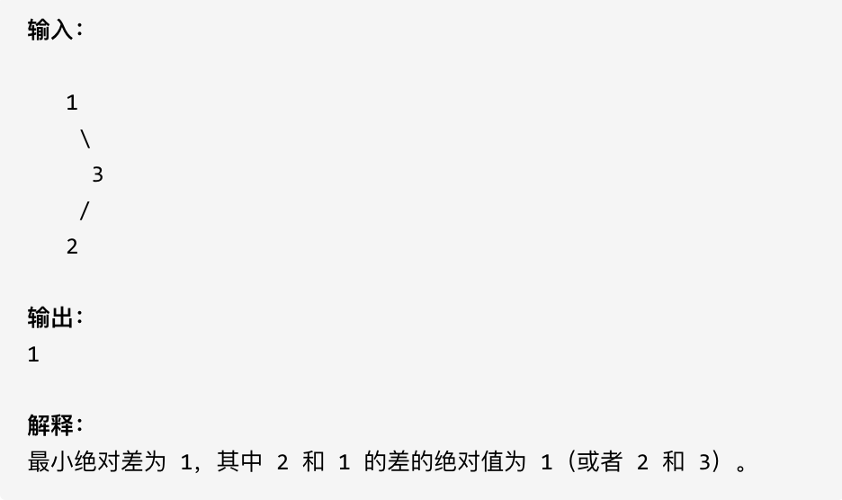

提示：树中至少有 2 个节点。

## 算法公开课

[**《代码随想录》算法视频公开课**](https://programmercarl.com/other/gongkaike.html)**：二叉搜索树中，需要掌握如何双指针遍历！| LeetCode：530.二叉搜索树的最** **小绝对差，相信结合视频在看本篇题解，更有助于大家对本题的理解**。

## 思路

题目中要求在二叉搜索树上任意两节点的差的绝对值的最小值。

**注意是二叉搜索树**，二叉搜索树可是有序的。

遇到在二叉搜索树上求什么最值啊，差值之类的，就把它想成在一个有序数组上求最值，求差值，这样就简单多了。

### 递归

那么二叉搜索树采用中序遍历，其实就是一个有序数组。

**在一个有序数组上求两个数最小差值，这是不是就是一道送分题了。**

最直观的想法，就是把二叉搜索树转换成有序数组，然后遍历一遍数组，就统计出来最小差值了。

代码如下：

```cpp
class Solution {
private:
vector<int> vec;
void traversal(TreeNode* root) {
    if (root == NULL) return;
    traversal(root->left);
    vec.push_back(root->val); // 将二叉搜索树转换为有序数组
    traversal(root->right);
}
public:
    int getMinimumDifference(TreeNode* root) {
        vec.clear();
        traversal(root);
        if (vec.size() < 2) return 0;
        int result = INT_MAX;
        for (int i = 1; i < vec.size(); i++) { // 统计有序数组的最小差值
            result = min(result, vec[i] - vec[i-1]);
        }
        return result;
    }
};
```

以上代码是把二叉搜索树转化为有序数组了，其实在二叉搜素树中序遍历的过程中，我们就可以直接计算了。

需要用一个pre节点记录一下cur节点的前一个节点。

如图：

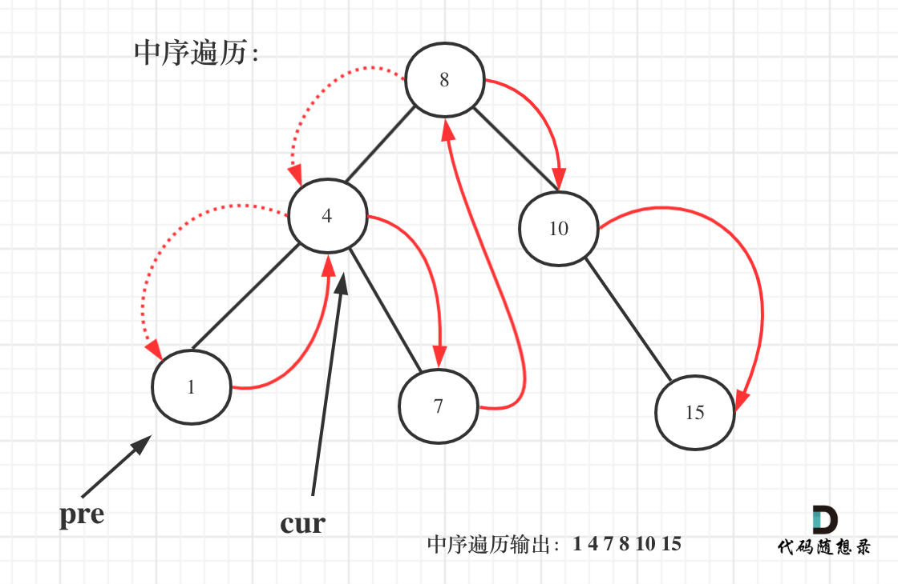

一些同学不知道在递归中如何记录前一个节点的指针，其实实现起来是很简单的，大家只要看过一次，写过一次，就掌握了。

代码如下：

```cpp
class Solution {
private:
int result = INT_MAX;
TreeNode* pre = NULL;
void traversal(TreeNode* cur) {
    if (cur == NULL) return;
    traversal(cur->left);   // 左
    if (pre != NULL){       // 中
        result = min(result, cur->val - pre->val);
    }
    pre = cur; // 记录前一个
    traversal(cur->right);  // 右
}
public:
    int getMinimumDifference(TreeNode* root) {
        traversal(root);
        return result;
    }
};
```

是不是看上去也并不复杂！

### 迭代

看过这两篇[二叉树：听说递归能做的，栈也能做！](https://programmercarl.com/%E4%BA%8C%E5%8F%89%E6%A0%91%E7%9A%84%E8%BF%AD%E4%BB%A3%E9%81%8D%E5%8E%86.html)，[二叉树：前中后序迭代方式的写法就不能统一一下么？](https://programmercarl.com/%E4%BA%8C%E5%8F%89%E6%A0%91%E7%9A%84%E7%BB%9F%E4%B8%80%E8%BF%AD%E4%BB%A3%E6%B3%95.html)文章之后，不难写出两种中序遍历的迭代法。

下面我给出其中的一种中序遍历的迭代法，代码如下：

```cpp
class Solution {
public:
    int getMinimumDifference(TreeNode* root) {
        stack<TreeNode*> st;
        TreeNode* cur = root;
        TreeNode* pre = NULL;
        int result = INT_MAX;
        while (cur != NULL || !st.empty()) {
            if (cur != NULL) { // 指针来访问节点，访问到最底层
                st.push(cur); // 将访问的节点放进栈
                cur = cur->left;                // 左
            } else {
                cur = st.top();
                st.pop();
                if (pre != NULL) {              // 中
                    result = min(result, cur->val - pre->val);
                }
                pre = cur;
                cur = cur->right;               // 右
            }
        }
        return result;
    }
};
```

## 总结

**遇到在二叉搜索树上求什么最值，求差值之类的，都要思考一下二叉搜索树可是有序的，要利用好这一特点。**

同时要学会在递归遍历的过程中如何记录前后两个指针，这也是一个小技巧，学会了还是很受用的。

后面我将继续介绍一系列利用二叉搜索树特性的题目。

二叉树上应该怎么求，二叉搜索树上又应该怎么求？

# 25.二叉搜索树中的众数

[力扣题目链接](https://leetcode.cn/problems/find-mode-in-binary-search-tree/)

给定一个有相同值的二叉搜索树（BST），找出 BST 中的所有众数（出现频率最高的元素）。

假定 BST 有如下定义：

- 结点左子树中所含结点的值小于等于当前结点的值
- 结点右子树中所含结点的值大于等于当前结点的值
- 左子树和右子树都是二叉搜索树

例如：

给定 `BST [1,null,2,2],`

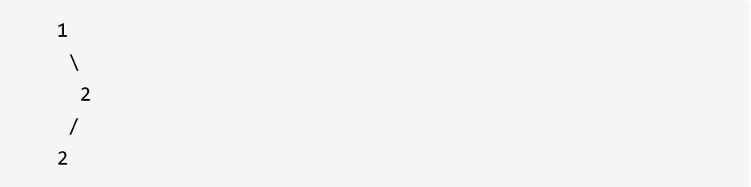

返回`[2].`

提示：如果众数超过1个，不需考虑输出顺序

进阶：你可以不使用额外的空间吗？（假设由递归产生的隐式调用栈的开销不被计算在内）

## 算法公开课

[**《代码随想录》算法视频公开课**](https://programmercarl.com/other/gongkaike.html)**：不仅双指针，还有代码技巧可以惊艳到你！ | LeetCode：501.二叉搜索树中的** **众数，相信结合视频在看本篇题解，更有助于大家对本题的理解**。

## 思路

这道题目呢，递归法我从两个维度来讲。

首先如果不是二叉搜索树的话，应该怎么解题，是二叉搜索树，又应该如何解题，两种方式做一个比较，可以加深大家对二叉树的理解。

### 递归法

#### 如果不是二叉搜索树

如果不是二叉搜索树，最直观的方法一定是把这个树都遍历了，用map统计频率，把频率排个序，最后取前面高频的元素的集合。

具体步骤如下：

1. 这个树都遍历了，用map统计频率

至于用前中后序哪种遍历也不重要，因为就是要全遍历一遍，怎么个遍历法都行，层序遍历都没毛病！

这里采用前序遍历，代码如下：

```cpp
// map<int, int> key:元素，value:出现频率
void searchBST(TreeNode* cur, unordered_map<int, int>& map) { // 前序遍历
    if (cur == NULL) return ;
    map[cur->val]++; // 统计元素频率
    searchBST(cur->left, map);
    searchBST(cur->right, map);
    return ;
}
```

2. 把统计的出来的出现频率（即map中的value）排个序

有的同学可能可以想直接对map中的value排序，还真做不到，`C++`中如果使用`std::map`或者`std::multimap`可以对key排序，但不能对value排序。

```cpp
所以要把map转化数组即vector，再进行排序，当然vector里面放的也是pair<int, int> 类型的数据，第一个
```

int为元素，第二个int为出现频率。

代码如下：

```cpp
bool static cmp (const pair<int, int>& a, const pair<int, int>& b) {
    return a.second > b.second; // 按照频率从大到小排序
}
vector<pair<int, int>> vec(map.begin(), map.end());
sort(vec.begin(), vec.end(), cmp); // 给频率排个序
```

3. 取前面高频的元素

此时数组vector中已经是存放着按照频率排好序的pair，那么把前面高频的元素取出来就可以了。

代码如下：

```cpp
result.push_back(vec[0].first);
for (int i = 1; i < vec.size(); i++) {
    // 取最高的放到result数组中
    if (vec[i].second == vec[0].second) result.push_back(vec[i].first);
    else break;
}
return result;
```

整体`C++`代码如下：

```cpp
class Solution {
private:
void searchBST(TreeNode* cur, unordered_map<int, int>& map) { // 前序遍历
    if (cur == NULL) return ;
    map[cur->val]++; // 统计元素频率
    searchBST(cur->left, map);
    searchBST(cur->right, map);
    return ;
}
bool static cmp (const pair<int, int>& a, const pair<int, int>& b) {
    return a.second > b.second;
}
public:
    vector<int> findMode(TreeNode* root) {
        unordered_map<int, int> map; // key:元素，value:出现频率
        vector<int> result;
        if (root == NULL) return result;
        searchBST(root, map);
        vector<pair<int, int>> vec(map.begin(), map.end());
        sort(vec.begin(), vec.end(), cmp); // 给频率排个序
        result.push_back(vec[0].first);
        for (int i = 1; i < vec.size(); i++) {
            // 取最高的放到result数组中
            if (vec[i].second == vec[0].second) result.push_back(vec[i].first);
            else break;
        }
        return result;
    }
};
```

**所以如果本题没有说是二叉搜索树的话，那么就按照上面的思路写！**

#### 是二叉搜索树

**既然是搜索树，它中序遍历就是有序的**。

如图：

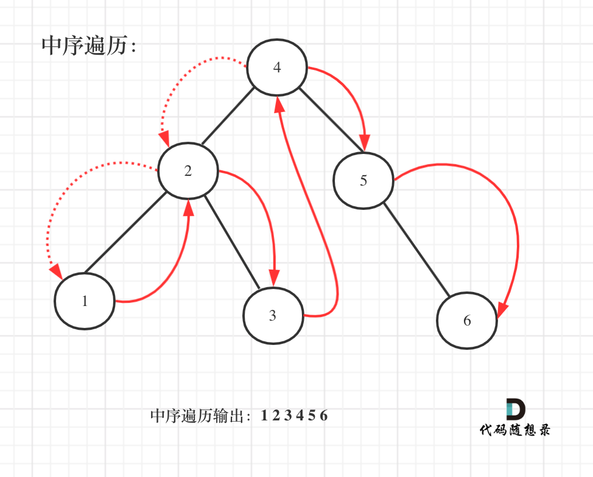

中序遍历代码如下：

```cpp
void searchBST(TreeNode* cur) {
    if (cur == NULL) return ;
    searchBST(cur->left);       // 左
    （处理节点）                // 中
    searchBST(cur->right);      // 右
    return ;
}
```

遍历有序数组的元素出现频率，从头遍历，那么一定是相邻两个元素作比较，然后就把出现频率最高的元素输出就可以了。

关键是在有序数组上的话，好搞，在树上怎么搞呢？

这就考察对树的操作了。

在[二叉树：搜索树的最小绝对差](https://programmercarl.com/0530.%E4%BA%8C%E5%8F%89%E6%90%9C%E7%B4%A2%E6%A0%91%E7%9A%84%E6%9C%80%E5%B0%8F%E7%BB%9D%E5%AF%B9%E5%B7%AE.html)中我们就使用了pre指针和cur指针的技巧，这次又用上了。

弄一个指针指向前一个节点，这样每次cur（当前节点）才能和pre（前一个节点）作比较。

而且初始化的时候`pre = NULL`，这样当pre为NULL时候，我们就知道这是比较的第一个元素。

代码如下：

```cpp
if (pre == NULL) { // 第一个节点
    count = 1; // 频率为1
} else if (pre->val == cur->val) { // 与前一个节点数值相同
    count++;
} else { // 与前一个节点数值不同
    count = 1;
}
pre = cur; // 更新上一个节点
```

此时又有问题了，因为要求最大频率的元素集合（注意是集合，不是一个元素，可以有多个众数），如果是数组上大家一般怎么办？

应该是先遍历一遍数组，找出最大频率（maxCount），然后再重新遍历一遍数组把出现频率为maxCount的元素放进集合。（因为众数有多个）

这种方式遍历了两遍数组。

那么我们遍历两遍二叉搜索树，把众数集合算出来也是可以的。

但这里其实只需要遍历一次就可以找到所有的众数。

那么如何只遍历一遍呢？

如果 频率count 等于 maxCount（最大频率），当然要把这个元素加入到结果集中（以下代码为result数组），代码如下：

```cpp
if (count == maxCount) { // 如果和最大值相同，放进result中
    result.push_back(cur->val);
}
```

是不是感觉这里有问题，result怎么能轻易就把元素放进去了呢，万一，这个maxCount此时还不是真正最大频率呢。

所以下面要做如下操作：

频率count 大于 maxCount的时候，不仅要更新maxCount，而且要清空结果集（以下代码为result数组），因为结果集之前的元素都失效了。

```cpp
if (count > maxCount) { // 如果计数大于最大值
    maxCount = count;   // 更新最大频率
    result.clear();     // 很关键的一步，不要忘记清空result，之前result里的元素都失效了
    result.push_back(cur->val);
}
```

关键代码都讲完了，完整代码如下：（**只需要遍历一遍二叉搜索树，就求出了众数的集合**）

```cpp
class Solution {
private:
    int maxCount = 0; // 最大频率
    int count = 0; // 统计频率
    TreeNode* pre = NULL;
    vector<int> result;
    void searchBST(TreeNode* cur) {
        if (cur == NULL) return ;
        searchBST(cur->left);       // 左
                                    // 中
        if (pre == NULL) { // 第一个节点
            count = 1;
        } else if (pre->val == cur->val) { // 与前一个节点数值相同
            count++;
        } else { // 与前一个节点数值不同
            count = 1;
        }
        pre = cur; // 更新上一个节点
        if (count == maxCount) { // 如果和最大值相同，放进result中
            result.push_back(cur->val);
        }
        if (count > maxCount) { // 如果计数大于最大值频率
            maxCount = count;   // 更新最大频率
            result.clear();     // 很关键的一步，不要忘记清空result，之前result里的元素都失效了
            result.push_back(cur->val);
        }
        searchBST(cur->right);      // 右
        return ;
    }
public:
    vector<int> findMode(TreeNode* root) {
        count = 0;
        maxCount = 0;
        TreeNode* pre = NULL; // 记录前一个节点
        result.clear();
        searchBST(root);
        return result;
    }
};
```

### 迭代法

只要把中序遍历转成迭代，中间节点的处理逻辑完全一样。

二叉树前中后序转迭代，传送门：

- [二叉树：前中后序迭代法](https://programmercarl.com/%E4%BA%8C%E5%8F%89%E6%A0%91%E7%9A%84%E8%BF%AD%E4%BB%A3%E9%81%8D%E5%8E%86.html)
- [二叉树：前中后序统一风格的迭代方式](https://programmercarl.com/%E4%BA%8C%E5%8F%89%E6%A0%91%E7%9A%84%E7%BB%9F%E4%B8%80%E8%BF%AD%E4%BB%A3%E6%B3%95.html)

下面我给出其中的一种中序遍历的迭代法，其中间处理逻辑一点都没有变（我从递归法直接粘过来的代码，连注释都没改，哈哈）

代码如下：

```cpp
class Solution {
public:
    vector<int> findMode(TreeNode* root) {
        stack<TreeNode*> st;
        TreeNode* cur = root;
        TreeNode* pre = NULL;
        int maxCount = 0; // 最大频率
        int count = 0; // 统计频率
        vector<int> result;
        while (cur != NULL || !st.empty()) {
            if (cur != NULL) { // 指针来访问节点，访问到最底层
                st.push(cur); // 将访问的节点放进栈
                cur = cur->left;                // 左
            } else {
                cur = st.top();
                st.pop();                       // 中
                if (pre == NULL) { // 第一个节点
                    count = 1;
                } else if (pre->val == cur->val) { // 与前一个节点数值相同
                    count++;
                } else { // 与前一个节点数值不同
                    count = 1;
                }
                if (count == maxCount) { // 如果和最大值相同，放进result中
                    result.push_back(cur->val);
                }
                if (count > maxCount) { // 如果计数大于最大值频率
                    maxCount = count;   // 更新最大频率
                    result.clear();     // 很关键的一步，不要忘记清空result，之前result里的元
素都失效了
                    result.push_back(cur->val);
                }
                pre = cur;
                cur = cur->right;               // 右
            }
        }
        return result;
    }
};
```

## 总结

本题在递归法中，我给出了如果是普通二叉树，应该怎么求众数。

知道了普通二叉树的做法时候，我再进一步给出二叉搜索树又应该怎么求众数，这样鲜明的对比，相信会对二叉树又有更深层次的理解了。

在递归遍历二叉搜索树的过程中，我还介绍了一个统计最高出现频率元素集合的技巧， 要不然就要遍历两次二叉搜索树才能把这个最高出现频率元素的集合求出来。

**为什么没有这个技巧一定要遍历两次呢？ 因为要求的是集合，会有多个众数，如果规定只有一个众数，那么就遍历** **一次稳稳的了。**

最后我依然给出对应的迭代法，其实就是迭代法中序遍历的模板加上递归法中中间节点的处理逻辑，分分钟就可以写出来，中间逻辑的代码我都是从递归法中直接粘过来的。

**求二叉搜索树中的众数其实是一道简单题，但大家可以发现我写了这么一大篇幅的文章来讲解，主要是为了尽量从** **各个角度对本题进剖析，帮助大家更快更深入理解二叉树**。

**需要强调的是 leetcode上的耗时统计是非常不准确的，看个大概就行，一样的代码耗时可以差百分之50以** **上**，所以leetcode的耗时统计别太当回事，知道理论上的效率优劣就行了。

本来是打算将二叉树和二叉搜索树的公共祖先问题一起讲，后来发现篇幅过长了，只能先说一说二叉树的公共祖先问题。

# 26. 二叉树的最近公共祖先

[力扣题目链接](https://leetcode.cn/problems/lowest-common-ancestor-of-a-binary-tree/)

给定一个二叉树, 找到该树中两个指定节点的最近公共祖先。

百度百科中最近公共祖先的定义为：“对于有根树 T 的两个结点 p、q，最近公共祖先表示为一个结点 x，满足 x 是 p、q 的祖先且 x 的深度尽可能大（一个节点也可以是它自己的祖先）。”

例如，给定如下二叉树`:  root = [3,5,1,6,2,0,8,null,null,7,4]`

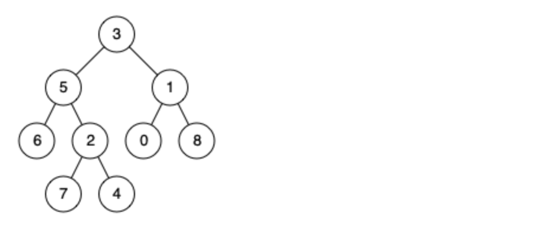

示例 1:  
输入`: root = [3,5,1,6,2,0,8,null,null,7,4], p = 5, q = 1`  
输出: 3  
解释: 节点 5 和节点 1 的最近公共祖先是节点 3。

示例 2:  
输入`: root = [3,5,1,6,2,0,8,null,null,7,4], p = 5, q = 4`  
输出: 5  
解释: 节点 5 和节点 4 的最近公共祖先是节点 5。因为根据定义最近公共祖先节点可以为节点本身。

说明:

- 所有节点的值都是唯一的。
- p、q 为不同节点且均存在于给定的二叉树中。

## 算法公开课

[**《代码随想录》算法视频公开课**](https://programmercarl.com/other/gongkaike.html)**：**[**自底向上查找，有点难度！ | LeetCode：236. 二叉树的最近公共祖先**](https://www.bilibili.com/video/BV1jd4y1B7E2)**，相信结** **合视频在看本篇题解，更有助于大家对本题的理解**。

## 思路

遇到这个题目首先想的是要是能自底向上查找就好了，这样就可以找到公共祖先了。

那么二叉树如何可以自底向上查找呢？

回溯啊，二叉树回溯的过程就是从低到上。

后序遍历（左右中）就是天然的回溯过程，可以根据左右子树的返回值，来处理中节点的逻辑。 

接下来就看如何判断一个节点是节点q和节点p的公共祖先呢。

**首先最容易想到的一个情况：如果找到一个节点，发现左子树出现结点p，右子树出现节点q，或者 左子树出现结** **点q，右子树出现节点p，那么该节点就是节点p和q的最近公共祖先。** 即情况一： 

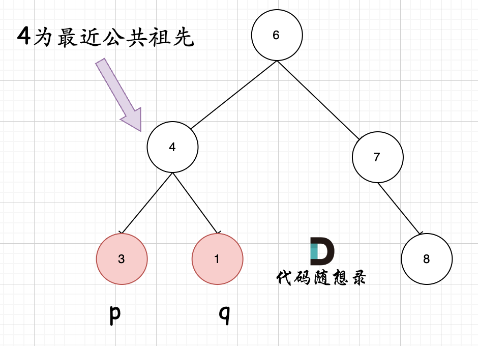

判断逻辑是 如果递归遍历遇到q，就将q返回，遇到p 就将p返回，那么如果 左右子树的返回值都不为空，说明此时的中节点，一定是q 和p 的最近祖先。 

那么有录友可能疑惑，会不会左子树 遇到q 返回，右子树也遇到q返回，这样并没有找到 q 和p的最近祖先。

这么想的录友，要审题了，题目强调：**二叉树节点数值是不重复的，而且一定存在 q 和 p**。

**但是很多人容易忽略一个情况，就是节点本身p(q)，它拥有一个子孙节点q(p)。** 情况二： 

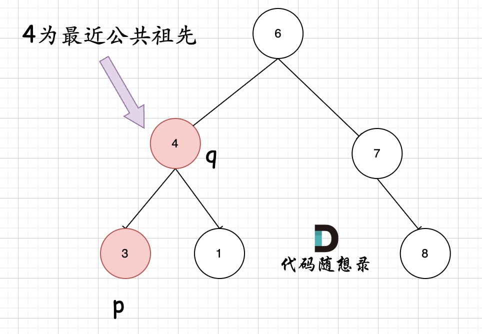

其实情况一 和 情况二 代码实现过程都是一样的，也可以说，实现情况一的逻辑，顺便包含了情况二。 

因为遇到 q 或者 p 就返回，这样也包含了 q 或者 p 本身就是 公共祖先的情况。

这一点是很多录友容易忽略的，在下面的代码讲解中，可以再去体会。 

递归三部曲：

- 确定递归函数返回值以及参数

需要递归函数返回值，来告诉我们是否找到节点q或者p，那么返回值为bool类型就可以了。

但我们还要返回最近公共节点，可以利用上题目中返回值是TreeNode * ，那么如果遇到p或者q，就把q或者p返回，返回值不为空，就说明找到了q或者p。

代码如下：

```text
TreeNode* lowestCommonAncestor(TreeNode* root, TreeNode* p, TreeNode* q)
```

- 确定终止条件

遇到空的话，因为树都是空了，所以返回空。

那么我们来说一说，如果 `root == q`，或者 `root == p`，说明找到  q p ，则将其返回，这个返回值，后面在中节点的处理过程中会用到，那么中节点的处理逻辑，下面讲解。

代码如下：

```cpp
if (root == q || root == p || root == NULL) return root;
```

- 确定单层递归逻辑

值得注意的是 本题函数有返回值，是因为回溯的过程需要递归函数的返回值做判断，但本题我们依然要遍历树的所有节点。

我们在[二叉树：递归函数究竟什么时候需要返回值，什么时候不要返回值？](https://programmercarl.com/0112.%E8%B7%AF%E5%BE%84%E6%80%BB%E5%92%8C.html)中说了 递归函数有返回值就是要遍历某一条边，但有返回值也要看如何处理返回值！

如果递归函数有返回值，如何区分要搜索一条边，还是搜索整个树呢？

搜索一条边的写法：

```cpp
if (递归函数(root->left)) return ;
if (递归函数(root->right)) return ;
```

搜索整个树写法：

```cpp
left = 递归函数(root->left);  // 左
right = 递归函数(root->right); // 右
left与right的逻辑处理;         // 中
```

看出区别了没？

**在递归函数有返回值的情况下：如果要搜索一条边，递归函数返回值不为空的时候，立刻返回，如果搜索整个树，** **直接用一个变量left、right接住返回值，这个left、right后序还有逻辑处理的需要，也就是后序遍历中处理中间节** **点的逻辑（也是回溯）**。

那么为什么要遍历整棵树呢？直观上来看，找到最近公共祖先，直接一路返回就可以了。

如图：

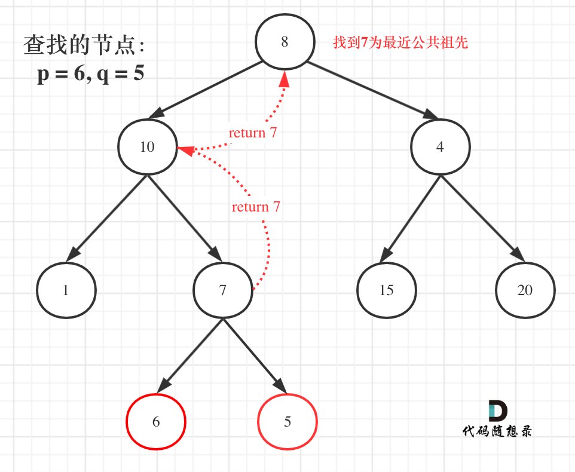

就像图中一样直接返回7，多美滋滋。

但事实上还要遍历根节点右子树（即使此时已经找到了目标节点了），也就是图中的节点4、15、20。

因为在如下代码的后序遍历中，如果想利用left和right做逻辑处理， 不能立刻返回，而是要等left与right逻辑处理完之后才能返回。

```cpp
left = 递归函数(root->left);  // 左
right = 递归函数(root->right); // 右
left与right的逻辑处理;         // 中
```

所以此时大家要知道我们要遍历整棵树。知道这一点，对本题就有一定深度的理解了。

那么先用left和right接住左子树和右子树的返回值，代码如下：

```cpp
TreeNode* left = lowestCommonAncestor(root->left, p, q);
TreeNode* right = lowestCommonAncestor(root->right, p, q);
```

**如果left 和 right都不为空，说明此时root就是最近公共节点。这个比较好理解** **如果left为空，right不为空，就返回right，说明目标节点是通过right返回的，反之依然**。

这里有的同学就理解不了了，为什么left为空，right不为空，目标节点通过right返回呢？

如图：

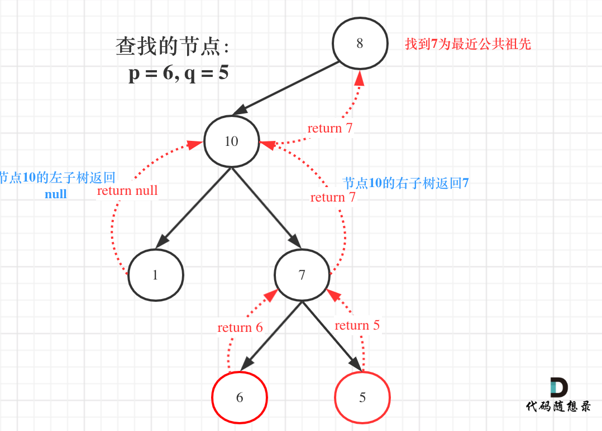

图中节点10的左子树返回null，右子树返回目标值7，那么此时节点10的处理逻辑就是把右子树的返回值（最近公共祖先7）返回上去！

这里也很重要，可能刷过这道题目的同学，都不清楚结果究竟是如何从底层一层一层传到头结点的。

那么如果left和right都为空，则返回left或者right都是可以的，也就是返回空。

代码如下：

```cpp
if (left == NULL && right != NULL) return right;
else if (left != NULL && right == NULL) return left;
else  { //  (left == NULL && right == NULL)
    return NULL;
}
```

那么寻找最小公共祖先，完整流程图如下：

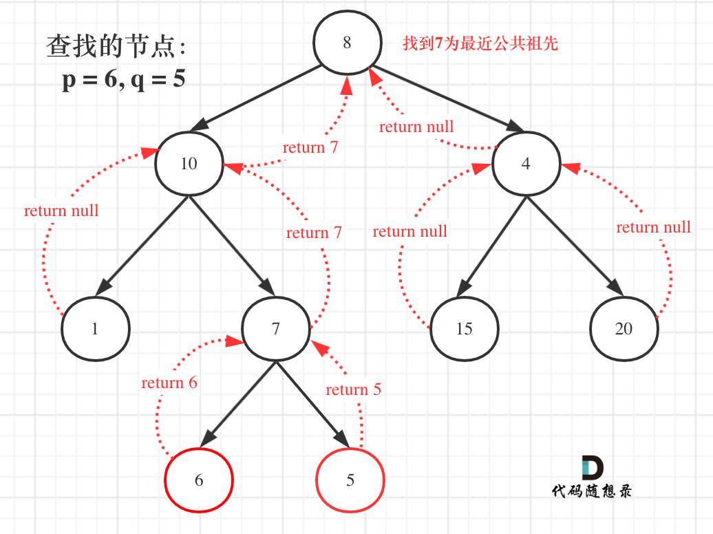

**从图中，大家可以看到，我们是如何回溯遍历整棵二叉树，将结果返回给头结点的！**

整体代码如下：

```cpp
class Solution {
public:
    TreeNode* lowestCommonAncestor(TreeNode* root, TreeNode* p, TreeNode* q) {
        if (root == q || root == p || root == NULL) return root;
        TreeNode* left = lowestCommonAncestor(root->left, p, q);
        TreeNode* right = lowestCommonAncestor(root->right, p, q);
        if (left != NULL && right != NULL) return root;
        if (left == NULL && right != NULL) return right;
        else if (left != NULL && right == NULL) return left;
        else  { //  (left == NULL && right == NULL)
            return NULL;
        }
    }
};
```

稍加精简，代码如下：

```cpp
class Solution {
public:
    TreeNode* lowestCommonAncestor(TreeNode* root, TreeNode* p, TreeNode* q) {
        if (root == q || root == p || root == NULL) return root;
        TreeNode* left = lowestCommonAncestor(root->left, p, q);
        TreeNode* right = lowestCommonAncestor(root->right, p, q);
        if (left != NULL && right != NULL) return root;
        if (left == NULL) return right;
        return left;
    }
};
```

## 总结

这道题目刷过的同学未必真正了解这里面回溯的过程，以及结果是如何一层一层传上去的。

**那么我给大家归纳如下三点**：

1. 求最小公共祖先，需要从底向上遍历，那么二叉树，只能通过后序遍历（即：回溯）实现从底向上的遍历方式。

2. 在回溯的过程中，必然要遍历整棵二叉树，即使已经找到结果了，依然要把其他节点遍历完，因为要使用递归函数的返回值（也就是代码中的left和right）做逻辑判断。3. 要理解如果返回值left为空，right不为空为什么要返回right，为什么可以用返回right传给上一层结果。

可以说这里每一步，都是有难度的，都需要对二叉树，递归和回溯有一定的理解。

本题没有给出迭代法，因为迭代法不适合模拟回溯的过程。理解递归的解法就够了。

# 27. 本周小结！（二叉树系列四）

这已经是二叉树的第四周总结了，二叉树是非常重要的数据结构，也是面试中的常客，所以有必要一步一步帮助大家彻底掌握二叉树！

## 周一

在[二叉树：合并两个二叉树](https://programmercarl.com/0617.%E5%90%88%E5%B9%B6%E4%BA%8C%E5%8F%89%E6%A0%91.html)中讲解了如何合并两个二叉树，平时我们都习惯了操作一个二叉树，一起操作两个树可能还有点陌生。

其实套路是一样，只不过一起操作两个树的指针，我们之前讲过求 [二叉树：我对称么？](https://programmercarl.com/0101.%E5%AF%B9%E7%A7%B0%E4%BA%8C%E5%8F%89%E6%A0%91.html)的时候，已经初步涉及到了 一起遍历两棵二叉树了。

**迭代法中，一般一起操作两个树都是使用队列模拟类似层序遍历，同时处理两个树的节点，这种方式最好理解，如** **果用模拟递归的思路的话，要复杂一些。**

## 周二

周二开始讲解一个新的树，二叉搜索树，开始要换一个思路了，如果没有利用好二叉搜索树的特性，就容易把简单题做成了难题了。

学习[二叉搜索树的特性](https://programmercarl.com/0700.%E4%BA%8C%E5%8F%89%E6%90%9C%E7%B4%A2%E6%A0%91%E4%B8%AD%E7%9A%84%E6%90%9C%E7%B4%A2.html)，还是比较容易的。

大多是二叉搜索树的题目，其实都离不开中序遍历，因为这样就是有序的。

至于迭代法，相信大家看到文章中如此简单的迭代法的时候，都会感动的痛哭流涕。

## 周三

了解了二搜索树的特性之后， 开始验证[一棵二叉树是不是二叉搜索树](https://programmercarl.com/0098.%E9%AA%8C%E8%AF%81%E4%BA%8C%E5%8F%89%E6%90%9C%E7%B4%A2%E6%A0%91.html)。

首先在此强调一下二叉搜索树的特性：

- 节点的左子树只包含小于当前节点的数。
- 节点的右子树只包含大于当前节点的数。
- 所有左子树和右子树自身必须也是二叉搜索树。

那么我们在验证二叉搜索树的时候，有两个陷阱：

- 陷阱一

**不能单纯的比较左节点小于中间节点，右节点大于中间节点就完事了**，而是左子树都小于中间节点，右子树都大于中间节点。

- 陷阱二

在一个有序序列求最值的时候，不要定义一个全局遍历，然后遍历序列更新全局变量求最值。因为最值可能就是int 或者 longlong的最小值。

推荐要通过前一个数值（pre）和后一个数值比较（cur），得出最值。

**在二叉树中通过两个前后指针作比较，会经常用到**。

本文[二叉树：我是不是一棵二叉搜索树](https://programmercarl.com/0098.%E9%AA%8C%E8%AF%81%E4%BA%8C%E5%8F%89%E6%90%9C%E7%B4%A2%E6%A0%91.html)中迭代法中为什么没有周一那篇那么简洁了呢，因为本篇是验证二叉搜索树，前提默认它是一棵普通二叉树，所以还是要回归之前老办法。

## 周四

了解了[二叉搜索树](https://programmercarl.com/0700.%E4%BA%8C%E5%8F%89%E6%90%9C%E7%B4%A2%E6%A0%91%E4%B8%AD%E7%9A%84%E6%90%9C%E7%B4%A2.html)，并且知道[如何判断二叉搜索树](https://programmercarl.com/0098.%E9%AA%8C%E8%AF%81%E4%BA%8C%E5%8F%89%E6%90%9C%E7%B4%A2%E6%A0%91.html)，本篇就很简单了。

**要知道二叉搜索树和中序遍历是好朋友！**

在[二叉树：搜索树的最小绝对差](https://programmercarl.com/0530.%E4%BA%8C%E5%8F%89%E6%90%9C%E7%B4%A2%E6%A0%91%E7%9A%84%E6%9C%80%E5%B0%8F%E7%BB%9D%E5%AF%B9%E5%B7%AE.html)中强调了要利用搜索树的特性，把这道题目想象成在一个有序数组上求两个数最小差值，这就是一道送分题了。

**需要明确：在有序数组求任意两数最小值差等价于相邻两数的最小值差**。

同样本题也需要用pre节点记录cur节点的前一个节点。（这种写法一定要掌握）

## 周五

此时大家应该知道遇到二叉搜索树，就想是有序数组，那么在二叉搜索树中求二叉搜索树众数就很简单了。

在[二叉树：我的众数是多少？](https://programmercarl.com/0501.%E4%BA%8C%E5%8F%89%E6%90%9C%E7%B4%A2%E6%A0%91%E4%B8%AD%E7%9A%84%E4%BC%97%E6%95%B0.html)中我给出了如果是普通二叉树，应该如何求众数的集合，然后进一步讲解了二叉搜索树应该如何求众数集合。

在求众数集合的时候有一个技巧，因为题目中众数是可以有多个的，所以一般的方法需要遍历两遍才能求出众数的集合。

**但可以遍历一遍就可以求众数集合，使用了适时清空结果集的方法**，这个方法还是很巧妙的。相信仔细读了文章的同学会惊呼其巧妙！

**所以大家不要看题目简单了，就不动手做了，我选的题目，一般不会简单到不用动手的程度，哈哈**。

## 周六

在[二叉树：公共祖先问题](https://programmercarl.com/0236.%E4%BA%8C%E5%8F%89%E6%A0%91%E7%9A%84%E6%9C%80%E8%BF%91%E5%85%AC%E5%85%B1%E7%A5%96%E5%85%88.html)中，我们开始讲解如何在二叉树中求公共祖先的问题，本来是打算和二叉搜索树一起讲的，但发现篇幅过长，所以先讲二叉树的公共祖先问题。

**如果找到一个节点，发现左子树出现结点p，右子树出现节点q，或者 左子树出现结点q，右子树出现节点p，那么** **该节点就是节点p和q的最近公共祖先。**

这道题目的看代码比较简单，而且好像也挺好理解的，但是如果把每一个细节理解到位，还是不容易的。

主要思考如下几点：

- 如何从底向上遍历？
- 遍历整棵树，还是遍历局部树？
- 如何把结果传到根节点的？

这些问题都需要弄清楚，上来直接看代码的话，是可能想不到这些细节的。

公共祖先问题，还是有难度的，初学者还是需要慢慢消化！

## 总结

本周我们讲了[如何合并两个二叉树](https://programmercarl.com/0617.%E5%90%88%E5%B9%B6%E4%BA%8C%E5%8F%89%E6%A0%91.html)，了解了如何操作两个二叉树。

然后开始另一种树：二叉搜索树，了解[二叉搜索树的特性](https://programmercarl.com/0700.%E4%BA%8C%E5%8F%89%E6%90%9C%E7%B4%A2%E6%A0%91%E4%B8%AD%E7%9A%84%E6%90%9C%E7%B4%A2.html)，然后[判断一棵二叉树是不是二叉搜索树](https://programmercarl.com/0098.%E9%AA%8C%E8%AF%81%E4%BA%8C%E5%8F%89%E6%90%9C%E7%B4%A2%E6%A0%91.html)。

了解以上知识之后，就开始利用其特性，做一些二叉搜索树上的题目，[求最小绝对差](https://programmercarl.com/0530.%E4%BA%8C%E5%8F%89%E6%90%9C%E7%B4%A2%E6%A0%91%E7%9A%84%E6%9C%80%E5%B0%8F%E7%BB%9D%E5%AF%B9%E5%B7%AE.html)，[求众数集合](https://programmercarl.com/0501.%E4%BA%8C%E5%8F%89%E6%90%9C%E7%B4%A2%E6%A0%91%E4%B8%AD%E7%9A%84%E4%BC%97%E6%95%B0.html)。

接下来，开始求二叉树与二叉搜索树的公共祖先问题，单篇篇幅原因，先单独介绍普通二叉树如何求最近公共祖先。

现在已经讲过了几种二叉树了，二叉树，二叉平衡树，完全二叉树，二叉搜索树，后面还会有平衡二叉搜索树。 那么一些同学难免会有混乱了，我针对如下三个问题，帮大家在捋顺一遍：

1. 平衡二叉搜索树是不是二叉搜索树和平衡二叉树的结合？

是的，是二叉搜索树和平衡二叉树的结合。

2. 平衡二叉树与完全二叉树的区别在于底层节点的位置？

是的，完全二叉树底层必须是从左到右连续的，且次底层是满的。

3. 堆是完全二叉树和排序的结合，而不是平衡二叉搜索树？

堆是一棵完全二叉树，同时保证父子节点的顺序关系（有序）。 **但完全二叉树一定是平衡二叉树，堆的排序是父节** **点大于子节点，而搜索树是父节点大于左孩子，小于右孩子，所以堆不是平衡二叉搜索树**。

大家如果每天坚持跟下来，会发现又是充实的一周！

# 28. 二叉搜索树的最近公共祖先

[力扣题目链接](https://leetcode.cn/problems/lowest-common-ancestor-of-a-binary-search-tree/)

给定一个二叉搜索树, 找到该树中两个指定节点的最近公共祖先。

百度百科中最近公共祖先的定义为：“对于有根树 T 的两个结点 p、q，最近公共祖先表示为一个结点 x，满足 x 是 p、q 的祖先且 x 的深度尽可能大（一个节点也可以是它自己的祖先）。”

例如，给定如下二叉搜索树`:  root = [6,2,8,0,4,7,9,null,null,3,5]`

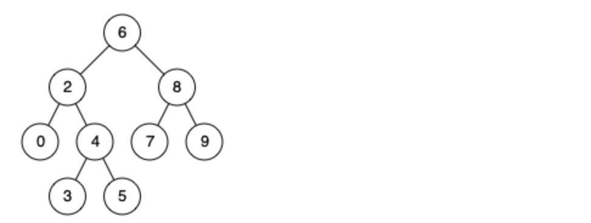

示例 1:

- 输入`: root = [6,2,8,0,4,7,9,null,null,3,5], p = 2, q = 8`
- 输出: 6
- 解释: 节点 2 和节点 8 的最近公共祖先是 6。

示例 2:

- 输入`: root = [6,2,8,0,4,7,9,null,null,3,5], p = 2, q = 4`
- 输出: 2
- 解释: 节点 2 和节点 4 的最近公共祖先是 2, 因为根据定义最近公共祖先节点可以为节点本身。

说明:

- 所有节点的值都是唯一的。
- p、q 为不同节点且均存在于给定的二叉搜索树中。

## 算法公开课

[**《代码随想录》算法视频公开课**](https://programmercarl.com/other/gongkaike.html)**：**[**二叉搜索树找祖先就有点不一样了！| 235. 二叉搜索树的最近公共祖先**](https://www.bilibili.com/video/BV1Zt4y1F7ww?share_source=copy_web)**，相信结** **合视频在看本篇题解，更有助于大家对本题的理解**。

## 思路

做过[二叉树：公共祖先问题](https://programmercarl.com/0236.%E4%BA%8C%E5%8F%89%E6%A0%91%E7%9A%84%E6%9C%80%E8%BF%91%E5%85%AC%E5%85%B1%E7%A5%96%E5%85%88.html)题目的同学应该知道，利用回溯从底向上搜索，遇到一个节点的左子树里有p，右子树里有q，那么当前节点就是最近公共祖先。

那么本题是二叉搜索树，二叉搜索树是有序的，那得好好利用一下这个特点。

在有序树里，如果判断一个节点的左子树里有p，右子树里有q呢？

因为是有序树，所有 如果 中间节点是 q 和 p 的公共祖先，那么 中节点的数组 一定是在 `[p, q]`区间的。即 中节点 `>` `p &&` 中节点 `< q` 或者 中节点 `> q &&` 中节点 `< p`。 

那么只要从上到下去遍历，遇到 cur节点是数值在`[p, q]`区间中则一定可以说明该节点cur就是q 和 p的公共祖先。 那问题来了，**一定是最近公共祖先吗**？

如图，我们从根节点搜索，第一次遇到 cur节点是数值在`[p, q]`区间中，即 节点5，此时可以说明 p 和 q 一定分别存在于 节点 5的左子树，和右子树中。 

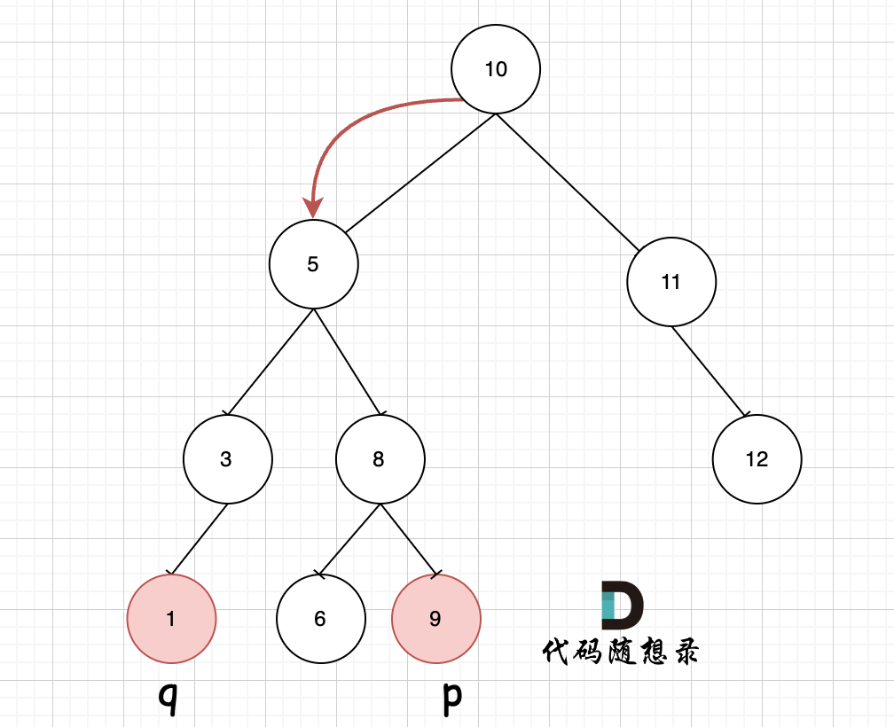

此时节点5是不是最近公共祖先？ 如果 从节点5继续向左遍历，那么将错过成为q的祖先， 如果从节点5继续向右遍历则错过成为p的祖先。 

所以当我们从上向下去递归遍历，第一次遇到 cur节点是数值在`[p, q]`区间中，那么cur就是 p和q的最近公共祖先。

理解这一点，本题就很好解了。

而递归遍历顺序，本题就不涉及到 前中后序了（这里没有中节点的处理逻辑，遍历顺序无所谓了）。

如图所示：p为节点6，q为节点9

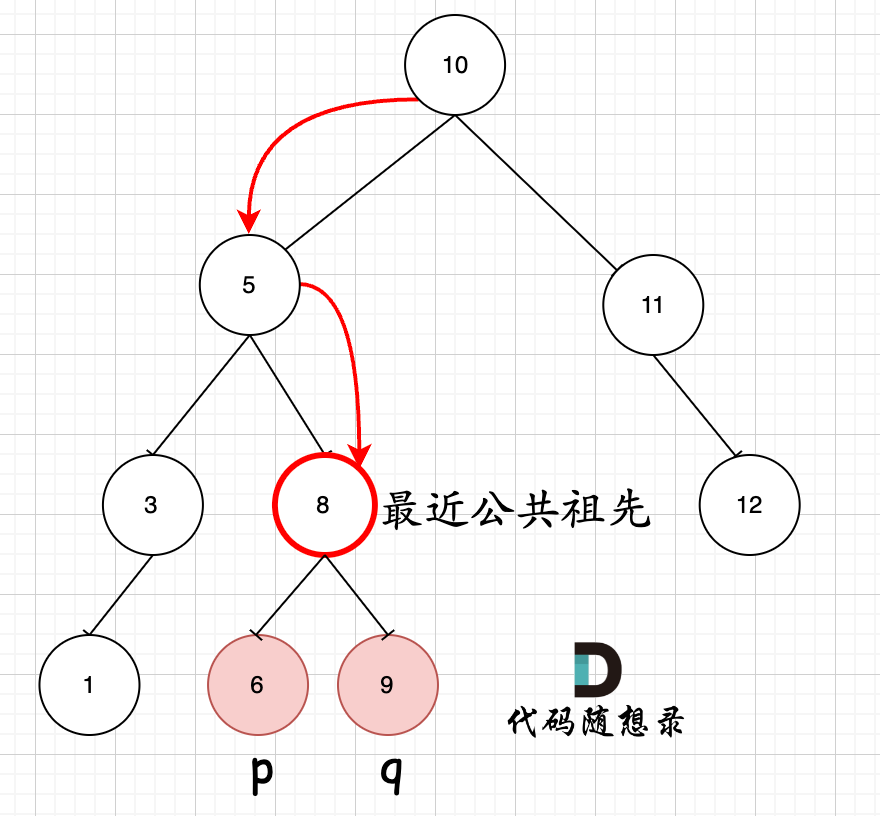

可以看出直接按照指定的方向，就可以找到节点8，为最近公共祖先，而且不需要遍历整棵树，找到结果直接返回！

### 递归法

递归三部曲如下：

- 确定递归函数返回值以及参数

参数就是当前节点，以及两个结点 p、q。

返回值是要返回最近公共祖先，所以是TreeNode *  。

代码如下：

```text
TreeNode* traversal(TreeNode* cur, TreeNode* p, TreeNode* q)
```

- 确定终止条件

遇到空返回就可以了，代码如下：

```cpp
if (cur == NULL) return cur;
```

其实都不需要这个终止条件，因为题目中说了p、q 为不同节点且均存在于给定的二叉搜索树中。也就是说一定会找到公共祖先的，所以并不存在遇到空的情况。

- 确定单层递归的逻辑

在遍历二叉搜索树的时候就是寻找区间`[p->val, q->val]`（注意这里是左闭又闭）

那么如果 `cur->val` 大于 `p->val`，同时 `cur->val` 大于`q->val`，那么就应该向左遍历（说明目标区间在左子树上）。

**需要注意的是此时不知道p和q谁大，所以两个都要判断**

代码如下：

```cpp
if (cur->val > p->val && cur->val > q->val) {
    TreeNode* left = traversal(cur->left, p, q);
    if (left != NULL) {
        return left;
    }
}
```

**细心的同学会发现，在这里调用递归函数的地方，把递归函数的返回值left，直接return**。

在[二叉树：公共祖先问题](https://programmercarl.com/0236.%E4%BA%8C%E5%8F%89%E6%A0%91%E7%9A%84%E6%9C%80%E8%BF%91%E5%85%AC%E5%85%B1%E7%A5%96%E5%85%88.html)中，如果递归函数有返回值，如何区分要搜索一条边，还是搜索整个树。

搜索一条边的写法：

```cpp
if (递归函数(root->left)) return ;
if (递归函数(root->right)) return ;
```

搜索整个树写法：

```cpp
left = 递归函数(root->left);
right = 递归函数(root->right);
left与right的逻辑处理;
```

本题就是标准的搜索一条边的写法，遇到递归函数的返回值，如果不为空，立刻返回。

如果 `cur->val` 小于 `p->val`，同时 `cur->val` 小于 `q->val`，那么就应该向右遍历（目标区间在右子树）。

```cpp
if (cur->val < p->val && cur->val < q->val) {
    TreeNode* right = traversal(cur->right, p, q);
    if (right != NULL) {
        return right;
    }
}
```

剩下的情况，就是cur节点在区间（`p->val <=  cur->val && cur->val <= q->val`）或者 （`q->val <=  cur->val &&` `cur->val <= p->val`）中，那么cur就是最近公共祖先了，直接返回cur。

代码如下：

```cpp
return cur;
```

那么整体递归代码如下:

```cpp
class Solution {
private:
    TreeNode* traversal(TreeNode* cur, TreeNode* p, TreeNode* q) {
        if (cur == NULL) return cur;
                                                        // 中
        if (cur->val > p->val && cur->val > q->val) {   // 左
            TreeNode* left = traversal(cur->left, p, q);
            if (left != NULL) {
                return left;
            }
        }
        if (cur->val < p->val && cur->val < q->val) {   // 右
            TreeNode* right = traversal(cur->right, p, q);
            if (right != NULL) {
                return right;
            }
        }
        return cur;
    }
public:
    TreeNode* lowestCommonAncestor(TreeNode* root, TreeNode* p, TreeNode* q) {
        return traversal(root, p, q);
    }
};
```

精简后代码如下：

```cpp
class Solution {
public:
    TreeNode* lowestCommonAncestor(TreeNode* root, TreeNode* p, TreeNode* q) {
        if (root->val > p->val && root->val > q->val) {
            return lowestCommonAncestor(root->left, p, q);
        } else if (root->val < p->val && root->val < q->val) {
            return lowestCommonAncestor(root->right, p, q);
        } else return root;
    }
};
```

### 迭代法

对于二叉搜索树的迭代法，大家应该在[二叉树：二叉搜索树登场！](https://programmercarl.com/0700.%E4%BA%8C%E5%8F%89%E6%90%9C%E7%B4%A2%E6%A0%91%E4%B8%AD%E7%9A%84%E6%90%9C%E7%B4%A2.html)就了解了。

利用其有序性，迭代的方式还是比较简单的，解题思路在递归中已经分析了。

迭代代码如下：

```cpp
class Solution {
public:
    TreeNode* lowestCommonAncestor(TreeNode* root, TreeNode* p, TreeNode* q) {
        while(root) {
            if (root->val > p->val && root->val > q->val) {
                root = root->left;
            } else if (root->val < p->val && root->val < q->val) {
                root = root->right;
            } else return root;
        }
        return NULL;
    }
};
```

灵魂拷问：是不是又被简单的迭代法感动到痛哭流涕？

## 总结

对于二叉搜索树的最近祖先问题，其实要比[普通二叉树公共祖先问题](https://programmercarl.com/0236.%E4%BA%8C%E5%8F%89%E6%A0%91%E7%9A%84%E6%9C%80%E8%BF%91%E5%85%AC%E5%85%B1%E7%A5%96%E5%85%88.html)简单的多。

不用使用回溯，二叉搜索树自带方向性，可以方便的从上向下查找目标区间，遇到目标区间内的节点，直接返回。

最后给出了对应的迭代法，二叉搜索树的迭代法甚至比递归更容易理解，也是因为其有序性（自带方向性），按照目标区间找就行了。

# 29.二叉搜索树中的插入操作

[力扣题目链接](https://leetcode.cn/problems/insert-into-a-binary-search-tree/)

给定二叉搜索树（BST）的根节点和要插入树中的值，将值插入二叉搜索树。 返回插入后二叉搜索树的根节点。 输入数据保证，新值和原始二叉搜索树中的任意节点值都不同。

注意，可能存在多种有效的插入方式，只要树在插入后仍保持为二叉搜索树即可。 你可以返回任意有效的结果。

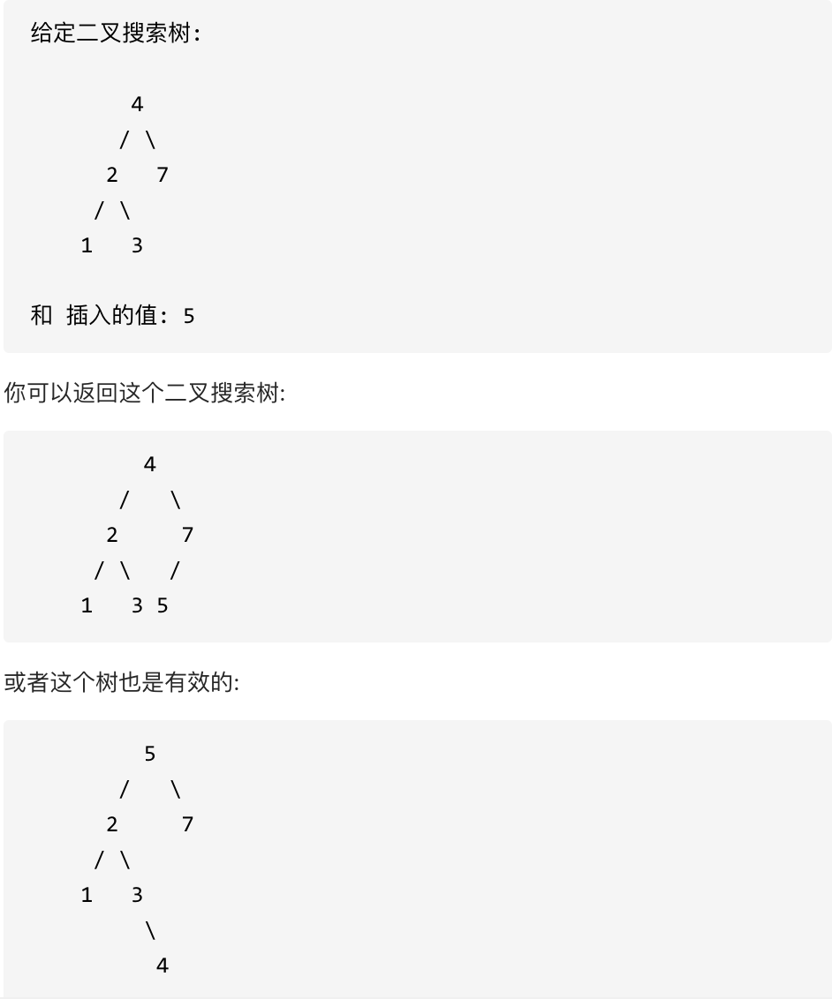

提示：

- 给定的树上的节点数介于 0 和 10^4 之间
- 每个节点都有一个唯一整数值，取值范围从 0 到 10^8
- `-10^8 <= val <= 10^8`
- 新值和原始二叉搜索树中的任意节点值都不同

## 算法公开课

[**《代码随想录》算法视频公开课**](https://programmercarl.com/other/gongkaike.html)**：**[**原来这么简单？ | LeetCode：701.二叉搜索树中的插入操作**](https://www.bilibili.com/video/BV1Et4y1c78Y?share_source=copy_web)**，相信结合视频在** **看本篇题解，更有助于大家对本题的理解**。

## 思路

这道题目其实是一道简单题目，**但是题目中的提示：有多种有效的插入方式，还可以重构二叉搜索树，一下子吓退** **了不少人**，瞬间感觉题目复杂了很多。

其实**可以不考虑题目中提示所说的改变树的结构的插入方式。**

如下演示视频中可以看出：只要按照二叉搜索树的规则去遍历，遇到空节点就插入节点就可以了。

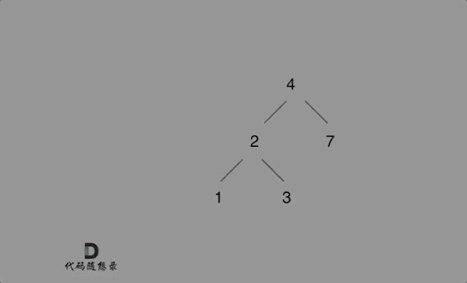

例如插入元素10 ，需要找到末尾节点插入便可，一样的道理来插入元素15，插入元素0，插入元素6，**需要调整二** **叉树的结构么？ 并不需要。**。

只要遍历二叉搜索树，找到空节点 插入元素就可以了，那么这道题其实就简单了。

接下来就是遍历二叉搜索树的过程了。

### 递归

递归三部曲：

- 确定递归函数参数以及返回值

参数就是根节点指针，以及要插入元素，这里递归函数要不要有返回值呢？

可以有，也可以没有，但递归函数如果没有返回值的话，实现是比较麻烦的，下面也会给出其具体实现代码。

**有返回值的话，可以利用返回值完成新加入的节点与其父节点的赋值操作**。（下面会进一步解释）

递归函数的返回类型为节点类型TreeNode * 。

代码如下：

```cpp
TreeNode* insertIntoBST(TreeNode* root, int val)
```

- 确定终止条件

终止条件就是找到遍历的节点为null的时候，就是要插入节点的位置了，并把插入的节点返回。

代码如下：

```cpp
if (root == NULL) {
    TreeNode* node = new TreeNode(val);
    return node;
}
```

这里把添加的节点返回给上一层，就完成了父子节点的赋值操作了，详细再往下看。

- 确定单层递归的逻辑

此时要明确，需要遍历整棵树么？

别忘了这是搜索树，遍历整棵搜索树简直是对搜索树的侮辱，哈哈。

搜索树是有方向了，可以根据插入元素的数值，决定递归方向。

代码如下：

```cpp
if (root->val > val) root->left = insertIntoBST(root->left, val);
if (root->val < val) root->right = insertIntoBST(root->right, val);
return root;
```

**到这里，大家应该能感受到，如何通过递归函数返回值完成了新加入节点的父子关系赋值操作了，下一层将加入节** **点返回，本层用root->left或者root->right将其接住**。

整体代码如下：

```cpp
class Solution {
public:
    TreeNode* insertIntoBST(TreeNode* root, int val) {
        if (root == NULL) {
            TreeNode* node = new TreeNode(val);
            return node;
        }
        if (root->val > val) root->left = insertIntoBST(root->left, val);
        if (root->val < val) root->right = insertIntoBST(root->right, val);
        return root;
    }
};
```

可以看出代码并不复杂。

刚刚说了递归函数不用返回值也可以，找到插入的节点位置，直接让其父节点指向插入节点，结束递归，也是可以的。

那么递归函数定义如下：

```cpp
TreeNode* parent; // 记录遍历节点的父节点
void traversal(TreeNode* cur, int val)
```

没有返回值，需要记录上一个节点（parent），遇到空节点了，就让parent左孩子或者右孩子指向新插入的节点。然后结束递归。

代码如下：

```cpp
class Solution {
private:
    TreeNode* parent;
    void traversal(TreeNode* cur, int val) {
        if (cur == NULL) {
            TreeNode* node = new TreeNode(val);
            if (val > parent->val) parent->right = node;
            else parent->left = node;
            return;
        }
        parent = cur;
        if (cur->val > val) traversal(cur->left, val);
        if (cur->val < val) traversal(cur->right, val);
        return;
    }
public:
    TreeNode* insertIntoBST(TreeNode* root, int val) {
        parent = new TreeNode(0);
        if (root == NULL) {
            root = new TreeNode(val);
        }
        traversal(root, val);
        return root;
    }
};
```

可以看出还是麻烦一些的。

我之所以举这个例子，是想说明通过递归函数的返回值完成父子节点的赋值是可以带来便利的。

**网上千篇一律的代码，可能会误导大家认为通过递归函数返回节点 这样的写法是天经地义，其实这里是有优化的！**

### 迭代

再来看看迭代法，对二叉搜索树迭代写法不熟悉，可以看这篇：[二叉树：二叉搜索树登场！](https://programmercarl.com/0700.%E4%BA%8C%E5%8F%89%E6%90%9C%E7%B4%A2%E6%A0%91%E4%B8%AD%E7%9A%84%E6%90%9C%E7%B4%A2.html)

在迭代法遍历的过程中，需要记录一下当前遍历的节点的父节点，这样才能做插入节点的操作。

在[二叉树：搜索树的最小绝对差](https://programmercarl.com/0530.%E4%BA%8C%E5%8F%89%E6%90%9C%E7%B4%A2%E6%A0%91%E7%9A%84%E6%9C%80%E5%B0%8F%E7%BB%9D%E5%AF%B9%E5%B7%AE.html)和[二叉树：我的众数是多少？](https://programmercarl.com/0501.%E4%BA%8C%E5%8F%89%E6%90%9C%E7%B4%A2%E6%A0%91%E4%B8%AD%E7%9A%84%E4%BC%97%E6%95%B0.html)中，都是用了记录pre和cur两个指针的技巧，本题也是一样的。

代码如下：

```cpp
class Solution {
public:
    TreeNode* insertIntoBST(TreeNode* root, int val) {
        if (root == NULL) {
            TreeNode* node = new TreeNode(val);
            return node;
        }
        TreeNode* cur = root;
        TreeNode* parent = root; // 这个很重要，需要记录上一个节点，否则无法赋值新节点
        while (cur != NULL) {
            parent = cur;
            if (cur->val > val) cur = cur->left;
            else cur = cur->right;
        }
        TreeNode* node = new TreeNode(val);
        if (val < parent->val) parent->left = node;// 此时是用parent节点的进行赋值
        else parent->right = node;
        return root;
    }
};
```

## 总结

首先在二叉搜索树中的插入操作，大家不用恐惧其重构搜索树，其实根本不用重构。

然后在递归中，我们重点讲了如何通过递归函数的返回值完成新加入节点和其父节点的赋值操作，并强调了搜索树的有序性。

最后依然给出了迭代的方法，迭代的方法就需要记录当前遍历节点的父节点了，这个和没有返回值的递归函数实现的代码逻辑是一样的。

二叉搜索树删除节点就涉及到结构调整了

# 30.删除二叉搜索树中的节点

[力扣题目链接](https://leetcode.cn/problems/delete-node-in-a-bst/)

给定一个二叉搜索树的根节点 root 和一个值 key，删除二叉搜索树中的 key 对应的节点，并保证二叉搜索树的性质不变。返回二叉搜索树（有可能被更新）的根节点的引用。

一般来说，删除节点可分为两个步骤：

首先找到需要删除的节点；如果找到了，删除它。  
说明： 要求算法时间复杂度为 `$O(h)$`，h 为树的高度。

示例:

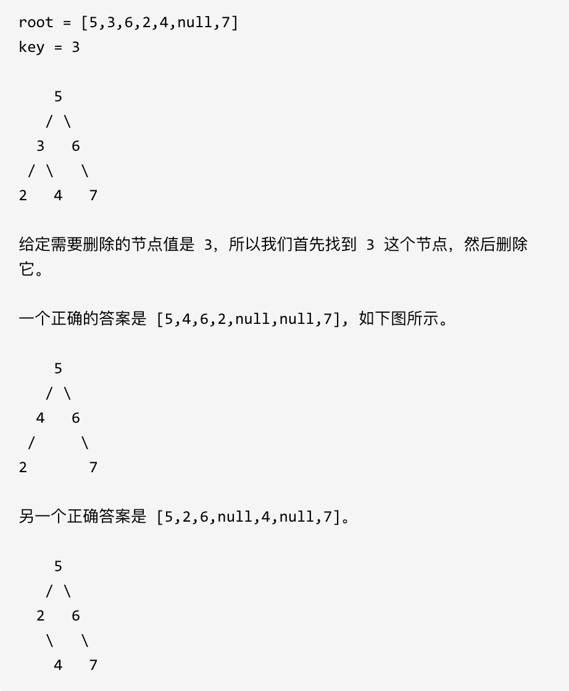

## 算法公开课

[**《代码随想录》算法视频公开课**](https://programmercarl.com/other/gongkaike.html)**：**[**调整二叉树的结构最难！| LeetCode：450.删除二叉搜索树中的节点**](https://www.bilibili.com/video/BV1tP41177us?share_source=copy_web)**，相信结** **合视频在看本篇题解，更有助于大家对本题的理解**。

## 思路

搜索树的节点删除要比节点增加复杂的多，有很多情况需要考虑，做好心理准备。

### 递归

递归三部曲：

- 确定递归函数参数以及返回值

说到递归函数的返回值，在[二叉树：搜索树中的插入操作](https://programmercarl.com/0701.%E4%BA%8C%E5%8F%89%E6%90%9C%E7%B4%A2%E6%A0%91%E4%B8%AD%E7%9A%84%E6%8F%92%E5%85%A5%E6%93%8D%E4%BD%9C.html)中通过递归返回值来加入新节点， 这里也可以通过递归返回值删除节点。

代码如下：

```cpp
TreeNode* deleteNode(TreeNode* root, int key)
```

- 确定终止条件

遇到空返回，其实这也说明没找到删除的节点，遍历到空节点直接返回了

```cpp
if (root == nullptr) return root;
```

- 确定单层递归的逻辑

这里就把二叉搜索树中删除节点遇到的情况都搞清楚。

有以下五种情况：

- 第一种情况：没找到删除的节点，遍历到空节点直接返回了
- 找到删除的节点

第二种情况：左右孩子都为空（叶子节点），直接删除节点， 返回NULL为根节点

第三种情况：删除节点的左孩子为空，右孩子不为空，删除节点，右孩子补位，返回右孩子为根节点

第四种情况：删除节点的右孩子为空，左孩子不为空，删除节点，左孩子补位，返回左孩子为根节点

第五种情况：左右孩子节点都不为空，则将删除节点的左子树头结点（左孩子）放到删除节点的右子树的最左面节点的左孩子上，返回删除节点右孩子为新的根节点。

第五种情况有点难以理解，看下面动画：

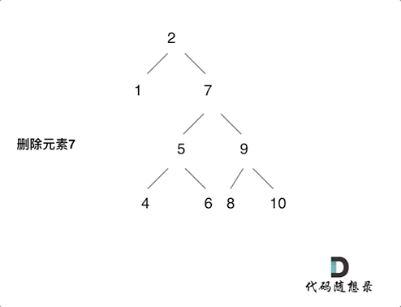

动画中的二叉搜索树中，删除元素7， 那么删除节点（元素7）的左孩子就是5，删除节点（元素7）的右子树的最左面节点是元素8。

将删除节点（元素7）的左孩子放到删除节点（元素7）的右子树的最左面节点（元素8）的左孩子上，就是把5为根节点的子树移到了8的左孩子的位置。

要删除的节点（元素7）的右孩子（元素9）为新的根节点。.

这样就完成删除元素7的逻辑，最好动手画一个图，尝试删除一个节点试试。

代码如下：

```cpp
if (root->val == key) {
    // 第二种情况：左右孩子都为空（叶子节点），直接删除节点， 返回NULL为根节点
    // 第三种情况：其左孩子为空，右孩子不为空，删除节点，右孩子补位 ，返回右孩子为根节点
    if (root->left == nullptr) return root->right;
    // 第四种情况：其右孩子为空，左孩子不为空，删除节点，左孩子补位，返回左孩子为根节点
    else if (root->right == nullptr) return root->left;
    // 第五种情况：左右孩子节点都不为空，则将删除节点的左子树放到删除节点的右子树的最左面节点的左孩子的
位置
    // 并返回删除节点右孩子为新的根节点。
    else {
        TreeNode* cur = root->right; // 找右子树最左面的节点
        while(cur->left != nullptr) {
            cur = cur->left;
        }
        cur->left = root->left; // 把要删除的节点（root）左子树放在cur的左孩子的位置
        TreeNode* tmp = root;   // 把root节点保存一下，下面来删除
        root = root->right;     // 返回旧root的右孩子作为新root
        delete tmp;             // 释放节点内存（这里不写也可以，但C++最好手动释放一下吧）
        return root;
    }
}
```

这里相当于把新的节点返回给上一层，上一层就要用 `root->left` 或者 `root->right`接住，代码如下：

```cpp
if (root->val > key) root->left = deleteNode(root->left, key);
if (root->val < key) root->right = deleteNode(root->right, key);
return root;
```

**整体代码如下：（注释中：情况1，2，3，4，5和上面分析严格对应）**

```cpp
class Solution {
public:
    TreeNode* deleteNode(TreeNode* root, int key) {
        if (root == nullptr) return root; // 第一种情况：没找到删除的节点，遍历到空节点直接返回
了
        if (root->val == key) {
            // 第二种情况：左右孩子都为空（叶子节点），直接删除节点， 返回NULL为根节点
            if (root->left == nullptr && root->right == nullptr) {
                ///! 内存释放
                delete root;
                return nullptr;
            }
            // 第三种情况：其左孩子为空，右孩子不为空，删除节点，右孩子补位 ，返回右孩子为根节点
            else if (root->left == nullptr) {
                auto retNode = root->right;
                ///! 内存释放
                delete root;
                return retNode;
            }
            // 第四种情况：其右孩子为空，左孩子不为空，删除节点，左孩子补位，返回左孩子为根节点
            else if (root->right == nullptr) {
                auto retNode = root->left;
                ///! 内存释放
                delete root;
                return retNode;
            }
            // 第五种情况：左右孩子节点都不为空，则将删除节点的左子树放到删除节点的右子树的最左面节点
的左孩子的位置
            // 并返回删除节点右孩子为新的根节点。
            else {
                TreeNode* cur = root->right; // 找右子树最左面的节点
                while(cur->left != nullptr) {
                    cur = cur->left;
                }
                cur->left = root->left; // 把要删除的节点（root）左子树放在cur的左孩子的位置
                TreeNode* tmp = root;   // 把root节点保存一下，下面来删除
                root = root->right;     // 返回旧root的右孩子作为新root
                delete tmp;             // 释放节点内存（这里不写也可以，但C++最好手动释放一下
吧）
                return root;
            }
        }
        if (root->val > key) root->left = deleteNode(root->left, key);
        if (root->val < key) root->right = deleteNode(root->right, key);
        return root;
    }
};
```

### 普通二叉树的删除方式

这里我在介绍一种通用的删除，普通二叉树的删除方式（没有使用搜索树的特性，遍历整棵树），用交换值的操作来删除目标节点。

代码中目标节点（要删除的节点）被操作了两次：

- 第一次是和目标节点的右子树最左面节点交换。
- 第二次直接被NULL覆盖了。

思路有点绕，感兴趣的同学可以画图自己理解一下。

代码如下：（关键部分已经注释）

```cpp
class Solution {
public:
    TreeNode* deleteNode(TreeNode* root, int key) {
        if (root == nullptr) return root;
        if (root->val == key) {
            if (root->right == nullptr) { // 这里第二次操作目标值：最终删除的作用
                return root->left;
            }
            TreeNode *cur = root->right;
            while (cur->left) {
                cur = cur->left;
            }
            swap(root->val, cur->val); // 这里第一次操作目标值：交换目标值其右子树最左面节点。
        }
        root->left = deleteNode(root->left, key);
        root->right = deleteNode(root->right, key);
        return root;
    }
};
```

这个代码是简短一些，思路也巧妙，但是不太好想，实操性不强，推荐第一种写法！

### 迭代法

删除节点的迭代法还是复杂一些的，但其本质我在递归法里都介绍了，最关键就是删除节点的操作（动画模拟的过程）

代码如下：

```cpp
class Solution {
private:
    // 将目标节点（删除节点）的左子树放到 目标节点的右子树的最左面节点的左孩子位置上
    // 并返回目标节点右孩子为新的根节点
    // 是动画里模拟的过程
    TreeNode* deleteOneNode(TreeNode* target) {
        if (target == nullptr) return target;
        if (target->right == nullptr) return target->left;
        TreeNode* cur = target->right;
        while (cur->left) {
            cur = cur->left;
        }
        cur->left = target->left;
        return target->right;
    }
public:
    TreeNode* deleteNode(TreeNode* root, int key) {
        if (root == nullptr) return root;
        TreeNode* cur = root;
        TreeNode* pre = nullptr; // 记录cur的父节点，用来删除cur
        while (cur) {
            if (cur->val == key) break;
            pre = cur;
            if (cur->val > key) cur = cur->left;
            else cur = cur->right;
        }
        if (pre == nullptr) { // 如果搜索树只有头结点
            return deleteOneNode(cur);
        }
        // pre 要知道是删左孩子还是右孩子
        if (pre->left && pre->left->val == key) {
            pre->left = deleteOneNode(cur);
        }
        if (pre->right && pre->right->val == key) {
            pre->right = deleteOneNode(cur);
        }
        return root;
    }
};
```

## 总结

读完本篇，大家会发现二叉搜索树删除节点比增加节点复杂的多。

**因为二叉搜索树添加节点只需要在叶子上添加就可以的，不涉及到结构的调整，而删除节点操作涉及到结构的调** **整**。

这里我们依然使用递归函数的返回值来完成把节点从二叉树中移除的操作。

**这里最关键的逻辑就是第五种情况（删除一个左右孩子都不为空的节点），这种情况一定要想清楚**。

而且就算想清楚了，对应的代码也未必可以写出来，所以**这道题目既考察思维逻辑，也考察代码能力**。

递归中我给出了两种写法，推荐大家学会第一种（利用搜索树的特性）就可以了，第二种递归写法其实是比较绕的。

最后我也给出了相应的迭代法，就是模拟递归法中的逻辑来删除节点，但需要一个pre记录cur的父节点，方便做删除操作。

迭代法其实不太容易写出来，所以如果是初学者的话，彻底掌握第一种递归写法就够了。

如果不对递归有深刻的理解，本题有点难单纯移除一个节点那还不够，要修剪！

# 31. 修剪二叉搜索树

[力扣题目链接](https://leetcode.cn/problems/trim-a-binary-search-tree/)

给定一个二叉搜索树，同时给定最小边界L 和最大边界 R。通过修剪二叉搜索树，使得所有节点的值在`[L, R]`中 `(R>=L)` 。你可能需要改变树的根节点，所以结果应当返回修剪好的二叉搜索树的新的根节点。

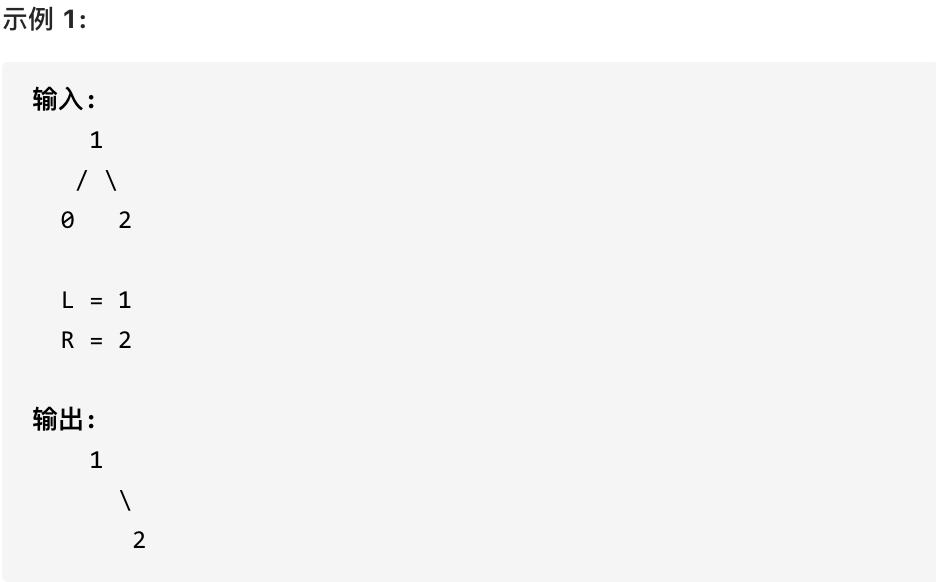

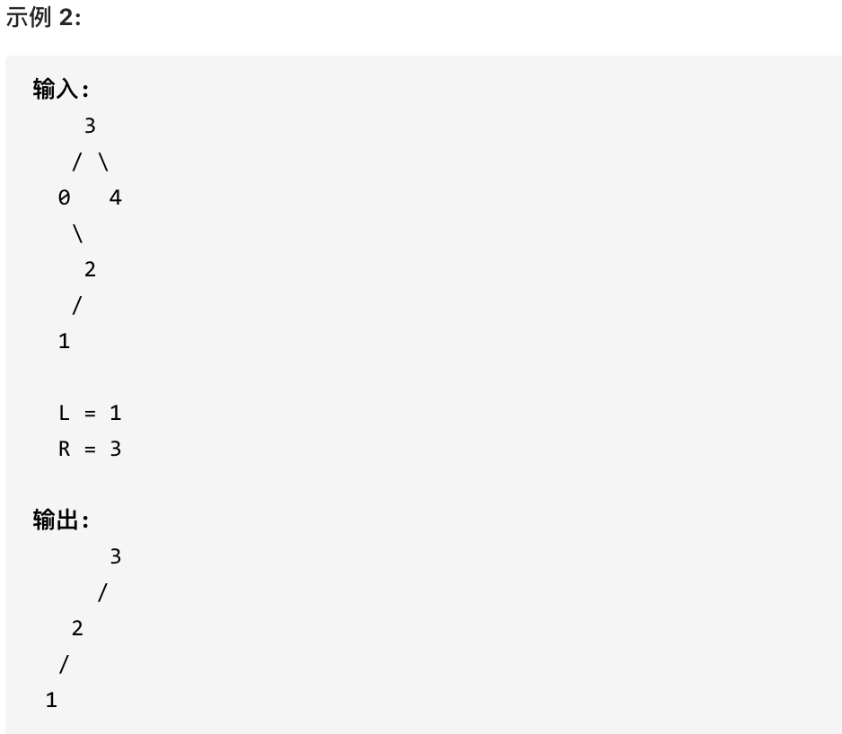

## 算法公开课

[**《代码随想录》算法视频公开课**](https://programmercarl.com/other/gongkaike.html)**：**[**你修剪的方式不对，我来给你纠正一下！| LeetCode：669. 修剪二叉搜索树**](https://www.bilibili.com/video/BV17P41177ud?share_source=copy_web)**，** **相信结合视频在看本篇题解，更有助于大家对本题的理解**。

## 思路

相信看到这道题目大家都感觉是一道简单题（事实上leetcode上也标明是简单）。

但还真的不简单！

### 递归法

```text
直接想法就是：递归处理，然后遇到 root->val < low || root->val > high 的时候直接return NULL，一波
```

修改，赶紧利落。

不难写出如下代码：

```cpp
class Solution {
public:
    TreeNode* trimBST(TreeNode* root, int low, int high) {
        if (root == nullptr || root->val < low || root->val > high) return nullptr;
        root->left = trimBST(root->left, low, high);
        root->right = trimBST(root->right, low, high);
        return root;
    }
};
```

**然而[1, 3]区间在二叉搜索树的中可不是单纯的节点3和左孩子节点0就决定的，还要考虑节点0的右子树**。

我们在重新关注一下第二个示例，如图：

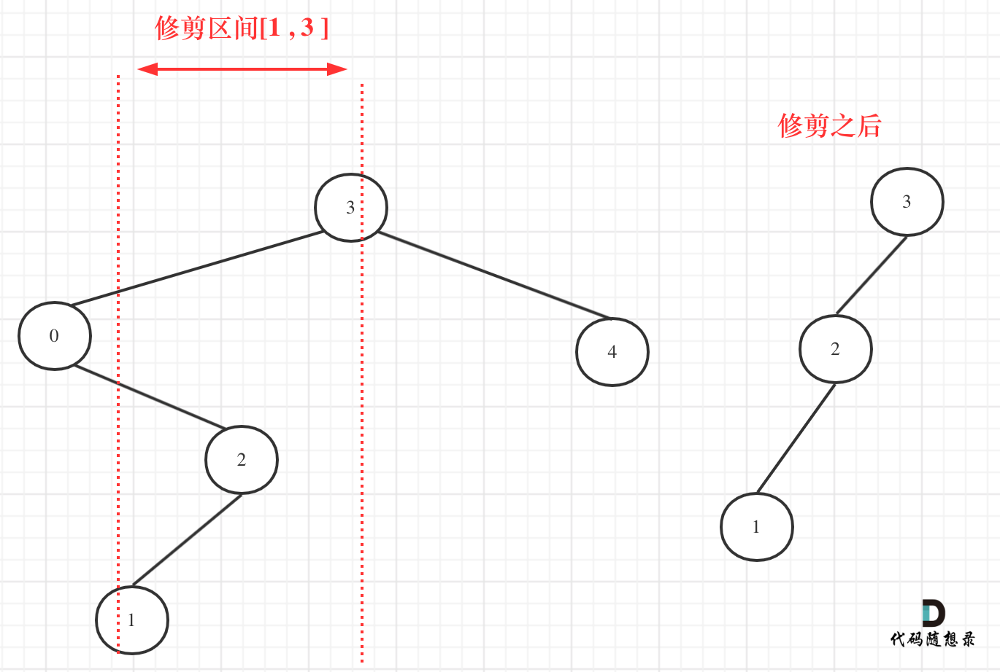

**所以以上的代码是不可行的！**

从图中可以看出需要重构二叉树，想想是不是本题就有点复杂了。

其实不用重构那么复杂。

在上图中我们发现节点0并不符合区间要求，那么将节点0的右孩子 节点2 直接赋给 节点3的左孩子就可以了（就是把节点0从二叉树中移除），如图：

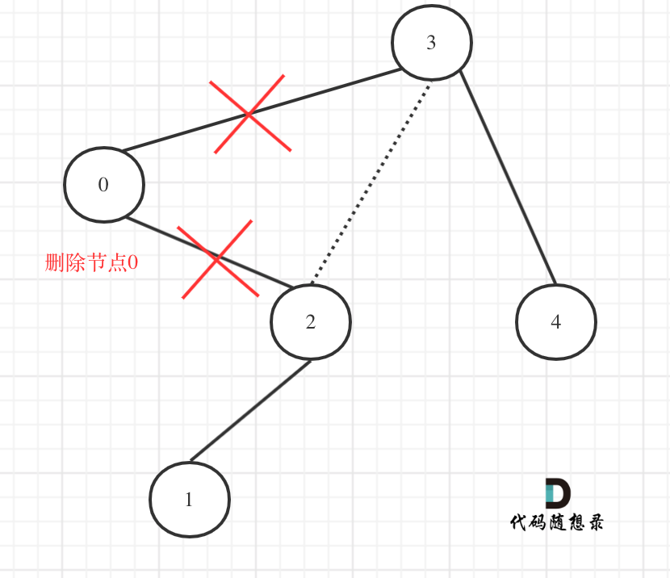

理解了最关键部分了我们再递归三部曲：

- 确定递归函数的参数以及返回值

这里我们为什么需要返回值呢？

因为是要遍历整棵树，做修改，其实不需要返回值也可以，我们也可以完成修剪（其实就是从二叉树中移除节点）的操作。

但是有返回值，更方便，可以通过递归函数的返回值来移除节点。

这样的做法在[二叉树：搜索树中的插入操作](https://programmercarl.com/0701.%E4%BA%8C%E5%8F%89%E6%90%9C%E7%B4%A2%E6%A0%91%E4%B8%AD%E7%9A%84%E6%8F%92%E5%85%A5%E6%93%8D%E4%BD%9C.html)和[二叉树：搜索树中的删除操作](https://programmercarl.com/0450.%E5%88%A0%E9%99%A4%E4%BA%8C%E5%8F%89%E6%90%9C%E7%B4%A2%E6%A0%91%E4%B8%AD%E7%9A%84%E8%8A%82%E7%82%B9.html)中大家已经了解过了。

代码如下：

```cpp
TreeNode* trimBST(TreeNode* root, int low, int high)
```

- 确定终止条件

修剪的操作并不是在终止条件上进行的，所以就是遇到空节点返回就可以了。

```cpp
if (root == nullptr ) return nullptr;
```

- 确定单层递归的逻辑

如果root（当前节点）的元素小于low的数值，那么应该递归右子树，并返回右子树符合条件的头结点。

代码如下：

```cpp
if (root->val < low) {
    TreeNode* right = trimBST(root->right, low, high); // 寻找符合区间[low, high]的节点
    return right;
}
```

如果`root(`当前节点`)`的元素大于high的，那么应该递归左子树，并返回左子树符合条件的头结点。

代码如下：

```cpp
if (root->val > high) {
    TreeNode* left = trimBST(root->left, low, high); // 寻找符合区间[low, high]的节点
    return left;
}
```

接下来要将下一层处理完左子树的结果赋给`root->left`，处理完右子树的结果赋给`root->right`。

最后返回root节点，代码如下：

```cpp
root->left = trimBST(root->left, low, high); // root->left接入符合条件的左孩子
root->right = trimBST(root->right, low, high); // root->right接入符合条件的右孩子
return root;
```

此时大家是不是还没发现这多余的节点究竟是如何从二叉树中移除的呢？

在回顾一下上面的代码，针对下图中二叉树的情况：


如下代码相当于把节点0的右孩子（节点2）返回给上一层，

```cpp
if (root->val < low) {
    TreeNode* right = trimBST(root->right, low, high); // 寻找符合区间[low, high]的节点
    return right;
}
```

然后如下代码相当于用节点3的左孩子 把下一层返回的 节点0的右孩子（节点2） 接住。

```cpp
root->left = trimBST(root->left, low, high);
```

此时节点3的左孩子就变成了节点2，将节点0从二叉树中移除了。

最后整体代码如下：

```cpp
class Solution {
public:
    TreeNode* trimBST(TreeNode* root, int low, int high) {
        if (root == nullptr ) return nullptr;
        if (root->val < low) {
            TreeNode* right = trimBST(root->right, low, high); // 寻找符合区间[low, high]
的节点
            return right;
        }
        if (root->val > high) {
            TreeNode* left = trimBST(root->left, low, high); // 寻找符合区间[low, high]的
节点
            return left;
        }
        root->left = trimBST(root->left, low, high); // root->left接入符合条件的左孩子
        root->right = trimBST(root->right, low, high); // root->right接入符合条件的右孩子
        return root;
    }
};
```

精简之后代码如下：

```cpp
class Solution {
public:
    TreeNode* trimBST(TreeNode* root, int low, int high) {
        if (root == nullptr) return nullptr;
        if (root->val < low) return trimBST(root->right, low, high);
        if (root->val > high) return trimBST(root->left, low, high);
        root->left = trimBST(root->left, low, high);
        root->right = trimBST(root->right, low, high);
        return root;
    }
};
```

只看代码，其实不太好理解节点是如何移除的，这一块大家可以自己再模拟模拟！

### 迭代法

因为二叉搜索树的有序性，不需要使用栈模拟递归的过程。

在剪枝的时候，可以分为三步：

- 将root移动到`[L, R]` 范围内，注意是左闭右闭区间
- 剪枝左子树
- 剪枝右子树

代码如下：

```cpp
class Solution {
public:
    TreeNode* trimBST(TreeNode* root, int L, int R) {
        if (!root) return nullptr;
        // 处理头结点，让root移动到[L, R] 范围内，注意是左闭右闭
        while (root != nullptr && (root->val < L || root->val > R)) {
            if (root->val < L) root = root->right; // 小于L往右走
            else root = root->left; // 大于R往左走
        }
        TreeNode *cur = root;
        // 此时root已经在[L, R] 范围内，处理左孩子元素小于L的情况
        while (cur != nullptr) {
            while (cur->left && cur->left->val < L) {
                cur->left = cur->left->right;
            }
            cur = cur->left;
        }
        cur = root;
        // 此时root已经在[L, R] 范围内，处理右孩子大于R的情况
        while (cur != nullptr) {
            while (cur->right && cur->right->val > R) {
                cur->right = cur->right->left;
            }
            cur = cur->right;
        }
        return root;
    }
};
```

## 总结

修剪二叉搜索树其实并不难，但在递归法中大家可看出我费了很大的功夫来讲解如何删除节点的，这个思路其实是比较绕的。

最终的代码倒是很简洁。

**如果不对递归有深刻的理解，这道题目还是有难度的！**

本题我依然给出递归法和迭代法，初学者掌握递归就可以了，如果想进一步学习，就把迭代法也写一写。

构造二叉搜索树，一不小心就平衡了

# 32.将有序数组转换为二叉搜索树

[力扣题目链接](https://leetcode.cn/problems/convert-sorted-array-to-binary-search-tree/)

将一个按照升序排列的有序数组，转换为一棵高度平衡二叉搜索树。

本题中，一个高度平衡二叉树是指一个二叉树每个节点 的左右两个子树的高度差的绝对值不超过 1。

示例:

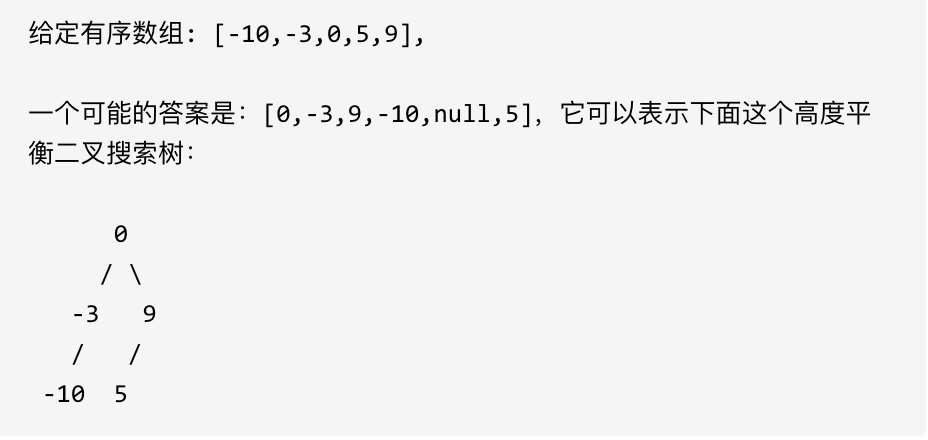

## 算法公开课

[**《代码随想录》算法视频公开课**](https://programmercarl.com/other/gongkaike.html)**：**[**构造平衡二叉搜索树！| LeetCode：108.将有序数组转换为二叉搜索树**](https://www.bilibili.com/video/BV1uR4y1X7qL?share_source=copy_web)**，相信** **结合视频在看本篇题解，更有助于大家对本题的理解**。

## 思路

做这道题目之前大家可以了解一下这几道：

- [106.从中序与后序遍历序列构造二叉树](https://programmercarl.com/0106.%E4%BB%8E%E4%B8%AD%E5%BA%8F%E4%B8%8E%E5%90%8E%E5%BA%8F%E9%81%8D%E5%8E%86%E5%BA%8F%E5%88%97%E6%9E%84%E9%80%A0%E4%BA%8C%E5%8F%89%E6%A0%91.html)
- [654.最大二叉树](https://programmercarl.com/0654.%E6%9C%80%E5%A4%A7%E4%BA%8C%E5%8F%89%E6%A0%91.html)中其实已经讲过了，如果根据数组构造一棵二叉树。
- [701.二叉搜索树中的插入操作](https://programmercarl.com/0701.%E4%BA%8C%E5%8F%89%E6%90%9C%E7%B4%A2%E6%A0%91%E4%B8%AD%E7%9A%84%E6%8F%92%E5%85%A5%E6%93%8D%E4%BD%9C.html)
- [450.删除二叉搜索树中的节点](https://programmercarl.com/0450.%E5%88%A0%E9%99%A4%E4%BA%8C%E5%8F%89%E6%90%9C%E7%B4%A2%E6%A0%91%E4%B8%AD%E7%9A%84%E8%8A%82%E7%82%B9.html)

进入正题：

题目中说要转换为一棵高度平衡二叉搜索树。为什么强调要平衡呢？ 

因为只要给我们一个有序数组，如果强调平衡，都可以以线性结构来构造二叉搜索树。 

例如 有序数组`[-10`，-3，0，5，`9]` 就可以构造成这样的二叉搜索树，如图。 

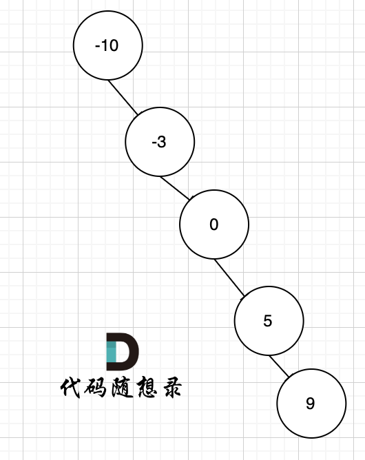

上图中，是符合二叉搜索树的特性吧，如果要这么做的话，是不是本题意义就不大了，所以才强调是平衡二叉搜索树。

其实数组构造二叉树，构成平衡树是自然而然的事情，因为大家默认都是从数组中间位置取值作为节点元素，一般不会随机取。**所以想构成不平衡的二叉树是自找麻烦**。

在[二叉树：构造二叉树登场！](https://programmercarl.com/0106.%E4%BB%8E%E4%B8%AD%E5%BA%8F%E4%B8%8E%E5%90%8E%E5%BA%8F%E9%81%8D%E5%8E%86%E5%BA%8F%E5%88%97%E6%9E%84%E9%80%A0%E4%BA%8C%E5%8F%89%E6%A0%91.html)和[二叉树：构造一棵最大的二叉树](https://programmercarl.com/0654.%E6%9C%80%E5%A4%A7%E4%BA%8C%E5%8F%89%E6%A0%91.html)中其实已经讲过了，如果根据数组构造一棵二叉树。

**本质就是寻找分割点，分割点作为当前节点，然后递归左区间和右区间**。

本题其实要比[二叉树：构造二叉树登场！](https://programmercarl.com/0106.%E4%BB%8E%E4%B8%AD%E5%BA%8F%E4%B8%8E%E5%90%8E%E5%BA%8F%E9%81%8D%E5%8E%86%E5%BA%8F%E5%88%97%E6%9E%84%E9%80%A0%E4%BA%8C%E5%8F%89%E6%A0%91.html) 和 [二叉树：构造一棵最大的二叉树](https://programmercarl.com/0654.%E6%9C%80%E5%A4%A7%E4%BA%8C%E5%8F%89%E6%A0%91.html)简单一些，因为有序数组构造二叉搜索树，寻找分割点就比较容易了。

分割点就是数组中间位置的节点。

那么为问题来了，如果数组长度为偶数，中间节点有两个，取哪一个？

取哪一个都可以，只不过构成了不同的平衡二叉搜索树。

例如：输入：`[-10,-3,0,5,9]`

如下两棵树，都是这个数组的平衡二叉搜索树：

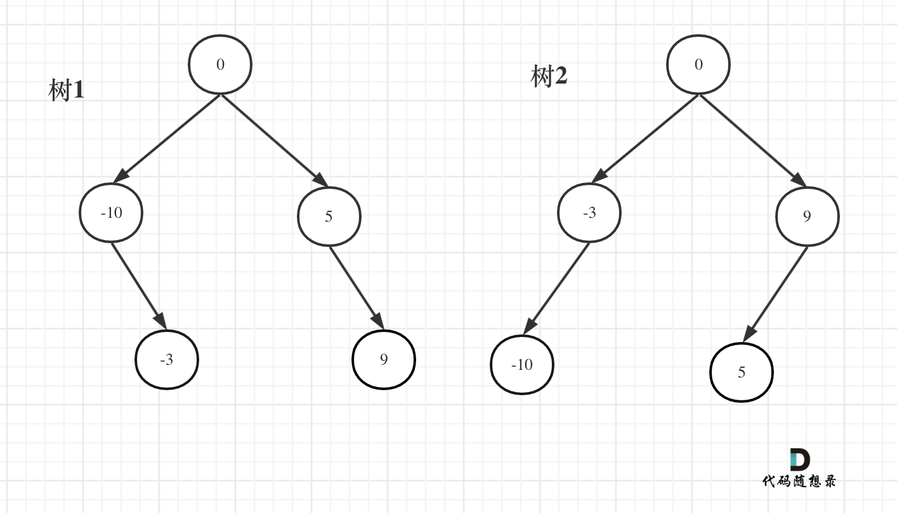

如果要分割的数组长度为偶数的时候，中间元素为两个，是取左边元素  就是树1，取右边元素就是树2。

**这也是题目中强调答案不是唯一的原因。 理解这一点，这道题目算是理解到位了**。

### 递归

递归三部曲：

- 确定递归函数返回值及其参数

删除二叉树节点，增加二叉树节点，都是用递归函数的返回值来完成，这样是比较方便的。

相信大家如果仔细看了[二叉树：搜索树中的插入操作](https://programmercarl.com/0701.%E4%BA%8C%E5%8F%89%E6%90%9C%E7%B4%A2%E6%A0%91%E4%B8%AD%E7%9A%84%E6%8F%92%E5%85%A5%E6%93%8D%E4%BD%9C.html)和[二叉树：搜索树中的删除操作](https://programmercarl.com/0450.%E5%88%A0%E9%99%A4%E4%BA%8C%E5%8F%89%E6%90%9C%E7%B4%A2%E6%A0%91%E4%B8%AD%E7%9A%84%E8%8A%82%E7%82%B9.html)，一定会对递归函数返回值的作用深有感触。

那么本题要构造二叉树，依然用递归函数的返回值来构造中节点的左右孩子。

再来看参数，首先是传入数组，然后就是左下标left和右下标right，我们在[二叉树：构造二叉树登场！](https://programmercarl.com/0106.%E4%BB%8E%E4%B8%AD%E5%BA%8F%E4%B8%8E%E5%90%8E%E5%BA%8F%E9%81%8D%E5%8E%86%E5%BA%8F%E5%88%97%E6%9E%84%E9%80%A0%E4%BA%8C%E5%8F%89%E6%A0%91.html)中提过，在构造二叉树的时候尽量不要重新定义左右区间数组，而是用下标来操作原数组。

所以代码如下：

```cpp
// 左闭右闭区间[left, right]
TreeNode* traversal(vector<int>& nums, int left, int right)
```

这里注意，**我这里定义的是左闭右闭区间，在不断分割的过程中，也会坚持左闭右闭的区间，这又涉及到我们讲过** **的循环不变量**。

在[二叉树：构造二叉树登场！](https://programmercarl.com/0106.%E4%BB%8E%E4%B8%AD%E5%BA%8F%E4%B8%8E%E5%90%8E%E5%BA%8F%E9%81%8D%E5%8E%86%E5%BA%8F%E5%88%97%E6%9E%84%E9%80%A0%E4%BA%8C%E5%8F%89%E6%A0%91.html)，[35.搜索插入位置](https://programmercarl.com/0035.%E6%90%9C%E7%B4%A2%E6%8F%92%E5%85%A5%E4%BD%8D%E7%BD%AE.html) 和[59.螺旋矩阵II](https://programmercarl.com/0059.%E8%9E%BA%E6%97%8B%E7%9F%A9%E9%98%B5II.html)都详细讲过循环不变量。

- 确定递归终止条件

这里定义的是左闭右闭的区间，所以当区间 `left > right`的时候，就是空节点了。

代码如下：

```cpp
if (left > right) return nullptr;
```

- 确定单层递归的逻辑

```cpp
首先取数组中间元素的位置，不难写出int mid = (left + right) / 2; ，这么写其实有一个问题，就是数值
```

**越界，例如left和right都是最大int，这么操作就越界了，在**[**二分法**](https://programmercarl.com/0035.%E6%90%9C%E7%B4%A2%E6%8F%92%E5%85%A5%E4%BD%8D%E7%BD%AE.html)**中尤其需要注意！**

```cpp
所以可以这么写：int mid = left + ((right - left) / 2);
```

但本题leetcode的测试数据并不会越界，所以怎么写都可以。但需要有这个意识！

```cpp
取了中间位置，就开始以中间位置的元素构造节点，代码：TreeNode* root = new TreeNode(nums[mid]); 。
```

接着划分区间，root的左孩子接住下一层左区间的构造节点，右孩子接住下一层右区间构造的节点。

最后返回root节点，单层递归整体代码如下：

```cpp
int mid = left + ((right - left) / 2);
TreeNode* root = new TreeNode(nums[mid]);
root->left = traversal(nums, left, mid - 1);
root->right = traversal(nums, mid + 1, right);
return root;
这里int mid = left + ((right - left) / 2); 的写法相当于是如果数组长度为偶数，中间位置有两个元
```

素，取靠左边的。

- 递归整体代码如下：

```cpp
class Solution {
private:
    TreeNode* traversal(vector<int>& nums, int left, int right) {
        if (left > right) return nullptr;
        int mid = left + ((right - left) / 2);
        TreeNode* root = new TreeNode(nums[mid]);
        root->left = traversal(nums, left, mid - 1);
        root->right = traversal(nums, mid + 1, right);
        return root;
    }
public:
    TreeNode* sortedArrayToBST(vector<int>& nums) {
        TreeNode* root = traversal(nums, 0, nums.size() - 1);
        return root;
    }
};
```

**注意：在调用traversal的时候传入的left和right为什么是0和nums.size() - 1，因为定义的区间为左闭右闭**。

### 迭代法

迭代法可以通过三个队列来模拟，一个队列放遍历的节点，一个队列放左区间下标，一个队列放右区间下标。

模拟的就是不断分割的过程，`C++`代码如下：（我已经详细注释）

```cpp
class Solution {
public:
    TreeNode* sortedArrayToBST(vector<int>& nums) {
        if (nums.size() == 0) return nullptr;
        TreeNode* root = new TreeNode(0);   // 初始根节点
        queue<TreeNode*> nodeQue;           // 放遍历的节点
        queue<int> leftQue;                 // 保存左区间下标
        queue<int> rightQue;                // 保存右区间下标
        nodeQue.push(root);                 // 根节点入队列
        leftQue.push(0);                    // 0为左区间下标初始位置
        rightQue.push(nums.size() - 1);     // nums.size() - 1为右区间下标初始位置
        while (!nodeQue.empty()) {
            TreeNode* curNode = nodeQue.front();
            nodeQue.pop();
            int left = leftQue.front(); leftQue.pop();
            int right = rightQue.front(); rightQue.pop();
            int mid = left + ((right - left) / 2);
            curNode->val = nums[mid];       // 将mid对应的元素给中间节点
            if (left <= mid - 1) {          // 处理左区间
                curNode->left = new TreeNode(0);
                nodeQue.push(curNode->left);
                leftQue.push(left);
                rightQue.push(mid - 1);
            }
            if (right >= mid + 1) {         // 处理右区间
                curNode->right = new TreeNode(0);
                nodeQue.push(curNode->right);
                leftQue.push(mid + 1);
                rightQue.push(right);
            }
        }
        return root;
    }
};
```

## 总结

**在**[**二叉树：构造二叉树登场！**](https://programmercarl.com/0106.%E4%BB%8E%E4%B8%AD%E5%BA%8F%E4%B8%8E%E5%90%8E%E5%BA%8F%E9%81%8D%E5%8E%86%E5%BA%8F%E5%88%97%E6%9E%84%E9%80%A0%E4%BA%8C%E5%8F%89%E6%A0%91.html) **和** [**二叉树：构造一棵最大的二叉树**](https://programmercarl.com/0654.%E6%9C%80%E5%A4%A7%E4%BA%8C%E5%8F%89%E6%A0%91.html)**之后，我们顺理成章的应该构造一下二叉搜索树** **了，一不小心还是一棵平衡二叉搜索树**。

其实思路也是一样的，不断中间分割，然后递归处理左区间，右区间，也可以说是分治。

此时相信大家应该对通过递归函数的返回值来增删二叉树很熟悉了，这也是常规操作。

在定义区间的过程中我们又一次强调了循环不变量的重要性。

最后依然给出迭代的方法，其实就是模拟取中间元素，然后不断分割去构造二叉树的过程。

# 33.把二叉搜索树转换为累加树

[力扣题目链接](https://leetcode.cn/problems/convert-bst-to-greater-tree/)

给出二叉 搜索 树的根节点，该树的节点值各不相同，请你将其转换为累加树（Greater Sum Tree），使每个节点 node 的新值等于原树中大于或等于 node.val 的值之和。

提醒一下，二叉搜索树满足下列约束条件：

节点的左子树仅包含键 小于 节点键的节点。节点的右子树仅包含键 大于 节点键的节点。左右子树也必须是二叉搜索树。

示例 1：

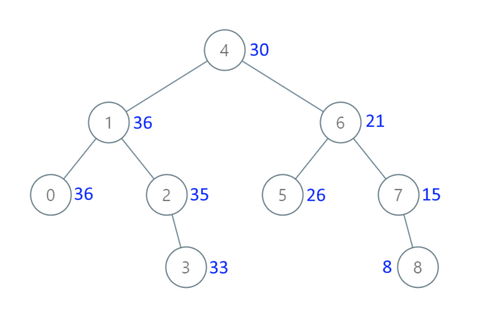

- 输入：`[4,1,6,0,2,5,7,null,null,null,3,null,null,null,8]`
- 输出：`[30,36,21,36,35,26,15,null,null,null,33,null,null,null,8]`

示例 2：

- 输入：`root = [0,null,1]`
- 输出：`[1,null,1]`

示例 3：

- 输入：`root = [1,0,2]`
- 输出：`[3,3,2]`

示例 4：

- 输入：`root = [3,2,4,1]`
- 输出：`[7,9,4,10]`

提示：

- 树中的节点数介于 0 和 104 之间。
- 每个节点的值介于 -104 和 104 之间。
- 树中的所有值 互不相同 。
- 给定的树为二叉搜索树。

## 算法公开课

[**《代码随想录》算法视频公开课**](https://programmercarl.com/other/gongkaike.html)**：普大喜奔！二叉树章节已全部更完啦！| LeetCode：538.把二叉搜索树转换为** **累加树，相信结合视频在看本篇题解，更有助于大家对本题的理解**。

## 思路

一看到累加树，相信很多小伙伴都会疑惑：如何累加？遇到一个节点，然后再遍历其他节点累加？怎么一想这么麻烦呢。

然后再发现这是一棵二叉搜索树，二叉搜索树啊，这是有序的啊。

那么有序的元素如何求累加呢？

**其实这就是一棵树，大家可能看起来有点别扭，换一个角度来看，这就是一个有序数组[2, 5, 13]，求从后到前的累** **加数组，也就是[20, 18, 13]，是不是感觉这就简单了。**

为什么变成数组就是感觉简单了呢？

因为数组大家都知道怎么遍历啊，从后向前，挨个累加就完事了，这换成了二叉搜索树，看起来就别扭了一些是不是。

那么知道如何遍历这个二叉树，也就迎刃而解了，**从树中可以看出累加的顺序是右中左，所以我们需要反中序遍历** **这个二叉树，然后顺序累加就可以了**。

### 递归

遍历顺序如图所示：

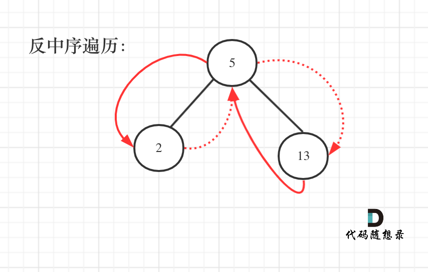

本题依然需要一个pre指针记录当前遍历节点cur的前一个节点，这样才方便做累加。

pre指针的使用技巧，我们在[二叉树：搜索树的最小绝对差](https://programmercarl.com/0530.%E4%BA%8C%E5%8F%89%E6%90%9C%E7%B4%A2%E6%A0%91%E7%9A%84%E6%9C%80%E5%B0%8F%E7%BB%9D%E5%AF%B9%E5%B7%AE.html)和[二叉树：我的众数是多少？](https://programmercarl.com/0501.%E4%BA%8C%E5%8F%89%E6%90%9C%E7%B4%A2%E6%A0%91%E4%B8%AD%E7%9A%84%E4%BC%97%E6%95%B0.html)都提到了，这是常用的操作手段。

- 递归函数参数以及返回值

这里很明确了，不需要递归函数的返回值做什么操作了，要遍历整棵树。

同时需要定义一个全局变量pre，用来保存cur节点的前一个节点的数值，定义为int型就可以了。

代码如下：

```cpp
int pre = 0; // 记录前一个节点的数值
void traversal(TreeNode* cur)
```

- 确定终止条件

遇空就终止。

```cpp
if (cur == NULL) return;
```

- 确定单层递归的逻辑

注意**要右中左来遍历二叉树**， 中节点的处理逻辑就是让cur的数值加上前一个节点的数值。

代码如下：

```cpp
traversal(cur->right);  // 右
cur->val += pre;        // 中
pre = cur->val;
traversal(cur->left);   // 左
```

递归法整体代码如下：

```cpp
class Solution {
private:
    int pre = 0; // 记录前一个节点的数值
    void traversal(TreeNode* cur) { // 右中左遍历
        if (cur == NULL) return;
        traversal(cur->right);
        cur->val += pre;
        pre = cur->val;
        traversal(cur->left);
    }
public:
    TreeNode* convertBST(TreeNode* root) {
        pre = 0;
        traversal(root);
        return root;
    }
};
```

### 迭代法

迭代法其实就是中序模板题了，在[二叉树：前中后序迭代法](https://programmercarl.com/%E4%BA%8C%E5%8F%89%E6%A0%91%E7%9A%84%E8%BF%AD%E4%BB%A3%E9%81%8D%E5%8E%86.html)和[二叉树：前中后序统一方式迭代法](https://programmercarl.com/%E4%BA%8C%E5%8F%89%E6%A0%91%E7%9A%84%E7%BB%9F%E4%B8%80%E8%BF%AD%E4%BB%A3%E6%B3%95.html)可以选一种自己习惯的写法。

这里我给出其中的一种，代码如下：

```cpp
class Solution {
private:
    int pre; // 记录前一个节点的数值
    void traversal(TreeNode* root) {
        stack<TreeNode*> st;
        TreeNode* cur = root;
        while (cur != NULL || !st.empty()) {
            if (cur != NULL) {
                st.push(cur);
                cur = cur->right;   // 右
            } else {
                cur = st.top();     // 中
                st.pop();
                cur->val += pre;
                pre = cur->val;
                cur = cur->left;    // 左
            }
        }
    }
public:
    TreeNode* convertBST(TreeNode* root) {
        pre = 0;
        traversal(root);
        return root;
    }
};
```

## 总结

经历了前面各种二叉树增删改查的洗礼之后，这道题目应该比较简单了。

**好了，二叉树已经接近尾声了，接下来就是要对二叉树来一个大总结了**。

# 34. 二叉树：总结篇！（需要掌握的二叉树技能都 在这里了）

力扣二叉树大总结！

不知不觉二叉树已经和我们度过了**三十三天**，[「代码随想录」](https://img-blog.csdnimg.cn/20200815195519696.png)里已经发了**三十三篇二叉树的文章**，详细讲解了**30+二叉树经典题目**，一直坚持下来的录友们一定会二叉树有深刻理解了。

在每一道二叉树的题目中，我都使用了**递归三部曲**来分析题目，相信大家以后看到二叉树，看到递归，都会想：返回值、参数是什么？终止条件是什么？单层逻辑是什么？

而且**几乎每一道题目我都给出对应的迭代法**，可以用来进一步提高自己。

下面Carl把分析过的题目分门别类，可以帮助新录友循序渐进学习二叉树，也方便老录友面试前快速复习，看到一个标题，就回想一下对应的解题思路，这样很快就可以系统性的复习一遍二叉树了。

公众号的发文顺序，就是循序渐进的，所以如下分类基本就是按照文章发文顺序来的，我再做一个系统性的分类。

## 二叉树的理论基础

- [关于二叉树，你该了解这些！](https://programmercarl.com/%E4%BA%8C%E5%8F%89%E6%A0%91%E7%90%86%E8%AE%BA%E5%9F%BA%E7%A1%80.html)：二叉树的种类、存储方式、遍历方式、定义方式

## 二叉树的遍历方式

- 深度优先遍历

[二叉树：前中后序递归法](https://programmercarl.com/%E4%BA%8C%E5%8F%89%E6%A0%91%E7%9A%84%E9%80%92%E5%BD%92%E9%81%8D%E5%8E%86.html)：递归三部曲初次亮相

[二叉树：前中后序迭代法（一）](https://programmercarl.com/%E4%BA%8C%E5%8F%89%E6%A0%91%E7%9A%84%E8%BF%AD%E4%BB%A3%E9%81%8D%E5%8E%86.html)：通过栈模拟递归

[二叉树：前中后序迭代法（二）统一风格](https://programmercarl.com/%E4%BA%8C%E5%8F%89%E6%A0%91%E7%9A%84%E7%BB%9F%E4%B8%80%E8%BF%AD%E4%BB%A3%E6%B3%95.html)

- 广度优先遍历

[二叉树的层序遍历](https://programmercarl.com/0102.%E4%BA%8C%E5%8F%89%E6%A0%91%E7%9A%84%E5%B1%82%E5%BA%8F%E9%81%8D%E5%8E%86.html)：通过队列模拟

## 求二叉树的属性

- [二叉树：是否对称](https://programmercarl.com/0101.%E5%AF%B9%E7%A7%B0%E4%BA%8C%E5%8F%89%E6%A0%91.html)

递归：后序，比较的是根节点的左子树与右子树是不是相互翻转

迭代：使用队列/栈将两个节点顺序放入容器中进行比较

- [二叉树：求最大深度](https://programmercarl.com/0104.%E4%BA%8C%E5%8F%89%E6%A0%91%E7%9A%84%E6%9C%80%E5%A4%A7%E6%B7%B1%E5%BA%A6.html)

递归：后序，求根节点最大高度就是最大深度，通过递归函数的返回值做计算树的高度

迭代：层序遍历

- [二叉树：求最小深度](https://programmercarl.com/0111.%E4%BA%8C%E5%8F%89%E6%A0%91%E7%9A%84%E6%9C%80%E5%B0%8F%E6%B7%B1%E5%BA%A6.html)

递归：后序，求根节点最小高度就是最小深度，注意最小深度的定义

迭代：层序遍历

- [二叉树：求有多少个节点](https://programmercarl.com/0222.%E5%AE%8C%E5%85%A8%E4%BA%8C%E5%8F%89%E6%A0%91%E7%9A%84%E8%8A%82%E7%82%B9%E4%B8%AA%E6%95%B0.html)

递归：后序，通过递归函数的返回值计算节点数量

迭代：层序遍历

- [二叉树：是否平衡](https://programmercarl.com/0110.%E5%B9%B3%E8%A1%A1%E4%BA%8C%E5%8F%89%E6%A0%91.html)

递归：后序，注意后序求高度和前序求深度，递归过程判断高度差迭代：效率很低，不推荐

- [二叉树：找所有路径](https://programmercarl.com/0257.%E4%BA%8C%E5%8F%89%E6%A0%91%E7%9A%84%E6%89%80%E6%9C%89%E8%B7%AF%E5%BE%84.html)

递归：前序，方便让父节点指向子节点，涉及回溯处理根节点到叶子的所有路径

迭代：一个栈模拟递归，一个栈来存放对应的遍历路径

- [二叉树：递归中如何隐藏着回溯](https://programmercarl.com/%E4%BA%8C%E5%8F%89%E6%A0%91%E4%B8%AD%E9%80%92%E5%BD%92%E5%B8%A6%E7%9D%80%E5%9B%9E%E6%BA%AF.html)

详解[二叉树：找所有路径](https://programmercarl.com/0257.%E4%BA%8C%E5%8F%89%E6%A0%91%E7%9A%84%E6%89%80%E6%9C%89%E8%B7%AF%E5%BE%84.html)中递归如何隐藏着回溯

- [二叉树：求左叶子之和](https://programmercarl.com/0404.%E5%B7%A6%E5%8F%B6%E5%AD%90%E4%B9%8B%E5%92%8C.html)

递归：后序，必须三层约束条件，才能判断是否是左叶子。

迭代：直接模拟后序遍历

- [二叉树：求左下角的值](https://programmercarl.com/0513.%E6%89%BE%E6%A0%91%E5%B7%A6%E4%B8%8B%E8%A7%92%E7%9A%84%E5%80%BC.html)

递归：顺序无所谓，优先左孩子搜索，同时找深度最大的叶子节点。

迭代：层序遍历找最后一行最左边

- [二叉树：求路径总和](https://programmercarl.com/0112.%E8%B7%AF%E5%BE%84%E6%80%BB%E5%92%8C.html)

递归：顺序无所谓，递归函数返回值为bool类型是为了搜索一条边，没有返回值是搜索整棵树。

迭代：栈里元素不仅要记录节点指针，还要记录从头结点到该节点的路径数值总和

## 二叉树的修改与构造

- [翻转二叉树](https://programmercarl.com/0226.%E7%BF%BB%E8%BD%AC%E4%BA%8C%E5%8F%89%E6%A0%91.html)

递归：前序，交换左右孩子

迭代：直接模拟前序遍历

- [构造二叉树](https://programmercarl.com/0106.%E4%BB%8E%E4%B8%AD%E5%BA%8F%E4%B8%8E%E5%90%8E%E5%BA%8F%E9%81%8D%E5%8E%86%E5%BA%8F%E5%88%97%E6%9E%84%E9%80%A0%E4%BA%8C%E5%8F%89%E6%A0%91.html)

递归：前序，重点在于找分割点，分左右区间构造

迭代：比较复杂，意义不大

- [构造最大的二叉树](https://programmercarl.com/0654.%E6%9C%80%E5%A4%A7%E4%BA%8C%E5%8F%89%E6%A0%91.html)

递归：前序，分割点为数组最大值，分左右区间构造

迭代：比较复杂，意义不大

- [合并两个二叉树](https://programmercarl.com/0617.%E5%90%88%E5%B9%B6%E4%BA%8C%E5%8F%89%E6%A0%91.html)

递归：前序，同时操作两个树的节点，注意合并的规则

迭代：使用队列，类似层序遍历

## 求二叉搜索树的属性

- [二叉搜索树中的搜索](https://programmercarl.com/0700.%E4%BA%8C%E5%8F%89%E6%90%9C%E7%B4%A2%E6%A0%91%E4%B8%AD%E7%9A%84%E6%90%9C%E7%B4%A2.html)

递归：二叉搜索树的递归是有方向的

迭代：因为有方向，所以迭代法很简单

- [是不是二叉搜索树](https://programmercarl.com/0098.%E9%AA%8C%E8%AF%81%E4%BA%8C%E5%8F%89%E6%90%9C%E7%B4%A2%E6%A0%91.html)

递归：中序，相当于变成了判断一个序列是不是递增的迭代：模拟中序，逻辑相同

- [求二叉搜索树的最小绝对差](https://programmercarl.com/0530.%E4%BA%8C%E5%8F%89%E6%90%9C%E7%B4%A2%E6%A0%91%E7%9A%84%E6%9C%80%E5%B0%8F%E7%BB%9D%E5%AF%B9%E5%B7%AE.html)

递归：中序，双指针操作

迭代：模拟中序，逻辑相同

- [求二叉搜索树的众数](https://programmercarl.com/0501.%E4%BA%8C%E5%8F%89%E6%90%9C%E7%B4%A2%E6%A0%91%E4%B8%AD%E7%9A%84%E4%BC%97%E6%95%B0.html)

递归：中序，清空结果集的技巧，遍历一遍便可求众数集合

[二叉搜索树转成累加树](https://programmercarl.com/0538.%E6%8A%8A%E4%BA%8C%E5%8F%89%E6%90%9C%E7%B4%A2%E6%A0%91%E8%BD%AC%E6%8D%A2%E4%B8%BA%E7%B4%AF%E5%8A%A0%E6%A0%91.html)

递归：中序，双指针操作累加

迭代：模拟中序，逻辑相同

## 二叉树公共祖先问题

- [二叉树的公共祖先问题](https://programmercarl.com/0236.%E4%BA%8C%E5%8F%89%E6%A0%91%E7%9A%84%E6%9C%80%E8%BF%91%E5%85%AC%E5%85%B1%E7%A5%96%E5%85%88.html)

递归：后序，回溯，找到左子树出现目标值，右子树节点目标值的节点。

迭代：不适合模拟回溯

- [二叉搜索树的公共祖先问题](https://programmercarl.com/0235.%E4%BA%8C%E5%8F%89%E6%90%9C%E7%B4%A2%E6%A0%91%E7%9A%84%E6%9C%80%E8%BF%91%E5%85%AC%E5%85%B1%E7%A5%96%E5%85%88.html)

递归：顺序无所谓，如果节点的数值在目标区间就是最近公共祖先

迭代：按序遍历

## 二叉搜索树的修改与构造

- [二叉搜索树中的插入操作](https://programmercarl.com/0701.%E4%BA%8C%E5%8F%89%E6%90%9C%E7%B4%A2%E6%A0%91%E4%B8%AD%E7%9A%84%E6%8F%92%E5%85%A5%E6%93%8D%E4%BD%9C.html)

递归：顺序无所谓，通过递归函数返回值添加节点

迭代：按序遍历，需要记录插入父节点，这样才能做插入操作

- [二叉搜索树中的删除操作](https://programmercarl.com/0450.%E5%88%A0%E9%99%A4%E4%BA%8C%E5%8F%89%E6%90%9C%E7%B4%A2%E6%A0%91%E4%B8%AD%E7%9A%84%E8%8A%82%E7%82%B9.html)

递归：前序，想清楚删除非叶子节点的情况

迭代：有序遍历，较复杂

- [修剪二叉搜索树](https://programmercarl.com/0669.%E4%BF%AE%E5%89%AA%E4%BA%8C%E5%8F%89%E6%90%9C%E7%B4%A2%E6%A0%91.html)

递归：前序，通过递归函数返回值删除节点

迭代：有序遍历，较复杂

- [构造二叉搜索树](https://programmercarl.com/0108.%E5%B0%86%E6%9C%89%E5%BA%8F%E6%95%B0%E7%BB%84%E8%BD%AC%E6%8D%A2%E4%B8%BA%E4%BA%8C%E5%8F%89%E6%90%9C%E7%B4%A2%E6%A0%91.html)

递归：前序，数组中间节点分割

迭代：较复杂，通过三个队列来模拟

## 阶段总结

大家以上题目都做过了，也一定要看如下阶段小结。

**每周小结都会对大家的疑问做统一解答，并且对每周的内容进行拓展和补充，所以一定要看，将细碎知识点一网打** **尽！**

- [本周小结！（二叉树系列一）](https://programmercarl.com/%E5%91%A8%E6%80%BB%E7%BB%93/20200927%E4%BA%8C%E5%8F%89%E6%A0%91%E5%91%A8%E6%9C%AB%E6%80%BB%E7%BB%93.html)
- [本周小结！（二叉树系列二）](https://programmercarl.com/%E5%91%A8%E6%80%BB%E7%BB%93/20201003%E4%BA%8C%E5%8F%89%E6%A0%91%E5%91%A8%E6%9C%AB%E6%80%BB%E7%BB%93.html)
- [本周小结！（二叉树系列三）](https://programmercarl.com/%E5%91%A8%E6%80%BB%E7%BB%93/20201010%E4%BA%8C%E5%8F%89%E6%A0%91%E5%91%A8%E6%9C%AB%E6%80%BB%E7%BB%93.html)
- [本周小结！（二叉树系列四）](https://programmercarl.com/%E5%91%A8%E6%80%BB%E7%BB%93/20201017%E4%BA%8C%E5%8F%89%E6%A0%91%E5%91%A8%E6%9C%AB%E6%80%BB%E7%BB%93.html)

## 最后总结

**在二叉树题目选择什么遍历顺序是不少同学头疼的事情，我们做了这么多二叉树的题目了，Carl给大家大体分分** **类**。

- 涉及到二叉树的构造，无论普通二叉树还是二叉搜索树一定前序，都是先构造中节点。
- 求普通二叉树的属性，一般是后序，一般要通过递归函数的返回值做计算。
- 求二叉搜索树的属性，一定是中序了，要不白瞎了有序性了。

注意在普通二叉树的属性中，我用的是一般为后序，例如单纯求深度就用前序，[二叉树：找所有路径](https://programmercarl.com/0257.%E4%BA%8C%E5%8F%89%E6%A0%91%E7%9A%84%E6%89%80%E6%9C%89%E8%B7%AF%E5%BE%84.html)也用了前序，这是为了方便让父节点指向子节点。

所以求普通二叉树的属性还是要具体问题具体分析。

二叉树专题汇聚为一张图： 

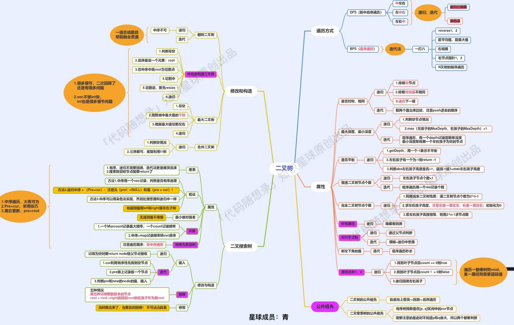

这个图是 [代码随想录知识星球](https://programmercarl.com/other/kstar.html) 成员：[青](https://wx.zsxq.com/dweb2/index/footprint/185251215558842)，所画，总结的非常好，分享给大家。

**最后，二叉树系列就这么完美结束了，估计这应该是最长的系列了，感谢大家33天的坚持与陪伴，接下来我们又要** **开始新的系列了「回溯算法」！**
