[](https://programmercarl.com/other/xunlianying.html)

**《代码随想录》作者：**[**程序员Carl**](https://github.com/youngyangyang04)

- 代码随想录官网[（网站持续更新优化内容，建议直接看网站）](https://www.programmercarl.com/)：www.programmercarl.com
- 代码随想录[Github开源地址](https://github.com/youngyangyang04/leetcode-master)
- [代码随想录算法公开课](https://programmercarl.com/other/gongkaike.html)，代码随想录的全部内容将由我（[程序员Carl](https://github.com/youngyangyang04)）视频讲解并开免费开放给大家。
- [《代码随想录》](https://programmercarl.com/other/publish.html) 已经出版。
- [代码随想录知识星球](https://programmercarl.com/other/kstar.html) 上万录友在这里学习
- [代码随想录算法训练营](https://programmercarl.com/other/xunlianying.html) 帮助录友高效刷完代码随想录。
- 微信公众号：[代码随想录](https://img-blog.csdnimg.cn/74f47bc466234462bd2acc3ba6cd1b70.png)
- 组队刷题，可以添加[代码随想录官方微信](https://www.programmercarl.com/other/wechat.html)
- ACM模式练习，推荐：[卡码网](https://kamacoder.com/)

**特别提示**：PDF仅提供`C++`语言版本同时PDF中很多动图无法加载，其他编程语言版本和查看动图可以移步至代码随想录官方网站查看。

# 1. 回溯算法理论基础

## 题目分类

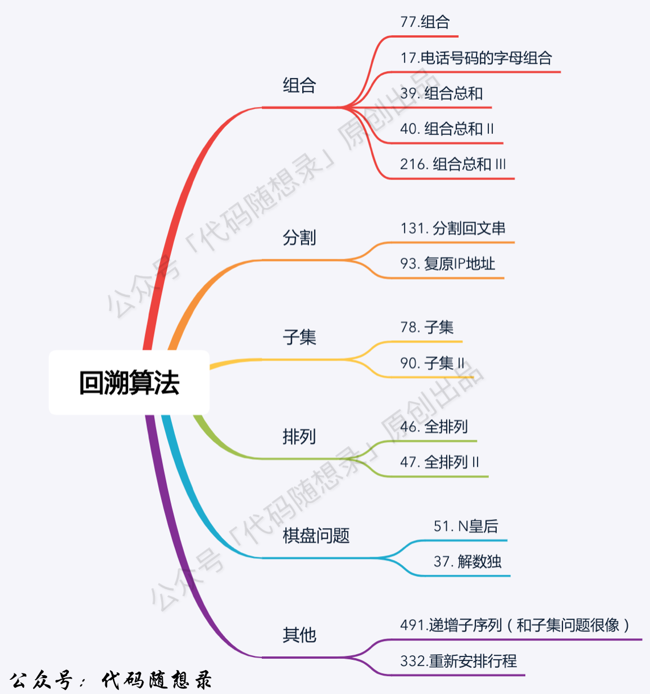

## 算法公开课

[**《代码随想录》算法视频公开课**](https://programmercarl.com/other/gongkaike.html)**：**[**带你学透回溯算法（理论篇）**](https://www.bilibili.com/video/BV1cy4y167mM/)**，相信结合视频再看本篇题解，更有助于大家对本** **题的理解。**

## 理论基础

### 什么是回溯法

回溯法也可以叫做回溯搜索法，它是一种搜索的方式。

在二叉树系列中，我们已经不止一次，提到了回溯，例如[二叉树：以为使用了递归，其实还隐藏着回溯](https://programmercarl.com/%E4%BA%8C%E5%8F%89%E6%A0%91%E4%B8%AD%E9%80%92%E5%BD%92%E5%B8%A6%E7%9D%80%E5%9B%9E%E6%BA%AF.html)。

回溯是递归的副产品，只要有递归就会有回溯。

**所以以下讲解中，回溯函数也就是递归函数，指的都是一个函数**。

### 回溯法的效率

回溯法的性能如何呢，这里要和大家说清楚了，**虽然回溯法很难，很不好理解，但是回溯法并不是什么高效的算** **法**。

**因为回溯的本质是穷举，穷举所有可能，然后选出我们想要的答案**，如果想让回溯法高效一些，可以加一些剪枝的操作，但也改不了回溯法就是穷举的本质。

那么既然回溯法并不高效为什么还要用它呢？

因为没得选，一些问题能暴力搜出来就不错了，撑死了再剪枝一下，还没有更高效的解法。

此时大家应该好奇了，都什么问题，这么牛逼，只能暴力搜索。

### 回溯法解决的问题

回溯法，一般可以解决如下几种问题：

- 组合问题：N个数里面按一定规则找出k个数的集合
- 切割问题：一个字符串按一定规则有几种切割方式
- 子集问题：一个N个数的集合里有多少符合条件的子集
- 排列问题：N个数按一定规则全排列，有几种排列方式
- 棋盘问题：N皇后，解数独等等

**相信大家看着这些之后会发现，每个问题，都不简单！**

另外，会有一些同学可能分不清什么是组合，什么是排列？

**组合是不强调元素顺序的，排列是强调元素顺序**。

例如：`{1, 2}` 和 `{2, 1}` 在组合上，就是一个集合，因为不强调顺序，而要是排列的话，`{1, 2}` 和 `{2, 1}` 就是两个集合了。

记住组合无序，排列有序，就可以了。

### 如何理解回溯法

**回溯法解决的问题都可以抽象为树形结构**，是的，我指的是所有回溯法的问题都可以抽象为树形结构！

因为回溯法解决的都是在集合中递归查找子集，**集合的大小就构成了树的宽度，递归的深度，都构成的树的深度**。

递归就要有终止条件，所以必然是一棵高度有限的树（N叉树）。

这块可能初学者还不太理解，后面的回溯算法解决的所有题目中，我都会强调这一点并画图举相应的例子，现在有一个印象就行。

### 回溯法模板

这里给出Carl总结的回溯算法模板。

在讲[二叉树的递归](https://programmercarl.com/%E4%BA%8C%E5%8F%89%E6%A0%91%E7%9A%84%E9%80%92%E5%BD%92%E9%81%8D%E5%8E%86.html)中我们说了递归三部曲，这里我再给大家列出回溯三部曲。

- 回溯函数模板返回值以及参数

在回溯算法中，我的习惯是函数起名字为backtracking，这个起名大家随意。

回溯算法中函数返回值一般为void。

再来看一下参数，因为回溯算法需要的参数可不像二叉树递归的时候那么容易一次性确定下来，所以一般是先写逻辑，然后需要什么参数，就填什么参数。

但后面的回溯题目的讲解中，为了方便大家理解，我在一开始就帮大家把参数确定下来。

回溯函数伪代码如下：

```cpp
void backtracking(参数)
```

- 回溯函数终止条件

既然是树形结构，那么我们在讲解[二叉树的递归](https://programmercarl.com/%E4%BA%8C%E5%8F%89%E6%A0%91%E7%9A%84%E9%80%92%E5%BD%92%E9%81%8D%E5%8E%86.html)的时候，就知道遍历树形结构一定要有终止条件。

所以回溯也有要终止条件。

什么时候达到了终止条件，树中就可以看出，一般来说搜到叶子节点了，也就找到了满足条件的一条答案，把这个答案存放起来，并结束本层递归。

所以回溯函数终止条件伪代码如下：

```cpp
if (终止条件) {
    存放结果;
    return;
}
```

- 回溯搜索的遍历过程

在上面我们提到了，回溯法一般是在集合中递归搜索，集合的大小构成了树的宽度，递归的深度构成的树的深度。

如图：

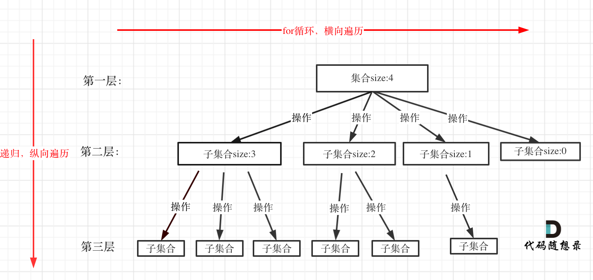

注意图中，我特意举例集合大小和孩子的数量是相等的！

回溯函数遍历过程伪代码如下：

```cpp
for (选择：本层集合中元素（树中节点孩子的数量就是集合的大小）) {
    处理节点;
    backtracking(路径，选择列表); // 递归
    回溯，撤销处理结果
}
```

for循环就是遍历集合区间，可以理解一个节点有多少个孩子，这个for循环就执行多少次。

backtracking这里自己调用自己，实现递归。

大家可以从图中看出**for循环可以理解是横向遍历，backtracking（递归）就是纵向遍历**，这样就把这棵树全遍历完了，一般来说，搜索叶子节点就是找的其中一个结果了。

分析完过程，回溯算法模板框架如下：

```cpp
void backtracking(参数) {
    if (终止条件) {
        存放结果;
        return;
    }
    for (选择：本层集合中元素（树中节点孩子的数量就是集合的大小）) {
        处理节点;
        backtracking(路径，选择列表); // 递归
        回溯，撤销处理结果
    }
}
```

**这份模板很重要，后面做回溯法的题目都靠它了！**

如果从来没有学过回溯算法的录友们，看到这里会有点懵，后面开始讲解具体题目的时候就会好一些了，已经做过回溯法题目的录友，看到这里应该会感同身受了。

## 总结

本篇我们讲解了，什么是回溯算法，知道了回溯和递归是相辅相成的。

接着提到了回溯法的效率，回溯法其实就是暴力查找，并不是什么高效的算法。

然后列出了回溯法可以解决几类问题，可以看出每一类问题都不简单。

最后我们讲到回溯法解决的问题都可以抽象为树形结构（N叉树），并给出了回溯法的模板。

今天是回溯算法的第一天，按照惯例Carl都是先概述一波，然后在开始讲解具体题目，没有接触过回溯法的同学刚学起来有点看不懂很正常，后面和具体题目结合起来会好一些。

# 2. 组合

[力扣题目链接](https://leetcode.cn/problems/combinations/)

给定两个整数 n 和 k，返回 1 ... n 中所有可能的 k 个数的组合。

示例:  
输入`: n = 4, k = 2`  
输出: `[` `[2,4],` `[3,4],` `[2,3],` `[1,2],` `[1,3],` `[1,4],` `]`

## 算法公开课

[**《代码随想录》算法视频公开课**](https://programmercarl.com/other/gongkaike.html)**：**[**带你学透回溯算法-组合问题（对应力扣题目：77.组合）**](https://www.bilibili.com/video/BV1ti4y1L7cv)**，组合问题的剪枝操** **作，相信结合视频在看本篇题解，更有助于大家对本题的理解**。

## 思路

本题是回溯法的经典题目。

直接的解法当然是使用for循环，例如示例中k为2，很容易想到 用两个for循环，这样就可以输出 和示例中一样的结果。

代码如下：

```cpp
int n = 4;
for (int i = 1; i <= n; i++) {
    for (int j = i + 1; j <= n; j++) {
        cout << i << " " << j << endl;
    }
}
```

输入：`n = 100, k = 3`那么就三层for循环，代码如下：

```cpp
int n = 100;
for (int i = 1; i <= n; i++) {
    for (int j = i + 1; j <= n; j++) {
        for (int u = j + 1; u <= n; n++) {
            cout << i << " " << j << " " << u << endl;
        }
    }
}
```

**如果n为100，k为50呢，那就50层for循环，是不是开始窒息**。

**此时就会发现虽然想暴力搜索，但是用for循环嵌套连暴力都写不出来！**

咋整？

回溯搜索法来了，虽然回溯法也是暴力，但至少能写出来，不像for循环嵌套k层让人绝望。

那么回溯法怎么暴力搜呢？

上面我们说了**要解决 n为100，k为50的情况，暴力写法需要嵌套50层for循环，那么回溯法就用递归来解决嵌套层** **数的问题**。

递归来做层叠嵌套（可以理解是开k层for循环），**每一次的递归中嵌套一个for循环，那么递归就可以用于解决多** **层嵌套循环的问题了**。

此时递归的层数大家应该知道了，例如：n为100，k为50的情况下，就是递归50层。

一些同学本来对递归就懵，回溯法中递归还要嵌套for循环，可能就直接晕倒了！

如果脑洞模拟回溯搜索的过程，绝对可以让人窒息，所以需要抽象图形结构来进一步理解。

**我们在**[**关于回溯算法，你该了解这些！**](https://programmercarl.com/%E5%9B%9E%E6%BA%AF%E7%AE%97%E6%B3%95%E7%90%86%E8%AE%BA%E5%9F%BA%E7%A1%80.html)**中说到回溯法解决的问题都可以抽象为树形结构（N叉树），用树形结构来** **理解回溯就容易多了**。

那么我把组合问题抽象为如下树形结构：

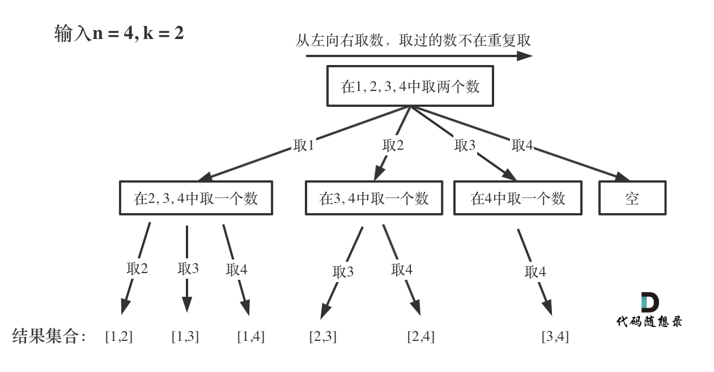

可以看出这棵树，一开始集合是 1，2，3，4， 从左向右取数，取过的数，不再重复取。

第一次取1，集合变为2，3，4 ，因为k为2，我们只需要再取一个数就可以了，分别取2，3，4，得到集合`[1,2]` `[1,3] [1,4]`，以此类推。

**每次从集合中选取元素，可选择的范围随着选择的进行而收缩，调整可选择的范围**。

**图中可以发现n相当于树的宽度，k相当于树的深度**。

那么如何在这个树上遍历，然后收集到我们要的结果集呢？

**图中每次搜索到了叶子节点，我们就找到了一个结果**。

相当于只需要把达到叶子节点的结果收集起来，就可以求得 n个数中k个数的组合集合。

在[关于回溯算法，你该了解这些！](https://programmercarl.com/%E5%9B%9E%E6%BA%AF%E7%AE%97%E6%B3%95%E7%90%86%E8%AE%BA%E5%9F%BA%E7%A1%80.html)中我们提到了回溯法三部曲，那么我们按照回溯法三部曲开始正式讲解代码了。

### 回溯法三部曲

- 递归函数的返回值以及参数

在这里要定义两个全局变量，一个用来存放符合条件单一结果，一个用来存放符合条件结果的集合。

代码如下：

```cpp
vector<vector<int>> result; // 存放符合条件结果的集合
vector<int> path; // 用来存放符合条件结果
```

其实不定义这两个全局变量也是可以的，把这两个变量放进递归函数的参数里，但函数里参数太多影响可读性，所以我定义全局变量了。

函数里一定有两个参数，既然是集合n里面取k个数，那么n和k是两个int型的参数。

然后还需要一个参数，为int型变量startIndex，这个参数用来记录本层递归的中，集合从哪里开始遍历（集合就是`[1,...,n]` ）。

为什么要有这个startIndex呢？

**建议在**[**77.组合视频讲解**](https://www.bilibili.com/video/BV1ti4y1L7cv)**中，07:36的时候开始听，startIndex 就是防止出现重复的组合**。

从下图中红线部分可以看出，在集合`[1,2,3,4]`取1之后，下一层递归，就要在`[2,3,4]`中取数了，那么下一层递归如何知道从`[2,3,4]`中取数呢，靠的就是startIndex。

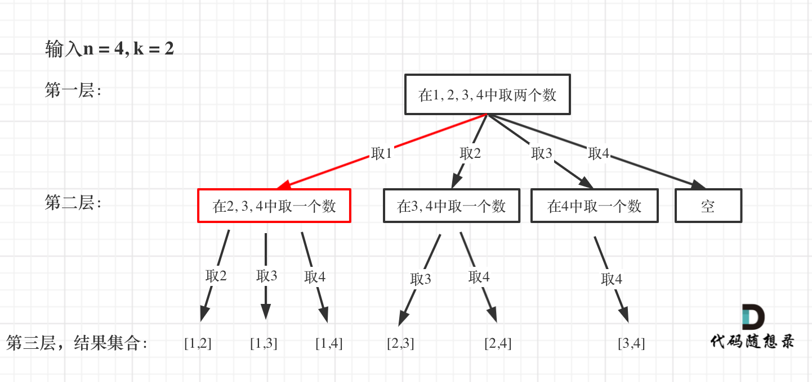

所以需要startIndex来记录下一层递归，搜索的起始位置。

那么整体代码如下：

```cpp
vector<vector<int>> result; // 存放符合条件结果的集合
vector<int> path; // 用来存放符合条件单一结果
void backtracking(int n, int k, int startIndex)
```

- 回溯函数终止条件

什么时候到达所谓的叶子节点了呢？

path这个数组的大小如果达到k，说明我们找到了一个子集大小为k的组合了，在图中path存的就是根节点到叶子节点的路径。

如图红色部分：

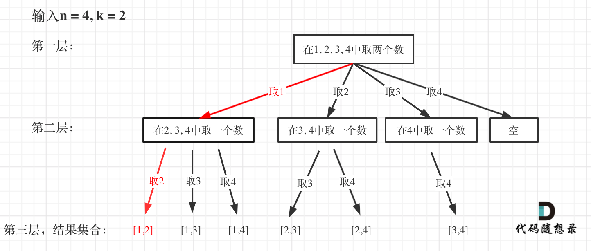

此时用result二维数组，把path保存起来，并终止本层递归。

所以终止条件代码如下：

```cpp
if (path.size() == k) {
    result.push_back(path);
    return;
}
```

- 单层搜索的过程

回溯法的搜索过程就是一个树型结构的遍历过程，在如下图中，可以看出for循环用来横向遍历，递归的过程是纵向遍历。

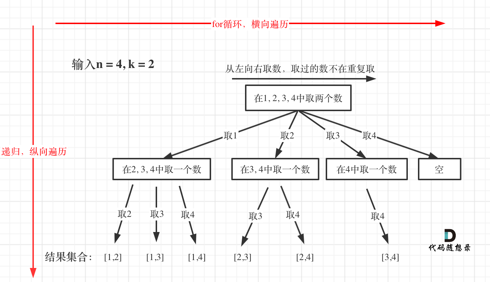

如此我们才遍历完图中的这棵树。

for循环每次从startIndex开始遍历，然后用path保存取到的节点i。

代码如下：

```cpp
for (int i = startIndex; i <= n; i++) { // 控制树的横向遍历
    path.push_back(i); // 处理节点
    backtracking(n, k, i + 1); // 递归：控制树的纵向遍历，注意下一层搜索要从i+1开始
    path.pop_back(); // 回溯，撤销处理的节点
}
```

可以看出backtracking（递归函数）通过不断调用自己一直往深处遍历，总会遇到叶子节点，遇到了叶子节点就要返回。

backtracking的下面部分就是回溯的操作了，撤销本次处理的结果。

关键地方都讲完了，组合问题`C++`完整代码如下：

```cpp
class Solution {
private:
    vector<vector<int>> result; // 存放符合条件结果的集合
    vector<int> path; // 用来存放符合条件结果
    void backtracking(int n, int k, int startIndex) {
        if (path.size() == k) {
            result.push_back(path);
            return;
        }
        for (int i = startIndex; i <= n; i++) {
            path.push_back(i); // 处理节点
            backtracking(n, k, i + 1); // 递归
            path.pop_back(); // 回溯，撤销处理的节点
        }
    }
public:
    vector<vector<int>> combine(int n, int k) {
        result.clear(); // 可以不写
        path.clear();   // 可以不写
        backtracking(n, k, 1);
        return result;
    }
};
```

- 时间复杂度`: O(n * 2^n)`
- 空间复杂度`: O(n)`

还记得我们在[关于回溯算法，你该了解这些！](https://programmercarl.com/%E5%9B%9E%E6%BA%AF%E7%AE%97%E6%B3%95%E7%90%86%E8%AE%BA%E5%9F%BA%E7%A1%80.html)中给出的回溯法模板么？

如下：

```cpp
void backtracking(参数) {
    if (终止条件) {
        存放结果;
        return;
    }
    for (选择：本层集合中元素（树中节点孩子的数量就是集合的大小）) {
        处理节点;
        backtracking(路径，选择列表); // 递归
        回溯，撤销处理结果
    }
}
```

**对比一下本题的代码，是不是发现有点像！** 所以有了这个模板，就有解题的大体方向，不至于毫无头绪。

## 总结

组合问题是回溯法解决的经典问题，我们开始的时候给大家列举一个很形象的例子，就是n为100，k为50的话，直接想法就需要50层for循环。

从而引出了回溯法就是解决这种k层for循环嵌套的问题。

然后进一步把回溯法的搜索过程抽象为树形结构，可以直观的看出搜索的过程。

接着用回溯法三部曲，逐步分析了函数参数、终止条件和单层搜索的过程。

## 剪枝优化

我们说过，回溯法虽然是暴力搜索，但也有时候可以有点剪枝优化一下的。

在遍历的过程中有如下代码：

```cpp
for (int i = startIndex; i <= n; i++) {
    path.push_back(i);
    backtracking(n, k, i + 1);
    path.pop_back();
}
```

这个遍历的范围是可以剪枝优化的，怎么优化呢？

来举一个例子，`n = 4`，`k = 4`的话，那么第一层for循环的时候，从元素2开始的遍历都没有意义了。 在第二层for循环，从元素3开始的遍历都没有意义了。

这么说有点抽象，如图所示：

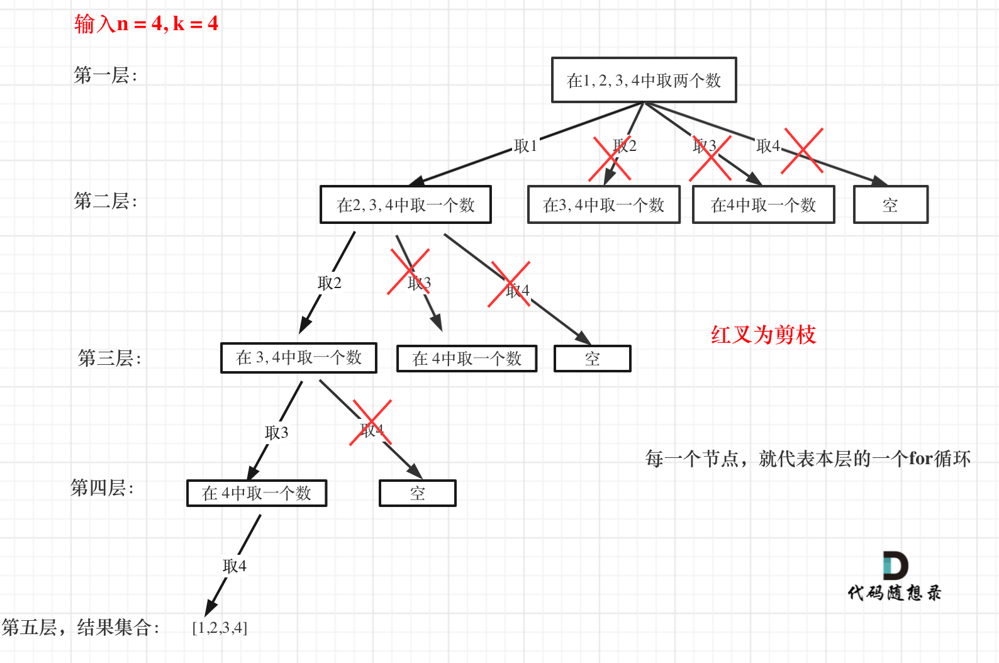

图中每一个节点（图中为矩形），就代表本层的一个for循环，那么每一层的for循环从第二个数开始遍历的话，都没有意义，都是无效遍历。

**所以，可以剪枝的地方就在递归中每一层的for循环所选择的起始位置**。

**如果for循环选择的起始位置之后的元素个数 已经不足 我们需要的元素个数了，那么就没有必要搜索了**。

注意代码中i，就是for循环里选择的起始位置。

```cpp
for (int i = startIndex; i <= n; i++) {
```

接下来看一下优化过程如下：

1. 已经选择的元素个数：`path.size();` 2. 还需要的元素个数为`: k - path.size();` 3. 在集合n中至多要从该起始位置 `: n - (k - path.size()) + 1`，开始遍历

为什么有个+1呢，因为包括起始位置，我们要是一个左闭的集合。

举个例子，`n = 4`，`k = 3`， 目前已经选取的元素为0（path.size为0），`n - (k - 0) + 1` 即 `4 - ( 3 - 0) + 1 = 2`。

从2开始搜索都是合理的，可以是组合`[2, 3, 4]`。

这里大家想不懂的话，建议也举一个例子，就知道是不是要+1了。

所以优化之后的for循环是：

```cpp
for (int i = startIndex; i <= n - (k - path.size()) + 1; i++) // i为本次搜索的起始位置
```

优化后整体代码如下：

```cpp
class Solution {
private:
    vector<vector<int>> result;
    vector<int> path;
    void backtracking(int n, int k, int startIndex) {
        if (path.size() == k) {
            result.push_back(path);
            return;
        }
        for (int i = startIndex; i <= n - (k - path.size()) + 1; i++) { // 优化的地方
            path.push_back(i); // 处理节点
            backtracking(n, k, i + 1);
            path.pop_back(); // 回溯，撤销处理的节点
        }
    }
public:
    vector<vector<int>> combine(int n, int k) {
        backtracking(n, k, 1);
        return result;
    }
};
```

## 剪枝总结

本篇我们准对求组合问题的回溯法代码做了剪枝优化，这个优化如果不画图的话，其实不好理解，也不好讲清楚。

所以我依然是把整个回溯过程抽象为一棵树形结构，然后可以直观的看出，剪枝究竟是剪的哪里。

# 3.组合优化

## 算法公开课

[**《代码随想录》算法视频公开课**](https://programmercarl.com/other/gongkaike.html)**：**[**组合问题的剪枝操作**](https://www.bilibili.com/video/BV1wi4y157er)**，相信结合视频在看本篇题解，更有助于大家对本题的理** **解。**

## 思路

在[回溯算法：求组合问题！](https://programmercarl.com/0077.%E7%BB%84%E5%90%88.html)中，我们通过回溯搜索法，解决了n个数中求k个数的组合问题。

文中的回溯法是可以剪枝优化的，本篇我们继续来看一下题目77. 组合。

链接：[https://leetcode.cn/problems/combinations/](https://leetcode.cn/problems/combinations/)

**看本篇之前，需要先看**[**回溯算法：求组合问题！**](https://programmercarl.com/0077.%E7%BB%84%E5%90%88.html)。

大家先回忆一下`[77.` 组合`]`给出的回溯法的代码：

```cpp
class Solution {
private:
    vector<vector<int>> result; // 存放符合条件结果的集合
    vector<int> path; // 用来存放符合条件结果
    void backtracking(int n, int k, int startIndex) {
        if (path.size() == k) {
            result.push_back(path);
            return;
        }
        for (int i = startIndex; i <= n; i++) {
            path.push_back(i); // 处理节点
            backtracking(n, k, i + 1); // 递归
            path.pop_back(); // 回溯，撤销处理的节点
        }
    }
public:
    vector<vector<int>> combine(int n, int k) {
        result.clear(); // 可以不写
        path.clear();   // 可以不写
        backtracking(n, k, 1);
        return result;
    }
};
```

## 剪枝优化

我们说过，回溯法虽然是暴力搜索，但也有时候可以有点剪枝优化一下的。

在遍历的过程中有如下代码：

```cpp
for (int i = startIndex; i <= n; i++) {
    path.push_back(i);
    backtracking(n, k, i + 1);
    path.pop_back();
}
```

这个遍历的范围是可以剪枝优化的，怎么优化呢？

来举一个例子，`n = 4`，`k = 4`的话，那么第一层for循环的时候，从元素2开始的遍历都没有意义了。 在第二层for循环，从元素3开始的遍历都没有意义了。

这么说有点抽象，如图所示：


图中每一个节点（图中为矩形），就代表本层的一个for循环，那么每一层的for循环从第二个数开始遍历的话，都没有意义，都是无效遍历。

**所以，可以剪枝的地方就在递归中每一层的for循环所选择的起始位置**。

**如果for循环选择的起始位置之后的元素个数 已经不足 我们需要的元素个数了，那么就没有必要搜索了**。

注意代码中i，就是for循环里选择的起始位置。

```cpp
for (int i = startIndex; i <= n; i++) {
```

接下来看一下优化过程如下：

1. 已经选择的元素个数：`path.size();` 2. 所需需要的元素个数为`: k - path.size();` 3. 列表中剩余元素（n-i） `>=` 所需需要的元素个数（`k - path.size()`）4. 在集合n中至多要从该起始位置 `: i <= n - (k - path.size()) + 1`，开始遍历

为什么有个+1呢，因为包括起始位置，我们要是一个左闭的集合。

举个例子，`n = 4`，`k = 3`， 目前已经选取的元素为0（path.size为0），`n - (k - 0) + 1` 即 `4 - ( 3 - 0) + 1 = 2`。

从2开始搜索都是合理的，可以是组合`[2, 3, 4]`。

这里大家想不懂的话，建议也举一个例子，就知道是不是要+1了。

所以优化之后的for循环是：

```cpp
for (int i = startIndex; i <= n - (k - path.size()) + 1; i++) // i为本次搜索的起始位置
```

优化后整体代码如下：

```cpp
class Solution {
private:
    vector<vector<int>> result;
    vector<int> path;
    void backtracking(int n, int k, int startIndex) {
        if (path.size() == k) {
            result.push_back(path);
            return;
        }
        for (int i = startIndex; i <= n - (k - path.size()) + 1; i++) { // 优化的地方
            path.push_back(i); // 处理节点
            backtracking(n, k, i + 1);
            path.pop_back(); // 回溯，撤销处理的节点
        }
    }
public:
    vector<vector<int>> combine(int n, int k) {
        backtracking(n, k, 1);
        return result;
    }
};
```

- 时间复杂度`: O(n * 2^n)`
- 空间复杂度`: O(n)`

## 总结

本篇我们针对求组合问题的回溯法代码做了剪枝优化，这个优化如果不画图的话，其实不好理解，也不好讲清楚。

所以我依然是把整个回溯过程抽象为一棵树形结构，然后可以直观的看出，剪枝究竟是剪的哪里。

**就酱，学到了就帮Carl转发一下吧，让更多的同学知道这里！**

别看本篇选的是组合总和III，而不是组合总和，本题和上一篇77.组合相比难度刚刚好！

# 4.组合总和III

[力扣题目链接](https://leetcode.cn/problems/combination-sum-iii/)

找出所有相加之和为 n 的 k 个数的组合。组合中只允许含有 1 - 9 的正整数，并且每种组合中不存在重复的数字。

说明：

- 所有数字都是正整数。
- 解集不能包含重复的组合。

示例 1:  
输入`: k = 3, n = 7`  
输出`: [[1,2,4]]`

示例 2:  
输入`: k = 3, n = 9`  
输出`: [[1,2,6], [1,3,5], [2,3,4]]`

## 算法公开课

[**《代码随想录》算法视频公开课**](https://programmercarl.com/other/gongkaike.html)**：**[**和组合问题有啥区别？回溯算法如何剪枝？| LeetCode：216.组合总和III**](https://www.bilibili.com/video/BV1wg411873x)**，相** **信结合视频再看本篇题解，更有助于大家对本题的理解**。

## 思路

本题就是在`[1,2,3,4,5,6,7,8,9]`这个集合中找到和为n的k个数的组合。

相对于[77. 组合](https://programmercarl.com/0077.%E7%BB%84%E5%90%88.html)，无非就是多了一个限制，本题是要找到和为n的k个数的组合，而整个集合已经是固定的了`[1,...,9]`。

想到这一点了，做过[77. 组合](https://programmercarl.com/0077.%E7%BB%84%E5%90%88.html)之后，本题是简单一些了。

本题k相当于树的深度，9（因为整个集合就是9个数）就是树的宽度。

例如 `k = 2`，`n = 4`的话，就是在集合`[1,2,3,4,5,6,7,8,9]`中求 k（个数） `= 2, n`（和） `= 4`的组合。

选取过程如图：

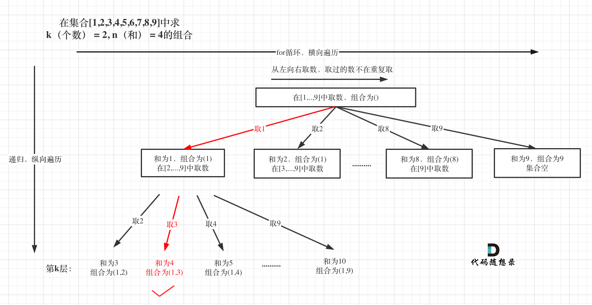

图中，可以看出，只有最后取到集合（1，3）和为4 符合条件。

### 回溯三部曲

- **确定递归函数参数**

和[77. 组合](https://programmercarl.com/0077.%E7%BB%84%E5%90%88.html)一样，依然需要一维数组path来存放符合条件的结果，二维数组result来存放结果集。

这里我依然定义path 和 result为全局变量。

至于为什么取名为path？从上面树形结构中，可以看出，结果其实就是一条根节点到叶子节点的路径。

```cpp
vector<vector<int>> result; // 存放结果集
vector<int> path; // 符合条件的结果
```

接下来还需要如下参数：

- targetSum（int）目标和，也就是题目中的n。
- k（int）就是题目中要求k个数的集合。
- sum（int）为已经收集的元素的总和，也就是path里元素的总和。
- startIndex（int）为下一层for循环搜索的起始位置。

所以代码如下：

```cpp
vector<vector<int>> result;
vector<int> path;
void backtracking(int targetSum, int k, int sum, int startIndex)
```

其实这里sum这个参数也可以省略，每次targetSum减去选取的元素数值，然后判断如果targetSum为0了，说明收集到符合条件的结果了，我这里为了直观便于理解，还是加一个sum参数。

还要强调一下，回溯法中递归函数参数很难一次性确定下来，一般先写逻辑，需要啥参数了，填什么参数。

- 确定终止条件

什么时候终止呢？

在上面已经说了，k其实就已经限制树的深度，因为就取k个元素，树再往下深了没有意义。

所以如果`path.size()` 和 k相等了，就终止。

如果此时path里收集到的元素和（sum） 和targetSum（就是题目描述的n）相同了，就用result收集当前的结果。

所以 终止代码如下：

```cpp
if (path.size() == k) {
    if (sum == targetSum) result.push_back(path);
    return; // 如果path.size() == k 但sum != targetSum 直接返回
}
```

- **单层搜索过程**

本题和[77. 组合](https://programmercarl.com/0077.%E7%BB%84%E5%90%88.html)区别之一就是集合固定的就是9个数`[1,...,9]`，所以for循环固定`i<=9`

如图：


处理过程就是 path收集每次选取的元素，相当于树型结构里的边，sum来统计path里元素的总和。

代码如下：

```cpp
for (int i = startIndex; i <= 9; i++) {
    sum += i;
    path.push_back(i);
    backtracking(targetSum, k, sum, i + 1); // 注意i+1调整startIndex
    sum -= i; // 回溯
    path.pop_back(); // 回溯
}
```

**别忘了处理过程 和 回溯过程是一一对应的，处理有加，回溯就要有减！**

参照[关于回溯算法，你该了解这些！](https://programmercarl.com/%E5%9B%9E%E6%BA%AF%E7%AE%97%E6%B3%95%E7%90%86%E8%AE%BA%E5%9F%BA%E7%A1%80.html)中的模板，不难写出如下`C++`代码：

```cpp
class Solution {
private:
    vector<vector<int>> result; // 存放结果集
    vector<int> path; // 符合条件的结果
    // targetSum：目标和，也就是题目中的n。
    // k：题目中要求k个数的集合。
    // sum：已经收集的元素的总和，也就是path里元素的总和。
    // startIndex：下一层for循环搜索的起始位置。
    void backtracking(int targetSum, int k, int sum, int startIndex) {
        if (path.size() == k) {
            if (sum == targetSum) result.push_back(path);
            return; // 如果path.size() == k 但sum != targetSum 直接返回
        }
        for (int i = startIndex; i <= 9; i++) {
            sum += i; // 处理
            path.push_back(i); // 处理
            backtracking(targetSum, k, sum, i + 1); // 注意i+1调整startIndex
            sum -= i; // 回溯
            path.pop_back(); // 回溯
        }
    }
public:
    vector<vector<int>> combinationSum3(int k, int n) {
        result.clear(); // 可以不加
        path.clear();   // 可以不加
        backtracking(n, k, 0, 1);
        return result;
    }
};
```

### 剪枝

这道题目，剪枝操作其实是很容易想到了，想必大家看上面的树形图的时候已经想到了。

如图：

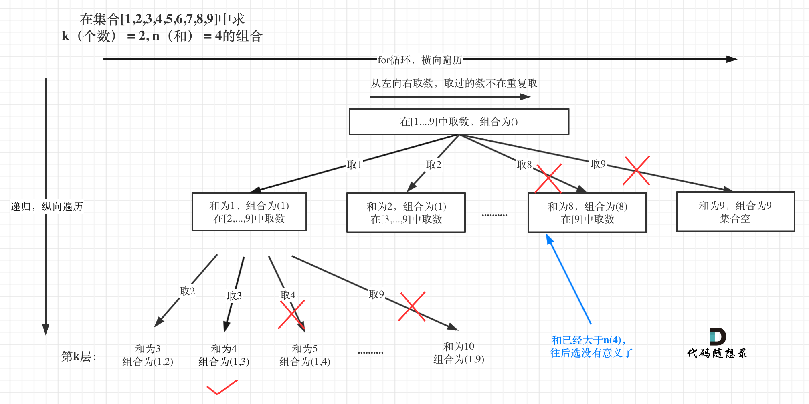

已选元素总和如果已经大于n（图中数值为4）了，那么往后遍历就没有意义了，直接剪掉。

那么剪枝的地方可以放在递归函数开始的地方，剪枝代码如下：

```cpp
if (sum > targetSum) { // 剪枝操作
    return;
}
```

当然这个剪枝也可以放在 调用递归之前，即放在这里，只不过要记得 要回溯操作给做了。

```cpp
for (int i = startIndex; i <= 9 - (k - path.size()) + 1; i++) { // 剪枝
    sum += i; // 处理
    path.push_back(i); // 处理
    if (sum > targetSum) { // 剪枝操作
        sum -= i; // 剪枝之前先把回溯做了
        path.pop_back(); // 剪枝之前先把回溯做了
        return;
    }
    backtracking(targetSum, k, sum, i + 1); // 注意i+1调整startIndex
    sum -= i; // 回溯
    path.pop_back(); // 回溯
}
```

和[回溯算法：组合问题再剪剪枝](https://programmercarl.com/0077.%E7%BB%84%E5%90%88%E4%BC%98%E5%8C%96.html) 一样，for循环的范围也可以剪枝，`i <= 9 - (k - path.size()) + 1`就可以了。

最后`C++`代码如下：

```cpp
class Solution {
private:
    vector<vector<int>> result; // 存放结果集
    vector<int> path; // 符合条件的结果
    void backtracking(int targetSum, int k, int sum, int startIndex) {
        if (sum > targetSum) { // 剪枝操作
            return; // 如果path.size() == k 但sum != targetSum 直接返回
        }
        if (path.size() == k) {
            if (sum == targetSum) result.push_back(path);
            return;
        }
        for (int i = startIndex; i <= 9 - (k - path.size()) + 1; i++) { // 剪枝
            sum += i; // 处理
            path.push_back(i); // 处理
            backtracking(targetSum, k, sum, i + 1); // 注意i+1调整startIndex
            sum -= i; // 回溯
            path.pop_back(); // 回溯
        }
    }
public:
    vector<vector<int>> combinationSum3(int k, int n) {
        result.clear(); // 可以不加
        path.clear();   // 可以不加
        backtracking(n, k, 0, 1);
        return result;
    }
};
```

- 时间复杂度`: O(n * 2^n)`
- 空间复杂度`: O(n)`

## 总结

开篇就介绍了本题与[77.组合](https://programmercarl.com/0077.%E7%BB%84%E5%90%88.html)的区别，相对来说加了元素总和的限制，如果做完[77.组合](https://programmercarl.com/0077.%E7%BB%84%E5%90%88.html)再做本题在合适不过。

分析完区别，依然把问题抽象为树形结构，按照回溯三部曲进行讲解，最后给出剪枝的优化。

相信做完本题，大家对组合问题应该有初步了解了。

# 5.电话号码的字母组合

[力扣题目链接](https://leetcode.cn/problems/letter-combinations-of-a-phone-number/)

给定一个仅包含数字 2-9 的字符串，返回所有它能表示的字母组合。

给出数字到字母的映射如下（与电话按键相同）。注意 1 不对应任何字母。

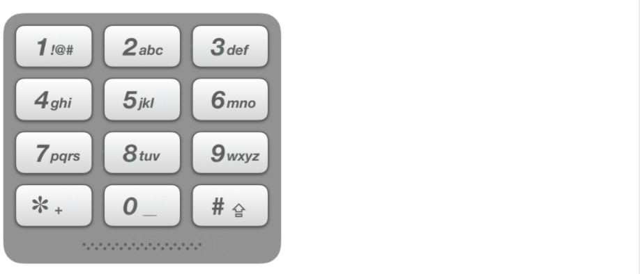

示例:

- 输入："23"
- 输出：`["ad", "ae", "af", "bd", "be", "bf", "cd", "ce", "cf"].`

说明：尽管上面的答案是按字典序排列的，但是你可以任意选择答案输出的顺序。

## 算法公开课

[**《代码随想录》算法视频公开课**](https://programmercarl.com/other/gongkaike.html)**：：**[**还得用回溯算法！| LeetCode：17.电话号码的字母组合**](https://www.bilibili.com/video/BV1yV4y1V7Ug)**，相信结合视频再看** **本篇题解，更有助于大家对本题的理解**。

## 思路

从示例上来说，输入"23"，最直接的想法就是两层for循环遍历了吧，正好把组合的情况都输出了。

如果输入"233"呢，那么就三层for循环，如果"2333"呢，就四层for循环.......

大家应该感觉出和[77.组合](https://programmercarl.com/0077.%E7%BB%84%E5%90%88.html)遇到的一样的问题，就是这for循环的层数如何写出来，此时又是回溯法登场的时候了。

理解本题后，要解决如下三个问题：

1. 数字和字母如何映射2. 两个字母就两个for循环，三个字符我就三个for循环，以此类推，然后发现代码根本写不出来3. 输入1 * #按键等等异常情况

### 数字和字母如何映射

可以使用map或者定义一个二维数组，例如：`string letterMap[10]`，来做映射，我这里定义一个二维数组，代码如下：

```cpp
const string letterMap[10] = {
    "", // 0
    "", // 1
    "abc", // 2
    "def", // 3
    "ghi", // 4
    "jkl", // 5
    "mno", // 6
    "pqrs", // 7
    "tuv", // 8
    "wxyz", // 9
};
```

### 回溯法来解决n个for循环的问题

对于回溯法还不了解的同学看这篇：[关于回溯算法，你该了解这些！](https://programmercarl.com/%E5%9B%9E%E6%BA%AF%E7%AE%97%E6%B3%95%E7%90%86%E8%AE%BA%E5%9F%BA%E7%A1%80.html)

例如：输入："23"，抽象为树形结构，如图所示：

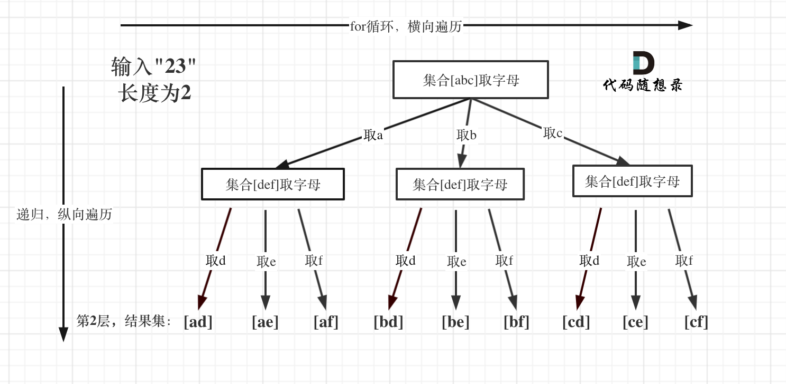

图中可以看出遍历的深度，就是输入"23"的长度，而叶子节点就是我们要收集的结果，输出`["ad", "ae", "af", "bd",` `"be", "bf", "cd", "ce", "cf"]`。

回溯三部曲：

- 确定回溯函数参数

首先需要一个字符串s来收集叶子节点的结果，然后用一个字符串数组result保存起来，这两个变量我依然定义为全局。

再来看参数，参数指定是有题目中给的string digits，然后还要有一个参数就是int型的index。

注意这个index可不是 [77.组合](https://programmercarl.com/0077.%E7%BB%84%E5%90%88.html)和[216.组合总和III](https://programmercarl.com/0216.%E7%BB%84%E5%90%88%E6%80%BB%E5%92%8CIII.html)中的startIndex了。

这个index是记录遍历第几个数字了，就是用来遍历digits的（题目中给出数字字符串），同时index也表示树的深度。

代码如下：

```cpp
vector<string> result;
string s;
void backtracking(const string& digits, int index)
```

- 确定终止条件

例如输入用例"23"，两个数字，那么根节点往下递归两层就可以了，叶子节点就是要收集的结果集。

那么终止条件就是如果index 等于 输入的数字个数（digits.size）了（本来index就是用来遍历digits的）。

然后收集结果，结束本层递归。

代码如下：

```cpp
if (index == digits.size()) {
    result.push_back(s);
    return;
}
```

- 确定单层遍历逻辑

首先要取index指向的数字，并找到对应的字符集（手机键盘的字符集）。

然后for循环来处理这个字符集，代码如下：

```cpp
int digit = digits[index] - '0';        // 将index指向的数字转为int
string letters = letterMap[digit];      // 取数字对应的字符集
for (int i = 0; i < letters.size(); i++) {
    s.push_back(letters[i]);            // 处理
    backtracking(digits, index + 1);    // 递归，注意index+1，一下层要处理下一个数字了
    s.pop_back();                       // 回溯
}
```

**注意这里for循环，可不像是在**[**回溯算法：求组合问题！**](https://programmercarl.com/0077.%E7%BB%84%E5%90%88.html)**和**[**回溯算法：求组合总和！**](https://programmercarl.com/0216.%E7%BB%84%E5%90%88%E6%80%BB%E5%92%8CIII.html)**中从startIndex开始遍历的**。

**因为本题每一个数字代表的是不同集合，也就是求不同集合之间的组合，而**[**77. 组合**](https://programmercarl.com/0077.%E7%BB%84%E5%90%88.html)**和**[**216.组合总和III**](https://programmercarl.com/0216.%E7%BB%84%E5%90%88%E6%80%BB%E5%92%8CIII.html)**都是求同一** **个集合中的组合！**

注意：输入1 * #按键等等异常情况

代码中最好考虑这些异常情况，但题目的测试数据中应该没有异常情况的数据，所以我就没有加了。

**但是要知道会有这些异常，如果是现场面试中，一定要考虑到！**关键地方都讲完了，按照[关于回溯算法，你该了解这些！](https://programmercarl.com/%E5%9B%9E%E6%BA%AF%E7%AE%97%E6%B3%95%E7%90%86%E8%AE%BA%E5%9F%BA%E7%A1%80.html)中的回溯法模板，不难写出如下`C++`代码：

```cpp
// 版本一
class Solution {
private:
    const string letterMap[10] = {
        "", // 0
        "", // 1
        "abc", // 2
        "def", // 3
        "ghi", // 4
        "jkl", // 5
        "mno", // 6
        "pqrs", // 7
        "tuv", // 8
        "wxyz", // 9
    };
public:
    vector<string> result;
    string s;
    void backtracking(const string& digits, int index) {
        if (index == digits.size()) {
            result.push_back(s);
            return;
        }
        int digit = digits[index] - '0';        // 将index指向的数字转为int
        string letters = letterMap[digit];      // 取数字对应的字符集
        for (int i = 0; i < letters.size(); i++) {
            s.push_back(letters[i]);            // 处理
            backtracking(digits, index + 1);    // 递归，注意index+1，一下层要处理下一个数字
了
            s.pop_back();                       // 回溯
        }
    }
    vector<string> letterCombinations(string digits) {
        s.clear();
        result.clear();
        if (digits.size() == 0) {
            return result;
        }
        backtracking(digits, 0);
        return result;
    }
};
```

- 时间复杂度`: O(3^m * 4^n)`，其中 m 是对应四个字母的数字个数，n 是对应三个字母的数字个数
- 空间复杂度`: O(3^m * 4^n)`

一些写法，是把回溯的过程放在递归函数里了，例如如下代码，我可以写成这样：（注意注释中不一样的地方）

```cpp
// 版本二
class Solution {
private:
        const string letterMap[10] = {
            "", // 0
            "", // 1
            "abc", // 2
            "def", // 3
            "ghi", // 4
            "jkl", // 5
            "mno", // 6
            "pqrs", // 7
            "tuv", // 8
            "wxyz", // 9
        };
public:
    vector<string> result;
    void getCombinations(const string& digits, int index, const string& s) { // 注意参数
的不同
        if (index == digits.size()) {
            result.push_back(s);
            return;
        }
        int digit = digits[index] - '0';
        string letters = letterMap[digit];
        for (int i = 0; i < letters.size(); i++) {
            getCombinations(digits, index + 1, s + letters[i]);  // 注意这里的不同
        }
    }
    vector<string> letterCombinations(string digits) {
        result.clear();
        if (digits.size() == 0) {
            return result;
        }
        getCombinations(digits, 0, "");
        return result;
    }
};
```

我不建议把回溯藏在递归的参数里这种写法，很不直观，我在[二叉树：以为使用了递归，其实还隐藏着回溯](https://programmercarl.com/%E4%BA%8C%E5%8F%89%E6%A0%91%E4%B8%AD%E9%80%92%E5%BD%92%E5%B8%A6%E7%9D%80%E5%9B%9E%E6%BA%AF.html)这篇文章中也深度分析了，回溯隐藏在了哪里。

所以大家可以按照版本一来写就可以了。

## 总结

本篇将题目的三个要点一一列出，并重点强调了和前面讲解过的[77. 组合](https://programmercarl.com/0077.%E7%BB%84%E5%90%88.html)和[216.组合总和III](https://programmercarl.com/0216.%E7%BB%84%E5%90%88%E6%80%BB%E5%92%8CIII.html)的区别，本题是多个集合求组合，所以在回溯的搜索过程中，都有一些细节需要注意的。

其实本题不算难，但也处处是细节，大家还要自己亲自动手写一写。

# 6. 本周小结！（回溯算法系列一）

## 周一

本周我们正式开始了回溯算法系列，那么首先当然是概述。

在[关于回溯算法，你该了解这些！](https://programmercarl.com/%E5%9B%9E%E6%BA%AF%E7%AE%97%E6%B3%95%E7%90%86%E8%AE%BA%E5%9F%BA%E7%A1%80.html)中介绍了什么是回溯，回溯法的效率，回溯法解决的问题以及回溯法模板。

**回溯是递归的副产品，只要有递归就会有回溯**。

回溯法就是暴力搜索，并不是什么高效的算法，最多在剪枝一下。

回溯算法能解决如下问题：

- 组合问题：N个数里面按一定规则找出k个数的集合
- 排列问题：N个数按一定规则全排列，有几种排列方式
- 切割问题：一个字符串按一定规则有几种切割方式
- 子集问题：一个N个数的集合里有多少符合条件的子集
- 棋盘问题：N皇后，解数独等等

是不是感觉回溯算法有点厉害了。

回溯法确实不好理解，所以需要把回溯法抽象为一个图形来理解就容易多了，每一道回溯法的题目都可以抽象为树形结构。

针对很多同学都写不好回溯，我在[关于回溯算法，你该了解这些！](https://programmercarl.com/%E5%9B%9E%E6%BA%AF%E7%AE%97%E6%B3%95%E7%90%86%E8%AE%BA%E5%9F%BA%E7%A1%80.html)用回溯三部曲，分析了回溯算法，并给出了回溯法的模板。

这个模板会伴随整个回溯法系列！

## 周二

在[回溯算法：求组合问题！](https://programmercarl.com/0077.%E7%BB%84%E5%90%88.html)中，我们开始用回溯法解决第一道题目，组合问题。

我在文中开始的时候给大家列举k层for循环例子，进而得出都是同样是暴力解法，为什么要用回溯法。

**此时大家应该深有体会回溯法的魅力，用递归控制for循环嵌套的数量！**

本题我把回溯问题抽象为树形结构，可以直观的看出其搜索的过程：**for循环横向遍历，递归纵向遍历，回溯不断** **调整结果集**。

## 周三

针对[回溯算法：求组合问题！](https://programmercarl.com/0077.%E7%BB%84%E5%90%88.html)还可以做剪枝的操作。

在[回溯算法：组合问题再剪剪枝](https://programmercarl.com/0077.%E7%BB%84%E5%90%88%E4%BC%98%E5%8C%96.html)中把回溯法代码做了剪枝优化，在文中我依然把问题抽象为一个树形结构，大家可以一目了然剪的究竟是哪里。

**剪枝精髓是：for循环在寻找起点的时候要有一个范围，如果这个起点到集合终止之间的元素已经不够 题目要求的** **k个元素了，就没有必要搜索了**。

## 周四

在[回溯算法：求组合总和！](https://programmercarl.com/0216.%E7%BB%84%E5%90%88%E6%80%BB%E5%92%8CIII.html)中，相当于 [回溯算法：求组合问题！](https://programmercarl.com/0077.%E7%BB%84%E5%90%88.html)加了一个元素总和的限制。

整体思路还是一样的，本题的剪枝会好想一些，即：**已选元素总和如果已经大于n（题中要求的和）了，那么往后** **遍历就没有意义了，直接剪掉**。

在本题中，依然还可以有一个剪枝，就是[回溯算法：组合问题再剪剪枝](https://programmercarl.com/0077.%E7%BB%84%E5%90%88%E4%BC%98%E5%8C%96.html)中提到的，对for循环选择的起始范围的剪枝。

```text
所以，剪枝的代码，可以把for循环，加上 i <= 9 - (k - path.size()) + 1 的限制！
```

组合总和问题还有一些花样，下周还会介绍到。

## 周五

在[回溯算法：电话号码的字母组合](https://programmercarl.com/0017.%E7%94%B5%E8%AF%9D%E5%8F%B7%E7%A0%81%E7%9A%84%E5%AD%97%E6%AF%8D%E7%BB%84%E5%90%88.html)中，开始用多个集合来求组合，还是熟悉的模板题目，但是有一些细节。

例如这里for循环，可不像是在 [回溯算法：求组合问题！](https://programmercarl.com/0077.%E7%BB%84%E5%90%88.html)和[回溯算法：求组合总和！](https://programmercarl.com/0216.%E7%BB%84%E5%90%88%E6%80%BB%E5%92%8CIII.html)中从startIndex开始遍历的。

**因为本题每一个数字代表的是不同集合，也就是求不同集合之间的组合，而**[**回溯算法：求组合问题！**](https://programmercarl.com/0077.%E7%BB%84%E5%90%88.html)**和回溯算法：** **求组合总和！都是是求同一个集合中的组合！**

如果大家在现场面试的时候，一定要注意各种输入异常的情况，例如本题输入1 * #按键。

其实本题不算难，但也处处是细节，还是要反复琢磨。

## 周六

因为之前链表系列没有写总结，虽然链表系列已经是两个月前的事情，但还是有必要补一下。

所以给出[链表：总结篇！](https://programmercarl.com/%E9%93%BE%E8%A1%A8%E6%80%BB%E7%BB%93%E7%AF%87.html)，这里对之前链表理论基础和经典题目进行了总结。

同时对[链表：环找到了，那入口呢？](https://programmercarl.com/0142.%E7%8E%AF%E5%BD%A2%E9%93%BE%E8%A1%A8II.html)中求环入口的问题又进行了补充证明，可以说把环形链表的方方面面都讲的很通透了，大家如果没有做过环形链表的题目一定要去做一做。

## 总结

相信通过这一周对回溯法的学习，大家已经掌握其题本套路了，也不会对回溯法那么畏惧了。

回溯法抽象为树形结构后，其遍历过程就是：**for循环横向遍历，递归纵向遍历，回溯不断调整结果集**。

这个是我做了很多回溯的题目，不断摸索其规律才总结出来的。

对于回溯法的整体框架，网上搜的文章这块一般都说不清楚，按照天上掉下来的代码对着讲解，不知道究竟是怎么来的，也不知道为什么要这么写。

所以，录友们刚开始学回溯法，起跑姿势就很标准了，哈哈。

下周依然是回溯法，难度又要上升一个台阶了。

最后祝录友们周末愉快！

**如果感觉「代码随想录」不错，就分享给身边的同学朋友吧，一起来学习算法！**

# 7. 组合总和

[力扣题目链接](https://leetcode.cn/problems/combination-sum/)

给定一个无重复元素的数组 candidates 和一个目标数 target ，找出 candidates 中所有可以使数字和为 target 的组合。

candidates 中的数字可以无限制重复被选取。

说明：

- 所有数字（包括 target）都是正整数。
- 解集不能包含重复的组合。

示例 1：

- 输入：`candidates = [2,3,6,7], target = 7,`
- 所求解集为：`[` `[7],` `[2,2,3]` `]`

示例 2：

- 输入：`candidates = [2,3,5], target = 8,`
- 所求解集为：`[` `[2,2,2,2],` `[2,3,3],` `[3,5]` `]`

## 算法公开课

[**《代码随想录》算法视频公开课**](https://programmercarl.com/other/gongkaike.html)**：**[**Leetcode:39. 组合总和讲解**](https://www.bilibili.com/video/BV1KT4y1M7HJ)**，相信结合视频再看本篇题解，更有助于大家对本** **题的理解**。

## 思路

题目中的**无限制重复被选取，吓得我赶紧想想 出现0 可咋办**，然后看到下面提示：`1 <= candidates[i] <= 200`，我就放心了。

本题和[77.组合](https://programmercarl.com/0077.%E7%BB%84%E5%90%88.html)，[216.组合总和III](https://programmercarl.com/0216.%E7%BB%84%E5%90%88%E6%80%BB%E5%92%8CIII.html)的区别是：本题没有数量要求，可以无限重复，但是有总和的限制，所以间接的也是有个数的限制。

本题搜索的过程抽象成树形结构如下：

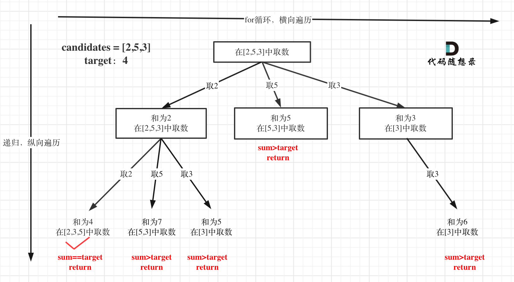

注意图中叶子节点的返回条件，因为本题没有组合数量要求，仅仅是总和的限制，所以递归没有层数的限制，只要选取的元素总和超过target，就返回！

而在[77.组合](https://programmercarl.com/0077.%E7%BB%84%E5%90%88.html)和[216.组合总和III](https://programmercarl.com/0216.%E7%BB%84%E5%90%88%E6%80%BB%E5%92%8CIII.html) 中都可以知道要递归K层，因为要取k个元素的组合。

### 回溯三部曲

- 递归函数参数

这里依然是定义两个全局变量，二维数组result存放结果集，数组path存放符合条件的结果。（这两个变量可以作为函数参数传入）

首先是题目中给出的参数，集合candidates, 和目标值target。

此外我还定义了int型的sum变量来统计单一结果path里的总和，其实这个sum也可以不用，用target做相应的减法就可以了，最后如何`target==0`就说明找到符合的结果了，但为了代码逻辑清晰，我依然用了sum。

**本题还需要startIndex来控制for循环的起始位置，对于组合问题，什么时候需要startIndex呢？**

我举过例子，如果是一个集合来求组合的话，就需要startIndex，例如：[77.组合](https://programmercarl.com/0077.%E7%BB%84%E5%90%88.html)，[216.组合总和III](https://programmercarl.com/0216.%E7%BB%84%E5%90%88%E6%80%BB%E5%92%8CIII.html)。

如果是多个集合取组合，各个集合之间相互不影响，那么就不用startIndex，例如：[17.电话号码的字母组合](https://programmercarl.com/0017.%E7%94%B5%E8%AF%9D%E5%8F%B7%E7%A0%81%E7%9A%84%E5%AD%97%E6%AF%8D%E7%BB%84%E5%90%88.html)

**注意以上我只是说求组合的情况，如果是排列问题，又是另一套分析的套路，后面我再讲解排列的时候就重点介** **绍**。

代码如下：

```cpp
vector<vector<int>> result;
vector<int> path;
void backtracking(vector<int>& candidates, int target, int sum, int startIndex)
```

- 递归终止条件

在如下树形结构中：


从叶子节点可以清晰看到，终止只有两种情况，sum大于target和sum等于target。

sum等于target的时候，需要收集结果，代码如下：

```cpp
if (sum > target) {
    return;
}
if (sum == target) {
    result.push_back(path);
    return;
}
```

- 单层搜索的逻辑

单层for循环依然是从startIndex开始，搜索candidates集合。

**注意本题和**[**77.组合**](https://programmercarl.com/0077.%E7%BB%84%E5%90%88.html)**、**[**216.组合总和III**](https://programmercarl.com/0216.%E7%BB%84%E5%90%88%E6%80%BB%E5%92%8CIII.html)**的一个区别是：本题元素为可重复选取的**。

如何重复选取呢，看代码，注释部分：

```cpp
for (int i = startIndex; i < candidates.size(); i++) {
    sum += candidates[i];
    path.push_back(candidates[i]);
    backtracking(candidates, target, sum, i); // 关键点:不用i+1了，表示可以重复读取当前的数
    sum -= candidates[i];   // 回溯
    path.pop_back();        // 回溯
}
```

按照[关于回溯算法，你该了解这些！](https://programmercarl.com/%E5%9B%9E%E6%BA%AF%E7%AE%97%E6%B3%95%E7%90%86%E8%AE%BA%E5%9F%BA%E7%A1%80.html)中给出的模板，不难写出如下`C++`完整代码：

```cpp
// 版本一
class Solution {
private:
    vector<vector<int>> result;
    vector<int> path;
    void backtracking(vector<int>& candidates, int target, int sum, int startIndex) {
        if (sum > target) {
            return;
        }
        if (sum == target) {
            result.push_back(path);
            return;
        }
        for (int i = startIndex; i < candidates.size(); i++) {
            sum += candidates[i];
            path.push_back(candidates[i]);
            backtracking(candidates, target, sum, i); // 不用i+1了，表示可以重复读取当前的数
            sum -= candidates[i];
            path.pop_back();
        }
    }
public:
    vector<vector<int>> combinationSum(vector<int>& candidates, int target) {
        result.clear();
        path.clear();
        backtracking(candidates, target, 0, 0);
        return result;
    }
};
```

### 剪枝优化

在这个树形结构中：


以及上面的版本一的代码大家可以看到，对于sum已经大于target的情况，其实是依然进入了下一层递归，只是下一层递归结束判断的时候，会判断`sum > target`的话就返回。

其实如果已经知道下一层的sum会大于target，就没有必要进入下一层递归了。

那么可以在for循环的搜索范围上做做文章了。

**对总集合排序之后，如果下一层的sum（就是本层的 sum + candidates[i]）已经大于target，就可以结束本轮** **for循环的遍历**。

如图：

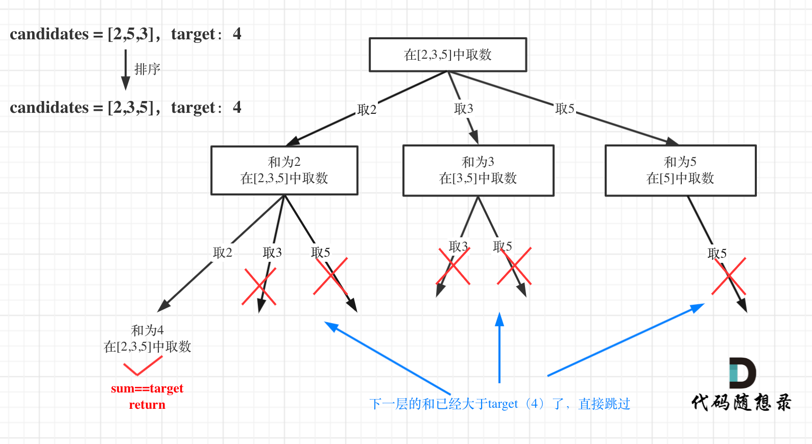

for循环剪枝代码如下：

```cpp
for (int i = startIndex; i < candidates.size() && sum + candidates[i] <= target; i++)
```

整体代码如下：（注意注释的部分）

```cpp
class Solution {
private:
    vector<vector<int>> result;
    vector<int> path;
    void backtracking(vector<int>& candidates, int target, int sum, int startIndex) {
        if (sum == target) {
            result.push_back(path);
            return;
        }
        // 如果 sum + candidates[i] > target 就终止遍历
        for (int i = startIndex; i < candidates.size() && sum + candidates[i] <=
target; i++) {
            sum += candidates[i];
            path.push_back(candidates[i]);
            backtracking(candidates, target, sum, i);
            sum -= candidates[i];
            path.pop_back();
        }
    }
public:
    vector<vector<int>> combinationSum(vector<int>& candidates, int target) {
        result.clear();
        path.clear();
        sort(candidates.begin(), candidates.end()); // 需要排序
        backtracking(candidates, target, 0, 0);
        return result;
    }
};
```

- 时间复杂度`: O(n * 2^n)`，注意这只是复杂度的上界，因为剪枝的存在，真实的时间复杂度远小于此
- 空间复杂度`: O(target)`

## 总结

本题和我们之前讲过的[77.组合](https://programmercarl.com/0077.%E7%BB%84%E5%90%88.html)、[216.组合总和III](https://programmercarl.com/0216.%E7%BB%84%E5%90%88%E6%80%BB%E5%92%8CIII.html)有两点不同：

- 组合没有数量要求
- 元素可无限重复选取

针对这两个问题，我都做了详细的分析。

并且给出了对于组合问题，什么时候用startIndex，什么时候不用，并用[17.电话号码的字母组合](https://programmercarl.com/0017.%E7%94%B5%E8%AF%9D%E5%8F%B7%E7%A0%81%E7%9A%84%E5%AD%97%E6%AF%8D%E7%BB%84%E5%90%88.html)做了对比。

最后还给出了本题的剪枝优化，这个优化如果是初学者的话并不容易想到。

**在求和问题中，排序之后加剪枝是常见的套路！**

可以看出我写的文章都会大量引用之前的文章，就是要不断作对比，分析其差异，然后给出代码解决的方法，这样才能彻底理解题目的本质与难点。

这篇可以说是全网把组合问题如何去重，讲的最清晰的了！

# 8.组合总和II

[力扣题目链接](https://leetcode.cn/problems/combination-sum-ii/)

给定一个数组 candidates 和一个目标数 target ，找出 candidates 中所有可以使数字和为 target 的组合。

candidates 中的每个数字在每个组合中只能使用一次。

说明：所有数字（包括目标数）都是正整数。解集不能包含重复的组合。 

- 示例 1:
- 输入`: candidates = [10,1,2,7,6,1,5], target = 8,`
- 所求解集为:

```text
[
  [1, 7],
  [1, 2, 5],
  [2, 6],
  [1, 1, 6]
]
```

- 示例 2:
- 输入`: candidates = [2,5,2,1,2], target = 5,`
- 所求解集为:

```text
[
  [1,2,2],
  [5]
]
```

## 算法公开课

[**《代码随想录》算法视频公开课**](https://programmercarl.com/other/gongkaike.html)**：回溯算法中的去重，树层去重树枝去重，你弄清楚了没？| LeetCode:40.组合总** **和II，相信结合视频再看本篇题解，更有助于大家对本题的理解**。

## 思路

这道题目和[39.组合总和](https://programmercarl.com/0039.%E7%BB%84%E5%90%88%E6%80%BB%E5%92%8C.html)如下区别：

1. 本题candidates 中的每个数字在每个组合中只能使用一次。2. 本题数组candidates的元素是有重复的，而[39.组合总和](https://programmercarl.com/0039.%E7%BB%84%E5%90%88%E6%80%BB%E5%92%8C.html)是无重复元素的数组candidates

最后本题和[39.组合总和](https://programmercarl.com/0039.%E7%BB%84%E5%90%88%E6%80%BB%E5%92%8C.html)要求一样，解集不能包含重复的组合。

**本题的难点在于区别2中：集合（数组candidates）有重复元素，但还不能有重复的组合**。

一些同学可能想了：我把所有组合求出来，再用set或者map去重，这么做很容易超时！

所以要在搜索的过程中就去掉重复组合。

很多同学在去重的问题上想不明白，其实很多题解也没有讲清楚，反正代码是能过的，感觉是那么回事，稀里糊涂的先把题目过了。

这个去重为什么很难理解呢，**所谓去重，其实就是使用过的元素不能重复选取。** 这么一说好像很简单！

都知道组合问题可以抽象为树形结构，那么“使用过”在这个树形结构上是有两个维度的，一个维度是同一树枝上使用过，一个维度是同一树层上使用过。**没有理解这两个层面上的“使用过” 是造成大家没有彻底理解去重的根本原** **因。**

那么问题来了，我们是要同一树层上使用过，还是同一树枝上使用过呢？

回看一下题目，元素在同一个组合内是可以重复的，怎么重复都没事，但两个组合不能相同。

**所以我们要去重的是同一树层上的“使用过”，同一树枝上的都是一个组合里的元素，不用去重**。

为了理解去重我们来举一个例子，`candidates = [1, 1, 2], target = 3`，（方便起见candidates已经排序了）

**强调一下，树层去重的话，需要对数组排序！**

选择过程树形结构如图所示：

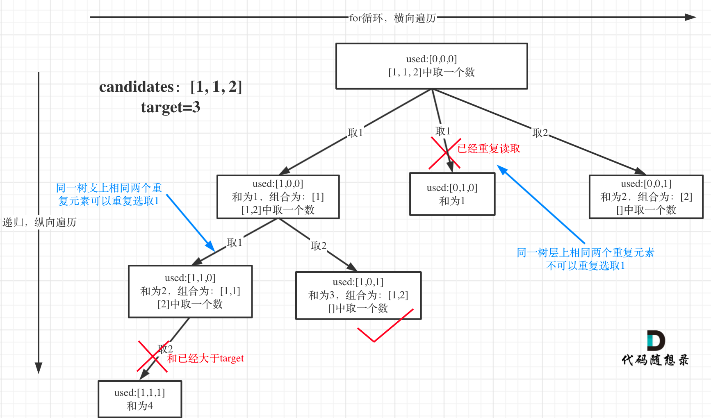

可以看到图中，每个节点相对于 [39.组合总和](https://mp.weixin.qq.com/s/FLg8G6EjVcxBjwCbzpACPw)我多加了used数组，这个used数组下面会重点介绍。

### 回溯三部曲

- **递归函数参数**

与[39.组合总和](https://programmercarl.com/0039.%E7%BB%84%E5%90%88%E6%80%BB%E5%92%8C.html)套路相同，此题还需要加一个bool型数组used，用来记录同一树枝上的元素是否使用过。

这个集合去重的重任就是used来完成的。

代码如下：

```cpp
vector<vector<int>> result; // 存放组合集合
vector<int> path;           // 符合条件的组合
void backtracking(vector<int>& candidates, int target, int sum, int startIndex,
vector<bool>& used) {
```

- **递归终止条件**

```text
与39.组合总和相同，终止条件为 sum > target 和 sum == target 。
```

代码如下：

```cpp
if (sum > target) { // 这个条件其实可以省略
    return;
}
if (sum == target) {
    result.push_back(path);
    return;
}
sum > target  这个条件其实可以省略，因为在递归单层遍历的时候，会有剪枝的操作，下面会介绍到。
```

- **单层搜索的逻辑**

这里与[39.组合总和](https://programmercarl.com/0039.%E7%BB%84%E5%90%88%E6%80%BB%E5%92%8C.html)最大的不同就是要去重了。

前面我们提到：要去重的是“同一树层上的使用过”，如何判断同一树层上元素（相同的元素）是否使用过了呢。

```text
如果candidates[i] == candidates[i - 1] 并且 used[i - 1] == false ，就说明：前一个树枝，使用了
```

**candidates[i - 1]，也就是说同一树层使用过candidates[i - 1]**。

此时for循环里就应该做continue的操作。

这块比较抽象，如图：

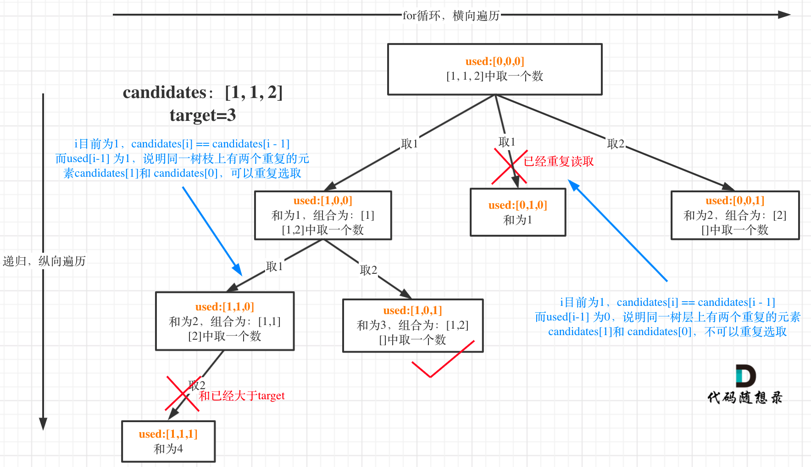

我在图中将used的变化用橘黄色标注上，可以看出在`candidates[i] == candidates[i - 1]`相同的情况下：

- `used[i - 1] == true`，说明同一树枝`candidates[i - 1]`使用过
- `used[i - 1] == false`，说明同一树层`candidates[i - 1]`使用过

可能有的录友想，为什么 `used[i - 1] == false` 就是同一树层呢，因为同一树层，`used[i - 1] == false` 才能表示，当前取的 `candidates[i]` 是从 `candidates[i - 1]` 回溯而来的。 

而 `used[i - 1] == true`，说明是进入下一层递归，去下一个数，所以是树枝上，如图所示： 

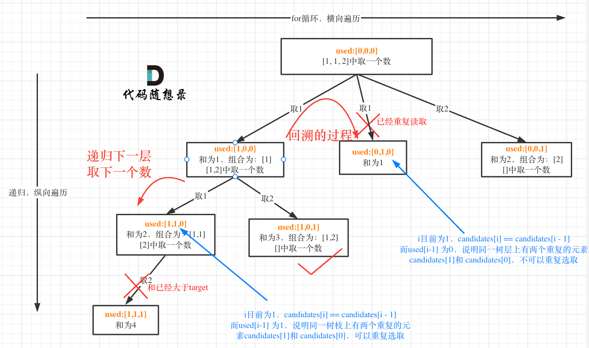

**这块去重的逻辑很抽象，网上搜的题解基本没有能讲清楚的，如果大家之前思考过这个问题或者刷过这道题目，看** **到这里一定会感觉通透了很多！**

那么单层搜索的逻辑代码如下：

```cpp
for (int i = startIndex; i < candidates.size() && sum + candidates[i] <= target; i++) {
    // used[i - 1] == true，说明同一树枝candidates[i - 1]使用过
    // used[i - 1] == false，说明同一树层candidates[i - 1]使用过
    // 要对同一树层使用过的元素进行跳过
    if (i > 0 && candidates[i] == candidates[i - 1] && used[i - 1] == false) {
        continue;
    }
    sum += candidates[i];
    path.push_back(candidates[i]);
    used[i] = true;
    backtracking(candidates, target, sum, i + 1, used); // 和39.组合总和的区别1：这里是i+1，
每个数字在每个组合中只能使用一次
    used[i] = false;
    sum -= candidates[i];
    path.pop_back();
}
```

**注意sum + candidates[i] <= target为剪枝操作，在**[**39.组合总和**](https://mp.weixin.qq.com/s/FLg8G6EjVcxBjwCbzpACPw)**有讲解过！**

回溯三部曲分析完了，整体`C++`代码如下：

```cpp
class Solution {
private:
    vector<vector<int>> result;
    vector<int> path;
    void backtracking(vector<int>& candidates, int target, int sum, int startIndex,
vector<bool>& used) {
        if (sum == target) {
            result.push_back(path);
            return;
        }
        for (int i = startIndex; i < candidates.size() && sum + candidates[i] <=
target; i++) {
            // used[i - 1] == true，说明同一树枝candidates[i - 1]使用过
            // used[i - 1] == false，说明同一树层candidates[i - 1]使用过
            // 要对同一树层使用过的元素进行跳过
            if (i > 0 && candidates[i] == candidates[i - 1] && used[i - 1] == false) {
                continue;
            }
            sum += candidates[i];
            path.push_back(candidates[i]);
            used[i] = true;
            backtracking(candidates, target, sum, i + 1, used); // 和39.组合总和的区别1，这
里是i+1，每个数字在每个组合中只能使用一次
            used[i] = false;
            sum -= candidates[i];
            path.pop_back();
        }
    }
public:
    vector<vector<int>> combinationSum2(vector<int>& candidates, int target) {
        vector<bool> used(candidates.size(), false);
        path.clear();
        result.clear();
        // 首先把给candidates排序，让其相同的元素都挨在一起。
        sort(candidates.begin(), candidates.end());
        backtracking(candidates, target, 0, 0, used);
        return result;
    }
};
```

- 时间复杂度`: O(n * 2^n)`
- 空间复杂度`: O(n)`

### 补充

这里直接用startIndex来去重也是可以的， 就不用used数组了。

```cpp
class Solution {
private:
    vector<vector<int>> result;
    vector<int> path;
    void backtracking(vector<int>& candidates, int target, int sum, int startIndex) {
        if (sum == target) {
            result.push_back(path);
            return;
        }
        for (int i = startIndex; i < candidates.size() && sum + candidates[i] <=
target; i++) {
            // 要对同一树层使用过的元素进行跳过
            if (i > startIndex && candidates[i] == candidates[i - 1]) {
                continue;
            }
            sum += candidates[i];
            path.push_back(candidates[i]);
            backtracking(candidates, target, sum, i + 1); // 和39.组合总和的区别1，这里是
i+1，每个数字在每个组合中只能使用一次
            sum -= candidates[i];
            path.pop_back();
        }
    }
public:
    vector<vector<int>> combinationSum2(vector<int>& candidates, int target) {
        path.clear();
        result.clear();
        // 首先把给candidates排序，让其相同的元素都挨在一起。
        sort(candidates.begin(), candidates.end());
        backtracking(candidates, target, 0, 0);
        return result;
    }
};
```

## 总结

本题同样是求组合总和，但就是因为其数组candidates有重复元素，而要求不能有重复的组合，所以相对于39.组合总和难度提升了不少。

**关键是去重的逻辑，代码很简单，网上一搜一大把，但几乎没有能把这块代码含义讲明白的，基本都是给出代码，** **然后说这就是去重了，究竟怎么个去重法也是模棱两可**。

所以Carl有必要把去重的这块彻彻底底的给大家讲清楚，**就连“树层去重”和“树枝去重”都是我自创的词汇，希望对** **大家理解有帮助！**

切割问题其实是一种组合问题！

# 9.分割回文串

[力扣题目链接](https://leetcode.cn/problems/palindrome-partitioning/)

给定一个字符串 s，将 s 分割成一些子串，使每个子串都是回文串。

返回 s 所有可能的分割方案。

示例:  
输入: "aab"  
输出: `[` `["aa","b"],` `["a","a","b"]` `]`

## 算法公开课

[**《代码随想录》算法视频公开课**](https://programmercarl.com/other/gongkaike.html)**：**[**131.分割回文串**](https://www.bilibili.com/video/BV1c54y1e7k6)**，相信结合视频再看本篇题解，更有助于大家对本题的理解**。

## 思路

本题这涉及到两个关键问题：

1. 切割问题，有不同的切割方式2. 判断回文

相信这里不同的切割方式可以搞懵很多同学了。

这种题目，想用for循环暴力解法，可能都不那么容易写出来，所以要换一种暴力的方式，就是回溯。

一些同学可能想不清楚 回溯究竟是如何切割字符串呢？

我们来分析一下切割，**其实切割问题类似组合问题**。

例如对于字符串abcdef：

- 组合问题：选取一个a之后，在bcdef中再去选取第二个，选取b之后在cdef中再选取第三个.....。
- 切割问题：切割一个a之后，在bcdef中再去切割第二段，切割b之后在cdef中再切割第三段.....。

感受出来了不？

所以切割问题，也可以抽象为一棵树形结构，如图：

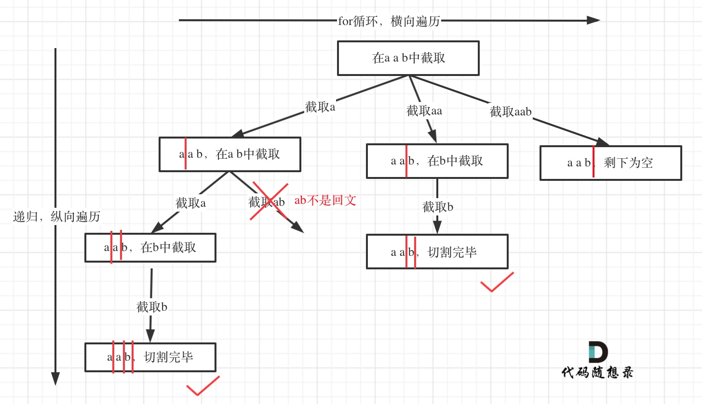

递归用来纵向遍历，for循环用来横向遍历，切割线（就是图中的红线）切割到字符串的结尾位置，说明找到了一个切割方法。

此时可以发现，切割问题的回溯搜索的过程和组合问题的回溯搜索的过程是差不多的。

### 回溯三部曲

- 递归函数参数

全局变量数组path存放切割后回文的子串，二维数组result存放结果集。 （这两个参数可以放到函数参数里）

本题递归函数参数还需要startIndex，因为切割过的地方，不能重复切割，和组合问题也是保持一致的。

在[回溯算法：求组合总和（二）](https://programmercarl.com/0039.%E7%BB%84%E5%90%88%E6%80%BB%E5%92%8C.html)中我们深入探讨了组合问题什么时候需要startIndex，什么时候不需要startIndex。

代码如下：

```cpp
vector<vector<string>> result;
vector<string> path; // 放已经回文的子串
void backtracking (const string& s, int startIndex) {
```

- 递归函数终止条件


从树形结构的图中可以看出：切割线切到了字符串最后面，说明找到了一种切割方法，此时就是本层递归的终止条件。

**那么在代码里什么是切割线呢？**

在处理组合问题的时候，递归参数需要传入startIndex，表示下一轮递归遍历的起始位置，这个startIndex就是切割线。

所以终止条件代码如下：

```cpp
void backtracking (const string& s, int startIndex) {
    // 如果起始位置已经大于s的大小，说明已经找到了一组分割方案了
    if (startIndex >= s.size()) {
        result.push_back(path);
        return;
    }
}
```

- 单层搜索的逻辑

**来看看在递归循环中如何截取子串呢？**

```cpp
在for (int i = startIndex; i < s.size(); i++) 循环中，我们 定义了起始位置startIndex，那么
```

`[startIndex, i]` 就是要截取的子串。

```text
首先判断这个子串是不是回文，如果是回文，就加入在vector<string> path 中，path用来记录切割过的回文子
```

串。

代码如下：

```cpp
for (int i = startIndex; i < s.size(); i++) {
    if (isPalindrome(s, startIndex, i)) { // 是回文子串
        // 获取[startIndex,i]在s中的子串
        string str = s.substr(startIndex, i - startIndex + 1);
        path.push_back(str);
    } else {                // 如果不是则直接跳过
        continue;
    }
    backtracking(s, i + 1); // 寻找i+1为起始位置的子串
    path.pop_back();        // 回溯过程，弹出本次已经添加的子串
}
```

**注意切割过的位置，不能重复切割，所以，backtracking(s, i + 1); 传入下一层的起始位置为i + 1**。

### 判断回文子串

最后我们看一下回文子串要如何判断了，判断一个字符串是否是回文。

可以使用双指针法，一个指针从前向后，一个指针从后向前，如果前后指针所指向的元素是相等的，就是回文字符串了。

那么判断回文的`C++`代码如下：

```cpp
 bool isPalindrome(const string& s, int start, int end) {
     for (int i = start, j = end; i < j; i++, j--) {
         if (s[i] != s[j]) {
             return false;
         }
     }
     return true;
 }
```

如果大家对双指针法有生疏了，传送门：[双指针法：总结篇！](https://programmercarl.com/%E5%8F%8C%E6%8C%87%E9%92%88%E6%80%BB%E7%BB%93.html)

此时关键代码已经讲解完毕，整体代码如下（详细注释了）

根据Carl给出的回溯算法模板：

```cpp
void backtracking(参数) {
    if (终止条件) {
        存放结果;
        return;
    }
    for (选择：本层集合中元素（树中节点孩子的数量就是集合的大小）) {
        处理节点;
        backtracking(路径，选择列表); // 递归
        回溯，撤销处理结果
    }
}
```

不难写出如下代码：

```cpp
class Solution {
private:
    vector<vector<string>> result;
    vector<string> path; // 放已经回文的子串
    void backtracking (const string& s, int startIndex) {
        // 如果起始位置已经大于s的大小，说明已经找到了一组分割方案了
        if (startIndex >= s.size()) {
            result.push_back(path);
            return;
        }
        for (int i = startIndex; i < s.size(); i++) {
            if (isPalindrome(s, startIndex, i)) {   // 是回文子串
                // 获取[startIndex,i]在s中的子串
                string str = s.substr(startIndex, i - startIndex + 1);
                path.push_back(str);
            } else {                                // 不是回文，跳过
                continue;
            }
            backtracking(s, i + 1); // 寻找i+1为起始位置的子串
            path.pop_back(); // 回溯过程，弹出本次已经添加的子串
        }
    }
    bool isPalindrome(const string& s, int start, int end) {
        for (int i = start, j = end; i < j; i++, j--) {
            if (s[i] != s[j]) {
                return false;
            }
        }
        return true;
    }
public:
    vector<vector<string>> partition(string s) {
        result.clear();
        path.clear();
        backtracking(s, 0);
        return result;
    }
};
```

- 时间复杂度`: O(n * 2^n)`
- 空间复杂度`: O(n^2)`

## 优化

上面的代码还存在一定的优化空间, 在于如何更高效的计算一个子字符串是否是回文字串。上述代

```text
码isPalindrome 函数运用双指针的方法来判定对于一个字符串s , 给定起始下标和终止下标, 截取出的子字符串是
```

否是回文字串。但是其中有一定的重复计算存在:

```text
例如给定字符串"abcde" , 在已知"bcd" 不是回文字串时, 不再需要去双指针操作"abcde" 而可以直接判定它一定
```

不是回文字串。

```text
具体来说, 给定一个字符串s , 长度为n , 它成为回文字串的充分必要条件是s[0] == s[n-1] 且s[1:n-1] 是回文
```

字串。

```text
大家如果熟悉动态规划这种算法的话, 我们可以高效地事先一次性计算出, 针对一个字符串s , 它的任何子串是否是
```

回文字串, 然后在我们的回溯函数中直接查询即可, 省去了双指针移动判定这一步骤.

具体参考代码如下:

```cpp
class Solution {
private:
    vector<vector<string>> result;
    vector<string> path; // 放已经回文的子串
    vector<vector<bool>> isPalindrome; // 放事先计算好的是否回文子串的结果
    void backtracking (const string& s, int startIndex) {
        // 如果起始位置已经大于s的大小，说明已经找到了一组分割方案了
        if (startIndex >= s.size()) {
            result.push_back(path);
            return;
        }
        for (int i = startIndex; i < s.size(); i++) {
            if (isPalindrome[startIndex][i]) {   // 是回文子串
                // 获取[startIndex,i]在s中的子串
                string str = s.substr(startIndex, i - startIndex + 1);
                path.push_back(str);
            } else {                                // 不是回文，跳过
                continue;
            }
            backtracking(s, i + 1); // 寻找i+1为起始位置的子串
            path.pop_back(); // 回溯过程，弹出本次已经添加的子串
        }
    }
    void computePalindrome(const string& s) {
        // isPalindrome[i][j] 代表 s[i:j](双边包括)是否是回文字串
        isPalindrome.resize(s.size(), vector<bool>(s.size(), false)); // 根据字符串s, 刷新
布尔矩阵的大小
        for (int i = s.size() - 1; i >= 0; i--) {
            // 需要倒序计算, 保证在i行时, i+1行已经计算好了
            for (int j = i; j < s.size(); j++) {
                if (j == i) {isPalindrome[i][j] = true;}
                else if (j - i == 1) {isPalindrome[i][j] = (s[i] == s[j]);}
                else {isPalindrome[i][j] = (s[i] == s[j] && isPalindrome[i+1][j-1]);}
            }
        }
    }
public:
    vector<vector<string>> partition(string s) {
        result.clear();
        path.clear();
        computePalindrome(s);
        backtracking(s, 0);
        return result;
    }
};
```

## 总结

这道题目在leetcode上是中等，但可以说是hard的题目了，但是代码其实就是按照模板的样子来的。

那么难究竟难在什么地方呢？

**我列出如下几个难点：**

- 切割问题可以抽象为组合问题
- 如何模拟那些切割线
- 切割问题中递归如何终止
- 在递归循环中如何截取子串
- 如何判断回文

**我们平时在做难题的时候，总结出来难究竟难在哪里也是一种需要锻炼的能力**。

一些同学可能遇到题目比较难，但是不知道题目难在哪里，反正就是很难。其实这样还是思维不够清晰，这种总结的能力需要多接触多锻炼。

**本题我相信很多同学主要卡在了第一个难点上：就是不知道如何切割，甚至知道要用回溯法，也不知道如何用。也** **就是没有体会到按照求组合问题的套路就可以解决切割**。

如果意识到这一点，算是重大突破了。接下来就可以对着模板照葫芦画瓢。

**但接下来如何模拟切割线，如何终止，如何截取子串，其实都不好想，最后判断回文算是最简单的了**。

关于模拟切割线，其实就是index是上一层已经确定了的分割线，i是这一层试图寻找的新分割线除了这些难点，**本题还有细节，例如：切割过的地方不能重复切割所以递归函数需要传入i + 1**。

所以本题应该是一道hard题目了。

**可能刷过这道题目的录友都没感受到自己原来克服了这么多难点，就把这道题目AC了**，这应该叫做无招胜有招，人码合一，哈哈哈。

# 10.复原IP地址

[力扣题目链接](https://leetcode.cn/problems/restore-ip-addresses/)

给定一个只包含数字的字符串，复原它并返回所有可能的 IP 地址格式。

有效的 IP 地址 正好由四个整数（每个整数位于 0 到 255 之间组成，且不能含有前导 0），整数之间用 '.' 分隔。

例如："0.1.2.201" 和 "192.168.1.1" 是 有效的 IP 地址，但是 "0.011.255.245"、"192.168.1.312" 和 "192.168@1.1" 是 无效的 IP 地址。

示例 1：

- 输入：`s = "25525511135"`
- 输出：`["255.255.11.135","255.255.111.35"]`

示例 2：

- 输入：`s = "0000"`
- 输出：`["0.0.0.0"]`

示例 3：

- 输入：`s = "1111"`
- 输出：`["1.1.1.1"]`

示例 4：

- 输入：`s = "010010"`
- 输出：`["0.10.0.10","0.100.1.0"]`

示例 5：

- 输入：`s = "101023"`
- 输出：`["1.0.10.23","1.0.102.3","10.1.0.23","10.10.2.3","101.0.2.3"]`

提示：

- `0 <= s.length <= 3000`
- s 仅由数字组成

## 算法公开课

[**《代码随想录》算法视频公开课**](https://programmercarl.com/other/gongkaike.html)**：**[**回溯算法如何分割字符串并判断是合法IP？| LeetCode：93.复原IP地址**](https://www.bilibili.com/video/BV1XP4y1U73i/)**，相信** **结合视频再看本篇题解，更有助于大家对本题的理解**。

## 思路

做这道题目之前，最好先把[131.分割回文串](https://programmercarl.com/0131.%E5%88%86%E5%89%B2%E5%9B%9E%E6%96%87%E4%B8%B2.html)这个做了。

这道题目相信大家刚看的时候，应该会一脸茫然。

其实只要意识到这是切割问题，**切割问题就可以使用回溯搜索法把所有可能性搜出来**，和刚做过的[131.分割回文串](https://programmercarl.com/0131.%E5%88%86%E5%89%B2%E5%9B%9E%E6%96%87%E4%B8%B2.html)就十分类似了。

切割问题可以抽象为树型结构，如图：

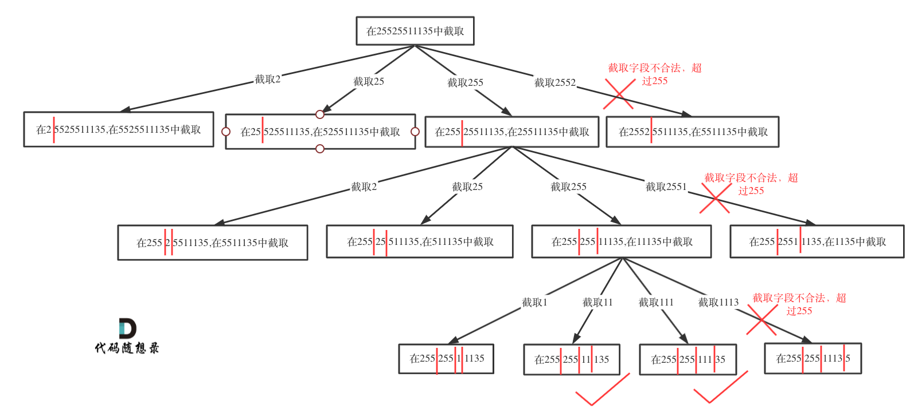

### 回溯三部曲

- 递归参数

在[131.分割回文串](https://programmercarl.com/0131.%E5%88%86%E5%89%B2%E5%9B%9E%E6%96%87%E4%B8%B2.html)中我们就提到切割问题类似组合问题。

startIndex一定是需要的，因为不能重复分割，记录下一层递归分割的起始位置。

本题我们还需要一个变量pointNum，记录添加逗点的数量。

所以代码如下：

```cpp
vector<string> result;// 记录结果
// startIndex: 搜索的起始位置，pointNum:添加逗点的数量
void backtracking(string& s, int startIndex, int pointNum) {
```

- 递归终止条件终止条件和[131.分割回文串](https://programmercarl.com/0131.%E5%88%86%E5%89%B2%E5%9B%9E%E6%96%87%E4%B8%B2.html)情况就不同了，本题明确要求只会分成4段，所以不能用切割线切到最后作为终止条件，而是分割的段数作为终止条件。

pointNum表示逗点数量，pointNum为3说明字符串分成了4段了。

然后验证一下第四段是否合法，如果合法就加入到结果集里

代码如下：

```cpp
if (pointNum == 3) { // 逗点数量为3时，分隔结束
    // 判断第四段子字符串是否合法，如果合法就放进result中
    if (isValid(s, startIndex, s.size() - 1)) {
        result.push_back(s);
    }
    return;
}
```

- 单层搜索的逻辑

在[131.分割回文串](https://programmercarl.com/0131.%E5%88%86%E5%89%B2%E5%9B%9E%E6%96%87%E4%B8%B2.html)中已经讲过在循环遍历中如何截取子串。

```cpp
在for (int i = startIndex; i < s.size(); i++) 循环中 [startIndex, i] 这个区间就是截取的子串，需要判
```

断这个子串是否合法。

```text
如果合法就在字符串后面加上符号. 表示已经分割。
```

如果不合法就结束本层循环，如图中剪掉的分支：


然后就是递归和回溯的过程：

```text
递归调用时，下一层递归的startIndex要从i+2开始（因为需要在字符串中加入了分隔符. ），同时记录分割符的数
```

量pointNum 要 +1。

```text
回溯的时候，就将刚刚加入的分隔符. 删掉就可以了，pointNum也要-1。
```

代码如下：

```cpp
for (int i = startIndex; i < s.size(); i++) {
    if (isValid(s, startIndex, i)) { // 判断 [startIndex,i] 这个区间的子串是否合法
        s.insert(s.begin() + i + 1 , '.');  // 在i的后面插入一个逗点
        pointNum++;
        backtracking(s, i + 2, pointNum);   // 插入逗点之后下一个子串的起始位置为i+2
        pointNum--;                         // 回溯
        s.erase(s.begin() + i + 1);         // 回溯删掉逗点
    } else break; // 不合法，直接结束本层循环
}
```

### 判断子串是否合法

最后就是在写一个判断段位是否是有效段位了。

主要考虑到如下三点：

- 段位以0为开头的数字不合法
- 段位里有非正整数字符不合法
- 段位如果大于255了不合法

代码如下：

```cpp
// 判断字符串s在左闭又闭区间[start, end]所组成的数字是否合法
bool isValid(const string& s, int start, int end) {
    if (start > end) {
        return false;
    }
    if (s[start] == '0' && start != end) { // 0开头的数字不合法
            return false;
    }
    int num = 0;
    for (int i = start; i <= end; i++) {
        if (s[i] > '9' || s[i] < '0') { // 遇到非数字字符不合法
            return false;
        }
        num = num * 10 + (s[i] - '0');
        if (num > 255) { // 如果大于255了不合法
            return false;
        }
    }
    return true;
}
```

根据[关于回溯算法，你该了解这些！](https://programmercarl.com/%E5%9B%9E%E6%BA%AF%E7%AE%97%E6%B3%95%E7%90%86%E8%AE%BA%E5%9F%BA%E7%A1%80.html)给出的回溯算法模板：

```cpp
void backtracking(参数) {
    if (终止条件) {
        存放结果;
        return;
    }
    for (选择：本层集合中元素（树中节点孩子的数量就是集合的大小）) {
        处理节点;
        backtracking(路径，选择列表); // 递归
        回溯，撤销处理结果
    }
}
```

可以写出如下回溯算法`C++`代码：

```cpp
class Solution {
private:
    vector<string> result;// 记录结果
    // startIndex: 搜索的起始位置，pointNum:添加逗点的数量
    void backtracking(string& s, int startIndex, int pointNum) {
        if (pointNum == 3) { // 逗点数量为3时，分隔结束
            // 判断第四段子字符串是否合法，如果合法就放进result中
            if (isValid(s, startIndex, s.size() - 1)) {
                result.push_back(s);
            }
            return;
        }
        for (int i = startIndex; i < s.size(); i++) {
            if (isValid(s, startIndex, i)) { // 判断 [startIndex,i] 这个区间的子串是否合法
                s.insert(s.begin() + i + 1 , '.');  // 在i的后面插入一个逗点
                pointNum++;
                backtracking(s, i + 2, pointNum);   // 插入逗点之后下一个子串的起始位置为i+2
                pointNum--;                         // 回溯
                s.erase(s.begin() + i + 1);         // 回溯删掉逗点
            } else break; // 不合法，直接结束本层循环
        }
    }
    // 判断字符串s在左闭又闭区间[start, end]所组成的数字是否合法
    bool isValid(const string& s, int start, int end) {
        if (start > end) {
            return false;
        }
        if (s[start] == '0' && start != end) { // 0开头的数字不合法
                return false;
        }
        int num = 0;
        for (int i = start; i <= end; i++) {
            if (s[i] > '9' || s[i] < '0') { // 遇到非数字字符不合法
                return false;
            }
            num = num * 10 + (s[i] - '0');
            if (num > 255) { // 如果大于255了不合法
                return false;
            }
        }
        return true;
    }
public:
    vector<string> restoreIpAddresses(string s) {
        result.clear();
        if (s.size() < 4 || s.size() > 12) return result; // 算是剪枝了
        backtracking(s, 0, 0);
        return result;
    }
};
```

- 时间复杂度`: O(3^4)`，IP地址最多包含4个数字，每个数字最多有3种可能的分割方式，则搜索树的最大深度为4，每个节点最多有3个子节点。
- 空间复杂度`: O(n)`

## 总结

在[131.分割回文串](https://programmercarl.com/0131.%E5%88%86%E5%89%B2%E5%9B%9E%E6%96%87%E4%B8%B2.html)中我列举的分割字符串的难点，本题都覆盖了。

而且本题还需要操作字符串添加逗号作为分隔符，并验证区间的合法性。

可以说是[131.分割回文串](https://programmercarl.com/0131.%E5%88%86%E5%89%B2%E5%9B%9E%E6%96%87%E4%B8%B2.html)的加强版。

在本文的树形结构图中，我已经把详细的分析思路都画了出来，相信大家看了之后一定会思路清晰不少！

# 11.子集

[力扣题目链接](https://leetcode.cn/problems/subsets/)

给定一组不含重复元素的整数数组 nums，返回该数组所有可能的子集（幂集）。

说明：解集不能包含重复的子集。

示例:  
输入`: nums = [1,2,3]`  
输出: `[` `[3],` `[1],` `[2],` `[1,2,3],` `[1,3],`

  `[2,3],` `[1,2],` `[]` `]`

## 算法公开课

[**《代码随想录》算法视频公开课**](https://programmercarl.com/other/gongkaike.html)**：**[**回溯算法解决子集问题，树上节点都是目标集和！ | LeetCode：78.子集**](https://www.bilibili.com/video/BV1U84y1q7Ci)**，相信** **结合视频再看本篇题解，更有助于大家对本题的理解**。

## 思路

求子集问题和[77.组合](https://programmercarl.com/0077.%E7%BB%84%E5%90%88.html)和[131.分割回文串](https://programmercarl.com/0131.%E5%88%86%E5%89%B2%E5%9B%9E%E6%96%87%E4%B8%B2.html)又不一样了。

如果把 子集问题、组合问题、分割问题都抽象为一棵树的话，**那么组合问题和分割问题都是收集树的叶子节点，而** **子集问题是找树的所有节点！**

其实子集也是一种组合问题，因为它的集合是无序的，子集`{1,2}` 和 子集`{2,1}`是一样的。

**那么既然是无序，取过的元素不会重复取，写回溯算法的时候，for就要从startIndex开始，而不是从0开始！**

有同学问了，什么时候for可以从0开始呢？

求排列问题的时候，就要从0开始，因为集合是有序的，`{1, 2}` 和`{2, 1}`是两个集合，排列问题我们后续的文章就会讲到的。

以示例中`nums = [1,2,3]`为例把求子集抽象为树型结构，如下：

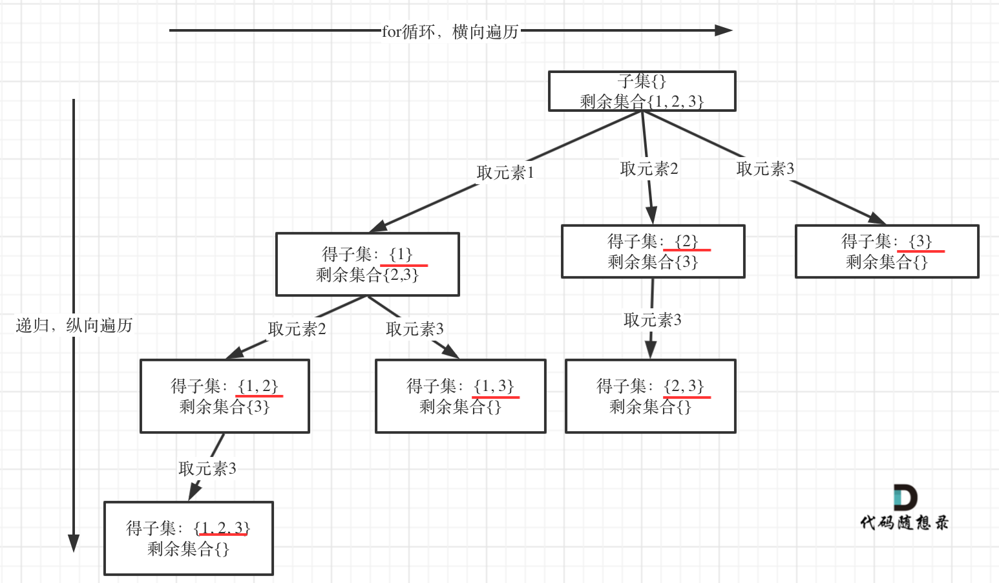

从图中红线部分，可以看出**遍历这个树的时候，把所有节点都记录下来，就是要求的子集集合**。

### 回溯三部曲

- 递归函数参数

全局变量数组path为子集收集元素，二维数组result存放子集组合。（也可以放到递归函数参数里）

递归函数参数在上面讲到了，需要startIndex。

代码如下：

```cpp
vector<vector<int>> result;
vector<int> path;
void backtracking(vector<int>& nums, int startIndex) {
```

递归终止条件

从图中可以看出：


剩余集合为空的时候，就是叶子节点。

那么什么时候剩余集合为空呢？

就是startIndex已经大于数组的长度了，就终止了，因为没有元素可取了，代码如下:

```cpp
if (startIndex >= nums.size()) {
    return;
}
```

**其实可以不需要加终止条件，因为startIndex >= nums.size()，本层for循环本来也结束了**。

- 单层搜索逻辑

**求取子集问题，不需要任何剪枝！因为子集就是要遍历整棵树**。

那么单层递归逻辑代码如下：

```cpp
for (int i = startIndex; i < nums.size(); i++) {
    path.push_back(nums[i]);    // 子集收集元素
    backtracking(nums, i + 1);  // 注意从i+1开始，元素不重复取
    path.pop_back();            // 回溯
}
```

根据[关于回溯算法，你该了解这些！](https://programmercarl.com/%E5%9B%9E%E6%BA%AF%E7%AE%97%E6%B3%95%E7%90%86%E8%AE%BA%E5%9F%BA%E7%A1%80.html)给出的回溯算法模板：

```cpp
void backtracking(参数) {
    if (终止条件) {
        存放结果;
        return;
    }
    for (选择：本层集合中元素（树中节点孩子的数量就是集合的大小）) {
        处理节点;
        backtracking(路径，选择列表); // 递归
        回溯，撤销处理结果
    }
}
```

可以写出如下回溯算法`C++`代码：

```cpp
class Solution {
private:
    vector<vector<int>> result;
    vector<int> path;
    void backtracking(vector<int>& nums, int startIndex) {
        result.push_back(path); // 收集子集，要放在终止添加的上面，否则会漏掉自己
        if (startIndex >= nums.size()) { // 终止条件可以不加
            return;
        }
        for (int i = startIndex; i < nums.size(); i++) {
            path.push_back(nums[i]);
            backtracking(nums, i + 1);
            path.pop_back();
        }
    }
public:
    vector<vector<int>> subsets(vector<int>& nums) {
        result.clear();
        path.clear();
        backtracking(nums, 0);
        return result;
    }
};
```

- 时间复杂度`: O(n * 2^n)`
- 空间复杂度`: O(n)`

在注释中，可以发现可以不写终止条件，因为本来我们就要遍历整棵树。

有的同学可能担心不写终止条件会不会无限递归？

并不会，因为每次递归的下一层就是从i+1开始的。

## 总结

相信大家经过了

- 组合问题：

[77.组合](https://programmercarl.com/0077.%E7%BB%84%E5%90%88.html)

[回溯算法：组合问题再剪剪枝](https://programmercarl.com/0077.%E7%BB%84%E5%90%88%E4%BC%98%E5%8C%96.html)

[216.组合总和III](https://programmercarl.com/0216.%E7%BB%84%E5%90%88%E6%80%BB%E5%92%8CIII.html) [17.电话号码的字母组合](https://programmercarl.com/0017.%E7%94%B5%E8%AF%9D%E5%8F%B7%E7%A0%81%E7%9A%84%E5%AD%97%E6%AF%8D%E7%BB%84%E5%90%88.html) [39.组合总和](https://programmercarl.com/0039.%E7%BB%84%E5%90%88%E6%80%BB%E5%92%8C.html) [40.组合总和II](https://programmercarl.com/0040.%E7%BB%84%E5%90%88%E6%80%BB%E5%92%8CII.html)

- 分割问题：

[131.分割回文串](https://programmercarl.com/0131.%E5%88%86%E5%89%B2%E5%9B%9E%E6%96%87%E4%B8%B2.html) [93.复原IP地址](https://programmercarl.com/0093.%E5%A4%8D%E5%8E%9FIP%E5%9C%B0%E5%9D%80.html)

洗礼之后，发现子集问题还真的有点简单了，其实这就是一道标准的模板题。

但是要清楚子集问题和组合问题、分割问题的的区别，**子集是收集树形结构中树的所有节点的结果**。

**而组合问题、分割问题是收集树形结构中叶子节点的结果**。

# 12. 本周小结！（回溯算法系列二）

例行每周小结

## 周一

在[回溯算法：求组合总和（二）](https://programmercarl.com/0039.%E7%BB%84%E5%90%88%E6%80%BB%E5%92%8C.html)中讲解的组合总和问题，和以前的组合问题还都不一样。

本题和[回溯算法：求组合问题！](https://programmercarl.com/0077.%E7%BB%84%E5%90%88.html)，[回溯算法：求组合总和！](https://programmercarl.com/0216.%E7%BB%84%E5%90%88%E6%80%BB%E5%92%8CIII.html)和区别是：本题没有数量要求，可以无限重复，但是有总和的限制，所以间接的也是有个数的限制。

不少录友都是看到可以重复选择，就义无反顾的把startIndex去掉了。

**本题还需要startIndex来控制for循环的起始位置，对于组合问题，什么时候需要startIndex呢？**

我举过例子，如果是一个集合来求组合的话，就需要startIndex，例如：[回溯算法：求组合问题！](https://programmercarl.com/0077.%E7%BB%84%E5%90%88.html)，回溯算法：求组合总和！。

如果是多个集合取组合，各个集合之间相互不影响，那么就不用startIndex，例如：回溯算法：电话号码的字母组合

**注意以上我只是说求组合的情况，如果是排列问题，又是另一套分析的套路，后面我再讲解排列的时候就重点介** **绍**。

最后还给出了本题的剪枝优化，如下：

```cpp
for (int i = startIndex; i < candidates.size() && sum + candidates[i] <= target; i++)
```

这个优化如果是初学者的话并不容易想到。

**在求和问题中，排序之后加剪枝是常见的套路！**

在[回溯算法：求组合总和（二）](https://programmercarl.com/0039.%E7%BB%84%E5%90%88%E6%80%BB%E5%92%8C.html)第一个树形结构没有画出startIndex的作用，**这里这里纠正一下，准确的树形结构** **如图所示：**

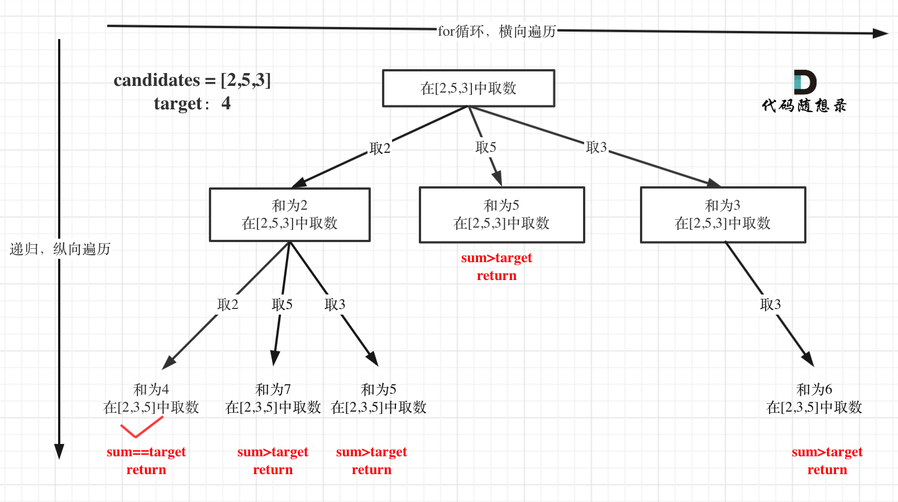

## 周二

在[回溯算法：求组合总和（三）](https://programmercarl.com/0040.%E7%BB%84%E5%90%88%E6%80%BB%E5%92%8CII.html)中依旧讲解组合总和问题，本题集合元素会有重复，但要求解集不能包含重复的组合。

**所以难就难在去重问题上了**。

这个去重问题，相信做过的录友都知道有多么的晦涩难懂。网上的题解一般就说“去掉重复”，但说不清怎么个去重，代码一甩就完事了。

为了讲解这个去重问题，**我自创了两个词汇，“树枝去重”和“树层去重”**。

都知道组合问题可以抽象为树形结构，那么“使用过”在这个树形结构上是有两个维度的，一个维度是同一树枝上“使用过”，一个维度是同一树层上“使用过”。**没有理解这两个层面上的“使用过” 是造成大家没有彻底理解去重的根本原** **因**。


我在图中将used的变化用橘黄色标注上，可以看出在`candidates[i] == candidates[i - 1]`相同的情况下：

- `used[i - 1] == true`，说明同一树枝`candidates[i - 1]`使用过
- `used[i - 1] == false`，说明同一树层`candidates[i - 1]`使用过

**这块去重的逻辑很抽象，网上搜的题解基本没有能讲清楚的，如果大家之前思考过这个问题或者刷过这道题目，看** **到这里一定会感觉通透了很多！**

对于去重，其实排列问题也是一样的道理，后面我会讲到。

## 周三

在[回溯算法：分割回文串](https://programmercarl.com/0131.%E5%88%86%E5%89%B2%E5%9B%9E%E6%96%87%E4%B8%B2.html)中，我们开始讲解切割问题，虽然最后代码看起来好像是一道模板题，但是从分析到学会套用这个模板，是比较难的。

我列出如下几个难点：

- 切割问题其实类似组合问题
- 如何模拟那些切割线
- 切割问题中递归如何终止
- 在递归循环中如何截取子串

- 如何判断回文

如果想到了**用求解组合问题的思路来解决 切割问题本题就成功一大半了**，接下来就可以对着模板照葫芦画瓢。

**但后序如何模拟切割线，如何终止，如何截取子串，其实都不好想，最后判断回文算是最简单的了**。

除了这些难点，**本题还有细节，例如：切割过的地方不能重复切割所以递归函数需要传入i + 1**。

所以本题应该是一个道hard题目了。

**本题的树形结构中，和代码的逻辑有一个小出入，已经判断不是回文的子串就不会进入递归了，纠正如下：**

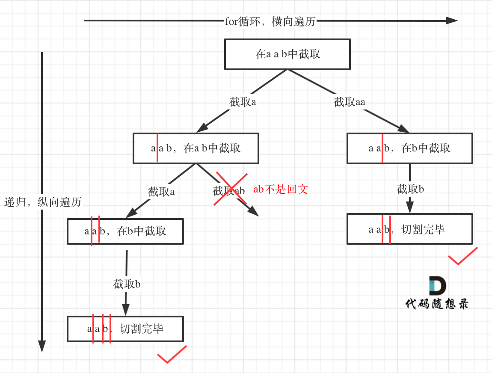

## 周四

如果没有做过[回溯算法：分割回文串](https://programmercarl.com/0131.%E5%88%86%E5%89%B2%E5%9B%9E%E6%96%87%E4%B8%B2.html)的话，[回溯算法：复原IP地址](https://programmercarl.com/0093.%E5%A4%8D%E5%8E%9FIP%E5%9C%B0%E5%9D%80.html)这道题目应该是比较难的。

复原IP照[回溯算法：分割回文串](https://programmercarl.com/0131.%E5%88%86%E5%89%B2%E5%9B%9E%E6%96%87%E4%B8%B2.html)就多了一些限制，例如只能分四段，而且还是更改字符串，插入逗点。

树形图如下：


在本文的树形结构图中，我已经把详细的分析思路都画了出来，相信大家看了之后一定会思路清晰不少！

本题还可以有一个剪枝，合法ip长度为12，如果s的长度超过了12就不是有效IP地址，直接返回！

代码如下：

```cpp
if (s.size() > 12) return result; // 剪枝
```

我之前给出的`C++`代码没有加这个限制，也没有超时，因为在第四段超过长度之后，就会截止了，所以就算给出特别长的字符串，搜索的范围也是有限的（递归只会到第三层），及时就会返回了。

## 周五

在[回溯算法：求子集问题！](https://programmercarl.com/0078.%E5%AD%90%E9%9B%86.html)中讲解了子集问题，**在树形结构中子集问题是要收集所有节点的结果，而组合问题是收** **集叶子节点的结果**。

如图：


认清这个本质之后，今天的题目就是一道模板题了。

其实可以不需要加终止条件，因为`startIndex >= nums.size()`，本层for循环本来也结束了，本来我们就要遍历整棵树。

有的同学可能担心不写终止条件会不会无限递归？

并不会，因为每次递归的下一层就是从i+1开始的。

```cpp
如果要写终止条件，注意：result.push_back(path); 要放在终止条件的上面，如下：
result.push_back(path); // 收集子集，要放在终止添加的上面，否则会漏掉自己
if (startIndex >= nums.size()) { // 终止条件可以不加
    return;
}
```

## 周六

早起的哈希表系列没有总结，所以[哈希表：总结篇！（每逢总结必经典）](https://programmercarl.com/%E5%93%88%E5%B8%8C%E8%A1%A8%E6%80%BB%E7%BB%93.html)如约而至。

可能之前大家做过很多哈希表的题目，但是没有串成线，总结篇来帮你串成线，捋顺哈希表的整个脉络。

大家对什么时候各种set与map比较疑惑，想深入了解红黑树，哈希之类的。

**如果真的只是想清楚什么时候使用各种set与map，不用看那么多，把**[**关于哈希表，你该了解这些！**](https://programmercarl.com/%E5%93%88%E5%B8%8C%E8%A1%A8%E7%90%86%E8%AE%BA%E5%9F%BA%E7%A1%80.html)**看了就够了**。

## 总结

本周我们依次介绍了组合问题，分割问题以及子集问题，子集问题还没有讲完，下周还会继续。

**我讲解每一种问题，都会和其他问题作对比，做分析，所以只要跟着细心琢磨相信对回溯又有新的认识**。

最近这两天题目有点难度，刚刚开始学回溯算法的话，按照现在这个每天一题的速度来，确实有点快，学起来吃力非常正常，这些题目都是我当初学了好几个月才整明白的，哈哈。

**所以大家能跟上的话，已经很优秀了！**

还有一些录友会很关心leetcode上的耗时统计。

这个是很不准确的，相同的代码多提交几次，大家就知道怎么回事了。

leetcode上的计时应该是以4ms为单位，有的多提交几次，多个4ms就多击败50%，所以比较夸张，如果程序运行是几百ms的级别，可以看看leetcode上的耗时，因为它的误差10几ms对最终影响不大。

**所以我的题解基本不会写击败百分之多少多少，没啥意义，时间复杂度分析清楚了就可以了**，至于回溯算法不用分析时间复杂度了，都是一样的爆搜，就看谁剪枝厉害了。

一些录友表示最近回溯算法看的实在是有点懵，回溯算法确实是晦涩难懂，可能视频的话更直观一些，我最近应该会在B站（同名：「代码随想录」）出回溯算法的视频，大家也可以看视频在回顾一波。

**就酱，又是充实的一周，做好本周总结，迎接下一周，冲！**

# 13.子集II

[力扣题目链接](https://leetcode.cn/problems/subsets-ii/)

给定一个可能包含重复元素的整数数组 nums，返回该数组所有可能的子集（幂集）。

说明：解集不能包含重复的子集。

示例:

- 输入`: [1,2,2]`
- 输出: `[` `[2],` `[1],` `[1,2,2],` `[2,2],` `[1,2],` `[]` `]`

## 算法公开课

[**《代码随想录》算法视频公开课**](https://programmercarl.com/other/gongkaike.html)**：**[**回溯算法解决子集问题，如何去重？| LeetCode：90.子集II**](https://www.bilibili.com/video/BV1vm4y1F71J/)**，相信结合视频再** **看本篇题解，更有助于大家对本题的理解**。

## 思路

做本题之前一定要先做[78.子集](https://programmercarl.com/0078.%E5%AD%90%E9%9B%86.html)。

这道题目和[78.子集](https://programmercarl.com/0078.%E5%AD%90%E9%9B%86.html)区别就是集合里有重复元素了，而且求取的子集要去重。

那么关于回溯算法中的去重问题，**在**[**40.组合总和II**](https://programmercarl.com/0040.%E7%BB%84%E5%90%88%E6%80%BB%E5%92%8CII.html)**中已经详细讲解过了，和本题是一个套路**。

**剧透一下，后期要讲解的排列问题里去重也是这个套路，所以理解“树层去重”和“树枝去重”非常重要**。

用示例中的`[1, 2, 2]` 来举例，如图所示： （**注意去重需要先对集合排序**）

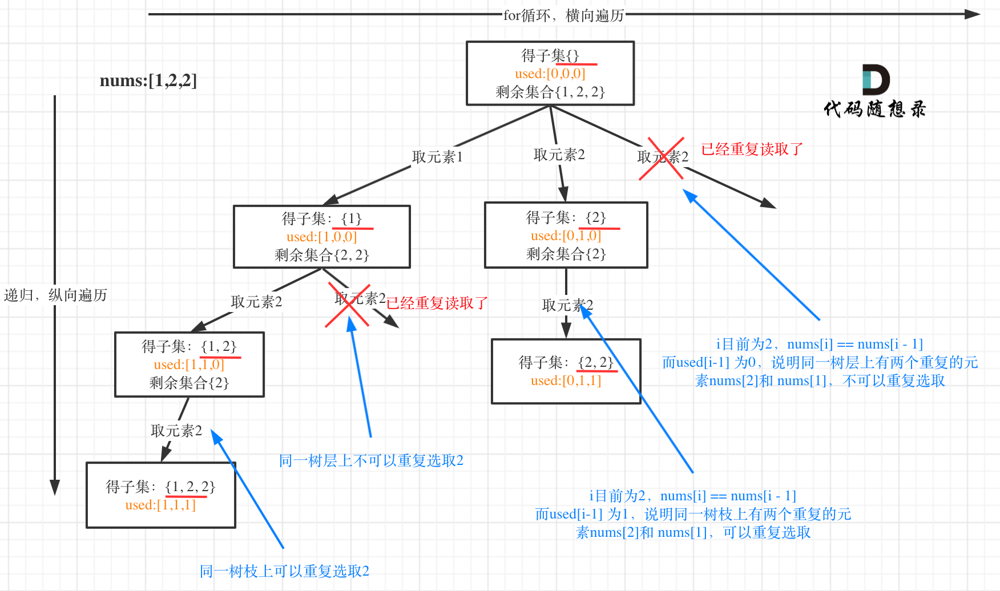

从图中可以看出，同一树层上重复取2 就要过滤掉，同一树枝上就可以重复取2，因为同一树枝上元素的集合才是唯一子集！

本题就是其实就是[回溯算法：求子集问题！](https://programmercarl.com/0078.%E5%AD%90%E9%9B%86.html)的基础上加上了去重，去重我们在[回溯算法：求组合总和（三）](https://programmercarl.com/0040.%E7%BB%84%E5%90%88%E6%80%BB%E5%92%8CII.html)也讲过了，所以我就直接给出代码了：

`C++`代码如下：

```cpp
class Solution {
private:
    vector<vector<int>> result;
    vector<int> path;
    void backtracking(vector<int>& nums, int startIndex, vector<bool>& used) {
        result.push_back(path);
        for (int i = startIndex; i < nums.size(); i++) {
            // used[i - 1] == true，说明同一树枝candidates[i - 1]使用过
            // used[i - 1] == false，说明同一树层candidates[i - 1]使用过
            // 而我们要对同一树层使用过的元素进行跳过
            if (i > 0 && nums[i] == nums[i - 1] && used[i - 1] == false) {
                continue;
            }
            path.push_back(nums[i]);
            used[i] = true;
            backtracking(nums, i + 1, used);
            used[i] = false;
            path.pop_back();
        }
    }
public:
    vector<vector<int>> subsetsWithDup(vector<int>& nums) {
        result.clear();
        path.clear();
        vector<bool> used(nums.size(), false);
        sort(nums.begin(), nums.end()); // 去重需要排序
        backtracking(nums, 0, used);
        return result;
    }
};
```

- 时间复杂度`: O(n * 2^n)`
- 空间复杂度`: O(n)`

使用set去重的版本。

```cpp
class Solution {
private:
    vector<vector<int>> result;
    vector<int> path;
    void backtracking(vector<int>& nums, int startIndex) {
        result.push_back(path);
        unordered_set<int> uset;
        for (int i = startIndex; i < nums.size(); i++) {
            if (uset.find(nums[i]) != uset.end()) {
                continue;
            }
            uset.insert(nums[i]);
            path.push_back(nums[i]);
            backtracking(nums, i + 1);
            path.pop_back();
        }
    }
public:
    vector<vector<int>> subsetsWithDup(vector<int>& nums) {
        result.clear();
        path.clear();
        sort(nums.begin(), nums.end()); // 去重需要排序
        backtracking(nums, 0);
        return result;
    }
};
```

## 补充

本题也可以不使用used数组来去重，因为递归的时候下一个startIndex是i+1而不是0。

如果要是全排列的话，每次要从0开始遍历，为了跳过已入栈的元素，需要使用used。

代码如下：

```cpp
class Solution {
private:
    vector<vector<int>> result;
    vector<int> path;
    void backtracking(vector<int>& nums, int startIndex) {
        result.push_back(path);
        for (int i = startIndex; i < nums.size(); i++) {
            // 而我们要对同一树层使用过的元素进行跳过
            if (i > startIndex && nums[i] == nums[i - 1] ) { // 注意这里使用i >
startIndex
                continue;
            }
            path.push_back(nums[i]);
            backtracking(nums, i + 1);
            path.pop_back();
        }
    }
public:
    vector<vector<int>> subsetsWithDup(vector<int>& nums) {
        result.clear();
        path.clear();
        sort(nums.begin(), nums.end()); // 去重需要排序
        backtracking(nums, 0);
        return result;
    }
};
```

## 总结

其实这道题目的知识点，我们之前都讲过了，如果之前讲过的子集问题和去重问题都掌握的好，这道题目应该分分钟AC。

当然本题去重的逻辑，也可以这么写

```cpp
if (i > startIndex && nums[i] == nums[i - 1] ) {
  continue;
}
```

和子集问题有点像，但又处处是陷阱

# 14.递增子序列

[力扣题目链接](https://leetcode.cn/problems/non-decreasing-subsequences/)

给定一个整型数组, 你的任务是找到所有该数组的递增子序列，递增子序列的长度至少是2。

示例:

- 输入`: [4, 6, 7, 7]`
- 输出`: [[4, 6], [4, 7], [4, 6, 7], [4, 6, 7, 7], [6, 7], [6, 7, 7], [7,7], [4,7,7]]`

说明:

- 给定数组的长度不会超过15。
- 数组中的整数范围是 `[-100,100]`。
- 给定数组中可能包含重复数字，相等的数字应该被视为递增的一种情况。

## 算法公开课

[**《代码随想录》算法视频公开课**](https://programmercarl.com/other/gongkaike.html)**：**[**回溯算法精讲，树层去重与树枝去重 | LeetCode：491.递增子序列**](https://www.bilibili.com/video/BV1EG4y1h78v/)**，相信结合** **视频再看本篇题解，更有助于大家对本题的理解**。

## 思路

这个递增子序列比较像是取有序的子集。而且本题也要求不能有相同的递增子序列。

这又是子集，又是去重，是不是不由自主的想起了刚刚讲过的[90.子集II](https://programmercarl.com/0090.%E5%AD%90%E9%9B%86II.html)。

就是因为太像了，更要注意差别所在，要不就掉坑里了！

在[90.子集II](https://programmercarl.com/0090.%E5%AD%90%E9%9B%86II.html)中我们是通过排序，再加一个标记数组来达到去重的目的。

而本题求自增子序列，是不能对原数组进行排序的，排完序的数组都是自增子序列了。

**所以不能使用之前的去重逻辑！**

本题给出的示例，还是一个有序数组 `[4, 6, 7, 7]`，这更容易误导大家按照排序的思路去做了。

为了有鲜明的对比，我用`[4, 7, 6, 7]`这个数组来举例，抽象为树形结构如图：

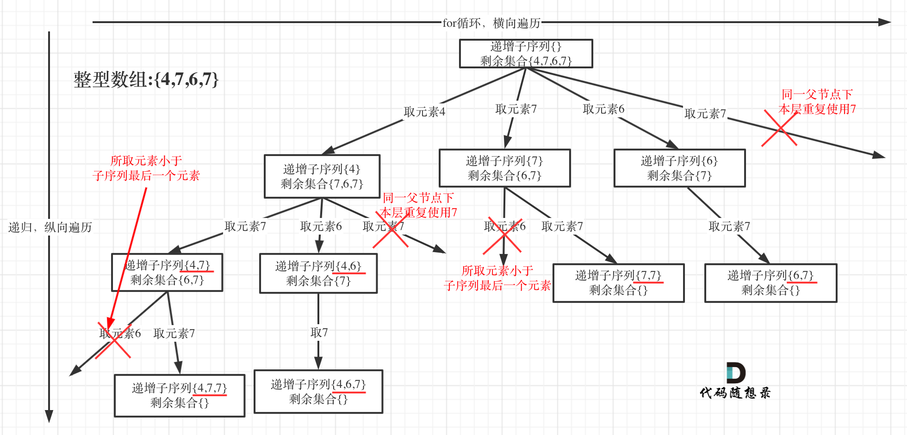

### 回溯三部曲

- 递归函数参数

本题求子序列，很明显一个元素不能重复使用，所以需要startIndex，调整下一层递归的起始位置。

代码如下：

```cpp
vector<vector<int>> result;
vector<int> path;
void backtracking(vector<int>& nums, int startIndex)
```

- 终止条件

本题其实类似求子集问题，也是要遍历树形结构找每一个节点，所以和[回溯算法：求子集问题！](https://programmercarl.com/0078.%E5%AD%90%E9%9B%86.html)一样，可以不加终止条件，startIndex每次都会加1，并不会无限递归。

但本题收集结果有所不同，题目要求递增子序列大小至少为2，所以代码如下：

```cpp
if (path.size() > 1) {
    result.push_back(path);
    // 注意这里不要加return，因为要取树上的所有节点
}
```

- 单层搜索逻辑


在图中可以看出，**同一父节点下的同层上使用过的元素就不能再使用了**

那么单层搜索代码如下：

```cpp
unordered_set<int> uset; // 使用set来对本层元素进行去重
for (int i = startIndex; i < nums.size(); i++) {
    if ((!path.empty() && nums[i] < path.back())
            || uset.find(nums[i]) != uset.end()) {
            continue;
    }
    uset.insert(nums[i]); // 记录这个元素在本层用过了，本层后面不能再用了
    path.push_back(nums[i]);
    backtracking(nums, i + 1);
    path.pop_back();
}
对于已经习惯写回溯的同学，看到递归函数上面的uset.insert(nums[i]); ，下面却没有对应的pop之类的操
```

**作，应该很不习惯吧，哈哈**

```cpp
这也是需要注意的点，unordered_set<int> uset; 是记录本层元素是否重复使用，新的一层uset都会重新定义
```

**（清空），所以要知道uset只负责本层！**

最后整体`C++`代码如下：

```cpp
// 版本一
class Solution {
private:
    vector<vector<int>> result;
    vector<int> path;
    void backtracking(vector<int>& nums, int startIndex) {
        if (path.size() > 1) {
            result.push_back(path);
            // 注意这里不要加return，要取树上的节点
        }
        unordered_set<int> uset; // 使用set对本层元素进行去重
        for (int i = startIndex; i < nums.size(); i++) {
            if ((!path.empty() && nums[i] < path.back())
                    || uset.find(nums[i]) != uset.end()) {
                    continue;
            }
            uset.insert(nums[i]); // 记录这个元素在本层用过了，本层后面不能再用了
            path.push_back(nums[i]);
            backtracking(nums, i + 1);
            path.pop_back();
        }
    }
public:
    vector<vector<int>> findSubsequences(vector<int>& nums) {
        result.clear();
        path.clear();
        backtracking(nums, 0);
        return result;
    }
};
```

- 时间复杂度`: O(n * 2^n)`
- 空间复杂度`: O(n)`

## 优化

```cpp
以上代码用我用了unordered_set<int> 来记录本层元素是否重复使用。
```

**其实用数组来做哈希，效率就高了很多**。

注意题目中说了，数值范围`[-100,100]`，所以完全可以用数组来做哈希。

程序运行的时候对unordered_set 频繁的insert，unordered_set需要做哈希映射（也就是把key通过hash function映射为唯一的哈希值）相对费时间，而且每次重新定义set，insert的时候其底层的符号表也要做相应的扩充，也是费事的。

那么优化后的代码如下：

```cpp
// 版本二
class Solution {
private:
    vector<vector<int>> result;
    vector<int> path;
    void backtracking(vector<int>& nums, int startIndex) {
        if (path.size() > 1) {
            result.push_back(path);
        }
        int used[201] = {0}; // 这里使用数组来进行去重操作，题目说数值范围[-100, 100]
        for (int i = startIndex; i < nums.size(); i++) {
            if ((!path.empty() && nums[i] < path.back())
                    || used[nums[i] + 100] == 1) {
                    continue;
            }
            used[nums[i] + 100] = 1; // 记录这个元素在本层用过了，本层后面不能再用了
            path.push_back(nums[i]);
            backtracking(nums, i + 1);
            path.pop_back();
        }
    }
public:
    vector<vector<int>> findSubsequences(vector<int>& nums) {
        result.clear();
        path.clear();
        backtracking(nums, 0);
        return result;
    }
};
```

这份代码在leetcode上提交，要比版本一耗时要好的多。

**所以正如在**[**哈希表：总结篇！（每逢总结必经典）**](https://programmercarl.com/%E5%93%88%E5%B8%8C%E8%A1%A8%E6%80%BB%E7%BB%93.html)**中说的那样，数组，set，map都可以做哈希表，而且数组干的** **活，map和set都能干，但如果数值范围小的话能用数组尽量用数组**。

## 总结

本题题解清一色都说是深度优先搜索，但我更倾向于说它用回溯法，而且本题我也是完全使用回溯法的逻辑来分析的。

相信大家在本题中处处都能看到是[回溯算法：求子集问题（二）](https://programmercarl.com/0090.%E5%AD%90%E9%9B%86II.html)的身影，但处处又都是陷阱。

**对于养成思维定式或者套模板套嗨了的同学，这道题起到了很好的警醒作用。更重要的是拓展了大家的思路！**

# 15.全排列

[力扣题目链接](https://leetcode.cn/problems/permutations/)

给定一个 没有重复 数字的序列，返回其所有可能的全排列。

示例:

- 输入`: [1,2,3]`
- 输出: `[` `[1,2,3],` `[1,3,2],` `[2,1,3],` `[2,3,1],` `[3,1,2],` `[3,2,1]` `]`

## 算法公开课

[**《代码随想录》算法视频公开课**](https://programmercarl.com/other/gongkaike.html)**：组合与排列的区别，回溯算法求解的时候，有何不同？| LeetCode：46.全排** **列，相信结合视频再看本篇题解，更有助于大家对本题的理解**。

## 思路

此时我们已经学习了[77.组合问题](https://programmercarl.com/0077.%E7%BB%84%E5%90%88.html)、 [131.分割回文串](https://programmercarl.com/0131.%E5%88%86%E5%89%B2%E5%9B%9E%E6%96%87%E4%B8%B2.html)和[78.子集问题](https://programmercarl.com/0078.%E5%AD%90%E9%9B%86.html)，接下来看一看排列问题。

相信这个排列问题就算是让你用for循环暴力把结果搜索出来，这个暴力也不是很好写。

所以正如我们在[关于回溯算法，你该了解这些！](https://programmercarl.com/%E5%9B%9E%E6%BA%AF%E7%AE%97%E6%B3%95%E7%90%86%E8%AE%BA%E5%9F%BA%E7%A1%80.html)所讲的为什么回溯法是暴力搜索，效率这么低，还要用它？

**因为一些问题能暴力搜出来就已经很不错了！**

我以`[1,2,3]`为例，抽象成树形结构如下：

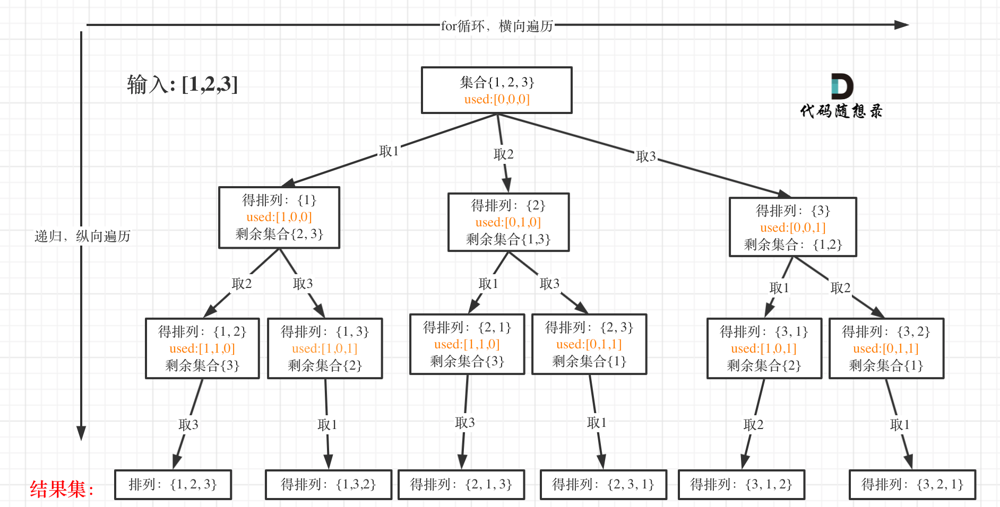

### 回溯三部曲

- 递归函数参数

**首先排列是有序的，也就是说 [1,2] 和 [2,1] 是两个集合，这和之前分析的子集以及组合所不同的地方**。

可以看出元素1在`[1,2]`中已经使用过了，但是在`[2,1]`中还要在使用一次1，所以处理排列问题就不用使用startIndex了。

但排列问题需要一个used数组，标记已经选择的元素，如图橘黄色部分所示:


代码如下：

```cpp
vector<vector<int>> result;
vector<int> path;
void backtracking (vector<int>& nums, vector<bool>& used)
```

- 递归终止条件

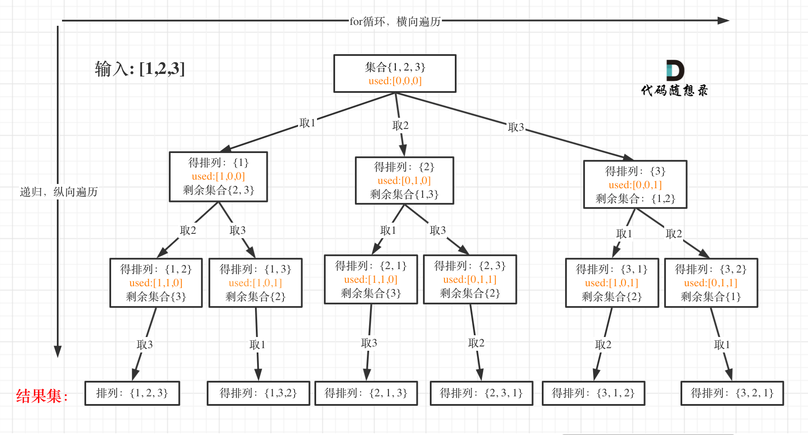

可以看出叶子节点，就是收割结果的地方。

那么什么时候，算是到达叶子节点呢？

当收集元素的数组path的大小达到和nums数组一样大的时候，说明找到了一个全排列，也表示到达了叶子节点。

代码如下：

```cpp
// 此时说明找到了一组
if (path.size() == nums.size()) {
    result.push_back(path);
    return;
}
```

- 单层搜索的逻辑

这里和[77.组合问题](https://programmercarl.com/0077.%E7%BB%84%E5%90%88.html)、[131.切割问题](https://programmercarl.com/0131.%E5%88%86%E5%89%B2%E5%9B%9E%E6%96%87%E4%B8%B2.html)和[78.子集问题](https://programmercarl.com/0078.%E5%AD%90%E9%9B%86.html)最大的不同就是for循环里不用startIndex了。

因为排列问题，每次都要从头开始搜索，例如元素1在`[1,2]`中已经使用过了，但是在`[2,1]`中还要再使用一次1。

**而used数组，其实就是记录此时path里都有哪些元素使用了，一个排列里一个元素只能使用一次**。

代码如下：

```cpp
for (int i = 0; i < nums.size(); i++) {
    if (used[i] == true) continue; // path里已经收录的元素，直接跳过
    used[i] = true;
    path.push_back(nums[i]);
    backtracking(nums, used);
    path.pop_back();
    used[i] = false;
}
```

整体`C++`代码如下：

```cpp
class Solution {
public:
    vector<vector<int>> result;
    vector<int> path;
    void backtracking (vector<int>& nums, vector<bool>& used) {
        // 此时说明找到了一组
        if (path.size() == nums.size()) {
            result.push_back(path);
            return;
        }
        for (int i = 0; i < nums.size(); i++) {
            if (used[i] == true) continue; // path里已经收录的元素，直接跳过
            used[i] = true;
            path.push_back(nums[i]);
            backtracking(nums, used);
            path.pop_back();
            used[i] = false;
        }
    }
    vector<vector<int>> permute(vector<int>& nums) {
        result.clear();
        path.clear();
        vector<bool> used(nums.size(), false);
        backtracking(nums, used);
        return result;
    }
};
```

- 时间复杂度`: O(n!)`
- 空间复杂度`: O(n)`

## 总结

大家此时可以感受出排列问题的不同：

- 每层都是从0开始搜索而不是startIndex
- 需要used数组记录path里都放了哪些元素了

排列问题是回溯算法解决的经典题目，大家可以好好体会体会。

# 16.全排列 II

[力扣题目链接](https://leetcode.cn/problems/permutations-ii/)

给定一个可包含重复数字的序列 nums ，按任意顺序 返回所有不重复的全排列。

示例 1：

- 输入：`nums = [1,1,2]`
- 输出：`[[1,1,2],`  `[1,2,1],`  `[2,1,1]]`

示例 2：

- 输入：`nums = [1,2,3]`
- 输出：`[[1,2,3],[1,3,2],[2,1,3],[2,3,1],[3,1,2],[3,2,1]]`

提示：

- `1 <= nums.length <= 8`
- `-10 <= nums[i] <= 10`

## 算法公开课

[**《代码随想录》算法视频公开课**](https://programmercarl.com/other/gongkaike.html)**：**[**回溯算法求解全排列，如何去重？| LeetCode：47.全排列 II**](https://www.bilibili.com/video/BV1R84y1i7Tm/)**，相信结合视频再** **看本篇题解，更有助于大家对本题的理解**。

## 思路

这道题目和[46.全排列](https://programmercarl.com/0046.%E5%85%A8%E6%8E%92%E5%88%97.html)的区别在与**给定一个可包含重复数字的序列**，要返回**所有不重复的全排列**。

这里又涉及到去重了。

在[40.组合总和II](https://programmercarl.com/0040.%E7%BB%84%E5%90%88%E6%80%BB%E5%92%8CII.html) 、[90.子集II](https://programmercarl.com/0090.%E5%AD%90%E9%9B%86II.html)我们分别详细讲解了组合问题和子集问题如何去重。

那么排列问题其实也是一样的套路。

**还要强调的是去重一定要对元素进行排序，这样我们才方便通过相邻的节点来判断是否重复使用了**。

我以示例中的 `[1,1,2]`为例 （为了方便举例，已经排序）抽象为一棵树，去重过程如图：

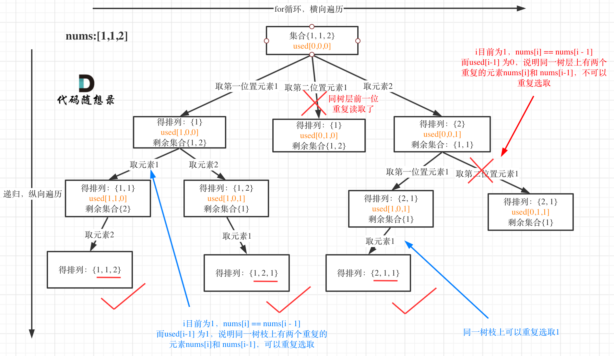

图中我们对同一树层，前一位（也就是`nums[i-1]`）如果使用过，那么就进行去重。

**一般来说：组合问题和排列问题是在树形结构的叶子节点上收集结果，而子集问题就是取树上所有节点的结果**。

在[46.全排列](https://programmercarl.com/0046.%E5%85%A8%E6%8E%92%E5%88%97.html)中已经详细讲解了排列问题的写法，在[40.组合总和II](https://programmercarl.com/0040.%E7%BB%84%E5%90%88%E6%80%BB%E5%92%8CII.html) 、[90.子集II](https://programmercarl.com/0090.%E5%AD%90%E9%9B%86II.html)中详细讲解了去重的写法，所以这次我就不用回溯三部曲分析了，直接给出代码，如下：

```cpp
class Solution {
private:
    vector<vector<int>> result;
    vector<int> path;
    void backtracking (vector<int>& nums, vector<bool>& used) {
        // 此时说明找到了一组
        if (path.size() == nums.size()) {
            result.push_back(path);
            return;
        }
        for (int i = 0; i < nums.size(); i++) {
            // used[i - 1] == true，说明同一树枝nums[i - 1]使用过
            // used[i - 1] == false，说明同一树层nums[i - 1]使用过
            // 如果同一树层nums[i - 1]使用过则直接跳过
            if (i > 0 && nums[i] == nums[i - 1] && used[i - 1] == false) {
                continue;
            }
            if (used[i] == false) {
                used[i] = true;
                path.push_back(nums[i]);
                backtracking(nums, used);
                path.pop_back();
                used[i] = false;
            }
        }
    }
public:
    vector<vector<int>> permuteUnique(vector<int>& nums) {
        result.clear();
        path.clear();
        sort(nums.begin(), nums.end()); // 排序
        vector<bool> used(nums.size(), false);
        backtracking(nums, used);
        return result;
    }
};
// 时间复杂度: 最差情况所有元素都是唯一的。复杂度和全排列1都是 O(n! * n) 对于 n 个元素一共有 n! 中排
列方案。而对于每一个答案，我们需要 O(n) 去复制最终放到 result 数组
// 空间复杂度: O(n) 回溯树的深度取决于我们有多少个元素
```

- 时间复杂度`: O(n! * n)`
- 空间复杂度`: O(n)`

## 拓展

大家发现，去重最为关键的代码为：

```cpp
if (i > 0 && nums[i] == nums[i - 1] && used[i - 1] == false) {
    continue;
}
如果改成 used[i - 1] == true ， 也是正确的!，去重代码如下：
if (i > 0 && nums[i] == nums[i - 1] && used[i - 1] == true) {
    continue;
}
这是为什么呢，就是上面我刚说的，如果要对树层中前一位去重，就用used[i - 1] == false ，如果要对树枝
前一位去重用used[i - 1] == true 。
```

**对于排列问题，树层上去重和树枝上去重，都是可以的，但是树层上去重效率更高！**

这么说是不是有点抽象？

来来来，我就用输入`: [1,1,1]` 来举一个例子。

树层上去重`(used[i - 1] == false)`，的树形结构如下：

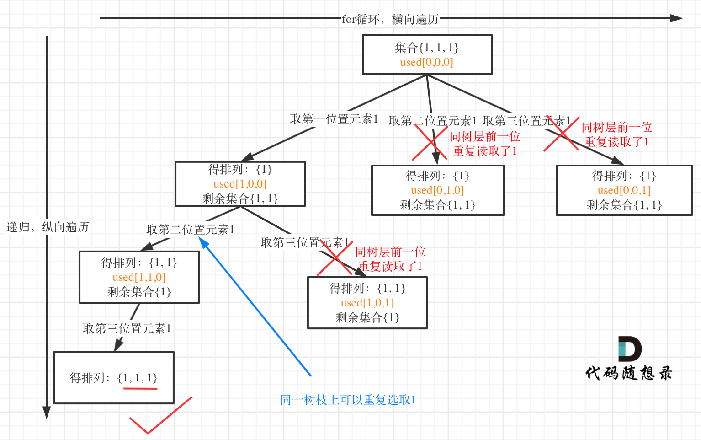

树枝上去重（`used[i - 1] == true`）的树型结构如下：

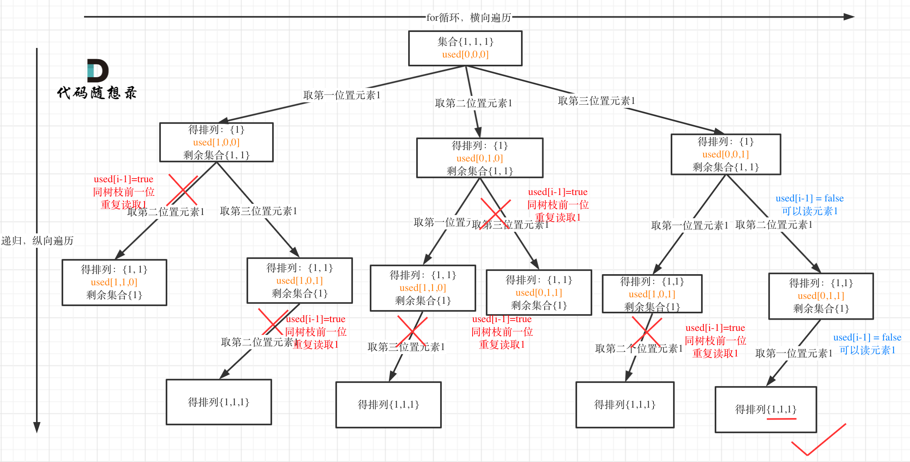

大家应该很清晰的看到，树层上对前一位去重非常彻底，效率很高，树枝上对前一位去重虽然最后可以得到答案，但是做了很多无用搜索。

## 总结

这道题其实还是用了我们之前讲过的去重思路，但有意思的是，去重的代码中，这么写：

```cpp
if (i > 0 && nums[i] == nums[i - 1] && used[i - 1] == false) {
    continue;
}
```

和这么写：

```cpp
if (i > 0 && nums[i] == nums[i - 1] && used[i - 1] == true) {
    continue;
}
都是可以的，这也是很多同学做这道题目困惑的地方，知道used[i - 1] == false 也行而used[i - 1] ==
true 也行，但是就想不明白为啥。
```

所以我通过举`[1,1,1]`的例子，把这两个去重的逻辑分别抽象成树形结构，大家可以一目了然：为什么两种写法都可以以及哪一种效率更高！

```text
这里可能大家又有疑惑，既然 used[i - 1] == false 也行而used[i - 1] == true 也行，那为什么还要写这
```

个条件呢？ 

直接这样写 不就完事了？ 

```cpp
if (i > 0 && nums[i] == nums[i - 1]) {
    continue;
}
其实并不行，一定要加上  used[i - 1] == false 或者used[i - 1] == true ，因为 used[i - 1] 要一直是
```

true 或者一直是false 才可以，而不是 一会是true 一会又是false。 所以这个条件要写上。

是不是豁然开朗了！！

# 17. 本周小结！（回溯算法系列三）

## 周一

在[回溯算法：求子集问题（二）](https://programmercarl.com/0090.%E5%AD%90%E9%9B%86II.html)中，开始针对子集问题进行去重。

本题就是[回溯算法：求子集问题！](https://programmercarl.com/0078.%E5%AD%90%E9%9B%86.html)的基础上加上了去重，去重我们在[回溯算法：求组合总和（三）](https://programmercarl.com/0040.%E7%BB%84%E5%90%88%E6%80%BB%E5%92%8CII.html)也讲过了。

所以本题对大家应该并不难。

树形结构如下：

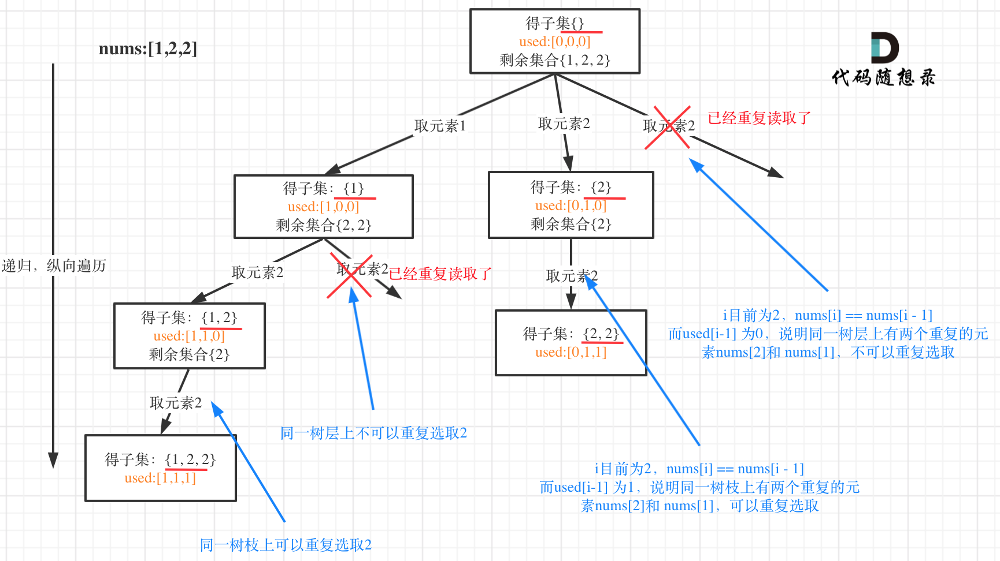

## 周二

在[回溯算法：递增子序列](https://programmercarl.com/0491.%E9%80%92%E5%A2%9E%E5%AD%90%E5%BA%8F%E5%88%97.html)中，处处都能看到子集的身影，但处处是陷阱，值得好好琢磨琢磨！

树形结构如下：

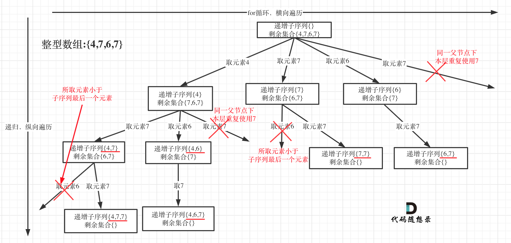

[回溯算法：递增子序列](https://programmercarl.com/0491.%E9%80%92%E5%A2%9E%E5%AD%90%E5%BA%8F%E5%88%97.html)留言区大家有很多疑问，主要还是和[回溯算法：求子集问题（二）](https://programmercarl.com/0090.%E5%AD%90%E9%9B%86II.html)混合在了一起。

详细在[本周小结！（回溯算法系列三）续集](https://mp.weixin.qq.com/s/kSMGHc_YpsqL2j-jb_E_Ag)中给出了介绍！

## 周三

我们已经分析了组合问题，分割问题，子集问题，那么[回溯算法：排列问题！](https://programmercarl.com/0046.%E5%85%A8%E6%8E%92%E5%88%97.html) 又不一样了。

排列是有序的，也就是说`[1,2]` 和`[2,1]` 是两个集合，这和之前分析的子集以及组合所不同的地方。

可以看出元素1在`[1,2]`中已经使用过了，但是在`[2,1]`中还要在使用一次1，所以处理排列问题就不用使用startIndex了。

如图：

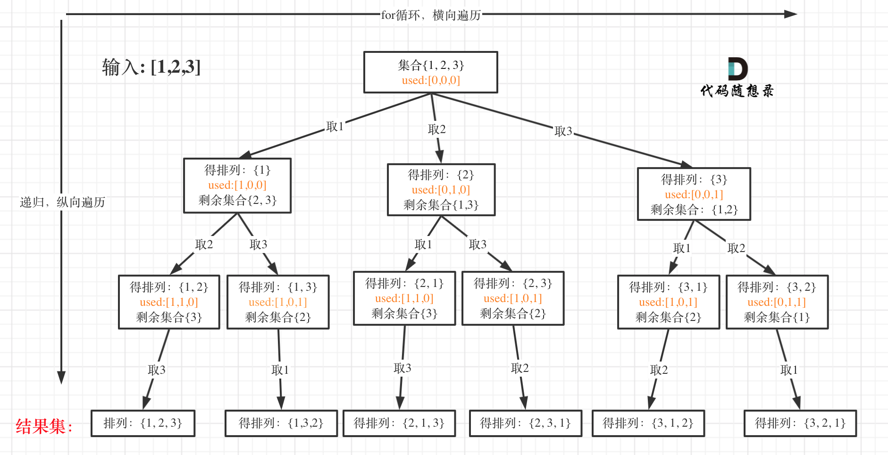

**大家此时可以感受出排列问题的不同：**

- 每层都是从0开始搜索而不是startIndex
- 需要used数组记录path里都放了哪些元素了

## 周四

排列问题也要去重了，在[回溯算法：排列问题（二）](https://programmercarl.com/0047.%E5%85%A8%E6%8E%92%E5%88%97II.html)中又一次强调了“树层去重”和“树枝去重”。

树形结构如下：

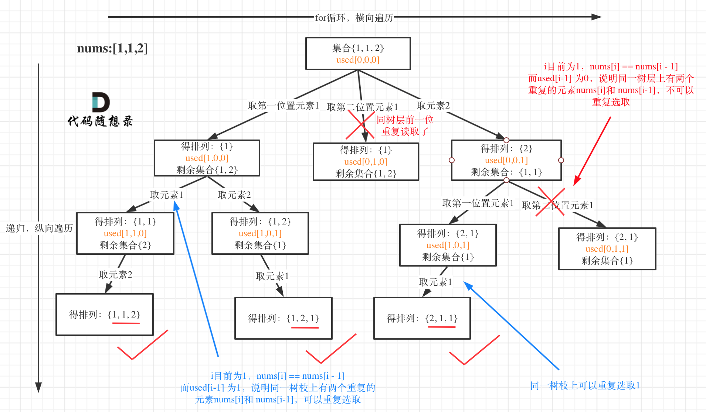

**这道题目神奇的地方就是used[i - 1] == false也可以，used[i - 1] == true也可以！**

我就用输入`: [1,1,1]` 来举一个例子。

树层上去重`(used[i - 1] == false)`，的树形结构如下：

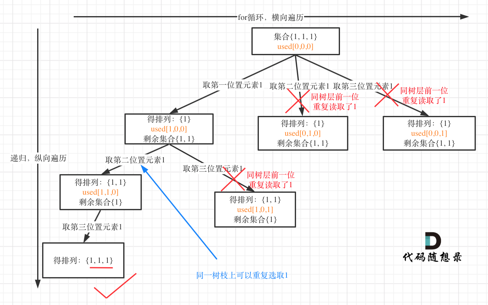

树枝上去重（`used[i - 1] == true`）的树型结构如下：

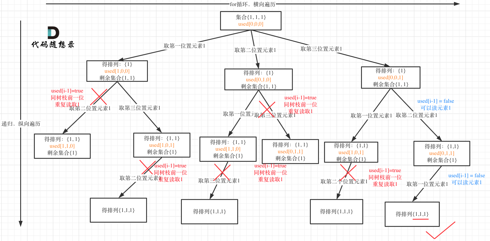

**可以清晰的看到使用(used[i - 1] == false)，即树层去重，效率更高！**

## 性能分析

之前并没有分析各个问题的时间复杂度和空间复杂度，这次来说一说。

这块网上的资料鱼龙混杂，一些所谓的经典面试书籍根本不讲回溯算法，算法书籍对这块也避而不谈，感觉就像是算法里模糊的边界。

**所以这块就说一说我个人理解，对内容持开放态度，集思广益，欢迎大家来讨论！**

子集问题分析：

- 时间复杂度：`$O(n × 2^n)$`，因为每一个元素的状态无外乎取与不取，所以时间复杂度为`$O(2^n)$`，构造每一组子集都需要填进数组，又有需要`$O(n)$`，最终时间复杂度：`$O(n × 2^n)$`。
- 空间复杂度：`$O(n)$`，递归深度为n，所以系统栈所用空间为`$O(n)$`，每一层递归所用的空间都是常数级别，注意代码里的result和path都是全局变量，就算是放在参数里，传的也是引用，并不会新申请内存空间，最终空间复杂度为`$O(n)$`。

排列问题分析：

- 时间复杂度：`$O(n!)$`，这个可以从排列的树形图中很明显发现，每一层节点为n，第二层每一个分支都延伸了n-1个分支，再往下又是n-2个分支，所以一直到叶子节点一共就是 `n * n-1 * n-2 * ..... 1 = n!`。每个叶子节

```text
点都会有一个构造全排列填进数组的操作（对应的代码：result.push_back(path) ），该操作的复杂度为
```

`$O(n)$`。所以，最终时间复杂度为：n * n!，简化为`$O(n!)$`。

- 空间复杂度：`$O(n)$`，和子集问题同理。

组合问题分析：

- 时间复杂度：`$O(n × 2^n)$`，组合问题其实就是一种子集的问题，所以组合问题最坏的情况，也不会超过子集问题的时间复杂度。
- 空间复杂度：`$O(n)$`，和子集问题同理。

**一般说道回溯算法的复杂度，都说是指数级别的时间复杂度，这也算是一个概括吧！**

## 总结

本周我们对[子集问题进行了去重](https://programmercarl.com/0090.%E5%AD%90%E9%9B%86II.html)，然后介绍了和子集问题非常像的[递增子序列](https://programmercarl.com/0491.%E9%80%92%E5%A2%9E%E5%AD%90%E5%BA%8F%E5%88%97.html)，如果还保持惯性思维，这道题就可以掉坑里。

接着介绍了[排列问题！](https://programmercarl.com/0046.%E5%85%A8%E6%8E%92%E5%88%97.html)，以及对[排列问题如何进行去重](https://programmercarl.com/0047.%E5%85%A8%E6%8E%92%E5%88%97II.html)。

最后我补充了子集问题，排列问题和组合问题的性能分析，给大家提供了回溯算法复杂度的分析思路。

# 18. 回溯算法去重问题的另一种写法

在 [本周小结！（回溯算法系列三）](https://programmercarl.com/%E5%91%A8%E6%80%BB%E7%BB%93/20201112%E5%9B%9E%E6%BA%AF%E5%91%A8%E6%9C%AB%E6%80%BB%E7%BB%93.html) 中一位录友对 整棵树的本层和同一节点的本层有疑问，也让我重新思考了一下，发现这里确实有问题，所以专门写一篇来纠正，感谢录友们的积极交流哈！

接下来我再把这块再讲一下。

在[回溯算法：求子集问题（二）](https://programmercarl.com/0090.%E5%AD%90%E9%9B%86II.html)中的去重和 [回溯算法：递增子序列](https://programmercarl.com/0491.%E9%80%92%E5%A2%9E%E5%AD%90%E5%BA%8F%E5%88%97.html)中的去重 都是 同一父节点下本层的去重。

[回溯算法：求子集问题（二）](https://programmercarl.com/0090.%E5%AD%90%E9%9B%86II.html)也可以使用set针对同一父节点本层去重，但子集问题一定要排序，为什么呢？

我用没有排序的集合`{2,1,2,2}`来举例子画一个图，如图：

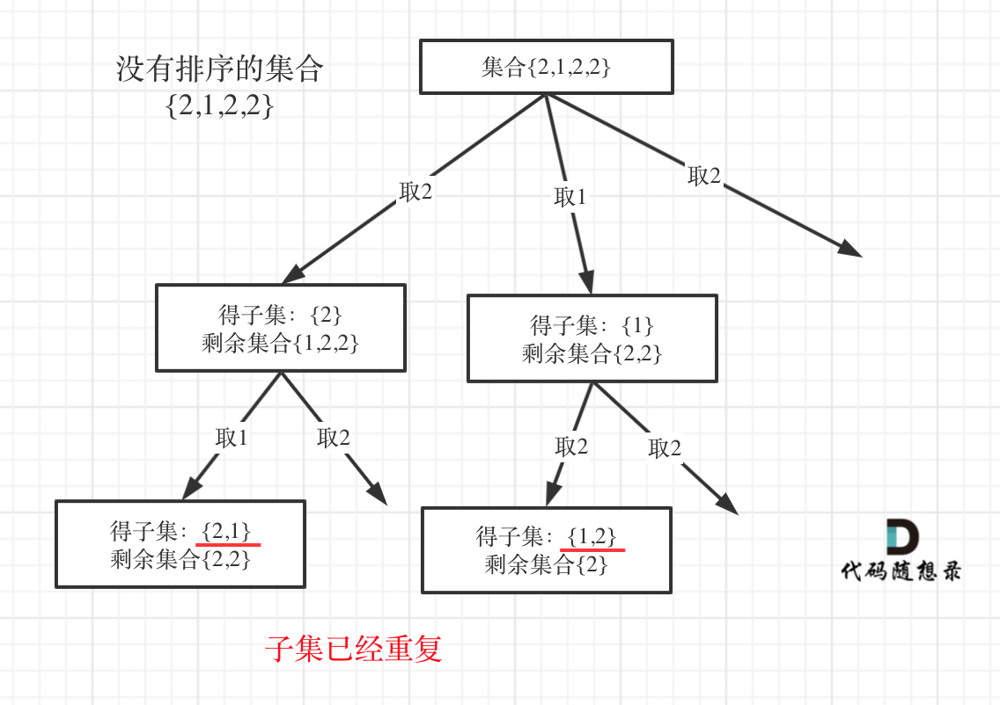

图中，大家就很明显的看到，子集重复了。

那么下面我针对[回溯算法：求子集问题（二）](https://programmercarl.com/0090.%E5%AD%90%E9%9B%86II.html) 给出使用set来对本层去重的代码实现。

## 子集II

used数组去重版本： [回溯算法：求子集问题（二）](https://programmercarl.com/0090.%E5%AD%90%E9%9B%86II.html)

使用set去重的版本如下：

```cpp
class Solution {
private:
    vector<vector<int>> result;
    vector<int> path;
    void backtracking(vector<int>& nums, int startIndex, vector<bool>& used) {
        result.push_back(path);
        unordered_set<int> uset; // 定义set对同一节点下的本层去重
        for (int i = startIndex; i < nums.size(); i++) {
            if (uset.find(nums[i]) != uset.end()) { // 如果发现出现过就pass
                continue;
            }
            uset.insert(nums[i]); // set跟新元素
            path.push_back(nums[i]);
            backtracking(nums, i + 1, used);
            path.pop_back();
        }
    }
public:
    vector<vector<int>> subsetsWithDup(vector<int>& nums) {
        result.clear();
        path.clear();
        vector<bool> used(nums.size(), false);
        sort(nums.begin(), nums.end()); // 去重需要排序
        backtracking(nums, 0, used);
        return result;
    }
};
```

针对留言区录友们的疑问，我再补充一些常见的错误写法，

### 错误写法一

把uset定义放到类成员位置，然后模拟回溯的样子 insert一次，erase一次。

例如：

```cpp
class Solution {
private:
    vector<vector<int>> result;
    vector<int> path;
    unordered_set<int> uset; // 把uset定义放到类成员位置
    void backtracking(vector<int>& nums, int startIndex, vector<bool>& used) {
        result.push_back(path);
        for (int i = startIndex; i < nums.size(); i++) {
            if (uset.find(nums[i]) != uset.end()) {
                continue;
            }
            uset.insert(nums[i]);   // 递归之前insert
            path.push_back(nums[i]);
            backtracking(nums, i + 1, used);
            path.pop_back();
            uset.erase(nums[i]);    // 回溯再erase
        }
    }
```

在树形结构中，**如果把unordered_set uset放在类成员的位置（相当于全局变量），就把树枝的情况都记录了，** **不是单纯的控制某一节点下的同一层了**。

如图：

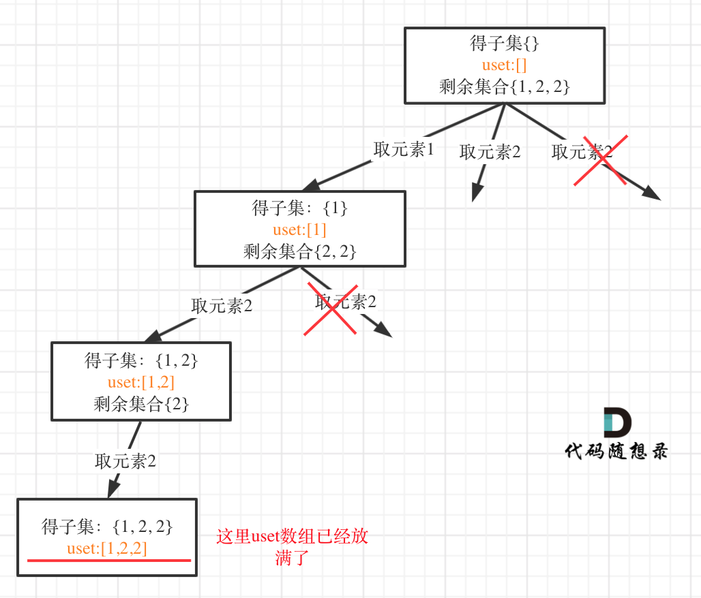

可以看出一旦把unordered_set uset放在类成员位置，它控制的就是整棵树，包括树枝。

**所以这么写不行！**

### 错误写法二

有同学把 `unordered_set uset;` 放到类成员位置，然后每次进入单层的时候用`uset.clear()`。

代码如下：

```cpp
class Solution {
private:
    vector<vector<int>> result;
    vector<int> path;
    unordered_set<int> uset; // 把uset定义放到类成员位置
    void backtracking(vector<int>& nums, int startIndex, vector<bool>& used) {
        result.push_back(path);
        uset.clear(); // 到每一层的时候，清空uset
        for (int i = startIndex; i < nums.size(); i++) {
            if (uset.find(nums[i]) != uset.end()) {
                continue;
            }
            uset.insert(nums[i]); // set记录元素
            path.push_back(nums[i]);
            backtracking(nums, i + 1, used);
            path.pop_back();
        }
    }
```

uset已经是全局变量，本层的uset记录了一个元素，然后进入下一层之后这个uset（和上一层是同一个uset）就被清空了，也就是说，层与层之间的uset是同一个，那么就会相互影响。

**所以这么写依然不行！**

**组合问题和排列问题，其实也可以使用set来对同一节点下本层去重，下面我都分别给出实现代码**。

## 组合总和 II

使用used数组去重版本：[回溯算法：求组合总和（三）](https://programmercarl.com/0040.%E7%BB%84%E5%90%88%E6%80%BB%E5%92%8CII.html)

使用set去重的版本如下：

```cpp
class Solution {
private:
    vector<vector<int>> result;
    vector<int> path;
    void backtracking(vector<int>& candidates, int target, int sum, int startIndex) {
        if (sum == target) {
            result.push_back(path);
            return;
        }
        unordered_set<int> uset; // 控制某一节点下的同一层元素不能重复
        for (int i = startIndex; i < candidates.size() && sum + candidates[i] <=
target; i++) {
            if (uset.find(candidates[i]) != uset.end()) {
                continue;
            }
            uset.insert(candidates[i]); // 记录元素
            sum += candidates[i];
            path.push_back(candidates[i]);
            backtracking(candidates, target, sum, i + 1);
            sum -= candidates[i];
            path.pop_back();
        }
    }
public:
    vector<vector<int>> combinationSum2(vector<int>& candidates, int target) {
        path.clear();
        result.clear();
        sort(candidates.begin(), candidates.end());
        backtracking(candidates, target, 0, 0);
        return result;
    }
};
```

## 全排列 II

使用used数组去重版本：[回溯算法：排列问题（二）](https://programmercarl.com/0047.%E5%85%A8%E6%8E%92%E5%88%97II.html)

使用set去重的版本如下：

```cpp
class Solution {
private:
    vector<vector<int>> result;
    vector<int> path;
    void backtracking (vector<int>& nums, vector<bool>& used) {
        if (path.size() == nums.size()) {
            result.push_back(path);
            return;
        }
        unordered_set<int> uset; // 控制某一节点下的同一层元素不能重复
        for (int i = 0; i < nums.size(); i++) {
            if (uset.find(nums[i]) != uset.end()) {
                continue;
            }
            if (used[i] == false) {
                uset.insert(nums[i]); // 记录元素
                used[i] = true;
                path.push_back(nums[i]);
                backtracking(nums, used);
                path.pop_back();
                used[i] = false;
            }
        }
    }
public:
    vector<vector<int>> permuteUnique(vector<int>& nums) {
        result.clear();
        path.clear();
        sort(nums.begin(), nums.end()); // 排序
        vector<bool> used(nums.size(), false);
        backtracking(nums, used);
        return result;
    }
};
```

## 两种写法的性能分析

需要注意的是：**使用set去重的版本相对于used数组的版本效率都要低很多**，大家在leetcode上提交，能明显发现。

原因在[回溯算法：递增子序列](https://programmercarl.com/0491.%E9%80%92%E5%A2%9E%E5%AD%90%E5%BA%8F%E5%88%97.html)中也分析过，主要是因为程序运行的时候对unordered_set 频繁的insert，unordered_set需要做哈希映射（也就是把key通过hash function映射为唯一的哈希值）相对费时间，而且insert的时候其底层的符号表也要做相应的扩充，也是费时的。

**而使用used数组在时间复杂度上几乎没有额外负担！**

**使用set去重，不仅时间复杂度高了，空间复杂度也高了**，在[本周小结！（回溯算法系列三）](https://programmercarl.com/%E5%91%A8%E6%80%BB%E7%BB%93/20201112%E5%9B%9E%E6%BA%AF%E5%91%A8%E6%9C%AB%E6%80%BB%E7%BB%93.html)中分析过，组合，子集，排列问题的空间复杂度都是`O(n)`，但如果使用set去重，空间复杂度就变成了`O(n^2)`，因为每一层递归都有一个set集合，系统栈空间是n，每一个空间都有set集合。

那有同学可能疑惑 用used数组也是占用`O(n)`的空间啊？

used数组可是全局变量，每层与每层之间公用一个used数组，所以空间复杂度是`O(n + n)`，最终空间复杂度还是`O(n)`。

## 总结

本篇本打算是对[本周小结！（回溯算法系列三）](https://programmercarl.com/%E5%91%A8%E6%80%BB%E7%BB%93/20201112%E5%9B%9E%E6%BA%AF%E5%91%A8%E6%9C%AB%E6%80%BB%E7%BB%93.html)的一个点做一下纠正，没想到又写出来这么多！

**这个点都源于一位录友的疑问，然后我思考总结了一下，就写着这一篇，所以还是得多交流啊！**

如果大家对「代码随想录」文章有什么疑问，尽管打卡留言的时候提出来哈，或者在交流群里提问。

**其实这就是相互学习的过程，交流一波之后都对题目理解的更深刻了，我如果发现文中有问题，都会在评论区或者** **下一篇文章中即时修正，保证不会给大家带跑偏！**

这也可以用回溯法？ 其实深搜和回溯也是相辅相成的，毕竟都用递归。

# 19.重新安排行程

[力扣题目链接](https://leetcode.cn/problems/reconstruct-itinerary/)

给定一个机票的字符串二维数组 `[from, to]`，子数组中的两个成员分别表示飞机出发和降落的机场地点，对该行程进行重新规划排序。所有这些机票都属于一个从 JFK（肯尼迪国际机场）出发的先生，所以该行程必须从 JFK 开始。

提示：

- 如果存在多种有效的行程，请你按字符自然排序返回最小的行程组合。例如，行程 `["JFK", "LGA"]` 与 `["JFK",` `"LGB"]` 相比就更小，排序更靠前
- 所有的机场都用三个大写字母表示（机场代码）。
- 假定所有机票至少存在一种合理的行程。
- 所有的机票必须都用一次 且 只能用一次。

示例 1：

- 输入：`[["MUC", "LHR"], ["JFK", "MUC"], ["SFO", "SJC"], ["LHR", "SFO"]]`
- 输出：`["JFK", "MUC", "LHR", "SFO", "SJC"]`

示例 2：

- 输入：`[["JFK","SFO"],["JFK","ATL"],["SFO","ATL"],["ATL","JFK"],["ATL","SFO"]]`
- 输出：`["JFK","ATL","JFK","SFO","ATL","SFO"]`
- 解释：另一种有效的行程是 `["JFK","SFO","ATL","JFK","ATL","SFO"]`。但是它自然排序更大更靠后。

## 算法公开课

[**《代码随想录》算法视频公开课**](https://programmercarl.com/other/gongkaike.html)**：**[**带你学透回溯算法（理论篇）**](https://www.bilibili.com/video/BV1cy4y167mM/)  **，相信结合视频再看本篇题解，更有助于大家对** **本题的理解。**

## 思路

这道题目还是很难的，之前我们用回溯法解决了如下问题：[组合问题](https://programmercarl.com/0077.%E7%BB%84%E5%90%88.html)，[分割问题](https://programmercarl.com/0093.%E5%A4%8D%E5%8E%9FIP%E5%9C%B0%E5%9D%80.html)，[子集问题](https://programmercarl.com/0078.%E5%AD%90%E9%9B%86.html)，[排列问题](https://programmercarl.com/0046.%E5%85%A8%E6%8E%92%E5%88%97.html)。

直觉上来看 这道题和回溯法没有什么关系，更像是图论中的深度优先搜索。

实际上确实是深搜，但这是深搜中使用了回溯的例子，在查找路径的时候，如果不回溯，怎么能查到目标路径呢。

所以我倾向于说本题应该使用回溯法，那么我也用回溯法的思路来讲解本题，其实深搜一般都使用了回溯法的思路，在图论系列中我会再详细讲解深搜。

**这里就是先给大家拓展一下，原来回溯法还可以这么玩！**

**这道题目有几个难点：**

1. 一个行程中，如果航班处理不好容易变成一个圈，成为死循环2. 有多种解法，字母序靠前排在前面，让很多同学望而退步，如何该记录映射关系呢 ？3. 使用回溯法（也可以说深搜） 的话，那么终止条件是什么呢？4. 搜索的过程中，如何遍历一个机场所对应的所有机场。

针对以上问题我来逐一解答！

### 如何理解死循环

对于死循环，我来举一个有重复机场的例子：

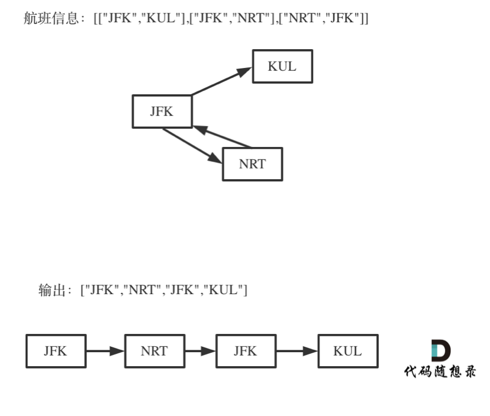

为什么要举这个例子呢，就是告诉大家，出发机场和到达机场也会重复的，**如果在解题的过程中没有对集合元素处** **理好，就会死循环。**

### 该记录映射关系

有多种解法，字母序靠前排在前面，让很多同学望而退步，如何该记录映射关系呢 ？

一个机场映射多个机场，机场之间要靠字母序排列，一个机场映射多个机场，可以使用`std::unordered_map`，如果让多个机场之间再有顺序的话，就是用`std::map` 或者`std::multimap` 或者 `std::multiset`。

如果对map 和 set 的实现机制不太了解，也不清楚为什么 map、multimap就是有序的同学，可以看这篇文章关于哈希表，你该了解这些！。

```cpp
这样存放映射关系可以定义为 unordered_map<string, multiset<string>> targets 或者
unordered_map<string, map<string, int>> targets 。
```

含义如下：

`unordered_map<string, multiset> targets`：`unordered_map<`出发机场, 到达机场的集合`> targets`

`unordered_map<string, map<string, int>> targets`：`unordered_map<`出发机场`, map<`到达机场, 航班次数`>>` targets

```text
这两个结构，我选择了后者，因为如果使用unordered_map<string, multiset<string>> targets 遍历
```

multiset的时候，不能删除元素，一旦删除元素，迭代器就失效了。

**再说一下为什么一定要增删元素呢，正如开篇我给出的图中所示，出发机场和到达机场是会重复的，搜索的过程没** **及时删除目的机场就会死循环。**

```cpp
所以搜索的过程中就是要不断的删multiset里的元素，那么推荐使用unordered_map<string, map<string,
int>> targets 。
在遍历 unordered_map<出发机场, map<到达机场, 航班次数>> targets 的过程中，可以使用"航班次数"这个字
```

**段的数字做相应的增减，来标记到达机场是否使用过了。**

如果“航班次数”大于零，说明目的地还可以飞，如果“航班次数”等于零说明目的地不能飞了，而不用对集合做删除元素或者增加元素的操作。

**相当于说我不删，我就做一个标记！**

### 回溯法

这道题目我使用回溯法，那么下面按照我总结的回溯模板来：

```cpp
void backtracking(参数) {
    if (终止条件) {
        存放结果;
        return;
    }
    for (选择：本层集合中元素（树中节点孩子的数量就是集合的大小）) {
        处理节点;
        backtracking(路径，选择列表); // 递归
        回溯，撤销处理结果
    }
}
```

本题以输入：`[["JFK", "KUL"], ["JFK", "NRT"], ["NRT", "JFK"]`为例，抽象为树形结构如下：

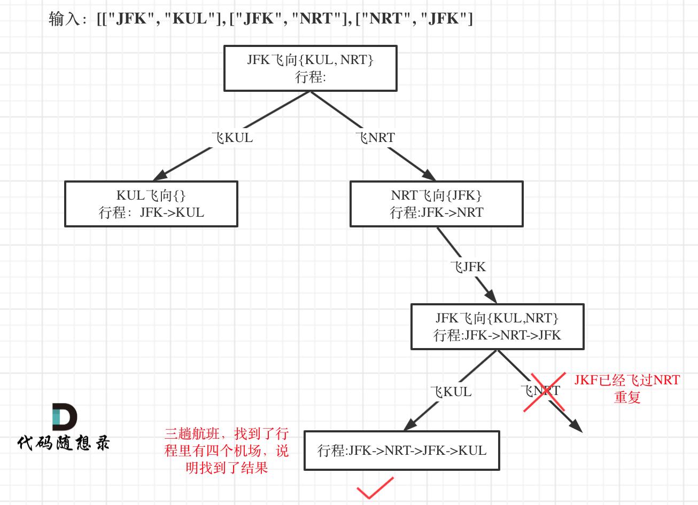

开始回溯三部曲讲解：

- 递归函数参数

```cpp
在讲解映射关系的时候，已经讲过了，使用unordered_map<string, map<string, int>> targets; 来记录
```

航班的映射关系，我定义为全局变量。

当然把参数放进函数里传进去也是可以的，我是尽量控制函数里参数的长度。

参数里还需要ticketNum，表示有多少个航班（终止条件会用上）。

代码如下：

```cpp
// unordered_map<出发机场, map<到达机场, 航班次数>> targets
unordered_map<string, map<string, int>> targets;
bool backtracking(int ticketNum, vector<string>& result) {
```

**注意函数返回值我用的是bool！**

我们之前讲解回溯算法的时候，一般函数返回值都是void，这次为什么是bool呢？

因为我们只需要找到一个行程，就是在树形结构中唯一的一条通向叶子节点的路线，如图：


所以找到了这个叶子节点了直接返回，这个递归函数的返回值问题我们在讲解二叉树的系列的时候，在这篇二叉树：递归函数究竟什么时候需要返回值，什么时候不要返回值？详细介绍过。

当然本题的targets和result都需要初始化，代码如下：

```cpp
for (const vector<string>& vec : tickets) {
    targets[vec[0]][vec[1]]++; // 记录映射关系
}
result.push_back("JFK"); // 起始机场
```

- 递归终止条件

拿题目中的示例为例，输入`: [["MUC", "LHR"], ["JFK", "MUC"], ["SFO", "SJC"], ["LHR", "SFO"]]` ，这是有4个航班，那么只要找出一种行程，行程里的机场个数是5就可以了。

所以终止条件是：我们回溯遍历的过程中，遇到的机场个数，如果达到了（航班数量+1），那么我们就找到了一个行程，把所有航班串在一起了。

代码如下：

```cpp
if (result.size() == ticketNum + 1) {
    return true;
}
```

已经看习惯回溯法代码的同学，到叶子节点了习惯性的想要收集结果，但发现并不需要，本题的result相当于 回溯算法：求组合总和！中的path，也就是本题的result就是记录路径的（就一条），在如下单层搜索的逻辑中result就添加元素了。

- 单层搜索的逻辑

回溯的过程中，如何遍历一个机场所对应的所有机场呢？

```text
这里刚刚说过，在选择映射函数的时候，不能选择unordered_map<string, multiset<string>> targets ，
```

因为一旦有元素增删multiset的迭代器就会失效，当然可能有牛逼的容器删除元素迭代器不会失效，这里就不在讨论了。

**可以说本题既要找到一个对数据进行排序的容器，而且还要容易增删元素，迭代器还不能失效**。

```cpp
所以我选择了unordered_map<string, map<string, int>> targets 来做机场之间的映射。
```

遍历过程如下：

```cpp
for (pair<const string, int>& target : targets[result[result.size() - 1]]) {
    if (target.second > 0 ) { // 记录到达机场是否飞过了
        result.push_back(target.first);
        target.second--;
        if (backtracking(ticketNum, result)) return true;
        result.pop_back();
        target.second++;
    }
}
可以看出 通过unordered_map<string, map<string, int>> targets 里的int字段来判断 这个集合里的机场是
```

否使用过，这样避免了直接去删元素。

分析完毕，此时完整`C++`代码如下：

```cpp
class Solution {
private:
// unordered_map<出发机场, map<到达机场, 航班次数>> targets
unordered_map<string, map<string, int>> targets;
bool backtracking(int ticketNum, vector<string>& result) {
    if (result.size() == ticketNum + 1) {
        return true;
    }
    for (pair<const string, int>& target : targets[result[result.size() - 1]]) {
        if (target.second > 0 ) { // 记录到达机场是否飞过了
            result.push_back(target.first);
            target.second--;
            if (backtracking(ticketNum, result)) return true;
            result.pop_back();
            target.second++;
        }
    }
    return false;
}
public:
    vector<string> findItinerary(vector<vector<string>>& tickets) {
        targets.clear();
        vector<string> result;
        for (const vector<string>& vec : tickets) {
            targets[vec[0]][vec[1]]++; // 记录映射关系
        }
        result.push_back("JFK"); // 起始机场
        backtracking(tickets.size(), result);
        return result;
    }
};
```

一波分析之后，可以看出我就是按照回溯算法的模板来的。

代码中

```cpp
for (pair<const string, int>& target : targets[result[result.size() - 1]])
pair里要有const，因为map中的key是不可修改的，所以是pair<const string, int> 。
```

如果不加const，也可以复制一份pair，例如这么写：

```cpp
for (pair<string, int>target : targets[result[result.size() - 1]])
```

## 总结

本题其实可以算是一道hard的题目了，关于本题的难点我在文中已经列出了。

**如果单纯的回溯搜索（深搜）并不难，难还难在容器的选择和使用上**。

本题其实是一道深度优先搜索的题目，但是我完全使用回溯法的思路来讲解这道题题目，**算是给大家拓展一下思维** **方式，其实深搜和回溯也是分不开的，毕竟最终都是用递归**。

如果最终代码，发现照着回溯法模板画的话好像也能画出来，但难就难如何知道可以使用回溯，以及如果套进去，所以我再写了这么长的一篇来详细讲解。

就酱，很多录友表示和「代码随想录」相见恨晚，那么帮Carl宣传一波吧，让更多同学知道这里！

# 20. N皇后

[力扣题目链接](https://leetcode.cn/problems/n-queens/)

n 皇后问题 研究的是如何将 n 个皇后放置在 n×n 的棋盘上，并且使皇后彼此之间不能相互攻击。

给你一个整数 n ，返回所有不同的 n 皇后问题 的解决方案。

每一种解法包含一个不同的 n 皇后问题 的棋子放置方案，该方案中 'Q' 和 '.' 分别代表了皇后和空位。

示例 1：

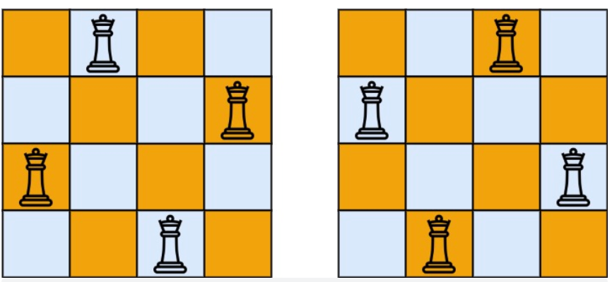

- 输入：`n = 4`
- 输出：`[[".Q..","...Q","Q...","..Q."],["..Q.","Q...","...Q",".Q.."]]`
- 解释：如上图所示，4 皇后问题存在两个不同的解法。

示例 2：

- 输入：`n = 1`
- 输出：`[["Q"]]`

## 算法公开课

[**《代码随想录》算法视频公开课**](https://programmercarl.com/other/gongkaike.html)**：**[**这就是传说中的N皇后？ 回溯算法安排！| LeetCode：51.N皇后**](https://www.bilibili.com/video/BV1Rd4y1c7Bq/)**，相信结合视** **频再看本篇题解，更有助于大家对本题的理解**。

## 思路

都知道n皇后问题是回溯算法解决的经典问题，但是用回溯解决多了组合、切割、子集、排列问题之后，遇到这种二维矩阵还会有点不知所措。

首先来看一下皇后们的约束条件：

1. 不能同行2. 不能同列3. 不能同斜线

确定完约束条件，来看看究竟要怎么去搜索皇后们的位置，其实搜索皇后的位置，可以抽象为一棵树。

下面我用一个 3 * 3 的棋盘，将搜索过程抽象为一棵树，如图：

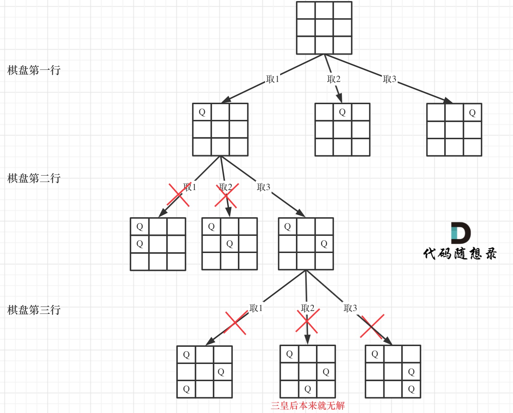

从图中，可以看出，二维矩阵中矩阵的高就是这棵树的高度，矩阵的宽就是树形结构中每一个节点的宽度。

那么我们用皇后们的约束条件，来回溯搜索这棵树，**只要搜索到了树的叶子节点，说明就找到了皇后们的合理位置** **了**。

### 回溯三部曲

按照我总结的如下回溯模板，我们来依次分析：

```cpp
void backtracking(参数) {
    if (终止条件) {
        存放结果;
        return;
    }
    for (选择：本层集合中元素（树中节点孩子的数量就是集合的大小）) {
        处理节点;
        backtracking(路径，选择列表); // 递归
        回溯，撤销处理结果
    }
}
```

- 递归函数参数

我依然是定义全局变量二维数组result来记录最终结果。

参数n是棋盘的大小，然后用row来记录当前遍历到棋盘的第几层了。

代码如下：

```cpp
vector<vector<string>> result;
void backtracking(int n, int row, vector<string>& chessboard) {
```

- 递归终止条件

在如下树形结构中：


可以看出，当递归到棋盘最底层（也就是叶子节点）的时候，就可以收集结果并返回了。

代码如下：

```cpp
if (row == n) {
    result.push_back(chessboard);
    return;
}
```

- 单层搜索的逻辑

递归深度就是row控制棋盘的行，每一层里for循环的col控制棋盘的列，一行一列，确定了放置皇后的位置。

每次都是要从新的一行的起始位置开始搜，所以都是从0开始。

代码如下：

```cpp
for (int col = 0; col < n; col++) {
    if (isValid(row, col, chessboard, n)) { // 验证合法就可以放
        chessboard[row][col] = 'Q'; // 放置皇后
        backtracking(n, row + 1, chessboard);
        chessboard[row][col] = '.'; // 回溯，撤销皇后
    }
}
```

- 验证棋盘是否合法

按照如下标准去重：

1. 不能同行2. 不能同列3. 不能同斜线 （45度和135度角）

代码如下：

```cpp
bool isValid(int row, int col, vector<string>& chessboard, int n) {
    // 检查列
    for (int i = 0; i < row; i++) { // 这是一个剪枝
        if (chessboard[i][col] == 'Q') {
            return false;
        }
    }
    // 检查 45度角是否有皇后
    for (int i = row - 1, j = col - 1; i >=0 && j >= 0; i--, j--) {
        if (chessboard[i][j] == 'Q') {
            return false;
        }
    }
    // 检查 135度角是否有皇后
    for(int i = row - 1, j = col + 1; i >= 0 && j < n; i--, j++) {
        if (chessboard[i][j] == 'Q') {
            return false;
        }
    }
    return true;
}
```

在这份代码中，细心的同学可以发现为什么没有在同行进行检查呢？

因为在单层搜索的过程中，每一层递归，只会选for循环（也就是同一行）里的一个元素，所以不用去重了。

那么按照这个模板不难写出如下`C++`代码：

```cpp
class Solution {
private:
vector<vector<string>> result;
// n 为输入的棋盘大小
// row 是当前递归到棋盘的第几行了
void backtracking(int n, int row, vector<string>& chessboard) {
    if (row == n) {
        result.push_back(chessboard);
        return;
    }
    for (int col = 0; col < n; col++) {
        if (isValid(row, col, chessboard, n)) { // 验证合法就可以放
            chessboard[row][col] = 'Q'; // 放置皇后
            backtracking(n, row + 1, chessboard);
            chessboard[row][col] = '.'; // 回溯，撤销皇后
        }
    }
}
bool isValid(int row, int col, vector<string>& chessboard, int n) {
    // 检查列
    for (int i = 0; i < row; i++) { // 这是一个剪枝
        if (chessboard[i][col] == 'Q') {
            return false;
        }
    }
    // 检查 45度角是否有皇后
    for (int i = row - 1, j = col - 1; i >=0 && j >= 0; i--, j--) {
        if (chessboard[i][j] == 'Q') {
            return false;
        }
    }
    // 检查 135度角是否有皇后
    for(int i = row - 1, j = col + 1; i >= 0 && j < n; i--, j++) {
        if (chessboard[i][j] == 'Q') {
            return false;
        }
    }
    return true;
}
public:
    vector<vector<string>> solveNQueens(int n) {
        result.clear();
        std::vector<std::string> chessboard(n, std::string(n, '.'));
        backtracking(n, 0, chessboard);
        return result;
    }
};
```

- 时间复杂度`: O(n!)`
- 空间复杂度`: O(n)`

可以看出，除了验证棋盘合法性的代码，省下来部分就是按照回溯法模板来的。

## 总结

本题是我们解决棋盘问题的第一道题目。

如果从来没有接触过N皇后问题的同学看着这样的题会感觉无从下手，可能知道要用回溯法，但也不知道该怎么去搜。

**这里我明确给出了棋盘的宽度就是for循环的长度，递归的深度就是棋盘的高度，这样就可以套进回溯法的模板里** **了**。

大家可以在仔细体会体会！

如果对回溯法理论还不清楚的同学，可以先看这个视频[视频来了！！带你学透回溯算法（理论篇）](https://mp.weixin.qq.com/s/wDd5azGIYWjbU0fdua_qBg)

# 21. 解数独

[力扣题目链接](https://leetcode.cn/problems/sudoku-solver/)

编写一个程序，通过填充空格来解决数独问题。

一个数独的解法需遵循如下规则：数字 1-9 在每一行只能出现一次。数字 1-9 在每一列只能出现一次。数字 1-9 在每一个以粗实线分隔的 3x3 宫内只能出现一次。空白格用 '.' 表示。

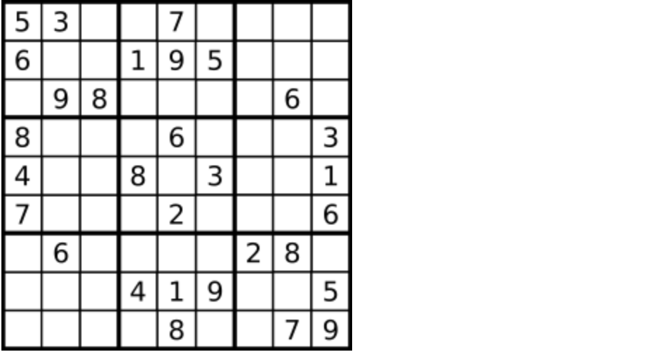

一个数独。

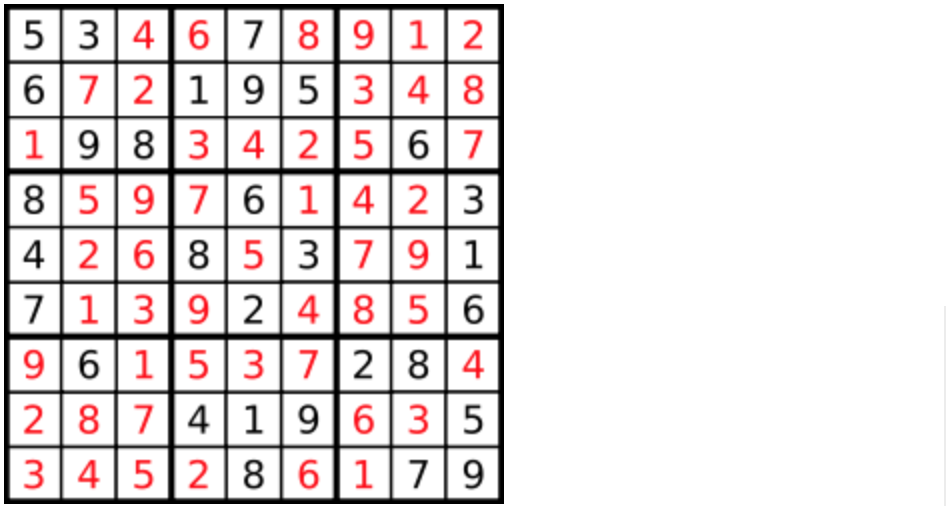

答案被标成红色。

提示：

- 给定的数独序列只包含数字 1-9 和字符 '.' 。
- 你可以假设给定的数独只有唯一解。
- 给定数独永远是 9x9 形式的。

## 算法公开课

[**《代码随想录》算法视频公开课**](https://programmercarl.com/other/gongkaike.html)**：**[**回溯算法二维递归？解数独不过如此！| LeetCode：37. 解数独**](https://www.bilibili.com/video/BV1TW4y1471V/)**，相信结合视频** **再看本篇题解，更有助于大家对本题的理解**。

## 思路

棋盘搜索问题可以使用回溯法暴力搜索，只不过这次我们要做的是**二维递归**。

怎么做二维递归呢？

大家已经跟着「代码随想录」刷过了如下回溯法题目，例如：[77.组合（组合问题）](https://programmercarl.com/0077.%E7%BB%84%E5%90%88.html)，131.分割回文串（分割问题），[78.子集（子集问题）](https://programmercarl.com/0078.%E5%AD%90%E9%9B%86.html)，[46.全排列（排列问题）](https://programmercarl.com/0046.%E5%85%A8%E6%8E%92%E5%88%97.html)，以及[51.N皇后（N皇后问题）](https://programmercarl.com/0051.N%E7%9A%87%E5%90%8E.html)，其实这些题目都是一维递归。

**如果以上这几道题目没有做过的话，不建议上来就做这道题哈！**

[N皇后问题](https://programmercarl.com/0051.N%E7%9A%87%E5%90%8E.html)是因为每一行每一列只放一个皇后，只需要一层for循环遍历一行，递归来遍历列，然后一行一列确定皇后的唯一位置。

本题就不一样了，**本题中棋盘的每一个位置都要放一个数字（而N皇后是一行只放一个皇后），并检查数字是否合** **法，解数独的树形结构要比N皇后更宽更深**。

因为这个树形结构太大了，我抽取一部分，如图所示：

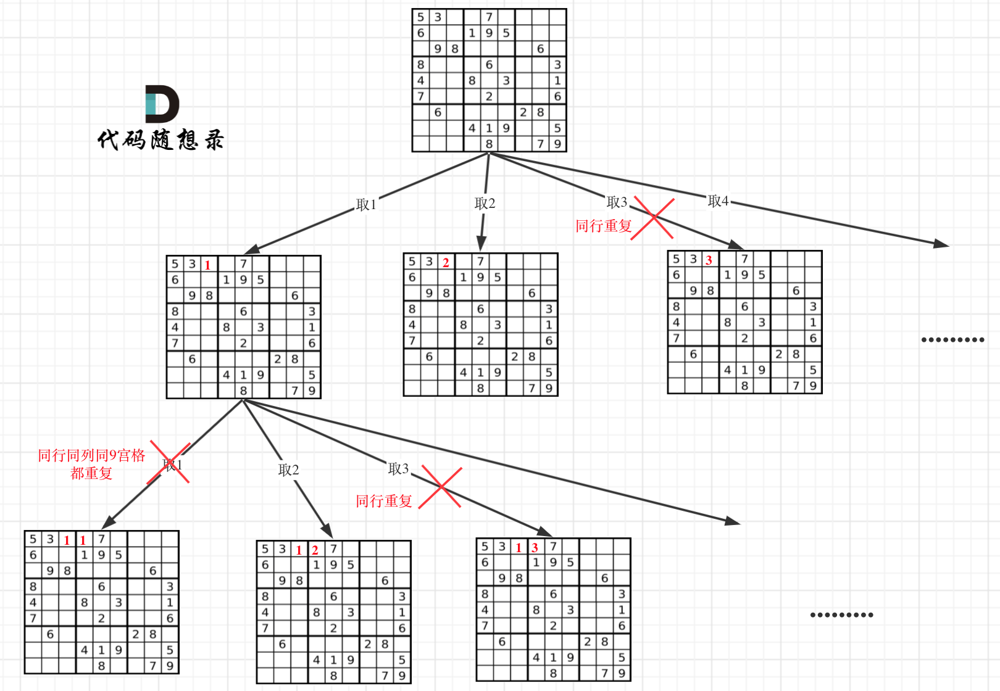

### 回溯三部曲

- 递归函数以及参数

**递归函数的返回值需要是bool类型，为什么呢？**

因为解数独找到一个符合的条件（就在树的叶子节点上）立刻就返回，相当于找从根节点到叶子节点一条唯一路径，所以需要使用bool返回值。

代码如下：

```cpp
bool backtracking(vector<vector<char>>& board)
```

- 递归终止条件

本题递归不用终止条件，解数独是要遍历整个树形结构寻找可能的叶子节点就立刻返回。

**不用终止条件会不会死循环？**

递归的下一层的棋盘一定比上一层的棋盘多一个数，等数填满了棋盘自然就终止（填满当然好了，说明找到结果了），所以不需要终止条件！

**那么有没有永远填不满的情况呢？**

这个问题我在递归单层搜索逻辑里再来讲！

- 递归单层搜索逻辑


在树形图中可以看出我们需要的是一个二维的递归（也就是两个for循环嵌套着递归）

**一个for循环遍历棋盘的行，一个for循环遍历棋盘的列，一行一列确定下来之后，递归遍历这个位置放9个数字的** **可能性！**

代码如下：（**详细看注释**）

```cpp
bool backtracking(vector<vector<char>>& board) {
    for (int i = 0; i < board.size(); i++) {        // 遍历行
        for (int j = 0; j < board[0].size(); j++) { // 遍历列
            if (board[i][j] != '.') continue;
            for (char k = '1'; k <= '9'; k++) {     // (i, j) 这个位置放k是否合适
                if (isValid(i, j, k, board)) {
                    board[i][j] = k;                // 放置k
                    if (backtracking(board)) return true; // 如果找到合适一组立刻返回
                    board[i][j] = '.';              // 回溯，撤销k
                }
            }
            return false;                           // 9个数都试完了，都不行，那么就返回false
        }
    }
    return true; // 遍历完没有返回false，说明找到了合适棋盘位置了
}
```

**注意这里return false的地方，这里放return false 是有讲究的**。

因为如果一行一列确定下来了，这里尝试了9个数都不行，说明这个棋盘找不到解决数独问题的解！

那么会直接返回， **这也就是为什么没有终止条件也不会永远填不满棋盘而无限递归下去！**

### 判断棋盘是否合法

判断棋盘是否合法有如下三个维度：

- 同行是否重复
- 同列是否重复
- 9宫格里是否重复

代码如下：

```cpp
bool isValid(int row, int col, char val, vector<vector<char>>& board) {
    for (int i = 0; i < 9; i++) { // 判断行里是否重复
        if (board[row][i] == val) {
            return false;
        }
    }
    for (int j = 0; j < 9; j++) { // 判断列里是否重复
        if (board[j][col] == val) {
            return false;
        }
    }
    int startRow = (row / 3) * 3;
    int startCol = (col / 3) * 3;
    for (int i = startRow; i < startRow + 3; i++) { // 判断9方格里是否重复
        for (int j = startCol; j < startCol + 3; j++) {
            if (board[i][j] == val ) {
                return false;
            }
        }
    }
    return true;
}
```

最后整体`C++`代码如下：

```cpp
class Solution {
private:
bool backtracking(vector<vector<char>>& board) {
    for (int i = 0; i < board.size(); i++) {        // 遍历行
        for (int j = 0; j < board[0].size(); j++) { // 遍历列
            if (board[i][j] == '.') {
                for (char k = '1'; k <= '9'; k++) {     // (i, j) 这个位置放k是否合适
                    if (isValid(i, j, k, board)) {
                        board[i][j] = k;                // 放置k
                        if (backtracking(board)) return true; // 如果找到合适一组立刻返回
                        board[i][j] = '.';              // 回溯，撤销k
                    }
                }
                return false;  // 9个数都试完了，都不行，那么就返回false
            }
        }
    }
    return true; // 遍历完没有返回false，说明找到了合适棋盘位置了
}
bool isValid(int row, int col, char val, vector<vector<char>>& board) {
    for (int i = 0; i < 9; i++) { // 判断行里是否重复
        if (board[row][i] == val) {
            return false;
        }
    }
    for (int j = 0; j < 9; j++) { // 判断列里是否重复
        if (board[j][col] == val) {
            return false;
        }
    }
    int startRow = (row / 3) * 3;
    int startCol = (col / 3) * 3;
    for (int i = startRow; i < startRow + 3; i++) { // 判断9方格里是否重复
        for (int j = startCol; j < startCol + 3; j++) {
            if (board[i][j] == val ) {
                return false;
            }
        }
    }
    return true;
}
public:
    void solveSudoku(vector<vector<char>>& board) {
        backtracking(board);
    }
};
```

## 总结

解数独可以说是非常难的题目了，如果还一直停留在单层递归的逻辑中，这道题目可以让大家瞬间崩溃。

所以我在开篇就提到了**二维递归**，这也是我自创词汇，希望可以帮助大家理解解数独的搜索过程。

一波分析之后，再看代码会发现其实也不难，唯一难点就是理解**二维递归**的思维逻辑。

**这样，解数独这么难的问题，也被我们攻克了**。

**恭喜一路上坚持打卡的录友们，回溯算法已经接近尾声了，接下来就是要一波总结了**。

20张树形结构图、14道精选回溯题目，21篇回溯法精讲文章，由浅入深，一气呵成，这是全网最强回溯算法总结！

# 22. 回溯总结篇

## 回溯法理论基础

转眼间[「代码随想录」](https://img-blog.csdnimg.cn/20200815195519696.png)里已经分享连续讲解了21天的回溯算法，是时候做一个大总结了，本篇高能，需要花费很大的精力来看！

关于回溯算法理论基础，我录了一期B站视频[带你学透回溯算法（理论篇）](https://www.bilibili.com/video/BV1cy4y167mM)如果对回溯算法还不了解的话，可以看一下。

在[关于回溯算法，你该了解这些！](https://programmercarl.com/%E5%9B%9E%E6%BA%AF%E7%AE%97%E6%B3%95%E7%90%86%E8%AE%BA%E5%9F%BA%E7%A1%80.html)中我们详细的介绍了回溯算法的理论知识，不同于教科书般的讲解，这里介绍的回溯法的效率，解决的问题以及模板都是在刷题的过程中非常实用！

**回溯是递归的副产品，只要有递归就会有回溯**，所以回溯法也经常和二叉树遍历，深度优先搜索混在一起，因为这两种方式都是用了递归。

回溯法就是暴力搜索，并不是什么高效的算法，最多再剪枝一下。

回溯算法能解决如下问题：

- 组合问题：N个数里面按一定规则找出k个数的集合

- 排列问题：N个数按一定规则全排列，有几种排列方式
- 切割问题：一个字符串按一定规则有几种切割方式
- 子集问题：一个N个数的集合里有多少符合条件的子集
- 棋盘问题：N皇后，解数独等等

**我在回溯算法系列讲解中就按照这个顺序给大家讲解，可以说深入浅出，步步到位**。

回溯法确实不好理解，所以需要把回溯法抽象为一个图形来理解就容易多了，**在后面的每一道回溯法的题目我都将** **遍历过程抽象为树形结构方便大家的理解**。

在[关于回溯算法，你该了解这些！](https://programmercarl.com/%E5%9B%9E%E6%BA%AF%E7%AE%97%E6%B3%95%E7%90%86%E8%AE%BA%E5%9F%BA%E7%A1%80.html)还用了回溯三部曲来分析回溯算法，并给出了回溯法的模板：

```cpp
void backtracking(参数) {
    if (终止条件) {
        存放结果;
        return;
    }
    for (选择：本层集合中元素（树中节点孩子的数量就是集合的大小）) {
        处理节点;
        backtracking(路径，选择列表); // 递归
        回溯，撤销处理结果
    }
}
```

**事实证明这个模板会伴随整个回溯法系列！**

## 组合问题

### 组合问题

在[回溯算法：求组合问题！](https://programmercarl.com/0077.%E7%BB%84%E5%90%88.html)中，我们开始用回溯法解决第一道题目：组合问题。

我在文中开始的时候给大家列举k层for循环例子，进而得出都是同样是暴力解法，为什么要用回溯法！

**此时大家应该深有体会回溯法的魅力，用递归控制for循环嵌套的数量！**

本题我把回溯问题抽象为树形结构，如题：


可以直观的看出其搜索的过程：**for循环横向遍历，递归纵向遍历，回溯不断调整结果集**，这个理念贯穿整个回溯法系列，也是我做了很多回溯的题目，不断摸索其规律才总结出来的。

对于回溯法的整体框架，网上搜的文章这块都说不清楚，按照天上掉下来的代码对着讲解，不知道究竟是怎么来的，也不知道为什么要这么写。

**所以，录友们刚开始学回溯法，起跑姿势就很标准了！**

优化回溯算法只有剪枝一种方法，在[回溯算法：组合问题再剪剪枝](https://programmercarl.com/0077.%E7%BB%84%E5%90%88%E4%BC%98%E5%8C%96.html)中把回溯法代码做了剪枝优化，树形结构如图：


大家可以一目了然剪的究竟是哪里。

[**回溯算法：求组合问题！**](https://programmercarl.com/0077.%E7%BB%84%E5%90%88.html)**剪枝精髓是：for循环在寻找起点的时候要有一个范围，如果这个起点到集合终止之间的** **元素已经不够题目要求的k个元素了，就没有必要搜索了**。

**在for循环上做剪枝操作是回溯法剪枝的常见套路！** 后面的题目还会经常用到。

### 组合总和

#### 组合总和（一）

在[回溯算法：求组合总和！](https://programmercarl.com/0216.%E7%BB%84%E5%90%88%E6%80%BB%E5%92%8CIII.html)中，相当于 [回溯算法：求组合问题！](https://programmercarl.com/0077.%E7%BB%84%E5%90%88.html)加了一个元素总和的限制。

树形结构如图：


整体思路还是一样的，本题的剪枝会好想一些，即：**已选元素总和如果已经大于n（题中要求的和）了，那么往后** **遍历就没有意义了，直接剪掉**，如图：


在本题中，依然还可以有一个剪枝，就是[回溯算法：组合问题再剪剪枝](https://programmercarl.com/0077.%E7%BB%84%E5%90%88%E4%BC%98%E5%8C%96.html)中提到的，对for循环选择的起始范围的剪枝。

```text
所以剪枝的代码可以在for循环加上 i <= 9 - (k - path.size()) + 1 的限制！
```

#### 组合总和（二）

在[回溯算法：求组合总和（二）](https://programmercarl.com/0039.%E7%BB%84%E5%90%88%E6%80%BB%E5%92%8C.html)中讲解的组合总和问题，和[回溯算法：求组合问题！](https://programmercarl.com/0077.%E7%BB%84%E5%90%88.html)，[回溯算法：求组合总和！](https://programmercarl.com/0216.%E7%BB%84%E5%90%88%E6%80%BB%E5%92%8CIII.html)和区别是：本题没有数量要求，可以无限重复，但是有总和的限制，所以间接的也是有个数的限制。

不少同学都是看到可以重复选择，就义无反顾的把startIndex去掉了。

**本题还需要startIndex来控制for循环的起始位置，对于组合问题，什么时候需要startIndex呢？**

我举过例子，如果是一个集合来求组合的话，就需要startIndex，例如：[回溯算法：求组合问题！](https://programmercarl.com/0077.%E7%BB%84%E5%90%88.html)，回溯算法：求组合总和！。

如果是多个集合取组合，各个集合之间相互不影响，那么就不用startIndex，例如：回溯算法：电话号码的字母组合

**注意以上我只是说求组合的情况，如果是排列问题，又是另一套分析的套路**。

树形结构如下：


最后还给出了本题的剪枝优化，如下：

```cpp
for (int i = startIndex; i < candidates.size() && sum + candidates[i] <= target; i++)
```

优化后树形结构如下：

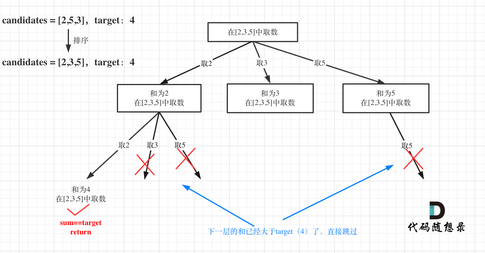

#### 组合总和（三）

在[回溯算法：求组合总和（三）](https://programmercarl.com/0040.%E7%BB%84%E5%90%88%E6%80%BB%E5%92%8CII.html)中集合元素会有重复，但要求解集不能包含重复的组合。

**所以难就难在去重问题上了**。

这个去重问题，相信做过的录友都知道有多么的晦涩难懂。网上的题解一般就说“去掉重复”，但说不清怎么个去重，代码一甩就完事了。

为了讲解这个去重问题，**Carl自创了两个词汇，“树枝去重”和“树层去重”**。

都知道组合问题可以抽象为树形结构，那么“使用过”在这个树形结构上是有两个维度的，一个维度是同一树枝上“使用过”，一个维度是同一树层上“使用过”。**没有理解这两个层面上的“使用过” 是造成大家没有彻底理解去重的根本原** **因**。


我在图中将used的变化用橘黄色标注上，**可以看出在candidates[i] == candidates[i - 1]相同的情况下：**

- `used[i - 1] == true`，说明同一树枝`candidates[i - 1]`使用过
- `used[i - 1] == false`，说明同一树层`candidates[i - 1]`使用过

**这块去重的逻辑很抽象，网上搜的题解基本没有能讲清楚的，如果大家之前思考过这个问题或者刷过这道题目，看** **到这里一定会感觉通透了很多！**

对于去重，其实排列和子集问题也是一样的道理。

### 多个集合求组合

在[回溯算法：电话号码的字母组合](https://programmercarl.com/0017.%E7%94%B5%E8%AF%9D%E5%8F%B7%E7%A0%81%E7%9A%84%E5%AD%97%E6%AF%8D%E7%BB%84%E5%90%88.html)中，开始用多个集合来求组合，还是熟悉的模板题目，但是有一些细节。

例如这里for循环，可不像是在 [回溯算法：求组合问题！](https://programmercarl.com/0077.%E7%BB%84%E5%90%88.html)和[回溯算法：求组合总和！](https://programmercarl.com/0216.%E7%BB%84%E5%90%88%E6%80%BB%E5%92%8CIII.html)中从startIndex开始遍历的。

**因为本题每一个数字代表的是不同集合，也就是求不同集合之间的组合，而**[**回溯算法：求组合问题！**](https://programmercarl.com/0077.%E7%BB%84%E5%90%88.html)**和回溯算法：** **求组合总和！都是是求同一个集合中的组合！**

树形结构如下：


如果大家在现场面试的时候，一定要注意各种输入异常的情况，例如本题输入1 * #按键。

其实本题不算难，但也处处是细节，还是要反复琢磨。

## 切割问题

在[回溯算法：分割回文串](https://programmercarl.com/0131.%E5%88%86%E5%89%B2%E5%9B%9E%E6%96%87%E4%B8%B2.html)中，我们开始讲解切割问题，虽然最后代码看起来好像是一道模板题，但是从分析到学会套用这个模板，是比较难的。

我列出如下几个难点：

- 切割问题其实类似组合问题
- 如何模拟那些切割线
- 切割问题中递归如何终止
- 在递归循环中如何截取子串
- 如何判断回文

如果想到了**用求解组合问题的思路来解决 切割问题本题就成功一大半了**，接下来就可以对着模板照葫芦画瓢。

**但后序如何模拟切割线，如何终止，如何截取子串，其实都不好想，最后判断回文算是最简单的了**。

所以本题应该是一个道hard题目了。

除了这些难点，**本题还有细节，例如：切割过的地方不能重复切割所以递归函数需要传入i + 1**。

树形结构如下：


## 子集问题

### 子集问题（一）

在[回溯算法：求子集问题！](https://programmercarl.com/0078.%E5%AD%90%E9%9B%86.html)中讲解了子集问题，**在树形结构中子集问题是要收集所有节点的结果，而组合问题是收** **集叶子节点的结果**。

如图：


认清这个本质之后，今天的题目就是一道模板题了。

**本题其实可以不需要加终止条件**，因为`startIndex >= nums.size()`，本层for循环本来也结束了，本来我们就要遍历整棵树。

有的同学可能担心不写终止条件会不会无限递归？

并不会，因为每次递归的下一层就是从i+1开始的。

```cpp
如果要写终止条件，注意：result.push_back(path); 要放在终止条件的上面，如下：
result.push_back(path); // 收集子集，要放在终止添加的上面，否则会漏掉结果
if (startIndex >= nums.size()) { // 终止条件可以不加
    return;
}
```

### 子集问题（二）

在[回溯算法：求子集问题（二）](https://programmercarl.com/0090.%E5%AD%90%E9%9B%86II.html)中，开始针对子集问题进行去重。

本题就是[回溯算法：求子集问题！](https://programmercarl.com/0078.%E5%AD%90%E9%9B%86.html)的基础上加上了去重，去重我们在[回溯算法：求组合总和（三）](https://programmercarl.com/0040.%E7%BB%84%E5%90%88%E6%80%BB%E5%92%8CII.html)也讲过了，一样的套路。

树形结构如下：


### 递增子序列

在[回溯算法：递增子序列](https://programmercarl.com/0491.%E9%80%92%E5%A2%9E%E5%AD%90%E5%BA%8F%E5%88%97.html)中，处处都能看到子集的身影，但处处是陷阱，值得好好琢磨琢磨！

树形结构如下：


很多同学都会把这道题目和[回溯算法：求子集问题（二）](https://programmercarl.com/0090.%E5%AD%90%E9%9B%86II.html)混在一起。

[**回溯算法：求子集问题（二）**](https://programmercarl.com/0090.%E5%AD%90%E9%9B%86II.html)**也可以使用set针对同一父节点本层去重，但子集问题一定要排序，为什么呢？**

我用没有排序的集合`{2,1,2,2}`来举个例子画一个图，如下：


**相信这个图胜过千言万语的解释了**。

## 排列问题

### 排列问题（一）

[回溯算法：排列问题！](https://programmercarl.com/0046.%E5%85%A8%E6%8E%92%E5%88%97.html) 又不一样了。

排列是有序的，也就是说 `[1,2]` 和 `[2,1]` 是两个集合，这和之前分析的子集以及组合所不同的地方。

可以看出元素1在`[1,2]`中已经使用过了，但是在`[2,1]`中还要在使用一次1，所以处理排列问题就不用使用startIndex了。

如图：


**大家此时可以感受出排列问题的不同：**

- 每层都是从0开始搜索而不是startIndex
- 需要used数组记录path里都放了哪些元素了

### 排列问题（二）

排列问题也要去重了，在[回溯算法：排列问题（二）](https://programmercarl.com/0047.%E5%85%A8%E6%8E%92%E5%88%97II.html)中又一次强调了“树层去重”和“树枝去重”。

树形结构如下：


**这道题目神奇的地方就是used[i - 1] == false也可以，used[i - 1] == true也可以！**

我就用输入`: [1,1,1]` 来举一个例子。

树层上去重`(used[i - 1] == false)`，的树形结构如下：


树枝上去重（`used[i - 1] == true`）的树型结构如下：


**可以清晰的看到使用(used[i - 1] == false)，即树层去重，效率更高！**

本题used数组即是记录path里都放了哪些元素，同时也用来去重，一举两得。

## 去重问题

以上我都是统一使用used数组来去重的，其实使用set也可以用来去重！

在[本周小结！（回溯算法系列三）续集](https://programmercarl.com/%E5%9B%9E%E6%BA%AF%E7%AE%97%E6%B3%95%E5%8E%BB%E9%87%8D%E9%97%AE%E9%A2%98%E7%9A%84%E5%8F%A6%E4%B8%80%E7%A7%8D%E5%86%99%E6%B3%95.html)中给出了子集、组合、排列问题使用set来去重的解法以及具体代码，并纠正一些同学的常见错误写法。

同时详细分析了 使用used数组去重 和 使用set去重 两种写法的性能差异：

**使用set去重的版本相对于used数组的版本效率都要低很多**，大家在leetcode上提交，能明显发现。

原因在[回溯算法：递增子序列](https://programmercarl.com/0491.%E9%80%92%E5%A2%9E%E5%AD%90%E5%BA%8F%E5%88%97.html)中也分析过，主要是因为程序运行的时候对unordered_set 频繁的insert，unordered_set需要做哈希映射（也就是把key通过hash function映射为唯一的哈希值）相对费时间，而且insert的时候其底层的符号表也要做相应的扩充，也是费时的。

**而使用used数组在时间复杂度上几乎没有额外负担！**

**使用set去重，不仅时间复杂度高了，空间复杂度也高了**，在[本周小结！（回溯算法系列三）](https://programmercarl.com/%E5%91%A8%E6%80%BB%E7%BB%93/20201112%E5%9B%9E%E6%BA%AF%E5%91%A8%E6%9C%AB%E6%80%BB%E7%BB%93.html)中分析过，组合，子集，排列问题的空间复杂度都是`O(n)`，但如果使用set去重，空间复杂度就变成了`O(n^2)`，因为每一层递归都有一个set集合，系统栈空间是n，每一个空间都有set集合。

那有同学可能疑惑 用used数组也是占用`O(n)`的空间啊？

used数组可是全局变量，每层与每层之间公用一个used数组，所以空间复杂度是`O(n + n)`，最终空间复杂度还是`O(n)`。

## 重新安排行程（图论额外拓展）

之前说过，有递归的地方就有回溯，深度优先搜索也是用递归来实现的，所以往往伴随着回溯。

在[回溯算法：重新安排行程](https://programmercarl.com/0332.%E9%87%8D%E6%96%B0%E5%AE%89%E6%8E%92%E8%A1%8C%E7%A8%8B.html)其实也算是图论里深搜的题目，但是我用回溯法的套路来讲解这道题目，算是给大家拓展一下思路，原来回溯法还可以这么玩！

以输入：`[["JFK", "KUL"], ["JFK", "NRT"], ["NRT", "JFK"]`为例，抽象为树形结构如下：


本题可以算是一道hard的题目了，关于本题的难点我在文中已经详细列出。

**如果单纯的回溯搜索（深搜）并不难，难还难在容器的选择和使用上！**

本题其实是一道深度优先搜索的题目，但是我完全使用回溯法的思路来讲解这道题题目，**算是给大家拓展一下思维** **方式，其实深搜和回溯也是分不开的，毕竟最终都是用递归**。

## 棋盘问题

### N皇后问题

在[回溯算法：N皇后问题](https://programmercarl.com/0051.N%E7%9A%87%E5%90%8E.html)中终于迎来了传说中的N皇后。

下面我用一个3 * 3 的棋盘，将搜索过程抽象为一棵树，如图：

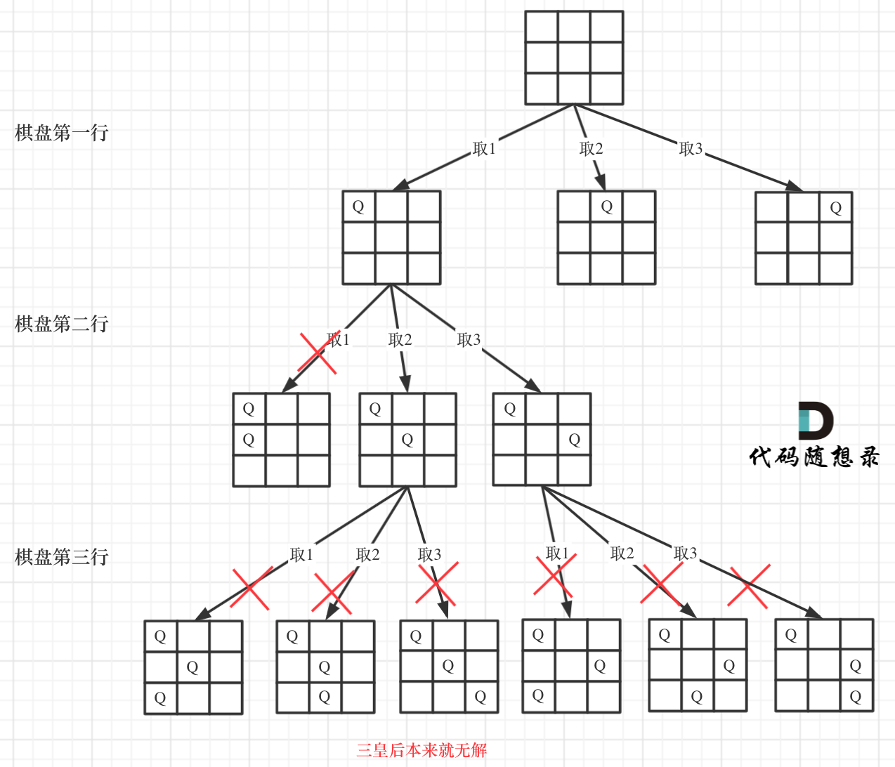

从图中，可以看出，二维矩阵中矩阵的高就是这棵树的高度，矩阵的宽就是树形结构中每一个节点的宽度。

那么我们用皇后们的约束条件，来回溯搜索这棵树，**只要搜索到了树的叶子节点，说明就找到了皇后们的合理位置** **了**。

如果从来没有接触过N皇后问题的同学看着这样的题会感觉无从下手，可能知道要用回溯法，但也不知道该怎么去搜。

**这里我明确给出了棋盘的宽度就是for循环的长度，递归的深度就是棋盘的高度，这样就可以套进回溯法的模板里** **了**。

相信看完本篇[回溯算法：N皇后问题](https://programmercarl.com/0051.N%E7%9A%87%E5%90%8E.html)也没那么难了，传说已经不是传说了，哈哈。

### 解数独问题

在[回溯算法：解数独](https://programmercarl.com/0037.%E8%A7%A3%E6%95%B0%E7%8B%AC.html)中要征服回溯法的最后一道山峰。

解数独应该是棋盘很难的题目了，比N皇后还要复杂一些，但只要理解 “二维递归”这个过程，其实发现就没那么难了。

大家已经跟着「代码随想录」刷过了如下回溯法题目，例如：[77.组合（组合问题）](https://programmercarl.com/0077.%E7%BB%84%E5%90%88.html)，131.分割回文串（分割问题），[78.子集（子集问题）](https://programmercarl.com/0078.%E5%AD%90%E9%9B%86.html)，[46.全排列（排列问题）](https://programmercarl.com/0046.%E5%85%A8%E6%8E%92%E5%88%97.html)，以及[51.N皇后（N皇后问题）](https://programmercarl.com/0051.N%E7%9A%87%E5%90%8E.html)，其实这些题目都是一维递归。

其中[N皇后问题](https://programmercarl.com/0051.N%E7%9A%87%E5%90%8E.html)是因为每一行每一列只放一个皇后，只需要一层for循环遍历一行，递归来遍历列，然后一行一列确定皇后的唯一位置。

本题就不一样了，**本题中棋盘的每一个位置都要放一个数字，并检查数字是否合法，解数独的树形结构要比N皇后** **更宽更深**。

因为这个树形结构太大了，我抽取一部分，如图所示：


解数独可以说是非常难的题目了，如果还一直停留在一维递归的逻辑中，这道题目可以让大家瞬间崩溃。

**所以我在**[**回溯算法：解数独**](https://programmercarl.com/0037.%E8%A7%A3%E6%95%B0%E7%8B%AC.html)**中开篇就提到了二维递归，这也是我自创词汇**，希望可以帮助大家理解解数独的搜索过程。

一波分析之后，在看代码会发现其实也不难，唯一难点就是理解**二维递归**的思维逻辑。

**这样，解数独这么难的问题也被我们攻克了**。

## 性能分析

**关于回溯算法的复杂度分析在网上的资料鱼龙混杂，一些所谓的经典面试书籍不讲回溯算法，算法书籍对这块也避** **而不谈，感觉就像是算法里模糊的边界**。

**所以这块就说一说我个人理解，对内容持开放态度，集思广益，欢迎大家来讨论！**以下在计算空间复杂度的时候我都把系统栈（不是数据结构里的栈）所占空间算进去。

子集问题分析：

- 时间复杂度：`O(2^n)`，因为每一个元素的状态无外乎取与不取，所以时间复杂度为`O(2^n)`
- 空间复杂度：`O(n)`，递归深度为n，所以系统栈所用空间为`O(n)`，每一层递归所用的空间都是常数级别，注意代码里的result和path都是全局变量，就算是放在参数里，传的也是引用，并不会新申请内存空间，最终空间复杂度为`O(n)`

排列问题分析：

- 时间复杂度：`O(n!)`，这个可以从排列的树形图中很明显发现，每一层节点为n，第二层每一个分支都延伸了n- 1个分支，再往下又是n-2个分支，所以一直到叶子节点一共就是 `n * n-1 * n-2 * ..... 1 = n!`。
- 空间复杂度：`O(n)`，和子集问题同理。

组合问题分析：

- 时间复杂度：`O(2^n)`，组合问题其实就是一种子集的问题，所以组合问题最坏的情况，也不会超过子集问题的时间复杂度。
- 空间复杂度：`O(n)`，和子集问题同理。

N皇后问题分析：

- 时间复杂度：`O(n!)` ，其实如果看树形图的话，直觉上是`O(n^n)`，但皇后之间不能见面所以在搜索的过程中是有剪枝的，最差也就是O（n!），n!表示`n * (n-1) * .... * 1`。
- 空间复杂度：`O(n)`，和子集问题同理。

解数独问题分析：

- 时间复杂度：`O(9^m) , m`是'.'的数目。
- 空间复杂度：`O(n^2)`，递归的深度是n^2

**一般说道回溯算法的复杂度，都说是指数级别的时间复杂度，这也算是一个概括吧！**

## 总结

[**「代码随想录」**](https://img-blog.csdnimg.cn/20200815195519696.png)**历时21天，14道经典题目分析，20张树形图，21篇回溯法精讲文章，从组合到切割，从子集到排** **列，从棋盘问题到最后的复杂度分析**，至此收尾了。

这里的每一种问题，讲解的时候我都会和其他问题作对比，做分析，确保每一个问题都讲的通透。

可以说方方面面都详细介绍到了。

例如：

- 如何理解回溯法的搜索过程？
- 什么时候用startIndex，什么时候不用？
- 如何去重？如何理解“树枝去重”与“树层去重”？
- 去重的几种方法？
- 如何理解二维递归？

**这里的每一个问题，网上几乎找不到能讲清楚的文章，这也是直击回溯算法本质的问题**。

相信一路坚持下来的录友们，对回溯算法已经都深刻的认识。

此时回溯算法系列就要正式告一段落了。

**录友们可以回顾一下这21天，每天的打卡，每天在交流群里和大家探讨代码，最终换来的都是不知不觉的成长**。

同样也感谢录友们的坚持，这也是我持续写作的动力，**正是因为大家的积极参与，我才知道这件事件是非常有意义** **的**。

回溯专题汇聚为一张图：

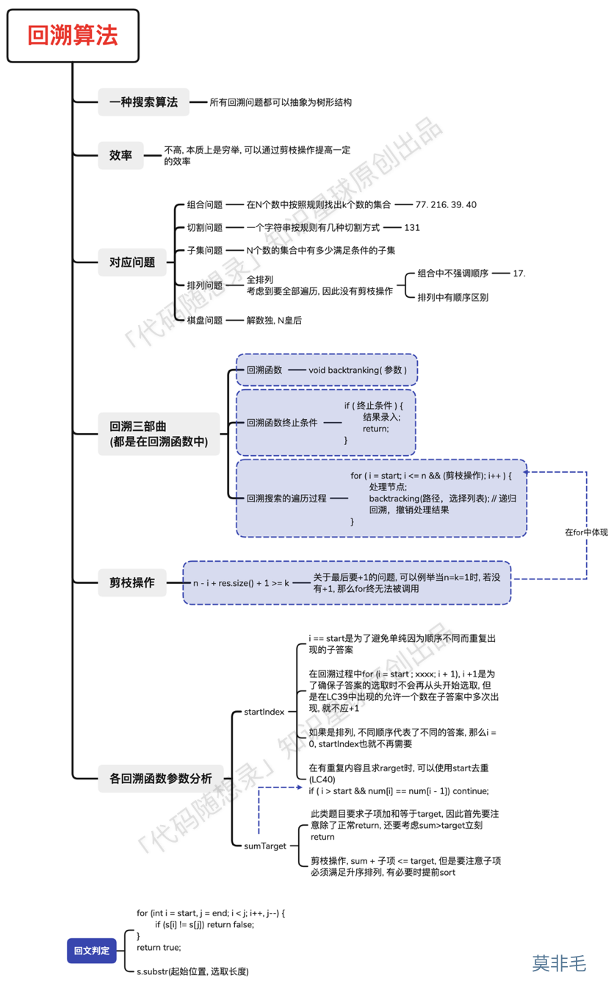


这个图是 [代码随想录知识星球](https://programmercarl.com/other/kstar.html) 成员：[莫非毛](https://wx.zsxq.com/dweb2/index/footprint/828844212542)，所画，总结的非常好，分享给大家。

**回溯算法系列正式结束，新的系列终将开始，录友们准备开启新的征程！**
