[](https://programmercarl.com/other/xunlianying.html)

**《代码随想录》作者：**[**程序员Carl**](https://github.com/youngyangyang04)

- 代码随想录官网[（网站持续更新优化内容，建议直接看网站）](https://www.programmercarl.com/)：www.programmercarl.com
- 代码随想录[Github开源地址](https://github.com/youngyangyang04/leetcode-master)
- [代码随想录算法公开课](https://programmercarl.com/other/gongkaike.html)，代码随想录的全部内容将由我（[程序员Carl](https://github.com/youngyangyang04)）视频讲解并开免费开放给大家。
- [《代码随想录》](https://programmercarl.com/other/publish.html) 已经出版。
- [代码随想录知识星球](https://programmercarl.com/other/kstar.html) 上万录友在这里学习
- [代码随想录算法训练营](https://programmercarl.com/other/xunlianying.html) 帮助录友高效刷完代码随想录。
- 微信公众号：[代码随想录](https://img-blog.csdnimg.cn/74f47bc466234462bd2acc3ba6cd1b70.png)
- 组队刷题，可以添加[代码随想录官方微信](https://www.programmercarl.com/other/wechat.html)
- ACM模式练习，推荐：[卡码网](https://kamacoder.com/)

**特别提示**：PDF仅提供`C++`语言版本同时PDF中很多动图无法加载，其他编程语言版本和查看动图可以移步至代码随想录官方网站查看。

# 1. 关于贪心算法，你该了解这些！

题目分类大纲如下： 

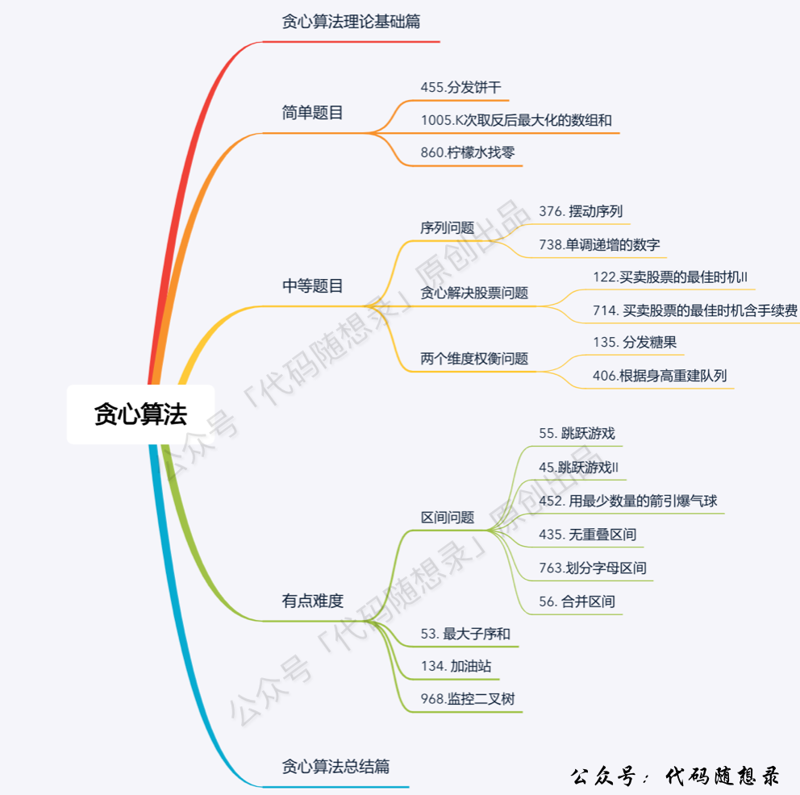

## 什么是贪心

**贪心的本质是选择每一阶段的局部最优，从而达到全局最优**。

这么说有点抽象，来举一个例子：

例如，有一堆钞票，你可以拿走十张，如果想达到最大的金额，你要怎么拿？

指定每次拿最大的，最终结果就是拿走最大数额的钱。

每次拿最大的就是局部最优，最后拿走最大数额的钱就是推出全局最优。

再举一个例子如果是 有一堆盒子，你有一个背包体积为n，如何把背包尽可能装满，如果还每次选最大的盒子，就不行了。这时候就需要动态规划。动态规划的问题在下一个系列会详细讲解。

## 贪心的套路（什么时候用贪心）

很多同学做贪心的题目的时候，想不出来是贪心，想知道有没有什么套路可以一看就看出来是贪心。

**说实话贪心算法并没有固定的套路**。

所以唯一的难点就是如何通过局部最优，推出整体最优。

那么如何能看出局部最优是否能推出整体最优呢？有没有什么固定策略或者套路呢？

**不好意思，也没有！** 靠自己手动模拟，如果模拟可行，就可以试一试贪心策略，如果不可行，可能需要动态规划。

有同学问了如何验证可不可以用贪心算法呢？

**最好用的策略就是举反例，如果想不到反例，那么就试一试贪心吧**。

可有有同学认为手动模拟，举例子得出的结论不靠谱，想要严格的数学证明。

一般数学证明有如下两种方法：

- 数学归纳法
- 反证法

看教课书上讲解贪心可以是一堆公式，估计大家连看都不想看，所以数学证明就不在我要讲解的范围内了，大家感兴趣可以自行查找资料。

**面试中基本不会让面试者现场证明贪心的合理性，代码写出来跑过测试用例即可，或者自己能自圆其说理由就行** **了**。

举一个不太恰当的例子：我要用一下`1+1 = 2`，但我要先证明1+1 为什么等于2。严谨是严谨了，但没必要。

虽然这个例子很极端，但可以表达这么个意思：**刷题或者面试的时候，手动模拟一下感觉可以局部最优推出整体最** **优，而且想不到反例，那么就试一试贪心**。

**例如刚刚举的拿钞票的例子，就是模拟一下每次拿做大的，最后就能拿到最多的钱，这还要数学证明的话，其实就** **不在算法面试的范围内了，可以看看专业的数学书籍！**

所以这也是为什么很多同学通过（accept）了贪心的题目，但都不知道自己用了贪心算法，**因为贪心有时候就是常** **识性的推导，所以会认为本应该就这么做！**

**那么刷题的时候什么时候真的需要数学推导呢？**

例如这道题目：[链表：环找到了，那入口呢？](https://programmercarl.com/0142.%E7%8E%AF%E5%BD%A2%E9%93%BE%E8%A1%A8II.html)，这道题不用数学推导一下，就找不出环的起始位置，想试一下就不知道怎么试，这种题目确实需要数学简单推导一下。

## 贪心一般解题步骤

贪心算法一般分为如下四步：

- 将问题分解为若干个子问题
- 找出适合的贪心策略
- 求解每一个子问题的最优解
- 将局部最优解堆叠成全局最优解

这个四步其实过于理论化了，我们平时在做贪心类的题目 很难去按照这四步去思考，真是有点“鸡肋”。  

做题的时候，只要想清楚 局部最优 是什么，如果推导出全局最优，其实就够了。 

## 总结

本篇给出了什么是贪心以及大家关心的贪心算法固定套路。

**不好意思了，贪心没有套路，说白了就是常识性推导加上举反例**。

最后给出贪心的一般解题步骤，大家可以发现这个解题步骤也是比较抽象的，不像是二叉树，回溯算法，给出了那么具体的解题套路和模板。

# 2.分发饼干

[力扣题目链接](https://leetcode.cn/problems/assign-cookies/)

假设你是一位很棒的家长，想要给你的孩子们一些小饼干。但是，每个孩子最多只能给一块饼干。

对每个孩子 i，都有一个胃口值  `g[i]`，这是能让孩子们满足胃口的饼干的最小尺寸；并且每块饼干 j，都有一个尺寸 `s[j]` 。如果 `s[j] >= g[i]`，我们可以将这个饼干 j 分配给孩子 i ，这个孩子会得到满足。你的目标是尽可能满足越多数量的孩子，并输出这个最大数值。

示例  1:

- 输入`: g = [1,2,3], s = [1,1]`
- 输出: 1  
解释:你有三个孩子和两块小饼干，3 个孩子的胃口值分别是：1,2,3。虽然你有两块小饼干，由于他们的尺寸都是 1，你只能让胃口值是 1 的孩子满足。所以你应该输出 1。

示例  2:

- 输入`: g = [1,2], s = [1,2,3]`
- 输出: 2
- 解释:你有两个孩子和三块小饼干，2 个孩子的胃口值分别是 1,2。你拥有的饼干数量和尺寸都足以让所有孩子满足。所以你应该输出 2.

提示：

- `1 <= g.length <= 3 * 10^4`
- `0 <= s.length <= 3 * 10^4`
- `1 <= g[i], s[j] <= 2^31 - 1`

## 算法公开课

[**《代码随想录》算法视频公开课**](https://programmercarl.com/other/gongkaike.html)**：**[**贪心算法，你想先喂哪个小孩？| LeetCode：455.分发饼干**](https://www.bilibili.com/video/BV1MM411b7cq)**，相信结合视频在** **看本篇题解，更有助于大家对本题的理解**。

## 思路

为了满足更多的小孩，就不要造成饼干尺寸的浪费。

大尺寸的饼干既可以满足胃口大的孩子也可以满足胃口小的孩子，那么就应该优先满足胃口大的。

**这里的局部最优就是大饼干喂给胃口大的，充分利用饼干尺寸喂饱一个，全局最优就是喂饱尽可能多的小孩**。

可以尝试使用贪心策略，先将饼干数组和小孩数组排序。

然后从后向前遍历小孩数组，用大饼干优先满足胃口大的，并统计满足小孩数量。

如图：

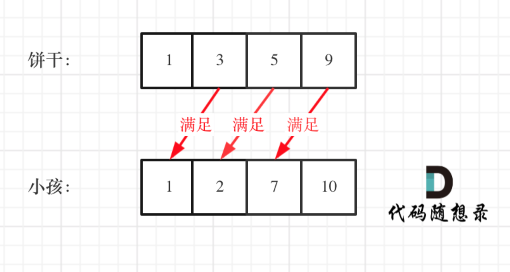

这个例子可以看出饼干 9 只有喂给胃口为 7 的小孩，这样才是整体最优解，并想不出反例，那么就可以撸代码了。

`C++`代码整体如下：

```cpp
// 版本一
class Solution {
public:
    int findContentChildren(vector<int>& g, vector<int>& s) {
        sort(g.begin(), g.end());
        sort(s.begin(), s.end());
        int index = s.size() - 1; // 饼干数组的下标
        int result = 0;
        for (int i = g.size() - 1; i >= 0; i--) { // 遍历胃口
            if (index >= 0 && s[index] >= g[i]) { // 遍历饼干
                result++;
                index--;
            }
        }
        return result;
    }
};
```

- 时间复杂度：`O(nlogn)`
- 空间复杂度：`O(1)`

从代码中可以看出我用了一个 index 来控制饼干数组的遍历，遍历饼干并没有再起一个 for 循环，而是采用自减的方式，这也是常用的技巧。

有的同学看到要遍历两个数组，就想到用两个 for 循环，那样逻辑其实就复杂了。

### 注意事项

注意版本一的代码中，可以看出来，是先遍历的胃口，在遍历的饼干，那么可不可以 先遍历 饼干，在遍历胃口呢？

其实是不可以的。

外面的 for 是里的下标 i 是固定移动的，而 if 里面的下标 index 是符合条件才移动的。

如果 for 控制的是饼干， if 控制胃口，就是出现如下情况 ：

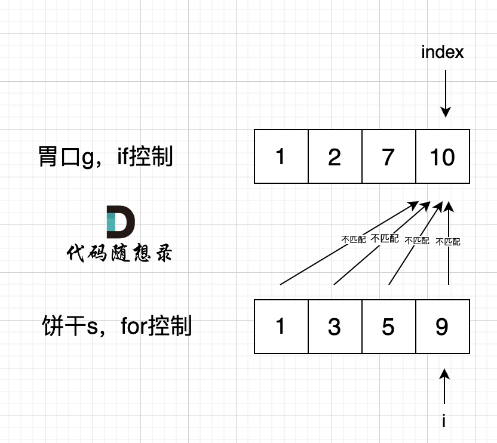

if 里的 index 指向 胃口 10， for 里的 i 指向饼干 9，因为 饼干 9 满足不了 胃口 10，所以 i 持续向前移动，而 

```text
index 走不到s[index] >= g[i] 的逻辑，所以 index 不会移动，那么当 i 持续向前移动，最后所有的饼干都匹配
```

不上。

所以 一定要 for 控制 胃口，里面的 if 控制饼干。

### 其他思路

**也可以换一个思路，小饼干先喂饱小胃口**

代码如下：

```cpp
class Solution {
public:
    int findContentChildren(vector<int>& g, vector<int>& s) {
        sort(g.begin(),g.end());
        sort(s.begin(),s.end());
        int index = 0;
        for(int i = 0; i < s.size(); i++) { // 饼干
            if(index < g.size() && g[index] <= s[i]){ // 胃口
                index++;
            }
        }
        return index;
    }
};
```

- 时间复杂度：`O(nlogn)`
- 空间复杂度：`O(1)`

细心的录友可以发现，这种写法，两个循环的顺序改变了，先遍历的饼干，在遍历的胃口，这是因为遍历顺序变了，我们是从小到大遍历。

理由在上面 “注意事项”中 已经讲过。

## 总结

这道题是贪心很好的一道入门题目，思路还是比较容易想到的。

文中详细介绍了思考的过程，**想清楚局部最优，想清楚全局最优，感觉局部最优是可以推出全局最优，并想不出反** **例，那么就试一试贪心**。

本周讲解了[贪心理论基础](https://programmercarl.com/%E8%B4%AA%E5%BF%83%E7%AE%97%E6%B3%95%E7%90%86%E8%AE%BA%E5%9F%BA%E7%A1%80.html)，以及第一道贪心的题目：[贪心算法：分发饼干](https://programmercarl.com/0455.%E5%88%86%E5%8F%91%E9%A5%BC%E5%B9%B2.html)，可能会给大家一种贪心算法比较简单的错觉，好了，接下来几天的题目难度要上来了，哈哈。

# 3. 摆动序列

[力扣题目链接](https://leetcode.cn/problems/wiggle-subsequence/)

如果连续数字之间的差严格地在正数和负数之间交替，则数字序列称为摆动序列。第一个差（如果存在的话）可能是正数或负数。少于两个元素的序列也是摆动序列。

例如， `[1,7,4,9,2,5]` 是一个摆动序列，因为差值 `(6,-3,5,-7,3)`  是正负交替出现的。相反`, [1,4,7,2,5]`  和  `[1,7,4,5,5]` 不是摆动序列，第一个序列是因为它的前两个差值都是正数，第二个序列是因为它的最后一个差值为零。

给定一个整数序列，返回作为摆动序列的最长子序列的长度。 通过从原始序列中删除一些（也可以不删除）元素来获得子序列，剩下的元素保持其原始顺序。

示例 1:

- 输入`: [1,7,4,9,2,5]`
- 输出: 6
- 解释: 整个序列均为摆动序列。

示例 2:

- 输入`: [1,17,5,10,13,15,10,5,16,8]`
- 输出: 7
- 解释: 这个序列包含几个长度为 7 摆动序列，其中一个可为`[1,17,10,13,10,16,8]`。

示例 3:

- 输入`: [1,2,3,4,5,6,7,8,9]`
- 输出: 2

## 算法公开课

[**《代码随想录》算法视频公开课**](https://programmercarl.com/other/gongkaike.html)**：**[**贪心算法，寻找摆动有细节！| LeetCode：376.摆动序列**](https://www.bilibili.com/video/BV17M411b7NS)**，相信结合视频在看** **本篇题解，更有助于大家对本题的理解**。

## 思路

### 思路 1（贪心解法）

本题要求通过从原始序列中删除一些（也可以不删除）元素来获得子序列，剩下的元素保持其原始顺序。

相信这么一说吓退不少同学，这要求最大摆动序列又可以修改数组，这得如何修改呢？

来分析一下，要求删除元素使其达到最大摆动序列，应该删除什么元素呢？

用示例二来举例，如图所示：

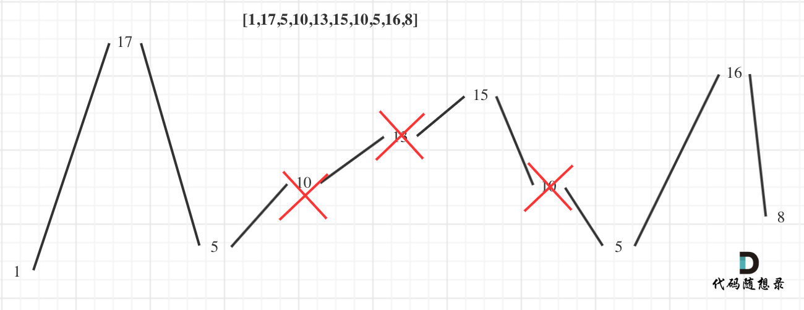

**局部最优：删除单调坡度上的节点（不包括单调坡度两端的节点），那么这个坡度就可以有两个局部峰值**。

**整体最优：整个序列有最多的局部峰值，从而达到最长摆动序列**。

局部最优推出全局最优，并举不出反例，那么试试贪心！

（为方便表述，以下说的峰值都是指局部峰值）

**实际操作上，其实连删除的操作都不用做，因为题目要求的是最长摆动子序列的长度，所以只需要统计数组的峰值** **数量就可以了（相当于是删除单一坡度上的节点，然后统计长度）**

**这就是贪心所贪的地方，让峰值尽可能的保持峰值，然后删除单一坡度上的节点**

在计算是否有峰值的时候，大家知道遍历的下标 i ，计算 prediff（`nums[i] - nums[i-1]`） 和 curdiff（`nums[i+1] -` 

```text
nums[i]），如果prediff < 0 && curdiff > 0 或者 prediff > 0 && curdiff < 0 此时就有波动就需要统
```

计。

这是我们思考本题的一个大题思路，但本题要考虑三种情况：

1. 情况一：上下坡中有平坡2. 情况二：数组首尾两端3. 情况三：单调坡中有平坡

#### 情况一：上下坡中有平坡

例如 `[1,2,2,2,1]`这样的数组，如图：

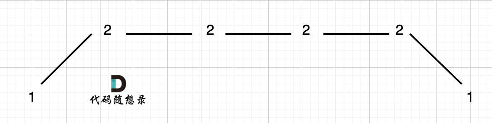

它的摇摆序列长度是多少呢？ **其实是长度是 3**，也就是我们在删除的时候 要不删除左面的三个 2，要不就删除右边的三个 2。

如图，可以统一规则，删除左边的三个 2：

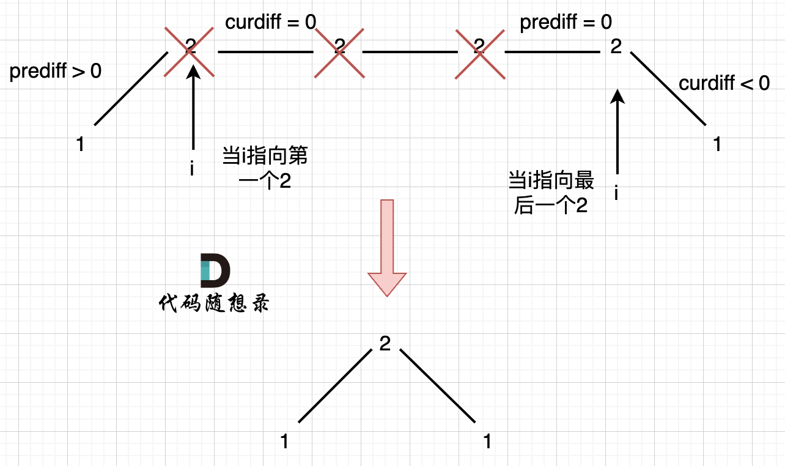

```text
在图中，当 i 指向第一个 2 的时候，prediff > 0 && curdiff = 0 ，当 i 指向最后一个 2 的时候 prediff =
0 && curdiff < 0 。
如果我们采用，删左面三个 2 的规则，那么 当 prediff = 0 && curdiff < 0 也要记录一个峰值，因为他是把
```

之前相同的元素都删掉留下的峰值。

```text
所以我们记录峰值的条件应该是： (preDiff <= 0 && curDiff > 0) || (preDiff >= 0 && curDiff <
0) ，为什么这里允许 prediff == 0 ，就是为了 上面我说的这种情况。
```

#### 情况二：数组首尾两端

所以本题统计峰值的时候，数组最左面和最右面如何统计呢？

题目中说了，如果只有两个不同的元素，那摆动序列也是 2。

例如序列`[2,5]`，如果靠统计差值来计算峰值个数就需要考虑数组最左面和最右面的特殊情况。

因为我们在计算 prediff（`nums[i] - nums[i-1]`） 和 curdiff（`nums[i+1] - nums[i]`）的时候，至少需要三个数字才能计算，而数组只有两个数字。

这里我们可以写死，就是 如果只有两个元素，且元素不同，那么结果为 2。

不写死的话，如何和我们的判断规则结合在一起呢？

可以假设，数组最前面还有一个数字，那这个数字应该是什么呢？

之前我们在 讨论 情况一：相同数字连续 的时候， `prediff = 0` ，`curdiff < 0` 或者 `>0` 也记为波谷。

那么为了规则统一，针对序列`[2,5]`，可以假设为`[2,2,5]`，这样它就有坡度了即 `preDiff = 0`，如图：

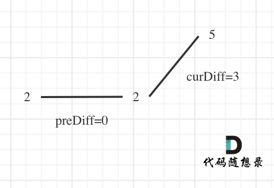

针对以上情形，result 初始为 1（默认最右面有一个峰值），此时 `curDiff > 0 && preDiff <= 0`，那么 `result++`（计算了左面的峰值），最后得到的 result 就是 2（峰值个数为 2 即摆动序列长度为 2）

经过以上分析后，我们可以写出如下代码：

```cpp
// 版本一
class Solution {
public:
    int wiggleMaxLength(vector<int>& nums) {
        if (nums.size() <= 1) return nums.size();
        int curDiff = 0; // 当前一对差值
        int preDiff = 0; // 前一对差值
        int result = 1;  // 记录峰值个数，序列默认序列最右边有一个峰值
        for (int i = 0; i < nums.size() - 1; i++) {
            curDiff = nums[i + 1] - nums[i];
            // 出现峰值
            if ((preDiff <= 0 && curDiff > 0) || (preDiff >= 0 && curDiff < 0)) {
                result++;
            }
            preDiff = curDiff;
        }
        return result;
    }
};
```

- 时间复杂度：`O(n)`
- 空间复杂度：`O(1)`

此时大家是不是发现 以上代码提交也不能通过本题？

所以此时我们要讨论情况三！

#### 情况三：单调坡度有平坡

在版本一中，我们忽略了一种情况，即 如果在一个单调坡度上有平坡，例如`[1,2,2,2,3,4]`，如图：

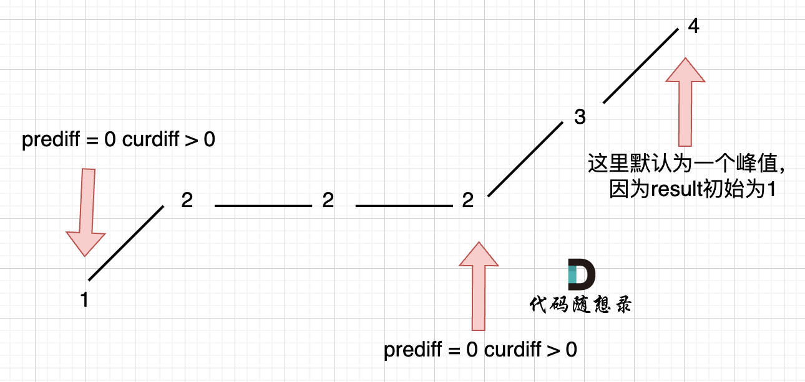

图中，我们可以看出，版本一的代码在三个地方记录峰值，但其实结果因为是 2，因为 单调中的平坡 不能算峰值（即摆动）。

之所以版本一会出问题，是因为我们实时更新了 prediff。

那么我们应该什么时候更新 prediff 呢？

我们只需要在 这个坡度 摆动变化的时候，更新 prediff 就行，这样 prediff 在 单调区间有平坡的时候 就不会发生变化，造成我们的误判。

所以本题的最终代码为：

```cpp
// 版本二
class Solution {
public:
    int wiggleMaxLength(vector<int>& nums) {
        if (nums.size() <= 1) return nums.size();
        int curDiff = 0; // 当前一对差值
        int preDiff = 0; // 前一对差值
        int result = 1;  // 记录峰值个数，序列默认序列最右边有一个峰值
        for (int i = 0; i < nums.size() - 1; i++) {
            curDiff = nums[i + 1] - nums[i];
            // 出现峰值
            if ((preDiff <= 0 && curDiff > 0) || (preDiff >= 0 && curDiff < 0)) {
                result++;
                preDiff = curDiff; // 注意这里，只在摆动变化的时候更新prediff
            }
        }
        return result;
    }
};
```

其实本题看起来好像简单，但需要考虑的情况还是很复杂的，而且很难一次性想到位。

**本题异常情况的本质，就是要考虑平坡**， 平坡分两种，一个是 上下中间有平坡，一个是单调有平坡，如图：

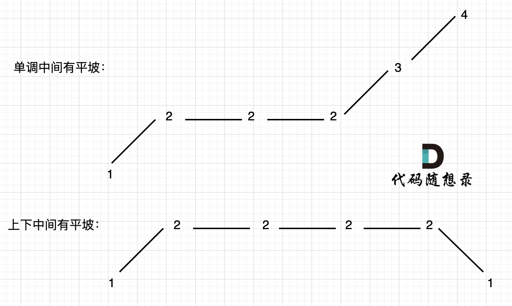

### 思路 2（动态规划）

考虑用动态规划的思想来解决这个问题。

很容易可以发现，对于我们当前考虑的这个数，要么是作为山峰（即 `nums[i] > nums[i-1]`），要么是作为山谷（即 `nums[i] < nums[i - 1]`）。

```text
设 dp 状态dp[i][0] ，表示考虑前 i 个数，第 i 个数作为山峰的摆动子序列的最长长度
设 dp 状态dp[i][1] ，表示考虑前 i 个数，第 i 个数作为山谷的摆动子序列的最长长度
```

则转移方程为：

```text
dp[i][0] = max(dp[i][0], dp[j][1] + 1) ，其中0 < j < i 且nums[j] < nums[i] ，表示将
```

`nums[i]`接到前面某个山谷后面，作为山峰。

```text
dp[i][1] = max(dp[i][1], dp[j][0] + 1) ，其中0 < j < i 且nums[j] > nums[i] ，表示将
```

`nums[i]`接到前面某个山峰后面，作为山谷。

初始状态：

```text
由于一个数可以接到前面的某个数后面，也可以以自身为子序列的起点，所以初始状态为：dp[0][0] = dp[0]
[1] = 1 。
```

`C++`代码如下：

```cpp
class Solution {
public:
    int dp[1005][2];
    int wiggleMaxLength(vector<int>& nums) {
        memset(dp, 0, sizeof dp);
        dp[0][0] = dp[0][1] = 1;
        for (int i = 1; i < nums.size(); ++i) {
            dp[i][0] = dp[i][1] = 1;
            for (int j = 0; j < i; ++j) {
                if (nums[j] > nums[i]) dp[i][1] = max(dp[i][1], dp[j][0] + 1);
            }
            for (int j = 0; j < i; ++j) {
                if (nums[j] < nums[i]) dp[i][0] = max(dp[i][0], dp[j][1] + 1);
            }
        }
        return max(dp[nums.size() - 1][0], dp[nums.size() - 1][1]);
    }
};
```

- 时间复杂度：`O(n^2)`
- 空间复杂度：`O(n)`

**进阶**

可以用两棵线段树来维护区间的最大值

```text
每次更新dp[i][0] ，则在tree1 的nums[i] 位置值更新为dp[i][0]
每次更新dp[i][1] ，则在tree2 的nums[i] 位置值更新为dp[i][1]
```

- 则 dp 转移方程中就没有必要 j 从 0 遍历到 i-1，可以直接在线段树中查询指定区间的值即可。

时间复杂度：`O(nlog n)`

空间复杂度：`O(n)`

# 4. 最大子序和

[力扣题目链接](https://leetcode.cn/problems/maximum-subarray/)

给定一个整数数组 nums ，找到一个具有最大和的连续子数组（子数组最少包含一个元素），返回其最大和。

示例:

- 输入`: [-2,1,-3,4,-1,2,1,-5,4]`
- 输出: 6

- 解释:  连续子数组  `[4,-1,2,1]` 的和最大，为  6。

## 算法公开课

[**《代码随想录》算法视频公开课**](https://programmercarl.com/other/gongkaike.html)**：**[**贪心算法的巧妙需要慢慢体会！LeetCode：53. 最大子序和**](https://www.bilibili.com/video/BV1aY4y1Z7ya)**，相信结合视频在** **看本篇题解，更有助于大家对本题的理解**。

## 思路

### 暴力解法

暴力解法的思路，第一层 for 就是设置起始位置，第二层 for 循环遍历数组寻找最大值

```cpp
class Solution {
public:
    int maxSubArray(vector<int>& nums) {
        int result = INT32_MIN;
        int count = 0;
        for (int i = 0; i < nums.size(); i++) { // 设置起始位置
            count = 0;
            for (int j = i; j < nums.size(); j++) { // 每次从起始位置i开始遍历寻找最大值
                count += nums[j];
                result = count > result ? count : result;
            }
        }
        return result;
    }
};
```

- 时间复杂度：`O(n^2)`
- 空间复杂度：`O(1)`

以上暴力的解法 `C++`勉强可以过，其他语言就不确定了。

### 贪心解法

**贪心贪的是哪里呢？**

如果 -2 1 在一起，计算起点的时候，一定是从 1 开始计算，因为负数只会拉低总和，这就是贪心贪的地方！

局部最优：当前“连续和”为负数的时候立刻放弃，从下一个元素重新计算“连续和”，因为负数加上下一个元素 “连续和”只会越来越小。

全局最优：选取最大“连续和”

**局部最优的情况下，并记录最大的“连续和”，可以推出全局最优**。

从代码角度上来讲：遍历 nums，从头开始用 count 累积，如果 count 一旦加上 `nums[i]`变为负数，那么就应该从 `nums[i+1]`开始从 0 累积 count 了，因为已经变为负数的 count，只会拖累总和。

**这相当于是暴力解法中的不断调整最大子序和区间的起始位置**。

**那有同学问了，区间终止位置不用调整么？ 如何才能得到最大“连续和”呢？**

区间的终止位置，其实就是如果 count 取到最大值了，及时记录下来了。例如如下代码：

```cpp
if (count > result) result = count;
```

**这样相当于是用 result 记录最大子序和区间和（变相的算是调整了终止位置）**。

如动画所示：

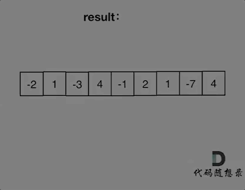

红色的起始位置就是贪心每次取 count 为正数的时候，开始一个区间的统计。

那么不难写出如下 `C++`代码（关键地方已经注释）

```cpp
class Solution {
public:
    int maxSubArray(vector<int>& nums) {
        int result = INT32_MIN;
        int count = 0;
        for (int i = 0; i < nums.size(); i++) {
            count += nums[i];
            if (count > result) { // 取区间累计的最大值（相当于不断确定最大子序终止位置）
                result = count;
            }
            if (count <= 0) count = 0; // 相当于重置最大子序起始位置，因为遇到负数一定是拉低总和
        }
        return result;
    }
};
```

- 时间复杂度：`O(n)`
- 空间复杂度：`O(1)`当然题目没有说如果数组为空，应该返回什么，所以数组为空的话返回啥都可以了。

### 常见误区

误区一：

不少同学认为 如果输入用例都是-1，或者 都是负数，这个贪心算法跑出来的结果是 0， 这是**又一次证明脑洞模拟** **不靠谱的经典案例**，建议大家把代码运行一下试一试，就知道了，也会理解 为什么 result 要初始化为最小负数了。

误区二：

大家在使用贪心算法求解本题，经常陷入的误区，就是分不清，是遇到 负数就选择起始位置，还是连续和为负选择起始位置。

在动画演示用，大家可以发现， 4，遇到 -1 的时候，我们依然累加了，为什么呢？

因为和为 3，只要连续和还是正数就会 对后面的元素 起到增大总和的作用。 所以只要连续和为正数我们就保留。

这里也会有录友疑惑，那 4 + -1 之后 不就变小了吗？ 会不会错过 4 成为最大连续和的可能性？

其实并不会，因为还有一个变量 result 一直在更新 最大的连续和，只要有更大的连续和出现，result 就更新了，那么 result 已经把 4 更新了，后面 连续和变成 3，也不会对最后结果有影响。

### 动态规划

当然本题还可以用动态规划来做，在代码随想录动态规划章节我会详细介绍，如果大家想在想看，可以直接跳转：[动态规划版本详解](https://programmercarl.com/0053.%E6%9C%80%E5%A4%A7%E5%AD%90%E5%BA%8F%E5%92%8C%EF%BC%88%E5%8A%A8%E6%80%81%E8%A7%84%E5%88%92%EF%BC%89.html#%E6%80%9D%E8%B7%AF)

那么先给出我的 dp 代码如下，有时间的录友可以提前做一做：

```cpp
class Solution {
public:
    int maxSubArray(vector<int>& nums) {
        if (nums.size() == 0) return 0;
        vector<int> dp(nums.size(), 0); // dp[i]表示包括i之前的最大连续子序列和
        dp[0] = nums[0];
        int result = dp[0];
        for (int i = 1; i < nums.size(); i++) {
            dp[i] = max(dp[i - 1] + nums[i], nums[i]); // 状态转移公式
            if (dp[i] > result) result = dp[i]; // result 保存dp[i]的最大值
        }
        return result;
    }
};
```

- 时间复杂度：`O(n)`
- 空间复杂度：`O(n)`

## 总结

本题的贪心思路其实并不好想，这也进一步验证了，别看贪心理论很直白，有时候看似是常识，但贪心的题目一点都不简单！

后续将介绍的贪心题目都挺难的，所以贪心很有意思，别小看贪心！

# 5. 本周小结！（贪心算法系列一）

## 周一

本周正式开始了贪心算法，在[关于贪心算法，你该了解这些！](https://programmercarl.com/%E8%B4%AA%E5%BF%83%E7%AE%97%E6%B3%95%E7%90%86%E8%AE%BA%E5%9F%BA%E7%A1%80.html)中，我们介绍了什么是贪心以及贪心的套路。

**贪心的本质是选择每一阶段的局部最优，从而达到全局最优。**

有没有啥套路呢？

**不好意思，贪心没套路，就刷题而言，如果感觉好像局部最优可以推出全局最优，然后想不到反例，那就试一试贪** **心吧！**

而严格的数据证明一般有如下两种：

- 数学归纳法
- 反证法

数学就不在讲解范围内了，感兴趣的同学可以自己去查一查资料。

正是因为贪心算法有时候会感觉这是常识，本就应该这么做！ 所以大家经常看到网上有人说这是一道贪心题目，有人说这不是。

这里说一下我的依据：**如果找到局部最优，然后推出整体最优，那么就是贪心**，大家可以参考哈。

## 周二

在[贪心算法：分发饼干](https://programmercarl.com/0455.%E5%88%86%E5%8F%91%E9%A5%BC%E5%B9%B2.html)中讲解了贪心算法的第一道题目。

这道题目很明显能看出来是用贪心，也是入门好题。

我在文中给出**局部最优：大饼干喂给胃口大的，充分利用饼干尺寸喂饱一个，全局最优：喂饱尽可能多的小孩**。

很多录友都是用小饼干优先先喂饱小胃口的。

后来我想一想，虽然结果是一样的，但是大家的这个思考方式更好一些。

**因为用小饼干优先喂饱小胃口的 这样可以尽量保证最后省下来的是大饼干（虽然题目没有这个要求）！**

所以还是小饼干优先先喂饱小胃口更好一些，也比较直观。

一些录友不清楚[贪心算法：分发饼干](https://programmercarl.com/0455.%E5%88%86%E5%8F%91%E9%A5%BC%E5%B9%B2.html)中时间复杂度是怎么来的？

就是快排`O(nlog n)`，遍历`O(n)`，加一起就是还是`O(nlogn)`。

## 周三

接下来就要上一点难度了，要不然大家会误以为贪心算法就是常识判断一下就行了。

在[贪心算法：摆动序列](https://programmercarl.com/0376.%E6%91%86%E5%8A%A8%E5%BA%8F%E5%88%97.html)中，需要计算最长摇摆序列。

其实就是让序列有尽可能多的局部峰值。

局部最优：删除单调坡度上的节点（不包括单调坡度两端的节点），那么这个坡度就可以有两个局部峰值。

整体最优：整个序列有最多的局部峰值，从而达到最长摆动序列。

在计算峰值的时候，还是有一些代码技巧的，例如序列两端的峰值如何处理。

这些技巧，其实还是要多看多用才会掌握。

## 周四

在[贪心算法：最大子序和](https://programmercarl.com/0053.%E6%9C%80%E5%A4%A7%E5%AD%90%E5%BA%8F%E5%92%8C.html)中，详细讲解了用贪心的方式来求最大子序列和，其实这道题目是一道动态规划的题目。

**贪心的思路为局部最优：当前“连续和”为负数的时候立刻放弃，从下一个元素重新计算“连续和”，因为负数加上下** **一个元素 “连续和”只会越来越小。从而推出全局最优：选取最大“连续和”**

代码很简单，但是思路却比较难。还需要反复琢磨。

针对[贪心算法：最大子序和](https://programmercarl.com/0053.%E6%9C%80%E5%A4%A7%E5%AD%90%E5%BA%8F%E5%92%8C.html)文章中给出的贪心代码如下；

```cpp
class Solution {
public:
    int maxSubArray(vector<int>& nums) {
        int result = INT32_MIN;
        int count = 0;
        for (int i = 0; i < nums.size(); i++) {
            count += nums[i];
            if (count > result) { // 取区间累计的最大值（相当于不断确定最大子序终止位置）
                result = count;
            }
            if (count <= 0) count = 0; // 相当于重置最大子序起始位置，因为遇到负数一定是拉低总和
        }
        return result;
    }
};
```

不少同学都来问，如果数组全是负数这个代码就有问题了，如果数组里有int最小值这个代码就有问题了。

大家不要脑洞模拟哈，可以亲自构造一些测试数据试一试，就发现其实没有问题。

数组都为负数，result记录的就是最小的负数，如果数组里有int最小值，那么最终result就是int最小值。

## 总结

本周我们讲解了[贪心算法的理论基础](https://programmercarl.com/%E8%B4%AA%E5%BF%83%E7%AE%97%E6%B3%95%E7%90%86%E8%AE%BA%E5%9F%BA%E7%A1%80.html)，了解了贪心本质：局部最优推出全局最优。

然后讲解了第一道题目[分发饼干](https://programmercarl.com/0455.%E5%88%86%E5%8F%91%E9%A5%BC%E5%B9%B2.html)，还是比较基础的，可能会给大家一种贪心算法比较简单的错觉，因为贪心有时候接近于常识。

其实我还准备一些简单的贪心题目，甚至网上很多都质疑这些题目是不是贪心算法。这些题目我没有立刻发出来，因为真的会让大家感觉贪心过于简单，而忽略了贪心的本质：局部最优和全局最优两个关键点。

**所以我在贪心系列难度会有所交替，难的题目在于拓展思路，简单的题目在于分析清楚其贪心的本质，后续我还会** **发一些简单的题目来做贪心的分析。**

在[摆动序列](https://programmercarl.com/0376.%E6%91%86%E5%8A%A8%E5%BA%8F%E5%88%97.html)中大家就初步感受到贪心没那么简单了。

本周最后是[最大子序和](https://programmercarl.com/0053.%E6%9C%80%E5%A4%A7%E5%AD%90%E5%BA%8F%E5%92%8C.html)，这道题目要用贪心的方式做出来，就比较有难度，都知道负数加上正数之后会变小，但是这道题目依然会让很多人搞混淆，其关键在于：**不能让“连续和”为负数的时候加上下一个元素，而不是 不让“连续** **和”加上一个负数**。这块真的需要仔细体会！

# 6.买卖股票的最佳时机 II

[力扣题目链接](https://leetcode.cn/problems/best-time-to-buy-and-sell-stock-ii/)

给定一个数组，它的第  i 个元素是一支给定股票第 i 天的价格。

设计一个算法来计算你所能获取的最大利润。你可以尽可能地完成更多的交易（多次买卖一支股票）。

注意：你不能同时参与多笔交易（你必须在再次购买前出售掉之前的股票）。

示例 1:

- 输入`: [7,1,5,3,6,4]`
- 输出: 7
- 解释: 在第 2 天（股票价格 `= 1`）的时候买入，在第 3 天（股票价格 `= 5`）的时候卖出, 这笔交易所能获得利润 `= 5-1 = 4`。随后，在第 4 天（股票价格 `= 3`）的时候买入，在第 5 天（股票价格 `= 6`）的时候卖出, 这笔交易所能获得利润 `= 6-3 = 3` 。

示例 2:

- 输入`: [1,2,3,4,5]`
- 输出: 4
- 解释: 在第 1 天（股票价格 `= 1`）的时候买入，在第 5 天 （股票价格 `= 5`）的时候卖出, 这笔交易所能获得利润 `= 5-1 = 4` 。注意你不能在第 1 天和第 2 天接连购买股票，之后再将它们卖出。因为这样属于同时参与了多笔交易，你必须在再次购买前出售掉之前的股票。

示例  3:

- 输入`: [7,6,4,3,1]`
- 输出: 0
- 解释: 在这种情况下, 没有交易完成, 所以最大利润为 0。

提示：

- `1 <= prices.length <= 3 * 10 ^ 4`

- `0 <= prices[i] <= 10 ^ 4`

## 算法公开课

[**《代码随想录》算法视频公开课**](https://programmercarl.com/other/gongkaike.html)**：**[**贪心算法也能解决股票问题！LeetCode：122.买卖股票最佳时机 II**](https://www.bilibili.com/video/BV1ev4y1C7na)**，相信结合** **视频在看本篇题解，更有助于大家对本题的理解**。

## 思路

本题首先要清楚两点：

- 只有一只股票！
- 当前只有买股票或者卖股票的操作

想获得利润至少要两天为一个交易单元。

### 贪心算法

这道题目可能我们只会想，选一个低的买入，再选个高的卖，再选一个低的买入.....循环反复。

**如果想到其实最终利润是可以分解的，那么本题就很容易了！**

如何分解呢？

假如第 0 天买入，第 3 天卖出，那么利润为：`prices[3] - prices[0]`。

相当于`(prices[3] - prices[2]) + (prices[2] - prices[1]) + (prices[1] - prices[0])`。

**此时就是把利润分解为每天为单位的维度，而不是从 0 天到第 3 天整体去考虑！**

那么根据 prices 可以得到每天的利润序列：`(prices[i] - prices[i - 1]).....(prices[1] - prices[0])`。

如图：

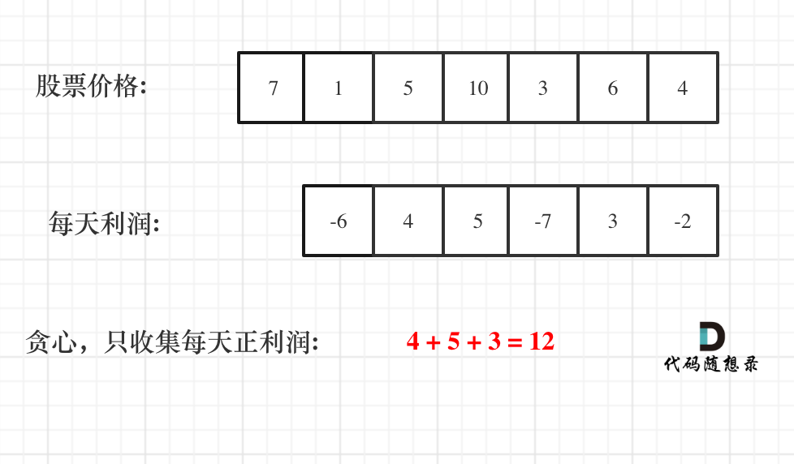

一些同学陷入：第一天怎么就没有利润呢，第一天到底算不算的困惑中。

第一天当然没有利润，至少要第二天才会有利润，所以利润的序列比股票序列少一天！

从图中可以发现，其实我们需要收集每天的正利润就可以，**收集正利润的区间，就是股票买卖的区间，而我们只需** **要关注最终利润，不需要记录区间**。

那么只收集正利润就是贪心所贪的地方！

**局部最优：收集每天的正利润，全局最优：求得最大利润**。

局部最优可以推出全局最优，找不出反例，试一试贪心！

对应 `C++`代码如下：

```cpp
class Solution {
public:
    int maxProfit(vector<int>& prices) {
        int result = 0;
        for (int i = 1; i < prices.size(); i++) {
            result += max(prices[i] - prices[i - 1], 0);
        }
        return result;
    }
};
```

- 时间复杂度：`O(n)`
- 空间复杂度：`O(1)`

### 动态规划

动态规划将在下一个系列详细讲解，本题解先给出我的 `C++`代码（带详细注释），想先学习的话，可以看本篇：[122.买卖股票的最佳时机II（动态规划）](https://programmercarl.com/0122.%E4%B9%B0%E5%8D%96%E8%82%A1%E7%A5%A8%E7%9A%84%E6%9C%80%E4%BD%B3%E6%97%B6%E6%9C%BAII%EF%BC%88%E5%8A%A8%E6%80%81%E8%A7%84%E5%88%92%EF%BC%89.html#%E6%80%9D%E8%B7%AF)

```cpp
class Solution {
public:
    int maxProfit(vector<int>& prices) {
        // dp[i][1]第i天持有的最多现金
        // dp[i][0]第i天持有股票后的最多现金
        int n = prices.size();
        vector<vector<int>> dp(n, vector<int>(2, 0));
        dp[0][0] -= prices[0]; // 持股票
        for (int i = 1; i < n; i++) {
            // 第i天持股票所剩最多现金 = max(第i-1天持股票所剩现金, 第i-1天持现金-买第i天的股票)
            dp[i][0] = max(dp[i - 1][0], dp[i - 1][1] - prices[i]);
            // 第i天持有最多现金 = max(第i-1天持有的最多现金，第i-1天持有股票的最多现金+第i天卖出股
票)
            dp[i][1] = max(dp[i - 1][1], dp[i - 1][0] + prices[i]);
        }
        return max(dp[n - 1][0], dp[n - 1][1]);
    }
};
```

- 时间复杂度：`$O(n)$`
- 空间复杂度：`$O(n)$`

## 总结

股票问题其实是一个系列的，属于动态规划的范畴，因为目前在讲解贪心系列，所以股票问题会在之后的动态规划系列中详细讲解。

**可以看出有时候，贪心往往比动态规划更巧妙，更好用，所以别小看了贪心算法**。

**本题中理解利润拆分是关键点！** 不要整块的去看，而是把整体利润拆为每天的利润。

一旦想到这里了，很自然就会想到贪心了，即：只收集每天的正利润，最后稳稳的就是最大利润了。

# 7. 跳跃游戏

[力扣题目链接](https://leetcode.cn/problems/jump-game/)

给定一个非负整数数组，你最初位于数组的第一个位置。

数组中的每个元素代表你在该位置可以跳跃的最大长度。

判断你是否能够到达最后一个位置。

示例  1:

- 输入`: [2,3,1,1,4]`
- 输出: true
- 解释: 我们可以先跳 1 步，从位置 0 到达 位置 1, 然后再从位置 1 跳 3 步到达最后一个位置。

示例  2:

- 输入`: [3,2,1,0,4]`
- 输出: false
- 解释: 无论怎样，你总会到达索引为 3 的位置。但该位置的最大跳跃长度是 0 ， 所以你永远不可能到达最后一个位置。

## 算法公开课

[**《代码随想录》算法视频公开课**](https://programmercarl.com/other/gongkaike.html)**：**[**贪心算法，怎么跳跃不重要，关键在覆盖范围 | LeetCode：55.跳跃游戏**](https://www.bilibili.com/video/BV1VG4y1X7kB)**，相信** **结合视频在看本篇题解，更有助于大家对本题的理解**。

## 思路

刚看到本题一开始可能想：当前位置元素如果是 3，我究竟是跳一步呢，还是两步呢，还是三步呢，究竟跳几步才是最优呢？

其实跳几步无所谓，关键在于可跳的覆盖范围！

不一定非要明确一次究竟跳几步，每次取最大的跳跃步数，这个就是可以跳跃的覆盖范围。

这个范围内，别管是怎么跳的，反正一定可以跳过来。

**那么这个问题就转化为跳跃覆盖范围究竟可不可以覆盖到终点！**

每次移动取最大跳跃步数（得到最大的覆盖范围），每移动一个单位，就更新最大覆盖范围。

**贪心算法局部最优解：每次取最大跳跃步数（取最大覆盖范围），整体最优解：最后得到整体最大覆盖范围，看是** **否能到终点**。

局部最优推出全局最优，找不出反例，试试贪心！

如图：

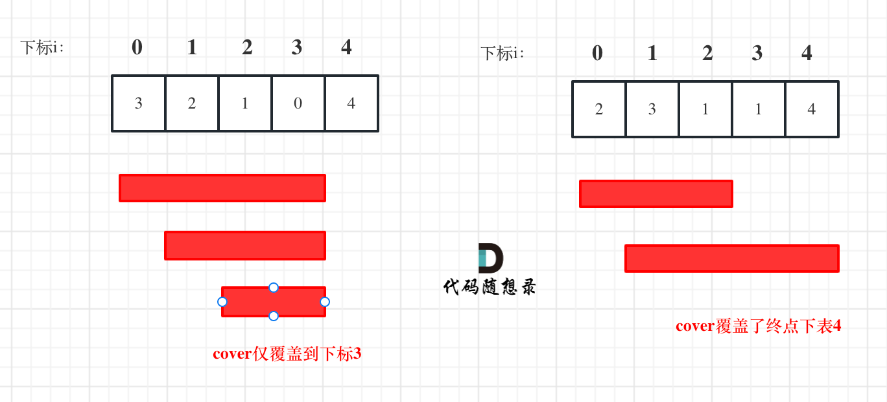

i 每次移动只能在 cover 的范围内移动，每移动一个元素，cover 得到该元素数值（新的覆盖范围）的补充，让 i 继续移动下去。

而 cover 每次只取 `max(`该元素数值补充后的范围, cover 本身范围`)`。

如果 cover 大于等于了终点下标，直接 return true 就可以了。

`C++`代码如下：

```cpp
class Solution {
public:
    bool canJump(vector<int>& nums) {
        int cover = 0;
        if (nums.size() == 1) return true; // 只有一个元素，就是能达到
        for (int i = 0; i <= cover; i++) { // 注意这里是小于等于cover
            cover = max(i + nums[i], cover);
            if (cover >= nums.size() - 1) return true; // 说明可以覆盖到终点了
        }
        return false;
    }
};
```

- 时间复杂度`: O(n)`
- 空间复杂度`: O(1)`

## 总结

这道题目关键点在于：不用拘泥于每次究竟跳几步，而是看覆盖范围，覆盖范围内一定是可以跳过来的，不用管是怎么跳的。

大家可以看出思路想出来了，代码还是非常简单的。

一些同学可能感觉，我在讲贪心系列的时候，题目和题目之间貌似没有什么联系？

**是真的就是没什么联系，因为贪心无套路**！没有个整体的贪心框架解决一系列问题，只能是接触各种类型的题目锻炼自己的贪心思维！

相对于[贪心算法：跳跃游戏](https://mp.weixin.qq.com/s/606_N9j8ACKCODoCbV1lSA)难了不少，做好心里准备！

# 8.跳跃游戏 II

[力扣题目链接](https://leetcode.cn/problems/jump-game-ii/)

给定一个非负整数数组，你最初位于数组的第一个位置。

数组中的每个元素代表你在该位置可以跳跃的最大长度。

你的目标是使用最少的跳跃次数到达数组的最后一个位置。

示例:

- 输入`: [2,3,1,1,4]`
- 输出: 2
- 解释: 跳到最后一个位置的最小跳跃数是 2。从下标为 0 跳到下标为 1 的位置，跳  1  步，然后跳  3  步到达数组的最后一个位置。

说明:假设你总是可以到达数组的最后一个位置。

## 算法公开课

[**《代码随想录》算法视频公开课**](https://programmercarl.com/other/gongkaike.html)**：**[**贪心算法，最少跳几步还得看覆盖范围 | LeetCode： 45.跳跃游戏 II**](https://www.bilibili.com/video/BV1Y24y1r7XZ)**，相信结** **合视频在看本篇题解，更有助于大家对本题的理解**。

## 思路

本题相对于[55.跳跃游戏](https://programmercarl.com/0055.%E8%B7%B3%E8%B7%83%E6%B8%B8%E6%88%8F.html)还是难了不少。

但思路是相似的，还是要看最大覆盖范围。

本题要计算最小步数，那么就要想清楚什么时候步数才一定要加一呢？

贪心的思路，局部最优：当前可移动距离尽可能多走，如果还没到终点，步数再加一。整体最优：一步尽可能多走，从而达到最小步数。

思路虽然是这样，但在写代码的时候还不能真的能跳多远就跳多远，那样就不知道下一步最远能跳到哪里了。

**所以真正解题的时候，要从覆盖范围出发，不管怎么跳，覆盖范围内一定是可以跳到的，以最小的步数增加覆盖范** **围，覆盖范围一旦覆盖了终点，得到的就是最小步数！**

**这里需要统计两个覆盖范围，当前这一步的最大覆盖和下一步最大覆盖**。

如果移动下标达到了当前这一步的最大覆盖最远距离了，还没有到终点的话，那么就必须再走一步来增加覆盖范围，直到覆盖范围覆盖了终点。

如图：

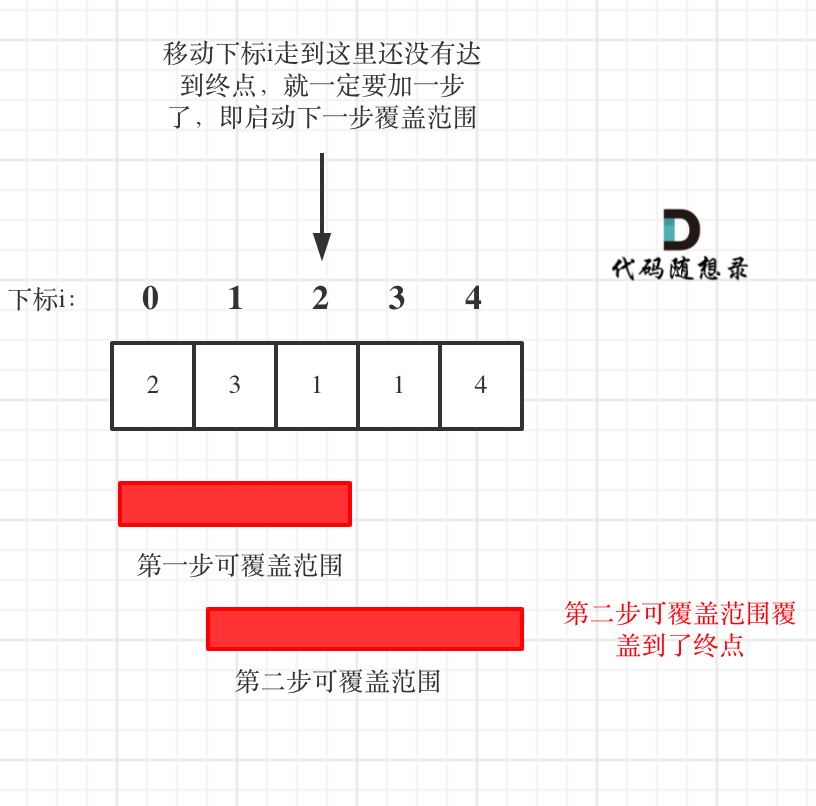

**图中覆盖范围的意义在于，只要红色的区域，最多两步一定可以到！（不用管具体怎么跳，反正一定可以跳到）**

### 方法一

从图中可以看出来，就是移动下标达到了当前覆盖的最远距离下标时，步数就要加一，来增加覆盖距离。最后的步数就是最少步数。

这里还是有个特殊情况需要考虑，当移动下标达到了当前覆盖的最远距离下标时

- 如果当前覆盖最远距离下标不是是集合终点，步数就加一，还需要继续走。
- 如果当前覆盖最远距离下标就是是集合终点，步数不用加一，因为不能再往后走了。

`C++`代码如下：（详细注释）

```cpp
// 版本一
class Solution {
public:
    int jump(vector<int>& nums) {
        if (nums.size() == 1) return 0;
        int curDistance = 0;    // 当前覆盖最远距离下标
        int ans = 0;            // 记录走的最大步数
        int nextDistance = 0;   // 下一步覆盖最远距离下标
        for (int i = 0; i < nums.size(); i++) {
            nextDistance = max(nums[i] + i, nextDistance);  // 更新下一步覆盖最远距离下标
            if (i == curDistance) {                         // 遇到当前覆盖最远距离下标
                ans++;                                  // 需要走下一步
                curDistance = nextDistance;             // 更新当前覆盖最远距离下标（相当于加
油了）
                if (nextDistance >= nums.size() - 1) break;  // 当前覆盖最远距到达集合终点，
不用做ans++操作了，直接结束
            }
        }
        return ans;
    }
};
```

- 时间复杂度`: O(n)`
- 空间复杂度`: O(1)`

### 方法二

依然是贪心，思路和方法一差不多，代码可以简洁一些。

**针对于方法一的特殊情况，可以统一处理**，即：移动下标只要遇到当前覆盖最远距离的下标，直接步数加一，不考虑是不是终点的情况。

想要达到这样的效果，只要让移动下标，最大只能移动到 nums.size - 2 的地方就可以了。

因为当移动下标指向 nums.size - 2 时：

- 如果移动下标等于当前覆盖最大距离下标， 需要再走一步（即 `ans++`），因为最后一步一定是可以到的终点。（题目假设总是可以到达数组的最后一个位置），如图：

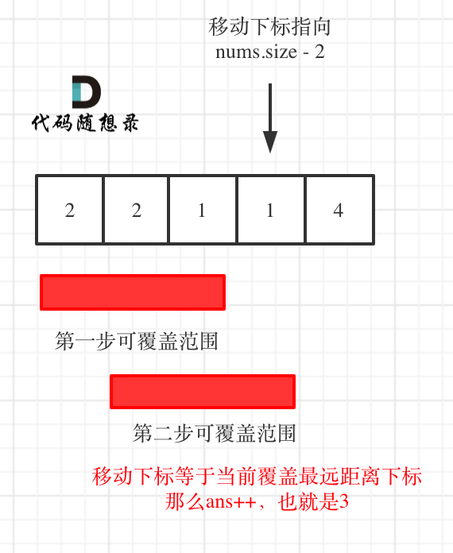

- 如果移动下标不等于当前覆盖最大距离下标，说明当前覆盖最远距离就可以直接达到终点了，不需要再走一步。如图：

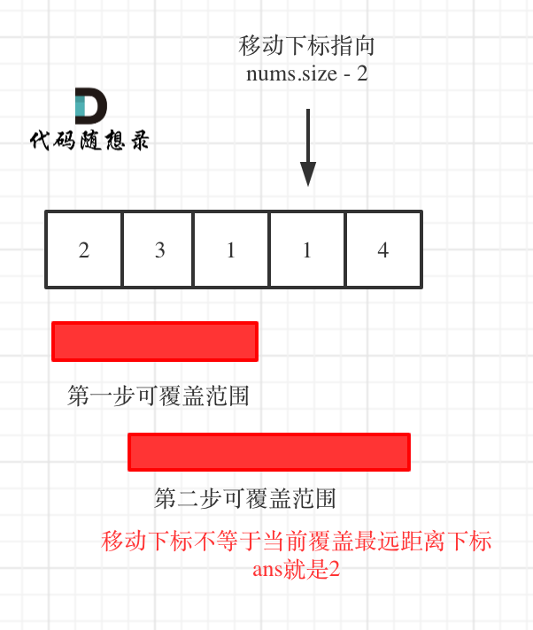

代码如下：

```cpp
// 版本二
class Solution {
public:
    int jump(vector<int>& nums) {
        int curDistance = 0;    // 当前覆盖的最远距离下标
        int ans = 0;            // 记录走的最大步数
        int nextDistance = 0;   // 下一步覆盖的最远距离下标
        for (int i = 0; i < nums.size() - 1; i++) { // 注意这里是小于nums.size() - 1，这是
关键所在
            nextDistance = max(nums[i] + i, nextDistance); // 更新下一步覆盖的最远距离下标
            if (i == curDistance) {                 // 遇到当前覆盖的最远距离下标
                curDistance = nextDistance;         // 更新当前覆盖的最远距离下标
                ans++;
            }
        }
        return ans;
    }
};
```

- 时间复杂度`: O(n)`
- 空间复杂度`: O(1)`

可以看出版本二的代码相对于版本一简化了不少！

**其精髓在于控制移动下标 i 只移动到 nums.size() - 2 的位置**，所以移动下标只要遇到当前覆盖最远距离的下标，直接步数加一，不用考虑别的了。

## 总结

相信大家可以发现，这道题目相当于[55.跳跃游戏](https://programmercarl.com/0055.%E8%B7%B3%E8%B7%83%E6%B8%B8%E6%88%8F.html)难了不止一点。

但代码又十分简单，贪心就是这么巧妙。

理解本题的关键在于：**以最小的步数增加最大的覆盖范围，直到覆盖范围覆盖了终点**，这个范围内最小步数一定可以跳到，不用管具体是怎么跳的，不纠结于一步究竟跳一个单位还是两个单位。

# 9.K次取反后最大化的数组和

[力扣题目链接](https://leetcode.cn/problems/maximize-sum-of-array-after-k-negations/)

给定一个整数数组 A，我们只能用以下方法修改该数组：我们选择某个索引 i 并将 `A[i]` 替换为 `-A[i]`，然后总共重复这个过程 K 次。（我们可以多次选择同一个索引 i。）

以这种方式修改数组后，返回数组可能的最大和。

示例 1：

- 输入：`A = [4,2,3], K = 1`
- 输出：5
- 解释：选择索引 `(1,)` ，然后 A 变为 `[4,-2,3]`。

示例 2：

- 输入：`A = [3,-1,0,2], K = 3`

- 输出：6
- 解释：选择索引 `(1, 2, 2)` ，然后 A 变为 `[3,1,0,2]`。

示例 3：

- 输入：`A = [2,-3,-1,5,-4], K = 2`
- 输出：13
- 解释：选择索引 `(1, 4)` ，然后 A 变为 `[2,3,-1,5,4]`。

提示：

- `1 <= A.length <= 10000`
- `1 <= K <= 10000`
- `-100 <= A[i] <= 100`

## 算法公开课

[**《代码随想录》算法视频公开课**](https://programmercarl.com/other/gongkaike.html)**：贪心算法，这不就是常识？还能叫贪心？LeetCode：1005.K次取反后最大化的** **数组和，相信结合视频在看本篇题解，更有助于大家对本题的理解**。

## 思路

本题思路其实比较好想了，如何可以让数组和最大呢？

贪心的思路，局部最优：让绝对值大的负数变为正数，当前数值达到最大，整体最优：整个数组和达到最大。

局部最优可以推出全局最优。

那么如果将负数都转变为正数了，K依然大于0，此时的问题是一个有序正整数序列，如何转变K次正负，让 数组和 达到最大。

那么又是一个贪心：局部最优：只找数值最小的正整数进行反转，当前数值和可以达到最大（例如正整数数组`{5, 3,` `1}`，反转1 得到-1 比 反转5得到的-5 大多了），全局最优：整个 数组和 达到最大。

虽然这道题目大家做的时候，可能都不会去想什么贪心算法，一鼓作气，就AC了。

**我这里其实是为了给大家展现出来 经常被大家忽略的贪心思路，这么一道简单题，就用了两次贪心！**

那么本题的解题步骤为：

- 第一步：将数组按照绝对值大小从大到小排序，**注意要按照绝对值的大小**
- 第二步：从前向后遍历，遇到负数将其变为正数，同时`K--`
- 第三步：如果K还大于0，那么反复转变数值最小的元素，将K用完
- 第四步：求和

对应`C++`代码如下：

```cpp
class Solution {
static bool cmp(int a, int b) {
    return abs(a) > abs(b);
}
public:
    int largestSumAfterKNegations(vector<int>& A, int K) {
        sort(A.begin(), A.end(), cmp);       // 第一步
        for (int i = 0; i < A.size(); i++) { // 第二步
            if (A[i] < 0 && K > 0) {
                A[i] *= -1;
                K--;
            }
        }
        if (K % 2 == 1) A[A.size() - 1] *= -1; // 第三步
        int result = 0;
        for (int a : A) result += a;        // 第四步
        return result;
    }
};
```

- 时间复杂度`: O(nlogn)`
- 空间复杂度`: O(1)`

## 总结

贪心的题目如果简单起来，会让人简单到开始怀疑：本来不就应该这么做么？这也算是算法？我认为这不是贪心？

本题其实很简单，不会贪心算法的同学都可以做出来，但是我还是全程用贪心的思路来讲解。

因为贪心的思考方式一定要有！

**如果没有贪心的思考方式（局部最优，全局最优），很容易陷入贪心简单题凭感觉做，贪心难题直接不会做，其实** **这样就锻炼不了贪心的思考方式了**。

所以明知道是贪心简单题，也要靠贪心的思考方式来解题，这样对培养解题感觉很有帮助。

# 10. 本周小结！（贪心算法系列二）

## 周一

一说到股票问题，一般都会想到动态规划，其实有时候贪心更有效！

在[贪心算法：买卖股票的最佳时机II](https://programmercarl.com/0122.%E4%B9%B0%E5%8D%96%E8%82%A1%E7%A5%A8%E7%9A%84%E6%9C%80%E4%BD%B3%E6%97%B6%E6%9C%BAII.html)中，讲到只能多次买卖一支股票，如何获取最大利润。

**这道题目理解利润拆分是关键点！** 不要整块的去看，而是把整体利润拆为每天的利润，就很容易想到贪心了。

**局部最优：只收集每天的正利润，全局最优：得到最大利润**。

如果正利润连续上了，相当于连续持有股票，而本题并不需要计算具体的区间。

如图：


## 周二

在[贪心算法：跳跃游戏](https://programmercarl.com/0055.%E8%B7%B3%E8%B7%83%E6%B8%B8%E6%88%8F.html)中是给你一个数组看能否跳到终点。

本题贪心的关键是：**不用拘泥于每次究竟跳几步，而是看覆盖范围，覆盖范围内一定是可以跳过来的，不用管是怎** **么跳的**。

**那么这个问题就转化为跳跃覆盖范围究竟可不可以覆盖到终点！**

贪心算法局部最优解：移动下标每次取最大跳跃步数（取最大覆盖范围），整体最优解：最后得到整体最大覆盖范围，看是否能到终点

如果覆盖范围覆盖到了终点，就表示一定可以跳过去。

如图：

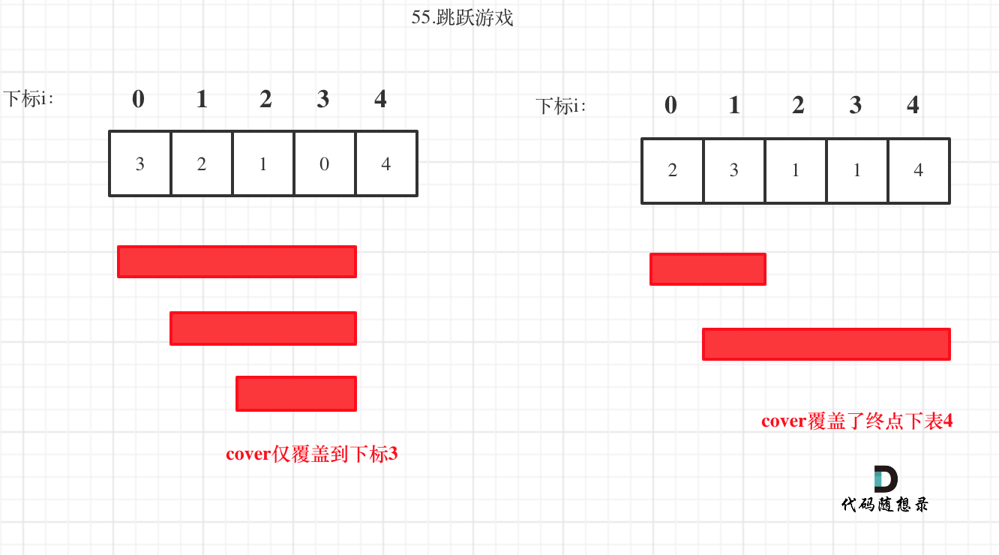

## 周三

这道题目：[贪心算法：跳跃游戏II](https://programmercarl.com/0045.%E8%B7%B3%E8%B7%83%E6%B8%B8%E6%88%8FII.html)可就有点难了。

本题解题关键在于：**以最小的步数增加最大的覆盖范围，直到覆盖范围覆盖了终点**。

那么局部最优：求当前这步的最大覆盖，那么尽可能多走，到达覆盖范围的终点，只需要一步。整体最优：达到终点，步数最少。

如图：


注意：**图中的移动下标是到当前这步覆盖的最远距离（下标2的位置），此时没有到终点，只能增加第二步来扩大** **覆盖范围**。

在[贪心算法：跳跃游戏II](https://programmercarl.com/0045.%E8%B7%B3%E8%B7%83%E6%B8%B8%E6%88%8FII.html)中我给出了两个版本的代码。

其实本质都是超过当前覆盖范围，步数就加一，但版本一需要考虑当前覆盖最远距离下标是不是数组终点的情况。

而版本二就比较统一的，超过范围，步数就加一，但在移动下标的范围了做了文章。

即如果覆盖最远距离下标是倒数第二点：直接加一就行，默认一定可以到终点。如图：


如果覆盖最远距离下标不是倒数第二点，说明本次覆盖已经到终点了。如图：


有的录友认为版本一好理解，有的录友认为版本二好理解，其实掌握一种就可以了，也不用非要比拼一下代码的简洁性，简洁程度都差不多了。

我个人倾向于版本一的写法，思路清晰一点，版本二会有点绕。

## 周四

这道题目：[贪心算法：K次取反后最大化的数组和](https://programmercarl.com/1005.K%E6%AC%A1%E5%8F%96%E5%8F%8D%E5%90%8E%E6%9C%80%E5%A4%A7%E5%8C%96%E7%9A%84%E6%95%B0%E7%BB%84%E5%92%8C.html)就比较简单了，哈哈，用简单题来讲一讲贪心的思想。

**这里其实用了两次贪心！**第一次贪心：局部最优：让绝对值大的负数变为正数，当前数值达到最大，整体最优：整个数组和达到最大。

处理之后，如果K依然大于0，此时的问题是一个有序正整数序列，如何转变K次正负，让 数组和 达到最大。

第二次贪心：局部最优：只找数值最小的正整数进行反转，当前数值可以达到最大（例如正整数数组`{5, 3, 1}`，反转1 得到-1 比 反转5得到的-5 大多了），全局最优：整个 数组和 达到最大。

[贪心算法：K次取反后最大化的数组和](https://programmercarl.com/1005.K%E6%AC%A1%E5%8F%96%E5%8F%8D%E5%90%8E%E6%9C%80%E5%A4%A7%E5%8C%96%E7%9A%84%E6%95%B0%E7%BB%84%E5%92%8C.html)中的代码，最后while处理K的时候，其实直接判断奇偶数就可以了，文中给出的方式太粗暴了，哈哈，Carl大意了。

例外一位录友留言给出一个很好的建议，因为文中是使用快排，仔细看题，**题目中限定了数据范围是正负一百，所** **以可以使用桶排序**，这样时间复杂度就可以优化为`$O(n)$`了。但可能代码要复杂一些了。

## 总结

大家会发现本周的代码其实都简单，但思路却很巧妙，并不容易写出来。

如果是第一次接触的话，其实很难想出来，就是接触过之后就会了，所以大家不用感觉自己想不出来而烦躁，哈哈。

相信此时大家现在对贪心算法又有一个新的认识了，加油


!

# 11. 加油站

[力扣题目链接](https://leetcode.cn/problems/gas-station/)

在一条环路上有 N 个加油站，其中第 i 个加油站有汽油 `gas[i]` 升。

你有一辆油箱容量无限的的汽车，从第 i 个加油站开往第 i+1 个加油站需要消耗汽油 `cost[i]` 升。你从其中的一个加油站出发，开始时油箱为空。

如果你可以绕环路行驶一周，则返回出发时加油站的编号，否则返回 -1。

说明: 

- 如果题目有解，该答案即为唯一答案。
- 输入数组均为非空数组，且长度相同。
- 输入数组中的元素均为非负数。

示例 1:  
输入:

- `gas  = [1,2,3,4,5]`
- `cost = [3,4,5,1,2]`

输出: 3  
解释:

- 从 3 号加油站`(`索引为 3 处`)`出发，可获得 4 升汽油。此时油箱有 `= 0 + 4 = 4` 升汽油

- 开往 4 号加油站，此时油箱有 `4 - 1 + 5 = 8` 升汽油
- 开往 0 号加油站，此时油箱有 `8 - 2 + 1 = 7` 升汽油
- 开往 1 号加油站，此时油箱有 `7 - 3 + 2 = 6` 升汽油
- 开往 2 号加油站，此时油箱有 `6 - 4 + 3 = 5` 升汽油
- 开往 3 号加油站，你需要消耗 5 升汽油，正好足够你返回到 3 号加油站。
- 因此，3 可为起始索引。

示例 2:  
输入:

- `gas  = [2,3,4]`
- `cost = [3,4,3]`
- 输出: -1
- 解释:你不能从 0 号或 1 号加油站出发，因为没有足够的汽油可以让你行驶到下一个加油站。我们从 2 号加油站出发，可以获得 4 升汽油。 此时油箱有 `= 0 + 4 = 4` 升汽油。开往 0 号加油站，此时油箱有 `4 - 3 + 2 = 3` 升汽油。开往 1 号加油站，此时油箱有 `3 - 3 + 3 = 3` 升汽油。你无法返回 2 号加油站，因为返程需要消耗 4 升汽油，但是你的油箱只有 3 升汽油。因此，无论怎样，你都不可能绕环路行驶一周。

## 算法公开课

[**《代码随想录》算法视频公开课**](https://programmercarl.com/other/gongkaike.html)**：**[**贪心算法，得这么加油才能跑完全程！LeetCode ：134.加油站**](https://www.bilibili.com/video/BV1jA411r7WX)**，相信结合视频** **在看本篇题解，更有助于大家对本题的理解**。

## 思路

### 暴力方法

暴力的方法很明显就是`O(n^2)`的，遍历每一个加油站为起点的情况，模拟一圈。

如果跑了一圈，中途没有断油，而且最后油量大于等于0，说明这个起点是ok的。

暴力的方法思路比较简单，但代码写起来也不是很容易，关键是要模拟跑一圈的过程。

**for循环适合模拟从头到尾的遍历，而while循环适合模拟环形遍历，要善于使用while！**

`C++`代码如下：

```cpp
class Solution {
public:
    int canCompleteCircuit(vector<int>& gas, vector<int>& cost) {
        for (int i = 0; i < cost.size(); i++) {
            int rest = gas[i] - cost[i]; // 记录剩余油量
            int index = (i + 1) % cost.size();
            while (rest > 0 && index != i) { // 模拟以i为起点行驶一圈（如果有rest==0，那么答案
就不唯一了）
                rest += gas[index] - cost[index];
                index = (index + 1) % cost.size();
            }
            // 如果以i为起点跑一圈，剩余油量>=0，返回该起始位置
            if (rest >= 0 && index == i) return i;
        }
        return -1;
    }
};
```

- 时间复杂度：`O(n^2)`
- 空间复杂度：`O(1)`

### 贪心算法（方法一）

直接从全局进行贪心选择，情况如下：

- 情况一：如果gas的总和小于cost总和，那么无论从哪里出发，一定是跑不了一圈的
- 情况二：`rest[i] = gas[i]-cost[i]`为一天剩下的油，i从0开始计算累加到最后一站，如果累加没有出现负数，说明从0出发，油就没有断过，那么0就是起点。
- 情况三：如果累加的最小值是负数，汽车就要从非0节点出发，从后向前，看哪个节点能把这个负数填平，能把这个负数填平的节点就是出发节点。

`C++`代码如下：

```cpp
class Solution {
public:
    int canCompleteCircuit(vector<int>& gas, vector<int>& cost) {
        int curSum = 0;
        int min = INT_MAX; // 从起点出发，油箱里的油量最小值
        for (int i = 0; i < gas.size(); i++) {
            int rest = gas[i] - cost[i];
            curSum += rest;
            if (curSum < min) {
                min = curSum;
            }
        }
        if (curSum < 0) return -1;  // 情况1
        if (min >= 0) return 0;     // 情况2
                                    // 情况3
        for (int i = gas.size() - 1; i >= 0; i--) {
            int rest = gas[i] - cost[i];
            min += rest;
            if (min >= 0) {
                return i;
            }
        }
        return -1;
    }
};
```

- 时间复杂度：`O(n)`
- 空间复杂度：`O(1)`

**其实我不认为这种方式是贪心算法，因为没有找出局部最优，而是直接从全局最优的角度上思考问题**。

但这种解法又说不出是什么方法，这就是一个从全局角度选取最优解的模拟操作。

所以对于本解法是贪心，我持保留意见！

但不管怎么说，解法毕竟还是巧妙的，不用过于执着于其名字称呼。

### 贪心算法（方法二）

可以换一个思路，首先如果总油量减去总消耗大于等于零那么一定可以跑完一圈，说明 各个站点的加油站 剩油量`rest[i]`相加一定是大于等于零的。

每个加油站的剩余量`rest[i]`为`gas[i] - cost[i]`。

i从0开始累加`rest[i]`，和记为curSum，一旦curSum小于零，说明`[0, i]`区间都不能作为起始位置，因为这个区间选择任何一个位置作为起点，到i这里都会断油，那么起始位置从i+1算起，再从0计算curSum。

如图：

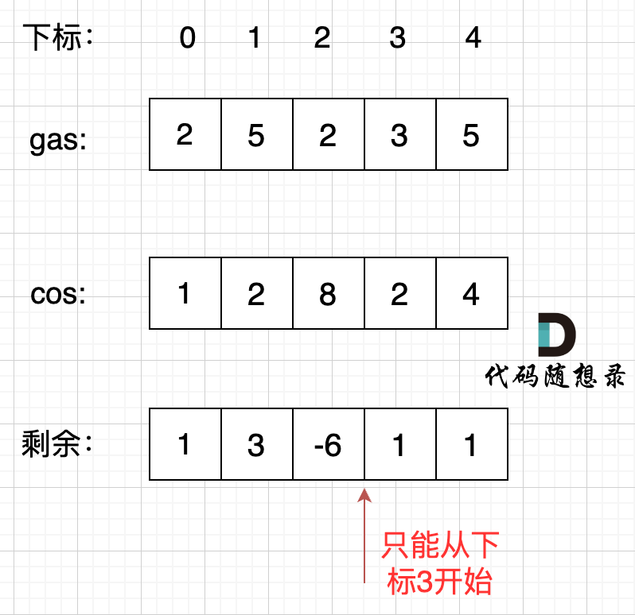

那么为什么一旦`[0`，`i]` 区间和为负数，起始位置就可以是i+1呢，i+1后面就不会出现更大的负数？

如果出现更大的负数，就是更新i，那么起始位置又变成新的i+1了。

那有没有可能 `[0`，`i]` 区间 选某一个作为起点，累加到 i这里 curSum是不会小于零呢？  如图： 

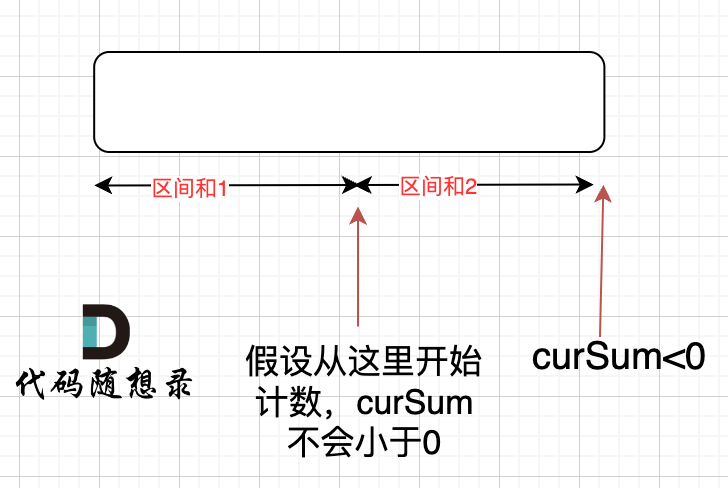

如果 `curSum<0` 说明 区间和1 + 区间和`2 < 0`， 那么 假设从上图中的位置开始计数curSum不会小于0的话，就是 区间和`2>0`。 

区间和1 + 区间和`2 < 0` 同时 区间和`2>0`，只能说明区间和`1 < 0`， 那么就会从假设的箭头初就开始从新选择其实位置了。 

**那么局部最优：当前累加rest[i]的和curSum一旦小于0，起始位置至少要是i+1，因为从i之前开始一定不行。全局** **最优：找到可以跑一圈的起始位置**。

局部最优可以推出全局最优，找不出反例，试试贪心！

`C++`代码如下：

```cpp
class Solution {
public:
    int canCompleteCircuit(vector<int>& gas, vector<int>& cost) {
        int curSum = 0;
        int totalSum = 0;
        int start = 0;
        for (int i = 0; i < gas.size(); i++) {
            curSum += gas[i] - cost[i];
            totalSum += gas[i] - cost[i];
            if (curSum < 0) {   // 当前累加rest[i]和 curSum一旦小于0
                start = i + 1;  // 起始位置更新为i+1
                curSum = 0;     // curSum从0开始
            }
        }
        if (totalSum < 0) return -1; // 说明怎么走都不可能跑一圈了
        return start;
    }
};
```

- 时间复杂度：`O(n)`
- 空间复杂度：`O(1)`

**说这种解法为贪心算法，才是有理有据的，因为全局最优解是根据局部最优推导出来的**。

## 总结

对于本题首先给出了暴力解法，暴力解法模拟跑一圈的过程其实比较考验代码技巧的，要对while使用的很熟练。

然后给出了两种贪心算法，对于第一种贪心方法，其实我认为就是一种直接从全局选取最优的模拟操作，思路还是很巧妙的，值得学习一下。

对于第二种贪心方法，才真正体现出贪心的精髓，用局部最优可以推出全局最优，进而求得起始位置。

# 12. 分发糖果

[力扣题目链接](https://leetcode.cn/problems/candy/)

老师想给孩子们分发糖果，有 N 个孩子站成了一条直线，老师会根据每个孩子的表现，预先给他们评分。

你需要按照以下要求，帮助老师给这些孩子分发糖果：

- 每个孩子至少分配到 1 个糖果。
- 相邻的孩子中，评分高的孩子必须获得更多的糖果。

那么这样下来，老师至少需要准备多少颗糖果呢？

示例 1:

- 输入`: [1,0,2]`
- 输出: 5
- 解释: 你可以分别给这三个孩子分发 2、1、2 颗糖果。

示例 2:

- 输入`: [1,2,2]`
- 输出: 4
- 解释: 你可以分别给这三个孩子分发 1、2、1 颗糖果。第三个孩子只得到 1 颗糖果，这已满足上述两个条件。

## 算法公开课

[**《代码随想录》算法视频公开课**](https://programmercarl.com/other/gongkaike.html)**：**[**贪心算法，两者兼顾很容易顾此失彼！LeetCode：135.分发糖果**](https://www.bilibili.com/video/BV1ev4y1r7wN)**，相信结合视** **频在看本篇题解，更有助于大家对本题的理解**。

## 思路

这道题目一定是要确定一边之后，再确定另一边，例如比较每一个孩子的左边，然后再比较右边，**如果两边一起考** **虑一定会顾此失彼**。

先确定右边评分大于左边的情况（也就是从前向后遍历）

此时局部最优：只要右边评分比左边大，右边的孩子就多一个糖果，全局最优：相邻的孩子中，评分高的右孩子获得比左边孩子更多的糖果

局部最优可以推出全局最优。

如果`ratings[i] > ratings[i - 1]` 那么`[i]`的糖 一定要比`[i - 1]`的糖多一个，所以贪心：`candyVec[i] = candyVec[i - 1] + 1`

代码如下：

```cpp
// 从前向后
for (int i = 1; i < ratings.size(); i++) {
    if (ratings[i] > ratings[i - 1]) candyVec[i] = candyVec[i - 1] + 1;
}
```

如图：

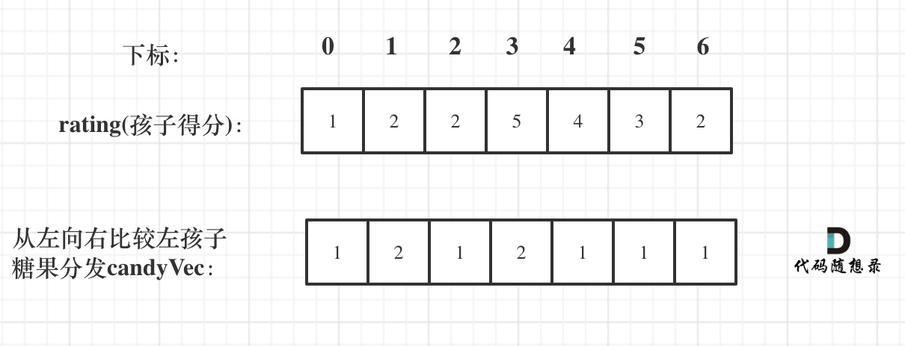

再确定左孩子大于右孩子的情况（从后向前遍历）

遍历顺序这里有同学可能会有疑问，为什么不能从前向后遍历呢？

因为 `rating[5]`与`rating[4]`的比较  要利用上 `rating[5]`与`rating[6]`的比较结果，所以 要从后向前遍历。

如果从前向后遍历，`rating[5]`与`rating[4]`的比较 就不能用上 `rating[5]`与`rating[6]`的比较结果了 。如图：

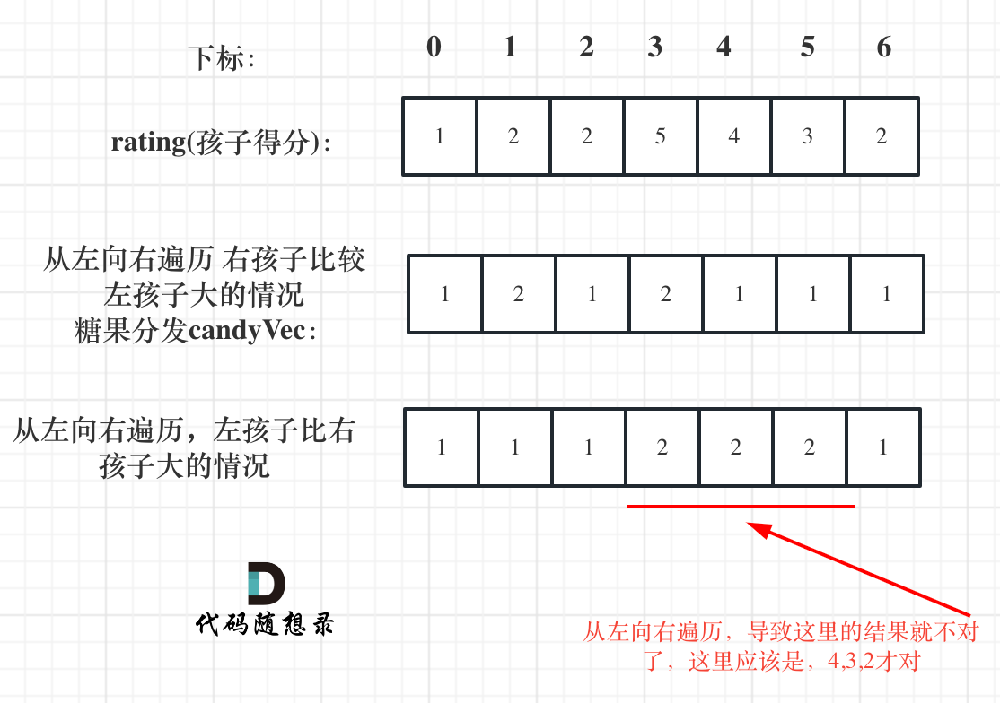

**所以确定左孩子大于右孩子的情况一定要从后向前遍历！**

如果 `ratings[i] > ratings[i + 1]`，此时`candyVec[i]`（第i个小孩的糖果数量）就有两个选择了，一个是`candyVec[i +` `1] + 1`（从右边这个加1得到的糖果数量），一个是`candyVec[i]`（之前比较右孩子大于左孩子得到的糖果数量）。

那么又要贪心了，局部最优：取`candyVec[i + 1] + 1` 和 `candyVec[i]` 最大的糖果数量，保证第i个小孩的糖果数量既大于左边的也大于右边的。全局最优：相邻的孩子中，评分高的孩子获得更多的糖果。

局部最优可以推出全局最优。

所以就取`candyVec[i + 1] + 1` 和 `candyVec[i]` 最大的糖果数量，**candyVec[i]只有取最大的才能既保持对左边** **candyVec[i - 1]的糖果多，也比右边candyVec[i + 1]的糖果多**。

如图：

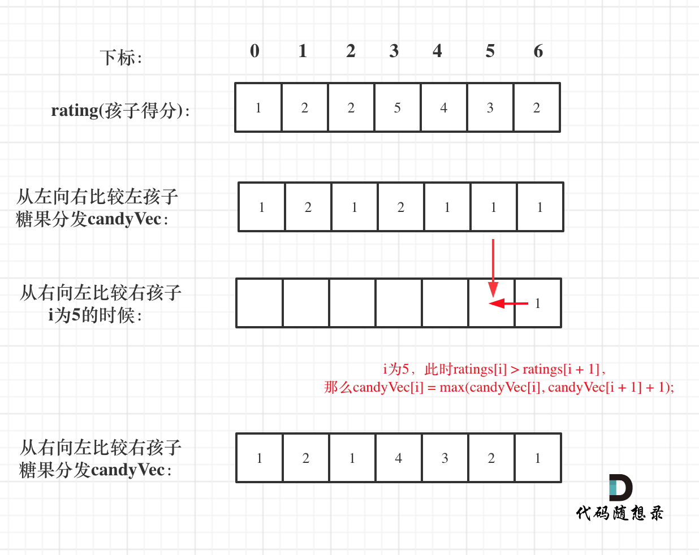

所以该过程代码如下：

```cpp
// 从后向前
for (int i = ratings.size() - 2; i >= 0; i--) {
    if (ratings[i] > ratings[i + 1] ) {
        candyVec[i] = max(candyVec[i], candyVec[i + 1] + 1);
    }
}
```

整体代码如下：

```cpp
class Solution {
public:
    int candy(vector<int>& ratings) {
        vector<int> candyVec(ratings.size(), 1);
        // 从前向后
        for (int i = 1; i < ratings.size(); i++) {
            if (ratings[i] > ratings[i - 1]) candyVec[i] = candyVec[i - 1] + 1;
        }
        // 从后向前
        for (int i = ratings.size() - 2; i >= 0; i--) {
            if (ratings[i] > ratings[i + 1] ) {
                candyVec[i] = max(candyVec[i], candyVec[i + 1] + 1);
            }
        }
        // 统计结果
        int result = 0;
        for (int i = 0; i < candyVec.size(); i++) result += candyVec[i];
        return result;
    }
};
```

- 时间复杂度`: O(n)`
- 空间复杂度`: O(n)`

## 总结

这在leetcode上是一道困难的题目，其难点就在于贪心的策略，如果在考虑局部的时候想两边兼顾，就会顾此失彼。

那么本题我采用了两次贪心的策略：

- 一次是从左到右遍历，只比较右边孩子评分比左边大的情况。
- 一次是从右到左遍历，只比较左边孩子评分比右边大的情况。

这样从局部最优推出了全局最优，即：相邻的孩子中，评分高的孩子获得更多的糖果。

# 13.柠檬水找零

[力扣题目链接](https://leetcode.cn/problems/lemonade-change/)

在柠檬水摊上，每一杯柠檬水的售价为 5 美元。

顾客排队购买你的产品，（按账单 bills 支付的顺序）一次购买一杯。

每位顾客只买一杯柠檬水，然后向你付 5 美元、10 美元或 20 美元。你必须给每个顾客正确找零，也就是说净交易是每位顾客向你支付 5 美元。

注意，一开始你手头没有任何零钱。

如果你能给每位顾客正确找零，返回 true ，否则返回 false 。

示例 1：

- 输入：`[5,5,5,10,20]`
- 输出：true

- 解释：

前 3 位顾客那里，我们按顺序收取 3 张 5 美元的钞票。第 4 位顾客那里，我们收取一张 10 美元的钞票，并返还 5 美元。第 5 位顾客那里，我们找还一张 10 美元的钞票和一张 5 美元的钞票。由于所有客户都得到了正确的找零，所以我们输出 true。

示例 2：

- 输入：`[5,5,10]`
- 输出：true

示例 3：

- 输入：`[10,10]`
- 输出：false

示例 4：

- 输入：`[5,5,10,10,20]`
- 输出：false
- 解释：

前 2 位顾客那里，我们按顺序收取 2 张 5 美元的钞票。对于接下来的 2 位顾客，我们收取一张 10 美元的钞票，然后返还 5 美元。对于最后一位顾客，我们无法退回 15 美元，因为我们现在只有两张 10 美元的钞票。由于不是每位顾客都得到了正确的找零，所以答案是 false。

提示：

- `0 <= bills.length <= 10000`
- `bills[i]` 不是 5 就是 10 或是 20 

## 算法公开课

[**《代码随想录》算法视频公开课**](https://programmercarl.com/other/gongkaike.html)**：**[**贪心算法，看上去复杂，其实逻辑都是固定的！LeetCode：860.柠檬水找零**](https://www.bilibili.com/video/BV12x4y1j7DD)**，** **相信结合视频在看本篇题解，更有助于大家对本题的理解**。

## 思路

这是前几天的leetcode每日一题，感觉不错，给大家讲一下。

这道题目刚一看，可能会有点懵，这要怎么找零才能保证完成全部账单的找零呢？

**但仔细一琢磨就会发现，可供我们做判断的空间非常少！**

只需要维护三种金额的数量，5，10和20。

有如下三种情况：

- 情况一：账单是5，直接收下。

- 情况二：账单是10，消耗一个5，增加一个10
- 情况三：账单是20，优先消耗一个10和一个5，如果不够，再消耗三个5

此时大家就发现 情况一，情况二，都是固定策略，都不用我们来做分析了，而唯一不确定的其实在情况三。

而情况三逻辑也不复杂甚至感觉纯模拟就可以了，其实情况三这里是有贪心的。

账单是20的情况，为什么要优先消耗一个10和一个5呢？

**因为美元10只能给账单20找零，而美元5可以给账单10和账单20找零，美元5更万能！**

所以局部最优：遇到账单20，优先消耗美元10，完成本次找零。全局最优：完成全部账单的找零。

局部最优可以推出全局最优，并找不出反例，那么就试试贪心算法！

`C++`代码如下：

```cpp
class Solution {
public:
    bool lemonadeChange(vector<int>& bills) {
        int five = 0, ten = 0, twenty = 0;
        for (int bill : bills) {
            // 情况一
            if (bill == 5) five++;
            // 情况二
            if (bill == 10) {
                if (five <= 0) return false;
                ten++;
                five--;
            }
            // 情况三
            if (bill == 20) {
                // 优先消耗10美元，因为5美元的找零用处更大，能多留着就多留着
                if (five > 0 && ten > 0) {
                    five--;
                    ten--;
                    twenty++; // 其实这行代码可以删了，因为记录20已经没有意义了，不会用20来找零
                } else if (five >= 3) {
                    five -= 3;
                    twenty++; // 同理，这行代码也可以删了
                } else return false;
            }
        }
        return true;
    }
};
```

- 时间复杂度`: O(n)`
- 空间复杂度`: O(1)`

## 总结

咋眼一看好像很复杂，分析清楚之后，会发现逻辑其实非常固定。

这道题目可以告诉大家，遇到感觉没有思路的题目，可以静下心来把能遇到的情况分析一下，只要分析到具体情况了，一下子就豁然开朗了。

如果一直陷入想从整体上寻找找零方案，就会把自己陷进去，各种情况一交叉，只会越想越复杂了。

# 14.根据身高重建队列

[力扣题目链接](https://leetcode.cn/problems/queue-reconstruction-by-height/)

假设有打乱顺序的一群人站成一个队列，数组 people 表示队列中一些人的属性（不一定按顺序）。每个 `people[i]` `= [hi, ki]` 表示第 i 个人的身高为 hi ，前面 正好 有 ki 个身高大于或等于 hi 的人。

请你重新构造并返回输入数组 people 所表示的队列。返回的队列应该格式化为数组 queue ，其中 `queue[j] = [hj,` `kj]` 是队列中第 j 个人的属性（`queue[0]` 是排在队列前面的人）。

示例 1：

- 输入：`people = [[7,0],[4,4],[7,1],[5,0],[6,1],[5,2]]`
- 输出：`[[5,0],[7,0],[5,2],[6,1],[4,4],[7,1]]`
- 解释：

编号为 0 的人身高为 5 ，没有身高更高或者相同的人排在他前面。编号为 1 的人身高为 7 ，没有身高更高或者相同的人排在他前面。编号为 2 的人身高为 5 ，有 2 个身高更高或者相同的人排在他前面，即编号为 0 和 1 的人。编号为 3 的人身高为 6 ，有 1 个身高更高或者相同的人排在他前面，即编号为 1 的人。编号为 4 的人身高为 4 ，有 4 个身高更高或者相同的人排在他前面，即编号为 0、1、2、3 的人。编号为 5 的人身高为 7 ，有 1 个身高更高或者相同的人排在他前面，即编号为 1 的人。因此 `[[5,0],[7,0],[5,2],[6,1],[4,4],[7,1]]` 是重新构造后的队列。

示例 2：

- 输入：`people = [[6,0],[5,0],[4,0],[3,2],[2,2],[1,4]]`
- 输出：`[[4,0],[5,0],[2,2],[3,2],[1,4],[6,0]]`

提示：

- `1 <= people.length <= 2000`
- `0 <= hi <= 10^6`
- `0 <= ki < people.length`

题目数据确保队列可以被重建

## 算法公开课

[**《代码随想录》算法视频公开课**](https://programmercarl.com/other/gongkaike.html)**：贪心算法，不要两边一起贪，会顾此失彼 | LeetCode：406.根据身高重建队** **列，相信结合视频在看本篇题解，更有助于大家对本题的理解**。

## 思路

本题有两个维度，h和k，看到这种题目一定要想如何确定一个维度，然后再按照另一个维度重新排列。

其实如果大家认真做了[135. 分发糖果](https://programmercarl.com/0135.%E5%88%86%E5%8F%91%E7%B3%96%E6%9E%9C.html)，就会发现和此题有点点的像。

在[135. 分发糖果](https://programmercarl.com/0135.%E5%88%86%E5%8F%91%E7%B3%96%E6%9E%9C.html)我就强调过一次，遇到两个维度权衡的时候，一定要先确定一个维度，再确定另一个维度。

**如果两个维度一起考虑一定会顾此失彼**。

对于本题相信大家困惑的点是先确定k还是先确定h呢，也就是究竟先按h排序呢，还是先按照k排序呢？

如果按照k来从小到大排序，排完之后，会发现k的排列并不符合条件，身高也不符合条件，两个维度哪一个都没确定下来。

那么按照身高h来排序呢，身高一定是从大到小排（身高相同的话则k小的站前面），让高个子在前面。

**此时我们可以确定一个维度了，就是身高，前面的节点一定都比本节点高！**

那么只需要按照k为下标重新插入队列就可以了，为什么呢？

以图中`{5,2}` 为例：

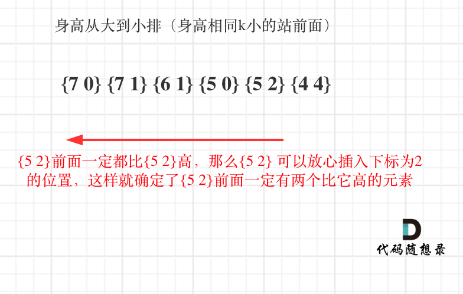

按照身高排序之后，优先按身高高的people的k来插入，后序插入节点也不会影响前面已经插入的节点，最终按照k的规则完成了队列。

所以在按照身高从大到小排序后：

**局部最优：优先按身高高的people的k来插入。插入操作过后的people满足队列属性** **全局最优：最后都做完插入操作，整个队列满足题目队列属性**局部最优可推出全局最优，找不出反例，那就试试贪心。

一些同学可能也会疑惑，你怎么知道局部最优就可以推出全局最优呢？ 有数学证明么？

在贪心系列开篇词[关于贪心算法，你该了解这些！](https://programmercarl.com/%E8%B4%AA%E5%BF%83%E7%AE%97%E6%B3%95%E7%90%86%E8%AE%BA%E5%9F%BA%E7%A1%80.html)中，我已经讲过了这个问题了。

刷题或者面试的时候，手动模拟一下感觉可以局部最优推出整体最优，而且想不到反例，那么就试一试贪心，至于严格的数学证明，就不在讨论范围内了。

如果没有读过[关于贪心算法，你该了解这些！](https://programmercarl.com/%E8%B4%AA%E5%BF%83%E7%AE%97%E6%B3%95%E7%90%86%E8%AE%BA%E5%9F%BA%E7%A1%80.html)的同学建议读一下，相信对贪心就有初步的了解了。

回归本题，整个插入过程如下：

排序完的people：`[[7,0], [7,1], [6,1], [5,0], [5,2]`，`[4,4]]`

插入的过程：

- 插入`[7,0]`：`[[7,0]]`
- 插入`[7,1]`：`[[7,0],[7,1]]`
- 插入`[6,1]`：`[[7,0],[6,1],[7,1]]`
- 插入`[5,0]`：`[[5,0],[7,0],[6,1],[7,1]]`
- 插入`[5,2]`：`[[5,0],[7,0],[5,2],[6,1],[7,1]]`
- 插入`[4,4]`：`[[5,0],[7,0],[5,2],[6,1],[4,4],[7,1]]`

此时就按照题目的要求完成了重新排列。

`C++`代码如下：

```cpp
// 版本一
class Solution {
public:
    static bool cmp(const vector<int>& a, const vector<int>& b) {
        if (a[0] == b[0]) return a[1] < b[1];
        return a[0] > b[0];
    }
    vector<vector<int>> reconstructQueue(vector<vector<int>>& people) {
        sort (people.begin(), people.end(), cmp);
        vector<vector<int>> que;
        for (int i = 0; i < people.size(); i++) {
            int position = people[i][1];
            que.insert(que.begin() + position, people[i]);
        }
        return que;
    }
};
```

- 时间复杂度：`O(nlog n + n^2)`
- 空间复杂度：`O(n)`但使用vector是非常费时的，`C++`中vector（可以理解是一个动态数组，底层是普通数组实现的）如果插入元素大于预先普通数组大小，vector底部会有一个扩容的操作，即申请两倍于原先普通数组的大小，然后把数据拷贝到另一个更大的数组上。

所以使用vector（动态数组）来insert，是费时的，插入再拷贝的话，单纯一个插入的操作就是`O(n^2)`了，甚至可能拷贝好几次，就不止`O(n^2)`了。

改成链表之后，`C++`代码如下：

```cpp
// 版本二
class Solution {
public:
    // 身高从大到小排（身高相同k小的站前面）
    static bool cmp(const vector<int>& a, const vector<int>& b) {
        if (a[0] == b[0]) return a[1] < b[1];
        return a[0] > b[0];
    }
    vector<vector<int>> reconstructQueue(vector<vector<int>>& people) {
        sort (people.begin(), people.end(), cmp);
        list<vector<int>> que; // list底层是链表实现，插入效率比vector高的多
        for (int i = 0; i < people.size(); i++) {
            int position = people[i][1]; // 插入到下标为position的位置
            std::list<vector<int>>::iterator it = que.begin();
            while (position--) { // 寻找在插入位置
                it++;
            }
            que.insert(it, people[i]);
        }
        return vector<vector<int>>(que.begin(), que.end());
    }
};
```

- 时间复杂度：`O(nlog n + n^2)`
- 空间复杂度：`O(n)`

大家可以把两个版本的代码提交一下试试，就可以发现其差别了！

关于本题使用数组还是使用链表的性能差异，我在[贪心算法：根据身高重建队列（续集）](https://programmercarl.com/%E6%A0%B9%E6%8D%AE%E8%BA%AB%E9%AB%98%E9%87%8D%E5%BB%BA%E9%98%9F%E5%88%97%EF%BC%88vector%E5%8E%9F%E7%90%86%E8%AE%B2%E8%A7%A3%EF%BC%89.html)中详细讲解了一波

## 总结

关于出现两个维度一起考虑的情况，我们已经做过两道题目了，另一道就是[135. 分发糖果](https://programmercarl.com/0135.%E5%88%86%E5%8F%91%E7%B3%96%E6%9E%9C.html)。

**其技巧都是确定一边然后贪心另一边，两边一起考虑，就会顾此失彼**。

这道题目可以说比[135. 分发糖果](https://programmercarl.com/0135.%E5%88%86%E5%8F%91%E7%B3%96%E6%9E%9C.html)难不少，其贪心的策略也是比较巧妙。

最后我给出了两个版本的代码，可以明显看是使用`C++`中的list（底层链表实现）比vector（数组）效率高得多。

**对使用某一种语言容器的使用，特性的选择都会不同程度上影响效率**。

所以很多人都说写算法题用什么语言都可以，主要体现在算法思维上，其实我是同意的但也不同意。

对于看别人题解的同学，题解用什么语言其实影响不大，只要题解把所使用语言特性优化的点讲出来，大家都可以看懂，并使用自己语言的时候注意一下。

对于写题解的同学，刷题用什么语言影响就非常大，如果自己语言没有学好而强调算法和编程语言没关系，其实是会误伤别人的。

**这也是我为什么统一使用C++写题解的原因**

# 15. 本周小结！（贪心算法系列三）

对于贪心，大多数同学都会感觉，不就是常识嘛，这算啥算法，那么本周的题目就可以带大家初步领略一下贪心的巧妙，贪心算法往往妙的出其不意。

## 周一

在[贪心算法：加油站](https://programmercarl.com/0134.%E5%8A%A0%E6%B2%B9%E7%AB%99.html)中给出每一个加油站的汽油和开到这个加油站的消耗，问汽车能不能开一圈。

这道题目咋眼一看，感觉是一道模拟题，模拟一下汽车从每一个节点出发看看能不能开一圈，时间复杂度是`O(n^2)`。

即使用模拟这种情况，也挺考察代码技巧的。

**for循环适合模拟从头到尾的遍历，而while循环适合模拟环形遍历，对于本题的场景要善于使用while！**

如果代码功力不到位，就模拟这种情况，可能写的也会很费劲。

本题的贪心解法，我给出两种解法。

对于解法一，其实我并不认为这是贪心，因为没有找出局部最优，而是直接从全局最优的角度上思考问题，但思路很巧妙，值得学习一下。

对于解法二，贪心的局部最优：当前累加`rest[j]`的和curSum一旦小于0，起始位置至少要是j+1，因为从j开始一定不行。全局最优：找到可以跑一圈的起始位置。

这里是可以从局部最优推出全局最优的，想不出反例，那就试试贪心。

**解法二就体现出贪心的精髓，同时大家也会发现，虽然贪心是常识，有些常识并不容易，甚至很难！**

## 周二

在[贪心算法：分发糖果](https://programmercarl.com/0135.%E5%88%86%E5%8F%91%E7%B3%96%E6%9E%9C.html)中我们第一次接触了需要考虑两个维度的情况。

例如这道题，是先考虑左边呢，还是考虑右边呢？

**先考虑哪一边都可以！ 就别两边一起考虑，那样就把自己陷进去了**。

先贪心一边，局部最优：只要右边评分比左边大，右边的孩子就多一个糖果，全局最优：相邻的孩子中，评分高的右孩子获得比左边孩子更多的糖果如图：


接着在贪心另一边，左孩子大于右孩子，左孩子的糖果就要比右孩子多。

此时`candyVec[i]`（第i个小孩的糖果数量，左孩子）就有两个选择了，一个是`candyVec[i + 1] + 1`（从右孩子这个加1得到的糖果数量），一个是`candyVec[i]`（之前比较右孩子大于左孩子得到的糖果数量）。

那么第二次贪心的局部最优：取`candyVec[i + 1] + 1` 和 `candyVec[i]` 最大的糖果数量，保证第i个小孩的糖果数量即大于左边的也大于右边的。全局最优：相邻的孩子中，评分高的孩子获得更多的糖果。

局部最优可以推出全局最优。

如图：


## 周三

在[贪心算法：柠檬水找零](https://programmercarl.com/0860.%E6%9F%A0%E6%AA%AC%E6%B0%B4%E6%89%BE%E9%9B%B6.html)中我们模拟了买柠檬水找零的过程。

这道题目刚一看，可能会有点懵，这要怎么找零才能保证完整全部账单的找零呢？

**但仔细一琢磨就会发现，可供我们做判断的空间非常少！**

美元10只能给账单20找零，而美元5可以给账单10和账单20找零，美元5更万能！

局部最优：遇到账单20，优先消耗美元10，完成本次找零。全局最优：完成全部账单的找零。

局部最优可以推出全局最优。

所以把能遇到的情况分析一下，只要分析到具体情况了，一下子就豁然开朗了。

这道题目其实是一道简单题，但如果一开始就想从整体上寻找找零方案，就会把自己陷进去，各种情况一交叉，只会越想越复杂了。

## 周四

在[贪心算法：根据身高重建队列](https://programmercarl.com/0406.%E6%A0%B9%E6%8D%AE%E8%BA%AB%E9%AB%98%E9%87%8D%E5%BB%BA%E9%98%9F%E5%88%97.html)中，我们再一次遇到了需要考虑两个维度的情况。

之前我们已经做过一道类似的了就是[贪心算法：分发糖果](https://programmercarl.com/0135.%E5%88%86%E5%8F%91%E7%B3%96%E6%9E%9C.html)，但本题比分发糖果难不少！

[贪心算法：根据身高重建队列](https://programmercarl.com/0406.%E6%A0%B9%E6%8D%AE%E8%BA%AB%E9%AB%98%E9%87%8D%E5%BB%BA%E9%98%9F%E5%88%97.html)中依然是要确定一边，然后在考虑另一边，两边一起考虑一定会蒙圈。

那么本题先确定k还是先确定h呢，也就是究竟先按h排序呢，还先按照k排序呢？

这里其实很考察大家的思考过程，如果按照k来从小到大排序，排完之后，会发现k的排列并不符合条件，身高也不符合条件，两个维度哪一个都没确定下来。

**所以先从大到小按照h排个序，再来贪心k**。

此时局部最优：优先按身高高的people的k来插入。插入操作过后的people满足队列属性。全局最优：最后都做完插入操作，整个队列满足题目队列属性。

局部最优可以推出全局最优，找不出反例，那么就来贪心。

## 总结

「代码随想录」里已经讲了十一道贪心题目了，大家可以发现在每一道题目的讲解中，我都是把什么是局部最优，和什么是全局最优说清楚。

虽然有时候感觉贪心就是常识，但如果真正是常识性的题目，其实是模拟题，就不是贪心算法了！例如贪心算法：加油站中的贪心方法一，其实我就认为不是贪心算法，而是直接从全局最优的角度上来模拟，因为方法里没有体现局部最优的过程。

而且大家也会发现，贪心并没有想象中的那么简单，贪心往往妙的出其不意，触不及防！哈哈

# 16. 贪心算法：根据身高重建队列（续集）

在讲解[贪心算法：根据身高重建队列](https://programmercarl.com/0406.%E6%A0%B9%E6%8D%AE%E8%BA%AB%E9%AB%98%E9%87%8D%E5%BB%BA%E9%98%9F%E5%88%97.html)中，我们提到了使用vector（`C++`中的动态数组）来进行insert操作是费时的。

这里专门写一篇文章来详细说一说这个问题。

使用vector的代码如下：

```cpp
// 版本一，使用vector（动态数组）
class Solution {
public:
    static bool cmp(const vector<int> a, const vector<int> b) {
        if (a[0] == b[0]) return a[1] < b[1];
        return a[0] > b[0];
    }
    vector<vector<int>> reconstructQueue(vector<vector<int>>& people) {
        sort (people.begin(), people.end(), cmp);
        vector<vector<int>> que;
        for (int i = 0; i < people.size(); i++) {
            int position = people[i][1];
            que.insert(que.begin() + position, people[i]);
        }
        return que;
    }
};
```

耗时如下：


其直观上来看数组的insert操作是`O(n)`的，整体代码的时间复杂度是`O(n^2)`。

这么一分析好像和版本二链表实现的时间复杂度是一样的啊，为什么提交之后效率会差距这么大呢？

```cpp
// 版本二，使用list（链表）
class Solution {
public:
    // 身高从大到小排（身高相同k小的站前面）
    static bool cmp(const vector<int> a, const vector<int> b) {
        if (a[0] == b[0]) return a[1] < b[1];
        return a[0] > b[0];
    }
    vector<vector<int>> reconstructQueue(vector<vector<int>>& people) {
        sort (people.begin(), people.end(), cmp);
        list<vector<int>> que; // list底层是链表实现，插入效率比vector高的多
        for (int i = 0; i < people.size(); i++) {
            int position = people[i][1]; // 插入到下标为position的位置
            std::list<vector<int>>::iterator it = que.begin();
            while (position--) { // 寻找在插入位置
                it++;
            }
            que.insert(it, people[i]);
        }
        return vector<vector<int>>(que.begin(), que.end());
    }
};
```

耗时如下：


大家都知道对于普通数组，一旦定义了大小就不能改变，例如`int a[10];`，这个数组a至多只能放10个元素，改不了的。

对于动态数组，就是可以不用关心初始时候的大小，可以随意往里放数据，那么耗时的原因就在于动态数组的底层实现。

动态数组为什么可以不受初始大小的限制，可以随意push_back数据呢？

**首先vector的底层实现也是普通数组**。

vector的大小有两个维度一个是size一个是capicity，size就是我们平时用来遍历vector时候用的，例如：

```cpp
for (int i = 0; i < vec.size(); i++) {
}
```

而capicity是vector底层数组（就是普通数组）的大小，capicity可不一定就是size。

当insert数据的时候，如果已经大于capicity，capicity会成倍扩容，但对外暴漏的size其实仅仅是+1。

那么既然vector底层实现是普通数组，怎么扩容的？

就是重新申请一个二倍于原数组大小的数组，然后把数据都拷贝过去，并释放原数组内存。（对，就是这么原始粗暴的方法！）

举一个例子，如图：

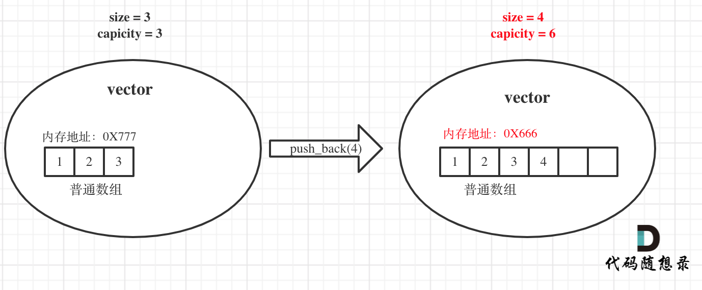

原vector中的size和capicity相同都是3，初始化为1 2 3，此时要push_back一个元素4。

那么底层其实就要申请一个大小为6的普通数组，并且把原元素拷贝过去，释放原数组内存，**注意图中底层数组的** **内存起始地址已经变了**。

**同时也注意此时capicity和size的变化，关键的地方我都标红了**。

而在[贪心算法：根据身高重建队列](https://programmercarl.com/0406.%E6%A0%B9%E6%8D%AE%E8%BA%AB%E9%AB%98%E9%87%8D%E5%BB%BA%E9%98%9F%E5%88%97.html)中，我们使用vector来做insert的操作，此时大家可会发现，**虽然表面上复杂度** **是O(n^2)，但是其底层都不知道额外做了多少次全量拷贝了，所以算上vector的底层拷贝，整体时间复杂度可以** **认为是O(n^2 + t × n)级别的，t是底层拷贝的次数**。

那么是不是可以直接确定好vector的大小，不让它在动态扩容了，例如在[贪心算法：根据身高重建队列](https://programmercarl.com/0406.%E6%A0%B9%E6%8D%AE%E8%BA%AB%E9%AB%98%E9%87%8D%E5%BB%BA%E9%98%9F%E5%88%97.html)中已经给出了有people.size这么多的人，可以定义好一个固定大小的vector，这样我们就可以控制vector，不让它底层动态扩容。

这种方法需要自己模拟插入的操作，不仅没有直接调用insert接口那么方便，需要手动模拟插入操作，而且效率也不高！

手动模拟的过程其实不是很简单的，需要很多细节，我粗略写了一个版本，如下：

```cpp
// 版本三
// 使用vector，但不让它动态扩容
class Solution {
public:
    static bool cmp(const vector<int> a, const vector<int> b) {
        if (a[0] == b[0]) return a[1] < b[1];
        return a[0] > b[0];
    }
    vector<vector<int>> reconstructQueue(vector<vector<int>>& people) {
        sort (people.begin(), people.end(), cmp);
        vector<vector<int>> que(people.size(), vector<int>(2, -1));
        for (int i = 0; i < people.size(); i++) {
            int position = people[i][1];
            if (position == que.size() - 1) que[position] = people[i];
            else { // 将插入位置后面的元素整体向后移
                for (int j = que.size() - 2; j >= position; j--) que[j + 1] = que[j];
                que[position] = people[i];
            }
        }
        return que;
    }
};
```

耗时如下：


这份代码就是不让vector动态扩容，全程我们自己模拟insert的操作，大家也可以直观的看出是一个`O(n^2)`的方法了。

但这份代码在leetcode上统计的耗时甚至比版本一的还高，我们都不让它动态扩容了，为什么耗时更高了呢？

一方面是leetcode的耗时统计本来就不太准，忽高忽低的，只能测个大概。

另一方面：可能是就算避免的vector的底层扩容，但这个固定大小的数组，每次向后移动元素赋值的次数比方法一中移动赋值的次数要多很多。

因为方法一中一开始数组是很小的，插入操作，向后移动元素次数比较少，即使有偶尔的扩容操作。而方法三每次都是按照最大数组规模向后移动元素的。

所以对于两种使用数组的方法一和方法三，也不好确定谁优，但一定都没有使用方法二链表的效率高！

一波分析之后，对于[贪心算法：根据身高重建队列](https://programmercarl.com/0406.%E6%A0%B9%E6%8D%AE%E8%BA%AB%E9%AB%98%E9%87%8D%E5%BB%BA%E9%98%9F%E5%88%97.html) ，大家就安心使用链表吧！别折腾了，哈哈，相当于我替大家折腾了一下。

## 总结

大家应该发现了，编程语言中一个普通容器的insert，delete的使用，都可能对写出来的算法的有很大影响！

如果抛开语言谈算法，除非从来不用代码写算法纯分析，**否则的话，语言功底不到位O(n)的算法可以写出O(n^2)** **的性能**，哈哈。

相信在这里学习算法的录友们，都是想在软件行业长远发展的，都是要从事编程的工作，那么一定要深耕好一门编程语言，这个非常重要！

# 17. 用最少数量的箭引爆气球

[力扣题目链接](https://leetcode.cn/problems/minimum-number-of-arrows-to-burst-balloons/)

在二维空间中有许多球形的气球。对于每个气球，提供的输入是水平方向上，气球直径的开始和结束坐标。由于它是水平的，所以纵坐标并不重要，因此只要知道开始和结束的横坐标就足够了。开始坐标总是小于结束坐标。

一支弓箭可以沿着 x 轴从不同点完全垂直地射出。在坐标 x 处射出一支箭，若有一个气球的直径的开始和结束坐标为 xstart，xend， 且满足  xstart ≤ x ≤ xend，则该气球会被引爆。可以射出的弓箭的数量没有限制。 弓箭一旦被射出之后，可以无限地前进。我们想找到使得所有气球全部被引爆，所需的弓箭的最小数量。

给你一个数组 points ，其中 `points [i] = [xstart,xend]` ，返回引爆所有气球所必须射出的最小弓箭数。

示例 1：

- 输入：`points = [[10,16],[2,8],[1,6],[7,12]]`
- 输出：2
- 解释：对于该样例，`x = 6` 可以射爆 `[2,8],[1,6]` 两个气球，以及 `x = 11` 射爆另外两个气球

示例 2：

- 输入：`points = [[1,2],[3,4],[5,6],[7,8]]`
- 输出：4

示例 3：

- 输入：`points = [[1,2],[2,3],[3,4],[4,5]]`
- 输出：2

示例 4：

- 输入：`points = [[1,2]]`
- 输出：1

示例 5：

- 输入：`points = [[2,3],[2,3]]`
- 输出：1

提示：

- `0 <= points.length <= 10^4`
- `points[i].length == 2`
- `-2^31 <= xstart < xend <= 2^31 - 1`

## 算法公开课

[**《代码随想录》算法视频公开课**](https://programmercarl.com/other/gongkaike.html)**：**[**贪心算法，判断重叠区间问题 | LeetCode：452.用最少数量的箭引爆气球**](https://www.bilibili.com/video/BV1SA41167xe)**，相** **信结合视频在看本篇题解，更有助于大家对本题的理解**。

## 思路

如何使用最少的弓箭呢？

直觉上来看，貌似只射重叠最多的气球，用的弓箭一定最少，那么有没有当前重叠了三个气球，我射两个，留下一个和后面的一起射这样弓箭用的更少的情况呢？

尝试一下举反例，发现没有这种情况。

那么就试一试贪心吧！局部最优：当气球出现重叠，一起射，所用弓箭最少。全局最优：把所有气球射爆所用弓箭最少。

**算法确定下来了，那么如何模拟气球射爆的过程呢？是在数组中移除元素还是做标记呢？**

如果真实的模拟射气球的过程，应该射一个，气球数组就remove一个元素，这样最直观，毕竟气球被射了。

但仔细思考一下就发现：如果把气球排序之后，从前到后遍历气球，被射过的气球仅仅跳过就行了，没有必要让气球数组remove气球，只要记录一下箭的数量就可以了。

以上为思考过程，已经确定下来使用贪心了，那么开始解题。

**为了让气球尽可能的重叠，需要对数组进行排序**。

那么按照气球起始位置排序，还是按照气球终止位置排序呢？

其实都可以！只不过对应的遍历顺序不同，我就按照气球的起始位置排序了。

既然按照起始位置排序，那么就从前向后遍历气球数组，靠左尽可能让气球重复。

从前向后遍历遇到重叠的气球了怎么办？

**如果气球重叠了，重叠气球中右边边界的最小值 之前的区间一定需要一个弓箭**。

以题目示例： `[[10,16],[2,8],[1,6],[7,12]]`为例，如图：（方便起见，已经排序）

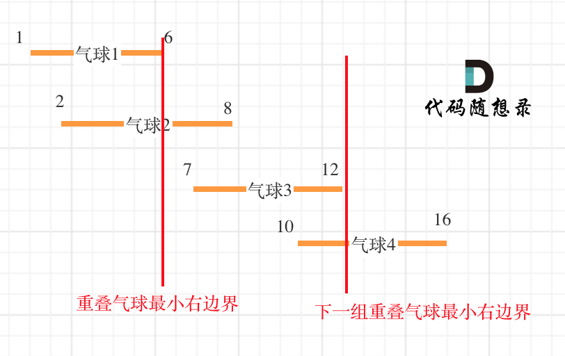

可以看出首先第一组重叠气球，一定是需要一个箭，气球3，的左边界大于了 第一组重叠气球的最小右边界，所以再需要一支箭来射气球3了。

`C++`代码如下：

```cpp
class Solution {
private:
    static bool cmp(const vector<int>& a, const vector<int>& b) {
        return a[0] < b[0];
    }
public:
    int findMinArrowShots(vector<vector<int>>& points) {
        if (points.size() == 0) return 0;
        sort(points.begin(), points.end(), cmp);
        int result = 1; // points 不为空至少需要一支箭
        for (int i = 1; i < points.size(); i++) {
            if (points[i][0] > points[i - 1][1]) {  // 气球i和气球i-1不挨着，注意这里不是>=
                result++; // 需要一支箭
            }
            else {  // 气球i和气球i-1挨着
                points[i][1] = min(points[i - 1][1], points[i][1]); // 更新重叠气球最小右边
界
            }
        }
        return result;
    }
};
```

- 时间复杂度：`O(nlog n)`，因为有一个快排
- 空间复杂度：`O(1)`，有一个快排，最差情况`(`倒序`)`时，需要n次递归调用。因此确实需要`O(n)`的栈空间

可以看出代码并不复杂。

## 注意事项

注意题目中说的是：满足  xstart ≤ x ≤ xend，则该气球会被引爆。那么说明两个气球挨在一起不重叠也可以一起射爆，

```text
所以代码中 if (points[i][0] > points[i - 1][1])  不能是>=
```

## 总结

这道题目贪心的思路很简单也很直接，就是重复的一起射了，但本题我认为是有难度的。

就算思路都想好了，模拟射气球的过程，很多同学真的要去模拟了，实时把气球从数组中移走，这么写的话就复杂了。

而且寻找重复的气球，寻找重叠气球最小右边界，其实都有代码技巧。

贪心题目有时候就是这样，看起来很简单，思路很直接，但是一写代码就感觉贼复杂无从下手。

这里其实是需要代码功底的，那代码功底怎么练？

**多看多写多总结！**

# 18. 无重叠区间

[力扣题目链接](https://leetcode.cn/problems/non-overlapping-intervals/)

给定一个区间的集合，找到需要移除区间的最小数量，使剩余区间互不重叠。

注意:可以认为区间的终点总是大于它的起点。区间 `[1,2]` 和 `[2,3]` 的边界相互“接触”，但没有相互重叠。

示例 1:

- 输入`: [ [1,2], [2,3], [3,4], [1,3] ]`
- 输出: 1
- 解释: 移除 `[1,3]` 后，剩下的区间没有重叠。

示例 2:

- 输入`: [ [1,2], [1,2], [1,2] ]`
- 输出: 2
- 解释: 你需要移除两个 `[1,2]` 来使剩下的区间没有重叠。

示例 3:

- 输入`: [ [1,2], [2,3] ]`
- 输出: 0
- 解释: 你不需要移除任何区间，因为它们已经是无重叠的了。

## 算法公开课

[**《代码随想录》算法视频公开课**](https://programmercarl.com/other/gongkaike.html)**：**[**贪心算法，依然是判断重叠区间 | LeetCode：435.无重叠区间**](https://www.bilibili.com/video/BV1A14y1c7E1)**，相信结合视频** **在看本篇题解，更有助于大家对本题的理解**。

## 思路

**相信很多同学看到这道题目都冥冥之中感觉要排序，但是究竟是按照右边界排序，还是按照左边界排序呢？**

其实都可以。主要就是为了让区间尽可能的重叠。 

**我来按照右边界排序，从左向右记录非交叉区间的个数。最后用区间总数减去非交叉区间的个数就是需要移除的区** **间个数了**。

此时问题就是要求非交叉区间的最大个数。

这里记录非交叉区间的个数还是有技巧的，如图：

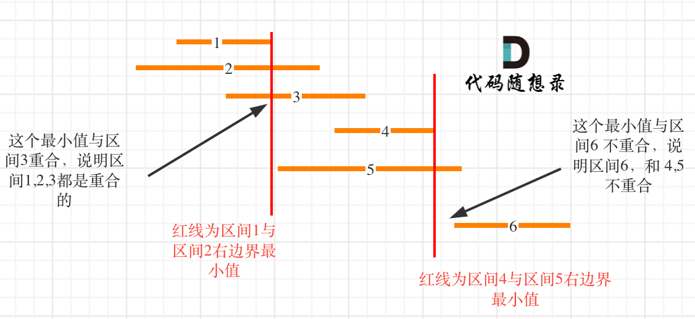

区间，1，2，3，4，5，6都按照右边界排好序。

当确定区间 1 和 区间2 重叠后，如何确定是否与 区间3 也重贴呢？ 

就是取 区间1 和 区间2 右边界的最小值，因为这个最小值之前的部分一定是 区间1 和区间2 的重合部分，如果这个最小值也触达到区间3，那么说明 区间 1，2，3都是重合的。 

接下来就是找大于区间1结束位置的区间，是从区间4开始。**那有同学问了为什么不从区间5开始？别忘了已经是按** **照右边界排序的了**。

区间4结束之后，再找到区间6，所以一共记录非交叉区间的个数是三个。

总共区间个数为6，减去非交叉区间的个数3。移除区间的最小数量就是3。

`C++`代码如下：

```cpp
class Solution {
public:
    // 按照区间右边界排序
    static bool cmp (const vector<int>& a, const vector<int>& b) {
        return a[1] < b[1];
    }
    int eraseOverlapIntervals(vector<vector<int>>& intervals) {
        if (intervals.size() == 0) return 0;
        sort(intervals.begin(), intervals.end(), cmp);
        int count = 1; // 记录非交叉区间的个数
        int end = intervals[0][1]; // 记录区间分割点
        for (int i = 1; i < intervals.size(); i++) {
            if (end <= intervals[i][0]) {
                end = intervals[i][1];
                count++;
            }
        }
        return intervals.size() - count;
    }
};
```

- 时间复杂度：`O(nlog n)` ，有一个快排
- 空间复杂度：`O(n)`，有一个快排，最差情况`(`倒序`)`时，需要n次递归调用。因此确实需要`O(n)`的栈空间

大家此时会发现如此复杂的一个问题，代码实现却这么简单！

## 补充

### 补充（1）

左边界排序可不可以呢？ 

也是可以的，只不过 左边界排序我们就是直接求 重叠的区间，count为记录重叠区间数。

```cpp
class Solution {
public:
    static bool cmp (const vector<int>& a, const vector<int>& b) {
        return a[0] < b[0]; // 改为左边界排序
    }
    int eraseOverlapIntervals(vector<vector<int>>& intervals) {
        if (intervals.size() == 0) return 0;
        sort(intervals.begin(), intervals.end(), cmp);
        int count = 0; // 注意这里从0开始，因为是记录重叠区间
        int end = intervals[0][1]; // 记录区间分割点
        for (int i = 1; i < intervals.size(); i++) {
            if (intervals[i][0] >= end)  end = intervals[i][1]; // 无重叠的情况
            else { // 重叠情况
                end = min(end, intervals[i][1]);
                count++;
            }
        }
        return count;
    }
};
```

其实代码还可以精简一下， 用 `intervals[i][1]` 替代 end变量，只判断 重叠情况就好

```cpp
class Solution {
public:
    static bool cmp (const vector<int>& a, const vector<int>& b) {
        return a[0] < b[0]; // 改为左边界排序
    }
    int eraseOverlapIntervals(vector<vector<int>>& intervals) {
        if (intervals.size() == 0) return 0;
        sort(intervals.begin(), intervals.end(), cmp);
        int count = 0; // 注意这里从0开始，因为是记录重叠区间
        for (int i = 1; i < intervals.size(); i++) {
            if (intervals[i][0] < intervals[i - 1][1]) { //重叠情况
                intervals[i][1] = min(intervals[i - 1][1], intervals[i][1]);
                count++;
            }
        }
        return count;
    }
};
```

### 补充（2）

本题其实和[452.用最少数量的箭引爆气球](https://programmercarl.com/0452.%E7%94%A8%E6%9C%80%E5%B0%91%E6%95%B0%E9%87%8F%E7%9A%84%E7%AE%AD%E5%BC%95%E7%88%86%E6%B0%94%E7%90%83.html)非常像，弓箭的数量就相当于是非交叉区间的数量，只要把弓箭那道题目代码里射爆气球的判断条件加个等号（认为`[0`，`1][1`，`2]`不是相邻区间），然后用总区间数减去弓箭数量 就是要移除的区间数量了。

把[452.用最少数量的箭引爆气球](https://programmercarl.com/0452.%E7%94%A8%E6%9C%80%E5%B0%91%E6%95%B0%E9%87%8F%E7%9A%84%E7%AE%AD%E5%BC%95%E7%88%86%E6%B0%94%E7%90%83.html)代码稍做修改，就可以AC本题。

```cpp
class Solution {
public:
    // 按照区间右边界排序
    static bool cmp (const vector<int>& a, const vector<int>& b) {
        return a[1] < b[1]; // 右边界排序
    }
    int eraseOverlapIntervals(vector<vector<int>>& intervals) {
        if (intervals.size() == 0) return 0;
        sort(intervals.begin(), intervals.end(), cmp);
        int result = 1; // points 不为空至少需要一支箭
        for (int i = 1; i < intervals.size(); i++) {
            if (intervals[i][0] >= intervals[i - 1][1]) {
                result++; // 需要一支箭
            }
            else {  // 气球i和气球i-1挨着
                intervals[i][1] = min(intervals[i - 1][1], intervals[i][1]); // 更新重叠
气球最小右边界
            }
        }
        return intervals.size() - result;
    }
};
```

这里按照 左边界排序，或者按照右边界排序，都可以AC，原理是一样的。

```cpp
class Solution {
public:
    // 按照区间左边界排序
    static bool cmp (const vector<int>& a, const vector<int>& b) {
        return a[0] < b[0]; // 左边界排序
    }
    int eraseOverlapIntervals(vector<vector<int>>& intervals) {
        if (intervals.size() == 0) return 0;
        sort(intervals.begin(), intervals.end(), cmp);
        int result = 1; // points 不为空至少需要一支箭
        for (int i = 1; i < intervals.size(); i++) {
            if (intervals[i][0] >= intervals[i - 1][1]) {
                result++; // 需要一支箭
            }
            else {  // 气球i和气球i-1挨着
                intervals[i][1] = min(intervals[i - 1][1], intervals[i][1]); // 更新重叠
气球最小右边界
            }
        }
        return intervals.size() - result;
    }
};
```

# 19.划分字母区间

[力扣题目链接](https://leetcode.cn/problems/partition-labels/)

字符串 S 由小写字母组成。我们要把这个字符串划分为尽可能多的片段，同一字母最多出现在一个片段中。返回一个表示每个字符串片段的长度的列表。

示例：

- 输入：`S = "ababcbacadefegdehijhklij"`
- 输出：`[9,7,8]`  
解释：划分结果为 "ababcbaca", "defegde", "hijhklij"。每个字母最多出现在一个片段中。像 "ababcbacadefegde", "hijhklij" 的划分是错误的，因为划分的片段数较少。

提示：

- S的长度在`[1, 500]`之间。
- S只包含小写字母 'a' 到 'z' 。

## 算法公开课

[**《代码随想录》算法视频公开课**](https://programmercarl.com/other/gongkaike.html)**：**[**贪心算法，寻找最远的出现位置！ LeetCode：763.划分字母区间**](https://www.bilibili.com/video/BV18G4y1K7d5)**，相信结合视** **频在看本篇题解，更有助于大家对本题的理解**。

## 思路

一想到分割字符串就想到了回溯，但本题其实不用回溯去暴力搜索。

题目要求同一字母最多出现在一个片段中，那么如何把同一个字母的都圈在同一个区间里呢？

如果没有接触过这种题目的话，还挺有难度的。

在遍历的过程中相当于是要找每一个字母的边界，**如果找到之前遍历过的所有字母的最远边界，说明这个边界就是** **分割点了**。此时前面出现过所有字母，最远也就到这个边界了。

可以分为如下两步：

- 统计每一个字符最后出现的位置
- 从头遍历字符，并更新字符的最远出现下标，如果找到字符最远出现位置下标和当前下标相等了，则找到了分割点

如图：

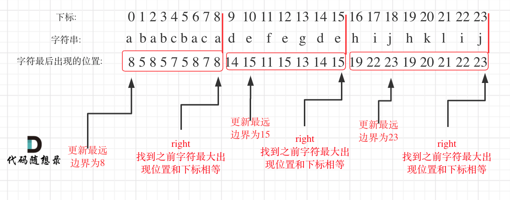

明白原理之后，代码并不复杂，如下：

```cpp
class Solution {
public:
    vector<int> partitionLabels(string S) {
        int hash[27] = {0}; // i为字符，hash[i]为字符出现的最后位置
        for (int i = 0; i < S.size(); i++) { // 统计每一个字符最后出现的位置
            hash[S[i] - 'a'] = i;
        }
        vector<int> result;
        int left = 0;
        int right = 0;
        for (int i = 0; i < S.size(); i++) {
            right = max(right, hash[S[i] - 'a']); // 找到字符出现的最远边界
            if (i == right) {
                result.push_back(right - left + 1);
                left = i + 1;
            }
        }
        return result;
    }
};
```

- 时间复杂度：`O(n)`
- 空间复杂度：`O(1)`，使用的hash数组是固定大小

## 总结

这道题目leetcode标记为贪心算法，说实话，我没有感受到贪心，找不出局部最优推出全局最优的过程。就是用最远出现距离模拟了圈字符的行为。

但这道题目的思路是很巧妙的，所以有必要介绍给大家做一做，感受一下。

## 补充

这里提供一种与[452.用最少数量的箭引爆气球](https://programmercarl.com/0452.%E7%94%A8%E6%9C%80%E5%B0%91%E6%95%B0%E9%87%8F%E7%9A%84%E7%AE%AD%E5%BC%95%E7%88%86%E6%B0%94%E7%90%83.html)、[435.无重叠区间](https://programmercarl.com/0435.%E6%97%A0%E9%87%8D%E5%8F%A0%E5%8C%BA%E9%97%B4.html)相同的思路。

统计字符串中所有字符的起始和结束位置，记录这些区间`(`实际上也就是[435.无重叠区间](https://programmercarl.com/0435.%E6%97%A0%E9%87%8D%E5%8F%A0%E5%8C%BA%E9%97%B4.html)题目里的输入`)`，**将区间按** **左边界从小到大排序，找到边界将区间划分成组，互不重叠。找到的边界就是答案。**

```cpp
class Solution {
public:
    static bool cmp(vector<int> &a, vector<int> &b) {
        return a[0] < b[0];
    }
    // 记录每个字母出现的区间
    vector<vector<int>> countLabels(string s) {
        vector<vector<int>> hash(26, vector<int>(2, INT_MIN));
        vector<vector<int>> hash_filter;
        for (int i = 0; i < s.size(); ++i) {
            if (hash[s[i] - 'a'][0] == INT_MIN) {
                hash[s[i] - 'a'][0] = i;
            }
            hash[s[i] - 'a'][1] = i;
        }
        // 去除字符串中未出现的字母所占用区间
        for (int i = 0; i < hash.size(); ++i) {
            if (hash[i][0] != INT_MIN) {
                hash_filter.push_back(hash[i]);
            }
        }
        return hash_filter;
    }
    vector<int> partitionLabels(string s) {
        vector<int> res;
        // 这一步得到的 hash 即为无重叠区间题意中的输入样例格式：区间列表
        // 只不过现在我们要求的是区间分割点
        vector<vector<int>> hash = countLabels(s);
        // 按照左边界从小到大排序
        sort(hash.begin(), hash.end(), cmp);
        // 记录最大右边界
        int rightBoard = hash[0][1];
        int leftBoard = 0;
        for (int i = 1; i < hash.size(); ++i) {
            // 由于字符串一定能分割，因此,
            // 一旦下一区间左边界大于当前右边界，即可认为出现分割点
            if (hash[i][0] > rightBoard) {
                res.push_back(rightBoard - leftBoard + 1);
                leftBoard = hash[i][0];
            }
            rightBoard = max(rightBoard, hash[i][1]);
        }
        // 最右端
        res.push_back(rightBoard - leftBoard + 1);
        return res;
    }
};
```

# 20. 合并区间

[力扣题目链接](https://leetcode.cn/problems/merge-intervals/)

给出一个区间的集合，请合并所有重叠的区间。

示例 1:

- 输入`: intervals = [[1,3],[2,6],[8,10],[15,18]]`
- 输出`: [[1,6],[8,10],[15,18]]`
- 解释: 区间 `[1,3]` 和 `[2,6]` 重叠, 将它们合并为 `[1,6].`

示例 2:

- 输入`: intervals = [[1,4],[4,5]]`
- 输出`: [[1,5]]`
- 解释: 区间 `[1,4]` 和 `[4,5]` 可被视为重叠区间。
- 注意：输入类型已于2019年4月15日更改。 请重置默认代码定义以获取新方法签名。

## 算法公开课

[**《代码随想录》算法视频公开课**](https://programmercarl.com/other/gongkaike.html)**：**[**贪心算法，合并区间有细节！LeetCode：56.合并区间**](https://www.bilibili.com/video/BV1wx4y157nD)**，相信结合视频在看本篇** **题解，更有助于大家对本题的理解**。

## 思路

本题的本质其实还是判断重叠区间问题。 

大家如果认真做题的话，话发现和我们刚刚讲过的[452. 用最少数量的箭引爆气球](https://programmercarl.com/0452.%E7%94%A8%E6%9C%80%E5%B0%91%E6%95%B0%E9%87%8F%E7%9A%84%E7%AE%AD%E5%BC%95%E7%88%86%E6%B0%94%E7%90%83.html) 和 [435. 无重叠区间](https://programmercarl.com/0435.%E6%97%A0%E9%87%8D%E5%8F%A0%E5%8C%BA%E9%97%B4.html) 都是一个套路。 

这几道题都是判断区间重叠，区别就是判断区间重叠后的逻辑，本题是判断区间重贴后要进行区间合并。 

所以一样的套路，先排序，让所有的相邻区间尽可能的重叠在一起，按左边界，或者右边界排序都可以，处理逻辑稍有不同。

```text
按照左边界从小到大排序之后，如果 intervals[i][0] <= intervals[i - 1][1] 即intervals[i]的左边界 <=
```

`intervals[i - 1]`的右边界，则一定有重叠。（本题相邻区间也算重贴，所以是`<=`）

这么说有点抽象，看图：（**注意图中区间都是按照左边界排序之后了**）

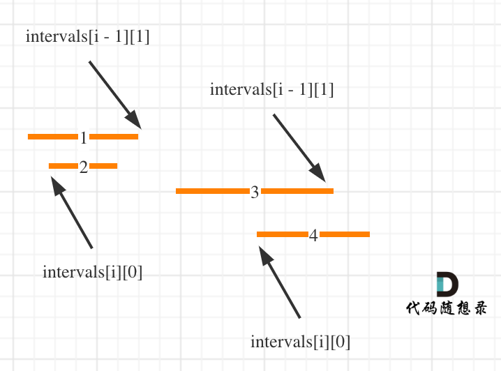

知道如何判断重复之后，剩下的就是合并了，如何去模拟合并区间呢？

其实就是用合并区间后左边界和右边界，作为一个新的区间，加入到result数组里就可以了。如果没有合并就把原区间加入到result数组。

`C++`代码如下：

```cpp
class Solution {
public:
    vector<vector<int>> merge(vector<vector<int>>& intervals) {
        vector<vector<int>> result;
        if (intervals.size() == 0) return result; // 区间集合为空直接返回
        // 排序的参数使用了lambda表达式
        sort(intervals.begin(), intervals.end(), [](const vector<int>& a, const
vector<int>& b){return a[0] < b[0];});
        // 第一个区间就可以放进结果集里，后面如果重叠，在result上直接合并
        result.push_back(intervals[0]);
        for (int i = 1; i < intervals.size(); i++) {
            if (result.back()[1] >= intervals[i][0]) { // 发现重叠区间
                // 合并区间，只更新右边界就好，因为result.back()的左边界一定是最小值，因为我们按照
左边界排序的
                result.back()[1] = max(result.back()[1], intervals[i][1]);
            } else {
                result.push_back(intervals[i]); // 区间不重叠
            }
        }
        return result;
    }
};
```

- 时间复杂度`: O(nlogn)`
- 空间复杂度`: O(logn)`，排序需要的空间开销

# 21. 本周小结！（贪心算法系列四）

## 周一

在[贪心算法：用最少数量的箭引爆气球](https://programmercarl.com/0452.%E7%94%A8%E6%9C%80%E5%B0%91%E6%95%B0%E9%87%8F%E7%9A%84%E7%AE%AD%E5%BC%95%E7%88%86%E6%B0%94%E7%90%83.html)中，我们开始讲解了重叠区间问题，用最少的弓箭射爆所有气球，其本质就是找到最大的重叠区间。

按照左边界进行排序后，如果气球重叠了，重叠气球中右边边界的最小值 之前的区间一定需要一个弓箭

如图：


模拟射气球的过程，很多同学真的要去模拟了，实时把气球从数组中移走，这么写的话就复杂了，从前向后遍历重复的只要跳过就可以的。

## 周二

在[贪心算法：无重叠区间](https://programmercarl.com/0435.%E6%97%A0%E9%87%8D%E5%8F%A0%E5%8C%BA%E9%97%B4.html)中要去掉最少的区间，来让所有区间没有重叠。

我来按照右边界排序，从左向右记录非交叉区间的个数。最后用区间总数减去非交叉区间的个数就是需要移除的区间个数了。

如图：

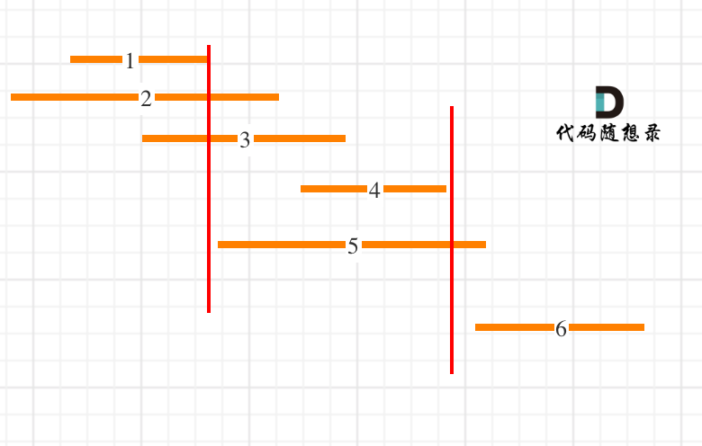

细心的同学就发现了，此题和 [贪心算法：用最少数量的箭引爆气球](https://programmercarl.com/0452.%E7%94%A8%E6%9C%80%E5%B0%91%E6%95%B0%E9%87%8F%E7%9A%84%E7%AE%AD%E5%BC%95%E7%88%86%E6%B0%94%E7%90%83.html)非常像。

弓箭的数量就相当于是非交叉区间的数量，只要把弓箭那道题目代码里射爆气球的判断条件加个等号（认为`[0`，`1]` `[1`，`2]`不是相邻区间），然后用总区间数减去弓箭数量 就是要移除的区间数量了。

把[贪心算法：用最少数量的箭引爆气球](https://programmercarl.com/0452.%E7%94%A8%E6%9C%80%E5%B0%91%E6%95%B0%E9%87%8F%E7%9A%84%E7%AE%AD%E5%BC%95%E7%88%86%E6%B0%94%E7%90%83.html)代码稍做修改，就可以AC本题。

修改后的`C++`代码如下：

```cpp
class Solution {
public:
    // 按照区间左边界从大到小排序
    static bool cmp (const vector<int>& a, const vector<int>& b) {
        return a[0] < b[0];
    }
    int eraseOverlapIntervals(vector<vector<int>>& intervals) {
        if (intervals.size() == 0) return 0;
        sort(intervals.begin(), intervals.end(), cmp);
        int result = 1;
        for (int i = 1; i < intervals.size(); i++) {
            if (intervals[i][0] >= intervals[i - 1][1]) { // 需要要把> 改成 >= 就可以了
                result++; // 需要一支箭
            }
            else {
                intervals[i][1] = min(intervals[i - 1][1], intervals[i][1]); // 更新重叠
气球最小右边界
            }
        }
        return intervals.size() - result;
    }
};
```

## 周三

[贪心算法：划分字母区间](https://programmercarl.com/0763.%E5%88%92%E5%88%86%E5%AD%97%E6%AF%8D%E5%8C%BA%E9%97%B4.html)中我们要把这个字符串划分为尽可能多的片段，同一字母最多出现在一个片段中。

这道题目leetcode上标的是贪心，其实我不认为是贪心，因为没感受到局部最优和全局最优的关系。

但不影响这是一道好题，思路很不错，**通过字符出现最远距离取并集的方法，把出现过的字符都圈到一个区间里**。

解题过程分如下两步：

- 统计每一个字符最后出现的位置
- 从头遍历字符，并更新字符的最远出现下标，如果找到字符最远出现位置下标和当前下标相等了，则找到了分割点

如图：


## 周四

[贪心算法：合并区间](https://programmercarl.com/0056.%E5%90%88%E5%B9%B6%E5%8C%BA%E9%97%B4.html)中要合并所有重叠的区间。

相信如果录友们前几天区间问题的题目认真练习了，今天题目就应该算简单一些了。

按照左边界排序，排序之后局部最优：每次合并都取最大的右边界，这样就可以合并更多的区间了，整体最优：合并所有重叠的区间。

具体操作：按照左边界从小到大排序之后，如果 `intervals[i][0] < intervals[i - 1][1]` 即`intervals[i]`左边界 `<` `intervals[i - 1]`右边界，则一定有重复，因为`intervals[i]`的左边界一定是大于等于`intervals[i - 1]`的左边界。

如图：


## 总结

本周的主题就是用贪心算法来解决区间问题，经过本周的学习，大家应该对区间的各种合并分割有一定程度的了解了。

其实很多区间的合并操作看起来都是常识，其实贪心算法有时候就是常识，哈哈，但也别小看了贪心算法。

在[贪心算法：合并区间](https://programmercarl.com/0056.%E5%90%88%E5%B9%B6%E5%8C%BA%E9%97%B4.html)中就说过，对于贪心算法，很多同学都是：「如果能凭常识直接做出来，就会感觉不到自己用了贪心, 一旦第一直觉想不出来, 可能就一直想不出来了」。

所以还是要多看多做多练习！

**「代码随想录」里总结的都是经典题目，大家跟着练就节省了不少选择题目的时间了**。

# 22.单调递增的数字

[力扣题目链接](https://leetcode.cn/problems/monotone-increasing-digits/)

给定一个非负整数 N，找出小于或等于 N 的最大的整数，同时这个整数需要满足其各个位数上的数字是单调递增。

（当且仅当每个相邻位数上的数字 x 和 y 满足 `x <= y` 时，我们称这个整数是单调递增的。）

示例 1:

- 输入`: N = 10`
- 输出: 9

示例 2:

- 输入`: N = 1234`
- 输出: 1234

示例 3:

- 输入`: N = 332`
- 输出: 299

说明: N 是在 `[0, 10^9]` 范围内的一个整数。

## 算法公开课

[**《代码随想录》算法视频公开课**](https://programmercarl.com/other/gongkaike.html)**：**[**贪心算法，思路不难想，但代码不好写！LeetCode:738.单调自增的数字**](https://www.bilibili.com/video/BV1Kv4y1x7tP)**，相信** **结合视频在看本篇题解，更有助于大家对本题的理解**。

## 思路

### 暴力解法

题意很简单，那么首先想的就是暴力解法了，来我替大家暴力一波，结果自然是超时！

代码如下：

```cpp
class Solution {
private:
    // 判断一个数字的各位上是否是递增
    bool checkNum(int num) {
        int max = 10;
        while (num) {
            int t = num % 10;
            if (max >= t) max = t;
            else return false;
            num = num / 10;
        }
        return true;
    }
public:
    int monotoneIncreasingDigits(int N) {
        for (int i = N; i > 0; i--) { // 从大到小遍历
            if (checkNum(i)) return i;
        }
        return 0;
    }
};
```

- 时间复杂度：`O(n × m) m`为n的数字长度
- 空间复杂度：`O(1)`

### 贪心算法

题目要求小于等于N的最大单调递增的整数，那么拿一个两位的数字来举例。

例如：98，一旦出现`strNum[i - 1] > strNum[i]`的情况（非单调递增），首先想让`strNum[i - 1]--`，然后`strNum[i]`给为9，这样这个整数就是89，即小于98的最大的单调递增整数。

这一点如果想清楚了，这道题就好办了。

此时是从前向后遍历还是从后向前遍历呢？

从前向后遍历的话，遇到`strNum[i - 1] > strNum[i]`的情况，让`strNum[i - 1]`减一，但此时如果`strNum[i - 1]`减一了，可能又小于`strNum[i - 2]`。

这么说有点抽象，举个例子，数字：332，从前向后遍历的话，那么就把变成了329，此时2又小于了第一位的3了，真正的结果应该是299。

那么从后向前遍历，就可以重复利用上次比较得出的结果了，从后向前遍历332的数值变化为：`332 -> 329 -> 299`

确定了遍历顺序之后，那么此时局部最优就可以推出全局，找不出反例，试试贪心。

`C++`代码如下：

```cpp
class Solution {
public:
    int monotoneIncreasingDigits(int N) {
        string strNum = to_string(N);
        // flag用来标记赋值9从哪里开始
        // 设置为这个默认值，为了防止第二个for循环在flag没有被赋值的情况下执行
        int flag = strNum.size();
        for (int i = strNum.size() - 1; i > 0; i--) {
            if (strNum[i - 1] > strNum[i] ) {
                flag = i;
                strNum[i - 1]--;
            }
        }
        for (int i = flag; i < strNum.size(); i++) {
            strNum[i] = '9';
        }
        return stoi(strNum);
    }
};
```

- 时间复杂度：`O(n)`，n 为数字长度

- 空间复杂度：`O(n)`，需要一个字符串，转化为字符串操作更方便

## 总结

本题只要想清楚个例，例如98，一旦出现`strNum[i - 1] > strNum[i]`的情况（非单调递增），首先想让`strNum[i -` `1]`减一，`strNum[i]`赋值9，这样这个整数就是89。就可以很自然想到对应的贪心解法了。

想到了贪心，还要考虑遍历顺序，只有从后向前遍历才能重复利用上次比较的结果。

最后代码实现的时候，也需要一些技巧，例如用一个flag来标记从哪里开始赋值9。

# 23.监控二叉树

[力扣题目链接](https://leetcode.cn/problems/binary-tree-cameras/)

给定一个二叉树，我们在树的节点上安装摄像头。

节点上的每个摄影头都可以监视其父对象、自身及其直接子对象。

计算监控树的所有节点所需的最小摄像头数量。

示例 1：


- 输入：`[0,0,null,0,0]`
- 输出：1
- 解释：如图所示，一台摄像头足以监控所有节点。

示例 2：

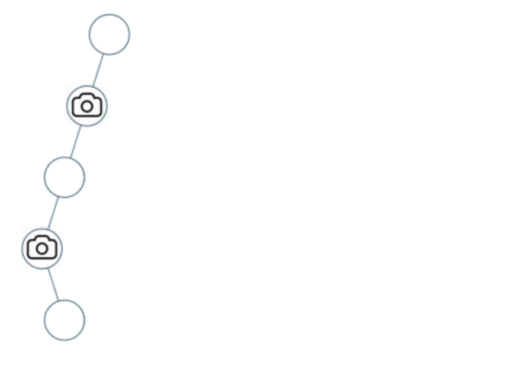

- 输入：`[0,0,null,0,null,0,null,null,0]`
- 输出：2
- 解释：需要至少两个摄像头来监视树的所有节点。 上图显示了摄像头放置的有效位置之一。

提示：

- 给定树的节点数的范围是 `[1, 1000]`。
- 每个节点的值都是 0。

## 算法公开课

[**《代码随想录》算法视频公开课**](https://programmercarl.com/other/gongkaike.html)**：**[**贪心算法，二叉树与贪心的结合，有点难...... LeetCode:968.监督二叉树**](https://www.bilibili.com/video/BV1SA411U75i)**，相信** **结合视频在看本篇题解，更有助于大家对本题的理解**。

## 思路

这道题目首先要想，如何放置，才能让摄像头最小的呢？

从题目中示例，其实可以得到启发，**我们发现题目示例中的摄像头都没有放在叶子节点上！**

这是很重要的一个线索，摄像头可以覆盖上中下三层，如果把摄像头放在叶子节点上，就浪费的一层的覆盖。

所以把摄像头放在叶子节点的父节点位置，才能充分利用摄像头的覆盖面积。

那么有同学可能问了，为什么不从头结点开始看起呢，为啥要从叶子节点看呢？

因为头结点放不放摄像头也就省下一个摄像头， 叶子节点放不放摄像头省下了的摄像头数量是指数阶别的。

**所以我们要从下往上看，局部最优：让叶子节点的父节点安摄像头，所用摄像头最少，整体最优：全部摄像头数量** **所用最少！**

局部最优推出全局最优，找不出反例，那么就按照贪心来！

此时，大体思路就是从低到上，先给叶子节点父节点放个摄像头，然后隔两个节点放一个摄像头，直至到二叉树头结点。

此时这道题目还有两个难点：

1. 二叉树的遍历2. 如何隔两个节点放一个摄像头

### 确定遍历顺序

在二叉树中如何从低向上推导呢？

可以使用后序遍历也就是左右中的顺序，这样就可以在回溯的过程中从下到上进行推导了。

后序遍历代码如下：

```cpp
int traversal(TreeNode* cur) {
    // 空节点，该节点有覆盖
    if (终止条件) return ;
    int left = traversal(cur->left);    // 左
    int right = traversal(cur->right);  // 右
    逻辑处理                            // 中
    return ;
}
```

**注意在以上代码中我们取了左孩子的返回值，右孩子的返回值，即left 和 right， 以后推导中间节点的状态**

### 如何隔两个节点放一个摄像头

此时需要状态转移的公式，大家不要和动态的状态转移公式混到一起，本题状态转移没有择优的过程，就是单纯的状态转移！

来看看这个状态应该如何转移，先来看看每个节点可能有几种状态：

有如下三种：

- 该节点无覆盖
- 本节点有摄像头
- 本节点有覆盖

我们分别有三个数字来表示：

- 0：该节点无覆盖
- 1：本节点有摄像头
- 2：本节点有覆盖

大家应该找不出第四个节点的状态了。

**一些同学可能会想有没有第四种状态：本节点无摄像头，其实无摄像头就是 无覆盖 或者 有覆盖的状态，所以一共** **还是三个状态。**

**因为在遍历树的过程中，就会遇到空节点，那么问题来了，空节点究竟是哪一种状态呢？ 空节点表示无覆盖？ 表** **示有摄像头？还是有覆盖呢？**

回归本质，为了让摄像头数量最少，我们要尽量让叶子节点的父节点安装摄像头，这样才能摄像头的数量最少。

那么空节点不能是无覆盖的状态，这样叶子节点就要放摄像头了，空节点也不能是有摄像头的状态，这样叶子节点的父节点就没有必要放摄像头了，而是可以把摄像头放在叶子节点的爷爷节点上。

**所以空节点的状态只能是有覆盖，这样就可以在叶子节点的父节点放摄像头了**

接下来就是递推关系。

那么递归的终止条件应该是遇到了空节点，此时应该返回2（有覆盖），原因上面已经解释过了。

代码如下：

```cpp
// 空节点，该节点有覆盖
if (cur == NULL) return 2;
```

递归的函数，以及终止条件已经确定了，再来看单层逻辑处理。

主要有如下四类情况：

- 情况1：左右节点都有覆盖

左孩子有覆盖，右孩子有覆盖，那么此时中间节点应该就是无覆盖的状态了。

如图：

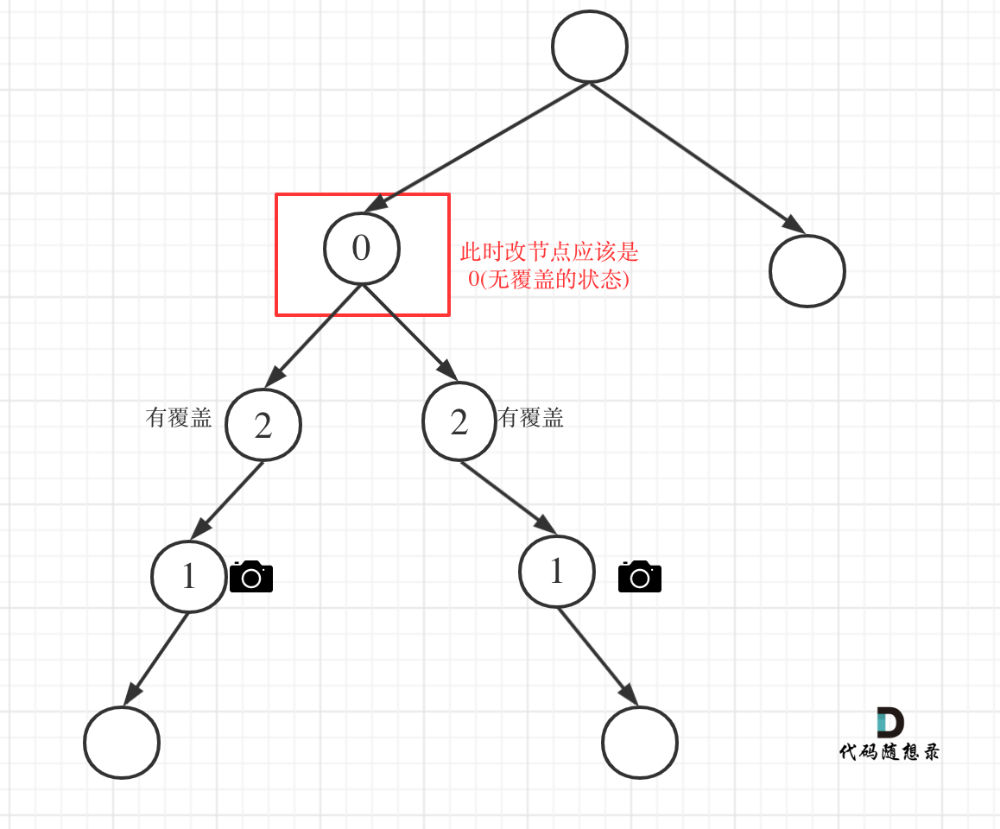

代码如下：

```cpp
// 左右节点都有覆盖
if (left == 2 && right == 2) return 0;
```

- 情况2：左右节点至少有一个无覆盖的情况

如果是以下情况，则中间节点（父节点）应该放摄像头：

- `left == 0 && right == 0` 左右节点无覆盖
- `left == 1 && right == 0` 左节点有摄像头，右节点无覆盖
- `left == 0 && right == 1` 左节点有无覆盖，右节点摄像头
- `left == 0 && right == 2` 左节点无覆盖，右节点覆盖
- `left == 2 && right == 0` 左节点覆盖，右节点无覆盖

这个不难理解，毕竟有一个孩子没有覆盖，父节点就应该放摄像头。

此时摄像头的数量要加一，并且return 1，代表中间节点放摄像头。

代码如下：

```cpp
if (left == 0 || right == 0) {
    result++;
    return 1;
}
```

- 情况3：左右节点至少有一个有摄像头

如果是以下情况，其实就是 左右孩子节点有一个有摄像头了，那么其父节点就应该是2（覆盖的状态）

- `left == 1 && right == 2` 左节点有摄像头，右节点有覆盖
- `left == 2 && right == 1` 左节点有覆盖，右节点有摄像头
- `left == 1 && right == 1` 左右节点都有摄像头

代码如下：

```cpp
if (left == 1 || right == 1) return 2;
```

**从这个代码中，可以看出，如果left == 1, right == 0 怎么办？其实这种条件在情况2中已经判断过了**，如图：

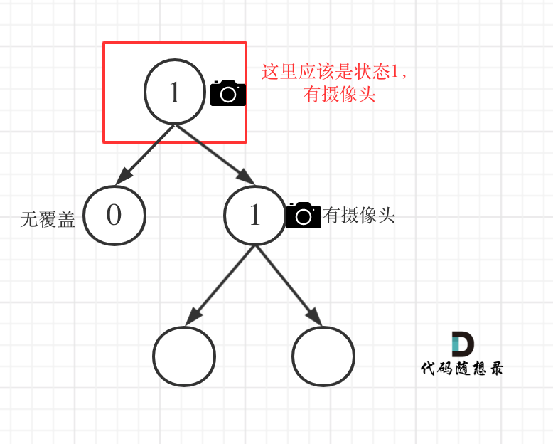

这种情况也是大多数同学容易迷惑的情况。

4. 情况4：头结点没有覆盖

以上都处理完了，递归结束之后，可能头结点 还有一个无覆盖的情况，如图：

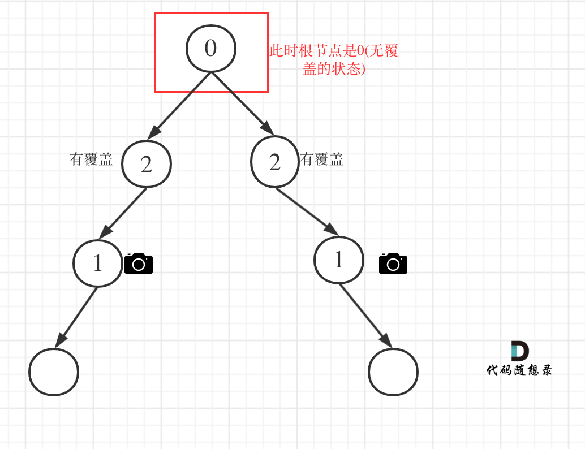

所以递归结束之后，还要判断根节点，如果没有覆盖，`result++`，代码如下：

```cpp
int minCameraCover(TreeNode* root) {
    result = 0;
    if (traversal(root) == 0) { // root 无覆盖
        result++;
    }
    return result;
}
```

以上四种情况我们分析完了，代码也差不多了，整体代码如下：

（**以下我的代码注释很详细，为了把情况说清楚，特别把每种情况列出来。**）

`C++`代码如下：

```cpp
// 版本一
class Solution {
private:
    int result;
    int traversal(TreeNode* cur) {
        // 空节点，该节点有覆盖
        if (cur == NULL) return 2;
        int left = traversal(cur->left);    // 左
        int right = traversal(cur->right);  // 右
        // 情况1
        // 左右节点都有覆盖
        if (left == 2 && right == 2) return 0;
        // 情况2
        // left == 0 && right == 0 左右节点无覆盖
        // left == 1 && right == 0 左节点有摄像头，右节点无覆盖
        // left == 0 && right == 1 左节点有无覆盖，右节点摄像头
        // left == 0 && right == 2 左节点无覆盖，右节点覆盖
        // left == 2 && right == 0 左节点覆盖，右节点无覆盖
        if (left == 0 || right == 0) {
            result++;
            return 1;
        }
        // 情况3
        // left == 1 && right == 2 左节点有摄像头，右节点有覆盖
        // left == 2 && right == 1 左节点有覆盖，右节点有摄像头
        // left == 1 && right == 1 左右节点都有摄像头
        // 其他情况前段代码均已覆盖
        if (left == 1 || right == 1) return 2;
        // 以上代码我没有使用else，主要是为了把各个分支条件展现出来，这样代码有助于读者理解
        // 这个 return -1 逻辑不会走到这里。
        return -1;
    }
public:
    int minCameraCover(TreeNode* root) {
        result = 0;
        // 情况4
        if (traversal(root) == 0) { // root 无覆盖
            result++;
        }
        return result;
    }
};
```

在以上代码的基础上，再进行精简，代码如下：

```cpp
// 版本二
class Solution {
private:
    int result;
    int traversal(TreeNode* cur) {
        if (cur == NULL) return 2;
        int left = traversal(cur->left);    // 左
        int right = traversal(cur->right);  // 右
        if (left == 2 && right == 2) return 0;
        else if (left == 0 || right == 0) {
            result++;
            return 1;
        } else return 2;
    }
public:
    int minCameraCover(TreeNode* root) {
        result = 0;
        if (traversal(root) == 0) { // root 无覆盖
            result++;
        }
        return result;
    }
};
```

- 时间复杂度`: O(n)`，需要遍历二叉树上的每个节点
- 空间复杂度`: O(n)`

大家可能会惊讶，居然可以这么简短，**其实就是在版本一的基础上，使用else把一些情况直接覆盖掉了**。

在网上关于这道题解可以搜到很多这种神级别的代码，但都没讲不清楚，如果直接看代码的话，指定越看越晕，**所** **以建议大家对着版本一的代码一步一步来，版本二中看不中用！**。

## 总结

本题的难点首先是要想到贪心的思路，然后就是遍历和状态推导。

在二叉树上进行状态推导，其实难度就上了一个台阶了，需要对二叉树的操作非常娴熟。

这道题目是名副其实的hard，大家感受感受。

# 24. 贪心算法总结篇

我刚刚开始讲解贪心系列的时候就说了，贪心系列并不打算严格的从简单到困难这么个顺序来讲解。

因为贪心的简单题可能往往过于简单甚至感觉不到贪心，如果我连续几天讲解简单的贪心，估计录友们一定会不耐烦了，会感觉贪心有啥好学的。

但贪心的难题又真的有点难，所以我是简单困难交错着讲的，这样大家就感觉难度适中，而且贪心也没有什么框架和套路，所以对刷题顺序要求没有那么高。

但在贪心系列，我发的题目难度会整体呈现一个阶梯状上升，细心的录友们应该有所体会。

在刚刚讲过的回溯系列中，大家可以发现我是严格按照框架难度顺序循序渐进讲解的，**和贪心又不一样，因为回溯** **法如果题目顺序没选好，刷题效果会非常差！**

同样回溯系列也不允许简单困难交替着来，因为前后题目都是有因果关系的，**相信跟着刷过回溯系列的录友们都会** **明白我的良苦用心，哈哈**。

**每个系列都有每个系列的特点，我都会根据特点有所调整，大家看我每天的推送的题目，都不是随便找一个到就推** **送的，都是先有整体规划，然后反复斟酌具体题目的结果**。

那么在贪心总结篇里，我按难易程度以及题目类型大体归个类。

贪心大总结正式开始：

## 贪心理论基础

在贪心系列开篇词[关于贪心算法，你该了解这些！](https://programmercarl.com/%E8%B4%AA%E5%BF%83%E7%AE%97%E6%B3%95%E7%90%86%E8%AE%BA%E5%9F%BA%E7%A1%80.html)中，我们就讲解了大家对贪心的普遍疑惑。

1. 贪心很简单，就是常识？

跟着一起刷题的录友们就会发现，贪心思路往往很巧妙，并不简单。

2. 贪心有没有固定的套路？

贪心无套路，也没有框架之类的，需要多看多练培养感觉才能想到贪心的思路。

3. 究竟什么题目是贪心呢？

Carl个人认为：如果找出局部最优并可以推出全局最优，就是贪心，如果局部最优都没找出来，就不是贪心，可能是单纯的模拟。（并不是权威解读，一家之辞哈）

但我们也不用过于强调什么题目是贪心，什么不是贪心，那就太学术了，毕竟学会解题就行了。

4. 如何知道局部最优推出全局最优，有数学证明么？

在做贪心题的过程中，如果再来一个数据证明，其实没有必要，手动模拟一下，如果找不出反例，就试试贪心。面试中，代码写出来跑过测试用例即可，或者自己能自圆其说理由就行了

就像是 要用一下 `1 + 1 = 2`，没有必要再证明一下 1 + 1 究竟为什么等于 2。（例子极端了点，但是这个道理）

相信大家读完[关于贪心算法，你该了解这些！](https://programmercarl.com/%E8%B4%AA%E5%BF%83%E7%AE%97%E6%B3%95%E7%90%86%E8%AE%BA%E5%9F%BA%E7%A1%80.html)，就对贪心有了一个基本的认识了。

## 贪心简单题

以下三道题目就是简单题，大家会发现贪心感觉就是常识。是的，如下三道题目，就是靠常识，但我都具体分析了局部最优是什么，全局最优是什么，贪心也要贪的有理有据！

- [贪心算法：分发饼干](https://programmercarl.com/0455.%E5%88%86%E5%8F%91%E9%A5%BC%E5%B9%B2.html)
- [贪心算法：K次取反后最大化的数组和](https://programmercarl.com/1005.K%E6%AC%A1%E5%8F%96%E5%8F%8D%E5%90%8E%E6%9C%80%E5%A4%A7%E5%8C%96%E7%9A%84%E6%95%B0%E7%BB%84%E5%92%8C.html)

- [贪心算法：柠檬水找零](https://programmercarl.com/0860.%E6%9F%A0%E6%AA%AC%E6%B0%B4%E6%89%BE%E9%9B%B6.html)

## 贪心中等题

贪心中等题，靠常识可能就有点想不出来了。开始初现贪心算法的难度与巧妙之处。

- [贪心算法：摆动序列](https://programmercarl.com/0376.%E6%91%86%E5%8A%A8%E5%BA%8F%E5%88%97.html)
- [贪心算法：单调递增的数字](https://programmercarl.com/0738.%E5%8D%95%E8%B0%83%E9%80%92%E5%A2%9E%E7%9A%84%E6%95%B0%E5%AD%97.html)

### 贪心解决股票问题

大家都知道股票系列问题是动规的专长，其实用贪心也可以解决，而且还不止就这两道题目，但这两道比较典型，我就拿来单独说一说

- [贪心算法：买卖股票的最佳时机II](https://programmercarl.com/0122.%E4%B9%B0%E5%8D%96%E8%82%A1%E7%A5%A8%E7%9A%84%E6%9C%80%E4%BD%B3%E6%97%B6%E6%9C%BAII.html)
- [贪心算法：买卖股票的最佳时机含手续费](https://programmercarl.com/0714.%E4%B9%B0%E5%8D%96%E8%82%A1%E7%A5%A8%E7%9A%84%E6%9C%80%E4%BD%B3%E6%97%B6%E6%9C%BA%E5%90%AB%E6%89%8B%E7%BB%AD%E8%B4%B9.html) 本题使用贪心算法比较绕，建议后面学习动态规划章节的时候，理解动规就好 

### 两个维度权衡问题

在出现两个维度相互影响的情况时，两边一起考虑一定会顾此失彼，要先确定一个维度，再确定另一个一个维度。

- [贪心算法：分发糖果](https://programmercarl.com/0135.%E5%88%86%E5%8F%91%E7%B3%96%E6%9E%9C.html)
- [贪心算法：根据身高重建队列](https://programmercarl.com/0406.%E6%A0%B9%E6%8D%AE%E8%BA%AB%E9%AB%98%E9%87%8D%E5%BB%BA%E9%98%9F%E5%88%97.html)

在讲解本题的过程中，还强调了编程语言的重要性，模拟插队的时候，使用`C++`中的list（链表）替代了`vector(`动态数组`)`，效率会高很多。

所以在[贪心算法：根据身高重建队列（续集）](https://programmercarl.com/%E6%A0%B9%E6%8D%AE%E8%BA%AB%E9%AB%98%E9%87%8D%E5%BB%BA%E9%98%9F%E5%88%97%EF%BC%88vector%E5%8E%9F%E7%90%86%E8%AE%B2%E8%A7%A3%EF%BC%89.html)详细讲解了，为什么用list（链表）更快！

**大家也要掌握自己所用的编程语言，理解其内部实现机制，这样才能写出高效的算法！**

## 贪心难题

这里的题目如果没有接触过，其实是很难想到的，甚至接触过，也一时想不出来，所以题目不要做一遍，要多练！

### 贪心解决区间问题

关于区间问题，大家应该印象深刻，有一周我们专门讲解的区间问题，各种覆盖各种去重。

- [贪心算法：跳跃游戏](https://programmercarl.com/0055.%E8%B7%B3%E8%B7%83%E6%B8%B8%E6%88%8F.html)
- [贪心算法：跳跃游戏II](https://programmercarl.com/0045.%E8%B7%B3%E8%B7%83%E6%B8%B8%E6%88%8FII.html)
- [贪心算法：用最少数量的箭引爆气球](https://programmercarl.com/0452.%E7%94%A8%E6%9C%80%E5%B0%91%E6%95%B0%E9%87%8F%E7%9A%84%E7%AE%AD%E5%BC%95%E7%88%86%E6%B0%94%E7%90%83.html)
- [贪心算法：无重叠区间](https://programmercarl.com/0435.%E6%97%A0%E9%87%8D%E5%8F%A0%E5%8C%BA%E9%97%B4.html)
- [贪心算法：划分字母区间](https://programmercarl.com/0763.%E5%88%92%E5%88%86%E5%AD%97%E6%AF%8D%E5%8C%BA%E9%97%B4.html)
- [贪心算法：合并区间](https://programmercarl.com/0056.%E5%90%88%E5%B9%B6%E5%8C%BA%E9%97%B4.html)

### 其他难题

[贪心算法：最大子序和](https://programmercarl.com/0053.%E6%9C%80%E5%A4%A7%E5%AD%90%E5%BA%8F%E5%92%8C.html) 其实是动态规划的题目，但贪心性能更优，很多同学也是第一次发现贪心能比动规更优的题目。

[贪心算法：加油站](https://programmercarl.com/0134.%E5%8A%A0%E6%B2%B9%E7%AB%99.html)可能以为是一道模拟题，但就算模拟其实也不简单，需要把while用的很娴熟。但其实是可以使用贪心给时间复杂度降低一个数量级。

最后贪心系列压轴题目[贪心算法：我要监控二叉树！](https://programmercarl.com/0968.%E7%9B%91%E6%8E%A7%E4%BA%8C%E5%8F%89%E6%A0%91.html)，不仅贪心的思路不好想，而且需要对二叉树的操作特别娴熟，这就是典型的交叉类难题了。

## 贪心每周总结

周总结里会对每周的题目中大家的疑问、相关难点或者笔误之类的进行复盘和总结。

如果大家发现文章哪里有问题，那么在周总结里或者文章评论区一定进行了修正，保证不会因为我的笔误或者理解问题而误导大家，哈哈。

所以周总结一定要看！

- [本周小结！（贪心算法系列一）](https://programmercarl.com/%E5%91%A8%E6%80%BB%E7%BB%93/20201126%E8%B4%AA%E5%BF%83%E5%91%A8%E6%9C%AB%E6%80%BB%E7%BB%93.html)
- [本周小结！（贪心算法系列二）](https://programmercarl.com/%E5%91%A8%E6%80%BB%E7%BB%93/20201203%E8%B4%AA%E5%BF%83%E5%91%A8%E6%9C%AB%E6%80%BB%E7%BB%93.html)
- [本周小结！（贪心算法系列三）](https://programmercarl.com/%E5%91%A8%E6%80%BB%E7%BB%93/20201217%E8%B4%AA%E5%BF%83%E5%91%A8%E6%9C%AB%E6%80%BB%E7%BB%93.html)
- [本周小结！（贪心算法系列四）](https://programmercarl.com/%E5%91%A8%E6%80%BB%E7%BB%93/20201224%E8%B4%AA%E5%BF%83%E5%91%A8%E6%9C%AB%E6%80%BB%E7%BB%93.html)

## 总结

贪心专题汇聚为一张图： 

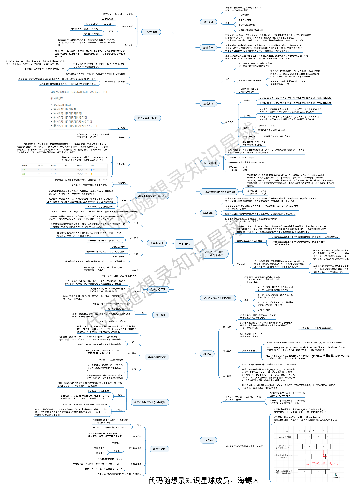

这个图是 [代码随想录知识星球](https://programmercarl.com/other/kstar.html) 成员：[海螺人](https://wx.zsxq.com/dweb2/index/footprint/844412858822412)所画，总结的非常好，分享给大家。

很多没有接触过贪心的同学都会感觉贪心有啥可学的，但只要跟着「代码随想录」坚持下来之后，就会发现，贪心是一种很重要的算法思维而且并不简单，贪心往往妙的出其不意，触不及防！

**回想一下我们刚刚开始讲解贪心的时候，大家会发现自己在坚持中进步了很多！**

这也是「代码随想录」的初衷，只要一路坚持下来，不仅基础扎实，而且进步也是飞速的。

**在这十八道贪心经典题目中，大家可以发现在每一道题目的讲解中，我都是把什么是局部最优，和什么是全局最优** **说清楚**。

这也是我认为判断这是一道贪心题目的依据，如果找不出局部最优，那可能就是一道模拟题。

不知不觉又一个系列结束了，同时也是2020年的结束。

**一个系列的结束，又是一个新系列的开始，我们将在明年第一个工作日正式开始动态规划，来不及解释了，录友们** **上车别掉队，我们又要开始新的征程！**
